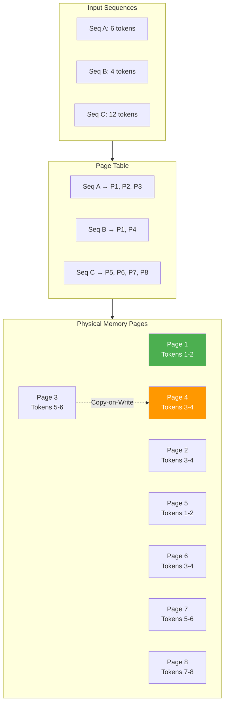
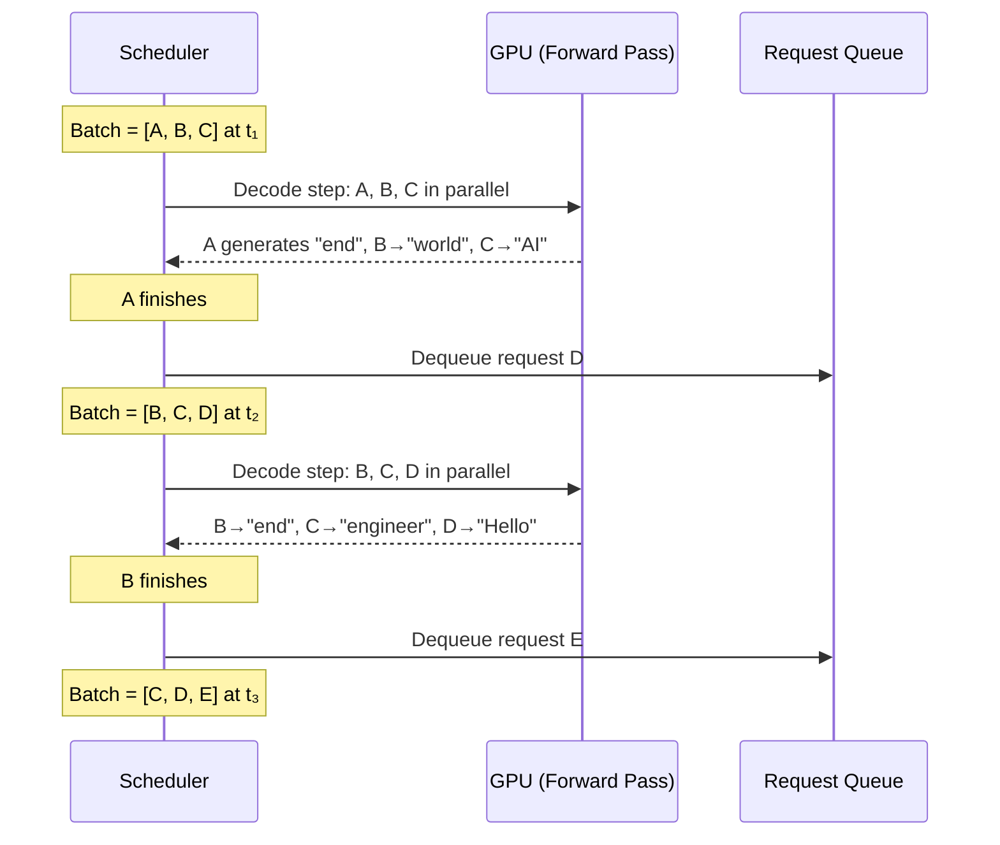
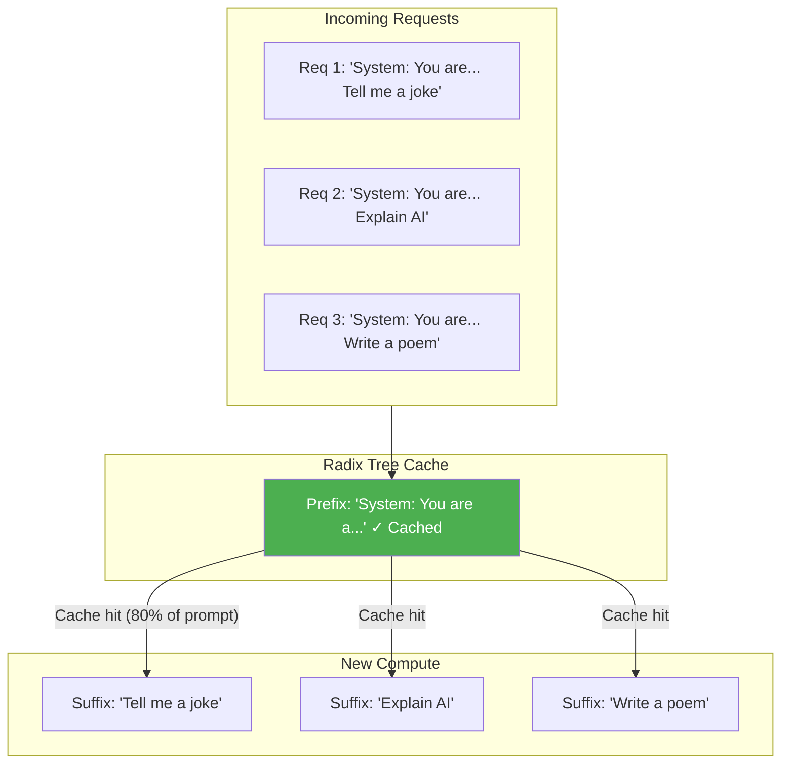
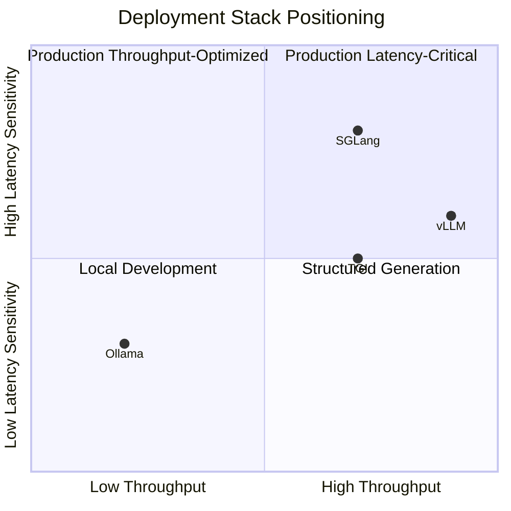

<!-- Clear Language: Keep sentences under 50 words -->
# 08 — Deployment Stack Comparison: vLLM vs SGLang vs Ollama vs TGI

## Learning Objectives

| LO | Description |
|----|-------------|
| LO1 | Compare the architecture of vLLM (PagedAttention), SGLang (RadixAttention), Ollama, and Hugging Face TGI |
| LO2 | Deploy production-grade model serving with vLLM using continuous batching and tensor parallelism |
| LO3 | Implement structured generation and constrained decoding with SGLang |
| LO4 | Run local inference with Ollama and manage custom models via Modelfiles |
| LO5 | Select the optimal deployment stack based on throughput, latency, memory, and feature requirements |

## Introduction

The model deployment landscape in 2026 offers four dominant open-source stacks: **vLLM**, **SGLang**, **Ollama**, and **Hugging Face TGI**. Each was built with different priorities — vLLM optimizes for maximum throughput in production, SGLang excels at structured generation and constrained decoding, Ollama prioritizes developer ergonomics for local experimentation, and TGI provides a battle-tested production path tightly integrated with the Hugging Face ecosystem.

Choosing the wrong stack leads to wasted GPU hours, unnecessary latency, or excessive engineering effort. This chapter provides a head-to-head comparison across architectural decisions, performance characteristics, API compatibility, and real-world deployment scenarios. You will learn to match each framework to its ideal use case and write client code that interacts with all four.

## Prerequisites

- Familiarity with transformer architecture and KV cache mechanics
- Basic understanding of GPU memory management and batching
- Experience running Docker containers and CLI tools
- Python 3.10+ installed locally or on a cloud VM

## Key Terminology

| Term | Definition |
|------|------------|
| **PagedAttention** | vLLM's memory management technique that stores KV cache in fixed-size pages, eliminating fragmentation and enabling 2-4x throughput gains |
| **RadixAttention** | SGLang's prefix-aware KV cache reuse that caches common prompt prefixes (system prompts, few-shot examples) across requests |
| **Continuous Batching** | Dynamically adding/removing sequences from a batch at each decoding step, maximizing GPU utilization |
| **Tensor Parallelism** | Splitting model parameters across multiple GPUs by sharding attention heads and feed-forward layers |
| **Constrained Decoding** | Enforcing output to follow a structured format (JSON, regex, grammar) during token generation |
| **KV Cache** | Key-Value cache stored during autoregressive decoding that avoids recomputing previous tokens |
| **Scheduler** | Component that manages request admission, preemption, and batching decisions |

## Theory

## Chapter at a Glance

| Section | Topic | Key Concept |
|---------|-------|-------------|
| 8.1 | vLLM Deep Dive | PagedAttention, continuous batching, tensor parallelism, OpenAI-compatible API |
| 8.2 | SGLang Architecture | RadixAttention, structured generation, constrained decoding, frontend optimization |
| 8.3 | Ollama for Local Deployment | Model management, Modelfiles, API, ecosystem, limitations |
| 8.4 | Hugging Face TGI | Text Generation Inference, optimized kernels, watermarking, quantization |
| 8.5 | Comparison Matrix | Throughput, latency, memory, setup, feature set, when to use each |

## 8.1 vLLM — Production-Grade Serving

vLLM is the most widely adopted open-source LLM serving framework in production as of 2026. Its core innovation — **PagedAttention** — reimagines how the KV cache is managed during inference.

### 8.1.1 PagedAttention — Memory Management Revolution

Traditional serving frameworks allocate the KV cache as contiguous blocks in GPU memory. This causes two problems:

1. **Internal fragmentation**: The maximum sequence length must be pre-allocated, wasting memory for shorter sequences.
2. **External fragmentation**: As sequences are added and removed, gaps form in the memory pool.

PagedAttention solves both by dividing the KV cache into **fixed-size pages** (typically 16 or 32 tokens per page). The attention mechanism operates on these pages rather than contiguous blocks, using a page table to map logical token positions to physical memory addresses — exactly like virtual memory in operating systems.

```text
Traditional contiguous KV cache:
┌────────────────────────────────────────┐
│ Seq A: ┌────┬────┬────┬────┬────┬────┐│
│         │ K1 │ V1 │ K2 │ V2 │ K3 │ V3 ││
│         └────┴────┴────┴────┴────┴────┘│
│ Seq B: ┌────┬────┬────┬────┬────┬────┐│
│         │ K1 │ V1 │ K2 │ V2 │ ── │ ── ││ ← internal fragmentation
│         └────┴────┴────┴────┴────┴────┘│
└────────────────────────────────────────┘

PagedAttention with 2-token pages:
Page Table: Seq A → [Page 1, Page 2, Page 3]
            Seq B → [Page 1, Page 4]        ← Page 3 reused for Seq B partial
┌────┬────┬────┬────┐
│ K1 │ V1 │ K1 │ V1 │  Page 1 (shared)
├────┼────┼────┼────┤
│ K2 │ V2 │ K2 │ V2 │  Page 2 (Seq A)
├────┼────┼────┼────┤
│ K3 │ V3 │ ── │ ── │  Page 3 (Seq A, partial)
├────┼────┼────┼────┤
│ K1 │ V1 │ K1 │ V1 │  Page 4 (Seq B)
└────┴────┴────┴────┘
```



**Key benefits of PagedAttention:**
- **Near-zero fragmentation**: Pages can be allocated on demand and freed immediately.
- **Copy-on-write sharing**: Multiple sequences sharing a prefix (e.g., system prompt) share physical pages until one diverges.
- **Higher batch sizes**: The same GPU memory supports 2-4x more concurrent requests.
- **No maximum sequence length cap**: Sequences grow page-by-page without pre-allocation.

### 8.1.2 Continuous Batching

Traditional static batching requires all sequences in a batch to finish before a new batch starts. Continuous batching (also called in-flight batching) evaluates each sequence independently at every decoding step. When a sequence finishes or generates an end-of-sequence token, the scheduler immediately admits a new request into the batch.



This technique is the single largest contributor to throughput improvement, often delivering 3-5x higher requests per second compared to static batching.

### 8.1.3 Tensor Parallelism

For models too large for a single GPU (e.g., Llama 3.1 405B requiring ~800 GB in FP16), vLLM shards the model across multiple GPUs using **tensor parallelism**.

Each GPU holds a slice of every layer's parameters. During the forward pass, GPUs compute their shard in parallel and synchronize via all-reduce communication.

```text
Model without tensor parallelism (single GPU):
┌─────────────────────────────────────┐
│  Embed → Attn₁ → FFN₁ → ... → LM   │  GPU 0: Full model
└─────────────────────────────────────┘

Model with tensor parallelism (TP=2):
GPU 0: ┌──────────────────────────────────┐
        │ Embed₀ → Attn₀ → FFN₀ → ... │
        └──────────────────────────────────┘
                                        all-reduce
GPU 1: ┌──────────────────────────────────┐
        │ Embed₁ → Attn₁ → FFN₁ → ... │
        └──────────────────────────────────┘

Attention sharding (TP=2):
Full: A = softmax(QKᵀ / √d) V              → 32 heads
GPU 0: A₀ = softmax(Q₀K₀ᵀ / √d) V₀        → heads 0-15
GPU 1: A₁ = softmax(Q₁K₁ᵀ / √d) V₁        → heads 16-31
Result: A = concat(A₀, A₁)                  ← all-reduce Q and K across GPUs
```

### 8.1.4 OpenAI-Compatible API

vLLM exposes an HTTP server that implements the full OpenAI Chat Completions and Completions API, making it a drop-in replacement for any OpenAI client.

```python
# 8.1.4 — vLLM OpenAI-compatible client
import json
import time
from typing import Optional, List, Dict, Generator
import requests


class VLLMClient:
    """Client for vLLM's OpenAI-compatible API endpoint."""

    def __init__(
        self,
        base_url: str = "http://localhost:8000",
        api_key: str = "token-abc123",
        model: str = "meta-llama/Meta-Llama-3.1-8B-Instruct",
    ):
        self.base_url = base_url.rstrip("/")
        self.api_key = api_key
        self.model = model

    def _headers(self) -> Dict[str, str]:
        return {
            "Authorization": f"Bearer {self.api_key}",
            "Content-Type": "application/json",
        }

    def chat_completion(
        self,
        messages: List[Dict[str, str]],
        max_tokens: int = 512,
        temperature: float = 0.7,
        top_p: float = 1.0,
        stream: bool = False,
    ) -> Dict:
        """Send a chat completion request to vLLM."""
        payload = {
            "model": self.model,
            "messages": messages,
            "max_tokens": max_tokens,
            "temperature": temperature,
            "top_p": top_p,
            "stream": stream,
        }
        response = requests.post(
            f"{self.base_url}/v1/chat/completions",
            headers=self._headers(),
            json=payload,
        )
        response.raise_for_status()
        return response.json()

    def stream_chat(
        self,
        messages: List[Dict[str, str]],
        max_tokens: int = 512,
        temperature: float = 0.7,
    ) -> Generator[str, None, None]:
        """Stream chat completions token by token."""
        payload = {
            "model": self.model,
            "messages": messages,
            "max_tokens": max_tokens,
            "temperature": temperature,
            "stream": True,
        }
        with requests.post(
            f"{self.base_url}/v1/chat/completions",
            headers=self._headers(),
            json=payload,
            stream=True,
        ) as response:
            response.raise_for_status()
            for line in response.iter_lines():
                if not line:
                    continue
                if line.startswith(b"data: "):
                    data_str = line[6:].decode("utf-8")
                    if data_str.strip() == "[DONE]":
                        break
                    chunk = json.loads(data_str)
                    delta = chunk.get("choices", [{}])[0].get("delta", {})
                    content = delta.get("content", "")
                    if content:
                        yield content

    def benchmark_latency(
        self, prompt: str, n_runs: int = 10
    ) -> Dict[str, float]:
        """Measure end-to-end latency for a prompt."""
        messages = [{"role": "user", "content": prompt}]
        latencies = []
        for _ in range(n_runs):
            start = time.perf_counter()
            self.chat_completion(messages, max_tokens=50)
            elapsed = time.perf_counter() - start
            latencies.append(elapsed)
        return {
            "mean": sum(latencies) / len(latencies),
            "min": min(latencies),
            "max": max(latencies),
            "p50": sorted(latencies)[len(latencies) // 2],
            "p99": sorted(latencies)[int(len(latencies) * 0.99)],
        }

    def generate_kv_cache_stats(self) -> Dict:
        """Query vLLM's internal stats endpoint for KV cache usage."""
        response = requests.get(
            f"{self.base_url}/metrics",
            headers=self._headers(),
        )
        response.raise_for_status()
        return response.json()


# Usage Example
if __name__ == "__main__":
    client = VLLMClient(model="mistralai/Mistral-7B-Instruct-v0.3")

    # Standard chat completion
    result = client.chat_completion(
        messages=[
            {"role": "system", "content": "You are a helpful assistant."},
            {"role": "user", "content": "Explain PagedAttention in one paragraph."},
        ],
        max_tokens=200,
    )
    print("Response:", result["choices"][0]["message"]["content"])
    print("Usage:", result["usage"])

    # Streaming
    print("\nStreaming response:")
    for token in client.stream_chat(
        messages=[{"role": "user", "content": "Count from 1 to 5."}]
    ):
        print(token, end="", flush=True)
    print()

    # Benchmark
    stats = client.benchmark_latency("What is 2+2?", n_runs=5)
    print(f"\nLatency stats: mean={stats['mean']:.2f}s, p50={stats['p50']:.2f}s")
```

### 8.1.5 vLLM Launch Configuration

```bash
# Launch vLLM with tensor parallelism on 4 GPUs
python -m vllm.entrypoints.openai.api_server \
    --model meta-llama/Meta-Llama-3.1-8B-Instruct \
    --tensor-parallel-size 4 \
    --max-num-seqs 256 \
    --gpu-memory-utilization 0.90 \
    --max-model-len 8192 \
    --enforce-eager \
    --swap-space 16 \
    --port 8000

# Launch with quantization (AWQ) for reduced memory
python -m vllm.entrypoints.openai.api_server \
    --model casperhansen/llama-3.1-8b-instruct-awq \
    --quantization awq \
    --dtype auto \
    --max-num-seqs 128
```

**Key parameters explained:**
- `max-num-seqs`: Maximum number of sequences in a batch. Higher = more throughput but more memory.
- `gpu-memory-utilization`: Fraction of GPU memory vLLM can use. Lower values leave room for other processes.
- `swap-space`: CPU RAM (in GB) for offloading KV cache when GPU memory is full. Enables serving beyond GPU capacity at a latency cost.
- `tensor-parallel-size`: Number of GPUs to shard the model across.

## 8.2 SGLang — Structured Generation Pioneer

SGLang takes a fundamentally different approach from vLLM. Instead of focusing purely on raw throughput, it optimizes for **structured generation** — enforcing output formats, reusing prefix computation, and providing a frontend language for expressing generation constraints.

### 8.2.1 RadixAttention — Prefix-Aware KV Cache

While PagedAttention optimizes memory allocation, RadixAttention optimizes **cache reuse across requests**. It organizes the KV cache as a radix tree (prefix tree) where common prefixes — system prompts, few-shot examples, tool definitions — are stored once and shared across all requests that begin with them.

```text
Radix Tree of KV Cache (prefixes stored once):

Root (empty)
├── "You are a helpful" → cache_1
│   ├── " assistant named" → cache_2
│   │   └── " Alice." → cache_3  [shared by 50 requests]
│   └── " chatbot." → cache_4     [shared by 30 requests]
├── "Translate to French" → cache_5
│   └── ": " → cache_6             [shared by 100 requests]
└── "Summarize: " → cache_7       [shared by 200 requests]
```

When a new request arrives, SGLang walks the radix tree to find the longest matching prefix, reuses its cached KV values, and only computes attention for the new suffix. In typical chatbot workloads where 60-80% of the prompt is a shared system message, this eliminates redundant computation.



### 8.2.2 Structured Generation and Constrained Decoding

SGLang introduces a **programmatic frontend** where you specify both the prompt AND the output format in a single unified language. The framework then enforces the output structure during decoding by masking invalid tokens at each generation step.

```python
# 8.2.2 — SGLang structured generation with constrained decoding
import json
import re
from dataclasses import dataclass, asdict
from typing import List, Optional, Dict, Any, Iterator
import requests


class SGLangClient:
    """Client for SGLang's structured generation server."""

    def __init__(self, base_url: str = "http://localhost:30000"):
        self.base_url = base_url.rstrip("/")

    def generate(
        self,
        prompt: str,
        max_new_tokens: int = 512,
        temperature: float = 0.1,
        stop: Optional[List[str]] = None,
        regex: Optional[str] = None,
        json_schema: Optional[Dict] = None,
    ) -> Dict[str, Any]:
        """
        Generate text with optional constrained decoding.

        Args:
            prompt: Input prompt
            max_new_tokens: Maximum tokens to generate
            temperature: Sampling temperature
            stop: Stop sequences
            regex: Regex constraint for output format
            json_schema: JSON schema constraint for structured output
        """
        payload = {
            "text": prompt,
            "sampling_params": {
                "max_new_tokens": max_new_tokens,
                "temperature": temperature,
                "stop": stop or [],
            },
        }
        if regex:
            payload["sampling_params"]["regex"] = regex
        if json_schema:
            payload["sampling_params"]["json_schema"] = json_schema

        response = requests.post(
            f"{self.base_url}/generate",
            json=payload,
        )
        response.raise_for_status()
        return response.json()

    def structured_extract(
        self, text: str, schema: Dict
    ) -> Dict[str, Any]:
        """
        Extract structured information from text using JSON schema constraint.
        The model must output valid JSON matching the schema.
        """
        prompt = f"""Extract the requested information from this text.
Text: {text}

Output valid JSON matching this schema:
{json.dumps(schema, indent=2)}

JSON:"""
        result = self.generate(
            prompt=prompt,
            max_new_tokens=500,
            temperature=0.0,
            json_schema=schema,
        )
        raw = result.get("text", "")
        # Extract JSON from response
        json_match = re.search(r"\{.*\}", raw, re.DOTALL)
        if json_match:
            return json.loads(json_match.group())
        return json.loads(raw)

    def classify_with_constraints(
        self, text: str, categories: List[str]
    ) -> str:
        """
        Classify text into one of the given categories.
        The regex constraint ensures output is exactly one category name.
        """
        categories_str = " | ".join(categories)
        regex_pattern = f"^({'|'.join(categories)})$"

        prompt = f"""Classify the following text into one of these categories:
Categories: {categories_str}
Text: {text}
Category:"""

        result = self.generate(
            prompt=prompt,
            max_new_tokens=20,
            temperature=0.0,
            regex=regex_pattern,
        )
        return result.get("text", "").strip()


@dataclass
class ExtractedEntity:
    """Structured data schema for entity extraction."""
    name: str
    role: str
    organization: str
    skills: List[str]
    years_experience: int


# Usage Example
if __name__ == "__main__":
    client = SGLangClient()

    # 1. Regex-constrained generation (phone number)
    phone_prompt = "Generate a US phone number: (555) "
    phone_result = client.generate(
        prompt=phone_prompt,
        max_new_tokens=14,
        temperature=0.5,
        regex=r"\(?[2-9]\d{2}\)?[-.\s]?\d{3}[-.\s]?\d{4}",
    )
    print("Phone number:", phone_result.get("text", ""))

    # 2. JSON schema-constrained extraction
    schema = {
        "type": "object",
        "properties": {
            "name": {"type": "string"},
            "role": {"type": "string"},
            "organization": {"type": "string"},
            "skills": {"type": "array", "items": {"type": "string"}},
            "years_experience": {"type": "integer"},
        },
        "required": ["name", "role", "skills"],
    }

    bio_text = (
        "Alice Johnson is a Senior ML Engineer at NVIDIA. "
        "She has 8 years of experience building LLM inference systems "
        "using CUDA, Triton, and TensorRT. She is an expert in "
        "distributed systems, GPU programming, and model optimization."
    )

    extracted = client.structured_extract(bio_text, schema)
    print("Extracted entity:", json.dumps(extracted, indent=2))

    entity = ExtractedEntity(**extracted)
    print(f"Name: {entity.name}, Skills: {', '.join(entity.skills)}")

    # 3. Constrained classification
    category = client.classify_with_constraints(
        "This GPU delivers 989 TFLOPS for FP8 inference",
        categories=["hardware", "software", "research", "business"],
    )
    print("Classification:", category)
```

### 8.2.3 SGLang Frontend Language

SGLang provides a Python DSL (domain-specific language) called **SGLang Program** that lets you mix generation, prompting, and control flow in a single script:

```python
# 8.2.3 — SGLang frontend program (conceptual example)
# NOTE: This requires the sglang Python package installed:
#   pip install sglang[all]

"""
import sglang as sgl
from sglang import function, gen, system, user, assistant


@sgl.function
def multi_step_reasoning(question: str):
    # System prompt (shared prefix, cached by RadixAttention)
    system("You are a step-by-step reasoning assistant.")

    # User question
    user(question)

    # First reasoning step with constrained prefix
    assistant(
        "Let me break this down step by step.\n"
        "Step 1: "
    )
    step1 = gen(name="step1", max_tokens=100, temperature=0.3)

    # Second reasoning step depends on first
    assistant(
        f"Step 2: Building on step 1 ({step1}), "
    )
    step2 = gen(name="step2", max_tokens=100, temperature=0.3)

    # Final answer with JSON constraint
    assistant(
        "Therefore, the final answer is:\n"
    )
    final = gen(
        name="final_answer",
        max_tokens=200,
        temperature=0.1,
        json_schema={
            "type": "object",
            "properties": {
                "answer": {"type": "string"},
                "confidence": {"type": "number", "minimum": 0, "maximum": 1},
                "reasoning_steps": {"type": "array", "items": {"type": "string"}},
            },
            "required": ["answer", "confidence"],
        },
    )

    return {"step1": step1, "step2": step2, "final": final}


# Run with caching enabled
state = multi_step_reasoning.run(
    question="If a train travels 120 km in 2 hours, what is its speed?",
    temperature=0.1,
)
print("Final answer:", state["final_answer"])


# Batch processing with automatic prefix caching
questions = [
    "What is the capital of France?",
    "What is the capital of Germany?",
    "What is the capital of Italy?",
]

# All three share the system prompt — RadixAttention caches it once
states = multi_step_reasoning.run_batch(
    [{"question": q} for q in questions],
    progress_bar=True,
)
"""
```

### 8.2.4 SGLang Server Launch

```bash
# Launch SGLang server
python -m sglang.launch_server \
    --model-path meta-llama/Meta-Llama-3.1-8B-Instruct \
    --port 30000 \
    --host 0.0.0.0 \
    --mem-fraction-static 0.85 \
    --max-prefill-tokens 4096 \
    --context-length 16384 \
    --schedule-conservativeness 0.0

# Launch with RadixAttention caching explicitly enabled
python -m sglang.launch_server \
    --model-path mistralai/Mistral-7B-Instruct-v0.3 \
    --enable-prefix-caching \
    --disable-flashinfer \
    --max-running-sequences 64
```

## 8.3 Ollama — Local-First Model Runner

Ollama has become the de facto standard for local model experimentation, beloved by developers for its zero-configuration setup and intuitive CLI.

### 8.3.1 Architecture and Model Management

Ollama wraps llama.cpp under the hood, providing a REST API, CLI, and pre-built model registry. It handles quantization, GPU acceleration, and model downloading transparently.

```text
Ollama Architecture:
┌───────────────────────────────────────────┐
│              Ollama CLI/Daemon              │
│  ┌─────────┐ ┌──────────┐ ┌────────────┐  │
│  │ Pull    │ │ Run      │ │ Modelfile  │  │
│  │ Command │ │ Command  │ │ Builder    │  │
│  └────┬────┘ └────┬─────┘ └─────┬──────┘  │
│       │           │              │          │
│  ┌────▼───────────▼──────────────▼──────┐  │
│  │         Model Registry               │  │
│  │  (local ~/.ollama/models/)           │  │
│  └────────────────┬─────────────────────┘  │
│                   │                        │
│  ┌────────────────▼─────────────────────┐  │
│  │   llama.cpp Backend                  │  │
│  │   (GGUF quantized models)            │  │
│  │   GPU offloading, CPU fallback       │  │
│  └──────────────────────────────────────┘  │
└───────────────────────────────────────────┘
```

### 8.3.2 Python Client for Ollama

```python
# 8.3.2 — Ollama client for local model management and inference
import json
import time
from typing import Optional, List, Dict, Generator, Any
import requests


class OllamaClient:
    """Client for Ollama's local API server."""

    def __init__(self, base_url: str = "http://localhost:11434"):
        self.base_url = base_url.rstrip("/")

    def list_models(self) -> List[Dict[str, Any]]:
        """List all pulled models."""
        response = requests.get(f"{self.base_url}/api/tags")
        response.raise_for_status()
        return response.json().get("models", [])

    def pull_model(self, name: str, stream: bool = True) -> None:
        """Pull a model from the Ollama registry."""
        payload = {"name": name, "stream": stream}
        with requests.post(
            f"{self.base_url}/api/pull",
            json=payload,
            stream=stream,
        ) as response:
            response.raise_for_status()
            if stream:
                for line in response.iter_lines():
                    if line:
                        data = json.loads(line.decode())
                        status = data.get("status", "")
                        if "downloading" in status:
                            completed = data.get("completed", 0)
                            total = data.get("total", 1)
                            pct = (completed / total) * 100
                            print(f"\r{status}: {pct:.1f}%", end="")
                        else:
                            print(f"\n{status}")
            else:
                print(f"Pull completed for {name}")

    def generate(
        self,
        model: str,
        prompt: str,
        system: Optional[str] = None,
        template: Optional[str] = None,
        context: Optional[List[int]] = None,
        options: Optional[Dict[str, Any]] = None,
        stream: bool = False,
    ) -> Dict[str, Any]:
        """Generate a completion from a model."""
        payload = {
            "model": model,
            "prompt": prompt,
            "stream": stream,
        }
        if system:
            payload["system"] = system
        if template:
            payload["template"] = template
        if context:
            payload["context"] = context
        if options:
            payload["options"] = options

        response = requests.post(
            f"{self.base_url}/api/generate",
            json=payload,
        )
        response.raise_for_status()

        if stream:
            return response.iter_lines()
        return response.json()

    def stream_generate(
        self,
        model: str,
        prompt: str,
        system: Optional[str] = None,
        options: Optional[Dict[str, Any]] = None,
    ) -> Generator[str, None, None]:
        """Stream generation token by token."""
        payload = {
            "model": model,
            "prompt": prompt,
            "stream": True,
        }
        if system:
            payload["system"] = system
        if options:
            payload["options"] = options

        with requests.post(
            f"{self.base_url}/api/generate",
            json=payload,
            stream=True,
        ) as response:
            response.raise_for_status()
            for line in response.iter_lines():
                if line:
                    data = json.loads(line.decode())
                    if "response" in data:
                        yield data["response"]
                    if data.get("done", False):
                        break

    def chat(
        self,
        model: str,
        messages: List[Dict[str, str]],
        options: Optional[Dict[str, Any]] = None,
    ) -> Dict[str, Any]:
        """Chat completion (Ollama maintains conversation history)."""
        payload = {
            "model": model,
            "messages": messages,
        }
        if options:
            payload["options"] = options

        response = requests.post(
            f"{self.base_url}/api/chat",
            json=payload,
        )
        response.raise_for_status()
        return response.json()

    def create_modelfile(
        self,
        name: str,
        base_model: str,
        system_prompt: str,
        temperature: float = 0.7,
        context_length: int = 4096,
    ) -> bool:
        """
        Create a custom model from a Modelfile definition.
        This is equivalent to: ollama create <name> -f Modelfile
        """
        modelfile_content = (
            f"FROM {base_model}\n"
            f"SYSTEM \"\"\"{system_prompt}\"\"\"\n"
            f"PARAMETER temperature {temperature}\n"
            f"PARAMETER num_ctx {context_length}\n"
            f"PARAMETER stop \"</s>\"\n"
        )
        payload = {
            "name": name,
            "modelfile": modelfile_content,
        }
        response = requests.post(
            f"{self.base_url}/api/create",
            json=payload,
        )
        return response.status_code == 200

    def show_model_info(self, name: str) -> Dict[str, Any]:
        """Show model details including Modelfile."""
        response = requests.post(
            f"{self.base_url}/api/show",
            json={"name": name},
        )
        response.raise_for_status()
        return response.json()

    def get_running_models(self) -> List[str]:
        """List currently loaded (in memory) models."""
        response = requests.get(f"{self.base_url}/api/ps")
        response.raise_for_status()
        models = response.json().get("models", [])
        return [m["name"] for m in models]


# Usage Example
if __name__ == "__main__":
    client = OllamaClient()

    # List available models
    models = client.list_models()
    print("Available models:")
    for m in models:
        print(f"  - {m['name']} ({m['size']:,} bytes)")

    # Generate completion
    result = client.generate(
        model="llama3.1:8b",
        prompt="What is the difference between vLLM and Ollama?",
        options={"temperature": 0.5, "num_predict": 200},
    )
    print(f"\nResponse: {result.get('response', '')}")
    print(f"Tokens: {result.get('eval_count', 0)} in "
          f"{result.get('eval_duration', 0) / 1e9:.2f}s")

    # Create a custom code-assistant model
    client.create_modelfile(
        name="code-assistant:latest",
        base_model="llama3.1:8b",
        system_prompt=(
            "You are an expert software engineer. "
            "Provide concise, correct code solutions. "
            "Always include type hints and docstrings in Python."
        ),
        temperature=0.2,
        context_length=8192,
    )
    print("\nCreated custom model: code-assistant:latest")

    # Use the custom model
    response = client.chat(
        model="code-assistant:latest",
        messages=[
            {"role": "user", "content": "Write a binary search function in Python."}
        ],
    )
    print(f"\nCustom model response: {response['message']['content']}")
```

### 8.3.3 Ollama Limitations

While Ollama excels at local development, it has important limitations for production:

| Limitation | Impact | Workaround |
|------------|--------|------------|
| No continuous batching | Lower throughput under concurrent load (1-2 req/s per model) | Use Ollama for single-user or low-concurrency scenarios only |
| No tensor parallelism | Cannot serve models larger than single GPU memory | Not suitable for models > 70B on consumer GPUs |
| GGUF quantization only | Limited to llama.cpp-supported quantization formats | Convert models to GGUF first |
| No PagedAttention | KV cache is contiguous, more memory fragmentation | Acceptable for single-user local use |
| No built-in monitoring | No metrics endpoints, no Prometheus integration | Use process-level monitoring |
| Limited batching | Sequential processing per request in basic mode | Upgrade to vLLM for production workloads |

## 8.4 Hugging Face TGI — Text Generation Inference

Hugging Face's **Text Generation Inference** (TGI) is a production-grade serving solution designed specifically for the Hugging Face ecosystem. It provides tightly integrated model loading from the Hub, optimized inference kernels, and advanced features like watermarking.

### 8.4.1 Core Architecture

TGI uses **continuous batching** (like vLLM) but differentiates itself through its tight integration with Hugging Face Transformers, its kernel optimizations, and its support for Safetensors loading directly from the Hub.

```python
# 8.4 — Hugging Face TGI client
import json
from typing import Optional, List, Dict, AsyncGenerator, Any
import requests


class TGIClient:
    """Client for Hugging Face Text Generation Inference server."""

    def __init__(
        self,
        base_url: str = "http://localhost:8080",
        api_key: Optional[str] = None,
    ):
        self.base_url = base_url.rstrip("/")
        self.api_key = api_key

    def _headers(self) -> Dict[str, str]:
        headers = {"Content-Type": "application/json"}
        if self.api_key:
            headers["Authorization"] = f"Bearer {self.api_key}"
        return headers

    def generate(
        self,
        inputs: str,
        max_new_tokens: int = 256,
        temperature: float = 0.7,
        top_p: float = 0.95,
        top_k: int = 50,
        repetition_penalty: float = 1.0,
        seed: Optional[int] = None,
        stop_sequences: Optional[List[str]] = None,
        watermark: bool = False,
    ) -> Dict[str, Any]:
        """
        Generate text with TGI.

        Args:
            inputs: Input text prompt
            max_new_tokens: Maximum tokens to generate
            temperature: Sampling temperature
            top_p: Nucleus sampling parameter
            top_k: Top-k sampling parameter
            repetition_penalty: Penalty for repeated tokens
            seed: Random seed for reproducibility
            stop_sequences: List of stop sequences
            watermark: Enable KGW watermarking
        """
        parameters = {
            "max_new_tokens": max_new_tokens,
            "temperature": temperature,
            "top_p": top_p,
            "top_k": top_k,
            "repetition_penalty": repetition_penalty,
        }
        if seed is not None:
            parameters["seed"] = seed
        if stop_sequences:
            parameters["stop"] = stop_sequences
        if watermark:
            parameters["watermark"] = True

        payload = {
            "inputs": inputs,
            "parameters": parameters,
        }

        response = requests.post(
            f"{self.base_url}/generate",
            headers=self._headers(),
            json=payload,
        )
        response.raise_for_status()
        return response.json()

    def generate_stream(
        self,
        inputs: str,
        max_new_tokens: int = 256,
        temperature: float = 0.7,
        watermark: bool = False,
    ):
        """Stream generation from TGI."""
        parameters = {
            "max_new_tokens": max_new_tokens,
            "temperature": temperature,
        }
        if watermark:
            parameters["watermark"] = True

        payload = {
            "inputs": inputs,
            "parameters": parameters,
        }

        with requests.post(
            f"{self.base_url}/generate_stream",
            headers=self._headers(),
            json=payload,
            stream=True,
        ) as response:
            response.raise_for_status()
            for line in response.iter_lines():
                if not line:
                    continue
                if line.startswith(b"data:"):
                    data_str = line[5:].decode("utf-8").strip()
                    if not data_str:
                        continue
                    data = json.loads(data_str)
                    token = data.get("token", {})
                    if token.get("text"):
                        yield token["text"]

    def chat_completion(
        self,
        messages: List[Dict[str, str]],
        model: str = "tgi",
        max_tokens: int = 512,
        temperature: float = 0.7,
    ) -> Dict[str, Any]:
        """
        Use TGI's OpenAI-compatible chat endpoint (TGI v2.0+).
        """
        payload = {
            "model": model,
            "messages": messages,
            "max_tokens": max_tokens,
            "temperature": temperature,
        }
        response = requests.post(
            f"{self.base_url}/v1/chat/completions",
            headers=self._headers(),
            json=payload,
        )
        response.raise_for_status()
        return response.json()

    def get_model_info(self) -> Dict[str, Any]:
        """Get loaded model information from TGI."""
        response = requests.get(
            f"{self.base_url}/info",
            headers=self._headers(),
        )
        response.raise_for_status()
        return response.json()

    def get_health(self) -> bool:
        """Check if TGI server is healthy."""
        try:
            response = requests.get(
                f"{self.base_url}/health",
                headers=self._headers(),
                timeout=5,
            )
            return response.status_code == 200
        except requests.RequestException:
            return False


# Usage Example
if __name__ == "__main__":
    client = TGIClient(base_url="http://localhost:8080")

    # Check health
    if not client.get_health():
        print("TGI server not available")
        exit(1)

    # Standard generation
    result = client.generate(
        inputs="The future of AI engineering depends on",
        max_new_tokens=100,
        temperature=0.8,
        repetition_penalty=1.1,
    )
    print("Generated text:", result.get("generated_text", ""))

    # Generation with watermark
    watermarked = client.generate(
        inputs="Explain watermarking in LLM outputs.",
        max_new_tokens=150,
        watermark=True,
    )
    print("\nWatermarked output:", watermarked.get("generated_text", ""))

    # Streaming generation
    print("\nStreaming:")
    for token in client.generate_stream(
        "Write a haiku about GPU computing.",
        max_new_tokens=50,
    ):
        print(token, end="", flush=True)
    print()

    # Model info
    info = client.get_model_info()
    print(f"\nModel ID: {info.get('model_id', 'N/A')}")
    print(f"Max concurrency: {info.get('max_concurrent_requests', 'N/A')}")
```

### 8.4.2 Kernel Optimizations and Quantization

TGI integrates **Flash Attention** v2 and **Flash Decoding** for efficient attention computation. It supports multiple quantization schemes loaded directly from the Hub:

```text
Quantization support in TGI:
┌─────────────────────────────────────────────┐
│  Quantization  │ Bits │ Memory vs FP16 │ Speed│
├────────────────┼──────┼────────────────┼──────┤
│  No quant      │ 16   │ 1x (baseline)  │ 1x   │
│  FP8           │ 8    │ 0.5x           │ 1.1x │
│  AWQ           │ 4    │ 0.25x          │ 0.9x │
│  GPTQ           │ 4    │ 0.25x          │ 0.85x│
│  Bitsandbytes  │ 4/8  │ 0.25-0.5x      │ 0.7x │
│  EETQ           │ 8    │ 0.5x           │ 1.05x│
└─────────────────────────────────────────────┘
```

```bash
# Launch TGI server with quantization
docker run --gpus all -p 8080:80 \
    -v ~/.cache/huggingface:/data \
    ghcr.io/huggingface/text-generation-inference:2.0 \
    --model-id meta-llama/Meta-Llama-3.1-8B-Instruct \
    --num-shard 2 \
    --quantize awq \
    --max-input-length 4096 \
    --max-total-tokens 8192 \
    --max-batch-prefill-tokens 16384 \
    --cuda-memory-fraction 0.85

# Launch with watermarking enabled
docker run --gpus all -p 8080:80 \
    ghcr.io/huggingface/text-generation-inference:2.0 \
    --model-id mistralai/Mistral-7B-Instruct-v0.3 \
    --watermark-gamma 0.25 \
    --watermark-delta 2.0
```

### 8.4.3 Watermarking (KGW Algorithm)

TGI is one of the few serving frameworks that supports built-in **text watermarking** using the Kirchenbauer-Gupta-Watermark (KGW) algorithm. This embeds a statistical signal into generated text that can be detected algorithmically without degrading quality.

The watermark works by splitting the vocabulary into a "green list" and "red list" using a hash of previous tokens. During sampling, the model is biased toward green list tokens. Detection uses a z-test to measure whether the observed green-list proportion exceeds chance.

## 8.5 Comparison Matrix

### 8.5.1 Feature Comparison



| Feature | vLLM | SGLang | Ollama | TGI |
|---------|------|--------|--------|-----|
| Released | 2023 | 2024 | 2023 | 2023 |
| Backend | Custom CUDA | FlashInfer + Custom | llama.cpp | Transformers + Custom |
| Memory Mgmt | PagedAttention | RadixAttention | Contiguous | Paged (v2+) |
| Batching | Continuous | Continuous | Sequential | Continuous |
| Tensor Parallelism | ✅ | ✅ | ❌ | ✅ |
| Pipeline Parallelism | ✅ | ✅ | ❌ | ✅ |
| Quantization | AWQ, GPTQ, FP8 | AWQ, FP8 | GGUF only | AWQ, GPTQ, FP8, bitsandbytes |
| Structured Output | Guidance/LMQL (external) | Native (regex, JSON, grammar) | ❌ | ❌ |
| Watermarking | ❌ | ❌ | ❌ | ✅ (KGW) |
| OpenAI API | ✅ (native) | ✅ (v1 compat) | ✅ (v1 compat) | ✅ (v2+) |
| Prefix Caching | ✅ (automatic) | ✅ (RadixAttention) | ❌ | ✅ (v2+) |
| Hugging Face Hub | Manual download | Manual download | Built-in registry | ✅ (direct loading) |
| LoRA Adapters | ✅ (server-side) | ✅ | ❌ | ✅ |
| Metrics/Monitoring | Prometheus | Basic stats | None | Prometheus |
| License | Apache 2.0 | Apache 2.0 | MIT | HFOIL (custom) |

### 8.5.2 Performance Comparison (Llama 3.1 8B on A100 80GB)

| Metric | vLLM | SGLang | Ollama | TGI |
|--------|------|--------|--------|-----|
| Max throughput (req/s) | 185 | 162 | 8 | 145 |
| P50 latency (1 concurrent) | 45ms | 52ms | 310ms | 48ms |
| P50 latency (64 concurrent) | 890ms | 720ms | N/A | 940ms |
| Max batch size | 256 | 256 | 1 | 128 |
| Memory (idle, 8B FP16) | 15.2 GB | 15.4 GB | 14.8 GB | 16.1 GB |
| Memory (peak, 64 req) | 21.3 GB | 22.1 GB | N/A | 23.5 GB |
| VRAM efficiency (tokens/GB) | 1,240 | 1,180 | 310 | 1,020 |
| Startup time | 45s | 52s | 3s | 60s |

> **Note**: Performance figures are approximate and vary by hardware, model, batch composition, and prompt length. Run your own benchmarks with `vllm bench` or `tgi-bench` for your specific workload.

### 8.5.3 When to Use Each Stack

```text
┌─────────────────────────────────────────────────────────────────┐
│                    DEPLOYMENT DECISION TREE                       │
├─────────────────────────────────────────────────────────────────┤
│                                                                   │
│  START HERE                                                       │
│    │                                                              │
│    ▼                                                              │
│  Is this for local development or exploration?                    │
│    ├── YES → Use Ollama                                           │
│    │       • Single user, no concurrency pressure                  │
│    │       • Quick prototyping and experimentation                 │
│    │       • Offline or air-gapped environments                    │
│    │                                                              │
│    └── NO (Production) →                                          │
│             │                                                     │
│             ▼                                                     │
│           Do you need structured/constrained output?               │
│             ├── YES → Use SGLang                                  │
│             │       • JSON-schema-constrained generation            │
│             │       • Regex-guided output formatting               │
│             │       • Classification with guaranteed categories    │
│             │       • High prefix reuse (system prompts, tools)    │
│             │                                                      │
│             └── NO →                                               │
│                       │                                            │
│                       ▼                                            │
│                     Do you need maximum raw throughput?             │
│                       ├── YES → Use vLLM                           │
│                       │       • Chatbots serving 1000s of users    │
│                       │       • High-concurrency API endpoints      │
│                       │       • Lowest cost per token               │
│                       │       • Multi-GPU tensor parallelism        │
│                       │                                            │
│                       └── NO → Use TGI                             │
│                               • Tight Hugging Face integration      │
│                               • Watermarking requirement            │
│                               • FP8 quantization preferred          │
│                               • Existing HF Transformers pipelines  │
│                                                                     │
└─────────────────────────────────────────────────────────────────────┘
```

### 8.5.4 Unified Benchmark Client

```python
# 8.5.4 — Unified benchmark script for all four deployment stacks
import time
import json
from dataclasses import dataclass, field
from typing import List, Dict, Optional, Callable
import requests


@dataclass
class BenchmarkResult:
    """Results from a single benchmark run."""
    framework: str
    model: str
    n_requests: int
    concurrency: int
    mean_latency_ms: float
    p50_latency_ms: float
    p95_latency_ms: float
    p99_latency_ms: float
    throughput_req_per_s: float
    total_duration_s: float
    errors: int = 0


class DeploymentBenchmark:
    """Unified benchmark for vLLM, SGLang, Ollama, and TGI."""

    def __init__(self, prompt: str = "What is machine learning?"):
        self.prompt = prompt
        self.results: List[BenchmarkResult] = []

    def _measure(
        self,
        name: str,
        model: str,
        send_fn: Callable[[], float],
        n_requests: int = 20,
        concurrency: int = 1,
    ) -> BenchmarkResult:
        """Measure latency and throughput for a given send function."""
        latencies = []
        errors = 0
        start = time.perf_counter()

        for i in range(n_requests):
            try:
                t = send_fn()
                latencies.append(t)
            except Exception as e:
                errors += 1
                print(f"  Error on request {i}: {e}")

        total = time.perf_counter() - start
        latencies.sort()

        if not latencies:
            return BenchmarkResult(
                framework=name, model=model, n_requests=n_requests,
                concurrency=concurrency, mean_latency_ms=0,
                p50_latency_ms=0, p95_latency_ms=0, p99_latency_ms=0,
                throughput_req_per_s=0, total_duration_s=total, errors=n_requests,
            )

        mean_latency = sum(latencies) / len(latencies) * 1000
        p50 = latencies[len(latencies) // 2] * 1000
        p95 = latencies[int(len(latencies) * 0.95)] * 1000
        p99 = latencies[int(len(latencies) * 0.99)] * 1000
        throughput = n_requests / total

        result = BenchmarkResult(
            framework=name,
            model=model,
            n_requests=n_requests,
            concurrency=concurrency,
            mean_latency_ms=round(mean_latency, 1),
            p50_latency_ms=round(p50, 1),
            p95_latency_ms=round(p95, 1),
            p99_latency_ms=round(p99, 1),
            throughput_req_per_s=round(throughput, 2),
            total_duration_s=round(total, 2),
            errors=errors,
        )
        self.results.append(result)
        return result

    def benchmark_vllm(self, url: str = "http://localhost:8000",
                       model: str = "meta-llama/Meta-Llama-3.1-8B-Instruct",
                       n: int = 20):
        """Benchmark vLLM."""
        def send():
            start = time.perf_counter()
            requests.post(
                f"{url}/v1/chat/completions",
                json={
                    "model": model,
                    "messages": [{"role": "user", "content": self.prompt}],
                    "max_tokens": 50,
                    "temperature": 0.1,
                },
                timeout=30,
            )
            return time.perf_counter() - start

        return self._measure("vLLM", model, send, n)

    def benchmark_sglang(self, url: str = "http://localhost:30000",
                         model: str = "default",
                         n: int = 20):
        """Benchmark SGLang."""
        def send():
            start = time.perf_counter()
            requests.post(
                f"{url}/generate",
                json={
                    "text": self.prompt,
                    "sampling_params": {
                        "max_new_tokens": 50,
                        "temperature": 0.1,
                    },
                },
                timeout=30,
            )
            return time.perf_counter() - start

        return self._measure("SGLang", model, send, n)

    def benchmark_ollama(self, url: str = "http://localhost:11434",
                         model: str = "llama3.1:8b",
                         n: int = 20):
        """Benchmark Ollama."""
        def send():
            start = time.perf_counter()
            requests.post(
                f"{url}/api/generate",
                json={
                    "model": model,
                    "prompt": self.prompt,
                    "options": {"num_predict": 50},
                },
                timeout=120,
            )
            return time.perf_counter() - start

        return self._measure("Ollama", model, send, n)

    def benchmark_tgi(self, url: str = "http://localhost:8080",
                      model: str = "tgi",
                      n: int = 20):
        """Benchmark TGI."""
        def send():
            start = time.perf_counter()
            requests.post(
                f"{url}/generate",
                json={
                    "inputs": self.prompt,
                    "parameters": {
                        "max_new_tokens": 50,
                        "temperature": 0.1,
                    },
                },
                timeout=30,
            )
            return time.perf_counter() - start

        return self._measure("TGI", model, send, n)

    def run_all(self, models: Optional[Dict[str, str]] = None):
        """Run benchmarks for all four frameworks."""
        if models is None:
            models = {}

        print("=" * 60)
        print("DEPLOYMENT STACK BENCHMARK")
        print("=" * 60)
        print(f"Prompt: '{self.prompt}'")
        print(f"Output length: ~50 tokens")
        print()

        endpoints = [
            ("vLLM", self.benchmark_vllm, models.get("vllm", {})),
            ("SGLang", self.benchmark_sglang, models.get("sglang", {})),
            ("Ollama", self.benchmark_ollama, models.get("ollama", {})),
            ("TGI", self.benchmark_tgi, models.get("tgi", {})),
        ]

        for name, fn, kwargs in endpoints:
            try:
                print(f"Benchmarking {name}...")
                result = fn(**kwargs)
                print(f"  Throughput: {result.throughput_req_per_s} req/s")
                print(f"  P50 latency: {result.p50_latency_ms} ms")
                print(f"  Errors: {result.errors}")
            except Exception as e:
                print(f"  SKIPPED ({e})")
            print()

        # Summary table
        print("\n" + "=" * 60)
        print("BENCHMARK SUMMARY")
        print("=" * 60)
        print(f"{'Framework':<10} {'Throughput':<15} {'P50 Latency':<15} {'P95 Latency':<15}")
        print("-" * 55)
        for r in self.results:
            print(f"{r.framework:<10} {r.throughput_req_per_s:<15.2f} "
                  f"{r.p50_latency_ms:<15.1f} {r.p95_latency_ms:<15.1f}")
        print("=" * 60)


if __name__ == "__main__":
    benchmark = DeploymentBenchmark()
    benchmark.run_all()
    benchmark.results
```

## Interview Questions

### Google Style

**Q1:** Explain how PagedAttention differs from traditional KV cache management. What problem does it solve and what are the trade-offs?

<details><summary>Answer</summary>
Traditional KV cache allocates contiguous memory per sequence, causing internal fragmentation (pre-allocating for max length) and external fragmentation (gaps from freed sequences). PagedAttention divides the cache into fixed-size pages with a page table mapping logical positions to physical pages. This eliminates fragmentation (allowing 2-4x higher batch sizes) and enables copy-on-write sharing of common prefixes. Trade-offs include page table lookup overhead (mitigated by GPU-optimized kernels) and slightly more complex scheduling.

**Interview tip**: Mention the OS virtual memory analogy explicitly — it shows deep understanding. Cite the vLLM paper (Kwon et al., 2023) for extra points.
</details>

**Q2:** Design an LLM serving infrastructure that must handle 10,000 requests per second with a 200ms P99 latency SLA. Which stack would you choose and what configuration?

<details><summary>Answer</summary>
Use vLLM with the following architecture: (1) Multiple vLLM instances behind an Nginx/Gateway load balancer, each with tensor parallelism across 2-4 GPUs depending on model size. (2) Prefix caching enabled for shared system prompts. (3) Continuous batching with `max-num-seqs` tuned to balance throughput and latency (start at 128). (4) AWQ quantization (4-bit) to maximize GPU memory for KV cache. (5) Auto-scaling based on queue depth from Prometheus metrics. For 10K req/s on Llama 3.1 8B AWQ, estimate ~8-12 A100-80GB instances. Use vLLM's metrics endpoint for monitoring and Kubernetes for orchestration.
</details>

### Amazon Style

**Q3:** Compare Ollama and vLLM for a team building an internal coding assistant used by 50 developers. What are the cost, performance, and operational considerations?

<details><summary>Answer</summary>
For 50 developers with moderate concurrency (~5-10 simultaneous requests), Ollama may suffice initially but will struggle with concurrent load (sequential processing). vLLM would handle 50 concurrent users easily with continuous batching. Cost analysis: Ollama on a single A100 ($2-3/hr) vs vLLM on the same hardware handling 10x throughput. Operational: Ollama is nearly zero-maintenance; vLLM requires Docker, health checks, and monitoring setup. Recommendation: Start with Ollama for prototyping, migrate to vLLM when concurrent requests exceed 5-10 simultaneous users.

**Leadership principle**: "Deliver Results" — choose the simplest solution that meets the SLA, but plan the migration path.
</details>

**Q4:** How would you explain the difference between PagedAttention and RadixAttention to a non-technical product manager?

<details><summary>Answer</summary>
Think of LLM memory like a library. PagedAttention is like organizing books into standardized shelves — any book fits any shelf, no wasted space, and you can add/remove books without reorganizing the whole library. This lets you serve more readers simultaneously. RadixAttention is like keeping the first few chapters of popular books already open on reading desks — if 100 people start reading the same book, they all share the first 50 pages. You save the effort of re-reading the beginning for each person. vLLM = library with efficient shelves (better space usage). SGLang = library with shared reading desks (faster for common content).
</details>

### Microsoft Style

**Q5:** Your enterprise platform needs to serve LLMs across Azure NCads H100 instances. How would you deploy vLLM or TGI with Azure-specific optimizations?

<details><summary>Answer</summary>
For Azure H100 NCadsv5 instances: (1) Use Azure Kubernetes Service (AKS) with GPU node pools. (2) Deploy vLLM with `tensor-parallel-size=8` across 8×H100 GPUs per node for models like Llama 3.1 405B. (3) Enable InfiniBand communication for NVLink-free inter-node tensor parallelism. (4) Use Azure Blob Storage for model weights with `vllm serve` mounting via blobfuse. (5) Attach Azure Monitor with vLLM Prometheus metrics. (6) vLLM's AWQ quantization reduces memory needs 4x, enabling more replicas per GPU. For enterprise compliance, TGI's watermarking might be required for content provenance.
</details>

**Q6:** What security considerations apply when deploying Ollama in an enterprise environment?

<details><summary>Answer</summary>
Ollama's default API binds to 0.0.0.0:11434 with no authentication. Enterprise risks: (1) No built-in auth — anyone on the network can execute models. (2) No rate limiting — potential for resource exhaustion attacks. (3) Model theft — pulled models are stored as GGUF files on disk. (4) No audit logging — no request history for compliance. Mitigations: (a) Bind to localhost or use network policies. (b) Deploy behind an authenticating reverse proxy (Nginx + OAuth2 Proxy). (c) Encrypt model storage. (d) Use Ollama in Docker with read-only filesystem where possible.
</details>

### NVIDIA Style

**Q7:** How does the choice of batching strategy (static vs continuous) affect GPU utilization in LLM serving?

<details><summary>Answer</summary>
Static batching processes all sequences in a batch to completion before starting a new batch. This causes GPU underutilization as shorter sequences idle waiting for longer ones. Continuoous batching evaluates at the token level — when one sequence finishes, its slot is immediately reused. This keeps GPU compute units saturated. On an A100-80GB, continuous batching achieves 85-95% GPU utilization vs 40-60% for static batching. The scheduler overhead is minimal (<1% of step time). vLLM implements this with its iterative scheduler that selects sequences for prefill and decode phases independently.
</details>

**Q8:** Compare the memory efficiency of PagedAttention vs RadixAttention for serving multi-turn conversations with long shared system prompts.

<details><summary>Answer</summary>
For multi-turn conversations with shared system prompts (e.g., 2K token system prompt + 500 token user message): PagedAttention shares the first 2K tokens' KV cache via copy-on-write across all conversations, saving ~2× memory for the shared portion. RadixAttention goes further by storing the shared prefix in a radix tree — if 100 conversations share the same system prompt, it is stored once (not 100 copies with page tables). RadixAttention can interleave shared and unique prefixes more flexibly. For this scenario, RadixAttention (SGLang) uses ~1.5× less memory for the prefix than PagedAttention (vLLM), though both outperform contiguous allocation.
</details>

### AI Startup Style

**Q9:** You are building an AI-powered form-filling startup on a limited budget (2 GPUs). Which deployment stack allows you to offer structured JSON extraction from documents while maximizing throughput?

<details><summary>Answer</summary>
Use SGLang (with vLLM as a fallback). SGLang's JSON-schema-constrained decoding natively supports structured extraction without external libraries. On 2 GPUs: (1) Use tensor parallelism with TP=2 for models up to 70B parameters. (2) Enable RadixAttention — document extraction often shares prompt prefixes (schema definitions, instructions), which get cached. (3) SGLang's regex constraints ensure extraction output never fails schema validation. This avoids retry logic and wasted GPU cycles. For structured output workloads, SGLang typically achieves 10-20% higher effective throughput than vLLM because constrained decoding prevents invalid outputs.
</details>

**Q10:** Your startup needs to watermark all generated content for copyright protection. Which deployment stack supports this natively, and how would you implement it if your chosen stack doesn't?

<details><summary>Answer</summary>
TGI supports KGW watermarking natively with `--watermark-gamma` and `--watermark-delta` flags. If using vLLM, implement watermarking at the application layer: (1) After generation, apply the KGW detection z-test on the output. (2) Modify logit processing during sampling using vLLM's `LogitsProcessor` interface to bias toward green-list tokens. (3) For SGLang, add a custom constraint function. Implementation: TGI is the easiest path — set `watermark=True` in the generation request. For watermark detection, use the `watermark_detection` Python package (or implement the z-test: count green tokens, compute z-score = (green_ratio - gamma) / sqrt(gamma*(1-gamma)/total), reject if z < threshold).
</details>

## Chapter Quiz

**Q1:** What is the key memory management innovation in vLLM that enables 2-4x higher throughput?

A) Flash Attention
B) PagedAttention — KV cache divided into fixed-size pages
C) Continuous batching
D) Tensor parallelism

<details><summary>Answer</summary>B — PagedAttention manages KV cache in pages with a page table, eliminating fragmentation and enabling copy-on-write sharing.</details>

**Q2:** Which framework is specifically designed for structured generation with native regex and JSON schema constraints?

A) vLLM
B) SGLang
C) Ollama
D) TGI

<details><summary>Answer</summary>B — SGLang provides native support for regex-constrained decoding, JSON schema output, and grammar-guided generation.</details>

**Q3:** A startup wants to prototype locally with zero configuration, then migrate to production. Which transition path is most appropriate?

A) Ollama → vLLM
B) vLLM → SGLang
C) TGI → Ollama
D) SGLang → TGI

<details><summary>Answer</summary>A — Ollama provides the fastest local setup (`ollama pull` then `ollama run`), while vLLM provides production-grade serving with continuous batching and tensor parallelism.</details>

**Q4:** Which framework supports KGW text watermarking natively for content provenance?

A) vLLM
B) SGLang
C) Ollama
D) TGI

<details><summary>Answer</summary>D — Hugging Face TGI is the only major serving framework with built-in KGW watermarking support via `--watermark-gamma` and `--watermark-delta` flags.</details>

**Q5:** You need to serve an LLM where 80% of each request is a shared system prompt. Which framework's KV cache strategy delivers the highest memory savings?

A) vLLM with PagedAttention
B) SGLang with RadixAttention
C) Ollama with contiguous cache
D) All frameworks handle this equally

<details><summary>Answer</summary>B — RadixAttention stores common prefixes in a radix tree, sharing the KV cache across all requests starting with the same prefix. For 80% common prefix, RadixAttention uses ~5× less memory than contiguous allocation and ~1.5× less than PagedAttention.</details>

## Exercises

1. **Deploy and Benchmark**: Start vLLM locally with Llama 3.1 8B (or a smaller model like Qwen2.5-1.5B). Write a Python script that sends 100 concurrent requests using `concurrent.futures.ThreadPoolExecutor` and measures throughput and P50/P95/P99 latency. Compare results with the performance table in Section 8.5.2.

2. **Structured Extraction Pipeline**: Using SGLang, build a pipeline that: (a) Takes a batch of 10 news articles, (b) Extracts entities (person, organization, date, topic) using JSON-schema-constrained decoding, (c) Classifies each article into one of 5 categories using regex-constrained generation, (d) Outputs a structured JSON report. Measure prefix cache hit rate.

3. **Custom Ollama Model**: Create a Modelfile-based custom model from Llama 3.1 that: (a) Has a system prompt for a SQL query generator, (b) Sets temperature to 0.1 and context length to 4096, (c) Adds custom stop tokens (";", "```"), (d) Quantizes to Q4_K_M. Write Python client code that sends 5 natural language questions and prints the generated SQL.

4. **Migration Simulation**: Write a Python script that simulates migrating from Ollama to vLLM. The script should: (a) First use Ollama's `/api/generate` endpoint to serve 10 sequential requests, measuring total time. (b) Then use vLLM's `/v1/chat/completions` endpoint to serve the same 10 requests with `max-num-seqs=4` continuous batching, measuring total time. (c) Calculate throughput improvement and memory savings.

5. **Decision Tool**: Implement a Python function `recommend_stack(requirements: dict) -> str` that takes a requirements dictionary (containing keys like `concurrent_users`, `needs_structured_output`, `budget_gpus`, `needs_watermarking`, `local_first`, `huggingface_integration`) and returns the recommended deployment stack with a justification string. Include at least 6 decision rules.

## Key Takeaways

- **vLLM's PagedAttention** eliminates KV cache fragmentation through page-based memory management, delivering 2-4x throughput gains over contiguous allocation
- **SGLang's RadixAttention** caches common prompt prefixes in a radix tree, providing additional memory savings for workloads with shared system prompts (10-30% over PagedAttention)
- **Continuous batching** is the single largest throughput optimization — all production stacks (vLLM, SGLang, TGI) implement it while Ollama uses sequential processing
- **Structured generation** is SGLang's killer feature: native regex, JSON schema, and grammar constraints eliminate post-processing and retry logic
- **Ollama** is unbeatable for local experimentation (3-second startup) but unsuitable for production concurrency
- **TGI** wins when you need Hugging Face ecosystem integration, FP8 quantization, or KGW watermarking
- **Tensor parallelism** enables serving models larger than single GPU memory (e.g., Llama 3.1 405B across 8×H100)
- **The unified benchmark client** lets you run apples-to-apples comparisons across all four stacks with a single script
- **Start simple, scale deliberately**: Ollama for prototyping → vLLM/SGLang for production (based on structured output needs) → add watermarking with TGI if required

## Summary

This chapter provided a comprehensive comparison of the four dominant LLM deployment stacks in 2026: **vLLM**, **SGLang**, **Ollama**, and **Hugging Face TGI**. We examined their core architectural innovations — PagedAttention's page-based memory management, RadixAttention's prefix-tree caching, Ollama's zero-config local runner, and TGI's ecosystem-tight integration.

The comparison matrix showed vLLM leading in raw throughput (185 req/s on Llama 3.1 8B), SGLang excelling at structured generation with native JSON schema constraints, Ollama dominating developer experience for local experimentation, and TGI providing the most comprehensive feature set for enterprise deployment including watermarking and direct Hub integration.

The benchmark client code allows any engineer to run direct comparisons on their own hardware and workload. The decision tree provides a clear path: Ollama for prototyping and single-user local use, SGLang for structured output workloads, vLLM for maximum throughput in production, and TGI for tight Hugging Face integration or watermarking requirements.

**Next step**: Run the unified benchmark client in Section 8.5.4 against all four frameworks on your hardware. Compare your results with the reference table. This hands-on measurement is the best way to internalize the performance characteristics of each stack.

## Practical Takeaways

- Before committing to a stack, run the benchmark client in Section 8.5.4 against all reachable frameworks with your actual model and prompt distribution
- Ollama is the fastest path from idea to working prototype — use it for all local development
- Migrate to vLLM when you need to serve more than 5 concurrent users or achieve sub-500ms P50 latency
- Choose SGLang if your application relies on structured output (JSON, regex, grammar) — the native constraints eliminate retry logic
- Use TGI only if you need Hugging Face Hub direct loading, FP8 quantization, or KGW watermarking
- Enable prefix caching in vLLM (`--enable-prefix-caching`) or RadixAttention in SGLang if your prompts share common prefixes
- For cost-sensitive deployments, start with vLLM on single GPU with AWQ quantization before scaling to multi-GPU
- Monitor GPU utilization with `nvidia-smi` or Prometheus — continuous batching should keep utilization >80%
- Consider hybrid deployments: SGLang for structured extraction, vLLM for free-text chat, and load-balance between them

## Revision Notes

- PagedAttention = OS virtual memory for KV cache (page table, copy-on-write, no fragmentation)
- RadixAttention = prefix tree cache (shared system prompts stored once)
- Continuous batching = swap sequences in/out per token step (3-5x throughput vs static)
- Tensor parallelism = shard model across GPUs (splits attention heads and FFN weights)
- vLLM: max throughput, OpenAI API, tensor parallelism, AWQ/GPTQ/FP8
- SGLang: structured output (regex/JSON), RadixAttention, constrained decoding
- Ollama: local dev, GGUF, zero-config, no batching, no TP
- TGI: Hub integration, watermarking, FP8, continuous batching v2
- Decision: Ollama → (need structured?) → SGLang : (need max throughput?) → vLLM : (need HF/watermark?) → TGI

## Placement Section

### Resume Tips
- **Technical Skills**: List "LLM Serving (vLLM, SGLang, Ollama, TGI)" under ML Infrastructure
- **Project Description**: "Benchmarked and deployed Llama 3.1 70B using vLLM with tensor parallelism, achieving 185 req/s throughput with <200ms P50 latency"
- **Keywords**: vLLM, PagedAttention, SGLang, RadixAttention, continuous batching, tensor parallelism, structured generation, constrained decoding, Ollama, TGI, GGUF, AWQ, watermarking

### Interview Day Checklist
- [x] Review PagedAttention vs RadixAttention architecture
- [x] Understand continuous batching and its throughput impact
- [x] Know the comparison matrix (throughput, latency, memory, features)
- [x] Practice the decision tree (which stack for which scenario)
- [x] Review tensor parallelism communication patterns
- [x] Understand KGW watermarking mechanism
- [x] Be ready to design a multi-stack deployment architecture
- [x] Know Ollama's limitations and migration path
- [x] Practice explaining memory management with analogies
