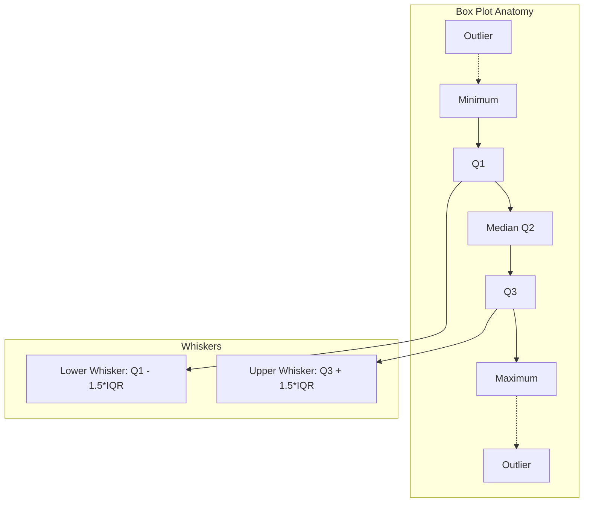
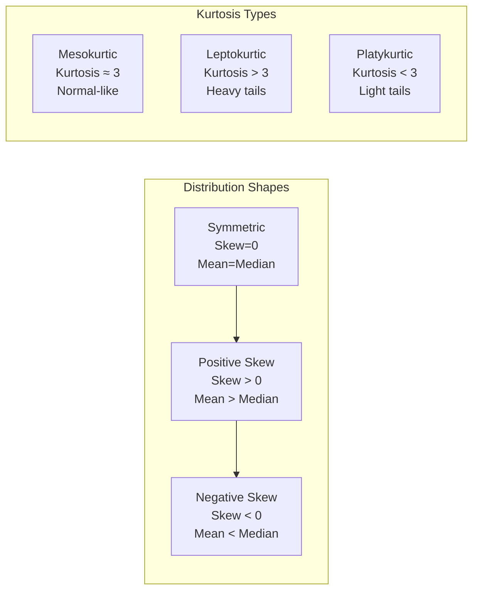

# Chapter 01: Descriptive Statistics

## Introduction

Descriptive statistics summarize and describe the main features of a dataset. As an AI engineer, you will use these measures daily to understand your data before feeding it into any model — garbage in, garbage out starts with not knowing your data's distribution, central tendency, and spread. This chapter covers all fundamental descriptive statistics with Python implementations and practical AI applications.

## Prerequisites

- Basic Python syntax (variables, lists, importing modules)
- Understanding of what a dataset is (rows and columns)
- Familiarity with NumPy library basics

## Concept

Descriptive statistics are divided into measures of central tendency and measures of dispersion. Central tendency tells you where the "center" of your data lies, while dispersion tells you how spread out your data is.

### Measures of Central Tendency

**Mean**: The arithmetic average of all values. Sensitive to outliers.
```
mean = (x_1 + x_2 + ... + x_n) / n
```

**Median**: The middle value when data is sorted. Robust to outliers.
- If n is odd: median = value at position (n+1)/2
- If n is even: median = average of values at positions n/2 and n/2 + 1

**Mode**: The most frequently occurring value(s). Useful for categorical data.

### Measures of Dispersion

**Variance**: Average of squared deviations from the mean.
```
variance = sum((x_i - mean)^2) / (n - 1)  // sample variance
```

**Standard Deviation**: Square root of variance. In the same units as the data.

**Range**: Maximum value - Minimum value.

**Interquartile Range (IQR)**: Q3 - Q1 (middle 50% of data). Robust to outliers.

**Quartiles**: Divide data into four equal parts.
- Q1: 25th percentile
- Q2: 50th percentile (median)
- Q3: 75th percentile

### Shape of Distribution

**Skewness**: Measures asymmetry of distribution.
- Positive skew: tail on the right (mean > median)
- Negative skew: tail on the left (mean < median)
- Zero skew: symmetric distribution

**Kurtosis**: Measures "tailedness" of distribution.
- High kurtosis: heavy tails, more outliers
- Low kurtosis: light tails, fewer outliers
- Normal distribution has kurtosis = 3 (excess kurtosis = 0)





## Real Example

**Daily Life Analogy — Exam Scores**

Imagine a class of 30 students takes a test. The teacher wants to understand how the class performed:
- **Mean score**: 72/100 tells the average performance
- **Median score**: If the top 3 students scored 98, 97, 95 and the rest scored around 70, the median might be 71 — more representative of the "typical" student
- **Mode**: If 8 students scored 68, that's the most common score
- **Standard Deviation**: A std of 5 means most scores are within 72±5. A std of 20 means scores are all over the place
- **Skewness**: If a few students scored very low (20s), the distribution has negative skew, pulling the mean below the median

**Industry Example — Feature Distribution in ML**

When building a fraud detection model, you examine the distribution of "transaction amount":
- Mean = $125, Median = $45 — this positive skew tells you most transactions are small but a few are huge
- IQR = $20-$120 tells you where the bulk of transactions lie
- Kurtosis = 8.5 (high) means there are many outlier transactions — exactly what fraudsters create
- You decide to log-transform the feature to reduce skew before training

## Code Example

```python
import numpy as np
from scipy import stats
import math

# Sample dataset: house prices in thousands
prices = np.array([245, 312, 198, 456, 289, 312, 521, 278, 312, 345,
                   267, 389, 412, 298, 312, 356, 234, 312, 378, 412])

print("=== Descriptive Statistics for House Prices (in $1000) ===")
print(f"Dataset: {prices}")
print(f"Number of samples: {len(prices)}")

# Central Tendency
mean_val = np.mean(prices)
median_val = np.median(prices)
mode_result = stats.mode(prices)
mode_val = mode_result.mode[0]
mode_count = mode_result.count[0]

print(f"\n--- Central Tendency ---")
print(f"Mean: ${mean_val:.2f}K")
print(f"Median: ${median_val:.2f}K")
print(f"Mode: ${mode_val}K (appears {mode_count} times)")

# The mean vs median difference indicates skew
print(f"Mean - Median = ${mean_val - median_val:.2f}K => {'Positive skew' if mean_val > median_val else 'Negative skew' if mean_val < median_val else 'Symmetric'}")

# Dispersion
variance_val = np.var(prices, ddof=1)  # sample variance
std_val = np.std(prices, ddof=1)
range_val = np.max(prices) - np.min(prices)
q1 = np.percentile(prices, 25)
q3 = np.percentile(prices, 75)
iqr = q3 - q1

print(f"\n--- Dispersion ---")
print(f"Variance (sample): {variance_val:.2f}")
print(f"Standard Deviation: ${std_val:.2f}K")
print(f"Range: ${range_val}K")
print(f"Q1 (25th percentile): ${q1}K")
print(f"Q3 (75th percentile): ${q3}K")
print(f"IQR: ${iqr}K")

# Coefficient of Variation (CV) - relative measure of dispersion
cv = (std_val / mean_val) * 100
print(f"Coefficient of Variation: {cv:.2f}%")

# Shape
skewness = stats.skew(prices, bias=False)
kurtosis_val = stats.kurtosis(prices, bias=False, fisher=True)  # excess kurtosis

print(f"\n--- Shape ---")
print(f"Skewness: {skewness:.4f}")
if skewness > 0.5:
    print("  >> Highly positive skew (tail on right)")
elif skewness < -0.5:
    print("  >> Highly negative skew (tail on left)")
else:
    print("  >> Approximately symmetric")

print(f"Excess Kurtosis: {kurtosis_val:.4f}")
if kurtosis_val > 1:
    print("  >> Leptokurtic (heavy tails, many outliers)")
elif kurtosis_val < -1:
    print("  >> Platykurtic (light tails, few outliers)")
else:
    print("  >> Mesokurtic (normal-like tails)")

# Outlier detection using IQR method
lower_bound = q1 - 1.5 * iqr
upper_bound = q3 + 1.5 * iqr
outliers = prices[(prices < lower_bound) | (prices > upper_bound)]

print(f"\n--- Outlier Detection (IQR Method) ---")
print(f"Lower bound (Q1 - 1.5*IQR): ${lower_bound}K")
print(f"Upper bound (Q3 + 1.5*IQR): ${upper_bound}K")
print(f"Outliers found: {len(outliers)}")
if len(outliers) > 0:
    print(f"Outlier values: {outliers}")

# Z-score outlier detection
z_scores = np.abs(stats.zscore(prices))
z_outliers = prices[z_scores > 3]
print(f"\n--- Outlier Detection (Z-Score Method) ---")
print(f"Z-score outliers (|z| > 3): {len(z_outliers)}")
if len(z_outliers) > 0:
    print(f"Z-score outlier values: {z_outliers}")

# Five-number summary
print(f"\n--- Five-Number Summary ---")
print(f"Min: ${np.min(prices)}K")
print(f"Q1: ${q1}K")
print(f"Median: ${median_val}K")
print(f"Q3: ${q3}K")
print(f"Max: ${np.max(prices)}K")

# Expected Output (approximate):
# === Descriptive Statistics for House Prices (in $1000) ===
# Dataset: [245 312 198 456 289 312 521 278 312 345 267 389 412 298 312 356 234 312 378 412]
# Number of samples: 20
# Mean: $332.30K
# Median: $312.00K
# Mode: $312K (appears 5 times)
# Mean - Median = $20.30K => Positive skew
# Standard Deviation: $80.88K
# IQR: $100.00K
# Skewness: 0.5212 => Highly positive skew
# Excess Kurtosis: -0.1421 => Mesokurtic
```

## Interview Questions

**Q1: What is the difference between population variance and sample variance? When do you use each?**
A: Population variance divides by N (all data points), sample variance divides by (n-1) using Bessel's correction. Use population variance when you have the entire population; use sample variance when you have a sample and want to estimate the population variance. The (n-1) correction makes the sample variance an unbiased estimator.

**Q2: Why is the median more robust to outliers than the mean?**
A: The mean uses all data points, so extreme values pull it toward them. The median only depends on the middle value(s) — extreme values don't change the order position. For income data with billionaires, the median far better represents "typical" income than the mean.

**Q3: How would you detect outliers in a dataset before training an ML model?**
A: Three common methods: (1) IQR method — points below Q1-1.5*IQR or above Q3+1.5*IQR are outliers; (2) Z-score method — points with |z| > 3 are outliers; (3) Domain knowledge — use business rules (e.g., negative ages are impossible). For high-dimensional data, use isolation forest or DBSCAN.

**Q4: Explain skewness and kurtosis. Why do they matter for ML?**
A: Skewness measures asymmetry: positive skew means a long right tail, negative skew means a long left tail. Kurtosis measures tail heaviness: high kurtosis means more outliers. They matter because many ML models (linear regression, Naive Bayes) assume normally distributed features. Skewed features may need transformation (log, Box-Cox).

**Q5: What is the five-number summary and how do you visualize it?**
A: The five-number summary consists of Minimum, Q1, Median, Q3, Maximum. It is visualized using a box plot (box-and-whisker plot), where the box spans Q1 to Q3, the line inside is the median, and whiskers extend to min/max (or to 1.5*IQR bounds with outliers shown as points).

**Q6: You have a feature with many missing values. How would descriptive statistics help you decide imputation strategy?**
A: Check the distribution shape, skewness, and outlier presence. For symmetric data with no outliers, impute with mean. For skewed data, impute with median. For categorical data, impute with mode. If data is missing not at random (MNAR), simple imputation may bias results — consider model-based imputation.

**Q7: What does a high standard deviation in your model's cross-validation scores tell you?**
A: High standard deviation in CV scores indicates the model's performance is unstable — it performs well on some folds and poorly on others. This could mean the model has high variance (overfitting), the data has non-random structure, or the sample size is too small.

**Q8: Explain the relationship between variance and degrees of freedom.**
A: Degrees of freedom (df) represent the number of independent values that can vary. For sample variance, df = n-1 because we use the sample mean (estimated from data) to compute deviations, losing one degree of freedom. For each parameter estimated from data, we lose one degree of freedom.

## MCQs

**Q1: Which measure of central tendency is most affected by outliers?**
- A) Median
- B) Mode
- C) Mean
- D) IQR
- **Answer: C) Mean**

**Q2: A dataset has Q1 = 25, Q3 = 75. What is the upper bound for outlier detection using the IQR method?**
- A) 100
- B) 125
- C) 150
- D) 175
- **Answer: C) 150** (Upper bound = Q3 + 1.5*IQR = 75 + 1.5*50 = 75 + 75 = 150)

**Q3: If mean > median, the distribution is:**
- A) Negatively skewed
- B) Positively skewed
- C) Symmetric
- D) Bimodal
- **Answer: B) Positively skewed**

**Q4: What does kurtosis > 3 (excess kurtosis > 0) indicate?**
- A) Light tails, fewer outliers
- B) Normal distribution
- C) Heavy tails, more outliers
- D) Symmetric distribution
- **Answer: C) Heavy tails, more outliers**

**Q5: The IQR represents what percentage of the data?**
- A) 25%
- B) 50%
- C) 75%
- D) 100%
- **Answer: B) 50%**

## PYQs

**Q1 (Google ML Interview):** You are analyzing user engagement data. The mean session time is 8.2 minutes, median is 4.5 minutes, and standard deviation is 12.3 minutes. What does this tell you about user behavior? How would you handle this feature in a model?
- **Solution**: The large gap between mean and median (3.7 min) indicates strong positive skew — a small number of power users have very long sessions, pulling the mean up. The huge SD (larger than the mean) confirms extreme outliers. A robust approach: cap at 99th percentile, log-transform the feature, or create a binary feature for "power user" (>30 min sessions).

**Q2 (Amazon SDE-ML):** Given a list of 1 million numbers, design an algorithm to find the median using minimal memory.
- **Solution**: Cannot sort 1M values in memory. Use an online algorithm: (1) Use two heaps — a max-heap for the lower half and a min-heap for the upper half. Maintain balance so heaps differ by at most 1 element. Median is the root of the larger heap (or average of both roots if equal size). This uses O(k) memory where k is the heap size. (2) Alternatively use the reservoir sampling method or the quickselect algorithm with O(n) average time and O(1) space.

**Q3 (Meta Data Scientist):** Your A/B test shows a 5% increase in conversion rate. How would you check if this is practically significant, not just statistically significant?
- **Solution**: Check the effect size (Cohen's d or the absolute lift magnitude). A 5% relative increase from 2% to 2.1% conversion may be statistically significant with large n but practically meaningless. Consider: (1) business impact in dollars, (2) confidence interval of the lift, (3) cost of implementing the change, (4) segment analysis to see if the effect is consistent across user groups.

**Q4 (Microsoft Data Scientist):** In a dataset of house prices, describe the steps you would take using descriptive statistics before building a regression model.
- **Solution**: (1) Compute five-number summary for price and each feature. (2) Check for missing values and decide imputation strategy. (3) Plot histograms — if skewed, consider log transformation. (4) Use box plots to identify outliers in price and features. (5) Compute correlation matrix to check multicollinearity. (6) Examine standard deviations — features with near-zero variance may be removed. (7) Check class imbalance if price is binned into categories.

## Common Mistakes

1. **Using mean for highly skewed data**: Mean is misleading for income, house prices, or any right-skewed data. Always check distribution first, use median as default for skewed data, and report both with standard deviation.

2. **Confusing sample and population formulas**: Using population variance (dividing by n) on sample data gives a biased estimate. Always use ddof=1 in NumPy for sample statistics and ddof=0 only when you have the full population.

3. **Ignoring outliers before model training**: Outliers can dramatically affect linear models (regression, PCA, SVM). Always detect and decide: remove (if measurement error), cap (if extreme but valid), or transform (if skewed distribution).

4. **Using IQR blindly with non-normal data**: The 1.5*IQR rule assumes approximately normal distribution. For multimodal or highly skewed data, adjust the multiplier or use percentile-based capping.

5. **Interpreting zero skewness as normal distribution**: A distribution can be symmetric but not normal (e.g., uniform distribution has skew ≈ 0 but is not bell-shaped). Always visualize the distribution alongside numeric summaries.

## Revision Notes

- **Mean** = average, sensitive to outliers; **Median** = middle value, robust; **Mode** = most frequent
- **Variance** = average squared deviation; **Std Dev** = sqrt(variance), same units as data
- **IQR** = Q3 - Q1 (middle 50%); **Outliers** = beyond Q1-1.5*IQR or Q3+1.5*IQR
- **Skewness** > 0 = right tail (mean > median); < 0 = left tail (mean < median); 0 = symmetric
- **Kurtosis** > 3 = heavy tails (more outliers); < 3 = light tails; = 3 = mesokurtic (normal)
- **Five-number summary**: Min, Q1, Median, Q3, Max — visualized as a box plot
- **Sample variance** uses (n-1) denominator (Bessel's correction) for unbiased estimation
- **Coefficient of Variation** = (std/mean) * 100% — relative dispersion measure
- **Z-score** = (x - mean)/std — standardized distance from mean; |z| > 3 often flagged as outlier
- **Always profile data** before modeling: distribution shape, outliers, missing values, scale differences

## Summary

Descriptive statistics provide the fundamental tools for understanding any dataset before applying machine learning models. Measures of central tendency (mean, median, mode) describe the center, while measures of dispersion (variance, standard deviation, IQR, range) describe spread. Distribution shape is captured by skewness (asymmetry) and kurtosis (tail heaviness), which guide decisions on data transformation and outlier handling. Mastery of descriptive statistics is essential for data profiling, feature engineering, and model diagnostics. Every AI engineer should compute these statistics automatically when first encountering a new dataset.

## Additional Python Examples

### Example 2: Real-World Dataset Profiling

```python
import numpy as np
from scipy import stats

# Simulate profiling an e-commerce dataset
np.random.seed(100)

# Feature 1: Order amount (log-normal, right-skewed)
order_amounts = np.random.lognormal(mean=4.0, sigma=0.8, size=500)

# Feature 2: Pages viewed per session (Poisson)
pages_viewed = np.random.poisson(lam=6, size=500)

# Feature 3: Time on site in minutes (exponential)
time_on_site = np.random.exponential(scale=8, size=500)

# Feature 4: Customer rating (uniform discrete)
ratings = np.random.randint(1, 6, size=500)

features = {
    'Order Amount': order_amounts,
    'Pages Viewed': pages_viewed,
    'Time on Site': time_on_site,
    'Rating': ratings
}

print("=== E-commerce Data Profile ===")
print(f"{'Feature':<15} {'Mean':>8} {'Median':>8} {'Std':>8} {'Skew':>8} {'Kurt':>8} {'Outliers':>9}")
print("-" * 66)

for name, data in features.items():
    mean = np.mean(data)
    median = np.median(data)
    std = np.std(data, ddof=1)
    skew = stats.skew(data, bias=False)
    kurt = stats.kurtosis(data, bias=False, fisher=True)
    q1 = np.percentile(data, 25)
    q3 = np.percentile(data, 75)
    iqr = q3 - q1
    outliers = np.sum((data < q1 - 1.5*iqr) | (data > q3 + 1.5*iqr))

    print(f"{name:<15} {mean:>8.2f} {median:>8.2f} {std:>8.2f} {skew:>8.2f} {kurt:>8.2f} {outliers:>9}")

print("\nKey Insights:")
print("- Order amount is highly right-skewed (mean >> median)")
print("- Pages viewed is roughly symmetric (mean approx = median)")
print("- Time on site has positive skew with heavy tail")
print("- Rating is left-skewed (more high ratings than low)")
print("- All features have outliers that need investigation")
```

### Example 3: Data Transformation Comparison

```python
import numpy as np
from scipy import stats

# Heavily skewed data
data_skewed = np.random.lognormal(mean=0, sigma=1.0, size=200)

print("=== Effect of Transformations on Skewness ===")
print(f"Original skewness: {stats.skew(data_skewed, bias=False):.4f}")

# Log transformation
data_log = np.log(data_skewed - np.min(data_skewed) + 1)
print(f"After log transform: {stats.skew(data_log, bias=False):.4f}")

# Square root transformation
data_sqrt = np.sqrt(data_skewed)
print(f"After sqrt transform: {stats.skew(data_sqrt, bias=False):.4f}")

# Box-Cox transformation
data_boxcox, lam = stats.boxcox(data_skewed - np.min(data_skewed) + 1)
print(f"After Box-Cox (lambda={lam:.4f}): {stats.skew(data_boxcox, bias=False):.4f}")

print("\nGuideline: Choose log for severe skew, sqrt for moderate, Box-Cox for automatic")
```

## FAANG+ Quick Reference Table

| Company | Statistics Question Focus | Key Concept |
|---------|-------------------------|-------------|
| Google | Data distributions, outlier handling | Log-transform skewed features |
| Meta | A/B test metrics, practical significance | Effect size vs p-value |
| Amazon | Feature engineering, data quality | Variance analysis, missing data |
| Microsoft | Model diagnostics, assumptions | Regression diagnostics |
| OpenAI/NVIDIA | Training data quality, normalization | Batch norm, data standardization |
| Apple | User behavior metrics | Percentile analysis, medians |
