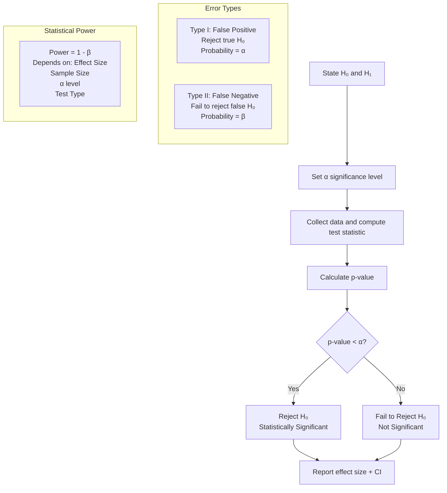
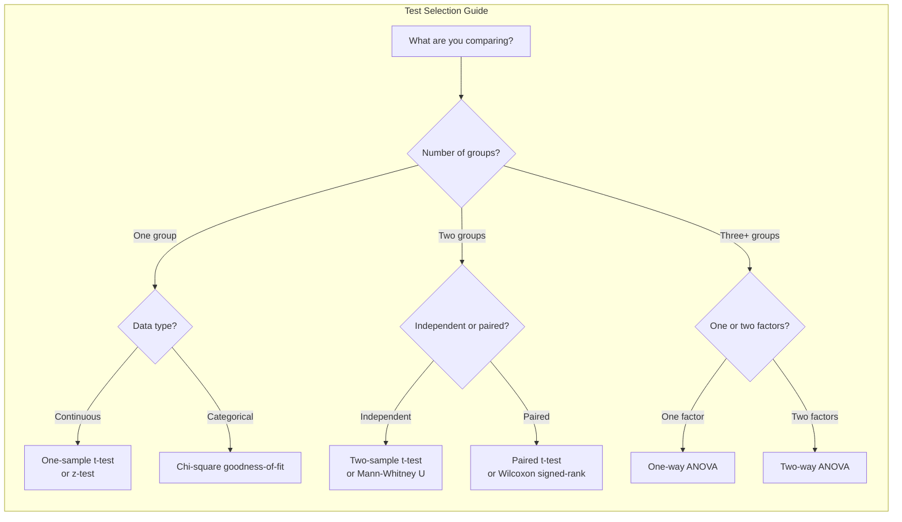

# Chapter 03: Hypothesis Testing

## Introduction

Hypothesis testing is a statistical framework for making data-driven decisions under uncertainty, answering questions like "Is this new ML model truly better than the baseline?" or "Does this feature actually improve user engagement?" As an AI engineer, you will use hypothesis testing daily to validate model improvements, compare algorithms, and assess feature importance. This chapter covers all major hypothesis tests with Python implementations and practical interpretation.

## Prerequisites

- Probability basics (random variables, distributions — Chapter 02)
- Normal distribution properties
- Basic understanding of sampling

## Concept

### The Hypothesis Testing Framework

**Step 1**: State the hypotheses
- **Null Hypothesis (H₀)**: No effect, no difference, status quo (e.g., new model accuracy = baseline accuracy)
- **Alternative Hypothesis (H₁ or Ha)**: There is an effect/difference (e.g., new model accuracy > baseline accuracy)

**Step 2**: Choose significance level (α)
- Typically α = 0.05 (5% chance of false positive)
- Common values: 0.01, 0.05, 0.10

**Step 3**: Choose test statistic and compute it

**Step 4**: Compute p-value

**Step 5**: Make decision
- If p-value < α: Reject H₀ (statistically significant result)
- If p-value ≥ α: Fail to reject H₀ (not statistically significant)

### Type I and Type II Errors

| Decision | H₀ True | H₀ False |
|----------|---------|----------|
| Reject H₀ | Type I Error (False Positive) α | Correct Decision (True Positive) |
| Fail to Reject H₀ | Correct Decision (True Negative) | Type II Error (False Negative) β |

- **Type I Error (α)**: Rejecting a true null hypothesis. "False alarm."
- **Type II Error (β)**: Failing to reject a false null hypothesis. "Miss."
- **Power** = 1 - β: Probability of correctly rejecting a false null hypothesis.

### Key Statistical Tests

**t-Test**: Compares means when population standard deviation is unknown.
- One-sample: Compare sample mean to known value
- Two-sample (independent): Compare means of two independent groups
- Paired: Compare means of same group at two time points

**z-Test**: Compares means when population standard deviation is known (or n is very large).

**Chi-Square Test**: Tests association between categorical variables.
- Goodness-of-fit: Does observed distribution match expected?
- Independence: Are two categorical variables independent?

**ANOVA (Analysis of Variance)**: Compares means of three or more groups.
- One-way: One factor, multiple groups
- Two-way: Two factors, multiple groups

**Confidence Intervals**: Range that contains the true population parameter with a certain confidence level (e.g., 95% CI).





## Real Example

**Daily Life Analogy — Coffee Delivery Time**

You claim a new coffee shop delivers faster than your current one (25 min average).

- **H₀**: New shop mean delivery time = 25 minutes
- **H₁**: New shop mean delivery time < 25 minutes (one-tailed)
- **α**: 0.05
- You order 20 times, get sample mean = 22 min, sample std = 4 min
- **t-statistic**: (22-25)/(4/√20) = -3/0.894 = -3.35
- **p-value**: 0.0017
- Since p < 0.05: Reject H₀. New coffee shop is genuinely faster!

If p-value were 0.08: Fail to reject H₀. The 3-minute difference could be due to random chance.

**Industry Example — Model A/B Test**

Your team developed a new recommendation algorithm. You want to prove it improves CTR.

- **H₀**: CTR_new — CTR_old = 0
- **H₁**: CTR_new — CTR_old > 0
- **α**: 0.01 (conservative, since deploying is expensive)
- **Power analysis**: How many users per group to detect a 0.5% lift?
- You run the test for 2 weeks with 50,000 users per group
- **Result**: New CTR = 3.2%, Old CTR = 3.0%, p = 0.003
- **Conclusion**: Reject H₀. Deploy new model (but monitor for degradation)

## Code Example

```python
import numpy as np
from scipy import stats
import math

np.random.seed(42)
print("=== Hypothesis Testing with SciPy ===\n")

# ============================================
# 1. ONE-SAMPLE T-TEST
# ============================================
print("--- One-Sample t-Test ---")
# A factory claims their batteries last 100 hours. Test 30 batteries.
population_mean = 100
sample = np.array([98, 102, 95, 99, 101, 97, 96, 100, 103, 94,
                   99, 101, 97, 98, 100, 102, 96, 99, 98, 101,
                   97, 100, 99, 102, 98, 96, 101, 99, 100, 97])

t_stat, p_value = stats.ttest_1samp(sample, population_mean)
mean = np.mean(sample)
std = np.std(sample, ddof=1)
se = std / math.sqrt(len(sample))

print(f"Sample mean: {mean:.2f}, Population mean: {population_mean}")
print(f"t-statistic: {t_stat:.4f}")
print(f"p-value (two-tailed): {p_value:.4f}")
print(f"Standard error: {se:.4f}")

alpha = 0.05
if p_value < alpha:
    print(f"p < {alpha}: Reject H₀. Battery life differs from 100 hours.")
else:
    print(f"p >= {alpha}: Fail to reject H₀. No evidence battery life differs.")

# Confidence interval
ci = stats.t.interval(0.95, df=len(sample)-1, loc=mean, scale=se)
print(f"95% Confidence Interval: [{ci[0]:.2f}, {ci[1]:.2f}]")

# ============================================
# 2. TWO-SAMPLE INDEPENDENT T-TEST
# ============================================
print("\n--- Two-Sample Independent t-Test ---")
# Compare two teaching methods
method_a = np.array([85, 78, 92, 88, 76, 95, 82, 90, 79, 84])
method_b = np.array([72, 68, 75, 80, 71, 78, 65, 74, 70, 73])

t_stat, p_value = stats.ttest_ind(method_a, method_b)
print(f"Method A: mean={np.mean(method_a):.2f}, std={np.std(method_a, ddof=1):.2f}")
print(f"Method B: mean={np.mean(method_b):.2f}, std={np.std(method_b, ddof=1):.2f}")
print(f"t-statistic: {t_stat:.4f}")
print(f"p-value (two-tailed): {p_value:.4f}")

if p_value < alpha:
    print(f"p < {alpha}: Significant difference between methods.")
else:
    print(f"p >= {alpha}: No significant difference between methods.")

# Welch's t-test (does not assume equal variance)
t_stat_w, p_value_w = stats.ttest_ind(method_a, method_b, equal_var=False)
print(f"Welch's t-test p-value: {p_value_w:.4f}")

# ============================================
# 3. PAIRED T-TEST
# ============================================
print("\n--- Paired t-Test ---")
# Blood pressure before and after treatment
before = np.array([145, 150, 138, 160, 142, 155, 148, 152, 140, 146])
after = np.array([135, 142, 130, 148, 138, 140, 136, 141, 132, 135])

t_stat, p_value = stats.ttest_rel(before, after)
differences = before - after
print(f"Differences: mean={np.mean(differences):.2f}, std={np.std(differences, ddof=1):.2f}")
print(f"t-statistic: {t_stat:.4f}")
print(f"p-value (one-tailed): {p_value/2:.4f}")  # one-tailed test

if p_value/2 < alpha:
    print(f"p < {alpha}: Treatment significantly reduced blood pressure.")
else:
    print(f"p >= {alpha}: No significant reduction.")

# ============================================
# 4. Z-TEST (using normal approximation)
# ============================================
print("\n--- z-Test (Proportion) ---")
# Out of 1000 visitors, 120 converted. Is this different from 10% baseline?
n = 1000
conversions = 120
p_hat = conversions / n
p0 = 0.10

z_stat = (p_hat - p0) / math.sqrt(p0 * (1-p0) / n)
p_value_z = 2 * (1 - stats.norm.cdf(abs(z_stat)))  # two-tailed

print(f"Observed proportion: {p_hat:.4f}")
print(f"Null proportion: {p0}")
print(f"z-statistic: {z_stat:.4f}")
print(f"p-value: {p_value_z:.4f}")
if p_value_z < alpha:
    print(f"p < {alpha}: Conversion rate significantly different from 10%.")
else:
    print(f"p >= {alpha}: No significant difference.")

# ============================================
# 5. CHI-SQUARE TEST OF INDEPENDENCE
# ============================================
print("\n--- Chi-Square Test of Independence ---")
# Is gender associated with product preference?
# Observed frequencies
observed = np.array([
    [30, 45, 25],   # Male: Product A, B, C
    [40, 35, 25]    # Female: Product A, B, C
])

chi2, p_value_chi, dof, expected = stats.chi2_contingency(observed)
print(f"Observed frequencies:\n{observed}")
print(f"Expected frequencies:\n{expected}")
print(f"Chi-square statistic: {chi2:.4f}")
print(f"Degrees of freedom: {dof}")
print(f"p-value: {p_value_chi:.4f}")

if p_value_chi < alpha:
    print(f"p < {alpha}: Gender and product preference are associated.")
else:
    print(f"p >= {alpha}: No association between gender and product preference.")

# ============================================
# 6. ONE-WAY ANOVA
# ============================================
print("\n--- One-Way ANOVA ---")
# Compare test scores across three teaching methods
group1 = np.array([85, 90, 88, 92, 87])
group2 = np.array([78, 82, 80, 85, 79])
group3 = np.array([70, 75, 72, 68, 74])

f_stat, p_value_anova = stats.f_oneway(group1, group2, group3)
print(f"Group 1: mean={np.mean(group1):.2f}, std={np.std(group1, ddof=1):.2f}")
print(f"Group 2: mean={np.mean(group2):.2f}, std={np.std(group2, ddof=1):.2f}")
print(f"Group 3: mean={np.mean(group3):.2f}, std={np.std(group3, ddof=1):.2f}")
print(f"F-statistic: {f_stat:.4f}")
print(f"p-value: {p_value_anova:.4f}")

if p_value_anova < alpha:
    print(f"p < {alpha}: At least one group differs significantly.")
    # Post-hoc: which groups differ?
    from scipy.stats import tukey_hsd
    tukey = tukey_hsd(group1, group2, group3)
    print(f"\nTukey HSD post-hoc tests:")
    print(f"Group 1 vs 2: p={tukey.pvalue[0,1]:.4f}")
    print(f"Group 1 vs 3: p={tukey.pvalue[0,2]:.4f}")
    print(f"Group 2 vs 3: p={tukey.pvalue[1,2]:.4f}")
else:
    print(f"p >= {alpha}: No significant differences between groups.")

# ============================================
# 7. POWER ANALYSIS EXAMPLE
# ============================================
print("\n--- Power Analysis ---")
from scipy.stats import nct, ncf

# Calculate power for one-sample t-test
effect_size = 0.5  # Cohen's d (medium effect)
n = 30
alpha_power = 0.05
df_power = n - 1

# Non-centrality parameter
ncp = effect_size * math.sqrt(n)
# Critical value
t_crit = stats.t.ppf(1 - alpha_power/2, df_power)
# Power
power = 1 - stats.nct.cdf(t_crit, df_power, ncp) + stats.nct.cdf(-t_crit, df_power, ncp)
print(f"Effect size (Cohen's d): {effect_size}")
print(f"Sample size: {n}")
print(f"Power: {power:.4f} (need > 0.80 for adequate power)")
print(f"Power is {'adequate' if power > 0.80 else 'inadequate'}")

# Calculate required sample size for 80% power
for n_test in range(10, 500):
    ncp_test = effect_size * math.sqrt(n_test)
    t_crit_test = stats.t.ppf(1 - alpha_power/2, n_test - 1)
    power_test = 1 - stats.nct.cdf(t_crit_test, n_test - 1, ncp_test) + stats.nct.cdf(-t_crit_test, n_test - 1, ncp_test)
    if power_test >= 0.80:
        print(f"Required n for 80% power: {n_test}")
        break

# Expected Output (approximate):
# --- One-Sample t-Test ---
# Sample mean: 99.13, Population mean: 100
# t-statistic: -2.1445
# p-value (two-tailed): 0.0404
# p < 0.05: Reject H₀. Battery life differs from 100 hours.
# 95% Confidence Interval: [98.30, 99.97]
```

## Interview Questions

**Q1: Explain the difference between statistical significance and practical significance.**
A: Statistical significance means the observed effect is unlikely due to chance (p < α). Practical significance means the effect is large enough to matter in the real world. A large sample can make a tiny effect (0.1% CTR lift) statistically significant but practically irrelevant. Always report effect size (Cohen's d, absolute lift) alongside p-values. Consider cost-benefit: does the improvement justify implementation cost?

**Q2: What is the multiple comparisons problem and how do you handle it?**
A: When testing many hypotheses simultaneously, the probability of at least one false positive increases. For m independent tests at α=0.05, the family-wise error rate is 1-(0.95)^m. Corrections: Bonferroni (α/m, most conservative), Holm-Bonferroni (stepwise), Benjamini-Hochberg (FDR control, less conservative). In ML, this applies when comparing many features against a target or many model variants.

**Q3: When would you use a one-tailed vs two-tailed test?**
A: Two-tailed: testing for any difference (new ≠ old). Use as default. One-tailed: testing for a specific direction (new > old). Only use when you have a strong prior that the effect can only go one direction, and you're willing to miss an effect in the opposite direction. One-tailed has more power (lower p-value) for the same effect size, but is less conservative.

**Q4: What is the relationship between confidence intervals and hypothesis testing?**
A: A 95% confidence interval contains all values for which the null hypothesis would NOT be rejected at α=0.05. If the null value (e.g., 0 for difference) is outside the CI, then p < 0.05. CIs provide more information than a binary reject/fail-to-reject decision — they show the range of plausible effect sizes.

**Q5: How does sample size affect p-values and statistical power?**
A: Larger sample sizes: (1) Decrease standard error (SE = σ/√n), (2) Increase test statistics (t = effect/SE), (3) Decrease p-values for the same effect size, (4) Increase statistical power (ability to detect true effects). With huge n, even trivial effects become statistically significant. This is why you must always check effect size, not just p-value.

**Q6: What assumptions does the t-test make and how do you check them?**
A: (1) Independence: observations are independent (checked by study design). (2) Normality: data is approximately normal in each group (checked by Q-Q plot, Shapiro-Wilk test, or by CLT for n>30). (3) Equal variance (for independent t-test): checked by Levene's test or F-test. If normality fails, use non-parametric tests (Mann-Whitney U, Wilcoxon signed-rank). If equal variance fails, use Welch's t-test.

**Q7: Describe the p-value controversy. Why do some statisticians recommend moving beyond p-values?**
A: Problems with p-values: (1) p-values are often misinterpreted as P(H₀|Data) instead of P(Data|H₀). (2) p-hacking: running many tests until one is significant. (3) p-values depend on sample size — trivial effects become significant with large n. (4) Replication crisis: many significant findings fail to replicate. Alternatives: (1) Report effect sizes and CIs, (2) Use Bayesian methods (Bayes factors), (3) Pre-register analyses, (4) Use replication and meta-analysis.

**Q8: What is ANOVA and when would you use it instead of multiple t-tests?**
A: ANOVA (Analysis of Variance) compares means across 3+ groups simultaneously. Using multiple t-tests (A vs B, A vs C, B vs C) inflates Type I error. ANOVA tests the global null (all means equal). If ANOVA is significant, post-hoc tests (Tukey HSD, Bonferroni correction) identify which groups differ. One-way ANOVA = one factor; two-way ANOVA = two factors + interaction effects.

**Q9: How do you determine the sample size needed for an A/B test?**
A: Sample size depends on: (1) Baseline conversion rate, (2) Minimum detectable effect (MDE) — the smallest lift worth detecting, (3) Significance level α (typically 0.05), (4) Power 1-β (typically 0.80). Formula: n = (Z_α/2 + Z_β)² * 2σ² / δ² (for continuous). Use online calculators or the `statsmodels` `solve_power` function. Always account for multiple variants (Bonferroni correction).

**Q10: What is a non-parametric test and when would you use one?**
A: Non-parametric tests make no assumptions about the underlying distribution. Use when: (1) Data is ordinal (ratings, ranks), (2) Normality assumption is severely violated, (3) Sample size is very small. Examples: Mann-Whitney U (alternative to independent t-test), Wilcoxon signed-rank (paired t-test), Kruskal-Wallis (one-way ANOVA), Spearman correlation (Pearson correlation). Trade-off: slightly less power when assumptions hold, but much more robust when they don't.

## MCQs

**Q1: If the p-value is 0.03 and α = 0.05, what is the correct conclusion?**
- A) Reject H₀, results are statistically significant
- B) Fail to reject H₀, results are not significant
- C) Accept H₀
- D) The effect is practically significant
- **Answer: A) Reject H₀, results are statistically significant**

**Q2: A Type II Error occurs when:**
- A) We reject a true null hypothesis
- B) We fail to reject a false null hypothesis
- C) We reject a false null hypothesis
- D) We fail to reject a true null hypothesis
- **Answer: B) We fail to reject a false null hypothesis**

**Q3: What test would you use to compare the means of three independent groups?**
- A) Paired t-test
- B) One-sample t-test
- C) ANOVA
- D) Chi-square test
- **Answer: C) ANOVA**

**Q4: As sample size increases, the standard error:**
- A) Increases
- B) Decreases
- C) Stays the same
- D) Becomes zero
- **Answer: B) Decreases** (SE = σ/√n)

**Q5: A 95% confidence interval for the mean difference is [-0.5, 2.3]. What can we conclude?**
- A) The effect is statistically significant at α=0.05
- B) The effect is not statistically significant at α=0.05 (since 0 is in the interval)
- C) There is a 95% chance the true mean is in this range
- D) The sample size must be increased
- **Answer: B) The effect is not statistically significant at α=0.05**

## PYQs

**Q1 (Google ML Interview):** Your team developed a new ranking algorithm. You run an A/B test with 100,000 users in each group. The new algorithm shows a 0.2% improvement in click-through rate (CTR) with p = 0.003. Your VP says "deploy immediately." Do you agree? Why or why not?
- **Solution**: While the result is statistically significant (p < 0.05), you must consider: (1) Effect size: 0.2% lift is tiny. Is this practically meaningful? (2) Cost: is the new algorithm more expensive to run? (3) Risks: does it harm other metrics (revenue, dwell time, user satisfaction)? (4) Segment analysis: does the improvement come from certain user segments while hurting others? (5) Long-term effects: could it degrade the ecosystem (e.g., filter bubbles)? Recommendation: deploy to 10% first, monitor for 2 weeks including guardrail metrics, then gradually ramp up.

**Q2 (Amazon Applied Scientist):** You are testing whether a new recommendation system increases revenue per user (RPU). Your test has 500 users per group, baseline RPU = $4.50, new RPU = $4.65, p = 0.12. The team wants to conclude the new system is no better. What's wrong with this conclusion?
- **Solution**: A non-significant result (p = 0.12 > 0.05) does NOT prove the null hypothesis (no difference). The $0.15 (3.3%) lift could be real but undetected due to low power. Before concluding "no effect": (1) Calculate the confidence interval for the difference (likely includes the possibility of meaningful gains), (2) Perform a power analysis — were 500 users/group enough to detect a 3% lift? (3) If power is low, run a larger test, (4) Use Bayesian methods to quantify evidence for both hypotheses, (5) Consider a more sensitive metric or reduce measurement noise.

**Q3 (Meta Data Scientist):** You are running 20 experiments simultaneously on different product features. Two experiments show p < 0.05. What do you tell your stakeholders?
- **Solution**: Apply multiple testing correction. With 20 tests at α=0.05, the expected number of false positives is 20 × 0.05 = 1. Two significant results is exactly what we'd expect by chance if all null hypotheses are true! Use Bonferroni: adjusted α = 0.05/20 = 0.0025. Re-check p-values against this threshold. Alternatively, use FDR control (Benjamini-Hochberg) which is less conservative. Recommend pre-registering experiments and using a holdout set for validation.

**Q4 (Microsoft Data Scientist):** A colleague runs a paired t-test on pre-test and post-test scores. The mean improvement is 5 points, p = 0.06. They claim "the training program didn't work." Critique this reasoning and suggest improvements.
- **Solution**: (1) p = 0.06 is not significant at α=0.05, but it's close — don't interpret as "no effect." (2) Report the effect size (Cohen's d = mean_diff / std_diff). (3) A 5-point improvement might be practically meaningful. (4) Check assumptions: normality of differences, no confounding variables. (5) Increase sample size if feasible. (6) Consider Bayesian approach: what's the posterior probability of a meaningful improvement? (7) Use the confidence interval: it likely includes the possibility of both no effect and a meaningful effect. Never accept the null based on p > 0.05.

## Common Mistakes

1. **Accepting the null hypothesis**: Failing to reject H₀ does NOT mean H₀ is true. It means we lack sufficient evidence to reject it. Absence of evidence is not evidence of absence.

2. **p-hacking**: Running multiple tests, removing outliers, or changing analysis until a significant p-value appears. This inflates Type I error. Pre-register your analysis plan. Use corrected thresholds for multiple comparisons.

3. **Ignoring assumptions**: Using a t-test on severely non-normal data with small n, or using ANOVA with unequal variances. Always check assumptions with diagnostic plots and appropriate tests.

4. **Confusing statistical and practical significance**: With large n (millions of users), even 0.01% effects are statistically significant. Always ask: does this effect matter for our business?

5. **One-tailed tests without justification**: Using a one-tailed test because the two-tailed p-value isn't significant. This doubles the α for one direction and ignores the possibility of an effect in the opposite direction.

## Revision Notes

- **H₀**: No effect; **H₁**: There is an effect
- **α**: Probability of Type I error (false positive). Typically 0.05
- **β**: Probability of Type II error (false negative)
- **Power** = 1 - β. Aim for > 0.80
- **p-value**: P(observed or more extreme | H₀ true). NOT P(H₀ true)
- **p < α**: Statistically significant. Reject H₀
- **t-test**: Compare means (unknown σ). z-test: known σ or large n
- **Paired test**: Same subjects, two measurements (before/after)
- **Chi-square**: Categorical variable associations
- **ANOVA**: Compare 3+ group means simultaneously
- **Effect size**: Cohen's d, absolute lift — measures practical significance
- **Non-parametric**: Mann-Whitney, Wilcoxon, Kruskal-Wallis (no normality)
- **Multiple testing**: Bonferroni, BH correction to control false positives
- **CI**: If null value outside CI → significant at that α level

## Summary

Hypothesis testing provides a rigorous framework for making data-driven decisions under uncertainty. The process involves stating null and alternative hypotheses, selecting a significance level, computing a test statistic and p-value, and drawing conclusions while acknowledging Type I and Type II errors. Different tests (t-test, z-test, chi-square, ANOVA) apply to different data types and research questions. As an AI engineer, hypothesis testing is essential for A/B testing, model comparison, feature selection, and experimental validation — always remember to check both statistical significance (p-value) and practical significance (effect size) before making decisions.
