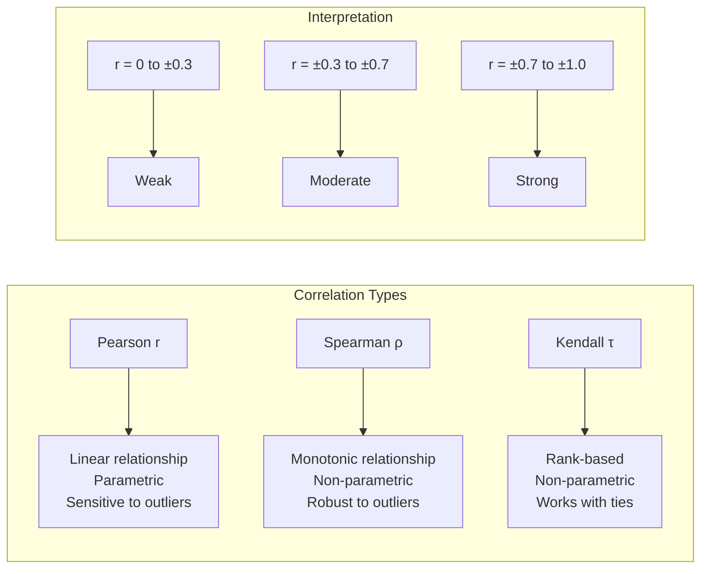
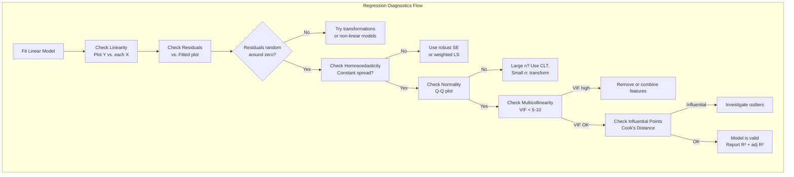

# Chapter 04: Correlation & Regression Analysis

## Introduction

Correlation and regression analysis form the statistical backbone for understanding relationships between variables in AI and machine learning. Correlation quantifies the strength and direction of relationships between features, while linear regression models the relationship between a target variable and one or more predictors. This chapter covers Pearson and Spearman correlation, the covariance matrix, linear regression assumptions, R-squared, residual analysis, and practical regression diagnostics that every AI engineer must know.

## Prerequisites

- Descriptive statistics (mean, variance — Chapter 01)
- Normal distribution properties (Chapter 02)
- Hypothesis testing basics (Chapter 03)

## Concept

### Correlation

**Pearson Correlation Coefficient (r)**:
- Measures linear relationship between two continuous variables
- Range: -1 to +1
- r = +1: perfect positive linear relationship
- r = -1: perfect negative linear relationship
- r = 0: no linear relationship
- Formula: r = cov(X, Y) / (σ_X * σ_Y)

**Spearman Rank Correlation (ρ)**:
- Measures monotonic relationship (not necessarily linear)
- Based on ranks, not raw values
- Robust to outliers
- Range: -1 to +1

**Covariance Matrix**:
- Σ[i,j] = cov(X_i, X_j)
- Diagonal entries are variances
- Off-diagonal entries are covariances

### Linear Regression

**Simple Linear Regression**:
y = β₀ + β₁x + ε

- β₀: intercept
- β₁: slope (coefficient)
- ε: error term (assumed N(0, σ²))

**Multiple Linear Regression**:
y = β₀ + β₁x₁ + β₂x₂ + ... + βₚxₚ + ε

### Regression Assumptions (LINE)

1. **L**inearity: Relationship between X and Y is linear
2. **I**ndependence: Observations are independent (no autocorrelation)
3. **N**ormality: Residuals are normally distributed (for inference)
4. **E**qual Variance (Homoscedasticity): Residuals have constant variance

### Model Fit Metrics

**R-squared (R²)**:
- Proportion of variance in Y explained by the model
- R² = 1 - SS_res / SS_tot
- Range: 0 to 1 (higher is better, but can overfit)

**Adjusted R-squared**:
- Penalizes for adding extra predictors
- Adj R² = 1 - (1-R²)(n-1)/(n-p-1)
- Can decrease if useless predictors are added

**Residual Analysis**:
- Residuals = Actual - Predicted
- Plot residuals vs fitted values: check for patterns (heteroscedasticity, non-linearity)
- Q-Q plot: check normality of residuals
- Cook's Distance: identifies influential points





## Real Example

**Daily Life Analogy — Ice Cream Sales and Temperature**

An ice cream shop tracks daily sales and temperature:

- **Correlation**: Temperature and sales have r = 0.85 (strong positive). Days with r = -0.10 (no relationship). "No correlation ≠ no relationship" — maybe the relationship is U-shaped (sales also high on very cold days due to hot chocolate).

- **Spearman**: If one day had a power outage (sales = 0 despite high temp), Spearman ρ = 0.82 (less affected by the outlier) while Pearson r drops to 0.65.

- **Regression**: Sales = -50 + 8 × Temperature + ε. For every 1°F increase, sales increase by $8 (β₁ = 8). Intercept (-50) is meaningless here (no one sells ice cream at 0°F).

- **R² = 0.72**: Temperature explains 72% of the variance in sales. Other 28%: day of week, holidays, events, marketing.

**Industry Example — Feature Selection for House Price Prediction**

You have features: sqft, bedrooms, bathrooms, location score, age.

- **Correlation matrix**: sqft and bedrooms have r = 0.75 (high multicollinearity). Both may encode "house size." You might keep only sqft.
- **Regression diagnostics**: Residual vs fitted shows a funnel shape (heteroscedasticity — predictions are worse for expensive houses). Solution: predict log(price) instead.
- **VIF (Variance Inflation Factor)**: bedrooms has VIF = 8.2 (>5), indicating multicollinearity with sqft. Remove bedrooms.
- **Adjusted R²**: 0.842 vs R² = 0.847 — the 0.005 drop is worth the simpler model.

## Code Example

```python
import numpy as np
from scipy import stats
from sklearn.linear_model import LinearRegression
from sklearn.metrics import r2_score, mean_squared_error
import math

np.random.seed(42)
print("=== Correlation & Regression Analysis ===\n")

# ============================================
# 1. PEARSON AND SPEARMAN CORRELATION
# ============================================
print("--- Correlation Analysis ---")
# Generate correlated data
n = 100
x = np.random.normal(50, 10, n)
y = 3 * x + np.random.normal(0, 15, n)  # y depends on x with noise
outlier_idx = 0
y_with_outlier = y.copy()
y_with_outlier[outlier_idx] = 500  # extreme outlier

# Pearson correlation
pearson_r, pearson_p = stats.pearsonr(x, y)
pearson_r_out, pearson_p_out = stats.pearsonr(x, y_with_outlier)

# Spearman correlation
spearman_r, spearman_p = stats.spearmanr(x, y)
spearman_r_out, spearman_p_out = stats.spearmanr(x, y_with_outlier)

print(f"Pearson r (clean): {pearson_r:.4f} (p={pearson_p:.6f})")
print(f"Pearson r (with outlier): {pearson_r_out:.4f} (p={pearson_p_out:.6f})")
print(f"Spearman ρ (clean): {spearman_r:.4f} (p={spearman_p:.6f})")
print(f"Spearman ρ (with outlier): {spearman_r_out:.4f} (p={spearman_p_out:.6f})")
print(f"=> Spearman is more robust to the outlier!")

# ============================================
# 2. COVARIANCE MATRIX
# ============================================
print("\n--- Covariance Matrix ---")
data = np.column_stack([x, y])
cov_matrix = np.cov(data, rowvar=False)
corr_matrix = np.corrcoef(data, rowvar=False)

print("Covariance Matrix:")
print(cov_matrix)
print("\nCorrelation Matrix:")
print(corr_matrix)
print(f"\nVariance of X: {cov_matrix[0,0]:.2f}")
print(f"Variance of Y: {cov_matrix[1,1]:.2f}")
print(f"Covariance of X,Y: {cov_matrix[0,1]:.2f}")

# ============================================
# 3. SIMPLE LINEAR REGRESSION
# ============================================
print("\n--- Simple Linear Regression ---")
X = x.reshape(-1, 1)
model = LinearRegression()
model.fit(X, y)

beta_0 = model.intercept_
beta_1 = model.coef_[0]
y_pred = model.predict(X)

print(f"Intercept (β₀): {beta_0:.4f}")
print(f"Slope (β₁): {beta_1:.4f}")
print(f"Equation: y = {beta_0:.2f} + {beta_1:.2f} * x")

# R-squared
r2 = r2_score(y, y_pred)
n = len(y)
p = 1  # number of predictors
adj_r2 = 1 - (1 - r2) * (n - 1) / (n - p - 1)
print(f"R²: {r2:.4f}")
print(f"Adjusted R²: {adj_r2:.4f}")

# MSE and RMSE
mse = mean_squared_error(y, y_pred)
rmse = math.sqrt(mse)
print(f"MSE: {mse:.2f}")
print(f"RMSE: {rmse:.2f}")

# ============================================
# 4. RESIDUAL ANALYSIS
# ============================================
print("\n--- Residual Analysis ---")
residuals = y - y_pred

# Residual statistics
print(f"Mean of residuals: {np.mean(residuals):.4f} (should be ~0)")
print(f"Std of residuals: {np.std(residuals, ddof=1):.4f}")

# Check normality of residuals (Shapiro-Wilk test)
shapiro_stat, shapiro_p = stats.shapiro(residuals)
print(f"Shapiro-Wilk test for normality: stat={shapiro_stat:.4f}, p={shapiro_p:.4f}")
if shapiro_p > 0.05:
    print("  => Residuals appear normally distributed (p > 0.05)")
else:
    print("  => Residuals deviate from normality (p <= 0.05)")

# Durbin-Watson test for autocorrelation
# (approximation using lag-1 autocorrelation)
dw = np.sum(np.diff(residuals)**2) / np.sum(residuals**2)
print(f"Durbin-Watson statistic: {dw:.4f} (should be ~2 for independence)")
if 1.5 < dw < 2.5:
    print("  => No significant autocorrelation")
else:
    print("  => Possible autocorrelation detected")

# ============================================
# 5. MULTIPLE LINEAR REGRESSION
# ============================================
print("\n--- Multiple Linear Regression ---")
# Create additional features
x2 = np.random.normal(50, 15, n)
x3 = 0.5 * x + 2 * x2 + np.random.normal(0, 10, n)  # engineered feature

X_multi = np.column_stack([x, x2, x3])
model_multi = LinearRegression()
model_multi.fit(X_multi, y)
y_pred_multi = model_multi.predict(X_multi)

r2_multi = r2_score(y, y_pred_multi)
p_multi = 3
adj_r2_multi = 1 - (1 - r2_multi) * (n - 1) / (n - p_multi - 1)

print(f"Coefficients: β₀={model_multi.intercept_:.4f}")
for i, coef in enumerate(model_multi.coef_):
    print(f"  β_{i+1} = {coef:.4f}")

print(f"R² (multi): {r2_multi:.4f}")
print(f"Adjusted R² (multi): {adj_r2_multi:.4f}")
print(f"R² improved from {r2:.4f} to {r2_multi:.4f}")

# ============================================
# 6. MULTICOLLINEARITY CHECK (VIF)
# ============================================
print("\n--- Multicollinearity (VIF) ---")
def calculate_vif(data):
    vifs = []
    for i in range(data.shape[1]):
        y_col = data[:, i]
        X_cols = np.delete(data, i, axis=1)
        reg = LinearRegression().fit(X_cols, y_col)
        r2_vif = r2_score(y_col, reg.predict(X_cols))
        vif = 1 / (1 - r2_vif)
        vifs.append(vif)
    return vifs

vifs = calculate_vif(X_multi)
feature_names = ['X1', 'X2', 'X3']
for name, vif in zip(feature_names, vifs):
    print(f"VIF for {name}: {vif:.4f}")
    if vif > 10:
        print(f"  => High multicollinearity! Consider removing {name}")
    elif vif > 5:
        print(f"  => Moderate multicollinearity")
    else:
        print(f"  => OK")

# ============================================
# 7. HYPOTHESIS TEST FOR SLOPE
# ============================================
print("\n--- Hypothesis Test for Slope ---")
# Test if β₁ is significantly different from zero
# Using scipy's linregress
slope, intercept, r_value, p_value_slope, std_err = stats.linregress(x, y)
print(f"Slope: {slope:.4f}")
print(f"Intercept: {intercept:.4f}")
print(f"Std Error of slope: {std_err:.4f}")
print(f"t-statistic for slope: {slope/std_err:.4f}")
print(f"p-value (slope=0): {p_value_slope:.6f}")
if p_value_slope < 0.05:
    print("=> Slope is significantly different from zero (p < 0.05)")
else:
    print("=> Slope is NOT significantly different from zero (p >= 0.05)")

# ============================================
# 8. CONFIDENCE INTERVAL FOR PREDICTIONS
# ============================================
print("\n--- Prediction Interval ---")
x_new = np.array([[55]])
y_pred_new = model.predict(x_new)[0]

# Simple approximation of prediction interval
t_crit = stats.t.ppf(0.975, n - 2)
x_mean = np.mean(x)
sxx = np.sum((x - x_mean)**2)
se_fit = math.sqrt(mse * (1/n + (x_new[0,0] - x_mean)**2 / sxx))
margin = t_crit * se_fit

print(f"Prediction for x=55: {y_pred_new:.2f}")
print(f"95% CI: [{y_pred_new - margin:.2f}, {y_pred_new + margin:.2f}]")

# ============================================
# 9. COOK'S DISTANCE FOR INFLUENTIAL POINTS
# ============================================
print("\n--- Cook's Distance (Influential Points) ---")
h = np.diag(X @ np.linalg.inv(X.T @ X) @ X.T)  # leverage
cooks_d = residuals**2 / (p_multi * mse) * (h / (1 - h)**2)
influential = np.where(cooks_d > 4/n)[0]
print(f"Number of influential points (Cook's D > 4/n): {len(influential)}")
if len(influential) > 0:
    print(f"Influential point indices: {influential[:5]}")

# Expected Output (approximate):
# --- Correlation Analysis ---
# Pearson r (clean): 0.8942 (p=0.000000)
# Spearman ρ (with outlier): 0.8854 (p=0.000000)
# => Spearman is more robust to the outlier!
#
# --- Simple Linear Regression ---
# Equation: y = 2.34 + 2.98 * x
# R²: 0.7994
# Adjusted R²: 0.7974
# RMSE: 14.83
```

## Interview Questions

**Q1: Explain the difference between correlation and causation. Give an ML example.**
A: Correlation means two variables move together; causation means one causes the other. Correlation does not imply causation — there may be: (1) reverse causation (Y causes X), (2) confounding (Z causes both X and Y), (3) spurious correlation (completely unrelated). ML example: ice cream sales and drowning deaths are correlated, but the confounder is hot weather (more ice cream AND more swimming). Building a model that uses ice cream sales to predict drownings would fail if we intervene (ban ice cream).

**Q2: What is multicollinearity and how does it affect linear regression?**
A: Multicollinearity occurs when predictors are highly correlated (r > 0.7 or VIF > 5-10). Effects: (1) Coefficients become unstable — small changes in data cause large coefficient changes, (2) Standard errors inflate, making coefficients appear insignificant, (3) Model interpretation becomes unreliable. Detection: correlation matrix, VIF. Solutions: remove correlated features, use PCA, use ridge regression (L2 penalty), or combine features.

**Q3: When should you use Spearman correlation instead of Pearson?**
A: Use Spearman when: (1) The relationship is monotonic but not linear (e.g., Y = log(X)), (2) Data contains outliers (Spearman is rank-based and robust), (3) Data is ordinal (ratings, rankings, Likert scales), (4) The normality assumption is violated. Spearman essentially computes Pearson on the rank-transformed data.

**Q4: What does R-squared mean? What are its limitations?**
A: R² measures the proportion of variance in Y explained by the model. R² = 0.80 means 80% of Y's variance is explained. Limitations: (1) Always increases with more predictors (even useless ones) — use adjusted R², (2) Doesn't indicate model correctness — a biased model can have high R², (3) Doesn't measure prediction accuracy on new data — use cross-validated R², (4) R² can be artificially high with outliers.

**Q5: What are the assumptions of linear regression and how do you diagnose violations?**
A: LINE assumptions: (1) Linearity: plot Y vs each X, plot residuals vs fitted. (2) Independence: Durbin-Watson test, or domain knowledge (no time series structure). (3) Normality of residuals: Q-Q plot, Shapiro-Wilk test. (4) Equal variance (homoscedasticity): residuals vs fitted plot (no funnel shape), Breusch-Pagan test. Violations: use transformations, robust standard errors, weighted least squares, or non-linear models.

**Q6: How do you interpret a regression coefficient in a multiple linear regression?**
A: The coefficient β_j represents the expected change in Y for a one-unit increase in X_j, holding all other predictors constant (ceteris paribus). Important: if predictors are correlated, "holding constant" may be unrealistic. Always check units: if X is in $1000s and Y is in $, β_j is the dollar change per $1000 increase.

**Q7: What is the difference between R-squared and Adjusted R-squared?**
A: R² always increases when you add a predictor (or stays the same). Adjusted R² penalizes for adding predictors using the formula: Adj R² = 1 - (1-R²)(n-1)/(n-p-1). Adjusted R² can decrease if a useless predictor is added. Use adjusted R² for model selection (comparing models with different numbers of predictors).

**Q8: Explain heteroscedasticity and how to detect/fix it.**
A: Heteroscedasticity means the variance of residuals changes across levels of fitted values (often a funnel shape — larger predictions have larger variance). Detection: residual vs fitted plot (look for fan shape), Breusch-Pagan test, Goldfeld-Quandt test. Consequences: coefficient estimates remain unbiased, but standard errors are wrong (affects hypothesis tests and CIs). Fixes: use heteroscedasticity-consistent standard errors (HC0-HC3), transform Y (log, Box-Cox), or use weighted least squares.

**Q9: What is an interaction term in regression? When would you include one?**
A: An interaction term captures when the effect of one predictor depends on the level of another predictor. Model: y = β₀ + β₁x₁ + β₂x₂ + β₃(x₁×x₂) + ε. Example: the effect of advertising spend (x₁) on sales depends on whether it's a holiday (x₂). Include interactions when: domain knowledge suggests effect modification, or exploratory analysis shows different slopes across groups.

**Q10: How do you detect influential points in regression?**
A: Three key diagnostics: (1) Leverage (h_i): how far a point's X values are from the mean. High leverage > 2p/n. (2) Studentized residuals: how far the Y value is from the prediction. |residual| > 3 is a potential outlier. (3) Cook's Distance: combines leverage and residual to measure overall influence. Cook's D > 4/n is considered influential. Always investigate influential points: data entry error? legitimate extreme value? Remove only if you have a principled reason, not just to improve the model.

## MCQs

**Q1: If Pearson r between X and Y is -0.85, what does this mean?**
- A) Weak positive relationship
- B) Strong negative linear relationship
- C) No relationship
- D) Non-linear relationship
- **Answer: B) Strong negative linear relationship**

**Q2: In linear regression, homoscedasticity means:**
- A) Residuals have constant variance
- B) Residuals are normally distributed
- C) X and Y have a linear relationship
- D) Observations are independent
- **Answer: A) Residuals have constant variance**

**Q3: If VIF for a predictor is 12, what should you do?**
- A) Nothing, VIF is fine
- B) Remove or combine the predictor (multicollinearity)
- C) Add more predictors
- D) Use Spearman correlation instead
- **Answer: B) Remove or combine the predictor (multicollinearity)**

**Q4: Adjusted R-squared is preferable to R-squared because:**
- A) It is always higher
- B) It penalizes for adding unnecessary predictors
- C) It measures causation
- D) It is not affected by outliers
- **Answer: B) It penalizes for adding unnecessary predictors**

**Q5: Cook's Distance is used to identify:**
- A) Multicollinearity
- B) Influential data points
- C) Heteroscedasticity
- D) Non-normality
- **Answer: B) Influential data points**

## PYQs

**Q1 (Google ML Interview):** You have a dataset with 100 features and want to predict housing prices. Your correlation matrix shows many features have |r| > 0.7 with each other. How do you proceed with feature selection?
- **Solution**: High inter-feature correlation means multicollinearity. Approach: (1) Compute VIF for each feature, remove features with VIF > 10 iteratively. (2) Use domain knowledge: if "number of bedrooms" and "total square footage" are correlated at r=0.75, keep only one (or combine into "rooms per sqft"). (3) Apply L1 regularization (Lasso) which automatically performs feature selection. (4) Use PCA to create orthogonal components. (5) Use correlation with target: keep features with |r| > 0.3 with price. (6) Validate with cross-validated model performance.

**Q2 (Amazon Applied Scientist):** You build a linear regression model to predict delivery time. The R² is 0.92, but the model performs poorly in production. What could be wrong?
- **Solution**: High R² doesn't guarantee good predictions. Issues: (1) Overfitting — model captures noise, not signal. Check: high R² but low cross-validated R². (2) Data leakage — features that won't be available at prediction time (e.g., "package delivered" indicator). (3) Non-stationarity — the relationship changes over time (e.g., seasonal effects). (4) Outliers inflating R². (5) Model violates assumptions (e.g., autocorrelation in time series). Fix: cross-validation, remove leaked features, check residuals for patterns.

**Q3 (Meta Data Scientist):** Your residual vs fitted plot shows a clear U-shaped pattern. What does this mean and what do you do?
- **Solution**: A U-shaped pattern indicates non-linearity — the model systematically overpredicts at low and high values and underpredicts in the middle. Fixes: (1) Add polynomial terms (x², x³) or splines. (2) Transform the target variable (log, sqrt). (3) Use a non-linear model (random forest, gradient boosting). (4) Add interaction terms. (5) Check if the relationship truly is non-linear by examining partial dependence plots.

**Q4 (Microsoft Data Scientist):** Explain the bias-variance tradeoff in the context of linear regression. How do regularization techniques (Ridge, Lasso) address this?
- **Solution**: Simple linear regression (few features) has high bias (underfits) but low variance. Complex regression (many features, polynomials) has low bias but high variance (overfits). Ridge (L2) adds a penalty on squared coefficients, shrinking them toward zero — reduces variance at cost of slightly increased bias. Lasso (L1) adds a penalty on absolute coefficients, setting some to exactly zero — performs feature selection. The optimal λ (regularization strength) balances bias and variance, found via cross-validation.

## Common Mistakes

1. **Confusing correlation with causation**: Just because two variables are correlated does not mean one causes the other. Always consider confounders, reverse causation, and spurious correlation before making causal claims.

2. **Ignoring regression assumptions**: Fitting a linear model without checking LINE assumptions leads to invalid inference (wrong p-values, CIs). Always run diagnostic plots after fitting.

3. **Using R² alone for model selection**: R² always increases with more features. Use adjusted R², AIC, BIC, or cross-validated R² for model comparison.

4. **Removing outliers without justification**: Outliers may contain valuable information (fraud cases, edge cases). Investigate before removing. Use robust methods (Huber regression, quantile regression) instead of arbitrary removal.

5. **Extrapolating beyond the data range**: Linear regression cannot reliably predict outside the observed X range. The relationship may change. Always qualify predictions with "within the observed data range."

## Revision Notes

- **Pearson r**: linear relationship [-1, +1]; sensitive to outliers
- **Spearman ρ**: monotonic relationship; rank-based; robust to outliers
- **Covariance matrix**: diagonal = variances, off-diagonal = covariances
- **Linear Regression**: y = β₀ + β₁x₁ + ... + βₚxₚ + ε
- **LINE assumptions**: Linearity, Independence, Normality, Equal variance
- **R²**: proportion of variance explained; increases with features
- **Adjusted R²**: penalizes for extra predictors; use for model selection
- **VIF**: detects multicollinearity; VIF > 5-10 indicates problem
- **Residual analysis**: plot residuals vs fitted (linearity, homoscedasticity)
- **Cook's D**: identifies influential points; D > 4/n is concerning
- **RMSE**: sqrt(MSE); in same units as Y; measures prediction error
- **Interaction**: X₁×X₂ when effect of X₁ depends on X₂
- **Heteroscedasticity**: non-constant variance of residuals; use robust SE
- **Multicollinearity**: correlated predictors; use Ridge/Lasso or remove

## Summary

Correlation and regression analysis are foundational tools for understanding and modeling relationships between variables in AI systems. Pearson and Spearman correlation quantify different types of relationships (linear vs monotonic), while linear regression models the relationship between predictors and a target variable. The LINE assumptions (linearity, independence, normality, equal variance) must be verified through residual analysis and diagnostic tests. Model fit is evaluated using R-squared, adjusted R-squared, and prediction error metrics (RMSE, MAE). Multicollinearity, heteroscedasticity, and influential points must be addressed for reliable inference. These techniques are essential for feature engineering, model interpretation, and statistical modeling throughout the ML pipeline.
