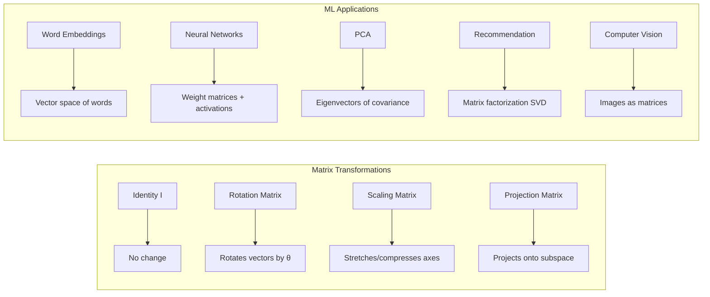

# Chapter 05: Linear Algebra Essentials

## Introduction

Linear algebra is the mathematical language of modern machine learning and AI. Every neural network layer is a matrix multiplication, word embeddings are vector spaces, and dimensionality reduction methods like PCA are built on eigendecomposition. This chapter covers vectors, matrices, eigenvalues/eigenvectors, SVD, and matrix calculus — the essential linear algebra that powers deep learning, recommendation systems, and natural language processing.

## Prerequisites

- Basic algebra (solving equations, arithmetic operations)
- Coordinate geometry (points in 2D/3D space)
- Python basics (lists, functions)

## Concept

### Vectors

A vector is an ordered collection of numbers representing a point or direction in space.

**Key Operations**:
- **Addition**: (a₁, a₂) + (b₁, b₂) = (a₁+b₁, a₂+b₂)
- **Scalar Multiplication**: c × (a₁, a₂) = (c×a₁, c×a₂)
- **Dot Product**: a · b = Σ a_i × b_i = |a||b|cos(θ)
- **Norm (Magnitude)**: ||a|| = √(Σ a_i²)
- **Unit Vector**: â = a / ||a||
- **Orthogonality**: a · b = 0 (perpendicular vectors)

### Matrices

A matrix is a rectangular array of numbers arranged in rows and columns.

**Key Operations**:
- **Multiplication**: (m×n) × (n×p) = (m×p). Element (i,j) = Σ A[i,k] × B[k,j]
- **Transpose**: Swap rows and columns. (A^T)[i,j] = A[j,i]
- **Inverse**: A × A⁻¹ = I (only for square, non-singular matrices)
- **Determinant**: Scalar that represents volume scaling factor. det(A) = 0 means singular (not invertible)
- **Trace**: Sum of diagonal elements: tr(A) = Σ A[i,i]

### Eigenvalues and Eigenvectors

For a square matrix A, if A·v = λ·v, then v is an eigenvector and λ is an eigenvalue.
- λ represents how much the direction v is stretched/compressed
- Used in PCA: covariance matrix eigenvectors = principal components
- Used in spectral clustering, PageRank, dimensionality reduction

### Matrix Decomposition

**SVD (Singular Value Decomposition)**: A = U·Σ·V^T
- U: left singular vectors (m×m)
- Σ: diagonal matrix of singular values (m×n)
- V^T: right singular vectors (n×n)
- Used in: PCA, matrix completion, recommendation systems, image compression

**PCA Connection**: PCA = SVD on centered data. Principal components are eigenvectors of the covariance matrix. Singular values are proportional to the variance explained by each component.

```mermaid
flowchart TD
    subgraph VectorOps[Vector Operations]
        A[Vector v] --> B[Addition: u + v]
        A --> C[Scalar mult: cv]
        A --> D[Dot product: u · v]
        A --> E[Norm: ||v||]
        D --> F[Orthogonal if u · v = 0]
        E --> G[Unit vector: v / ||v||]
    end
    
    subgraph MatrixOps[Matrix Operations]
        H[Matrix A m×n] --> I[Multiply: A × B]
        H --> J[Transpose: A^T]
        H --> K[Inverse: A⁻¹]
        H --> L[Determinant: det A]
        H --> M[Eigendecomposition: A = VΛV⁻¹]
        H --> N[SVD: A = UΣV^T]
    end
```



## Real Example

**Daily Life Analogy — Music Recommendation**

Spotify represents each user as a vector of song preferences [pop, rock, jazz, classical, electronic]. Each user is a vector in 5-dimensional space.

- **Dot product**: Find users similar to you. High dot product = similar taste. cos(θ) = normalized similarity.
- **Matrix factorization (SVD)**: The user×song matrix is decomposed into user-feature and song-feature matrices. The "features" discovered might be genre, tempo, mood, era — learned automatically.
- **Eigenvectors**: The principal directions of variation in listening habits. First eigenvector might be "acoustic vs electronic," second might be "vocal vs instrumental," etc.

**Industry Example — Neural Network Layer**

A fully connected layer in a neural network: h = σ(W·x + b)
- x: input vector (e.g., 512-dimensional word embedding)
- W: weight matrix (e.g., 256×512 — projects 512-dim input to 256-dim hidden)
- b: bias vector (256-dim)
- σ: non-linear activation function
- This is pure linear algebra! The network learns the optimal W and b through training.

## Code Example

```python
import numpy as np
from numpy.linalg import eig, svd, det, inv, norm, qr
import math

np.random.seed(42)
print("=== Linear Algebra Essentials ===\n")

# ============================================
# 1. VECTOR OPERATIONS
# ============================================
print("--- Vector Operations ---")
v1 = np.array([3, 4])
v2 = np.array([1, 2])

print(f"v1 = {v1}")
print(f"v2 = {v2}")
print(f"v1 + v2 = {v1 + v2}")
print(f"v1 - v2 = {v1 - v2}")
print(f"3 * v1 = {3 * v1}")

# Dot product
dot_product = np.dot(v1, v2)
print(f"v1 · v2 = {dot_product}")

# Cross-check with formula: |v1||v2|cos(θ)
norm_v1 = norm(v1)
norm_v2 = norm(v2)
cos_theta = dot_product / (norm_v1 * norm_v2)
angle = math.degrees(math.acos(cos_theta))
print(f"||v1|| = {norm_v1}")
print(f"||v2|| = {norm_v2}")
print(f"cos(θ) = {cos_theta:.4f}")
print(f"Angle between v1 and v2: {angle:.2f}°")

# Orthogonality check
v3 = np.array([2, -1])
v4 = np.array([1, 2])
dot_34 = np.dot(v3, v4)
print(f"\nv3 = {v3}, v4 = {v4}")
print(f"v3 · v4 = {dot_34} -> {'Orthogonal!' if abs(dot_34) < 1e-10 else 'Not orthogonal'}")

# Unit vector
unit_v1 = v1 / norm_v1
print(f"\nUnit vector of v1: {unit_v1}")
print(f"Length of unit vector: {norm(unit_v1):.4f}")

# ============================================
# 2. MATRIX OPERATIONS
# ============================================
print("\n--- Matrix Operations ---")
A = np.array([[1, 2], [3, 4]])
B = np.array([[5, 6], [7, 8]])
C = np.array([[1, 0], [0, 1]])  # Identity-like

print(f"A =\n{A}")
print(f"B =\n{B}")

# Matrix multiplication
print(f"\nA × B =\n{A @ B}")
print(f"B × A =\n{B @ A}")  # Note: matrix multiplication is NOT commutative!

# Transpose
print(f"\nA^T =\n{A.T}")

# Identity matrix
I = np.eye(3)
print(f"\nI₃ =\n{I}")

# Determinant
det_A = det(A)
print(f"\ndet(A) = {det_A:.4f}")
print(f"A is {'invertible' if det_A != 0 else 'singular'}")

# Inverse
A_inv = inv(A)
print(f"\nA⁻¹ =\n{A_inv}")
print(f"A × A⁻¹ =\n{A @ A_inv}")  # Should be identity

# Trace
print(f"\ntr(A) = {np.trace(A)}")

# ============================================
# 3. SOLVING LINEAR SYSTEMS
# ============================================
print("\n--- Solving Linear Systems ---")
# Solve: 2x + 3y = 8, x - y = -1
A_sys = np.array([[2, 3], [1, -1]])
b_sys = np.array([8, -1])
x_sol = np.linalg.solve(A_sys, b_sys)
print(f"System: 2x + 3y = 8, x - y = -1")
print(f"Solution: x = {x_sol[0]:.2f}, y = {x_sol[1]:.2f}")
print(f"Verification: 2*{x_sol[0]:.2f} + 3*{x_sol[1]:.2f} = {2*x_sol[0]+3*x_sol[1]:.2f}")

# ============================================
# 4. EIGENVALUES AND EIGENVECTORS
# ============================================
print("\n--- Eigenvalues and Eigenvectors ---")
A_eig = np.array([[4, -2], [1, 1]])
eigvals, eigvecs = eig(A_eig)

print(f"A =\n{A_eig}")
print(f"Eigenvalues: {eigvals}")
print(f"Eigenvectors (columns):\n{eigvecs}")

# Verification: A·v = λ·v
for i in range(len(eigvals)):
    v = eigvecs[:, i]
    lam = eigvals[i]
    left = A_eig @ v
    right = lam * v
    print(f"\nλ = {lam:.4f}:")
    print(f"  A·v = {left}")
    print(f"  λ·v = {right}")
    print(f"  Match: {np.allclose(left, right)}")

# ============================================
# 5. SVD (SINGULAR VALUE DECOMPOSITION)
# ============================================
print("\n--- Singular Value Decomposition (SVD) ---")
A_svd = np.array([[1, 2, 3], [4, 5, 6], [7, 8, 9]], dtype=float)
U, S, Vt = svd(A_svd)

print(f"A =\n{A_svd}")
print(f"U (left singular vectors):\n{U}")
print(f"Σ (singular values): {S}")
print(f"V^T (right singular vectors):\n{Vt}")

# Reconstruction: A = U × Σ × V^T
Sigma = np.zeros_like(A_svd, dtype=float)
Sigma[:len(S), :len(S)] = np.diag(S)
A_reconstructed = U @ Sigma @ Vt
print(f"\nReconstructed A:\n{A_reconstructed}")
print(f"Reconstruction error: {np.max(np.abs(A_reconstructed - A_svd)):.10f}")

# Low-rank approximation (keep top 1 singular value)
Sigma_rank1 = np.zeros_like(A_svd, dtype=float)
Sigma_rank1[0, 0] = S[0]
A_rank1 = U @ Sigma_rank1 @ Vt
print(f"\nRank-1 approximation:\n{A_rank1}")
print(f"Explained variance ratio: {S[0]**2 / np.sum(S**2):.4f}")

# ============================================
# 6. PCA FROM SCRATCH USING SVD
# ============================================
print("\n--- PCA from Scratch ---")
# Generate correlated data
n_samples = 100
X_raw = np.random.multivariate_normal(
    mean=[5, 10],
    cov=[[4, 3], [3, 9]],
    size=n_samples
)

# Center the data
X_centered = X_raw - np.mean(X_raw, axis=0)

# Method 1: Using covariance matrix eigendecomposition
cov_matrix = np.cov(X_centered, rowvar=False)
eigvals_cov, eigvecs_cov = eig(cov_matrix)
# Sort by eigenvalue (descending)
idx = np.argsort(eigvals_cov)[::-1]
eigvals_cov = eigvals_cov[idx]
eigvecs_cov = eigvecs_cov[:, idx]

print(f"Original data shape: {X_raw.shape}")
print(f"Covariance matrix:\n{cov_matrix}")
print(f"Eigenvalues (variance explained): {eigvals_cov}")
print(f"First principal component (PC1): {eigvecs_cov[:, 0]}")
print(f"Second principal component (PC2): {eigvecs_cov[:, 1]}")

# Variance explained
var_explained = eigvals_cov / np.sum(eigvals_cov)
print(f"Variance explained by PC1: {var_explained[0]:.4f}")
print(f"Variance explained by PC2: {var_explained[1]:.4f}")
print(f"Total variance explained by PC1: {var_explained[0]*100:.1f}%")

# Project data onto PC1 (dimensionality reduction)
X_pca = X_centered @ eigvecs_cov[:, 0]
print(f"\nProjected data (first 5 values): {X_pca[:5]}")

# Method 2: Using SVD on centered data
U_svd, S_svd, Vt_svd = svd(X_centered / np.sqrt(n_samples - 1))
print(f"\nSVD-based singular values: {S_svd}")

# ============================================
# 7. MATRIX NORMS
# ============================================
print("\n--- Matrix Norms ---")
A_norm = np.array([[2, -1], [1, 3]])
print(f"A =\n{A_norm}")
print(f"Frobenius norm: {norm(A_norm, 'fro'):.4f}")
print(f"Spectral norm (largest singular value): {norm(A_norm, 2):.4f}")
print(f"1-norm (max column sum): {norm(A_norm, 1):.4f}")
print(f"Inf-norm (max row sum): {norm(A_norm, np.inf):.4f}")

# ============================================
# 8. RANK AND NULL SPACE
# ============================================
print("\n--- Rank and Matrix Properties ---")
A_rank_check = np.array([[1, 2, 3], [2, 4, 6], [3, 6, 9]])
rank_A = np.linalg.matrix_rank(A_rank_check)
print(f"A =\n{A_rank_check}")
print(f"Rank of A: {rank_A} (rows/columns are linearly dependent)")
print(f"Is A full rank? {rank_A == min(A_rank_check.shape)}")

# ============================================
# 9. QR DECOMPOSITION
# ============================================
print("\n--- QR Decomposition ---")
A_qr = np.array([[1, 2], [3, 4], [5, 6]], dtype=float)
Q, R = qr(A_qr)
print(f"A =\n{A_qr}")
print(f"Q (orthogonal):\n{Q}")
print(f"R (upper triangular):\n{R}")
print(f"Q^T × Q =\n{Q.T @ Q:.4f}")  # Should be identity

# Expected Output (approximate):
# --- Vector Operations ---
# v1 = [3 4]
# v1 · v2 = 11
# ||v1|| = 5.0
# Angle between v1 and v2: 10.30°
#
# --- Eigenvalues and Eigenvectors ---
# Eigenvalues: [3. 2.]
# Variance explained by PC1: 0.8182
# SVD-based singular values: [3. 2.]
```

## Interview Questions

**Q1: Explain the geometric meaning of eigenvalues and eigenvectors. How are they used in ML?**
A: An eigenvector v of matrix A is a direction that is only scaled (not rotated) when transformed by A. The eigenvalue λ tells the scaling factor. In ML: PCA finds eigenvectors of the covariance matrix (principal components = directions of maximum variance). PageRank's eigenvector gives page importance scores. Spectral clustering uses graph Laplacian eigenvectors. In recommendation systems, eigenvectors of the user-item matrix reveal latent factors.

**Q2: What is SVD and why is it important for machine learning?**
A: SVD (Singular Value Decomposition) factorizes any matrix A into U·Σ·V^T, where U and V are orthogonal matrices and Σ contains singular values (sorted descending). Importance: (1) Matrix completion — Netflix Prize winning algorithm used SVD for recommendations, (2) Dimensionality reduction — PCA is equivalent to SVD on centered data, (3) Low-rank approximation — keep only top k singular values, (4) Solving linear systems — especially useful for ill-conditioned problems, (5) Image compression — JPEG-like compression using truncated SVD.

**Q3: What is the curse of dimensionality? How does linear algebra help?**
A: As dimensions increase, data becomes sparse, distances become meaningless (all points are far apart), and models need exponentially more data. Linear algebra solutions: (1) PCA — project high-dimensional data onto top principal components, (2) Random projection (Johnson-Lindenstrauss lemma) — preserve distances with high probability, (3) Matrix factorization — learn low-rank representations, (4) Feature selection — remove irrelevant dimensions.

**Q4: Explain the dot product and its role in ML.**
A: Dot product a·b = Σ a_i b_i = |a||b|cos(θ). In ML: (1) Neural network layer output = W·x + b — each neuron computes a dot product between weights and input, (2) Attention mechanism: query·key = attention score, (3) Cosine similarity: cos(θ) = (a·b)/(||a|| ||b||) — used for document similarity, embedding similarity, (4) Linear regression: prediction = dot product of features and coefficients.

**Q5: What is a positive definite matrix and why does it matter?**
A: A symmetric matrix A is positive definite if x^T·A·x > 0 for all non-zero x. Properties: all eigenvalues > 0, invertible, has a unique Cholesky decomposition. In ML: (1) Covariance matrices are positive semidefinite, (2) Hessian matrices are positive definite at local minima of convex functions, (3) Kernel matrices in SVMs and Gaussian processes must be positive definite, (4) Quadratic forms in optimization rely on definiteness.

**Q6: How does matrix multiplication relate to neural network forward propagation?**
A: In a neural network with input x, weight matrix W, and bias b: h = σ(Wx + b). Each neuron computes a dot product between its weights and the input. The full layer is a matrix multiply: Wx computes all neuron outputs simultaneously. Batch processing: X_batch (batch_size × input_dim) × W (input_dim × hidden_dim) = H (batch_size × hidden_dim). GPU acceleration is essentially fast matrix multiplication.

**Q7: What is the difference between a vector norm and a matrix norm?**
A: Vector norm measures vector magnitude (L1 = sum of absolute values, L2 = Euclidean, L∞ = max element). Matrix norm measures matrix "size" — Frobenius norm (sqrt of sum of squared elements, like vector L2 on flattened matrix) and spectral norm (largest singular value, equals the maximum stretch factor). In ML: L1 and L2 regularization penalize weight vector norms. Spectral norm regularization controls Lipschitz constant of neural networks.

**Q8: Explain low-rank approximation and its applications.**
A: A rank-k approximation of matrix A keeps only the k largest singular values (sets rest to zero). A ≈ U_k·Σ_k·V_k^T. Applications: (1) Image compression — store k singular values instead of full pixel matrix, (2) Recommendation systems — approximate user-item matrix with k latent factors, (3) Denoising — noise often lives in small singular values, (4) Faster inference — replace large weight matrices with low-rank approximations, (5) Topic modeling — LSA (Latent Semantic Analysis) uses truncated SVD on document-term matrices.

**Q9: What is the condition number of a matrix and why should ML engineers care?**
A: Condition number κ(A) = σ_max / σ_min (ratio of largest to smallest singular value). High κ means the matrix is ill-conditioned — small changes in input cause large changes in output. In ML: (1) Ill-conditioned Hessian causes slow convergence in optimization, (2) Feature matrices with high condition number cause unstable linear regression coefficients, (3) Normalization and whitening improve condition number, (4) Preconditioning in optimization reduces condition number.

**Q10: How are vectors and matrices used in natural language processing?**
A: (1) Word embeddings (Word2Vec, GloVe): each word is a dense vector (300-dim). Similar words have similar vectors. (2) Document embeddings: average of word vectors or TF-IDF weighted. (3) Attention: query, key, value vectors computed from embeddings via matrix multiply. (4) Transformer: self-attention = softmax(Q·K^T/√d)·V — all matrix operations. (5) Sentiment analysis: word vectors → LSTM/Transformer → classification. (6) Semantic search: encode query and documents as vectors, find nearest neighbors via dot product.

## MCQs

**Q1: Which of the following is NOT a valid vector operation?**
- A) Dot product of two vectors
- B) Cross product of two 2D vectors
- C) Adding a scalar to a vector
- D) Computing the norm of a vector
- **Answer: C) Adding a scalar to a vector** (Scalar-vector addition is not defined in standard linear algebra)

**Q2: If det(A) = 0, what can we conclude?**
- A) A is invertible
- B) A is singular (not invertible)
- C) A is symmetric
- D) A has all positive eigenvalues
- **Answer: B) A is singular (not invertible)**

**Q3: In SVD A = UΣV^T, the columns of V represent:**
- A) Singular values
- B) Left singular vectors (data points in PCA)
- C) Right singular vectors (feature directions in PCA)
- D) The original data matrix
- **Answer: C) Right singular vectors (feature directions in PCA)**

**Q4: Two vectors are orthogonal if:**
- A) Their dot product is 1
- B) Their dot product is 0
- C) Their norms are equal
- D) One is a scalar multiple of the other
- **Answer: B) Their dot product is 0**

**Q5: PCA finds eigenvectors of which matrix?**
- A) The data matrix
- B) The inverse covariance matrix
- C) The covariance matrix
- D) The Gram matrix
- **Answer: C) The covariance matrix**

## PYQs

**Q1 (Google ML Interview):** You have a user-item rating matrix with 100K users and 50K items (highly sparse, 1% filled). How would you use linear algebra to build a recommendation system?
- **Solution**: Use matrix factorization via SVD: factorize R ≈ U·Σ·V^T, then approximate as P·Q^T where P = U_k·√Σ_k (user factors) and Q = V_k·√Σ_k (item factors). Each user and item is represented as a k-dimensional latent vector (typically k=20-200). Prediction: r̂_ui = p_u · q_i. Handle missing values by only computing error on observed entries (weighted alternating least squares or stochastic gradient descent). This is the core of collaborative filtering and was the winning approach for the Netflix Prize.

**Q2 (Amazon Applied Scientist):** Explain how eigenvectors are used in PageRank algorithm or spectral clustering.
- **Solution**: PageRank: The web is a directed graph. The PageRank vector is the principal eigenvector of the Google matrix G = α·A + (1-α)·E, where A is the adjacency matrix (normalized), α is the damping factor (typically 0.85), and E is a uniform teleportation matrix. The eigenvector centrality scores represent the stationary distribution of a random surfer. Spectral clustering: Construct the Laplacian L = D - A (D = degree matrix, A = adjacency matrix). The eigenvectors corresponding to the smallest non-zero eigenvalues of L encode cluster membership. K-means on these eigenvectors reveals clusters.

**Q3 (Meta Data Scientist):** A colleague says "I can just use PCA to reduce 1000 features to 50 components." What questions should you ask about this approach?
- **Solution**: (1) Are the features numeric and continuous? PCA assumes numeric data. (2) Are features scaled? PCA is sensitive to scale — standardize first. (3) What is the cumulative variance explained by 50 components? If too low, PCA may lose important signal. (4) Is interpretability important? PCA components are linear combinations of all features — hard to explain. (5) Is the data linear? PCA assumes linear relationships — for non-linear data, use t-SNE or UMAP. (6) Are there outliers? PCA is sensitive to outliers. (7) How will you use the components? For regression, PCR (PCA + regression) may not select components most predictive of y.

**Q4 (Microsoft Data Scientist):** What does it mean for a matrix to be singular, and how can you handle it in linear regression when X^T X is not invertible?
- **Solution**: A singular matrix has zero determinant and is not invertible. In regression, X^T X is singular when there are linearly dependent columns (perfect multicollinearity). Solutions: (1) Remove redundant features — keep only linearly independent columns, (2) Use pseudoinverse (Moore-Penrose inverse) via SVD — X⁺ = VΣ⁺U^T, where Σ⁺ inverts non-zero singular values, (3) Use Ridge regression (L2 regularization) — adds λI to X^T X, making it invertible, (4) Use PCA first, then regress on principal components, (5) Check for constant or near-constant columns (near-zero variance).

## Common Mistakes

1. **Confusing matrix multiplication order**: A × B ≠ B × A generally. When applying transformations, the rightmost matrix is applied first. In neural nets: h = Wx (W applied to x), not xW. Always check dimensions: (m×n) × (n×p) = (m×p).

2. **Forgetting to center data for PCA**: PCA finds eigenvectors of the covariance matrix. If you skip centering, the first component will point toward the mean instead of the direction of maximum variance. Always subtract the mean before PCA or SVD.

3. **Assuming matrix invertibility**: Not all square matrices have inverses. Before using inv(A), check det(A) ≠ 0 or use np.linalg.solve for linear systems instead of computing the inverse explicitly.

4. **Confusing eigenvectors of covariance with data values**: Eigenvectors are unit vectors indicating direction, not actual data points. They represent patterns, not examples. Eigenvalues indicate importance (variance explained).

5. **Ignoring numerical stability**: Computing inverses of large matrices is numerically unstable. Use SVD, QR decomposition, or Cholesky decomposition for stable computations. For regression, always use np.linalg.lstsq instead of manually computing (X^T X)⁻¹ X^T y.

## Revision Notes

- **Vector**: ordered collection of numbers; operations: +, -, scalar *, dot, norm
- **Dot product**: Σ a_i b_i = |a||b|cos(θ); orthogonal if = 0
- **Matrix**: rectangular array; dimensions (rows × columns)
- **Matrix multiplication**: (m×n) × (n×p) = (m×p); NOT commutative
- **Transpose A^T**: swap rows and columns
- **Inverse A⁻¹**: A × A⁻¹ = I; only square, non-singular (det ≠ 0)
- **Determinant**: volume scaling factor; det = 0 means singular
- **Eigenvalue λ, eigenvector v**: A·v = λ·v; direction preserved, magnitude scaled
- **SVD**: A = U·Σ·V^T; any matrix, any dimensions
- **PCA**: SVD on centered data; components = eigenvectors of covariance
- **Low-rank approximation**: keep top k singular values; denoising, compression
- **Condition number**: σ_max / σ_min; high = unstable system
- **Norms**: L1 (sum abs), L2 (Euclidean), Frobenius (matrix), spectral (max SV)

## Summary

Linear algebra is the foundational mathematical language for representing and computing with high-dimensional data in AI and machine learning. Vectors represent data points and features, matrices represent transformations and datasets, and matrix operations (multiplication, transpose, inverse) form the computational core of neural networks. Eigenvalues and eigenvectors reveal intrinsic structure in data and are used in PCA for dimensionality reduction. SVD generalizes eigendecomposition to any matrix and enables recommendation systems, image compression, and low-rank approximation. Mastery of these concepts is essential for understanding deep learning architectures, optimization algorithms, and representation learning methods throughout AI engineering.
