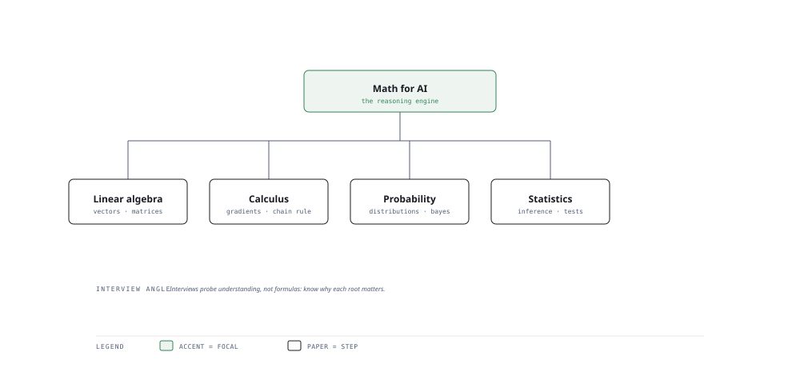

# Visual Notes — The Math Under Every Model

> One diagram, the full picture. This page is meant to be glanced at before reading the chapters, and again before interviews.

# What the diagram shows

1. **Linear algebra** — Tensors, matrices, dot products — the substrate of every neural network.
1. **Calculus** — Gradients and the chain rule drive optimisation.
1. **Probability & stats** — Distributions, hypothesis tests and A/B testing measure certainty and effect.

# Why this matters for placement

- Even applied roles probe math basics: variance, Bayes, and "what does a p-value mean?".
- Relating each math area to concrete ML use beats rote formula recall.

# Quick revision

- Linear algebra: matrix multiply as feature transform; eigenvectors in PCA/SVD.
- Calculus: ∂loss/∂weight = chain rule; gradient descent walks toward the minimum.
- Probability: Bayes rule, likelihood vs prior, conditional independence.
- Stats: p-value (prob of observing data under H0), confidence intervals, type I/II error.
- A/B testing: sample size, significance, effect size, guardrail metrics.

# Related chapters

- [Descriptive statistics](01-descriptive-statistics.md)
- [Probability basics](02-probability-basics.md)
- [Linear algebra essentials](05-linear-algebra-essentials.md)
- [Calculus for ML](06-calculus-for-ml.md)

---

**One-line answer for interviews:** *"Linear algebra, calculus, probability and statistics support everything you build — one model at a time."*
