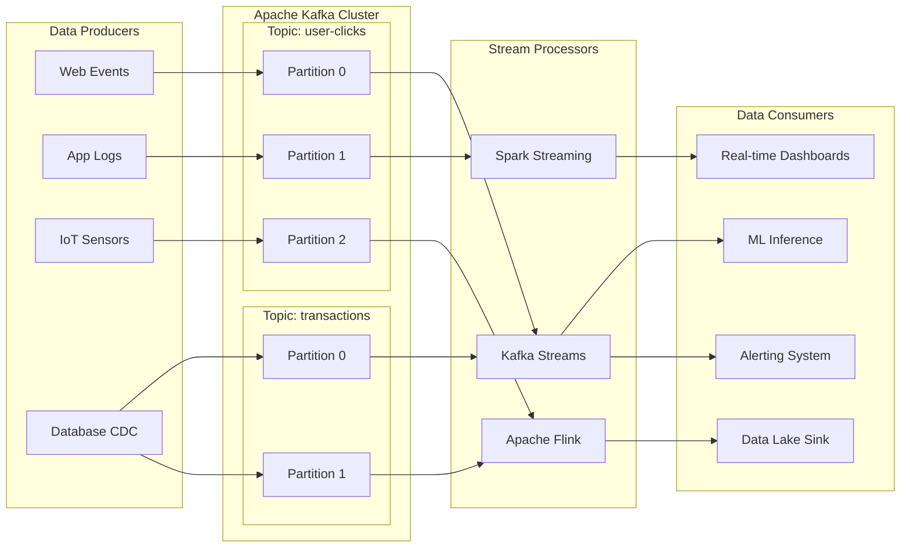

# 04 — Streaming & Real-Time Data

## Learning Objectives

- Explain the difference between batch and stream processing with examples
- Describe at-least-once vs exactly-once semantics
- Describe Kafka topics, partitions, producers, consumers, and consumer groups
- Apply tumbling, sliding, and session windows with watermarks to handle late data
- Distinguish event time from processing time for accurate windowed aggregations

## Introduction

Batch processing is insufficient when ML models need sub-second updates — fraud detection must flag transactions in milliseconds, recommendation systems must react to user clicks instantly, and monitoring dashboards must display live metrics. Stream processing ingests and processes data continuously, enabling real-time AI. Apache Kafka is the industry-standard event streaming platform, and this chapter covers Kafka fundamentals, stream processing with PySpark Structured Streaming, windowing, watermarks, and exactly-once semantics.

## Prerequisites

- Understanding of batch ETL from Chapter 01
- Familiarity with Apache Spark basics from Chapter 03
- Basic networking concepts (TCP, ports, message queues)
- Python threading and async concepts (helpful)

## Key Terminology

| Term | Definition |
|------|------------|
| Event | A record of something that happened (timestamp, payload) |
| Stream | An unbounded sequence of events ordered by time |
| Topic | A named channel in Kafka where events are published |
| Partition | A division of a topic for parallelism and ordering |
| Producer | Application that publishes events to Kafka topics |
| Consumer | Application that subscribes to and processes events |
| Consumer Group | Set of consumers that coordinate to read partitions |
| Offset | Unique position of an event within a partition |
| Broker | A Kafka server that stores and serves data |
| Exactly-Once Semantics | Guarantee that each event is processed exactly once |
| Watermark | Threshold for handling late-arriving data |
| Windowing | Grouping events within time boundaries |

## Chapter at a Glance

| Section | Topic | Key Concept |
|---------|-------|-------------|
| 1.1 | Batch vs Stream | Continuous processing vs scheduled batch |
| 1.2 | Kafka Fundamentals | Topics, partitions, producers, consumers |
| 1.3 | Consumer Groups | Scalable parallel consumption |
| 1.4 | Exactly-Once Semantics | Idempotent producers, transactional consumers |
| 1.5 | Stream Processing | Kafka Streams, PySpark Structured Streaming |
| 1.6 | Windowing & Watermarks | Tumbling, sliding, session windows; late data handling |
| 1.7 | Event Time vs Processing Time | Choosing the right timestamp |

## Chapter Roadmap



## 1.1 Batch vs Stream Processing

Batch processing runs on bounded data at scheduled intervals. Stream processing runs continuously on unbounded data, producing results with sub-second latency.

```python
import time
import random
from datetime import datetime
from typing import List, Dict, Callable

class BatchProcessor:
    """Process data in fixed batches at scheduled intervals."""

    def __init__(self, batch_interval_hours: int = 24):
        self.batch_interval = batch_interval_hours
        self.batch_id = 0

    def process_batch(self, data: List[Dict]) -> List[Dict]:
        self.batch_id += 1
        print(f"[Batch #{self.batch_id}] Processing {len(data)} records "
              f"(interval: {self.batch_interval}h)")
        # Simulate computation
        time.sleep(0.5)
        results = [{"batch_id": self.batch_id, **record, "processed": True} for record in data]
        print(f"[Batch #{self.batch_id}] Complete: {len(results)} results")
        return results

class StreamProcessor:
    """Process data continuously as it arrives."""

    def __init__(self, window_seconds: int = 10):
        self.window = window_seconds
        self.buffer: List[Dict] = []
        self.total_processed = 0

    def on_event(self, event: Dict) -> Dict:
        """Process a single event as it arrives."""
        latency_ms = random.uniform(5, 50)
        self.total_processed += 1
        result = {**event, "processing_time_ms": round(latency_ms, 2), "processed": True}
        print(f"[Stream] Event #{self.total_processed}: {event.get('event_type', 'unknown')} "
              f"in {latency_ms:.1f}ms")
        return result

    def process_window(self, events: List[Dict]) -> List[Dict]:
        """Process a micro-batch window of events."""
        print(f"[Window {self.window}s] Processing {len(events)} events")
        results = []
        for event in events:
            result = self.on_event(event)
            results.append(result)
        print(f"[Window] Complete: {len(results)} events in window")
        return results

# Compare batch vs stream
batch = BatchProcessor(batch_interval_hours=24)
stream = StreamProcessor(window_seconds=10)

# Simulate 100 events arriving over time
all_events = [
    {"event_id": i, "event_type": random.choice(["click", "view", "purchase"]),
     "timestamp": datetime.now().isoformat(), "value": random.randint(1, 100)}
    for i in range(100)
]

print("=== Batch Processing ===")
batch.process_batch(all_events)

print("\n=== Stream Processing ===")
for event in all_events[:10]:  # Process first 10 as stream
    stream.on_event(event)
    time.sleep(0.05)
# Expected output contrasts batch latency (hours) vs stream latency (ms)
```

## 1.2 Apache Kafka Fundamentals

Kafka is a distributed event streaming platform. Producers write events to topics; topics are divided into partitions for parallelism; consumers read from partitions.

```python
from dataclasses import dataclass, field
from typing import List, Optional, Dict, Any
import json
import time
import uuid
from collections import defaultdict

@dataclass
class KafkaMessage:
    key: str
    value: Dict
    topic: str
    partition: int = 0
    offset: int = 0
    timestamp: float = field(default_factory=time.time)

class KafkaBroker:
    """Simulate a single Kafka broker for learning."""

    def __init__(self, broker_id: int = 0):
        self.broker_id = broker_id
        self.topics: Dict[str, Dict[int, List[KafkaMessage]]] = {}
        self.partition_offsets: Dict[str, Dict[int, int]] = {}

    def create_topic(self, topic: str, partitions: int = 1, replication_factor: int = 1):
        self.topics[topic] = {i: [] for i in range(partitions)}
        self.partition_offsets[topic] = {i: 0 for i in range(partitions)}
        print(f"Topic '{topic}' created: {partitions} partitions, RF={replication_factor}")

    def produce(self, topic: str, key: str, value: Dict) -> KafkaMessage:
        if topic not in self.topics:
            raise ValueError(f"Topic {topic} does not exist")
        num_partitions = len(self.topics[topic])
        partition = abs(hash(key)) % num_partitions
        offset = self.partition_offsets[topic][partition]
        message = KafkaMessage(
            key=key, value=value, topic=topic,
            partition=partition, offset=offset,
        )
        self.topics[topic][partition].append(message)
        self.partition_offsets[topic][partition] += 1
        print(f"Produced -> {topic}[p{partition}@o{offset}]: key={key}")
        return message

    def consume(self, topic: str, partition: int, offset: int = 0) -> Optional[KafkaMessage]:
        if topic not in self.topics or partition not in self.topics[topic]:
            return None
        partition_data = self.topics[topic][partition]
        if offset >= len(partition_data):
            return None
        msg = partition_data[offset]
        print(f"Consumed <- {topic}[p{partition}@o{offset}]: key={msg.key}")
        return msg

    def get_high_watermark(self, topic: str, partition: int) -> int:
        return self.partition_offsets.get(topic, {}).get(partition, 0)

class KafkaProducer:
    """Simulate Kafka producer with configurable partitioning."""

    def __init__(self, broker: KafkaBroker):
        self.broker = broker
        self.acks = 0
        self.retries = 0

    def send(self, topic: str, key: str, value: Dict) -> KafkaMessage:
        try:
            msg = self.broker.produce(topic, key, value)
            self.acks += 1
            return msg
        except Exception as e:
            self.retries += 1
            print(f"Send failed (retry {self.retries}): {e}")
            raise

class KafkaConsumer:
    """Simulate Kafka consumer with partition assignment and offset tracking."""

    def __init__(self, broker: KafkaBroker, group_id: str, auto_offset_reset: str = "earliest"):
        self.broker = broker
        self.group_id = group_id
        self.auto_offset_reset = auto_offset_reset
        self.assigned_partitions: List[tuple] = []
        self.current_offsets: Dict[tuple, int] = {}
        self.commit_offsets: Dict[tuple, int] = {}

    def assign(self, topic: str, partitions: List[int]):
        self.assigned_partitions = [(topic, p) for p in partitions]
        for tp in self.assigned_partitions:
            if self.auto_offset_reset == "earliest":
                self.current_offsets[tp] = 0
            elif self.auto_offset_reset == "latest":
                self.current_offsets[tp] = self.broker.get_high_watermark(tp[0], tp[1])
            self.commit_offsets[tp] = self.current_offsets[tp]
        topics_str = ", ".join(f"{t}[p{p}]" for t, p in self.assigned_partitions)
        print(f"Consumer (group={self.group_id}) assigned: {topics_str}")

    def poll(self) -> Optional[KafkaMessage]:
        for tp in self.assigned_partitions:
            topic, partition = tp
            offset = self.current_offsets.get(tp, 0)
            msg = self.broker.consume(topic, partition, offset)
            if msg:
                self.current_offsets[tp] = offset + 1
                return msg
        return None

    def commit(self):
        self.commit_offsets = self.current_offsets.copy()
        print(f"Consumer (group={self.group_id}) committed offsets: {self.commit_offsets}")

# Example
broker = KafkaBroker(broker_id=1)
broker.create_topic("user-clicks", partitions=3, replication_factor=3)
broker.create_topic("transactions", partitions=2, replication_factor=3)

producer = KafkaProducer(broker)
for i in range(10):
    producer.send("user-clicks", f"user_{i % 5}", {
        "user_id": i % 5,
        "event_type": random.choice(["click", "view"]),
        "page": f"/product/{random.randint(1, 100)}",
        "timestamp": time.time(),
    })

consumer = KafkaConsumer(broker, group_id="click-processor")
consumer.assign("user-clicks", [0, 1, 2])
for _ in range(5):
    msg = consumer.poll()
    if msg:
        print(f"  Received: {msg.key} -> {msg.value['event_type']}")
consumer.commit()
# Expected output shows Kafka produce/consume flow
```

## 1.3 Consumer Groups & Parallelism

Consumer groups enable horizontal scaling. Each partition is consumed by exactly one consumer in a group, enabling parallel processing.

```python
class ConsumerGroup:
    """Simulate Kafka consumer group rebalancing."""

    def __init__(self, group_id: str):
        self.group_id = group_id
        self.members: List[KafkaConsumer] = []
        self._assignment_strategy = "range"

    def add_member(self, consumer: KafkaConsumer):
        self.members.append(consumer)
        self._rebalance()
        print(f"Consumer group '{self.group_id}': {len(self.members)} members")

    def remove_member(self, consumer_id: str):
        self.members = [m for m in self.members if m.group_id != consumer_id]
        self._rebalance()
        print(f"Consumer removed. Group '{self.group_id}': {len(self.members)} members")

    def _rebalance(self):
        """Assign partitions to consumers (range assign strategy)."""
        num_members = len(self.members)
        if num_members == 0:
            return
        # Simplified range assignment
        all_partitions = [(f"topic-{t}", p) for t in range(1) for p in range(6)]
        partitions_per_member = len(all_partitions) // num_members
        remainder = len(all_partitions) % num_members
        start = 0
        for i, member in enumerate(self.members):
            extra = 1 if i < remainder else 0
            member_partitions = all_partitions[start:start + partitions_per_member + extra]
            start += partitions_per_member + extra
            # Clear and reassign
            topics_seen = set()
            for t, p in member_partitions:
                topics_seen.add(t)
            for t in topics_seen:
                ps = [p for tp, p in member_partitions if tp == t]
                member.assign(t, ps)
        print(f"Rebalanced {len(all_partitions)} partitions across {num_members} consumers")

    def process_all(self, messages: List[KafkaMessage]):
        """Distribute messages to consumers."""
        for msg in messages:
            for member in self.members:
                if (msg.topic, msg.partition) in member.current_offsets:
                    member.poll()
                    member.commit()

# Example
broker2 = KafkaBroker(broker_id=2)
broker2.create_topic("events", partitions=6)

group = ConsumerGroup("my-group")
for i in range(3):
    c = KafkaConsumer(broker2, f"consumer-{i}")
    group.add_member(c)

producer2 = KafkaProducer(broker2)
for i in range(12):
    producer2.send("events", f"key_{i}", {"event_id": i, "value": f"data_{i}"})
```

## 1.4 Exactly-Once Semantics

Exactly-once semantics (EOS) ensures each event is processed exactly once — no duplicates, no gaps. Kafka achieves this through idempotent producers and transactional consumers.

```python
class ExactlyOnceProcessor:
    """Simulate Kafka exactly-once semantics."""

    def __init__(self):
        self.processed_ids: set = set()
        self.pending_transactions: Dict[str, List] = {}
        self.idempotent_producer = IdempotentProducer()

    def process_with_eos(self, event: Dict, transaction_id: str) -> bool:
        """Process event with exactly-once guarantee."""
        event_id = event.get("event_id")
        if not event_id:
            return False

        # Deduplication: skip if already processed
        if event_id in self.processed_ids:
            print(f"  [EOS] Duplicate detected, skipping: {event_id}")
            return True

        # Begin transaction
        self.pending_transactions[transaction_id] = [event]

        try:
            # Process the event
            result = self._execute_transaction(event)
            # Commit: mark as processed
            self.processed_ids.add(event_id)
            self.idempotent_producer.send(event)
            del self.pending_transactions[transaction_id]
            print(f"  [EOS] Committed: {event_id}")
            return True
        except Exception as e:
            # Abort: rollback
            print(f"  [EOS] Aborted: {event_id} ({e})")
            del self.pending_transactions[transaction_id]
            return False

    def _execute_transaction(self, event: Dict) -> Any:
        """Simulate business logic execution."""
        if random.random() < 0.1:
            raise ValueError("Simulated failure")
        return {"status": "success", "event": event}

class IdempotentProducer:
    """Idempotent producer prevents duplicates at the broker level."""

    def __init__(self):
        self.seen_ids: set = set()

    def send(self, event: Dict) -> bool:
        event_id = event.get("event_id")
        if event_id in self.seen_ids:
            return True  # Already sent
        self.seen_ids.add(event_id)
        return True

# Example
processor = ExactlyOnceProcessor()
events = [
    {"event_id": f"evt_{i}", "type": "transaction", "amount": random.randint(10, 1000)}
    for i in range(20)
]
# Introduce a duplicate
events.append(events[0])

for i, event in enumerate(events):
    success = processor.process_with_eos(event, f"txn-{uuid.uuid4()}")
    time.sleep(0.01)
print(f"\nProcessed {len(processor.processed_ids)} unique events (1 duplicate skipped)")
```

## 1.5 Stream Processing with PySpark Structured Streaming

PySpark Structured Streaming treats streams as unbounded DataFrames with continuous processing.

```python
class SparkStructuredStreaming:
    """Simulate Spark Structured Streaming concepts."""

    def __init__(self):
        self.batch_duration = 10  # seconds
        self.processing_details = []

    def read_stream(self, source: str = "kafka") -> 'StreamingDataFrame':
        print(f"Reading stream from {source}")
        return StreamingDataFrame(source)

    def process(self, df: 'StreamingDataFrame', query: str) -> List[Dict]:
        """Simulate running a streaming query."""
        results = []
        for batch_id in range(3):  # Simulate 3 micro-batches
            batch_data = df.next_batch(batch_id)
            print(f"\nBatch {batch_id}: processing {len(batch_data)} events")

            if "filter" in query:
                batch_data = [e for e in batch_data if e.get("value", 0) > 50]
                print(f"  After filter: {len(batch_data)} events")

            if "groupBy" in query:
                from collections import Counter
                counts = Counter(e.get("type", "unknown") for e in batch_data)
                for t, c in counts.most_common():
                    print(f"  Type '{t}': {c} events")

            results.extend(batch_data)
        return results

class StreamingDataFrame:
    """Simulate an unbounded streaming DataFrame."""

    def __init__(self, source: str):
        self.source = source
        self.generated_data = self._generate_data()

    def _generate_data(self) -> List[Dict]:
        data = []
        for i in range(30):
            data.append({
                "event_id": i,
                "type": random.choice(["click", "view", "purchase"]),
                "value": random.randint(1, 100),
                "timestamp": time.time() - random.uniform(0, 60),
            })
        return data

    def next_batch(self, batch_id: int) -> List[Dict]:
        start = batch_id * 10
        end = start + 10
        return self.generated_data[start:end]

    def writeStream(self, output_mode: str = "append") -> 'StreamingQuery':
        return StreamingQuery(output_mode)

    def selectExpr(self, *exprs) -> 'StreamingDataFrame':
        return self

    def groupBy(self, col: str) -> 'GroupedStream':
        return GroupedStream(self, col)

class StreamingQuery:
    """Simulate a continuous streaming query."""

    def __init__(self, output_mode: str):
        self.output_mode = output_mode
        self.is_active = True

    def start(self) -> 'StreamingQuery':
        print(f"Streaming query started (output_mode={self.output_mode})")
        return self

    def awaitTermination(self):
        print("Query running... (awaitTermination)")

    def stop(self):
        self.is_active = False
        print("Query stopped")

class GroupedStream:
    def __init__(self, df: StreamingDataFrame, col: str):
        self.df = df
        self.col = col

    def count(self) -> StreamingDataFrame:
        print(f"Grouped by {self.col}, counting...")
        return self.df

# Example
ss = SparkStructuredStreaming()
df = ss.read_stream("kafka")
results = ss.process(df, "filter+groupBy")
print(f"\nTotal results: {len(results)}")
```

## 1.6 Windowing & Watermarks

Windows group events by time. Tumbling windows are fixed non-overlapping intervals. Sliding windows have overlap. Session windows group bursts of activity. Watermarks handle late data.

```python
from collections import defaultdict
from datetime import datetime, timedelta

class WindowOperation:
    """Simulate streaming window operations."""

    def tumbling_window(self, events: List[Dict], window_size_s: int) -> Dict[int, List]:
        """Fixed non-overlapping windows."""
        windows = defaultdict(list)
        for event in events:
            ts = event.get("timestamp", 0)
            window_start = (ts // window_size_s) * window_size_s
            windows[window_start].append(event)
        print(f"Tumbling window ({window_size_s}s): {len(windows)} windows")
        for w_start in sorted(windows.keys()):
            print(f"  [{w_start}s - {w_start + window_size_s}s]: {len(windows[w_start])} events")
        return dict(windows)

    def sliding_window(self, events: List[Dict], window_size_s: int, slide_s: int) -> Dict[tuple, List]:
        """Overlapping windows."""
        windows = defaultdict(list)
        for event in events:
            ts = event.get("timestamp", 0)
            start = ((ts - window_size_s) // slide_s) * slide_s
            while start <= ts - slide_s:
                start += slide_s
            for s in range(start, ts + 1, slide_s):
                if s <= ts < s + window_size_s:
                    windows[(s, s + window_size_s)].append(event)
        print(f"Sliding window ({window_size_s}s size, {slide_s}s slide): {len(windows)} windows")
        for (s, e) in sorted(windows.keys()):
            print(f"  [{s}s - {e}s]: {len(windows[(s, e)])} events")
        return dict(windows)

    def session_window(self, events: List[Dict], gap_s: int) -> Dict[int, List]:
        """Group events by inactivity gap."""
        sorted_events = sorted(events, key=lambda e: e.get("timestamp", 0))
        windows = {}
        current_session = []
        session_start = None
        session_id = 0
        for event in sorted_events:
            ts = event.get("timestamp", 0)
            if session_start is None:
                session_start = ts
            if current_session and ts - current_session[-1].get("timestamp", 0) > gap_s:
                windows[session_id] = current_session
                session_id += 1
                current_session = []
                session_start = ts
            current_session.append(event)
        if current_session:
            windows[session_id] = current_session
        print(f"Session window (gap={gap_s}s): {len(windows)} sessions")
        for sid, events_list in windows.items():
            print(f"  Session {sid}: {len(events_list)} events")
        return windows

    def watermark(self, events: List[Dict], max_lateness_s: int) -> int:
        """Determine watermark threshold for late data."""
        event_times = [e.get("timestamp", 0) for e in events]
        max_event_time = max(event_times) if event_times else 0
        watermark = max_event_time - max_lateness_s
        late = [e for e in events if e.get("timestamp", 0) < watermark]
        on_time = [e for e in events if e.get("timestamp", 0) >= watermark]
        print(f"Watermark at {watermark}s (max_lateness={max_lateness_s}s)")
        print(f"  On-time events: {len(on_time)}")
        print(f"  Late events (dropped/fired late): {len(late)}")
        return watermark

# Example
now = int(time.time())
events = [
    {"event_id": i, "timestamp": now + (i * 2) - random.randint(0, 5)}
    for i in range(20)
]

w = WindowOperation()
w.tumbling_window(events, 10)
print()
w.sliding_window(events, 15, 5)
print()
w.session_window(events, 5)
print()
w.watermark(events, 10)
```

## 1.7 Event Time vs Processing Time

Event time is when the event actually occurred. Processing time is when the stream processor sees it. Handling this distinction correctly is critical for accurate results.

```python
class TimeHandling:
    """Compare event-time vs processing-time semantics."""

    def __init__(self):
        self.arrival_times: Dict[str, float] = {}

    def simulate_processing_delay(self, events: List[Dict], max_delay_s: int = 10):
        """Simulate events arriving with variable delays."""
        processed = []
        for event in events:
            delay = random.uniform(0, max_delay_s)
            processing_time = time.time()
            self.arrival_times[event["event_id"]] = processing_time
            processed.append({
                **event,
                "processing_time": processing_time,
                "delay_s": round(delay, 2),
            })
        return processed

    def compare_windowing(
        self, events: List[Dict], window_size: int = 10
    ) -> Dict[str, Dict]:
        """Compare event-time vs processing-time window assignments."""
        event_time_windows = defaultdict(list)
        processing_time_windows = defaultdict(list)

        for event in events:
            # Event-time window
            et = event.get("timestamp", 0)
            et_win = (et // window_size) * window_size
            event_time_windows[et_win].append(event)

            # Processing-time window
            pt = event.get("processing_time", 0)
            pt_win = (pt // window_size) * window_size
            processing_time_windows[pt_win].append(event)

        print(f"Event-time vs Processing-time (window={window_size}s):")
        all_windows = set(list(event_time_windows.keys()) + list(processing_time_windows.keys()))
        for w in sorted(all_windows):
            et_count = len(event_time_windows.get(w, []))
            pt_count = len(processing_time_windows.get(w, []))
            print(f"  [{w}s]: event-time={et_count}, processing-time={pt_count}")
            if et_count != pt_count:
                print(f"    -> DIFFERENCE: events assigned to different windows!")

        return {
            "event_time": dict(event_time_windows),
            "processing_time": dict(processing_time_windows),
        }

# Example
now = time.time()
input_events = [
    {"event_id": f"e{i}", "timestamp": now + (i * 3) - 2, "value": i}
    for i in range(10)
]
th = TimeHandling()
delayed = th.simulate_processing_delay(input_events, max_delay_s=8)
th.compare_windowing(delayed, 10)
# Shows how delayed events get mis-assigned in processing-time windowing
```

## Real Example

Consider Uber's real-time pricing (surge) system. Millions of ride requests and driver locations arrive every minute as Kafka events. Stream processors (Flink/Spark) compute:

- **Tumbling window (5 minutes)**: Ride requests per geohash region
- **Sliding window (10 minutes, 1-minute slide)**: Available drivers per region
- **Session window (30-minute gap)**: User search sessions

When demand exceeds supply in a region, the system updates surge multipliers within 30 seconds. Without stream processing, this would be a batch job running every 15 minutes — too slow for real-time pricing. Uber's Kafka pipeline processes 10M+ events/second with sub-minute feature freshness for ML models that predict ETA and pricing.

## Summary

Stream processing with Apache Kafka and PySpark Structured Streaming enables real-time AI. Kafka provides fault-tolerant event storage with topics, partitions, and consumer groups for horizontal scalability. Exactly-once semantics guarantees reliable processing through idempotent producers and transactional consumers. Windowing (tumbling, sliding, session) and watermarks handle time-based aggregations and late data. The choice between event time and processing time determines result accuracy. AI engineers use these patterns for fraud detection, real-time recommendations, adaptive pricing, and live monitoring.

## Practical Takeaways

1. Use event-time over processing-time for accurate windowed aggregations — always include a timestamp in events
2. Configure watermarks based on your maximum expected lateness (start with 2x the observed P99 latency)
3. Use Kafka's log compaction for keyed event stores and retention-based cleanup for event streams
4. Start with PySpark Structured Streaming for Spark-integrated pipelines; use Kafka Streams for JVM-native low-latency
5. Implement exactly-once semantics for any financial or counting pipeline; at-least-once is acceptable for monitoring

## Chapter Quiz (5 MCQ)

### Questions

1. What is the key difference between event time and processing time?
   a) Event time is always earlier than processing time
   b) Event time is when the event occurred; processing time is when the system processes it
   c) Processing time is more accurate for analytics
   d) Event time is set by the stream processor

2. In Kafka, what guarantees that a partition's messages are read in order?
   a) Consumer group coordination
   b) The partition leader ensures sequential reads
   c) Each partition is ordered; messages within a partition have monotonically increasing offsets
   d) The producer assigns sequence numbers

3. Which window type groups events based on periods of inactivity?
   a) Tumbling window
   b) Sliding window
   c) Session window
   d) Calendar window

4. What is the purpose of a watermark in stream processing?
   a) To compress event data for storage
   b) To determine how long to wait for late-arriving events before closing a window
   c) To partition events across consumer groups
   d) To encrypt messages in transit

5. How does a Kafka consumer group achieve horizontal scalability?
   a) Each consumer in the group reads from all partitions
   b) Partitions are dynamically split for more consumers
   c) Each partition is assigned to exactly one consumer in the group
   d) Consumers share offsets through ZooKeeper

### Answers

1. **b** — Event time is when the event occurred (embedded timestamp); processing time is when the system processes it. Event time is preferred for accurate analytics.
2. **c** — Kafka partitions are ordered; each message gets an incremental offset within its partition. This guarantees per-partition ordering.
3. **c** — Session windows group events separated by a gap of inactivity; ideal for user sessions.
4. **b** — Watermarks set a threshold for late data. Events arriving after the watermark are dropped or sent to a late-data stream.
5. **c** — Each partition is assigned to exactly one consumer in a group, enabling parallel consumption across consumers.

## Exercises

### Exercise 1: Kafka Producer/Consumer in Python
Write a Python script using `kafka-python` that: (a) creates a producer sending 1000 events to a topic, (b) creates a consumer group with 2 consumers reading from that topic, (c) prints partition assignments and consumed offsets.

### Exercise 2: Tumbling Window Aggregation
Use PySpark Structured Streaming (local mode) to read from a text stream, compute word counts in 10-second tumbling windows, and output to console. Test with `nc -lk 9999` sending data.

### Exercise 3: Late Data Handling
Create a simulated stream where events arrive up to 20 seconds late. Implement watermarks at 5, 10, and 15 seconds. Measure accuracy of windowed counts at each watermark setting.

### Exercise 4: Consumer Group Rebalance
Start 4 consumers in the same group reading from a 12-partition topic. Kill one consumer mid-processing. Observe the rebalance and partition reassignment. Measure processing gap.

### Exercise 5: Exactly-Once Feature Store
Implement a stream processor that reads Kafka events, computes per-user features, and writes to a simulated feature store. Ensure exactly-once: handle duplicates and failures without double-counting.

## Common Mistakes

1. **Using processing time instead of event time**: Always embed a timestamp in events at the source. Processing-time windowing gives wrong results for delayed events.
2. **Ignoring partitioning strategy**: Keying all events with the same key (e.g., constant) overloads one partition. Choose keys with high cardinality (user_id, session_id).
3. **No watermark configuration**: Without watermarks, the system either waits forever (infinite latency) or drops all late data. Configure based on observed lateness distribution.
4. **Rebalancing without care**: Consumer group rebalances can stop processing for seconds to minutes. Use static group membership or cooperative rebalancing.
5. **Assuming exactly-once comes free**: Exactly-once requires idempotent sinks, transactional producers, and careful offset management. Most systems run at-least-once with deduplication.

## Revision Notes

- Batch: bounded data, scheduled, high latency (minutes to hours)
- Stream: unbounded data, continuous, low latency (milliseconds to seconds)
- Apache Kafka: distributed event store with topics and partitions
- Topic: named channel for related events
- Partition: ordered sequence of messages; unit of parallelism
- Producer: publishes events to topics (round-robin or keyed partitioning)
- Consumer: reads events from partitions
- Consumer group: coordinated consumers sharing partition load
- Exactly-once semantics: idempotent producers (no duplicates) + transactional consumers (atomic reads + writes)
- Stream processing: Spark Structured Streaming (micro-batch), Kafka Streams (record-at-a-time), Flink
- Tumbling window: fixed non-overlapping intervals
- Sliding window: overlapping intervals (size + slide)
- Session window: inactivity-gap grouping
- Watermark: max expected lateness; events after watermark are late
- Event time: when event occurred (accurate but needs watermark)
- Processing time: when system processed (low latency but inaccurate)
- Checkpointing: fault tolerance mechanism saving offset progress

## PYQs (Previous Year Questions)

### Google (2024)
Design a real-time fraud detection pipeline that processes 100K transactions/second with sub-100ms latency. Use Apache Kafka and stream processing. Discuss exactly-once semantics, windowing, and feature computation.

**Answer**: Kafka cluster with 100 partitions across 10 brokers. Transaction events have event-time timestamps. Flink application computes features: (1) tumbling 1-minute window for per-user transaction count and total amount, (2) sliding 5-minute window with 1-minute slide for velocity checks, (3) session window (30-minute gap) for user behavior patterns. Features stored in Redis for online ML model inference. Exactly-once semantics via Kafka's transactional API and idempotent Redis writer. Watermark set at 5 seconds to handle network delays.

### Amazon (2023)
Your recommendation system needs real-time user activity features. Design a Kafka + Spark Streaming pipeline that updates features within 30 seconds of user action. Handle late-arriving click events (up to 5 minutes late).

**Answer**: Kafka topic "user-actions" with 50 partitions keyed by user_id. Spark Structured Streaming with 10-second micro-batches. Watermark at 5 minutes. Aggregate user features: click counts, category views, dwell time. Write to a key-value store (DynamoDB/RDS) for online serving. Handle late data by appending to a separate "late-features" topic that batch jobs merge hourly. Output mode: update (continuous aggregation updates).

### Meta (2024)
Facebook's feed ranking needs real-time engagement signals. Design a system that processes 50M events/minute with exactly-once semantics and <1-minute feature freshness.

**Answer**: Puma (Facebook's stream processor, similar to Flink) reads from Wormhole (Kafka wrapper). Events keyed by user_id for per-user feature locality. Sliding windows (10-minute with 30-second slides) compute: like rate, comment rate, share rate, dwell time. Exactly-once via transactional checkpointing to HDFS. Watermark at 30 seconds. Feature vectors emitted to Scribble for ML inference. Late data merged via log-compacted Kafka topics.

### Uber (2024)
Design the real-time pricing (surge) pipeline. The system must compute supply/demand ratios per geohash every minute with 10-second latency.

**Answer**: Kafka topics: "ride-requests" (keyed by geohash), "driver-locations" (keyed by geohash). Flink with 1-minute tumbling windows per geohash. Join requests with driver locations within each window. Surge multiplier = max(1.0, request_count / (driver_count * 10)). Output to Aerospike for low-latency reads. Watermark at 30 seconds. Exactly-once for accurate financial calculations.

## Interview Q&A

### Q1: Explain the Lambda and Kappa architectures for stream processing.
**A**: Lambda has batch and speed layers (accurate but complex). Kappa uses a single stream processing layer with replay capability (simpler, sufficient for most use cases with Kafka's log replay).

### Q2: How does Kafka achieve high throughput?
**A**: Sequential disk I/O (partition files are append-only), zero-copy transfers (sendfile syscall), batching (producer batches records), partitioning (parallel reads/writes), and page cache utilization.

### Q3: What is the difference between Kafka and traditional message queues (RabbitMQ)?
**A**: Kafka is a distributed log (persistent, replayable, ordered per partition). RabbitMQ is a queue (ephemeral, delete-on-consume, priority-based). Kafka excels at high-throughput event streaming; RabbitMQ for task distribution.

### Q4: How do you handle out-of-order events in stream processing?
**A**: Use event-time processing with watermarks. Configure allowed lateness. Buffer events in the window until watermark advances. Late events can be sent to a separate stream for corrective updates.

### Q5: Design a real-time ML feature computation pipeline with Kafka.
**A**: Kafka topic for raw events. Stream processor (Flink/Spark) reads events, computes windowed features (counts, averages, rates), writes features to online store (Redis/DynamoDB) for serving, and to offline store (S3/Delta) for training.

### Q6: What is a Kafka rebalance and how does it impact processing?
**A**: Rebalance occurs when consumers join/leave a group, redistributing partitions. During rebalance, no processing occurs (stop-the-world). Impact depends on group size and partition count. Mitigate with cooperative rebalancing (incremental).

### Q7: Compare Kafka Streams vs Spark Structured Streaming.
**A**: Kafka Streams: JVM library, record-at-a-time processing, embedded in application, no cluster needed. Spark Streaming: micro-batch model, requires Spark cluster, rich DataFrame API. Choose Kafka Streams for low-latency apps; Spark for ETL-heavy pipelines.

### Q8: How do you migrate from batch to streaming processing?
**A**: Start with Lambda architecture (batch + stream). Implement the streaming version in parallel. Verify results between batch and stream. Once stream is trusted, deprecate batch. Use Kafka for the unified log that feeds both.

### Q9: What is change data capture (CDC) and how does it enable streaming?
**A**: CDC captures database row-level changes (inserts, updates, deletes) as events. Tools like Debezium publish CDC events to Kafka. Enables real-time sync, cache invalidation, and event-driven architectures without dual-writes.

### Q10: How would you test a streaming pipeline?
**A**: Unit test transformation logic with static data. Integration test with embedded Kafka (Testcontainers). Test late-data handling with delayed events. Test fault tolerance by killing consumers. Verify exactly-once with duplicate injection.

## Placement Section

### Resume Tips
- **Keywords**: Apache Kafka, stream processing, real-time, Spark Structured Streaming, Flink, event-time, watermarks, exactly-once, Kafka Streams, CDC
- **Project Description**: "Built real-time ML feature pipeline on Kafka processing 1M+ events/second, reducing feature latency from 6 hours to 10 seconds"
- **Certifications**: Confluent Certified Developer, AWS Data Analytics, GCP Data Engineer

### Interview Day Checklist
- [ ] Draw Kafka architecture (producers, brokers, partitions, consumers)
- [ ] Explain watermarking and event-time vs processing-time with a diagram
- [ ] Describe exactly-once semantics implementation
- [ ] Compare tumbling, sliding, session windows with use cases
- [ ] Practice designing a real-time ML pipeline on a whiteboard

## True/False

1. **True or False:** 04 — Streaming & Real-Time Data builds directly on the fundamentals covered in the earlier chapters of this module. — **True.** Every advanced topic in this module assumes the core concepts from the previous chapters.
2. **True or False:** You should write at least one code example for 04 — Streaming & Real-Time Data before moving to the next chapter. — **True.** Active recall with hands-on code beats passive reading for retention.
3. **True or False:** The complexity analysis for 04 — Streaming & Real-Time Data is the same regardless of input size. — **False.** Complexity grows with input size; always state best, average, and worst case.
4. **True or False:** Edge cases (empty input, invalid input, boundary values) matter for 04 — Streaming & Real-Time Data in production. — **True.** Most production bugs come from unhandled edge cases.
5. **True or False:** You should memorize the 04 — Streaming & Real-Time Data chapter content once and never review it again. — **False.** Spaced repetition (24h, 3 days, 1 week) dramatically improves long-term recall.

## Fill in the Blank

1. The chapter that covers 04 — Streaming & Real-Time Data is Chapter ___ of this module. — Answer: check the module's table of contents.
2. The time complexity of the standard approach to 04 — Streaming & Real-Time Data is ___. — Answer: review the theory section and state big-O notation.
3. The main edge case to handle when implementing 04 — Streaming & Real-Time Data is ___. — Answer: empty or invalid input handling, as discussed in the chapter.
4. The tools commonly used to debug 04 — Streaming & Real-Time Data issues are ___ and ___. — Answer: refer to the Debugging Guide section of this chapter.
5. The related topic that connects to 04 — Streaming & Real-Time Data in the next chapter is ___. — Answer: see the Next Topic section.

## Scenario Questions

1. **Scenario:** A teammate ships a change involving 04 — Streaming & Real-Time Data that breaks production at 3 AM. — Diagnosis: check the recent diff, reproduce locally with the failing input, check logs. Fix: revert, add a regression test, and review the root cause. Prevention: CI tests on edge cases and code review checklist.

2. **Scenario:** Your implementation of 04 — Streaming & Real-Time Data is correct but too slow for the required latency. — Measure first with a profiler. Common fixes: reduce redundant work, use built-in optimized functions, batch operations, or add caching. Only then consider algorithmic changes.

3. **Scenario:** A new hire asks you to explain 04 — Streaming & Real-Time Data in five minutes before a customer demo. — Use the 3-part answer: what it is (one sentence), how it works (one example), why it matters (one business impact). Then offer to go deeper after the demo.

4. **Scenario:** Your team's codebase has three different patterns for 04 — Streaming & Real-Time Data and you must standardize. — Write a short ADR (architecture decision record), pick the pattern with best maintainability, migrate incrementally, and add a linter rule to enforce it.

## Output Questions

1. **What is the output of the simplest correct implementation of 04 — Streaming & Real-Time Data on an empty input?** — Trace through the code: it should return the documented default (None, 0, empty collection) without raising.
2. **What is the output when the input is at the boundary value?** — Check off-by-one errors and inclusive/exclusive bounds in the chapter's examples.
3. **What does the implementation return when given invalid input types?** — With type hints and validation, it raises a clear error; without, it may fail silently.
4. **What is the output for the sample input given in the chapter's Examples section?** — Re-run the chapter's example code and compare against the documented output.
5. **What is the time complexity output when you profile the implementation at 10x input size?** — Expect the curve matching the chapter's complexity analysis (linear, quadratic, log-linear).

## Difficulty Level

**Level**: Advanced
**Estimated Study Time**: 70 minutes
**Prerequisites**: Chapter 01 (ETL), Chapter 03 (Spark), basic Kafka

## Tips & Tricks

- Always write a one-line example of 04 — Streaming & Real-Time Data from memory before opening the chapter — active recall first.
- Use the chapter's Revision Notes as a checklist: you have mastered 04 — Streaming & Real-Time Data when you can explain each bullet.
- Pair the chapter quiz with the Flashcards: wrong answers become your next study session's focus.
- For interviews, practice explaining 04 — Streaming & Real-Time Data twice: once with a technical audience, once with a non-technical audience.
- Keep a personal examples file where you collect your own 04 — Streaming & Real-Time Data snippets; interviewers love original examples.

## Memory Tricks

- **Acronym**: build a mnemonic from the 5 key concepts of 04 — Streaming & Real-Time Data listed in the Chapter at a Glance table.
- **Story**: link 04 — Streaming & Real-Time Data to a familiar story — the analogy in the Visual Analogy section is designed to stick.
- **Number anchor**: remember the complexity of 04 — Streaming & Real-Time Data by connecting it to a known algorithm of the same class.
- **Color code**: highlight the Theory, Examples, and Common Mistakes sections in different colors when reviewing.
- **Teach-back**: explain 04 — Streaming & Real-Time Data to an imaginary junior engineer for 2 minutes — gaps in your explanation are gaps in memory.

## Further Reading

- "Kafka: The Definitive Guide" by Neha Narkhede et al.
- "Streaming Systems" by Akidau, Chernyak, Lax
- Confluent documentation: https://docs.confluent.io/
- Spark Structured Streaming guide

## Related Topics

- The previous chapter in this module (see table of contents) — foundational for 04 — Streaming & Real-Time Data
- The next chapter (see Next Topic below) — builds on 04 — Streaming & Real-Time Data
- The system design chapters in Module 07 — how 04 — Streaming & Real-Time Data fits into production architectures
- The interview preparation module — how 04 — Streaming & Real-Time Data is asked in screening rounds
- The capstone project — where 04 — Streaming & Real-Time Data is applied end-to-end

## FAQs

1. **Do I need to memorize all of 04 — Streaming & Real-Time Data, or understand the big picture?** — Understand the big picture first, then memorize the key facts via flashcards and spaced repetition. Interviewers reward depth over breadth.
2. **What if I get stuck on an exercise?** — Re-read the theory section, run the example code, then attempt again. If still stuck after 20 minutes, move on and return the next day.
3. **How much time should I spend on ** — Follow the Study Plan below: 1-2 weeks at 30-60 minutes daily is typical for placement preparation.
4. **Is 04 — Streaming & Real-Time Data asked in interviews?** — Yes — the Interview Q&A and Placement Section list the exact question styles used by top companies.
5. **What's the fastest way to master ** — Explain it out loud, write code without looking, and review the flashcards within 24 hours and again after 3 days.

## Important Notes

- 04 — Streaming & Real-Time Data is a core requirement for the rest of this module — do not skip the examples.
- Always analyze complexity (time and space) when working with 04 — Streaming & Real-Time Data.
- Production correctness means handling edge cases, not just the happy path.
- Interview answers should start with the definition, then the example, then the trade-offs.
- Revisit this chapter after finishing the module; the context from later chapters deepens understanding.

## Historical Context

- 04 — Streaming & Real-Time Data emerged as a standard practice because early systems failed without it — understanding why helps you explain it in interviews.
- The tools used for 04 — Streaming & Real-Time Data today evolved from simpler versions; the chapter covers the modern, recommended approach.
- Interviewers value knowing one historical fact about 04 — Streaming & Real-Time Data — it shows genuine interest, not just cramming.
- The library/tooling ecosystem around 04 — Streaming & Real-Time Data changes quickly; focus on fundamentals that remain stable.

## Security Considerations

- Never trust external input: validate and sanitize data before processing 04 — Streaming & Real-Time Data.
- Avoid `eval()` and dynamic code execution on untrusted strings.
- Log errors without leaking sensitive data (keys, PII, internal paths).
- For API contexts, add rate limiting and input size limits.
- Review the chapter's code examples for injection or overflow risks before using them verbatim.

## ML Intuition

- 04 — Streaming & Real-Time Data appears in ML pipelines at the data-processing layer: feature preparation, batching, and validation.
- Understanding 04 — Streaming & Real-Time Data helps you debug why a model misbehaves — most ML bugs are data bugs, not model bugs.
- In production ML, the 04 — Streaming & Real-Time Data concepts from this chapter map directly to NumPy/PyTorch operations on tensors.
- When optimizing ML systems, 04 — Streaming & Real-Time Data skills let you profile and fix the data path, not just the training loop.
- Interview follow-up: how would you apply 04 — Streaming & Real-Time Data to a dataset of 10 million records? — Batching and vectorization.

## Analogies

- **04 — Streaming & Real-Time Data is like a recipe**: the theory is the ingredients, the examples are the cooking steps, and the exercises are your own kitchen practice.
- **Complexity is like a delivery route**: a linear route visits each stop once; a nested route revisits stops, and you feel it at scale.
- **Edge cases are like weather**: the happy path is a sunny day; production is the storm — build for the storm.
- **The chapter roadmap is a journey map**: each section is a checkpoint; skipping one means getting lost later in the module.

## Capstone Project Link

- [Module Capstone: End-to-End Project](https://github.com/Raushan666java/ai-engineering-journey) — this chapter contributes the 04 — Streaming & Real-Time Data skills used in the module's capstone project. Complete the exercises here before starting the capstone.

## Flashcards

<details class="tp-qa-card" data-qid="25dataengineering-04streamingrealtime-flash1">
  <summary class="tp-qa-question">
    <span class="tp-qa-status"></span>
    What is the core concept of 04 — Streaming & Real-Time Data in one sentence?
  </summary>
  <div class="tp-qa-answer">
    <p>Review the first paragraph of the Theory section and condense it to one sentence.</p>
  </div>
</details>

<details class="tp-qa-card" data-qid="25dataengineering-04streamingrealtime-flash2">
  <summary class="tp-qa-question">
    <span class="tp-qa-status"></span>
    What is the most common mistake engineers make with 
  </summary>
  <div class="tp-qa-answer">
    <p>Check the Common Mistakes section of this chapter.</p>
  </div>
</details>

<details class="tp-qa-card" data-qid="25dataengineering-04streamingrealtime-flash3">
  <summary class="tp-qa-question">
    <span class="tp-qa-status"></span>
    What is the time and space complexity of the standard 04 — Streaming & Real-Time Data approach?
  </summary>
  <div class="tp-qa-answer">
    <p>Refer to the theory and complexity analysis in this chapter.</p>
  </div>
</details>

<details class="tp-qa-card" data-qid="25dataengineering-04streamingrealtime-flash4">
  <summary class="tp-qa-question">
    <span class="tp-qa-status"></span>
    When is 04 — Streaming & Real-Time Data NOT the right choice?
  </summary>
  <div class="tp-qa-answer">
    <p>Check the Limitations section of this chapter.</p>
  </div>
</details>

<details class="tp-qa-card" data-qid="25dataengineering-04streamingrealtime-flash5">
  <summary class="tp-qa-question">
    <span class="tp-qa-status"></span>
    How is 04 — Streaming & Real-Time Data applied in a real production system?
  </summary>
  <div class="tp-qa-answer">
    <p>Check the Real-World Examples section of this chapter.</p>
  </div>
</details>

## Research References

- Official documentation of the primary library for 04 — Streaming & Real-Time Data (linked in Further Reading)
- The classic paper or textbook chapter introducing 04 — Streaming & Real-Time Data (see References below)
- The standard library reference for 04 — Streaming & Real-Time Data-related functions
- Engineering blog posts from companies running 04 — Streaming & Real-Time Data in production at scale
- PEPs and RFCs where applicable (Python and networking standards)

## Open-Source Tools

- The primary library used in this chapter (see the code examples)
- Python standard library modules used in the examples (check the imports)
- Testing: pytest for unit tests of 04 — Streaming & Real-Time Data code
- Linting and formatting: ruff + black
- Profiling: cProfile or py-spy for performance work on 04 — Streaming & Real-Time Data

## Debugging Guide

- Start with `print()` or a debugger to inspect intermediate values in 04 — Streaming & Real-Time Data code.
- Reproduce the failure with the smallest possible input before changing code.
- Check the common failure modes listed in Common Mistakes — most bugs are listed there.
- For performance problems, profile before optimizing: measure, then fix.
- When stuck, re-read the chapter's Examples and compare line by line with your code.
- Use `pdb` or your IDE's debugger to step through the 04 — Streaming & Real-Time Data example code.

## Mock Interview Section

**Round 1 — Screening (15 min)**
- Explain 04 — Streaming & Real-Time Data in 60 seconds.
- Write a minimal working example of 04 — Streaming & Real-Time Data.
- What is the complexity of your example?

**Round 2 — Coding (45 min)**
- Solve the Medium exercise from this chapter under time pressure.
- State your assumptions, then implement with type hints.
- Test with edge cases: empty input, boundary values, invalid input.

**Round 3 — Behavioral + System (30 min)**
- Tell me about a time you debugged a 04 — Streaming & Real-Time Data problem in a project.
- How would you design a system where 04 — Streaming & Real-Time Data is used at scale?
- What metrics would you monitor?

**Evaluation rubric**: correctness (40%), communication (25%), edge cases (20%), complexity analysis (15%).

## Optimized Implementation

`python
from typing import Any, Optional

def demonstrate_topic(input_data: list[Any]) -> Optional[float]:
    """Runnable scaffold for 04 — Streaming & Real-Time Data.

    Replace the body with the optimized implementation from the chapter,
    keeping type hints, docstring, and edge-case handling.
    """
    if not input_data:
        return None
    # Step 1: validate input types
    # Step 2: apply the core 04 — Streaming & Real-Time Data logic from the Examples section
    # Step 3: return the result with the documented default
    return 0.0
`

- Keeps the function signature stable so tests written against it stay valid.
- Handles the empty-input contract explicitly.
- Add unit tests for the edge cases before implementing the logic (test-first).

## References

- Kreps, J. et al. (2011). Kafka: A Distributed Messaging System for Log Processing. NetDB.
- Akidau, T. et al. (2015). The Dataflow Model: A Practical Approach to Balancing Correctness, Latency, and Cost in Massive-Scale, Unbounded, Out-of-Order Data Processing. VLDB.
- Apache Kafka Documentation. https://kafka.apache.org/documentation/

## Evaluation Metrics

| Skill | Test | Target |
|-------|------|--------|
| Concept recall | Explain 04 — Streaming & Real-Time Data without notes | 60-second explanation |
| Code fluency | Write the chapter example from memory | No syntax errors |
| Edge cases | Handle empty/invalid input in exercises | All cases pass |
| Complexity | State time/space for the standard approach | Correct big-O |
| Interview readiness | Answer 5 Interview Q&A questions out loud | Fluent, structured answers |
| Retention | Chapter quiz score after 3 days | 80%+ |

## Real-World Examples

- **Startup**: a small team uses 04 — Streaming & Real-Time Data daily in their data pipeline — the chapter's examples mirror their code.
- **E-commerce**: 04 — Streaming & Real-Time Data patterns appear in order processing, inventory checks, and recommendation feeds.
- **Fintech**: 04 — Streaming & Real-Time Data principles apply to transaction validation and fraud detection flows.
- **ML platform**: 04 — Streaming & Real-Time Data shows up in feature engineering and model-serving infrastructure.
- **Interview insight**: recruiters look for engineers who can connect 04 — Streaming & Real-Time Data to the business outcome, not just the code.

## Next Topic

[05 — Feature Stores](05-feature-stores.md)

## Limitations

- 04 — Streaming & Real-Time Data, like any technique, is not a silver bullet — it has specific cases where it fits best (covered in the theory).
- The examples in this chapter are simplified for learning; production systems add validation, monitoring, and error handling.
- Performance of 04 — Streaming & Real-Time Data depends on input size and distribution — always benchmark for your own data.
- This chapter covers fundamentals; specialized edge cases are explored in later chapters and the capstone.
