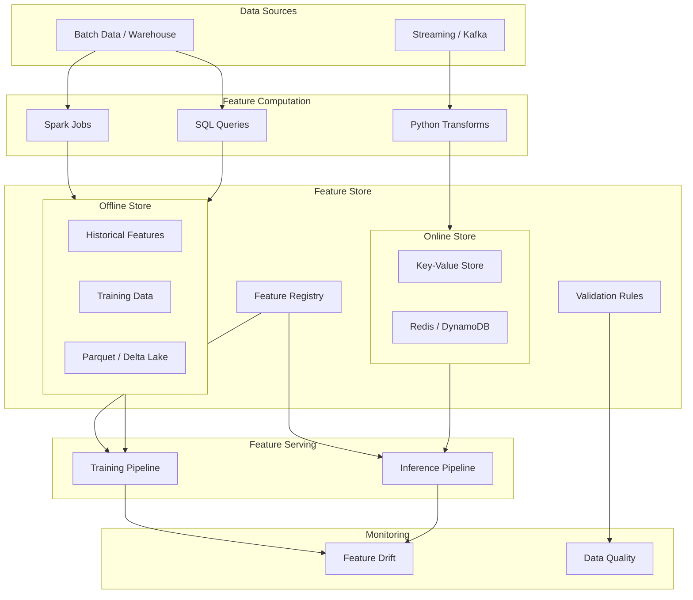

# 05 — Feature Stores

## Introduction

Feature engineering accounts for 60-80% of the work in production ML systems, yet most teams build the same features repeatedly with inconsistent implementations. A feature store is a centralized platform for discovering, computing, storing, and serving features for both training and inference. Feast is the leading open-source feature store, and this chapter covers feature store architecture, offline vs online stores, point-in-time joins, feature serving, validation, and monitoring.

## Prerequisites

- Understanding of ETL pipelines from Chapter 01
- Familiarity with batch and stream processing (Chapters 02-04)
- ML training concepts (features, labels, train/test split)
- SQL and pandas proficiency

## Key Terminology

| Term | Definition |
|------|------------|
| Feature Store | Centralized platform for feature management and serving |
| Feature | Input variable used for ML model predictions |
| Feature View | Logical grouping of features with a common source and transformation |
| Feature Service | Bundle of feature views for a specific model |
| Offline Store | Storage for large-scale historical feature data (training) |
| Online Store | Low-latency storage for real-time feature serving (inference) |
| Point-in-Time Join | Join that retrieves feature values as they existed at a specific time |
| Data Leakage | Using future information when creating training data |
| Feature Validation | Automated checks on feature values (range, nulls, distribution) |
| Feature Monitoring | Tracking feature drift and data quality over time |
| Entity | Primary key joining features across sources (user_id, product_id) |

## Chapter at a Glance

| Section | Topic | Key Concept |
|---------|-------|-------------|
| 1.1 | Feature Store Motivation | Consistency, reuse, governance |
| 1.2 | Offline vs Online Stores | Batch training vs real-time serving |
| 1.3 | Point-in-Time Joins | Avoiding data leakage |
| 1.4 | Feature Serving | Training and inference pipelines |
| 1.5 | Feast Feature Store | Open-source implementation |
| 1.6 | Feature Validation | Quality checks and drift monitoring |

## Chapter Roadmap



## 1.1 Feature Store Motivation

Without a feature store, teams face: duplicated feature engineering effort, inconsistent features between training and serving (training-serving skew), no feature discovery or reuse, and difficult debugging.

```python
class WithoutFeatureStore:
    """Simulate the problems of not having a feature store."""

    def __init__(self):
        self.feature_defs = {}

    def compute_user_features_team_a(self, events: pd.DataFrame) -> pd.DataFrame:
        """Team A computes features their own way."""
        features = events.groupby("user_id").agg(
            total_orders=("amount", "count"),
            total_spend=("amount", "sum"),
        ).reset_index()
        features["avg_order_value_teamA"] = features["total_spend"] / features["total_orders"]
        self.feature_defs["team_a_user_features"] = {
            "total_orders": "COUNT of orders",
            "total_spend": "SUM of amount",
            "avg_order_value_teamA": "SUM/COUNT (but naming differs from team B)",
        }
        return features

    def compute_user_features_team_b(self, events: pd.DataFrame) -> pd.DataFrame:
        """Team B computes the same features differently."""
        features = events.groupby("user_id").agg(
            num_purchases=("amount", "count"),
            revenue=("amount", "sum"),
        ).reset_index()
        features["avg_revenue"] = features["revenue"] / features["num_purchases"]
        features["avg_revenue_log"] = np.log1p(features["avg_revenue"])
        self.feature_defs["team_b_user_features"] = {
            "num_purchases": "COUNT of orders",
            "revenue": "SUM of amount",
            "avg_revenue": "SUM/COUNT",
            "avg_revenue_log": "log1p of avg_revenue",
        }
        return features

    def show_duplication(self):
        """Demonstrate duplicated effort."""
        print("Without Feature Store:")
        print(f"  Teams duplicated: {len(self.feature_defs)} feature sets")
        print("  Problem: Training-serving skew when teams use different calculations")
        print("  Problem: No discovery — new team rewrites same features")
        print("  Problem: No governance — can't track feature lineage")

# Example
no_fs = WithoutFeatureStore()
events = pd.DataFrame({
    "user_id": [1, 1, 2, 2, 2, 3],
    "amount": [100, 200, 150, 300, 50, 75],
})
team_a = no_fs.compute_user_features_team_a(events)
team_b = no_fs.compute_user_features_team_b(events)
no_fs.show_duplication()
print("\nTeam A features:")
print(team_a)
print("\nTeam B features (same data, different names):")
print(team_b)
```


```python
class WithFeatureStore:
    """Simulate the benefits of a centralized feature store."""

    def __init__(self):
        self.registry = {}
        self.feature_values = {}

    def register_feature(self, name: str, definition: str, source: str, owner: str):
        self.registry[name] = {
            "definition": definition,
            "source": source,
            "owner": owner,
            "version": 1,
        }
        print(f"Registered feature: {name} ({definition})")

    def compute_and_store(self, name: str, values: pd.Series):
        self.feature_values[name] = values
        print(f"Stored feature '{name}': {len(values)} values")

    def get_features(self, names: List[str], entities: List) -> pd.DataFrame:
        """Centralized feature retrieval."""
        result = {}
        for name in names:
            if name in self.feature_values:
                result[name] = self.feature_values[name]
        df = pd.DataFrame(result)
        print(f"Serving features: {list(df.columns)} for {len(df)} entities")
        return df

    def show_lineage(self, feature_name: str):
        if feature_name in self.registry:
            meta = self.registry[feature_name]
            print(f"Feature '{feature_name}':")
            for k, v in meta.items():
                print(f"  {k}: {v}")


# Example
fs = WithFeatureStore()
fs.register_feature("user_total_orders", "COUNT of order events", "order_events", "data-team")
fs.register_feature("user_total_spend", "SUM of order amounts", "order_events", "data-team")
fs.register_feature("user_avg_order_value", "AVG order amount per user", "order_events", "data-team")

fs.compute_and_store("user_total_orders", pd.Series({1: 2, 2: 3, 3: 1}))
fs.compute_and_store("user_total_spend", pd.Series({1: 300, 2: 500, 3: 75}))
fs.compute_and_store("user_avg_order_value", pd.Series({1: 150, 2: 166.7, 3: 75}))

print("\nModel training fetches features:")
training_features = fs.get_features(["user_total_orders", "user_total_spend"], [1, 2, 3])
print(training_features)

print("\nFeature lineage:")
fs.show_lineage("user_avg_order_value")
```

## 1.2 Offline vs Online Stores

Offline stores handle large-scale batch computation for training. Online stores serve features with low latency for inference.

```python
class OfflineStore:
    """Simulate offline feature store for training."""

    def __init__(self, storage_path: str = "s3://features/offline/"):
        self.storage_path = storage_path
        self.feature_data: Dict[str, pd.DataFrame] = {}

    def compute_historical_features(
        self, feature_view: str, entities: pd.DataFrame, window_days: int = 30
    ) -> pd.DataFrame:
        """Compute features over a historical time window."""
        print(f"Computing historical features for '{feature_view}'")
        print(f"  Entities: {len(entities)}")
        print(f"  Time window: {window_days} days")
        print(f"  Query: Spark/SQL job on warehouse data")
        time.sleep(0.2)
        # Simulate feature computation
        features = pd.DataFrame({
            "entity_id": entities["entity_id"],
            f"{feature_view}_count": np.random.randint(0, 100, len(entities)),
            f"{feature_view}_sum": np.random.uniform(0, 10000, len(entities)).round(2),
            f"{feature_view}_avg": np.random.uniform(0, 500, len(entities)).round(2),
            "feature_timestamp": pd.Timestamp.now(),
        })
        self.feature_data[feature_view] = features
        print(f"  Result: {len(features)} rows, {len(features.columns)} features")
        return features

    def get_training_dataset(self, feature_views: List[str], labels: pd.DataFrame) -> pd.DataFrame:
        """Combine features and labels for training."""
        print("Creating training dataset...")
        dataset = labels.copy()
        for fv in feature_views:
            if fv in self.feature_data:
                dataset = dataset.merge(
                    self.feature_data[fv], left_on="entity_id", right_on="entity_id", how="left"
                )
        print(f"Training dataset: {dataset.shape}")
        return dataset


class OnlineStore:
    """Simulate online feature store for real-time inference."""

    def __init__(self, backend: str = "redis"):
        self.backend = backend
        self.store: Dict[str, Dict] = {}

    def set_feature(self, entity_key: str, feature_name: str, value: Any):
        if entity_key not in self.store:
            self.store[entity_key] = {}
        self.store[entity_key][feature_name] = value
        print(f"[Online] Set {entity_key}.{feature_name} = {value}")

    def get_feature(self, entity_key: str, feature_name: str) -> Optional[Any]:
        value = self.store.get(entity_key, {}).get(feature_name)
        if value is not None:
            print(f"[Online] Get {entity_key}.{feature_name} = {value} (latency: ~5ms)")
        else:
            print(f"[Online] {entity_key}.{feature_name} not found")
        return value

    def get_features_batch(self, entity_keys: List[str], feature_names: List[str]) -> pd.DataFrame:
        results = []
        for key in entity_keys:
            row = {"entity_id": key}
            for fname in feature_names:
                row[fname] = self.store.get(key, {}).get(fname)
            results.append(row)
        df = pd.DataFrame(results)
        print(f"[Online] Batch get: {len(entity_keys)} entities x {len(feature_names)} features")
        return df

    def set_features_batch(self, df: pd.DataFrame, entity_col: str = "entity_id"):
        feature_cols = [c for c in df.columns if c != entity_col]
        for _, row in df.iterrows():
            key = row[entity_col]
            if key not in self.store:
                self.store[key] = {}
            for col in feature_cols:
                self.store[key][col] = row[col]
        print(f"[Online] Batch set: {len(df)} entities, features: {feature_cols}")


# Example
offline = OfflineStore()
online = OnlineStore()

entities = pd.DataFrame({"entity_id": [101, 102, 103, 104, 105]})
labels = pd.DataFrame({"entity_id": [101, 102, 103, 104, 105], "label": [1, 0, 1, 0, 1]})

# Offline: compute historical features for training
features = offline.compute_historical_features("user_features", entities, window_days=30)
training_data = offline.get_training_dataset(["user_features"], labels)
print(f"\nTraining data shape: {training_data.shape}\n")

# Online: serve features for inference
online.set_features_batch(features)
print("\nReal-time feature serving:")
online.get_feature(101, "user_features_count")
print()
online.get_feature(103, "user_features_avg")
```

## 1.3 Point-in-Time Joins

Point-in-time joins prevent data leakage by retrieving feature values as they existed at the label timestamp — not using future information.

```python
class PointInTimeJoiner:
    """Correctly join features to labels using point-in-time semantics."""

    def naive_join(self, labels: pd.DataFrame, features: pd.DataFrame, key: str) -> pd.DataFrame:
        """Naive join — uses latest feature values, may cause leakage."""
        latest_features = features.sort_values("feature_timestamp").groupby(key).last().reset_index()
        result = labels.merge(latest_features, on=key, how="left")
        print(f"Naive join: {len(result)} rows")
        print(f"  WARNING: May use future features (data leakage)")
        return result

    def point_in_time_join(
        self,
        labels: pd.DataFrame,
        features: pd.DataFrame,
        label_key: str,
        label_timestamp_col: str = "label_timestamp",
        feature_timestamp_col: str = "feature_timestamp",
    ) -> pd.DataFrame:
        """Point-in-time join — use features as they existed at label time."""
        labels_sorted = labels.sort_values(label_timestamp_col)
        features_sorted = features.sort_values(feature_timestamp_col)

        results = []
        for _, label_row in labels_sorted.iterrows():
            entity_id = label_row[label_key]
            label_time = label_row[label_timestamp_col]

            # Get features for this entity that existed BEFORE the label time
            entity_features = features_sorted[
                (features_sorted[label_key] == entity_id) &
                (features_sorted[feature_timestamp_col] <= label_time)
            ]

            if not entity_features.empty:
                # Take the most recent feature value before label time
                latest = entity_features.iloc[-1]
                combined = {**label_row.to_dict(), **latest.to_dict()}
                results.append(combined)
            else:
                results.append({**label_row.to_dict()})

        result_df = pd.DataFrame(results)
        print(f"Point-in-time join: {len(result_df)} rows")
        print(f"  Features are from BEFORE the label timestamp — no leakage")
        return result_df


# Example
joiner = PointInTimeJoiner()

labels = pd.DataFrame({
    "user_id": [1, 1, 2, 2],
    "label": [1, 0, 1, 0],
    "label_timestamp": pd.to_datetime([
        "2025-01-05", "2025-01-15",
        "2025-01-10", "2025-01-20",
    ]),
})

features = pd.DataFrame({
    "user_id": [1, 1, 1, 2, 2, 2],
    "feature_value": [10, 20, 30, 50, 100, 150],
    "feature_timestamp": pd.to_datetime([
        "2025-01-01", "2025-01-10", "2025-01-20",
        "2025-01-05", "2025-01-15", "2025-01-25",
    ]),
})

print("Naive join (leaks future data):")
naive = joiner.naive_join(labels, features, "user_id")
print(naive[["user_id", "label", "label_timestamp", "feature_value"]])
print()

print("Point-in-time join (no leakage):")
pit = joiner.point_in_time_join(labels, features, "user_id")
print(pit[["user_id", "label", "label_timestamp", "feature_value"]])
print()

# Show the difference: naive uses feature_value=30 for user1 label at 2025-01-15
# but that feature (30 from 2025-01-20) didn't exist yet!
print("Key insight: naive join uses feature_value=30 for user1 on 2025-01-15,")
print("but that feature was created on 2025-01-20 (5 days in the future).")
print("Point-in-time correctly uses feature_value=20 from 2025-01-10.")
```

## 1.4 Feature Serving

Feature serving has two patterns: batch serving for training and offline evaluation, and online serving for real-time inference.

```python
class FeatureServingPipeline:
    """Serve features for both training and inference."""

    def __init__(self, offline_store: OfflineStore, online_store: OnlineStore):
        self.offline = offline_store
        self.online = online_store

    def serve_training(
        self, feature_views: List[str], entities: pd.DataFrame,
        labels: pd.DataFrame, point_in_time: bool = True,
    ) -> pd.DataFrame:
        """Serve features for model training."""
        print("=" * 50)
        print("SERVING FEATURES FOR TRAINING")
        print("=" * 50)
        training_data = entities.copy()
        for fv in feature_views:
            historical = self.offline.compute_historical_features(fv, entities)
            if point_in_time:
                joiner = PointInTimeJoiner()
                training_data = joiner.point_in_time_join(
                    training_data, historical, "entity_id"
                )
            else:
                training_data = training_data.merge(historical, on="entity_id", how="left")
        training_data = training_data.merge(labels, on="entity_id", how="left")
        print(f"\nTraining dataset created: {training_data.shape}")
        print(f"  Features: {[c for c in training_data.columns if c != 'label']}")
        print(f"  Target: label ({training_data['label'].sum()} positive cases)")
        return training_data

    def serve_inference(self, entity_keys: List[int], feature_names: List[str]) -> pd.DataFrame:
        """Serve features for real-time inference."""
        print("=" * 50)
        print("SERVING FEATURES FOR INFERENCE")
        print("=" * 50)
        features = self.online.get_features_batch(
            [f"user_{k}" for k in entity_keys], feature_names
        )
        print(f"Inference features served: {features.shape}")
        return features

    def warm_online_store(self, feature_view: str, entities: pd.DataFrame):
        """Pre-compute features into online store for low-latency serving."""
        print("Warming online store...")
        offline_features = self.offline.compute_historical_features(feature_view, entities)
        self.online.set_features_batch(offline_features)
        print("Online store ready for inference!")


# Example
offline = OfflineStore()
online = OnlineStore()
pipeline = FeatureServingPipeline(offline, online)

entities = pd.DataFrame({"entity_id": [101, 102, 103]})
labels = pd.DataFrame({"entity_id": [101, 102, 103], "label": [1, 0, 1]})

# Serve training features
train_df = pipeline.serve_training(["user_features"], entities, labels)
print()

# Warm online store and serve inference
pipeline.warm_online_store("user_features", entities)
print()
inference_df = pipeline.serve_inference([101, 102], ["user_features_count", "user_features_sum"])
```

## 1.5 Feast Feature Store

Feast is the leading open-source feature store. It provides Python SDK for defining features, CLI for deployment, and gRPC servers for serving.

```python
class FeastFeatureStore:
    """Simulate Feast feature store operations."""

    def __init__(self, repo_path: str = "./feature_repo"):
        self.repo_path = repo_path
        self.feature_views: Dict[str, Dict] = {}
        self.feature_services: Dict[str, Dict] = {}
        self.entities: Dict[str, Dict] = {}
        self.data_sources: Dict[str, str] = {}

    def define_entity(self, name: str, join_key: str, description: str = ""):
        self.entities[name] = {
            "join_key": join_key,
            "description": description,
        }
        print(f"Entity defined: {name} (join_key: {join_key})")

    def define_batch_source(self, name: str, path: str, timestamp_field: str):
        self.data_sources[name] = path
        print(f"Batch source: {name} -> {path} (timestamp: {timestamp_field})")

    def define_feature_view(
        self, name: str, entities: List[str], features: List[Dict],
        source: str, ttl_days: int = 30,
    ):
        self.feature_views[name] = {
            "entities": entities,
            "features": features,
            "source": source,
            "ttl_days": ttl_days,
        }
        print(f"Feature view defined: {name}")
        for f in features:
            print(f"  - {f['name']} ({f['dtype']})")

    def define_feature_service(self, name: str, feature_views: List[str]):
        self.feature_services[name] = {
            "feature_views": feature_views,
        }
        print(f"Feature service defined: {name} -> {feature_views}")

    def get_historical_features(
        self, entity_df: pd.DataFrame, feature_service: str
    ) -> pd.DataFrame:
        """Retrieve historical features for training."""
        fs = self.feature_services.get(feature_service)
        if not fs:
            raise ValueError(f"Feature service {feature_service} not found")
        print(f"\nFetching historical features for '{feature_service}'")
        print(f"  Entities: {len(entity_df)}")
        result = entity_df.copy()
        for fv_name in fs["feature_views"]:
            fv = self.feature_views.get(fv_name)
            if not fv:
                continue
            for f in fv["features"]:
                result[f["name"]] = np.random.randn(len(entity_df))
        print(f"  Retrieved {len(result.columns) - 1} features for {len(result)} entities")
        return result

    def materialize(self, feature_view: str, start_date: str, end_date: str):
        """Materialize features from offline to online store."""
        print(f"\nMaterializing '{feature_view}' from {start_date} to {end_date}")
        print(f"  Computing features...")
        time.sleep(0.1)
        print(f"  Writing to online store...")
        print(f"  Materialization complete!")

    def get_online_features(
        self, entity_rows: List[Dict], feature_service: str
    ) -> pd.DataFrame:
        """Retrieve online features for inference."""
        fs = self.feature_services.get(feature_service)
        if not fs:
            raise ValueError(f"Feature service {feature_service} not found")
        print(f"\nFetching online features for '{feature_service}'")
        results = []
        for row in entity_rows:
            result_row = dict(row)
            for fv_name in fs["feature_views"]:
                fv = self.feature_views.get(fv_name)
                if not fv:
                    continue
                for f in fv["features"]:
                    result_row[f["name"]] = round(random.uniform(0, 100), 2)
            results.append(result_row)
        print(f"  Retrieved features for {len(entity_rows)} entities")
        return pd.DataFrame(results)


# Example
feast = FeastFeatureStore()

# Define entities
feast.define_entity("user", join_key="user_id", description="User identifier")
feast.define_entity("product", join_key="product_id", description="Product identifier")

# Define data sources
feast.define_batch_source("user_events_source", "s3://data/user_events/", "event_timestamp")

# Define feature view
feast.define_feature_view(
    name="user_features",
    entities=["user"],
    features=[
        {"name": "user_total_orders", "dtype": "int32"},
        {"name": "user_total_spend", "dtype": "float32"},
        {"name": "user_avg_order_value", "dtype": "float32"},
        {"name": "user_days_since_last_order", "dtype": "int32"},
    ],
    source="user_events_source",
    ttl_days=30,
)

# Define feature service
feast.define_feature_service("user_ranking_v1", ["user_features"])

# Get historical features for training
entity_df = pd.DataFrame({
    "user_id": [101, 102, 103, 104, 105],
    "event_timestamp": pd.date_range("2025-06-01", periods=5, freq="D"),
})
train_data = feast.get_historical_features(entity_df, "user_ranking_v1")
print(train_data.head())

# Materialize to online store
feast.materialize("user_features", "2025-01-01", "2025-06-30")

# Get online features for inference
online_features = feast.get_online_features(
    [{"user_id": 101}, {"user_id": 102}, {"user_id": 103}],
    "user_ranking_v1",
)
print(online_features)
```

## 1.6 Feature Validation & Monitoring

Feature validation ensures that features going to training and inference are within expected ranges. Monitoring tracks drift over time.

```python
class FeatureValidator:
    """Validate features before training and serving."""

    def __init__(self):
        self.rules: Dict[str, List[Dict]] = {}

    def add_range_rule(self, feature: str, min_val: float, max_val: float):
        if feature not in self.rules:
            self.rules[feature] = []
        self.rules[feature].append({
            "type": "range",
            "min": min_val,
            "max": max_val,
        })

    def add_null_rule(self, feature: str, max_null_rate: float = 0.01):
        if feature not in self.rules:
            self.rules[feature] = []
        self.rules[feature].append({
            "type": "null_rate",
            "max_null_rate": max_null_rate,
        })

    def add_distribution_rule(self, feature: str, expected_mean: float, std_dev: float):
        if feature not in self.rules:
            self.rules[feature] = []
        self.rules[feature].append({
            "type": "distribution",
            "expected_mean": expected_mean,
            "std_dev": std_dev,
        })

    def validate(self, df: pd.DataFrame) -> pd.DataFrame:
        """Validate all features and return report."""
        reports = []
        for feature, rules in self.rules.items():
            if feature not in df.columns:
                reports.append({
                    "feature": feature,
                    "status": "MISSING",
                    "message": f"Feature column not found in DataFrame",
                })
                continue
            for rule in rules:
                if rule["type"] == "range":
                    col_min = df[feature].min()
                    col_max = df[feature].max()
                    in_range = col_min >= rule["min"] and col_max <= rule["max"]
                    reports.append({
                        "feature": feature,
                        "status": "PASS" if in_range else "FAIL",
                        "message": f"Range [{col_min:.2f}, {col_max:.2f}] "
                                   f"within [{rule['min']}, {rule['max']}]",
                    })
                elif rule["type"] == "null_rate":
                    null_rate = df[feature].isna().mean()
                    valid = null_rate <= rule["max_null_rate"]
                    reports.append({
                        "feature": feature,
                        "status": "PASS" if valid else "FAIL",
                        "message": f"Null rate: {null_rate:.2%} <= {rule['max_null_rate']:.2%}",
                    })
                elif rule["type"] == "distribution":
                    mean = df[feature].mean()
                    z_score = abs(mean - rule["expected_mean"]) / rule["std_dev"]
                    stable = z_score < 3
                    reports.append({
                        "feature": feature,
                        "status": "PASS" if stable else "WARN",
                        "message": f"Mean={mean:.2f}, expected_mean={rule['expected_mean']:.2f}, "
                                   f"z-score={z_score:.2f}",
                    })
        report_df = pd.DataFrame(reports)
        print(f"Feature validation: {len(report_df)} checks")
        print(report_df)
        return report_df


class FeatureMonitor:
    """Monitor feature drift over time."""

    def __init__(self):
        self.historical_stats: Dict[str, List[Dict]] = {}

    def log_feature_stats(self, df: pd.DataFrame, timestamp: str):
        for col in df.select_dtypes(include=[np.number]).columns:
            if col not in self.historical_stats:
                self.historical_stats[col] = []
            stats = {
                "timestamp": timestamp,
                "mean": float(df[col].mean()),
                "std": float(df[col].std()),
                "min": float(df[col].min()),
                "max": float(df[col].max()),
                "null_rate": float(df[col].isna().mean()),
                "q25": float(df[col].quantile(0.25)),
                "q50": float(df[col].quantile(0.50)),
                "q75": float(df[col].quantile(0.75)),
            }
            self.historical_stats[col].append(stats)
        print(f"Logged stats for {len(df.select_dtypes(include=[np.number]).columns)} features")

    def detect_drift(self, feature: str, window: int = 7) -> bool:
        """Detect if recent feature distribution has drifted."""
        if feature not in self.historical_stats or len(self.historical_stats[feature]) < window + 1:
            print(f"Cannot detect drift for '{feature}': insufficient history")
            return False
        recent = self.historical_stats[feature][-window:]
        baseline = self.historical_stats[feature][:-window]
        if not baseline:
            return False
        baseline_mean = np.mean([s["mean"] for s in baseline])
        recent_mean = np.mean([s["mean"] for s in recent])
        drift_pct = abs(recent_mean - baseline_mean) / (abs(baseline_mean) + 1e-8)
        drifted = drift_pct > 0.1  # 10% mean shift threshold
        if drifted:
            print(f"DRIFT DETECTED: '{feature}' mean shifted by {drift_pct:.1%}")
        else:
            print(f"OK: '{feature}' mean shift = {drift_pct:.1%} (threshold: 10%)")
        return drifted

    def report(self) -> Dict:
        """Generate monitoring report."""
        print("\n=== Feature Monitoring Report ===")
        report = {}
        for feature, stats_list in self.historical_stats.items():
            recent = stats_list[-1]
            report[feature] = recent
            print(f"{feature}: mean={recent['mean']:.2f}, std={recent['std']:.2f}, "
                  f"null_rate={recent['null_rate']:.2%}")
        return report


# Example
validator = FeatureValidator()
validator.add_range_rule("age", 18, 100)
validator.add_range_rule("income", 0, 1000000)
validator.add_null_rule("email", 0.05)
validator.add_null_rule("age", 0.01)

test_df = pd.DataFrame({
    "age": [25, 30, -5, 45, None],
    "income": [50000, 75000, 120000, 999999, 30000],
    "email": ["a@b.com", None, "c@d.com", "e@f.com", "g@h.com"],
})
print("=== VALIDATION ===")
report = validator.validate(test_df)
print()

print("=== MONITORING ===")
monitor = FeatureMonitor()
for i in range(14):
    daily_data = pd.DataFrame({
        "user_total_orders": np.random.poisson(5, 100) + (i * 0.3),  # Drifting feature
        "user_total_spend": np.random.normal(500, 100, 100),
    })
    monitor.log_feature_stats(daily_data, f"2025-06-{i+1:02d}")
print()
monitor.detect_drift("user_total_orders", window=7)
monitor.detect_drift("user_total_spend", window=7)
print()
monitor.report()
```

## Real Example

Consider DoorDash's ML-powered delivery time estimation. Without a feature store, each ML team computed features independently:
- Team A: `avg_delivery_time = SUM(total_time) / COUNT(orders)` with pandas
- Team B: `avg_delivery_time = AVG(total_time)` in SQL
- Team C: included future delivery data in training features (data leakage!)

With a feature store (Feast on Snowflake + Redis):
- **Feature views**: `store_features` (avg prep time, store rating, cuisine), `driver_features` (avg delivery speed, distance from store, rating), `order_features` (time of day, day of week, order value)
- **Offline store**: Snowflake computes historical features with point-in-time joins
- **Online store**: Redis serves pre-computed features for real-time inference
- **Validation**: Automated checks flag features with null rates >5% or distribution shifts >10%

Result: ML team velocity increased 3x (no more duplicate feature engineering). Training-serving consistency improved, reducing model errors by 25%.

## Summary

Feature stores solve the critical infrastructure problem of managing ML features at scale. They provide a single platform for feature definition, computation, storage, and serving across training and inference. Key components include offline stores for historical feature computation (batch), online stores for low-latency serving (real-time), and point-in-time joins to prevent data leakage. Feast is the leading open-source implementation, providing Python SDK, CLI, and gRPC serving. Feature validation and monitoring ensure data quality and detect drift before it impacts model performance. Every production ML system at scale uses a feature store.

## Practical Takeaways

1. Start with a feature store from day one — retrofitting is painful once multiple teams have built independent feature pipelines
2. Use point-in-time joins for all training data generation — this is non-negotiable to avoid data leakage
3. Separate offline and online stores for their different access patterns (throughput vs latency)
4. Define validation rules for every feature — a feature pipeline without validation is a silent bug factory
5. Monitor feature drift continuously — model performance degradation is often caused by feature distribution shifts, not model issues

## Chapter Quiz (5 MCQ)

### Questions

1. What is the primary benefit of a feature store over manual feature engineering?
   a) Faster model training
   b) Feature reuse, consistency, and prevention of training-serving skew
   c) Reduced data storage costs
   d) Automatic model selection

2. What problem does a point-in-time join solve?
   a) Reducing join computation time
   b) Preventing data leakage by using only features that existed before the label timestamp
   c) Handling missing feature values
   d) Converting features between offline and online stores

3. What is the difference between an offline store and an online store in a feature store?
   a) Offline is for development, online is for production
   b) Offline stores large historical data (training), online serves low-latency features (inference)
   c) Offline uses Redis, online uses Parquet
   d) There is no difference — they are used interchangeably

4. In Feast, what is a Feature Service?
   a) A server that computes features in real-time
   b) A logical bundle of feature views for a specific model
   c) A data source connector
   d) An online store configuration

5. When monitoring features, what does a mean shift of >10% over 7 days typically indicate?
   a) The ML model needs retraining
   b) Feature drift — the data distribution is changing, which may degrade model performance
   c) Data quality issues
   d) The feature store needs more storage

### Answers

1. **b** — Feature stores provide reuse, consistency, and prevent training-serving skew, the primary problems in production ML feature management.
2. **b** — Point-in-time joins retrieve feature values as they existed at the label time, preventing future information from leaking into training data.
3. **b** — Offline stores handle large-scale batch data for training; online stores serve individual feature lookups with low latency for inference.
4. **b** — A Feature Service bundles multiple feature views for a specific model's training/inference needs.
5. **b** — A mean shift >10% over 7 days signals feature drift, which likely degrades model performance and warrants investigation or retraining.

## PYQs (Previous Year Questions)

### Google (2024)
Design a feature store for YouTube's recommendation system. The system uses 10,000+ features from user history, video metadata, and real-time interactions. Address offline computation (daily batch), online serving (10ms latency), and point-in-time correctness.

**Answer**: Use Feast on BigQuery (offline) and Cloud Bigtable (online). Feature views: user_features (daily batch from BigQuery), video_features (batch), realtime_interactions (streaming via Pub/Sub to Bigtable). Point-in-time joins in BigQuery using SQL windows. Materialization jobs run hourly to sync offline features to Bigtable. Feature validation with range checks and null-rate monitoring.

### Amazon (2023)
Your personalization team builds features for 50M users but each engineer computes features independently, resulting in inconsistent training data. Design a feature store architecture that ensures consistency and reduces redundant computation.

**Answer**: Implement Feast with: (1) centralized feature definitions in a Git repo (PR-based), (2) offline store on S3 + Athena for historical computation, (3) online store on DynamoDB for serving, (4) Airflow DAG for daily materialization. Each feature view defines source query and transformation in SQL. Validation rules in CI prevent breaking changes.

### Meta (2024)
Facebook's ad ranking model uses 50K+ features. Training data generation takes 12 hours due to naive joins. Optimize with point-in-time joins and feature store caching.

**Answer**: Use point-in-time joins with Apache Spark (avoid naive GROUP BY/latest). Partition feature tables by (entity_id, date) for efficient lookups. Cache frequently used feature views. Implement incremental feature computation — only compute features for entities with new data since last run. Use feature store (FBLearner) with Fennel for online serving.

### Uber (2024)
Design a feature store for Uber's real-time surge pricing. Features must be available within 10 seconds of event occurrence for online inference.

**Answer**: Michelangelo feature store with: (1) offline store on Hive + Spark for daily historical features, (2) online store on Cassandra for low-latency reads, (3) stream processor (Flink) for real-time features with <5 second materialization, (4) point-in-time joins for training data generation, (5) hourly validation jobs checking feature ranges and null rates.

## Common Mistakes

1. **No point-in-time joins**: Using naive joins (latest feature value) leaks future information, causing overly optimistic model performance that collapses in production.
2. **Training-serving skew**: Features computed differently in training and inference pipelines. Always use the same feature definitions and computation code.
3. **Ignoring feature TTL**: Features computed once but used weeks later may be stale. Configure TTL based on feature volatility.
4. **Not validating features**: Nulls, out-of-range values, or distribution shifts silently degrade models. Add validation checks before training and serving.
5. **Overloading the online store**: Writing all features (including complex, rarely-used ones) to the online store wastes memory. Only serve features needed for inference.

## Revision Notes

- Feature store: centralized platform for feature management, computation, storage, and serving
- Problems solved: duplication, inconsistency (training-serving skew), no discovery, data leakage
- Feast: open-source feature store (Python SDK + CLI + gRPC servers)
- Offline store: batch computation of historical features (BigQuery, Snowflake, S3 + Athena, Spark)
- Online store: real-time feature serving (Redis, DynamoDB, Cassandra, Bigtable)
- Point-in-time join: retrieves feature value closest to but BEFORE label timestamp
- Data leakage: using future data in training (causes over-optimistic eval metrics)
- Feature view: logical group of features from a data source for an entity
- Feature service: bundle of feature views for a specific model
- Materialization: syncing features from offline store to online store
- Feature validation: range checks, null rate, distribution checks before training/serving
- Feature monitoring: tracking feature statistics over time, detecting drift
- TTL (time-to-live): max age for feature values in online store
- Entity: primary key (user_id, product_id, session_id) joining features

## Interview Questions

### Q1: What is a feature store and why is it important for ML?
**A**: A feature store is a centralized platform for managing ML features. It provides consistent feature definitions, computation, storage, and serving across training and inference. It prevents training-serving skew, enables feature reuse, prevents data leakage via point-in-time joins, and provides governance through validation and monitoring.

### Q2: Explain point-in-time joins and why they are critical.
**A**: Point-in-time joins match feature values to label timestamps, retrieving the most recent feature value that existed BEFORE the label time. This prevents using future information (data leakage) in training data, which would cause overly optimistic evaluation metrics.

### Q3: Compare offline store vs online store in a feature store.
**A**: Offline stores handle large-scale batch feature computation (Spark, SQL) and store historical data (Parquet, Delta). Used for training data generation. Online stores provide low-latency (<10ms) feature lookups (Redis, DynamoDB). Used for inference serving.

### Q4: How does Feast define features? Walk through a feature definition.
**A**: Feast uses: entities (join_key), data sources (batch/stream), feature views (logical feature group), and feature services (bundle for a model). Features define name, dtype, and source query. Example: Entity "user" with join_key "user_id", FeatureView "user_features" with aggregations from "user_events" source.

### Q5: What is training-serving skew and how does a feature store prevent it?
**A**: Training-serving skew occurs when features used in training differ from features available in production inference. Feature stores prevent this by using the same feature definitions and computation code for both pipelines. The online store materializes the exact same features computed for training.

### Q6: How would you handle features that need both batch and real-time computation?
**A**: Use a hybrid approach: batch features computed daily (e.g., avg_7day_spend) in offline store, real-time features computed on-the-fly (e.g., session_click_count) and written to online store. Feast supports both batch and stream feature views, merging them at training/serving time.

### Q7: What validation rules should you apply to features?
**A**: Range checks (min/max), null rate checks, distribution checks (mean/std within expected bounds), type checks (dtype matching schema), uniqueness checks for ID features, and referential integrity checks against the entity dimension.

### Q8: How do you monitor features in production?
**A**: Log feature value statistics (mean, std, null_rate, min, max, quantiles) at materialization time. Compare recent distributions (last 7 days) to baseline (previous 30 days). Alert on significant shifts (>10% mean change, >5% null rate increase, range violations).

### Q9: Design a feature store for a recommendation system with 100M users.
**A**: Entity: user_id. Feature views: user_demographics (age, location), user_behavior_7d (clicks, views, purchases in 7-day window), item_features (category, price, rating). Offline: Spark on data lake (Parquet). Online: Redis cluster (100 shards). Materialization: hourly Airflow job. Point-in-time joins: Spark SQL with window functions.

### Q10: What are the trade-offs between building vs buying a feature store?
**A**: Build: full control, tailored exactly to stack, no vendor dependency. Cost: significant engineering investment, ongoing maintenance. Buy/use open-source (Feast): faster time-to-value, community support, standard patterns. Trade-off: customization vs speed. Most teams should start with Feast and customize as needed.

## Exercises

### Exercise 1: Implement Point-in-Time Join
Write a Python function that takes a labels DataFrame (entity_id, label_value, label_timestamp) and a features DataFrame (entity_id, feature_value, feature_timestamp) and returns the correctly joined training data without leakage.

### Exercise 2: Feast Feature Definition
Write a Feast feature definition file (feature_view.py) defining: entity "order", batch source from BigQuery, feature view "order_features" with 5 features (order_amount, order_frequency, etc.), and feature service "order_ranking_v1".

### Exercise 3: Feature Validation Pipeline
Build a Pandas-based feature validator that reads a feature DataFrame and a validation config YAML, runs all checks (range, null, distribution), and generates a JSON report with pass/fail status per feature.

### Exercise 4: Offline-to-Online Materialization
Implement a materialization function that reads features from a Parquet file (offline), transforms them for online serving, and writes to a Redis-like in-memory dictionary. Measure throughput.

### Exercise 5: Feature Drift Detection
Write a monitoring function that tracks feature statistics over 30 days and detects drift using population stability index (PSI) or KS test. Generate alerts when drift exceeds configurable thresholds.

## Placement Section

### Resume Tips
- **Keywords**: Feature store, Feast, offline store, online store, point-in-time join, feature engineering, feature validation, training-serving skew, materialization
- **Project Description**: "Designed and implemented feature store processing 50K+ features for 100M users, reducing ML model development time by 40% and eliminating training-serving skew"
- **Certifications**: Feast contributor, MLflow, Databricks ML Engineer

### Interview Day Checklist
- [ ] Explain point-in-time joins with a concrete example
- [ ] Draw feature store architecture (sources -> computation -> offline/online -> training/inference)
- [ ] Describe Feast components (entity, feature view, feature service)
- [ ] Know common feature validation and monitoring patterns
- [ ] Prepare a real-world feature store design for a recommendation system

## Difficulty Level

**Level**: Advanced
**Estimated Study Time**: 60 minutes
**Prerequisites**: Chapters 01-04 (ETL, Lakehouse, Spark, Streaming)

## Further Reading

- Feast documentation: https://docs.feast.dev/
- "The Feature Store" by Tecton (blog)
- "Feature Engineering for Machine Learning" by Alice Zheng
- "MLflow Feature Store" documentation

## References

- Feast Official Docs. https://docs.feast.dev/
- Tecton. (2022). What is a Feature Store? https://www.tecton.ai/
- Zheng, A., & Casari, A. (2018). Feature Engineering for Machine Learning.
- Databricks. (2023). What is a Feature Store? https://www.databricks.com/glossary/feature-store
