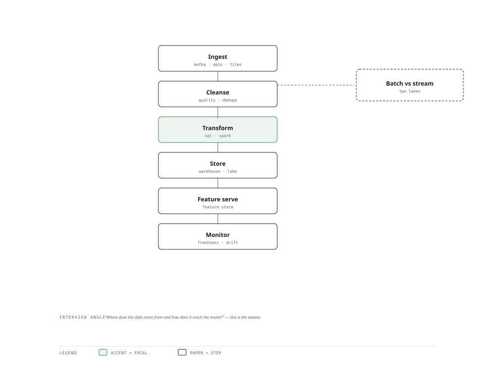

# Visual Notes — The Data Pipeline

> One diagram, the full picture. This page is meant to be glanced at before reading the chapters, and again before interviews.

# What the diagram shows

1. **Ingest** — Pull from sources (databases, streams, files) in batch or real-time.
1. **Process** — Clean, transform and enrich with Spark or streaming engines.
1. **Serve** — Store in a warehouse/lakehouse and feature store, then serve models and BI.

# Why this matters for placement

- AI models are only as good as their data plumbing — data engineering questions are common.
- Batch-vs-streaming trade-offs and the feature store are classic focuses.

# Quick revision

- ETL vs ELT: transform before vs after loading into the warehouse.
- Lakehouse = one place for structured + unstructured, cheaper than warehouse.
- Spark: distributed batch; streaming engines (Kafka/Flink) for real-time.
- Feature store: compute once, share across training and serving — avoids train/serve skew.
- De-dup and backfill idempotence keep pipelines correct under retries.

# Related chapters

- [ETL pipelines](01-etl-pipelines.md)
- [Data lakehouse warehouse](02-data-lakehouse-warehouse.md)
- [Apache Spark basics](03-apache-spark-basics.md)
- [Feature stores](05-feature-stores.md)

---

**One-line answer for interviews:** *"Ingest → clean → transform → store → serve data to models and dashboards."*
