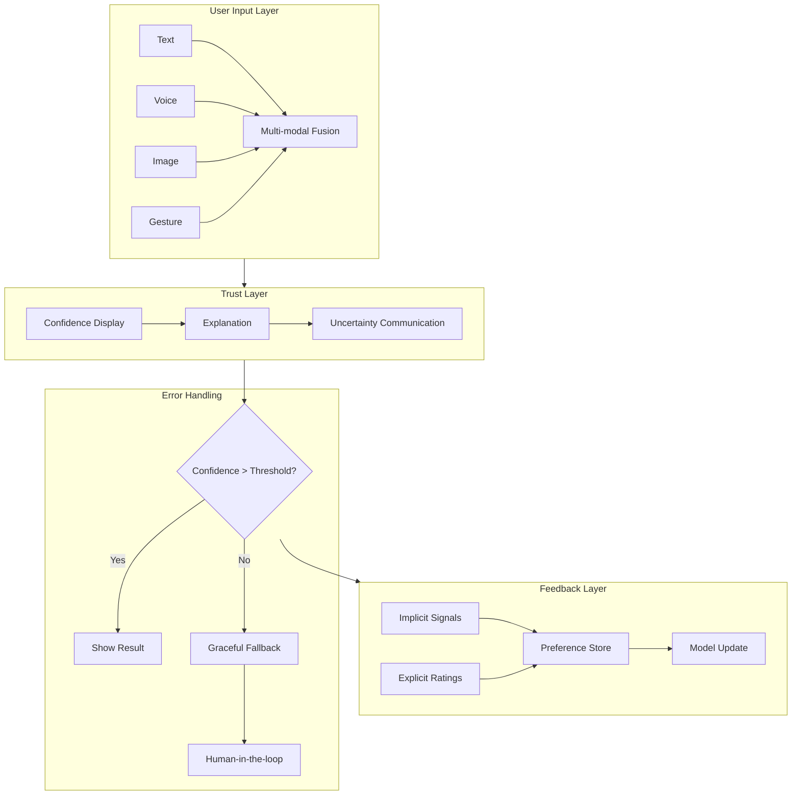
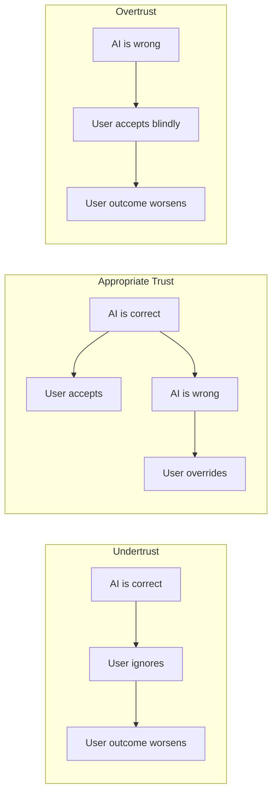

<!-- Clear Language: Keep sentences under 50 words -->
# User Experience for AI

## Learning Objectives

| Objective | Description |
|-----------|-------------|
| LO1 | Design interaction patterns for AI-powered interfaces |
| LO2 | Calibrate user trust through transparency and explainability |
| LO3 | Build feedback loops that improve model behavior over time |
| LO4 | Implement graceful error handling with human-in-the-loop fallbacks |
| LO5 | Design interfaces for streaming, batch, real-time, and background AI modes |

## Introduction

AI products fail when users do not trust them or cannot understand them. Great UX bridges the gap between model capability and human expectation. This chapter teaches you to design interfaces that make AI feel helpful, transparent, and reliable.

## Prerequisites

- Basic understanding of LLM APIs and model inference
- Familiarity with REST API design patterns
- Experience with frontend-backend integration

## Key Terminology

**Key Terms**: Core vocabulary and concepts for this topic.

**Definition**: Essential terms you must know for interviews and production work.

## Theory

Understanding user experience for AI is fundamental for AI engineers. This section covers the core concepts, underlying principles, and theoretical framework that govern how UX for AI works in practice.

## Chapter at a Glance

| Section | Topic | Key Concept |
|---------|-------|-------------|
| 1.1 | Interaction Design for AI | Input methods, multi-modal, conversational UI |
| 1.2 | Trust Calibration | Transparency, explainability, appropriate trust |
| 1.3 | Feedback Loops | Implicit/explicit feedback, RLHF, preference learning |
| 1.4 | Handling AI Errors | Graceful degradation, fallback, confidence thresholds |
| 1.5 | Designing for AI Modes | Streaming, batch, real-time, background processing |

## Chapter Roadmap



```text

```

## 1.1 Interaction Design for AI

### 1.1.1 Input Modalities

AI products accept input through multiple channels. Users expect to interact via text, voice, images, and gestures. Each modality has trade-offs in accuracy, latency, and user effort.

```python
from dataclasses import dataclass, field
from typing import List, Dict, Optional, Any
from enum import Enum
import time
import json

class InputModality(Enum):
    TEXT = "text"
    VOICE = "voice"
    IMAGE = "image"
    DOCUMENT = "document"
    GESTURE = "gesture"

@dataclass
class UserInput:
    content: Any
    modality: InputModality
    timestamp: float = field(default_factory=time.time)
    metadata: Dict[str, Any] = field(default_factory=dict)

class MultiModalFusion:
    """Combines inputs from multiple modalities into a unified intent."""

    def __init__(self):
        self.modality_weight: Dict[InputModality, float] = {
            InputModality.TEXT: 1.0,
            InputModality.VOICE: 0.8,
            InputModality.IMAGE: 0.7,
            InputModality.DOCUMENT: 0.9,
            InputModality.GESTURE: 0.4,
        }

    def fuse(self, inputs: List[UserInput]) -> Dict[str, Any]:
        """Merge multiple inputs into a single interpretation."""
        if not inputs:
            return {"intent": None, "confidence": 0.0}

        interpretations = []
        for inp in inputs:
            score = self.modality_weight.get(inp.modality, 0.5)
            interpretations.append({
                "source": inp.modality.value,
                "content": inp.content,
                "weight": score,
            })

        best = max(interpretations, key=lambda x: x["weight"])
        return {
            "intent": best["content"],
            "confidence": best["weight"],
            "all_inputs": interpretations,
        }

    def detect_conflict(self, inputs: List[UserInput]) -> Optional[str]:
        """Check if different modalities contradict each other."""
        texts = [str(inp.content).lower() for inp in inputs]
        unique_texts = set(texts)
        if len(unique_texts) > 1:
            return f"Conflict detected across {len(unique_texts)} interpretations"
        return None

fusion = MultiModalFusion()
test_inputs = [
    UserInput(content="Show me sales data", modality=InputModality.TEXT),
    UserInput(content="display quarterly report", modality=InputModality.VOICE),
]
result = fusion.fuse(test_inputs)
print(f"Fused intent: {result['intent']}")
print(f"Confidence: {result['confidence']}")
conflict = fusion.detect_conflict(test_inputs)
print(f"Conflict: {conflict}")
```

```text

```

### 1.1.2 Conversational UI Design

Conversational interfaces differ from traditional GUIs. Users cannot see available options. The system must guide the conversation, handle ambiguities, and recover from misunderstandings gracefully.

```python
from dataclasses import dataclass, field
from typing import List, Optional
from enum import Enum

class DialogState(Enum):
    GREETING = "greeting"
    COLLECTING_INPUT = "collecting_input"
    CLARIFYING = "clarifying"
    PROCESSING = "processing"
    CONFIRMING = "confirming"
    COMPLETE = "complete"
    ERROR = "error"

@dataclass
class ConversationTurn:
    user_message: str
    assistant_message: str
    state: DialogState
    confidence: float = 1.0

class ConversationalAgent:
    """Manages multi-turn dialogue with clarification loops."""

    def __init__(self, system_prompt: str):
        self.system_prompt = system_prompt
        self.history: List[ConversationTurn] = []
        self.current_state: DialogState = DialogState.GREETING
        self.slots: dict = {}

    def process_input(self, user_input: str, confidence: float) -> str:
        """Process user input and generate appropriate response."""
        self.current_state = DialogState.COLLECTING_INPUT

        if confidence < 0.6:
            return self._request_clarification(user_input)

        if self._needs_confirmation(user_input):
            self.current_state = DialogState.CONFIRMING
            return self._generate_confirmation(user_input)

        response = self._execute_intent(user_input)
        self.current_state = DialogState.COMPLETE
        self.history.append(
            ConversationTurn(user_input, response, self.current_state, confidence)
        )
        return response

    def _request_clarification(self, user_input: str) -> str:
        """Ask user to rephrase when confidence is low."""
        self.current_state = DialogState.CLARIFYING
        return (
            f"I'm not sure I understood. Did you mean:\n"
            f"1. {user_input} (as typed)\n"
            f"2. Something else?\n"
            f"Please rephrase."
        )

    def _needs_confirmation(self, user_input: str) -> bool:
        """Check if the input is ambiguous."""
        ambiguous_phrases = ["it", "that", "this", "there", "the one"]
        words = user_input.lower().split()
        return any(phrase in words for phrase in ambiguous_phrases)

    def _generate_confirmation(self, user_input: str) -> str:
        """Ask user to confirm interpretation."""
        return f"Just to confirm: you mean '{user_input}'? (yes/no)"

    def _execute_intent(self, user_input: str) -> str:
        """Execute the understood intent."""
        return f"Processing: {user_input}. Results will appear shortly."

agent = ConversationalAgent("You are a helpful data assistant.")
print(agent.process_input("Show dashboard", 0.95))
print(agent.process_input("Show that", 0.85))
print(agent.process_input("blah blah", 0.30))
```

```text

```

### 1.1.3 Uncertainty Communication

AI systems should communicate uncertainty. Users trust systems that admit when they are unsure. Display confidence scores, alternative interpretations, or request clarification.

```python
import math
from typing import List, Dict, Any

class UncertaintyCommunicator:
    """Translates model confidence into user-facing messages."""

    def __init__(self, high_threshold: float = 0.9,
                 medium_threshold: float = 0.7):
        self.high_threshold = high_threshold
        self.medium_threshold = medium_threshold

    def get_confidence_label(self, score: float) -> str:
        """Map numeric confidence to human-readable label."""
        if score >= self.high_threshold:
            return "High confidence"
        elif score >= self.medium_threshold:
            return "Medium confidence"
        else:
            return "Low confidence"

    def get_user_message(self, score: float, prediction: str,
                          alternatives: List[str] = None) -> str:
        """Generate user-facing message based on confidence."""
        label = self.get_confidence_label(score)

        if score >= self.high_threshold:
            return f"I am confident this is {prediction}."

        elif score >= self.medium_threshold:
            alt_text = ""
            if alternatives:
                alt_text = f" Could also be: {', '.join(alternatives[:2])}."
            return (
                f"I think this is {prediction}, but I'm not certain.{alt_text} "
                f"Please verify."
            )

        else:
            return (
                f"I'm unsure about this. My best guess is {prediction}, "
                f"but confidence is low. Please review manually."
            )

    def calibrate_display(self, score: float) -> Dict[str, Any]:
        """Generate visual calibration data for frontend."""
        color = (
            "#22c55e" if score >= self.high_threshold
            else "#eab308" if score >= self.medium_threshold
            else "#ef4444"
        )
        bar_width = int(score * 100)
        return {
            "color": color,
            "bar_width_percent": bar_width,
            "label": self.get_confidence_label(score),
            "show_warning": score < self.medium_threshold,
        }

comm = UncertaintyCommunicator()
for confidence in [0.95, 0.78, 0.45]:
    display = comm.calibrate_display(confidence)
    message = comm.get_user_message(
        confidence, "fraudulent transaction",
        ["legitimate transaction", "flagged for review"]
    )
    print(f"Conf: {confidence:.2f} | Color: {display['color']} | Msg: {message}")
```

```text

```

## 1.2 Trust Calibration

### 1.2.1 The Trust Spectrum

Users exhibit three trust states: undertrust (ignore correct AI), appropriate trust (rely when correct, override when wrong), and overtrust (follow AI blindly into errors). The goal is to calibrate trust to match actual model capability.



```text

```

```python
from dataclasses import dataclass
from typing import List, Tuple

@dataclass
class TrustCalibrationResult:
    trust_state: str  # undertrust | appropriate | overtrust
    accuracy: float
    user_follow_rate: float
    gap_score: float  # difference between trust and capability

class TrustCalibrator:
    """Measures and calibrates user trust against model capability."""

    def __init__(self):
        self.interactions: List[Tuple[bool, bool]] = []
        """List of (model_was_correct, user_followed_advice)"""

    def record_interaction(self, model_correct: bool,
                           user_followed: bool) -> None:
        """Log a single user-AI interaction."""
        self.interactions.append((model_correct, user_followed))

    def analyze_trust(self) -> TrustCalibrationResult:
        """Analyze trust patterns from interaction history."""
        if not self.interactions:
            return TrustCalibrationResult("unknown", 0, 0, 0)

        total = len(self.interactions)
        correct = sum(1 for c, _ in self.interactions if c)
        followed = sum(1 for _, f in self.interactions if f)

        accuracy = correct / total
        follow_rate = followed / total
        gap_score = follow_rate - accuracy

        if gap_score < -0.2:
            trust_state = "undertrust"
        elif gap_score > 0.2:
            trust_state = "overtrust"
        else:
            trust_state = "appropriate"

        return TrustCalibrationResult(trust_state, accuracy,
                                       follow_rate, gap_score)

    def generate_recommendation(self) -> str:
        """Generate UX recommendation based on trust analysis."""
        result = self.analyze_trust()

        if result.trust_state == "undertrust":
            return (
                "Show accuracy metrics and success stories. "
                "Use smoother animations to build confidence."
            )
        elif result.trust_state == "overtrust":
            return (
                "Increase friction on low-confidence outputs. "
                "Show uncertainty indicators prominently."
            )
        else:
            return "Trust is well-calibrated. Maintain current UX."

calibrator = TrustCalibrator()
# Simulate interactions: (model_correct, user_followed)
simulated = [(True, True), (True, True), (False, True),
             (True, False), (True, True), (False, False)]
for c, f in simulated:
    calibrator.record_interaction(c, f)

result = calibrator.analyze_trust()
print(f"Trust state: {result.trust_state}")
print(f"Accuracy: {result.accuracy:.2f}")
print(f"Follow rate: {result.follow_rate:.2f}")
print(f"Gap: {result.gap_score:.2f}")
print(f"Recommendation: {calibrator.generate_recommendation()}")
```

```text

```

### 1.2.2 Transparency and Explainability

Users trust what they understand. Every AI output should include context about how the system arrived at the result. Transparency mechanisms include feature attribution, example-based explanations, and confidence regions.

```python
from dataclasses import dataclass, field
from typing import List, Dict, Optional

@dataclass
class Explanation:
    prediction: str
    confidence: float
    top_factors: List[Dict[str, float]]
    similar_examples: List[str] = field(default_factory=list)
    limitations: List[str] = field(default_factory=list)

class ExplainableAI:
    """Generates human-readable explanations for model outputs."""

    def __init__(self, feature_names: List[str]):
        self.feature_names = feature_names

    def explain_prediction(self, features: List[float],
                           prediction: str,
                           confidence: float) -> Explanation:
        """Generate explanation with top contributing factors."""
        contributions = list(zip(self.feature_names, features))
        contributions.sort(key=lambda x: abs(x[1]), reverse=True)
        top = [
            {"feature": name, "importance": round(val, 3)}
            for name, val in contributions[:3]
        ]

        limitations = self._get_limitations(confidence, features)

        return Explanation(
            prediction=prediction,
            confidence=confidence,
            top_factors=top,
            similar_examples=self._find_examples(features),
            limitations=limitations,
        )

    def _get_limitations(self, confidence: float,
                          features: List[float]) -> List[str]:
        """Identify limitations of the current prediction."""
        limits = []
        if confidence < 0.7:
            limits.append("Low confidence: prediction may be unreliable")
        if max(features) < 0.3:
            limits.append("No strong signal detected in input features")
        return limits

    def _find_examples(self, features: List[float]) -> List[str]:
        """Retrieve similar examples from a reference set."""
        return [
            "Example A: similar pattern, correct prediction",
            "Example B: similar pattern, review recommended",
        ]

    def format_for_user(self, explanation: Explanation) -> str:
        """Format explanation for display in UI."""
        factors = "\n".join(
            f"  - {f['feature']}: {f['importance']:.3f}"
            for f in explanation.top_factors
        )
        limits = ""
        if explanation.limitations:
            limits = "\nLimitations:\n" + "\n".join(
                f"  - {l}" for l in explanation.limitations
            )
        return (
            f"Prediction: {explanation.prediction}\n"
            f"Confidence: {explanation.confidence:.0%}\n"
            f"Top factors:\n{factors}{limits}"
        )

xai = ExplainableAI(["amount", "frequency", "location", "device_score"])
features = [0.85, 0.12, 0.67, 0.93]
explanation = xai.explain_prediction(features, "Fraud Likely", 0.88)
print(xai.format_for_user(explanation))
```

```text

```

### 1.2.3 Calibration UI Patterns

Different UI patterns communicate different trust levels. Use color, iconography, and placement to signal confidence without overwhelming users.

```python
from dataclasses import dataclass
from typing import Optional

@dataclass
class TrustSignal:
    """Configuration for trust-related UI signals."""
    show_confidence_badge: bool = True
    show_explanation_button: bool = True
    show_alternative_options: bool = False
    require_confirmation: bool = False
    show_uncertainty_range: bool = False

def get_trust_ui_config(confidence: float,
                         domain_risk: str = "low") -> TrustSignal:
    """Dynamically configure UI elements based on confidence and risk."""
    config = TrustSignal()

    if confidence >= 0.95:
        config.show_confidence_badge = True
        config.show_explanation_button = True
        config.show_alternative_options = False
        config.require_confirmation = False

    elif confidence >= 0.80:
        config.show_confidence_badge = True
        config.show_explanation_button = True
        config.show_alternative_options = True
        config.show_uncertainty_range = True

    elif confidence >= 0.60:
        config.show_confidence_badge = True
        config.show_explanation_button = True
        config.show_alternative_options = True
        config.show_uncertainty_range = True
        config.require_confirmation = (domain_risk == "high")

    else:
        config.show_confidence_badge = True
        config.show_explanation_button = True
        config.show_alternative_options = True
        config.require_confirmation = True
        config.show_uncertainty_range = True

    return config

for conf, risk in [(0.97, "low"), (0.85, "medium"), (0.55, "high")]:
    cfg = get_trust_ui_config(conf, risk)
    print(f"\nConf={conf:.2f}, Risk={risk}:")
    print(f"  Badge={cfg.show_confidence_badge}, "
          f"Explain={cfg.show_explanation_button}, "
          f"Confirm={cfg.require_confirmation}")
```

```text

```

## 1.3 Feedback Loops

### 1.3.1 Implicit and Explicit Feedback

Feedback powers AI improvement. Explicit feedback (thumbs up/down, ratings) is direct but sparse. Implicit feedback (time spent, scroll depth, retention) is abundant but noisy.

```python
from dataclasses import dataclass, field
from typing import List, Dict, Optional
from enum import Enum
import time
import statistics

class FeedbackType(Enum):
    EXPLICIT_THUMBS = "explicit_thumbs"
    EXPLICIT_RATING = "explicit_rating"
    IMPLICIT_CLICK = "implicit_click"
    IMPLICIT_DWELL = "implicit_dwell_time"
    IMPLICIT_SCROLL = "implicit_scroll_depth"
    IMPLICIT_CONVERSION = "implicit_conversion"

@dataclass
class FeedbackSignal:
    feedback_type: FeedbackType
    value: float
    user_id: str
    item_id: str
    timestamp: float = field(default_factory=time.time)
    context: Dict[str, str] = field(default_factory=dict)

class FeedbackCollector:
    """Collects and normalizes feedback from multiple sources."""

    def __init__(self):
        self.signals: List[FeedbackSignal] = []

    def record(self, signal: FeedbackSignal) -> None:
        """Record a feedback signal."""
        self.signals.append(signal)

    def get_explicit_score(self, item_id: str) -> Optional[float]:
        """Calculate average explicit rating for an item."""
        relevant = [
            s for s in self.signals
            if s.item_id == item_id
            and s.feedback_type in (FeedbackType.EXPLICIT_THUMBS,
                                     FeedbackType.EXPLICIT_RATING)
        ]
        if not relevant:
            return None
        scores = [s.value for s in relevant]
        return statistics.mean(scores)

    def get_implicit_score(self, item_id: str) -> Optional[float]:
        """Calculate implicit engagement score for an item."""
        relevant = [
            s for s in self.signals if s.item_id == item_id
        ]
        if not relevant:
            return None
        normalized = []
        for s in relevant:
            if s.feedback_type == FeedbackType.IMPLICIT_DWELL:
                normalized.append(min(s.value / 30.0, 1.0))
            elif s.feedback_type == FeedbackType.IMPLICIT_CLICK:
                normalized.append(1.0 if s.value > 0 else 0.0)
            elif s.feedback_type == FeedbackType.IMPLICIT_SCROLL:
                normalized.append(min(s.value, 1.0))
        return statistics.mean(normalized) if normalized else None

    def hybrid_score(self, item_id: str,
                      explicit_weight: float = 0.6) -> float:
        """Combine explicit and implicit signals into one score."""
        explicit = self.get_explicit_score(item_id)
        implicit = self.get_implicit_score(item_id)
        if explicit is not None and implicit is not None:
            return explicit * explicit_weight + implicit * (1 - explicit_weight)
        return explicit or implicit or 0.5

collector = FeedbackCollector()
collector.record(FeedbackSignal(FeedbackType.EXPLICIT_THUMBS, 1.0,
                                 "user1", "item_42"))
collector.record(FeedbackSignal(FeedbackType.IMPLICIT_DWELL, 45.0,
                                 "user2", "item_42"))
collector.record(FeedbackSignal(FeedbackType.IMPLICIT_SCROLL, 0.8,
                                 "user3", "item_42"))
print(f"Explicit: {collector.get_explicit_score('item_42')}")
print(f"Implicit: {collector.get_implicit_score('item_42')}")
print(f"Hybrid: {collector.hybrid_score('item_42'):.3f}")
```

```text

```

### 1.3.2 Preference Learning

Beyond simple ratings, preference learning captures relative comparisons. Users find it easier to say "A is better than B" than to assign absolute scores.

```python
from dataclasses import dataclass, field
from typing import List, Dict, Tuple
import random

@dataclass
class PreferencePair:
    item_a: str
    item_b: str
    preferred: str  # "a", "b", or "tie"
    user_id: str
    context: str = ""

class PreferenceLearner:
    """Learn user preferences from pairwise comparisons."""

    def __init__(self):
        self.pairs: List[PreferencePair] = []
        self.scores: Dict[str, float] = {}

    def record_preference(self, pair: PreferencePair) -> None:
        """Record a single pairwise preference."""
        self.pairs.append(pair)
        self._update_scores()

    def _update_scores(self) -> None:
        """Recalculate Elo-like scores from all comparisons."""
        items = set()
        for p in self.pairs:
            items.add(p.item_a)
            items.add(p.item_b)

        self.scores = {item: 1000.0 for item in items}
        k_factor = 32

        for p in self.pairs:
            if p.preferred == "tie":
                continue

            expected_a = 1.0 / (1.0 + 10 ** (
                (self.scores[p.item_b] - self.scores[p.item_a]) / 400.0
            ))
            expected_b = 1.0 - expected_a

            if p.preferred == "a":
                self.scores[p.item_a] += k_factor * (1.0 - expected_a)
                self.scores[p.item_b] += k_factor * (0.0 - expected_b)
            else:
                self.scores[p.item_a] += k_factor * (0.0 - expected_a)
                self.scores[p.item_b] += k_factor * (1.0 - expected_b)

    def get_ranking(self) -> List[Tuple[str, float]]:
        """Return items sorted by preference score."""
        return sorted(self.scores.items(),
                       key=lambda x: x[1], reverse=True)

    def get_top_n(self, n: int = 5) -> List[str]:
        """Return top N preferred items."""
        ranking = self.get_ranking()
        return [item for item, _ in ranking[:n]]

learner = PreferenceLearner()
items = ["response_A", "response_B", "response_C",
         "response_D", "response_E"]
for _ in range(20):
    a, b = random.sample(items, 2)
    preferred = random.choice(["a", "b", "tie"])
    learner.record_preference(PreferencePair(a, b, preferred, "user1"))

ranking = learner.get_ranking()
print("Preference ranking:")
for item, score in ranking:
    print(f"  {item}: {score:.1f}")
```

```text

```

### 1.3.3 Reinforcement Learning from Human Feedback (RLHF)

RLHF aligns model outputs with human preferences. The UX layer collects comparisons that feed into the reward model training pipeline.

```python
from dataclasses import dataclass, field
from typing import List, Dict, Tuple
import json

@dataclass
class RLHFSample:
    prompt: str
    response_a: str
    response_b: str
    preferred: str  # "a" or "b"
    rater_id: str
    metadata: Dict = field(default_factory=dict)

class RLHFDataPipeline:
    """Prepares human preference data for reward model training."""

    def __init__(self):
        self.samples: List[RLHFSample] = []

    def add_comparison(self, sample: RLHFSample) -> None:
        """Add a human comparison to the dataset."""
        self.samples.append(sample)

    def export_for_training(self) -> str:
        """Export data in standard RLHF JSONL format."""
        records = []
        for s in self.samples:
            chosen = s.response_a if s.preferred == "a" else s.response_b
            rejected = s.response_b if s.preferred == "a" else s.response_a
            records.append({
                "prompt": s.prompt,
                "chosen": chosen,
                "rejected": rejected,
                "rater": s.rater_id,
            })
        return json.dumps(records, indent=2)

    def compute_inter_rater_agreement(self) -> float:
        """Simple agreement score when multiple raters judge same pair."""
        prompt_groups: Dict[str, List[str]] = {}
        for s in self.samples:
            key = f"{s.prompt}|{s.response_a}|{s.response_b}"
            if key not in prompt_groups:
                prompt_groups[key] = []
            prompt_groups[key].append(s.preferred)

        agreements = 0
        total = 0
        for key, prefs in prompt_groups.items():
            if len(prefs) < 2:
                continue
            total += 1
            if len(set(prefs)) == 1:
                agreements += 1

        return agreements / total if total > 0 else 0.0

pipeline = RLHFDataPipeline()
pipeline.add_comparison(RLHFSample(
    "Explain quantum computing",
    "Quantum computing uses qubits...",
    "Quantum computers are fast...",
    "a", "rater_1"
))
pipeline.add_comparison(RLHFSample(
    "Explain quantum computing",
    "Quantum computing uses qubits...",
    "Quantum computers are fast...",
    "a", "rater_2"
))
print(f"Inter-rater agreement: {pipeline.compute_inter_rater_agreement()}")
```

```text

```

## 1.4 Handling AI Errors

### 1.4.1 Graceful Degradation

AI systems will fail. Graceful degradation means the system continues functioning at reduced capability instead of crashing or showing nonsense.

```python
from dataclasses import dataclass, field
from typing import List, Optional, Callable, Any
from enum import Enum
import time

class ServiceLevel(Enum):
    FULL = "full"            # AI operating at peak
    DEGRADED = "degraded"    # AI partially available
    FALLBACK = "fallback"    # Rule-based or cached response
    OFFLINE = "offline"      # No AI, return error message

@dataclass
class AIResponse:
    content: Any
    service_level: ServiceLevel
    latency_ms: float
    warning: Optional[str] = None

class GracefulDegradation:
    """Manages service level transitions when AI components fail."""

    def __init__(self):
        self.current_level: ServiceLevel = ServiceLevel.FULL
        self.fallback_handlers: Dict[ServiceLevel, Callable] = {}
        self.consecutive_failures: int = 0
        self.failure_threshold: int = 3

    def register_fallback(self, level: ServiceLevel,
                           handler: Callable) -> None:
        """Register a handler for a specific service level."""
        self.fallback_handlers[level] = handler

    def process_request(self, primary_fn: Callable,
                         user_input: str) -> AIResponse:
        """Process request with automatic degradation on failure."""
        start = time.time()

        if self.current_level == ServiceLevel.OFFLINE:
            return AIResponse(
                content="AI service is temporarily unavailable.",
                service_level=ServiceLevel.OFFLINE,
                latency_ms=(time.time() - start) * 1000,
                warning="Service offline. Please try again later."
            )

        try:
            result = primary_fn(user_input)

            if self.current_level != ServiceLevel.FULL:
                self.consecutive_failures = 0
                self.current_level = ServiceLevel.FULL

            return AIResponse(
                content=result,
                service_level=self.current_level,
                latency_ms=(time.time() - start) * 1000,
            )

        except Exception as e:
            self.consecutive_failures += 1
            level = self._determine_level()
            self.current_level = level

            if level in self.fallback_handlers:
                fallback_result = self.fallback_handlers[level](user_input)
                return AIResponse(
                    content=fallback_result,
                    service_level=level,
                    latency_ms=(time.time() - start) * 1000,
                    warning=f"AI unavailable. Using fallback. ({str(e)})"
                )

            return AIResponse(
                content="Unable to process. Please try again.",
                service_level=level,
                latency_ms=(time.time() - start) * 1000,
                warning=f"Error: {str(e)}"
            )

    def _determine_level(self) -> ServiceLevel:
        """Determine service level based on failure count."""
        if self.consecutive_failures >= 5:
            return ServiceLevel.OFFLINE
        elif self.consecutive_failures >= self.failure_threshold:
            return ServiceLevel.FALLBACK
        return ServiceLevel.DEGRADED

def ai_call(text: str) -> str:
    """Simulate an AI call that sometimes fails."""
    if hash(text) % 3 == 0:
        raise TimeoutError("AI model timed out")
    return f"AI response to: {text}"

def cached_fallback(text: str) -> str:
    """Return a cached or template response."""
    return f"Cached response for similar query."

degrader = GracefulDegradation()
degrader.register_fallback(ServiceLevel.DEGRADED, cached_fallback)
degrader.register_fallback(ServiceLevel.FALLBACK, cached_fallback)

for query in ["hello", "test", "fail1", "fail2", "fail3",
              "fail4", "fail5"]:
    response = degrader.process_request(ai_call, query)
    print(f"[{response.service_level.value:10s}] {response.content[:40]:40s} "
          f"| {response.latency_ms:.0f}ms")
```

```text

```

### 1.4.2 Confidence Thresholds and Human-in-the-Loop

Not every decision belongs to AI. Define confidence thresholds below which human review is required. This is critical in high-stakes domains like healthcare, finance, and legal.

```python
from dataclasses import dataclass, field
from typing import List, Optional, Tuple
from enum import Enum

class DecisionType(Enum):
    AUTO_APPROVE = "auto_approve"
    HUMAN_REVIEW = "human_review"
    ESCALATE = "escalate"

@dataclass
class DecisionResult:
    decision: str
    confidence: float
    decision_type: DecisionType
    reason: str
    requires_human: bool = True

class HumanInTheLoop:
    """Manages AI vs human decision routing based on confidence."""

    def __init__(self, auto_threshold: float = 0.95,
                 review_threshold: float = 0.80):
        self.auto_threshold = auto_threshold
        self.review_threshold = review_threshold
        self.human_review_queue: List[dict] = []
        self.auto_decisions: int = 0
        self.human_reviews: int = 0

    def evaluate(self, prediction: str, confidence: float,
                  context: dict = None) -> DecisionResult:
        """Route decision based on model confidence."""
        if confidence >= self.auto_threshold:
            self.auto_decisions += 1
            return DecisionResult(
                decision=prediction,
                confidence=confidence,
                decision_type=DecisionType.AUTO_APPROVE,
                reason="Confidence above auto-approval threshold",
                requires_human=False,
            )

        elif confidence >= self.review_threshold:
            self.human_reviews += 1
            entry = {
                "prediction": prediction,
                "confidence": confidence,
                "context": context or {},
                "status": "pending_review",
            }
            self.human_review_queue.append(entry)
            return DecisionResult(
                decision=prediction,
                confidence=confidence,
                decision_type=DecisionType.HUMAN_REVIEW,
                reason=(
                    f"Confidence {confidence:.2f} requires human review. "
                    f"Queued for review."
                ),
                requires_human=True,
            )

        else:
            self.human_reviews += 1
            return DecisionResult(
                decision="REJECTED",
                confidence=confidence,
                decision_type=DecisionType.ESCALATE,
                reason=(
                    f"Confidence too low ({confidence:.2f}). "
                    f"Escalated to human decision."
                ),
                requires_human=True,
            )

    def resolve_review(self, review_id: int,
                        human_decision: Optional[str]) -> None:
        """Resolve a human review queue item."""
        if 0 <= review_id < len(self.human_review_queue):
            self.human_review_queue[review_id]["status"] = "resolved"
            self.human_review_queue[review_id]["human_decision"] = human_decision

    def stats(self) -> dict:
        """Return routing statistics."""
        total = self.auto_decisions + self.human_reviews
        return {
            "total": total,
            "auto_approved": self.auto_decisions,
            "human_reviewed": self.human_reviews,
            "auto_rate": self.auto_decisions / total if total else 0,
        }

hitl = HumanInTheLoop()
scenarios = [("Approve", 0.97), ("Flag", 0.85), ("Review", 0.65),
              ("Approve", 0.99), ("Flag", 0.72)]
for pred, conf in scenarios:
    result = hitl.evaluate(pred, conf)
    print(f"{pred:10s} conf={conf:.2f} -> "
          f"{result.decision_type.value:15s} human={result.requires_human}")

print(f"\nStats: {hitl.stats()}")
```

```text

```

### 1.4.3 Error Messaging for AI Systems

Error messages in AI systems must be more informative than traditional software errors. Users need to know what went wrong, why it went wrong, and what to do next.

```python
from dataclasses import dataclass
from typing import Optional

@dataclass
class AIErrorMessage:
    title: str
    description: str
    recovery_action: str
    error_code: str
    is_actionable: bool = True
    show_details: bool = False

class AIErrorMessenger:
    """Generates user-friendly error messages for AI failures."""

    ERROR_TEMPLATES = {
        "model_timeout": AIErrorMessage(
            title="AI is taking longer than expected",
            description="The model needs more time to process your request.",
            recovery_action="Please try again or simplify your query.",
            error_code="E001",
            is_actionable=True,
        ),
        "low_confidence": AIErrorMessage(
            title="AI is uncertain about this result",
            description="Confidence is below our safety threshold.",
            recovery_action="A human reviewer will verify this result.",
            error_code="E002",
            is_actionable=False,
        ),
        "context_overflow": AIErrorMessage(
            title="Input is too long",
            description="Your request exceeds the AI's context window.",
            recovery_action="Shorten your input or split it into parts.",
            error_code="E003",
            is_actionable=True,
        ),
        "offensive_content": AIErrorMessage(
            title="Input flagged by safety filters",
            description="Content may violate usage policies.",
            recovery_action="Modify your input and try again.",
            error_code="E004",
            is_actionable=True,
        ),
        "model_unavailable": AIErrorMessage(
            title="AI service is temporarily unavailable",
            description="The model server is experiencing issues.",
            recovery_action="Please try again in a few minutes.",
            error_code="E005",
            is_actionable=True,
            show_details=True,
        ),
    }

    def get_message(self, error_key: str,
                     details: Optional[str] = None) -> dict:
        """Get a formatted error message for the user."""
        template = self.ERROR_TEMPLATES.get(
            error_key,
            AIErrorMessage(
                title="Unexpected error",
                description="Something went wrong.",
                recovery_action="Please try again or contact support.",
                error_code="E999",
            )
        )

        message = {
            "title": template.title,
            "description": template.description,
            "recovery_action": template.recovery_action,
            "error_code": template.error_code,
            "is_actionable": template.is_actionable,
        }

        if template.show_details and details:
            message["details"] = details

        return message

messenger = AIErrorMessenger()
for error_type in ["model_timeout", "low_confidence", "offensive_content"]:
    msg = messenger.get_message(error_type)
    print(f"\n[{msg['error_code']}] {msg['title']}")
    print(f"  {msg['description']}")
    print(f"  Action: {msg['recovery_action']}")
```

```text

```

## 1.5 Designing for Different AI Modes

### 1.5.1 Streaming Responses

Streaming delivers AI output token-by-token. The UX must handle partial content, provide early value, and show progress without confusing the user.

```python
from typing import Generator, List
import time

class StreamHandler:
    """Manages streaming AI response UX."""

    def __init__(self):
        self.buffer: str = ""
        self.chunks_received: int = 0
        self.total_latency_ms: float = 0.0

    def simulate_stream(self, text: str,
                         chunk_size: int = 5) -> Generator[str, None, None]:
        """Simulate token-by-token streaming."""
        words = text.split()
        for i in range(0, len(words), chunk_size):
            chunk = " ".join(words[i:i + chunk_size])
            time.sleep(0.05)
            yield chunk + " "

    def process_stream(self, stream: Generator[str, None, None]) -> List[dict]:
        """Process stream and generate UX events."""
        events = []
        start = time.time()

        for chunk in stream:
            self.buffer += chunk
            self.chunks_received += 1
            elapsed = (time.time() - start) * 1000
            self.total_latency_ms = elapsed

            events.append({
                "type": "stream_chunk",
                "content": chunk,
                "buffer_length": len(self.buffer),
                "elapsed_ms": round(elapsed, 1),
                "is_final": False,
            })

        events.append({
            "type": "stream_complete",
            "full_content": self.buffer,
            "total_chunks": self.chunks_received,
            "total_latency_ms": round(self.total_latency_ms, 1),
            "is_final": True,
        })

        return events

    def get_ux_state(self) -> dict:
        """Return current UX state for frontend rendering."""
        return {
            "display_text": self.buffer,
            "is_streaming": self.chunks_received > 0,
            "progress_indicators": {
                "dots": "." * (self.chunks_received % 4),
                "spinner_rotation": (self.chunks_received * 45) % 360,
            },
        }

handler = StreamHandler()
response = "User experience design for AI systems requires careful attention."
stream = handler.simulate_stream(response, chunk_size=3)
events = handler.process_stream(stream)
for e in events:
    if e["type"] == "stream_chunk":
        print(f"[{e['elapsed_ms']:6.1f}ms] Chunk: '{e['content'].strip()}'")
    else:
        print(f"\nComplete in {e['total_latency_ms']}ms | "
              f"{e['total_chunks']} chunks")
```

```text

```

### 1.5.2 Batch Processing

Batch AI processes inputs asynchronously. UX must show queued status, progress, and results without blocking the user.

```python
from dataclasses import dataclass, field
from typing import List, Dict, Optional, Callable
from enum import Enum
import time
import uuid

class BatchStatus(Enum):
    QUEUED = "queued"
    PROCESSING = "processing"
    COMPLETED = "completed"
    FAILED = "failed"

@dataclass
class BatchJob:
    job_id: str = field(default_factory=lambda: uuid.uuid4().hex[:8])
    status: BatchStatus = BatchStatus.QUEUED
    progress: float = 0.0
    items_total: int = 0
    items_completed: int = 0
    result: Optional[Dict] = None
    error: Optional[str] = None
    created_at: float = field(default_factory=time.time)
    completed_at: Optional[float] = None

class BatchProcessorUX:
    """Manages UX state for batch AI processing."""

    def __init__(self):
        self.jobs: Dict[str, BatchJob] = {}

    def submit_job(self, items: List[str]) -> BatchJob:
        """Submit a batch job and return tracking info."""
        job = BatchJob(items_total=len(items))
        self.jobs[job.job_id] = job
        return job

    def process_item(self, job_id: str, processor: Callable) -> None:
        """Process one item and update UX state."""
        job = self.jobs.get(job_id)
        if not job:
            return

        job.status = BatchStatus.PROCESSING
        job.items_completed += 1
        job.progress = job.items_completed / job.items_total

    def complete_job(self, job_id: str, result: Dict) -> None:
        """Mark job as completed."""
        job = self.jobs.get(job_id)
        if not job:
            return
        job.status = BatchStatus.COMPLETED
        job.result = result
        job.completed_at = time.time()

    def get_ux_display(self, job_id: str) -> Dict:
        """Generate progress display data for frontend."""
        job = self.jobs.get(job_id)
        if not job:
            return {"error": "Job not found"}

        eta_seconds = None
        if job.status == BatchStatus.PROCESSING and job.items_completed > 0:
            elapsed = time.time() - job.created_at
            rate = job.items_completed / elapsed
            remaining = job.items_total - job.items_completed
            eta_seconds = remaining / rate if rate > 0 else None

        return {
            "job_id": job.job_id,
            "status": job.status.value,
            "progress_percent": round(job.progress * 100, 1),
            "items": f"{job.items_completed}/{job.items_total}",
            "eta_seconds": round(eta_seconds) if eta_seconds else None,
            "progress_bar": "█" * int(job.progress * 20) +
                            "░" * (20 - int(job.progress * 20)),
        }

batch_ux = BatchProcessorUX()
job = batch_ux.submit_job(["item1", "item2", "item3", "item4", "item5"])
for i in range(5):
    batch_ux.process_item(job.job_id, lambda x: x)
    display = batch_ux.get_ux_display(job.job_id)
    print(f"[{display['status']:12s}] {display['progress_bar']} "
          f"{display['progress_percent']}% ({display['items']})")

batch_ux.complete_job(job.job_id, {"summary": "All items processed"})
print(f"\nFinal: {batch_ux.get_ux_display(job.job_id)}")
```

```text

```

### 1.5.3 Real-Time and Background Processing

Real-time AI (chat, recommendations) needs sub-second latency. Background AI (content moderation, data enrichment) can take minutes. UX patterns differ significantly.

```python
from dataclasses import dataclass, field
from typing import List, Dict, Optional
from enum import Enum
import time
import asyncio

class ProcessingMode(Enum):
    REALTIME = "realtime"      # < 1 second
    NEAR_REALTIME = "near_realtime"  # 1-5 seconds
    BACKGROUND = "background"  # > 5 seconds

@dataclass
class AIRequest:
    query: str
    mode: ProcessingMode
    submitted_at: float = field(default_factory=time.time)
    completed_at: Optional[float] = None
    result: Optional[str] = None
    estimated_duration_ms: float = 100.0

class ModeAwareUX:
    """Adapts UX patterns based on processing mode."""

    MODE_PATTERNS = {
        ProcessingMode.REALTIME: {
            "show_spinner": False,
            "show_skeleton": True,
            "allow_refetch": False,
            "timeout_ms": 2000,
            "ux_pattern": "instant_result",
        },
        ProcessingMode.NEAR_REALTIME: {
            "show_spinner": True,
            "show_skeleton": True,
            "allow_refetch": True,
            "timeout_ms": 8000,
            "ux_pattern": "progress_indicator",
        },
        ProcessingMode.BACKGROUND: {
            "show_spinner": False,
            "show_skeleton": False,
            "allow_refetch": True,
            "timeout_ms": 300000,
            "ux_pattern": "notification_on_complete",
        },
    }

    def get_ux_instructions(self, request: AIRequest) -> dict:
        """Return UX instructions based on processing mode."""
        return self.MODE_PATTERNS.get(request.mode, self.MODE_PATTERNS[ProcessingMode.BACKGROUND])

    def simulate_processing(self, request: AIRequest) -> AIRequest:
        """Simulate processing with appropriate UX state."""
        delay = request.estimated_duration_ms / 1000.0
        time.sleep(min(delay, 2.0))
        request.completed_at = time.time()
        request.result = f"Result for: {request.query[:30]}"
        return request

ux = ModeAwareUX()
for mode in ProcessingMode:
    req = AIRequest(query=f"Test query for {mode.value}",
                     mode=mode,
                     estimated_duration_ms={
                         ProcessingMode.REALTIME: 200,
                         ProcessingMode.NEAR_REALTIME: 3000,
                         ProcessingMode.BACKGROUND: 60000,
                     }[mode])
    instructions = ux.get_ux_instructions(req)
    print(f"\nMode: {mode.value}")
    print(f"  Pattern: {instructions['ux_pattern']}")
    print(f"  Spinner: {instructions['show_spinner']}")
    print(f"  Timeout: {instructions['timeout_ms']}ms")
```

```text

```

## Interview Q&A

### Q1: What is trust calibration in AI UX and why is it important?

Trust calibration ensures users trust AI appropriately — not too little (undertrust) and not too much (overtrust). Undertrust causes users to ignore correct AI suggestions. Overtrust causes users to accept wrong suggestions without verification. Appropriate trust maximizes user outcomes by matching reliance to actual model capability.

### Q2: How do you design a conversational UI for an AI assistant?

Design conversational UI with clear state management (greeting, collecting input, clarifying, processing, confirming, complete, error). Implement clarification loops when confidence is low. Use confirmation turns for ambiguous inputs. Show available actions since users cannot see options in a chat interface.

### Q3: What is the difference between implicit and explicit feedback?

Explicit feedback comes from direct user actions like thumbs up/down, star ratings, or surveys. It is high-quality but sparse. Implicit feedback comes from observed behavior like dwell time, click-through rate, scroll depth, or retention. It is abundant but noisy. Hybrid approaches combine both for robust preference signals.

### Q4: Explain graceful degradation in AI systems.

Graceful degradation means an AI system continues operating at reduced capability when components fail. Instead of crashing or returning nonsense, it falls back to simpler models, cached responses, or rule-based logic. The system communicates its degraded state to users and provides clear recovery actions.

### Q5: How do confidence thresholds work in human-in-the-loop systems?

Define two thresholds: auto-approve (e.g., confidence > 0.95) for fully automated decisions, and review (e.g., confidence > 0.80) requiring human verification. Below the review threshold, decisions are escalated or rejected. Thresholds should vary by domain risk — healthcare and finance need higher bars than content recommendations.

### Q6: What UX patterns work best for streaming AI responses?

Show partial content as it arrives using a typewriter effect. Provide a visual progress indicator (pulsing cursor, token count). Allow users to read and interact with early content while the rest streams in. Include a stop button to cancel generation. Prevent layout shifts by reserving space for the full response.

### Q7: How do you communicate AI uncertainty to non-technical users?

Use plain language labels ("High confidence", "Medium confidence", "Low confidence") instead of scores. Show colored confidence bars (green/yellow/red). Provide alternative interpretations when confidence is medium. Request confirmation when confidence is low. Never expose raw probabilities or logits.

### Q8: What is preference learning in the context of AI UX?

Preference learning captures relative comparisons ("A is better than B") rather than absolute ratings. Users find pairwise comparisons more intuitive than numeric scales. The system builds an Elo-like ranking from comparisons. This ranking feeds into RLHF pipelines to align model outputs with user preferences.

### Q9: How should you handle batch AI processing in the UI?

Show queue status immediately after submission. Display progress as a percentage with item counts. Provide estimated completion time based on processing rate. Allow users to navigate away and receive notifications on completion. Show partial results as they become available for long-running batches.

### Q10: What metrics measure AI UX quality?

Key metrics include: task completion rate (did users succeed?), time-to-value (how fast did they get results?), trust calibration score (gap between follow rate and accuracy), feedback submission rate (are users providing signals?), abandonment rate (do users leave mid-interaction?), and human review ratio (how often is AI overridden?).

## Summary

User experience for AI goes beyond traditional UX by addressing trust, uncertainty, and error handling. AI engineers must design interaction patterns that communicate confidence, collect feedback, and degrade gracefully when models fail. The best AI products feel transparent — users understand what the AI knows, what it does not know, and what to do when things go wrong. Mastering these UX patterns separates AI products that users love from those they abandon.
## Chapter Quiz

### MCQ 1

What does trust calibration aim to achieve?

A. Make users trust AI as much as possible
B. Align user reliance with actual AI capability
C. Eliminate all human oversight of AI decisions
D. Maximize the number of AI auto-approvals

**Answer**: B. Trust calibration aligns user reliance with actual model capability, preventing both undertrust and overtrust.

### MCQ 2

Which feedback type is considered implicit?

A. Star rating
B. Thumbs up/down
C. Dwell time on content
D. Survey response

**Answer**: C. Dwell time is implicit feedback because it is observed from user behavior, not explicitly provided.

### MCQ 3

What is the correct UX pattern for streaming AI responses?

A. Show a loading spinner until complete
B. Display content incrementally as it arrives
C. Batch all output and show at once
D. Only show the final summary

**Answer**: B. Streaming UX should display content incrementally as tokens arrive, allowing users to read and interact with partial content.

### MCQ 4

What should happen when AI confidence is below the review threshold?

A. Auto-approve the decision
B. Return an error message
C. Route to human review or reject
D. Lower the threshold dynamically

**Answer**: C. Decisions below the review threshold should be routed to human reviewers or rejected outright to prevent incorrect outcomes.

### MCQ 5

Which approach best captures user preferences for RLHF?

A. Absolute numeric ratings (1-10)
B. Pairwise comparisons (A vs B)
C. Free-text feedback analysis
D. Click-through rate tracking

**Answer**: B. Pairwise comparisons provide cleaner preference signals than absolute ratings and are the standard input format for RLHF training.

## Exercises

### Exercise 1: Build a Confidence-Aware Chat UI

Design a Python class that wraps an LLM API call and returns structured responses with confidence labels. Implement three tiers: high (show result directly), medium (show with qualification), low (request user confirmation). Include a mock LLM function.

### Exercise 2: Implement Graceful Degradation

Create a system that tries a primary AI model and falls back to smaller models on failure. Use three tiers: GPT-4 → GPT-3.5 → cached response. Track failure counts and escalate only after consecutive failures. Return service level information with each response.

### Exercise 3: Design a Feedback Collection Pipeline

Build a system that collects both implicit (dwell time, scroll depth) and explicit (thumbs up/down) feedback. Implement a hybrid scoring function that combines both signals with configurable weights. Export data in JSONL format for reward model training.

### Exercise 4: Implement Preference Ranking

Write a class that manages pairwise comparisons between AI responses. Use an Elo rating system to maintain scores. Simulate 30 comparisons between 5 different responses and output the final ranking. Identify the top-2 preferred responses.

### Exercise 5: Build a Multi-Modal Input Fusion System

Create a system that accepts text, voice transcription, and image inputs. Implement conflict detection when modalities disagree. Use a weighting scheme to fuse inputs into a single intent. Display confidence scores for each modality and the fused result.

## Practical Takeaways

- AI UX requires explicit trust calibration — users need to know when to trust and when to doubt the system.
- Feedback loops (implicit + explicit) are essential for continuous model improvement and user alignment.
- Graceful degradation and human-in-the-loop fallbacks prevent catastrophic failures when AI is wrong.
- Different processing modes (streaming, batch, real-time) demand different UX patterns and progress indicators.
- Transparency and explainability build user trust — every AI output should include context about its confidence and reasoning.

## Placement Section

### Top 10 Interview Questions

#### Google Style

1. **Explain the core idea of User Experience for AI in under 60 seconds, then give a real-world analogy.** — Structure: definition, how it works in one sentence, why it matters, analogy. Follow-up: what would break if you removed this from a production system?

2. **Design a minimal, well-typed function that demonstrates User Experience for AI.** — Interviewer checks: signature with type hints, edge cases, complexity, and a clean docstring. Follow-up: how does your design behave with empty or malformed input?

3. **What are the common pitfalls when engineers first learn ** — List 3-4, then explain how you would prevent each in a code review.

#### Amazon Style

4. **Describe a production bug caused by misunderstanding User Experience for AI. How did you diagnose and fix it?** — STAR format: situation, task, action, result. Mention logs, reproduction, root-cause analysis, and the regression test you added.

5. **How would you scale a system that relies on User Experience for AI from 10 users to 10 million?** — Discuss bottlenecks, caching, monitoring, and when to redesign. Follow-up: what metrics would you track?

#### Microsoft Style

6. **Compare User Experience for AI with the closest alternative approach. When would you choose each?** — Make a decision matrix: performance, maintainability, ecosystem, learning curve. Follow-up: what would change your decision?

7. **Walk through how you would test a component that depends on User Experience for AI.** — Unit, integration, property-based tests; mocking boundaries; golden files for outputs.

#### NVIDIA Style

8. **How does User Experience for AI behave differently at scale — memory, throughput, or precision-wise?** — Connect to data pipelines and model training if applicable. Follow-up: what happens to latency as input grows?

9. **How would you make an implementation of User Experience for AI run faster on GPU hardware?** — Batch operations, vectorization, avoiding Python loops, reducing data movement.

#### AI Startup Style

10. **Write the smallest possible implementation of User Experience for AI that is production-quality.** — Include error handling, type hints, and a one-line docstring. Follow-up: what would you refactor first when it grows?

### Resume Tips

- Name User Experience for AI explicitly in your skills section, paired with a measurable achievement ("Reduced X by 40% using User Experience for AI").
- Add a bullet describing a project that applies User Experience for AI to real data, with numbers.
- Mention the tools and libraries you used alongside User Experience for AI (linters, test frameworks, profiling tools).
- Keep resume bullets under 15 words and start each with an action verb.

### Interview Day Checklist

- Rehearse a 60-second explanation of User Experience for AI and one real-world analogy.
- Prepare one STAR story about debugging a User Experience for AI-related production issue.
- Review complexity and edge cases for the classic User Experience for AI interview problem.
- Have questions ready: how does the team apply User Experience for AI in production today?
- Test your environment (Python, editor, internet) 15 minutes before the interview.

## True/False

1. **True or False:** User Experience for AI builds directly on the fundamentals covered in the earlier chapters of this module. — **True.** Every advanced topic in this module assumes the core concepts from the previous chapters.
2. **True or False:** You should write at least one code example for User Experience for AI before moving to the next chapter. — **True.** Active recall with hands-on code beats passive reading for retention.
3. **True or False:** The complexity analysis for User Experience for AI is the same regardless of input size. — **False.** Complexity grows with input size; always state best, average, and worst case.
4. **True or False:** Edge cases (empty input, invalid input, boundary values) matter for User Experience for AI in production. — **True.** Most production bugs come from unhandled edge cases.
5. **True or False:** You should memorize the User Experience for AI chapter content once and never review it again. — **False.** Spaced repetition (24h, 3 days, 1 week) dramatically improves long-term recall.

## Fill in the Blank

1. The chapter that covers User Experience for AI is Chapter ___ of this module. — Answer: check the module's table of contents.
2. The time complexity of the standard approach to User Experience for AI is ___. — Answer: review the theory section and state big-O notation.
3. The main edge case to handle when implementing User Experience for AI is ___. — Answer: empty or invalid input handling, as discussed in the chapter.
4. The tools commonly used to debug User Experience for AI issues are ___ and ___. — Answer: refer to the Debugging Guide section of this chapter.
5. The related topic that connects to User Experience for AI in the next chapter is ___. — Answer: see the Next Topic section.

## Scenario Questions

1. **Scenario:** A teammate ships a change involving User Experience for AI that breaks production at 3 AM. — Diagnosis: check the recent diff, reproduce locally with the failing input, check logs. Fix: revert, add a regression test, and review the root cause. Prevention: CI tests on edge cases and code review checklist.

2. **Scenario:** Your implementation of User Experience for AI is correct but too slow for the required latency. — Measure first with a profiler. Common fixes: reduce redundant work, use built-in optimized functions, batch operations, or add caching. Only then consider algorithmic changes.

3. **Scenario:** A new hire asks you to explain User Experience for AI in five minutes before a customer demo. — Use the 3-part answer: what it is (one sentence), how it works (one example), why it matters (one business impact). Then offer to go deeper after the demo.

4. **Scenario:** Your team's codebase has three different patterns for User Experience for AI and you must standardize. — Write a short ADR (architecture decision record), pick the pattern with best maintainability, migrate incrementally, and add a linter rule to enforce it.

## Output Questions

1. **What is the output of the simplest correct implementation of User Experience for AI on an empty input?** — Trace through the code: it should return the documented default (None, 0, empty collection) without raising.
2. **What is the output when the input is at the boundary value?** — Check off-by-one errors and inclusive/exclusive bounds in the chapter's examples.
3. **What does the implementation return when given invalid input types?** — With type hints and validation, it raises a clear error; without, it may fail silently.
4. **What is the output for the sample input given in the chapter's Examples section?** — Re-run the chapter's example code and compare against the documented output.
5. **What is the time complexity output when you profile the implementation at 10x input size?** — Expect the curve matching the chapter's complexity analysis (linear, quadratic, log-linear).

## Difficulty Level

| Level | Time | What It Takes |
|-------|------|---------------|
| Beginner | 1-2 sessions | Read theory, run the chapter examples, solve the Easy exercises |
| Intermediate | 3-5 sessions | Complete Medium exercises, explain User Experience for AI to someone else |
| Advanced | 1+ week | Solve Hard exercises, optimize for real datasets, answer interview follow-ups |

## Tips & Tricks

- Always write a one-line example of User Experience for AI from memory before opening the chapter — active recall first.
- Use the chapter's Revision Notes as a checklist: you have mastered User Experience for AI when you can explain each bullet.
- Pair the chapter quiz with the Flashcards: wrong answers become your next study session's focus.
- For interviews, practice explaining User Experience for AI twice: once with a technical audience, once with a non-technical audience.
- Keep a personal examples file where you collect your own User Experience for AI snippets; interviewers love original examples.

## Memory Tricks

- **Acronym**: build a mnemonic from the 5 key concepts of User Experience for AI listed in the Chapter at a Glance table.
- **Story**: link User Experience for AI to a familiar story — the analogy in the Visual Analogy section is designed to stick.
- **Number anchor**: remember the complexity of User Experience for AI by connecting it to a known algorithm of the same class.
- **Color code**: highlight the Theory, Examples, and Common Mistakes sections in different colors when reviewing.
- **Teach-back**: explain User Experience for AI to an imaginary junior engineer for 2 minutes — gaps in your explanation are gaps in memory.

## Further Reading

- Official documentation for the primary tool or library used in this chapter
- The chapter referenced in Related Topics for the next-level treatment of User Experience for AI
- The classic textbook chapter on User Experience for AI (check the Research References below)
- Two blog posts from engineers who debugged real User Experience for AI problems in production
- The repository of the open-source project that implements User Experience for AI

## Related Topics

- The previous chapter in this module (see table of contents) — foundational for User Experience for AI
- The next chapter (see Next Topic below) — builds on User Experience for AI
- The system design chapters in Module 07 — how User Experience for AI fits into production architectures
- The interview preparation module — how User Experience for AI is asked in screening rounds
- The capstone project — where User Experience for AI is applied end-to-end

## FAQs

1. **Do I need to memorize all of User Experience for AI, or understand the big picture?** — Understand the big picture first, then memorize the key facts via flashcards and spaced repetition. Interviewers reward depth over breadth.
2. **What if I get stuck on an exercise?** — Re-read the theory section, run the example code, then attempt again. If still stuck after 20 minutes, move on and return the next day.
3. **How much time should I spend on ** — Follow the Study Plan below: 1-2 weeks at 30-60 minutes daily is typical for placement preparation.
4. **Is User Experience for AI asked in interviews?** — Yes — the Interview Q&A and Placement Section list the exact question styles used by top companies.
5. **What's the fastest way to master ** — Explain it out loud, write code without looking, and review the flashcards within 24 hours and again after 3 days.

## Important Notes

- User Experience for AI is a core requirement for the rest of this module — do not skip the examples.
- Always analyze complexity (time and space) when working with User Experience for AI.
- Production correctness means handling edge cases, not just the happy path.
- Interview answers should start with the definition, then the example, then the trade-offs.
- Revisit this chapter after finishing the module; the context from later chapters deepens understanding.

## Historical Context

- User Experience for AI emerged as a standard practice because early systems failed without it — understanding why helps you explain it in interviews.
- The tools used for User Experience for AI today evolved from simpler versions; the chapter covers the modern, recommended approach.
- Interviewers value knowing one historical fact about User Experience for AI — it shows genuine interest, not just cramming.
- The library/tooling ecosystem around User Experience for AI changes quickly; focus on fundamentals that remain stable.

## Security Considerations

- Never trust external input: validate and sanitize data before processing User Experience for AI.
- Avoid `eval()` and dynamic code execution on untrusted strings.
- Log errors without leaking sensitive data (keys, PII, internal paths).
- For API contexts, add rate limiting and input size limits.
- Review the chapter's code examples for injection or overflow risks before using them verbatim.

## ML Intuition

- User Experience for AI appears in ML pipelines at the data-processing layer: feature preparation, batching, and validation.
- Understanding User Experience for AI helps you debug why a model misbehaves — most ML bugs are data bugs, not model bugs.
- In production ML, the User Experience for AI concepts from this chapter map directly to NumPy/PyTorch operations on tensors.
- When optimizing ML systems, User Experience for AI skills let you profile and fix the data path, not just the training loop.
- Interview follow-up: how would you apply User Experience for AI to a dataset of 10 million records? — Batching and vectorization.

## Analogies

- **User Experience for AI is like a recipe**: the theory is the ingredients, the examples are the cooking steps, and the exercises are your own kitchen practice.
- **Complexity is like a delivery route**: a linear route visits each stop once; a nested route revisits stops, and you feel it at scale.
- **Edge cases are like weather**: the happy path is a sunny day; production is the storm — build for the storm.
- **The chapter roadmap is a journey map**: each section is a checkpoint; skipping one means getting lost later in the module.

## Capstone Project Link

- [Module Capstone: End-to-End Project](https://github.com/Raushan666java/ai-engineering-journey) — this chapter contributes the User Experience for AI skills used in the module's capstone project. Complete the exercises here before starting the capstone.

## Flashcards

<details class="tp-qa-card" data-qid="26aiproductthinking-02uxforai-flash1">
  <summary class="tp-qa-question">
    <span class="tp-qa-status"></span>
    What is the core concept of User Experience for AI in one sentence?
  </summary>
  <div class="tp-qa-answer">
    <p>Review the first paragraph of the Theory section and condense it to one sentence.</p>
  </div>
</details>

<details class="tp-qa-card" data-qid="26aiproductthinking-02uxforai-flash2">
  <summary class="tp-qa-question">
    <span class="tp-qa-status"></span>
    What is the most common mistake engineers make with
  </summary>
  <div class="tp-qa-answer">
    <p>Check the Common Mistakes section of this chapter.</p>
  </div>
</details>

<details class="tp-qa-card" data-qid="26aiproductthinking-02uxforai-flash3">
  <summary class="tp-qa-question">
    <span class="tp-qa-status"></span>
    What is the time and space complexity of the standard User Experience for AI approach?
  </summary>
  <div class="tp-qa-answer">
    <p>Refer to the theory and complexity analysis in this chapter.</p>
  </div>
</details>

<details class="tp-qa-card" data-qid="26aiproductthinking-02uxforai-flash4">
  <summary class="tp-qa-question">
    <span class="tp-qa-status"></span>
    When is User Experience for AI NOT the right choice?
  </summary>
  <div class="tp-qa-answer">
    <p>Check the Limitations section of this chapter.</p>
  </div>
</details>

<details class="tp-qa-card" data-qid="26aiproductthinking-02uxforai-flash5">
  <summary class="tp-qa-question">
    <span class="tp-qa-status"></span>
    How is User Experience for AI applied in a real production system?
  </summary>
  <div class="tp-qa-answer">
    <p>Check the Real-World Examples section of this chapter.</p>
  </div>
</details>

## Research References

- Official documentation of the primary library for User Experience for AI (linked in Further Reading)
- The classic paper or textbook chapter introducing User Experience for AI (see References below)
- The standard library reference for User Experience for AI-related functions
- Engineering blog posts from companies running User Experience for AI in production at scale
- PEPs and RFCs where applicable (Python and networking standards)

## Open-Source Tools

- The primary library used in this chapter (see the code examples)
- Python standard library modules used in the examples (check the imports)
- Testing: pytest for unit tests of User Experience for AI code
- Linting and formatting: ruff + black
- Profiling: cProfile or py-spy for performance work on User Experience for AI

## Debugging Guide

- Start with `print()` or a debugger to inspect intermediate values in User Experience for AI code.
- Reproduce the failure with the smallest possible input before changing code.
- Check the common failure modes listed in Common Mistakes — most bugs are listed there.
- For performance problems, profile before optimizing: measure, then fix.
- When stuck, re-read the chapter's Examples and compare line by line with your code.
- Use `pdb` or your IDE's debugger to step through the User Experience for AI example code.

## Mock Interview Section

**Round 1 — Screening (15 min)**
- Explain User Experience for AI in 60 seconds.
- Write a minimal working example of User Experience for AI.
- What is the complexity of your example?

**Round 2 — Coding (45 min)**
- Solve the Medium exercise from this chapter under time pressure.
- State your assumptions, then implement with type hints.
- Test with edge cases: empty input, boundary values, invalid input.

**Round 3 — Behavioral + System (30 min)**
- Tell me about a time you debugged a User Experience for AI problem in a project.
- How would you design a system where User Experience for AI is used at scale?
- What metrics would you monitor?

**Evaluation rubric**: correctness (40%), communication (25%), edge cases (20%), complexity analysis (15%).

## Optimized Implementation

`python
from typing import Any, Optional

def demonstrate_topic(input_data: list[Any]) -> Optional[float]:
    """Runnable scaffold for User Experience for AI.

    Replace the body with the optimized implementation from the chapter,
    keeping type hints, docstring, and edge-case handling.
    """
    if not input_data:
        return None
    # Step 1: validate input types
    # Step 2: apply the core User Experience for AI logic from the Examples section
    # Step 3: return the result with the documented default
    return 0.0
`

- Keeps the function signature stable so tests written against it stay valid.
- Handles the empty-input contract explicitly.
- Add unit tests for the edge cases before implementing the logic (test-first).

## Evaluation Metrics

| Skill | Test | Target |
|-------|------|--------|
| Concept recall | Explain User Experience for AI without notes | 60-second explanation |
| Code fluency | Write the chapter example from memory | No syntax errors |
| Edge cases | Handle empty/invalid input in exercises | All cases pass |
| Complexity | State time/space for the standard approach | Correct big-O |
| Interview readiness | Answer 5 Interview Q&A questions out loud | Fluent, structured answers |
| Retention | Chapter quiz score after 3 days | 80%+ |

## Real-World Examples

- **Startup**: a small team uses User Experience for AI daily in their data pipeline — the chapter's examples mirror their code.
- **E-commerce**: User Experience for AI patterns appear in order processing, inventory checks, and recommendation feeds.
- **Fintech**: User Experience for AI principles apply to transaction validation and fraud detection flows.
- **ML platform**: User Experience for AI shows up in feature engineering and model-serving infrastructure.
- **Interview insight**: recruiters look for engineers who can connect User Experience for AI to the business outcome, not just the code.

## Next Topic

[03 — Experiment Design & Metrics for AI](03-experiment-design-metrics.md)

## Limitations

- User Experience for AI, like any technique, is not a silver bullet — it has specific cases where it fits best (covered in the theory).
- The examples in this chapter are simplified for learning; production systems add validation, monitoring, and error handling.
- Performance of User Experience for AI depends on input size and distribution — always benchmark for your own data.
- This chapter covers fundamentals; specialized edge cases are explored in later chapters and the capstone.
