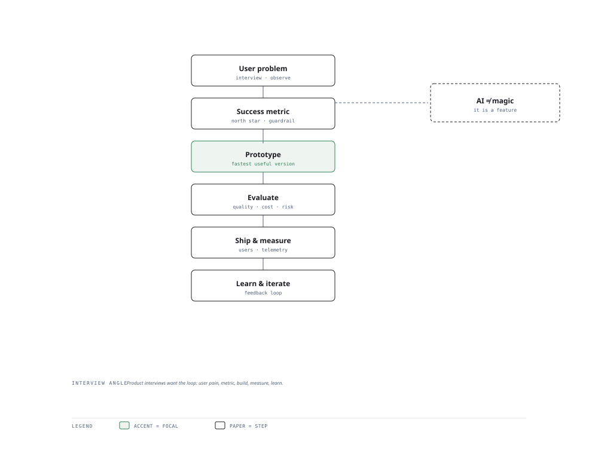

# Visual Notes — From Model to Product

> One diagram, the full picture. This page is meant to be glanced at before reading the chapters, and again before interviews.

# What the diagram shows

1. **Find** — Understand the user problem and whether AI is even the right tool.
1. **Build** — Prototype fast, instrument metrics, evaluate honestly.
1. **Learn** — Ship, read the numbers, improve — AI products live on loops.

# Why this matters for placement

- Product sense separates senior candidates; "why build this?" is now asked at every level.
- Framing a project by user value and success metrics makes technical work narratively strong.

# Quick revision

- Start from a user pain, not from the coolest model.
- Define a north-star metric; then product and guardrail metrics.
- AI trust: show confidence, fall back gracefully, allow oversight.
- Evaluation is product work: measure task success, not just model scores.
- Ship small, learn fast; AI product strategy is iterative by nature.

# Related chapters

- [AI product strategy](01-ai-product-strategy.md)
- [UX for AI](02-ux-for-ai.md)
- [AI product metrics](04-ai-product-metrics.md)
- [AI roadmaps](05-ai-roadmaps.md)

---

**One-line answer for interviews:** *"Find the problem → define success → prototype → evaluate → ship → learn from users → iterate."*
