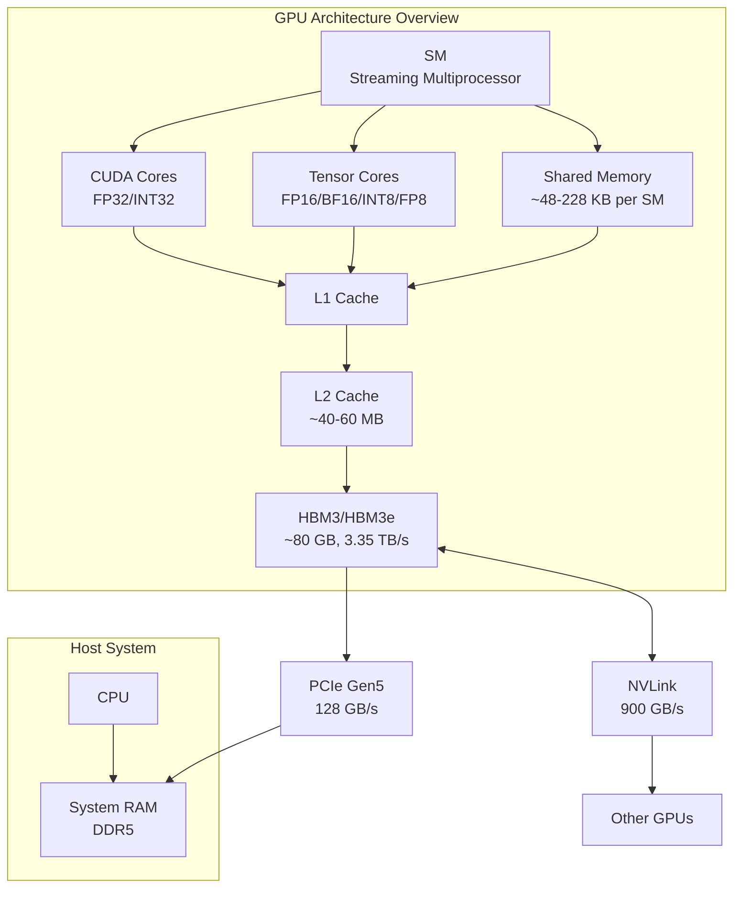
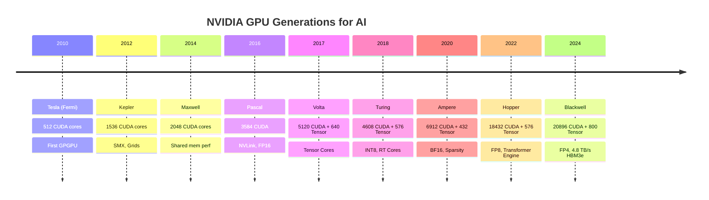
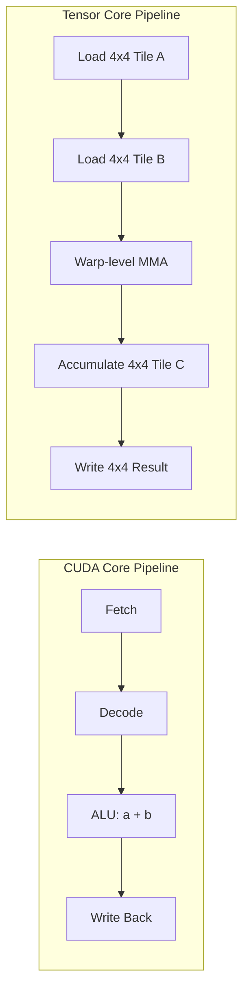
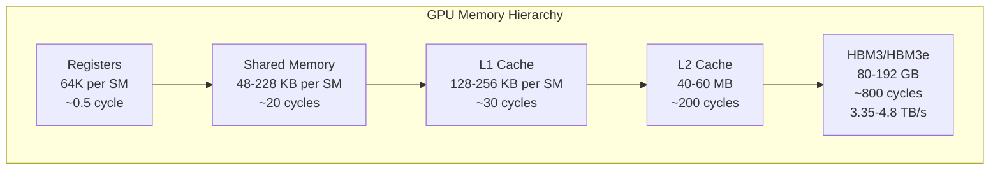
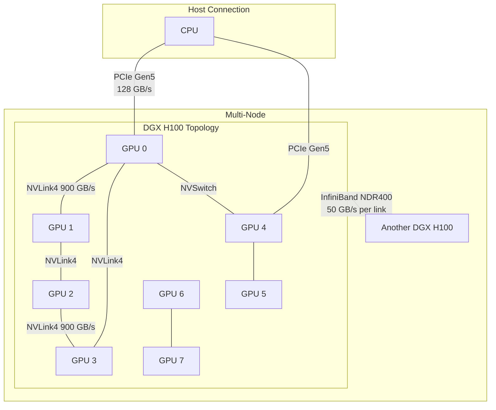
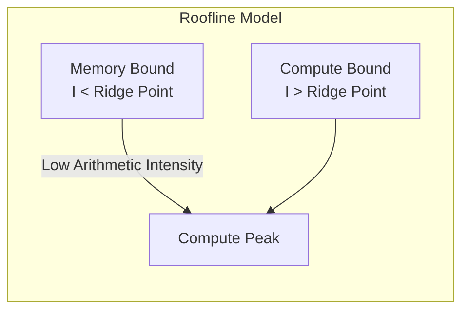
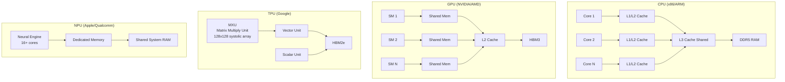

<!-- Clear Language: Keep sentences under 50 words -->
# GPU Architecture for AI

## Learning Objectives

| Objective | Description |
|-----------|-------------|
| LO1 | Trace NVIDIA GPU generations from Tesla to Blackwell with key specs |
| LO2 | Distinguish CUDA cores from Tensor Cores and their roles in AI |
| LO3 | Explain GPU memory hierarchy: register, shared memory, cache, HBM |
| LO4 | Describe interconnects: PCIe, NVLink, NVSwitch, InfiniBand topologies |
| LO5 | Apply the roofline model to classify compute-bound vs memory-bound ops |
| LO6 | Compare CPU vs GPU vs TPU vs NPU for AI workloads and cost trade-offs |

## Chapter at a Glance

| Section | Topic | Key Concept |
|---------|-------|-------------|
| 1.1 | NVIDIA GPU Generations | Tesla to Blackwell — CUDA cores, memory, process node |
| 1.2 | CUDA Cores vs Tensor Cores | Purpose, matrix math, mixed precision, throughput |
| 1.3 | Memory Hierarchy | Register → Shared → L1/L2 → HBM bandwidth pyramid |
| 1.4 | Interconnects | PCIe, NVLink, NVSwitch, InfiniBand for multi-GPU |
| 1.5 | Roofline Model | Compute-bound vs memory-bound, arithmetic intensity |
| 1.6 | CPU vs GPU vs TPU vs NPU | Architecture, use cases, cost, efficiency |

## Chapter Roadmap



## Introduction

GPU architecture determines how fast AI models train and infer. Understanding compute units, memory hierarchy, and interconnects helps you optimize model performance. This chapter covers NVIDIA GPU generations, core types, memory systems, interconnects, and the roofline model used to analyze bottlenecks.

## Prerequisites

- Basic computer architecture: CPU, RAM, cache concepts
- Module 09 (Deep Learning) — matrix multiplication, transformer basics
- Familiarity with floating-point formats: FP32, FP16, BF16, INT8

## Key Terminology

**Key Terms**: Core vocabulary and concepts for this topic.

| Term | Definition |
|------|------------|
| SM | Streaming Multiprocessor — the fundamental compute unit on an NVIDIA GPU |
| CUDA Core | A scalar ALU that executes one FP32 or INT32 operation per cycle |
| Tensor Core | A specialized unit that performs fused matrix multiply-accumulate on 4x4 tiles |
| HBM | High Bandwidth Memory — 3D-stacked DRAM with wide buses |
| NVLink | NVIDIA's high-bandwidth GPU-to-GPU interconnect |
| NVSwitch | A fabric switch connecting up to 576 GPUs in a DGX SuperPOD |
| Arithmetic Intensity | FLOPs per byte fetched from memory (FLOP:Byte ratio) |
| Roofline Model | A performance model plotting FLOP/s vs arithmetic intensity |
| Mixed Precision | Using FP16/BF16 for compute with FP32 master weights |
| TDP | Thermal Design Power — maximum heat a chip dissipates |
| SMX | Enhanced SM with more cores per unit area (Kepler onward) |
| GPC | Graphics Processing Cluster — groups multiple TPCs |

## Theory

### 1.1 GPU Generations — NVIDIA Architecture Timeline

NVIDIA GPU generations form the backbone of modern AI hardware. Each generation brought higher core counts, faster memory, and new precision formats.



**Tesla (Fermi, 2010):** The first GPU designed for general-purpose computing. 512 CUDA cores, 1.5 GB GDDR5, 192 GB/s bandwidth. Launched CUDA 2.0 with ECC memory.

**Kepler (2012):** Introduced SMX — a more efficient SM design. 1536 CUDA cores per SM, 6 GB GDDR5, 288 GB/s. Added dynamic parallelism and Hyper-Q for multi-queue kernel launch.

**Maxwell (2014):** Focused on power efficiency. 2048 CUDA cores, 4 GB GDDR5, 224 GB/s. Shared memory and L1 cache merged into a unified 96 KB block. Became popular for early deep learning.

**Pascal (2016):** The first GPU with NVLink interconnect. 3584 CUDA cores, 16 GB HBM2, 720 GB/s. Added FP16 support for mixed precision. Used in DGX-1 (8x P100).

**Volta (2017):** Introduced Tensor Cores — 640 per GPU. 5120 CUDA cores, 32 GB HBM2, 900 GB/s. V100 became the gold standard for AI training. Added independent thread scheduling.

**Turing (2018):** Added RT Cores for ray tracing and INT8 Tensor Cores. 4608 CUDA cores, 576 Tensor Cores, 16 GB GDDR6, 616 GB/s. Focused on inference with INT4 support.

**Ampere (2020):** Added BF16 and structural sparsity. 6912 CUDA cores, 432 Tensor Cores (3rd gen), 40/80 GB HBM2e, 2 TB/s. A100 introduced Multi-Instance GPU (MIG) for partitioning.

**Hopper (2022):** Introduced Transformer Engine with FP8. 18432 CUDA cores, 576 Tensor Cores (4th gen), 80 GB HBM3, 3.35 TB/s. Added DPX instructions for dynamic programming. H100 has 132 SMs in full config.

**Blackwell (2024):** Two dies fused into one package. 20896 CUDA cores, ~800 Tensor Cores (5th gen), 192 GB HBM3e, 4.8 TB/s. Supports FP4, FP6, and second-gen Transformer Engine. B200 delivers 4x training and 30x inference over H100.

```python
# Simulate GPU generation compute growth
# Demonstrates how TFLOPS scale across generations

gpu_generations = {
    "K80 (Kepler)":   {"cuda_cores": 2496, "tflops_fp32": 4.1,  "hbm_gb": 24,  "year": 2014},
    "P100 (Pascal)":  {"cuda_cores": 3584, "tflops_fp32": 9.3,  "hbm_gb": 16,  "year": 2016},
    "V100 (Volta)":   {"cuda_cores": 5120, "tflops_fp32": 14.0, "hbm_gb": 32,  "year": 2017},
    "A100 (Ampere)":  {"cuda_cores": 6912, "tflops_fp32": 19.5, "hbm_gb": 80,  "year": 2020},
    "H100 (Hopper)":  {"cuda_cores": 18432,"tflops_fp32": 60.0, "hbm_gb": 80,  "year": 2022},
    "B200 (Blackwell)":{"cuda_cores": 20896,"tflops_fp32": 90.0, "hbm_gb": 192, "year": 2024},
}

print(f"{'GPU':<20} {'Year':<6} {'Cores':<8} {'FP32 TFLOPS':<12} {'HBM GB':<8} {'TFLOPS/GB':<10}")
print("="*68)
for name, spec in gpu_generations.items():
    efficiency = spec["tflops_fp32"] / spec["hbm_gb"]
    print(f"{name:<20} {spec['year']:<6} {spec['cuda_cores']:<8} "
          f"{spec['tflops_fp32']:<12.1f} {spec['hbm_gb']:<8} {efficiency:<10.2f}")

# Output:
# TFLOPS per GB (compute/memory ratio) from K80 = 0.17 to B200 = 0.47
# Shows compute is growing faster than memory capacity
```

### 1.2 CUDA Cores vs Tensor Cores

CUDA cores and Tensor Cores serve different purposes in AI workloads. Understanding their difference is essential for optimization.

**CUDA Cores:** General-purpose scalar processors. Each CUDA core executes one floating-point or integer operation per clock cycle on a single data element (SPMD model). CUDA cores handle element-wise operations, activations, and control flow.

**Tensor Cores:** Specialized matrix multiply-accumulate units. Each Tensor Core performs a 4x4 x 4x4 matrix multiply and accumulate in one cycle: D = A x B + C. Tensor Cores operate on tiles of 16x16, 8x8, or 4x4 elements depending on precision.



**Key differences:**

| Feature | CUDA Cores | Tensor Cores |
|---------|------------|--------------|
| Operation | Scalar (one element) | Tiled matrix (4x4 block) |
| Precision | FP32, INT32 | FP16, BF16, INT8, FP8, FP4 |
| Throughput | 1 FMA/cycle/core | 64 FMA/cycle/core (FP16) |
| Latency | ~4 cycles | ~8 cycles |
| Use case | Activations, norms, control | GEMM, convolutions, attention |
| Introduced | G80 (2006) | Volta V100 (2017) |

**Mixed Precision Training:** Uses Tensor Cores for forward/backward passes (FP16/BF16) and keeps master weights in FP32. This gives 2-8x speedup over pure FP32 with no accuracy loss.

```python
# Simulate CUDA Core vs Tensor Core throughput for matrix multiply
import numpy as np
import time

def simulate_cuda_gemm(M: int, N: int, K: int, cores: int = 6912, clock_ghz: float = 1.4):
    """Simulate GEMM on CUDA cores (scalar FP32)."""
    # Each core does 1 FMA per cycle = 2 FLOPs per cycle
    # Total FLOPs = 2 * M * N * K (multiply + accumulate)
    total_flops = 2.0 * M * N * K
    peak_flops = cores * clock_ghz * 1e9  # FLOPs per second
    time_seconds = total_flops / peak_flops
    return time_seconds, total_flops

def simulate_tensor_gemm(M: int, N: int, K: int, tensor_cores: int = 432, clock_ghz: float = 1.4):
    """Simulate GEMM on Tensor Cores (tiled FP16)."""
    # Each Tensor Core does 64 FMA/cycle = 128 FLOPs/cycle (FP16)
    total_flops = 2.0 * M * N * K
    # Tensor Core throughput: 128 * tensor_cores * clock
    peak_flops = tensor_cores * 128 * clock_ghz * 1e9
    time_seconds = total_flops / peak_flops
    return time_seconds, total_flops

# Matrix dimensions: 4096 x 4096 x 4096 (common in transformers)
M, N, K = 4096, 4096, 4096

cuda_time, cuda_flops = simulate_cuda_gemm(M, N, K)
tensor_time, tensor_flops = simulate_tensor_gemm(M, N, K)

print(f"Matrix: {M}x{N}x{K}")
print(f"Total FLOPs: {cuda_flops:.2e}")
print(f"CUDA Core time (FP32):  {cuda_time:.6f}s  ({cuda_flops/cuda_time/1e12:.2f} TFLOPS)")
print(f"Tensor Core time (FP16): {tensor_time:.6f}s  ({tensor_flops/tensor_time/1e12:.2f} TFLOPS)")
print(f"Speedup: {cuda_time/tensor_time:.1f}x")

# In practice, H100 achieves ~2000 TFLOPS on FP16 Tensor Core GEMM
# vs ~60 TFLOPS on FP32 CUDA core GEMM — a 33x advantage for matmul-heavy workloads
```

**When to use each:**

- **CUDA Cores:** Element-wise ops (ReLU, layer norm, softmax), control flow, data loading
- **Tensor Cores:** Matrix multiply (linear layers, attention projections, convolutions)
- **Hybrid:** Flash Attention uses both — Tensor Cores for the QK^T matmul, CUDA cores for softmax scaling

### 1.3 Memory Hierarchy

GPU memory is a pyramid. Each level has different size, bandwidth, and latency. Optimizing data movement across levels is the key to GPU performance.



| Level | Size | Latency | Bandwidth | Scope |
|-------|------|---------|-----------|-------|
| Register | 64K per SM | ~0.5 cycle | ~20 PB/s | Per thread |
| Shared Memory | 48-228 KB per SM | ~20 cycles | ~30 TB/s | Per thread block |
| L1 Cache | 128-256 KB per SM | ~30 cycles | ~15 TB/s | Per SM |
| L2 Cache | 40-60 MB | ~200 cycles | ~4 TB/s | All SMs |
| HBM3 | 80-192 GB | ~800 cycles | 3.35 TB/s | All SMs |

**Registers:** Fastest but per-thread. A thread can access ~255 registers (max). Using more causes register spilling to L1 — a major performance killer.

**Shared Memory:** Programmable cache shared by all threads in a block. Used for cooperative data reuse (e.g., tiled matrix multiply). Accessible in ~20 cycles vs ~800 cycles for HBM.

**L1 Cache:** Automatically caches global memory accesses. On Hopper, L1 is 256 KB per SM. Can be partitioned: part as shared memory, part as L1 cache.

**L2 Cache:** Shared by all SMs. H100 has 60 MB L2 — up from 40 MB on A100. Larger L2 reduces HBM pressure for workloads with reuse.

**HBM (High Bandwidth Memory):** 3D-stacked DRAM with wide interfaces. HBM3e on Blackwell achieves 4.8 TB/s. HBM is the main bottleneck for memory-bound kernels.

```python
# Simulate latency impact of memory hierarchy on matrix multiply
import numpy as np

def simulate_memory_traffic(M: int, N: int, K: int,
                            tile_size: int = 32,
                            use_shared: bool = True):
    """
    Estimate HBM traffic for a GEMM kernel.
    Without shared memory: each A and B element is read N and M times.
    With shared memory (tiling): each element is read once from HBM,
    then re-used from shared memory tile_size times.
    """
    total_elements_A = M * K
    total_elements_B = K * N
    bytes_per_elem = 2  # FP16

    if use_shared:
        # Tiled: each tile loaded once from HBM
        # Number of tiles along K: K / tile_size
        # Each tile of A (M x tile_size) and B (tile_size x N)
        # loaded once
        hbm_traffic = (total_elements_A + total_elements_B) * bytes_per_elem
        shared_traffic = (total_elements_A + total_elements_B) * bytes_per_elem
        label = "With shared memory (tiled)"
    else:
        # Naive: each thread loads A row M times, B column N times
        hbm_traffic = (total_elements_A * N + total_elements_B * M) * bytes_per_elem
        shared_traffic = 0
        label = "Without shared memory"

    print(f"{label}:")
    print(f"  HBM traffic:  {hbm_traffic / 1e9:.2f} GB")
    print(f"  Shared traffic: {shared_traffic / 1e6:.2f} MB")
    print(f"  Ratio (wasted bandwidth): {(total_elements_A * N + total_elements_B * M) / (total_elements_A + total_elements_B):.1f}x")

    hbm_bandwidth = 3.35e12  # 3.35 TB/s
    time_with_tiling = hbm_traffic / hbm_bandwidth
    time_without_tiling = (total_elements_A * N + total_elements_B * M) * bytes_per_elem / hbm_bandwidth

    print(f"  HBM time (w/ tiling):  {time_with_tiling*1000:.3f} ms")
    print(f"  HBM time (w/o tiling): {time_without_tiling*1000:.3f} ms")
    print(f"  Speedup: {time_without_tiling / time_with_tiling:.1f}x")
    print()

simulate_memory_traffic(4096, 4096, 4096, tile_size=32, use_shared=True)
simulate_memory_traffic(4096, 4096, 4096, tile_size=32, use_shared=False)

# Key insight: tiling reduces HBM traffic by ~tile_size x
# 4096/32 = 128x less traffic
# This is why shared memory is critical for performance
```

**Memory coalescing:** When threads in a warp access consecutive addresses, the memory controller fetches in one 128-byte transaction. Misaligned or strided access causes multiple transactions — reducing effective bandwidth by up to 10x.

### 1.4 Interconnects — Multi-GPU Topologies

AI models larger than a single GPU's memory (e.g., Llama 3 405B, GPT-4) require multiple GPUs. Interconnects define how fast GPUs communicate.



**PCI Express (PCIe):** Standard CPU-to-GPU link. Each GPU connects through the PCIe root complex.

| PCIe Gen | Lanes | Bandwidth (x16, each direction) | Total Duplex |
|----------|-------|----------------------------------|--------------|
| Gen3 | x16 | 16 GB/s | 32 GB/s |
| Gen4 | x16 | 32 GB/s | 64 GB/s |
| Gen5 | x16 | 64 GB/s | 128 GB/s |
| Gen6 | x16 | 128 GB/s | 256 GB/s |

**NVLink:** High-bandwidth GPU-to-GPU interconnect. Direct connection without CPU involvement.

| Version | Links | Bandwidth (full duplex, per GPU) | Introduced |
|---------|-------|----------------------------------|------------|
| NVLink 1 | 4 | 160 GB/s | P100 |
| NVLink 2 | 6 | 300 GB/s | V100 |
| NVLink 3 | 12 | 600 GB/s | A100 |
| NVLink 4 | 18 | 900 GB/s | H100 |
| NVLink 5 | 18 | 1800 GB/s | B200 |

**NVSwitch:** A fabric switch that connects all GPUs in a DGX system in a full all-to-all topology. DGX H100 has 4 NVSwitches providing 900 GB/s per GPU. Combined with SHARP (Scalable Hierarchical Aggregation and Reduction Protocol), it offloads gradient reduction to the network.

**InfiniBand:** Node-to-node interconnect for multi-node training.

| Generation | Data Rate | Bandwidth per link | Connector |
|------------|-----------|-------------------|-----------|
| HDR | 200 Gbps | 25 GB/s | QSFP56 |
| NDR | 400 Gbps | 50 GB/s | QSFP112 |
| XDR | 800 Gbps | 100 GB/s | QSFP224 |

**Topology comparison:**

| Topology | All-reduce time (8 GPUs) | Scalability | Cost |
|----------|--------------------------|-------------|------|
| PCIe ring | ~200 ms | Low | Low |
| NVLink ring | ~20 ms | Medium | Medium |
| NVSwitch + NVLink | ~5 ms | High | High |
| InfiniBand (multi-node) | ~2 ms per hop | Very high | Very high |

```python
# Estimate all-reduce time for different interconnects
import math

def estimate_allreduce_time(
    model_size_gb: float,
    num_gpus: int,
    interconect_bw_gbs: float,
    topology: str = "ring"
):
    """
    Estimate all-reduce communication time.
    Ring: 2 * (num_gpus - 1) / num_gpus * model_size / bw
    Tree: 2 * log2(num_gpus) * model_size / bw
    """
    if topology == "ring":
        # Ring all-reduce: scatter-reduce + all-gather
        # Each step: (num_gpus - 1) / num_gpus * model_size
        factor = 2.0 * (num_gpus - 1) / num_gpus
    elif topology == "tree":
        # Tree all-reduce: log2(num_gpus) levels
        factor = 2.0 * math.log2(num_gpus)
    elif topology == "all2all":
        # NVSwitch: ~1x model size (single hop)
        factor = 2.0
    else:
        raise ValueError(f"Unknown topology: {topology}")

    # Time in milliseconds
    time_ms = factor * model_size_gb / interconect_bw_gbs * 1000
    effective_bw = model_size_gb / (time_ms / 1000)
    return time_ms, effective_bw

model_gb = 80.0  # Llama 3 405B in FP16 ~ 80 GB
num_gpus = 8

configs = [
    ("PCIe Gen5 (ring)", 128 / 8, "ring"),  # 128 GB/s shared among 8 GPUs
    ("NVLink3 (ring)", 600 / 8, "ring"),
    ("NVLink4 (ring)", 900 / 8, "ring"),
    ("NVLink4 + NVSwitch", 900, "all2all"),
    ("InifiniBand NDR (tree)", 50, "tree"),
]

print(f"Model: {model_gb} GB on {num_gpus} GPUs")
print(f"{'Interconnect':<30} {'Time (ms)':<12} {'Effective BW (GB/s)':<20}")
print("="*62)

for name, bw, topo in configs:
    time_ms, eff_bw = estimate_allreduce_time(model_gb, num_gpus, bw, topo)
    print(f"{name:<30} {time_ms:<12.1f} {eff_bw:<20.1f}")

# NVSwitch reduces all-reduce time from ~444ms (PCIe ring) to ~6ms
# This directly impacts training efficiency for large models
```

### 1.5 Roofline Model

The roofline model is a visual performance model that helps identify bottlenecks. It plots achievable FLOP/s versus arithmetic intensity (FLOPs per byte).

**Arithmetic intensity:** I = total FLOPs / total bytes moved from HBM.

- **Compute-bound:** Ops limited by compute throughput (high I). The kernel hits the compute ceiling.
- **Memory-bound:** Ops limited by memory bandwidth (low I). The kernel hits the memory ceiling.



```mermaid
flowchart LR
    subgraph Roofline["Roofline Chart"]
        A[Log(FLOP/s)] --> B[Log(Arithmetic Intensity)]
        C[Memory BW ceiling<br/>slope = 1] --> D[Ridge Point]
        E[Compute ceiling<br/>horizontal line] --> D
        F[Memory-bound ops<br/>e.g., softmax, norms] --> C
        G[Compute-bound ops<br/>e.g., large matmul] --> E
    end
```

```python
# Visualize the roofline model with NumPy
import numpy as np

def roofline_analysis(
    total_flops: float,
    total_bytes: float,
    peak_compute_tflops: float,   # TFLOPS/s
    peak_bandwidth_tbs: float     # TB/s
):
    """
    Apply roofline model to determine if a kernel is compute-bound or memory-bound.
    """
    arithmetic_intensity = total_flops / total_bytes  # FLOPs/byte
    ridge_point = peak_compute_tflops / peak_bandwidth_tbs  # FLOPs/byte

    # Maximum achievable performance
    # Limited by bandwidth (memory-bound) or compute (compute-bound)
    bw_bound_flops = total_bytes * peak_bandwidth_tbs * 1e12  # FLOPs/s limited by BW
    compute_bound_flops = peak_compute_tflops * 1e12  # FLOPs/s limited by compute

    achievable_flops = min(bw_bound_flops, compute_bound_flops)
    achieved_tflops = achievable_flops / 1e12

    is_compute_bound = arithmetic_intensity >= ridge_point
    achieved_efficiency = achieved_tflops / peak_compute_tflops * 100

    print(f"Arithmetic Intensity: {arithmetic_intensity:.2f} FLOPs/byte")
    print(f"Ridge Point:         {ridge_point:.2f} FLOPs/byte")
    print(f"Type:                {'COMPUTE BOUND' if is_compute_bound else 'MEMORY BOUND'}")
    print(f"Achievable:          {achieved_tflops:.1f} TFLOPS/s")
    print(f"Efficiency:          {achieved_efficiency:.1f}%")

    return {
        "arithmetic_intensity": arithmetic_intensity,
        "ridge_point": ridge_point,
        "is_compute_bound": is_compute_bound,
        "achieved_tflops": achieved_tflops,
        "efficiency": achieved_efficiency
    }

# H100 specs
PEAK_COMPUTE = 2000  # TFLOPS (FP16 Tensor Core)
PEAK_BW = 3.35       # TB/s HBM3

# Common AI kernel profiles
kernels = [
    ("Matmul 4096x4096x4096", 2*4096*4096*4096, 3*4096*4096*2),   # 2*M*N*K FLOPs, A+B+C in FP16
    ("Layer Norm 4096", 4*4096, 2*4096*2),                         # 4N FLOPs, read+write FP16
    ("Softmax 4096", 5*4096, 2*4096*2),                            # exp+sum+div = 5N
    ("Attention QK^T (4096x4096)", 2*4096*4096, 2*4096*4096*2),   # matmul
    ("GeLU Activation 4096", 3*4096, 2*4096*2),                    # ~3 ops per element
    ("Flash Attention (4096, 128, 64)", 2*4096*4096*64, 4096*4096*2*2),  # tiled with reuse
    ("Convolution 3x3 256ch", 2*3*3*256*256*64*64, 3*3*256*2 + 256*2), # small tile
]

print(f"{'Kernel':<35} {'Intensity':<12} {'Status':<18} {'TFLOPS':<10} {'Efficiency':<10}")
print("="*85)

for name, flops, bytes_moved in kernels:
    result = roofline_analysis(flops, bytes_moved, PEAK_COMPUTE, PEAK_BW)
    print(f"{name:<35} {result['arithmetic_intensity']:<12.2f} "
          f"{'COMPUTE' if result['is_compute_bound'] else 'MEMORY':<18} "
          f"{result['achieved_tflops']:<10.1f} {result['efficiency']:<10.1f}%")
    print("-"*85)

# Key insight:
# Large matmuls are compute-bound (high arithmetic intensity)
# Activations and norms are memory-bound (low arithmetic intensity)
# Flash Attention tiles the matmul to balance both
```

**Ridge point:** The arithmetic intensity where the two ceilings meet. On H100 with FP16 Tensor Cores: ridge = 2000 TFLOPS / 3.35 TB/s ≈ 597 FLOPs/byte. Ops above 597 FLOP/byte are compute-bound. Ops below are memory-bound.

**Optimization strategies:**

| Bottleneck | Fix |
|------------|-----|
| Memory-bound | Kernel fusion, tiling, reduce HBM reads, use shared memory |
| Compute-bound | Use Tensor Cores, mixed precision, increase batch size |
| Latency-bound | Increase occupancy, hide latency with more warps |

### 1.6 CPU vs GPU vs TPU vs NPU

Each processor is designed for a different workload. Choosing the right one affects cost, speed, and energy.



| Feature | CPU | GPU | TPU | NPU |
|---------|-----|-----|-----|-----|
| Cores | 8-128 (big cores) | 10000+ (small cores) | 2 MXU + Vector | 16-32 AI cores |
| Control | Complex OoO | Simple in-order | Minimal | Fixed-function |
| Cache | Large (32 MB L3) | Small (60 MB L2) | Minimal | None |
| Memory | DDR5 (100 GB/s) | HBM3 (3.35 TB/s) | HBM2e (1.2 TB/s) | Shared w/ CPU |
| Precision | FP64/FP32 | FP32/FP16/INT8/FP4 | BF16/INT8 | INT8/INT16 |
| Peak TFLOPS | ~2 (FP32) | ~2000 (FP16) | ~275 (BF16) | ~30 (INT8) |
| TDP | 150-350W | 350-700W | 200-450W | 5-15W |
| Cost | $500-$5000 | $10K-$40K | $50K+ (pod) | $50-$200 |

**When to use each:**

**CPU:** Sequential code, data preprocessing, orchestration, control logic. Use CPU for data loading, augmentation, and pipeline coordination. CPUs are latency-optimized: they handle branching and random access well.

**GPU:** Parallel compute — matrix multiply, convolutions, attention. GPU is the workhorse for training and batch inference. Required for backprop and large-scale transformer training. NVIDIA GPUs dominate with CUDA ecosystem.

**TPU:** Google's custom ASIC for tensor operations. TPUs use systolic arrays for matrix multiply (MXU). Best for very large models on Google Cloud (Gemini, PaLM). Requires JAX or TensorFlow. TPU v5e delivers ~400 TFLOPS/BF16 per chip.

**NPU:** Low-power AI accelerators in mobile and edge devices. Apple Neural Engine (17 TOPS in M4), Qualcomm Hexagon (45 TOPS in Snapdragon 8 Gen 3). NPUs handle on-device inference, camera processing, and always-on AI.

**Cost comparison for training a 7B parameter model:**

```python
# Estimate cost to train a 7B parameter model on different hardware
def estimate_training_cost(
    params_b: float = 7.0,
    tokens_b: float = 2000.0,  # 2T tokens (Llama 2 scale)
    tflops_per_gpu: float = 312.0,  # FP8 Tensor Core TFLOPS on H100
    num_gpus: int = 256,
    gpu_cost_per_hour: float = 3.0,
    model_flops_per_token: float = None
):
    """
    Estimate training cost using the formula:
    Total FLOPs ≈ 6 * params * tokens (forward + backward)
    Time = Total FLOPs / (num_gpus * tflops_per_gpu * 1e12 * MFU)
    """
    mfu = 0.45  # Model FLOPs Utilization (typical for large-scale training)

    if model_flops_per_token is None:
        # Standard formula: 6 * params per token (forward+backward)
        model_flops_per_token = 6.0 * params_b * 1e9

    total_flops = model_flops_per_token * tokens_b * 1e9
    flops_per_second = num_gpus * tflops_per_gpu * 1e12 * mfu
    time_seconds = total_flops / flops_per_second
    time_hours = time_seconds / 3600

    total_cost = time_hours * num_gpus * gpu_cost_per_hour

    print(f"Training {params_b}B param model on {tokens_b}B tokens")
    print(f"Hardware: {num_gpus} GPUs at {tflops_per_gpu} TFLOPS each")
    print(f"MFU: {mfu:.0%}")
    print(f"Estimated time: {time_hours:.1f} hours ({time_hours/24:.1f} days)")
    print(f"Estimated cost: ${total_cost:,.0f}")
    print(f"Cost per GPU-hour: ${gpu_cost_per_hour}")

    return time_hours, total_cost

configs = [
    ("8x A100 (80GB)", 19.5, 8, 2.50, 0.45),
    ("8x H100 (80GB)", 66.9, 8, 4.00, 0.50),
    ("256x H100 (DGX SuperPOD)", 66.9, 256, 3.50, 0.55),
    ("TPU v5e (8 chip)", 196.0, 8, 8.00, 0.50),
    ("4x B200 (Blackwell)", 180.0, 4, 6.00, 0.55),
]

for name, tflops, gpus, cost, mfu in configs:
    print("="*60)
    estimate_training_cost(
        params_b=7.0,
        tokens_b=2000,
        tflops_per_gpu=tflops,
        num_gpus=gpus,
        gpu_cost_per_hour=cost
    )
    print()

# H100 clusters dominate price-performance for training
# TPUs are competitive at very large scale (1000+ chips)
# Blackwell offers 2-3x cost reduction per token
```

**Summary of architectural differences:**

| Aspect | CPU | GPU | TPU | NPU |
|--------|-----|-----|-----|-----|
| Control | Out-of-order | SIMT warp | SIMD systolic | Fixed pipeline |
| Memory model | Cache coherent | Explicit + cache | H2D explicit | Shared |
| Programming | Any language | CUDA, OpenCL | JAX, TF | CoreML, NNAPI |
| Paradigm | MIMD | SIMT (SPMD) | SIMD | Dataflow |
| ML training | Not feasible | Best (Ampere+) | Competitive | N/A |
| ML inference | Slow | Excellent | Good | Excellent (edge) |
| Flexibility | Highest | High | Low | Lowest |

## Examples

### Example 1: Matrix Multiply with Memory-Bound vs Compute-Bound Profiles

```python
import numpy as np
import time

def benchmark_gemm(M: int, N: int, K: int, dtype=np.float16, iters: int = 10):
    """Benchmark a GEMM operation and classify as compute or memory bound."""
    A = np.random.randn(M, K).astype(dtype)
    B = np.random.randn(K, N).astype(dtype)

    # Warmup
    C = A @ B

    # Benchmark
    times = []
    for _ in range(iters):
        start = time.perf_counter()
        C = A @ B
        times.append(time.perf_counter() - start)

    avg_time = np.median(times)  # Use median to filter outliers
    total_flops = 2.0 * M * N * K
    total_bytes = (M*K + K*N + M*N) * np.dtype(dtype).itemsize

    tflops = total_flops / avg_time / 1e12
    bw = total_bytes / avg_time / 1e9  # GB/s
    intensity = total_flops / total_bytes

    print(f"GEMM {M}x{N}x{K} ({dtype.__name__})")
    print(f"  Time: {avg_time*1000:.3f} ms")
    print(f"  TFLOPS: {tflops:.2f}")
    print(f"  Effective BW: {bw:.1f} GB/s")
    print(f"  Arithmetic Intensity: {intensity:.1f} FLOPs/byte")

    # Classify (assume H100: 2000 TFLOPS, 3350 GB/s)
    ridge_point = 2000 / 3.35  # ~597 FLOPs/byte
    if intensity > ridge_point:
        print(f"  Status: COMPUTE BOUND (intensity {intensity:.0f} > ridge {ridge_point:.0f})")
    else:
        print(f"  Status: MEMORY BOUND (intensity {intensity:.0f} < ridge {ridge_point:.0f})")
    print()

benchmark_gemm(128, 128, 128)      # Small: memory bound
benchmark_gemm(1024, 1024, 1024)   # Medium: transitional
benchmark_gemm(4096, 4096, 4096)   # Large: compute bound

# Real GPUs achieve 50-80% of peak FLOPs on large matmuls
# This NumPy simulation shows the intensity trend
```

### Example 2: Data Movement Optimization

```python
# Estimate how many float16 elements fit in each memory level
from math import log2

def memory_profile():
    sizes = {
        "Register (per thread)":   (255, "elements", 0.5),
        "Shared Mem (per block)":  (49152, "elements", 20),     # 48 KB default
        "L1 Cache (per SM)":       (131072, "elements", 30),    # 256 KB
        "L2 Cache (total)":        (31457280, "elements", 200), # 60 MB
        "HBM3 (total)":            (42949672960, "elements", 800), # 80 GB
    }

    print(f"{'Memory Level':<30} {'Size (elems)':<18} {'Latency':<12}")
    print("="*60)
    for level, (size, unit, latency) in sizes.items():
        print(f"{level:<30} {size:<18,} {latency:<12}")

    # Bandwidth pyramid (GB/s)
    print("\nBandwidth Pyramid:")
    bws = {
        "Register (per SM)": 20_000,   # 20 PB/s (aggregate)
        "Shared Memory":     30_000,   # 30 TB/s
        "L1 Cache":          15_000,   # 15 TB/s
        "L2 Cache":          4_000,    # 4 TB/s
        "HBM3":              3_350,    # 3.35 TB/s
    }
    for level, bw in bws.items():
        bar = "#" * (bw // 500)
        print(f"{level:<25} {bw:>8,} GB/s |{bar}")

memory_profile()
```

## Interview Questions

### Question 1 (NVIDIA)
**Q:** Explain the difference between CUDA Cores and Tensor Cores on an H100 GPU. When would you use each?

**A:** CUDA Cores are scalar ALUs that execute one FP32/INT32 operation per cycle per core. H100 has 18432 CUDA Cores providing ~60 TFLOPS FP32. Tensor Cores are specialized matrix multiply units that operate on 4x4 tiles. Each Tensor Core performs D = A x B + C in one cycle, giving ~2000 TFLOPS FP16 and ~4000 TFLOPS FP8. Use CUDA Cores for element-wise ops (activations, normalization, control flow) and Tensor Cores for matrix multiply (linear layers, attention, convolutions). In practice, Flash Attention uses Tensor Cores for matmuls and CUDA Cores for softmax scaling.

### Question 2 (Amazon)
**Q:** How does NVLink differ from PCIe in multi-GPU training? Why does this matter for large models?

**A:** NVLink is a direct GPU-to-GPU interconnect, while PCIe connects GPUs through the CPU root complex. NVLink4 provides 900 GB/s bidirectional bandwidth per GPU vs PCIe Gen5 at 128 GB/s. For large model training (e.g., Llama 3 405B), gradient all-reduce is a bottleneck. With NVLink + NVSwitch, all-reduce completes in ~6ms. With PCIe ring, it takes ~444ms. This directly impacts scaling efficiency. A model using PCIe might achieve 60% scaling efficiency across 8 GPUs, while NVLink achieves 90%+.

### Question 3 (Microsoft)
**Q:** Explain the GPU memory hierarchy from fastest to slowest. How does shared memory improve matmul performance?

**A:** Hierarchy: Register (~0.5 cycle) → Shared Memory (~20 cycles) → L1 Cache (~30 cycles) → L2 Cache (~200 cycles) → HBM3 (~800 cycles). Shared memory is on-chip SRAM programmable by the developer. For matmul, threads cooperatively load tiles of A and B into shared memory, then all threads in the block reuse the same tile. This reduces HBM reads from O(M*N*K) to O(M*K + K*N) — a tile_size improvement. For a 32x32 tile on a 4096x4096 matmul, shared memory reduces HBM traffic by 128x.

### Question 4 (NVIDIA)
**Q:** What is the roofline model? How do you use it to optimize a kernel?

**A:** The roofline model plots achievable FLOP/s vs arithmetic intensity (FLOPs per byte fetched from memory). It has two ceilings: the memory bandwidth ceiling (diagonal line, slope = peak bandwidth) and the compute ceiling (horizontal line at peak FLOP/s). The ridge point is where they intersect. If a kernel's arithmetic intensity is below the ridge point, it is memory-bound — optimize by fusing ops, using shared memory, or reducing precision. If above, it is compute-bound — optimize by using Tensor Cores, increasing tile size, or improving occupancy.

### Question 5 (Amazon)
**Q:** Compare HBM3 to GDDR6X. Why does HBM dominate in H100 while GDDR6X is used in RTX 4090?

**A:** HBM3 uses 3D-stacked DRAM with a wide interface (1024-bit per stack), achieving 3.35 TB/s bandwidth at 80 GB capacity. GDDR6X uses a narrower 384-bit bus at higher clock speeds, achieving 1 TB/s at 24 GB. HBM is expensive (~5x per GB) but provides 3x more bandwidth and 10x more capacity — necessary for large model training. GDDR6X is cheaper and sufficient for gaming and small models. HBM is also more power-efficient per bit transferred, critical for datacenter GPUs at 700W TDP.

### Question 6 (Microsoft)
**Q:** What is arithmetic intensity and why is it important for GPU kernel design?

**A:** Arithmetic intensity = total FLOPs / total bytes transferred to/from HBM. A high intensity kernel (e.g., matmul 4096x4096: ~682 FLOPs/byte) is compute-bound, meaning the GPU's Tensor Cores are the bottleneck. A low intensity kernel (e.g., ReLU: ~0.75 FLOPs/byte) is memory-bound, meaning HBM bandwidth is the bottleneck. Kernel fusion increases arithmetic intensity by combining multiple ops into one kernel, keeping intermediate results in registers/shared memory instead of writing to HBM.

### Question 7 (NVIDIA)
**Q:** Explain how NVSwitch enables scaling to 256+ GPUs. What is SHARP?

**A:** NVSwitch is a fully-connected crossbar that connects all GPUs in a DGX system. DGX H100 has 4 NVSwitches providing 900 GB/s per GPU total bandwidth (450 GB/s bidirectional). This creates a single all-to-all topology: any GPU talks to any other GPU at full NVLink speed without traversing hops. SHARP (Scalable Hierarchical Aggregation and Reduction Protocol) offloads gradient reduction (all-reduce) to the NVSwitch fabric itself. The switch computes partial sums while data moves through it — reducing traffic by ~2x and eliminating the GPU overhead for reduction.

### Question 8 (Google/TPU focus)
**Q:** How does a Google TPU differ from an NVIDIA GPU for training transformer models?

**A:** TPUs use systolic arrays (MXU — Matrix Multiply Unit) that perform 128x128 matrix multiply in a single instruction. GPUs use Tensor Cores operating on 4x4 tiles. TPUs are simpler (no complex cache hierarchy, no warp scheduling) so they achieve higher utilization for regular matmul-heavy workloads (up to 70% MFU vs 50% for GPUs). However, TPUs are less flexible: they struggle with irregular ops (gather, dynamic shapes, control flow). GPUs handle these better due to CUDA Cores and advanced scheduling. TPUs require JAX/TensorFlow, while GPUs support PyTorch natively. For cost, TPUs are competitive only at very large scale (1000+ chips).

### Question 9 (Infrastructure)
**Q:** What happens when a model exceeds single GPU memory? Describe the options.

**A:** Three options: (1) **Model parallelism** — split layers across GPUs, each GPU holds part of the model. Requires high-bandwidth interconnect (NVLink). (2) **Pipeline parallelism** — split the model depth-wise, each GPU processes a stage. Lower communication but has idle bubble. (3) **Tensor parallelism** — split each layer's weights across GPUs. Requires all-reduce per layer — only feasible with NVLink/NVSwitch. (4) **Offloading** — swap activations/optimizer states to CPU RAM. Slow (PCIe bottleneck) but works for single GPU fine-tuning. In practice, large training uses 3D parallelism: data + tensor + pipeline parallelism combined.

### Question 10 (Architecture)
**Q:** Why is shared memory important for GPU performance? Give a concrete example.

**A:** Shared memory is on-chip SRAM (48-228 KB per SM) that is ~40x faster than HBM and programmable. It enables cooperative data reuse across threads in a block. Concrete example: tiled matrix multiply. Without shared memory, each thread block loading a 32x32 tile of A and B reads from HBM every time. With shared memory, the tile is loaded once from HBM (coalesced), then 32x32 threads read from shared memory in 32 parallel iterations. This reduces HBM traffic by 32x. In practice, cuBLAS uses this technique, achieving >80% of peak Tensor Core performance on large matrices.

## Chapter Quiz

**Q1:** Which NVIDIA GPU generation first introduced Tensor Cores?
- a) Pascal (P100)
- b) Volta (V100)
- c) Turing (T200)
- d) Ampere (A100)

**A1:** b) Volta (V100) — Tensor Cores debuted in 2017 with the V100 GPU.

---

**Q2:** What is the arithmetic intensity ridge point of H100 with FP16 Tensor Cores?
- a) ~100 FLOPs/byte
- b) ~300 FLOPs/byte
- c) ~600 FLOPs/byte
- d) ~1000 FLOPs/byte

**A2:** c) ~600 FLOPs/byte (2000 TFLOPS / 3.35 TB/s ≈ 597 FLOPs/byte).

---

**Q3:** Which interconnect provides the highest bandwidth for GPU-to-GPU communication in a DGX H100?
- a) PCIe Gen5
- b) NVLink 4
- c) InfiniBand NDR
- d) Ethernet 400G

**A3:** b) NVLink 4 provides 900 GB/s full-duplex per GPU. PCIe Gen5 gives 128 GB/s, InfiniBand NDR gives 50 GB/s per link.

---

**Q4:** In the GPU memory hierarchy, which level is the fastest?
- a) HBM3
- b) L1 Cache
- c) Shared Memory
- d) Registers

**A4:** d) Registers — ~0.5 cycle latency. Shared memory is ~20 cycles, L1 ~30 cycles, HBM ~800 cycles.

---

**Q5:** Which processor type is best suited for low-power on-device AI inference?
- a) CPU
- b) GPU
- c) TPU
- d) NPU

**A5:** d) NPU — Neural Processing Units (Apple Neural Engine, Qualcomm Hexagon) are designed for 5-15W power budget. GPUs consume 350-700W. CPUs are inefficient. TPUs are cloud-only.

## Exercises

**Exercise 1:** Modify the roofline analysis code to include FP8 Tensor Cores (4000 TFLOPS) and recompute the ridge point. Which kernels become compute-bound that were memory-bound before?

**Exercise 2:** Write a function that given a model size (GB) and number of GPUs, recommends the minimum interconnect bandwidth for 90% scaling efficiency. Use the all-reduce estimator.

**Exercise 3:** For a 70B parameter model (140 GB in FP16), design the memory allocation across 8 H100 GPUs. Account for: parameters, gradients, optimizer states (Adam: 2x for momentum + variance), and activations.

**Exercise 4:** Using the memory hierarchy simulator, compare HBM traffic for a 2x2 tiled convolution vs a naive convolution. Show the bandwidth savings in GB and percentage.

**Exercise 5:** Plot the roofline model (log-log scale) for the H100 with labeled ceilings and 5 kernel types. Include: matmul 512, matmul 4096, layer norm, softmax, and Flash Attention. Use matplotlib or any plotting library.

## Key Takeaways

- **GPU generations matter:** Each NVIDIA generation (Volta → Ampere → Hopper → Blackwell) doubles compute and adds new precision formats (FP16, BF16, INT8, FP8, FP4).
- **Tensor Cores are 10-30x faster than CUDA Cores** for matrix multiply — use them with mixed precision for all linear and attention layers.
- **Memory hierarchy determines performance:** Registers and shared memory are 40-800x faster than HBM. Kernel fusion and tiling reduce HBM traffic by 10-100x.
- **Multi-GPU scaling requires fast interconnects:** NVLink + NVSwitch gives 900 GB/s per GPU — essential for tensor parallelism. InfiniBand connects nodes in SuperPODs.
- **The roofline model identifies bottlenecks:** Use arithmetic intensity to classify kernels as compute-bound or memory-bound, then apply targeted optimizations.

## Summary

GPU architecture for AI is defined by three pillars: compute units (CUDA Cores and Tensor Cores), memory hierarchy (register → shared → L1/L2 → HBM), and interconnects (PCIe, NVLink, NVSwitch, InfiniBand). Each NVIDIA generation from Volta to Blackwell has added specialized hardware for matrix math, lower precision, and faster memory. The roofline model helps engineers classify kernels as compute-bound or memory-bound and optimize accordingly. Choosing between CPU, GPU, TPU, and NPU depends on workload: GPU for training, CPU for preprocessing, TPU for large-scale JAX workflows, and NPU for edge inference. Mastery of GPU architecture is essential for any AI engineer deploying or optimizing large models.