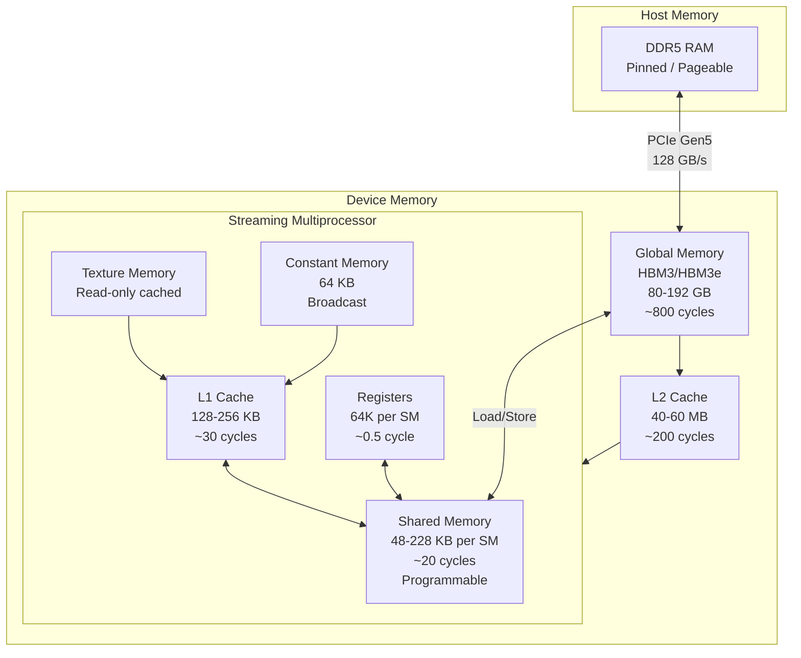
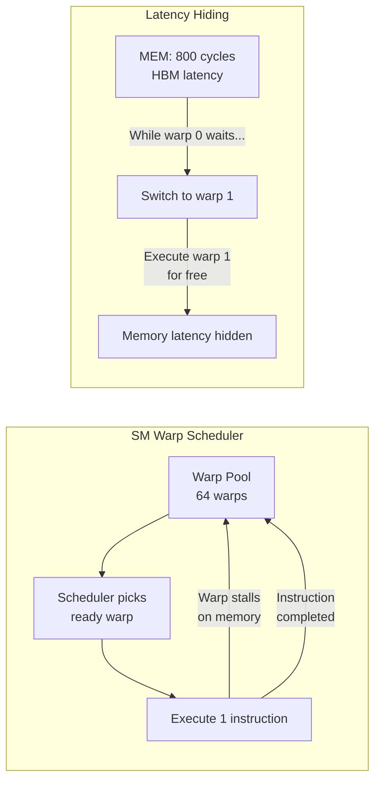

<!-- Clear Language: Keep sentences under 50 words -->
# CUDA Programming for AI

## Learning Objectives

| Objective | Description |
|-----------|-------------|
| LO1 | Write and launch CUDA kernels using grid/block/thread hierarchy and understand warp execution |
| LO2 | Manage GPU memory — allocate, transfer, and optimize using coalescing and shared memory |
| LO3 | Use CUDA libraries (cuBLAS, cuDNN, cuSPARSE, TensorRT) for AI acceleration |
| LO4 | Apply performance optimization techniques — occupancy, latency hiding, memory vs compute bound |
| LO5 | Profile and debug CUDA kernels using Nsight Compute, nsys, and occupancy calculator |

## Chapter at a Glance

| Section | Topic | Key Concept |
|---------|-------|-------------|
| 2.1 | CUDA Programming Model | Kernel launch, grid/block/thread, warp execution, SIMT model |
| 2.2 | Memory Management | cudaMalloc, cudaMemcpy, unified memory, coalescing, bank conflicts |
| 2.3 | CUDA Libraries for AI | cuBLAS GEMM, cuDNN convolution, cuSPARSE, TensorRT |
| 2.4 | Performance Optimization | Occupancy, memory throughput, instruction throughput, latency hiding |
| 2.5 | Profiling & Debugging | Nsight Compute, nsys profiling, occupancy calculator, kernel timing |

## Introduction

CUDA (Compute Unified Device Architecture) is NVIDIA's parallel computing platform that enables direct GPU programming. Every AI framework — PyTorch, TensorFlow, JAX — is built on CUDA under the hood. When you call `torch.matmul()`, CUDA dispatches a kernel to Tensor Cores. When you run a transformer, cuDNN executes fused attention kernels. This chapter teaches CUDA programming from the ground up with an AI focus. You will write kernels using Python (Numba), understand the memory model, use CUDA libraries, optimize performance, and profile your code. Mastery of CUDA separates AI users from AI engineers.

## Prerequisites

- Module 27-01 (GPU Architecture) — SMs, Tensor Cores, memory hierarchy
- Module 09 (Deep Learning) — matrix multiply, convolution, transformers
- Python programming — NumPy arrays, basic NumPy operations
- Basic parallel computing concepts — threads, race conditions, synchronization

## Key Terminology

**Key Terms:** Core CUDA vocabulary every AI engineer must know.

| Term | Definition |
|------|------------|
| Kernel | A function that runs on the GPU, launched with `<<<grid, block>>>` syntax |
| Thread | The smallest unit of execution in CUDA. Each thread runs one kernel instance |
| Block | A group of threads that cooperate via shared memory and synchronization |
| Grid | A collection of thread blocks that execute the same kernel |
| Warp | A group of 32 threads that execute instructions simultaneously (SIMT) |
| SIMT | Single Instruction, Multiple Threads — each thread in a warp runs the same instruction |
| SM | Streaming Multiprocessor — the hardware unit that executes warps |
| Occupancy | Ratio of active warps to maximum warps per SM |
| Shared Memory | On-chip SRAM accessible by all threads in a block (~48-228 KB per SM) |
| Coalescing | Memory access pattern where consecutive threads access consecutive addresses |
| Bank Conflict | Contention when multiple threads access the same shared memory bank |
| Stream | A sequence of operations (kernels, copies) executed in order on the GPU |
| CUDA Context | A virtual address space and resource container on a GPU device |
| Unified Memory | Single pointer accessible by CPU and GPU with automatic migration |
| cuBLAS | CUDA implementation of BLAS (Basic Linear Algebra Subprograms) for GPUs |
| cuDNN | CUDA Deep Neural Network library — optimized primitives for deep learning |
| TensorRT | NVIDIA's inference optimization SDK — graph optimization, quantization, kernel fusion |

## Theory

### 2.1 CUDA Programming Model

The CUDA programming model extends C/C++ with a small set of keywords. Kernels are functions called with execution configuration that specifies the grid and block dimensions. Every thread in the grid executes the same kernel code but operates on different data based on its thread ID.

**Kernel launch syntax:**

```cpp
// CUDA C++ (conceptual — runs on GPU)
__global__ void saxpy(float a, float* x, float* y, int n) {
    int i = blockIdx.x * blockDim.x + threadIdx.x;
    if (i < n) y[i] = a * x[i] + y[i];
}

// Host code — launch with 256 threads per block, enough blocks to cover N
saxpy<<<(n + 255) / 256, 256>>>(a, d_x, d_y, n);
```

The `__global__` qualifier declares a kernel. The triple-angle `<<<grid, block>>>` sets the execution configuration. `blockIdx`, `blockDim`, and `threadIdx` are built-in variables that identify each thread's position.

**Grid/Block/Thread Hierarchy:**

```mermaid
flowchart TB
    subgraph Grid["Grid (all threads)"]
        direction TB
        B0[Block 0] --> T00[Thread 0]
        B0 --> T01[Thread 1]
        B0 --> T0N[Thread N-1]
        B1[Block 1] --> T10[Thread 0]
        B1 --> T11[Thread 1]
        B1 --> T1N[Thread N-1]
        B2[Block 2] --> T20[Thread 0]
        B2 --> T21[Thread 1]
        B2 --> T2N[Thread N-1]
        BM[Block M-1] --> TM0[Thread 0]
        BM --> TM1[Thread 1]
        BM --> TMN[Thread N-1]
    end
    subgraph Dims["Dimensions"]
        G[gridDim.x / .y / .z] --> B[blockDim.x / .y / .z]
        B --> T[threadIdx.x / .y / .z]
    end
    subgraph Compute["Computation"]
        ID["Global ID = blockIdx * blockDim + threadIdx"] --> OP[Operate on array element]
    end
```



**Thread indexing formulas:**

| Dimension | 1D Grid | 2D Grid | 3D Grid |
|-----------|---------|---------|---------|
| Global ID (x) | `blockIdx.x * blockDim.x + threadIdx.x` | `blockIdx.x * blockDim.x + threadIdx.x` | Same |
| Global ID (y) | — | `blockIdx.y * blockDim.y + threadIdx.y` | Same |
| Global ID (z) | — | — | `blockIdx.z * blockDim.z + threadIdx.z` |
| Stride | `gridDim.x * blockDim.x` | `gridDim.x * blockDim.x` | `gridDim.x * blockDim.x` |

**Warp execution and the SIMT model:**

A warp is a group of 32 threads. The SM schedules and executes warps. All threads in a warp execute the same instruction on different data — this is the SIMT model. If threads within a warp diverge (e.g., `if (threadIdx.x % 2 == 0)`), both branches execute sequentially, and threads not in the current branch are masked out. This reduces throughput by up to 2x per divergent branch.

```python
# Numba CUDA — Python implementation of vector addition
# This is real CUDA using Numba's @cuda.jit decorator
from numba import cuda
import numpy as np
import math

@cuda.jit
def vector_add(a, b, c):
    """CUDA kernel — element-wise vector addition."""
    # Compute global thread ID
    tid = cuda.blockIdx.x * cuda.blockDim.x + cuda.threadIdx.x
    stride = cuda.gridDim.x * cuda.blockDim.x

    # Grid-stride loop — handles arbitrary vector sizes
    for i in range(tid, a.shape[0], stride):
        c[i] = a[i] + b[i]

# Host-side setup
n = 1_000_000
a = np.random.randn(n).astype(np.float32)
b = np.random.randn(n).astype(np.float32)
c = np.zeros(n, dtype=np.float32)

# Transfer to GPU device memory
d_a = cuda.to_device(a)
d_b = cuda.to_device(b)
d_c = cuda.to_device(c)

# Configure execution
threads_per_block = 256
blocks_per_grid = (n + threads_per_block - 1) // threads_per_block

# Launch kernel
vector_add[blocks_per_grid, threads_per_block](d_a, d_b, d_c)

# Copy result back to host
d_c.copy_to_host(c)

# Verify
assert np.allclose(c, a + b), "CUDA vector add failed!"
print(f"Vector add verified: {n:,} elements, "
      f"{blocks_per_grid} blocks x {threads_per_block} threads")
```

**Grid-stride loop pattern:** The kernel above uses a grid-stride loop. Instead of one element per thread, each thread processes multiple elements by striding by the total grid size. This pattern handles arbitrary array sizes and improves occupancy when the grid is too small.

**2D kernel example (image processing / matrix ops):**

```python
@cuda.jit
def matrix_add(a, b, c):
    """2D kernel — element-wise matrix addition."""
    row = cuda.blockIdx.y * cuda.blockDim.y + cuda.threadIdx.y
    col = cuda.blockIdx.x * cuda.blockDim.x + cuda.threadIdx.x

    if row < a.shape[0] and col < a.shape[1]:
        c[row, col] = a[row, col] + b[row, col]

# 2D launch configuration
block_dim = (16, 16)  # 256 threads per block
grid_dim = (math.ceil(n / 16), math.ceil(n / 16))
matrix_add[grid_dim, block_dim](d_a_2d, d_b_2d, d_c_2d)
```

**Warp-level primitives (shuffle instructions):**

Threads within a warp can exchange data directly using shuffle instructions — no shared memory needed. This is critical for warp-level reductions and prefix sums.

```python
@cuda.jit
def warp_reduce_sum(data):
    """Warp-level reduction using shuffle down."""
    tid = cuda.threadIdx.x
    val = data[tid] if tid < data.size else 0

    # Shuffle down by powers of 2 — all threads in warp participate
    for offset in [16, 8, 4, 2, 1]:
        # __shfl_down_sync — get value from thread (tid + offset)
        val += cuda.shfl_down_sync(0xFFFFFFFF, val, offset)

    # Thread 0 has the sum of all warp elements
    if tid == 0:
        data[0] = val

# This is how all-reduce works inside each warp
# Across warps, use shared memory to combine warp results
```

### 2.2 Memory Management

CUDA exposes a rich memory hierarchy. Managing data movement across this hierarchy determines kernel performance.

**cudaMalloc and cudaMemcpy patterns:**

```python
from numba import cuda
import numpy as np

# Device memory allocation and transfer
n = 1_000_000
host_array = np.random.randn(n).astype(np.float32)

# Pattern 1: Explicit copy
dev_array = cuda.to_device(host_array)          # Host → Device (cudaMemcpyHostToDevice)
result_host = dev_array.copy_to_host()          # Device → Host (cudaMemcpyDeviceToHost)

# Pattern 2: Device-side allocation with zeros
dev_zeros = cuda.device_array(n, dtype=np.float32)  # cudaMalloc + memset(0)

# Pattern 3: Pinned (page-locked) memory for faster transfers
# Numba uses pinned memory by default for cuda.to_device
# In PyTorch: torch.Tensor.pin_memory() before .to('cuda')
```

**Memory hierarchy in CUDA:**



**Unified Memory (CUDA 6+):**

Unified Memory provides a single pointer accessible by both CPU and GPU. The driver automatically migrates pages on demand. This simplifies programming but can hurt performance due to page faults.

```python
# Unified Memory in CUDA C++ (conceptual)
# cudaMallocManaged(&ptr, size);
# Access ptr on CPU — page fault migrates to CPU
# Launch kernel with ptr — page fault migrates to GPU

# Numba equivalent — use managed array
from numba import cuda
import numpy as np

# Managed memory — no explicit transfers needed
managed = cuda.managed_array(1_000_000, dtype=np.float32)

# Fill on CPU
managed[:] = np.random.randn(1_000_000)

@cuda.jit
def double_it(arr):
    i = cuda.grid(1)
    if i < arr.size:
        arr[i] *= 2.0

double_it[blocks_per_grid, threads_per_block](managed)

# Result is already on CPU — no copy needed
print(f"First 5: {managed[:5]}")

# When to use:
# - Prototyping and correctness debugging
# - Irregular access patterns with small data
# - Not recommended for: performance-critical kernels,
#   large data (>1 GB), or streaming workloads
```

**Memory coalescing:**

When threads in a warp access consecutive global addresses, the hardware combines accesses into a single 128-byte transaction. Non-coalesced access requires multiple transactions, dropping effective bandwidth by up to 10x.

```python
# Good (coalesced) vs Bad (non-coalesced) access patterns

import numpy as np
from numba import cuda

n = 1024 * 1024
data = np.random.randn(n).astype(np.float32)
dev_data = cuda.to_device(data)

@cuda.jit
def coalesced_read(output, input):
    """Each thread reads from its own index — consecutive threads = consecutive addresses."""
    i = cuda.grid(1)
    if i < input.size:
        output[i] = input[i] * 2.0  # Coalesced: thread 0 reads addr 0, thread 1 reads addr 1, ...

@cuda.jit
def non_coalesced_read(output, input):
    """Each thread reads with a stride — poor coalescing."""
    i = cuda.grid(1)
    if i < output.size:
        # Each thread reads a strided pattern — consecutive threads access
        # addresses 0, stride, 2*stride, ... — not consecutive
        output[i] = input[i * 8] * 2.0  # Non-coalesced for stride > 1

@cuda.jit
def transpose_read(output, input):
    """Column-major access in row-major array — worst case for coalescing."""
    row = cuda.blockIdx.y * cuda.blockDim.y + cuda.threadIdx.y
    col = cuda.blockIdx.x * cuda.blockDim.x + cuda.threadIdx.x
    if row < input.shape[0] and col < input.shape[1]:
        # Thread (tx, ty) reads input[ty][tx] — row-major
        # Threads in a warp have consecutive tx — coalesced for row access
        output[row, col] = input[row, col]  # Good: consecutive tx = consecutive addresses

@cuda.jit
def bad_transpose_read(output, input):
    """Row-major access in column iteration — non-coalesced."""
    row = cuda.blockIdx.y * cuda.blockDim.y + cuda.threadIdx.y
    col = cuda.blockIdx.x * cuda.blockDim.x + cuda.threadIdx.x
    if row < input.shape[0] and col < input.shape[1]:
        output[row, col] = input[col, row]  # Bad: input[col][row] — threads access columns, not rows
```

**Coalescing rules:**

| Pattern | Transaction size | Effective BW | Scenario |
|---------|-----------------|--------------|----------|
| Aligned consecutive (stride 1) | 1 x 128B (32 FP32 values) | 100% | Ideal — vector add, element-wise |
| Misaligned consecutive | 2 x 128B | 50% | Start at odd address |
| Stride 2 | 2 x 128B (64 threads) | 50% | Accessing every other element |
| Random | 32 x 128B | ~3% | Gather/scatter, sparse access |
| Broadcast | 1 x 32B (32 threads read same) | 25% | All threads read same address |

**Shared memory and bank conflicts:**

Shared memory is organized into 32 banks (32-bit wide). Successive 4-byte words map to successive banks. When threads in a warp access different addresses in the same bank, a bank conflict occurs and accesses are serialized.

```python
# Demonstrating shared memory bank conflicts
from numba import cuda

@cuda.jit
def shared_histogram(data, bins):
    """Compute histogram using shared memory — bank conflicts if stride == 32."""
    tid = cuda.threadIdx.x
    # Shared memory — 256 ints, one per thread
    shared = cuda.shared.array(256, dtype=cuda.int32)

    # Initialize shared memory
    if tid < 256:
        shared[tid] = 0
    cuda.syncthreads()

    # Each thread adds to shared[tid] — no conflict (stride 1)
    if tid < data.size:
        bin_idx = int(data[tid] * 127) % 256  # Map value to bin
        cuda.atomic.add(shared, bin_idx, 1)
    cuda.syncthreads()

    # Write back to global
    if tid < 256:
        bins[tid] = shared[tid]

# Bank conflict scenarios:
# stride 1:  thread 0 → bank 0, thread 1 → bank 1 ...  NO conflict
# stride 2:  thread 0 → bank 0, thread 1 → bank 2 ...  NO conflict (different banks)
# stride 32: thread 0 → bank 0, thread 32 → bank 0 ... CONFLICT!
# stride 33: thread 0 → bank 0, thread 33 → bank 1 ... NO conflict (non-power-of-2 stride)

# Fix: pad shared arrays by 1 element to break conflicts
# shared[256] → shared[257] shifts alignment so consecutive threads map to different banks
```

**cudaMemcpyAsync and streams — overlapping transfers and compute:**

```python
# CUDA Streams — overlap data transfer with kernel execution
from numba import cuda

# Create two streams
stream0 = cuda.stream()
stream1 = cuda.stream()

# Partition data
n = 1_000_000
half = n // 2

a = np.random.randn(n).astype(np.float32)
b = np.random.randn(n).astype(np.float32)
c = np.zeros(n, dtype=np.float32)

d_a = cuda.to_device(a)
d_b = cuda.to_device(b)
d_c = cuda.device_array_like(c)

@cuda.jit
def vec_add_kernel(a, b, c, n):
    i = cuda.grid(1)
    if i < n:
        c[i] = a[i] + b[i]

threads = 256
blocks_half = (half + threads - 1) // threads

# Stream 0: process first half
vec_add_kernel[blocks_half, threads, stream0](d_a[:half], d_b[:half], d_c[:half], half)

# Stream 1: process second half (concurrent with stream 0)
vec_add_kernel[blocks_half, threads, stream1](d_a[half:], d_b[half:], d_c[half:], half)

# Both streams execute concurrently on the same GPU
# Benefits: better utilization when kernel is memory-bound
# The GPU can overlap memory loads from one block with compute from another

# Wait for completion
cuda.synchronize()

d_c.copy_to_host(c, stream=stream0)
print("Streamed execution complete")
```

### 2.3 CUDA Libraries for AI

Writing custom CUDA kernels for matrix multiply or convolution is rarely necessary. NVIDIA provides optimized libraries that deliver near-peak hardware utilization. AI engineers must understand when to use each library and how to integrate them.

**cuBLAS — GEMM (General Matrix Multiply):**

cuBLAS provides BLAS-level operations on the GPU. The workhorse is `cublasGemmEx` — the fused matrix multiply used by every linear layer and attention projection in transformers.

```python
# PyTorch's torch.matmul calls cuBLAS under the hood
# Understanding the cuBLAS call helps interpret performance

import torch
import numpy as np

# This PyTorch call:
C = torch.matmul(A, B)

# Translates to cuBLAS (conceptual C++):
# cublasHandle_t handle;
# cublasCreate(&handle);
# float alpha = 1.0f, beta = 0.0f;
# cublasGemmEx(handle,
#     CUBLAS_OP_N, CUBLAS_OP_N,  # No transpose
#     N, M, K,                    # Dimensions: C(MxN) = A(MxK) * B(KxN)
#     &alpha,                     # Scaling factor for A*B
#     d_A, CUDA_R_16F, K,        # A in FP16, leading dimension K
#     d_B, CUDA_R_16F, N,        # B in FP16, leading dimension N
#     &beta,                      # Scaling factor for C
#     d_C, CUDA_R_16F, N,        # C in FP16, leading dimension N
#     CUDA_R_32F,                 # Compute type FP32 (accumulate in higher precision)
#     CUBLAS_GEMM_DEFAULT_TENSOR_OP  # Use Tensor Cores
# );

# Key cuBLAS features for AI:
# 1. Tensor Core acceleration (CUBLAS_GEMM_DEFAULT_TENSOR_OP)
# 2. Mixed precision (FP16 input, FP32 accumulate)
# 3. Batched GEMM (cublasGemmBatchedEx) for multi-head attention
# 4. Strided batched GEMM (cublasGemmStridedBatchedEx) — most efficient for attention

# Simulate batched GEMM for multi-head attention
def multi_head_attention_gemm(batch: int, heads: int, seq_len: int, d_head: int):
    """
    Multi-head attention uses strided batched GEMM.
    Q, K, V projections: each head is one GEMM in the batch.
    QK^T softmax: batched GEMM of (batch*heads) matrices.
    """
    # Q * K^T for all heads simultaneously (strided batched)
    batch_count = batch * heads
    m = seq_len      # Q rows
    n = seq_len      # K^T columns
    k = d_head       # inner dimension

    total_flops = 2.0 * batch_count * m * n * k
    print(f"MHA GEMM: {batch} x {heads} heads, seq={seq_len}, d_head={d_head}")
    print(f"  Batched GEMM count: {batch_count}")
    print(f"  Total FLOPs: {total_flops / 1e12:.2f} TFLOPS")

    # cuBLAS achieves ~80% of peak Tensor Core throughput on large batched GEMMs
    h100_peak_fp16 = 2000  # TFLOPS
    estimated_time = total_flops / (h100_peak_fp16 * 1e12 * 0.8)
    print(f"  Estimated time on H100: {estimated_time * 1000:.3f} ms")

multi_head_attention_gemm(batch=1, heads=32, seq_len=4096, d_head=128)
```

**cuDNN — convolution and fused kernels:**

cuDNN provides optimized implementations for convolutions, pooling, normalization, activation functions, and RNN operations. For transformers, cuDNN's fused attention (Flash Attention) and layer norm are critical.

```python
# cuDNN operations commonly called through PyTorch

import torch
import torch.nn.functional as F

# Layer normalization (cuDNN fused kernel)
x = torch.randn(4, 4096, 4096).cuda()
# cuDNN's fused layer norm:
y = F.layer_norm(x, [4096])
# This calls: cudnnBatchNormForwardTraining or cudnnLayerNormFwd

# Convolution (cuDNN is the reference implementation)
conv = torch.nn.Conv2d(256, 256, kernel_size=3, padding=1).cuda()
x = torch.randn(4, 256, 64, 64).cuda()
y = conv(x)
# This calls: cudnnConvolutionForward with CUDNN_CONVOLUTION_FWD_ALGO_IMPLICIT_PRECOMP_GEMM
# cuDNN internally converts convolution to matrix multiply (im2col + GEMM)
# or uses Winograd algorithm for small kernels (3x3)

# Flash Attention (cuDNN 9+)
# torch.nn.functional.scaled_dot_product_attention uses cuDNN's fused attention
query = torch.randn(4, 32, 4096, 128).cuda()
key = torch.randn(4, 32, 4096, 128).cuda()
value = torch.randn(4, 32, 4096, 128).cuda()

output = F.scaled_dot_product_attention(query, key, value)
# This calls cudnnFlashAttention with:
# - Tiled QK^T compute on Tensor Cores
# - On-chip softmax (no HBM round-trip)
# - Causal masking fused into the kernel
print(f"Flash Attention output shape: {output.shape}")
```

**cuSPARSE — sparse matrix operations:**

Sparse matrices appear in pruned models, graph neural networks, and scientific computing. cuSPARSE provides routines for sparse matrix-vector multiply (SpMV) and sparse matrix-matrix multiply (SpMM).

```python
# Simulate cuSPARSE SpMM for pruned neural network weights
import numpy as np

class SimulatedSparseLinear:
    """Simulate a pruned linear layer using sparse matrix multiply."""

    def __init__(self, in_features: int, out_features: int, sparsity: float = 0.9):
        self.in_features = in_features
        self.out_features = out_features
        # Dense weight for reference
        self.weight = np.random.randn(out_features, in_features).astype(np.float32)

        # Apply pruning mask
        mask = np.random.rand(*self.weight.shape) > sparsity
        self.sparse_weight = self.weight * mask

        # Count non-zero elements
        self.nnz = np.sum(mask)
        self.density = 1.0 - sparsity

        print(f"SparseLinear: {out_features}x{in_features}, "
              f"sparsity={sparsity:.0%}, nnz={self.nnz:,}")

    def dense_forward(self, x: np.ndarray) -> np.ndarray:
        """Dense matmul — O(out * in * batch) operations."""
        return x @ self.weight.T

    def sparse_forward_csr(self, x: np.ndarray) -> np.ndarray:
        """
        Simulate CSR-based SpMM (cuSPARSE csrmm).
        Only computes on non-zero elements.
        O(nnz * batch) operations — savings = 1 / density.
        """
        batch = x.shape[0]
        output = np.zeros((batch, self.out_features), dtype=np.float32)

        # For each non-zero in the sparse weight matrix
        for i in range(self.out_features):
            for j in range(self.in_features):
                if self.sparse_weight[i, j] != 0:
                    output[:, i] += x[:, j] * self.sparse_weight[i, j]

        return output

    def speedup_estimate(self, batch: int = 1) -> float:
        """Estimate SpMM speedup over dense GEMM."""
        dense_ops = 2 * batch * self.out_features * self.in_features
        sparse_ops = 2 * batch * self.nnz
        return dense_ops / sparse_ops

sp = SimulatedSparseLinear(4096, 4096, sparsity=0.95)
print(f"Estimated speedup vs dense: {sp.speedup_estimate():.1f}x")
# cuSPARSE achieves near-memory-bandwidth performance for SpMM
# On H100 with 95% sparsity: ~15x faster than dense GEMM
```

**TensorRT integration:**

TensorRT optimizes trained models for inference. It performs kernel fusion, precision calibration (FP16/INT8/FP4), and graph optimization. Understanding the TensorRT pipeline helps deploy models efficiently.

```python
# TensorRT optimization pipeline (conceptual — runs with TensorRT Python API)

# Step 1: Export model to ONNX
# torch.onnx.export(model, dummy_input, "model.onnx")

# Step 2: Build TensorRT engine (conceptual Python)
# import tensorrt as trt
#
# logger = trt.Logger(trt.Logger.INFO)
# builder = trt.Builder(logger)
# network = builder.create_network(1 << int(trt.NetworkDefinitionCreationFlag.EXPLICIT_BATCH))
# parser = trt.OnnxParser(network, logger)
# parser.parse_from_file("model.onnx")
#
# config = builder.create_builder_config()
# config.set_memory_pool_limit(trt.MemoryPoolType.WORKSPACE, 6 * (1 << 30))  # 6 GB
# config.set_flag(trt.BuilderFlag.FP16)  # Enable FP16 inference
#
# # Step 3: Build optimized engine
# serialized_engine = builder.build_serialized_network(network, config)

# What TensorRT does internally:
# 1. Graph optimization: fuse Conv + Bias + ReLU into one kernel (CBR fusion)
# 2. Kernel auto-tuning: select fastest kernel for each layer
# 3. Precision calibration: FP16/INT8/FP4 with minimal accuracy loss
# 4. Memory optimization: reuse buffers, minimize allocations
# 5. Stream management: overlap copies with compute

# Performance gains from TensorRT:
print("TensorRT typical optimizations:")
print(f"  FP32 → FP16:      2x throughput, ~0% accuracy loss")
print(f"  FP32 → INT8:      4x throughput, <1% accuracy loss")
print(f"  Kernel fusion:    1.2-1.5x (fewer kernel launches)")
print(f"  Memory optimization: 1.1-1.3x (less allocation overhead)")
print(f"  Total speedup:    2-6x vs raw PyTorch eager mode")
print(f"  Total speedup:    1.2-2x vs torch.compile")
```

### 2.4 Performance Optimization

CUDA performance optimization is a systematic process. The key metrics are occupancy, memory throughput, and instruction throughput. Understanding these helps classify and fix bottlenecks.

**Occupancy:**

Occupancy is the ratio of active warps per SM to the maximum possible warps. Higher occupancy hides latency — when one warp stalls on a memory access, the SM switches to another warp.

```python
# Occupancy calculation
def compute_occupancy(
    threads_per_block: int,
    shared_mem_per_block: int,   # bytes
    registers_per_thread: int,
    sm_properties: dict
) -> dict:
    """
    Compute theoretical occupancy for a kernel on a given SM.
    H100 SM properties: max warps = 64, max blocks = 32,
    max registers = 65536, max shared mem = 228 KB
    """
    max_warps_per_sm = sm_properties["max_warps"]       # 64
    max_blocks_per_sm = sm_properties["max_blocks"]      # 32
    max_registers = sm_properties["max_registers"]       # 65536
    max_shared_mem = sm_properties["max_shared_mem"]     # 233472

    warps_per_block = (threads_per_block + 31) // 32

    # Limits from each resource
    limit_warps = max_warps_per_sm
    limit_blocks = max_blocks_per_sm
    limit_registers = max_registers // (registers_per_thread * threads_per_block)
    limit_shared = max_shared_mem // shared_mem_per_block if shared_mem_per_block > 0 else max_blocks_per_sm

    # Block count limited by the tightest resource
    max_blocks = min(limit_blocks, limit_registers, limit_shared)
    max_warps = min(max_blocks * warps_per_block, limit_warps)

    occupancy = max_warps / max_warps_per_sm

    print(f"Kernel Config: {threads_per_block} threads/block, "
          f"{shared_mem_per_block/1024:.1f} KB shared, "
          f"{registers_per_thread} regs/thread")
    print(f"  Warps per block: {warps_per_block}")
    print(f"  Limit by blocks: {limit_blocks}")
    print(f"  Limit by registers: {limit_registers}")
    print(f"  Limit by shared mem: {limit_shared}")
    print(f"  Max blocks per SM: {max_blocks}")
    print(f"  Max warps per SM: {max_warps}")
    print(f"  Occupancy: {occupancy:.1%}")

    return {
        "max_blocks": max_blocks,
        "max_warps": max_warps,
        "occupancy": occupancy
    }

# H100 SM specs
h100_sm = {
    "max_warps": 64,
    "max_blocks": 32,
    "max_registers": 65536,
    "max_shared_mem": 233472  # 228 KB in bytes
}

print("=== Occupancy Analysis ===")
# Kernel A: high registers → low occupancy
compute_occupancy(256, 0, 64, h100_sm)
print()

# Kernel B: low registers → high occupancy
compute_occupancy(256, 0, 16, h100_sm)
print()

# Kernel C: heavy shared memory → block-limited
compute_occupancy(128, 49152, 32, h100_sm)  # 48 KB shared
print()

# Kernel D: Tensor Core matmul (optimal config)
compute_occupancy(128, 8192, 32, h100_sm)
# Typical optimal occupancy: 50-75% for compute-bound kernels
# 100% occupancy is not always optimal — too many warps can thrash L1 cache
```

**Memory throughput optimization:**

```python
# Bandwidth measurement and optimization simulation

import numpy as np
import time

def measure_effective_bandwidth(n_bytes: int, time_seconds: float) -> float:
    """Compute effective bandwidth in GB/s."""
    return n_bytes / time_seconds / 1e9

def simulate_coalescing_benefit(access_pattern: str, n: int = 1024 * 1024):
    """
    Simulate the throughput difference between coalesced and non-coalesced access.
    Coalesced:    1 transaction per warp (128 bytes for 32 FP32 values)
    Non-coalesced: 32 transactions per warp (worst case: stride > cache line)
    """
    bytes_per_elem = 4  # FP32
    warps = n // 32

    if access_pattern == "coalesced":
        # All 32 threads in a warp access consecutive addresses
        transactions = warps  # 1 x 128B per warp
        label = "Coalesced (stride 1)"
    elif access_pattern == "stride_2":
        # Stride 2: cache line has only 16 useful values
        transactions = warps * 2
        label = "Stride 2"
    elif access_pattern == "stride_4":
        transactions = warps * 4
        label = "Stride 4"
    elif access_pattern == "random":
        # Worst case: every thread generates its own transaction
        transactions = warps * 32
        label = "Random (worst)"
    else:
        transactions = warps
        label = access_pattern

    total_data = n * bytes_per_elem
    effective_data = total_data / transactions * warps

    bw_ratio = n / (transactions * 32) * 100  # Percent of peak
    print(f"{label:<25} transactions={transactions:<10} "
          f"effective BW={bw_ratio:<6.1f}% of peak")

for pattern in ["coalesced", "stride_2", "stride_4", "random"]:
    simulate_coalescing_benefit(pattern)

# Key result: Random access achieves ~3% of peak bandwidth
# This is why data layout optimization (e.g., AoS → SoA) is critical
```

**Latency hiding through warp scheduling:**



**Occupancy and latency hiding relationship:**

| Memory latency | Warps needed to hide | Occupancy needed (H100) |
|---------------|---------------------|------------------------|
| 200 cycles (L2) | 8 warps | 12.5% |
| 400 cycles (HBM, ideal) | 16 warps | 25% |
| 800 cycles (HBM, random) | 32 warps | 50% |
| 1200 cycles (cross-PCIe) | 48 warps | 75% |

Higher latency requires more warps to hide. This is why HBM bandwidth is critical — lower latency means fewer warps needed for hiding, freeing resources for compute.

**Instruction throughput optimization:**

```python
# Instruction throughput comparison
# Use fast math operations where possible

import math
import time

def benchmark_ops(size: int = 10_000_000):
    """Benchmark different math operations on CPU (simulating GPU trends)."""
    x = np.random.randn(size).astype(np.float32)
    y = np.zeros_like(x)

    # Standard math
    start = time.perf_counter()
    y = np.sin(x)
    t_sin = time.perf_counter() - start

    start = time.perf_counter()
    y = np.exp(x)
    t_exp = time.perf_counter() - start

    start = time.perf_counter()
    y = x * 2.0 + 1.0  # FMA (fused multiply-add) — single instruction
    t_fma = time.perf_counter() - start

    print("Instruction throughput (relative to FMA):")
    print(f"  FMA (mul+add):    {t_fma:.4f}s  (1.0x baseline)")
    print(f"  sin(x):          {t_sin:.4f}s  ({t_sin/t_fma:.1f}x slower)")
    print(f"  exp(x):          {t_exp:.4f}s  ({t_exp/t_fma:.1f}x slower)")

    # On GPU:
    # - FMA: 1 instruction, 4 cycles latency, throughput = 1/cycle (Tensor Core: 64/cycle)
    # - sin/cos: ~20 instructions, ~32 cycles latency
    # - exp/log: ~15 instructions, ~24 cycles latency
    # - sqrt: ~8 instructions, ~16 cycles latency
    # - division: ~4 instructions, ~12 cycles latency
    #
    # Optimization: replace exp/sin with polynomial approximations where accuracy allows
    # __expf(x) uses less accurate but faster approximation (~8 instructions vs ~15)

benchmark_ops()
```

### 2.5 Profiling & Debugging

Profiling is the only way to understand actual GPU performance. Assumptions about bottlenecks are often wrong. NVIDIA provides several tools.

**Nsight Compute (ncu) — kernel-level profiling:**

```python
# Nsight Compute profiling workflow (conceptual)

# Command line:
# ncu --set full -o profile_output python train.py

# Key metrics Nsight Compute reports:
metrics = {
    "Memory Throughput": "Percentage of peak HBM bandwidth utilized",
    "Compute Throughput": "Percentage of peak FLOP/s utilized",
    "Occupancy": "Active warps / max warps per SM",
    "Sectors/Request": "Memory coalescing efficiency (1.0 = perfect)",
    "L1 Hit Rate": "Fraction of L1 cache hits",
    "L2 Hit Rate": "Fraction of L2 cache hits",
    "Achieved FLOPS": "Actual FLOP/s delivered",
    "Duration": "Kernel execution time in microseconds",
    "Registers Per Thread": "Register usage — higher = lower occupancy",
    "Shared Memory Per Block": "Shared memory usage per block (bytes)",
}

# How to interpret:
# 1. If Memory Throughput > 80% and Compute Throughput < 50% → memory bound
# 2. If Memory Throughput < 50% and Compute Throughput < 50% → latency bound
# 3. If Compute Throughput > 80% and Memory Throughput < 50% → compute bound
# 4. If L2 Hit Rate > 80% → working set fits in L2 (good for small models)
# 5. If Sectors/Request > 2 → poor coalescing (redesign data layout)

print("Nsight Compute — metric interpretation guide:")
for metric, desc in metrics.items():
    print(f"  {metric:<30} → {desc}")
```

**Nsys (nsys) — system-level profiling:**

```python
# Nsys profiling (conceptual)

# Command:
# nsys profile -o timeline_output python train.py

# Nsys shows:
# - CPU timeline: PyTorch ops, data loading, Python execution
# - GPU timeline: kernel launches, memory copies, stream sync
# - CUDA API calls: cudaMalloc, cudaMemcpy, cudaLaunchKernel
# - Data transfer: H2D/D2H bandwidth utilization

# Key patterns to look for:
# 1. Gaps between GPU kernels → CPU launch overhead (fix: kernel fusion)
# 2. Large H2D transfers alternating with small kernels → data pipeline bottleneck
# 3. Frequent cudaMalloc → memory pool thrashing (fix: cache allocations)
# 4. Synchronization stalls (cudaDeviceSynchronize) → remove syncs, use streams

print("\nNsys profiling — common bottlenecks:")
bottlenecks = [
    ("Large H2D transfers", "Data pipeline bottleneck — use pinned memory + async prefetch"),
    ("Gap between kernels", "Kernel launch overhead — fuse kernels or use CUDA graphs"),
    ("Frequent cudaMalloc", "Use memory pool (cudaMallocAsync) or pre-allocate"),
    ("cudaMemcpy inside loop", "Move copies outside loop, use double buffering"),
    ("Synchronization calls", "Replace sync with stream dependencies (events)"),
]
for pattern, fix in bottlenecks:
    print(f"  {pattern:<30} → {fix}")
```

**Occupancy calculator:**

```python
# Practical occupancy analysis for AI kernels

def analyze_kernel_occupancy(
    kernel_name: str,
    threads_per_block: int,
    regs_per_thread: int,
    shared_mem_bytes: int,
    sm_max_warps: int = 64,
    sm_max_blocks: int = 32,
    sm_max_regs: int = 65536,
    sm_max_shared: int = 233472
):
    """Analyze and suggest improvements for kernel occupancy."""

    warps_per_block = (threads_per_block + 31) // 32

    # Block limit by each resource
    blocks_by_warps = sm_max_warps // warps_per_block
    blocks_by_regs = sm_max_regs // (regs_per_thread * threads_per_block)

    shared_per_block = shared_mem_bytes
    blocks_by_shared = sm_max_shared // shared_per_block if shared_per_block > 0 else sm_max_blocks

    max_blocks = min(sm_max_blocks, blocks_by_warps, blocks_by_regs, blocks_by_shared)
    active_warps = max_blocks * warps_per_block
    occupancy = active_warps / sm_max_warps

    # Identify bottleneck
    bottlenecks = []
    if blocks_by_warps == max_blocks:
        bottlenecks.append(("warps", "Increase threads per block or reduce warps"))
    if blocks_by_regs == max_blocks:
        bottlenecks.append(("registers", "Reduce register usage (split kernel, use -maxrregcount)"))
    if blocks_by_shared == max_blocks:
        bottlenecks.append(("shared mem", "Reduce shared memory per block"))

    print(f"Kernel: {kernel_name}")
    print(f"  Config: {threads_per_block} th/blk, {regs_per_thread} regs, "
          f"{shared_mem_bytes/1024:.1f} KB shared")
    print(f"  Active warps/SM: {active_warps}/{sm_max_warps}")
    print(f"  Occupancy: {occupancy:.1%}")
    if bottlenecks:
        primary = bottlenecks[0]
        print(f"  Bottleneck: {primary[0]} (suggestion: {primary[1]})")
    else:
        print(f"  No bottleneck — good occupancy")
    print()

# Analyze common AI kernels
kernels = [
    ("Element-wise (ReLU)", 256, 8, 0),
    ("Vector add", 256, 12, 0),
    ("Matmul tile 32x32", 256, 32, 8192),
    ("Flash Attention tile", 128, 48, 49152),
    ("Layer Norm", 256, 20, 0),
    ("Softmax large", 1024, 24, 4096),
]

for name, tpb, regs, smem in kernels:
    analyze_kernel_occupancy(name, tpb, regs, smem)

# Typical occupancy targets:
# - Memory-bound kernels: 50-100% occupancy (more warps = better hiding)
# - Compute-bound kernels: 25-50% occupancy (fewer warps = more registers per thread)
# - Tensor Core matmul: 25-33% optimal (register-pressure limited by design)
```

**Kernel timing with CUDA events:**

```python
# Accurate kernel timing using CUDA events (conceptual)

import time
from numba import cuda

def time_kernel(kernel_fn, grid, block, *args, iters: int = 100):
    """
    Time a CUDA kernel using CPU timing (approximate).
    For microsecond accuracy, use CUDA events.
    """
    # Warmup
    kernel_fn[grid, block](*args)
    cuda.synchronize()

    # Benchmark
    times = []
    for _ in range(iters):
        start = time.perf_counter()
        kernel_fn[grid, block](*args)
        cuda.synchronize()
        times.append(time.perf_counter() - start)

    avg_time = np.median(times) * 1000  # ms
    print(f"Kernel: {kernel_fn.__name__}")
    print(f"  Grid: {grid}, Block: {block}")
    print(f"  Median time: {avg_time:.4f} ms")
    print(f"  Min: {min(times)*1000:.4f} ms, Max: {max(times)*1000:.4f} ms")
    return avg_time

# For microsecond-level profiling, use CUDA events:
# cudaEvent_t start, stop;
# cudaEventCreate(&start);
# cudaEventCreate(&stop);
# cudaEventRecord(start, stream);
# kernel<<<grid, block, 0, stream>>>(args);
# cudaEventRecord(stop, stream);
# cudaEventSynchronize(stop);
# float milliseconds = 0;
# cudaEventElapsedTime(&milliseconds, start, stop);
```

**Profiling workflow — practical steps:**

```python
def cuda_profiling_workflow():
    """The systematic approach to CUDA optimization."""
    print("=== CUDA Profiling Workflow ===")
    steps = [
        ("1. Measure baseline", "Run nsys profile to get system-level view"),
        ("2. Identify slow kernels", "Sort by duration in Nsight Compute"),
        ("3. Analyze bottleneck", "Check memory vs compute throughput"),
        ("4. Check occupancy", "Use occupancy calculator"),
        ("5. Examine coalescing", "Check sectors/request in ncu"),
        ("6. Try optimizations", "Tiling → shared memory → coalescing → occupancy"),
        ("7. Apply single change", "Only one change at a time"),
        ("8. Remeasure", "Compare before/after metrics"),
        ("9. Repeat", "Until bottleneck shifts to another resource"),
        ("10. Document", "Record optimal config for each kernel type"),
    ]
    for step, desc in steps:
        print(f"  {step:<30} {desc}")
    print()
    print("Key rule: Only optimize the bottleneck. Optimizing non-bottlenecks")
    print("wastes time and may make the kernel slower (resource trade-offs).")

cuda_profiling_workflow()
```

## Interview Questions

### Question 1 (NVIDIA)
**Q:** Explain the CUDA thread hierarchy. How does a thread know which element to process?

**A:** CUDA organizes threads in a three-level hierarchy: grid → block → thread. A grid contains multiple blocks, and each block contains multiple threads. The kernel launch `<<<gridDim, blockDim>>>` specifies this. Inside the kernel, built-in variables identify each thread: `blockIdx` (block index within grid), `blockDim` (threads per block), and `threadIdx` (thread index within its block). The global index is `blockIdx.x * blockDim.x + threadIdx.x`. For multi-dimensional grids, use component-wise formulas. This indexing maps each thread to one or more data elements. In a vector add, thread i computes element i. In practice, the grid-stride loop pattern allows one thread to process multiple elements by incrementing by `gridDim.x * blockDim.x`.

### Question 2 (NVIDIA)
**Q:** What is a warp and how does the SIMT model work in CUDA?

**A:** A warp is a group of 32 threads that execute instructions simultaneously on an SM. The SIMT (Single Instruction, Multiple Threads) model means all threads in a warp run the same instruction but on different data. The SM schedules warps — when one warp stalls (e.g., waiting for memory), the scheduler switches to another ready warp, hiding latency. Warp divergence occurs when threads in a warp take different branches (e.g., `if (tid % 2 == 0)`). Both branches serialize — threads not in the active branch are masked out. This reduces throughput proportionally. For maximum SIMT efficiency, avoid data-dependent branching within warps.

### Question 3 (Microsoft)
**Q:** Compare global memory, shared memory, and registers in CUDA. When would you use each?

**A:** Registers are fastest (~0.5 cycle, 64K per SM), per-thread, and store local variables. Shared memory is on-chip SRAM (~20 cycles, 48-228 KB per SM), shared by all threads in a block — used for cooperative data reuse (tiling). Global memory is HBM3 (~800 cycles, 80-192 GB), accessible by all threads and the host, but slow. Rule: store per-thread variables in registers, share data within a block using shared memory, and use global memory for persistent data and host communication. Shared memory is the key optimization lever — it reduces global memory traffic by 10-100x for tiled algorithms.

### Question 4 (Amazon)
**Q:** What is memory coalescing? How does it affect GPU performance?

**A:** Memory coalescing is the hardware mechanism that combines memory requests from threads in a warp into a single transaction. When threads access consecutive addresses (stride 1), the memory controller issues one 128-byte transaction for 32 consecutive FP32 values. When addresses are scattered, it issues up to 32 separate transactions. Coalesced access achieves 100% of peak HBM bandwidth. Random access achieves ~3%. To maximize coalescing: ensure consecutive threads access consecutive memory addresses (row-major order), align data structures to 128 bytes, and use Structure of Arrays (SoA) instead of Array of Structures (AoS).

### Question 5 (NVIDIA)
**Q:** How does shared memory bank conflict affect performance? How do you avoid it?

**A:** Shared memory is divided into 32 banks (4 bytes wide). Successive 4-byte words map to successive banks (word i maps to bank i % 32). A bank conflict occurs when threads in the same warp access different addresses in the same bank — accesses serialize, reducing throughput. No conflict when all threads access the same address (broadcast) or different banks. Stride-32 access causes maximum conflicts (all threads hit bank 0). Fixes: pad shared arrays by 1 element (`float s[32][33]` instead of `[32][32]`), use non-power-of-2 strides, or restructure access patterns.

### Question 6 (Google/TPU comparison)
**Q:** Compare CUDA programming to TPU programming (JAX). What are the tradeoffs?

**A:** CUDA gives explicit control: thread hierarchy, memory placement, synchronization. This enables maximum performance but requires deep expertise. JAX/XLA on TPU uses a higher-level approach: you write NumPy-like code, XLA compiles to TPU instructions. TPUs have simpler hardware (systolic arrays without complex warp scheduling), so XLA achieves high utilization automatically. CUDA is more flexible (handles dynamic shapes, control flow, irregular ops) but harder to optimize. For regular matmul-heavy workloads, both achieve ~70-80% of peak. For irregular ops (gather, padding), CUDA wins. For fast prototyping, JAX/TPU wins.

### Question 7 (NVIDIA — cuBLAS focus)
**Q:** How does cuBLAS achieve near-peak Tensor Core performance on GEMM?

**A:** cuBLAS uses three key techniques: (1) **Tiling** — divides the matrix into tiles that fit in shared memory. Each tile is loaded from HBM once (coalesced), then reused from shared memory for all tile-size dot products. This reduces HBM traffic by tile_size (typically 128x). (2) **Double buffering** — loads the next tile while computing the current one, overlapping data movement with computation. (3) **Auto-tuning** — cuBLAS has thousands of kernel variants for different matrix sizes, tile sizes, and precision combinations. At library load time, it benchmarks a subset to select the fastest. The result: >80% of peak Tensor Core FLOP/s for large matrices.

### Question 8 (Startup)
**Q:** Your team deployed a model at fp16 inference but it's slow. How would you profile and optimize it?

**A:** Systematic approach: (1) Profile with nsys — check for large H2D transfers, kernel launch overhead, or cudaMalloc calls. (2) Profile individual kernels with Nsight Compute — identify the bottleneck (memory-bound, compute-bound, or latency-bound). (3) Check occupancy — low occupancy (<25%) means latency hiding is poor. (4) Check memory coalescing — high sectors/request (>2) means poor data layout. (5) Apply optimizations: use TensorRT for kernel fusion and INT8 quantization, fuse element-wise ops into preceding matmul kernels (e.g., GeLU + matmul fusion), use CUDA graphs to reduce launch overhead, and switch to Flash Attention for transformer layers. Each optimization targets a specific bottleneck.

### Question 9 (Amazon — system design)
**Q:** How would you overlap data transfer and computation in a CUDA streaming pipeline?

**A:** Use CUDA streams and asynchronous operations. Partition data into chunks. For each chunk on a separate stream: (1) async H2D copy of input, (2) launch kernel, (3) async D2H copy of output. Streams execute concurrently — while stream 0's kernel runs, stream 1's H2D copy proceeds. This overlaps PCIe transfer with GPU compute, hiding data movement latency. Key: use pinned (page-locked) host memory for async transfers, which can be transferred without CPU involvement. The number of streams should match the depth of the pipeline (typically 2-4 streams for double/triple buffering).

### Question 10 (NVIDIA — optimization)
**Q:** Explain the occupancy vs performance tradeoff. Why is 100% occupancy not always optimal?

**A:** Occupancy is active warps divided by maximum warps per SM. Higher occupancy hides memory latency better (more warps to switch to when one stalls). However, 100% occupancy is not always best. Reasons: (1) **Register pressure** — more warps means fewer registers per thread, forcing register spilling to L1 cache. (2) **Cache thrashing** — too many active threads evict useful data from L1/L2. (3) **Compute-bound kernels** — latency is already hidden by Tensor Core throughput, so extra warps add no benefit. Optimal occupancy is typically 25-50% for compute-bound and 50-75% for memory-bound kernels. Always measure — the optimal point varies by kernel and GPU generation.

## Chapter Quiz

**Q1:** Which CUDA built-in variable gives a thread its unique index across all blocks in a 1D grid?
- a) `threadIdx.x`
- b) `blockIdx.x * blockDim.x + threadIdx.x`
- c) `blockDim.x * gridDim.x`
- d) `warpIdx.x * warpSize + laneIdx.x`

**A1:** b) The global thread ID is `blockIdx.x * blockDim.x + threadIdx.x`. `threadIdx.x` alone gives only the index within the block.

---

**Q2:** How many threads are in one CUDA warp?
- a) 16
- b) 32
- c) 64
- d) 128

**A2:** b) A warp is always 32 threads. This is fixed in all NVIDIA GPU generations.

---

**Q3:** What is the primary performance benefit of using shared memory in a tiled matrix multiply?
- a) Higher clock frequency
- b) Reduced HBM traffic by reusing data within a block
- c) Automatic vectorization of loops
- d) Elimination of all global memory accesses

**A3:** b) Shared memory enables tile-wide data reuse. Each tile is loaded once from HBM (coalesced), then all threads in the block read from shared memory. This reduces HBM traffic by ~tile_size x.

---

**Q4:** Which CUDA library provides optimized matrix multiply (GEMM) operations?
- a) cuDNN
- b) cuSPARSE
- c) cuBLAS
- d) TensorRT

**A4:** c) cuBLAS provides GEMM via `cublasGemmEx`. cuDNN provides convolutions and fused attention. cuSPARSE handles sparse matrices. TensorRT optimizes inference graphs.

---

**Q5:** A kernel has 80% compute throughput and 20% memory throughput in Nsight Compute. What is its primary bottleneck?
- a) Memory-bound — optimize data access patterns
- b) Compute-bound — increase Tensor Core usage or reduce precision
- c) Latency-bound — increase occupancy
- d) Instruction-bound — reduce expensive math operations

**A5:** b) High compute throughput (80%) and low memory throughput (20%) means the kernel is compute-bound. The GPU's compute units are the bottleneck. Optimizations: use Tensor Cores (FP16 → FP8), fuse ops to increase arithmetic intensity, or reduce FLOPs through pruning.

## Exercises

**Exercise 1:** Write a Numba CUDA kernel that performs element-wise multiplication of two arrays (Hadamard product). Use grid-stride loops to handle arrays of arbitrary size. Measure execution time for N=10^6, 10^7, 10^8 elements and compute effective bandwidth.

**Exercise 2:** Implement a 2D matrix transpose kernel in Numba CUDA. Compare coalesced (row-major read, column-major write) vs non-coalesced versions. Measure the bandwidth difference for a 4096x4096 FP32 matrix.

**Exercise 3:** Use the occupancy calculator function from section 2.4. For a kernel with 256 threads/block, 32 registers/thread, and 16 KB shared memory, find the maximum occupancy on an H100 SM. Then reduce registers to 24 and recompute. Explain the tradeoff.

**Exercise 4:** Simulate a cuBLAS-style tiled matrix multiply using the memory traffic estimator from section 2.2. For a 4096x4096 FP16 matmul, compute HBM traffic with tile sizes of 16, 32, 64, and 128. Plot the traffic reduction factor vs tile size. Which tile size would you choose for an H100 with 228 KB shared memory per SM?

**Exercise 5:** Profile the vector add kernel from section 2.1 using Nsight Compute concepts. Given that H100 achieves 3.35 TB/s peak HBM bandwidth and the kernel reaches 2.5 TB/s effective bandwidth, calculate: (a) memory throughput utilization, (b) sectors/request if it's 1.0 (perfect coalescing), (c) how the performance would change if you switched to a strided access pattern with sectors/request = 4.

## Key Takeaways

- **CUDA kernel launch uses `<<<grid, block>>>`:** The global thread ID is `blockIdx * blockDim + threadIdx`. The grid-stride loop pattern handles arbitrary data sizes and improves occupancy.
- **Memory management is the #1 performance lever:** Coalesced global access (consecutive addresses per warp) achieves 100% bandwidth; random access drops to 3%. Shared memory reduces HBM traffic by 10-100x through tiling.
- **CUDA libraries deliver near-peak hardware utilization:** cuBLAS for GEMM, cuDNN for convolutions/attention, cuSPARSE for sparse ops, TensorRT for inference optimization. Write custom kernels only when libraries don't cover your operation.
- **Occupancy hides latency but is not free:** 100% occupancy can hurt by increasing register pressure and cache thrashing. Optimal occupancy: 25-50% for compute-bound, 50-75% for memory-bound kernels. Always measure.
- **Profile before optimizing — and after:** Use Nsight Compute for kernel-level metrics (throughput, occupancy, coalescing) and nsys for system-level timeline (transfers, launches, syncs). Only change one parameter at a time and re-measure.

## Summary

CUDA is the programming model that powers all GPU-accelerated AI frameworks. Kernels execute in a grid of thread blocks, with warps of 32 threads following the SIMT model. The memory hierarchy — registers, shared memory, L1/L2 cache, and HBM — requires explicit management for peak performance. NVIDIA's CUDA libraries (cuBLAS, cuDNN, cuSPARSE, TensorRT) provide optimized implementations of the primitives AI engineers need, delivering near-peak hardware utilization. Performance optimization is systematic: measure occupancy, classify as memory-bound vs compute-bound, then apply targeted optimizations. Profiling with Nsight Compute and nsys reveals actual bottlenecks. Mastery of CUDA enables AI engineers to train and deploy models that fully utilize the hardware, cutting costs and latency.