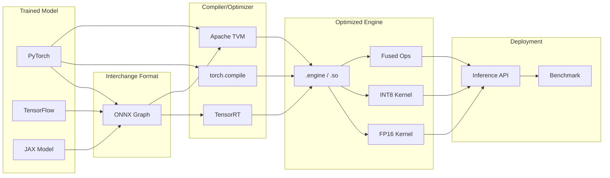
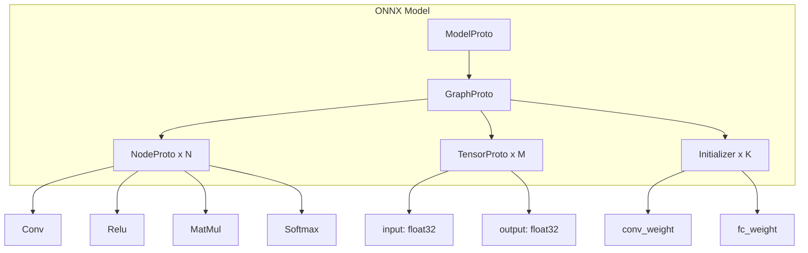
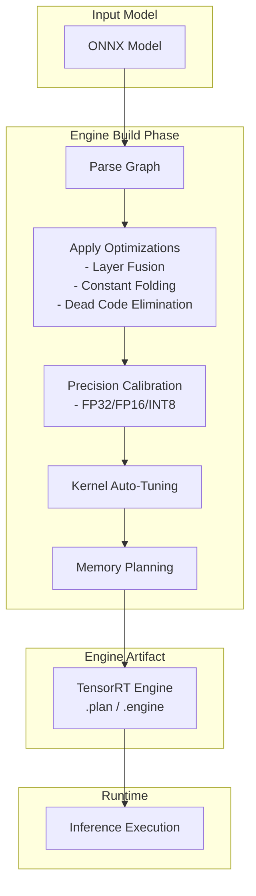
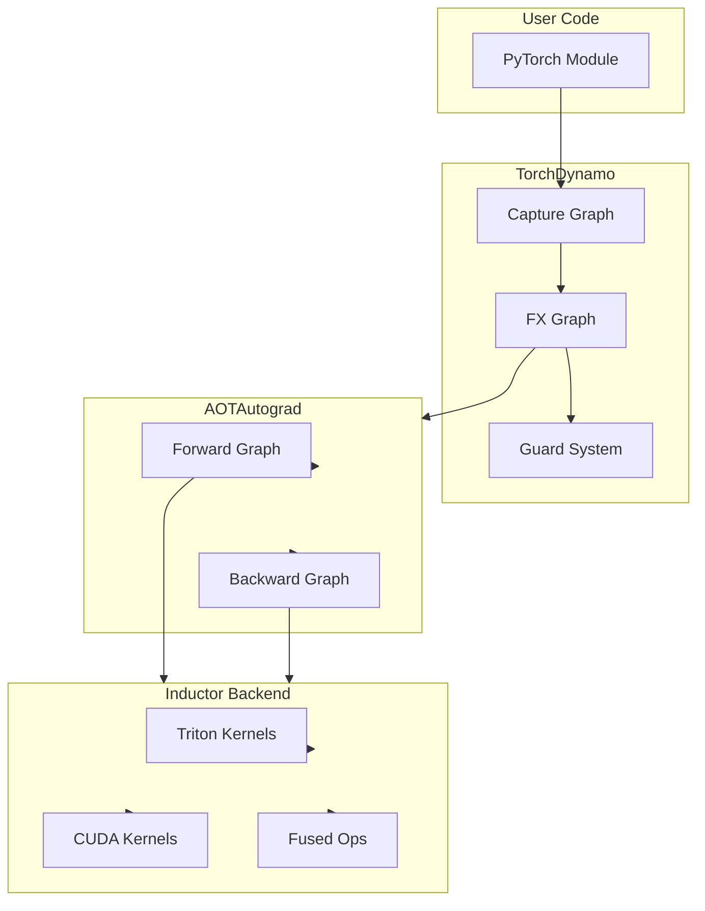
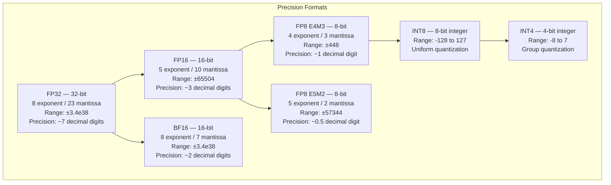
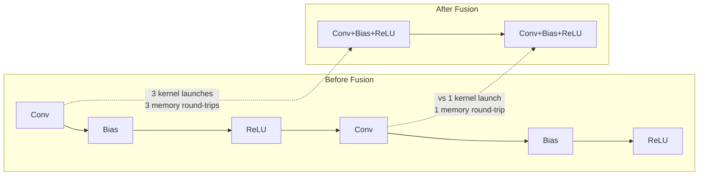

# 03 — Model Compilation & Optimization

## Introduction

Model compilation converts trained neural networks into optimized executables for specific hardware. Instead of interpreting a model graph at runtime, compilation bakes fused kernels, memory plans, and precision choices into a single deployable artifact.

AI engineers must understand compilation because inference speed and cost depend on it. A model compiled with TensorRT can run 5-10x faster than the same model in pure PyTorch. This chapter covers ONNX interchange, TensorRT engine building, torch.compile, precision formats, graph optimizations, and benchmarking methodology.

## Prerequisites

- PyTorch basics: tensors, modules, forward pass
- Understanding of GPU architecture and CUDA
- Familiarity with floating-point formats (FP32, FP16)
- Basic Python and command-line usage

## Key Terminology

| Term | Definition |
|------|------------|
| ONNX | Open Neural Network Exchange — intermediate graph format for model interchange |
| Opset | Versioned set of operators supported in an ONNX export |
| TensorRT | NVIDIA's model optimization engine for GPU inference |
| Engine | TensorRT's compiled, hardware-specific model artifact |
| torch.compile | PyTorch 2.0 JIT compiler using TorchDynamo and Inductor |
| Graph Break | Point where torch.compile cannot trace through a Python operation |
| Operator Fusion | Combining adjacent ops into a single kernel to reduce memory traffic |
| Constant Folding | Pre-computing subgraphs with static inputs at compile time |
| INT8 Quantization | Representing weights/activations with 8-bit integers |
| FP8 | 8-bit floating point (E4M3 or E5M2 format) |
| Mixed Precision | Using FP16/BF16 for compute, FP32 for master weights |
| Throughput | Inferences per second (higher is better) |
| Latency | Time per single inference (lower is better) |

## Chapter at a Glance

| Section | Topic | Key Concept |
|---------|-------|-------------|
| 1.1 | ONNX Format & Export | Intermediate representation for cross-framework deployment |
| 1.2 | ONNX Runtime | Cross-platform inference engine for ONNX models |
| 2.1 | TensorRT Engine Building | Graph optimization and kernel auto-tuning |
| 2.2 | TensorRT Quantization | INT8/FP8 calibration and dynamic shapes |
| 3.1 | torch.compile | TorchDynamo, AOTAutograd, and Inductor backend |
| 3.2 | Graph Breaks | Identifying and fixing tracing failures |
| 4.0 | Precision Formats | FP32, FP16/BF16, INT8, INT4, FP8 |
| 5.0 | Graph Optimizations | Fusion, folding, DCE, memory planning |
| 6.0 | Benchmarking | Measuring and comparing optimization gains |

## Optimization Pipeline Overview



## 1.1 ONNX — Format & Export

ONNX (Open Neural Network Exchange) is an open-source graph format co-developed by Microsoft and Facebook in 2017. It defines a standard set of operators, data types, and graph structure that any framework can export to and any runtime can import from.

### ONNX Graph Structure

An ONNX model is a protobuf file containing:

- **Graph** — list of nodes (operations), tensors (named values), initializers (constant weights)
- **Opset** — version number that defines which operator signatures are valid
- **Metadata** — model name, producer framework, documentation strings



### Exporting PyTorch to ONNX

```python
import torch
import torch.nn as nn
import torch.onnx

class SimpleCNN(nn.Module):
    """A small CNN for demonstration — 2 conv layers + 2 linear layers."""

    def __init__(self, num_classes: int = 10):
        super().__init__()
        self.conv1 = nn.Conv2d(3, 16, kernel_size=3, padding=1)
        self.relu1 = nn.ReLU()
        self.pool1 = nn.MaxPool2d(2)
        self.conv2 = nn.Conv2d(16, 32, kernel_size=3, padding=1)
        self.relu2 = nn.ReLU()
        self.pool2 = nn.MaxPool2d(2)
        self.fc1 = nn.Linear(32 * 8 * 8, 128)
        self.relu3 = nn.ReLU()
        self.fc2 = nn.Linear(128, num_classes)

    def forward(self, x: torch.Tensor) -> torch.Tensor:
        x = self.pool1(self.relu1(self.conv1(x)))
        x = self.pool2(self.relu2(self.conv2(x)))
        x = x.view(x.size(0), -1)
        x = self.relu3(self.fc1(x))
        x = self.fc2(x)
        return x

# Create model and dummy input
model = SimpleCNN(num_classes=10)
model.eval()
dummy_input = torch.randn(1, 3, 32, 32)

# Export to ONNX with dynamic batch size
torch.onnx.export(
    model,
    dummy_input,
    "simple_cnn.onnx",
    input_names=["input"],
    output_names=["output"],
    dynamic_axes={
        "input": {0: "batch_size"},
        "output": {0: "batch_size"},
    },
    opset_version=18,
    do_constant_folding=True,
)

print("ONNX export complete: simple_cnn.onnx")

# Verify the exported model
import onnx

onnx_model = onnx.load("simple_cnn.onnx")
onnx.checker.check_model(onnx_model)
print(f"ONNX IR version: {onnx_model.ir_version}")
print(f"Opset version: {onnx_model.opset_import[0].version}")
print(f"Number of nodes: {len(onnx_model.graph.node)}")
```

### Opset Versions

ONNX evolves its operator definitions through opset versions. Newer opsets add operators, fix bugs, or change semantics. Exporting with an older opset ensures broader compatibility but may miss newer optimizations.

```python
# Common opset versions and their significance
opset_info = {
    11: "Stable, widely supported. Recommended for broad compatibility.",
    13: "Added SequenceEmpty, SequenceInsert, ConcatFromSequence.",
    15: "Added Shape inference improvements, Bernoulli.",
    18: "Added GroupNorm, GridSample updates, Pad v18.",
    20: "Latest stable opset as of 2025. Full support for modern architectures.",
}

for version, description in opset_info.items():
    print(f"  Opset {version:2d}: {description}")

# Export with explicit opset version
torch.onnx.export(
    model,
    dummy_input,
    "simple_cnn_opset13.onnx",
    opset_version=13,
    input_names=["input"],
    output_names=["output"],
)
print("\nExported with opset 13: simple_cnn_opset13.onnx")
```

### Exporting TensorFlow to ONNX

```python
# tf2onnx converts TensorFlow SavedModel or Keras models to ONNX
# Installation: pip install tf2onnx

import tensorflow as tf
import tf2onnx

def export_keras_to_onnx():
    """Convert a Keras model to ONNX format."""
    model = tf.keras.Sequential([
        tf.keras.layers.Conv2D(16, 3, activation="relu", input_shape=(32, 32, 3)),
        tf.keras.layers.MaxPooling2D(2),
        tf.keras.layers.Flatten(),
        tf.keras.layers.Dense(10),
    ])
    model.compile(optimizer="adam", loss="sparse_categorical_crossentropy")

    # Convert to ONNX
    spec = (tf.TensorSpec((None, 32, 32, 3), tf.float32, name="input"),)
    output_path = "keras_model.onnx"
    model_proto, _ = tf2onnx.convert.from_keras(model, input_signature=spec, output_path=output_path)
    print(f"TF model exported to ONNX: {output_path}")
    print(f"Opset: {model_proto.opset_import[0].version}")

export_keras_to_onnx()
```

## 1.2 ONNX Runtime

ONNX Runtime (ORT) is a cross-platform inference engine that loads ONNX models and runs them on CPU, GPU, CUDA, TensorRT, DirectML, and other backends.

```python
import onnxruntime as ort
import numpy as np

class ONNXInferenceEngine:
    """Run inference using ONNX Runtime with configurable providers."""

    def __init__(self, model_path: str, providers: list = None):
        if providers is None:
            providers = [
                "TensorrtExecutionProvider",
                "CUDAExecutionProvider",
                "CPUExecutionProvider",
            ]
        self.session = ort.InferenceSession(model_path, providers=providers)
        self.input_name = self.session.get_inputs()[0].name
        self.output_name = self.session.get_outputs()[0].name
        print(f"Loaded model: {model_path}")
        print(f"Providers: {self.session.get_providers()}")
        print(f"Input: {self.input_name} {self.session.get_inputs()[0].shape}")
        print(f"Output: {self.output_name} {self.session.get_outputs()[0].shape}")

    def predict(self, input_array: np.ndarray) -> np.ndarray:
        """Run a single inference pass."""
        ort_inputs = {self.input_name: input_array.astype(np.float32)}
        outputs = self.session.run([self.output_name], ort_inputs)
        return outputs[0]

    def benchmark(self, input_shape: tuple, num_runs: int = 100) -> dict:
        """Benchmark inference throughput and latency."""
        import time
        dummy = np.random.randn(*input_shape).astype(np.float32)

        # Warmup
        for _ in range(10):
            _ = self.predict(dummy)

        # Timed runs
        latencies = []
        for _ in range(num_runs):
            start = time.perf_counter()
            _ = self.predict(dummy)
            latencies.append((time.perf_counter() - start) * 1000)  # ms

        latencies = np.array(latencies)
        return {
            "mean_latency_ms": float(np.mean(latencies)),
            "p50_latency_ms": float(np.median(latencies)),
            "p95_latency_ms": float(np.percentile(latencies, 95)),
            "p99_latency_ms": float(np.percentile(latencies, 99)),
            "throughput_ips": 1000.0 / float(np.mean(latencies)),
        }

# Example usage
engine = ONNXInferenceEngine("simple_cnn.onnx")
result = engine.benchmark((1, 3, 32, 32), num_runs=50)
print(f"ONNX Runtime Benchmark:")
for k, v in result.items():
    print(f"  {k}: {v:.2f}")
```

## 2.1 TensorRT Engine Building

TensorRT is NVIDIA's optimization SDK for deep learning inference. It takes a trained model (via ONNX or directly) and produces a hardware-specific engine with fused kernels, auto-tuned layers, and optimized memory access.

### Optimization Pipeline



### Building a TensorRT Engine from ONNX

```python
import tensorrt as trt
import numpy as np

class TensorRTEngineBuilder:
    """Build a TensorRT engine from an ONNX model."""

    def __init__(self, onnx_path: str, precision: str = "fp16"):
        self.onnx_path = onnx_path
        self.precision = precision
        self.logger = trt.Logger(trt.Logger.INFO)
        self.builder = trt.Builder(self.logger)
        self.network = self.builder.create_network(
            1 << int(trt.NetworkDefinitionCreationFlag.EXPLICIT_BATCH)
        )
        self.parser = trt.OnnxParser(self.network, self.logger)
        self.config = self.builder.create_builder_config()

        # Set precision
        if precision == "fp16":
            self.config.set_flag(trt.BuilderFlag.FP16)
        elif precision == "int8":
            self.config.set_flag(trt.BuilderFlag.FP16)
            self.config.set_flag(trt.BuilderFlag.INT8)

        # Set memory pool limits (2GB workspace)
        self.config.set_memory_pool_limit(trt.MemoryPoolType.WORKSPACE, 2 * 1024 * 1024 * 1024)

    def parse_onnx(self):
        """Parse the ONNX model into TensorRT network."""
        with open(self.onnx_path, "rb") as f:
            onnx_bytes = f.read()
        success = self.parser.parse(onnx_bytes)
        if not success:
            for idx in range(self.parser.num_errors):
                print(f"Parse error {idx}: {self.parser.get_error(idx)}")
            raise RuntimeError("Failed to parse ONNX model")
        print(f"Network parsed: {self.network.num_layers} layers")

    def set_dynamic_shapes(self, input_name: str, min_shape: tuple, opt_shape: tuple, max_shape: tuple):
        """Configure dynamic input shapes for the engine."""
        profile = self.builder.create_optimization_profile()
        profile.set_shape(input_name, min_shape, opt_shape, max_shape)
        self.config.add_optimization_profile(profile)
        print(f"Dynamic shape set: min={min_shape}, opt={opt_shape}, max={max_shape}")

    def build_engine(self, output_path: str):
        """Build and serialize the engine."""
        self.parse_onnx()
        serialized = self.builder.build_serialized_network(self.network, self.config)
        if serialized is None:
            raise RuntimeError("Engine build failed")
        with open(output_path, "wb") as f:
            f.write(serialized)
        engine_size = len(serialized) / (1024 * 1024)
        print(f"Engine built: {output_path} ({engine_size:.2f} MB)")

# Build an FP16 engine
builder = TensorRTEngineBuilder("simple_cnn.onnx", precision="fp16")
builder.set_dynamic_shapes(
    "input",
    min_shape=(1, 3, 32, 32),
    opt_shape=(8, 3, 32, 32),
    max_shape=(32, 3, 32, 32),
)
builder.build_engine("simple_cnn_fp16.engine")
```

### Layer Fusion in TensorRT

TensorRT fuses adjacent operations into single kernels. Common fusion patterns:

- **Conv + Bias + ReLU** → single CBR kernel
- **Conv + BatchNorm + ReLU** → single fused kernel
- **GELU** approximation fused with MatMul
- **LayerNorm** fused with preceding MatMul

```python
# Demonstrating the impact of fusion: compare layer count before/after
class FusionAnalyzer:
    """Analyze how TensorRT fuses layers."""

    def __init__(self, onnx_path: str):
        self.onnx_path = onnx_path
        self.logger = trt.Logger(trt.Logger.WARNING)

    def count_onnx_layers(self):
        """Count layers in the ONNX graph."""
        import onnx
        model = onnx.load(self.onnx_path)
        return len(model.graph.node)

    def count_trt_layers(self):
        """Count layers after TensorRT optimization."""
        builder = trt.Builder(self.logger)
        network = builder.create_network(
            1 << int(trt.NetworkDefinitionCreationFlag.EXPLICIT_BATCH)
        )
        parser = trt.OnnxParser(network, self.logger)
        with open(self.onnx_path, "rb") as f:
            parser.parse(f.read())
        # After parsing, inspect the optimized network
        return network.num_layers  # Layers before fusion

    def analyze(self):
        onnx_layers = self.count_onnx_layers()
        trt_layers = self.count_trt_layers()
        print(f"ONNX graph nodes:     {onnx_layers}")
        print(f"TensorRT layers:      {trt_layers}")
        print(f"Fusion ratio:         {onnx_layers / trt_layers:.1f}x")

analyzer = FusionAnalyzer("simple_cnn.onnx")
analyzer.analyze()
```

## 2.2 INT8/FP8 Quantization with TensorRT

### INT8 Calibration

INT8 quantization requires a calibration step to determine optimal scaling factors for activations.

```python
import tensorrt as trt
import numpy as np

class INT8Calibrator(trt.IInt8Calibrator):
    """Calibrator for INT8 quantization using representative data."""

    def __init__(self, calibration_data: np.ndarray, batch_size: int = 8):
        trt.IInt8Calibrator.__init__(self)
        self.calibration_data = calibration_data
        self.batch_size = batch_size
        self.current_index = 0
        self.num_batches = len(calibration_data) // batch_size
        self.device_input = None

    def get_batch_size(self):
        return self.batch_size

    def get_batch(self, names):
        if self.current_index >= self.num_batches:
            return None
        batch = self.calibration_data[
            self.current_index * self.batch_size :
            (self.current_index + 1) * self.batch_size
        ]
        self.current_index += 1
        # Convert to numpy array (or ctypes pointer for GPU)
        return np.ascontiguousarray(batch, dtype=np.float32)

    def read_calibration_cache(self):
        return None

    def write_calibration_cache(self, cache):
        with open("calibration.cache", "wb") as f:
            f.write(cache)

def build_int8_engine(onnx_path: str, calibration_data: np.ndarray, output_path: str):
    """Build INT8 quantized engine with calibration."""
    logger = trt.Logger(trt.Logger.INFO)
    builder = trt.Builder(logger)
    network = builder.create_network(
        1 << int(trt.NetworkDefinitionCreationFlag.EXPLICIT_BATCH)
    )
    parser = trt.OnnxParser(network, logger)

    with open(onnx_path, "rb") as f:
        if not parser.parse(f.read()):
            for i in range(parser.num_errors):
                print(parser.get_error(i))
            raise RuntimeError("ONNX parse failed")

    config = builder.create_builder_config()
    config.set_flag(trt.BuilderFlag.FP16)
    config.set_flag(trt.BuilderFlag.INT8)

    calibrator = INT8Calibrator(calibration_data, batch_size=8)
    config.int8_calibrator = calibrator
    config.set_memory_pool_limit(trt.MemoryPoolType.WORKSPACE, 2 * 1024 * 1024 * 1024)

    serialized = builder.build_serialized_network(network, config)
    with open(output_path, "wb") as f:
        f.write(serialized)
    print(f"INT8 engine built: {output_path}")

# Generate calibration data (1000 random images)
calib_data = np.random.randn(1000, 3, 32, 32).astype(np.float32)
build_int8_engine("simple_cnn.onnx", calib_data, "simple_cnn_int8.engine")
```

### FP8 Quantization (Hopper GPUs)

FP8 on NVIDIA Hopper (H100/H200) uses the Transformer Engine for 8-bit floating point with E4M3 (weights) and E5M2 (gradients) formats.

```python
# FP8 is supported on SM90 (Hopper) and newer architectures
# TensorRT supports FP8 via the FP8 flag

def build_fp8_engine(onnx_path: str, output_path: str):
    """Build FP8 engine (requires H100 or newer GPU)."""
    logger = trt.Logger(trt.Logger.INFO)
    builder = trt.Builder(logger)
    network = builder.create_network(
        1 << int(trt.NetworkDefinitionCreationFlag.EXPLICIT_BATCH)
    )
    parser = trt.OnnxParser(network, logger)

    with open(onnx_path, "rb") as f:
        if not parser.parse(f.read()):
            for i in range(parser.num_errors):
                print(parser.get_error(i))
            raise RuntimeError("ONNX parse failed")

    config = builder.create_builder_config()
    # FP8 requires FP8 flag (TensorRT 10.0+)
    if hasattr(trt.BuilderFlag, "FP8"):
        config.set_flag(trt.BuilderFlag.FP8)
        print("FP8 flag set — requires H100/H200 GPU")
    else:
        print("FP8 not supported in this TensorRT version")

    config.set_memory_pool_limit(trt.MemoryPoolType.WORKSPACE, 2 * 1024 * 1024 * 1024)
    serialized = builder.build_serialized_network(network, config)

    with open(output_path, "wb") as f:
        f.write(serialized)
    print(f"FP8 engine built: {output_path}")

# build_fp8_engine("simple_cnn.onnx", "simple_cnn_fp8.engine")
```

## 3.1 torch.compile

PyTorch 2.0 introduced `torch.compile` — a JIT compiler that traces Python code and generates optimized GPU kernels. It has three components:

- **TorchDynamo** — captures PyTorch graphs safely using frame evaluation hooks
- **AOTAutograd** — traces backward graph for training
- **Inductor** — generates optimized Triton/CUDA kernels



### Basic Usage

```python
import torch
import torch.nn as nn
import time

class TransformerBlock(nn.Module):
    """A single transformer block for demonstration."""

    def __init__(self, d_model: int = 512, nhead: int = 8):
        super().__init__()
        self.attention = nn.MultiheadAttention(d_model, nhead, batch_first=True)
        self.norm1 = nn.LayerNorm(d_model)
        self.norm2 = nn.LayerNorm(d_model)
        self.ffn = nn.Sequential(
            nn.Linear(d_model, d_model * 4),
            nn.GELU(),
            nn.Linear(d_model * 4, d_model),
        )

    def forward(self, x: torch.Tensor) -> torch.Tensor:
        attn_out, _ = self.attention(x, x, x)
        x = self.norm1(x + attn_out)
        ffn_out = self.ffn(x)
        x = self.norm2(x + ffn_out)
        return x

# Create model and inputs
model = TransformerBlock(d_model=512, nhead=8).cuda().half()
dummy = torch.randn(32, 128, 512).cuda().half()

# 1. Eager mode (baseline)
def measure_time(fn, inputs, runs: int = 50):
    """Measure average execution time."""
    # Warmup
    for _ in range(10):
        fn(*inputs)
    torch.cuda.synchronize()

    start = time.perf_counter()
    for _ in range(runs):
        fn(*inputs)
    torch.cuda.synchronize()
    avg_ms = (time.perf_counter() - start) / runs * 1000
    return avg_ms

eager_time = measure_time(model.forward, [dummy])
print(f"Eager mode:   {eager_time:.2f} ms")

# 2. torch.compile with default backend
compiled_model = torch.compile(model, mode="default")
compiled_time = measure_time(compiled_model.forward, [dummy])
print(f"Compiled:     {compiled_time:.2f} ms")
print(f"Speedup:      {eager_time / compiled_time:.2f}x")

# 3. Different modes
for mode in ["reduce-overhead", "max-autotune", "max-autotune-no-cudagraphs"]:
    compiled = torch.compile(model, mode=mode)
    t = measure_time(compiled.forward, [dummy])
    print(f"  mode={mode:30s}: {t:.2f} ms")
```

### Understanding the Compilation Process

```python
# torch.compile with verbose tracing
import torch._dynamo as dynamo

def trace_compilation():
    """Demonstrate what happens during compilation."""
    model = TransformerBlock(d_model=128, nhead=4).cuda()

    # Enable logging to see compilation steps
    torch._logging.set_logs(dynamo=3, inductor=3)

    compiled = torch.compile(model, mode="default")
    dummy = torch.randn(8, 32, 128).cuda()

    # First call triggers compilation
    out = compiled(dummy)
    print("First call (compilation happened here)")

    # Second call uses cached kernels
    out = compiled(dummy)
    print("Second call (cached, no recompilation)")

    # New shape causes recompilation
    dummy_new = torch.randn(16, 32, 128).cuda()
    out = compiled(dummy_new)
    print("Third call (different batch size — recompilation)")

# trace_compilation()
```

## 3.2 Graph Breaks

torch.compile cannot trace through arbitrary Python code. When it hits unsupported operations, it creates a **graph break** — splitting the computation into multiple traced subgraphs with a Python boundary between them.

```python
def demonstrate_graph_breaks():
    """Show operations that cause graph breaks."""

    def clean_forward(x: torch.Tensor, w: torch.Tensor) -> torch.Tensor:
        """Fully traceable — no graph breaks."""
        return torch.matmul(x, w)

    def broken_forward(x: torch.Tensor, w: torch.Tensor) -> torch.Tensor:
        """Contains graph break due to Python control flow."""
        result = torch.matmul(x, w)
        if result.sum() > 0:  # Python conditional — graph break!
            result = result * 2
        return result

    def broken_forward2(x: torch.Tensor, w: torch.Tensor) -> torch.Tensor:
        """Graph break due to in-place mutation of input."""
        x.add_(1)  # In-place mutation of input — graph break!
        return torch.matmul(x, w)

    # Compile and check number of graphs
    x = torch.randn(4, 64).cuda()
    w = torch.randn(64, 32).cuda()

    for name, fn in [
        ("Clean", clean_forward),
        ("Broken (control flow)", broken_forward),
        ("Broken (in-place)", broken_forward2),
    ]:
        compiled = torch.compile(fn, mode="default", fullgraph=False)
        try:
            out = compiled(x, w)
            # Check number of compiled graphs using dynamo counters
            import torch._dynamo.utils as dynamo_utils
            print(f"{name}: OK")
        except Exception as e:
            print(f"{name}: Error — {e}")

demonstrate_graph_breaks()
```

### Fixing Graph Breaks

```python
def fix_graph_breaks():
    """Patterns to avoid graph breaks."""

    # Bad: Python control flow
    def bad_activation(x: torch.Tensor) -> torch.Tensor:
        if x.dim() == 2:
            return torch.relu(x)
        return x

    # Good: torch.where instead of if
    def good_activation(x: torch.Tensor) -> torch.Tensor:
        return torch.where(x.dim() == 2, torch.relu(x), x)

    # Bad: In-place modification of input
    def bad_dropout(x: torch.Tensor, p: float = 0.1) -> torch.Tensor:
        mask = torch.rand_like(x) > p
        x *= mask  # mutates input — graph break
        return x

    # Good: Return new tensor
    def good_dropout(x: torch.Tensor, p: float = 0.1) -> torch.Tensor:
        mask = torch.rand_like(x) > p
        return x * mask  # new tensor — traceable

    # Bad: List iteration
    def bad_sum_list(tensors: list) -> torch.Tensor:
        total = 0
        for t in tensors:  # Python list iteration — graph break
            total += t
        return total

    # Good: torch.stack + sum
    def good_sum_list(tensors: list) -> torch.Tensor:
        return torch.stack(tensors).sum(dim=0)

    # Test them
    x = torch.randn(4, 64).cuda()
    for name, fn in [
        ("bad_activation", bad_activation),
        ("good_activation", good_activation),
        ("good_dropout", good_dropout),
    ]:
        try:
            compiled = torch.compile(fn, mode="default", fullgraph=True)
            compiled(x)
            print(f"{name}: Full graph compiled OK")
        except Exception as e:
            print(f"{name}: Graph break — {e}")

fix_graph_breaks()
```

## 4.0 Precision Formats

### Format Comparison



### Mixed Precision Training

```python
class MixedPrecisionDemo:
    """Demonstrate mixed precision training with torch.amp."""

    def __init__(self, model: nn.Module, dtype: torch.dtype = torch.float16):
        self.model = model.cuda()
        self.dtype = dtype
        self.scaler = torch.amp.GradScaler("cuda") if dtype == torch.float16 else None

    def train_step(self, x: torch.Tensor, y: torch.Tensor, optimizer: torch.optim.Optimizer) -> float:
        """Single training step with mixed precision."""
        optimizer.zero_grad()

        # Automatic mixed precision context
        with torch.amp.autocast("cuda", dtype=self.dtype):
            output = self.model(x)
            loss = nn.functional.cross_entropy(output, y)

        if self.dtype == torch.float16:
            # Scale loss to prevent underflow in gradients
            self.scaler.scale(loss).backward()
            self.scaler.step(optimizer)
            self.scaler.update()
        else:
            loss.backward()
            optimizer.step()

        return loss.item()

# Compare memory usage of different precision formats
def compare_precision_memory():
    """Measure memory footprint of a model in different formats."""
    import torch.cuda as cuda

    model = TransformerBlock(d_model=1024, nhead=16).cuda()
    input_tensor = torch.randn(8, 128, 1024).cuda()

    formats = [
        (torch.float32, "FP32"),
        (torch.float16, "FP16"),
        (torch.bfloat16, "BF16"),
    ]

    base_memory = cuda.memory_allocated()

    for dtype, name in formats:
        model_dtype = model.to(dtype)
        inp = input_tensor.to(dtype)

        # Force allocation
        with torch.amp.autocast("cuda", dtype=dtype):
            out = model_dtype(inp)

        current_memory = cuda.memory_allocated()
        memory_mb = (current_memory - base_memory) / (1024 * 1024)
        print(f"{name:6s} | Memory: {memory_mb:.1f} MB | Params in {name}: {sum(p.numel() for p in model_dtype.parameters())}")

        del out
        cuda.empty_cache()

compare_precision_memory()
```

### FP8 (E4M3 / E5M2)

```python
class FP8FormatExplainer:
    """Explain FP8 formats used in Hopper GPUs."""

    @staticmethod
    def simulate_fp8_quantize(tensor: torch.Tensor, format_type: str = "e4m3") -> torch.Tensor:
        """Simulate FP8 quantization effect (not actual hardware)."""
        if format_type == "e4m3":
            max_val = 448.0  # E4M3 max representable
            min_val = 2**-9  # E4M3 min normal
        elif format_type == "e5m2":
            max_val = 57344.0  # E5M2 max representable
            min_val = 2**-14  # E5M2 min normal
        else:
            raise ValueError(f"Unknown FP8 format: {format_type}")

        # Clip and quantize
        clipped = torch.clamp(tensor, -max_val, max_val)
        # Simulate rounding to FP8 precision
        scale = 256.0 if format_type == "e4m3" else 1024.0
        quantized = torch.round(clipped * scale) / scale
        return quantized

    @staticmethod
    def print_format_specs():
        specs = {
            "E4M3":  {"exponent": 4, "mantissa": 3, "max": 448.0, "min_normal": 2**-9},
            "E5M2":  {"exponent": 5, "mantissa": 2, "max": 57344.0, "min_normal": 2**-14},
            "FP16":  {"exponent": 5, "mantissa": 10, "max": 65504.0, "min_normal": 2**-14},
            "BF16":  {"exponent": 8, "mantissa": 7, "max": 3.4e38, "min_normal": 2**-126},
        }
        for name, spec in specs.items():
            print(f"{name:6s} | exp={spec['exponent']} mant={spec['mantissa']:2d} | "
                  f"max={spec['max']:10.2f} | min_normal={spec['min_normal']:.2e}")

    @staticmethod
    def demonstrate_quantization_error():
        """Show how FP8 loses precision for small values."""
        values = torch.tensor([0.5, 0.1, 0.01, 0.001, 0.0001], dtype=torch.float32)
        for fmt in ["e4m3", "e5m2"]:
            quantized = FP8FormatExplainer.simulate_fp8_quantize(values, fmt)
            error = torch.abs(values - quantized)
            print(f"\n{fmt.upper()} quantization error:")
            for v, q, e in zip(values.tolist(), quantized.tolist(), error.tolist()):
                rel_error = (e / abs(v)) * 100 if v != 0 else 0
                print(f"  {v:.6f} -> {q:.6f}  (error: {e:.6f}, {rel_error:.1f}%)")

FP8FormatExplainer.print_format_specs()
FP8FormatExplainer.demonstrate_quantization_error()
```

## 5.0 Graph Optimization

Graph-level optimizations transform the computation graph to reduce memory, increase speed, or enable other optimizations.

### Operator Fusion



### Constant Folding

```python
def demonstrate_constant_folding():
    """Show how constant folding pre-computes static subgraphs."""

    import torch.fx as fx

    class StaticSubgraphModel(nn.Module):
        """Model with a branch that depends only on constants."""
        def __init__(self):
            super().__init__()
            self.weight = nn.Parameter(torch.randn(64, 256))
            self.bias = nn.Parameter(torch.zeros(64))

        def forward(self, x: torch.Tensor) -> torch.Tensor:
            # This subgraph is constant and can be folded
            constant_part = torch.ones(256, 128) * 0.5  # always the same
            folded = torch.mm(self.weight, constant_part)  # can be pre-computed
            return torch.mm(x, folded.T) + self.bias

    model = StaticSubgraphModel()
    x = torch.randn(32, 256)

    # Trace with FX
    traced = fx.symbolic_trace(model)
    print(f"Number of nodes before folding: {len(traced.graph.nodes)}")

    # Apply constant folding
    from torch.fx.passes.shape_prop import ShapeProp
    from torch.fx.experimental.optimization import fuse

    # In practice, constant folding is done by the compiler
    print("Constant folding would pre-compute: weight @ ones(256,128) * 0.5")
    print("This removes 2-3 nodes from the runtime graph.")

demonstrate_constant_folding()
```

### Dead Code Elimination (DCE)

```python
def demonstrate_dce():
    """Show how dead code elimination removes unused operations."""

    import torch.fx as fx

    class ModelWithDeadCode(nn.Module):
        """Model containing operations whose outputs are never used."""
        def __init__(self):
            super().__init__()
            self.linear = nn.Linear(64, 10)

        def forward(self, x: torch.Tensor) -> torch.Tensor:
            # Live path
            out = self.linear(x)

            # Dead code — output never used
            dead1 = torch.mm(x, x.T)  # computed but discarded
            dead2 = torch.sin(dead1)   # also discarded
            dead3 = dead2.sum()        # also discarded

            return out  # only this matters

    model = ModelWithDeadCode()
    traced = fx.symbolic_trace(model)

    print(f"Before DCE — {len(traced.graph.nodes)} nodes:")
    for node in traced.graph.nodes:
        print(f"  {node.op}: {node.name}")

    # Remove dead code
    traced.graph.eliminate_dead_code()
    traced.recompile()

    print(f"\nAfter DCE — {len(traced.graph.nodes)} nodes:")
    for node in traced.graph.nodes:
        print(f"  {node.op}: {node.name}")

demonstrate_dce()
```

### Memory Planning

```python
def demonstrate_memory_planning():
    """Illustrate how TensorRT plans memory to minimize fragmentation."""

    # TensorRT's memory planning strategy
    class MemoryPlanner:
        """Simulate TensorRT's memory planning (simplified)."""

        def __init__(self, total_memory: int = 1024):
            self.total = total_memory
            self.blocks = {}  # name -> (offset, size)
            self.free_list = [(0, total_memory)]

        def allocate(self, name: str, size: int):
            """First-fit allocation."""
            for i, (offset, free_size) in enumerate(self.free_list):
                if free_size >= size:
                    self.blocks[name] = (offset, size)
                    remaining = free_size - size
                    if remaining > 0:
                        self.free_list[i] = (offset + size, remaining)
                    else:
                        self.free_list.pop(i)
                    print(f"Allocated {name}: {size} units @ offset {offset}")
                    return
            print(f"FAILED: Cannot allocate {name} ({size} units)")

        def free(self, name: str):
            """Free allocated block."""
            if name in self.blocks:
                offset, size = self.blocks.pop(name)
                self.free_list.append((offset, size))
                self.free_list.sort()  # Keep sorted for coalescing
                # Coalesce adjacent free blocks
                i = 0
                while i < len(self.free_list) - 1:
                    curr_end = self.free_list[i][0] + self.free_list[i][1]
                    next_start = self.free_list[i + 1][0]
                    if curr_end == next_start:
                        merged = (self.free_list[i][0], self.free_list[i][1] + self.free_list[i + 1][1])
                        self.free_list.pop(i + 1)
                        self.free_list[i] = merged
                    else:
                        i += 1
                print(f"Freed {name} ({size} units)")

        def print_state(self):
            print(f"Free blocks: {self.free_list}")
            print(f"Allocated: {list(self.blocks.keys())}")

    planner = MemoryPlanner(total_memory=1024)
    planner.allocate("conv1_input", 128)
    planner.allocate("conv1_output", 256)
    planner.allocate("fc1_weights", 512)
    planner.allocate("fc1_output", 64)
    planner.print_state()

    # Notice how TensorRT reuses memory when possible
    planner.free("conv1_output")
    planner.allocate("conv2_output", 256)  # Reuses conv1_output's spot
    planner.print_state()

demonstrate_memory_planning()
```

## 6.0 Benchmarking

Systematic benchmarking is essential to validate that optimizations actually improve performance. Measure throughput, latency, and memory under realistic conditions.

### Comprehensive Benchmark Suite

```python
import time
import torch
import numpy as np
from dataclasses import dataclass, field
from typing import Dict, List, Callable

@dataclass
class BenchmarkResult:
    model_name: str
    precision: str
    mean_latency_ms: float
    p50_latency_ms: float
    p95_latency_ms: float
    p99_latency_ms: float
    throughput_ips: float
    memory_mb: float
    speedup_vs_baseline: float = 1.0

class ModelBenchmark:
    """Benchmark different model configurations systematically."""

    def __init__(self, model_fn: Callable, input_fn: Callable, name: str = "model"):
        self.model_fn = model_fn
        self.input_fn = input_fn
        self.name = name
        self.results: List[BenchmarkResult] = []

    def benchmark_config(self, precision: str, compile_mode: str = None) -> BenchmarkResult:
        """Benchmark a single configuration."""
        import torch.cuda as cuda

        # Create model and inputs
        model = self.model_fn().cuda()
        inputs = self.input_fn()

        # Apply precision
        if precision in ("fp16", "float16"):
            model = model.half()
            inputs = [x.half() if isinstance(x, torch.Tensor) else x for x in inputs]
        elif precision in ("bf16", "bfloat16"):
            model = model.to(torch.bfloat16)
            inputs = [x.to(torch.bfloat16) if isinstance(x, torch.Tensor) else x for x in inputs]

        # Apply compilation
        if compile_mode:
            model = torch.compile(model, mode=compile_mode)

        # Warmup
        for _ in range(20):
            with torch.no_grad():
                model(*inputs)
        cuda.synchronize()

        # Measure memory
        torch.cuda.reset_peak_memory_stats()
        memory_before = cuda.memory_allocated()

        # Timed runs
        latencies = []
        num_runs = 100
        for _ in range(num_runs):
            start = time.perf_counter()
            with torch.no_grad():
                model(*inputs)
            cuda.synchronize()
            latencies.append((time.perf_counter() - start) * 1000)

        memory_after = cuda.memory_allocated()
        memory_mb = (memory_after - memory_before) / (1024 * 1024)

        latencies = np.array(latencies)
        result = BenchmarkResult(
            model_name=f"{self.name}_{precision}",
            precision=precision,
            mean_latency_ms=float(np.mean(latencies)),
            p50_latency_ms=float(np.median(latencies)),
            p95_latency_ms=float(np.percentile(latencies, 95)),
            p99_latency_ms=float(np.percentile(latencies, 99)),
            throughput_ips=1000.0 / float(np.mean(latencies)),
            memory_mb=memory_mb,
        )
        self.results.append(result)
        return result

    def compare_all(self, configs: List[Dict]) -> None:
        """Run multiple configurations and compare."""
        baseline = None
        for cfg in configs:
            result = self.benchmark_config(**cfg)
            if baseline is None:
                baseline = result.mean_latency_ms
            result.speedup_vs_baseline = baseline / result.mean_latency_ms
            print(f"\n{result.model_name}:")
            print(f"  Latency:    {result.mean_latency_ms:.3f} ms (p50: {result.p50_latency_ms:.3f}, "
                  f"p95: {result.p95_latency_ms:.3f}, p99: {result.p99_latency_ms:.3f})")
            print(f"  Throughput: {result.throughput_ips:.1f} ips")
            print(f"  Memory:     {result.memory_mb:.1f} MB")
            print(f"  Speedup:    {result.speedup_vs_baseline:.2f}x vs baseline")

# Run benchmark on a realistic model
def create_resnet_block():
    """Create a ResNet-style block for benchmarking."""
    class ResBlock(nn.Module):
        def __init__(self, channels: int = 256):
            super().__init__()
            self.conv1 = nn.Conv2d(channels, channels, 3, padding=1)
            self.bn1 = nn.BatchNorm2d(channels)
            self.conv2 = nn.Conv2d(channels, channels, 3, padding=1)
            self.bn2 = nn.BatchNorm2d(channels)
            self.relu = nn.ReLU()

        def forward(self, x):
            identity = x
            x = self.relu(self.bn1(self.conv1(x)))
            x = self.bn2(self.conv2(x))
            x = self.relu(x + identity)
            return x
    return ResBlock(256)

bench = ModelBenchmark(
    model_fn=create_resnet_block,
    input_fn=lambda: [torch.randn(16, 256, 32, 32)],
    name="ResBlock",
)

configs = [
    {"precision": "fp32", "compile_mode": None},
    {"precision": "fp16", "compile_mode": None},
    {"precision": "bf16", "compile_mode": None},
    {"precision": "fp32", "compile_mode": "default"},
    {"precision": "fp16", "compile_mode": "default"},
    {"precision": "fp16", "compile_mode": "max-autotune"},
]
bench.compare_all(configs)
```

### Visualizing Benchmark Results

```python
def plot_benchmark_results(results: List[BenchmarkResult]):
    """Create ASCII chart of benchmark results for quick analysis."""
    print("\n" + "=" * 80)
    print(f"{'Configuration':40s} {'Latency(ms)':>12s} {'Throughput':>12s} {'Speedup':>8s}")
    print("=" * 80)

    for r in sorted(results, key=lambda x: x.speedup_vs_baseline, reverse=True):
        bar = "█" * int(r.speedup_vs_baseline * 10)
        print(f"{r.model_name:40s} {r.mean_latency_ms:>10.2f}ms  {r.throughput_ips:>10.1f}  "
              f"{r.speedup_vs_baseline:>5.2f}x {bar}")

    print("=" * 80)
    print(f"Memory range: {min(r.memory_mb for r in results):.1f} MB — "
          f"{max(r.memory_mb for r in results):.1f} MB")
    print(f"Best latency:  {min(r.mean_latency_ms for r in results):.2f} ms "
          f"({min(r.p99_latency_ms for r in results):.2f} ms p99)")
    print(f"Best throughput: {max(r.throughput_ips for r in results):.1f} ips")

# plot_benchmark_results(bench.results)
```

## Interview Questions

### Q1: What is ONNX and why was it created?
**A**: ONNX (Open Neural Network Exchange) is an open-source graph format for model interchange. It was created to solve framework lock-in — allowing models trained in PyTorch to run in TensorRT, CoreML, or other runtimes without rewriting. It defines standard operators, data types, and a protobuf-serialized graph.

### Q2: Explain the role of opset versions in ONNX export.
**A**: Each opset version defines the set of supported operators and their semantics. Exporting with a higher opset gives access to newer operators (e.g., GroupNorm in opset 18) but may not be supported by older runtimes. Lower opsets ensure broader compatibility. The optimal opset is the highest one your target runtime supports.

### Q3: How does TensorRT achieve 5-10x speedup over naive PyTorch inference?
**A**: TensorRT applies: (1) layer fusion — combining Conv+Bias+ReLU into single kernels, reducing memory traffic; (2) kernel auto-tuning — selecting the best CUDA kernel for each layer given the hardware and tensor shapes; (3) precision calibration — using FP16/INT8 when accuracy permits; (4) memory planning — reusing buffers to minimize allocation overhead.

### Q4: What is the difference between torch.compile and TensorRT?
**A**: torch.compile is a JIT compiler for PyTorch that traces Python code and generates Triton/CUDA kernels. It works directly with PyTorch modules, is easier to use, and is training-aware (AOTAutograd traces backward). TensorRT is a dedicated inference optimizer that works from ONNX or TF, applies deeper graph optimizations, and targets NVIDIA GPUs specifically. TensorRT generally produces faster inference engines; torch.compile is better for rapid iteration and training acceleration.

### Q5: What causes graph breaks in torch.compile and how do you fix them?
**A**: Graph breaks occur when TorchDynamo encounters Python code it cannot trace: control flow (if/for), in-place mutations of inputs, list operations, dynamic data structures, or calls to unsupported libraries. Fixes include: replacing if with torch.where, avoiding in-place ops on inputs, using torch.stack instead of Python lists, and structuring models to minimize Python-level branching.

### Q6: Compare FP16, BF16, and FP8 for inference. When would you use each?
**A**: FP16 (5 exponent, 10 mantissa) offers good precision with 2x memory reduction vs FP32. BF16 (8 exponent, 7 mantissa) maintains FP32's dynamic range, making it safer for training. FP8 E4M3 (weights, range ±448) and E5M2 (gradients, range ±57344) are used on Hopper GPUs for 4x memory reduction. Use FP16/BF16 for general inference, INT8 for latency-critical apps, and FP8 on H100 when INT8 accuracy is insufficient.

### Q7: Explain the process of INT8 calibration in TensorRT.
**A**: INT8 calibration determines scaling factors (S) for each tensor to map FP32 values to INT8 range [-128, 127]. The calibrator runs a representative dataset through the model, collects activation histograms, and chooses S to minimize KL divergence between the original FP32 distribution and the quantized distribution. TensorRT supports calibration strategies: Entropy (default), MinMax, Percentile, and Entropy 2.

### Q8: How do you benchmark a model optimization correctly?
**A**: (1) Warmup — run 10-20 inferences to eliminate CUDA initialization overhead. (2) Synchronize — call torch.cuda.synchronize() before timing. (3) Measure latency — time 100+ runs, report p50/p95/p99, not just mean. (4) Measure throughput — batch multiple requests or stream inferences. (5) Control variables — same GPU, same power state, same input size. (6) Report memory — use torch.cuda.max_memory_allocated(). (7) Validate accuracy — optimized output must match baseline within tolerance.

### Q9: What is operator fusion and why does it matter?
**A**: Operator fusion combines adjacent operations (e.g., Conv + ReLU, LayerNorm + MatMul) into a single CUDA kernel. This eliminates intermediate memory reads/writes, reduces kernel launch overhead, and improves cache locality. A typical CNN goes from 50+ kernels to under 20 fused kernels. Fusion is the single most impactful optimization in TensorRT and torch.compile's Inductor backend.

### Q10: Design an optimization pipeline for deploying a 7B-parameter LLM to production.
**A**: Step 1: Export to ONNX with opset 18 (dynamic batch, sequence length). Step 2: Convert to TensorRT with FP16 precision (or INT8 for lower latency). Step 3: Enable Flash Attention fusion in TensorRT for transformer blocks. Step 4: Build with dynamic shapes (batch=1-32, seq=1-4096). Step 5: Benchmark latency (p50/p99) and memory. Step 6: If latency > target, apply KV cache quantization (FP8) and INT4 weight-only quantization. Step 7: Deploy with Triton Inference Server for multi-model serving and dynamic batching.

## Chapter Quiz (5 MCQ)

### Questions

1. Which component of torch.compile is responsible for generating Triton kernels?
   a) TorchDynamo
   b) AOTAutograd
   c) Inductor
   d) TorchScript

2. What is the primary benefit of operator fusion in model compilation?
   a) Reduces model file size on disk
   b) Eliminates intermediate memory reads/writes by combining kernels
   c) Increases numerical precision of computations
   d) Enables dynamic shape support

3. In TensorRT INT8 quantization, what is the purpose of calibration?
   a) To train the model for 8-bit accuracy
   b) To determine scaling factors for activations using representative data
   c) To convert all weights from FP32 to INT8 format
   d) To test the model on a validation dataset

4. Which precision format has the same exponent range as FP32 but reduced mantissa?
   a) FP16
   b) BF16
   c) FP8 E4M3
   d) INT8

5. What happens when torch.compile encounters a graph break?
   a) The compilation fails with an error
   b) The model falls back to eager mode for the untraceable portion
   c) The model is automatically converted to TensorRT
   d) The broken graph is skipped entirely

### Answers

1. **c** — Inductor is the backend that generates optimized Triton and CUDA kernels from the traced graph.
2. **b** — Operator fusion combines multiple ops into a single kernel, avoiding intermediate memory round-trips and reducing kernel launch overhead.
3. **b** — Calibration runs representative data through the model to determine per-tensor scaling factors that minimize accuracy loss from INT8 quantization.
4. **b** — BF16 has 8 exponent bits (same as FP32) giving it the same dynamic range, but only 7 mantissa bits (FP32 has 23).
5. **b** — TorchDynamo splits the graph at the break point; the untraceable portion runs in eager Python, with compiled subgraphs on either side.

## Exercises

### Exercise 1: Export and Compare ONNX vs PyTorch Speed
Take a pre-trained ResNet-18 from `torchvision.models`. Export it to ONNX with opset 18. Measure inference latency of the original PyTorch model vs ONNX Runtime (CPU provider). Report speedup.

### Exercise 2: Build TensorRT Engine with Different Precisions
Using the ONNX model from Exercise 1, build TensorRT engines in FP32, FP16, and INT8 precision. Benchmark each and report latency, throughput, and memory. Check that output accuracy (cosine similarity) stays above 0.99 for all precisions.

### Exercise 3: Identify and Fix Graph Breaks
Write a PyTorch module that intentionally causes at least 3 graph breaks (control flow, in-place mutation, list iteration). Use `torch.compile` with `fullgraph=True` to detect them. Fix each break and verify the module compiles to a single graph.

### Exercise 4: Implement a Custom Benchmark
Create a benchmark script that tests a model at batch sizes [1, 4, 16, 32] and sequence lengths [128, 256, 512]. Report a heatmap-style table showing latency for each (batch, seq_len) combination. Identify the operating region where latency is optimal.

### Exercise 5: Quantization Error Analysis
Take a small model (e.g., a 3-layer MLP). Quantize its weights to INT8 using PyTorch's quantization API and simulate INT4 with group-size 32. Compute the mean squared error between the original FP32 model output and the quantized outputs for 1000 random inputs. Plot the error distribution.

## Key Takeaways

1. **Model compilation** transforms a trained graph into hardware-specific optimized engines, yielding 2-10x speedups through fusion, precision reduction, and kernel auto-tuning.
2. **ONNX** serves as the universal interchange format — learn to export PyTorch and TensorFlow models with appropriate opset versions.
3. **TensorRT** is the gold standard for NVIDIA GPU inference with INT8/FP16/FP8 quantization and deep graph optimization.
4. **torch.compile** (TorchDynamo + Inductor) provides easy access to JIT compilation in PyTorch; understand graph breaks to maximize its effectiveness.
5. **Systematic benchmarking** with warmup, synchronization, and percentile reporting is essential — never deploy an optimization without measuring its actual impact.

## Summary

Model compilation is the bridge between training flexibility and deployment efficiency. ONNX provides framework-agnostic model interchange. TensorRT produces hardware-specific engines with fused kernels and optimized precision. torch.compile brings JIT compilation to PyTorch with minimal code changes. Precision formats (FP16, BF16, INT8, FP8) offer different trade-offs between speed, memory, and accuracy. Graph optimizations like fusion, constant folding, and dead code elimination are applied automatically by compilers. Always benchmark with realistic inputs, warmup runs, and latency percentiles to validate that an optimization actually helps.

## Practical Takeaways

1. Start with ONNX export for any model that needs cross-runtime deployment — it decouples training from inference infrastructure.
2. Use TensorRT for production GPU inference; the INT8 + FP16 combination typically gives the best latency/accuracy trade-off.
3. Apply torch.compile as a first step for PyTorch optimization — it often gives 2-3x speedup with zero code changes.
4. Profile before optimizing. Use PyTorch profiler or NVIDIA Nsight to identify the actual bottlenecks.
5. Validate numerical accuracy after every optimization. A 5x faster model is useless if predictions change.

## Revision Notes

- **ONNX**: protobuf graph format, opset versions (11-20), export with dynamic_axes for flexible batch/sequence
- **TensorRT**: parser → builder → engine; FP16/INT8 flags; calibration for INT8; kernel auto-tuning
- **torch.compile**: TorchDynamo (graph capture) → AOTAutograd (backward trace) → Inductor (kernel gen)
- **Graph breaks**: Python control flow, in-place ops, list iteration; fix with torch.where, avoid in-place
- **Precision**: FP32 (baseline), FP16 (2x mem, ~same perf), BF16 (same range as FP32), INT8 (4x mem, calibration needed), FP8 (Hopper, E4M3/E5M2)
- **Graph optimizations**: operator fusion (critical), constant folding (static subgraphs), DCE (remove dead ops), memory planning (buffer reuse)
- **Benchmarking**: warmup >10 runs, synchronize, 100+ timed runs, report p50/p95/p99, measure memory, validate accuracy

## Interview Questions (Additional)

### Q1: How do you handle dynamic shapes in TensorRT?
**A**: Use optimization profiles — specify min, opt, and max dimensions for each dynamic input. TensorRT builds engines with multiple kernel variants optimized for common (opt) shapes. At runtime, shapes within the min-max range use the closest optimized kernel.

### Q2: What is the trade-off between kernel auto-tuning time and inference speed?
**A**: TensorRT auto-tuning tries hundreds of kernel configurations for each layer. More tuning finds faster kernels but increases build time. For production, use `max-autotune` mode during building. For development, use default. Build caching (reusing pre-built engines) mitigates this.

### Q3: How does mixed precision training work with torch.amp?
**A**: `torch.amp.autocast` automatically casts ops to FP16/BF16 where safe. The GradScaler multiplies the loss by a scale factor to prevent gradient underflow in FP16, then unscales before the optimizer step. This enables FP16 training without accuracy loss.

### Q4: Compare TensorRT with Apache TVM.
**A**: TensorRT is NVIDIA-specific, deep fusion, and easier to use. TVM is hardware-agnostic (supports CPU, GPU, NPU), offers more flexible optimization, but has a steeper learning curve. TensorRT typically outperforms TVM on NVIDIA GPUs; TVM wins on edge devices or non-NVIDIA hardware.

### Q5: What is the role of AOTAutograd in torch.compile?
**A**: AOTAutograd traces the backward graph ahead of time (before runtime). This allows Inductor to generate fused forward+backward kernels, which is essential for training acceleration. Without AOTAutograd, only the forward pass would be optimized.

## Exercises (Advanced)

### Exercise 6: Full Pipeline
Build a complete optimization pipeline: PyTorch model → ONNX export → TensorRT engine build (INT8) → deploy with ONNX Runtime → benchmark. Write a script that does all steps and produces a report. Test with at least two different model architectures.

### Exercise 7: Graph Break Detection Tool
Write a utility that takes any PyTorch module and torch.compile's it with `fullgraph=True`. Catch the exception and print exactly which line of code caused the graph break, along with a suggested fix.

## References

- ONNX specification: https://onnx.ai/
- TensorRT documentation: https://docs.nvidia.com/deeplearning/tensorrt/
- PyTorch 2.0 torch.compile: https://pytorch.org/docs/stable/generated/torch.compile.html
- NVIDIA FP8 whitepaper: https://developer.nvidia.com/blog/nvidia-hopper-architecture-in-depth/
- ONNX Runtime: https://onnxruntime.ai/
- torch._dynamo docs: https://pytorch.org/docs/stable/torch.compiler.html