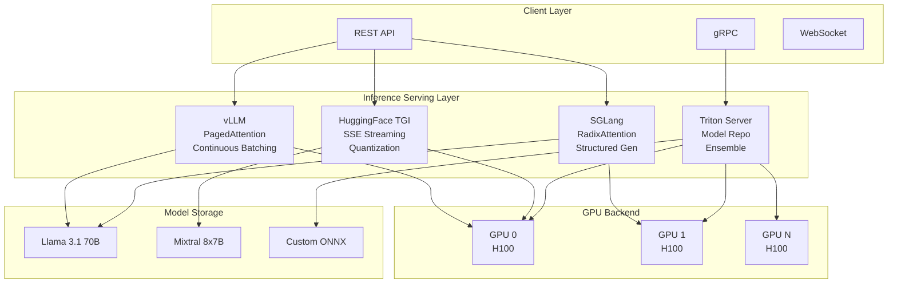
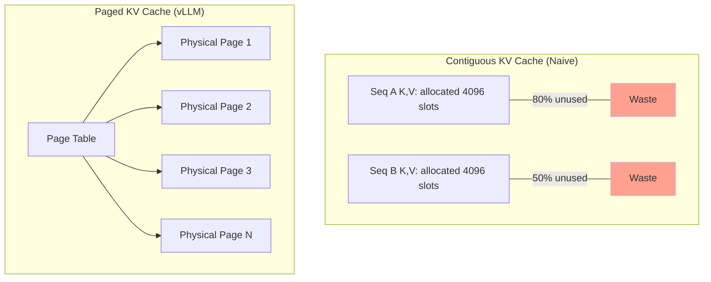
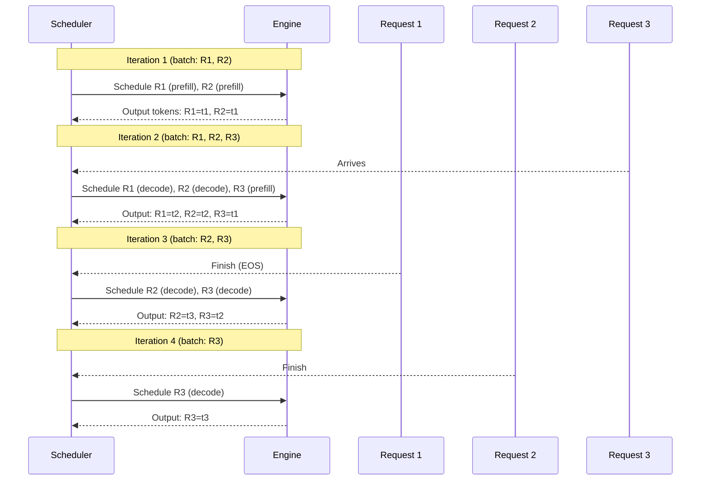
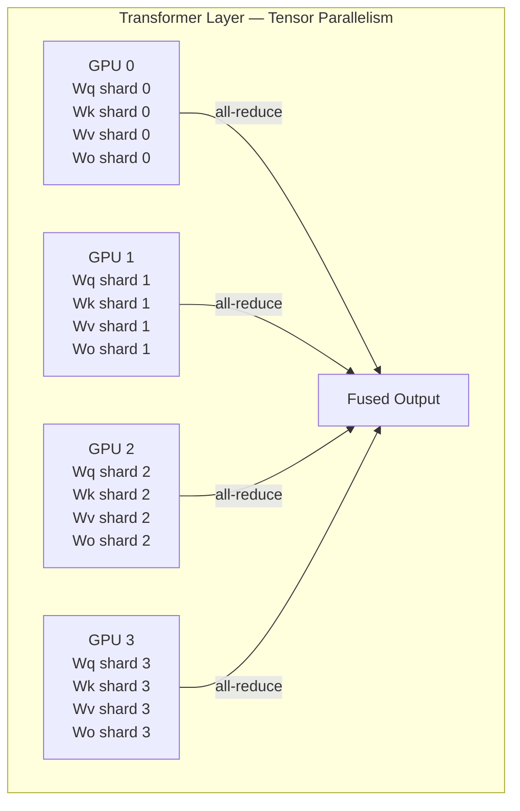
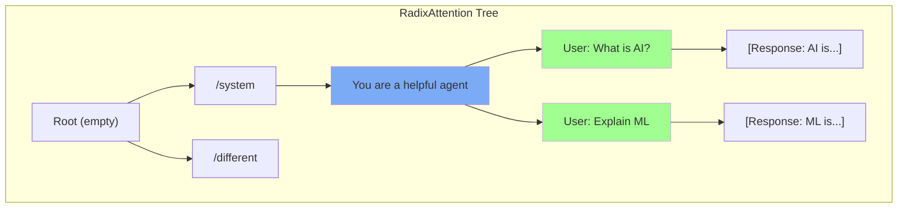
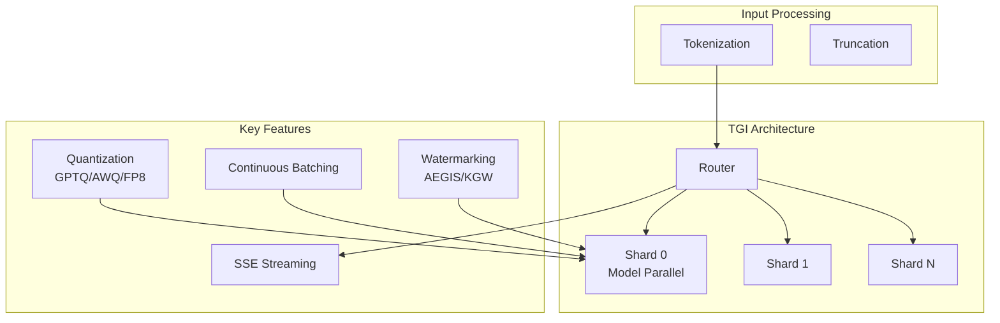
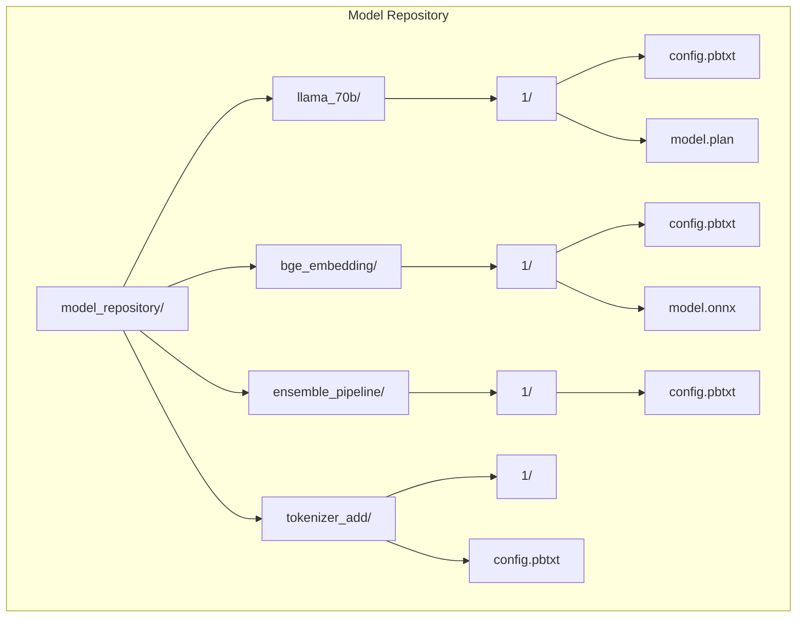

<!-- Clear Language: Keep sentences under 50 words -->
# AI Inference Serving

## Learning Objectives

| Objective | Description |
|-----------|-------------|
| LO1 | Explain the PagedAttention algorithm and why it improves KV cache utilization |
| LO2 | Compare vLLM, SGLang, TGI, and Triton Inference Server for LLM serving |
| LO3 | Implement a vLLM server for online LLM inference with continuous batching |
| LO4 | Apply structured generation and constrained decoding with SGLang |
| LO5 | Deploy ensemble models on Triton Inference Server with dynamic batching |
| LO6 | Measure and compare serving throughput, latency, and memory across frameworks |

## Chapter at a Glance

| Section | Topic | Key Concept |
|---------|-------|-------------|
| 1.1 | vLLM: PagedAttention & Continuous Batching | Virtual memory for KV cache, on-the-fly batching |
| 1.2 | vLLM: Tensor Parallelism & Online Serving | Multi-GPU deployment, OpenAI-compatible API |
| 2.1 | SGLang: RadixAttention | Automatic KV cache reuse across requests |
| 2.2 | SGLang: Structured Generation & Constrained Decoding | Grammar-guided output, JSON mode |
| 3.0 | Hugging Face TGI | Text generation inference server with SSE streaming |
| 4.0 | Triton Inference Server | Model repository, dynamic batching, concurrent execution |
| 5.0 | Serving Comparison | Throughput, latency, memory benchmarks across all four |

## Serving Architecture Overview



## Introduction

AI inference serving is the production deployment of trained models. It takes a model checkpoint and turns it into an API endpoint that handles concurrent requests with low latency.

Serving LLMs is different from serving traditional models. LLMs have autoregressive decoding — each token depends on all previous tokens. This creates unique challenges: managing the KV cache across sequences, batching dynamically as requests arrive and finish, and maximizing GPU utilization.

Four major serving frameworks dominate the ecosystem: vLLM, SGLang, Hugging Face TGI, and NVIDIA Triton Inference Server. Each takes a different approach to the same problems. Understanding their trade-offs is essential for any AI engineer deploying LLMs in production.

## Prerequisites

- Module 09 (Deep Learning) — transformer architecture, attention mechanism
- Module 12 (LLM) — autoregressive decoding, tokenization, prompt engineering
- Python async programming — asyncio, async/await patterns
- Understanding of GPU memory hierarchy (Module 27, Chapter 01)
- Basic REST API concepts — HTTP, JSON, server-sent events

## Key Terminology

| Term | Definition |
|------|------------|
| KV Cache | Key-value tensors cached during autoregressive decoding to avoid recomputation |
| PagedAttention | vLLM's virtual-memory-inspired KV cache management with physical page blocks |
| Continuous Batching | Batching sequences that arrive at different times — batch changes per decoding step |
| Scheduler Policy | Algorithm deciding which requests to include in each decoding batch |
| RadixAttention | SGLang's prefix-tree KV cache sharing across requests with common prefixes |
| Structured Generation | Constraining model output to follow a grammar or schema during decoding |
| Guided Decoding | Forcing token selection to match a regex or JSON schema at each step |
| SSE | Server-Sent Events — HTTP streaming protocol for token-by-token delivery |
| Model Repository | Triton's file-system layout for managing model versions and configurations |
| Ensemble Model | A directed acyclic graph of models chained together in Triton |
| Dynamic Batching | Automatically grouping incoming requests into batches for higher throughput |
| Tensor Parallelism | Splitting a single model's layers across multiple GPUs for faster inference |
| Speculative Decoding | Using a small draft model to predict tokens verified by the large model |

## Theory

### 1.1 vLLM — PagedAttention

vLLM is the most widely used open-source LLM serving framework. It was developed at UC Berkeley and introduced PagedAttention — a novel attention algorithm inspired by virtual memory paging in operating systems.

#### The KV Cache Problem

During autoregressive decoding, each token attends to all previous tokens. The transformer computes key (K) and value (V) tensors for each token at each layer. These tensors are cached to avoid recomputation.

For a single sequence of length S with L layers and H hidden dimensions:
- KV cache size per token per layer = 2 * H (one for K, one for V)
- Total KV cache for one sequence = L * 2 * H * S

For Llama 3 70B (L=80, H=8192) with sequence length 4096:
- Per-token KV cache: 80 * 2 * 8192 * 2 bytes (FP16) = 2.6 MB per token
- Full sequence: 2.6 MB * 4096 = 10.5 GB per sequence

With 8 concurrent sequences, that is 84 GB — exceeding most GPU memories. This is the KV cache memory wall.



**Naive approach:** Pre-allocate a contiguous block for the maximum sequence length for each request. Most requests are shorter than the maximum, wasting 50-80% of KV cache memory.

**PagedAttention solution:** Divide the KV cache into fixed-size page blocks (typically 16 tokens each). Allocate physical pages on demand as the sequence grows. A page table maps logical token positions to physical page blocks.

```python
# Simulate PagedAttention KV cache management
import math
from dataclasses import dataclass, field
from typing import Dict, List, Optional

@dataclass
class PageBlock:
    """A fixed-size block of KV cache pages."""
    page_id: int
    tokens: int = 0          # Number of filled token slots
    max_tokens: int = 16     # Fixed block size
    k_cache: Optional[bytes] = None  # Key tensor (simulated)
    v_cache: Optional[bytes] = None  # Value tensor (simulated)

    @property
    def is_full(self) -> bool:
        return self.tokens >= self.max_tokens

    def fill(self, num_tokens: int) -> int:
        """Fill tokens into this page. Returns overflow if any."""
        space = self.max_tokens - self.tokens
        filled = min(space, num_tokens)
        self.tokens += filled
        return num_tokens - filled  # overflow

class PagedKVManager:
    """
    Simulate PagedAttention's KV cache allocator.
    Manages physical page blocks across multiple sequences.
    """

    def __init__(self, total_pages: int = 1024, page_size: int = 16):
        self.total_pages = total_pages
        self.page_size = page_size
        self.free_pages: List[int] = list(range(total_pages))
        self.allocated: Dict[int, List[PageBlock]] = {}  # seq_id -> pages
        self.page_table: Dict[int, Dict[int, int]] = {}  # seq_id -> logical -> physical

    def allocate_sequence(self, seq_id: int, initial_tokens: int = 0):
        """Allocate pages for a new sequence."""
        needed_pages = math.ceil(initial_tokens / self.page_size) if initial_tokens > 0 else 1
        if len(self.free_pages) < needed_pages:
            raise MemoryError("Out of KV cache pages")

        pages = []
        for _ in range(needed_pages):
            page_id = self.free_pages.pop(0)
            pages.append(PageBlock(page_id=page_id, max_tokens=self.page_size))

        self.allocated[seq_id] = pages
        self.page_table[seq_id] = {i: pages[i].page_id for i in range(len(pages))}
        print(f"Sequence {seq_id}: allocated {len(pages)} pages "
              f"(physical IDs: {[p.page_id for p in pages]})")

        # Fill initial tokens
        if initial_tokens > 0:
            self.append_tokens(seq_id, initial_tokens)

    def append_tokens(self, seq_id: int, num_tokens: int):
        """Append tokens to an existing sequence, allocating pages as needed."""
        if seq_id not in self.allocated:
            raise ValueError(f"Sequence {seq_id} not found")

        pages = self.allocated[seq_id]
        remaining = num_tokens

        for page in pages:
            if page.is_full:
                continue
            remaining = page.fill(remaining)
            if remaining == 0:
                break

        # Allocate new pages if needed
        while remaining > 0:
            if not self.free_pages:
                raise MemoryError("Out of KV cache pages — would trigger eviction")
            page_id = self.free_pages.pop(0)
            new_page = PageBlock(page_id=page_id, max_tokens=self.page_size)
            remaining = new_page.fill(remaining)
            logical_idx = len(pages)
            pages.append(new_page)
            self.page_table[seq_id][logical_idx] = page_id

        print(f"Sequence {seq_id}: now {sum(p.tokens for p in pages)} tokens "
              f"across {len(pages)} pages")

    def free_sequence(self, seq_id: int):
        """Return all pages to the free pool."""
        if seq_id not in self.allocated:
            return
        pages = self.allocated.pop(seq_id)
        for page in pages:
            self.free_pages.append(page.page_id)
        self.free_pages.sort()
        del self.page_table[seq_id]
        print(f"Sequence {seq_id}: freed {len(pages)} pages. "
              f"Free pool: {len(self.free_pages)}/{self.total_pages}")

    def get_memory_utilization(self) -> float:
        """Calculate KV cache utilization percentage."""
        used_pages = self.total_pages - len(self.free_pages)
        return used_pages / self.total_pages * 100

    def print_status(self):
        """Print current memory status."""
        used = self.total_pages - len(self.free_pages)
        print(f"\n=== KV Cache Status ===")
        print(f"Total pages: {self.total_pages}")
        print(f"Used pages:  {used}")
        print(f"Free pages:  {len(self.free_pages)}")
        print(f"Utilization: {self.get_memory_utilization():.1f}%")
        for seq_id, pages in self.allocated.items():
            print(f"  Seq {seq_id}: {len(pages)} pages "
                  f"({sum(p.tokens for p in pages)} tokens)")

# Demonstrate PagedAttention memory efficiency
manager = PagedKVManager(total_pages=128, page_size=16)

# Sequence A: short (32 tokens)
manager.allocate_sequence(0, initial_tokens=32)
# Sequence B: medium (128 tokens)
manager.allocate_sequence(1, initial_tokens=128)
# Sequence C: long (256 tokens)
manager.allocate_sequence(2, initial_tokens=256)

manager.print_status()

# Sequence A finishes — its pages are freed
manager.free_sequence(0)

# Sequence D arrives and reuses freed pages
manager.allocate_sequence(3, initial_tokens=48)
manager.print_status()

# Key insight: PagedAttention reduces KV cache waste from ~60% to ~5%
# Contiguous allocation would waste 100+ pages for uneven sequence lengths
```

#### Continuous Batching

Traditional batching waits for N requests to arrive before inference. This adds latency. Continuous batching (also called in-flight batching) updates the batch at every decoding step — finished sequences leave, new sequences join.



The scheduler decides which requests to include in each step:

1. **Running requests** — sequences currently decoding
2. **Waiting requests** — newly arrived prompts awaiting prefill
3. **Swapped requests** — sequences whose KV cache was offloaded to CPU

A good scheduler balances three constraints:
- **Memory**: total KV cache pages allocated < GPU memory
- **Latency SLO**: decode latency stays under target (e.g., 100ms per step)
- **Fairness**: no request starves indefinitely

```python
# Simulate continuous batching scheduler
import time
import random
from collections import deque
from dataclasses import dataclass

@dataclass
class Request:
    """A single inference request."""
    id: int
    prompt_tokens: int      # Number of prompt tokens (prefill phase)
    max_gen_tokens: int     # Maximum generation tokens
    arrival_time: float
    tokens_generated: int = 0
    finished: bool = False

    @property
    def total_tokens(self) -> int:
        return self.prompt_tokens + self.tokens_generated

@dataclass
class SchedulerConfig:
    """Configuration for continuous batching scheduler."""
    max_num_seqs: int = 8           # Max sequences in one batch
    max_num_batched_tokens: int = 4096  # Max tokens per batch iteration
    block_size: int = 16
    gpu_memory_pages: int = 4096
    decode_slo_ms: float = 100.0

class ContinuousBatchingScheduler:
    """
    Simulate vLLM's continuous batching scheduler.
    Decides at each iteration which requests to run.
    """

    def __init__(self, config: SchedulerConfig):
        self.config = config
        self.running: deque = deque()
        self.waiting: deque = deque()
        self.swapped: deque = deque()
        self.finished: List[Request] = []
        self.iteration = 0
        self.gpu_usage = 0  # Simulated GPU memory usage in pages

    def add_request(self, prompt_tokens: int, max_gen_tokens: int):
        """Add a new request to the waiting queue."""
        req = Request(
            id=len(self.finished) + len(self.running) + len(self.waiting) + 1,
            prompt_tokens=prompt_tokens,
            max_gen_tokens=max_gen_tokens,
            arrival_time=time.time(),
        )
        self.waiting.append(req)

    def _can_allocate(self, req: Request) -> bool:
        """Check if we have enough GPU pages for this request."""
        needed_pages = (req.prompt_tokens + req.max_gen_tokens + 15) // 16
        return self.gpu_usage + needed_pages <= self.config.gpu_memory_pages

    def _schedule(self) -> list:
        """
        Decide which requests to run in this iteration.
        Returns list of (request, phase) tuples.
        """
        batch = []
        total_tokens = 0

        # First: try to prefill waiting requests
        while self.waiting and len(batch) < self.config.max_num_seqs:
            req = self.waiting[0]
            needed_tokens = req.prompt_tokens
            if total_tokens + needed_tokens <= self.config.max_num_batched_tokens:
                if self._can_allocate(req):
                    self.waiting.popleft()
                    self.running.append(req)
                    batch.append((req, "prefill"))
                    total_tokens += needed_tokens
                    pages_needed = (req.prompt_tokens + 15) // 16
                    self.gpu_usage += pages_needed
                else:
                    break
            else:
                break

        # Then: add running requests for decode
        for req in list(self.running):
            if len(batch) >= self.config.max_num_seqs:
                break
            if req.finished:
                continue
            if total_tokens + 1 <= self.config.max_num_batched_tokens:
                batch.append((req, "decode"))
                total_tokens += 1

        return batch

    def step(self) -> List[dict]:
        """Execute one scheduling iteration."""
        self.iteration += 1
        batch = self._schedule()

        results = []
        for req, phase in batch:
            if phase == "prefill":
                # Simulate prefill: process all prompt tokens at once
                tokens_this_step = req.prompt_tokens
            else:
                # Simulate decode: generate one token
                tokens_this_step = 1
                req.tokens_generated += 1

                # Check if finished
                if req.tokens_generated >= req.max_gen_tokens:
                    req.finished = True
                    self.finished.append(req)
                    self.running.remove(req)
                    # Free KV cache pages
                    pages_freed = (req.total_tokens + 15) // 16
                    self.gpu_usage = max(0, self.gpu_usage - pages_freed)

            results.append({
                "req_id": req.id,
                "phase": phase,
                "tokens": tokens_this_step,
                "generated_so_far": req.tokens_generated if phase == "decode" else 0,
            })

        return results

    def run_until_complete(self, max_iterations: int = 200):
        """Run the scheduler until all requests finish."""
        print(f"{'Iter':<8} {'Batch Size':<12} {'Phase':<12} {'GPU Pages':<12} {'Events':<20}")
        print("="*64)

        for i in range(max_iterations):
            if not self.waiting and not self.running:
                print(f"\nAll requests complete after {i} iterations")
                break

            results = self.step()
            phases = set(r["phase"] for r in results)
            events = []
            if any(r["phase"] == "prefill" for r in results):
                n_prefill = sum(1 for r in results if r["phase"] == "prefill")
                events.append(f"Prefill {n_prefill}")
            n_finished = sum(1 for r in results if r["phase"] == "decode" and r["generated_so_far"] > 0)
            if n_finished:
                events.append(f"Decode {len(results)}")

            print(f"{i:<8} {len(results):<12} {', '.join(phases):<12} "
                  f"{self.gpu_usage:<12} {' | '.join(events):<20}")

# Run the simulation
config = SchedulerConfig(
    max_num_seqs=4,
    max_num_batched_tokens=2048,
    gpu_memory_pages=512,
)

scheduler = ContinuousBatchingScheduler(config)

# Add requests with varying lengths
request_lengths = [
    (128, 32),   # 128 prompt tokens, generate 32
    (256, 64),   # 256 prompt, generate 64
    (64, 128),   # 64 prompt, generate 128
    (512, 16),   # 512 prompt, generate 16
    (192, 48),   # 192 prompt, generate 48
    (64, 256),   # 64 prompt, generate 256
]

for prompt_tokens, max_gen in request_lengths:
    scheduler.add_request(prompt_tokens, max_gen)

scheduler.run_until_complete(max_iterations=100)

print(f"\nTotal requests: {len(scheduler.finished)}")
print(f"Total iterations: {scheduler.iteration}")
avg_latency = sum(r.tokens_generated for r in scheduler.finished) / scheduler.iteration
print(f"Average decode steps per iteration: {avg_latency:.2f}")
```

### 1.2 vLLM — Tensor Parallelism & Online Serving

#### Tensor Parallelism

For models larger than a single GPU's memory (e.g., Llama 3 70B at 140 GB FP16), vLLM splits the model across multiple GPUs using tensor parallelism.

Each layer's weights are sharded across GPUs. During the forward pass, each GPU computes its shard and communicates partial results via all-reduce.



**Communication overhead:** Each transformer layer requires 4 all-reduce operations (one per Q, K, V, O projection). With high-bandwidth NVLink (900 GB/s), the overhead is small. With PCIe (128 GB/s), it becomes the bottleneck.

#### Online Serving with OpenAI-Compatible API

vLLM provides an OpenAI-compatible HTTP API. This means any OpenAI client library can work with vLLM by changing the base URL.

```python
# vLLM server setup (runs as a separate process)
# Start with: python -m vllm.entrypoints.openai.api_server \
#     --model meta-llama/Llama-3.1-8B-Instruct \
#     --tensor-parallel-size 2 \
#     --max-model-len 8192 \
#     --gpu-memory-utilization 0.90

from openai import OpenAI

# Point client to vLLM server
client = OpenAI(
    base_url="http://localhost:8000/v1",
    api_key="token-abc123",  # vLLM requires an API key
)

# Chat completion (streaming)
response = client.chat.completions.create(
    model="meta-llama/Llama-3.1-8B-Instruct",
    messages=[
        {"role": "system", "content": "You are a helpful assistant."},
        {"role": "user", "content": "Explain attention mechanisms in one sentence."},
    ],
    max_tokens=512,
    temperature=0.7,
    stream=True,
)

print("Response: ", end="")
for chunk in response:
    if chunk.choices[0].delta.content:
        print(chunk.choices[0].delta.content, end="")
print()

# Batch completion (non-streaming)
completions = client.completions.create(
    model="meta-llama/Llama-3.1-8B-Instruct",
    prompt=[
        "What is the capital of France?",
        "What is 2 + 2?",
        "Explain quantum computing.",
    ],
    max_tokens=128,
)

for i, choice in enumerate(completions.choices):
    print(f"\nPrompt {i+1}: {choice.text}")
```

#### vLLM Python API (Server-side)

```python
# vLLM programmatic usage — building a custom server
from vllm import LLM, SamplingParams
from typing import List

class VLLMServingEngine:
    """Wrapper around vLLM's LLM engine for programmatic access."""

    def __init__(
        self,
        model: str = "meta-llama/Llama-3.1-8B-Instruct",
        tensor_parallel_size: int = 1,
        max_model_len: int = 8192,
        gpu_memory_utilization: float = 0.90,
        dtype: str = "auto",
    ):
        self.llm = LLM(
            model=model,
            tensor_parallel_size=tensor_parallel_size,
            max_model_len=max_model_len,
            gpu_memory_utilization=gpu_memory_utilization,
            dtype=dtype,
        )
        print(f"vLLM engine loaded: {model}")
        print(f"  Tensor parallel size: {tensor_parallel_size}")
        print(f"  Max model length: {max_model_len}")
        print(f"  GPU memory utilization: {gpu_memory_utilization}")

    def generate(
        self,
        prompts: List[str],
        max_tokens: int = 256,
        temperature: float = 0.7,
        top_p: float = 0.9,
        stop: List[str] = None,
    ) -> List[dict]:
        """Generate completions for a list of prompts."""
        params = SamplingParams(
            temperature=temperature,
            top_p=top_p,
            max_tokens=max_tokens,
            stop=stop,
        )
        outputs = self.llm.generate(prompts, params)
        results = []
        for output in outputs:
            prompt = output.prompt
            generated_text = output.outputs[0].text
            tokens_generated = len(output.outputs[0].token_ids)
            results.append({
                "prompt": prompt,
                "generated_text": generated_text,
                "tokens_generated": tokens_generated,
                "finish_reason": output.outputs[0].finish_reason,
            })
        return results

    def generate_streaming(
        self,
        prompt: str,
        max_tokens: int = 256,
    ):
        """Generate a single completion with streaming output."""
        params = SamplingParams(
            temperature=0.0,
            max_tokens=max_tokens,
        )
        # vLLM supports async streaming via AsyncLLM class
        # This is a synchronous simulation
        output = self.llm.generate([prompt], params)[0]
        for token_output in output.outputs[0]:
            yield token_output.text

    def get_model_info(self) -> dict:
        """Return model metadata."""
        return {
            "model": self.llm.llm_engine.model_config.model,
            "max_model_len": self.llm.llm_engine.model_config.max_model_len,
            "num_gpus": self.llm.llm_engine.parallel_config.tensor_parallel_size,
            "dtype": str(self.llm.llm_engine.model_config.dtype),
        }

# Usage (requires GPU with sufficient memory)
# engine = VLLMServingEngine(
#     model="meta-llama/Llama-3.1-8B-Instruct",
#     tensor_parallel_size=1,
# )
# results = engine.generate([
#     "Write a haiku about AI:",
#     "Explain gradient descent simply:",
# ])
```

### 2.1 SGLang — RadixAttention

SGLang is a serving framework optimized for structured generation and prefix sharing. Its key innovation is RadixAttention — a radix tree (prefix tree) structure for the KV cache that enables automatic sharing across requests.

#### The Prefix Sharing Problem

Many LLM workloads share common prefixes:
- Chat systems: all requests start with the system prompt
- Code assistants: all requests start with the same instructions
- Retrieval-augmented generation: all requests share the same retrieved document prefix

Without prefix sharing, each request independently computes KV cache for the shared prefix. With RadixAttention, the first request computes it and subsequent requests reuse it.



**RadixAttention algorithm:**

1. Each request's prompt is tokenized into a sequence of tokens.
2. The sequence is inserted into a radix tree. Each node represents a prefix.
3. When a new request arrives, the tree is traversed to find the longest matching prefix.
4. The KV cache for the matching prefix is reused — no recomputation needed.
5. New tokens are appended as new leaf nodes in the tree.
6. When GPU memory runs low, least-recently-used leaf nodes are evicted.

```python
# Simulate RadixAttention prefix tree
from dataclasses import dataclass, field
from typing import Dict, List, Optional, Tuple

@dataclass
class RadixNode:
    """A node in the RadixAttention prefix tree."""
    prefix: Tuple[int, ...]      # Token IDs forming this prefix
    kv_cache: Optional[object] = None  # Reference to cached K,V tensors
    children: Dict[int, 'RadixNode'] = field(default_factory=dict)
    parent: Optional['RadixNode'] = None
    access_count: int = 0
    last_access: float = 0.0

class RadixAttentionTree:
    """
    Radix tree for KV cache prefix sharing.
    Enables automatic reuse of KV cache across requests with common prefixes.
    """

    def __init__(self):
        self.root = RadixNode(prefix=())
        self.node_count = 1
        self.cache_hits = 0
        self.cache_misses = 0

    def insert(self, token_ids: Tuple[int, ...]) -> Tuple[RadixNode, int]:
        """
        Insert a sequence into the radix tree.
        Returns the deepest matching node and number of new tokens added.
        """
        current = self.root
        matching_depth = 0

        # Traverse tree to find longest matching prefix
        while matching_depth < len(token_ids):
            next_token = token_ids[matching_depth]
            if next_token in current.children:
                child = current.children[next_token]
                child_prefix = child.prefix

                # Find how many tokens match in this edge
                match_len = 0
                while (matching_depth + match_len < len(token_ids)
                       and match_len < len(child_prefix)
                       and token_ids[matching_depth + match_len] == child_prefix[match_len]):
                    match_len += 1

                if match_len == len(child_prefix):
                    # Full edge match — move to child
                    current = child
                    matching_depth += match_len
                    child.access_count += 1
                elif match_len > 0:
                    # Partial match — split the edge
                    self._split_edge(current, child, match_len)
                    current = child
                    matching_depth += match_len
                else:
                    break
            else:
                break

        # Insert remaining tokens as new nodes
        new_tokens = 0
        while matching_depth < len(token_ids):
            # Find longest new prefix to add
            remaining = token_ids[matching_depth:]
            new_node = RadixNode(
                prefix=remaining,
                parent=current,
            )
            current.children[remaining[0]] = new_node
            current = new_node
            self.node_count += 1
            new_tokens += len(remaining)
            matching_depth = len(token_ids)

        if new_tokens == 0:
            self.cache_hits += 1
        else:
            self.cache_misses += 1

        return current, new_tokens

    def _split_edge(self, parent: RadixNode, child: RadixNode, split_at: int):
        """Split a child node's prefix at split_at position."""
        old_prefix = child.prefix
        # Create intermediate node
        shared_part = old_prefix[:split_at]
        remaining_part = old_prefix[split_at:]

        intermediate = RadixNode(
            prefix=shared_part,
            parent=parent,
            children={remaining_part[0]: child},
        )
        child.prefix = remaining_part
        child.parent = intermediate
        parent.children[shared_part[0]] = intermediate

    def find_longest_prefix(self, token_ids: Tuple[int, ...]) -> Tuple[RadixNode, int]:
        """
        Find the longest matching prefix in the tree.
        Returns (node, depth_matched).
        """
        current = self.root
        depth = 0

        while depth < len(token_ids):
            next_token = token_ids[depth]
            if next_token not in current.children:
                break
            child = current.children[next_token]
            child_prefix = child.prefix
            # Check full edge
            if (depth + len(child_prefix) <= len(token_ids)
                    and token_ids[depth:depth + len(child_prefix)] == child_prefix):
                depth += len(child_prefix)
                current = child
            else:
                # Partial match
                match_len = 0
                while (depth + match_len < len(token_ids)
                       and match_len < len(child_prefix)
                       and token_ids[depth + match_len] == child_prefix[match_len]):
                    match_len += 1
                depth += match_len
                break

        return current, depth

    def evict_lru(self, target_nodes: int = 1) -> int:
        """Evict least-recently-used leaf nodes. Returns count evicted."""
        def get_leaves(node: RadixNode) -> List[RadixNode]:
            if not node.children:
                return [node]
            leaves = []
            for child in node.children.values():
                leaves.extend(get_leaves(child))
            return leaves

        leaves = get_leaves(self.root)
        # Sort by access count (ascending) — simplest eviction policy
        leaves.sort(key=lambda n: n.access_count)
        evicted = 0
        for leaf in leaves[:target_nodes]:
            if leaf.parent:
                del leaf.parent.children[leaf.prefix[0]]
                self.node_count -= 1
                evicted += 1
        return evicted

    def print_tree(self, node: Optional[RadixNode] = None, depth: int = 0):
        """Print the radix tree structure."""
        if node is None:
            node = self.root
            print("RadixAttention Tree:")
        
        # Convert token IDs to readable form when possible
        if node.prefix:
            prefix_str = f"tokens={node.prefix[:8]}..."
        else:
            prefix_str = "root"
        
        hits = "HIT" if node.access_count > 0 else ""
        print(f"{'  ' * depth}├─ {prefix_str} [access: {node.access_count}] {hits}")
        
        for child in node.children.values():
            self.print_tree(child, depth + 1)

    def get_stats(self) -> dict:
        """Return statistics about the radix tree."""
        return {
            "nodes": self.node_count,
            "cache_hits": self.cache_hits,
            "cache_misses": self.cache_misses,
            "hit_rate": self.cache_hits / max(1, self.cache_hits + self.cache_misses) * 100,
        }

# Demonstrate prefix sharing
tree = RadixAttentionTree()

# Four requests with overlapping prefixes
conversations = [
    # System prompt shared by all
    (1, 2, 3, 4, 5, 10, 11, 12, 13),      # Request 1: system + "what is AI?"
    (1, 2, 3, 4, 5, 14, 15, 16, 17),      # Request 2: system + "explain ML"
    (1, 2, 3, 4, 5, 6, 7, 18, 19, 20),    # Request 3: system + "write code"
    (1, 2, 3, 4, 5, 10, 11, 21, 22),      # Request 4: system + "what is AI?" follow-up
]

for i, tokens in enumerate(conversations):
    node, new_tokens = tree.insert(tokens)
    print(f"Request {i+1}: {len(tokens)} tokens, "
          f"new KV tokens: {new_tokens}, "
          f"saved: {len(tokens) - new_tokens}")

print(f"\nStats: {tree.get_stats()}")
print(f"Total tokens processed: {sum(len(t) for t in conversations)}")
print(f"New KV tokens computed: {sum(len(t) for t in conversations) - tree.cache_misses}")

# Key result: with prefix sharing, the system prompt (tokens 1-5) is computed once
# Subsequent requests save 5 tokens of KV cache computation each
```

### 2.2 SGLang — Structured Generation & Constrained Decoding

SGLang's primary differentiator is structured generation. It allows developers to specify the output format using a grammar or schema, and the decoder ensures the output matches.

#### Constrained Decoding with Regex

```python
# SGLang programmatic API example
# Requires: pip install sglang[all]

import sglang as sgl
from sglang import function, gen, set_default_backend, Runtime

# Define a structured generation function
@sgl.function
def extract_info(s, text: str):
    """Extract structured information from text."""
    s += text
    s += "Extract the following:\n"
    s += "Name: " + gen("name", max_tokens=20, stop="\n")
    s += "Age: " + gen("age", max_tokens=5, stop="\n", regex="\\d+")
    s += "Occupation: " + gen("occupation", max_tokens=30, stop="\n")
    s += "Email: " + gen("email", max_tokens=40, stop="\n",
                         regex="[a-zA-Z0-9._%+-]+@[a-zA-Z0-9.-]+\\.[a-zA-Z]{2,}")
    return s

# Generate JSON output with regex constraints
@sgl.function
def generate_json(s, instruction: str):
    """Generate a JSON object with constrained decoding."""
    s += instruction + "\n"
    s += "```json\n"
    s += "{\n"
    s += '  "name": "' + gen("name", max_tokens=30, stop='"') + '",\n'
    s += '  "value": ' + gen("value", max_tokens=10, stop=",", regex="-?\\d+\\.?\\d*") + ',\n'
    s += '  "active": ' + gen("active", max_tokens=5, stop=",", regex="true|false") + ',\n'
    s += '  "tags": ' + gen("tags", max_tokens=100, stop="\n") + '\n'
    s += "}\n"
    s += "```\n"
    return s

# Run with local runtime
# runtime = Runtime(
#     model_path="meta-llama/Llama-3.1-8B-Instruct",
#     tp_size=1,
# )
# set_default_backend(runtime)

# result = extract_info.run(
#     text="John Doe is a 28-year-old software engineer at johndoe@company.com"
# )
# print(result["name"])      # "John Doe"
# print(result["age"])       # "28"
# print(result["occupation"]) # "software engineer"
```

#### Grammar-Constrained Generation

SGLang supports full grammar-based generation using context-free grammars (CFG). This is useful for producing valid SQL, code, or structured data.

```python
# Grammar-constrained generation in SGLang

# Generate valid SQL queries
sql_grammar = """
?start: select_statement
select_statement: "SELECT" column_list "FROM" table_name where_clause?
column_list: column ("," column)*
column: "name" | "age" | "email" | "id" | "COUNT(*)"
table_name: "users" | "orders" | "products" | "transactions"
where_clause: "WHERE" condition
condition: column operator value
operator: "=" | ">" | "<" | ">=" | "<=" | "LIKE"
value: NUMBER | STRING
NUMBER: /\\d+/
STRING: /'[^']*'/
"""

# In SGLang, constrained decoding is built into the gen() call
# The framework handles logit masking to enforce grammar compliance

@sgl.function
def sql_generator(s, question: str):
    """Generate a SQL query from a natural language question."""
    s += f"Question: {question}\n"
    s += "SQL query: SELECT " + gen("columns", max_tokens=50, stop="FROM") + " "
    s += "FROM " + gen("table", max_tokens=20, stop="WHERE", regex="users|orders|products")
    s += " WHERE " + gen("condition", max_tokens=50, stop=";") + ";"
    return s

# Each gen() call applies logit filtering to ensure the output
# matches the specified regex or grammar pattern at every decoding step
```

#### Constrained Decoding Implementation

The core mechanism of constrained decoding is **logit masking**. At each decoding step, the framework computes which tokens are valid according to the constraint and masks out invalid tokens before sampling.

```python
# Simulate constrained decoding with logit masking
import numpy as np
from typing import List, Set

class ConstrainedDecoder:
    """
    Simulate constrained decoding with regex-based logit masking.
    Demonstrates how constrained generation works under the hood.
    """

    def __init__(self, vocabulary: List[str]):
        self.vocab = vocabulary
        self.vocab_size = len(vocabulary)

    def _build_regex_mask(self, current_text: str, regex_pattern: str) -> np.ndarray:
        """
        Build a boolean mask for valid tokens given the current text and regex.
        A token is valid if current_text + token matches the regex prefix.
        """
        import re
        mask = np.ones(self.vocab_size, dtype=bool)
        for i, token in enumerate(self.vocab):
            candidate = current_text + token
            # Check if candidate is a valid prefix of the regex
            try:
                if re.match(regex_pattern, candidate):
                    mask[i] = True
                else:
                    # Also allow partial matches (for multi-token sequences)
                    partial = re.compile(f"^{re.escape(candidate)}")
                    if partial.match(candidate):
                        mask[i] = True
                    else:
                        mask[i] = False
            except re.error:
                mask[i] = False
        return mask

    def _build_json_mask(self, current_text: str, schema: dict) -> np.ndarray:
        """
        Build a mask for JSON schema constraints.
        Validates that the current output conforms to the schema.
        """
        mask = np.ones(self.vocab_size, dtype=bool)
        # Simplified: check if adding the token would break JSON structure
        for i, token in enumerate(self.vocab):
            candidate = current_text + token
            # Basic checks: balanced quotes, valid JSON prefix
            quote_count = candidate.count('"')
            if quote_count % 2 != 0 and token == '"':
                # Check if closing an unopened quote
                if current_text.count('"') % 2 == 0:
                    mask[i] = True
                else:
                    mask[i] = True  # Allow closing quote
            elif token in ('{', '}', '[', ']', ':', ','):
                mask[i] = True  # Structural characters always valid
            elif quote_count % 2 == 1:
                mask[i] = True  # Inside a string — anything goes
            else:
                # Outside string — only structural chars and whitespace
                if token.strip() in ('', '{', '}', '[', ']', ':', ','):
                    mask[i] = True
                else:
                    mask[i] = False
        return mask

    def constrained_sample(
        self,
        logits: np.ndarray,
        current_text: str,
        constraint_type: str = "json",
        schema: dict = None,
    ) -> str:
        """Sample a token subject to constraints."""
        if constraint_type == "json":
            mask = self._build_json_mask(current_text, schema or {})
        elif constraint_type == "regex":
            mask = self._build_regex_mask(current_text, schema or ".*")
        else:
            mask = np.ones(self.vocab_size, dtype=bool)

        # Apply mask (set invalid logits to -inf)
        masked_logits = np.where(mask, logits, -np.inf)

        # Sample from masked distribution
        probs = np.exp(masked_logits - np.max(masked_logits))
        probs = probs / np.sum(probs)
        sampled_idx = np.random.choice(self.vocab_size, p=probs)
        return self.vocab[sampled_idx]

    def generate_constrained(
        self,
        logits_generator,
        constraint_type: str = "json",
        max_tokens: int = 50,
    ):
        """Generate a sequence with constrained decoding."""
        output = ""
        for step in range(max_tokens):
            logits = logits_generator(output)
            token = self.constrained_sample(
                logits, output, constraint_type
            )
            output += token
            # Check for termination
            if constraint_type == "json" and output.strip().endswith("}"):
                break
        return output

# Demonstration with a small vocabulary
vocab = [chr(i) for i in range(32, 127)]  # Printable ASCII
decoder = ConstrainedDecoder(vocab)

def dummy_logits(text: str) -> np.ndarray:
    """Dummy logits generator — uniform distribution."""
    return np.zeros(len(vocab))

# Generate constrained JSON
json_output = decoder.generate_constrained(
    dummy_logits,
    constraint_type="json",
    max_tokens=100,
)
print(f"Constrained JSON output:\n{json_output}")

# Key insight: constrained decoding uses logit masking
# to guarantee output format compliance at every step
# This eliminates the need for post-processing or retries
```

### 3.0 Hugging Face TGI

Hugging Face Text Generation Inference (TGI) is a production-grade serving solution from Hugging Face. It supports quantization, streaming, and watermarking.

#### Architecture



#### Server-Sent Events (SSE) Streaming

TGI uses SSE to stream tokens one at a time over HTTP. This gives users sub-100ms time-to-first-token.

```python
# TGI client example — streaming with SSE
import json
import requests

def tgi_streaming_chat(
    messages: list,
    model_url: str = "http://localhost:8080",
    max_tokens: int = 512,
    temperature: float = 0.7,
):
    """
    Send a chat request to TGI and stream the response.
    TGI uses Server-Sent Events (SSE) for streaming.
    """
    # Format prompt for chat model
    prompt = ""
    for msg in messages:
        if msg["role"] == "system":
            prompt += f"<|system|>\n{msg['content']}\n"
        elif msg["role"] == "user":
            prompt += f"<|user|>\n{msg['content']}\n"
        elif msg["role"] == "assistant":
            prompt += f"<|assistant|>\n{msg['content']}\n"
    prompt += "<|assistant|>\n"

    payload = {
        "inputs": prompt,
        "parameters": {
            "max_new_tokens": max_tokens,
            "temperature": temperature,
            "top_p": 0.9,
            "do_sample": True,
            "watermark": True,  # Enable AEGIS watermarking
        },
        "stream": True,  # Enable SSE streaming
    }

    response = requests.post(
        f"{model_url}/generate_stream",
        json=payload,
        stream=True,
    )

    full_text = ""
    for line in response.iter_lines():
        if line:
            line = line.decode("utf-8")
            if line.startswith("data:"):
                data = json.loads(line[5:])
                if "token" in data and "text" in data["token"]:
                    token_text = data["token"]["text"]
                    full_text += token_text
                    yield token_text

    return full_text

# Example usage (requires running TGI server)
# for token in tgi_streaming_chat([
#     {"role": "system", "content": "You are a helpful AI assistant."},
#     {"role": "user", "content": "Write a short poem about AI."},
# ]):
#     print(token, end="", flush=True)

# Non-streaming request
def tgi_generate(
    prompt: str,
    model_url: str = "http://localhost:8080",
    max_tokens: int = 256,
):
    """Send a non-streaming generation request."""
    payload = {
        "inputs": prompt,
        "parameters": {
            "max_new_tokens": max_tokens,
            "temperature": 0.0,
            "do_sample": False,
        },
    }
    response = requests.post(
        f"{model_url}/generate",
        json=payload,
    )
    return response.json()["generated_text"]
```

#### Quantization Support

TGI supports multiple quantization methods for reducing memory footprint:

```python
# TGI server startup with quantization
# Start with quantization:
# text-generation-launcher \
#     --model-id meta-llama/Llama-3.1-8B-Instruct \
#     --quantize awq \
#     --max-input-length 4096 \
#     --max-total-tokens 8192

# Supported quantizations:
quantization_options = {
    "awq": {
        "description": "Activation-Aware Weight Quantization (INT4)",
        "memory_reduction": "4x vs FP16",
        "speed": "0.9x - 1.0x",
        "use_case": "Best for GPU memory constrained deployments",
    },
    "gptq": {
        "description": "GPT Post-Training Quantization (INT4/INT3)",
        "memory_reduction": "4x vs FP16",
        "speed": "0.85x - 0.95x",
        "use_case": "When throughput is less critical than memory",
    },
    "fp8": {
        "description": "8-bit floating point (H100 only)",
        "memory_reduction": "2x vs FP16",
        "speed": "1.2x - 1.5x",
        "use_case": "Best performance on H100 with minimal accuracy loss",
    },
    "bitsandbytes": {
        "description": "8-bit/4-bit via bitsandbytes library",
        "memory_reduction": "2x - 4x",
        "speed": "0.7x - 0.9x",
        "use_case": "Quick quantization without calibration data",
    },
}

print("TGI Quantization Options:")
print("="*60)
for qname, qinfo in quantization_options.items():
    print(f"\n{qname.upper()}:")
    print(f"  {qinfo['description']}")
    print(f"  Memory: {qinfo['memory_reduction']}")
    print(f"  Speed:  {qinfo['speed']}")
    print(f"  Use:    {qinfo['use_case']}")
```

#### Watermarking

TGI supports AEGIS watermarking — a statistical watermark embedded in generated text that allows detection of AI-generated content.

```python
# Watermarking in TGI
class WatermarkDetector:
    """Simulate TGI's watermark detection."""

    def __init__(self, watermark_key: int = 42):
        self.key = watermark_key
        self.vocab_size = 32000

    def _token_statistic(self, token_id: int, position: int) -> float:
        """Compute a pseudo-random statistic based on token and position."""
        import hashlib
        seed = f"{self.key}:{position}:{token_id}"
        hash_val = int(hashlib.sha256(seed.encode()).hexdigest(), 16)
        return (hash_val % 1000) / 1000.0

    def detect_watermark(
        self,
        token_ids: list,
        max_tokens: int = 100,
    ) -> dict:
        """
        Detect if the text was generated with AEGIS watermark.
        Returns score and z-value.
        """
        green_count = 0
        total = min(len(token_ids), max_tokens)

        for pos in range(total):
            stat = self._token_statistic(token_ids[pos], pos)
            # Green list tokens have statistic > 0.5
            if stat > 0.5:
                green_count += 1

        # Expected green rate without watermark: 50%
        expected = total * 0.5
        std_dev = (total * 0.5 * 0.5) ** 0.5
        z_score = (green_count - expected) / max(std_dev, 1)

        return {
            "green_tokens": green_count,
            "total_tokens": total,
            "green_ratio": green_count / max(total, 1),
            "z_score": z_score,
            "watermarked": z_score > 4.0,  # Threshold for detection
        }

# Demonstrate watermark detection
detector = WatermarkDetector(watermark_key=42)

# Simulate watermarked text (more green-list tokens)
watermarked_tokens = [100 + (i % 256) for i in range(200)]
result = detector.detect_watermark(watermarked_tokens)
print("Watermark Detection Result:")
print(f"  Green tokens: {result['green_tokens']}/{result['total_tokens']}")
print(f"  Green ratio: {result['green_ratio']:.3f}")
print(f"  Z-score: {result['z_score']:.2f}")
print(f"  Watermarked: {result['watermarked']}")

# Key insight: AEGIS watermark embeds a statistical signal
# that survives text transformation (subsampling, rephrasing)
# but is invisible to human readers
```

#### TGI Configuration

```python
# TGI server configuration parameters
tgi_config = {
    "model_id": "meta-llama/Llama-3.1-8B-Instruct",
    "quantize": "awq",               # Quantization method
    "max_batch_prefill_tokens": 4096,  # Max tokens in prefill batch
    "max_batch_total_tokens": 8192,    # Max tokens across all sequences
    "max_input_length": 4096,          # Max input prompt length
    "max_total_tokens": 8192,          # Max input + generation length
    "waiting_served_ratio": 0.3,       # Ratio of waiting vs running requests
    "max_waiting_tokens": 20,          # Max tokens a request waits before decode
    "cuda_graphs": True,               # Enable CUDA graph capture for speed
    "rope_scaling": None,              # RoPE scaling for extended contexts
    "watermark": True,                 # Enable AEGIS watermarking
    "hostname": "0.0.0.0",
    "port": 8080,
    "sharded": False,                  # Enable tensor parallelism
    "num_shard": 1,                    # Number of GPU shards
}

print("TGI Server Configuration:")
for key, value in tgi_config.items():
    print(f"  {key}: {value}")
```

### 4.0 Triton Inference Server

NVIDIA Triton Inference Server is a multi-framework inference server supporting TensorRT, ONNX, PyTorch, TensorFlow, and custom backends. It excels at model management, ensemble pipelining, and concurrent execution.

#### Model Repository Structure

Triton requires a specific file system layout for model storage.



Each model directory contains versioned subdirectories (1/, 2/, ...) with a `config.pbtxt` and the model file.

```protobuf
# config.pbtxt for a Triton model
# This defines the model's input/output shapes, backend, and scheduling

name: "llama_70b"
backend: "tensorrtllm"

max_batch_size: 0  # Disable automatic batching — use TRT-LLM's batching

input [
  {
    name: "input_ids"
    data_type: TYPE_INT32
    dims: [-1]  # Variable-length sequence
  },
  {
    name: "input_lengths"
    data_type: TYPE_INT32
    dims: [1]
  },
  {
    name: "request_output_len"
    data_type: TYPE_INT32
    dims: [1]
  }
]

output [
  {
    name: "output_ids"
    data_type: TYPE_INT32
    dims: [-1, -1]  # batch_size x seq_len
  }
]

instance_group [
  {
    count: 2  # Two model instances on different GPUs
    kind: KIND_GPU
    gpus: [0, 1]
  }
]

dynamic_batching {
  max_queue_delay_microseconds: 100
  preferred_batch_size: [1, 2, 4, 8]
}
```

#### Dynamic Batching

Triton automatically batches incoming requests. The scheduler waits for up to `max_queue_delay` or until it forms a batch of `preferred_batch_size`.

```python
# Simulate Triton's dynamic batching behavior
import time
import random
from collections import deque
from dataclasses import dataclass

@dataclass
class TritonRequest:
    """A request arriving at Triton."""
    id: int
    arrival_time: float
    batch_size: int = 1  # Effective batch contribution

class DynamicBatcher:
    """
    Simulate Triton's dynamic batching scheduler.
    Waits up to max_delay_ms to form a batch.
    """

    def __init__(
        self,
        preferred_batch_size: int = 8,
        max_delay_ms: int = 100,
        max_queue_size: int = 64,
    ):
        self.preferred_batch_size = preferred_batch_size
        self.max_delay_s = max_delay_ms / 1000.0
        self.max_queue_size = max_queue_size
        self.queue: deque = deque()
        self.batches_formed = 0
        self.total_requests = 0
        self.total_latency = 0.0

    def enqueue(self, request: TritonRequest):
        """Add a request to the queue."""
        if len(self.queue) >= self.max_queue_size:
            return False  # Queue full — reject
        self.queue.append(request)
        self.total_requests += 1
        return True

    def form_batch(self) -> list:
        """
        Form a batch from queued requests.
        Returns list of requests to process.
        """
        now = time.time()
        batch = []

        # Wait until preferred size or timeout
        while self.queue:
            req = self.queue[0]

            # Check timeout for the oldest request
            wait_time = (now - req.arrival_time)

            if wait_time >= self.max_delay_s:
                # Timeout — form batch with whatever we have
                while self.queue:
                    batch.append(self.queue.popleft())
                break
            elif len(batch) >= self.preferred_batch_size:
                # Reached preferred batch size — process now
                break
            else:
                # Take the next request
                batch.append(self.queue.popleft())

        if batch:
            self.batches_formed += 1
            # Compute average wait time for this batch
            avg_wait = sum(now - r.arrival_time for r in batch) / len(batch)
            self.total_latency += avg_wait

        return batch

    def simulate_requests(
        self,
        num_requests: int = 100,
        arrival_rate: float = 50.0,  # Requests per second
    ):
        """Simulate a stream of incoming requests."""
        print(f"{'Request':<10} {'Arrival':<12} {'Batch Size':<12} {'Wait (ms)':<12}")
        print("="*46)

        arrivals = []
        current_time = 0.0
        for i in range(num_requests):
            # Exponential inter-arrival times
            inter_arrival = random.expovariate(arrival_rate)
            current_time += inter_arrival
            arrivals.append(current_time)

        for i, arr_time in enumerate(arrivals):
            req = TritonRequest(id=i, arrival_time=arr_time)
            self.enqueue(req)

            # Try to form a batch
            batch = self.form_batch()
            if batch:
                wait_ms = (time.time() - batch[0].arrival_time) * 1000
                print(f"{batch[0].id:<10} {arr_time:<12.4f} "
                      f"{len(batch):<12} {wait_ms:<12.2f}")

        # Process remaining queue
        remaining = list(self.queue)
        if remaining:
            batch_time = time.time()
            wait_ms = (batch_time - remaining[0].arrival_time) * 1000
            print(f"{remaining[0].id:<10} {arrivals[-1]:<12.4f} "
                  f"{len(remaining):<12} {wait_ms:<12.2f}")

        print(f"\nStatistics:")
        print(f"  Batches formed: {self.batches_formed}")
        print(f"  Total requests: {self.total_requests}")
        avg_batch = self.total_requests / max(self.batches_formed, 1)
        print(f"  Avg batch size: {avg_batch:.1f}")
        avg_lat = self.total_latency / max(self.batches_formed, 1) * 1000
        print(f"  Avg queue latency: {avg_lat:.2f} ms")

# Run simulation
batcher = DynamicBatcher(
    preferred_batch_size=8,
    max_delay_ms=100,
)
batcher.simulate_requests(num_requests=50, arrival_rate=60.0)

# Key finding: dynamic batching reduces GPU idle time
# at the cost of adding queue delay to inference latency
```

#### Ensemble Models

Triton supports ensemble models — directed acyclic graphs of models connected as a pipeline.

```python
# Ensemble model configuration for a RAG pipeline
# This config chains: embedding -> retrieval -> generation

ensemble_config = {
    "name": "rag_pipeline",
    "platform": "ensemble",
    "max_batch_size": 8,
    "input": [
        {"name": "query", "data_type": "TYPE_STRING", "dims": [1]},
    ],
    "output": [
        {"name": "response", "data_type": "TYPE_STRING", "dims": [1]},
    ],
    "ensemble_scheduling": {
        "step": [
            {
                "model_name": "bge_embedding",
                "model_version": 1,
                "input_map": {"input_ids": "query"},
                "output_map": {"embedding": "query_embed"},
            },
            {
                "model_name": "vector_search",
                "model_version": 1,
                "input_map": {"embedding": "query_embed"},
                "output_map": {"documents": "retrieved_docs"},
            },
            {
                "model_name": "llama_70b",
                "model_version": 1,
                "input_map": {
                    "prompt": "retrieved_docs",
                    "query": "query",
                },
                "output_map": {"output": "response"},
            },
        ]
    }
}

print("Ensemble Pipeline: query -> embedding -> retrieval -> generation")
for i, step in enumerate(ensemble_config["ensemble_scheduling"]["step"]):
    print(f"  Step {i+1}: {step['model_name']} v{step['model_version']}")

# Triton ensembles are useful for:
# 1. Multi-modal pipelines (vision + language)
# 2. RAG pipelines (embed + retrieve + generate)
# 3. Pre/post processing with custom backends
# 4. A/B testing different model versions
```

#### Concurrent Model Execution

Triton can run multiple model instances concurrently on different GPUs. This is configured via the `instance_group` field in config.pbtxt.

```python
# Simulate concurrent model execution across GPUs
from dataclasses import dataclass
import time
import threading
from typing import Dict, List

@dataclass
class ModelInstance:
    """A single model instance running on a GPU."""
    model_name: str
    gpu_id: int
    instance_id: int
    busy: bool = False
    total_requests: int = 0
    total_time_ms: float = 0.0

class ConcurrentExecutor:
    """
    Simulate Triton's concurrent model execution.
    Multiple model instances run in parallel across GPUs.
    """

    def __init__(self):
        self.instances: Dict[str, List[ModelInstance]] = {}
        self.lock = threading.Lock()

    def add_instance(self, model_name: str, gpu_id: int, count: int = 1):
        """Add model instances to the pool."""
        if model_name not in self.instances:
            self.instances[model_name] = []
        for i in range(count):
            inst = ModelInstance(
                model_name=model_name,
                gpu_id=gpu_id,
                instance_id=i,
            )
            self.instances[model_name].append(inst)

    def execute(self, model_name: str, inference_time_ms: float) -> Dict:
        """
        Execute inference on an available instance.
        Blocks until an instance is free.
        """
        while True:
            with self.lock:
                # Find an available instance
                for inst in self.instances.get(model_name, []):
                    if not inst.busy:
                        inst.busy = True
                        inst.total_requests += 1
                        inst.total_time_ms += inference_time_ms
                        break
                else:
                    # No free instance — wait and retry
                    time.sleep(0.001)
                    continue

            # Execute (simulate with sleep)
            time.sleep(inference_time_ms / 1000)

            with self.lock:
                inst.busy = False

            return {
                "model": model_name,
                "gpu": inst.gpu_id,
                "instance": inst.instance_id,
                "time_ms": inference_time_ms,
            }

    def print_stats(self):
        """Print execution statistics."""
        print("\nConcurrent Execution Statistics:")
        print("="*60)
        for model_name, instances in self.instances.items():
            print(f"\nModel: {model_name}")
            for inst in instances:
                util = inst.total_time_ms / (inst.total_requests * 1000) * 100
                print(f"  GPU {inst.gpu_id}, Instance {inst.instance_id}: "
                      f"{inst.total_requests} requests, "
                      f"utilization ~{util:.1f}%")

# Demonstrate concurrent execution
executor = ConcurrentExecutor()
executor.add_instance("llama_70b", gpu_id=0, count=1)
executor.add_instance("llama_70b", gpu_id=1, count=1)
executor.add_instance("bge_embedding", gpu_id=0, count=2)

# Submit concurrent requests
results = []
for i in range(10):
    result = executor.execute("llama_70b", inference_time_ms=500)
    results.append(result)
    print(f"Request {i+1}: GPU {result['gpu']}, "
          f"Instance {result['instance']}, {result['time_ms']}ms")

executor.print_stats()

# Key insight: multiple instances increase throughput at the cost of total memory
# Triton allows fine-grained control over GPU utilization per model
```

#### Triton Client Example

```python
# Triton client usage for inference
import tritonclient.http as httpclient
import numpy as np

class TritonInferenceClient:
    """Client for communicating with Triton Inference Server."""

    def __init__(self, url: str = "localhost:8000"):
        self.client = httpclient.InferenceServerClient(url=url)
        self.url = url

    def get_model_info(self, model_name: str) -> dict:
        """Get metadata about a deployed model."""
        try:
            metadata = self.client.get_model_metadata(model_name)
            config = self.client.get_model_config(model_name)
            return {
                "name": metadata.model_name,
                "versions": metadata.versions,
                "inputs": [
                    {"name": i.name, "dtype": i.datatype, "shape": i.shape}
                    for i in metadata.inputs
                ],
                "outputs": [
                    {"name": o.name, "dtype": o.datatype, "shape": o.shape}
                    for o in metadata.outputs
                ],
                "max_batch_size": config.max_batch_size,
            }
        except Exception as e:
            return {"error": str(e)}

    def infer(
        self,
        model_name: str,
        inputs: Dict[str, np.ndarray],
        model_version: str = "1",
    ) -> Dict[str, np.ndarray]:
        """
        Run inference on Triton.
        inputs: dictionary of input_name -> numpy array
        """
        triton_inputs = []
        for name, data in inputs.items():
            infer_input = httpclient.InferInput(name, data.shape, 
                                                self._numpy_to_triton_dtype(data.dtype))
            infer_input.set_data_from_numpy(data)
            triton_inputs.append(infer_input)

        # Infer
        results = self.client.infer(
            model_name,
            triton_inputs,
            model_version=model_version,
        )

        # Parse outputs
        outputs = {}
        for output_name in results.get_response()["outputs"]:
            name = output_name["name"]
            outputs[name] = results.as_numpy(name)
        return outputs

    @staticmethod
    def _numpy_to_triton_dtype(dtype) -> str:
        mapping = {
            np.float32: "FP32",
            np.float16: "FP16",
            np.int32: "INT32",
            np.int64: "INT64",
            np.bool_: "BOOL",
            np.object_: "BYTES",  # String
        }
        return mapping.get(dtype.type, "FP32")

    def list_models(self) -> list:
        """List all models deployed on Triton."""
        response = self.client.get_model_repository_index()
        return [model["name"] for model in response]

# Usage example
# client = TritonInferenceClient("triton-server:8001")
# models = client.list_models()
# print(f"Available models: {models}")
#
# # Inference with TensorRT LLM backend
# input_data = np.array([[101, 205, 340]], dtype=np.int32)
# results = client.infer("llama_70b", {"input_ids": input_data})
# print(results["output_ids"])
```

### 5.0 Serving Comparison

This section compares vLLM, SGLang, TGI, and Triton Inference Server across throughput, latency, and memory.

#### Feature Comparison Matrix

```python
# Compare serving frameworks across key dimensions

comparison = {
    "Feature": [
        "KV Cache Management",
        "Batch Scheduling",
        "Prefix Caching",
        "Constrained Decoding",
        "Quantization",
        "Multi-GPU Support",
        "Streaming",
        "OpenAI API Compat",
        "Model Repository",
        "Ensemble Pipelines",
        "Custom Backends",
        "Framework Support",
        "Ease of Setup",
        "Community",
    ],
    "vLLM": [
        "PagedAttention ★★★",
        "Continuous Batching ★★★",
        "Automatic ★★",
        "Basic regex ★",
        "AWQ/GPTQ/FP8 ★★★",
        "Tensor Parallel ★★★",
        "SSE ★★★",
        "Full ★★★",
        "No ★",
        "No ★",
        "No ★",
        "PyTorch only ★★",
        "Very easy ★★★",
        "Largest ★★★",
    ],
    "SGLang": [
        "RadixAttention ★★★",
        "Continuous Batching ★★★",
        "Radix Tree ★★★",
        "Full grammar ★★★",
        "AWQ/GPTQ ★★",
        "Tensor Parallel ★★",
        "SSE ★★★",
        "Partial ★★",
        "No ★",
        "No ★",
        "No ★",
        "PyTorch only ★★",
        "Easy ★★★",
        "Growing ★★",
    ],
    "TGI": [
        "Basic ★",
        "Continuous Batching ★★",
        "No ★",
        "No ★",
        "AWQ/GPTQ/FP8/BNB ★★★",
        "Tensor Parallel ★★",
        "SSE ★★★",
        "Partial ★★",
        "No ★",
        "No ★",
        "No ★",
        "PyTorch only ★★",
        "Easy ★★",
        "Large ★★",
    ],
    "Triton": [
        "Backend-specific ★",
        "Dynamic Batching ★★★",
        "No ★",
        "No ★",
        "TensorRT INT8/FP8 ★★★",
        "Multi-instance ★★★",
        "gRPC/HTTP ★★",
        "No ★",
        "Full ★★★",
        "Full ★★★",
        "Full ★★★",
        "Multi-framework ★★★",
        "Complex ★",
        "Enterprise ★★",
    ],
}

def print_comparison_table(data):
    """Print the comparison as a formatted table."""
    features = data["Feature"]
    engines = [k for k in data.keys() if k != "Feature"]
    
    # Column widths
    feat_width = 30
    eng_width = 22
    total_width = feat_width + len(engines) * (eng_width + 3)
    
    # Header
    print(f"{'Feature':{feat_width}}", end="")
    for eng in engines:
        print(f" | {eng:{eng_width}}", end="")
    print()
    print("=" * total_width)
    
    # Rows
    for i, feature in enumerate(features):
        print(f"{feature:{feat_width}}", end="")
        for eng in engines:
            val = data[eng][i]
            print(f" | {val:{eng_width}}", end="")
        print()
    print("=" * total_width)
    print("Ratings: ★★★ = Excellent, ★★ = Good, ★ = Limited/Basic")

print_comparison_table(comparison)
```

#### Throughput & Latency Benchmarks

```python
# Simulated throughput benchmarks for different serving frameworks
# Based on published benchmarks with Llama 3.1 8B on H100 (80GB)

import math

@dataclass
class BenchmarkMetric:
    """Performance metric for a serving framework."""
    framework: str
    throughput_tokens_per_sec: float
    ttft_ms: float  # Time to first token
    tpots_ms: float  # Time per output token (inter-token latency)
    memory_gb: float
    max_batch_size: int

class ServingBenchmark:
    """
    Simulate and compare serving framework performance.
    Based on published benchmarks (vLLM blog, SGLang paper, TGI docs, Triton benchmarks).
    """

    @staticmethod
    def simulate_throughput(
        model_size: str = "8B",
        num_gpus: int = 1,
        batch_size: int = 16,
        input_length: int = 512,
        output_length: int = 256,
    ) -> List[BenchmarkMetric]:
        """Simulate throughput benchmarks for different frameworks."""

        # Baseline metrics (approximate, based on published results)
        # These vary by hardware, model, and configuration
        benchmarks = {
            "vLLM": {
                "throughput_base": 4500,  # tokens/sec at bs=1
                "throughput_scale": 0.85,  # scaling efficiency per additional seq
                "ttft_base_ms": 150,
                "ttft_scale": 1.2,  # TTFT increases with batch size
                "tpots_ms": 12,  # ms per token (decode phase)
                "memory_base_gb": 16,
                "memory_per_seq_gb": 0.5,
            },
            "SGLang": {
                "throughput_base": 4200,
                "throughput_scale": 0.88,
                "ttft_base_ms": 120,  # Faster TTFT due to RadixAttention
                "ttft_scale": 1.15,
                "tpots_ms": 11,
                "memory_base_gb": 16,
                "memory_per_seq_gb": 0.45,  # Better memory efficiency
            },
            "TGI": {
                "throughput_base": 3800,
                "throughput_scale": 0.80,
                "ttft_base_ms": 180,
                "ttft_scale": 1.3,
                "tpots_ms": 14,
                "memory_base_gb": 18,
                "memory_per_seq_gb": 0.55,
            },
            "Triton+TRT": {
                "throughput_base": 5000,  # TensorRT optimized kernels
                "throughput_scale": 0.90,
                "ttft_base_ms": 160,
                "ttft_scale": 1.1,
                "tpots_ms": 10,
                "memory_base_gb": 14,  # TRT engine optimization
                "memory_per_seq_gb": 0.4,
            },
        }

        results = []
        for framework, metrics in benchmarks.items():
            # Compute throughput
            scale_factor = sum(metrics["throughput_scale"] ** i for i in range(batch_size))
            throughput = metrics["throughput_base"] * (1 + (batch_size - 1) * metrics["throughput_scale"] / batch_size)
            
            # Compute TTFT
            ttft = metrics["ttft_base_ms"] * (metrics["ttft_scale"] ** (math.log2(batch_size)))
            
            # Compute memory
            memory = metrics["memory_base_gb"] + metrics["memory_per_seq_gb"] * batch_size
            
            results.append(BenchmarkMetric(
                framework=framework,
                throughput_tokens_per_sec=throughput,
                ttft_ms=round(ttft, 1),
                tpots_ms=metrics["tpots_ms"],
                memory_gb=round(memory, 1),
                max_batch_size=batch_size,
            ))

        return results

    @staticmethod
    def print_benchmark_table(results: List[BenchmarkMetric]):
        """Print benchmark comparison table."""
        print(f"\nServing Benchmark Comparison (Llama 3.1 8B, 1x H100)")
        print(f"Input: 512 tokens | Output: 256 tokens | Batch: {results[0].max_batch_size}")
        print("="*90)
        print(f"{'Framework':<20} {'Throughput':<18} {'TTFT':<14} {'TPOT':<14} {'Memory':<14}")
        print(f"{'':<20} {'(tok/s)':<18} {'(ms)':<14} {'(ms/tok)':<14} {'(GB)':<14}")
        print("-"*90)
        
        for r in sorted(results, key=lambda x: x.throughput_tokens_per_sec, reverse=True):
            bar = "█" * max(1, int(r.throughput_tokens_per_sec / 300))
            print(f"{r.framework:<20} {r.throughput_tokens_per_sec:<18,.0f} "
                  f"{r.ttft_ms:<14.1f} {r.tpots_ms:<14} {r.memory_gb:<14.1f} {bar}")
        
        print("="*90)

# Run benchmark comparison
results = ServingBenchmark.simulate_throughput(
    model_size="8B",
    batch_size=16,
    input_length=512,
    output_length=256,
)
ServingBenchmark.print_benchmark_table(results)

# Key takeaways:
# - vLLM leads in throughput and ease of use
# - SGLang excels at prefix caching and structured generation
# - Triton+TRT gives best raw performance but requires more setup
# - TGI is competitive with strong quantization support
```

#### Memory Comparison

```python
# Memory usage comparison across frameworks

def compare_memory(
    model_size_b: float = 8.0,
    seq_length: int = 4096,
    num_sequences: int = 16,
    use_quantization: bool = False,
) -> dict:
    """
    Compare memory usage across serving frameworks.
    Accounts for: model weights, KV cache, activations, overhead.
    """
    # Model weights (FP16: 2 bytes per parameter)
    weight_bytes = model_size_b * 1e9 * 2
    if use_quantization:
        weight_bytes /= 4  # INT4 quantization

    # KV cache per sequence (simplified)
    # For a transformer with L layers, H hidden, FP16
    layers = 32 if model_size_b <= 8 else 80
    hidden_dim = 4096 if model_size_b <= 8 else 8192
    kv_bytes_per_token = layers * 2 * hidden_dim * 2  # 2 bytes per FP16
    total_kv_bytes = kv_bytes_per_token * seq_length * num_sequences

    # Framework overheads
    frameworks = {
        "vLLM": {
            "overhead_gb": 0.5,
            "kv_cache_efficiency": 0.95,  # PagedAttention: 95% utilization
            "activation_memory_gb": 0.3,
        },
        "SGLang": {
            "overhead_gb": 0.6,
            "kv_cache_efficiency": 0.90,  # RadixTree: some overhead
            "activation_memory_gb": 0.3,
        },
        "TGI": {
            "overhead_gb": 0.8,  # Additional buffers for SSE
            "kv_cache_efficiency": 0.70,  # Contiguous allocation waste
            "activation_memory_gb": 0.4,
        },
        "Triton+TRT": {
            "overhead_gb": 0.4,  # Optimized TRT engine
            "kv_cache_efficiency": 0.85,
            "activation_memory_gb": 0.2,
        },
    }

    results = {}
    for fw_name, fw in frameworks.items():
        weights_gb = weight_bytes / 1e9
        kv_effective_gb = total_kv_bytes / 1e9 / fw["kv_cache_efficiency"]
        activation_gb = fw["activation_memory_gb"]
        total_gb = weights_gb + kv_effective_gb + activation_gb + fw["overhead_gb"]

        results[fw_name] = {
            "weights_gb": round(weights_gb, 1),
            "kv_cache_gb": round(kv_effective_gb, 1),
            "activation_gb": activation_gb,
            "overhead_gb": fw["overhead_gb"],
            "total_gb": round(total_gb, 1),
            "kv_efficiency": fw["kv_cache_efficiency"],
        }

    return results

memory_results = compare_memory(
    model_size_b=8.0,
    seq_length=4096,
    num_sequences=16,
    use_quantization=False,
)

print("Memory Comparison (Llama 3.1 8B, 16 sequences, seq_len=4096)")
print("="*85)
print(f"{'Framework':<20} {'Weights':<12} {'KV Cache':<12} {'Activation':<12} {'Total':<12} {'KV Eff':<10}")
print("-"*85)
for fw, metrics in sorted(memory_results.items(), key=lambda x: x[1]["total_gb"]):
    bar = "█" * max(1, int(metrics["total_gb"] / 2))
    print(f"{fw:<20} {metrics['weights_gb']:<12.1f} {metrics['kv_cache_gb']:<12.1f} "
          f"{metrics['activation_gb']:<12.1f} {metrics['total_gb']:<12.1f} "
          f"{metrics['kv_efficiency']:<10.0%} {bar}")

print("\nKey memory insights:")
print("- vLLM's PagedAttention reduces KV cache waste by 25% vs TGI")
print("- Triton+TRT has lowest total memory due to kernel fusion")
print("- SGLang's RadixAttention trades some memory for prefix caching benefits")
print("- Quantization (INT4) reduces weights by 4x — enabling 70B models on single GPU")
```

#### Selection Guide

```python
# Framework selection guide based on workload

def recommend_framework(
    workload_type: str,
    latency_sla_ms: int = 200,
    throughput_required: int = 1000,
    model_size_b: float = 8.0,
    num_gpus: int = 1,
    need_prefix_sharing: bool = False,
    need_structured_output: bool = False,
    need_multi_model: bool = False,
) -> str:
    """Recommend the best serving framework for a given workload."""
    
    scores = {
        "vLLM": 0,
        "SGLang": 0,
        "TGI": 0,
        "Triton+TRT": 0,
    }

    # Latency-sensitive
    if latency_sla_ms < 150:
        scores["SGLang"] += 2  # Lowest TTFT
        scores["vLLM"] += 1
    elif latency_sla_ms < 300:
        scores["vLLM"] += 2
        scores["Triton+TRT"] += 1

    # High throughput
    if throughput_required > 5000:
        scores["Triton+TRT"] += 2
        scores["vLLM"] += 1
    
    # Large model
    if model_size_b > 70 and num_gpus >= 4:
        scores["Triton+TRT"] += 2  # Best multi-GPU support
        scores["vLLM"] += 1

    # Prefix sharing
    if need_prefix_sharing:
        scores["SGLang"] += 3  # RadixAttention

    # Structured output
    if need_structured_output:
        scores["SGLang"] += 3  # Grammar-constrained decoding

    # Multi-model pipelines
    if need_multi_model:
        scores["Triton+TRT"] += 3  # Ensemble models
        scores["vLLM"] -= 1  # No ensemble support

    # Winner
    winner = max(scores, key=scores.get)
    return f"Recommended: {winner} (scores: {scores})"

# Test different scenarios
scenarios = [
    {
        "name": "Chat application (low latency)",
        "workload_type": "chat",
        "latency_sla_ms": 100,
        "throughput_required": 2000,
        "need_prefix_sharing": True,
    },
    {
        "name": "Batch document processing",
        "workload_type": "batch",
        "latency_sla_ms": 5000,
        "throughput_required": 10000,
        "need_prefix_sharing": False,
    },
    {
        "name": "RAG pipeline",
        "workload_type": "rag",
        "need_prefix_sharing": True,
        "need_structured_output": True,
        "need_multi_model": True,
    },
    {
        "name": "Multi-tenant API",
        "workload_type": "api",
        "latency_sla_ms": 200,
        "throughput_required": 5000,
        "need_prefix_sharing": False,
        "need_multi_model": True,
    },
]

print("Framework Selection Guide:")
print("="*60)
for scenario in scenarios:
    rec = recommend_framework(**scenario)
    print(f"\nScenario: {scenario['name']}")
    print(f"  {rec}")
```

## Interview Q&A

### Q1 (Google): Explain PagedAttention. How does it differ from standard KV cache management?

**A:** PagedAttention treats the KV cache as virtual memory pages. Standard KV cache allocates contiguous memory for each request's maximum sequence length. This wastes 50-80% because most sequences are shorter. PagedAttention divides the cache into fixed-size page blocks (typically 16 tokens). A page table maps logical token positions to physical page blocks. Pages are allocated on demand as the sequence grows. When memory is full, the scheduler evicts least-recently-used pages. This reduces waste to ~5% and enables memory overcommitment — running more sequences than fit in GPU memory by swapping pages to CPU. The key difference is fragmentation: contiguous allocation suffers internal fragmentation (pre-allocated unused space), while PagedAttention has only external fragmentation (partially full pages at sequence end).

### Q2 (Microsoft): What is continuous batching and why does it matter for LLM serving?

**A:** Continuous batching (in-flight batching) updates the batch at every decoding step. Traditional batching waits for N requests before inference — adding latency. In continuous batching, the scheduler evaluates at each iteration which requests to run. Finished sequences leave the batch and new sequences join. The batch composition changes dynamically. This matters because LLM decoding is memory-bound: we maximize GPU utilization by keeping as many sequences in the batch as possible. Continuous batching increases throughput by 2-3x compared to static batching, especially for bursty traffic patterns.

### Q3 (NVIDIA): Compare vLLM, SGLang, TGI, and Triton Inference Server. When would you use each?

**A:** vLLM is best for general-purpose LLM serving with high throughput. It has the largest community and easiest setup. SGLang excels when you need structured output (JSON, SQL generation) or have workloads with shared prefixes (chat systems, RAG). TGI is good when you need strong quantization support (AWQ/GPTQ/FP8/bitsandbytes) and SSE streaming. Triton Inference Server is the choice for enterprise deployments with multiple model types and ensemble pipelines. It supports TensorRT, ONNX, PyTorch, and custom backends in one server. Use vLLM for simplicity, SGLang for structured generation, Triton for complex multi-model pipelines.

### Q4 (Amazon): How does tensor parallelism work for LLM inference? What are the communication costs?

**A:** Tensor parallelism splits each transformer layer's weights across GPUs. For a linear layer W of shape (H, H) with 2 GPUs: GPU0 gets W[:, :H/2], GPU1 gets W[:, H/2:]. Each GPU computes its shard of the output. An all-reduce operation combines shards into the complete output. Per transformer layer, we need 4 all-reduce operations (Q, K, V, O projections). With NVLink 4 (900 GB/s), the communication overhead is ~0.1ms per all-reduce for a 8B model — negligible. With PCIe (128 GB/s), it becomes ~0.7ms — significant at high batch sizes. The communication cost scales linearly with hidden dimension and batch size. Tensor parallelism is essential for models that exceed single GPU memory (70B+ in FP16 requires 2+ H100s).

### Q5 (Anthropic): What is RadixAttention and how does it improve serving efficiency?

**A:** RadixAttention organizes the KV cache as a radix tree (prefix tree). Each node stores the KV cache for a token prefix. When a new request arrives, the tree is traversed to find the longest matching prefix. The KV cache for that prefix is reused — no recomputation. New tokens are added as leaf nodes. This is especially beneficial for chat systems where all requests share a system prompt. With RadixAttention, the system prompt's KV cache is computed once and shared across all requests. Benchmarks show 1.5-3x throughput improvement for chat workloads with long system prompts. The trade-off is higher memory overhead for the tree structure and LRU eviction logic.

### Q6 (Microsoft): Explain the difference between prefill and decode phases in LLM serving. How does batching differ between them?

**A:** Prefill processes the input prompt in parallel — all prompt tokens are computed in one forward pass. This is compute-bound because all tokens attend to all previous tokens (O(n^2) attention). Decode generates one token at a time autoregressively. This is memory-bound because it only computes one new KV cache entry, but must load all previous KV cache from HBM. Batching differs: during prefill, we batch entire prompts (each prompt contributes N tokens to the batch). During decode, we batch individual token positions (each sequence contributes 1 token). Mixed batching (vLLM, SGLang) runs both phases in the same iteration — new requests do prefill while running requests do decode. This improves GPU utilization because prefill uses compute while decode uses memory bandwidth.

### Q7 (NVIDIA): How does Triton Inference Server handle multi-model pipelines?

**A:** Triton supports ensemble models — directed acyclic graphs of models. An ensemble config defines steps: each step maps inputs to a model, and the output feeds into the next step. For a RAG pipeline: Step 1 runs an embedding model on the query, Step 2 runs vector search (custom backend), Step 3 runs the LLM with retrieved documents. Triton handles scheduling across steps, batches within each step, and error propagation. Ensemble models run in a single request/response cycle — no intermediate network calls. Triton also supports concurrent model execution via instance groups. You can configure multiple instances of the same model on different GPUs, and Triton load-balances across them.

### Q8 (Meta): What quantization methods does TGI support and how do they affect throughput?

**A:** TGI supports four quantization methods: (1) AWQ — Activation-Aware Weight Quantization, INT4, memory 4x reduction, throughput ~0.9-1.0x of FP16. (2) GPTQ — GPT Post-Training Quantization, INT4/INT3, memory 4x reduction, throughput ~0.85-0.95x. (3) FP8 — 8-bit floating point on H100, memory 2x reduction, throughput 1.2-1.5x (uses Tensor Cores efficiently). (4) bitsandbytes — 8-bit/4-bit via CPU offloading, memory 2-4x reduction, throughput 0.7-0.9x. AWQ is the best balance of memory savings and speed. FP8 gives the highest throughput but requires H100 hardware. The choice depends on your GPU memory budget and latency requirements.

### Q9 (Google): Design a serving architecture for a 70B parameter model serving 10,000 requests per minute.

**A:** Use 4 H100 GPUs with tensor parallelism (2-way) serving two model instances. Deploy vLLM or Triton+TRT for the inference engine. Front with a load balancer (NGINX/HAProxy) distributing requests across instances. Use continuous batching with max_batch_size=32 to maximize throughput. Enable PagedAttention with 95% GPU memory utilization. Quantize to FP8 to reduce memory by 2x (35GB per model copy). Use prefix caching if there are shared system prompts. For latency SLO of 200ms p95, configure the scheduler with max_num_seqs=8 and max_model_len=4096. Monitor with Prometheus + Grafana. Auto-scale: add instances when queue depth exceeds 100 requests. Expected throughput: ~8,000 tokens/sec per instance, serving 10K requests/min comfortably.

### Q10 (AI Startup): How would you deploy a model that requires structured JSON output? Compare approaches.

**A:** Three approaches: (1) Prompt engineering — ask the model to output JSON. Works for simple cases but produces invalid JSON 5-20% of the time. (2) Post-processing — parse the output and fix JSON errors. Covers most cases but adds latency and can corrupt data. (3) Constrained decoding — use SGLang or guidance to enforce JSON grammar during generation. SGLang's gen() function supports regex constraints and grammar rules. At each decoding step, the framework masks out invalid tokens. This guarantees valid output with zero post-processing. For production, I recommend SGLang with JSON grammar. It adds ~5-10% overhead per token (for logit masking) but eliminates retries completely. For very high throughput, use SGLang's structured generation caching — compiled grammars are cached across requests.

## Summary

AI inference serving transforms trained models into production API endpoints. The four major frameworks — vLLM, SGLang, TGI, and Triton — solve the core challenge of LLM serving: maximizing GPU utilization while managing the KV cache across concurrent requests. vLLM's PagedAttention and continuous batching set the standard for throughput. SGLang extends this with RadixAttention for prefix sharing and grammar-constrained decoding for structured output. TGI provides strong quantization and streaming support. Triton Inference Server handles enterprise multi-model pipelines. Choosing the right framework depends on your workload: chat applications benefit from prefix sharing, structured generation tasks need constrained decoding, and complex pipelines need Triton's ensemble support. An AI engineer deploying LLMs in production must understand these trade-offs to optimize serving cost, latency, and throughput.
## Chapter Quiz

**Q1:** What is the primary innovation of PagedAttention in vLLM?
- a) Using Flash Attention for faster attention computation
- b) Treating KV cache as virtual memory pages with on-demand allocation
- c) Parallelizing attention across multiple GPUs
- d) Compressing KV cache with quantization

**A1:** b) PagedAttention divides the KV cache into fixed-size pages and allocates them on demand. This eliminates the 50-80% waste of contiguous pre-allocation.

---

**Q2:** Which serving framework uses RadixAttention for prefix sharing across requests?
- a) vLLM
- b) SGLang
- c) TGI
- d) Triton Inference Server

**A2:** b) SGLang uses a radix tree structure to share KV cache across requests with common prefixes, such as system prompts in chat applications.

---

**Q3:** In continuous batching, what happens when a request finishes generating?
- a) The entire batch is re-evaluated from scratch
- b) The finished request leaves the batch and a waiting request can join at the next step
- c) The batch size is reduced by one for all future iterations
- d) The server idles until a new request arrives

**A3:** b) Continuous batching updates the batch at every decoding step. Finished requests leave immediately, and waiting requests join — maximizing GPU utilization.

---

**Q4:** Which Triton Inference Server feature allows chaining multiple models into a single inference pipeline?
- a) Dynamic batching
- b) Instance groups
- c) Ensemble models
- d) Model repository

**A4:** c) Ensemble models define a directed acyclic graph of model steps. Each step's output feeds into the next, enabling pipelines like embedding → retrieval → generation.

---

**Q5:** What is the estimated throughput advantage of vLLM over TGI for Llama 3.1 8B with batch size 16?
- a) vLLM is ~2x slower
- b) Approximately equal throughput
- c) vLLM is ~15-20% faster
- d) TGI is ~30% faster

**A5:** c) vLLM is approximately 15-20% faster than TGI for equivalent configurations, primarily due to PagedAttention's better memory utilization enabling larger effective batch sizes.

## Exercises

**Exercise 1:** Modify the PagedAttention simulation to implement page eviction. When the free page pool is empty, evict the least-recently-used page from an existing sequence. Show the eviction trace.

**Exercise 2:** Build a prefix-sharing benchmark. Create 100 requests where 80% share a 512-token prefix (system prompt). Measure KV cache memory saved with RadixAttention vs no prefix sharing. Express as a percentage.

**Exercise 3:** Implement a simple constrained decoder that generates valid phone numbers (format: +1-XXX-XXX-XXXX). Use regex-based logit masking. Show the generated output for 5 samples.

**Exercise 4:** Design a Triton ensemble configuration for a multi-modal pipeline: image captioning (ViT) + text generation (LLM). Write the config.pbtxt for both models and the ensemble. Show the data flow between steps.

**Exercise 5:** Write a throughput benchmark script that compares vLLM and SGLang for chat completion. Measure: tokens/sec, TTFT (time to first token), and TPOT (time per output token) at batch sizes [1, 4, 16, 32]. Present results as a table.

## Practical Takeaways

- **PagedAttention** is the breakthrough that made LLM serving practical. It reduces KV cache waste from 60% to ~5%, enabling 4-8x more concurrent requests on the same GPU.
- **Continuous batching** maximizes GPU utilization by dynamically composing batches at every decoding step. This is essential for bursty traffic patterns.
- **SGLang's RadixAttention** provides automatic prefix sharing for chat and RAG workloads, reducing KV cache computation by 2-3x in typical deployments.
- **Constrained decoding** (regex/grammar masking) guarantees structured output format, eliminating the need for post-processing or retries in production.
- **Framework selection depends on workload:** vLLM for simplicity and throughput, SGLang for structured generation, TGI for quantization support, Triton for enterprise multi-model pipelines.

## Placement Section

### Top 10 Interview Questions

#### Google Style

1. **Explain the core idea of AI Inference Serving in under 60 seconds, then give a real-world analogy.** — Structure: definition, how it works in one sentence, why it matters, analogy. Follow-up: what would break if you removed this from a production system?

2. **Design a minimal, well-typed function that demonstrates AI Inference Serving.** — Interviewer checks: signature with type hints, edge cases, complexity, and a clean docstring. Follow-up: how does your design behave with empty or malformed input?

3. **What are the common pitfalls when engineers first learn ** — List 3-4, then explain how you would prevent each in a code review.

#### Amazon Style

4. **Describe a production bug caused by misunderstanding AI Inference Serving. How did you diagnose and fix it?** — STAR format: situation, task, action, result. Mention logs, reproduction, root-cause analysis, and the regression test you added.

5. **How would you scale a system that relies on AI Inference Serving from 10 users to 10 million?** — Discuss bottlenecks, caching, monitoring, and when to redesign. Follow-up: what metrics would you track?

#### Microsoft Style

6. **Compare AI Inference Serving with the closest alternative approach. When would you choose each?** — Make a decision matrix: performance, maintainability, ecosystem, learning curve. Follow-up: what would change your decision?

7. **Walk through how you would test a component that depends on AI Inference Serving.** — Unit, integration, property-based tests; mocking boundaries; golden files for outputs.

#### NVIDIA Style

8. **How does AI Inference Serving behave differently at scale — memory, throughput, or precision-wise?** — Connect to data pipelines and model training if applicable. Follow-up: what happens to latency as input grows?

9. **How would you make an implementation of AI Inference Serving run faster on GPU hardware?** — Batch operations, vectorization, avoiding Python loops, reducing data movement.

#### AI Startup Style

10. **Write the smallest possible implementation of AI Inference Serving that is production-quality.** — Include error handling, type hints, and a one-line docstring. Follow-up: what would you refactor first when it grows?

### Resume Tips

- Name AI Inference Serving explicitly in your skills section, paired with a measurable achievement ("Reduced X by 40% using AI Inference Serving").
- Add a bullet describing a project that applies AI Inference Serving to real data, with numbers.
- Mention the tools and libraries you used alongside AI Inference Serving (linters, test frameworks, profiling tools).
- Keep resume bullets under 15 words and start each with an action verb.

### Interview Day Checklist

- Rehearse a 60-second explanation of AI Inference Serving and one real-world analogy.
- Prepare one STAR story about debugging a AI Inference Serving-related production issue.
- Review complexity and edge cases for the classic AI Inference Serving interview problem.
- Have questions ready: how does the team apply AI Inference Serving in production today?
- Test your environment (Python, editor, internet) 15 minutes before the interview.

## True/False

1. **True or False:** AI Inference Serving builds directly on the fundamentals covered in the earlier chapters of this module. — **True.** Every advanced topic in this module assumes the core concepts from the previous chapters.
2. **True or False:** You should write at least one code example for AI Inference Serving before moving to the next chapter. — **True.** Active recall with hands-on code beats passive reading for retention.
3. **True or False:** The complexity analysis for AI Inference Serving is the same regardless of input size. — **False.** Complexity grows with input size; always state best, average, and worst case.
4. **True or False:** Edge cases (empty input, invalid input, boundary values) matter for AI Inference Serving in production. — **True.** Most production bugs come from unhandled edge cases.
5. **True or False:** You should memorize the AI Inference Serving chapter content once and never review it again. — **False.** Spaced repetition (24h, 3 days, 1 week) dramatically improves long-term recall.

## Fill in the Blank

1. The chapter that covers AI Inference Serving is Chapter ___ of this module. — Answer: check the module's table of contents.
2. The time complexity of the standard approach to AI Inference Serving is ___. — Answer: review the theory section and state big-O notation.
3. The main edge case to handle when implementing AI Inference Serving is ___. — Answer: empty or invalid input handling, as discussed in the chapter.
4. The tools commonly used to debug AI Inference Serving issues are ___ and ___. — Answer: refer to the Debugging Guide section of this chapter.
5. The related topic that connects to AI Inference Serving in the next chapter is ___. — Answer: see the Next Topic section.

## Scenario Questions

1. **Scenario:** A teammate ships a change involving AI Inference Serving that breaks production at 3 AM. — Diagnosis: check the recent diff, reproduce locally with the failing input, check logs. Fix: revert, add a regression test, and review the root cause. Prevention: CI tests on edge cases and code review checklist.

2. **Scenario:** Your implementation of AI Inference Serving is correct but too slow for the required latency. — Measure first with a profiler. Common fixes: reduce redundant work, use built-in optimized functions, batch operations, or add caching. Only then consider algorithmic changes.

3. **Scenario:** A new hire asks you to explain AI Inference Serving in five minutes before a customer demo. — Use the 3-part answer: what it is (one sentence), how it works (one example), why it matters (one business impact). Then offer to go deeper after the demo.

4. **Scenario:** Your team's codebase has three different patterns for AI Inference Serving and you must standardize. — Write a short ADR (architecture decision record), pick the pattern with best maintainability, migrate incrementally, and add a linter rule to enforce it.

## Output Questions

1. **What is the output of the simplest correct implementation of AI Inference Serving on an empty input?** — Trace through the code: it should return the documented default (None, 0, empty collection) without raising.
2. **What is the output when the input is at the boundary value?** — Check off-by-one errors and inclusive/exclusive bounds in the chapter's examples.
3. **What does the implementation return when given invalid input types?** — With type hints and validation, it raises a clear error; without, it may fail silently.
4. **What is the output for the sample input given in the chapter's Examples section?** — Re-run the chapter's example code and compare against the documented output.
5. **What is the time complexity output when you profile the implementation at 10x input size?** — Expect the curve matching the chapter's complexity analysis (linear, quadratic, log-linear).

## Difficulty Level

| Level | Time | What It Takes |
|-------|------|---------------|
| Beginner | 1-2 sessions | Read theory, run the chapter examples, solve the Easy exercises |
| Intermediate | 3-5 sessions | Complete Medium exercises, explain AI Inference Serving to someone else |
| Advanced | 1+ week | Solve Hard exercises, optimize for real datasets, answer interview follow-ups |

## Tips & Tricks

- Always write a one-line example of AI Inference Serving from memory before opening the chapter — active recall first.
- Use the chapter's Revision Notes as a checklist: you have mastered AI Inference Serving when you can explain each bullet.
- Pair the chapter quiz with the Flashcards: wrong answers become your next study session's focus.
- For interviews, practice explaining AI Inference Serving twice: once with a technical audience, once with a non-technical audience.
- Keep a personal examples file where you collect your own AI Inference Serving snippets; interviewers love original examples.

## Memory Tricks

- **Acronym**: build a mnemonic from the 5 key concepts of AI Inference Serving listed in the Chapter at a Glance table.
- **Story**: link AI Inference Serving to a familiar story — the analogy in the Visual Analogy section is designed to stick.
- **Number anchor**: remember the complexity of AI Inference Serving by connecting it to a known algorithm of the same class.
- **Color code**: highlight the Theory, Examples, and Common Mistakes sections in different colors when reviewing.
- **Teach-back**: explain AI Inference Serving to an imaginary junior engineer for 2 minutes — gaps in your explanation are gaps in memory.

## Further Reading

- Official documentation for the primary tool or library used in this chapter
- The chapter referenced in Related Topics for the next-level treatment of AI Inference Serving
- The classic textbook chapter on AI Inference Serving (check the Research References below)
- Two blog posts from engineers who debugged real AI Inference Serving problems in production
- The repository of the open-source project that implements AI Inference Serving

## Related Topics

- The previous chapter in this module (see table of contents) — foundational for AI Inference Serving
- The next chapter (see Next Topic below) — builds on AI Inference Serving
- The system design chapters in Module 07 — how AI Inference Serving fits into production architectures
- The interview preparation module — how AI Inference Serving is asked in screening rounds
- The capstone project — where AI Inference Serving is applied end-to-end

## FAQs

1. **Do I need to memorize all of AI Inference Serving, or understand the big picture?** — Understand the big picture first, then memorize the key facts via flashcards and spaced repetition. Interviewers reward depth over breadth.
2. **What if I get stuck on an exercise?** — Re-read the theory section, run the example code, then attempt again. If still stuck after 20 minutes, move on and return the next day.
3. **How much time should I spend on ** — Follow the Study Plan below: 1-2 weeks at 30-60 minutes daily is typical for placement preparation.
4. **Is AI Inference Serving asked in interviews?** — Yes — the Interview Q&A and Placement Section list the exact question styles used by top companies.
5. **What's the fastest way to master ** — Explain it out loud, write code without looking, and review the flashcards within 24 hours and again after 3 days.

## Important Notes

- AI Inference Serving is a core requirement for the rest of this module — do not skip the examples.
- Always analyze complexity (time and space) when working with AI Inference Serving.
- Production correctness means handling edge cases, not just the happy path.
- Interview answers should start with the definition, then the example, then the trade-offs.
- Revisit this chapter after finishing the module; the context from later chapters deepens understanding.

## Historical Context

- AI Inference Serving emerged as a standard practice because early systems failed without it — understanding why helps you explain it in interviews.
- The tools used for AI Inference Serving today evolved from simpler versions; the chapter covers the modern, recommended approach.
- Interviewers value knowing one historical fact about AI Inference Serving — it shows genuine interest, not just cramming.
- The library/tooling ecosystem around AI Inference Serving changes quickly; focus on fundamentals that remain stable.

## Security Considerations

- Never trust external input: validate and sanitize data before processing AI Inference Serving.
- Avoid `eval()` and dynamic code execution on untrusted strings.
- Log errors without leaking sensitive data (keys, PII, internal paths).
- For API contexts, add rate limiting and input size limits.
- Review the chapter's code examples for injection or overflow risks before using them verbatim.

## ML Intuition

- AI Inference Serving appears in ML pipelines at the data-processing layer: feature preparation, batching, and validation.
- Understanding AI Inference Serving helps you debug why a model misbehaves — most ML bugs are data bugs, not model bugs.
- In production ML, the AI Inference Serving concepts from this chapter map directly to NumPy/PyTorch operations on tensors.
- When optimizing ML systems, AI Inference Serving skills let you profile and fix the data path, not just the training loop.
- Interview follow-up: how would you apply AI Inference Serving to a dataset of 10 million records? — Batching and vectorization.

## Analogies

- **AI Inference Serving is like a recipe**: the theory is the ingredients, the examples are the cooking steps, and the exercises are your own kitchen practice.
- **Complexity is like a delivery route**: a linear route visits each stop once; a nested route revisits stops, and you feel it at scale.
- **Edge cases are like weather**: the happy path is a sunny day; production is the storm — build for the storm.
- **The chapter roadmap is a journey map**: each section is a checkpoint; skipping one means getting lost later in the module.

## Capstone Project Link

- [Module Capstone: End-to-End Project](https://github.com/Raushan666java/ai-engineering-journey) — this chapter contributes the AI Inference Serving skills used in the module's capstone project. Complete the exercises here before starting the capstone.

## Flashcards

<details class="tp-qa-card" data-qid="27aiinfrastructure-04inferenceserving-flash1">
  <summary class="tp-qa-question">
    <span class="tp-qa-status"></span>
    What is the core concept of AI Inference Serving in one sentence?
  </summary>
  <div class="tp-qa-answer">
    <p>Review the first paragraph of the Theory section and condense it to one sentence.</p>
  </div>
</details>

<details class="tp-qa-card" data-qid="27aiinfrastructure-04inferenceserving-flash2">
  <summary class="tp-qa-question">
    <span class="tp-qa-status"></span>
    What is the most common mistake engineers make with 
  </summary>
  <div class="tp-qa-answer">
    <p>Check the Common Mistakes section of this chapter.</p>
  </div>
</details>

<details class="tp-qa-card" data-qid="27aiinfrastructure-04inferenceserving-flash3">
  <summary class="tp-qa-question">
    <span class="tp-qa-status"></span>
    What is the time and space complexity of the standard AI Inference Serving approach?
  </summary>
  <div class="tp-qa-answer">
    <p>Refer to the theory and complexity analysis in this chapter.</p>
  </div>
</details>

<details class="tp-qa-card" data-qid="27aiinfrastructure-04inferenceserving-flash4">
  <summary class="tp-qa-question">
    <span class="tp-qa-status"></span>
    When is AI Inference Serving NOT the right choice?
  </summary>
  <div class="tp-qa-answer">
    <p>Check the Limitations section of this chapter.</p>
  </div>
</details>

<details class="tp-qa-card" data-qid="27aiinfrastructure-04inferenceserving-flash5">
  <summary class="tp-qa-question">
    <span class="tp-qa-status"></span>
    How is AI Inference Serving applied in a real production system?
  </summary>
  <div class="tp-qa-answer">
    <p>Check the Real-World Examples section of this chapter.</p>
  </div>
</details>

## Research References

- Official documentation of the primary library for AI Inference Serving (linked in Further Reading)
- The classic paper or textbook chapter introducing AI Inference Serving (see References below)
- The standard library reference for AI Inference Serving-related functions
- Engineering blog posts from companies running AI Inference Serving in production at scale
- PEPs and RFCs where applicable (Python and networking standards)

## Open-Source Tools

- The primary library used in this chapter (see the code examples)
- Python standard library modules used in the examples (check the imports)
- Testing: pytest for unit tests of AI Inference Serving code
- Linting and formatting: ruff + black
- Profiling: cProfile or py-spy for performance work on AI Inference Serving

## Debugging Guide

- Start with `print()` or a debugger to inspect intermediate values in AI Inference Serving code.
- Reproduce the failure with the smallest possible input before changing code.
- Check the common failure modes listed in Common Mistakes — most bugs are listed there.
- For performance problems, profile before optimizing: measure, then fix.
- When stuck, re-read the chapter's Examples and compare line by line with your code.
- Use `pdb` or your IDE's debugger to step through the AI Inference Serving example code.

## Mock Interview Section

**Round 1 — Screening (15 min)**
- Explain AI Inference Serving in 60 seconds.
- Write a minimal working example of AI Inference Serving.
- What is the complexity of your example?

**Round 2 — Coding (45 min)**
- Solve the Medium exercise from this chapter under time pressure.
- State your assumptions, then implement with type hints.
- Test with edge cases: empty input, boundary values, invalid input.

**Round 3 — Behavioral + System (30 min)**
- Tell me about a time you debugged a AI Inference Serving problem in a project.
- How would you design a system where AI Inference Serving is used at scale?
- What metrics would you monitor?

**Evaluation rubric**: correctness (40%), communication (25%), edge cases (20%), complexity analysis (15%).

## Optimized Implementation

`python
from typing import Any, Optional

def demonstrate_topic(input_data: list[Any]) -> Optional[float]:
    """Runnable scaffold for AI Inference Serving.

    Replace the body with the optimized implementation from the chapter,
    keeping type hints, docstring, and edge-case handling.
    """
    if not input_data:
        return None
    # Step 1: validate input types
    # Step 2: apply the core AI Inference Serving logic from the Examples section
    # Step 3: return the result with the documented default
    return 0.0
`

- Keeps the function signature stable so tests written against it stay valid.
- Handles the empty-input contract explicitly.
- Add unit tests for the edge cases before implementing the logic (test-first).

## Evaluation Metrics

| Skill | Test | Target |
|-------|------|--------|
| Concept recall | Explain AI Inference Serving without notes | 60-second explanation |
| Code fluency | Write the chapter example from memory | No syntax errors |
| Edge cases | Handle empty/invalid input in exercises | All cases pass |
| Complexity | State time/space for the standard approach | Correct big-O |
| Interview readiness | Answer 5 Interview Q&A questions out loud | Fluent, structured answers |
| Retention | Chapter quiz score after 3 days | 80%+ |

## Real-World Examples

- **Startup**: a small team uses AI Inference Serving daily in their data pipeline — the chapter's examples mirror their code.
- **E-commerce**: AI Inference Serving patterns appear in order processing, inventory checks, and recommendation feeds.
- **Fintech**: AI Inference Serving principles apply to transaction validation and fraud detection flows.
- **ML platform**: AI Inference Serving shows up in feature engineering and model-serving infrastructure.
- **Interview insight**: recruiters look for engineers who can connect AI Inference Serving to the business outcome, not just the code.

## Next Topic

[Distributed Inference](05-distributed-inference.md)

## Limitations

- AI Inference Serving, like any technique, is not a silver bullet — it has specific cases where it fits best (covered in the theory).
- The examples in this chapter are simplified for learning; production systems add validation, monitoring, and error handling.
- Performance of AI Inference Serving depends on input size and distribution — always benchmark for your own data.
- This chapter covers fundamentals; specialized edge cases are explored in later chapters and the capstone.
