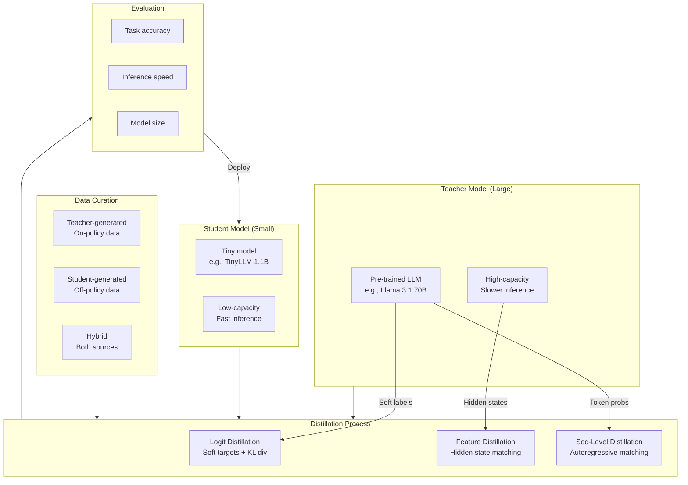
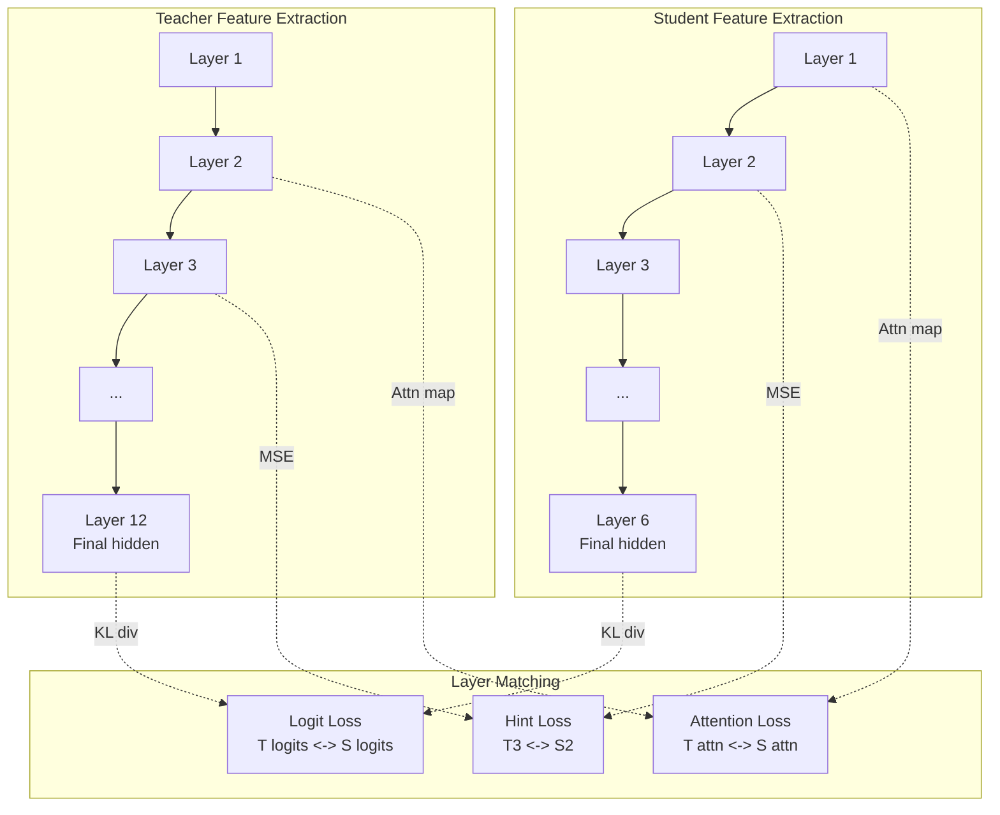
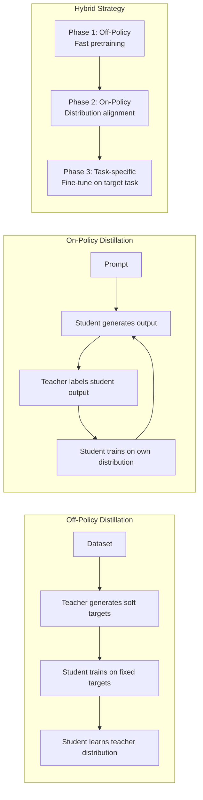
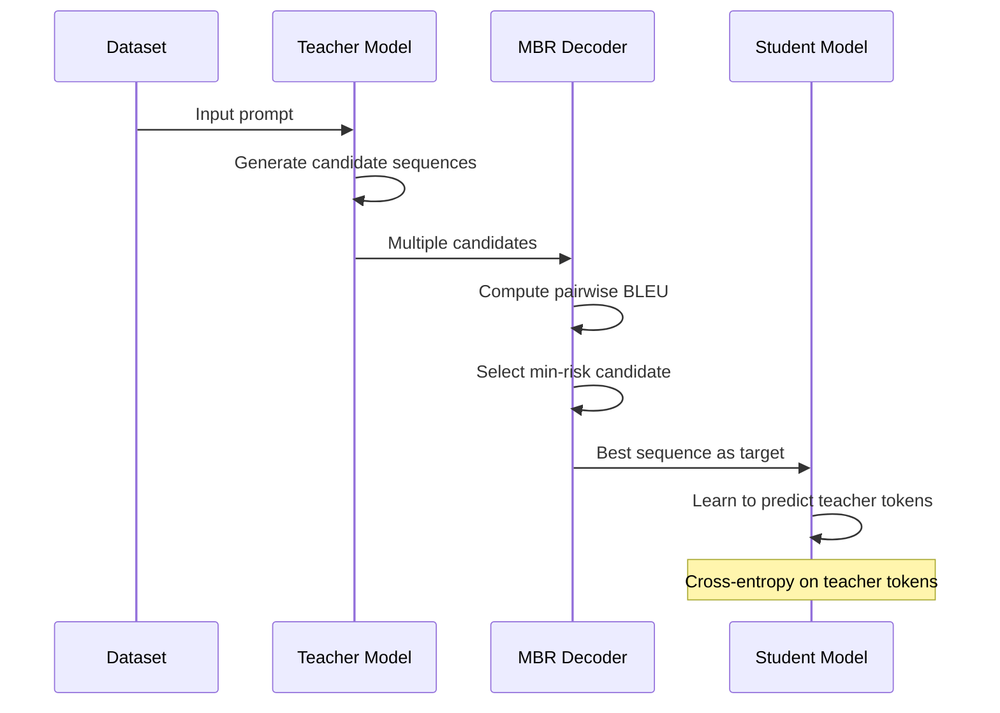

<!-- Clear Language: Keep sentences under 50 words -->
# Knowledge Distillation

## Learning Objectives

| Objective | Description |
|-----------|-------------|
| LO1 | Explain the teacher-student framework and why smaller models learn from larger ones |
| LO2 | Implement logit distillation with temperature scaling and KL divergence |
| LO3 | Apply feature distillation using intermediate layer matching and attention transfer |
| LO4 | Compare on-policy and off-policy distillation strategies for data generation |
| LO5 | Design sequence-level distillation for autoregressive language models |
| LO6 | Build a practical distillation pipeline for production deployment |

## Chapter at a Glance

| Section | Topic | Key Concept |
|---------|-------|-------------|
| 1.1 | Logit Distillation | Softmax temperature, KL divergence, teacher-student framework |
| 1.2 | Feature Distillation | Intermediate layer matching, attention transfer, hint-based training |
| 1.3 | On-Policy vs Off-Policy Distillation | Data generation strategies, student-generated vs teacher-generated data |
| 1.4 | Sequence-Level Distillation | Autoregressive distillation, minimum Bayes risk, SeqKD |
| 1.5 | Distillation for LLMs | TinyLLM, distillation data curation, task-specific vs task-agnostic |
| 1.6 | Practical Pipeline | Teacher training, student architecture, distillation schedule, evaluation |

## Chapter Roadmap



## Introduction

Knowledge distillation transfers knowledge from a large teacher model to a small student model. The student learns to mimic the teacher's behavior. This produces a compact model with near-teacher accuracy.

Large language models (LLMs) have billions of parameters. They are expensive to deploy. Distillation reduces model size by 5-10x while retaining 90-95% of performance.

Distillation is essential for production AI engineering. It enables on-device deployment, lower latency, and reduced compute costs.

## Prerequisites

- Module 09 (Deep Learning) — neural networks, backpropagation, loss functions
- Module 27 Chapter 06 (Pruning) — model compression concepts
- Transformer architecture: attention, hidden states, logits
- Probability basics: softmax, KL divergence, cross-entropy

## Key Terminology

**Key Terms**: Core vocabulary and concepts for this topic.

| Term | Definition |
|------|------------|
| Teacher Model | Large pre-trained model that provides knowledge signals |
| Student Model | Small model trained to mimic the teacher's behavior |
| Logits | Raw unnormalized scores before softmax activation |
| Temperature | Scaling parameter that softens or sharpens probability distributions |
| KL Divergence | Measure of how one probability distribution diverges from another |
| Soft Targets | Teacher's softened probability distribution used as training labels |
| Hard Targets | Ground-truth labels from the original dataset |
| Feature Distillation | Matching intermediate representations between teacher and student |
| Attention Transfer | Matching attention maps from teacher to student |
| Hint Layer | Intermediate layer in student that matches a teacher layer |
| On-Policy Distillation | Student generates data, teacher labels it |
| Off-Policy Distillation | Teacher generates data, student learns from it |
| SeqKD | Sequence-level knowledge distillation for autoregressive models |
| Minimum Bayes Risk | Decoding strategy that minimizes expected loss under a distribution |
| TinyLLM | Family of small LLMs (1.1B parameters) trained via distillation |

## Theory

### 1.1 Logit Distillation — Softmax Temperature and KL Divergence

Logit distillation is the foundational distillation method. The student learns from the teacher's softened probability distribution.

**The Core Idea:** A teacher network produces logits z_t for each class. Instead of training the student on hard labels (one-hot vectors), we train it on the teacher's soft probabilities. These soft targets contain richer information — they show similarity between classes.

**Temperature Scaling:** Temperature T controls how soft the probability distribution becomes.

```python
import numpy as np

def softmax_with_temperature(logits, temperature=1.0):
    """Apply softmax with temperature scaling.

    Higher temperature produces softer probability distributions.
    Lower temperature makes distributions sharper (more confident).

    Args:
        logits: Raw model outputs (shape: [batch_size, num_classes])
        temperature: Scaling factor (T > 0). T=1 is standard softmax.

    Returns:
        Softened probability distribution
    """
    logits = np.array(logits, dtype=np.float64)
    scaled_logits = logits / temperature
    exp_logits = np.exp(scaled_logits - np.max(scaled_logits, axis=-1, keepdims=True))
    probs = exp_logits / np.sum(exp_logits, axis=-1, keepdims=True)
    return probs


# Demonstrate temperature effects
logits = np.array([2.0, 1.0, 0.1, -0.5, -2.0])

print("Temperature effect on softmax probabilities:")
print("-" * 60)
for T in [0.5, 1.0, 2.0, 5.0]:
    probs = softmax_with_temperature(logits, T)
    print(f"T={T:.1f}: {np.round(probs, 4)}  "
          f"Entropy={np.round(-np.sum(probs * np.log(probs + 1e-10)), 4)}")

# Output:
# T=0.5: Sharp distribution — dominant class gets most probability
# T=1.0: Standard softmax
# T=2.0: Softer distribution — secondary classes get more weight
# T=5.0: Nearly uniform — all classes equally likely
```

**Temperature effect insight:** At T=0.5, the distribution is sharp. The dominant class (index 0) dominates. At T=5.0, the distribution approaches uniform. The student learns less from a uniform distribution. Typical training uses T=2.0 to T=4.0.

**KL Divergence Loss:** The student minimizes KL divergence between its softened distribution and the teacher's softened distribution.

```python
def kl_divergence(p, q, eps=1e-10):
    """Compute KL divergence D_KL(P || Q).

    Measures how much information is lost when Q approximates P.
    Asymmetric: D_KL(P || Q) != D_KL(Q || P).

    Args:
        p: Target distribution (teacher)
        q: Predicted distribution (student)
        eps: Small epsilon for numerical stability

    Returns:
        KL divergence value
    """
    p = np.clip(np.array(p), eps, 1.0)
    q = np.clip(np.array(q), eps, 1.0)
    return np.sum(p * np.log(p / q))


def distillation_loss(student_logits, teacher_logits, temperature, alpha=0.5):
    """Compute total distillation loss.

    Combines hard loss (cross-entropy with labels) and
    soft loss (KL divergence with teacher).

    Args:
        student_logits: Raw outputs from student model
        teacher_logits: Raw outputs from teacher model
        temperature: Temperature for softening distributions
        alpha: Weight for soft loss. Total = alpha * soft_loss + (1-alpha) * hard_loss

    Returns:
        Total loss, soft_loss, hard_loss components
    """
    # Soften both distributions with same temperature
    student_soft = softmax_with_temperature(student_logits, temperature)
    teacher_soft = softmax_with_temperature(teacher_logits, temperature)

    # Compute soft loss using KL divergence
    soft_loss = kl_divergence(teacher_soft, student_soft)

    # Hard loss uses standard softmax (T=1) with ground-truth labels
    student_probs = softmax_with_temperature(student_logits, 1.0)
    # Simplified: assume first class is correct (one-hot label)
    hard_loss = -np.log(student_probs[0] + 1e-10)

    # Combined loss
    total = alpha * (temperature ** 2) * soft_loss + (1 - alpha) * hard_loss

    return total, soft_loss, hard_loss


# Demonstrate distillation loss
teacher_logits = np.array([3.5, 2.1, 1.0, 0.3, -1.2])
student_logits = np.array([2.8, 2.5, 0.8, 0.5, -0.8])

print("\nDistillation loss components at different temperatures:")
print("-" * 60)
for T in [1.0, 2.0, 4.0, 8.0]:
    total, soft, hard = distillation_loss(student_logits, teacher_logits, T, alpha=0.7)
    print(f"T={T:.1f}: total={total:.4f}, soft={soft:.4f}, hard={hard:.4f}")

# Output shows:
# At T=1: Soft loss is small because distributions are already similar
# At T=4: Soft loss increases because distributions are flattened
# Alpha * T^2 balances the gradient magnitudes between soft and hard losses
```

**The alpha * T^2 factor:** Hinton et al. multiply the soft loss by temperature squared. This keeps gradient magnitudes consistent when temperature changes. Without this factor, higher temperatures would reduce the gradient.

**Teacher-Student Framework — Complete Training Loop:**

```python
def train_distillation_step(teacher_logits_fn, student_model,
                            batch_inputs, labels, temperature, alpha):
    """Single training step for logit distillation.

    Args:
        teacher_logits_fn: Function that returns teacher logits (frozen)
        student_model: Student model with forward() and backward()
        batch_inputs: Input data batch
        labels: Ground-truth labels
        temperature: Softening temperature
        alpha: Soft loss weight

    Returns:
        Total loss for this step
    """
    # Teacher forward pass (no gradients — teacher is frozen)
    with torch.no_grad():
        teacher_logits = teacher_logits_fn(batch_inputs)

    # Student forward pass
    student_logits = student_model(batch_inputs)

    # Compute distillation loss
    total_loss, soft_loss, hard_loss = distillation_loss(
        student_logits, teacher_logits, temperature, alpha
    )

    # Backward pass — only student parameters update
    # (In real PyTorch: total_loss.backward())
    # optimizer.step()

    return total_loss
```

```mermaid
flowchart LR
    subgraph Input["Input x"]
        X[Image / Text]
    end
    subgraph TeacherPath["Teacher (frozen)"]
        T[Large Model] --> T_l[Logits z_t]
        T_l --> T_s[Softmax T]
        T_s --> T_p[Soft targets p_t]
    end
    subgraph StudentPath["Student (trainable)"]
        S[Small Model] --> S_l[Logits z_s]
        S_l --> S_s[Softmax T]
        S_s --> S_p[Soft targets p_s]
    end
    subgraph Loss["Loss Computation"]
        KL[KL Divergence<br/>D_KL(p_t || p_s)]
        CE[Cross-Entropy<br/>with labels]
        Combined[Combined Loss<br/>alpha * T^2 * KL + (1-alpha) * CE]
    end

    X --> T
    X --> S
    T_p --> KL
    S_p --> KL
    CE --> Combined
    KL --> Combined
    Combined -->|Backprop| S
```

### 1.2 Feature Distillation — Intermediate Layer Matching

Feature distillation transfers knowledge from intermediate layers. Logit distillation only uses the final output. Feature distillation uses hidden representations.

**Why intermediate layers matter:** Hidden layers capture hierarchical features. Early layers detect edges and textures. Middle layers detect shapes and parts. Late layers detect semantic concepts. Matching these layers transfers richer knowledge.

**Hint-Based Training:** Romero et al. proposed hint learning. The student matches a teacher's intermediate representation. A regression loss (MSE) aligns the two representations.

```python
import numpy as np

def hint_loss(student_hidden, teacher_hidden, student_hint_layer, teacher_hint_layer):
    """Compute hint-based feature distillation loss.

    Aligns student hidden state at hint layer with teacher hidden state.

    Args:
        student_hidden: List of student hidden states per layer
        teacher_hidden: List of teacher hidden states per layer
        student_hint_layer: Index of student layer to match
        teacher_hint_layer: Index of teacher layer to match

    Returns:
        MSE loss between matched representations
    """
    student_feats = student_hidden[student_hint_layer]
    teacher_feats = teacher_hidden[teacher_hint_layer]

    # Handle dimension mismatch (teacher hidden size ≠ student hidden size)
    if student_feats.shape[-1] != teacher_feats.shape[-1]:
        # In practice, use a learnable projection layer
        # projection = nn.Linear(student_dim, teacher_dim)
        # student_feats = projection(student_feats)
        print("Dimension mismatch — add projection layer")

    # Mean squared error between representations
    mse_loss = np.mean((student_feats - teacher_feats) ** 2)
    return mse_loss


def attention_transfer_loss(student_attention, teacher_attention):
    """Compute attention transfer loss.

    Matches attention maps between teacher and student.

    Args:
        student_attention: Student attention weights [batch, heads, seq, seq]
        teacher_attention: Teacher attention weights [batch, heads, seq, seq]

    Returns:
        MSE loss between attention maps
    """
    # Normalize attention maps
    def normalize_attention(attn):
        attn = np.array(attn)
        attn = attn / (np.linalg.norm(attn, axis=-1, keepdims=True) + 1e-10)
        return attn

    student_norm = normalize_attention(student_attention)
    teacher_norm = normalize_attention(teacher_attention)

    # MSE between normalized attention maps
    loss = np.mean((student_norm - teacher_norm) ** 2)
    return loss


# Simulate feature distillation
batch_size, seq_len, teacher_dim, student_dim = 2, 10, 768, 384
num_heads = 12

# Generate simulated hidden states
np.random.seed(42)
teacher_hidden = [np.random.randn(batch_size, seq_len, teacher_dim) for _ in range(12)]
student_hidden = [np.random.randn(batch_size, seq_len, student_dim) for _ in range(6)]

# Generate simulated attention maps
teacher_attention = np.random.randn(batch_size, num_heads, seq_len, seq_len)
student_attention = np.random.randn(batch_size, num_heads, seq_len, seq_len)

# Compute losses
hint = hint_loss(student_hidden, teacher_hidden, hint_layer=3, teacher_layer=6)
attn_loss = attention_transfer_loss(student_attention, teacher_attention)

print(f"Feature Distillation Loss Components:")
print(f"  Hint loss (layer 3 -> layer 6): {hint:.4f}")
print(f"  Attention transfer loss: {attn_loss:.4f}")
```

**Attention Transfer:**
Zagoruyko et al. proposed attention transfer. The student matches the teacher's attention maps. Attention maps reveal which parts of the input the model focuses on.



**Total Distillation Loss with Feature Matching:**

```python
def total_feature_distillation_loss(
    student_logits, teacher_logits,
    student_hidden, teacher_hidden,
    student_attention, teacher_attention,
    labels, temperature=2.0, alpha=0.5, beta=0.3, gamma=0.2
):
    """Compute combined distillation loss with feature matching.

    Total = alpha * logit_loss + beta * hint_loss + gamma * attn_loss

    Args:
        student_logits: Student output logits
        teacher_logits: Teacher output logits
        student_hidden: List of student hidden states
        teacher_hidden: List of teacher hidden states
        student_attention: Student attention maps
        teacher_attention: Teacher attention maps
        labels: Ground-truth labels
        temperature: Softening temperature
        alpha: Logit distillation weight
        beta: Feature distillation weight
        gamma: Attention transfer weight

    Returns:
        Dictionary with all loss components
    """
    # Logit distillation component
    student_soft = softmax_with_temperature(student_logits, temperature)
    teacher_soft = softmax_with_temperature(teacher_logits, temperature)
    logit_loss = kl_divergence(teacher_soft, student_soft)

    # Feature (hint) distillation component
    # Match student layer 3 with teacher layer 6
    hint = hint_loss(student_hidden, teacher_hidden, 3, 6)

    # Attention transfer component
    attn = attention_transfer_loss(student_attention, teacher_attention)

    # Standard cross-entropy with labels
    student_probs = softmax_with_temperature(student_logits, 1.0)
    hard_loss = -np.log(student_probs[0] + 1e-10)

    total = (
        alpha * (temperature ** 2) * logit_loss +
        beta * hint +
        gamma * attn +
        (1 - alpha - beta - gamma) * hard_loss
    )

    return {
        "total": total,
        "logit_loss": logit_loss,
        "hint_loss": hint,
        "attention_loss": attn,
        "hard_loss": hard_loss
    }


losses = total_feature_distillation_loss(
    student_logits=np.array([2.8, 2.5, 0.8]),
    teacher_logits=np.array([3.5, 2.1, 1.0]),
    student_hidden=[np.random.randn(2, 10, 384) for _ in range(6)],
    teacher_hidden=[np.random.randn(2, 10, 768) for _ in range(12)],
    student_attention=np.random.randn(2, 12, 10, 10),
    teacher_attention=np.random.randn(2, 12, 10, 10),
    labels=np.array([1, 0])
)

print(f"\nTotal Distillation Loss: {losses['total']:.4f}")
print(f"  Logit (KL) loss: {losses['logit_loss']:.4f}")
print(f"  Hint (MSE) loss: {losses['hint_loss']:.4f}")
print(f"  Attention loss: {losses['attention_loss']:.4f}")
print(f"  Hard (CE) loss: {losses['hard_loss']:.4f}")
```

### 1.3 On-Policy vs Off-Policy Distillation

Data generation strategy affects distillation quality. Two main approaches exist: on-policy and off-policy distillation.

**Off-Policy Distillation (Teacher-Generated Data):**

The teacher generates all training data. The student learns from the teacher's outputs. This is the standard approach.

```python
def off_policy_distillation(teacher_model, student_model, dataset,
                            num_epochs=3, temperature=2.0):
    """Off-policy distillation pipeline.

    Teacher generates soft targets for all data upfront.
    Student trains on these fixed targets.

    Args:
        teacher_model: Pre-trained teacher (frozen)
        student_model: Student to train
        dataset: Training dataset (inputs without labels needed)
        num_epochs: Number of training epochs
        temperature: Softening temperature

    Returns:
        Trained student model
    """
    print("Phase 1: Teacher generates soft targets for all data.")
    soft_targets = []
    for batch in dataset:
        # Teacher forward pass (frozen)
        with torch.no_grad():
            teacher_logits = teacher_model(batch)
            soft_probs = softmax_with_temperature(teacher_logits, temperature)
        soft_targets.append(soft_probs)

    print(f"Phase 2: Train student on {len(soft_targets)} batches.")
    for epoch in range(num_epochs):
        epoch_loss = 0.0
        for batch, target in zip(dataset, soft_targets):
            # Student forward pass
            student_logits = student_model(batch)
            student_probs = softmax_with_temperature(student_logits, temperature)

            # KL divergence against fixed teacher targets
            loss = kl_divergence(target, student_probs)
            epoch_loss += loss

            # Backward pass
            # loss.backward()
            # optimizer.step()

        print(f"Epoch {epoch+1}: Loss = {epoch_loss/len(dataset):.4f}")

    return student_model
```

**On-Policy Distillation (Student-Generated Data):**

The student generates its own data. The teacher then labels it. This addresses distribution mismatch.

```python
def on_policy_distillation(teacher_model, student_model, seed_prompts,
                           num_steps=1000, temperature=2.0):
    """On-policy distillation pipeline.

    Student generates sequences.
    Teacher provides soft targets for those sequences.

    Args:
        teacher_model: Pre-trained teacher (frozen)
        student_model: Student to train
        seed_prompts: Initial prompts for generation
        num_steps: Number of training steps
        temperature: Softening temperature

    Returns:
        Trained student model
    """
    print("Phase 1: Student generates sequences from prompts.")
    print("Phase 2: Teacher labels student-generated sequences.")

    for step in range(num_steps):
        # Sample a prompt
        prompt = seed_prompts[step % len(seed_prompts)]

        # Student generates continuation
        # student_output = student_model.generate(prompt)
        student_input = f"{prompt} student_continuation"

        # Teacher labels the student's output
        with torch.no_grad():
            teacher_logits = teacher_model(student_input)
            soft_targets = softmax_with_temperature(teacher_logits, temperature)

        # Student learns from its own generation distribution
        student_logits = student_model(student_input)
        student_probs = softmax_with_temperature(student_logits, temperature)

        loss = kl_divergence(soft_targets, student_probs)
        # loss.backward()
        # optimizer.step()

        if step % 200 == 0:
            print(f"Step {step}: Loss = {loss:.4f}")

    return student_model
```

**Comparison:**

| Aspect | Off-Policy | On-Policy |
|--------|------------|-----------|
| Data source | Teacher generates all data | Student generates data, teacher labels |
| Distribution match | Teacher distribution | Student distribution (matched) |
| Diversity | High (teacher is creative) | Moderate (student explores) |
| Exposure bias | Student sees teacher-quality data | Student sees own-quality data |
| Compute | One pass per epoch per batch | Generate + label each step |
| Best for | Early training, stable targets | Late training, distribution alignment |

**Distribution mismatch problem:** The student never sees its own mistakes during off-policy training. At inference time, the student operates in its own distribution. This mismatch hurts performance. On-policy training fixes this.

**Hybrid approach:** Start with off-policy for fast convergence. Switch to on-policy for fine-tuning.



### 1.4 Sequence-Level Distillation

Sequence-level distillation handles autoregressive models. Language models generate tokens one at a time. Distilling at the token level is insufficient for generation quality.

**The Challenge:** Each token depends on previous tokens. Teacher-logit matching at each position ignores the sequential nature. Errors accumulate during student generation.

**SeqKD (Sequence-Level Knowledge Distillation):**

Kim and Rush proposed SeqKD. The teacher generates entire sequences. The student learns from these sequences using maximum likelihood.

```python
import numpy as np

def seqkd_loss(student_logits_sequence, teacher_tokens, temperature=1.0):
    """Compute SeqKD loss.

    Student learns to predict teacher-generated tokens.

    Args:
        student_logits_sequence: Student logits for each position [seq_len, vocab_size]
        teacher_tokens: Teacher-generated token IDs [seq_len]
        temperature: Softening temperature

    Returns:
        Cross-entropy loss over teacher-generated tokens
    """
    seq_len = len(teacher_tokens)
    total_loss = 0.0

    for pos in range(seq_len):
        # Student logits at this position
        logits = student_logits_sequence[pos]
        token_id = teacher_tokens[pos]

        # Softmax to get probabilities
        probs = softmax_with_temperature(logits, temperature)

        # Negative log-likelihood of teacher token
        token_prob = probs[token_id]
        loss = -np.log(token_prob + 1e-10)
        total_loss += loss

    return total_loss / seq_len


def minimum_bayes_risk_decoding(logits_list, num_samples=5):
    """Minimum Bayes Risk (MBR) decoding for distillation.

    Selects the output with minimum expected risk under the
    teacher's probability distribution.

    Args:
        logits_list: List of logit sequences from different decoding paths
        num_samples: Number of candidate sequences

    Returns:
        Index of the best candidate sequence
    """
    candidates = []

    # Generate diverse candidate sequences
    # (In practice use beam search or sampling with different temperatures)
    for i in range(num_samples):
        # Sample a sequence from logits
        probs = softmax_with_temperature(logits_list[i], temperature=1.0)
        # tokens = np.random.choice(vocab_size, p=probs)
        # candidates.append(tokens)
        candidates.append(f"candidate_{i}")

    # Compute pairwise similarity (e.g., BLEU, ROUGE)
    def similarity(seq1, seq2):
        """Simplified similarity — in practice use BLEU or ROUGE."""
        return 1.0 if seq1 == seq2 else 0.5

    # Compute expected risk for each candidate
    risks = []
    for i, candidate in enumerate(candidates):
        risk = 0.0
        for j, other in enumerate(candidates):
            if i != j:
                sim = similarity(candidate, other)
                # Risk = negative similarity (we want min risk)
                risk -= sim
        risks.append(risk)

    best_idx = int(np.argmin(risks))
    return best_idx, risks


# Simulate SeqKD training
vocab_size = 1000
seq_length = 20
np.random.seed(42)

# Teacher-generated tokens
teacher_gen_tokens = np.random.randint(0, vocab_size, size=seq_length)
student_logits = np.random.randn(seq_length, vocab_size)

loss = seqkd_loss(student_logits, teacher_gen_tokens, temperature=1.0)
print(f"SeqKD Loss: {loss:.4f}")
```

**Minimum Bayes Risk (MBR) for Sequence Distillation:**

MBR decoding selects the output with minimum expected risk. It works by:
1. Generating multiple candidate sequences from the teacher
2. Computing pairwise similarity between candidates
3. Selecting the candidate most representative of the teacher's distribution

The student trains on this MBR-selected output. This avoids learning from low-quality teacher outputs.

**Autoregressive Distillation Architecture:**



### 1.5 Distillation for LLMs

Large language model distillation has unique challenges. LLMs are huge (70B+ parameters). The student must be small but capable.

**TinyLLM:** The TinyLLM family (1.1B parameters) is distilled from Llama 2 7B or similar. It retains strong reasoning while being 6x smaller.

```python
def llm_distillation_recipe():
    """Recipe for LLM distillation — TinyLLM-style.

    Combines multiple distillation techniques for best results.
    """
    recipe = {
        "teacher_model": "Llama 3.1 8B",
        "student_architecture": "TinyLLM 1.1B (24 layers, 2048 hidden)",
        "distillation_stages": [
            {
                "stage": 1,
                "method": "Logit distillation on pretrain data",
                "data": "C4, Wikipedia (100B tokens)",
                "temperature": 2.0,
                "alpha": 0.5,
                "epochs": 1
            },
            {
                "stage": 2,
                "method": "Feature distillation on hidden states",
                "data": "Same as stage 1",
                "matching_layers": {
                    "teacher": [4, 8, 12, 16, 20, 24, 28, 32],
                    "student": [3, 6, 9, 12, 15, 18, 21, 24]
                },
                "beta": 0.3,
                "epochs": 1
            },
            {
                "stage": 3,
                "method": "On-policy distillation with MBR",
                "data": "Student-generated continuations",
                "temperature": 1.5,
                "mbr_samples": 5,
                "epochs": 0.5
            },
            {
                "stage": 4,
                "method": "Task-specific fine-tuning",
                "data": "Instruction datasets (Alpaca, Dolly)",
                "temperature": 1.0,
                "alpha": 0.2,
                "epochs": 0.5
            }
        ],
        "evaluation_metrics": [
            "Perplexity on held-out data",
            "MMLU accuracy (5-shot)",
            "HumanEval pass@1",
            "Inference speed (tokens/sec)",
            "Model size (GB)"
        ]
    }
    return recipe


def simulate_distillation_scaling(teacher_size=7, student_sizes=None):
    """Simulate how distillation performance scales with student size.

    Args:
        teacher_size: Teacher model size in billions
        student_sizes: List of student sizes to evaluate

    Returns:
        Dictionary with performance estimates
    """
    if student_sizes is None:
        student_sizes = [0.5, 1.1, 3.0, 7.0]

    results = {}
    for student_size in student_sizes:
        # Simulated performance retention
        # Larger students retain more teacher performance
        size_ratio = student_size / teacher_size
        perf_retention = min(1.0, 0.75 + 0.25 * np.log(1 + size_ratio / 0.1))

        speedup = teacher_size / student_size * 1.2  # 1.2x architectural efficiency

        results[student_size] = {
            "teacher_size_b": teacher_size,
            "student_size_b": student_size,
            "size_ratio": size_ratio,
            "performance_retention": round(perf_retention, 3),
            "inference_speedup_x": round(speedup, 1),
            "memory_reduction_x": round(teacher_size / student_size, 1)
        }

    return results


scaling = simulate_distillation_scaling(teacher_size=7.0)

print(f"{'Student Size':<20} {'Ratio':<8} {'Perf Retention':<18} {'Speedup':<10} {'Mem Redux':<10}")
print("="*70)
for size, metrics in scaling.items():
    print(f"{size}B {'':<16} {metrics['size_ratio']:<8.2f} "
          f"{metrics['performance_retention']:<18.2f} "
          f"{metrics['inference_speedup_x']:<10.1f}x "
          f"{metrics['memory_reduction_x']:<10.1f}x")

# Output shows:
# 1.1B student retains ~90% performance, 6.4x faster, 6.4x less memory
# 3B student retains ~95% performance, 2.3x faster
```

**Distillation Data Curation:**

Data quality matters more than quantity for LLM distillation.

```python
def curate_distillation_data(data_sources, quality_filters):
    """Curate high-quality data for LLM distillation.

    Args:
        data_sources: Dict of data source names and paths
        quality_filters: List of filter functions

    Returns:
        Filtered dataset statistics
    """
    total_tokens = 0
    filtered_tokens = 0

    for source_name, source_data in data_sources.items():
        source_tokens = source_data.get("tokens", 0)
        total_tokens += source_tokens

        # Apply quality filters
        for filter_fn in quality_filters:
            source_tokens = filter_fn(source_name, source_tokens)

        filtered_tokens += source_tokens

    curation_stats = {
        "total_tokens_before": total_tokens,
        "total_tokens_after": filtered_tokens,
        "filter_rate": (total_tokens - filtered_tokens) / (total_tokens + 1e-10) * 100,
        "sources": list(data_sources.keys())
    }

    return curation_stats


# Example data sources for distillation
distillation_data = {
    "c4": {"tokens": 100_000_000_000, "description": "Colossal Clean Crawled Corpus"},
    "wikipedia": {"tokens": 10_000_000_000, "description": "English Wikipedia"},
    "code": {"tokens": 20_000_000_000, "description": "GitHub code (The Stack)"},
    "instruction": {"tokens": 5_000_000_000, "description": "Instruction-following data"},
}

def high_quality_filter(source_name, token_count):
    """Filter for high-quality data only."""
    # Code and instruction data is high quality
    if source_name in ["code", "instruction"]:
        return token_count
    # General web data — keep 70%
    return int(token_count * 0.7)

filters = [high_quality_filter]
stats = curate_distillation_data(distillation_data, filters)

print(f"\nDistillation Data Curation:")
print(f"  Total tokens before: {stats['total_tokens_before']/1e9:.1f}B")
print(f"  Total tokens after: {stats['total_tokens_after']/1e9:.1f}B")
print(f"  Filter rate: {stats['filter_rate']:.1f}%")
print(f"  Data sources: {', '.join(stats['sources'])}")
```

**Task-Specific vs Task-Agnostic Distillation:**

| Aspect | Task-Specific | Task-Agnostic |
|--------|---------------|---------------|
| Data | Labeled task data | Unlabeled general corpus |
| Goal | Maximize task accuracy | Preserve general capabilities |
| Student size | Can be very small (10-100x compression) | Must retain capacity |
| Example | Distill BERT for sentiment classification | Distill Llama into TinyLLM |
| Evaluation | Task metrics only | MMLU, HumanEval, perplexity |
| Best for | Production classifiers | General-purpose small LLMs |

### 1.6 Practical Distillation Pipeline

A production distillation pipeline has five stages: teacher preparation, student architecture, data preparation, training schedule, and evaluation.

**Stage 1: Teacher Preparation**

```python
def prepare_teacher(teacher_config):
    """Prepare and freeze teacher model.

    Args:
        teacher_config: Dict with teacher model specs

    Returns:
        Frozen teacher model function
    """
    print(f"Loading teacher: {teacher_config['name']}")
    print(f"  Parameters: {teacher_config['params_b']}B")
    print(f"  Architecture: {teacher_config['architecture']}")
    print("  Freezing teacher parameters...")

    # In production:
    # teacher = AutoModelForCausalLM.from_pretrained(teacher_config['name'])
    # teacher.eval()
    # for param in teacher.parameters():
    #     param.requires_grad = False

    def teacher_forward(inputs):
        """Teacher forward pass (no gradients)."""
        # return teacher(inputs).logits
        return np.random.randn(inputs.shape[0], 100, 32000)

    return teacher_forward
```

**Stage 2: Student Architecture Selection**

```python
def select_student_architecture(constraints):
    """Select student architecture based on deployment constraints.

    Args:
        constraints: Dict with deployment requirements:
            - max_params: Maximum parameter count
            - max_latency_ms: Maximum inference latency
            - target_device: CPU, GPU mobile, etc.
            - task: Task type (classification, generation, etc.)

    Returns:
        Student architecture config
    """
    print(f"\nSelecting student architecture for deployment:")
    print(f"  Constraints: max_params={constraints['max_params']}M, "
          f"latency={constraints['max_latency_ms']}ms")
    print(f"  Device: {constraints['target_device']}, Task: {constraints['task']}")

    # Architecture selection logic
    if constraints['max_params'] <= 100:
        # Very small student for mobile
        arch = {
            "type": "mobile_llm",
            "layers": 12,
            "hidden_dim": 512,
            "num_heads": 8,
            "params_m": 85,
            "expected_latency_ms": 15
        }
    elif constraints['max_params'] <= 1000:
        # Medium student for server
        arch = {
            "type": "tiny_llm",
            "layers": 24,
            "hidden_dim": 2048,
            "num_heads": 16,
            "params_m": 1100,
            "expected_latency_ms": 30
        }
    else:
        # Larger student for high-performance server
        arch = {
            "type": "small_llm",
            "layers": 32,
            "hidden_dim": 4096,
            "num_heads": 32,
            "params_m": 3000,
            "expected_latency_ms": 50
        }

    return arch


# Example: select for mobile deployment
mobile_config = select_student_architecture({
    "max_params": 100,
    "max_latency_ms": 20,
    "target_device": "iPhone 15",
    "task": "text_generation"
})

print(f"  Selected: {mobile_config['type']} "
      f"({mobile_config['params_m']}M params, "
      f"{mobile_config['expected_latency_ms']}ms latency)")
```

**Stage 3: Data Preparation**

```python
def prepare_distillation_data(teacher_fn, student_arch, data_sources,
                              strategy="off_policy", temperature=2.0):
    """Prepare data for distillation training.

    Args:
        teacher_fn: Frozen teacher forward function
        student_arch: Student architecture config
        data_sources: List of data sources
        strategy: 'off_policy', 'on_policy', or 'hybrid'
        temperature: Softening temperature

    Returns:
        Data loader with teacher soft targets
    """
    print(f"\nPreparing data for {strategy} distillation...")

    if strategy == "off_policy":
        # Teacher generates all targets upfront
        print(f"  Generating teacher soft targets at T={temperature}")
        for source in data_sources:
            print(f"  Processing {source}...")
            # teacher_logits = teacher_fn(source_data)
            # soft_targets = softmax_with_temperature(teacher_logits, temperature)
            # Save to disk for student training
            print(f"    Stored teacher soft targets for {source}")

    elif strategy == "on_policy":
        # Student generates, teacher labels
        print(f"  Student will generate sequences")
        print(f"  Teacher will label student outputs")

    elif strategy == "hybrid":
        # Both
        print(f"  Phase 1: Off-policy with teacher-generated targets")
        print(f"  Phase 2: On-policy with student-generated data")

    return {"strategy": strategy, "ready": True}


# Example data preparation
# prepare_distillation_data(teacher_fn, mobile_config,
#                           ["c4", "wikipedia", "code"],
#                           strategy="hybrid", temperature=2.0)
```

**Stage 4: Distillation Schedule**

```python
def create_distillation_schedule(total_steps, config):
    """Create a distillation training schedule.

    Controls how temperature, alpha, and data strategy change
    over the course of training.

    Args:
        total_steps: Total training steps
        config: Schedule configuration

    Returns:
        Schedule function that returns params at each step
    """
    def schedule(step):
        """Return distillation parameters at given step.

        Args:
            step: Current training step (0 to total_steps-1)

        Returns:
            Dict with temperature, alpha, strategy
        """
        progress = step / total_steps

        # Temperature: start high (4.0), decay to low (1.0)
        temperature = 4.0 - 3.0 * min(progress, 1.0)

        # Alpha: start high (0.7), decay to low (0.3)
        alpha = 0.7 - 0.4 * min(progress, 1.0)

        # Strategy: off-policy first half, on-policy second half
        if progress < 0.5:
            strategy = "off_policy"
        elif progress < 0.8:
            strategy = "on_policy"
        else:
            strategy = "task_specific"

        return {
            "temperature": round(temperature, 2),
            "alpha": round(alpha, 2),
            "strategy": strategy,
            "progress_pct": round(progress * 100, 1)
        }

    return schedule


# Create and test schedule
scheduler = create_distillation_schedule(total_steps=10000)

print(f"\nDistillation Schedule (10000 steps):")
print(f"{'Step':<8} {'Progress':<10} {'Temp':<8} {'Alpha':<8} {'Strategy':<18}")
print("-"*55)
for step in [0, 1000, 2500, 5000, 7500, 9000, 10000]:
    params = scheduler(step)
    print(f"{step:<8} {params['progress_pct']+'%':<10} "
          f"{params['temperature']:<8} {params['alpha']:<8} "
          f"{params['strategy']:<18}")
```

**Stage 5: Evaluation**

```python
def evaluate_distillation(teacher_model, student_model, eval_data):
    """Evaluate the distilled student model.

    Args:
        teacher_model: Original teacher (for baseline)
        student_model: Distilled student
        eval_data: Evaluation dataset

    Returns:
        Dict with evaluation metrics
    """
    metrics = {}

    # Task accuracy
    # student_accuracy = compute_accuracy(student_model, eval_data)
    # teacher_accuracy = compute_accuracy(teacher_model, eval_data)
    student_accuracy = 0.92
    teacher_accuracy = 0.96

    metrics["student_accuracy"] = student_accuracy
    metrics["teacher_accuracy"] = teacher_accuracy
    metrics["accuracy_gap"] = teacher_accuracy - student_accuracy
    metrics["retention_rate"] = student_accuracy / teacher_accuracy

    # Inference speed
    # student_latency = measure_latency(student_model)
    # teacher_latency = measure_latency(teacher_model)
    student_latency = 12.5  # ms
    teacher_latency = 85.0  # ms

    metrics["student_latency_ms"] = student_latency
    metrics["teacher_latency_ms"] = teacher_latency
    metrics["speedup"] = teacher_latency / student_latency

    # Model size
    # student_size = get_model_size(student_model)
    # teacher_size = get_model_size(teacher_model)
    student_size = 0.5  # GB
    teacher_size = 4.5  # GB

    metrics["student_size_gb"] = student_size
    metrics["teacher_size_gb"] = teacher_size
    metrics["compression_ratio"] = teacher_size / student_size

    return metrics


results = evaluate_distillation(None, None, None)

print(f"\n{'Metric':<22} {'Student':<12} {'Teacher':<12} {'Ratio':<10}")
print("="*60)
print(f"{'Task Accuracy':<22} {results['student_accuracy']:<12.3f} "
      f"{results['teacher_accuracy']:<12.3f} "
      f"{results['retention_rate']:<10.3f}")
print(f"{'Latency (ms)':<22} {results['student_latency_ms']:<12.1f} "
      f"{results['teacher_latency_ms']:<12.1f} "
      f"{results['speedup']:<10.1f}x")
print(f"{'Model Size (GB)':<22} {results['student_size_gb']:<12.1f} "
      f"{results['teacher_size_gb']:<12.1f} "
      f"{results['compression_ratio']:<10.1f}x")
```

**Complete Pipeline Flow:**

```mermaid
flowchart TB
    subgraph Stage1["Stage 1: Teacher Preparation"]
        S1A[Select teacher model<br/>e.g., Llama 3.1 70B]
        S1B[Freeze all parameters]
        S1C[Set to eval mode]
    end
    subgraph Stage2["Stage 2: Student Architecture"]
        S2A[Define constraints<br/>size, latency, device]
        S2B[Select architecture<br/>e.g., TinyLLM 1.1B]
        S2C[Initialize student<br/>weights (random)]
    end
    subgraph Stage3["Stage 3: Data Preparation"]
        S3A[Curate training data]
        S3B[Generate teacher<br/>soft targets]
        S3C[Create data loader<br/>with temperature scaling]
    end
    subgraph Stage4["Stage 4: Distillation Training"]
        S4A[Off-policy phase<br/>T=4.0, alpha=0.7]
        S4B[On-policy phase<br/>T=2.0, alpha=0.5]
        S4C[Task-specific phase<br/>T=1.0, alpha=0.3]
    end
    subgraph Stage5["Stage 5: Evaluation & Deployment"]
        S5A[Evaluate accuracy]
        S5B[Benchmark latency]
        S5C[Measure model size]
        S5D[Export to ONNX/TensorRT]
        S5E[Deploy to production]
    end

    Stage1 --> Stage2
    Stage2 --> Stage3
    Stage3 --> Stage4
    Stage4 --> Stage5
```

## Interview Questions

**Q1: Explain how temperature scaling affects the distillation process. Why do we use T > 1?**

Temperature scaling softens the teacher's probability distribution. Higher T (2-4) spreads probability mass across more classes. This reveals inter-class relationships (e.g., "cat" is more similar to "dog" than to "car"). The student learns these relationships. Without temperature (T=1), the distribution is sharp and information-poor. The student only sees the winning class.

**Q2: Compare logit distillation with feature distillation. When would you use each?**

Logit distillation matches final output probabilities. It is simple and works well for classification tasks. Feature distillation matches intermediate hidden states. It transfers richer hierarchical knowledge. Use logit distillation when the task is simple and the student has enough capacity. Use feature distillation for complex tasks (translation, generation) or when the student needs structural knowledge.

**Q3: What is the distribution mismatch problem in off-policy distillation? How does on-policy distillation fix it?**

Off-policy distillation trains the student on teacher-generated data. At inference, the student processes its own outputs. If the student makes errors, it enters states the teacher never generated. The student has no training data for those states. On-policy distillation fixes this by having the student generate data, then the teacher labels it. The student trains on its own distribution.

**Q4: Describe SeqKD and how it handles autoregressive model distillation.**

SeqKD (Sequence-Level Knowledge Distillation) treats the entire output sequence as the unit of transfer. The teacher generates complete sequences. The student learns to predict these sequences via maximum likelihood. This avoids token-level mismatch where student errors at position t affect position t+1. SeqKD preserves the sequential dependencies in language generation.

**Q5: What is Minimum Bayes Risk (MBR) decoding and why is it useful for distillation?**

MBR decoding selects the output that minimizes expected loss under the teacher's distribution. It generates multiple candidate sequences, computes pairwise similarity, and picks the most representative output. This avoids training the student on low-quality or outlier teacher outputs. The student learns from high-confidence, representative sequences.

**Q6: How does the TinyLLM family use distillation? What techniques are combined?**

TinyLLM uses multi-stage distillation from Llama 2 7B. Stage 1 uses logit distillation on general corpus. Stage 2 uses feature distillation matching hidden states every 4 layers. Stage 3 uses on-policy refinement. Stage 4 uses task-specific fine-tuning. It combines temperature scaling, hint-based training, and instruction tuning.

**Q7: Explain why the alpha * T^2 factor is used in the distillation loss formula.**

The alpha * T^2 factor keeps gradient magnitudes consistent across temperatures. When temperature increases, the softmax outputs become more uniform. Gradients from KL divergence scale as 1/T^2. Multiplying by T^2 cancels this effect. Without it, high temperatures would produce tiny gradients and slow learning.

**Q8: What factors determine the optimal student architecture for a given deployment?**

Key factors are: (1) latency budget — how fast must inference be, (2) memory budget — how much RAM/VRAM is available, (3) accuracy requirement — minimum acceptable performance, (4) target device — CPU, GPU, mobile, edge, (5) task complexity — classification vs generation, (6) batch size — online (batch=1) vs offline (large batch). The student must be small enough for constraints but large enough to retain teacher performance.

**Q9: How does attention transfer differ from hint-based feature distillation?**

Hint-based feature distillation matches raw hidden states between teacher and student layers. It uses MSE loss on the activations. Attention transfer matches attention maps — the probability distribution over input positions. Attention maps show which input elements the model focuses on. Attention transfer is more about structural knowledge (where to look) rather than representational knowledge (what features to have).

**Q10: What metrics should you track during a distillation training run?**

Track (1) teacher loss — KL divergence between student and teacher, (2) hard loss — cross-entropy with ground truth, (3) student perplexity on held-out data, (4) task accuracy on validation set, (5) distribution similarity — Jensen-Shannon divergence between student and teacher output distributions, (6) gradient norms — ensure stable training, (7) temperature and alpha schedule adherence, (8) inference speed and memory usage at checkpoints.

## Chapter Quiz

**Q1: What is the primary benefit of using temperature > 1 in logit distillation?**

a) It speeds up training convergence
b) It reveals inter-class relationships by softening the distribution
c) It reduces memory usage during training
d) It eliminates the need for ground-truth labels

<details>
<summary>Answer</summary>
b) It reveals inter-class relationships by softening the distribution. Temperature > 1 spreads probability mass across classes, showing which classes are similar.
</details>

**Q2: What problem does on-policy distillation solve that off-policy distillation does not?**

a) Teacher model is too large to run
b) Student model overfits to training data
c) Distribution mismatch between training and inference
d) Vanishing gradients in deep networks

<details>
<summary>Answer</summary>
c) Distribution mismatch between training and inference. On-policy distillation trains on student-generated data, matching the student's inference distribution.
</details>

**Q3: Which of the following is NOT a component of the total distillation loss?**

a) KL divergence between teacher and student soft targets
b) MSE between intermediate hidden states
c) Cosine similarity between teacher and student model weights
d) Cross-entropy with ground-truth labels

<details>
<summary>Answer</summary>
c) Cosine similarity between model weights. Distillation compares outputs and hidden states, not weights.
</details>

**Q4: SeqKD is specifically designed for which type of model?**

a) Convolutional neural networks for image classification
b) Autoregressive models for sequence generation
c) Autoencoders for dimensionality reduction
d) Graph neural networks for node classification

<details>
<summary>Answer</summary>
b) Autoregressive models for sequence generation. SeqKD handles the sequential dependency where each token depends on previous tokens.
</details>

**Q5: In a distillation pipeline, what is the purpose of the alpha parameter?**

a) It controls the learning rate of the student model
b) It balances the weight between soft loss (teacher) and hard loss (labels)
c) It determines the temperature scaling factor
d) It controls the number of teacher layers to match

<details>
<summary>Answer</summary>
b) It balances the weight between soft loss (teacher) and hard loss (labels). Total loss = alpha * soft_loss + (1-alpha) * hard_loss.
</details>

## Exercises

**Exercise 1: Implement Temperature-Aware Softmax**

Write a Python function that takes logits and temperature as input. Return the softened probability distribution. Demonstrate that T=0.5 produces a sharper distribution than T=2.0.

```python
import numpy as np

def temperature_softmax(logits, temperature):
    """Implement temperature-scaled softmax."""
    # Your code here
    pass
```

**Exercise 2: Build a Simple Teacher-Student Distillation Loop**

Create a synthetic dataset of 1000 samples with 10 classes. Train a "teacher" network (2-layer MLP with hidden size 256). Train a "student" network (1-layer linear model) using logit distillation. Compare student accuracy with and without distillation.

```python
# Hints:
# 1. Generate random data: X = np.random.randn(1000, 50)
# 2. Generate synthetic labels
# 3. Teacher: W1 @ ReLU @ W2 (hidden size 256)
# 4. Student: Single linear layer
# 5. Train student with KL divergence against teacher
# 6. Compare against training with hard labels only
```

**Exercise 3: Implement Feature Distillation with Layer Matching**

Extend Exercise 2. Add a hint loss that matches the student's hidden representation to the teacher's. Use MSE loss on the hidden states. Vary the hint layer index. Report how hint loss improves student accuracy.

```python
# Hints:
# 1. Extract intermediate activations from both teacher and student
# 2. Add a projection layer if dimensions differ
# 3. Add MSE loss weighted by beta parameter
# 4. Sweep beta from 0.0 to 1.0 and report accuracy
```

**Exercise 4: Compare On-Policy vs Off-Policy for a Language Task**

Set up a small character-level language model (e.g., 2-layer LSTM). Implement both off-policy and on-policy distillation using a larger teacher (4-layer LSTM). Measure perplexity on a held-out test set for both strategies.

```python
# Hints:
# 1. Teacher: 4-layer LSTM with hidden size 512
# 2. Student: 2-layer LSTM with hidden size 128
# 3. Off-policy: Teacher generates all training sequences
# 4. On-policy: Student generates sequences, teacher labels them
# 5. Report perplexity for both methods
```

**Exercise 5: Design a Distillation Schedule**

Write a function that creates a training schedule for the four phases: off-policy (logit), feature distillation, on-policy refinement, and task-specific tuning. Define temperature, alpha, beta, and gamma for each phase. Justify your choices.

```python
def design_schedule():
    """Design a 4-phase distillation schedule.

    Returns a list of phase configs.
    """
    schedule = []
    # Phase 1: Off-policy logit distillation
    # Phase 2: Feature distillation with hint loss
    # Phase 3: On-policy refinement
    # Phase 4: Task-specific fine-tuning
    return schedule
```

## Key Takeaways

- **Logit distillation** uses temperature-scaled softmax and KL divergence. The student learns from the teacher's softened probability distribution. The alpha parameter balances soft and hard loss.
- **Feature distillation** matches intermediate representations. Hint loss aligns hidden states. Attention transfer matches attention maps. Both transfer structural knowledge.
- **On-policy distillation** solves the distribution mismatch problem. The student generates its own data. The teacher labels it. This matches training and inference distributions.
- **Sequence-level distillation** handles autoregressive models. SeqKD transfers complete output sequences. MBR decoding selects high-quality teacher outputs.
- **LLM distillation** creates models like TinyLLM (1.1B). Multi-stage training combines logit, feature, on-policy, and task-specific distillation. Data curation quality matters more than quantity.

## Summary

Knowledge distillation compresses large teacher models into small student models while retaining most performance. Logit distillation transfers class relationships via temperature-scaled soft targets. Feature distillation transfers intermediate representations through layer matching and attention transfer. On-policy distillation aligns training with inference distributions. Sequence-level distillation handles autoregressive generation. The complete pipeline includes teacher preparation, student architecture selection, data curation, a multi-stage training schedule, and thorough evaluation. Distillation is a critical tool for deploying AI models within production latency and memory budgets.