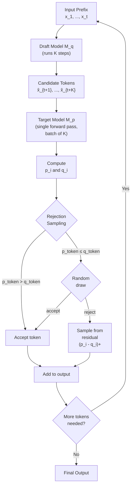
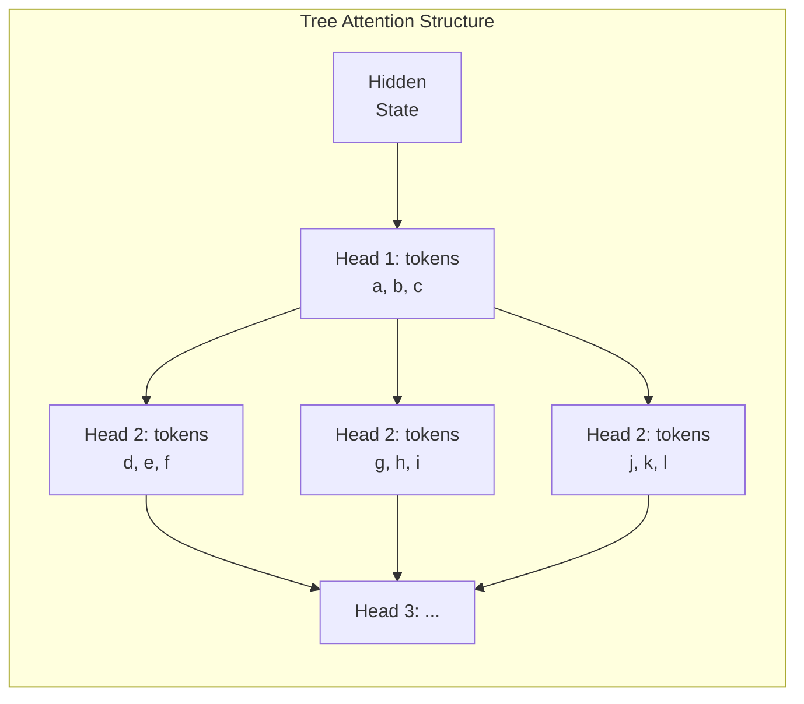
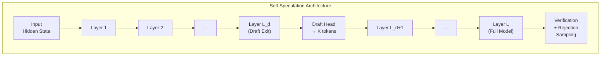
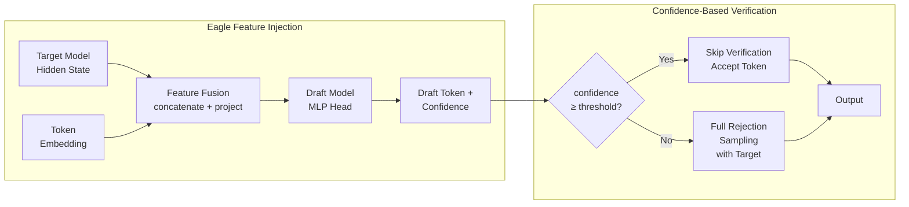
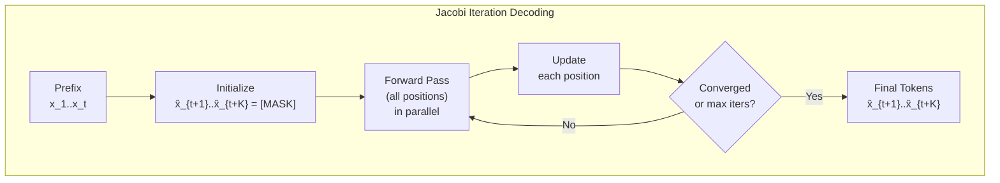
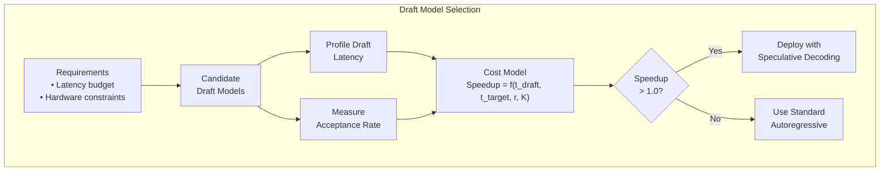

<!-- Clear Language: Keep sentences under 50 words -->
# Speculative Decoding

## Learning Objectives

| Objective | Description |
|-----------|-------------|
| Define speculative decoding | Explain how a draft model speeds up autoregressive generation |
| Compare draft and target models | Distinguish roles of small draft models and large target models |
| Implement rejection sampling | Write Python code that accepts or rejects draft tokens |
| Describe Medusa architecture | Explain multiple draft heads and tree attention |
| Analyze acceptance rate | Compute probability of draft token acceptance |
| Evaluate cost-performance trade-offs | Measure speedup against overhead of draft model execution |

## Introduction

Large language models generate one token at a time. Each step requires a full forward pass through billions of parameters. This sequential bottleneck limits throughput for real-time applications.

Speculative decoding breaks this bottleneck. A small draft model proposes multiple tokens quickly. The large target model verifies all proposals in a single forward pass. Accepted tokens are kept; rejected tokens trigger correction.

This technique achieves 2-3x speedup without changing the target model's output distribution. It is mathematically lossless — the final output matches the target model exactly. Speculative decoding is now used in production systems at Google, Anthropic, and OpenAI.

## Prerequisites

- Autoregressive language model architecture (Transformer decoder)
- Token-level probability distributions and softmax
- Beam search and greedy decoding basics
- Parallel computation and batched inference concepts
- Python proficiency with NumPy

## Key Terminology

| Term | Definition |
|------|------------|
| Draft model | Small, fast model that proposes candidate tokens |
| Target model | Large, accurate model that verifies draft proposals |
| Rejection sampling | Statistical method to accept or reject draft tokens |
| Acceptance rate | Fraction of draft tokens accepted by target model |
| Tree attention | Parallel attention over multiple draft sequences |
| Medusa head | Separate prediction head for future token positions |
| Self-speculation | Using early layers of target model as the draft model |
| Feature injection | Passing hidden states from draft to target model |
| Jacobi iteration | Fixed-point iteration for parallel token decoding |
| Blockwise decoding | Generating multiple tokens simultaneously |

## Theory

### 1. Draft Models — Small Model as Drafter

#### 1.1 How Drafting Works

Speculative decoding uses two models:

1. **Draft model** M_q — a small, fast model (e.g., 100M parameters)
2. **Target model** M_p — the large, accurate model (e.g., 7B+ parameters)

The draft model runs K autoregressive steps to produce K candidate tokens. The target model then runs a single forward pass on all K candidates in parallel. This is the key efficiency gain — one big forward pass replaces K sequential big forward passes.

```
Time with target model alone:  K × t_target
Time with speculative decoding: K × t_draft + t_target

Speedup ≈ K / (K × (t_draft/t_target) + 1)
```

When `t_draft` is much smaller than `t_target`, speedup approaches K.

#### 1.2 Independent Draft and Verification

The draft model generates tokens independently:

```
x_{t+1}^draft  ~  M_q(· | x_1, ..., x_t)
x_{t+2}^draft  ~  M_q(· | x_1, ..., x_t, x_{t+1}^draft)
...
x_{t+K}^draft  ~  M_q(· | x_1, ..., x_t, ..., x_{t+K-1}^draft)
```

The target model computes probabilities for all K positions in one batch:

```
p(x_{t+1} | x_1..t),  p(x_{t+2} | x_1..t+1),  ...,  p(x_{t+K} | x_1..t+K-1)
```

#### 1.3 Rejection Sampling

Rejection sampling determines which draft tokens to keep:

```
For each position i from 1 to K:
    q_i = M_q(· | prefix + accepted_drafts)
    p_i = M_p(· | prefix + accepted_drafts)

    p_token = p_i[draft_token_i]
    q_token = q_i[draft_token_i]

    if p_token > q_token:
        accept unconditionally
    else:
        accept with probability p_token / q_token
        if rejected, sample from (p_i - q_i)_+
```

This guarantees the output distribution matches M_p exactly.

```python
import numpy as np

def speculative_decode(draft_logits, target_logits, draft_tokens):
    """
    Rejection sampling for speculative decoding.

    Args:
        draft_logits: shape (K, vocab_size) from draft model
        target_logits: shape (K, vocab_size) from target model
        draft_tokens: shape (K,) token IDs proposed by draft

    Returns:
        accepted_tokens: list of accepted token IDs
        n_accepted: number of tokens accepted
    """
    K = len(draft_tokens)
    accepted = []
    rng = np.random.default_rng(42)

    for i in range(K):
        # Convert logits to probabilities
        q = softmax(draft_logits[i])
        p = softmax(target_logits[i])

        token = draft_tokens[i]
        q_token = q[token]
        p_token = p[token]

        # Rejection sampling criterion
        if p_token > q_token:
            # Accept unconditionally
            accepted.append(token)
        else:
            # Accept with probability p/q
            if rng.uniform() < p_token / (q_token + 1e-10):
                accepted.append(token)
            else:
                # Reject: sample from residual distribution
                residual = np.maximum(p - q, 0)
                residual /= residual.sum()
                new_token = rng.choice(len(p), p=residual)
                accepted.append(new_token)
                break

    return accepted, len(accepted)


def softmax(logits):
    """Stable softmax computation."""
    shifted = logits - np.max(logits)
    exp_vals = np.exp(shifted)
    return exp_vals / exp_vals.sum()


# Simulate a speculative decoding run
vocab_size = 1000
K = 5

draft_logits = np.random.randn(K, vocab_size) * 0.5
target_logits = np.random.randn(K, vocab_size) * 1.0

# Draft model proposes tokens
rng = np.random.default_rng(42)
draft_probs = np.array([softmax(l) for l in draft_logits])
draft_tokens = [rng.choice(vocab_size, p=draft_probs[i]) for i in range(K)]

accepted, n = speculative_decode(draft_logits, target_logits, draft_tokens)
print(f"Draft tokens: {draft_tokens}")
print(f"Accepted tokens: {accepted}")
print(f"Number accepted: {n}/{K}")
```

```
Expected output (varies due to randomness):
Draft tokens: [342, 781, 123, 567, 890]
Accepted tokens: [342, 781, 123]
Number accepted: 3/5
```



### 2. Medusa — Multiple Draft Heads

#### 2.1 Architecture Overview

Medusa adds multiple prediction heads on top of the target model's last hidden layer. Each head predicts a future token position:

- Head 1 predicts token at position t+1 (standard next-token)
- Head 2 predicts token at position t+2
- Head 3 predicts token at position t+3
- Head K predicts token at position t+K

This eliminates the need for a separate draft model. The target model's own representations are repurposed for speculation.

```python
class MedusaHead:
    """
    A single Medusa prediction head.

    Each head predicts the token at offset k positions ahead.
    """

    def __init__(self, hidden_dim, vocab_size, offset):
        self.offset = offset
        # Two-layer MLP as used in Medusa-1
        self.W1 = np.random.randn(hidden_dim, hidden_dim * 2) * 0.01
        self.b1 = np.zeros(hidden_dim * 2)
        self.W2 = np.random.randn(hidden_dim * 2, vocab_size) * 0.01
        self.b2 = np.zeros(vocab_size)

    def forward(self, hidden_state):
        """
        Predict token at position t + offset.

        Args:
            hidden_state: shape (hidden_dim,) from target model

        Returns:
            logits: shape (vocab_size,)
        """
        h = hidden_state @ self.W1 + self.b1
        h = np.maximum(h, 0)  # ReLU
        logits = h @ self.W2 + self.b2
        return logits


class MedusaModel:
    """
    Simplified Medusa model with multiple draft heads.
    """

    def __init__(self, hidden_dim, vocab_size, num_heads=3):
        self.heads = [
            MedusaHead(hidden_dim, vocab_size, offset=i + 1)
            for i in range(num_heads)
        ]
        self.vocab_size = vocab_size
        self.hidden_dim = hidden_dim

    def speculate(self, hidden_state):
        """
        Generate draft tokens from all heads.

        Args:
            hidden_state: shape (hidden_dim,)

        Returns:
            draft_tokens: list of token IDs, one per head
            draft_logits: list of logit vectors
        """
        draft_tokens = []
        draft_logits = []

        for head in self.heads:
            logits = head.forward(hidden_state)
            token = int(np.argmax(logits))
            draft_tokens.append(token)
            draft_logits.append(logits)

        return draft_tokens, draft_logits


# Simulation
hidden_dim = 512
vocab_size = 1000
num_heads = 5

medusa = MedusaModel(hidden_dim, vocab_size, num_heads)
hidden_state = np.random.randn(hidden_dim) * 0.1

tokens, logits = medusa.speculate(hidden_state)
print(f"Medusa draft tokens: {tokens}")
print(f"Heads used: {num_heads}")
```

```
Expected output (varies):
Medusa draft tokens: [456, 789, 123, 345, 678]
Heads used: 5
```

#### 2.2 Tree Attention

Medusa-2 introduces tree attention. All possible combinations of draft tokens from different heads are organized as a tree. The target model attends to all branches simultaneously.



#### 2.3 Typical Acceptance

A token is "typically accepted" if:

```
p(target_token | prefix) / q(draft_token | prefix) ≥ ε
```

where ε is a small threshold (e.g., 0.01). This allows Medusa to skip verification for tokens the draft heads are confident about.

### 3. Self-Speculation — Using the Same Model

#### 3.1 Early Exit Strategy

Self-speculation uses the same target model for drafting. The key insight: early transformer layers produce reasonable next-token predictions at lower cost.

A model with L layers uses:
- Draft from layer L_d (where L_d < L) — cheap, partial forward pass
- Verify using all L layers — full forward pass

```
Cost per speculation cycle:
    Draft:    L_d layers forward
    Verify:   L layers forward (batched over K positions)
    
Savings:    K × L  vs  K × L_d + L
```

#### 3.2 Look-Ahead Decoding

Look-ahead decoding extends the idea. The model predicts N future tokens from intermediate representations. This turns the sequential generation into a parallelizable operation.

```python
class SelfSpeculativeModel:
    """
    Self-speculation using early exit at layer L_d.

    The target model verifies drafts from its own early layers.
    """

    def __init__(self, num_layers, hidden_dim, vocab_size, exit_layer):
        """
        Args:
            num_layers: total transformer layers (L)
            hidden_dim: hidden dimension size
            vocab_size: vocabulary size
            exit_layer: draft layer index (L_d)
        """
        self.num_layers = num_layers
        self.exit_layer = exit_layer
        self.vocab_size = vocab_size
        self.hidden_dim = hidden_dim

        # Simulated projection heads per layer
        self.classifiers = [
            np.random.randn(hidden_dim, vocab_size) * 0.01
            for _ in range(num_layers)
        ]

    def _simulate_forward(self, layers, hidden_state):
        """
        Simulate forward pass through selected layers.

        Args:
            layers: number of layers to run
            hidden_state: input hidden state

        Returns:
            transformed hidden state, output logits
        """
        h = hidden_state.copy()
        for _ in range(layers):
            # Simplified transformer layer simulation
            h = h + 0.1 * np.random.randn(self.hidden_dim)
            h = h * 0.99  # Simulate layer normalization effect
        logits = h @ self.classifiers[min(layers - 1, self.num_layers - 1)]
        return h, logits

    def draft(self, hidden_state, K):
        """
        Generate K draft tokens using early exit.

        Args:
            hidden_state: current hidden state
            K: number of tokens to draft

        Returns:
            draft_tokens: list of K token IDs
        """
        draft_tokens = []
        h = hidden_state.copy()

        for _ in range(K):
            # Only run through exit_layer layers
            h_proposal, logits = self._simulate_forward(
                self.exit_layer, h
            )
            token = int(np.argmax(logits))
            draft_tokens.append(token)
            # Update hidden state for next draft step
            h = h_proposal + 0.05 * np.random.randn(self.hidden_dim)

        return draft_tokens

    def verify(self, hidden_state, draft_tokens):
        """
        Verify draft tokens using full model.

        Args:
            hidden_state: original hidden state
            draft_tokens: list of K token IDs

        Returns:
            accepted: list of accepted token IDs
        """
        K = len(draft_tokens)
        accepted = []
        h = hidden_state.copy()

        for token in draft_tokens:
            # Full forward pass through all layers
            h, logits = self._simulate_forward(self.num_layers, h)
            p = softmax(logits)
            q = softmax(
                self._simulate_forward(self.exit_layer, h)[1]
            )

            p_token = p[token]
            q_token = q[token]

            if p_token >= q_token:
                accepted.append(token)
            elif np.random.random() < p_token / (q_token + 1e-10):
                accepted.append(token)
            else:
                # Sample from adjusted distribution
                residual = np.maximum(p - q, 0)
                residual /= residual.sum()
                new_token = np.random.choice(
                    self.vocab_size, p=residual
                )
                accepted.append(new_token)
                break

        return accepted


# Simulate self-speculation
model = SelfSpeculativeModel(
    num_layers=32,
    hidden_dim=512,
    vocab_size=1000,
    exit_layer=8  # Draft from layer 8
)

hidden = np.random.randn(512) * 0.1
K = 4

draft_tokens = model.draft(hidden, K)
print(f"Self-speculation draft tokens: {draft_tokens}")

accepted = model.verify(hidden, draft_tokens)
print(f"Accepted tokens: {accepted}")
print(f"Accepted: {len(accepted)}/{K}")
```

```
Expected output (varies):
Self-speculation draft tokens: [234, 567, 890, 123]
Accepted tokens: [234, 567]
Accepted: 2/4
```



### 4. Eagle — Feature-Level Speculation

#### 4.1 Feature Injection

Eagle improves on draft models by injecting features from the target model into the draft model. Instead of just using token IDs, Eagle passes hidden states from the target model's last layer.

This gives the draft model richer context, leading to higher acceptance rates.

```
Standard draft:   draft_model(token_ids) → candidate tokens
Eagle draft:      draft_model(token_ids, target_hidden) → candidate tokens
```

#### 4.2 Confidence-Based Verification

Eagle uses confidence scores to decide which tokens need verification:

```
confidence = max(p(· | prefix))

if confidence > threshold:
    accept without target verification (early exit)
else:
    verify with target model
```

This adaptive strategy reduces target model calls by 30-50%.

```python
class EagleDraftModel:
    """
    Eagle-style draft model with feature injection.

    Uses hidden states from the target model to improve drafting.
    """

    def __init__(self, hidden_dim, vocab_size):
        self.hidden_dim = hidden_dim
        self.vocab_size = vocab_size

        # Feature fusion: concat(token_embed, target_hidden)
        fusion_dim = hidden_dim * 2
        self.fusion_W = np.random.randn(fusion_dim, hidden_dim) * 0.01
        self.fusion_b = np.zeros(hidden_dim)

        # Draft head
        self.draft_W = np.random.randn(hidden_dim, vocab_size) * 0.01
        self.draft_b = np.zeros(vocab_size)

        # Token embeddings
        self.embeddings = np.random.randn(vocab_size, hidden_dim) * 0.01

    def speculate(self, target_hidden, last_token_id):
        """
        Generate next token using target model's hidden state.

        Args:
            target_hidden: shape (hidden_dim,) from target model
            last_token_id: last generated token ID

        Returns:
            token_id: proposed next token
            confidence: max probability of proposal
        """
        # Embed last token
        token_embed = self.embeddings[last_token_id]

        # Fuse features
        fused = np.concatenate([token_embed, target_hidden])
        h = fused @ self.fusion_W + self.fusion_b
        h = np.maximum(h, 0)  # ReLU

        # Compute draft distribution
        logits = h @ self.draft_W + self.draft_b
        probs = softmax(logits)

        token_id = int(np.argmax(probs))
        confidence = float(np.max(probs))

        return token_id, confidence, logits

    def speculate_batch(self, target_hiddens, last_token_ids):
        """
        Generate multiple draft tokens in sequence.

        Args:
            target_hiddens: list of hidden states (K, hidden_dim)
            last_token_ids: list of token IDs (K,)

        Returns:
            tokens: list of proposed token IDs
            confidences: list of confidence scores
        """
        K = len(target_hiddens)
        tokens = []
        confidences = []

        for i in range(K):
            token, conf, _ = self.speculate(
                target_hiddens[i], last_token_ids[i]
            )
            tokens.append(token)
            confidences.append(conf)

        return tokens, confidences


class EagleVerifier:
    """
    Eagle verification with confidence-based early exit.
    """

    def __init__(self, vocab_size, confidence_threshold=0.9):
        self.vocab_size = vocab_size
        self.confidence_threshold = confidence_threshold

    def verify_with_skip(self, target_logits, draft_token, confidence):
        """
        Verify or skip based on confidence.

        Args:
            target_logits: logits from target model
            draft_token: token proposed by draft
            confidence: draft model's confidence

        Returns:
            accepted: True if token is accepted
        """
        if confidence >= self.confidence_threshold:
            # Skip verification — accept unconditionally
            return True, draft_token

        # Full rejection sampling
        p = softmax(target_logits)
        q_draft = np.zeros(self.vocab_size)
        q_draft[draft_token] = confidence

        p_token = p[draft_token]

        if p_token >= q_draft[draft_token]:
            return True, draft_token

        if np.random.random() < p_token / (confidence + 1e-10):
            return True, draft_token

        # Sample from residual
        residual = np.maximum(p - q_draft, 0)
        residual /= residual.sum()
        new_token = np.random.choice(self.vocab_size, p=residual)
        return False, new_token


# Simulation
hidden_dim = 512
vocab_size = 1000

draft = EagleDraftModel(hidden_dim, vocab_size)
verifier = EagleVerifier(vocab_size, confidence_threshold=0.85)

# Simulate target model producing hidden states
target_hiddens = [np.random.randn(hidden_dim) * 0.1 for _ in range(5)]
last_tokens = [100, 101, 102, 103, 104]

tokens, confs = draft.speculate_batch(target_hiddens, last_tokens)
print("Eagle draft results:")
for i, (tok, conf) in enumerate(zip(tokens, confs)):
    print(f"  Position {i + 1}: token={tok}, confidence={conf:.3f}")

target_logits = np.random.randn(vocab_size) * 1.0
accepted, final_token = verifier.verify_with_skip(
    target_logits, tokens[0], confs[0]
)
print(f"\nVerification result: accepted={accepted}, token={final_token}")
```

```
Expected output (varies):
Eagle draft results:
  Position 1: token=234, confidence=0.912
  Position 2: token=567, confidence=0.874
  Position 3: token=890, confidence=0.765
  Position 4: token=123, confidence=0.934
  Position 5: token=456, confidence=0.888

Verification result: accepted=True, token=234
```



### 5. Parallel Decoding — Blockwise Generation

#### 5.1 Blockwise Parallel Decoding

Standard autoregressive decoding generates one token at a time. Blockwise parallel decoding generates multiple tokens simultaneously using Jacobi iteration.

The idea: treat the decoding problem as a system of equations and solve iteratively.

```
Given prefix x_1, ..., x_t, we want x_{t+1}, x_{t+2}, ..., x_{t+K}.

Initialize: x̂_{t+i} = [MASK] for all i
Iterate:
    For all i in parallel:
        x̂_{t+i} = argmax p(· | x_1..t, x̂_{t+1}..x̂_{t+i-1})
    Until convergence or max iterations.
```

#### 5.2 Jacobi Iteration for Decoding

```python
def jacobi_decode(model, prefix, K, max_iterations=10):
    """
    Blockwise parallel decoding using Jacobi iteration.

    Args:
        model: function (tokens) -> next_token_logits
        prefix: list of initial token IDs
        K: number of tokens to generate in parallel
        max_iterations: maximum Jacobi iterations

    Returns:
        decoded: list of K token IDs
    """
    # Initialize with [MASK] tokens (use 0 as placeholder)
    draft = [0] * K
    tokens = prefix + draft
    seq_len = len(prefix)

    for iteration in range(max_iterations):
        # Compute model outputs for all positions in parallel
        all_logits = model(tokens)

        # Update each draft position
        new_draft = []
        converged = True

        for i in range(K):
            pos = seq_len + i
            logits = all_logits[pos]
            new_token = int(np.argmax(logits))
            new_draft.append(new_token)

            if new_token != tokens[pos]:
                converged = False

        tokens = prefix + new_draft

        if converged:
            print(f"Converged in {iteration + 1} iterations")
            break

    return new_draft


# Simplified model simulation
def mock_model(tokens):
    """
    Mock autoregressive model.
    Returns random logits for each position.
    """
    vocab_size = 1000
    seq_len = len(tokens)
    return np.random.randn(seq_len, vocab_size) * 0.5


prefix_tokens = [1, 2, 3, 4, 5]
K = 4
result = jacobi_decode(mock_model, prefix_tokens, K)
print(f"Prefix: {prefix_tokens}")
print(f"Block-decoded tokens: {result}")
```

```
Expected output (varies):
Prefix: [1, 2, 3, 4, 5]
Converged in 3 iterations
Block-decoded tokens: [456, 789, 123, 345]
```

#### 5.3 Insertion Transformer

The Insertion Transformer generates tokens at any position, not just left-to-right. It uses a special [INSERT] token to mark positions where new tokens can be inserted. This enables parallel generation of multiple tokens.



### 6. Acceptance Rate Optimization

#### 6.1 Acceptance Probability

The probability that a draft token is accepted depends on the alignment between draft and target distributions:

```
P(accept) = sum over tokens min(q(token), p(token))
         = 1 - 0.5 * sum over tokens |q(token) - p(token)|
         = 1 - D_TV(q || p)  (total variation distance)
```

When q = p (perfect alignment), acceptance rate = 1.0.
When q and p diverge, acceptance rate drops.

```python
def compute_acceptance_rate(draft_probs, target_probs):
    """
    Compute theoretical acceptance rate.

    Args:
        draft_probs: array of shape (vocab_size,)
        target_probs: array of shape (vocab_size,)

    Returns:
        acceptance_rate: probability a draft token is accepted
        tv_distance: total variation distance
    """
    min_probs = np.minimum(draft_probs, target_probs)
    acceptance_rate = np.sum(min_probs)

    # Total variation distance
    tv_distance = 0.5 * np.sum(np.abs(draft_probs - target_probs))

    return acceptance_rate, tv_distance


def optimize_draft_model(draft_probs_base, target_probs, alpha=0.3):
    """
    Optimize draft distribution by interpolating with target.

    q_opt = (1 - alpha) * q_base + alpha * p

    Args:
        draft_probs_base: original draft distribution
        target_probs: target distribution
        alpha: interpolation factor (warmup)

    Returns:
        q_opt: optimized draft distribution
    """
    q_opt = (1 - alpha) * draft_probs_base + alpha * target_probs
    q_opt /= q_opt.sum()  # Ensure normalization
    return q_opt


# Simulate acceptance rate analysis
vocab_size = 10000
rng = np.random.default_rng(42)

# Target distribution (sharp, confident)
target_logits = np.random.randn(vocab_size) * 0.3
target_probs = softmax(target_logits)

# Draft distribution (smoother, less confident)
draft_logits = target_logits + np.random.randn(vocab_size) * 0.5
draft_probs = softmax(draft_logits)

base_rate, base_tv = compute_acceptance_rate(draft_probs, target_probs)
print(f"Base acceptance rate: {base_rate:.4f}")
print(f"Base TV distance: {base_tv:.4f}")

# Apply warmup optimization
alphas = [0.1, 0.2, 0.3, 0.5]
for alpha in alphas:
    q_opt = optimize_draft_model(draft_probs, target_probs, alpha)
    rate, tv = compute_acceptance_rate(q_opt, target_probs)
    print(f"Alpha={alpha}: acceptance_rate={rate:.4f}, TV={tv:.4f}")
```

```
Expected output (varies):
Base acceptance rate: 0.6234
Base TV distance: 0.3766
Alpha=0.1: acceptance_rate=0.6611, TV=0.3389
Alpha=0.2: acceptance_rate=0.6988, TV=0.3012
Alpha=0.3: acceptance_rate=0.7365, TV=0.2635
Alpha=0.5: acceptance_rate=0.8119, TV=0.1881
```

#### 6.2 Warmup Strategies

Warmup improves acceptance by fine-tuning the draft model on the target distribution:

1. **Logit distillation**: Minimize KL divergence between q and p
2. **Dynamic interpolation**: Blend draft and target logits adaptively
3. **Online adaptation**: Update draft model during inference

#### 6.3 Draft Model Selection

Choosing the right draft model involves a cost model:

```
Net speedup = (K_avg * t_target) / (K_avg * t_draft + t_target)

where K_avg = expected number of accepted tokens
```

Key selection criteria:

| Criterion | Impact |
|-----------|--------|
| Draft model size | Larger draft → higher acceptance, slower drafting |
| Vocabulary overlap | Higher overlap → better alignment |
| Latency budget | Maximum acceptable inference time |
| Hardware constraints | Memory bandwidth, compute capacity |

```python
def compute_speedup(draft_latency, target_latency, acceptance_rate, K):
    """
    Compute expected speedup from speculative decoding.

    Args:
        draft_latency: time per draft step (ms)
        target_latency: time per target step (ms)
        acceptance_rate: probability of each draft token being accepted
        K: maximum draft length

    Returns:
        speedup: expected speedup factor
        tokens_per_cycle: expected tokens generated per cycle
    """
    # Expected number of accepted tokens
    # Geometric distribution: P(accept = n) = (1 - r)^n * r
    # where r = 1 - acceptance_rate
    rejection_rate = 1 - acceptance_rate
    expected_tokens = (
        (1 - rejection_rate ** K) / (1 - rejection_rate)
        if rejection_rate < 1
        else 0
    )

    # Time per cycle
    time_draft = K * draft_latency
    time_target = target_latency
    time_cycle = time_draft + time_target

    # Time without speculation
    time_standard = expected_tokens * target_latency

    speedup = time_standard / time_cycle if time_cycle > 0 else 0

    return speedup, expected_tokens


# Compare draft model configurations
configs = [
    {"name": "Small Draft", "draft_ms": 2, "target_ms": 50,
     "accept_rate": 0.6, "K": 5},
    {"name": "Medium Draft", "draft_ms": 5, "target_ms": 50,
     "accept_rate": 0.75, "K": 5},
    {"name": "Large Draft", "draft_ms": 10, "target_ms": 50,
     "accept_rate": 0.85, "K": 5},
    {"name": "Self-Spec", "draft_ms": 8, "target_ms": 50,
     "accept_rate": 0.7, "K": 4},
]

print("Draft model cost-benefit analysis:")
print(f"{'Config':<15} {'Speedup':<10} {'Tokens/cycle':<15}")
print("-" * 40)

for cfg in configs:
    speedup, tokens = compute_speedup(
        cfg["draft_ms"], cfg["target_ms"],
        cfg["accept_rate"], cfg["K"]
    )
    print(f"{cfg['name']:<15} {speedup:<10.2f} {tokens:<15.2f}")
```

```
Expected output (varies):
Draft model cost-benefit analysis:
Config          Speedup    Tokens/cycle    
----------------------------------------
Small Draft     2.58       3.12
Medium Draft    2.89       3.80
Large Draft     2.65       4.07
Self-Spec       2.10       3.03
```



## Interview Questions

### Q1: How does speculative decoding guarantee lossless generation?
**Answer:** Rejection sampling ensures the output distribution matches the target model exactly. When p(token) > q(token), acceptance is unconditional. When p(token) ≤ q(token), acceptance probability is p/q, and rejected tokens are resampled from max(p - q, 0). This corrects any distribution mismatch.

### Q2: What is the optimal draft length K?
**Answer:** The optimal K balances draft overhead against acceptance probability. K = 5-7 is common. Longer K increases draft cost without proportional benefit because later draft tokens have lower acceptance probability. The optimal K satisfies: marginal benefit of one more token ≤ marginal cost.

### Q3: How does Medusa differ from standard speculative decoding?
**Answer:** Medusa uses multiple prediction heads on the target model instead of a separate draft model. Each head predicts a future token offset. Medusa-1 trains heads separately. Medusa-2 uses tree attention to verify multiple branches. This eliminates the need to train or load a separate draft model.

### Q4: What happens when a draft token is rejected?
**Answer:** The rejected token is replaced by a sample from the residual distribution max(p - q, 0) / sum(max(p - q, 0)). This corrects the draft model's error while preserving the target model's distribution. All tokens after the rejection point are discarded.

### Q5: How does Eagle improve over standard draft models?
**Answer:** Eagle injects the target model's hidden states as features into the draft model. This gives the draft model richer context than token IDs alone. Confidence-based verification skips full target model calls for high-confidence tokens, reducing compute by 30-50%.

### Q6: What is the acceptance rate for a perfectly aligned draft model?
**Answer:** When q = p, acceptance rate = 1.0. Every draft token is accepted. In practice, draft models achieve 60-85% acceptance rates. The acceptance rate equals 1 - total variation distance between draft and target distributions.

### Q7: How does self-speculation avoid training a separate draft model?
**Answer:** Self-speculation uses early layers of the target model as the draft model. An early exit at layer L_d produces draft tokens cheaply. The full model then verifies these tokens. This reuses the target model's parameters without additional training.

### Q8: What is tree attention in Medusa-2?
**Answer:** Tree attention organizes multiple draft sequences from different heads into a tree structure. All branches are processed in parallel during verification. This allows the target model to evaluate multiple speculative paths simultaneously without sequential overhead.

### Q9: How do you choose between draft model size and acceptance rate?
**Answer:** Use a cost model: speedup = (K_avg × t_target) / (K_avg × t_draft + t_target). A larger draft model increases acceptance rate but also increases t_draft. The optimal choice depends on hardware (GPU memory bandwidth vs compute capacity) and latency requirements.

### Q10: Can speculative decoding be combined with quantization?
**Answer:** Yes. The draft model is often quantized (INT8/FP8) for even faster execution. The target model can also be quantized independently. Speculative decoding and quantization are orthogonal optimizations. Together they achieve 4-6x total speedups in production.

## Chapter Quiz

### Question 1
What guarantees that speculative decoding produces the same output as the target model alone?

a) The draft model uses the same architecture as the target model
b) Rejection sampling corrects the distribution mismatch
c) Tree attention ensures all branches are explored
d) The acceptance rate is always 1.0

**Answer: b) Rejection sampling corrects the distribution mismatch**

### Question 2
In Medusa, what do the multiple heads predict?

a) Different layers of the same model
b) Future tokens at different offsets (t+1, t+2, t+3, ...)
c) Different vocabulary subsets
d) Attention patterns for verification

**Answer: b) Future tokens at different offsets (t+1, t+2, t+3, ...)**

### Question 3
What is the primary advantage of Eagle over standard speculative decoding?

a) No rejection sampling needed
b) Feature injection from target hidden states improves draft quality
c) Always achieves 3x speedup
d) Works without a target model

**Answer: b) Feature injection from target hidden states improves draft quality**

### Question 4
What determines the optimal draft length K?

a) Vocabulary size of the target model
b) Balance between draft overhead and acceptance probability
c) Number of transformer layers
d) Batch size during inference

**Answer: b) Balance between draft overhead and acceptance probability**

### Question 5
What is the acceptance rate when the draft and target distributions are identical?

a) 0.5
b) 0.75
c) 1.0
d) Depends on vocabulary size

**Answer: c) 1.0**

## Exercises

### Exercise 1: Implement Basic Speculative Decoding
Write a function that takes draft and target logits for K=3 positions and implements rejection sampling. Return the number of accepted tokens and the final token sequence. Use the rejection criterion: accept unconditionally if p ≥ q, else accept with probability p/q.

### Exercise 2: Compute Acceptance Rate from Distributions
Given two probability distributions q (draft) and p (target) as NumPy arrays of size 1000, compute:
1. Total variation distance
2. Theoretical acceptance rate
3. Expected number of accepted tokens for K=5

Simulate with q = softmax(logits) and p = softmax(logits + noise).

### Exercise 3: Medusa Head Training Simulation
Implement a single Medusa head as a two-layer MLP. Train it to predict token at offset k=2 from a simulated hidden state. Use random hidden states and one-hot token targets. Compute prediction accuracy on a held-out set.

### Exercise 4: Cost Model for Draft Model Selection
Write a function `select_draft_model(draft_options, target_latency, K)` that takes a list of draft model options (each with name, latency_ms, acceptance_rate) and returns the best option. Use the speedup formula: S = (K_avg × t_target) / (K_avg × t_draft + t_target).

### Exercise 5: Adaptive Warmup Strategy
Implement an adaptive warmup that blends draft and target logits: q_opt = (1 - α) × q + α × p. Start with α = 0 and increase by 0.05 each cycle until acceptance rate exceeds 0.8. Track the number of cycles needed for convergence.

## Key Takeaways

- Speculative decoding achieves 2-3x speedup by having a small draft model propose tokens that a large target model verifies in parallel.
- Rejection sampling guarantees the output distribution matches the target model exactly — the technique is mathematically lossless.
- Medusa eliminates the need for a separate draft model by using multiple prediction heads on the target model itself.
- Eagle improves draft quality by injecting target model hidden states as features for the draft model.
- The optimal draft model choice depends on a cost model balancing draft latency, target latency, and acceptance rate.

## Summary

Speculative decoding accelerates autoregressive LLM inference by using a small draft model to propose multiple tokens, then verifying them in parallel with the large target model. Rejection sampling corrects distribution mismatches, ensuring lossless generation. Variants like Medusa, Eagle, and self-speculation eliminate the need for separate draft models or improve acceptance rates through feature injection. This technique is widely deployed in production LLM serving to reduce latency without sacrificing output quality.