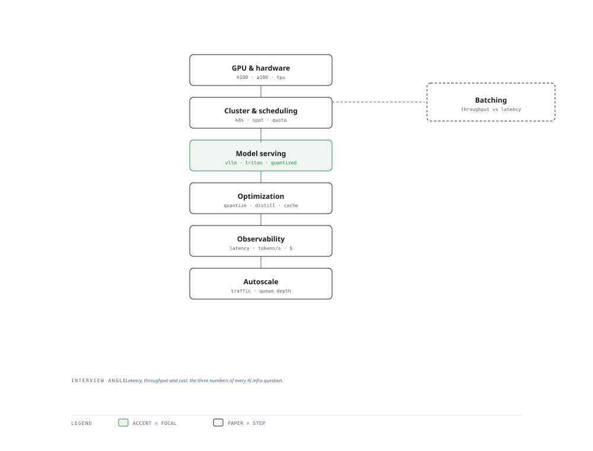

# Visual Notes — Keeping Inference Fast and Cheap

> One diagram, the full picture. This page is meant to be glanced at before reading the chapters, and again before interviews.

# What the diagram shows

1. **Hardware** — GPUs, memory bandwidth and interconnect set the ceiling for throughput.
1. **Serving** — Scheduling and batching parallelise requests onto the hardware.
1. **Optimize** — Pruning, distillation, KV-cache and speculative decoding cut cost and latency.

# Why this matters for placement

- Inference efficiency is real money at scale — infrastructure questions reward this depth.
- Naming one optimisation with its trade-off (e.g. KV-cache memory vs latency) is a strong signal.

# Quick revision

- GPU memory is the scarce resource: weights + KV-cache + activations compete for it.
- Batching and continuous batching maximise GPU utilisation.
- KV-cache avoids recomputing past token states — memory heavy, latency win.
- Pruning (drop weights) and distillation (small teaches big) shrink models.
- Speculative decoding drafts tokens with a small model, verifies with the big one.

# Related chapters

- [GPU architecture](01-gpu-architecture.md)
- [Inference serving](04-inference-serving.md)
- [Attention KV cache](08-attention-kv-cache.md)
- [Speculative decoding](09-speculative-decoding.md)

---

**One-line answer for interviews:** *"Hardware, scheduling, serving and optimization work together to keep inference fast and cheap."*
