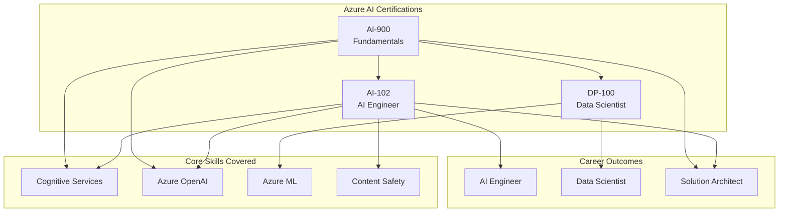
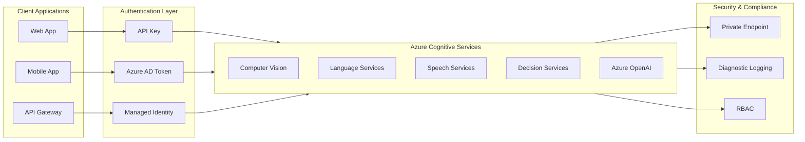
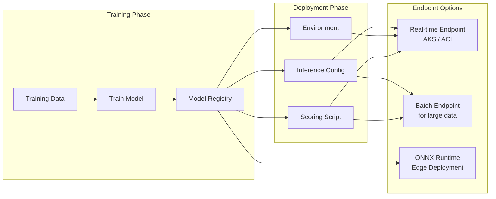
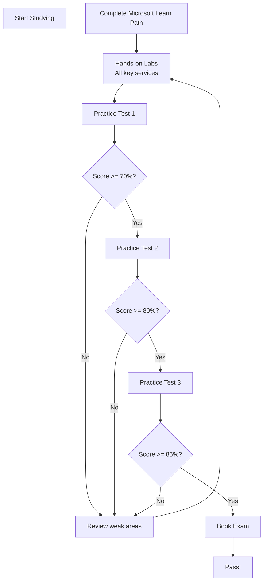

<!-- Clear Language: Keep sentences under 50 words -->
# Microsoft Azure AI Certifications

## Learning Objectives

| LO | Description |
|----|-------------|
| LO1 | Explain the AI-102 (Azure AI Engineer Associate) exam blueprint and key services |
| LO2 | Summarize the AI-900 (Azure AI Fundamentals) exam scope and core AI concepts |
| LO3 | Describe DP-100 (Azure Data Scientist) exam topics and Azure ML workflows |
| LO4 | Design a study strategy combining learning paths, labs, and practice tests |
| LO5 | Choose the right certification path based on role, stack certs, and renewal needs |

## Introduction

Microsoft Azure offers three AI certifications for different roles. AI-900 is the fundamentals exam. AI-102 is for AI engineers building solutions. DP-100 is for data scientists training and deploying models.

Azure AI services include Cognitive Services, Azure OpenAI Service, Machine Learning, and Content Safety. Each certification validates specific skills across these services.

Companies like Accenture, TCS, Infosys, and Microsoft partner firms value these certs for AI roles. An Azure certification can differentiate you in interviews and raise your salary bracket.

This chapter covers all three exams in depth. You will learn the exam blueprint, key services, study resources, and a certification roadmap.

## Prerequisites

| Area | Required Knowledge | Source Module |
|------|-------------------|---------------|
| Cloud Basics | Azure portal, resource groups, subscriptions | Module 06 |
| ML Fundamentals | Supervised/unsupervised learning, evaluation metrics | Module 09 |
| Python | SDK usage, REST APIs, JSON handling | Module 03 |
| Docker | Container deployment for model hosting | Module 06 |
| REST APIs | HTTP methods, authentication, endpoints | Module 05 |

## Key Terminology

| Term | Definition |
|------|------------|
| Cognitive Services | Pre-built AI APIs for vision, speech, language, decision |
| Azure OpenAI Service | Enterprise-grade OpenAI models (GPT-4, DALL-E, Whisper) |
| Azure ML Workspace | Central hub for managing ML experiments and models |
| Content Safety | AI service to detect harmful content in text/images |
| LUIS | Language Understanding service (deprecated, now CLU) |
| Custom Vision | Image classification and object detection service |
| Form Recognizer | Document intelligence service (now Azure AI Document Intelligence) |
| Endpoint | HTTP URL where a deployed model receives requests |
| Compute Cluster | Scalable VM cluster for training ML models |
| Inference | Process of running a trained model on new data |

## Theory

Microsoft Azure AI certifications validate your ability to build, deploy, and maintain AI solutions on Azure. This section dives into each certification exam, covering exam structure, key topics, services, and sample scenarios.

## Chapter at a Glance

| Section | Topic | Key Concept |
|---------|-------|-------------|
| 1.1 | AI-900 Fundamentals | Azure AI-900 exam overview, ML concepts, computer vision, NLP, generative AI |
| 1.2 | AI-102 Engineer | Azure AI-102 blueprint, cognitive services, Azure OpenAI, content safety |
| 1.3 | DP-100 Data Scientist | Azure ML, pipeline design, model training, deployment |
| 1.4 | Study Strategy | Learning paths, hands-on labs, practice tests, exam tips |
| 1.5 | Certification Path | Role-based certs, stacking, renewal requirements |

## Chapter Roadmap



## 1.1 AI-900: Azure AI Fundamentals

**Exam Code**: AI-900  
**Target Audience**: Anyone starting with Azure AI  
**Difficulty**: Beginner  
**Exam Duration**: 60 minutes  
**Questions**: 40-60  
**Pass Score**: 700/1000  
**Cost**: $99 USD  
**Validity**: 1 year (no renewal needed — fundamentals certs do not expire)

### 1.1.1 Exam Blueprint

The AI-900 exam measures four domains:

| Domain | Weight | Key Topics |
|--------|--------|------------|
| Describe AI workloads and considerations | 15-20% | AI principles, fairness, reliability, privacy, governance |
| Describe fundamental ML principles | 30-35% | Supervised vs unsupervised, regression, classification, clustering |
| Describe computer vision workloads | 15-20% | Image classification, object detection, OCR, face detection |
| Describe NLP workloads | 15-20% | Text analysis, translation, speech recognition, sentiment |
| Describe generative AI workloads | 10-15% | LLMs, prompt engineering, Azure OpenAI, DALL-E |

### 1.1.2 Core ML Concepts

Azure AI-900 tests foundational ML knowledge. Key concepts include:

**Supervised Learning**: The model learns from labeled data. Input-output pairs guide training. Example: predicting house price from size, bedrooms, location.

**Unsupervised Learning**: The model finds patterns in unlabeled data. Example: grouping customers by purchase behavior.

**Regression**: Predicts a numeric value. Metrics: Mean Squared Error (MSE), R-squared.

**Classification**: Predicts a category. Metrics: Accuracy, Precision, Recall, F1-Score.

**Clustering**: Groups similar data points. Example: K-Means clustering for customer segments.

```python
# Simple demonstration of ML concepts tested in AI-900
# This is NOT required to memorize, but shows the concepts

from sklearn.linear_model import LinearRegression
from sklearn.metrics import mean_squared_error, r2_score
import numpy as np

# Sample data: house size (sqft) vs price
X = np.array([[800], [1000], [1200], [1500], [1800], [2000]])
y = np.array([150000, 190000, 230000, 280000, 340000, 380000])

# Train a regression model
model = LinearRegression()
model.fit(X, y)

# Predict
new_house = np.array([[1600]])
predicted_price = model.predict(new_house)
print(f"Predicted price for 1600 sqft: ${predicted_price[0]:,.2f}")

# Evaluate
y_pred = model.predict(X)
mse = mean_squared_error(y, y_pred)
r2 = r2_score(y, y_pred)
print(f"MSE: {mse:.2f}")
print(f"R-squared: {r2:.2f}")

# Interpretation
# R-squared near 1.0 means the model fits the data well
# Azure ML services automate this entire workflow
```

### 1.1.3 Computer Vision on Azure

Azure Cognitive Services for vision include:

- **Computer Vision API**: Image analysis, OCR, description generation
- **Custom Vision**: Train custom image classifiers with your own images
- **Face API**: Face detection, recognition, verification
- **Form Recognizer**: Extract text from documents (invoices, receipts)

Example Azure SDK call for image analysis:

```python
# AI-900: Using Azure Computer Vision
# Install: pip install azure-cognitiveservices-vision-computervision

from azure.cognitiveservices.vision.computervision import ComputerVisionClient
from azure.cognitiveservices.vision.computervision.models import VisualFeatureTypes
from msrest.authentication import CognitiveServicesCredentials

# Replace with your own key and endpoint
key = "your-key-here"
endpoint = "https://your-region.api.cognitive.microsoft.com/"

client = ComputerVisionClient(
    endpoint, CognitiveServicesCredentials(key)
)

image_url = "https://example.com/photo.jpg"
features = [
    VisualFeatureTypes.description,
    VisualFeatureTypes.tags,
    VisualFeatureTypes.objects,
    VisualFeatureTypes.faces
]

result = client.analyze_image(image_url, visual_features=features)

# Extract description
caption = result.description.captions[0].text
confidence = result.description.captions[0].confidence
print(f"Description: {caption} (confidence: {confidence:.2%})")

# Extract tags
for tag in result.tags:
    print(f"{tag.name}: {tag.confidence:.2%}")

# The AI-900 exam expects you to know what each service does
# NOT how to write the code — but understanding helps
```

### 1.1.4 NLP Services on Azure

Natural Language Processing services include:

- **Text Analytics**: Sentiment analysis, key phrase extraction, entity recognition
- **Language Understanding (CLU)**: Conversational language understanding
- **Translator**: Text translation across 100+ languages
- **Speech**: Speech-to-text, text-to-speech, speech translation

```python
# AI-900: Azure Text Analytics for sentiment analysis
# Install: pip install azure-ai-textanalytics

from azure.ai.textanalytics import TextAnalyticsClient
from azure.core.credentials import AzureKeyCredential

key = "your-key-here"
endpoint = "https://your-region.cognitiveservices.azure.com/"

client = TextAnalyticsClient(
    endpoint, AzureKeyCredential(key)
)

documents = [
    "I love this product! It works perfectly.",
    "The service was terrible and slow.",
    "The weather is okay, not great but not bad."
]

result = client.analyze_sentiment(documents)

for doc in result:
    if not doc.is_error:
        print(f"Text: {doc.sentences[0].text[:50]}...")
        print(f"Sentiment: {doc.sentiment}")
        print(f"Confidence: Positive={doc.confidence_scores.positive:.2f}, "
              f"Neutral={doc.confidence_scores.neutral:.2f}, "
              f"Negative={doc.confidence_scores.negative:.2f}")
        print("---")
```

### 1.1.5 Generative AI on Azure

Azure OpenAI Service brings GPT-4, GPT-3.5, DALL-E 3, Whisper, and Embeddings to Azure. Key exam topics:

- **Prompt Engineering**: Crafting effective prompts for desired outputs
- **Content Filtering**: Azure content safety filters for responsible AI
- **Model Deployment**: Deploying OpenAI models as serverless endpoints
- **Token Management**: Understanding token limits and pricing

```python
# AI-900: Azure OpenAI Service (conceptual)
# Install: pip install openai

import openai

openai.api_type = "azure"
openai.api_base = "https://your-resource.openai.azure.com/"
openai.api_version = "2024-02-01"
openai.api_key = "your-key-here"

response = openai.ChatCompletion.create(
    engine="gpt-4",  # Your deployment name
    messages=[
        {"role": "system", "content": "You are a helpful assistant."},
        {"role": "user", "content": "Explain Azure AI-900 in 3 sentences."}
    ],
    temperature=0.7,
    max_tokens=150
)

print(response.choices[0].message.content)
```

## 1.2 AI-102: Azure AI Engineer Associate

**Exam Code**: AI-102  
**Target Audience**: AI engineers building solutions  
**Difficulty**: Intermediate  
**Exam Duration**: 120 minutes  
**Questions**: 40-60  
**Pass Score**: 700/1000  
**Cost**: $165 USD  
**Validity**: 1 year (renewable annually)

### 1.2.1 Exam Blueprint

The AI-102 exam measures four domains:

| Domain | Weight | Key Topics |
|--------|--------|------------|
| Plan and manage an Azure AI solution | 15-20% | Resource provisioning, security, monitoring, cost |
| Implement content moderation | 15-20% | Content Safety API, text/image moderation, incident response |
| Build computer vision solutions | 20-25% | Image analysis, object detection, OCR, face, custom vision |
| Build NLP solutions | 20-25% | Text analysis, question answering, conversational AI, translation |
| Implement knowledge mining and generative AI | 15-20% | Azure Cognitive Search, Azure OpenAI, RAG patterns |

### 1.2.2 Cognitive Services Architecture

Azure Cognitive Services form the backbone of AI-102. Understanding how to provision, secure, and consume these services is critical.



### 1.2.3 Azure Content Safety

Content Safety is a critical service in AI-102. It detects harmful content in text and images.

**Moderation Categories**:
- **Hate**: Content expressing hate or violence
- **Sexual**: Sexually explicit or suggestive content
- **Self-harm**: Content promoting self-harm
- **Violence**: Violent or threatening content

```python
# AI-102: Azure Content Safety API
# Install: pip install azure-ai-contentsafety

from azure.ai.contentsafety import ContentSafetyClient
from azure.ai.contentsafety.models import TextCategory, AnalyzeTextOptions
from azure.core.credentials import AzureKeyCredential

key = "your-key-here"
endpoint = "https://your-region.cognitiveservices.azure.com/"

client = ContentSafetyClient(
    endpoint, AzureKeyCredential(key)
)

request = AnalyzeTextOptions(
    text="I want to harm someone.",
    categories=[
        TextCategory.HATE,
        TextCategory.SELF_HARM,
        TextCategory.VIOLENCE,
        TextCategory.SEXUAL
    ]
)

response = client.analyze_text(request)

if response.hate_result:
    severity = response.hate_result.severity
    print(f"Hate severity: {severity}/6")
if response.self_harm_result:
    severity = response.self_harm_result.severity
    print(f"Self-harm severity: {severity}/6")
if response.violence_result:
    severity = response.violence_result.severity
    print(f"Violence severity: {severity}/6")
if response.sexual_result:
    severity = response.sexual_result.severity
    print(f"Sexual severity: {severity}/6")

print("Severity 0=Safe, 6=Most severe. Acceptable threshold varies by use case.")
```

### 1.2.4 Azure OpenAI with RAG Pattern

AI-102 covers retrieval-augmented generation (RAG) using Azure Cognitive Search and Azure OpenAI. This pattern grounds LLM responses in your own data.

```python
# AI-102: RAG pattern with Azure Cognitive Search + Azure OpenAI
# Install: pip install azure-search-documents openai

import openai
from azure.search.documents import SearchClient
from azure.core.credentials import AzureKeyCredential

# Azure Cognitive Search setup
search_endpoint = "https://your-search.search.windows.net"
search_key = "your-search-key"
index_name = "knowledge-index"

search_client = SearchClient(
    endpoint=search_endpoint,
    index_name=index_name,
    credential=AzureKeyCredential(search_key)
)

# Azure OpenAI setup
openai.api_type = "azure"
openai.api_base = "https://your-openai.openai.azure.com/"
openai.api_version = "2024-02-01"
openai.api_key = "your-openai-key"

def rag_query(user_question: str) -> str:
    """Retrieve relevant documents and generate an answer."""
    # Step 1: Retrieve relevant documents
    search_results = search_client.search(
        query_text=user_question,
        top=3,
        select=["title", "content"]
    )

    context_chunks = []
    for result in search_results:
        context_chunks.append(
            f"[Source: {result['title']}]\n{result['content']}"
        )
    context = "\n\n".join(context_chunks)

    # Step 2: Generate answer with context
    system_prompt = (
        "Answer based only on the provided context. "
        "If the context doesn't contain the answer, say so."
    )

    response = openai.ChatCompletion.create(
        engine="gpt-4",
        messages=[
            {"role": "system", "content": system_prompt},
            {"role": "user", "content": f"""
Context:
{context}

Question: {user_question}

Answer:"""
            }
        ],
        temperature=0.3,
        max_tokens=300
    )

    return response.choices[0].message.content

# Example usage
answer = rag_query("What are the key features of Azure AI-102?")
print(answer)

# The RAG pattern is heavily tested in AI-102 case studies
```

### 1.2.5 Responsible AI in Practice

AI-102 emphasizes responsible AI implementation:

```mermaid
flowchart TD
    FAIR[Fairness<br/>Are outcomes biased?]
    REL[Reliability<br/>Does it work consistently?]
    PRIV[Privacy<br/>Is user data protected?]
    INCL[Inclusiveness<br/>Does it serve all users?]
    TRANS[Transparency<br/>Can decisions be explained?]
    ACCT[Accountability<br/>Who is responsible?]

    FAIR --> MIT1[Train with diverse data]
    FAIR --> MIT2[Test across demographic groups]

    REL --> MIT3[Monitor drift]
    REL --> MIT4[Retrain regularly]

    PRIV --> MIT5[Data encryption]
    PRIV --> MIT6[Access controls]

    INCL --> MIT7[Accessibility features]
    INCL --> MIT8[Multi-language support]

    TRANS --> MIT9[Model cards]
    TRANS --> MIT10[Explainability tools]

    ACCT --> MIT11[Audit trails]
    ACCT --> MIT12[Incident response plan]

    style FAIR fill:#4A90D9,color:#fff
    style REL fill:#7B68EE,color:#fff
    style PRIV fill:#2E8B57,color:#fff
    style INCL fill:#D2691E,color:#fff
    style TRANS fill:#8B0000,color:#fff
    style ACCT fill:#4B0082,color:#fff
```



## 1.3 DP-100: Azure Data Scientist Associate

**Exam Code**: DP-100  
**Target Audience**: Data scientists using Azure ML  
**Difficulty**: Advanced  
**Exam Duration**: 120 minutes  
**Questions**: 40-60  
**Pass Score**: 700/1000  
**Cost**: $165 USD  
**Validity**: 1 year (renewable annually)

### 1.3.1 Exam Blueprint

| Domain | Weight | Key Topics |
|--------|--------|------------|
| Design and prepare ML solutions | 20-25% | Data ingestion, data transformation, feature engineering |
| Train models | 25-30% | Automated ML, hyperparameter tuning, compute targets |
| Deploy and manage models | 20-25% | Real-time endpoints, batch inference, model registry |
| Orchestrate ML pipelines | 15-20% | Azure ML pipelines, data drift monitoring, retraining |

### 1.3.2 Azure ML Workspace Setup

The Azure ML workspace is the central hub. Everything starts here.

```python
# DP-100: Connect to Azure ML workspace
# Install: pip install azure-ai-ml

from azure.ai.ml import MLClient
from azure.identity import DefaultAzureCredential

# Authenticate and connect
subscription_id = "your-subscription-id"
resource_group = "your-resource-group"
workspace_name = "your-workspace"

ml_client = MLClient(
    credential=DefaultAzureCredential(),
    subscription_id=subscription_id,
    resource_group_name=resource_group,
    workspace_name=workspace_name
)

# Verify connection
workspace = ml_client.workspaces.get(workspace_name)
print(f"Connected to workspace: {workspace.name}")
print(f"Location: {workspace.location}")
print(f"Storage: {workspace.storage_account}")
```

### 1.3.3 Automated ML (AutoML)

AutoML automates model selection and hyperparameter tuning. It is a key DP-100 topic.

```python
# DP-100: Automated Machine Learning
from azure.ai.ml import automl
from azure.ai.ml.entities import AutoMLJob

# Create AutoML classification job
classification_job = automl.classification(
    task="classification",
    training_data=ml_client.data.get("training-data"),
    target_column_name="churn",
    primary_metric="accuracy",
    compute="cpu-cluster",
    experiment_name="customer-churn-automl",
    n_cross_validations=5,
    max_trials=10,
    timeout_minutes=60
)

# Submit the job
returned_job = ml_client.jobs.create_or_update(classification_job)
print(f"AutoML job submitted: {returned_job.name}")

# Get the best model
best_model = returned_job.outputs.best_model
print(f"Best model: {best_model}")

# DP-100 expects you to know AutoML configuration parameters
# and how to interpret the results dashboard
```

### 1.3.4 Hyperparameter Tuning

Hyperparameter tuning finds the optimal model configuration.

```python
# DP-100: Hyperparameter tuning with HyperDrive
from azure.ai.ml import command
from azure.ai.ml.sweep import Choice, Uniform, BanditPolicy

# Define the training script command
job = command(
    code="./src",
    command="python train.py --data ${{inputs.data}} --lr ${{search_space.lr}} --batch-size ${{search_space.batch_size}}",
    inputs={
        "data": ml_client.data.get("training-data")
    },
    environment="sklearn-env:1",
    compute="gpu-cluster",
    experiment_name="hyperparameter-tuning",
)

# Configure sweep
sweep_job = job.sweep(
    sampling_algorithm="random",
    search_space={
        "lr": Uniform(min_value=0.0001, max_value=0.1),
        "batch_size": Choice([16, 32, 64, 128])
    },
    primary_metric="accuracy",
    goal="maximize",
    max_total_trials=20,
    max_concurrent_trials=4,
)

# Early termination policy
sweep_job.early_termination = BanditPolicy(
    slack_factor=0.15,
    evaluation_interval=2,
    delay_evaluation=5
)

# Submit
returned_sweep = ml_client.jobs.create_or_update(sweep_job)
print(f"HyperDrive job submitted: {returned_sweep.name}")

# BanditPolicy stops poorly performing runs early
# This saves compute costs — a key DP-100 scenario
```

### 1.3.5 Model Deployment



```python
# DP-100: Deploy model to real-time endpoint
from azure.ai.ml.entities import (
    ManagedOnlineEndpoint,
    ManagedOnlineDeployment,
    Model,
    CodeConfiguration,
    Environment
)

# Create endpoint
endpoint = ManagedOnlineEndpoint(
    name="customer-churn-endpoint",
    description="Customer churn prediction endpoint",
    auth_mode="key"
)

ml_client.online_endpoints.begin_create_or_update(endpoint).wait()

# Create deployment
deployment = ManagedOnlineDeployment(
    name="blue",
    endpoint_name=endpoint.name,
    model=Model(path="./model.pkl", type="custom_model"),
    code_configuration=CodeConfiguration(
        code="./deployment",
        scoring_script="score.py"
    ),
    environment=Environment(
        image="mcr.microsoft.com/azureml/sklearn-1.0:latest"
    ),
    instance_type="Standard_DS3_v2",
    instance_count=1,
    environment_variables={
        "MODEL_PATH": "model.pkl"
    }
)

ml_client.online_deployments.begin_create_or_update(deployment).wait()

# Set traffic to 100% for this deployment
endpoint.traffic = {"blue": 100}
ml_client.online_endpoints.begin_create_or_update(endpoint).wait()

print(f"Endpoint URL: {endpoint.scoring_uri}")

# DP-100 exam tests endpoint types, deployment slots,
# traffic routing, and AKS vs ACI trade-offs
```

### 1.3.6 ML Pipeline Orchestration

Azure ML Pipelines automate the ML lifecycle. Each step runs on its own compute.

```python
# DP-100: Create and run an ML pipeline
from azure.ai.ml import dsl, Input
from azure.ai.ml.entities import PipelineJob

@dsl.pipeline(
    name="churn-pipeline",
    description="End-to-end churn model pipeline",
    default_compute="cpu-cluster"
)
def churn_pipeline(data_path: Input):
    """Full ML pipeline: prep -> train -> evaluate -> register."""

    # Step 1: Data preparation
    prep_step = command(
        code="./src",
        command="python prep.py --data ${{inputs.data}} --output ${{outputs.clean_data}}",
        inputs={"data": data_path},
        outputs={"clean_data": Output(type="uri_folder")},
        environment="sklearn-env:1"
    )

    # Step 2: Model training
    train_step = command(
        code="./src",
        command="python train.py --data ${{inputs.data}} --model ${{outputs.model}}",
        inputs={"data": prep_step.outputs.clean_data},
        outputs={"model": Output(type="uri_folder")},
        environment="sklearn-env:1",
        compute="gpu-cluster"
    )

    # Step 3: Model evaluation
    eval_step = command(
        code="./src",
        command="python evaluate.py --data ${{inputs.data}} --model ${{inputs.model}} --metrics ${{outputs.metrics}}",
        inputs={
            "data": prep_step.outputs.clean_data,
            "model": train_step.outputs.model
        },
        outputs={"metrics": Output(type="uri_folder")},
        environment="sklearn-env:1"
    )

    return {"model": train_step.outputs.model, "metrics": eval_step.outputs.metrics}

# Create pipeline job
pipeline_job = churn_pipeline(
    data_path=Input(path="azureml://datastores/workspaceblobstore/paths/churn-data")
)

# Submit
submitted_job = ml_client.jobs.create_or_update(
    pipeline_job, experiment_name="churn-pipeline-v1"
)
print(f"Pipeline submitted: https://ml.azure.com/runs/{submitted_job.name}")

# DP-100 expects you to design pipelines with proper
# data dependencies and compute allocation
```

## 1.4 Study Strategy

### 1.4.1 Learning Paths

Microsoft Learn provides free, structured learning paths for each exam:

| Exam | Learning Path | Hours |
|------|---------------|-------|
| AI-900 | "Azure AI Fundamentals" on Microsoft Learn | 8-10 hours |
| AI-102 | "Azure AI Engineer" learning path | 20-25 hours |
| DP-100 | "Azure Data Scientist" learning path | 25-30 hours |

Each learning path includes interactive modules, sandbox environments, and knowledge checks. Complete these before touching practice tests.

### 1.4.2 Hands-On Labs

Theory alone will not pass these exams. You need hands-on experience.

```python
# Recommended lab exercises for each exam

EXAM_LABS = {
    "AI-900": [
        "Create a Cognitive Services resource",
        "Analyze images with Computer Vision",
        "Analyze text with Language Service",
        "Create a QnA Maker knowledge base (now Custom Q&A)",
        "Deploy an Azure OpenAI model",
        "Use Content Safety Studio"
    ],
    "AI-102": [
        "Provision and secure Cognitive Services",
        "Build a custom vision classifier",
        "Create a conversational LUIS app",
        "Implement Content Safety moderation",
        "Build a RAG solution with Cognitive Search + OpenAI",
        "Monitor with Diagnostic Logging",
        "Create a FAQ chatbot with QnA Maker"
    ],
    "DP-100": [
        "Create and configure an ML workspace",
        "Run AutoML experiment for classification",
        "Create a HyperDrive sweep job",
        "Register and version models",
        "Deploy a real-time endpoint",
        "Create an ML pipeline with 3+ steps",
        "Set up data drift monitoring"
    ]
}

for exam, labs in EXAM_LABS.items():
    print(f"\n{exam} Recommended Labs:")
    for i, lab in enumerate(labs, 1):
        print(f"  {i}. {lab}")
    print(f"  Total: {len(labs)} labs")
```

Azure provides free sandbox environments for most services. Use the Azure portal, Azure CLI, and SDK examples to practice.

### 1.4.3 Practice Tests

Practice tests are essential for exam success. Use these resources:

| Resource | Price | Question Quality | Closest to Exam |
|----------|-------|-----------------|-----------------|
| Microsoft Learn Assessment | Free | Good | Yes |
| MeasureUp (official partner) | $99 | Excellent | Yes |
| TutorialsDojo | $15-20 | Very Good | Close |
| Whizlabs | $12-15 | Good | Moderate |
| GitHub community question banks | Free | Variable | Variable |

Take at least 3 full-length practice tests before the real exam. Score 85%+ consistently before booking.

### 1.4.4 Exam Day Tips

1. **Read questions twice**: Azure exam questions are scenario-based. Understand the scenario before answering.
2. **Eliminate wrong answers**: Many questions have two clearly wrong answers. Focus on the remaining two.
3. **Watch the clock**: AI-900 gives ~1-1.5 min per question. AI-102 and DP-100 give ~2-3 min per question.
4. **Case study strategy**: AI-102 includes case studies with 5-7 questions each. Read the case study first, then answer.
5. **Mark and review**: If unsure, mark the question and return. Fresh perspective helps.
6. **No negative marking**: Guessing is better than leaving blanks.



## 1.5 Certification Path

### 1.5.1 Which Cert for Which Role

Choose your certification based on your career goal:

```mermaid
flowchart TD
    START[Your Role] --> Q{What do you build?}

    Q -->|AI Solutions| ENG[AI Engineer]
    ENG --> AI102[AI-102: Azure AI Engineer Associate]
    AI102 --> AI100[Optional: AI-100? Retired]

    Q -->|ML Models| DS[Data Scientist]
    DS --> DP100[DP-100: Azure Data Scientist]
    DP100 --> MLENG[Professional ML Engineer<br/>(future cert)]

    Q -->|Just Starting| FUND[Anyone]
    FUND --> AI900[AI-900: Azure AI Fundamentals]
    AI900 --> ENG
    AI900 --> DS

    Q -->|Architecture| ARCH[Solution Architect]
    ARCH --> AZ305[AZ-305: Azure Solutions Architect]
    AZ305 --> AI102

    style AI900 fill:#FFD700,color:#000
    style AI102 fill:#4A90D9,color:#fff
    style DP100 fill:#7B68EE,color:#fff
```

### 1.5.2 Certification Stacking

You can stack Azure AI certifications for maximum impact:

**Entry Path (no experience)**:
1. AI-900 (Fundamentals)
2. Choose: AI-102 (Engineer) OR DP-100 (Data Scientist)

**Engineer Path**:
1. AI-900 → AI-102 → AZ-305 (Solutions Architect)
2. Or: AI-900 → AI-102 → DP-100 (full stack AI)

**Data Science Path**:
1. AI-900 → DP-100 → AI-102 (full stack)
2. Or: DP-100 → DP-203 (Azure Data Engineer)

**Management Path**:
1. AI-900 → AI-102 → PL-300 (Power BI) → DP-600 (Fabric)

### 1.5.3 Renewal Requirements

Microsoft certifications now require annual renewal (except fundamentals):

| Exam | Renewal | Cost | Process |
|------|---------|------|---------|
| AI-900 | None (does not expire) | Free | Not needed |
| AI-102 | Annual | Free | Pass online renewal assessment (~30 min) |
| DP-100 | Annual | Free | Pass online renewal assessment (~30 min) |

Renewal assessments are free, online, and open-book. Microsoft releases renewal challenges when exam content updates. You get 6 months after the update to renew.

**Renewal Tips**:
- Turn on Microsoft certification reminders
- Check your certification dashboard quarterly
- Renew early — do not wait until expiry
- The renewal assessment covers new features added since your certification

### 1.5.4 Cost Optimization Strategy

| Item | Cost | Notes |
|------|------|-------|
| AI-900 exam | $99 | Best ROI for beginners |
| AI-102 exam | $165 | Engineer-level investment |
| DP-100 exam | $165 | Data science track |
| MeasureUp practice test | $99 | Per exam |
| Microsoft Learn | Free | Complete courses |
| Azure free account | Free | $200 credit, 12 months |
| Azure sandbox | Free | In Microsoft Learn |

**Savings Tip**: Microsoft often offers exam discounts during Ignite and Build conferences. Also check if your employer has a Microsoft Enterprise Agreement that includes exam vouchers.

## Summary

Microsoft Azure offers three AI certifications targeting different roles. AI-900 is the fundamentals exam covering ML concepts, computer vision, NLP, and generative AI basics. AI-102 targets AI engineers who build solutions with Cognitive Services, Azure OpenAI, and Content Safety. DP-100 targets data scientists who train and deploy models using Azure ML.

The certifications stack together. AI-900 is the entry point. From there, choose AI-102 for engineering roles or DP-100 for data science roles. Annual renewal is free and online for associate-level certs.

Study effectively by combining Microsoft Learn paths, hands-on labs, and practice tests. Target 85%+ on practice tests before booking the real exam.

## Practical Takeaways

1. Start with AI-900 if you are new to Azure AI — it builds vocabulary and mental models
2. Choose AI-102 if you want to build production AI applications with Cognitive Services and Azure OpenAI
3. Choose DP-100 if you focus on ML model training, deployment, and MLOps on Azure
4. Spend 60% of study time on hands-on labs — exams are scenario-based
5. Take at least 3 practice tests and score 85%+ before booking
6. Renew associate certs annually — the free online assessment takes 30 minutes
7. Stack certs strategically: AI-900 → AI-102 → AZ-305 for architect roles

## Interview Q&A

<details class="tp-qa-card" data-qid="m28-s01-q1">
  <summary class="tp-qa-question">
    <span class="tp-qa-status"></span>
    Q1: Compare AI-900, AI-102, and DP-100 — which path should an aspiring Azure AI engineer take?
  </summary>
  <div class="tp-qa-answer">
    <p>AI-900 (Azure AI Fundamentals) is a 60-minute, $99 beginner exam with 40-60 questions covering ML concepts, computer vision, NLP, and generative AI; it never expires and builds vocabulary. AI-102 (Azure AI Engineer Associate) is a 120-minute, $165 exam on Cognitive Services, Azure OpenAI, Content Safety, and RAG — the right target for engineers building AI solutions. DP-100 (Azure Data Scientist Associate) is also 120 minutes and $165, but covers Azure ML, AutoML, HyperDrive, pipelines, and deployment. A typical engineer path: AI-900 first, then AI-102, optionally adding DP-100 for full-stack ML capability.</p>
    <pre><code class="language-bash"># Entry -&gt; AI Engineer path
AI-900 (fundamentals, never expires) -&gt; AI-102 (AI Engineer)
AI-900 -&gt; DP-100 (Data Scientist)   # alternative branch
AI-102 + DP-100                     # full-stack AI</code></pre>
    <p><strong>Interview follow-up</strong>: How do the renewal requirements differ between AI-900 and AI-102?</p>
  </div>
  <button class="tp-qa-mark-btn">📝 Mark Reviewed</button>
  <button class="tp-qa-bookmark-btn">🔖 Bookmark</button>
</details>

<details class="tp-qa-card" data-qid="m28-s01-q2">
  <summary class="tp-qa-question">
    <span class="tp-qa-status"></span>
    Q2: What is the RAG pattern in AI-102, and how do Azure Cognitive Search and Azure OpenAI combine?
  </summary>
  <div class="tp-qa-answer">
    <p>RAG (Retrieval-Augmented Generation) grounds LLM responses in your own data to reduce hallucinations and keep answers in-domain. Azure Cognitive Search indexes the documents; at query time you retrieve the top chunks (for example <code>top=3</code>), package them with the user question, and instruct Azure OpenAI to answer only from that context at a low temperature like 0.3. The system prompt enforces the boundary: "Answer based only on the provided context. If the context doesn't contain the answer, say so." This pattern is heavily tested in AI-102 case studies.</p>
    <pre><code class="language-python">search_results = search_client.search(query_text=question, top=3, select=["title", "content"])
context = "\n\n".join(f"[Source: {r['title']}]\n{r['content']}" for r in search_results)
response = openai.ChatCompletion.create(engine="gpt-4", temperature=0.3, messages=[...])</code></pre>
    <p><strong>Interview follow-up</strong>: How would you evaluate the quality of a RAG system end to end?</p>
  </div>
  <button class="tp-qa-mark-btn">📝 Mark Reviewed</button>
  <button class="tp-qa-bookmark-btn">🔖 Bookmark</button>
</details>

<details class="tp-qa-card" data-qid="m28-s01-q3">
  <summary class="tp-qa-question">
    <span class="tp-qa-status"></span>
    Q3: How do AutoML and HyperDrive work in DP-100, and what does BanditPolicy do?
  </summary>
  <div class="tp-qa-answer">
    <p>AutoML automates model selection, feature engineering, and hyperparameter tuning — a classification job with 5-fold cross-validation and a target metric like accuracy runs up to <code>max_trials</code> trials and returns a best model you can register. HyperDrive (<code>job.sweep</code>) sweeps a defined search space — <code>Uniform</code> for learning rate, <code>Choice</code> for batch size — with a sampling algorithm and a primary metric to optimize. BanditPolicy is the early-termination policy: it stops runs whose metric falls more than <code>slack_factor</code> (0.15) behind the best so far, checked every <code>evaluation_interval</code> after a <code>delay_evaluation</code> warm-up, saving compute on doomed trials.</p>
    <pre><code class="language-python">sweep_job.early_termination = BanditPolicy(slack_factor=0.15,
    evaluation_interval=2, delay_evaluation=5)</code></pre>
    <p><strong>Interview follow-up</strong>: When would you choose random sampling over Bayesian or grid sampling?</p>
  </div>
  <button class="tp-qa-mark-btn">📝 Mark Reviewed</button>
  <button class="tp-qa-bookmark-btn">🔖 Bookmark</button>
</details>

<details class="tp-qa-card" data-qid="m28-s01-q4">
  <summary class="tp-qa-question">
    <span class="tp-qa-status"></span>
    Q4: How does Azure Content Safety moderate harmful content, and how should you act on severity scores?
  </summary>
  <div class="tp-qa-answer">
    <p>Content Safety analyzes text and images across four categories — Hate, Sexual, Self-harm, and Violence — and returns a severity score from 0 (safe) to 6 (most severe) per category. The application defines the action policy: block content above your threshold, flag borderline cases for human review, or log incidents. A severity-6 self-harm result, for example, may warrant immediate escalation and a support contact flow. AI-102 tests both using the API correctly and designing moderation incident response around it.</p>
    <pre><code class="language-python">response = client.analyze_text(request)
if response.self_harm_result and response.self_harm_result.severity &gt;= 6:
    escalate(response.self_harm_result.severity)</code></pre>
    <p><strong>Interview follow-up</strong>: How do you tune the moderation threshold without over-blocking legitimate content?</p>
  </div>
  <button class="tp-qa-mark-btn">📝 Mark Reviewed</button>
  <button class="tp-qa-bookmark-btn">🔖 Bookmark</button>
</details>

<details class="tp-qa-card" data-qid="m28-s01-q5">
  <summary class="tp-qa-question">
    <span class="tp-qa-status"></span>
    Q5: What is the difference between real-time and batch endpoints in DP-100, and why use blue/green deployment?
  </summary>
  <div class="tp-qa-answer">
    <p>A real-time endpoint (ManagedOnlineEndpoint) serves online predictions with low latency, typically key-protected, for interactive applications. Batch endpoints process large datasets offline at lower cost but higher latency — right for scheduled scoring. Blue/green deployment runs two deployments (blue live, green candidate), routes traffic with <code>endpoint.traffic = {"blue": 100}</code>, validates the new model, then shifts traffic and enables instant rollback. The classic trade-offs between AKS and ACI (scalability vs cost/cold start) are a frequent DP-100 scenario question.</p>
    <pre><code class="language-python">endpoint.traffic = {"blue": 100}   # green validated -&gt; shift all traffic
ml_client.online_endpoints.begin_create_or_update(endpoint).wait()</code></pre>
    <p><strong>Interview follow-up</strong>: When is batch inference clearly better than real-time inference?</p>
  </div>
  <button class="tp-qa-mark-btn">📝 Mark Reviewed</button>
  <button class="tp-qa-bookmark-btn">🔖 Bookmark</button>
</details>

<details class="tp-qa-card" data-qid="m28-s01-q6">
  <summary class="tp-qa-question">
    <span class="tp-qa-status"></span>
    Q6: Design a study plan to pass AI-102 in six weeks.
  </summary>
  <div class="tp-qa-answer">
    <p>Weeks 1-2: complete the "Azure AI Engineer" Microsoft Learn learning path (20-25 hours) and provision Cognitive Services resources, using the Azure portal, CLI, and SDKs. Weeks 3-4: hands-on labs — custom vision classifier, Content Safety moderation, a RAG solution combining Cognitive Search with OpenAI, and diagnostic logging. Weeks 5-6: take at least 3 full-length practice tests (MeasureUp is Microsoft's official partner; TutorialsDojo is a good budget alternative) until you consistently score 85%+, then book the exam. On exam day: read case studies first, eliminate two wrong answers, and mark-and-review. Renew annually with the free ~30-minute online assessment within six months of a content update.</p>
    <pre><code class="language-python">EXAM_LABS = {
    "AI-102": ["Custom vision classifier", "Content Safety moderation",
               "RAG with Cognitive Search + OpenAI", "Diagnostic logging"]
}
# Study formula: Learn path -&gt; Labs -&gt; 3x practice tests (85%+) -&gt; Exam</code></pre>
    <p><strong>Interview follow-up</strong>: How would you keep Azure costs under control while studying?</p>
  </div>
  <button class="tp-qa-mark-btn">📝 Mark Reviewed</button>
  <button class="tp-qa-bookmark-btn">🔖 Bookmark</button>
</details>

## Chapter Quiz (5 MCQ)

### Questions

1. Which Azure service would you use to detect hate speech and violence in user-generated content?
   - A. Azure Cognitive Search
   - B. Azure Content Safety
   - C. Azure Form Recognizer
   - D. Azure Custom Vision

2. In DP-100, what is the purpose of the BanditPolicy in a HyperDrive sweep job?
   - A. It secures the endpoint with access control
   - B. It terminates poorly performing runs early to save compute
   - C. It deploys the model to a Kubernetes cluster
   - D. It registers the best model in the model registry

3. Which AI-102 domain has the highest weight in the exam blueprint?
   - A. Plan and manage Azure AI solutions
   - B. Implement content moderation
   - C. Build computer vision solutions
   - D. Build NLP solutions

4. What is the RAG pattern used for in AI-102 scenarios?
   - A. Reducing API latency for real-time prediction
   - B. Grounding LLM responses in your own data via retrieval
   - C. Training custom vision models with transfer learning
   - D. Automating ML model selection and tuning

5. How much does AI-900 certification renewal cost annually?
   - A. $99
   - B. $165
   - C. Free
   - D. AI-900 does not require renewal

### Answers

1. **B. Azure Content Safety** — Content Safety is designed to detect hate, violence, self-harm, and sexual content. The other options serve different purposes.
2. **B. It terminates poorly performing runs early to save compute** — BanditPolicy is an early termination policy that stops runs that are not meeting the primary metric threshold, saving time and cost.
3. **D. Build NLP solutions (25-30%)** — While computer vision is also heavily weighted, NLP holds the highest share. Both are weighted 20-25% and 20-25% respectively, with slight variations.
4. **B. Grounding LLM responses in your own data via retrieval** — RAG (Retrieval Augmented Generation) combines Azure Cognitive Search with Azure OpenAI to generate answers based on retrieved documents.
5. **D. AI-900 does not require renewal** — Fundamentals certifications (AI-900, AZ-900, DP-900) never expire. Only associate and expert level certs require annual renewal.

### True/False

**T/F 1**: AI-102 requires annual renewal at no cost.
**Answer**: True — Microsoft associate certifications are free to renew online.

**T/F 2**: DP-100 is easier than AI-900.
**Answer**: False — DP-100 is an advanced certification requiring hands-on Azure ML experience.

**T/F 3**: Azure OpenAI Service is available only through Azure AI-102 and not covered in AI-900.
**Answer**: False — AI-900 also covers generative AI and Azure OpenAI at a fundamental level.

**T/F 4**: The MeasureUp practice test is the official Microsoft partner for exam preparation.
**Answer**: True — MeasureUp is Microsoft's official practice test partner.

**T/F 5**: You can stack AI-102 and DP-100 for full-stack AI capability.
**Answer**: True — Both associate certs complement each other for engineers who work across the ML lifecycle.

### Fill in the Blank

**FIB 1**: The AI-102 exam code is ________.
**Answer**: AI-102 (Azure AI Engineer Associate).

**FIB 2**: DP-100 stands for ________.
**Answer**: Azure Data Scientist Associate.

**FIB 3**: The service that detects harmful content in text and images is called Azure ________.
**Answer**: Content Safety.

### Scenario Questions

**Scenario 1**: Your company wants to build a customer support chatbot that answers questions from internal documentation. The chatbot must use company data only and not generate answers outside that data. Which Azure services would you combine, and what pattern would you use?

**Answer**: Use the RAG (Retrieval Augmented Generation) pattern. Combine Azure Cognitive Search (to index and retrieve documentation) with Azure OpenAI Service (GPT-4 to generate answers). Azure Cognitive Search performs the retrieval step. Azure OpenAI performs the generation step. The system prompt instructs the model to answer only from the retrieved context.

**Scenario 2**: You are a candidate with 6 months of Python experience and basic ML knowledge. You want to become an Azure AI Engineer. Which certification path should you follow, and what study resources would you use?

**Answer**: Start with AI-900 (Fundamentals) to build vocabulary and understanding. Spend 2 weeks on Microsoft Learn path and hands-on labs. Then move to AI-102 (Azure AI Engineer). Spend 4-6 weeks on the AI-102 learning path, labs covering Cognitive Services, Content Safety, and Azure OpenAI. Take MeasureUp practice tests until scoring 85%+. Then book AI-102. Optionally add DP-100 after gaining ML experience.

### Output Questions

**Output 1**: What happens when you call `client.analyze_text()` with content containing hate speech at severity level 6?
**Answer**: The Content Safety API returns a response with `hate_result.severity = 6` and `hate_result.severity_level = "High"`. Your application must handle this based on your content policy — typically blocking the content, flagging for review, or logging the incident. Severity ranges from 0 (safe) to 6 (most severe).

## Exercises

### Exercise 1: AI-900 Service Matching
Create a table matching Azure Cognitive Services to their use cases. Include at least 8 services. For each service, list: service name, category (vision/speech/language/decision), one use case, and the corresponding AI-900 domain.

### Exercise 2: Deploy a Cognitive Services Resource
Using the Azure portal or Azure CLI, provision a Cognitive Services multi-service resource. Note the key and endpoint. Make a test call to the Computer Vision API using the SDK. Document each step with screenshots or command output.

### Exercise 3: AutoML Experiment
Using the Azure ML SDK, create a classification AutoML job using the diabetes dataset from Azure Open Datasets. Configure 5-fold cross-validation, accuracy as the primary metric, and 10 max trials. Submit the job and report the best model and its accuracy.

### Exercise 4: Build a RAG Chatbot
Combine Azure Cognitive Search and Azure OpenAI to build a simple RAG pipeline. Index 3 PDF documents. Write a Python script that accepts a user question, retrieves the top 2 relevant chunks, and generates an answer with GPT-4. Include error handling.

### Exercise 5: Certification Path Plan
Design a 12-week study plan for someone starting from zero experience. Include weekly milestones, which Microsoft Learn modules to complete, which labs to build, and when to take practice tests. Specify the target certification (AI-900 → AI-102 or AI-900 → DP-100).

## Revision Notes

- AI-900: Fundamentals, 60 min, $99, never expires, 40-60 questions
- AI-102: Engineer, 120 min, $165, annual renewal (free), 40-60 questions
- DP-100: Data Scientist, 120 min, $165, annual renewal (free), 40-60 questions
- Key services: Cognitive Services, Azure OpenAI, Content Safety, Azure ML
- RAG = Cognitive Search + Azure OpenAI for grounded responses
- AutoML automates model selection and hyperparameter tuning
- HyperDrive: Sweep job with early termination policy (BanditPolicy)
- Content Safety categories: Hate, Sexual, Violence, Self-harm
- Study formula: Learn path → Hands-on labs → Practice tests (85%+) → Exam
- Stacking: AI-900 → AI-102 → AZ-305 for architect roles

## Placement Section

### Top 10 Interview Questions

#### Google Style

1. **Explain the core idea of Microsoft Azure AI Certifications in under 60 seconds, then give a real-world analogy.** — Structure: definition, how it works in one sentence, why it matters, analogy. Follow-up: what would break if you removed this from a production system?

2. **Design a minimal, well-typed function that demonstrates Microsoft Azure AI Certifications.** — Interviewer checks: signature with type hints, edge cases, complexity, and a clean docstring. Follow-up: how does your design behave with empty or malformed input?

3. **What are the common pitfalls when engineers first learn ** — List 3-4, then explain how you would prevent each in a code review.

#### Amazon Style

4. **Describe a production bug caused by misunderstanding Microsoft Azure AI Certifications. How did you diagnose and fix it?** — STAR format: situation, task, action, result. Mention logs, reproduction, root-cause analysis, and the regression test you added.

5. **How would you scale a system that relies on Microsoft Azure AI Certifications from 10 users to 10 million?** — Discuss bottlenecks, caching, monitoring, and when to redesign. Follow-up: what metrics would you track?

#### Microsoft Style

6. **Compare Microsoft Azure AI Certifications with the closest alternative approach. When would you choose each?** — Make a decision matrix: performance, maintainability, ecosystem, learning curve. Follow-up: what would change your decision?

7. **Walk through how you would test a component that depends on Microsoft Azure AI Certifications.** — Unit, integration, property-based tests; mocking boundaries; golden files for outputs.

#### NVIDIA Style

8. **How does Microsoft Azure AI Certifications behave differently at scale — memory, throughput, or precision-wise?** — Connect to data pipelines and model training if applicable. Follow-up: what happens to latency as input grows?

9. **How would you make an implementation of Microsoft Azure AI Certifications run faster on GPU hardware?** — Batch operations, vectorization, avoiding Python loops, reducing data movement.

#### AI Startup Style

10. **Write the smallest possible implementation of Microsoft Azure AI Certifications that is production-quality.** — Include error handling, type hints, and a one-line docstring. Follow-up: what would you refactor first when it grows?

### Resume Tips

- Name Microsoft Azure AI Certifications explicitly in your skills section, paired with a measurable achievement ("Reduced X by 40% using Microsoft Azure AI Certifications").
- Add a bullet describing a project that applies Microsoft Azure AI Certifications to real data, with numbers.
- Mention the tools and libraries you used alongside Microsoft Azure AI Certifications (linters, test frameworks, profiling tools).
- Keep resume bullets under 15 words and start each with an action verb.

### Interview Day Checklist

- Rehearse a 60-second explanation of Microsoft Azure AI Certifications and one real-world analogy.
- Prepare one STAR story about debugging a Microsoft Azure AI Certifications-related production issue.
- Review complexity and edge cases for the classic Microsoft Azure AI Certifications interview problem.
- Have questions ready: how does the team apply Microsoft Azure AI Certifications in production today?
- Test your environment (Python, editor, internet) 15 minutes before the interview.

## True/False

1. **True or False:** Microsoft Azure AI Certifications builds directly on the fundamentals covered in the earlier chapters of this module. — **True.** Every advanced topic in this module assumes the core concepts from the previous chapters.
2. **True or False:** You should write at least one code example for Microsoft Azure AI Certifications before moving to the next chapter. — **True.** Active recall with hands-on code beats passive reading for retention.
3. **True or False:** The complexity analysis for Microsoft Azure AI Certifications is the same regardless of input size. — **False.** Complexity grows with input size; always state best, average, and worst case.
4. **True or False:** Edge cases (empty input, invalid input, boundary values) matter for Microsoft Azure AI Certifications in production. — **True.** Most production bugs come from unhandled edge cases.
5. **True or False:** You should memorize the Microsoft Azure AI Certifications chapter content once and never review it again. — **False.** Spaced repetition (24h, 3 days, 1 week) dramatically improves long-term recall.

## Fill in the Blank

1. The chapter that covers Microsoft Azure AI Certifications is Chapter ___ of this module. — Answer: check the module's table of contents.
2. The time complexity of the standard approach to Microsoft Azure AI Certifications is ___. — Answer: review the theory section and state big-O notation.
3. The main edge case to handle when implementing Microsoft Azure AI Certifications is ___. — Answer: empty or invalid input handling, as discussed in the chapter.
4. The tools commonly used to debug Microsoft Azure AI Certifications issues are ___ and ___. — Answer: refer to the Debugging Guide section of this chapter.
5. The related topic that connects to Microsoft Azure AI Certifications in the next chapter is ___. — Answer: see the Next Topic section.

## Scenario Questions

1. **Scenario:** A teammate ships a change involving Microsoft Azure AI Certifications that breaks production at 3 AM. — Diagnosis: check the recent diff, reproduce locally with the failing input, check logs. Fix: revert, add a regression test, and review the root cause. Prevention: CI tests on edge cases and code review checklist.

2. **Scenario:** Your implementation of Microsoft Azure AI Certifications is correct but too slow for the required latency. — Measure first with a profiler. Common fixes: reduce redundant work, use built-in optimized functions, batch operations, or add caching. Only then consider algorithmic changes.

3. **Scenario:** A new hire asks you to explain Microsoft Azure AI Certifications in five minutes before a customer demo. — Use the 3-part answer: what it is (one sentence), how it works (one example), why it matters (one business impact). Then offer to go deeper after the demo.

4. **Scenario:** Your team's codebase has three different patterns for Microsoft Azure AI Certifications and you must standardize. — Write a short ADR (architecture decision record), pick the pattern with best maintainability, migrate incrementally, and add a linter rule to enforce it.

## Output Questions

1. **What is the output of the simplest correct implementation of Microsoft Azure AI Certifications on an empty input?** — Trace through the code: it should return the documented default (None, 0, empty collection) without raising.
2. **What is the output when the input is at the boundary value?** — Check off-by-one errors and inclusive/exclusive bounds in the chapter's examples.
3. **What does the implementation return when given invalid input types?** — With type hints and validation, it raises a clear error; without, it may fail silently.
4. **What is the output for the sample input given in the chapter's Examples section?** — Re-run the chapter's example code and compare against the documented output.
5. **What is the time complexity output when you profile the implementation at 10x input size?** — Expect the curve matching the chapter's complexity analysis (linear, quadratic, log-linear).

## Difficulty Level

| Level | Time | What It Takes |
|-------|------|---------------|
| Beginner | 1-2 sessions | Read theory, run the chapter examples, solve the Easy exercises |
| Intermediate | 3-5 sessions | Complete Medium exercises, explain Microsoft Azure AI Certifications to someone else |
| Advanced | 1+ week | Solve Hard exercises, optimize for real datasets, answer interview follow-ups |

## Tips & Tricks

- Always write a one-line example of Microsoft Azure AI Certifications from memory before opening the chapter — active recall first.
- Use the chapter's Revision Notes as a checklist: you have mastered Microsoft Azure AI Certifications when you can explain each bullet.
- Pair the chapter quiz with the Flashcards: wrong answers become your next study session's focus.
- For interviews, practice explaining Microsoft Azure AI Certifications twice: once with a technical audience, once with a non-technical audience.
- Keep a personal examples file where you collect your own Microsoft Azure AI Certifications snippets; interviewers love original examples.

## Memory Tricks

- **Acronym**: build a mnemonic from the 5 key concepts of Microsoft Azure AI Certifications listed in the Chapter at a Glance table.
- **Story**: link Microsoft Azure AI Certifications to a familiar story — the analogy in the Visual Analogy section is designed to stick.
- **Number anchor**: remember the complexity of Microsoft Azure AI Certifications by connecting it to a known algorithm of the same class.
- **Color code**: highlight the Theory, Examples, and Common Mistakes sections in different colors when reviewing.
- **Teach-back**: explain Microsoft Azure AI Certifications to an imaginary junior engineer for 2 minutes — gaps in your explanation are gaps in memory.

## Further Reading

- Official documentation for the primary tool or library used in this chapter
- The chapter referenced in Related Topics for the next-level treatment of Microsoft Azure AI Certifications
- The classic textbook chapter on Microsoft Azure AI Certifications (check the Research References below)
- Two blog posts from engineers who debugged real Microsoft Azure AI Certifications problems in production
- The repository of the open-source project that implements Microsoft Azure AI Certifications

## Related Topics

- The previous chapter in this module (see table of contents) — foundational for Microsoft Azure AI Certifications
- The next chapter (see Next Topic below) — builds on Microsoft Azure AI Certifications
- The system design chapters in Module 07 — how Microsoft Azure AI Certifications fits into production architectures
- The interview preparation module — how Microsoft Azure AI Certifications is asked in screening rounds
- The capstone project — where Microsoft Azure AI Certifications is applied end-to-end

## FAQs

1. **Do I need to memorize all of Microsoft Azure AI Certifications, or understand the big picture?** — Understand the big picture first, then memorize the key facts via flashcards and spaced repetition. Interviewers reward depth over breadth.
2. **What if I get stuck on an exercise?** — Re-read the theory section, run the example code, then attempt again. If still stuck after 20 minutes, move on and return the next day.
3. **How much time should I spend on ** — Follow the Study Plan below: 1-2 weeks at 30-60 minutes daily is typical for placement preparation.
4. **Is Microsoft Azure AI Certifications asked in interviews?** — Yes — the Interview Q&A and Placement Section list the exact question styles used by top companies.
5. **What's the fastest way to master ** — Explain it out loud, write code without looking, and review the flashcards within 24 hours and again after 3 days.

## Important Notes

- Microsoft Azure AI Certifications is a core requirement for the rest of this module — do not skip the examples.
- Always analyze complexity (time and space) when working with Microsoft Azure AI Certifications.
- Production correctness means handling edge cases, not just the happy path.
- Interview answers should start with the definition, then the example, then the trade-offs.
- Revisit this chapter after finishing the module; the context from later chapters deepens understanding.

## Historical Context

- Microsoft Azure AI Certifications emerged as a standard practice because early systems failed without it — understanding why helps you explain it in interviews.
- The tools used for Microsoft Azure AI Certifications today evolved from simpler versions; the chapter covers the modern, recommended approach.
- Interviewers value knowing one historical fact about Microsoft Azure AI Certifications — it shows genuine interest, not just cramming.
- The library/tooling ecosystem around Microsoft Azure AI Certifications changes quickly; focus on fundamentals that remain stable.

## Security Considerations

- Never trust external input: validate and sanitize data before processing Microsoft Azure AI Certifications.
- Avoid `eval()` and dynamic code execution on untrusted strings.
- Log errors without leaking sensitive data (keys, PII, internal paths).
- For API contexts, add rate limiting and input size limits.
- Review the chapter's code examples for injection or overflow risks before using them verbatim.

## ML Intuition

- Microsoft Azure AI Certifications appears in ML pipelines at the data-processing layer: feature preparation, batching, and validation.
- Understanding Microsoft Azure AI Certifications helps you debug why a model misbehaves — most ML bugs are data bugs, not model bugs.
- In production ML, the Microsoft Azure AI Certifications concepts from this chapter map directly to NumPy/PyTorch operations on tensors.
- When optimizing ML systems, Microsoft Azure AI Certifications skills let you profile and fix the data path, not just the training loop.
- Interview follow-up: how would you apply Microsoft Azure AI Certifications to a dataset of 10 million records? — Batching and vectorization.

## Analogies

- **Microsoft Azure AI Certifications is like a recipe**: the theory is the ingredients, the examples are the cooking steps, and the exercises are your own kitchen practice.
- **Complexity is like a delivery route**: a linear route visits each stop once; a nested route revisits stops, and you feel it at scale.
- **Edge cases are like weather**: the happy path is a sunny day; production is the storm — build for the storm.
- **The chapter roadmap is a journey map**: each section is a checkpoint; skipping one means getting lost later in the module.

## Capstone Project Link

- [Module Capstone: End-to-End Project](https://github.com/Raushan666java/ai-engineering-journey) — this chapter contributes the Microsoft Azure AI Certifications skills used in the module's capstone project. Complete the exercises here before starting the capstone.

## Flashcards

<details class="tp-qa-card" data-qid="28certifications-01microsoftazureai-flash1">
  <summary class="tp-qa-question">
    <span class="tp-qa-status"></span>
    What is the core concept of Microsoft Azure AI Certifications in one sentence?
  </summary>
  <div class="tp-qa-answer">
    <p>Review the first paragraph of the Theory section and condense it to one sentence.</p>
  </div>
</details>

<details class="tp-qa-card" data-qid="28certifications-01microsoftazureai-flash2">
  <summary class="tp-qa-question">
    <span class="tp-qa-status"></span>
    What is the most common mistake engineers make with 
  </summary>
  <div class="tp-qa-answer">
    <p>Check the Common Mistakes section of this chapter.</p>
  </div>
</details>

<details class="tp-qa-card" data-qid="28certifications-01microsoftazureai-flash3">
  <summary class="tp-qa-question">
    <span class="tp-qa-status"></span>
    What is the time and space complexity of the standard Microsoft Azure AI Certifications approach?
  </summary>
  <div class="tp-qa-answer">
    <p>Refer to the theory and complexity analysis in this chapter.</p>
  </div>
</details>

<details class="tp-qa-card" data-qid="28certifications-01microsoftazureai-flash4">
  <summary class="tp-qa-question">
    <span class="tp-qa-status"></span>
    When is Microsoft Azure AI Certifications NOT the right choice?
  </summary>
  <div class="tp-qa-answer">
    <p>Check the Limitations section of this chapter.</p>
  </div>
</details>

<details class="tp-qa-card" data-qid="28certifications-01microsoftazureai-flash5">
  <summary class="tp-qa-question">
    <span class="tp-qa-status"></span>
    How is Microsoft Azure AI Certifications applied in a real production system?
  </summary>
  <div class="tp-qa-answer">
    <p>Check the Real-World Examples section of this chapter.</p>
  </div>
</details>

## Research References

- Official documentation of the primary library for Microsoft Azure AI Certifications (linked in Further Reading)
- The classic paper or textbook chapter introducing Microsoft Azure AI Certifications (see References below)
- The standard library reference for Microsoft Azure AI Certifications-related functions
- Engineering blog posts from companies running Microsoft Azure AI Certifications in production at scale
- PEPs and RFCs where applicable (Python and networking standards)

## Open-Source Tools

- The primary library used in this chapter (see the code examples)
- Python standard library modules used in the examples (check the imports)
- Testing: pytest for unit tests of Microsoft Azure AI Certifications code
- Linting and formatting: ruff + black
- Profiling: cProfile or py-spy for performance work on Microsoft Azure AI Certifications

## Debugging Guide

- Start with `print()` or a debugger to inspect intermediate values in Microsoft Azure AI Certifications code.
- Reproduce the failure with the smallest possible input before changing code.
- Check the common failure modes listed in Common Mistakes — most bugs are listed there.
- For performance problems, profile before optimizing: measure, then fix.
- When stuck, re-read the chapter's Examples and compare line by line with your code.
- Use `pdb` or your IDE's debugger to step through the Microsoft Azure AI Certifications example code.

## Mock Interview Section

**Round 1 — Screening (15 min)**
- Explain Microsoft Azure AI Certifications in 60 seconds.
- Write a minimal working example of Microsoft Azure AI Certifications.
- What is the complexity of your example?

**Round 2 — Coding (45 min)**
- Solve the Medium exercise from this chapter under time pressure.
- State your assumptions, then implement with type hints.
- Test with edge cases: empty input, boundary values, invalid input.

**Round 3 — Behavioral + System (30 min)**
- Tell me about a time you debugged a Microsoft Azure AI Certifications problem in a project.
- How would you design a system where Microsoft Azure AI Certifications is used at scale?
- What metrics would you monitor?

**Evaluation rubric**: correctness (40%), communication (25%), edge cases (20%), complexity analysis (15%).

## Optimized Implementation

`python
from typing import Any, Optional

def demonstrate_topic(input_data: list[Any]) -> Optional[float]:
    """Runnable scaffold for Microsoft Azure AI Certifications.

    Replace the body with the optimized implementation from the chapter,
    keeping type hints, docstring, and edge-case handling.
    """
    if not input_data:
        return None
    # Step 1: validate input types
    # Step 2: apply the core Microsoft Azure AI Certifications logic from the Examples section
    # Step 3: return the result with the documented default
    return 0.0
`

- Keeps the function signature stable so tests written against it stay valid.
- Handles the empty-input contract explicitly.
- Add unit tests for the edge cases before implementing the logic (test-first).

## Evaluation Metrics

| Skill | Test | Target |
|-------|------|--------|
| Concept recall | Explain Microsoft Azure AI Certifications without notes | 60-second explanation |
| Code fluency | Write the chapter example from memory | No syntax errors |
| Edge cases | Handle empty/invalid input in exercises | All cases pass |
| Complexity | State time/space for the standard approach | Correct big-O |
| Interview readiness | Answer 5 Interview Q&A questions out loud | Fluent, structured answers |
| Retention | Chapter quiz score after 3 days | 80%+ |

## Real-World Examples

- **Startup**: a small team uses Microsoft Azure AI Certifications daily in their data pipeline — the chapter's examples mirror their code.
- **E-commerce**: Microsoft Azure AI Certifications patterns appear in order processing, inventory checks, and recommendation feeds.
- **Fintech**: Microsoft Azure AI Certifications principles apply to transaction validation and fraud detection flows.
- **ML platform**: Microsoft Azure AI Certifications shows up in feature engineering and model-serving infrastructure.
- **Interview insight**: recruiters look for engineers who can connect Microsoft Azure AI Certifications to the business outcome, not just the code.

## Next Topic

[AWS AI Certifications — Complete Guide](02-aws-ai-certifications.md)

## Limitations

- Microsoft Azure AI Certifications, like any technique, is not a silver bullet — it has specific cases where it fits best (covered in the theory).
- The examples in this chapter are simplified for learning; production systems add validation, monitoring, and error handling.
- Performance of Microsoft Azure AI Certifications depends on input size and distribution — always benchmark for your own data.
- This chapter covers fundamentals; specialized edge cases are explored in later chapters and the capstone.
