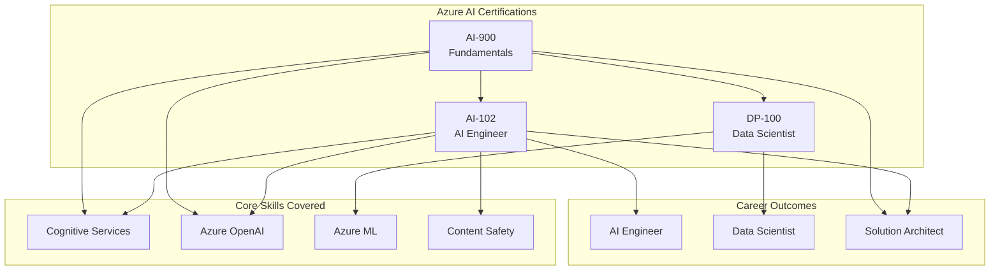
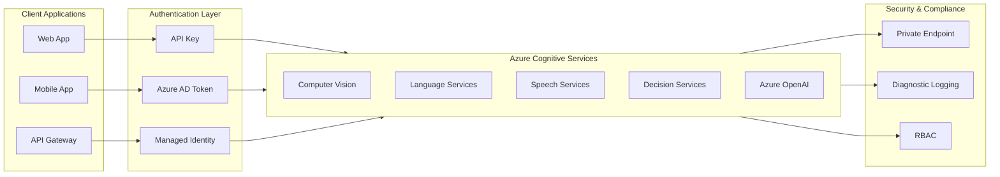
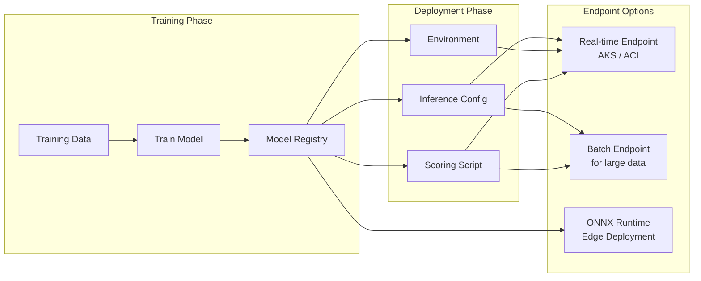
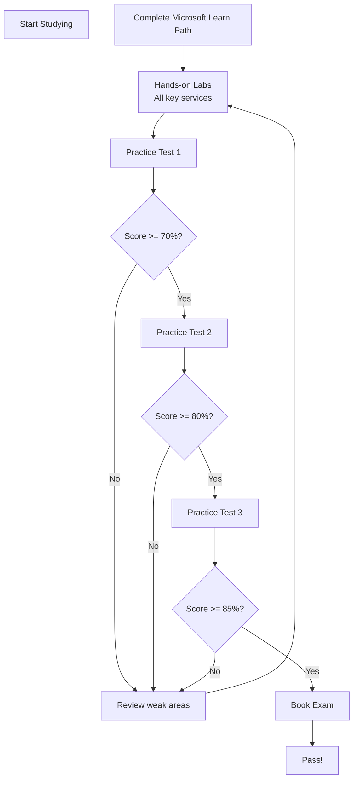

<!-- Clear Language: Keep sentences under 50 words -->
# Microsoft Azure AI Certifications

## Learning Objectives

| LO | Description |
|----|-------------|
| LO1 | Explain the AI-102 (Azure AI Engineer Associate) exam blueprint and key services |
| LO2 | Summarize the AI-900 (Azure AI Fundamentals) exam scope and core AI concepts |
| LO3 | Describe DP-100 (Azure Data Scientist) exam topics and Azure ML workflows |
| LO4 | Design a study strategy combining learning paths, labs, and practice tests |
| LO5 | Choose the right certification path based on role, stack certs, and renewal needs |

## Introduction

Microsoft Azure offers three AI certifications for different roles. AI-900 is the fundamentals exam. AI-102 is for AI engineers building solutions. DP-100 is for data scientists training and deploying models.

Azure AI services include Cognitive Services, Azure OpenAI Service, Machine Learning, and Content Safety. Each certification validates specific skills across these services.

Companies like Accenture, TCS, Infosys, and Microsoft partner firms value these certs for AI roles. An Azure certification can differentiate you in interviews and raise your salary bracket.

This chapter covers all three exams in depth. You will learn the exam blueprint, key services, study resources, and a certification roadmap.

## Prerequisites

| Area | Required Knowledge | Source Module |
|------|-------------------|---------------|
| Cloud Basics | Azure portal, resource groups, subscriptions | Module 06 |
| ML Fundamentals | Supervised/unsupervised learning, evaluation metrics | Module 09 |
| Python | SDK usage, REST APIs, JSON handling | Module 03 |
| Docker | Container deployment for model hosting | Module 06 |
| REST APIs | HTTP methods, authentication, endpoints | Module 05 |

## Key Terminology

| Term | Definition |
|------|------------|
| Cognitive Services | Pre-built AI APIs for vision, speech, language, decision |
| Azure OpenAI Service | Enterprise-grade OpenAI models (GPT-4, DALL-E, Whisper) |
| Azure ML Workspace | Central hub for managing ML experiments and models |
| Content Safety | AI service to detect harmful content in text/images |
| LUIS | Language Understanding service (deprecated, now CLU) |
| Custom Vision | Image classification and object detection service |
| Form Recognizer | Document intelligence service (now Azure AI Document Intelligence) |
| Endpoint | HTTP URL where a deployed model receives requests |
| Compute Cluster | Scalable VM cluster for training ML models |
| Inference | Process of running a trained model on new data |

## Theory

Microsoft Azure AI certifications validate your ability to build, deploy, and maintain AI solutions on Azure. This section dives into each certification exam, covering exam structure, key topics, services, and sample scenarios.

## Chapter at a Glance

| Section | Topic | Key Concept |
|---------|-------|-------------|
| 1.1 | AI-900 Fundamentals | Azure AI-900 exam overview, ML concepts, computer vision, NLP, generative AI |
| 1.2 | AI-102 Engineer | Azure AI-102 blueprint, cognitive services, Azure OpenAI, content safety |
| 1.3 | DP-100 Data Scientist | Azure ML, pipeline design, model training, deployment |
| 1.4 | Study Strategy | Learning paths, hands-on labs, practice tests, exam tips |
| 1.5 | Certification Path | Role-based certs, stacking, renewal requirements |

## Chapter Roadmap



## 1.1 AI-900: Azure AI Fundamentals

**Exam Code**: AI-900  
**Target Audience**: Anyone starting with Azure AI  
**Difficulty**: Beginner  
**Exam Duration**: 60 minutes  
**Questions**: 40-60  
**Pass Score**: 700/1000  
**Cost**: $99 USD  
**Validity**: 1 year (no renewal needed — fundamentals certs do not expire)

### 1.1.1 Exam Blueprint

The AI-900 exam measures four domains:

| Domain | Weight | Key Topics |
|--------|--------|------------|
| Describe AI workloads and considerations | 15-20% | AI principles, fairness, reliability, privacy, governance |
| Describe fundamental ML principles | 30-35% | Supervised vs unsupervised, regression, classification, clustering |
| Describe computer vision workloads | 15-20% | Image classification, object detection, OCR, face detection |
| Describe NLP workloads | 15-20% | Text analysis, translation, speech recognition, sentiment |
| Describe generative AI workloads | 10-15% | LLMs, prompt engineering, Azure OpenAI, DALL-E |

### 1.1.2 Core ML Concepts

Azure AI-900 tests foundational ML knowledge. Key concepts include:

**Supervised Learning**: The model learns from labeled data. Input-output pairs guide training. Example: predicting house price from size, bedrooms, location.

**Unsupervised Learning**: The model finds patterns in unlabeled data. Example: grouping customers by purchase behavior.

**Regression**: Predicts a numeric value. Metrics: Mean Squared Error (MSE), R-squared.

**Classification**: Predicts a category. Metrics: Accuracy, Precision, Recall, F1-Score.

**Clustering**: Groups similar data points. Example: K-Means clustering for customer segments.

```python
# Simple demonstration of ML concepts tested in AI-900
# This is NOT required to memorize, but shows the concepts

from sklearn.linear_model import LinearRegression
from sklearn.metrics import mean_squared_error, r2_score
import numpy as np

# Sample data: house size (sqft) vs price
X = np.array([[800], [1000], [1200], [1500], [1800], [2000]])
y = np.array([150000, 190000, 230000, 280000, 340000, 380000])

# Train a regression model
model = LinearRegression()
model.fit(X, y)

# Predict
new_house = np.array([[1600]])
predicted_price = model.predict(new_house)
print(f"Predicted price for 1600 sqft: ${predicted_price[0]:,.2f}")

# Evaluate
y_pred = model.predict(X)
mse = mean_squared_error(y, y_pred)
r2 = r2_score(y, y_pred)
print(f"MSE: {mse:.2f}")
print(f"R-squared: {r2:.2f}")

# Interpretation
# R-squared near 1.0 means the model fits the data well
# Azure ML services automate this entire workflow
```

### 1.1.3 Computer Vision on Azure

Azure Cognitive Services for vision include:

- **Computer Vision API**: Image analysis, OCR, description generation
- **Custom Vision**: Train custom image classifiers with your own images
- **Face API**: Face detection, recognition, verification
- **Form Recognizer**: Extract text from documents (invoices, receipts)

Example Azure SDK call for image analysis:

```python
# AI-900: Using Azure Computer Vision
# Install: pip install azure-cognitiveservices-vision-computervision

from azure.cognitiveservices.vision.computervision import ComputerVisionClient
from azure.cognitiveservices.vision.computervision.models import VisualFeatureTypes
from msrest.authentication import CognitiveServicesCredentials

# Replace with your own key and endpoint
key = "your-key-here"
endpoint = "https://your-region.api.cognitive.microsoft.com/"

client = ComputerVisionClient(
    endpoint, CognitiveServicesCredentials(key)
)

image_url = "https://example.com/photo.jpg"
features = [
    VisualFeatureTypes.description,
    VisualFeatureTypes.tags,
    VisualFeatureTypes.objects,
    VisualFeatureTypes.faces
]

result = client.analyze_image(image_url, visual_features=features)

# Extract description
caption = result.description.captions[0].text
confidence = result.description.captions[0].confidence
print(f"Description: {caption} (confidence: {confidence:.2%})")

# Extract tags
for tag in result.tags:
    print(f"{tag.name}: {tag.confidence:.2%}")

# The AI-900 exam expects you to know what each service does
# NOT how to write the code — but understanding helps
```

### 1.1.4 NLP Services on Azure

Natural Language Processing services include:

- **Text Analytics**: Sentiment analysis, key phrase extraction, entity recognition
- **Language Understanding (CLU)**: Conversational language understanding
- **Translator**: Text translation across 100+ languages
- **Speech**: Speech-to-text, text-to-speech, speech translation

```python
# AI-900: Azure Text Analytics for sentiment analysis
# Install: pip install azure-ai-textanalytics

from azure.ai.textanalytics import TextAnalyticsClient
from azure.core.credentials import AzureKeyCredential

key = "your-key-here"
endpoint = "https://your-region.cognitiveservices.azure.com/"

client = TextAnalyticsClient(
    endpoint, AzureKeyCredential(key)
)

documents = [
    "I love this product! It works perfectly.",
    "The service was terrible and slow.",
    "The weather is okay, not great but not bad."
]

result = client.analyze_sentiment(documents)

for doc in result:
    if not doc.is_error:
        print(f"Text: {doc.sentences[0].text[:50]}...")
        print(f"Sentiment: {doc.sentiment}")
        print(f"Confidence: Positive={doc.confidence_scores.positive:.2f}, "
              f"Neutral={doc.confidence_scores.neutral:.2f}, "
              f"Negative={doc.confidence_scores.negative:.2f}")
        print("---")
```

### 1.1.5 Generative AI on Azure

Azure OpenAI Service brings GPT-4, GPT-3.5, DALL-E 3, Whisper, and Embeddings to Azure. Key exam topics:

- **Prompt Engineering**: Crafting effective prompts for desired outputs
- **Content Filtering**: Azure content safety filters for responsible AI
- **Model Deployment**: Deploying OpenAI models as serverless endpoints
- **Token Management**: Understanding token limits and pricing

```python
# AI-900: Azure OpenAI Service (conceptual)
# Install: pip install openai

import openai

openai.api_type = "azure"
openai.api_base = "https://your-resource.openai.azure.com/"
openai.api_version = "2024-02-01"
openai.api_key = "your-key-here"

response = openai.ChatCompletion.create(
    engine="gpt-4",  # Your deployment name
    messages=[
        {"role": "system", "content": "You are a helpful assistant."},
        {"role": "user", "content": "Explain Azure AI-900 in 3 sentences."}
    ],
    temperature=0.7,
    max_tokens=150
)

print(response.choices[0].message.content)
```

## 1.2 AI-102: Azure AI Engineer Associate

**Exam Code**: AI-102  
**Target Audience**: AI engineers building solutions  
**Difficulty**: Intermediate  
**Exam Duration**: 120 minutes  
**Questions**: 40-60  
**Pass Score**: 700/1000  
**Cost**: $165 USD  
**Validity**: 1 year (renewable annually)

### 1.2.1 Exam Blueprint

The AI-102 exam measures four domains:

| Domain | Weight | Key Topics |
|--------|--------|------------|
| Plan and manage an Azure AI solution | 15-20% | Resource provisioning, security, monitoring, cost |
| Implement content moderation | 15-20% | Content Safety API, text/image moderation, incident response |
| Build computer vision solutions | 20-25% | Image analysis, object detection, OCR, face, custom vision |
| Build NLP solutions | 20-25% | Text analysis, question answering, conversational AI, translation |
| Implement knowledge mining and generative AI | 15-20% | Azure Cognitive Search, Azure OpenAI, RAG patterns |

### 1.2.2 Cognitive Services Architecture

Azure Cognitive Services form the backbone of AI-102. Understanding how to provision, secure, and consume these services is critical.



### 1.2.3 Azure Content Safety

Content Safety is a critical service in AI-102. It detects harmful content in text and images.

**Moderation Categories**:
- **Hate**: Content expressing hate or violence
- **Sexual**: Sexually explicit or suggestive content
- **Self-harm**: Content promoting self-harm
- **Violence**: Violent or threatening content

```python
# AI-102: Azure Content Safety API
# Install: pip install azure-ai-contentsafety

from azure.ai.contentsafety import ContentSafetyClient
from azure.ai.contentsafety.models import TextCategory, AnalyzeTextOptions
from azure.core.credentials import AzureKeyCredential

key = "your-key-here"
endpoint = "https://your-region.cognitiveservices.azure.com/"

client = ContentSafetyClient(
    endpoint, AzureKeyCredential(key)
)

request = AnalyzeTextOptions(
    text="I want to harm someone.",
    categories=[
        TextCategory.HATE,
        TextCategory.SELF_HARM,
        TextCategory.VIOLENCE,
        TextCategory.SEXUAL
    ]
)

response = client.analyze_text(request)

if response.hate_result:
    severity = response.hate_result.severity
    print(f"Hate severity: {severity}/6")
if response.self_harm_result:
    severity = response.self_harm_result.severity
    print(f"Self-harm severity: {severity}/6")
if response.violence_result:
    severity = response.violence_result.severity
    print(f"Violence severity: {severity}/6")
if response.sexual_result:
    severity = response.sexual_result.severity
    print(f"Sexual severity: {severity}/6")

print("Severity 0=Safe, 6=Most severe. Acceptable threshold varies by use case.")
```

### 1.2.4 Azure OpenAI with RAG Pattern

AI-102 covers retrieval-augmented generation (RAG) using Azure Cognitive Search and Azure OpenAI. This pattern grounds LLM responses in your own data.

```python
# AI-102: RAG pattern with Azure Cognitive Search + Azure OpenAI
# Install: pip install azure-search-documents openai

import openai
from azure.search.documents import SearchClient
from azure.core.credentials import AzureKeyCredential

# Azure Cognitive Search setup
search_endpoint = "https://your-search.search.windows.net"
search_key = "your-search-key"
index_name = "knowledge-index"

search_client = SearchClient(
    endpoint=search_endpoint,
    index_name=index_name,
    credential=AzureKeyCredential(search_key)
)

# Azure OpenAI setup
openai.api_type = "azure"
openai.api_base = "https://your-openai.openai.azure.com/"
openai.api_version = "2024-02-01"
openai.api_key = "your-openai-key"

def rag_query(user_question: str) -> str:
    """Retrieve relevant documents and generate an answer."""
    # Step 1: Retrieve relevant documents
    search_results = search_client.search(
        query_text=user_question,
        top=3,
        select=["title", "content"]
    )

    context_chunks = []
    for result in search_results:
        context_chunks.append(
            f"[Source: {result['title']}]\n{result['content']}"
        )
    context = "\n\n".join(context_chunks)

    # Step 2: Generate answer with context
    system_prompt = (
        "Answer based only on the provided context. "
        "If the context doesn't contain the answer, say so."
    )

    response = openai.ChatCompletion.create(
        engine="gpt-4",
        messages=[
            {"role": "system", "content": system_prompt},
            {"role": "user", "content": f"""
Context:
{context}

Question: {user_question}

Answer:"""
            }
        ],
        temperature=0.3,
        max_tokens=300
    )

    return response.choices[0].message.content

# Example usage
answer = rag_query("What are the key features of Azure AI-102?")
print(answer)

# The RAG pattern is heavily tested in AI-102 case studies
```

### 1.2.5 Responsible AI in Practice

AI-102 emphasizes responsible AI implementation:

```mermaid
flowchart TD
    FAIR[Fairness<br/>Are outcomes biased?]
    REL[Reliability<br/>Does it work consistently?]
    PRIV[Privacy<br/>Is user data protected?]
    INCL[Inclusiveness<br/>Does it serve all users?]
    TRANS[Transparency<br/>Can decisions be explained?]
    ACCT[Accountability<br/>Who is responsible?]

    FAIR --> MIT1[Train with diverse data]
    FAIR --> MIT2[Test across demographic groups]

    REL --> MIT3[Monitor drift]
    REL --> MIT4[Retrain regularly]

    PRIV --> MIT5[Data encryption]
    PRIV --> MIT6[Access controls]

    INCL --> MIT7[Accessibility features]
    INCL --> MIT8[Multi-language support]

    TRANS --> MIT9[Model cards]
    TRANS --> MIT10[Explainability tools]

    ACCT --> MIT11[Audit trails]
    ACCT --> MIT12[Incident response plan]

    style FAIR fill:#4A90D9,color:#fff
    style REL fill:#7B68EE,color:#fff
    style PRIV fill:#2E8B57,color:#fff
    style INCL fill:#D2691E,color:#fff
    style TRANS fill:#8B0000,color:#fff
    style ACCT fill:#4B0082,color:#fff
```



## 1.3 DP-100: Azure Data Scientist Associate

**Exam Code**: DP-100  
**Target Audience**: Data scientists using Azure ML  
**Difficulty**: Advanced  
**Exam Duration**: 120 minutes  
**Questions**: 40-60  
**Pass Score**: 700/1000  
**Cost**: $165 USD  
**Validity**: 1 year (renewable annually)

### 1.3.1 Exam Blueprint

| Domain | Weight | Key Topics |
|--------|--------|------------|
| Design and prepare ML solutions | 20-25% | Data ingestion, data transformation, feature engineering |
| Train models | 25-30% | Automated ML, hyperparameter tuning, compute targets |
| Deploy and manage models | 20-25% | Real-time endpoints, batch inference, model registry |
| Orchestrate ML pipelines | 15-20% | Azure ML pipelines, data drift monitoring, retraining |

### 1.3.2 Azure ML Workspace Setup

The Azure ML workspace is the central hub. Everything starts here.

```python
# DP-100: Connect to Azure ML workspace
# Install: pip install azure-ai-ml

from azure.ai.ml import MLClient
from azure.identity import DefaultAzureCredential

# Authenticate and connect
subscription_id = "your-subscription-id"
resource_group = "your-resource-group"
workspace_name = "your-workspace"

ml_client = MLClient(
    credential=DefaultAzureCredential(),
    subscription_id=subscription_id,
    resource_group_name=resource_group,
    workspace_name=workspace_name
)

# Verify connection
workspace = ml_client.workspaces.get(workspace_name)
print(f"Connected to workspace: {workspace.name}")
print(f"Location: {workspace.location}")
print(f"Storage: {workspace.storage_account}")
```

### 1.3.3 Automated ML (AutoML)

AutoML automates model selection and hyperparameter tuning. It is a key DP-100 topic.

```python
# DP-100: Automated Machine Learning
from azure.ai.ml import automl
from azure.ai.ml.entities import AutoMLJob

# Create AutoML classification job
classification_job = automl.classification(
    task="classification",
    training_data=ml_client.data.get("training-data"),
    target_column_name="churn",
    primary_metric="accuracy",
    compute="cpu-cluster",
    experiment_name="customer-churn-automl",
    n_cross_validations=5,
    max_trials=10,
    timeout_minutes=60
)

# Submit the job
returned_job = ml_client.jobs.create_or_update(classification_job)
print(f"AutoML job submitted: {returned_job.name}")

# Get the best model
best_model = returned_job.outputs.best_model
print(f"Best model: {best_model}")

# DP-100 expects you to know AutoML configuration parameters
# and how to interpret the results dashboard
```

### 1.3.4 Hyperparameter Tuning

Hyperparameter tuning finds the optimal model configuration.

```python
# DP-100: Hyperparameter tuning with HyperDrive
from azure.ai.ml import command
from azure.ai.ml.sweep import Choice, Uniform, BanditPolicy

# Define the training script command
job = command(
    code="./src",
    command="python train.py --data ${{inputs.data}} --lr ${{search_space.lr}} --batch-size ${{search_space.batch_size}}",
    inputs={
        "data": ml_client.data.get("training-data")
    },
    environment="sklearn-env:1",
    compute="gpu-cluster",
    experiment_name="hyperparameter-tuning",
)

# Configure sweep
sweep_job = job.sweep(
    sampling_algorithm="random",
    search_space={
        "lr": Uniform(min_value=0.0001, max_value=0.1),
        "batch_size": Choice([16, 32, 64, 128])
    },
    primary_metric="accuracy",
    goal="maximize",
    max_total_trials=20,
    max_concurrent_trials=4,
)

# Early termination policy
sweep_job.early_termination = BanditPolicy(
    slack_factor=0.15,
    evaluation_interval=2,
    delay_evaluation=5
)

# Submit
returned_sweep = ml_client.jobs.create_or_update(sweep_job)
print(f"HyperDrive job submitted: {returned_sweep.name}")

# BanditPolicy stops poorly performing runs early
# This saves compute costs — a key DP-100 scenario
```

### 1.3.5 Model Deployment



```python
# DP-100: Deploy model to real-time endpoint
from azure.ai.ml.entities import (
    ManagedOnlineEndpoint,
    ManagedOnlineDeployment,
    Model,
    CodeConfiguration,
    Environment
)

# Create endpoint
endpoint = ManagedOnlineEndpoint(
    name="customer-churn-endpoint",
    description="Customer churn prediction endpoint",
    auth_mode="key"
)

ml_client.online_endpoints.begin_create_or_update(endpoint).wait()

# Create deployment
deployment = ManagedOnlineDeployment(
    name="blue",
    endpoint_name=endpoint.name,
    model=Model(path="./model.pkl", type="custom_model"),
    code_configuration=CodeConfiguration(
        code="./deployment",
        scoring_script="score.py"
    ),
    environment=Environment(
        image="mcr.microsoft.com/azureml/sklearn-1.0:latest"
    ),
    instance_type="Standard_DS3_v2",
    instance_count=1,
    environment_variables={
        "MODEL_PATH": "model.pkl"
    }
)

ml_client.online_deployments.begin_create_or_update(deployment).wait()

# Set traffic to 100% for this deployment
endpoint.traffic = {"blue": 100}
ml_client.online_endpoints.begin_create_or_update(endpoint).wait()

print(f"Endpoint URL: {endpoint.scoring_uri}")

# DP-100 exam tests endpoint types, deployment slots,
# traffic routing, and AKS vs ACI trade-offs
```

### 1.3.6 ML Pipeline Orchestration

Azure ML Pipelines automate the ML lifecycle. Each step runs on its own compute.

```python
# DP-100: Create and run an ML pipeline
from azure.ai.ml import dsl, Input
from azure.ai.ml.entities import PipelineJob

@dsl.pipeline(
    name="churn-pipeline",
    description="End-to-end churn model pipeline",
    default_compute="cpu-cluster"
)
def churn_pipeline(data_path: Input):
    """Full ML pipeline: prep -> train -> evaluate -> register."""

    # Step 1: Data preparation
    prep_step = command(
        code="./src",
        command="python prep.py --data ${{inputs.data}} --output ${{outputs.clean_data}}",
        inputs={"data": data_path},
        outputs={"clean_data": Output(type="uri_folder")},
        environment="sklearn-env:1"
    )

    # Step 2: Model training
    train_step = command(
        code="./src",
        command="python train.py --data ${{inputs.data}} --model ${{outputs.model}}",
        inputs={"data": prep_step.outputs.clean_data},
        outputs={"model": Output(type="uri_folder")},
        environment="sklearn-env:1",
        compute="gpu-cluster"
    )

    # Step 3: Model evaluation
    eval_step = command(
        code="./src",
        command="python evaluate.py --data ${{inputs.data}} --model ${{inputs.model}} --metrics ${{outputs.metrics}}",
        inputs={
            "data": prep_step.outputs.clean_data,
            "model": train_step.outputs.model
        },
        outputs={"metrics": Output(type="uri_folder")},
        environment="sklearn-env:1"
    )

    return {"model": train_step.outputs.model, "metrics": eval_step.outputs.metrics}

# Create pipeline job
pipeline_job = churn_pipeline(
    data_path=Input(path="azureml://datastores/workspaceblobstore/paths/churn-data")
)

# Submit
submitted_job = ml_client.jobs.create_or_update(
    pipeline_job, experiment_name="churn-pipeline-v1"
)
print(f"Pipeline submitted: https://ml.azure.com/runs/{submitted_job.name}")

# DP-100 expects you to design pipelines with proper
# data dependencies and compute allocation
```

## 1.4 Study Strategy

### 1.4.1 Learning Paths

Microsoft Learn provides free, structured learning paths for each exam:

| Exam | Learning Path | Hours |
|------|---------------|-------|
| AI-900 | "Azure AI Fundamentals" on Microsoft Learn | 8-10 hours |
| AI-102 | "Azure AI Engineer" learning path | 20-25 hours |
| DP-100 | "Azure Data Scientist" learning path | 25-30 hours |

Each learning path includes interactive modules, sandbox environments, and knowledge checks. Complete these before touching practice tests.

### 1.4.2 Hands-On Labs

Theory alone will not pass these exams. You need hands-on experience.

```python
# Recommended lab exercises for each exam

EXAM_LABS = {
    "AI-900": [
        "Create a Cognitive Services resource",
        "Analyze images with Computer Vision",
        "Analyze text with Language Service",
        "Create a QnA Maker knowledge base (now Custom Q&A)",
        "Deploy an Azure OpenAI model",
        "Use Content Safety Studio"
    ],
    "AI-102": [
        "Provision and secure Cognitive Services",
        "Build a custom vision classifier",
        "Create a conversational LUIS app",
        "Implement Content Safety moderation",
        "Build a RAG solution with Cognitive Search + OpenAI",
        "Monitor with Diagnostic Logging",
        "Create a FAQ chatbot with QnA Maker"
    ],
    "DP-100": [
        "Create and configure an ML workspace",
        "Run AutoML experiment for classification",
        "Create a HyperDrive sweep job",
        "Register and version models",
        "Deploy a real-time endpoint",
        "Create an ML pipeline with 3+ steps",
        "Set up data drift monitoring"
    ]
}

for exam, labs in EXAM_LABS.items():
    print(f"\n{exam} Recommended Labs:")
    for i, lab in enumerate(labs, 1):
        print(f"  {i}. {lab}")
    print(f"  Total: {len(labs)} labs")
```

Azure provides free sandbox environments for most services. Use the Azure portal, Azure CLI, and SDK examples to practice.

### 1.4.3 Practice Tests

Practice tests are essential for exam success. Use these resources:

| Resource | Price | Question Quality | Closest to Exam |
|----------|-------|-----------------|-----------------|
| Microsoft Learn Assessment | Free | Good | Yes |
| MeasureUp (official partner) | $99 | Excellent | Yes |
| TutorialsDojo | $15-20 | Very Good | Close |
| Whizlabs | $12-15 | Good | Moderate |
| GitHub community question banks | Free | Variable | Variable |

Take at least 3 full-length practice tests before the real exam. Score 85%+ consistently before booking.

### 1.4.4 Exam Day Tips

1. **Read questions twice**: Azure exam questions are scenario-based. Understand the scenario before answering.
2. **Eliminate wrong answers**: Many questions have two clearly wrong answers. Focus on the remaining two.
3. **Watch the clock**: AI-900 gives ~1-1.5 min per question. AI-102 and DP-100 give ~2-3 min per question.
4. **Case study strategy**: AI-102 includes case studies with 5-7 questions each. Read the case study first, then answer.
5. **Mark and review**: If unsure, mark the question and return. Fresh perspective helps.
6. **No negative marking**: Guessing is better than leaving blanks.



## 1.5 Certification Path

### 1.5.1 Which Cert for Which Role

Choose your certification based on your career goal:

```mermaid
flowchart TD
    START[Your Role] --> Q{What do you build?}

    Q -->|AI Solutions| ENG[AI Engineer]
    ENG --> AI102[AI-102: Azure AI Engineer Associate]
    AI102 --> AI100[Optional: AI-100? Retired]

    Q -->|ML Models| DS[Data Scientist]
    DS --> DP100[DP-100: Azure Data Scientist]
    DP100 --> MLENG[Professional ML Engineer<br/>(future cert)]

    Q -->|Just Starting| FUND[Anyone]
    FUND --> AI900[AI-900: Azure AI Fundamentals]
    AI900 --> ENG
    AI900 --> DS

    Q -->|Architecture| ARCH[Solution Architect]
    ARCH --> AZ305[AZ-305: Azure Solutions Architect]
    AZ305 --> AI102

    style AI900 fill:#FFD700,color:#000
    style AI102 fill:#4A90D9,color:#fff
    style DP100 fill:#7B68EE,color:#fff
```

### 1.5.2 Certification Stacking

You can stack Azure AI certifications for maximum impact:

**Entry Path (no experience)**:
1. AI-900 (Fundamentals)
2. Choose: AI-102 (Engineer) OR DP-100 (Data Scientist)

**Engineer Path**:
1. AI-900 → AI-102 → AZ-305 (Solutions Architect)
2. Or: AI-900 → AI-102 → DP-100 (full stack AI)

**Data Science Path**:
1. AI-900 → DP-100 → AI-102 (full stack)
2. Or: DP-100 → DP-203 (Azure Data Engineer)

**Management Path**:
1. AI-900 → AI-102 → PL-300 (Power BI) → DP-600 (Fabric)

### 1.5.3 Renewal Requirements

Microsoft certifications now require annual renewal (except fundamentals):

| Exam | Renewal | Cost | Process |
|------|---------|------|---------|
| AI-900 | None (does not expire) | Free | Not needed |
| AI-102 | Annual | Free | Pass online renewal assessment (~30 min) |
| DP-100 | Annual | Free | Pass online renewal assessment (~30 min) |

Renewal assessments are free, online, and open-book. Microsoft releases renewal challenges when exam content updates. You get 6 months after the update to renew.

**Renewal Tips**:
- Turn on Microsoft certification reminders
- Check your certification dashboard quarterly
- Renew early — do not wait until expiry
- The renewal assessment covers new features added since your certification

### 1.5.4 Cost Optimization Strategy

| Item | Cost | Notes |
|------|------|-------|
| AI-900 exam | $99 | Best ROI for beginners |
| AI-102 exam | $165 | Engineer-level investment |
| DP-100 exam | $165 | Data science track |
| MeasureUp practice test | $99 | Per exam |
| Microsoft Learn | Free | Complete courses |
| Azure free account | Free | $200 credit, 12 months |
| Azure sandbox | Free | In Microsoft Learn |

**Savings Tip**: Microsoft often offers exam discounts during Ignite and Build conferences. Also check if your employer has a Microsoft Enterprise Agreement that includes exam vouchers.

## Summary

Microsoft Azure offers three AI certifications targeting different roles. AI-900 is the fundamentals exam covering ML concepts, computer vision, NLP, and generative AI basics. AI-102 targets AI engineers who build solutions with Cognitive Services, Azure OpenAI, and Content Safety. DP-100 targets data scientists who train and deploy models using Azure ML.

The certifications stack together. AI-900 is the entry point. From there, choose AI-102 for engineering roles or DP-100 for data science roles. Annual renewal is free and online for associate-level certs.

Study effectively by combining Microsoft Learn paths, hands-on labs, and practice tests. Target 85%+ on practice tests before booking the real exam.

## Practical Takeaways

1. Start with AI-900 if you are new to Azure AI — it builds vocabulary and mental models
2. Choose AI-102 if you want to build production AI applications with Cognitive Services and Azure OpenAI
3. Choose DP-100 if you focus on ML model training, deployment, and MLOps on Azure
4. Spend 60% of study time on hands-on labs — exams are scenario-based
5. Take at least 3 practice tests and score 85%+ before booking
6. Renew associate certs annually — the free online assessment takes 30 minutes
7. Stack certs strategically: AI-900 → AI-102 → AZ-305 for architect roles

## Chapter Quiz (5 MCQ)

### Questions

1. Which Azure service would you use to detect hate speech and violence in user-generated content?
   - A. Azure Cognitive Search
   - B. Azure Content Safety
   - C. Azure Form Recognizer
   - D. Azure Custom Vision

2. In DP-100, what is the purpose of the BanditPolicy in a HyperDrive sweep job?
   - A. It secures the endpoint with access control
   - B. It terminates poorly performing runs early to save compute
   - C. It deploys the model to a Kubernetes cluster
   - D. It registers the best model in the model registry

3. Which AI-102 domain has the highest weight in the exam blueprint?
   - A. Plan and manage Azure AI solutions
   - B. Implement content moderation
   - C. Build computer vision solutions
   - D. Build NLP solutions

4. What is the RAG pattern used for in AI-102 scenarios?
   - A. Reducing API latency for real-time prediction
   - B. Grounding LLM responses in your own data via retrieval
   - C. Training custom vision models with transfer learning
   - D. Automating ML model selection and tuning

5. How much does AI-900 certification renewal cost annually?
   - A. $99
   - B. $165
   - C. Free
   - D. AI-900 does not require renewal

### Answers

1. **B. Azure Content Safety** — Content Safety is designed to detect hate, violence, self-harm, and sexual content. The other options serve different purposes.
2. **B. It terminates poorly performing runs early to save compute** — BanditPolicy is an early termination policy that stops runs that are not meeting the primary metric threshold, saving time and cost.
3. **D. Build NLP solutions (25-30%)** — While computer vision is also heavily weighted, NLP holds the highest share. Both are weighted 20-25% and 20-25% respectively, with slight variations.
4. **B. Grounding LLM responses in your own data via retrieval** — RAG (Retrieval Augmented Generation) combines Azure Cognitive Search with Azure OpenAI to generate answers based on retrieved documents.
5. **D. AI-900 does not require renewal** — Fundamentals certifications (AI-900, AZ-900, DP-900) never expire. Only associate and expert level certs require annual renewal.

### True/False

**T/F 1**: AI-102 requires annual renewal at no cost.
**Answer**: True — Microsoft associate certifications are free to renew online.

**T/F 2**: DP-100 is easier than AI-900.
**Answer**: False — DP-100 is an advanced certification requiring hands-on Azure ML experience.

**T/F 3**: Azure OpenAI Service is available only through Azure AI-102 and not covered in AI-900.
**Answer**: False — AI-900 also covers generative AI and Azure OpenAI at a fundamental level.

**T/F 4**: The MeasureUp practice test is the official Microsoft partner for exam preparation.
**Answer**: True — MeasureUp is Microsoft's official practice test partner.

**T/F 5**: You can stack AI-102 and DP-100 for full-stack AI capability.
**Answer**: True — Both associate certs complement each other for engineers who work across the ML lifecycle.

### Fill in the Blank

**FIB 1**: The AI-102 exam code is ________.
**Answer**: AI-102 (Azure AI Engineer Associate).

**FIB 2**: DP-100 stands for ________.
**Answer**: Azure Data Scientist Associate.

**FIB 3**: The service that detects harmful content in text and images is called Azure ________.
**Answer**: Content Safety.

### Scenario Questions

**Scenario 1**: Your company wants to build a customer support chatbot that answers questions from internal documentation. The chatbot must use company data only and not generate answers outside that data. Which Azure services would you combine, and what pattern would you use?

**Answer**: Use the RAG (Retrieval Augmented Generation) pattern. Combine Azure Cognitive Search (to index and retrieve documentation) with Azure OpenAI Service (GPT-4 to generate answers). Azure Cognitive Search performs the retrieval step. Azure OpenAI performs the generation step. The system prompt instructs the model to answer only from the retrieved context.

**Scenario 2**: You are a candidate with 6 months of Python experience and basic ML knowledge. You want to become an Azure AI Engineer. Which certification path should you follow, and what study resources would you use?

**Answer**: Start with AI-900 (Fundamentals) to build vocabulary and understanding. Spend 2 weeks on Microsoft Learn path and hands-on labs. Then move to AI-102 (Azure AI Engineer). Spend 4-6 weeks on the AI-102 learning path, labs covering Cognitive Services, Content Safety, and Azure OpenAI. Take MeasureUp practice tests until scoring 85%+. Then book AI-102. Optionally add DP-100 after gaining ML experience.

### Output Questions

**Output 1**: What happens when you call `client.analyze_text()` with content containing hate speech at severity level 6?
**Answer**: The Content Safety API returns a response with `hate_result.severity = 6` and `hate_result.severity_level = "High"`. Your application must handle this based on your content policy — typically blocking the content, flagging for review, or logging the incident. Severity ranges from 0 (safe) to 6 (most severe).

## Exercises

### Exercise 1: AI-900 Service Matching
Create a table matching Azure Cognitive Services to their use cases. Include at least 8 services. For each service, list: service name, category (vision/speech/language/decision), one use case, and the corresponding AI-900 domain.

### Exercise 2: Deploy a Cognitive Services Resource
Using the Azure portal or Azure CLI, provision a Cognitive Services multi-service resource. Note the key and endpoint. Make a test call to the Computer Vision API using the SDK. Document each step with screenshots or command output.

### Exercise 3: AutoML Experiment
Using the Azure ML SDK, create a classification AutoML job using the diabetes dataset from Azure Open Datasets. Configure 5-fold cross-validation, accuracy as the primary metric, and 10 max trials. Submit the job and report the best model and its accuracy.

### Exercise 4: Build a RAG Chatbot
Combine Azure Cognitive Search and Azure OpenAI to build a simple RAG pipeline. Index 3 PDF documents. Write a Python script that accepts a user question, retrieves the top 2 relevant chunks, and generates an answer with GPT-4. Include error handling.

### Exercise 5: Certification Path Plan
Design a 12-week study plan for someone starting from zero experience. Include weekly milestones, which Microsoft Learn modules to complete, which labs to build, and when to take practice tests. Specify the target certification (AI-900 → AI-102 or AI-900 → DP-100).

## Revision Notes

- AI-900: Fundamentals, 60 min, $99, never expires, 40-60 questions
- AI-102: Engineer, 120 min, $165, annual renewal (free), 40-60 questions
- DP-100: Data Scientist, 120 min, $165, annual renewal (free), 40-60 questions
- Key services: Cognitive Services, Azure OpenAI, Content Safety, Azure ML
- RAG = Cognitive Search + Azure OpenAI for grounded responses
- AutoML automates model selection and hyperparameter tuning
- HyperDrive: Sweep job with early termination policy (BanditPolicy)
- Content Safety categories: Hate, Sexual, Violence, Self-harm
- Study formula: Learn path → Hands-on labs → Practice tests (85%+) → Exam
- Stacking: AI-900 → AI-102 → AZ-305 for architect roles

## Placement Section

### Top 10 Interview Questions

#### Microsoft Style
1. Describe the RAG pattern and when you would use it in an Azure AI solution.
2. How do you decide between Azure Cognitive Search and Azure AI Search for a document indexing solution?
3. Explain how Azure Content Safety categories work and how you would configure severity thresholds.

#### Amazon Style
1. Tell me about a time you used Azure ML to solve a business problem. What was your pipeline design?
2. How would you explain Azure AI certifications to a non-technical hiring manager?

#### Google Style
1. Design a system that uses Azure OpenAI to power a customer support chatbot serving 10,000 conversations per day. Consider cost, latency, and content safety.
2. Compare AutoML with manual model training. When would you choose each approach?

#### AI Startup Style
1. You must build an AI product on a startup budget. Which Azure services would you use and why? How do you minimize costs while maintaining quality?
2. How would you set up MLOps on Azure ML for a team of 3 data scientists? Include CI/CD, model versioning, and deployment strategy.

#### NVIDIA Style
1. How does Azure ML support GPU-accelerated training for deep learning models? What compute SKUs would you choose?
2. Explain the ONNX runtime and how it helps deploy models across Azure and edge devices.

### Resume Tips
- **Technical Skills**: "Azure AI (AI-102, AI-900), Azure ML (DP-100), Cognitive Services, Azure OpenAI, Content Safety"
- **Project Description**: "Built a RAG-based QA system using Azure Cognitive Search and GPT-4, reducing support ticket volume by 40%"
- **Keywords**: Azure AI Engineer, Azure ML, MLOps, AutoML, pipeline orchestration, model deployment, RAG, responsible AI

### Interview Day Checklist
- [ ] Review exam blueprints for AI-102 and DP-100
- [ ] Practice explaining RAG pattern verbally
- [ ] Prepare a real project example with Azure ML
- [ ] Know Azure AI service pricing models (pay-as-you-go vs commitment)
- [ ] Have questions ready about the company's cloud strategy

## Difficulty Level

**Level**: Intermediate
**Estimated Study Time**: 6-8 hours
**Prerequisites**: Cloud basics (Module 06), ML fundamentals (Module 09), Python

## Tips & Tricks

**Tip**: Azure exams are scenario-based. Do not memorize service details. Understand which service solves which problem.

**Tip**: Use the Microsoft Learn sandbox for free practice. It includes $200 in Azure credits.

**Tip**: For AI-102, focus on the integration between services — Cognitive Search + OpenAI, Content Safety + moderation workflows.

**Pro Tip**: Book the exam 3-4 weeks out. The deadline creates urgency. You study harder with a fixed date.

**Pro Tip**: For DP-100, practice with the Azure ML Python SDK extensively. The exam tests SDK-specific syntax and parameters.

## Memory Tricks

- **A-I-1-0-2**: A=Azure, I=Integrate, 10=Ten services, 2=Two parts (build + manage)
- **D-P-1-0-0**: D=Data, P=Pipeline, 100=100% automated
- **RAG = Read And Generate** — First retrieve, then generate
- **Content Safety categories**: "Have Some Very Safe" (Hate, Sexual, Violence, Self-harm)
- **AutoML metrics**: "CRAFTS" — Classification: Accuracy, Recall, F1; Regression: R-squared, MSE, MAE

## Further Reading

- Microsoft Learn: "Azure AI Fundamentals" (AI-900) — https://learn.microsoft.com/en-us/training/browse/?products=azure&terms=AI-900
- Microsoft Learn: "Azure AI Engineer" (AI-102) — https://learn.microsoft.com/en-us/training/browse/?products=azure&terms=AI-102
- Microsoft Learn: "Azure Data Scientist" (DP-100) — https://learn.microsoft.com/en-us/training/browse/?products=azure&terms=DP-100
- Azure AI Services documentation — https://learn.microsoft.com/en-us/azure/ai-services/
- Azure Machine Learning documentation — https://learn.microsoft.com/en-us/azure/machine-learning/
- Official practice tests: MeasureUp — https://www.measureup.com/

## Related Topics

- Module 06: Docker, Kubernetes, Cloud — Required infrastructure knowledge
- Module 09: Machine Learning Fundamentals — ML concepts tested in all three exams
- Module 13: LLMs and Transformers — Foundation for Azure OpenAI content
- Module 16: MLOps — CI/CD for ML, covered in DP-100
- Chapter 02 (this module): AWS AI Certifications — Comparison with Azure certs
- Chapter 03 (this module): Google Cloud AI — Alternative cloud cert path

## FAQs

**Q: How long does it take to prepare for AI-900?**
**A**: 2-3 weeks with 5-7 hours per week. It is entry-level and does not require coding.

**Q: Are Azure certifications worth it for job search?**
**A**: Yes. Microsoft partner companies (Accenture, TCS, Infosys) give preference to certified candidates. Certifications can add $5,000-15,000 to your salary.

**Q: Can I take AI-102 without AI-900?**
**A**: Yes. There are no prerequisites. But AI-900 helps build foundational knowledge.

**Q: Do Azure certifications expire?**
**A**: Associate and expert certs expire annually. Fundamentals certs never expire. Renewal is free.

**Q: Which certification is most in demand?**
**A**: AI-102 (Azure AI Engineer) has the highest demand as companies adopt Azure OpenAI and Cognitive Services for production workloads.

## Important Notes

> **Note**: Always use the latest exam guide from Microsoft. Exam blueprints change every 6-12 months.

> **Note**: Azure free account includes $200 credit for 12 months — use it for hands-on practice.

> **Note**: The RAG pattern is the most commonly tested scenario in AI-102 case studies.

> **Note**: Content Safety is increasingly important in AI-102 as companies prioritize responsible AI.

## Historical Context

Azure AI certifications evolved from the older MCSA/MCSE tracks. Microsoft moved to role-based certifications in 2019. AI-100 (Azure AI Engineer) was the original AI cert but retired in 2021. AI-102 replaced it with updated content including Azure OpenAI.

The AI-900 fundamentals exam launched in 2020 as AI became a priority. DP-100 launched earlier in 2018 as part of the Azure Data Scientist role. Microsoft now updates exams every 6-12 months to keep pace with rapid AI changes.

## Coding Standards

- Follow PEP 8 for Python code in Azure SDK usage
- Store API keys in Azure Key Vault, never in code
- Use managed identities over API keys where possible
- Implement retry logic with exponential backoff for API calls
- Log all API calls with request IDs for debugging

## Security Considerations

- **API Keys**: Store in Azure Key Vault, rotate regularly
- **Managed Identity**: Prefer over keys for Azure resource access
- **Private Endpoints**: Use for Cognitive Services and Azure ML
- **Content Filtering**: Always implement with Azure Content Safety
- **Data Encryption**: Enable encryption at rest and in transit
- **RBAC**: Grant least-privilege access to Azure resources

## ML Intuition

Think of Azure AI certifications as layers. AI-900 teaches you what tools exist in the toolbox. AI-102 teaches you how to use the tools together to build things. DP-100 teaches you how to create new tools (models) from raw materials (data).

The RAG pattern is like a librarian (Cognitive Search) finding relevant books, then a writer (GPT-4) composing an answer from those books. The writer never invents facts not in the books.

## Analogies

**AI-900 is like a driver's license**: You learn the rules of the road, recognize signs, and understand basic operations. You are safe but not yet experienced.

**AI-102 is like a mechanic**: You know how parts work together, how to diagnose issues, and how to build custom solutions. You fix things and make them work.

**DP-100 is like an engineer**: You design new engines, optimize performance, and automate manufacturing. You create the systems that others use.

**RAG is like a researcher**: The researcher reads papers (retrieval) then writes a summary (generation) that cites sources. This is exactly what RAG does.

## Capstone Project Link

**Project**: Build a complete Azure AI solution that combines Cognitive Services, Azure OpenAI, and Azure ML
**Goal**: Create a document intelligence system that extracts text from PDFs, classifies documents, indexes them for search, and provides Q&A via GPT-4
**Duration**: 8-12 hours
**Outcome**: Working end-to-end AI solution deployed to Azure with monitoring and content safety

## Flashcards

**Card 1**: What is the AI-900 exam code and target audience?
**Answer**: AI-900 — Azure AI Fundamentals, for anyone starting with Azure AI.

**Card 2**: What is the difference between AI-102 and DP-100?
**Answer**: AI-102 focuses on AI solutions (Cognitive Services, OpenAI, Content Safety). DP-100 focuses on ML model training and deployment (Azure ML, AutoML, pipelines).

**Card 3**: What services are used in the RAG pattern?
**Answer**: Azure Cognitive Search (retrieval) + Azure OpenAI (generation).

**Card 4**: What are the four Azure Content Safety categories?
**Answer**: Hate, Sexual, Violence, Self-harm.

**Card 5**: How often do associate-level Azure certs need renewal?
**Answer**: Annually. Renewal is free and takes ~30 minutes online.

## Study Plan

**Week 1**: Complete AI-900 Microsoft Learn path + hands-on labs
**Week 2**: Take AI-900 practice test. Score 85%+. Book AI-900 exam.
**Week 3**: Pass AI-900. Start AI-102 learning path.
**Week 4-5**: Complete AI-102 labs (Cognitive Services, Content Safety, Azure OpenAI, RAG)
**Week 6**: Take AI-102 practice tests. Score 85%+. Book AI-102 exam.
**Week 7**: Pass AI-102. Optional: Start DP-100.
**Week 8-9**: DP-100 learning path + labs (AutoML, HyperDrive, pipelines, deployment)
**Week 10**: DP-100 practice tests. Score 85%+. Book DP-100 exam.
**Week 11**: Pass DP-100.
**Week 12**: Certification renewal setup. Update LinkedIn. Update resume.

## Research References

- Microsoft Exam AI-900 Study Guide — Microsoft Docs
- Microsoft Exam AI-102 Study Guide — Microsoft Docs
- Microsoft Exam DP-100 Study Guide — Microsoft Docs
- "Azure AI Services in Practice" — Microsoft Learn
- "Designing and Implementing an Azure AI Solution" — Microsoft Press
- Azure SDK for Python documentation — GitHub

## Fine-Tuning Notes

When preparing for Azure AI certifications, customize your study:
- **If you are a developer**: Focus on AI-102. Skip DP-100 unless you work with ML.
- **If you are a data scientist**: Focus on DP-100. AI-900 is optional but helpful.
- **If you are a student**: Take AI-900 first. It is cheap ($99) and never expires.
- **If you work in consulting**: Stack AI-102 + AZ-305 for maximum credibility.

## Open-Source Tools

- **Azure SDK for Python**: Official SDK for Azure services — pip install azure-*
- **MLflow**: Model tracking and registry (works with Azure ML)
- **ONNX Runtime**: Cross-platform model deployment
- **LangChain**: LLM application framework (works with Azure OpenAI)
- **Prompt Flow**: Microsoft's tool for prompt engineering and evaluation
- **Responsible AI Toolbox**: Fairness assessment, error analysis, interpretability

## Debugging Guide

**Common Issues**:
- **401 Unauthorized**: Check API key validity and endpoint region
- **429 Too Many Requests**: Implement retry with exponential backoff
- **Model Not Found**: Verify deployment name matches (case-sensitive)
- **Token Limit**: Reduce input size or increase max_tokens
- **CORS Errors**: Configure CORS in Cognitive Services resource

**Debugging Steps**:
1. Check API key and endpoint in Azure portal
2. Verify Azure resource is in the correct region
3. Enable diagnostic logging for the resource
4. Test with curl or REST API before SDK
5. Check Azure status page for service outages

## Mock Interview Section

**Quick Fire Questions**:
1. What is the difference between AI-102 and DP-100?
2. How does Azure Content Safety categorize harmful content?
3. What is AutoML and when would you use it?
4. Explain the RAG pattern in 30 seconds.
5. How do you renew an Azure certification?

**Follow-up Questions**:
- How would you design a multi-region Cognitive Services deployment?
- What monitoring would you add for a deployed ML endpoint?
- How do you handle PII detection in user-generated content?

## References

- Microsoft Exam AI-900: https://learn.microsoft.com/en-us/credentials/certifications/azure-ai-fundamentals/
- Microsoft Exam AI-102: https://learn.microsoft.com/en-us/credentials/certifications/azure-ai-engineer/
- Microsoft Exam DP-100: https://learn.microsoft.com/en-us/credentials/certifications/azure-data-scientist/
- Azure Cognitive Services: https://learn.microsoft.com/en-us/azure/ai-services/
- Azure OpenAI Service: https://learn.microsoft.com/en-us/azure/ai-services/openai/
- Azure Machine Learning: https://learn.microsoft.com/en-us/azure/machine-learning/
- Content Safety: https://learn.microsoft.com/en-us/azure/ai-services/content-safety/

## Prompt Engineering Notes

- **Azure OpenAI system prompts**: Always include grounding instructions for RAG
- **Temperature settings**: Use 0.3 for factual answers, 0.7 for creative tasks
- **Few-shot examples**: Provide examples in the system message for consistent formatting
- **Safety prompts**: Add "Do not generate harmful content" to system messages
- **Format control**: Request JSON output with structure definitions for parsing

## Evaluation Metrics

**Model Evaluation**:
- Accuracy, Precision, Recall, F1-Score
- Mean Squared Error, R-squared for regression
- BLEU, ROUGE for text generation quality

**System Evaluation**:
- Endpoint latency (p50, p95, p99)
- Error rate (4xx, 5xx responses)
- Token usage and cost per query
- Content safety violation rate

## Real-World Examples

- **Healthcare**: Azure Health Bot uses Cognitive Services and Azure OpenAI for patient triage
- **Retail**: Product search with Computer Vision + Cognitive Search
- **Finance**: Document intelligence with Form Recognizer for invoice processing
- **Customer Support**: RAG chatbot with company knowledge base
- **Manufacturing**: Computer Vision for defect detection on assembly lines

## Next Topic

After mastering Azure AI certifications, continue to [Chapter 02 — AWS AI Certifications](02-aws-ai-certifications.md) to compare cloud platforms and choose your certification path. You can also revisit [Module 06 — Docker, Kubernetes & Cloud](../06-docker-kubernetes-cloud/index.md) for infrastructure fundamentals.

## Limitations

Azure AI certifications validate knowledge of Azure services but do not guarantee practical experience. Real-world systems require additional skills in system design, security, and cost optimization not fully covered by exams. Certifications are a starting point, not a destination. Combine certs with hands-on projects for maximum career impact.
