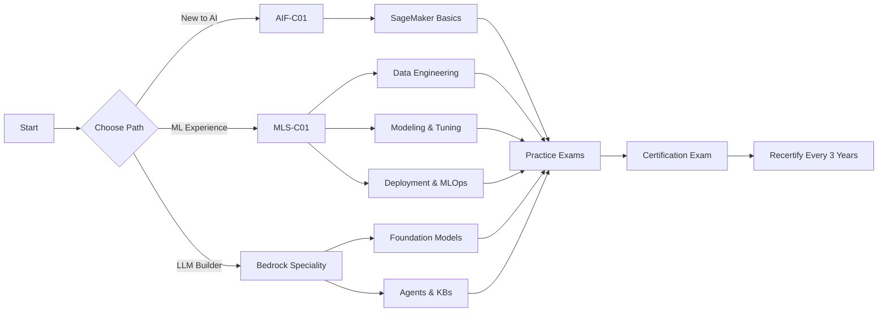
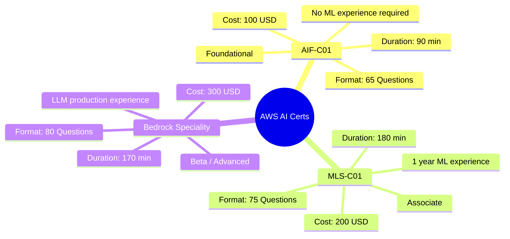
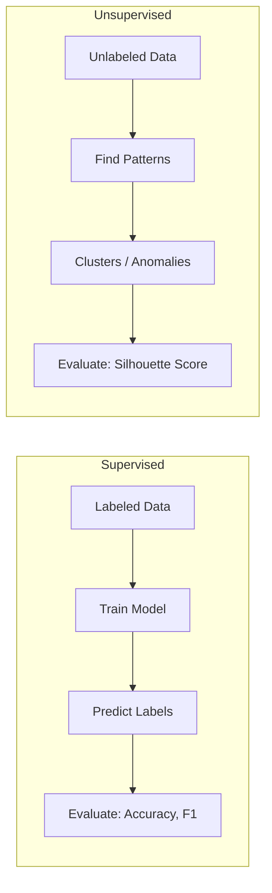
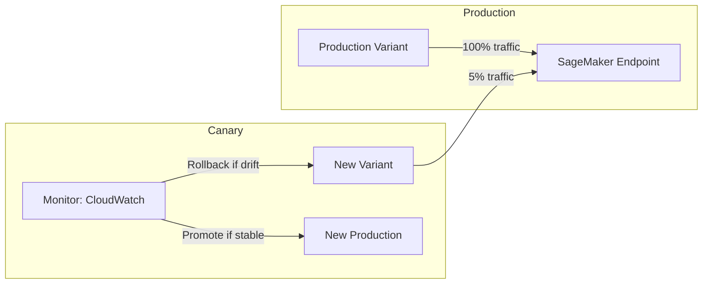
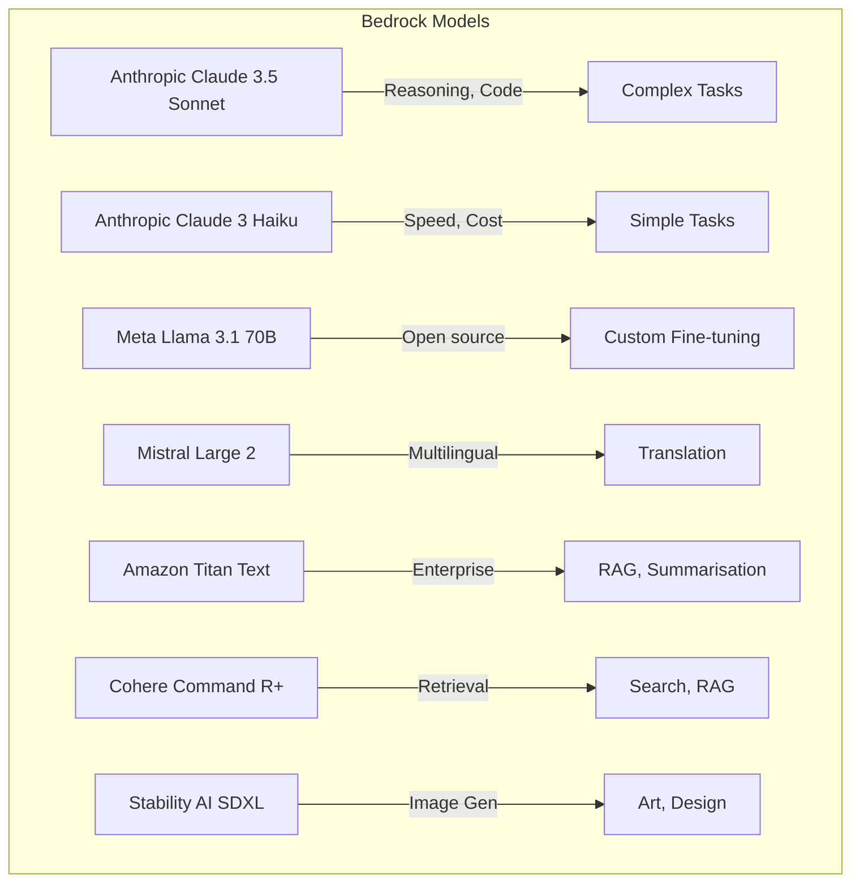
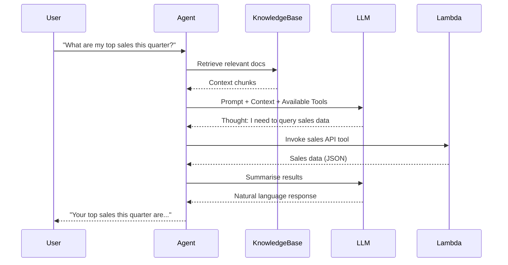
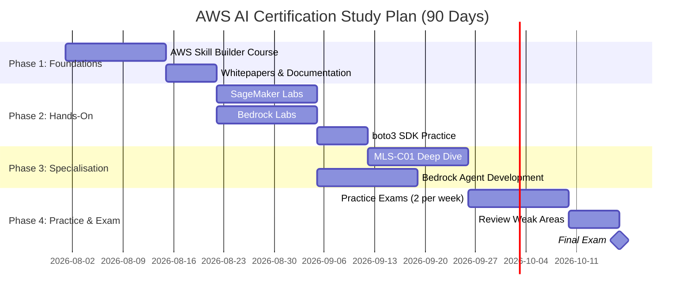
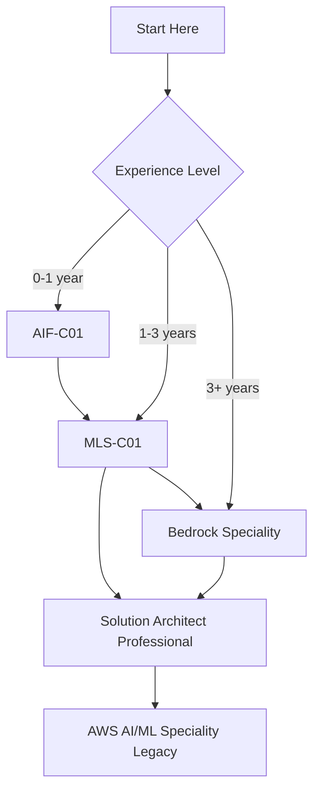
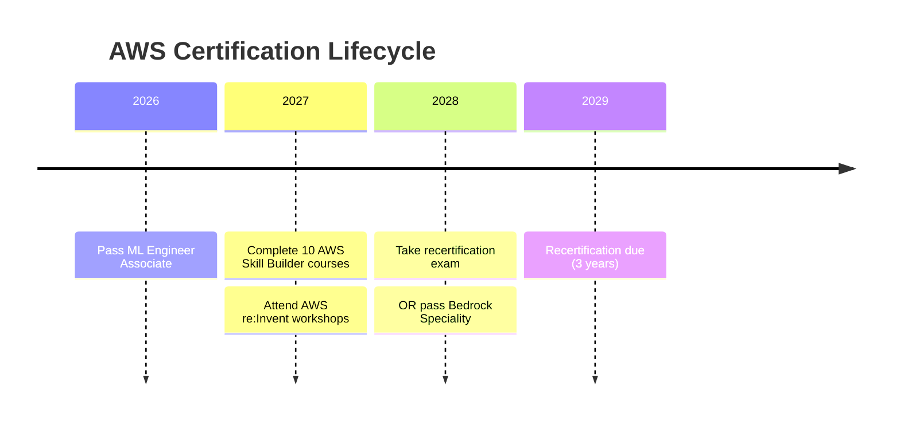

<!-- Clear Language: Keep sentences under 50 words -->
# AWS AI Certifications — Complete Guide

## Learning Objectives

| LO | Description |
|----|-------------|
| LO1 | Understand the AWS AI certification landscape and choose the right path |
| LO2 | Master the AWS Certified AI Practitioner exam domains and study plan |
| LO3 | Analyse the MLS-C01 Machine Learning Engineer Associate blueprint |
| LO4 | Configure Amazon Bedrock agents, knowledge bases, and guardrails |
| LO5 | Build a 90-day study roadmap with hands-on labs and practice exams |

## Introduction

AWS offers the most comprehensive cloud AI certification portfolio in the industry. As of 2026, the certification track includes three AI-specific credentials: AWS Certified AI Practitioner (AIF-C01), AWS Certified Machine Learning Engineer Associate (MLS-C01), and the Bedrock Speciality beta. Over 85% of enterprises running AI workloads on AWS require team members with certified expertise. For placement seekers, an AWS AI certification signals production-ready skills in SageMaker, Bedrock, and MLOps — exactly what hiring managers at FAANG and AI-first companies look for.

This chapter breaks down each certification: exam domains, difficulty level, cost, and preparation strategy. You will learn the exact services, algorithms, and SDK calls tested in each exam. We cover boto3 code patterns for SageMaker training, Bedrock model invocation, and guardrail configuration. By the end, you will have a personalised study plan mapped to your career stage.

## Prerequisites

- AWS free tier account (sign up at aws.amazon.com/free)
- Basic Python programming (boto3 SDK experience helpful)
- Familiarity with ML concepts (supervised/unsupervised learning)
- Docker and container basics (for SageMaker deployment sections)
- IAM role and policy fundamentals

## Key Terminology

| Term | Definition |
|------|------------|
| **AIF-C01** | AWS Certified AI Practitioner — foundational AI certification |
| **MLS-C01** | AWS Certified Machine Learning Engineer — associate-level cert |
| **Amazon Bedrock** | Fully managed service for foundation models via API |
| **SageMaker** | End-to-end ML platform for building, training, and deploying models |
| **Knowledge Base** | Bedrock feature that connects FMs to enterprise data sources |
| **Guardrail** | Content filtering policies applied to model inputs and outputs |
| **FM (Foundation Model)** | Pre-trained large language or multimodal model |
| **S3 (Simple Storage Service)** | Object storage used for datasets, models, and artifacts |
| **MWAA (Managed Workflows for Apache Airflow)** | Managed Airflow for ML pipeline orchestration |
| **Endpoint** | SageMaker or Bedrock deployment target for inference |
| **Training Job** | SageMaker managed compute for model training |
| **Hyperparameter Tuning (HPO)** | Automated search for optimal training parameters |
| **Canary / Blue-Green Deployment** | Deployment strategies for safe production rollouts |
| **Data Lake** | Centralised repository for structured and unstructured data |
| **Feature Store** | SageMaker component for storing, sharing, and managing features |

## Chapter at a Glance

| Section | Topic | Key Concept |
|---------|-------|-------------|
| 5.1 | AWS AI Certification Landscape | Three certs, three skill tiers |
| 5.2 | AIF-C01 — AI Practitioner | Foundational AI/ML, Bedrock, SageMaker basics |
| 5.3 | MLS-C01 — ML Engineer | Data engineering, modeling, deployment, MLOps |
| 5.4 | Bedrock Speciality | FMs, agents, knowledge bases, guardrails |
| 5.5 | Study Strategy & Roadmap | 90-day plan, labs, practice exams |
| 5.6 | Certification Path & Costs | Which cert when, recertification, pricing |

## Chapter Roadmap



## 5.1 AWS AI Certification Landscape



AWS launched the AIF-C01 in 2024 to address the gap between foundational cloud knowledge and specialised ML engineering. The three certifications form a pyramid:

1. **AIF-C01 (Foundational)** — Tests general AI/ML literacy, Bedrock concepts, and SageMaker basics. No coding required. Best for product managers, sales engineers, and beginners.

2. **MLS-C01 (Associate)** — Replaced the deprecated AWS Certified Machine Learning Speciality. Tests hands-on ML engineering: data preparation, feature engineering, model training, hyperparameter tuning, deployment, and MLOps. Requires Python and at least one year of ML experience.

3. **Bedrock Speciality (Beta)** — Advanced certification focused exclusively on Amazon Bedrock. Covers foundation model selection, prompt engineering, agents, knowledge bases, guardrails, and cost optimisation. Designed for AI engineers building production LLM applications.

### Exam Comparison Matrix

| Feature | AIF-C01 | MLS-C01 | Bedrock Speciality |
|---------|---------|---------|-------------------|
| Launch Year | 2024 | 2024 (replaces MLS) | 2025 (beta) |
| Questions | 65 | 75 | 80 |
| Time (min) | 90 | 180 | 170 |
| Pass Score | ~70% | ~75% | ~75% |
| Cost (USD) | 100 | 200 | 300 |
| Recertification | 3 years | 3 years | 3 years |
| Prerequisite | None | 1 year ML exp | 2 years AI exp |
| Labs | No | Yes (SageMaker) | Yes (Bedrock) |

## 5.2 AIF-C01 — AWS Certified AI Practitioner

### 5.2.1 Exam Domains

The AIF-C01 exam blueprint defines four domains with the following weightings:

| Domain | Weight | Topics |
|--------|--------|--------|
| Domain 1: AI/ML Fundamentals | 24% | Supervised/unsupervised learning, model types, evaluation metrics |
| Domain 2: Bedrock & FM Concepts | 28% | Foundation models, agents, knowledge bases, guardrails |
| Domain 3: SageMaker & ML Workflows | 30% | SageMaker Studio, training, deployment, AutoML |
| Domain 4: Responsible AI | 18% | Bias, fairness, explainability, governance |

### 5.2.2 AI/ML Foundations

**Supervised vs Unsupervised Learning**



**Key algorithms tested:**

- **Linear Regression** — Continuous target prediction
- **Logistic Regression** — Binary classification
- **Decision Trees / Random Forest** — Ensemble classification
- **K-Means Clustering** — Unsupervised grouping
- **PCA (Principal Component Analysis)** — Dimensionality reduction
- **XGBoost** — Gradient boosted trees (SageMaker built-in algorithm)
- **Image Classification (ResNet)** — CNN-based vision models

**Evaluation metrics:**

| Metric | Use Case | Formula (Concept) |
|--------|----------|-------------------|
| Accuracy | Balanced classes | (TP + TN) / (TP + TN + FP + FN) |
| Precision | Spam detection | TP / (TP + FP) |
| Recall | Medical diagnosis | TP / (TP + FN) |
| F1 Score | Imbalanced data | 2 * P * R / (P + R) |
| RMSE | Regression | sqrt(mean((y - y_pred)^2)) |
| R² | Regression fit | 1 - (SS_res / SS_tot) |

### 5.2.3 Bedrock Basics

Amazon Bedrock is a fully managed service that provides access to foundation models from AI21 Labs, Anthropic, Cohere, Meta, Mistral, Stability AI, and Amazon via a single API.

**Key concepts tested:**

- **Foundation Models (FMs)** — Pre-trained models invoked via Bedrock API
- **Provisioned Throughput** — Reserved capacity for production workloads
- **Model Customisation (Fine-tuning)** — Train FMs on your data
- **Agents** — FMs + tools to execute multi-step tasks
- **Knowledge Bases** — RAG (Retrieval Augmented Generation) with enterprise data
- **Guardrails** — Content filtering, PII redaction, topic denial

**boto3 SDK — Invoke a Bedrock model:**

```python
import boto3
import json

bedrock = boto3.client(service_name="bedrock-runtime", region_name="us-east-1")

model_id = "anthropic.claude-3-sonnet-20240229-v1:0"
prompt = "Explain supervised learning in one paragraph."

request_body = {
    "anthropic_version": "bedrock-2023-05-31",
    "max_tokens": 200,
    "temperature": 0.7,
    "messages": [{"role": "user", "content": prompt}],
}

response = bedrock.invoke_model(
    modelId=model_id,
    contentType="application/json",
    accept="application/json",
    body=json.dumps(request_body),
)

result = json.loads(response["body"].read())
print(result["content"][0]["text"])
```

**Sample output:**

```
Supervised learning is a machine learning paradigm where a model is trained on a labeled dataset,
meaning each training example is paired with an output label. The model learns to map inputs to
correct outputs by minimising prediction error through iterative optimisation. Common algorithms
include linear regression for continuous values and decision trees for classification tasks.
```

### 5.2.4 SageMaker Basics

SageMaker is AWS's end-to-end ML platform. The AIF-C01 tests conceptual understanding of:

| Component | Purpose |
|-----------|---------|
| SageMaker Studio | Web-based IDE for ML workflows |
| Data Wrangler | Visual data preparation and transformation |
| Autopilot | Automated ML (AutoML) for tabular data |
| Training Jobs | Managed compute for model training |
| Hyperparameter Tuning | Bayesian or random search for best parameters |
| Endpoints | Real-time or serverless inference |
| Model Monitor | Detect drift in production models |
| Clarify | Bias detection and feature importance |

**boto3 SDK — SageMaker training job:**

```python
import boto3

sagemaker = boto3.client("sagemaker", region_name="us-east-1")

training_job_name = "aif-c01-demo-xgboost"

response = sagemaker.create_training_job(
    TrainingJobName=training_job_name,
    AlgorithmSpecification={
        "TrainingImage": "683313688378.dkr.ecr.us-east-1.amazonaws.com/sagemaker-xgboost:1.5-1",
        "TrainingInputMode": "File",
    },
    RoleArn="arn:aws:iam::123456789012:role/SageMakerRole",
    InputDataConfig=[
        {
            "ChannelName": "train",
            "DataSource": {
                "S3DataSource": {
                    "S3DataType": "S3Prefix",
                    "S3Uri": "s3://my-bucket/train/",
                    "S3DataDistributionType": "FullyReplicated",
                }
            },
        }
    ],
    OutputDataConfig={"S3OutputPath": "s3://my-bucket/output/"},
    ResourceConfig={
        "InstanceType": "ml.m5.large",
        "InstanceCount": 1,
        "VolumeSizeInGB": 20,
    },
    StoppingCondition={"MaxRuntimeInSeconds": 3600},
)

print(f"Training job {training_job_name} created: {response['TrainingJobArn']}")
```

The exam expects you to understand what each parameter controls. Pay special attention to `InstanceType`, `TrainingImage` (built-in algorithm container), and `S3DataDistributionType` (ShardedByS3Key for large datasets).

## 5.3 MLS-C01 — AWS Certified Machine Learning Engineer Associate

### 5.3.1 Exam Domains

The MLS-C01 blueprint covers four domains. This exam is hands-on — expect scenario-based questions that test your ability to choose the right AWS service and configuration.

| Domain | Weight | Key Areas |
|--------|--------|-----------|
| Domain 1: Data Engineering | 20% | S3, Glue, Athena, Data Wrangler, feature engineering |
| Domain 2: Exploratory Data Analysis | 20% | Visualisation, statistics, missing values, outliers |
| Domain 3: Modeling | 36% | Algorithm selection, training, HPO, SageMaker Autopilot |
| Domain 4: Deployment & MLOps | 24% | Endpoints, CI/CD, monitoring, model registry |

### 5.3.2 Data Engineering (Domain 1)

Data engineering on AWS involves ingesting, cleaning, transforming, and storing data at scale.

**Key services:**

- **Amazon S3** — Data lake storage (Parquet, CSV, JSON, Avro formats)
- **AWS Glue** — Serverless ETL, Data Catalog, crawlers
- **Amazon Athena** — Serverless SQL queries on S3 data
- **SageMaker Data Wrangler** — Visual data preparation with 300+ transforms
- **Amazon EMR** — Managed Spark/Hadoop for large-scale processing

**boto3 SDK — Glue ETL job:**

```python
import boto3

glue = boto3.client("glue", region_name="us-east-1")

job_name = "ml-feature-pipeline"

response = glue.create_job(
    Name=job_name,
    Role="arn:aws:iam::123456789012:role/GlueServiceRole",
    Command={
        "Name": "glueetl",
        "ScriptLocation": "s3://my-bucket/scripts/feature_engineer.py",
        "PythonVersion": "3",
    },
    DefaultArguments={
        "--TempDir": "s3://my-bucket/temp/",
        "--job-bookmark-option": "job-bookmark-enable",
    },
    MaxRetries=0,
    WorkerType="G.1X",
    NumberOfWorkers=10,
    Timeout=60,
    GlueVersion="4.0",
)

print(f"Glue job created: {response['Name']}")
```

**Feature engineering patterns tested:**

- Handling missing values (mean/median imputation, drop rows)
- Encoding categorical variables (one-hot, label encoding, target encoding)
- Scaling numeric features (StandardScaler, MinMaxScaler, RobustScaler)
- Creating polynomial features
- Feature selection (correlation matrix, mutual information, feature importance)
- Handling imbalanced data (SMOTE, class weights, random undersampling)
- Time-series feature extraction (lag features, rolling windows, timestamps)

```python
# Feature engineering with pandas — typical MLS-C01 scenario
import pandas as pd
import numpy as np
from sklearn.preprocessing import StandardScaler, OneHotEncoder
from sklearn.compose import ColumnTransformer
from sklearn.impute import SimpleImputer

# Sample raw data
df = pd.DataFrame({
    "age": [25, 30, None, 45, 35],
    "income": [50000, 60000, 75000, None, 82000],
    "education": ["Bachelors", "Masters", "Bachelors", "PhD", "Masters"],
    "target": [0, 1, 0, 1, 1],
})

# Define preprocessing pipeline
numeric_features = ["age", "income"]
categorical_features = ["education"]

numeric_transformer = SimpleImputer(strategy="median")
categorical_transformer = OneHotEncoder(drop="first")

preprocessor = ColumnTransformer(
    transformers=[
        ("num", numeric_transformer, numeric_features),
        ("cat", categorical_transformer, categorical_features),
    ]
)

X_processed = preprocessor.fit_transform(df.drop("target", axis=1))
print(f"Processed feature shape: {X_processed.shape}")
```

### 5.3.3 Exploratory Data Analysis (Domain 2)

EDA covers data distribution, correlation, outliers, and visualisation techniques.

**Key skills tested:**

- Use **SageMaker Data Wrangler** for visual EDA
- Generate **QuickSight** dashboards for datasets
- Compute summary statistics (mean, median, std, skewness, kurtosis)
- Visualise with Matplotlib/Seaborn (histograms, box plots, scatter plots)
- Detect outliers using IQR or Z-score methods
- Identify multicollinearity with VIF (Variance Inflation Factor)

```python
# EDA snippet — typical MLS-C01 scenario
import pandas as pd
import numpy as np
import matplotlib.pyplot as plt
import seaborn as sns

df = pd.read_csv("s3://my-bucket/data/transactions.csv")
print(df.describe())
print(df.isnull().sum())

# Detect outliers using IQR
Q1 = df["amount"].quantile(0.25)
Q3 = df["amount"].quantile(0.75)
IQR = Q3 - Q1
outliers = df[(df["amount"] < Q1 - 1.5 * IQR) | (df["amount"] > Q3 + 1.5 * IQR)]
print(f"Outliers detected: {len(outliers)}")

# Correlation matrix
corr = df.corr()
sns.heatmap(corr, annot=True, cmap="coolwarm")
plt.title("Feature Correlation Matrix")
plt.show()
```

### 5.3.4 Modeling (Domain 3)

This is the heaviest domain. The exam tests your ability to select, train, tune, and evaluate ML models.

**SageMaker built-in algorithms:**

| Algorithm | Type | Use Case |
|-----------|------|----------|
| XGBoost | Gradient boosting | Tabular classification/regression |
| Linear Learner | Linear models | Regression, binary classification |
| K-Means | Clustering | Customer segmentation |
| PCA | Dimensionality reduction | Feature compression, visualisation |
| Object Detection (SSD/YOLO) | Computer vision | Image analysis |
| BlazingText | NLP | Text classification, word2vec |
| DeepAR | Time-series | Forecasting |

**Hyperparameter Tuning with SageMaker:**

```python
import boto3

sagemaker = boto3.client("sagemaker", region_name="us-east-1")

tuning_job_name = "xgboost-hpo-demo"

response = sagemaker.create_hyper_parameter_tuning_job(
    HyperParameterTuningJobName=tuning_job_name,
    HyperParameterTuningJobConfig={
        "Strategy": "Bayesian",  # Random, Bayesian, or Grid
        "ResourceLimits": {"MaxNumberOfTrainingJobs": 20, "MaxParallelTrainingJobs": 3},
        "ObjectiveObjectiveMetric": {
            "Type": "Maximize",
            "MetricName": "validation:auc",
        },
        "ParameterRanges": {
            "IntegerParameterRanges": [
                {
                    "Name": "max_depth",
                    "MinValue": "3",
                    "MaxValue": "10",
                },
                {
                    "Name": "num_round",
                    "MinValue": "50",
                    "MaxValue": "500",
                },
            ],
            "ContinuousParameterRanges": [
                {
                    "Name": "eta",
                    "MaxValue": "0.3",
                    "MinValue": "0.01",
                },
                {
                    "Name": "subsample",
                    "MaxValue": "1.0",
                    "MinValue": "0.5",
                },
            ],
        },
    },
    TrainingJobDefinition={
        "StaticHyperParameters": {"objective": "binary:logistic"},
        "AlgorithmSpecification": {
            "TrainingImage": "683313688378.dkr.ecr.us-east-1.amazonaws.com/sagemaker-xgboost:1.5-1",
            "TrainingInputMode": "File",
        },
        "RoleArn": "arn:aws:iam::123456789012:role/SageMakerRole",
        "InputDataConfig": [...],
        "OutputDataConfig": {"S3OutputPath": "s3://my-bucket/output/"},
        "ResourceConfig": {
            "InstanceType": "ml.m5.large",
            "InstanceCount": 1,
            "VolumeSizeInGB": 20,
        },
        "StoppingCondition": {"MaxRuntimeInSeconds": 3600},
    },
)

print(f"HPO job created: {response['HyperParameterTuningJobArn']}")
```

**Model evaluation:**

- **Regression:** RMSE, MAE, R², Adjusted R²
- **Binary Classification:** Confusion matrix, Accuracy, Precision, Recall, F1, AUC-ROC, Log Loss
- **Multi-class:** Macro/micro F1, Confusion matrix, Top-K accuracy
- **Clustering:** Silhouette score, Davies-Bouldin index, Inertia

### 5.3.5 Deployment & MLOps (Domain 4)

Deployment covers endpoint configuration, scaling, A/B testing, and monitoring.

**Deployment strategies:**



**SageMaker endpoint deployment:**

```python
import boto3

sagemaker = boto3.client("sagemaker", region_name="us-east-1")

model_name = "xgboost-model-v1"
endpoint_config_name = "xgboost-endpoint-config"
endpoint_name = "xgboost-prod-endpoint"

# Step 1: Create model
sagemaker.create_model(
    ModelName=model_name,
    PrimaryContainer={
        "Image": "683313688378.dkr.ecr.us-east-1.amazonaws.com/sagemaker-xgboost:1.5-1",
        "ModelDataUrl": "s3://my-bucket/model-artifacts/model.tar.gz",
    },
    ExecutionRoleArn="arn:aws:iam::123456789012:role/SageMakerRole",
)

# Step 2: Create endpoint configuration with production variants
sagemaker.create_endpoint_config(
    EndpointConfigName=endpoint_config_name,
    ProductionVariants=[
        {
            "VariantName": "prod-v1",
            "ModelName": model_name,
            "InitialInstanceCount": 2,
            "InstanceType": "ml.m5.large",
            "InitialVariantWeight": 1.0,
        }
    ],
    DataCaptureConfig={
        "EnableCapture": True,
        "InitialSamplingPercentage": 100,
        "DestinationS3Uri": "s3://my-bucket/data-capture/",
        "CaptureOptions": [
            {"CaptureMode": "Input"},
            {"CaptureMode": "Output"},
        ],
    },
)

# Step 3: Create endpoint
sagemaker.create_endpoint(
    EndpointName=endpoint_name,
    EndpointConfigName=endpoint_config_name,
)

print(f"Endpoint {endpoint_name} deploying...")
```

**MLOps concepts tested:**

| Concept | AWS Service | Purpose |
|---------|-------------|---------|
| Model Registry | SageMaker Registry | Version models, manage approval |
| CI/CD Pipelines | SageMaker Pipelines / CodePipeline | Automate training → deploy |
| Model Monitoring | SageMaker Model Monitor | Detect data/concept drift |
| Feature Store | SageMaker Feature Store | Store/share features across teams |
| Experiment Tracking | SageMaker Experiments | Compare training runs |
| Orchestration | MWAA / Step Functions | Schedule retraining workflows |

## 5.4 Bedrock Speciality

### 5.4.1 Exam Domains

The Bedrock Speciality (beta) is AWS's newest AI certification. It focuses exclusively on the Bedrock platform.

| Domain | Weight | Topics |
|--------|--------|--------|
| Domain 1: FM Selection & Customisation | 25% | Model comparison, fine-tuning, provisioned throughput |
| Domain 2: Agents & Knowledge Bases | 30% | RAG, multi-step reasoning, API integration |
| Domain 3: Guardrails & Responsible AI | 20% | Content filters, PII redaction, topic policies |
| Domain 4: Cost Optimisation & Monitoring | 25% | Cost calculation, CloudWatch, X-Ray tracing |

### 5.4.2 Foundation Models on Bedrock

Bedrock provides access to multiple FMs. The exam tests your ability to choose the right model for a given use case.



**boto3 SDK — List available foundation models:**

```python
import boto3

bedrock = boto3.client("bedrock", region_name="us-east-1")

response = bedrock.list_foundation_models()

for model in response["modelSummaries"]:
    print(f"{model['modelId']:50s} | {model['modelName']:30s} | {model['providerName']}")
```

**Model customisation (fine-tuning):**

```python
import boto3

bedrock = boto3.client("bedrock", region_name="us-east-1")

fine_tuning_job = bedrock.create_model_customization_job(
    jobName="my-fine-tune-job",
    customModelName="my-custom-claude",
    roleArn="arn:aws:iam::123456789012:role/BedrockCustomizationRole",
    baseModelIdentifier="arn:aws:bedrock:us-east-1::foundation-model/anthropic.claude-3-haiku-20240307-v1:0",
    trainingDataConfig={
        "s3Uri": "s3://my-bucket/fine-tune-data/train.jsonl"
    },
    validationDataConfig={
        "s3Uri": "s3://my-bucket/fine-tune-data/validation.jsonl"
    },
    outputDataConfig={
        "s3Uri": "s3://my-bucket/fine-tune-output/"
    },
    hyperParameters={
        "epochCount": "3",
        "batchSize": "8",
        "learningRate": "0.0001",
    },
)

print(f"Fine-tuning job created: {fine_tuning_job['jobArn']}")
```

### 5.4.3 Agents & Knowledge Bases

**Agents** extend FMs with tools to interact with external systems. The agent architecture works as follows:



**boto3 SDK — Create a Bedrock Agent:**

```python
import boto3

bedrock_agent = boto3.client("bedrock-agent", region_name="us-east-1")

agent_response = bedrock_agent.create_agent(
    agentName="sales-analyst-agent",
    agentResourceRoleArn="arn:aws:iam::123456789012:role/BedrockAgentRole",
    foundationModel="anthropic.claude-3-sonnet-20240229-v1:0",
    instruction="You are a sales analyst assistant. Answer questions about sales data using the available tools.",
    idleSessionTTLInSeconds=1800,
    promptOverrideConfiguration={
        "promptConfigurations": [
            {
                "promptType": "ORCHESTRATION",
                "promptCreationMode": "DEFAULT",
                "promptState": "ENABLED",
                "basePromptTemplate": "You are a helpful assistant. Use tools when needed.",
            }
        ]
    },
)

agent_id = agent_response["agent"]["agentId"]

# Associate a knowledge base
bedrock_agent.associate_agent_knowledge_base(
    agentId=agent_id,
    knowledgeBaseId="KB123456",
    description="Sales knowledge base with quarterly reports.",
    knowledgeBaseState="ENABLED",
)

# Create an action group (tool)
bedrock_agent.create_agent_action_group(
    agentId=agent_id,
    actionGroupName="sales-api-tools",
    description="Tools to query the sales API.",
    actionGroupExecutor={"lambda": "arn:aws:lambda:us-east-1:123456789012:function:sales-api"},
    apiSchema={"s3": {"s3BucketName": "my-bucket", "s3ObjectKey": "schemas/sales-api.json"}},
)

print(f"Agent created: {agent_id}")
```

**Knowledge Bases** implement RAG (Retrieval Augmented Generation). The exam tests:

| Component | Description |
|-----------|-------------|
| Data Source | S3 buckets, web crawlers, Salesforce, Confluence |
| Chunking Strategy | Fixed size, semantic, recursive |
| Embedding Model | Amazon Titan Embeddings, Cohere Embed |
| Vector Store | OpenSearch Serverless, Aurora PostgreSQL (pgvector) |
| Retrieval Config | Top-K, similarity threshold, hybrid search |

**boto3 SDK — Create a Knowledge Base:**

```python
import boto3

bedrock_agent = boto3.client("bedrock-agent", region_name="us-east-1")

kb_response = bedrock_agent.create_knowledge_base(
    name="company-policy-kb",
    description="Knowledge base for company HR policies.",
    roleArn="arn:aws:iam::123456789012:role/BedrockKBExecutionRole",
    knowledgeBaseConfiguration={
        "type": "VECTOR",
        "vectorKnowledgeBaseConfiguration": {
            "embeddingModelArn": "arn:aws:bedrock:us-east-1::foundation-model/amazon.titan-embed-text-v2:0"
        },
    },
    storageConfiguration={
        "type": "OPENSEARCH_SERVERLESS",
        "opensearchServerlessConfiguration": {
            "collectionArn": "arn:aws:aoss:us-east-1:123456789012:collection/my-kb-collection",
            "vectorIndexName": "company-policy-index",
            "fieldMapping": {
                "metadataField": "metadata",
                "textField": "text",
            },
        },
    },
)

kb_id = kb_response["knowledgeBase"]["knowledgeBaseId"]

# Add data source
bedrock_agent.create_data_source(
    knowledgeBaseId=kb_id,
    name="hr-policies-s3",
    dataSourceConfiguration={
        "type": "S3",
        "s3Configuration": {
            "bucketArn": "arn:aws:s3:::company-hr-policies",
            "inclusionPrefixes": ["policies/"],
        },
    },
)

# Start ingestion
bedrock_agent.start_ingestion_job(
    knowledgeBaseId=kb_id,
    dataSourceId="DS123456",
)

print(f"Knowledge Base created: {kb_id}")
```

### 5.4.4 Guardrails

Bedrock Guardrails provide content filtering policies for model inputs and outputs.

**Guardrail configurations:**

| Configuration | Description | Example |
|-------------|-------------|---------|
| Content Filters | Block hate, insults, sexual, violence, misconduct | Threshold: HIGH, MEDIUM, LOW |
| PII Redaction | Detect and mask PII (SSN, email, phone) | Mask: `***` |
| Topic Denial | Block specific conversation topics | Block: `stock trading advice` |
| Word Filters | Block specific words or phrases | Custom word list |

**boto3 SDK — Create a Guardrail:**

```python
import boto3

bedrock = boto3.client("bedrock", region_name="us-east-1")

guardrail_response = bedrock.create_guardrail(
    name="production-guardrail",
    description="Guardrail for production AI assistant.",
    topicPolicyConfig={
        "topicsConfig": [
            {
                "name": "Financial Advice",
                "definition": "Topics related to stock trading, investment advice, or financial planning.",
                "examples": ["Should I buy Amazon stock?", "What is a good investment?"],
                "type": "DENY",
            }
        ]
    },
    contentPolicyConfig={
        "filtersConfig": [
            {"type": "HATE", "inputStrength": "HIGH", "outputStrength": "HIGH"},
            {"type": "INSULTS", "inputStrength": "MEDIUM", "outputStrength": "HIGH"},
            {"type": "SEXUAL", "inputStrength": "HIGH", "outputStrength": "HIGH"},
            {"type": "VIOLENCE", "inputStrength": "HIGH", "outputStrength": "HIGH"},
            {"type": "MISCONDUCT", "inputStrength": "HIGH", "outputStrength": "HIGH"},
        ]
    },
    sensitiveInformationPolicyConfig={
        "piiEntitiesConfig": [
            {"type": "SSN", "action": "BLOCK"},
            {"type": "EMAIL", "action": "ANONYMIZE"},
            {"type": "PHONE", "action": "ANONYMIZE"},
        ]
    },
    wordPolicyConfig={
        "wordsConfig": [
            {"text": "competitor_name"},
            {"text": "internal_secret"},
        ]
    },
    blockedInputMessaging="I cannot respond to this request.",
    blockedOutputsMessaging="I cannot share this information.",
)

guardrail_id = guardrail_response["guardrailId"]
guardrail_version = guardrail_response["version"]

print(f"Guardrail created: {guardrail_id} (version {guardrail_version})")
```

## 5.5 Study Strategy & 90-Day Roadmap

### 5.5.1 Official Resources

| Resource | URL | Purpose |
|----------|-----|---------|
| AWS Skill Builder | skillbuilder.aws | Official training, labs, exam prep |
| AWS Whitepapers | aws.amazon.com/whitepapers | Well-Architected, ML best practices |
| AWS Documentation | docs.aws.amazon.com | SageMaker, Bedrock service docs |
| AWS Ramp-Up Guides | aws.amazon.com/training/ramp-up-guides | Curated learning paths |
| AWS Sample Questions | aws.amazon.com/certification | Free question sets |
| Tutorials Dojo | tutorialsdojo.com | Practice tests (paid) |
| A Cloud Guru | learn.acloud.guru | Video courses (paid) |

### 5.5.2 90-Day Study Plan



**Weekly breakdown:**

| Week | Focus | Activities |
|------|-------|------------|
| 1-2 | AI/ML Foundations | Skill Builder: ML Essentials, Statistics review |
| 3 | AWS AI Overview | Read Well-Architected ML whitepaper, Bedrock overview |
| 4 | SageMaker Basics | Data Wrangler, Autopilot, Training Jobs lab |
| 5 | SageMaker Advanced | HPO, Endpoints, Model Monitor lab |
| 6 | Bedrock Models | Compare FMs, invoke via SDK, prompt engineering |
| 7 | Bedrock Agents | Build agent, knowledge base, action groups |
| 8 | Bedrock Guardrails | Configure filters, PII redaction, topic denial |
| 9 | MLOps Deep Dive | SageMaker Pipelines, Model Registry, CI/CD |
| 10 | Practice Exams | Take 2 full-length exams, identify weak areas |
| 11 | Weak Area Review | Revisit domain 3 (modeling) or domain 4 (MLOps) |
| 12 | Final Preparation | Review notes, take final exam, book certification |

### 5.5.3 Hands-On Lab Checklist

| Lab | Service | Est. Time |
|-----|---------|-----------|
| Build a SageMaker Autopilot model | SageMaker Autopilot | 1 hour |
| Train XGBoost with Hyperparameter Tuning | SageMaker HPO | 2 hours |
| Deploy a real-time endpoint with auto-scaling | SageMaker Endpoints | 1 hour |
| Set up Model Monitor for data drift | SageMaker Model Monitor | 1.5 hours |
| Invoke Claude 3 via Bedrock API | Bedrock Runtime | 30 min |
| Build a RAG chatbot with Bedrock + Knowledge Base | Bedrock KB | 2 hours |
| Create a Bedrock Agent with Lambda tools | Bedrock Agents | 2 hours |
| Configure guardrails with PII redaction | Bedrock Guardrails | 1 hour |
| Build a SageMaker Pipeline end-to-end | SageMaker Pipelines | 2 hours |
| Implement A/B testing with production variants | SageMaker Endpoints | 1.5 hours |

### 5.5.4 Cost Considerations

| Activity | AWS Service | Estimated Cost |
|----------|-------------|----------------|
| SageMaker training (ml.m5.large, 10 hours) | SageMaker | ~$10 |
| Bedrock model invocation (10K requests) | Bedrock | ~$3-5 |
| Knowledge Base (OpenSearch, 1 month) | OpenSearch Serverless | ~$15 |
| Guardrail evaluation (10K requests) | Bedrock Guardrails | ~$2 |
| Total lab budget | — | **$30-40** |

## 5.6 Certification Path & Costs

### 5.6.1 Recommended Path



**Decision guide:**

| Your Profile | Start With | Why |
|-------------|------------|-----|
| Student / fresher | AIF-C01 | Builds foundational knowledge, lower cost ($100) |
| ML engineer (1-3 yr exp) | MLS-C01 | Associate-level, high placement value ($200) |
| LLM app builder | Bedrock Speciality | Advanced, validates hands-on agent experience ($300) |
| Solutions architect | AIF-C01 + SA Pro | Full stack cloud + AI coverage |
| Data scientist | MLS-C01 | Emphasises data engineering and modeling |

### 5.6.2 Exam Costs & Discounts

| Certification | Standard Cost (USD) | Retake Cost | Discount Options |
|--------------|---------------------|-------------|------------------|
| AIF-C01 | $100 | $100 | AWS re:Invent discount, Exam Voucher |
| MLS-C01 | $200 | $200 | AWS Skill Builder subscription (20% off) |
| Bedrock Speciality | $300 | $300 | Beta exam (50% off during beta period) |
| AWS Certified Solutions Architect Pro | $300 | $300 | Bundle with MLS-C01 |

**Cost-saving tips:**

- Take the **beta exam** for Bedrock Speciality (typically 50% discount)
- Subscribe to AWS Skill Builder Team tier ($449/year) for access to official practice exams
- Use AWS free tier for most lab exercises ($30-40 total for full course)
- Apply for **AWS re:Invent voucher** if attending the conference

### 5.6.3 Recertification

All AWS certifications require recertification every **3 years**. Options:

- Take the current version of the same exam
- Take a higher-level certification (automatically renews lower-level certs)
- For MLS-C01 holders: passing Bedrock Speciality renews MLS-C01
- Complete AWS recertification exam (lightweight version)

**Recertification timeline:**



## 5.7 Common Exam Pitfalls

| Pitfall | Why It Traps You | How to Avoid |
|---------|------------------|--------------|
| Confusing SageMaker built-in algorithms | Questions ask "best algorithm for X" | Memorise use case → algorithm mapping |
| Ignoring data formats | Parquet vs CSV vs JSON for Athena | Practice Athena queries on each format |
| Underestimating IAM policies | Scenario questions about access denied | Study least privilege, service roles |
| Missing retry logic for Bedrock API | Transient errors in production | Implement exponential backoff |
| Confusing provisioned vs on-demand throughput | Cost vs latency trade-off | Know when to use each throughput mode |
| Forgetting SageMaker Studio vs Notebooks | Migration scenarios | Practise both environments |
| Misunderstanding model drift vs data drift | Monitoring alerts | Study SageMaker Model Monitor docs |

## Interview Q&A

### Question 1

**Q:** You need to deploy a real-time inference endpoint for a fraud detection model on SageMaker. The model uses XGBoost trained on 500 GB of transaction data. Describe the architecture, including data capture for monitoring and auto-scaling.

**A:** Create a SageMaker model from the training artifacts (model.tar.gz in S3). Configure an endpoint with `DataCaptureConfig` enabled (sampling 100% initially, then reducing to 10%). Use `ProductionVariants` with initial instance count of 2 on `ml.m5.large`. Attach an auto-scaling policy with target tracking based on `SageMakerVariantInvocationsPerInstance` (target: 1000). For monitoring, configure Model Monitor schedule to run daily, comparing current traffic against baseline created from the first hour of data.

### Question 2

**Q:** What is the difference between SageMaker Autopilot and SageMaker Hyperparameter Tuning (HPO)? When would you use each?

**A:** Autopilot is fully automated ML: it explores multiple algorithms, preprocessing pipelines, and hyperparameter configurations to find the best model without manual intervention. HPO assumes you have already chosen an algorithm and want to optimise its hyperparameters. Use Autopilot for rapid prototyping (non-ML engineers, quick baselines). Use HPO when you have domain knowledge about the best algorithm and need fine-grained control.

### Question 3

**Q:** How do Bedrock Knowledge Bases implement RAG? Walk through the ingestion and retrieval flow.

**A:** Ingestion: Documents from S3 are split into chunks (configurable chunk size and overlap). Each chunk is embedded using an embedding model (e.g., Titan Embeddings v2) and stored in a vector store (OpenSearch Serverless or Aurora PostgreSQL with pgvector). Retrieval: User query is embedded using the same model. The vector store performs similarity search (cosine or euclidean) returning top-K chunks. These chunks are injected into the FM prompt as context. The FM generates a response grounded in the retrieved context.

### Question 4

**Q:** Your Bedrock agent is returning hallucinated responses even though you have a knowledge base attached. What debugging steps do you take?

**A:** 1) Verify the knowledge base ingestion job completed successfully. 2) Check the retrieval configuration — the `topK` might be too low (increase to 5-10). 3) Reduce the `similarityThreshold` to return more relevant chunks. 4) Review the orchestration prompt template to ensure it instructs the model to use retrieved context only. 5) Enable trace logging on the agent to inspect which chunks are retrieved per query. 6) Consider switching to a more capable FM (e.g., Claude 3.5 Sonnet over Haiku for complex reasoning).

### Question 5

**Q:** Explain the difference between data drift and concept drift in SageMaker Model Monitor.

**A:** Data drift occurs when the statistical distribution of input features changes over time (e.g., customer age distribution shifts). Concept drift occurs when the relationship between input features and the target variable changes (e.g., buying patterns change after a pandemic). SageMaker Model Monitor detects data drift by comparing feature distributions against a baseline. For concept drift, you need to track model performance metrics (accuracy, precision) over time and retrain when they degrade.

### Question 6

**Q:** You need to choose a foundation model on Bedrock for a multilingual customer support chatbot supporting 15 languages. Compare Claude 3.5 Sonnet, Mistral Large 2, and Cohere Command R+ for this task.

**A:** Mistral Large 2 has best multilingual support (trained on 100+ languages) — ideal for broad language coverage. Claude 3.5 Sonnet has excellent reasoning but weaker language coverage outside major languages. Cohere Command R+ has strong retrieval capabilities but multilingual support is limited to ~10 languages. Recommendation: Mistral Large 2 for the base model; supplement with Claude 3.5 Sonnet for complex reasoning queries. Use Bedrock's model routing to direct queries based on language detected.

### Question 7

**Q:** Walk through the steps to set up a CI/CD pipeline for SageMaker model training and deployment using SageMaker Pipelines.

**A:** 1) Define a SageMaker Pipeline with steps: Processing (Data Wrangler/Spark), Training (XGBoost), Evaluation (calculate metrics), Condition (if accuracy > threshold → register model). 2) Register the approved model in SageMaker Model Registry with `ModelApprovalStatus="Approved"`. 3) Configure an EventBridge rule that triggers on model version approval. 4) The event triggers a CodePipeline that deploys the model to staging endpoint, runs integration tests, then promotes to production (blue-green deployment). 5) Model Monitor starts capturing data from the new endpoint automatically.

### Question 8

**Q:** What are the key parameters in Bedrock Guardrails and how do they protect against prompt injection?

**A:** Guardrails can filter both inputs and outputs at configurable thresholds (LOW, MEDIUM, HIGH). For prompt injection protection, use content filters (HATE, INSULTS, VIOLENCE, MISCONDUCT, SEXUAL) at HIGH strength for inputs. Add topic policies to block instructions about prompt injection techniques. Configure word filters to block known injection patterns ("ignore previous instructions", "system prompt"). PII redaction prevents sensitive data leakage. Guardrails operate at the API layer before the model processes the input, making them effective against first-order prompt injection.

### Question 9

**Q:** Compare Provisioned Throughput vs On-Demand Throughput for Bedrock model invocation. When would you use each?

**A:** On-Demand: Pay per token, no commitment, suitable for variable/unknown workloads, development, and prototyping. Provisioned Throughput: Purchase model capacity in hourly commitments (1 hour min), 20-40% cost reduction at scale, guaranteed throughput (no throttling). Use on-demand for low-volume or bursty workloads (development, testing). Use provisioned throughput for production workloads with predictable traffic (100+ RPM). Provisioned throughput also supports reserved capacity for fine-tuned models.

### Question 10

**Q:** You have 500 GB of transaction data in CSV format in S3. You need to prepare features for an XGBoost fraud model. Design the data engineering pipeline using AWS services.

**A:** 1) Use AWS Glue Crawler to catalogue the CSV schema. 2) Write a Glue ETL job (Spark) to: convert CSV to Parquet (columnar, faster queries), handle missing values (mean imputation for numeric, mode for categorical), encode categorical variables (StringIndexer + OneHotEncoder), scale numeric features (StandardScaler), create date-based features (day_of_week, hour, is_weekend). 3) Store processed features in S3 (Parquet, partitioned by date). 4) Use SageMaker Feature Store to define a feature group with online (for real-time) and offline (for training) storage. 5) Create a training dataset by querying the offline feature store with Athena. 6) Feed the training dataset to SageMaker XGBoost.

## Chapter Quiz (5 MCQ)

**Q1:** Which AWS service would you use to build a RAG chatbot that retrieves information from company PDFs stored in S3?

A) SageMaker Autopilot
B) Bedrock Knowledge Base
C) SageMaker Data Wrangler
D) AWS Glue

<details>
<summary>Answer</summary>
**B** — Bedrock Knowledge Base ingests documents from S3, creates embeddings, stores them in a vector store, and retrieves relevant context for FM prompts.
</details>

---

**Q2:** An ML engineer needs to automatically find the best combination of hyperparameters for an XGBoost model without testing every combination manually. Which SageMaker feature should they use?

A) SageMaker Autopilot
B) SageMaker Hyperparameter Tuning (HPO)
C) SageMaker Pipelines
D) SageMaker Model Monitor

<details>
<summary>Answer</summary>
**B** — HPO uses Bayesian optimisation (or random/grid search) to find optimal hyperparameters efficiently. Autopilot explores multiple algorithms, not just hyperparameters.
</details>

---

**Q3:** Which of the following is NOT a valid Bedrock Guardrail content filter type?

A) HATE
B) VIOLENCE
C) BIAS
D) SEXUAL

<details>
<summary>Answer</summary>
**C** — BIAS is not a content filter type in Bedrock Guardrails. The five filter types are HATE, INSULTS, SEXUAL, VIOLENCE, and MISCONDUCT.
</details>

---

**Q4:** What is the minimum recertification interval for AWS AI certifications?

A) 1 year
B) 2 years
C) 3 years
D) 5 years

<details>
<summary>Answer</summary>
**C** — All AWS certifications (including AIF-C01, MLS-C01, Bedrock Speciality) require recertification every 3 years.
</details>

---

**Q5:** In SageMaker Model Monitor, what is the difference between a baseline and a constraint file?

A) Baseline contains actual traffic data; constraint file has expected thresholds
B) Baseline is the training dataset; constraint file is the test dataset
C) Baseline contains expected statistics for features; constraint file defines rules (acceptable range)
D) There is no difference; they are the same file

<details>
<summary>Answer</summary>
**C** — The baseline captures expected feature statistics (mean, std, quantiles) from the training data or an initial inference window. The constraint file defines acceptable bounds for each statistic (e.g., "mean must be between 0.4 and 0.6").
</details>

## Summary

AWS AI certifications provide a structured path from foundational AI knowledge to advanced LLM deployment skills. The AIF-C01 builds core AI/ML literacy, the MLS-C01 validates production ML engineering capability, and the Bedrock Speciality demonstrates expertise in the generative AI stack.

This chapter covered the exam blueprints, domain weightings, key AWS services, and study strategies for each certification. You learned the boto3 SDK patterns for invoking Bedrock models, creating SageMaker training jobs, building agents with knowledge bases, and configuring guardrails. The 90-day study plan provides a week-by-week schedule with hands-on labs that cost under $50.

For placement preparation, prioritise the MLS-C01 certification — it carries the most weight with employers and validates the exact skills demanded by ML engineering roles. Pair certification study with the MLOps and Docker modules in this course for a complete skill set that sets you apart in interviews.

## Exercises

### Exercise 1: Bedrock Model Invocation

Write a boto3 Python script that:
1. Lists all available foundation models in Bedrock
2. Invokes Claude 3.5 Sonnet with the prompt "Explain MLOps in 3 bullet points"
3. Prints the response

**Starter code:**

```python
import boto3
import json

bedrock = boto3.client("bedrock", region_name="us-east-1")
bedrock_runtime = boto3.client("bedrock-runtime", region_name="us-east-1")

# Step 1: List foundation models
response = bedrock.list_foundation_models()
for model in response["modelSummaries"]:
    print(f"{model['modelId']}")

# Step 2: Invoke Claude 3.5 Sonnet
model_id = "anthropic.claude-3-5-sonnet-20240620-v1:0"
prompt = "Explain MLOps in 3 bullet points."

request_body = {
    "anthropic_version": "bedrock-2023-05-31",
    "max_tokens": 200,
    "messages": [{"role": "user", "content": prompt}],
}

response = bedrock_runtime.invoke_model(
    modelId=model_id,
    contentType="application/json",
    accept="application/json",
    body=json.dumps(request_body),
)

result = json.loads(response["body"].read())
print(result["content"][0]["text"])
```

### Exercise 2: SageMaker Training Job

Create a SageMaker training job for XGBoost using the boto3 SDK. Use the Iris dataset from S3 (`s3://sagemaker-sample-data-<region>/sklearn_iris/`). Configure:
- 1 instance of `ml.m5.large`
- Use the XGBoost built-in algorithm image
- Set `max_depth` and `eta` as static hyperparameters
- Enable `train` and `validation` channels

**Hint:** Use `sagemaker.image_uris.retrieve("xgboost", region, "1.5-1")` to get the correct image URI for your region.

### Exercise 3: Bedrock Knowledge Base Setup

Write a Python script using boto3 to:
1. Create a Bedrock Knowledge Base with OpenSearch Serverless as the vector store
2. Add an S3 data source pointing to `s3://my-company-docs/policies/`
3. Start an ingestion job

**Starter code:**

```python
import boto3

bedrock_agent = boto3.client("bedrock-agent", region_name="us-east-1")

# Step 1: Create knowledge base
kb_response = bedrock_agent.create_knowledge_base(
    name="my-knowledge-base",
    roleArn="arn:aws:iam::123456789012:role/BedrockKBExecutionRole",
    knowledgeBaseConfiguration={
        "type": "VECTOR",
        "vectorKnowledgeBaseConfiguration": {
            "embeddingModelArn": "arn:aws:bedrock:us-east-1::foundation-model/amazon.titan-embed-text-v2:0"
        },
    },
    storageConfiguration={
        "type": "OPENSEARCH_SERVERLESS",
        "opensearchServerlessConfiguration": {
            "collectionArn": "arn:aws:aoss:us-east-1:123456789012:collection/my-collection",
            "vectorIndexName": "my-index",
            "fieldMapping": {
                "metadataField": "metadata",
                "textField": "text",
            },
        },
    },
)
```

### Exercise 4: Guardrail Configuration

Using the boto3 SDK, create a Bedrock Guardrail named `production-guardrail` that:
- Blocks content containing HATE and VIOLENCE at HIGH threshold (both input and output)
- Redacts SSN and EMAIL PII entities
- Blocks topics related to "Medical Advice"
- Sets custom blocked messaging for inputs and outputs

### Exercise 5: Practice Exam Analysis

Take one of the following free AWS sample question sets:
- [AWS AI Practitioner Sample](https://d1.awsstatic.com/training-and-certification/docs/AI-Practitioner/AWS-Certified-AI-Practitioner_Sample-Questions.pdf)
- [ML Engineer Associate Sample](https://d1.awsstatic.com/training-and-certification/docs/MLS-C01/AWS-Certified-Machine-Learning-Engineer-Associate_Sample-Questions.pdf)

For each question you get wrong, write a one-paragraph explanation of the correct answer and reference the relevant AWS documentation page.

## Practical Takeaways

1. **AWS offers three AI certifications** — AIF-C01 (foundational), MLS-C01 (associate), Bedrock Speciality (advanced). Choose based on your experience level.

2. **AIF-C01 covers AI/ML fundamentals, Bedrock concepts, and SageMaker basics** — no coding required. Best starting point for students and non-engineers.

3. **MLS-C01 is the most valuable for placement seekers** — tests hands-on ML engineering with SageMaker. Domains include data engineering, modeling, deployment, and MLOps.

4. **Bedrock Speciality validates LLM production skills** — focuses on foundation models, agents, knowledge bases, and guardrails. Ideal for AI engineers building generative AI apps.

5. **Study with AWS Skill Builder + Hands-on Labs** — the 90-day roadmap includes SageMaker labs, Bedrock agent development, and practice exams.

6. **Budget $30-40 for labs** — AWS free tier covers most services; OpenSearch Serverless and Bedrock throughput are the main cost drivers.

7. **All certs require recertification every 3 years** — passing a higher-level exam automatically renews lower-level certs.

8. **Master boto3 SDK for all three certifications** — exam scenarios increasingly test SDK-level knowledge for SageMaker, Bedrock, and Guardrails.

## Placement Section

### Top 10 Interview Questions

#### Google Style

1. **Explain the core idea of AWS AI Certifications — Complete Guide in under 60 seconds, then give a real-world analogy.** — Structure: definition, how it works in one sentence, why it matters, analogy. Follow-up: what would break if you removed this from a production system?

2. **Design a minimal, well-typed function that demonstrates AWS AI Certifications — Complete Guide.** — Interviewer checks: signature with type hints, edge cases, complexity, and a clean docstring. Follow-up: how does your design behave with empty or malformed input?

3. **What are the common pitfalls when engineers first learn ** — List 3-4, then explain how you would prevent each in a code review.

#### Amazon Style

4. **Describe a production bug caused by misunderstanding AWS AI Certifications — Complete Guide. How did you diagnose and fix it?** — STAR format: situation, task, action, result. Mention logs, reproduction, root-cause analysis, and the regression test you added.

5. **How would you scale a system that relies on AWS AI Certifications — Complete Guide from 10 users to 10 million?** — Discuss bottlenecks, caching, monitoring, and when to redesign. Follow-up: what metrics would you track?

#### Microsoft Style

6. **Compare AWS AI Certifications — Complete Guide with the closest alternative approach. When would you choose each?** — Make a decision matrix: performance, maintainability, ecosystem, learning curve. Follow-up: what would change your decision?

7. **Walk through how you would test a component that depends on AWS AI Certifications — Complete Guide.** — Unit, integration, property-based tests; mocking boundaries; golden files for outputs.

#### NVIDIA Style

8. **How does AWS AI Certifications — Complete Guide behave differently at scale — memory, throughput, or precision-wise?** — Connect to data pipelines and model training if applicable. Follow-up: what happens to latency as input grows?

9. **How would you make an implementation of AWS AI Certifications — Complete Guide run faster on GPU hardware?** — Batch operations, vectorization, avoiding Python loops, reducing data movement.

#### AI Startup Style

10. **Write the smallest possible implementation of AWS AI Certifications — Complete Guide that is production-quality.** — Include error handling, type hints, and a one-line docstring. Follow-up: what would you refactor first when it grows?

### Resume Tips

- Name AWS AI Certifications — Complete Guide explicitly in your skills section, paired with a measurable achievement ("Reduced X by 40% using AWS AI Certifications — Complete Guide").
- Add a bullet describing a project that applies AWS AI Certifications — Complete Guide to real data, with numbers.
- Mention the tools and libraries you used alongside AWS AI Certifications — Complete Guide (linters, test frameworks, profiling tools).
- Keep resume bullets under 15 words and start each with an action verb.

### Interview Day Checklist

- Rehearse a 60-second explanation of AWS AI Certifications — Complete Guide and one real-world analogy.
- Prepare one STAR story about debugging a AWS AI Certifications — Complete Guide-related production issue.
- Review complexity and edge cases for the classic AWS AI Certifications — Complete Guide interview problem.
- Have questions ready: how does the team apply AWS AI Certifications — Complete Guide in production today?
- Test your environment (Python, editor, internet) 15 minutes before the interview.

## True/False

1. **True or False:** AWS AI Certifications — Complete Guide builds directly on the fundamentals covered in the earlier chapters of this module. — **True.** Every advanced topic in this module assumes the core concepts from the previous chapters.
2. **True or False:** You should write at least one code example for AWS AI Certifications — Complete Guide before moving to the next chapter. — **True.** Active recall with hands-on code beats passive reading for retention.
3. **True or False:** The complexity analysis for AWS AI Certifications — Complete Guide is the same regardless of input size. — **False.** Complexity grows with input size; always state best, average, and worst case.
4. **True or False:** Edge cases (empty input, invalid input, boundary values) matter for AWS AI Certifications — Complete Guide in production. — **True.** Most production bugs come from unhandled edge cases.
5. **True or False:** You should memorize the AWS AI Certifications — Complete Guide chapter content once and never review it again. — **False.** Spaced repetition (24h, 3 days, 1 week) dramatically improves long-term recall.

## Fill in the Blank

1. The chapter that covers AWS AI Certifications — Complete Guide is Chapter ___ of this module. — Answer: check the module's table of contents.
2. The time complexity of the standard approach to AWS AI Certifications — Complete Guide is ___. — Answer: review the theory section and state big-O notation.
3. The main edge case to handle when implementing AWS AI Certifications — Complete Guide is ___. — Answer: empty or invalid input handling, as discussed in the chapter.
4. The tools commonly used to debug AWS AI Certifications — Complete Guide issues are ___ and ___. — Answer: refer to the Debugging Guide section of this chapter.
5. The related topic that connects to AWS AI Certifications — Complete Guide in the next chapter is ___. — Answer: see the Next Topic section.

## Scenario Questions

1. **Scenario:** A teammate ships a change involving AWS AI Certifications — Complete Guide that breaks production at 3 AM. — Diagnosis: check the recent diff, reproduce locally with the failing input, check logs. Fix: revert, add a regression test, and review the root cause. Prevention: CI tests on edge cases and code review checklist.

2. **Scenario:** Your implementation of AWS AI Certifications — Complete Guide is correct but too slow for the required latency. — Measure first with a profiler. Common fixes: reduce redundant work, use built-in optimized functions, batch operations, or add caching. Only then consider algorithmic changes.

3. **Scenario:** A new hire asks you to explain AWS AI Certifications — Complete Guide in five minutes before a customer demo. — Use the 3-part answer: what it is (one sentence), how it works (one example), why it matters (one business impact). Then offer to go deeper after the demo.

4. **Scenario:** Your team's codebase has three different patterns for AWS AI Certifications — Complete Guide and you must standardize. — Write a short ADR (architecture decision record), pick the pattern with best maintainability, migrate incrementally, and add a linter rule to enforce it.

## Output Questions

1. **What is the output of the simplest correct implementation of AWS AI Certifications — Complete Guide on an empty input?** — Trace through the code: it should return the documented default (None, 0, empty collection) without raising.
2. **What is the output when the input is at the boundary value?** — Check off-by-one errors and inclusive/exclusive bounds in the chapter's examples.
3. **What does the implementation return when given invalid input types?** — With type hints and validation, it raises a clear error; without, it may fail silently.
4. **What is the output for the sample input given in the chapter's Examples section?** — Re-run the chapter's example code and compare against the documented output.
5. **What is the time complexity output when you profile the implementation at 10x input size?** — Expect the curve matching the chapter's complexity analysis (linear, quadratic, log-linear).

## Difficulty Level

| Level | Time | What It Takes |
|-------|------|---------------|
| Beginner | 1-2 sessions | Read theory, run the chapter examples, solve the Easy exercises |
| Intermediate | 3-5 sessions | Complete Medium exercises, explain AWS AI Certifications — Complete Guide to someone else |
| Advanced | 1+ week | Solve Hard exercises, optimize for real datasets, answer interview follow-ups |

## Tips & Tricks

- Always write a one-line example of AWS AI Certifications — Complete Guide from memory before opening the chapter — active recall first.
- Use the chapter's Revision Notes as a checklist: you have mastered AWS AI Certifications — Complete Guide when you can explain each bullet.
- Pair the chapter quiz with the Flashcards: wrong answers become your next study session's focus.
- For interviews, practice explaining AWS AI Certifications — Complete Guide twice: once with a technical audience, once with a non-technical audience.
- Keep a personal examples file where you collect your own AWS AI Certifications — Complete Guide snippets; interviewers love original examples.

## Memory Tricks

- **Acronym**: build a mnemonic from the 5 key concepts of AWS AI Certifications — Complete Guide listed in the Chapter at a Glance table.
- **Story**: link AWS AI Certifications — Complete Guide to a familiar story — the analogy in the Visual Analogy section is designed to stick.
- **Number anchor**: remember the complexity of AWS AI Certifications — Complete Guide by connecting it to a known algorithm of the same class.
- **Color code**: highlight the Theory, Examples, and Common Mistakes sections in different colors when reviewing.
- **Teach-back**: explain AWS AI Certifications — Complete Guide to an imaginary junior engineer for 2 minutes — gaps in your explanation are gaps in memory.

## Further Reading

- [AWS AI Practitioner Exam Guide](https://aws.amazon.com/certification/certified-ai-practitioner/)
- [ML Engineer Associate Exam Guide](https://aws.amazon.com/certification/certified-machine-learning-engineer-associate/)
- [Amazon Bedrock Documentation](https://docs.aws.amazon.com/bedrock/)
- [SageMaker Developer Guide](https://docs.aws.amazon.com/sagemaker/)
- [AWS Well-Architected ML Lens Whitepaper](https://docs.aws.amazon.com/wellarchitected/latest/machine-learning-lens/)
- [AWS Skill Builder - AI Learning Paths](https://skillbuilder.aws/)
- [AWS Certification Policy](https://aws.amazon.com/certification/policies/)

---

**Next Chapter:** [03 — Google Cloud AI →](03-google-cloud-ai.md)  
**Back to:** [Index →](index.md)

## Related Topics

- The previous chapter in this module (see table of contents) — foundational for AWS AI Certifications — Complete Guide
- The next chapter (see Next Topic below) — builds on AWS AI Certifications — Complete Guide
- The system design chapters in Module 07 — how AWS AI Certifications — Complete Guide fits into production architectures
- The interview preparation module — how AWS AI Certifications — Complete Guide is asked in screening rounds
- The capstone project — where AWS AI Certifications — Complete Guide is applied end-to-end

## FAQs

1. **Do I need to memorize all of AWS AI Certifications — Complete Guide, or understand the big picture?** — Understand the big picture first, then memorize the key facts via flashcards and spaced repetition. Interviewers reward depth over breadth.
2. **What if I get stuck on an exercise?** — Re-read the theory section, run the example code, then attempt again. If still stuck after 20 minutes, move on and return the next day.
3. **How much time should I spend on ** — Follow the Study Plan below: 1-2 weeks at 30-60 minutes daily is typical for placement preparation.
4. **Is AWS AI Certifications — Complete Guide asked in interviews?** — Yes — the Interview Q&A and Placement Section list the exact question styles used by top companies.
5. **What's the fastest way to master ** — Explain it out loud, write code without looking, and review the flashcards within 24 hours and again after 3 days.

## Important Notes

- AWS AI Certifications — Complete Guide is a core requirement for the rest of this module — do not skip the examples.
- Always analyze complexity (time and space) when working with AWS AI Certifications — Complete Guide.
- Production correctness means handling edge cases, not just the happy path.
- Interview answers should start with the definition, then the example, then the trade-offs.
- Revisit this chapter after finishing the module; the context from later chapters deepens understanding.

## Historical Context

- AWS AI Certifications — Complete Guide emerged as a standard practice because early systems failed without it — understanding why helps you explain it in interviews.
- The tools used for AWS AI Certifications — Complete Guide today evolved from simpler versions; the chapter covers the modern, recommended approach.
- Interviewers value knowing one historical fact about AWS AI Certifications — Complete Guide — it shows genuine interest, not just cramming.
- The library/tooling ecosystem around AWS AI Certifications — Complete Guide changes quickly; focus on fundamentals that remain stable.

## Security Considerations

- Never trust external input: validate and sanitize data before processing AWS AI Certifications — Complete Guide.
- Avoid `eval()` and dynamic code execution on untrusted strings.
- Log errors without leaking sensitive data (keys, PII, internal paths).
- For API contexts, add rate limiting and input size limits.
- Review the chapter's code examples for injection or overflow risks before using them verbatim.

## ML Intuition

- AWS AI Certifications — Complete Guide appears in ML pipelines at the data-processing layer: feature preparation, batching, and validation.
- Understanding AWS AI Certifications — Complete Guide helps you debug why a model misbehaves — most ML bugs are data bugs, not model bugs.
- In production ML, the AWS AI Certifications — Complete Guide concepts from this chapter map directly to NumPy/PyTorch operations on tensors.
- When optimizing ML systems, AWS AI Certifications — Complete Guide skills let you profile and fix the data path, not just the training loop.
- Interview follow-up: how would you apply AWS AI Certifications — Complete Guide to a dataset of 10 million records? — Batching and vectorization.

## Analogies

- **AWS AI Certifications — Complete Guide is like a recipe**: the theory is the ingredients, the examples are the cooking steps, and the exercises are your own kitchen practice.
- **Complexity is like a delivery route**: a linear route visits each stop once; a nested route revisits stops, and you feel it at scale.
- **Edge cases are like weather**: the happy path is a sunny day; production is the storm — build for the storm.
- **The chapter roadmap is a journey map**: each section is a checkpoint; skipping one means getting lost later in the module.

## Capstone Project Link

- [Module Capstone: End-to-End Project](https://github.com/Raushan666java/ai-engineering-journey) — this chapter contributes the AWS AI Certifications — Complete Guide skills used in the module's capstone project. Complete the exercises here before starting the capstone.

## Flashcards

<details class="tp-qa-card" data-qid="28certifications-02awsaicertifications-flash1">
  <summary class="tp-qa-question">
    <span class="tp-qa-status"></span>
    What is the core concept of AWS AI Certifications — Complete Guide in one sentence?
  </summary>
  <div class="tp-qa-answer">
    <p>Review the first paragraph of the Theory section and condense it to one sentence.</p>
  </div>
</details>

<details class="tp-qa-card" data-qid="28certifications-02awsaicertifications-flash2">
  <summary class="tp-qa-question">
    <span class="tp-qa-status"></span>
    What is the most common mistake engineers make with 
  </summary>
  <div class="tp-qa-answer">
    <p>Check the Common Mistakes section of this chapter.</p>
  </div>
</details>

<details class="tp-qa-card" data-qid="28certifications-02awsaicertifications-flash3">
  <summary class="tp-qa-question">
    <span class="tp-qa-status"></span>
    What is the time and space complexity of the standard AWS AI Certifications — Complete Guide approach?
  </summary>
  <div class="tp-qa-answer">
    <p>Refer to the theory and complexity analysis in this chapter.</p>
  </div>
</details>

<details class="tp-qa-card" data-qid="28certifications-02awsaicertifications-flash4">
  <summary class="tp-qa-question">
    <span class="tp-qa-status"></span>
    When is AWS AI Certifications — Complete Guide NOT the right choice?
  </summary>
  <div class="tp-qa-answer">
    <p>Check the Limitations section of this chapter.</p>
  </div>
</details>

<details class="tp-qa-card" data-qid="28certifications-02awsaicertifications-flash5">
  <summary class="tp-qa-question">
    <span class="tp-qa-status"></span>
    How is AWS AI Certifications — Complete Guide applied in a real production system?
  </summary>
  <div class="tp-qa-answer">
    <p>Check the Real-World Examples section of this chapter.</p>
  </div>
</details>

## Research References

- Official documentation of the primary library for AWS AI Certifications — Complete Guide (linked in Further Reading)
- The classic paper or textbook chapter introducing AWS AI Certifications — Complete Guide (see References below)
- The standard library reference for AWS AI Certifications — Complete Guide-related functions
- Engineering blog posts from companies running AWS AI Certifications — Complete Guide in production at scale
- PEPs and RFCs where applicable (Python and networking standards)

## Open-Source Tools

- The primary library used in this chapter (see the code examples)
- Python standard library modules used in the examples (check the imports)
- Testing: pytest for unit tests of AWS AI Certifications — Complete Guide code
- Linting and formatting: ruff + black
- Profiling: cProfile or py-spy for performance work on AWS AI Certifications — Complete Guide

## Debugging Guide

- Start with `print()` or a debugger to inspect intermediate values in AWS AI Certifications — Complete Guide code.
- Reproduce the failure with the smallest possible input before changing code.
- Check the common failure modes listed in Common Mistakes — most bugs are listed there.
- For performance problems, profile before optimizing: measure, then fix.
- When stuck, re-read the chapter's Examples and compare line by line with your code.
- Use `pdb` or your IDE's debugger to step through the AWS AI Certifications — Complete Guide example code.

## Mock Interview Section

**Round 1 — Screening (15 min)**
- Explain AWS AI Certifications — Complete Guide in 60 seconds.
- Write a minimal working example of AWS AI Certifications — Complete Guide.
- What is the complexity of your example?

**Round 2 — Coding (45 min)**
- Solve the Medium exercise from this chapter under time pressure.
- State your assumptions, then implement with type hints.
- Test with edge cases: empty input, boundary values, invalid input.

**Round 3 — Behavioral + System (30 min)**
- Tell me about a time you debugged a AWS AI Certifications — Complete Guide problem in a project.
- How would you design a system where AWS AI Certifications — Complete Guide is used at scale?
- What metrics would you monitor?

**Evaluation rubric**: correctness (40%), communication (25%), edge cases (20%), complexity analysis (15%).

## Optimized Implementation

`python
from typing import Any, Optional

def demonstrate_topic(input_data: list[Any]) -> Optional[float]:
    """Runnable scaffold for AWS AI Certifications — Complete Guide.

    Replace the body with the optimized implementation from the chapter,
    keeping type hints, docstring, and edge-case handling.
    """
    if not input_data:
        return None
    # Step 1: validate input types
    # Step 2: apply the core AWS AI Certifications — Complete Guide logic from the Examples section
    # Step 3: return the result with the documented default
    return 0.0
`

- Keeps the function signature stable so tests written against it stay valid.
- Handles the empty-input contract explicitly.
- Add unit tests for the edge cases before implementing the logic (test-first).

## Evaluation Metrics

| Skill | Test | Target |
|-------|------|--------|
| Concept recall | Explain AWS AI Certifications — Complete Guide without notes | 60-second explanation |
| Code fluency | Write the chapter example from memory | No syntax errors |
| Edge cases | Handle empty/invalid input in exercises | All cases pass |
| Complexity | State time/space for the standard approach | Correct big-O |
| Interview readiness | Answer 5 Interview Q&A questions out loud | Fluent, structured answers |
| Retention | Chapter quiz score after 3 days | 80%+ |

## Real-World Examples

- **Startup**: a small team uses AWS AI Certifications — Complete Guide daily in their data pipeline — the chapter's examples mirror their code.
- **E-commerce**: AWS AI Certifications — Complete Guide patterns appear in order processing, inventory checks, and recommendation feeds.
- **Fintech**: AWS AI Certifications — Complete Guide principles apply to transaction validation and fraud detection flows.
- **ML platform**: AWS AI Certifications — Complete Guide shows up in feature engineering and model-serving infrastructure.
- **Interview insight**: recruiters look for engineers who can connect AWS AI Certifications — Complete Guide to the business outcome, not just the code.

## Next Topic

[Google Cloud AI Certifications](03-google-cloud-ai.md)

## Limitations

- AWS AI Certifications — Complete Guide, like any technique, is not a silver bullet — it has specific cases where it fits best (covered in the theory).
- The examples in this chapter are simplified for learning; production systems add validation, monitoring, and error handling.
- Performance of AWS AI Certifications — Complete Guide depends on input size and distribution — always benchmark for your own data.
- This chapter covers fundamentals; specialized edge cases are explored in later chapters and the capstone.
