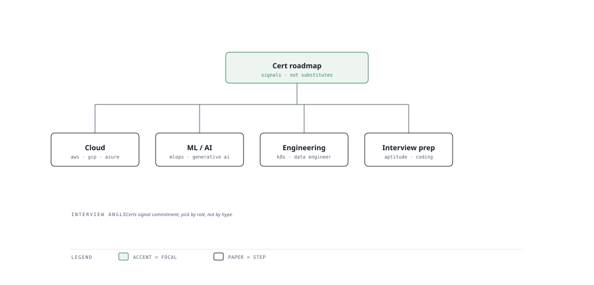

# Visual Notes — Mapping Certs to Direction

> One diagram, the full picture. This page is meant to be glanced at before reading the chapters, and again before interviews.

# What the diagram shows

1. **Cloud** — AWS / Azure / GCP foundations validate the infra you deploy onto.
1. **AI engineering** — Specialist AI / ML certs prove hands-on platform fluency.
1. **Domain** — Role-specific certs (data, security, engineering) tailor the story.

# Why this matters for placement

- A cert is a breadth floor, not a depth ceiling — know it maps to a role.
- Company-specific there is a spot for each platform on your resume.

# Quick revision

- So cloud certs say "I can deploy real infra", not just serve models.
- Each platform: certification path ⇒ one flagship cert.
- Pair every cert with a project so the paper has proof.
- Certs will not replace depth; use them to open doors and spike interviews.
- Renew on the platform cadence to keep the credential live.

# Related chapters

- [Azure AI](01-microsoft-azure-ai.md)
- [AWS AI certifications](02-aws-ai-certifications.md)
- [Google Cloud AI](03-google-cloud-ai.md)

---

**One-line answer for interviews:** *"Pick the cert that matches your career direction — cloud, ML, or AI engineering."*
