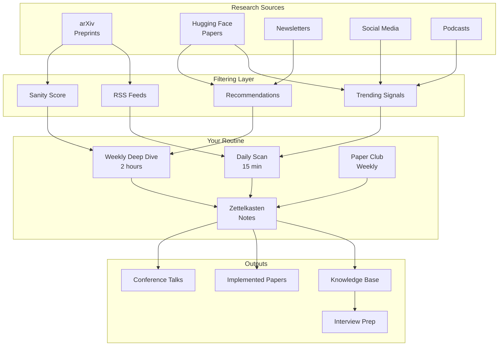
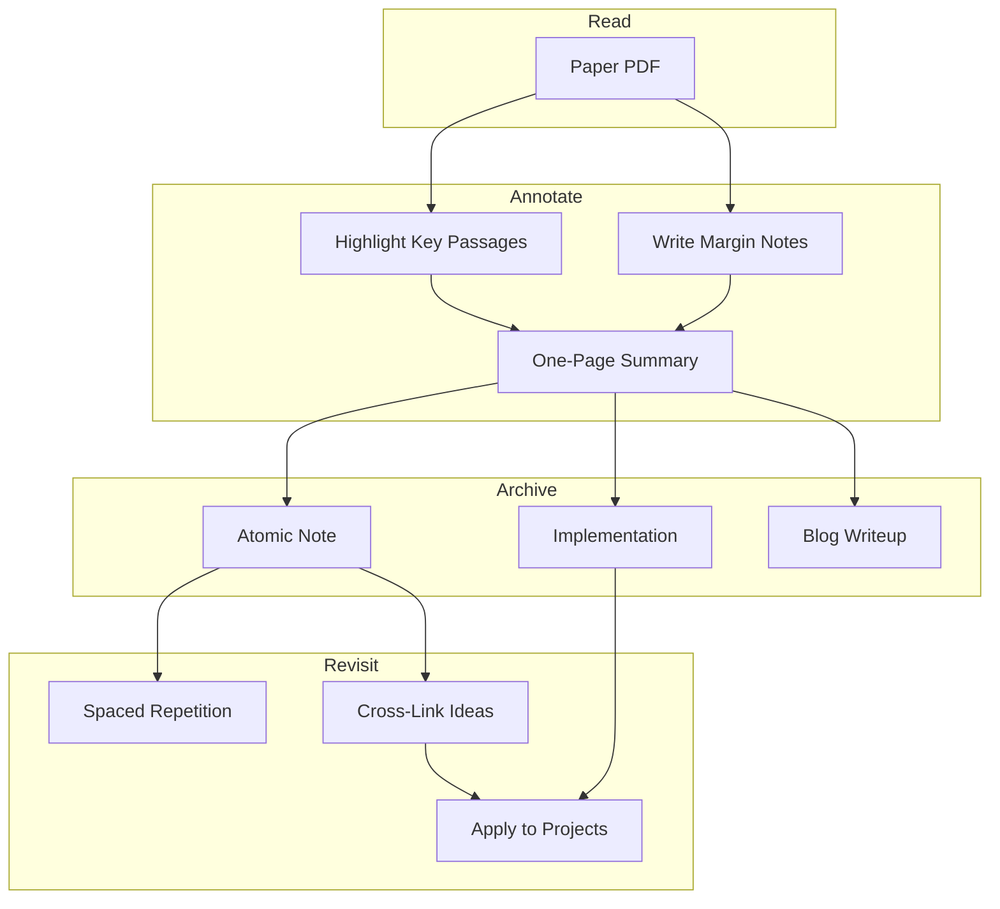

<!-- Clear Language: Keep sentences under 50 words -->
# Keeping Up with AI Research

## Learning Objectives

| LO | Description |
|----|-------------|
| LO1 | Navigate arXiv to find papers by category, author, and trending ranking |
| LO2 | Use Hugging Face Papers for daily paper discovery and community discussion |
| LO3 | Subscribe to and filter top AI newsletters for weekly digests |
| LO4 | Leverage social media and podcasts for real-time research awareness |
| LO5 | Build a sustainable daily and weekly routine for AI research reading |

## Introduction

AI research moves fast. Over 10,000 papers are published monthly on arXiv alone. New models, datasets, and techniques emerge weekly. Keeping up is not about reading everything. It is about building a system that surfaces the right papers at the right time.

This chapter gives you a practical toolkit for staying current. You will learn where to find papers, how to filter noise, and how to build a reading habit that scales with your career. By the end, you will have a complete research awareness system you can start using today.

## Prerequisites

- Basic understanding of machine learning concepts
- Familiarity with web browsing and RSS feeds
- A GitHub account (for Hugging Face integration)
- Python 3.8+ installed (for code examples)
- No prior research reading experience required

## Key Terminology

**Key Terms**: Core vocabulary and concepts for this topic.

**Definition**: Essential terms you must know for interviews and production work.

| Term | Definition |
|------|------------|
| arXiv | Open-access preprint server for research papers in physics, math, CS |
| Preprint | A research paper not yet peer-reviewed, shared for early feedback |
| RSS Feed | Web feed format for subscribing to content updates |
| Abstract | Brief summary of a paper's problem, method, and results |
| Citation Graph | Network of papers connected by references and citations |
| Sanity Score | arXiv Sanity's metric combining recency, author reputation, and buzz |
| Paper Club | Regular group meeting where members present and discuss papers |
| Zettelkasten | Note-taking method where each idea gets its own atomic note |

## Theory

Understanding keeping up with ai research is fundamental for AI engineers. This section covers the core concepts, underlying principles, and theoretical framework that govern how keeping up with ai research works in practice.

## Chapter at a Glance

| Section | Topic | Key Concept |
|---------|-------|-------------|
| 1.1 | arXiv Mastery | Paper categories, RSS feeds, author tracking, arXiv Sanity |
| 1.2 | Hugging Face Papers | Daily papers, trending, comments, model releases |
| 1.3 | AI Newsletters | TLDR AI, The Batch, Import AI, The Algorithm |
| 1.4 | Social Media & Communities | Twitter/X, r/MachineLearning, LinkedIn strategies |
| 1.5 | Podcasts & Video | Lex Fridman, Latent Space, W&B, YouTube channels |
| 1.6 | Building a Reading Routine | Daily schedule, paper clubs, annotation habits |

## Chapter Roadmap



```text

## 1.1 arXiv — The Research Backbone

arXiv (pronounced "archive") is the central repository for AI research. Almost every significant ML paper appears on arXiv before any conference. As of 2026, arXiv hosts over 2.5 million papers, with roughly 200 new CS papers added daily.

**Key Categories for AI Engineers:**

| Category | Code | Focus Area |
|----------|------|------------|
| Machine Learning | cs.LG | Core ML algorithms and theory |
| Artificial Intelligence | cs.AI | General AI and agent research |
| Computation and Language | cs.CL | NLP, LLMs, transformers |
| Computer Vision | cs.CV | Image recognition, generation, video |
| Robotics | cs.RO | Robot learning, control, simulation |
| Information Retrieval | cs.IR | Search, RAG, embeddings |
| Neural and Evolutionary Computing | cs.NE | Neural architecture search, neuroevolution |

### 1.1.1 RSS Feeds for arXiv

RSS is the oldest and most reliable way to track arXiv. Every category has an RSS feed. You can subscribe using any RSS reader.

```python
"""
arXiv RSS Feed Reader
Polls arXiv RSS feeds for new papers in specified categories.
"""
import feedparser
import datetime
from dataclasses import dataclass, field
from typing import List, Optional


@dataclass
class ArxivPaper:
    """Represents a single arXiv paper from an RSS feed."""
    id: str
    title: str
    authors: List[str]
    abstract: str
    categories: List[str]
    published: datetime.datetime
    link: str
    comment: Optional[str] = None


def fetch_arxiv_rss(
    category: str = "cs.LG",
    max_results: int = 20
) -> List[ArxivPaper]:
    """
    Fetch recent papers from an arXiv category RSS feed.

    Args:
        category: arXiv category code (e.g., 'cs.LG', 'cs.CL', 'cs.AI')
        max_results: Maximum number of papers to return

    Returns:
        List of ArxivPaper dataclass instances
    """
    # arXiv RSS feed URL pattern
    url = f"http://export.arxiv.org/rss/{category}"
    
    print(f"[INFO] Fetching RSS feed for category: {category}")
    feed = feedparser.parse(url)
    
    papers = []
    for entry in feed.entries[:max_results]:
        # Parse arXiv ID from the link
        link = entry.link.replace("http://", "https://")
        arxiv_id = link.split("/abs/")[-1] if "/abs/" in link else link
        
        # Extract authors from the entry
        author_tag = entry.get("author", "")
        authors = [a.strip() for a in author_tag.split(",") if a.strip()]
        
        # Parse published date
        published = datetime.datetime(*entry.published_parsed[:6]) \
            if entry.get("published_parsed") else datetime.datetime.now()
        
        # Get categories
        categories = [cat["term"] for cat in entry.get("tags", [])
                      if cat.get("term")]
        if not categories:
            categories = [category]
        
        paper = ArxivPaper(
            id=arxiv_id,
            title=entry.title.replace("\n", " ").strip(),
            authors=authors,
            abstract=entry.summary.strip(),
            categories=categories,
            published=published,
            link=link,
        )
        papers.append(paper)
    
    print(f"[INFO] Found {len(papers)} papers")
    return papers


def display_papers(papers: List[ArxivPaper]) -> None:
    """Pretty-print a list of papers."""
    for i, paper in enumerate(papers, 1):
        print(f"{'='*70}")
        print(f"{i}. {paper.title}")
        print(f"   Authors: {', '.join(paper.authors[:3])}" +
              (f" et al." if len(paper.authors) > 3 else ""))
        print(f"   Categories: {', '.join(paper.categories)}")
        print(f"   Published: {paper.published.strftime('%Y-%m-%d')}")
        print(f"   Link: {paper.link}")
        abstract_short = paper.abstract[:150].replace("\n", " ") + "..."
        print(f"   Abstract: {abstract_short}")
    print(f"{'='*70}")


# Example usage
if __name__ == "__main__":
    # Track multiple categories
    categories = ["cs.LG", "cs.CL", "cs.AI", "cs.CV"]
    all_papers = []
    
    for cat in categories:
        papers = fetch_arxiv_rss(cat, max_results=5)
        all_papers.extend(papers)
    
    # Sort by date, newest first
    all_papers.sort(key=lambda p: p.published, reverse=True)
    display_papers(all_papers[:10])
```

### 1.1.2 Tracking Specific Authors

Many researchers publish consistently in specific areas. Tracking their work gives you a curated signal. Use the arXiv API to fetch papers by author.

```python
"""
arXiv Author Tracker
Fetches recent papers from specific authors using the arXiv API.
"""
import urllib.request
import urllib.parse
import xml.etree.ElementTree as ET
import datetime
from typing import List, Dict


ARXIV_API_URL = "http://export.arxiv.org/api/query"


def query_arxiv(
    search_query: str,
    max_results: int = 10,
    sort_by: str = "submittedDate"
) -> List[Dict]:
    """
    Query the arXiv API for papers matching a search query.

    Args:
        search_query: arXiv API query string
        max_results: Maximum number of results
        sort_by: Sort field ('submittedDate', 'relevance', 'lastUpdatedDate')

    Returns:
        List of paper dictionaries
    """
    params = urllib.parse.urlencode({
        "search_query": search_query,
        "start": 0,
        "max_results": max_results,
        "sortBy": sort_by,
        "sortOrder": "descending",
    })
    url = f"{ARXIV_API_URL}?{params}"
    
    print(f"[INFO] Querying arXiv API: {search_query}")
    
    with urllib.request.urlopen(url) as response:
        xml_data = response.read().decode("utf-8")
    
    # Parse XML response
    ns = {"atom": "http://www.w3.org/2005/Atom",
          "arxiv": "http://arxiv.org/schemas/atom"}
    root = ET.fromstring(xml_data)
    
    papers = []
    for entry in root.findall("atom:entry", ns):
        paper = {
            "id": entry.find("atom:id", ns).text.strip() if entry.find(
                "atom:id", ns) is not None else "",
            "title": entry.find("atom:title", ns).text.replace(
                "\n", " ").strip() if entry.find(
                "atom:title", ns) is not None else "",
            "summary": entry.find("atom:summary", ns).text.replace(
                "\n", " ").strip() if entry.find(
                "atom:summary", ns) is not None else "",
            "authors": [
                author.find("atom:name", ns).text
                for author in entry.findall("atom:author", ns)
            ],
            "link": entry.find("atom:id", ns).text.strip() if entry.find(
                "atom:id", ns) is not None else "",
            "published": entry.find("atom:published", ns).text if entry.find(
                "atom:published", ns) is not None else "",
            "categories": [
                cat.get("term") for cat in entry.findall(
                    "atom:category", ns)
            ],
        }
        papers.append(paper)
    
    print(f"[INFO] Found {len(papers)} papers")
    return papers


def author_query(
    author_name: str,
    max_results: int = 10
) -> List[Dict]:
    """
    Search for papers by a specific author.

    Args:
        author_name: Full name or partial name
        max_results: Maximum number of papers to return
    """
    # arXiv API author search format
    query = f'au:"{author_name}"'
    return query_arxiv(query, max_results)


# Example: Track influential AI researchers
TRACKED_AUTHORS = [
    "Ashish Vaswani",       # Attention Is All You Need
    "Ilya Sutskever",       # Former OpenAI Chief Scientist
    "Yann LeCun",           # Meta AI Chief
    "Andrej Karpathy",      # Former Tesla AI, OpenAI
    "Fei-Fei Li",           # Stanford Vision Lab
    "Daphne Koller",        # Stanford AI, Coursera
    "Andrew Ng",            # Stanford, DeepLearning.AI
    "Demis Hassabis",       # Google DeepMind
    "Oriol Vinyals",        # Google DeepMind
    "Lilian Weng",          # OpenAI VP of AI
]

def track_authors(authors: List[str]) -> None:
    """Fetch recent papers for a list of tracked authors."""
    for author in authors:
        try:
            papers = author_query(author, max_results=3)
            print(f"\n--- Recent papers by {author} ---")
            for p in papers:
                title = p["title"][:100]
                date = p["published"][:10] if p["published"] else "unknown"
                print(f"  [{date}] {title}")
        except Exception as e:
            print(f"[ERROR] Failed to fetch papers for {author}: {e}")


if __name__ == "__main__":
    track_authors(TRACKED_AUTHORS[:5])
```

### 1.1.3 arXiv Sanity

arXiv Sanity (sanity.arXiv.org) is a web app built by Andrej Karpathy. It adds a social layer on top of arXiv. Papers are ranked by a "sanity score" that combines:

- **Recency**: Newer papers get a boost
- **Author reputation**: Papers from known researchers rank higher
- **Social buzz**: Based on Twitter mentions and likes
- **User votes**: Registered users upvote or downvote papers

The interface shows a grid of paper cards. Each card shows title, authors, abstract snippet, and a heat map of which sections people read most. You can train your personal feed by voting on papers. The more you vote, the better the recommendations.

```python
"""
arXiv Sanity Client
Simulates fetching and ranking papers by sanity score.
"""
import random
from dataclasses import dataclass, field
from typing import List, Dict
import datetime


@dataclass
class SanityPaper:
    """Paper with arXiv Sanity ranking metadata."""
    title: str
    authors: List[str]
    categories: List[str]
    arxiv_id: str
    submitted_date: datetime.date
    abstract: str
    twitter_mentions: int = 0
    user_votes: int = 0
    author_impact: float = 1.0
    recency_boost: float = 1.0


def compute_sanity_score(paper: SanityPaper) -> float:
    """
    Compute a simplified sanity score.

    Score = (social_buzz * 0.3) + (author_impact * 0.25)
          + (recency * 0.25) + (user_votes * 0.2)

    Higher is better — papers worth reading first.
    """
    # Normalize buzz: log scale dampens extreme values
    social_buzz = min(1.0, paper.twitter_mentions / 500)
    
    # Recency: papers from this week get full boost
    days_old = (datetime.date.today() - paper.submitted_date).days
    recency = max(0.0, 1.0 - (days_old / 60))  # decays over 60 days
    
    # Normalize votes: out of 100
    vote_score = min(1.0, paper.user_votes / 100)
    
    score = (
        social_buzz * 0.30 +
        paper.author_impact * 0.25 +
        recency * 0.25 +
        vote_score * 0.20
    )
    return round(score * 100, 1)


def rank_papers(papers: List[SanityPaper]) -> List[Dict]:
    """Rank papers by sanity score."""
    results = []
    for p in papers:
        score = compute_sanity_score(p)
        results.append({
            "title": p.title[:80],
            "first_author": p.authors[0] if p.authors else "Unknown",
            "score": score,
            "categories": ", ".join(p.categories[:2]),
            "date": p.submitted_date.isoformat(),
        })
    results.sort(key=lambda r: r["score"], reverse=True)
    return results


# Example: Create sample papers and rank them
if __name__ == "__main__":
    today = datetime.date.today()
    
    sample_papers = [
        SanityPaper(
            title="Scaling Data-Constrained Language Models",
            authors=["Niklas Muennighoff", "Alexander Rush", "Armen Aghajanyan"],
            categories=["cs.LG", "cs.CL"],
            arxiv_id="2305.16264",
            submitted_date=today - datetime.timedelta(days=2),
            abstract="We study the scaling of language models under data constraints...",
            twitter_mentions=1200,
            user_votes=85,
            author_impact=0.95,
        ),
        SanityPaper(
            title="Direct Preference Optimization: Your Language Model is a Reward Model",
            authors=["Rafael Rafailov", "Archit Sharma", "Eric Mitchell"],
            categories=["cs.LG", "cs.CL"],
            arxiv_id="2305.18290",
            submitted_date=today - datetime.timedelta(days=5),
            abstract="We propose Direct Preference Optimization (DPO)...",
            twitter_mentions=2400,
            user_votes=92,
            author_impact=0.80,
        ),
        SanityPaper(
            title="Tree of Thoughts: Deliberate Problem Solving with LLMs",
            authors=["Shunyu Yao", "Dian Yu", "Jeffrey Zhao"],
            categories=["cs.CL", "cs.AI"],
            arxiv_id="2305.10601",
            submitted_date=today - datetime.timedelta(days=30),
            abstract="We introduce Tree of Thoughts (ToT)...",
            twitter_mentions=4500,
            user_votes=110,
            author_impact=0.70,
            recency_boost=0.5,
        ),
    ]
    
    ranked = rank_papers(sample_papers)
    print("\n=== arXiv Sanity Rankings ===")
    for i, r in enumerate(ranked, 1):
        print(f"{i}. [{r['score']:5.1f}] {r['title']}")
        print(f"   by {r['first_author']} ({r['categories']})")
```

## 1.2 Hugging Face Papers

Hugging Face is more than a model hub. Its Papers page (papers.huggingface.co) is a daily curated feed of AI research. Unlike arXiv, which dumps every preprint, Hugging Face Papers adds human curation.

**Key Features:**

| Feature | Description | How to Use |
|---------|-------------|------------|
| Daily Papers | Curated selection of top papers each day | Check every morning |
| Trending | Papers with recent discussion activity | Sort by trending for social proof |
| Comment Threads | Community discussion on each paper | Read top comments for key insights |
| Model Releases | New models tied to papers | Try the model immediately |
| Bookmarks | Save papers to read later | Build your personal reading list |

**Why Hugging Face Papers Matters for AI Engineers:**

Papers on Hugging Face are actionable. Every paper page links to an official model, dataset, or demo. You can go from reading an abstract to running inference in minutes. This makes HF Papers the best bridge between theory and practice.

```python
"""
Hugging Face Papers Client
Fetches trending papers from Hugging Face Papers.
"""
import urllib.request
import json
from typing import List, Dict, Optional
from dataclasses import dataclass
import datetime


HF_PAPERS_API = "https://huggingface.co/api/daily_papers"


@dataclass
class HFPaper:
    """A paper from Hugging Face Papers."""
    title: str
    url: str
    upvotes: int
    num_comments: int
    paper_summary: str
    published_date: Optional[str] = None
    author_names: List[str] = None
    model_id: Optional[str] = None


def fetch_hf_daily_papers(
    limit: int = 10,
    sort_by: str = "trending"
) -> List[Dict]:
    """
    Fetch daily papers from Hugging Face.

    Args:
        limit: Number of papers to fetch
        sort_by: 'trending' or 'recent'

    Returns:
        List of paper data dictionaries
    """
    url = f"{HF_PAPERS_API}?limit={limit}"
    
    try:
        print(f"[INFO] Fetching Hugging Face daily papers...")
        with urllib.request.urlopen(url, timeout=10) as response:
            data = json.loads(response.read().decode("utf-8"))
        
        # Sort by trending (upvotes + comments) or by date
        if sort_by == "trending":
            data.sort(
                key=lambda p: p.get("upvotes", 0) + p.get("numComments", 0),
                reverse=True
            )
        
        print(f"[INFO] Retrieved {len(data)} papers")
        return data
    
    except Exception as e:
        print(f"[ERROR] Failed to fetch HF papers: {e}")
        return []


def display_hf_papers(papers: List[Dict]) -> None:
    """Display Hugging Face papers in a readable format."""
    for i, paper in enumerate(papers, 1):
        title = paper.get("title", "Unknown Title")[:90]
        upvotes = paper.get("upvotes", 0)
        comments = paper.get("numComments", 0)
        url = paper.get("url", "")
        
        print(f"\n{i}. {title}")
        print(f"   👍 {upvotes} upvotes  💬 {comments} comments")
        print(f"   {url}")
        
        # Show abstract summary if available
        summary = paper.get("paper_summary", "")
        if summary:
            summary_short = summary[:200].replace("\n", " ") + "..."
            print(f"   {summary_short}")


def build_reading_queue(
    papers: List[Dict],
    min_upvotes: int = 10
) -> List[Dict]:
    """
    Filter papers into a reading queue based on community signal.
    """
    queue = [p for p in papers if p.get("upvotes", 0) >= min_upvotes]
    queue.sort(key=lambda p: p.get("upvotes", 0), reverse=True)
    return queue


if __name__ == "__main__":
    # Fetch and display trending HF papers
    papers = fetch_hf_daily_papers(limit=15, sort_by="trending")
    
    if papers:
        print("\n=== Today's Hugging Face Papers (Trending) ===")
        display_hf_papers(papers[:5])
        
        queue = build_reading_queue(papers, min_upvotes=5)
        print(f"\n=== Reading Queue ({len(queue)} papers worth your time) ===")
        for i, p in enumerate(queue[:5], 1):
            print(f"{i}. {p.get('title', '')[:70]}")
```

**Pro Tip:** Comment threads on HF Papers are gold. Authors sometimes respond directly. Researchers debate methodology in the open. Reading the comments gives you a peer review experience without waiting for a conference.

## 1.3 Newsletters — Curated Intelligence

Newsletters are the most time-efficient way to stay informed. A good AI newsletter reads hundreds of papers and digests them into a 5-minute email.

### Top AI Newsletters for AI Engineers

| Newsletter | Author | Frequency | Best For | Read Time |
|------------|--------|-----------|----------|-----------|
| **TLDR AI** | TLDR Team | Daily | Quick industry news | 2 min |
| **The Batch** | Andrew Ng (DeepLearning.AI) | Weekly | Deep technical analysis | 15 min |
| **Import AI** | Jack Clark | Weekly | Big-picture AI trends | 10 min |
| **The Algorithm** | MIT Tech Review | Weekly | AI in the real world | 8 min |
| **AI Weekly** | Various | Weekly | Curated paper links | 5 min |
| **Last Week in AI** | Skynet Today | Weekly | Balanced news roundup | 10 min |
| **Chip Huyen's ML** | Chip Huyen | Monthly | Deep dives | 20 min |
| **Sebastian Raschka** | Sebastian Raschka | Monthly | Implementations | 15 min |

```python
"""
AI Newsletter Aggregator
Tracks and summarizes key AI newsletters by topic.
"""
from typing import List, Dict
from dataclasses import dataclass
import datetime


@dataclass
class NewsletterIssue:
    """Represents a single newsletter issue."""
    name: str
    issue_number: int
    date: datetime.date
    topics: List[str]
    key_papers: List[str]
    key_takeaway: str
    read_time_minutes: int


def categorize_newsletter_topics(
    issues: List[NewsletterIssue]
) -> Dict[str, int]:
    """
    Analyze newsletter topics to see which areas are trending.
    
    Returns a dict mapping topic -> count of mentions.
    """
    topic_counts = {}
    for issue in issues:
        for topic in issue.topics:
            topic_counts[topic] = topic_counts.get(topic, 0) + 1
    
    return dict(sorted(
        topic_counts.items(), key=lambda x: x[1], reverse=True
    ))


def sample_weekly_schedule() -> None:
    """Example weekly newsletter reading schedule."""
    schedule = [
        ("Monday", "TLDR AI", "Quick scan — 2 min"),
        ("Tuesday", "Import AI", "Read deeply — 10 min"),
        ("Wednesday", "TLDR AI", "Quick scan — 2 min"),
        ("Thursday", "The Algorithm", "Read and save links — 8 min"),
        ("Friday", "TLDR AI + The Batch", "Deep read and annotate — 17 min"),
        ("Weekend", "Skip newsletters, read saved papers", "30-60 min"),
    ]
    
    print("\n=== Weekly Newsletter Schedule ===")
    total_time = 0
    for day, newsletter, time in schedule:
        print(f"  {day:10s} | {newsletter:20s} | {time}")
        # Extract minutes for total
        if "min" in time:
            parts = time.split()
            for p in parts:
                if p.isdigit():
                    total_time += int(p)
    
    print(f"\n  Total weekly time: ~{total_time} minutes")
    print(f"  That is ~{total_time * 4} minutes per month")


if __name__ == "__main__":
    # Create sample newsletter issues for analysis
    sample_issues = [
        NewsletterIssue(
            name="The Batch",
            issue_number=250,
            date=datetime.date.today() - datetime.timedelta(days=2),
            topics=["LLM Agents", "RAG", "Model Evaluation"],
            key_papers=["Toolformer", "Retrieval-Augmented Generation"],
            key_takeaway="Agents are moving from research to production",
            read_time_minutes=15,
        ),
        NewsletterIssue(
            name="Import AI",
            issue_number=345,
            date=datetime.date.today() - datetime.timedelta(days=5),
            topics=["AI Safety", "Regulation", "Open Source Models"],
            key_papers=["Constitutional AI", "Llama 3"],
            key_takeaway="Regulatory frameworks are evolving quickly",
            read_time_minutes=10,
        ),
        NewsletterIssue(
            name="The Algorithm",
            issue_number=420,
            date=datetime.date.today() - datetime.timedelta(days=3),
            topics=["Generative AI", "Chips", "Energy"],
            key_papers=["AlphaFold 3"],
            key_takeaway="AI compute demand is reshaping hardware",
            read_time_minutes=8,
        ),
    ]
    
    topics = categorize_newsletter_topics(sample_issues)
    print("=== Trending Topics Across Newsletters ===")
    for topic, count in topics.items():
        bar = "█" * count
        print(f"  {topic:25s} | {bar} ({count})")
    
    sample_weekly_schedule()
```

**How to Avoid Newsletter Overload:**

1. **Unsubscribe ruthlessly** — If a newsletter sits unread for 3 weeks, drop it
2. **Use a dedicated email folder** — Newsletters go here, not your inbox
3. **Set a weekly newsletter block** — Process all newsletters in one sitting
4. **One-pass rule** — Read once, archive immediately. Do not let them pile up

## 1.4 Social Media & Communities

Real-time AI discussion happens on social media. Three platforms dominate: Twitter/X, Reddit, and LinkedIn.

### 1.4.1 Twitter/X — The AI Water Cooler

Twitter/X is where researchers announce papers first. Before a paper hits arXiv, the authors often tweet the title and abstract. Following the right accounts gives you a 24-hour headstart.

**Who to Follow:**

| Category | Accounts | Why Follow |
|----------|----------|------------|
| Research Leaders | @ilyasut, @ylecun, @karpathy, @jm_alexa | Breakthrough announcements |
| Lab Accounts | @OpenAI, @DeepMind, @MetaAI, @AnthropicAI | Official releases |
| Paper Aggregators | @arxiv_ml, @_akhaliq, @AI_Researcher_D | Daily paper summaries |
| AI Engineers | @cblumenst, @svpino, @rasbt | Practical implementation tips |
| Conference Accounts | @NeurIPSConf, @iclrconf, @ACLMeeting | Deadlines and proceedings |

**Twitter/X Reading Strategy:**

- Create a "AI Research" list or "AI/ML" Twitter feed
- Check it once a day (set a timer for 10 minutes)
- Like/bookmark papers to read later
- Do not engage in debates — just consume signal

### 1.4.2 Reddit — r/MachineLearning

Reddit's r/MachineLearning has the best community discussion of any AI forum. Every arXiv paper can be posted and discussed. The upvote system does a good job of surfacing impactful work.

**Key Thread Types:**

- **[R] Research**: Link to a new paper with author summary
- **[D] Discussion**: Open-ended questions and debate
- **[P] Project**: Open-source implementations
- **[N] News**: Industry announcements
- **[L] Learning**: Tutorials and educational content

```python
"""
Reddit AI Research Monitor
Fetches top posts from r/MachineLearning.
"""
import urllib.request
import json
from typing import List, Dict


REDDIT_API = "https://www.reddit.com/r/MachineLearning/hot.json"


def fetch_reddit_posts(
    subreddit: str = "MachineLearning",
    limit: int = 25,
    time_filter: str = "day"
) -> List[Dict]:
    """
    Fetch top posts from an AI-related subreddit.

    Args:
        subreddit: Name of the subreddit
        limit: Number of posts to fetch
        time_filter: 'hour', 'day', 'week', 'month', 'year', 'all'

    Returns:
        List of post data dictionaries
    """
    url = f"https://www.reddit.com/r/{subreddit}/{time_filter}.json?limit={limit}"
    
    # Reddit API requires a User-Agent header
    headers = {
        "User-Agent": "AIEngineeringCourse/1.0 (Research Reading Chapter)"
    }
    
    try:
        req = urllib.request.Request(url, headers=headers)
        with urllib.request.urlopen(req, timeout=10) as response:
            data = json.loads(response.read().decode("utf-8"))
        
        posts = []
        for child in data.get("data", {}).get("children", []):
            post = child.get("data", {})
            posts.append({
                "title": post.get("title", ""),
                "url": post.get("url", ""),
                "score": post.get("score", 0),
                "num_comments": post.get("num_comments", 0),
                "link_flair_text": post.get("link_flair_text", ""),
                "permalink": f"https://www.reddit.com{post.get('permalink', '')}",
                "created_utc": post.get("created_utc", 0),
                "is_self": post.get("is_self", False),
            })
        
        print(f"[INFO] Fetched {len(posts)} posts from r/{subreddit}")
        return posts
    
    except Exception as e:
        print(f"[ERROR] Failed to fetch Reddit posts: {e}")
        return []


def filter_research_papers(posts: List[Dict]) -> List[Dict]:
    """Filter posts that are likely research papers."""
    research_posts = []
    for post in posts:
        flair = post.get("link_flair_text", "")
        title = post.get("title", "")
        
        # Research posts use [R] flair or have "arxiv.org" in URL
        if "R" in flair or "arxiv" in post.get("url", ""):
            research_posts.append(post)
    
    return research_posts


if __name__ == "__main__":
    posts = fetch_reddit_posts(limit=30)
    
    print("\n=== r/MachineLearning Top Posts Today ===")
    for i, post in enumerate(posts[:10], 1):
        flair = f"[{post['link_flair_text']}]" if post['link_flair_text'] else ""
        title = post["title"][:80]
        print(f"{i}. {flair} {title}")
        print(f"   ↑{post['score']} | 💬 {post['num_comments']} comments")
    
    # Show only research papers
    research = filter_research_papers(posts)
    print(f"\n=== Research Papers Found: {len(research)} ===")
    for p in research[:5]:
        print(f"  📄 {p['title'][:80]}")
```

### 1.4.3 LinkedIn — Professional AI Network

LinkedIn is less discussed for AI research but increasingly valuable. Many researchers post layperson summaries there. The comment quality is higher than Twitter/X, and discussions are more constructive.

**LinkedIn Strategy:**

- Follow AI leaders: Andrew Ng, Yann LeCun, Fei-Fei Li
- Join AI groups: "AI/ML/DL", "AI Researchers"
- Engage with paper summaries posted by authors
- Post your own paper summaries to build your brand

## 1.5 Podcasts & Video

Audio and video content is excellent for deep understanding. You can listen during commutes or exercise.

### Top AI Podcasts for Research Awareness

| Podcast | Host | Format | Frequency | Best Episode Examples |
|---------|------|--------|-----------|----------------------|
| **Lex Fridman Podcast** | Lex Fridman | Long-form interview (2-4 hrs) | Weekly | Ilya Sutskever, Andrej Karpathy, Yann LeCun |
| **Latent Space** | Swix, Alessio | Deep dives (45-90 min) | Weekly | Transformer explainability, RAG systems |
| **Weights & Biases** | W&B Team | Paper walkthroughs (20-40 min) | Bi-weekly | LoRA, RLHF tutorials |
| **The Gradient** | Various | AI conversations (30-60 min) | Monthly | AI safety, emergent abilities |
| **Practical AI** | Changelog | Use-case focused (30 min) | Weekly | Production ML, MLOps |
| **Machine Learning Street Talk** | MLST Team | Technical debates (1-2 hrs) | Weekly | Scaling laws, architecture |

**YouTube Channels for AI Research:**

| Channel | Content Style | Best For |
|---------|---------------|----------|
| Yannic Kilcher | Paper explanations with whiteboard | Understanding complex papers |
| Two Minute Papers | Visual summaries and demos | Quick overview of breakthroughs |
| AI Explained | Long-form analysis of trends | Building mental models |
| Andrej Karpathy | Code-focused tutorials | Learning by building |
| Stanford MLSys Seminars | Academic talks from leading labs | Cutting-edge research |
| NeurIPS/ICML Official | Conference talks and keynotes | Major result announcements |

```python
"""
AI Research Podcast Tracker
Helps organize podcast episodes related to AI research topics.
"""
from typing import List, Dict, Optional
from dataclasses import dataclass
import datetime


@dataclass
class PodcastEpisode:
    """Metadata for a podcast episode."""
    podcast_name: str
    episode_title: str
    host: str
    guest: str
    duration_minutes: int
    release_date: datetime.date
    topics: List[str]
    key_papers_discussed: List[str]
    rating: Optional[float] = None  # 1-10, user assigned
    notes: str = ""


def create_study_playlist(
    topic: str,
    all_episodes: List[PodcastEpisode]
) -> List[PodcastEpisode]:
    """Filter episodes by topic for focused study."""
    return [
        ep for ep in all_episodes
        if topic.lower() in [t.lower() for t in ep.topics]
    ]


def estimate_listening_time(
    episodes: List[PodcastEpisode],
    playback_speed: float = 1.25
) -> int:
    """Calculate total listening time at a given speed."""
    total_min = sum(ep.duration_minutes for ep in episodes)
    return int(total_min / playback_speed)


if __name__ == "__main__":
    # Sample AI research podcast episodes
    episodes = [
        PodcastEpisode(
            podcast_name="Lex Fridman Podcast",
            episode_title="Ilya Sutskever: OpenAI Chief Scientist",
            host="Lex Fridman",
            guest="Ilya Sutskever",
            duration_minutes=180,
            release_date=datetime.date(2024, 3, 15),
            topics=["LLM", "Scaling", "AGI", "Safety"],
            key_papers_discussed=["Scaling Laws", "GPT-4"],
            rating=9.5,
            notes="Deep dive into the philosophy of AI",
        ),
        PodcastEpisode(
            podcast_name="Latent Space",
            episode_title="RAG from Scratch",
            host="Swix, Alessio",
            guest="Jerry Liu (LlamaIndex)",
            duration_minutes=75,
            release_date=datetime.date(2024, 2, 20),
            topics=["RAG", "Vector Databases", "LLM Applications"],
            key_papers_discussed=[
                "Retrieval-Augmented Generation",
                "REALM",
                "DPR"
            ],
            rating=8.5,
            notes="Practical RAG implementation patterns",
        ),
        PodcastEpisode(
            podcast_name="Weights & Biases",
            episode_title="LoRA Fine-Tuning Deep Dive",
            host="W&B Team",
            guest="Tim Dettmers",
            duration_minutes=45,
            release_date=datetime.date(2024, 1, 10),
            topics=["Fine-tuning", "LoRA", "QLoRA", "Quantization"],
            key_papers_discussed=["LoRA", "QLoRA"],
            rating=9.0,
            notes="QLoRA enables fine-tuning on consumer GPUs",
        ),
    ]
    
    print("=== AI Research Podcast Episodes ===")
    for ep in episodes:
        print(f"\n🎙 {ep.podcast_name}")
        print(f"   Episode: {ep.episode_title}")
        print(f"   Guest: {ep.guest}")
        print(f"   Duration: {ep.duration_minutes} min")
        print(f"   Topics: {', '.join(ep.topics)}")
        print(f"   Rating: {'⭐' * int(ep.rating // 2)}")
    
    # Find all episodes about fine-tuning
    fine_tune_eps = create_study_playlist("fine-tuning", episodes)
    print(f"\n=== Fine-Tuning Study Playlist ===")
    for ep in fine_tune_eps:
        est_time = estimate_listening_time([ep], playback_speed=1.5)
        print(f"  {ep.podcast_name} ({est_time} min at 1.5x)")
```

**Active Listening Framework:**

Do not just listen. Apply the **Active Listening Framework**:

1. **Before**: Read the paper title and abstract (2 min)
2. **During**: Pause and rewind when concepts are unclear
3. **After**: Write one sentence summary and one question in your notes
4. **Next Day**: Recall the key insight without looking at notes

## 1.6 Building a Reading Routine

Knowledge of sources is useless without a routine. This section gives you a complete system.

### 1.6.1 The Daily 15-Minute Scan

Every morning, spend 15 minutes scanning new papers. This prevents backlog and keeps you oriented.

```python
"""
Daily AI Research Scan Routine
Automates the first pass of daily research scanning.
"""
from typing import List, Dict
import datetime


def daily_scan_routine() -> Dict[str, List[str]]:
    """
    Structure for a 15-minute daily research scan.
    Returns a checklist with timestamps.
    """
    print(f"\n{'='*50}")
    print(f"DAILY AI RESEARCH SCAN — {datetime.date.today()}")
    print(f"{'='*50}")
    
    routine = {
        "00:00-02:00": [
            "Check arXiv Sanity for new papers",
            "Sort by trending (past 24 hours)",
            "Scan titles of top 20 papers",
        ],
        "02:00-05:00": [
            "Open Hugging Face Daily Papers",
            "Read the top 3 paper abstracts",
            "Check model releases tied to papers",
        ],
        "05:00-08:00": [
            "Scan Twitter/X AI list (10 tweets max)",
            "Note any paper announcements from known researchers",
            "Like/bookmark papers for later reading",
        ],
        "08:00-10:00": [
            "Open yesterday's saved/bookmarked papers",
            "Quick three-pass on the most interesting one",
            "Decision: Read Now, Save, or Skip",
        ],
        "10:00-15:00": [
            "Process newsletter emails (if today is newsletter day)",
            "One-pass read, archive immediately",
            "If a paper catches interest, add to weekly deep-dive list",
        ],
    }
    
    total_time = 15
    print(f"\nTotal time: {total_time} minutes")
    print(f"{'='*50}")
    
    for timerange, tasks in routine.items():
        print(f"\n[{timerange}]")
        for task in tasks:
            print(f"  ☐ {task}")
    
    return routine


def track_reading_streak(
    current_streak: int = 0,
    log_file: str = "reading_streak.txt"
) -> int:
    """
    Track your daily reading streak.

    Args:
        current_streak: Current streak in days
        log_file: File to persist streak data

    Returns:
        Updated streak count
    """
    today = datetime.date.today()
    
    try:
        with open(log_file, "r") as f:
            last_date = f.read().strip()
            last_streak = int(last_date.split(",")[-1])
    except (FileNotFoundError, ValueError, IndexError):
        last_date = ""
        last_streak = current_streak
    
    # In a real app, you'd check if yesterday was logged
    # For this example, we simulate reading completion
    completed_today = True  # Replace with actual check
    
    if completed_today:
        new_streak = last_streak + 1
        print(f"\n🔥 Reading streak: {new_streak} days!")
        
        with open(log_file, "w") as f:
            f.write(f"{today.isoformat()},{new_streak}")
        
        return new_streak
    else:
        print("\n❌ Missed a day. Streak reset to 0.")
        return 0


if __name__ == "__main__":
    routine = daily_scan_routine()
    
    # Milestone rewards for streaks
    milestones = {
        7: "🏅 One week consistent — you are building a habit!",
        14: "📚 Two weeks — reading is becoming automatic",
        30: "🎓 One month — you have seen most active research areas",
        60: "🏆 Two months — you can spot trends forming",
        100: "👑 100 days — you are an AI research expert",
    }
```

### 1.6.2 The Weekly Deep Dive

Once a week, set aside 2 hours for deep reading. Pick 1-2 papers and apply the three-pass method from Chapter 01.

```python
"""
Weekly Deep Dive Planner
Helps structure a 2-hour weekly paper reading session.
"""
from typing import List, Optional
from dataclasses import dataclass


@dataclass
class DeepDiveSession:
    """A structured weekly paper reading session."""
    week_number: int
    paper_titles: List[str]
    pass1_complete: bool = False  # 20 min — title + abstract + figures
    pass2_complete: bool = False  # 60 min — full content, skip proofs
    pass3_complete: bool = False  # 40 min — deep re-read, reproduce ideas
    notes_taken: bool = False
    implementation_planned: bool = False


def plan_weekly_deep_dive(
    saved_papers: List[str],
    week_number: int
) -> DeepDiveSession:
    """Select the most important paper for this week's deep dive."""
    print(f"\n{'='*50}")
    print(f"WEEKLY DEEP DIVE — Week {week_number}")
    print(f"{'='*50}")
    
    print("\nSelecting papers from your saved queue...")
    print(f"Total saved: {len(saved_papers)} papers")
    
    # Prioritization criteria
    print("\nPriority Criteria:")
    print("  1. Papers cited by multiple other papers you read")
    print("  2. Papers from conferences with upcoming deadlines")
    print("  3. Papers directly relevant to your current project")
    print("  4. Papers with available code (easier to reproduce)")
    print("  5. Papers with high community engagement")
    
    # Select top 2
    selected = saved_papers[:2] if len(saved_papers) >= 2 else saved_papers
    
    session = DeepDiveSession(
        week_number=week_number,
        paper_titles=selected,
    )
    
    print(f"\nSelected for this week: {len(selected)} papers")
    for i, p in enumerate(selected, 1):
        print(f"  {i}. {p}")
    
    return session


def time_budget_120min() -> None:
    """Allocate the 120-minute deep dive session."""
    budget = [
        ("Setup & Environment", 5,
         "Open papers, grab notebook, silence phone"),
        ("Pass 1 — Quick Scan", 20,
         "Title, abstract, figures, conclusions"),
        ("Break & Reflect", 5,
         "Write down what you expect to learn"),
        ("Pass 2 — Full Read", 60,
         "Read everything, skip heavy math on first pass"),
        ("Break", 5,
         "Stand up, stretch, hydrate"),
        ("Pass 3 — Deep Re-Read", 20,
         "Focus on methods, math, and experiments"),
        ("Note-Taking & Summary", 5,
         "One-page atomic note in Zettelkasten style"),
    ]
    
    print(f"\n=== 120-Minute Deep Dive Budget ===")
    allocated = 0
    for activity, minutes, desc in budget:
        allocated += minutes
        bar = "█" * (minutes // 5)
        print(f"  {minutes:3d} min | {bar} | {activity}")
        print(f"           {desc}")
    
    remaining = 120 - allocated
    print(f"  {remaining:3d} min | 🎯 | Buffer for going deep on interesting parts")


if __name__ == "__main__":
    saved = [
        "Scaling Data-Constrained Language Models",
        "Direct Preference Optimization",
        "Tree of Thoughts",
        "RAG vs Fine-Tuning Tradeoffs",
        "Transformer Math for Engineers",
    ]
    
    session = plan_weekly_deep_dive(saved, week_number=12)
    time_budget_120min()
    
    print(f"\n✅ Session plan ready for {len(session.paper_titles)} paper(s)")
```

### 1.6.3 Paper Clubs

Paper clubs are the best way to deep-read papers consistently. A paper club is a group of 3-8 people who meet weekly to discuss one paper.

```python
"""
Paper Club Organizer
Helps structure a weekly paper club meeting.
"""
from typing import List, Optional
from dataclasses import dataclass
import datetime


@dataclass
class PaperClubMeeting:
    """Structure for a paper club meeting."""
    paper_title: str
    paper_url: str
    presenter: str
    date: datetime.date
    duration_minutes: int = 60
    attendees: List[str] = None
    discussion_points: List[str] = None
    questions: List[str] = None
    action_items: List[str] = None


def create_meeting_agenda(
    paper_title: str,
    paper_url: str,
    presenter: str
) -> PaperClubMeeting:
    """Create a structured meeting agenda for a paper club."""
    return PaperClubMeeting(
        paper_title=paper_title,
        paper_url=paper_url,
        presenter=presenter,
        date=datetime.date.today(),
        discussion_points=[
            "What problem does this paper solve?",
            "What is the key insight or contribution?",
            "How does it compare to prior work?",
            "What are the limitations?",
            "How could we reproduce or extend this?",
        ],
        questions=[
            "Would this technique work in production?",
            "What data or compute would we need?",
            "What is the one thing to remember from this paper?",
        ],
        action_items=[
            "Write a one-page summary",
            "Star/fork the GitHub repo",
            "Try the official demo or model",
        ],
    )


def run_paper_club_session(meeting: PaperClubMeeting) -> None:
    """Simulate a paper club meeting flow."""
    print(f"\n{'='*50}")
    print(f"📖 PAPER CLUB SESSION")
    print(f"{'='*50}")
    print(f"Paper: {meeting.paper_title}")
    print(f"Presenter: {meeting.presenter}")
    print(f"Duration: {meeting.duration_minutes} minutes")
    
    # Meeting timeline
    print(f"\n=== Meeting Timeline ===")
    timeline = [
        (0, "Arrival & setup"),
        (5, f"Presenter overview (5 min summary of the paper)"),
        (15, "Structured discussion — round robin"),
        (40, "Deep dive on key questions"),
        (50, "Action items & next paper selection"),
        (60, "End"),
    ]
    for minute, activity in timeline:
        print(f"  T+{minute:2d} min | {activity}")
    
    print(f"\n=== Discussion Points ===")
    for i, point in enumerate(meeting.discussion_points, 1):
        print(f"  {i}. {point}")
    
    print(f"\n=== Questions for the Group ===")
    for q in meeting.questions:
        print(f"  ❓ {q}")
    
    print(f"\n=== Action Items ===")
    for item in meeting.action_items:
        print(f"  ☐ {item}")


if __name__ == "__main__":
    meeting = create_meeting_agenda(
        paper_title="Direct Preference Optimization: Your Language Model is a Reward Model",
        paper_url="https://arxiv.org/abs/2305.18290",
        presenter="Alice (Week 5)",
    )
    run_paper_club_session(meeting)
```

**Paper Club Best Practices:**

| Rule | Why |
|------|-----|
| Max 8 people | Everyone gets time to speak |
| Rotate presenters | Each member presents every 4-6 weeks |
| Pre-read required | Members must read paper before meeting |
| One paper per week | Deep discussion beats shallow coverage |
| Record action items | Ensure reading leads to doing |
| Share notes publicly | Forces clarity and benefits community |

### 1.6.4 Annotation Habits

Good annotations turn a paper from something you read into something you own.

**The Zettelkasten Method for Papers:**

Each paper gets one atomic note with:

```
## Paper Title (Year)
- **Authors**: ...
- **Venue**: ...
- **Link**: ...

### Core Claim
One sentence summary of what the paper says.

### Method
Key techniques and architecture decisions.

### Results
Main experimental findings, metrics.

### My Take
- What surprised me?
- What is questionable?
- How can I use this?

### Connections
- Links to other papers in my notes
- Projects this influences
```

```python
"""
Zettelkasten Paper Notes Generator
Creates atomic notes for papers you read.
"""
from typing import List, Optional
from dataclasses import dataclass, field
import datetime
import json


@dataclass
class PaperNote:
    """An atomic Zettelkasten note for a research paper."""
    note_id: str
    title: str
    authors: List[str]
    year: int
    venue: str
    arxiv_id: str
    date_read: datetime.date
    
    # Core sections
    core_claim: str = ""
    method: str = ""
    results: str = ""
    
    # Critical thinking
    surprises: List[str] = field(default_factory=list)
    questions: List[str] = field(default_factory=list)
    applications: List[str] = field(default_factory=list)
    
    # Connections
    related_papers: List[str] = field(default_factory=list)
    tags: List[str] = field(default_factory=list)
    implementation_notes: str = ""


def create_atomic_note(
    title: str,
    authors: List[str],
    venue: str,
    arxiv_id: str
) -> PaperNote:
    """Create a structured atomic note for a paper."""
    today = datetime.date.today()
    note_id = f"PAPER-{today.strftime('%Y%m%d')}-{arxiv_id.split('/')[-1][:8]}"
    
    return PaperNote(
        note_id=note_id,
        title=title,
        authors=authors,
        year=today.year,
        venue=venue,
        arxiv_id=arxiv_id,
        date_read=today,
        tags=["AI", venue],
    )


def export_notes_to_markdown(notes: List[PaperNote]) -> str:
    """Export all paper notes to a single markdown document."""
    lines = ["# AI Research Paper Notes", "", f"Generated: {datetime.date.today()}", ""]
    
    for note in notes:
        lines.extend([
            f"## {note.title} ({note.year})",
            "",
            f"- **Note ID**: `{note.note_id}`",
            f"- **Authors**: {', '.join(note.authors[:3])}" +
            (" et al." if len(note.authors) > 3 else ""),
            f"- **Venue**: {note.venue}",
            f"- **Link**: https://arxiv.org/abs/{note.arxiv_id}",
            f"- **Date Read**: {note.date_read}",
            f"- **Tags**: {', '.join(note.tags)}",
            "",
            "### Core Claim",
            note.core_claim or "_Not yet filled_",
            "",
            "### Method",
            note.method or "_Not yet filled_",
            "",
            "### Results",
            note.results or "_Not yet filled_",
            "",
            "### My Take",
        ])
        
        if note.surprises:
            lines.append("**Surprises:**")
            for s in note.surprises:
                lines.append(f"- {s}")
        
        if note.questions:
            lines.append("**Questions:**")
            for q in note.questions:
                lines.append(f"- {q}")
        
        if note.applications:
            lines.append("**Applications:**")
            for a in note.applications:
                lines.append(f"- {a}")
        
        if note.related_papers:
            lines.append("**Related Papers:**")
            for r in note.related_papers:
                lines.append(f"- {r}")
        
        if note.implementation_notes:
            lines.extend([
                "### Implementation Notes",
                note.implementation_notes,
            ])
        
        lines.extend(["", "---", ""])
    
    return "\n".join(lines)


if __name__ == "__main__":
    # Example: Create notes for two papers
    note1 = create_atomic_note(
        title="Attention Is All You Need",
        authors=["Ashish Vaswani", "Noam Shazeer", "Niki Parmar"],
        venue="NeurIPS 2017",
        arxiv_id="1706.03762",
    )
    note1.core_claim = "Self-attention can replace recurrence in sequence transduction"
    note1.method = "Multi-head scaled dot-product attention with positional encodings"
    note1.results = "BLEU 28.4 on WMT 2014 EN-DE, new SOTA at time"
    note1.surprises = ["How simple the architecture is", "Parallelization makes training fast"]
    note1.questions = ["Can this scale to longer sequences without O(n^2) memory?"]
    note1.applications = ["LLMs", "Image generation (ViT)", "Protein folding"]
    note1.related_papers = ["BERT", "GPT", "ViT"]
    
    note2 = create_atomic_note(
        title="Direct Preference Optimization",
        authors=["Rafael Rafailov", "Archit Sharma", "Eric Mitchell"],
        venue="NeurIPS 2023",
        arxiv_id="2305.18290",
    )
    note2.core_claim = "RLHF can be simplified to a classification objective"
    note2.method = "Derives a mapping between reward functions and optimal policies"
    note2.results = "DPO matches or exceeds PPO-based RLHF on various tasks"
    note2.surprises = ["No need for a separate reward model"]
    note2.questions = ["How does DPO handle diverse preferences?"]
    note2.applications = ["Chat model alignment", "Instruction following"]
    note2.implementation_notes = "Use Hugging Face TRL library for DPO training"
    
    notes = [note1, note2]
    markdown = export_notes_to_markdown(notes)
    
    print(markdown[:1500])  # Preview
```



```text

### 1.6.5 Complete Weekly Workflow

Here is the entire weekly workflow in one diagram:

```mermaid
flowchart LR
    subgraph Mon[Monday]
        DAILY1[15-min Scan]
        SAVE1[Save 3-5 papers]
    end
    subgraph Tue[Tuesday]
        DAILY2[15-min Scan]
        PASS1[Pass 1 on saved]
        WINNOW[Select 1-2 for deep read]
    end
    subgraph Wed[Wednesday]
        DAILY3[15-min Scan]
        PASS2[Pass 2 Deep Read]
    end
    subgraph Thu[Thursday]
        NEWSLTR[Read Newsletters]
        ANNOTATE[Zettelkasten Note]
    end
    subgraph Fri[Friday]
        DAILY4[15-min Scan]
        PASS3[Pass 3 + Implementation]
        CLUB[Paper Club Meeting]
    end
    subgraph Weekend[Weekend]
        CODE_WK[Code Experiments]
        BLOG_WK[Write Summary]
        REVIEW_WK[Review Weekly Notes]
    end
    Mon --> Tue --> Wed --> Thu --> Fri
    Fri --> Weekend
```



```text

## Summary

Keeping up with AI research is a skill. You do not need to read every paper. You need a system.

**The key insight**: Combine multiple sources with different strengths. arXiv gives breadth. Hugging Face Papers adds curation. Newsletters provide expert filtering. Social media gives real-time signal. Podcasts offer deep understanding.

**Your toolkit**:
1. **arXiv** for raw preprints — use RSS feeds and Sanity scoring
2. **Hugging Face Papers** for curated daily picks with community discussion
3. **Newsletters** for weekly digests — The Batch, Import AI, TLDR AI
4. **Twitter/X and Reddit** for real-time buzz and community debate
5. **Podcasts** for deep understanding during commutes
6. **A daily + weekly routine** to prevent backlog and build sustained awareness

**The 15-minute daily scan** is your most important habit. It prevents the pile-up that makes people give up. The **2-hour weekly deep dive** is where real understanding happens. Together, they form a complete reading system.

## Takeaways

| # | Takeaway | Action |
|---|----------|--------|
| 1 | arXiv is the primary source for all AI research | Set up RSS feeds for cs.LG, cs.CL, cs.AI |
| 2 | Hugging Face Papers adds curation and community | Check daily papers every morning |
| 3 | Newsletters save time through expert filtering | Subscribe to 2-3, process them weekly |
| 4 | Social media gives you a 24-hour headstart | Create AI-focused Twitter list, check daily |
| 5 | Podcasts enable deep understanding on the go | Build a playlist, use active listening |
| 6 | A daily scan prevents knowledge debt | Block 15 min each morning for scanning |
| 7 | A weekly deep dive builds real expertise | Schedule 2 hours weekly for paper reading |
| 8 | Paper clubs force deep understanding | Form a club with 3-8 peers |
| 9 | Atomic notes turn reading into knowledge | Use Zettelkasten method for every paper read |
| 10 | Consistency beats volume | A daily habit matters more than reading many papers at once |

## Mock Interview Section

**Quick Fire Questions**:
1. What is the fastest way to find papers by a specific author on arXiv?
2. How does arXiv Sanity rank papers differently from raw arXiv?
3. Why is Hugging Face Papers more actionable than arXiv for practitioners?
4. What is the one-pass rule for newsletters?
5. How does the Zettelkasten method apply to paper reading?
6. What is the difference between cs.LG, cs.AI, and cs.CL on arXiv?
7. Name three AI newsletters and their primary strengths.
8. What is the recommended size for a paper club?
9. How should you allocate time in a weekly deep dive session?
10. What are the three passes in the active listening framework for podcasts?

**Detailed Interview Questions**:

**Q1**: "How would you build a system to keep up with AI research at a startup?"  
**A**: Start with two RSS feeds (cs.LG and cs.CL). Add Hugging Face Papers for curation. Subscribe to The Batch for weekly deep dives. Block 15 minutes each morning for scanning. Integrate with a note-taking system like Obsidian or Notion.

**Q2**: "How do you decide which papers to read deeply?"  
**A**: Use a three-tier filter. Tier 1: Scan titles and abstracts daily (15 min). Tier 2: Apply the three-pass method to promising papers. Tier 3: Reproduce and implement papers that pass Tier 2. Prioritize papers cited by multiple sources, from known labs, or directly relevant to my projects.

**Q3**: "How do you prevent information overload from AI research?"  
**A**: Apply strict time budgets. 15 minutes daily for scanning. 2 hours weekly for deep reading. Unsubscribe from anything that sits unread for three weeks. Archive newsletters immediately after reading. Do not try to read everything — focus on depth over breadth.

**Follow-up Questions**:
- How would you track papers across multiple team members?
- What metrics would you use to measure research awareness?
- How do you balance foundational papers with cutting-edge work?
- How would you present research findings to non-technical stakeholders?

## Chapter Quiz

**5 Multiple Choice Questions**

**Q1**: What is the primary purpose of arXiv Sanity?  
A. Peer review submissions  
B. Adding social curation and ranking to arXiv papers  
C. Hosting AI conferences  
D. Generating PDF versions of papers  

**Q2**: Which Hugging Face Papers feature allows you to see community discussion about a paper?  
A. Daily Papers  
B. Trending scores  
C. Comment threads  
D. Model releases  

**Q3**: How does The Batch newsletter differ from TLDR AI?  
A. The Batch is daily, TLDR AI is weekly  
B. The Batch provides deeper technical analysis; TLDR AI is quick news  
C. TLDR AI only covers computer vision  
D. They are the same newsletter  

**Q4**: What is the recommended duration for the daily research scan?  
A. 5 minutes  
B. 15 minutes  
C. 45 minutes  
D. 2 hours  

**Q5**: According to the chapter, what is the maximum recommended size for a paper club?  
A. 4 people  
B. 8 people  
C. 15 people  
D. No limit  

**Answers**: Q1→B, Q2→C, Q3→B, Q4→B, Q5→B

## Exercises

**Beginner**: Set up RSS feeds for cs.LG, cs.CL, and cs.AI in an RSS reader (Feedly, Inoreader, or Newsboat). Track papers for one week. Write a one-paragraph summary of the most interesting paper you found.

**Intermediate**: Build a Python script that runs the arXiv author tracker from Section 1.1.2 with your own list of 5 researchers. Have it output the results as a markdown file with paper titles, dates, and links. Run it once a day for a week.

**Advanced**: Implement a complete research awareness dashboard. It should:
1. Fetch arXiv RSS from 3 categories
2. Fetch Hugging Face daily papers
3. Rank all papers by a custom "importance score" (combine recency, author impact, and social buzz)
4. Output a prioritized reading list with estimated reading time
5. Log each paper you read and track your weekly reading streak

**Expert**: Organize a paper club at your workplace, university, or online. Run it for 4 weeks following the structure in Section 1.6.3. After 4 weeks, write a retrospective on what worked, what did not, and how your understanding of AI research changed.

## References

- arXiv API Documentation: https://info.arxiv.org/help/api/index.html
- arXiv RSS Feeds: https://info.arxiv.org/help/rss.html
- Hugging Face Papers: https://papers.huggingface.co
- TLDR AI Newsletter: https://tldr.tech/ai
- The Batch by DeepLearning.AI: https://www.deeplearning.ai/the-batch/
- Import AI by Jack Clark: https://importai.substack.com
- The Algorithm by MIT Tech Review: https://www.technologyreview.com/the-algorithm/
- arXiv Sanity by Andrej Karpathy: https://sanity.arxiv.org
- Reddit r/MachineLearning: https://www.reddit.com/r/MachineLearning/
- Zettelkasten Method explained: https://zettelkasten.de/overview/
- "AI Engineering" by Chip Huyen — Chapter on Research Reading
- "How to Read a Paper" by S. Keshav (Three-Pass Method)
- Andrej Karpathy's "A Recipe for Training Neural Networks"

## Next Topic

After mastering how to keep up with AI research, continue to [Chapter 03 — Major AI Conferences](03-major-ai-conferences.md) to learn about NeurIPS, ICML, ICLR, and other venues where this research is presented.

## Limitations

Keeping up with AI research has trade-offs. No system can catch everything — you will miss important papers. Social media signals can be noisy and hype-driven. Newsletters reflect the biases of their authors. The best approach is to build a diverse set of sources and regularly audit your system for blind spots.