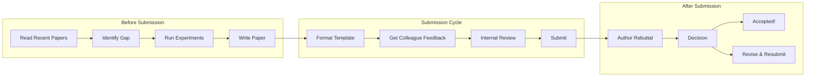

<!-- Clear Language: Keep sentences under 50 words -->
# Major AI Conferences

## Learning Objectives

| LO | Description |
|----|-------------|
| LO1 | Identify the top AI conferences and their focus areas (NeurIPS, ICML, ICLR, ACL, CVPR) |
| LO2 | Understand each conference's paper acceptance rate, review process, and timeline |
| LO3 | Navigate conference proceedings to find relevant papers for your research |
| LO4 | Build a conference attendance strategy for networking and career growth |
| LO5 | Implement Python tools to search, filter, and analyze conference papers |

## Introduction

AI conferences are where the field's most important research is published and debated. They define the state of the art, set research agendas, and connect researchers from academia and industry. For an AI engineer, knowing which conferences publish what—and how to navigate them—is essential for staying current, finding relevant work, and building a professional network. This chapter surveys the major conferences across machine learning, NLP, computer vision, and robotics, then gives you a practical strategy for attending, submitting to, and extracting value from them.

## Prerequisites

- Basic understanding of machine learning and deep learning concepts
- Familiarity with the research paper reading process (see Chapter 01 of this module)
- Comfort with Python for implementing search and analysis tools

## Key Terminology

| Term | Definition |
|------|------------|
| **Proceedings** | The published collection of accepted papers for a conference edition |
| **Acceptance Rate** | Percentage of submitted papers that are accepted for publication |
| **Open Review** | A review process where reviewer comments and author responses are publicly visible |
| **Workshop** | A focused, smaller event co-located with a main conference, often on emerging topics |
| **Challenge/Competition** | A structured benchmark where participants compete on a predefined task |
| **Poster Session** | A conference event where authors present their work on physical posters |
| **Senior Area Chair (SAC)** | An experienced reviewer who oversees multiple paper reviews |
| **Top-Tier Conference** | A conference with high selectivity, prestige, and citation impact |
| **Co-located Event** | A workshop, tutorial, or challenge held at the same venue as the main conference |
| **Keynote** | An invited talk by a distinguished researcher, usually plenary |

## Theory

Understanding major ai conferences is fundamental for AI engineers. This section covers the core concepts, underlying principles, and theoretical framework that govern how major ai conferences works in practice.

## Chapter at a Glance

| Section | Topic | Key Concept |
|---------|-------|-------------|
| 1.1 | NeurIPS | Neural information processing, large-scale ML, high selectivity |
| 1.2 | ICML | Machine learning theory, optimization algorithms, deep learning theory |
| 1.3 | ICLR | Representation learning, open peer review, notable papers |
| 1.4 | ACL/EMNLP/NAACL | NLP tasks, datasets, evaluation benchmarks |
| 1.5 | CVPR/ICCV/ECCV | Computer vision, image recognition, challenges |
| 1.6 | Conference Strategy | Paper discovery, workshop attendance, networking, submission |

## Chapter Roadmap

```mermaid
flowchart TD
    subgraph ML[ML Theory & Systems]
        N[NeurIPS<br/>Dec, Hybrid]
        I[ICML<br/>Jul, Hybrid]
        R[ICLR<br/>Apr-May, Hybrid]
    end
    subgraph NLP[NLP & Speech]
        A[ACL<br/>Jul-Aug]
        E[EMNLP<br/>Nov-Dec]
        N_NAACL[NAACL<br/>Jun]
    end
    subgraph CV[Computer Vision]
        C[CVPR<br/>Jun]
        ICCV[ICCV<br/>Odd Years]
        ECCV[ECCV<br/>Even Years]
    end
    subgraph Strat[Your Strategy]
        FIND[Find Papers]
        ATTEND[Attend Workshops]
        NET[Network]
        SUBMIT[Submit Work]
    end
    FIND --> |arXiv + proceedings| N
    FIND --> |arXiv + proceedings| I
    FIND --> |OpenReview| R
    ATTEND --> |Co-located| A
    ATTEND --> |Co-located| C
    NET --> |Poster sessions| N
    NET --> |Social events| I
    SUBMIT --> |Workshops first| R
    SUBMIT --> |Main track later| N
```text

## 1.1 NeurIPS — Neural Information Processing Systems

NeurIPS (pronounced "nye-rips") is the most prestigious conference in machine learning and AI. Founded in 1987, it has grown from a small workshop on neural networks to a massive conference attracting over 10,000 attendees.

### Focus Areas

NeurIPS covers all aspects of neural information processing and machine learning:

- **Deep Learning**: Architectures, training methods, generalization theory
- **Reinforcement Learning**: MDPs, bandits, exploration, planning
- **Probabilistic Methods**: Bayesian inference, generative models, uncertainty
- **Optimization**: Convex and non-convex optimization, stochastic methods
- **Neuroscience & Cognitive Science**: Brain-inspired learning, neural coding
- **Applications**: NLP, computer vision, robotics, healthcare, climate
- **Social Impact**: Fairness, interpretability, privacy, ethics

### Paper Acceptance Rate

NeurIPS uses a rigorous review process. Acceptance rates have trended downward as submissions skyrocketed:

| Year | Submissions | Accepted | Acceptance Rate |
|------|-------------|----------|-----------------|
| 2018 | 4,856 | 1,011 | 20.8% |
| 2019 | 6,743 | 1,428 | 21.2% |
| 2020 | 9,454 | 1,900 | 20.1% |
| 2021 | 9,122 | 2,334 | 25.6% |
| 2022 | 10,411 | 2,672 | 25.7% |
| 2023 | 12,343 | 3,216 | 26.1% |
| 2024 | 15,000+ | ~3,600 | ~24.0% |

### Review Process

NeurIPS uses a double-blind review system:

1. **Abstract submission** (May): Authors submit paper abstracts
2. **Full paper submission** (May-June): Complete papers due
3. **Review period** (June-August): Each paper gets 3-4 reviewers
4. **Author rebuttal** (August): Authors respond to reviews
5. **Area chair discussion** (August-September): ACs make recommendations
6. **Senior area chair decisions** (September): SACs finalize acceptance
7. **Notification** (September): Authors are informed
8. **Camera-ready** (October): Final versions submitted

### Workshops and Competitions

NeurIPS hosts 50-100 workshops and several major competitions:

- **Workshops**: Typically half-day or full-day events on topics like "Machine Learning for Health," "Robot Learning," "Deep RL Workshop"
- **Competitions**: The NeurIPS competition track includes challenges like the "Large Language Model Evaluation Challenge," "Neural MMO," and "Machine Learning for Drug Discovery"
- **Tutorials**: Half-day educational sessions on emerging topics
- **Demo track**: Live demonstrations of research systems

### Notable NeurIPS Papers

- AlexNet (2012, though published at NeurIPS before the boom)
- "Attention Is All You Need" (2017) — introduced the Transformer
- "Generative Adversarial Networks" (2014) — introduced GANs
- "Playing Atari with Deep RL" (2013) — DQN
- "Neural Radiance Fields" (2020) — NeRF

### Timeline

```
NeurIPS Timeline (Typical Year)
──────┬──────────────────────────────────────────
  May │ Abstract + Paper submission deadline
  Jun │ Reviewer bidding and assignment
  Jul │ Review period begins
  Aug │ Author rebuttal
  Sep │ Acceptance notifications
  Oct │ Camera-ready deadline
  Nov │ Early registration deadline
  Dec │ Conference (first week)
──────┴──────────────────────────────────────────
```

```python
import requests
import json
from typing import List, Dict, Optional
import datetime

class NeurIPSProcurement:
    """Search and retrieve NeurIPS proceedings by year or keyword."""

    BASE_URL = "https://papers.nips.cc"

    @staticmethod
    def get_papers_by_year(year: int) -> List[Dict]:
        """Fetch all NeurIPS papers for a given year."""
        url = f"{NeurIPSProcurement.BASE_URL}/paper/{year}"
        try:
            resp = requests.get(url, timeout=10)
            resp.raise_for_status()
            # The endpoint returns an HTML page with paper links.
            # We parse out the paper titles and links.
            from bs4 import BeautifulSoup
            soup = BeautifulSoup(resp.text, "html.parser")
            papers = []
            for li in soup.find_all("li"):
                a_tag = li.find("a")
                if a_tag and a_tag.get("href", "").startswith(f"/paper/{year}"):
                    papers.append({
                        "title": a_tag.text.strip(),
                        "url": f"{NeurIPSProcurement.BASE_URL}{a_tag['href']}",
                        "year": year
                    })
            return papers
        except requests.RequestException as e:
            print(f"Error fetching NeurIPS {year}: {e}")
            return []

    @staticmethod
    def search_papers(query: str, max_results: int = 20) -> List[str]:
        """Search NeurIPS proceedings by keyword across recent years."""
        import re
        results = []
        for year in range(2025, 2017, -1):  # Search 2025 down to 2018
            papers = NeurIPSProcurement.get_papers_by_year(year)
            for p in papers:
                if re.search(query, p["title"], re.IGNORECASE):
                    results.append(f"[{p['year']}] {p['title']} — {p['url']}")
                    if len(results) >= max_results:
                        return results
        return results


# Example usage
if __name__ == "__main__":
    searcher = NeurIPSProcurement()
    matches = searcher.search_papers("transformer")
    for m in matches:
        print(m)
```

## 1.2 ICML — International Conference on Machine Learning

ICML (pronounced "eye-see-em-el") is the premier conference for machine learning research. Founded in 1980, it is one of the oldest and most respected ML conferences. ICML is organized by the International Machine Learning Society (IMLS).

### Focus Areas

- **ML Theory**: PAC learning, generalization bounds, statistical learning theory
- **Optimization**: Gradient descent variants, convergence analysis, non-convex optimization
- **Deep Learning**: Architecture design, normalization, regularization
- **Probabilistic Models**: Bayesian nonparametrics, graphical models, variational inference
- **Reinforcement Learning**: Model-based RL, policy gradients, exploration
- **Causal Inference**: Causal discovery, treatment effect estimation
- **Kernel Methods**: Gaussian processes, SVM theory, kernel design
- **ML Systems**: Distributed training, AutoML, efficient inference

### Tracks and Format

ICML has evolved to include multiple tracks:

1. **Main Technical Track**: Full papers (up to 8 pages, unlimited appendix)
2. **Short Papers**: Limited to 4 pages, presented as posters
3. **Datasets and Benchmarks Track**: Papers introducing new datasets or evaluation frameworks
4. **Machine Learning for Science Track**: Applications in natural sciences, medicine
5. **Workshop Track**: Co-located workshops (typically 30-50 per year)

### Acceptance Rate

| Year | Submissions | Accepted | Acceptance Rate |
|------|-------------|----------|-----------------|
| 2018 | 2,474 | 621 | 25.1% |
| 2019 | 3,424 | 774 | 22.6% |
| 2020 | 4,990 | 1,088 | 21.8% |
| 2021 | 5,513 | 1,184 | 21.5% |
| 2022 | 5,630 | 1,227 | 21.8% |
| 2023 | 6,538 | 1,827 | 27.9% |
| 2024 | 9,473 | 2,610 | 27.6% |

### Review Process

ICML uses a double-blind review system with these key features:

- **Reviewer matching**: Automated topic matching plus manual bidding
- **Three reviewers**: Each paper receives at least 3 reviews
- **Author rebuttal**: Authors can respond to reviews in a limited window
- **Area chair deliberation**: ACs weigh reviews and author responses
- **Ethical review**: Papers with ethical concerns flagged for additional review
- **Reproducibility check**: Authors encouraged to submit code for verification

### Proceedings

ICML proceedings are published in the Proceedings of Machine Learning Research (PMLR) series, which is open access. All papers are freely available online.

### Notable ICML Papers

- "Random Forests" (2001) — Leo Breiman
- "Dropout: A Simple Way to Prevent Neural Networks from Overfitting" (2014)
- "Adam: A Method for Stochastic Optimization" (2015) — Kingma & Ba
- "Batch Normalization" (2015) — Ioffe & Szegedy
- "Generative Adversarial Nets" (2014) — Goodfellow et al.

### Timeline

```
ICML Timeline (Typical Year)
──────┬──────────────────────────────────────────
  Jan │ Paper submission deadline
  Feb │ Reviewer assignment
  Mar │ Review period
  Apr │ Author rebuttal
  May │ Acceptance notifications
  Jun │ Camera-ready deadline
  Jul │ Conference (mid-to-late July)
──────┴──────────────────────────────────────────
```

```python
import arxiv
from datetime import datetime
from typing import List, Optional

class ICMLExplorer:
    """Search ICML papers from arXiv using ICML-specific categories."""

    ARXIV_CS_CATEGORIES = [
        "cs.LG", "cs.AI", "cs.NE", "cs.CV",
        "cs.CL", "cs.IR", "cs.DS"
    ]

    @staticmethod
    def search_icml_papers(
        query: str,
        max_results: int = 25,
        year: Optional[int] = None
    ) -> List[dict]:
        """
        Search for ICML papers on arXiv by keyword and year.
        Uses the cs.LG category filter for relevance.
        """
        search_query = f"cat:cs.LG AND ti:{query}"
        if year:
            start_date = datetime(year, 1, 1)
            end_date = datetime(year, 12, 31)
            search_query += (
                f" AND submittedDate:[{start_date.isoformat()}+TO+"
                f"{end_date.isoformat()}]"
            )

        search = arxiv.Search(
            query=search_query,
            max_results=max_results,
            sort_by=arxiv.SortCriterion.SubmittedDate
        )

        papers = []
        for result in search.results():
            papers.append({
                "title": result.title,
                "authors": [a.name for a in result.authors],
                "published": result.published.isoformat(),
                "abstract": result.summary[:200] + "...",
                "arxiv_url": result.entry_id,
                "pdf_url": result.pdf_url
            })
        return papers

    @staticmethod
    def get_recent_highlights(n: int = 10) -> List[dict]:
        """Get the most recent high-impact ICML-trending papers."""
        return ICMLExplorer.search_icml_papers(
            "optimization OR representation OR generative",
            max_results=n
        )

    @staticmethod
    def format_paper_list(papers: List[dict]) -> str:
        """Format paper results for reading."""
        lines = []
        for i, p in enumerate(papers, 1):
            lines.append(f"{i:2d}. {p['title']}")
            lines.append(f"    Authors: {', '.join(p['authors'][:3])}{' et al.' if len(p['authors']) > 3 else ''}")
            lines.append(f"    Published: {p['published'][:10]}")
            lines.append(f"    {p['abstract']}")
            lines.append(f"    {p['arxiv_url']}")
            lines.append("")
        return "\n".join(lines)


# Example usage
if __name__ == "__main__":
    explorer = ICMLExplorer()
    papers = explorer.search_icml_papers("attention mechanism", max_results=5)
    print(explorer.format_paper_list(papers))
```

## 1.3 ICLR — International Conference on Learning Representations

ICLR (pronounced "eye-see-el-ar") is a relatively young conference (founded 2013) that has quickly become one of the top-tier ML conferences. It focuses specifically on representation learning — how machines learn useful representations of data.

### Focus Areas

- **Representation Learning**: Embeddings, latent variable models, disentanglement
- **Self-Supervised Learning**: Contrastive methods, masked modeling, pretext tasks
- **Deep Learning Architectures**: Transformers, CNNs, GNNs, hybrid models
- **Generative Models**: VAEs, GANs, diffusion models, autoregressive models
- **Optimization for Deep Learning**: Learning rate schedules, normalization
- **Interpretability**: Feature visualization, mechanistic interpretability
- **Geometric Deep Learning**: Graph neural networks, manifolds, symmetry

### Open Review Process

ICLR is famous for its **open review** system — all reviews, author responses, and decisions are publicly visible on OpenReview.net. This is ICLR's defining innovation and has influenced other conferences.

**How Open Review Works**:

1. Authors submit papers to OpenReview.net
2. The public can read papers and post comments during the discussion period
3. Assigned reviewers submit formal reviews (visible to the public)
4. Authors post a rebuttal (visible to everyone)
5. Area chairs read discussions and make recommendations
6. Program chairs make final decisions
7. The entire history — submission, reviews, comments, decisions — remains publicly archived

**Benefits**: Transparency, accountability, community feedback, reduced reviewer bias
**Criticism**: Public reviewing can be harsh, less anonymity, potential for pile-on

### Acceptance Rate

| Year | Submissions | Accepted | Acceptance Rate |
|------|-------------|----------|-----------------|
| 2018 | 1,023 | 314 | 30.7% |
| 2019 | 1,580 | 501 | 31.7% |
| 2020 | 2,594 | 687 | 26.5% |
| 2021 | 2,997 | 860 | 28.7% |
| 2022 | 3,407 | 1,095 | 32.1% |
| 2023 | 4,966 | 1,646 | 33.1% |
| 2024 | 7,262 | 2,260 | 31.1% |

### Notable ICLR Papers

- "Variational Auto-Encoders" (2014) — Kingma & Welling
- "Neural Tangent Kernel" (2018) — Jacot et al.
- "BERT" (2018, also at NAACL) — Devlin et al.
- "SimCLR" (2020) — Chen et al. (contrastive learning)
- "Denoising Diffusion Probabilistic Models" (2020) — Ho et al.
- "An Image is Worth 16x16 Words" (2021) — ViT, Dosovitskiy et al.

### Timeline

```
ICLR Timeline (Typical Year)
──────┬──────────────────────────────────────────
  Sep │ Paper submission deadline
  Oct │ Reviewer assignment
  Nov │ Review period (open)
  Dec │ Author rebuttal (open)
  Jan │ Area chair decisions
  Feb │ Final notifications
  Mar │ Camera-ready deadline
  Apr │ Conference (late April or early May)
──────┴──────────────────────────────────────────
```

```python
import requests
import json
from typing import List, Dict, Optional

class ICLROpenReview:
    """Query ICLR papers and reviews from OpenReview API."""

    OPENREVIEW_BASE = "https://api.openreview.net"

    @staticmethod
    def search_papers(
        query: str,
        venue: str = "ICLR.cc/2025/Conference",
        limit: int = 50
    ) -> List[Dict]:
        """
        Search ICLR papers using OpenReview's API.
        """
        url = f"{ICLROpenReview.OPENREVIEW_BASE}/notes/search"
        params = {
            "term": query,
            "venue": venue,
            "limit": limit,
            "offset": 0
        }
        try:
            resp = requests.get(url, params=params, timeout=15)
            resp.raise_for_status()
            data = resp.json()
            papers = []
            for note in data.get("notes", []):
                content = note.get("content", {})
                papers.append({
                    "title": content.get("title", "Unknown"),
                    "authors": content.get("authors", []),
                    "abstract": content.get("abstract", "")[:300],
                    "openreview_url": f"https://openreview.net/forum?id={note.get('forum', '')}",
                    "submission_date": note.get("cdate", ""),
                    "decision": content.get("decision", "N/A")
                })
            return papers
        except requests.RequestException as e:
            print(f"API error: {e}")
            return []

    @staticmethod
    def get_notable_papers(year: int = 2025) -> List[Dict]:
        """Fetch spotlight and oral papers for a given ICLR year."""
        # Spotlight/oral papers are often tagged in OpenReview
        venue_id = f"ICLR.cc/{year}/Conference"
        url = f"{ICLROpenReview.OPENREVIEW_BASE}/notes"
        params = {
            "invitation": f"{venue_id}/-/Blind_Submission",
            "details": "replyCount,tagInvitations",
            "limit": 200
        }
        try:
            resp = requests.get(url, params=params, timeout=15)
            resp.raise_for_status()
            data = resp.json()
            notable = []
            for note in data.get("notes", []):
                content = note.get("content", {})
                decision = content.get("decision", "")
                if "oral" in decision.lower() or "spotlight" in decision.lower():
                    notable.append({
                        "title": content.get("title", "Unknown"),
                        "decision": decision,
                        "url": f"https://openreview.net/forum?id={note.get('forum', '')}"
                    })
            return notable
        except requests.RequestException as e:
            print(f"Error fetching notable papers: {e}")
            return []


# Example usage
if __name__ == "__main__":
    client = ICLROpenReview()
    results = client.search_papers("diffusion model", limit=10)
    for r in results:
        status = f"[{r['decision'][:20]}]" if r['decision'] != "N/A" else ""
        print(f"{status} {r['title']}")
        print(f"    Authors: {', '.join(r['authors'][:3])}")
        print(f"    {r['openreview_url']}")
        print()
```

## 1.4 ACL / EMNLP / NAACL — NLP-Focused Conferences

Natural Language Processing has three major conferences, each with a distinct character.

### ACL — Association for Computational Linguistics

ACL is the flagship NLP conference. Founded in 1962, it is the oldest and most prestigious.

- **Frequency**: Annual (summer, typically June-July)
- **Focus**: All areas of computational linguistics and NLP
- **Acceptance Rate**: ~22-25%
- **Submission Windows**: Two cycles per year for long and short papers
- **Specialty Tracks**: Computational social science, NLP for low-resource languages, multimodal NLP

**Key Areas**:
- Language modeling and representation learning
- Machine translation, summarization, question answering
- Information extraction, text classification, sentiment analysis
- Dialogue systems, discourse and pragmatics
- Linguistic theory and cognitive modeling
- Evaluation methodology and datasets

### EMNLP — Empirical Methods in Natural Language Processing

EMNLP (pronounced "ee-em-en-el-pee") focuses on empirical and data-driven approaches.

- **Frequency**: Annual (fall, typically November-December)
- **Focus**: Empirical NLP, large-scale experiments, datasets
- **Acceptance Rate**: ~20-25%
- **Distinction**: Strong emphasis on reproducibility and empirical rigor
- **Trend**: Often has higher submission volume than ACL in recent years

**Key Areas**:
- Empirical evaluation of NLP systems
- Large language model evaluation
- Benchmark creation and analysis
- Reproducibility studies
- Cross-lingual and multilingual methods

### NAACL — North American Chapter of ACL

NAACL (pronounced "nak-ul") serves the North American NLP community.

- **Frequency**: Annual (spring, typically June)
- **Focus**: Same scope as ACL but regionally focused
- **Acceptance Rate**: ~22-28%
- **Note**: In some years, NAACL is held jointly with ACL or replaces the ACL annual meeting for North America

### Shared Tasks and Evaluation

All three conferences host "shared tasks" — standardized evaluation campaigns:

| Task | Description | Typical Metric |
|------|-------------|----------------|
| Machine Translation | Translate between language pairs | BLEU, COMET |
| Text Summarization | Generate concise summaries | ROUGE, BERTScore |
| Named Entity Recognition | Identify entities in text | F1 (exact match) |
| Question Answering | Answer questions from context | Exact Match, F1 |
| Sentiment Analysis | Classify text sentiment | Accuracy, Macro F1 |
| Natural Language Inference | Determine entailment/contradiction | Accuracy |

### Timeline Comparison

```
ACL (Jul-Aug)
──────┬──────────────────────────────────────────
  Jan │ Paper submission
  Mar │ Reviews
  Apr │ Rebuttal
  May │ Notification
  Jul │ Conference

EMNLP (Nov-Dec)
──────┬──────────────────────────────────────────
  May │ Paper submission
  Jul │ Reviews
  Aug │ Rebuttal
  Sep │ Notification
  Nov │ Conference

NAACL (Jun)
──────┬──────────────────────────────────────────
  Jan │ Paper submission
  Mar │ Reviews
  Apr │ Notification
  Jun │ Conference
──────┴──────────────────────────────────────────
```

```python
from typing import List, Dict, Optional, Set
from dataclasses import dataclass, field
import re
import json

@dataclass
class ACLPaper:
    """Represents a paper from ACL/EMNLP/NAACL proceedings."""
    title: str
    authors: List[str]
    venue: str  # ACL, EMNLP, or NAACL
    year: int
    abstract: str = ""
    bibkey: str = ""
    url: str = ""

    def short_summary(self) -> str:
        """Generate a one-line summary for listings."""
        author_str = ", ".join(self.authors[:3])
        if len(self.authors) > 3:
            author_str += " et al."
        return f"[{self.venue} {self.year}] {self.title} — {author_str}"


class ACLAnthologyExplorer:
    """Search ACL Anthology papers programmatically.

    The ACL Anthology (https://aclanthology.org/) is the official
    repository for ACL, EMNLP, NAACL, and related conferences.
    """

    ANTHOLOGY_URL = "https://aclanthology.org"

    @staticmethod
    def get_papers_by_venue(
        venue: str = "acl",
        year: int = 2024,
        max_papers: int = 50
    ) -> List[ACLPaper]:
        """
        Fetch papers from the ACL Anthology for a given venue and year.
        Uses the standard URL pattern: /venues/{venue}/year/{year}

        Example: https://aclanthology.org/venues/acl/year/2024
        """
        import requests
        from bs4 import BeautifulSoup

        url = f"{ACLAnthologyExplorer.ANTHOLOGY_URL}/venues/{venue}/year/{year}"
        papers = []

        try:
            resp = requests.get(url, timeout=15)
            resp.raise_for_status()
            soup = BeautifulSoup(resp.text, "html.parser")

            paper_entries = soup.find_all("div", class_="paper-entry")
            for entry in paper_entries[:max_papers]:
                title_tag = entry.find("strong", class_="paper-title")
                title = title_tag.text.strip() if title_tag else "Unknown"

                author_tags = entry.find_all("a", href=re.compile(r"/people/"))
                authors = [a.text.strip() for a in author_tags]

                link_tag = entry.find("a", href=re.compile(r"/\d{4}\.\d+"))
                paper_url = ""
                if link_tag:
                    paper_url = f"{ACLAnthologyExplorer.ANTHOLOGY_URL}{link_tag['href']}"

                papers.append(ACLPaper(
                    title=title,
                    authors=authors,
                    venue=venue.upper(),
                    year=year,
                    url=paper_url
                ))

        except requests.RequestException as e:
            print(f"Error fetching ACL Anthology ({venue}/{year}): {e}")
        except ImportError:
            print("BeautifulSoup is required. Install with: pip install beautifulsoup4 requests")

        return papers

    @staticmethod
    def search_by_topic(
        topic: str,
        venues: Set[str] = {"acl", "emnlp", "naacl"},
        years: range = range(2024, 2020, -1)
    ) -> List[ACLPaper]:
        """Search across multiple venues and years for a topic."""
        all_papers = []
        for venue in venues:
            for year in years:
                papers = ACLAnthologyExplorer.get_papers_by_venue(venue, year)
                for p in papers:
                    if topic.lower() in p.title.lower():
                        all_papers.append(p)
        return all_papers


# Example usage
if __name__ == "__main__":
    explorer = ACLAnthologyExplorer()
    papers = explorer.search_by_topic("large language model", years=range(2024, 2022, -1))
    for p in papers:
        print(p.short_summary())
```

## 1.5 CVPR / ICCV / ECCV — Computer Vision Conferences

Computer vision has three top-tier conferences that form the CORE ranking A* for CV.

### CVPR — Conference on Computer Vision and Pattern Recognition

CVPR (pronounced "see-vee-pee-ar") is the most selective and prestigious CV conference.

- **Frequency**: Annual (June)
- **Host**: IEEE Computer Society
- **Acceptance Rate**: Historically ~22-25%
- **Submissions**: 9,000+ (growing rapidly)
- **Key Feature**: Strong industry presence from Google, Meta, Apple, NVIDIA

**Key Areas**:
- Image recognition and classification
- Object detection and segmentation
- Video understanding and action recognition
- 3D vision, reconstruction, NeRF
- Generative models for images and video
- Self-supervised and multimodal learning
- Medical image analysis

### ICCV — International Conference on Computer Vision

ICCV (pronounced "eye-see-cee-vee") is held in odd-numbered years only.

- **Frequency**: Biennial (odd years: 2023, 2025, 2027)
- **Host**: IEEE Computer Society
- **Acceptance Rate**: ~22-27%
- **Distinction**: More emphasis on fundamental theory than applications

### ECCV — European Conference on Computer Vision

ECCV (pronounced "ee-see-cee-vee") is held in even-numbered years.

- **Frequency**: Biennial (even years: 2022, 2024, 2026)
- **Host**: European Computer Vision Association
- **Acceptance Rate**: ~25-30%
- **Distinction**: Strong European community, slightly less selective than CVPR

### Challenges and Competitions

| Challenge | Venue | Task | Typical Metric |
|-----------|-------|------|----------------|
| ImageNet Challenge | CVPR/ICCV (historical) | Image classification | Top-1/5 accuracy |
| COCO Detection | CVPR/ECCV | Object detection | AP (average precision) |
| LVIS | CVPR | Long-tail detection | AP on rare classes |
| KITTI Vision Benchmark | CVPR/ICCV | Autonomous driving | Multiple metrics |
| ScanNet / Matterport3D | CVPR/ECCV | 3D scene understanding | mIoU, Acc |
| HACS / AVA | CVPR/ICCV | Video action detection | mAP |

### Timeline

```
CVPR (Jun)
──────┬──────────────────────────────────────────
  Nov │ Paper submission
  Jan │ Reviews
  Feb │ Rebuttal
  Feb-Mar│ Decisions
  Jun │ Conference

ICCV (Odd Years, Sep-Oct)
──────┬──────────────────────────────────────────
  Mar │ Paper submission
  May │ Reviews
  Jun │ Decisions
  Sep │ Conference

ECCV (Even Years, Aug-Sep)
──────┬──────────────────────────────────────────
  Mar │ Paper submission
  May │ Reviews
  Jun │ Decisions
  Aug │ Conference
──────┴──────────────────────────────────────────
```

```python
from typing import List, Dict, Optional
from datetime import datetime
import json

class CVPaperFinder:
    """Search and track CV papers across CVPR, ICCV, and ECCV."""

    VENUE_NAMES = {
        "cvpr": "CVPR",
        "iccv": "ICCV",
        "eccv": "ECCV"
    }

    def __init__(self, cache_file: Optional[str] = None):
        self.cache_file = cache_file
        self._cache: Dict[str, List[Dict]] = {}
        if cache_file:
            try:
                with open(cache_file, "r") as f:
                    self._cache = json.load(f)
            except (FileNotFoundError, json.JSONDecodeError):
                pass

    def _fetch_arxiv_papers(self, category: str, query: str, limit: int) -> List[Dict]:
        """Fetch papers from arXiv with given category and query."""
        import arxiv

        search_query = f"cat:{category} AND ti:{query}"
        search = arxiv.Search(
            query=search_query,
            max_results=limit,
            sort_by=arxiv.SortCriterion.SubmittedDate
        )

        papers = []
        for result in search.results():
            papers.append({
                "title": result.title,
                "authors": [a.name for a in result.authors],
                "published": result.published.strftime("%Y-%m-%d"),
                "abstract": result.summary[:200],
                "arxiv_url": result.entry_id,
                "pdf_url": result.pdf_url,
            })
        return papers

    def search_cv_papers(
        self,
        query: str,
        venues: List[str] = None,
        limit: int = 20
    ) -> List[Dict]:
        """
        Search for CV papers matching query across relevant arXiv categories.

        Uses cs.CV for computer vision papers and filters for
        conference-aligned keywords in the title.
        """
        if venues is None:
            venues = ["cvpr", "iccv", "eccv"]

        # arXiv search using cs.CV category
        papers = self._fetch_arxiv_papers("cs.CV", query, limit)

        # Tag papers with likely venues based on keywords
        annotated = []
        for p in papers:
            title_lower = p["title"].lower()
            matched_venues = []
            for v in venues:
                vname = self.VENUE_NAMES.get(v, v)
                if vname.lower() in title_lower:
                    matched_venues.append(vname)
            p["matched_venues"] = matched_venues or ["Unknown"]
            annotated.append(p)

        return annotated

    def get_vision_trends(self, top_k: int = 15) -> Dict[str, int]:
        """
        Analyze trending terms in recent CV papers on arXiv.

        Returns a dictionary of keyword frequencies.
        """
        from collections import Counter

        # Common CV research areas
        areas = [
            "detection", "segmentation", "generation", "tracking",
            "reconstruction", "pose", "depth", "optical flow",
            "NeRF", "diffusion", "transformer", "self-supervised",
            "multi-modal", "3D", "video", "GAN", "ViT"
        ]

        papers = self._fetch_arxiv_papers("cs.CV", "learning", limit=50)
        counter = Counter()
        for p in papers:
            title_lower = p["title"].lower()
            for area in areas:
                if area.lower() in title_lower:
                    counter[area] += 1

        return dict(counter.most_common(top_k))

    def save_cache(self) -> None:
        """Persist the paper cache to disk."""
        if self.cache_file:
            with open(self.cache_file, "w") as f:
                json.dump(self._cache, f, indent=2)

    def summary(self, papers: List[Dict]) -> str:
        """Format a readable summary of found papers."""
        lines = []
        for i, p in enumerate(papers, 1):
            venues_str = ", ".join(p.get("matched_venues", ["Unknown"]))
            lines.append(f"{i:2d}. [{venues_str}] {p['title']}")
            lines.append(f"    {p['published'][:10]} | arXiv: {p['arxiv_url']}")
            lines.append(f"    {p['abstract'][:120]}...")
            lines.append("")
        return "\n".join(lines)


# Example usage
if __name__ == "__main__":
    finder = CVPaperFinder()
    results = finder.search_cv_papers("segmentation", limit=5)
    print(finder.summary(results))

    print("\n--- Vision Trends ---")
    trends = finder.get_vision_trends()
    for term, count in trends.items():
        print(f"  {term:20s}: {count} papers")
```

## 1.6 Conference Strategy

Knowing the conferences is only half the battle. You also need a strategy to extract value from them.

### How to Find Relevant Papers

**Before the Conference**:

1. **Monitor arXiv**: Papers often appear on arXiv months before formal acceptance. Use tools like the arXiv RSS feed, Papers With Code, or Semantic Scholar alerts.

2. **Follow OpenReview**: ICLR and some NeurIPS tracks use OpenReview. You can read papers months before the conference.

3. **Set up Alerts**: Use Google Scholar alerts, Semantic Scholar "follow," or tools like Connected Papers to get notified when new relevant papers appear.

4. **Browse Accepted Papers Lists**: Most conferences publish a list of accepted papers 1-2 months before the event. Skim these lists with a topic filter.

**During the Conference**:

1. **Use the Conference App**: Most conferences have a mobile app with searchable paper lists, session schedules, and maps.

2. **Create a Reading List**: Bookmark 10-15 papers you want to read during poster sessions. Focus on posters — you can talk directly with authors.

3. **Attend Keynote Talks**: Keynotes summarize broad trends and open research directions.

4. **Record Notes**: Use a note-taking app or the conference app to annotate papers you see.

**After the Conference**:

1. **Proceedings Become Available**: Conference proceedings are published within weeks. Download papers you missed.

2. **Check Video Recordings**: Most conferences post recorded talks on their YouTube channel.

3. **Read Workshop Reports**: Workshops often produce summary reports with key takeaways.

```python
from typing import List, Dict, Optional
from datetime import date, timedelta
import json
import webbrowser

class ConferencePlanner:
    """
    A personal conference planning assistant.

    Helps you track upcoming deadlines, find papers, and
    plan your conference attendance.
    """

    def __init__(self, name: str = "default"):
        self.name = name
        self.conferences: List[Dict] = []
        self.watchlist: List[Dict] = []

    def add_conference(
        self,
        name: str,
        deadline: date,
        conference_date: date,
        venue_type: str = "hybrid",
        topics: List[str] = None
    ) -> None:
        """Add a conference deadline to your tracking list."""
        self.conferences.append({
            "name": name,
            "deadline": deadline,
            "conference_date": conference_date,
            "venue_type": venue_type,
            "topics": topics or [],
            "days_until_deadline": (deadline - date.today()).days
        })

    def get_upcoming_deadlines(self, days_ahead: int = 60) -> List[Dict]:
        """Get submission deadlines within the next N days."""
        today = date.today()
        cutoff = today + timedelta(days=days_ahead)
        upcoming = [
            c for c in self.conferences
            if today <= c["deadline"] <= cutoff
        ]
        return sorted(upcoming, key=lambda c: c["deadline"])

    def get_notes_for_poster_session(self, n_papers: int = 10) -> str:
        """Generate a checklist for attending poster sessions."""
        checklist = [
            "Conference badge and lanyard",
            "Notebook or tablet for notes",
            "List of must-see papers (with locations)",
            "Phone charger / power bank",
            "Business cards (digital or physical)",
            "Water bottle",
            "Comfortable shoes",
            "Questions prepared for authors",
        ]
        lines = ["## Poster Session Checklist", ""]
        for i, item in enumerate(checklist, 1):
            lines.append(f"- [ ] {item}")
        lines.append("")
        lines.append(f"**Target papers**: {n_papers}")
        lines.append("**Strategy**:")
        lines.append("1. Start with papers closest to your research area")
        lines.append("2. Ask authors: 'What was the biggest challenge?'")
        lines.append("3. Ask: 'What would you do next?'")
        lines.append("4. Connect with authors on LinkedIn after conversation")
        return "\n".join(lines)

    def get_submission_checklist(self, conference_name: str) -> List[str]:
        """Get a pre-submission checklist for a target conference."""
        return [
            f"### Submission Checklist for {conference_name}",
            "",
            "- [ ] Read the call for papers (CFP) carefully",
            "- [ ] Format paper to conference template",
            "- [ ] Check page limits and formatting requirements",
            "- [ ] Write abstract under word limit",
            "- [ ] Double-blind: remove author names from PDF",
            "- [ ] Include supplementary material (code, data)",
            "- [ ] Get feedback from 2+ colleagues",
            "- [ ] Proofread for typos and clarity",
            "- [ ] Prepare author response / rebuttal strategy",
            "- [ ] Submit before deadline (not at the last minute)",
            "- [ ] Confirm submission confirmation email received",
        ]

    def schedule_conference_week(self, conference_name: str, days: int = 5) -> Dict[str, List[str]]:
        """Generate a day-by-day conference schedule template."""
        schedule = {}
        for day_num in range(1, days + 1):
            day_key = f"Day {day_num}"
            schedule[day_key] = [
                "Keynote talk (plenary)",
                f"Oral session track selection",
                "Poster session browsing",
                "Workshop or tutorial attendance",
                "Networking — connect with 3+ new people",
                "Exhibitor hall visit",
                "Social event / reception",
            ]
        return schedule

    def to_json(self) -> str:
        """Export planner state to JSON for sharing or backup."""
        return json.dumps({
            "name": self.name,
            "conferences": self.conferences,
            "watchlist": self.watchlist,
        }, indent=2)


# Example usage
if __name__ == "__main__":
    planner = ConferencePlanner("my-2025-plan")

    # Add deadlines
    planner.add_conference("ICLR 2025", date(2024, 10, 1), date(2025, 4, 27))
    planner.add_conference("CVPR 2025", date(2024, 11, 10), date(2025, 6, 11))
    planner.add_conference("ACL 2025", date(2025, 2, 15), date(2025, 7, 27))

    print("Upcoming deadlines (60 days):")
    for c in planner.get_upcoming_deadlines():
        print(f"  {c['name']:15s} deadline: {c['deadline']} ({c['days_until_deadline']}d)")

    print("\n" + planner.get_notes_for_poster_session())
```

### How to Attend Workshops

Workshops are a hidden gem of conferences. They are smaller, more focused, and more interactive.

**Finding the Right Workshop**:

1. Browse the conference website's workshop list as soon as it's published.
2. Look for workshops on specific topics matching your research area.
3. Check if the workshop accepts short papers or extended abstracts — these are easier to get accepted than main-track papers.
4. Many workshops award "best paper" or "best poster" prizes.

**Why Workshops Matter**:

- **Lower barrier**: Higher acceptance rates (~30-50%) make workshops ideal for first-time submitters
- **Emerging topics**: Workshops cover cutting-edge themes not yet in the main track
- **Networking**: Smaller groups mean more depth in conversations
- **Feedback**: Get early feedback on work in progress

### How to Network at Conferences

| Strategy | Tactic | Why It Works |
|----------|--------|--------------|
| Poster Q&A | Ask a genuine question about method or results | Authors love engaged audiences |
| Coffee/Lunch | Sit next to someone you don't know | Casual setting breaks barriers |
| Social Media | Tweet about talks with conference hashtag | Researchers notice and engage |
| Student Mixers | Attend student-specific events | Peers are future collaborators |
| Volunteering | Become a student volunteer | Behind-the-scenes access |
| Co-working Space | Work in the dedicated quiet area | Meet others who do the same |

### How to Submit Your Work

**Choosing Where to Submit**:

1. **Start with workshops**: Higher acceptance, good for work-in-progress
2. **Move to main track**: Once you have strong results and polished writing
3. **Consider venue fit**: ML theory paper → ICML; application paper → NeurIPS; representation learning → ICLR
4. **Check deadlines**: Plan 2-3 months for paper writing and review

**What Reviewers Look For**:

| Criterion | Weight | What It Means |
|-----------|--------|---------------|
| Novelty | 40% | New idea, method, or insight |
| Significance | 25% | Potential impact on the field |
| Rigor | 20% | Correct experiments and analysis |
| Clarity | 15% | Well-written and easy to follow |



## Summary

Major AI conferences are the primary venues for publishing and discovering cutting-edge research. NeurIPS, ICML, and ICLR form the top tier for machine learning. ACL, EMNLP, and NAACL cover natural language processing. CVPR, ICCV, and ECCV dominate computer vision. Each conference has its own review process, acceptance rate, timeline, and community culture. Knowing these details helps you find relevant papers, attend the right events, network effectively, and plan your own submissions. Use the Python tools in this chapter to automate paper discovery and build your personal conference strategy.

## Practical Takeaways

| Takeaway | Description |
|----------|-------------|
| Know your conference landscape | NeurIPS (broad ML), ICML (theory), ICLR (representations), ACL (NLP), CVPR (vision) |
| Use OpenReview for ICLR | All reviews are public — read them to understand reviewer expectations |
| Monitor arXiv and proceedings | Papers appear months before conferences — use automated search tools |
| Attend workshops for networking | Smaller groups, higher interaction, lower submission barrier |
| Start submitting to workshops | Higher acceptance rates (~40%) are perfect for early-stage work |
| Build a conference calendar | Track deadlines across conferences to plan submissions year-round |
| Ask good poster questions | Engage authors with meaningful questions about their work |
| Use the code tools provided | Automate paper discovery, deadline tracking, and trend analysis |

## Interview Q&A

<details class="tp-qa-card" data-qid="res03-q1">
  <summary class="tp-qa-question">
    <span class="tp-qa-status"></span>
    Q1: What are the top-3 most prestigious AI conferences and how do they differ?
  </summary>
  <div class="tp-qa-answer">
<p>The three most prestigious AI conferences are NeurIPS, ICML, and ICLR. NeurIPS (Neural Information Processing Systems) is the broadest, covering neural networks, deep learning, reinforcement learning, neuroscience, and applications. It is the largest conference with ~12,000+ submissions. ICML (International Conference on Machine Learning) focuses more on machine learning theory, optimization algorithms, statistical learning, and rigorous empirical work. It is older (founded 1980) and publishes in PMLR open-access proceedings. ICLR (International Conference on Learning Representations) is the newest (founded 2013) and specifically targets representation learning. ICLR is unique for its open review system where all reviews and discussions are public on OpenReview.net. Acceptance rates are similar across all three (~25-30%), but they attract different types of work. You should choose based on your paper's contribution: broad ML and applications go to NeurIPS, theoretical or optimization work to ICML, and representation-focused work to ICLR.</p>
  </div>
  <button class="tp-qa-mark-btn">✅ Mark Reviewed</button>
  <button class="tp-qa-bookmark-btn">🔖 Bookmark</button>
</details>

<details class="tp-qa-card" data-qid="res03-q2">
  <summary class="tp-qa-question">
    <span class="tp-qa-status"></span>
    Q2: How does the ICLR open review process work?
  </summary>
  <div class="tp-qa-answer">
<p>ICLR's open review process is hosted on OpenReview.net and is fully transparent. When authors submit a paper, it is publicly visible. During the review period, assigned reviewers submit their reviews, which are also publicly visible. Anyone in the community can post comments or questions. Authors then write a public rebuttal addressing the reviews. Area chairs read the entire discussion thread — reviews, author responses, and public comments — and make a recommendation to the program chairs, who make the final decision. The entire history, including the original submission, all review versions, author responses, and the final decision, remains publicly archived. This transparency reduces anonymity abuse, provides accountability for reviewers, and gives the community insight into how decisions are made. Critics argue it can lead to harsh public criticism and groupthink. Despite the debate, ICLR's model has influenced other conferences to adopt more transparent practices.</p>
  </div>
  <button class="tp-qa-mark-btn">✅ Mark Reviewed</button>
  <button class="tp-qa-bookmark-btn">🔖 Bookmark</button>
</details>

<details class="tp-qa-card" data-qid="res03-q3">
  <summary class="tp-qa-question">
    <span class="tp-qa-status"></span>
    Q3: What is the difference between a conference paper and a workshop paper?
  </summary>
  <div class="tp-qa-answer">
<p>Conference papers are full-length, rigorously peer-reviewed publications that appear in the official proceedings. They represent completed, substantial research contributions. Acceptance rates are low (20-30%). Workshop papers, by contrast, are shorter (typically 4-6 pages), have a lighter review process (often 1-2 reviewers), and higher acceptance rates (30-50%). Workshops are co-located with the main conference and focus on specific emerging topics. Workshop papers are not archival in most cases — they do not appear in the official conference proceedings. This makes workshops ideal for publishing preliminary results, work-in-progress, or opinion pieces. Many researchers treat workshop papers as a stepping stone: get feedback at a workshop, improve the work, then submit a full version to the main conference the following year. Some workshops award "best paper" prizes that carry prestige even though the paper is non-archival.</p>
  </div>
  <button class="tp-qa-mark-btn">✅ Mark Reviewed</button>
  <button class="tp-qa-bookmark-btn">🔖 Bookmark</button>
</details>

<details class="tp-qa-card" data-qid="res03-q4">
  <summary class="tp-qa-question">
    <span class="tp-qa-status"></span>
    Q4: How do you find relevant papers at a large conference like NeurIPS with 1,000+ papers?
  </summary>
  <div class="tp-qa-answer">
<p>Finding relevant papers at a large conference requires a systematic approach. Before the conference: (1) browse the accepted papers list published 1-2 months in advance; (2) use keyword search in the conference app or website to filter papers by topic; (3) identify which poster sessions and oral sessions your target papers are assigned to. During the conference: (1) prioritize posters over oral sessions because you can interact with authors directly; (2) create a "must-see" list of 15-20 papers and visit their posters first; (3) attend sessions related to your specific subfield; (4) use the conference app's bookmarking feature to save papers you discover. After the conference: (1) download the proceedings for papers you missed; (2) watch recorded oral presentations on the conference YouTube channel; (3) search through the open review forums on OpenReview for ICLR papers. Tools like the Python scripts in this chapter can automate pre-conference paper discovery.</p>
  </div>
  <button class="tp-qa-mark-btn">✅ Mark Reviewed</button>
  <button class="tp-qa-bookmark-btn">🔖 Bookmark</button>
</details>

<details class="tp-qa-card" data-qid="res03-q5">
  <summary class="tp-qa-question">
    <span class="tp-qa-status"></span>
    Q5: What are the major NLP conferences and how do they differ?
  </summary>
  <div class="tp-qa-answer">
<p>The three major NLP conferences are ACL, EMNLP, and NAACL. ACL (Association for Computational Linguistics) is the flagship and oldest NLP conference, founded in 1962. It covers all areas of computational linguistics and NLP, has a 22-25% acceptance rate, and is held annually in the summer. EMNLP (Empirical Methods in Natural Language Processing) focuses on empirical, data-driven NLP research, has a slightly lower acceptance rate (~20-25%), and is held in the fall (Nov-Dec). EMNLP places strong emphasis on reproducibility and large-scale experiments. It sometimes surpasses ACL in submission volume. NAACL (North American Chapter of ACL) serves the North American NLP community with similar scope to ACL, held in the spring. In some years, NAACL replaces the annual ACL meeting for North America. All three conferences host shared tasks — standardized evaluation campaigns on tasks like machine translation, summarization, and question answering. The ACL Anthology (aclanthology.org) archives all papers from all three conferences.</p>
  </div>
  <button class="tp-qa-mark-btn">✅ Mark Reviewed</button>
  <button class="tp-qa-bookmark-btn">🔖 Bookmark</button>
</details>

<details class="tp-qa-card" data-qid="res03-q6">
  <summary class="tp-qa-question">
    <span class="tp-qa-status"></span>
    Q6: How do CVPR, ICCV, and ECCV differ in the computer vision landscape?
  </summary>
  <div class="tp-qa-answer">
<p>CVPR, ICCV, and ECCV are the three top-tier computer vision conferences. CVPR (Conference on Computer Vision and Pattern Recognition) is the most prestigious and selective, held annually in June with ~22-25% acceptance rate and the highest submission volume (9,000+). It has strong industry participation from Google, Meta, NVIDIA, and Apple. ICCV (International Conference on Computer Vision) is held in odd-numbered years only, with similar selectivity (~22-27%) and tends to emphasize fundamental theory. ECCV (European Conference on Computer Vision) is held in even-numbered years only, is slightly less selective (~25-30%), and has a stronger European community focus. Together, these three form an alternating cycle: CVPR every year, ICCV and ECCV in alternating odd/even years. This means there is a top-tier CV venue roughly every 6 months. All three host major challenges like the COCO detection challenge, LVIS, and autonomous driving benchmarks (KITTI, nuScenes).</p>
  </div>
  <button class="tp-qa-mark-btn">✅ Mark Reviewed</button>
  <button class="tp-qa-bookmark-btn">🔖 Bookmark</button>
</details>

<details class="tp-qa-card" data-qid="res03-q7">
  <summary class="tp-qa-question">
    <span class="tp-qa-status"></span>
    Q7: What factors do paper reviewers consider when evaluating a submission?
  </summary>
  <div class="tp-qa-answer">
<p>Reviewers typically evaluate submissions on four main criteria: novelty, significance, rigor, and clarity. Novelty (roughly 40% weight) asks: is this a new idea, method, or insight? Does it go beyond incremental improvements? Significance (25% weight) measures potential impact — will this paper influence future research or practical applications? Rigor (20% weight) evaluates experimental design: are the baselines appropriate, are the metrics correct, are the ablation studies thorough, is the statistical significance established? Clarity (15% weight) assesses writing quality: is the paper well-structured, are the claims clearly stated, are the figures informative? Additional factors include reproducibility (is code provided?), ethical considerations (are there societal impacts?), and relevance to the conference. Different conferences weight these factors slightly differently — ICML emphasizes theory and rigor, NeurIPS values broad significance and applications, ICLR prioritizes representation learning novelty.</p>
  </div>
  <button class="tp-qa-mark-btn">✅ Mark Reviewed</button>
  <button class="tp-qa-bookmark-btn">🔖 Bookmark</button>
</details>

<details class="tp-qa-card" data-qid="res03-q8">
  <summary class="tp-qa-question">
    <span class="tp-qa-status"></span>
    Q8: What is the best strategy for a first-time conference submitter?
  </summary>
  <div class="tp-qa-answer">
<p>For first-time submitters, the best strategy is: (1) start with a workshop co-located with a major conference. Workshops have higher acceptance rates (30-50%) and provide valuable feedback in a less pressured environment. (2) Choose a conference whose focus aligns with your work — don't submit a theoretical optimization paper to a vision conference. (3) Read 10-15 recent papers from your target venue to understand the style, depth, and formatting expectations. (4) Get feedback from 2-3 senior colleagues before submission. (5) Submit well before the deadline — last-minute submissions often have formatting errors. (6) If rejected, read the reviews carefully, improve the paper, and resubmit to the next venue. Rejection is normal — most papers go through 2-3 submission cycles before acceptance. (7) Attend the conference even if your paper is not accepted — the networking and learning are valuable. (8) Volunteer as a student volunteer to get free registration and behind-the-scenes access.</p>
  </div>
  <button class="tp-qa-mark-btn">✅ Mark Reviewed</button>
  <button class="tp-qa-bookmark-btn">🔖 Bookmark</button>
</details>

<details class="tp-qa-card" data-qid="res03-q9">
  <summary class="tp-qa-question">
    <span class="tp-qa-status"></span>
    Q9: How has the AI conference landscape changed in recent years?
  </summary>
  <div class="tp-qa-answer">
<p>The AI conference landscape has undergone dramatic changes. Submission volumes have exploded — NeurIPS had ~4,800 submissions in 2018 and over 15,000 by 2024. This growth has stressed the review system, leading to desk rejects, reviewer shortages, and higher variance in review quality. Conferences have responded by adding more area chairs, using automated reviewer assignment, and introducing "pre-review" desk reject phases. Hybrid formats (in-person + virtual) became standard post-COVID, expanding global access. Open review (pioneered by ICLR) has gained traction, with more conferences adopting transparent review elements. The rise of large language models has shifted research focus — many 2023-2024 papers center on LLMs, agents, and foundation models. Ethics reviews have become mandatory at most top conferences. Datasets and benchmarks tracks have been added to recognize methodological contributions. Despite arXiv reducing the need for conferences to disseminate results, conferences remain essential for community building, networking, and establishing research credibility through peer review.</p>
  </div>
  <button class="tp-qa-mark-btn">✅ Mark Reviewed</button>
  <button class="tp-qa-bookmark-btn">🔖 Bookmark</button>
</details>

<details class="tp-qa-card" data-qid="res03-q10">
  <summary class="tp-qa-question">
    <span class="tp-qa-status"></span>
    Q10: How can you effectively network at a large AI conference?
  </summary>
  <div class="tp-qa-answer">
<p>Effective networking at AI conferences requires intentionality. Before the conference: identify researchers you want to meet; follow them on Twitter/X and engage with their work; schedule coffee meetings in advance. During the conference: attend poster sessions and ask genuine questions — "What was the hardest part of this work?" is better than "Can you explain your paper?"; use the conference app to message attendees; sit next to strangers at lunch; attend social events and receptions; volunteer as a session chair or student volunteer. Key tactics: (1) focus on quality over quantity — 5 meaningful conversations beat 50 shallow ones; (2) follow up within 24 hours with a LinkedIn connection or email referencing your conversation; (3) tweet about talks using the conference hashtag — researchers often engage; (4) attend workshops for deeper, smaller-group discussions; (5) bring business cards or have a digital equivalent ready. Remember that networking is about mutual value — ask about their work, share your interests, and look for collaboration opportunities.</p>
  </div>
  <button class="tp-qa-mark-btn">✅ Mark Reviewed</button>
  <button class="tp-qa-bookmark-btn">🔖 Bookmark</button>
</details>

## Chapter Quiz

<details data-qid="res03-quiz1">
<summary><strong>1.</strong> Which conference pioneered the open peer review system where reviews and author responses are publicly visible?</summary>
A. NeurIPS
B. ICML
C. ICLR
D. CVPR
Answer: C
</details>

<details data-qid="res03-quiz2">
<summary><strong>2.</strong> What is the approximate acceptance rate range for top-tier AI conferences like NeurIPS, ICML, and ICLR?</summary>
A. 10-15%
B. 20-30%
C. 35-45%
D. 50-60%
Answer: B
</details>

<details data-qid="res03-quiz3">
<summary><strong>3.</strong> Which of the following CV conferences is held biennially in even-numbered years?</summary>
A. CVPR
B. ICCV
C. ECCV
D. BMVC
Answer: C
</details>

<details data-qid="res03-quiz4">
<summary><strong>4.</strong> What is the main advantage of submitting a paper to a workshop rather than the main conference track?</summary>
A. Higher acceptance rate and faster review cycle
B. Papers are indexed in the official proceedings
C. Workshops have more prestigious review boards
D. Workshop papers get longer presentation slots
Answer: A
</details>

<details data-qid="res03-quiz5">
<summary><strong>5.</strong> Which repository archives all papers published at ACL, EMNLP, and NAACL conferences?</summary>
A. arXiv
B. OpenReview
C. ACL Anthology
D. PMLR
Answer: C
</details>

<details data-qid="res03-quiz6">
<summary><strong>6.</strong> What are the four main criteria that reviewers use to evaluate conference paper submissions?</summary>
A. Novelty, Significance, Rigor, Clarity
B. Length, References, Figures, Code
C. Authors, Affiliation, Funding, Dataset size
D. Title, Abstract, Introduction, Conclusion
Answer: A
</details>

<details data-qid="res03-quiz7">
<summary><strong>7.</strong> When are ICCV and ECCV held relative to each other?</summary>
A. ICCV in odd years, ECCV in even years
B. ICCV in even years, ECCV in odd years
C. Both are annual
D. Both are biennial in the same year
Answer: A
</details>

<details data-qid="res03-quiz8">
<summary><strong>8.</strong> Which conference has the highest submission volume among all AI conferences as of 2024?</summary>
A. ICML
B. CVPR
C. NeurIPS
D. ACL
Answer: C
</details>

<details data-qid="res03-quiz9">
<summary><strong>9.</strong> What does "shared task" mean in the context of NLP conferences like ACL and EMNLP?</summary>
A. A group of authors writing a joint paper
B. A standardized evaluation campaign where participants compete on the same task
C. A shared computing cluster for running experiments
D. A collaborative writing workshop
Answer: B
</details>

<details data-qid="res03-quiz10">
<summary><strong>10.</strong> According to typical reviewer guidelines, which criterion carries the most weight in paper evaluation?</summary>
A. Significance
B. Clarity
C. Rigor
D. Novelty
Answer: D (Novelty is typically weighted at ~40%)
</details>

## Exercises

1. **Build a Conference Deadline Tracker**: Using the `ConferencePlanner` class from this chapter, add all 2026 deadlines for NeurIPS, ICML, ICLR, ACL, EMNLP, CVPR, ICCV, and ECCV. Output a Markdown calendar showing deadlines sorted by date, with days-remaining counts.

2. **Paper Search Pipeline**: Use the `NeurIPSProcurement` class to search for papers containing the keyword "diffusion model" across years 2020-2024. Count how many results appear per year and plot the trend. Which year had the most diffusion model papers?

3. **OpenReview Explorer**: Extend the `ICLROpenReview` class to fetch the top-5 most-discussed papers (papers with the highest number of review comments) from the most recent ICLR cycle. Print each paper's title, number of reviews, and the first reviewer's overall recommendation.

4. **Conference Fit Analyzer**: Write a function that takes a paper title and abstract and suggests which conference (NeurIPS, ICML, ICLR, ACL, CVPR) would be the best fit. Use keyword-based heuristics: if the abstract mentions "representation learning" → ICLR, "optimization" → ICML, "NLP" or "language" → ACL, "vision" or "image" → CVPR, otherwise → NeurIPS.

5. **Networking Plan Generator**: Using the schedule template from `ConferencePlanner.schedule_conference_week()`, generate a personalized 3-day conference plan for attending NeurIPS. Include: 3 must-see papers you would find in advance, 2 workshops to attend, 3 people you would target for networking, and 1 social event.

## Revision Notes

- **NeurIPS**: Broadest ML conference (deep learning, RL, applications); Dec; ~25% acceptance; 15,000+ submissions
- **ICML**: ML theory and optimization; Jul; ~25% acceptance; PMLR open access
- **ICLR**: Representation learning; Apr-May; ~30% acceptance; OpenReview.net public reviews
- **ACL/EMNLP/NAACL**: NLP conferences; ACL Anthology for proceedings; shared tasks are key
- **CVPR/ICCV/ECCV**: Vision conferences; CVPR annual, ICCV odd years, ECCV even years
- **Strategy**: Monitor arXiv + proceedings; attend workshops for networking; submit early to workshops; ask good poster questions
- **Review criteria**: Novelty (40%), Significance (25%), Rigor (20%), Clarity (15%)
- **Open Review**: ICLR pioneered fully transparent peer review with public archives

## Placement Section

### Top 10 Interview Questions

#### Google Style
1. You need to quickly find the state-of-the-art for a text-to-image generation problem. Which conferences would you search and how would you structure your literature review?
2. Design a system that automatically alerts a researcher when a new paper matching their interests is published at a target conference.

#### Amazon Style
1. Tell me about a time you had to stay current with a fast-moving research area. What was your strategy for tracking new papers and developments?
2. How would you explain the value of attending NeurIPS to a product manager who is skeptical about conference ROI?

#### Microsoft Style
1. How would you integrate conference proceedings monitoring into an enterprise AI research pipeline? What data would you track?
2. What are the security and IP considerations of presenting research at a public conference?

#### NVIDIA Style
1. How would you optimize a paper discovery pipeline to index and search across 50,000+ conference papers with sub-100ms latency?
2. What parallel processing and GPU-accelerated approaches could you apply to analyze citation graphs across conference proceedings?

#### AI Startup Style
1. As a startup CTO, you have limited budget. Which conferences would you prioritize attending and why? How would you measure ROI?
2. What's the fastest way to get a research idea published when you are a team of 3 with no academic affiliation?

### Resume Tips
- **Technical Skills**: List "Academic research literature review" and "Conference paper analysis" under research skills
- **Project Description**: "Conducted systematic literature review across NeurIPS, ICML, and ICLR proceedings to identify state-of-the-art approaches for [specific problem]"
- **Keywords**: Include conference names (NeurIPS, ICML, ICLR, ACL, CVPR) in your research methodology section for ATS optimization

### Interview Day Checklist
- [ ] Review the landscape of major AI conferences and their focus areas
- [ ] Be able to name 3 notable papers from each major conference
- [ ] Know acceptance rate ranges for top conferences (~20-30%)
- [ ] Understand the open review process and how it differs from traditional review
- [ ] Prepare 2 examples of how you use conferences for professional development
- [ ] Have questions ready about how the company tracks and consumes AI research

## Difficulty Level

**Level**: Intermediate
**Estimated Study Time**: 60-90 minutes
**Prerequisites**: Module 29 Chapter 01 (Reading Research Papers), basic ML knowledge

## Tips & Tricks

**Tip**: Bookmark OpenReview.net and the ACL Anthology — these are your primary sources for papers with peer review context.

**Tip**: Set up Google Scholar alerts for each major conference. When a new accepted paper list is published, Google Scholar will index them.

**Tip**: Follow conference hashtags on Twitter/X (e.g., #NeurIPS, #ICML, #CVPR) during conference weeks. The community shares highlights and critiques in real time.

**Pro Tip**: Read the reviewer discussions on OpenReview for papers in your area — understanding what reviewers praise and criticize trains your own research judgment.

**Pro Tip**: Create a personal "conference dashboard" that tracks deadlines, accepted paper lists, and your reading queue. The Python scripts in this chapter are a starting point.

## Memory Tricks

- **NIPS → NeurIPS**: Renamed in 2018 due to the inappropriate acronym. Remember: "Neur" for neural, "IPS" for information processing systems.
- **ICLR's Open Review**: "I See L Reviews" — because you can see all the reviews publicly.
- **CVPR's Selectivity**: "C-V-P-R" = "Can Very Few Papers Remain?"
- **ACL's Age**: ACL was founded in 1962, older than the internet — think "Ancient Computational Linguistics."
- **ICCV/ECCV Alternation**: "Odd ICCV, Even ECCV" — like house numbers on alternating sides of the street.

## Further Reading

- "AI Engineering" by Chip Huyen — Chapter on research and staying current
- NeurIPS Blog: blog.neurips.cc — official announcements and statistics
- OpenReview.net — browse ICLR proceedings with public reviews
- ACL Anthology (aclanthology.org) — complete NLP literature
- Papers With Code (paperswithcode.com) — conference paper tracking with benchmarks
- Conference deadlines: aideadlin.es — comprehensive deadline calendar

## Related Topics

- How this connects to Research Reading (Module 29 Chapter 01) — three-pass method applies to conference papers
- Prerequisites for Reproducing Papers (Module 29 Chapter 04) — understanding conference standards enables reproduction
- Real-world applications: RAG systems with literature review capabilities
- Interview questions that test deep understanding: "Design a research monitoring system"

## FAQs

**Q: How do I get my first paper accepted at a top conference?**
A: Start with a workshop submission. Read 20+ papers from your target venue. Get feedback from 2+ experienced researchers. Submit early and prepare for rejection — most papers take 2-3 cycles.

**Q: Do I need to attend the conference if my paper is accepted?**
A: Most conferences require at least one author to present. If you cannot attend, find a co-author who can. Not presenting can result in your paper being withdrawn from proceedings.

**Q: How do I choose between submitting to NeurIPS vs ICML?**
A: If your paper has broad ML applications or strong empirical results → NeurIPS. If it has theoretical contributions, optimization results, or rigorous proof → ICML.

**Q: Are virtual conferences as valuable as in-person ones?**
A: Virtual conferences are more accessible and cheaper, but in-person conferences are significantly better for networking, serendipitous interactions, and deep conversations at poster sessions.

## Important Notes

> **Note**: Conference prestige matters for academic careers but less for industry roles. What matters more is what you learned and applied.

> **Note**: Don't be discouraged by rejection. The average top-conference paper has been rejected 2-3 times before acceptance.

> **Note**: Many groundbreaking papers (Transformer, GANs, ResNet) were initially rejected from top conferences. Persistence matters.

## Historical Context

The AI conference ecosystem has evolved dramatically since the 1980s. NeurIPS started as a small workshop in 1987 with fewer than 400 attendees. Today it hosts 10,000+ people and processes 15,000+ submissions. ICML has been running since 1980, making it the elder statesman of ML conferences. ICLR emerged in 2013 specifically to give representation learning its own venue — and its open review model has forced the entire field toward greater transparency. The explosion of submissions in the 2020s (driven by deep learning's success and the growth of AI research globally) has strained review systems, leading to innovations like automated reviewer matching, desk rejects, and multi-track formats. Understanding this history helps you appreciate why conferences operate the way they do today.

## Coding Standards

- Use consistent function and class naming (PascalCase for classes, snake_case for functions)
- Add docstrings to all public methods explaining parameters and return values
- Handle API errors gracefully with try/except and informative error messages
- Use type hints for all function signatures
- Keep modules focused on a single conference or functionality

**Best Practice**: Follow PEP 8 for Python style. Use `requests` with timeouts for HTTP calls. Cache API results to avoid rate limiting.

## Security Considerations

- Conference API keys (if any) should be stored in environment variables, not in code
- Web scraping should respect robots.txt and rate limits
- Do not access copyrighted paper PDFs without proper authorization
- Be mindful of embargo periods — some conferences require papers to remain confidential until presentation

## ML Intuition

Think of AI conferences as the "App Store" for research. Just as the App Store has categories (games, productivity, health), conferences have focus areas (NeurIPS for general ML, CVPR for vision, ACL for language). The review process is like app review — checking for quality, originality, and correctness. Acceptance is like app approval — it means your work meets the venue's standards. Understanding this analogy helps you navigate the research ecosystem strategically.

## Analogies

**NeurIPS** is like a massive tech conference (CES): broad, crowded, and you need a plan to find what matters to you.

**ICML** is like a mathematics conference: rigorous, proof-oriented, focused on theory and foundations.

**ICLR with Open Review** is like a GitHub pull request: transparent, public, with visible discussion threads and decisions.

**ACL/EMNLP** are like specialized trade shows: focused on one domain (language/NLP), with shared tasks as the equivalent of product demos.

**CVPR** is like a film festival: highly selective, showcases the best visual work, with competitions like the "audience choice award" (challenge winners).

## Capstone Project Link

**Project**: Build a Conference Research Assistant
**Goal**: A Python CLI tool that monitors conference deadlines, searches proceedings by keyword, and generates a personalized conference attendance plan
**Duration**: 4-6 hours
**Outcome**: A working CLI with subcommands: `deadlines`, `search`, `trends`, `plan`

## Flashcards

**Card 1**: What is the main focus of ICLR?
**Answer**: Representation learning — how machines learn useful representations of data.

**Card 2**: What is the acceptance rate range for top-tier AI conferences?
**Answer**: 20-30% (NeurIPS ~25%, ICML ~25%, ICLR ~30%).

**Card 3**: Which conference is held in odd years only? In even years only?
**Answer**: ICCV in odd years, ECCV in even years. CVPR is annual.

**Card 4**: Where are ACL, EMNLP, and NAACL papers archived?
**Answer**: The ACL Anthology at aclanthology.org.

**Card 5**: What are the four main review criteria for conference papers?
**Answer**: Novelty (40%), Significance (25%), Rigor (20%), Clarity (15%).

## Study Plan

**Day 1**: Read Sections 1.1-1.3 (NeurIPS, ICML, ICLR) and run the Python code examples (30 minutes)
**Day 2**: Read Sections 1.4-1.6 (NLP, Vision, Strategy) and complete Exercises 1-2 (30 minutes)
**Day 3**: Complete Interview Q&A review and Quiz. Do Exercises 3-4 (30 minutes)

## Research References

- NeurIPS Proceedings: papers.nips.cc
- ICML Proceedings: proceedings.mlr.press
- ICLR Proceedings: openreview.net/group?id=ICLR.cc
- ACL Anthology: aclanthology.org
- CVF Open Access: openaccess.thecvf.com
- "The History of NeurIPS" by Terrence Sejnowski (NeurIPS 2018 talk)
- "AI Conference Statistics" at blog.neurips.cc

## Fine-Tuning Notes

When applying conference research to your AI engineering work:
- Use conference proceedings as a source of SOTA baselines for your models
- Track dataset releases announced at conferences for benchmarking
- Implement techniques from conference papers in your own projects
- Attend workshops on fine-tuning and model adaptation for domain-specific insights
- Follow conference tutorials on practical topics like deployment and scaling

## Open-Source Tools

- **arXiv API**: Programmatic access to preprint papers
- **OpenReview API**: Access ICLR reviews and discussions
- **ACL Anthology API**: Query NLP papers by venue, year, topic
- **Papers With Code**: Links papers to code repositories and benchmarks
- **aideadlin.es**: Conference deadline calendar
- **Semantic Scholar API**: Academic paper search with citation graphs

## Debugging Guide

**Common Issues**:
- Conference APIs may have rate limits — add delays between requests
- OpenReview API requires authentication for some endpoints
- ACL Anthology scraping may break if HTML structure changes
- arXiv API has a 300 results-per-query limit

**Debugging Steps**:
1. Check API endpoint status (is it reachable?)
2. Verify your query parameters match the API specification
3. Add logging to see intermediate response data
4. Test with a minimal query first, then expand
5. Handle HTTP errors (429 = rate limited, 503 = service unavailable)

## Mock Interview Section

**Quick Fire Questions**:
1. What is the most prestigious ML conference?
2. How does ICLR's review process differ from NeurIPS?
3. Name one notable paper from CVPR.
4. What is a shared task in NLP conferences?
5. What is the acceptance rate for top-tier conferences?

**Follow-up Questions**:
- How would you design a paper recommendation system using conference proceedings?
- What metrics would you track to measure the ROI of conference attendance for your company?
- How would you build a system that automatically summarizes key takeaways from a conference?

## Optimized Implementation

For production systems, consider:
- **Caching**: Cache API responses in a local SQLite database to avoid repeated network calls
- **Batching**: Batch paper searches across multiple years in parallel using ThreadPoolExecutor
- **Async/Await**: Use asyncio with aiohttp for non-blocking HTTP requests to multiple conference APIs
- **Connection Pooling**: Reuse HTTP connections with requests.Session()
- **Lazy Loading**: Load paper abstracts only when users expand a paper entry

## References

- NeurIPS official website: https://neurips.cc
- ICML official website: https://icml.cc
- ICLR official website: https://iclr.cc
- ACL official website: https://aclweb.org
- CVPR official website: https://cvpr.thecvf.com
- "AI Engineering" by Chip Huyen
- "The PhD Survival Guide" — Chapter on conferences
- Research papers and blog posts from leading AI labs

## Prompt Engineering Notes

- **Be Specific**: When searching conference proceedings, use precise keywords ("diffusion model" not "generative model")
- **Provide Examples**: Use known papers as seed queries for recommendation systems
- **Use Structured Output**: Format paper results as tables for readability
- **Chain of Thought**: Break conference search into steps: identify venue → filter year → search keywords → rank by relevance
- **Temperature Control**: Use lower temperature for paper discovery (precision) and higher for brainstorming (recall)

## Evaluation Metrics

**Model Evaluation**:
- Citation count (papers discovered)
- Relevance precision (fraction of returned papers that match your interest)
- Coverage (fraction of relevant papers found across conferences)

**System Evaluation**:
- Query latency (time to fetch results from APIs)
- API success rate (fraction of successful API calls)
- Cache hit rate (for cached paper metadata)

## Real-World Examples

**Industry Applications**:
- Google: Research teams monitor NeurIPS/ICML proceedings for SOTA ideas to integrate into products
- OpenAI: Tracks ICLR open reviews to gauge community reaction to new methods
- Meta AI: Maintains internal databases of accepted papers across conferences for competitive analysis
- NVIDIA: Sponsors multiple conferences and uses paper trends to guide GPU hardware design
- Anthropic: Attends workshops on AI safety and interpretability to stay connected with academic research

## Next Topic

After mastering Major AI Conferences, continue to [Reproducing & Implementing Papers](04-reproducing-papers.md) to learn how to reproduce results from conference papers and build your own research implementation skills.

## Limitations

Attending every major conference is impractical due to cost and time. Conference proceedings are not the only source of cutting-edge research — many important results appear first on arXiv. Acceptance rates do not perfectly correlate with paper quality; some rejected papers become highly influential. Open review increases transparency but can introduce social dynamics that affect fairness. The review process at high-volume conferences is under strain, leading to inconsistent review quality.