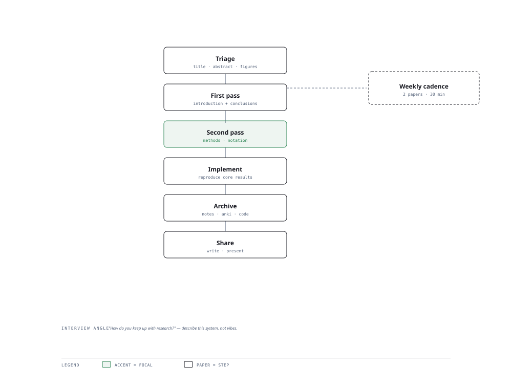

# Visual Notes — From Paper to Lasting Understanding

> One diagram, the full picture. This page is meant to be glanced at before reading the chapters, and again before interviews.

# What the diagram shows

1. **Triage** — Skim to decide if a paper matters before deep diving.
1. **Structure** — Read in passes: title/abstract, then figures/claims, then the method.
1. **Archive** — Reproduce or summarise so the paper enters long-term memory.

# Why this matters for placement

- Reading research is how you stay current and outpace interviewers on novel topics.
- Reproducing one paper per quarter builds the strongest genuine depth signal.

# Quick revision

- Three passes: (1) title+abstract, (2) figures+claims, (3) full method.
- Always ask: what problem, what method, what result, what is missing?
- Tracking a small set of conferences/feeds beats following everything.
- Reproduce or re-implement to move from recognition to understanding.
- Archive notes into your own knowledge base under retrieval, not just read.

# Related chapters

- [Reading research papers](01-reading-research-papers.md)
- [Keeping up with AI](02-keeping-up-with-ai.md)
- [Major AI conferences](03-major-ai-conferences.md)
- [Reproducing papers](04-reproducing-papers.md)

---

**One-line answer for interviews:** *"Triage → structure → implement → archive papers into understanding that compounds."*
