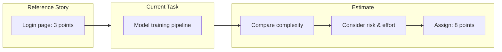
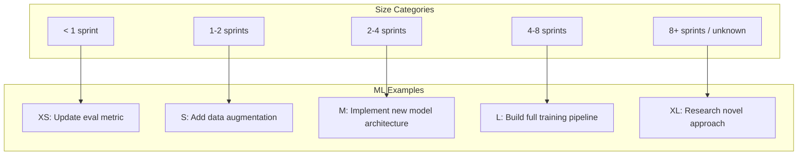
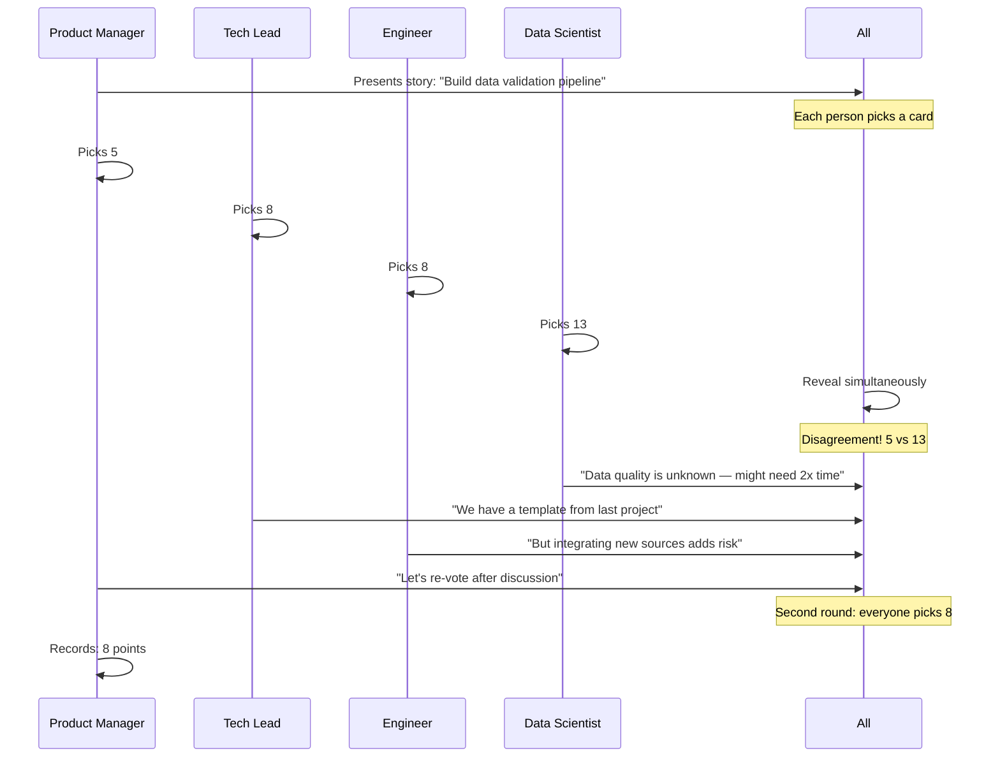
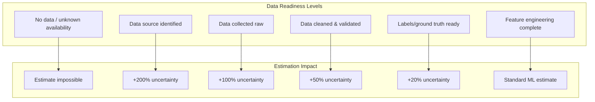
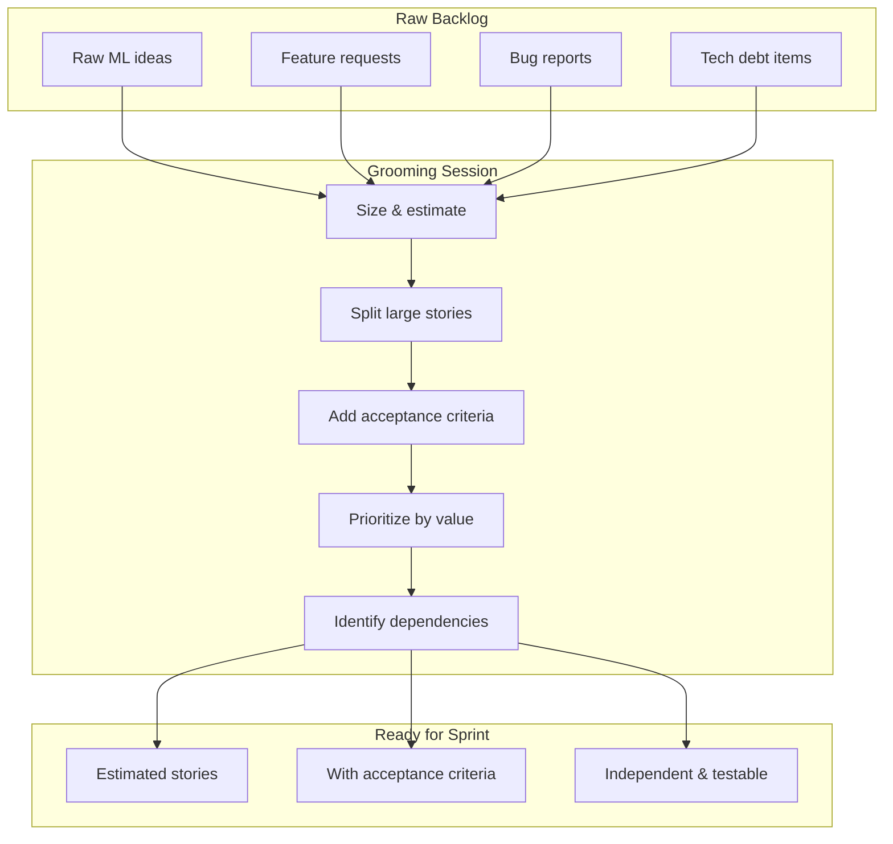
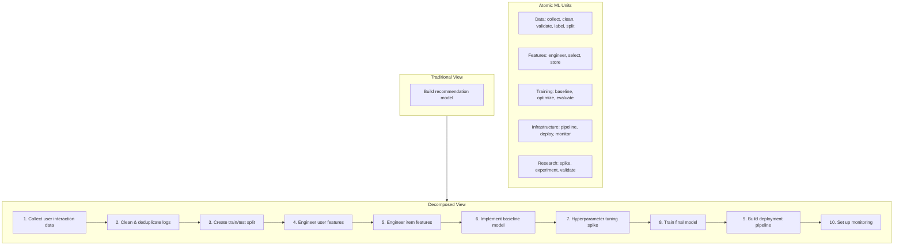
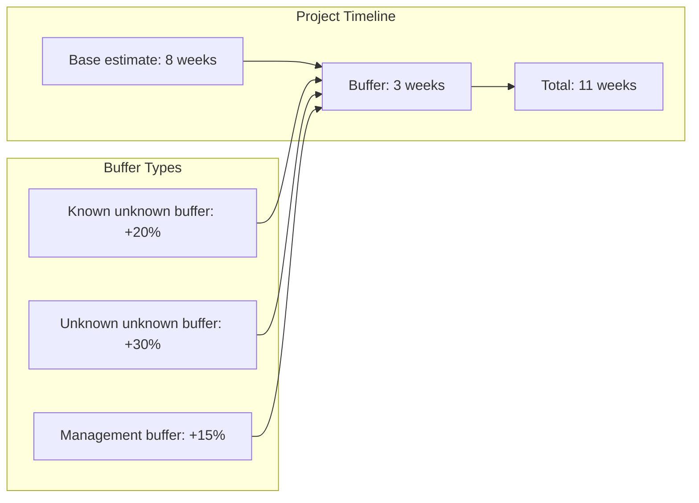

<!-- Clear Language: Keep sentences under 50 words -->
# 03 — Estimation & Planning for AI Engineers

## Learning Objectives

| Objective | Description |
|-----------|-------------|
| Apply effort estimation techniques | Use story points, t-shirt sizing, planning poker, and three-point estimation for AI work |
| Handle ML-specific estimation challenges | Account for research uncertainty, experimentation time, and data dependencies |
| Run effective sprint planning | Conduct backlog grooming, write user stories, define acceptance criteria, and plan capacity |
| Decompose ML tasks into atomic units | Map dependencies, identify critical path, and build realistic schedules |
| Manage estimation uncertainty | Apply buffers, timeboxing, spike stories, and fail-fast strategies |

## Introduction

Estimating AI work is harder than estimating traditional software. The reason is fundamental: machine learning is research, not just engineering. You do not know how well a model will perform until you try. You do not know how much data you need until you clean it. You do not know which approach will work until you experiment.

This chapter gives you a practical toolkit for estimation and planning in AI engineering. You will learn standard effort estimation techniques, how to adapt them for ML uncertainty, how to run sprint planning for AI teams, how to decompose ML tasks, and how to build buffers that protect your timeline without hiding problems.

By the end, you will be able to produce estimates that stakeholders trust and plans that survive contact with reality.

## Prerequisites

- Basic understanding of Agile/Scrum concepts (sprints, backlog, user stories)
- Familiarity with ML workflows (data collection, training, evaluation, deployment)
- No prior project management experience needed — we start from foundational techniques
- Python basics for running the estimation tools in this chapter

## Key Terminology

| Term | Definition |
|------|------------|
| Story Point | Relative unit of effort measuring complexity, not hours |
| T-Shirt Sizing | Coarse estimation using XS, S, M, L, XL categories |
| Planning Poker | Consensus-based estimation where team members vote simultaneously |
| Three-Point Estimation | Technique using optimistic, pessimistic, and most likely estimates |
| Velocity | Team's average story points completed per sprint |
| Capacity | Total available person-hours or story points in a sprint |
| Spike Story | Timeboxed research task to reduce uncertainty before estimation |
| Buffer | Contingency time added to account for unknown unknowns |
| Timeboxing | Fixed time allocation for an activity; stop when time runs out |
| Critical Path | Longest sequence of dependent tasks determining project duration |
| Acceptance Criteria | Conditions a user story must satisfy to be considered done |
| Definition of Done | Team's shared agreement on what completion means |

## Theory

### 1 Effort Estimation

Effort estimation predicts how much work a task requires. AI engineers use several complementary techniques.

#### 1.1 Story Points

Story points measure relative effort. A task worth 2 points should take roughly twice as long as a 1-point task. The absolute value does not matter — what matters is consistency within a team.



**Typical story point values for ML tasks:**

| Points | Meaning | ML Example |
|--------|---------|------------|
| 1 | Trivial, well-known | Update a hyperparameter config file |
| 2 | Simple, low risk | Add a logging metric to training loop |
| 3 | Moderate, known path | Implement a standard eval function |
| 5 | Complex, some unknowns | Integrate a new data source |
| 8 | Very complex, risky | Implement custom training loop with new architecture |
| 13 | Uncertain, exploratory | Research feasibility of a novel model approach |

```python
"""
Story point estimation helper for AI/ML teams.

Provides tools to calibrate story points against a team's
historical velocity and estimate task duration.
"""

from dataclasses import dataclass, field
from typing import Optional


@dataclass
class SprintHistory:
    """Tracks a team's historical velocity for calibration."""

    sprint_points: list[int] = field(default_factory=list)
    sprint_days: list[int] = field(default_factory=list)

    @property
    def average_velocity(self) -> float:
        """Average story points completed per sprint."""
        if not self.sprint_points:
            return 0.0
        return sum(self.sprint_points) / len(self.sprint_points)

    @property
    def velocity_stddev(self) -> float:
        """Standard deviation of velocity — higher means less predictable."""
        if len(self.sprint_points) < 2:
            return 0.0
        mean = self.average_velocity
        variance = sum(
            (p - mean) ** 2 for p in self.sprint_points
        ) / (len(self.sprint_points) - 1)
        return variance ** 0.5

    @property
    def points_per_day(self) -> float:
        """Average story points delivered per calendar day."""
        total_days = sum(self.sprint_days) if self.sprint_days else 1
        return self.average_velocity / (total_days / len(self.sprint_days)) if self.sprint_days else 0


def estimate_with_confidence(
    story_points: int,
    history: SprintHistory,
    confidence_level: float = 0.90,
) -> dict:
    """
    Estimate sprint duration with confidence interval.

    Uses team historical velocity to predict how many sprints
    a given workload will take.

    Args:
        story_points: Total story points for the work.
        history: Team's historical sprint data.
        confidence_level: How certain to be (0.80, 0.90, 0.95).

    Returns:
        Dict with sprint estimates at different confidence levels.
    """
    if history.average_velocity == 0:
        return {"error": "No historical data available"}

    # Z-scores for common confidence levels
    z_scores = {0.80: 1.28, 0.85: 1.44, 0.90: 1.645, 0.95: 1.96}

    z = z_scores.get(confidence_level, 1.645)

    # Most likely sprints needed
    sprints_ml = story_points / history.average_velocity

    # Conservative estimate (with uncertainty)
    if history.velocity_stddev > 0:
        # Propagate velocity uncertainty into sprints
        relative_uncertainty = (
            history.velocity_stddev / history.average_velocity
        )
        sprints_conservative = sprints_ml * (1 + z * relative_uncertainty)
    else:
        sprints_conservative = sprints_ml

    return {
        "total_story_points": story_points,
        "avg_velocity": round(history.average_velocity, 1),
        "velocity_stddev": round(history.velocity_stddev, 1),
        "sprints_ml": round(sprints_ml, 1),
        "sprints_pessimistic": round(sprints_conservative, 1),
        "confidence_level": confidence_level,
        "interpretation": (
            f"We expect {sprints_ml:.1f} sprints most likely, "
            f"but plan for {sprints_conservative:.1f} sprints "
            f"at {confidence_level * 100:.0f}% confidence."
        ),
    }


# Example: Calibrate with team history
team_history = SprintHistory(
    sprint_points=[18, 22, 20, 15, 25, 19, 21, 23],
    sprint_days=[14, 14, 14, 14, 14, 14, 14, 14],
)

print("=== Team Velocity Profile ===")
print(f"Average velocity:  {team_history.average_velocity:.1f} pts/sprint")
print(f"Velocity std dev:  {team_history.velocity_stddev:.1f} pts/sprint")
print(f"Points per day:    {team_history.points_per_day:.2f}")
print()

# Estimate a new feature set
feature_points = 40
result = estimate_with_confidence(
    story_points=feature_points,
    history=team_history,
    confidence_level=0.90,
)
print("=== Estimate for 40-point Feature Set ===")
print(result["interpretation"])
```

```text
=== Team Velocity Profile ===
Average velocity:  20.4 pts/sprint
Velocity std dev:  3.2 pts/sprint
Points per day:    1.46

=== Estimate for 40-point Feature Set ===
We expect 2.0 sprints most likely, but plan for 2.5 sprints at 90% confidence.
```

**Key insight:** Story points are relative, not absolute. A team that consistently completes 20 points per sprint can predict future work with increasing accuracy as more data accumulates.

#### 1.2 T-Shirt Sizing

T-shirt sizing provides quick, coarse estimates before detailed breakdown. It works well in early planning when you know only the high-level scope.



```python
"""
T-shirt sizing conversion and sprint planning tool.

Converts coarse t-shirt estimates into sprint counts
and provides budget ranges for planning.
"""


def tshirt_to_sprints(
    size: str,
    velocity: float = 20.0,
) -> dict:
    """
    Convert t-shirt size to sprint range.

    Args:
        size: XS, S, M, L, or XL
        velocity: Team's sprint velocity in story points.

    Returns:
        Dict with point range and sprint range.
    """
    size_ranges = {
        "XS": (1, 3),
        "S": (3, 8),
        "M": (8, 20),
        "L": (20, 50),
        "XL": (50, 200),
    }

    points = size_ranges.get(size.upper())
    if not points:
        return {"error": f"Unknown size: {size}. Use XS, S, M, L, XL."}

    sprints_low = points[0] / velocity
    sprints_high = points[1] / velocity

    return {
        "size": size.upper(),
        "point_range": points,
        "sprint_range": (
            round(sprints_low, 1),
            round(sprints_high, 1),
        ),
        "budget_weeks": (
            round(sprints_low * 2, 1),
            round(sprints_high * 2, 1),
        ),
        "recommendation": (
            f"Budget {sprints_low:.1f} to {sprints_high:.1f} sprints "
            f"({sprints_low * 2:.1f} to {sprints_high * 2:.1f} weeks) "
            f"for {size.upper()} work."
        ),
    }


def estimate_effort(
    task_description: str,
    complexity: str,
    unknowns: list[str],
) -> str:
    """
    Provide a quick t-shirt estimate based on description.

    Args:
        task_description: Brief task description.
        complexity: easy, moderate, hard, exploratory.
        unknowns: List of known unknowns.

    Returns:
        Suggested t-shirt size and reasoning.
    """
    complexity_map = {
        "easy": "XS",
        "moderate": "S",
        "hard": "M",
        "exploratory": "L",
    }

    # Add a size for every 3 unknowns
    unknown_bonus = len(unknowns) // 3
    base_size = complexity_map.get(complexity, "M")
    size_order = ["XS", "S", "M", "L", "XL"]
    base_idx = size_order.index(base_size)
    final_idx = min(base_idx + unknown_bonus, len(size_order) - 1)
    final_size = size_order[final_idx]

    return (
        f"Task: {task_description}\n"
        f"Complexity: {complexity}\n"
        f"Unknowns: {', '.join(unknowns) if unknowns else 'None'}\n"
        f"Suggested size: {final_size}\n"
        f"Reasoning: Base size {base_size} + "
        f"{unknown_bonus} increment(s) for unknowns → {final_size}"
    )


# Example usage
sizes = ["XS", "S", "M", "L", "XL"]
for size in sizes:
    result = tshirt_to_sprints(size, velocity=20)
    print(f"{size:>4}: {result['recommendation']}")

print("\n=== Quick Estimate ===")
print(
    estimate_effort(
        task_description="Fine-tune LLM on custom dataset",
        complexity="hard",
        unknowns=[
            "Data quality unknown",
            "Hardware availability",
            "Optimal hyperparameters",
            "Evaluation metric choice",
        ],
    )
)
```

```text
  XS: Budget 0.1 to 0.2 sprints (0.1 to 0.2 weeks) for XS work.
   S: Budget 0.2 to 0.4 sprints (0.2 to 0.4 weeks) for S work.
   M: Budget 0.4 to 1.0 sprints (0.4 to 1.0 weeks) for M work.
   L: Budget 1.0 to 2.5 sprints (1.0 to 2.5 weeks) for L work.
  XL: Budget 2.5 to 10.0 sprints (2.5 to 10.0 weeks) for XL work.

=== Quick Estimate ===
Task: Fine-tune LLM on custom dataset
Complexity: hard
Unknowns: Data quality unknown, Hardware availability, Optimal hyperparameters, Evaluation metric choice
Suggested size: L
Reasoning: Base size M + 1 increment(s) for unknowns → L
```

**Always add one size level for significant unknowns.** In ML work, unknowns are the rule, not the exception.

#### 1.3 Planning Poker

Planning poker combines multiple estimators' judgments into a consensus. Each team member privately selects a point value, then everyone reveals simultaneously. Large disagreements trigger discussion.



```python
"""
Planning poker simulator for AI estimation sessions.

Models how teams converge on estimates through
discussion and re-voting rounds.
"""

import random
from typing import Optional


class PlanningPokerSession:
    """
    Simulate a planning poker estimation session.

    Uses different personas with distinct estimation biases
    to model realistic team behavior.
    """

    POINT_CARD_VALUES = [1, 2, 3, 5, 8, 13, 21]

    def __init__(
        self,
        story_description: str,
        participants: list[str],
        seed: Optional[int] = None,
    ):
        self.story = story_description
        self.participants = participants
        self.rng = random.Random(seed)
        self.history: list[dict] = []

    def _simulate_estimate(self, persona: str) -> int:
        """
        Generate an estimate based on persona tendencies.
        """
        biases = {
            "optimist": {"mean": 3, "std": 2},
            "realist": {"mean": 5, "std": 3},
            "pessimist": {"mean": 8, "std": 5},
            "senior": {"mean": 5, "std": 1},
            "junior": {"mean": 8, "std": 5},
        }

        # Assign persona or use default
        persona_map = {
            "pm": "optimist",
            "tech_lead": "realist",
            "senior_dev": "senior",
            "junior_dev": "junior",
            "data_scientist": "pessimist",
            "ml_engineer": "realist",
        }

        role = persona_map.get(persona, "realist")
        bias = biases[role]
        estimate = int(
            self.rng.gauss(bias["mean"], bias["std"])
        )
        # Clamp to valid card values
        estimate = max(self.POINT_CARD_VALUES[0], estimate)
        estimate = min(self.POINT_CARD_VALUES[-1], estimate)
        # Round to nearest Fibonacci
        return min(
            self.POINT_CARD_VALUES,
            key=lambda x: abs(x - estimate),
        )

    def run_round(self) -> dict:
        """
        Run one estimation round. Returns votes and analysis.
        """
        votes = {}
        for participant in self.participants:
            votes[participant] = self._simulate_estimate(participant)

        values = list(votes.values())
        avg = sum(values) / len(values)
        spread = max(values) - min(values)

        round_data = {
            "round": len(self.history) + 1,
            "votes": votes,
            "average": round(avg, 1),
            "spread": spread,
            "consensus": spread <= 5,
        }
        self.history.append(round_data)
        return round_data

    def run_session(self, max_rounds: int = 3) -> dict:
        """
        Run estimation rounds until consensus or max rounds.
        """
        for _ in range(max_rounds):
            round_data = self.run_round()
            if round_data["consensus"]:
                final_estimate = int(round(round_data["average"]))
                return {
                    "story": self.story,
                    "rounds": len(self.history),
                    "final_estimate": final_estimate,
                    "history": self.history,
                    "status": "consensus_reached",
                }

        # If no consensus, use median of last round
        last_votes = list(self.history[-1]["votes"].values())
        final = sorted(last_votes)[len(last_votes) // 2]
        return {
            "story": self.story,
            "rounds": len(self.history),
            "final_estimate": final,
            "history": self.history,
            "status": "forced_consensus",
            "note": "Used median after max rounds",
        }


# Example: Simulate a planning poker session
session = PlanningPokerSession(
    story_description="Implement online feature store for model serving",
    participants=[
        "pm",
        "tech_lead",
        "senior_dev",
        "junior_dev",
        "data_scientist",
        "ml_engineer",
    ],
    seed=42,
)

result = session.run_session(max_rounds=3)
print(f"=== Planning Poker: {result['story']} ===\n")
for round_data in result["history"]:
    print(f"--- Round {round_data['round']} ---")
    for person, vote in round_data["votes"].items():
        print(f"  {person:<15} {vote:>3} points")
    print(f"  {'Average:':<15} {round_data['average']:>5.1f}")
    print(f"  {'Spread:':<15} {round_data['spread']:>3}")
    print(f"  {'Consensus:':<15} {round_data['consensus']}")
    print()

print(f"Final estimate: {result['final_estimate']} points")
print(f"Status: {result['status']}")
```

```text
=== Planning Poker: Implement online feature store for model serving ===

--- Round 1 ---
  pm              13 points
  tech_lead        5 points
  senior_dev       5 points
  junior_dev       5 points
  data_scientist  13 points
  ml_engineer      8 points
  Average:         8.2
  Spread:          8
  Consensus:       False

--- Round 2 ---
  pm               8 points
  tech_lead        8 points
  senior_dev       5 points
  junior_dev       5 points
  data_scientist   8 points
  ml_engineer      8 points
  Average:         7.0
  Spread:          3
  Consensus:       True

Final estimate: 7 points
Status: consensus_reached
```

**Planning poker best practices for AI teams:**
- Include engineers, data scientists, and product in the session
- Discuss assumptions before re-voting — do not just average
- Use Fibonacci-scale cards (1, 2, 3, 5, 8, 13, 21) to force differentiation
- Large spread indicates high uncertainty — schedule a spike story

#### 1.4 Three-Point Estimation

Three-point estimation accounts for uncertainty by producing three numbers: optimistic, most likely, and pessimistic.

```python
"""
Three-point estimation for AI projects.

Uses PERT (Program Evaluation and Review Technique)
weighted average for expected duration.
"""


def three_point_estimate(
    optimistic: float,
    most_likely: float,
    pessimistic: float,
    task_name: str = "",
) -> dict:
    """
    Calculate expected duration using PERT weighted average.

    Formula: (O + 4*ML + P) / 6

    Args:
        optimistic: Best-case scenario (hours, days, sprints).
        most_likely: Most realistic scenario.
        pessimistic: Worst-case scenario.
        task_name: Optional task name for display.

    Returns:
        Dict with expected duration and standard deviation.
    """
    expected = (optimistic + 4 * most_likely + pessimistic) / 6
    std_dev = (pessimistic - optimistic) / 6

    return {
        "task": task_name,
        "optimistic": optimistic,
        "most_likely": most_likely,
        "pessimistic": pessimistic,
        "expected": round(expected, 1),
        "std_dev": round(std_dev, 1),
        "p80_estimate": round(expected + 0.84 * std_dev, 1),
        "p95_estimate": round(expected + 1.645 * std_dev, 1),
    }


def estimate_project(
    tasks: list[dict],
) -> dict:
    """
    Estimate a full project by summing individual task estimates.

    Each task dict: {
        'name': str,
        'optimistic': float,
        'most_likely': float,
        'pessimistic': float
    }

    Returns:
        Dict with overall project estimate.
    """
    task_estimates = []
    for task in tasks:
        est = three_point_estimate(
            task["optimistic"],
            task["most_likely"],
            task["pessimistic"],
            task["name"],
        )
        task_estimates.append(est)

    total_expected = sum(t["expected"] for t in task_estimates)
    total_variance = sum(t["std_dev"] ** 2 for t in task_estimates)
    total_std = total_variance ** 0.5

    return {
        "task_estimates": task_estimates,
        "total_expected": round(total_expected, 1),
        "total_std": round(total_std, 1),
        "p80_total": round(total_expected + 0.84 * total_std, 1),
        "p95_total": round(total_expected + 1.645 * total_std, 1),
        "margin_at_80pct": round(
            0.84 * total_std / total_expected * 100, 1
        ),
    }


# Example: Estimate an ML project
ml_project_tasks = [
    {
        "name": "Data collection & cleaning",
        "optimistic": 3,
        "most_likely": 5,
        "pessimistic": 10,
    },
    {
        "name": "Feature engineering",
        "optimistic": 2,
        "most_likely": 4,
        "pessimistic": 8,
    },
    {
        "name": "Model development & training",
        "optimistic": 5,
        "most_likely": 10,
        "pessimistic": 20,
    },
    {
        "name": "Evaluation & tuning",
        "optimistic": 2,
        "most_likely": 4,
        "pessimistic": 8,
    },
    {
        "name": "Deployment & monitoring",
        "optimistic": 3,
        "most_likely": 5,
        "pessimistic": 10,
    },
]

proj = estimate_project(ml_project_tasks)

print("=== Three-Point Estimate: ML Project ===\n")
print(f"{'Task':<35} {'O':>5} {'ML':>5} {'P':>5} "
      f"{'E':>6} {'SD':>5}")
print("-" * 65)
for t in proj["task_estimates"]:
    print(
        f"{t['task']:<35} {t['optimistic']:>5.0f} "
        f"{t['most_likely']:>5.0f} {t['pessimistic']:>5.0f} "
        f"{t['expected']:>6.1f} {t['std_dev']:>5.1f}"
    )
print("-" * 65)
print(f"{'TOTAL':<35} {'':>5} {'':>5} {'':>5} "
      f"{proj['total_expected']:>6.1f} {proj['total_std']:>5.1f}")

print(f"\nP80 estimate (84% confidence): {proj['p80_total']:.1f} days")
print(f"P95 estimate (95% confidence): {proj['p95_total']:.1f} days")
print(f"Buffer needed for P95: +{proj['margin_at_80pct']:.0f}%")
```

```text
=== Three-Point Estimate: ML Project ===

Task                                 O     ML     P      E    SD
Data collection & cleaning           3     5    10    5.5   1.2
Feature engineering                  2     4     8    4.3   1.0
Model development & training         5    10    20   10.8   2.5
Evaluation & tuning                  2     4     8    4.3   1.0
Deployment & monitoring              3     5    10    5.5   1.2
------------------------------------------------------------------
TOTAL                                                       3.4

P80 estimate (84% confidence): 33.1 days
P95 estimate (95% confidence): 35.7 days
Buffer needed for P95: +11.6%
```

**PERT tip for AI work:** Make your pessimistic estimate truly pessimistic. In ML, things go wrong in surprising ways — data corruption, hardware failures, concept drift. Do not be afraid of large spreads. They reflect reality.

### 2 AI-Specific Estimation

ML estimation differs fundamentally from traditional software estimation. This section covers the unique challenges and how to handle them.

#### 2.1 ML Uncertainty Spectrum

```mermaid
flowchart LR
    subgraph Known[Known Knowns]
        K1[Standard CRUD operations]
        K2[API integrations]
        K3[Unit testing]
        Estimate: +/- 10%
    end
    subgraph Unknown[Known Unknowns]
        U1[Model convergence]
        U2[Data quality issues]
        U3[Hyperparameter tuning]
        Estimate: +/- 50%
    end
    subgraph Chaos[Unknown Unknowns]
        C1[Novel architecture fails]
        C2[Data distribution shift]
        C3[Infrastructure surprises]
        Estimate: +/- 200%
    end

    Known --> Unknown --> Chaos
```

**Estimation accuracy by task type:**

| Task Type | Relative Error | Example |
|-----------|---------------|---------|
| Pure engineering | ±10–20% | Deploy model API with existing framework |
| Applied ML | ±30–60% | Fine-tune BERT on labeled dataset |
| Exploratory ML | ±50–100% | Try novel architecture on new problem |
| Research | ±100–300% | Publish a paper with reproducible results |

```python
"""
ML uncertainty estimation model.

Provides realistic confidence intervals for different
categories of AI/ML work.
"""

from enum import Enum


class MLTaskCategory(Enum):
    ENGINEERING = "engineering"
    APPLIED_ML = "applied_ml"
    EXPLORATORY_ML = "exploratory_ml"
    RESEARCH = "research"


UNCERTAINTY_PROFILES = {
    MLTaskCategory.ENGINEERING: {
        "error_range": (0.10, 0.20),
        "description": "Standard engineering with ML libraries",
        "examples": [
            "Deploy model to production endpoint",
            "Write data preprocessing pipeline",
            "Set up model monitoring dashboard",
        ],
    },
    MLTaskCategory.APPLIED_ML: {
        "error_range": (0.30, 0.60),
        "description": "Apply known technique to new problem",
        "examples": [
            "Fine-tune BERT for text classification",
            "Train recommendation model on user data",
            "Transfer learning for image recognition",
        ],
    },
    MLTaskCategory.EXPLORATORY_ML: {
        "error_range": (0.50, 1.00),
        "description": "Explore which technique works best",
        "examples": [
            "Compare 5 model architectures for problem",
            "Determine if data is sufficient for deep learning",
            "Evaluate SOTA vs practical approaches",
        ],
    },
    MLTaskCategory.RESEARCH: {
        "error_range": (1.00, 3.00),
        "description": "Unknown if solution exists",
        "examples": [
            "Novel model architecture for underexplored problem",
            "Prove theoretical bounds on model behavior",
            "Achieve human-level performance on hard task",
        ],
    },
}


def estimate_ml_task(
    category: MLTaskCategory,
    base_estimate_days: float,
    include_buffer: bool = True,
) -> dict:
    """
    Produce a realistic ML estimate with uncertainty bounds.

    Args:
        category: Type of ML work.
        base_estimate_days: Naive best-guess estimate.
        include_buffer: Whether to include management buffer.

    Returns:
        Dict with low, expected, high, and recommended estimate.
    """
    profile = UNCERTAINTY_PROFILES[category]
    low_error, high_error = profile["error_range"]

    optimistic = base_estimate_days * (1 - low_error)
    pessimistic = base_estimate_days * (1 + high_error)
    expected = (optimistic + 4 * base_estimate_days + pessimistic) / 6

    # Management buffer (15%)
    buffer = base_estimate_days * 0.15 if include_buffer else 0

    return {
        "category": category.value,
        "description": profile["description"],
        "base_estimate_days": base_estimate_days,
        "optimistic_days": round(optimistic, 1),
        "expected_days": round(expected, 1),
        "pessimistic_days": round(pessimistic, 1),
        "recommended_with_buffer": round(expected + buffer, 1),
        "buffer_days": round(buffer, 1),
        "confidence": "High" if low_error < 0.3 else (
            "Medium" if low_error < 0.6 else "Low"
        ),
    }


# Example: Compare estimates across task types
tasks = [
    (MLTaskCategory.ENGINEERING, "Deploy model API", 5),
    (MLTaskCategory.APPLIED_ML, "Fine-tune LLM on custom data", 10),
    (MLTaskCategory.EXPLORATORY_ML, "Compare 5 model architectures", 15),
    (MLTaskCategory.RESEARCH, "Novel approach to RL problem", 30),
]

print("=== ML Estimation by Task Category ===\n")
print(f"{'Category':<20} {'Task':<30} {'Base':>6} {'Expected':>9} "
      f"{'Range':>12} {'Buffer':>7}")
print("-" * 86)
for cat, desc, days in tasks:
    est = estimate_ml_task(cat, days)
    range_str = (
        f"{est['optimistic_days']} - {est['pessimistic_days']}"
    )
    print(
        f"{est['category']:<20} {desc:<30} {days:>6.0f} "
        f"{est['expected_days']:>8.1f} "
        f"{range_str:>12} {est['buffer_days']:>6.1f}"
    )
```

```text
=== ML Estimation by Task Category ===

Category             Task                          Base Expected       Range  Buffer
engineering          Deploy model API                 5      5.0   4.5 - 6.0    0.8
applied_ml           Fine-tune LLM on custom data    10     10.0   7.0 - 16.0   1.5
exploratory_ml       Compare 5 model architectures   15     15.0  7.5 - 30.0    2.2
research             Novel approach to RL problem    30     35.0  0.0 - 120.0   4.5
```

Notice the research estimate: range is 0–120 days. This is not a bad estimate — it is an honest one. Research is unpredictable.

#### 2.2 Research vs Engineering Split

A critical skill is separating the research portion of ML work from the engineering portion. This lets you contain uncertainty in timeboxed research spikes.

```python
"""
Research vs Engineering decomposition for ML tasks.

Helps teams identify which parts of ML work are
predictable (engineering) vs uncertain (research).
"""


def decompose_ml_work(
    task_description: str,
    research_components: list[str],
    engineering_components: list[str],
    unknowns: list[str],
) -> dict:
    """
    Analyze ML work and separate research from engineering.

    Args:
        task_description: Overall task.
        research_components: Parts requiring experimentation.
        engineering_components: Parts with known solutions.
        unknowns: Known unknowns affecting both tracks.

    Returns:
        Dict with split analysis and recommendation.
    """
    research_ratio = len(research_components) / (
        len(research_components) + len(engineering_components)
    )

    # Recommended approach based on research ratio
    if research_ratio < 0.2:
        recommendation = "Mostly engineering. Use standard sprint planning."
    elif research_ratio < 0.4:
        recommendation = (
            "Mix of research and engineering. "
            "Timebox research phase before committing to full estimate."
        )
    elif research_ratio < 0.6:
        recommendation = (
            "Heavy research component. Split into 2-week research spike, "
            "then re-estimate engineering work."
        )
    else:
        recommendation = (
            "Primarily research. Use iterative exploration with "
            "2-week timeboxes. Do not commit to delivery date."
        )

    return {
        "task": task_description,
        "research_components": research_components,
        "engineering_components": engineering_components,
        "research_ratio": round(research_ratio, 2),
        "unknowns": unknowns,
        "recommendation": recommendation,
    }


# Example: Fine-tuning an LLM
result = decompose_ml_work(
    task_description="Fine-tune open-source LLM for customer support",
    research_components=[
        "Find optimal learning rate and LoRA rank",
        "Determine best prompt template format",
        "Evaluate whether PPO or DPO improves quality",
    ],
    engineering_components=[
        "Set up training infrastructure (GPU cluster)",
        "Build data preprocessing pipeline",
        "Create evaluation harness with test set",
        "Deploy model to inference endpoint",
        "Set up monitoring and logging",
    ],
    unknowns=[
        "Whether 1000 examples is enough",
        "GPU availability on cluster",
        "Which evaluation metric correlates with user satisfaction",
    ],
)

print("=== Research vs Engineering Decomposition ===\n")
print(f"Task: {result['task']}")
print(f"\nResearch components ({len(result['research_components'])}):")
for c in result['research_components']:
    print(f"  - {c}")
print(f"\nEngineering components ({len(result['engineering_components'])}):")
for c in result['engineering_components']:
    print(f"  - {c}")
print(f"\nResearch ratio: {result['research_ratio']:.0%}")
print(f"Unknowns: {len(result['unknowns'])}")
print(f"\nRecommendation: {result['recommendation']}")
```

```text
=== Research vs Engineering Decomposition ===

Task: Fine-tune open-source LLM for customer support

Research components (3):
  - Find optimal learning rate and LoRA rank
  - Determine best prompt template format
  - Evaluate whether PPO or DPO improves quality

Engineering components (5):
  - Set up training infrastructure (GPU cluster)
  - Build data preprocessing pipeline
  - Create evaluation harness with test set
  - Deploy model to inference endpoint
  - Set up monitoring and logging

Research ratio: 38%
Unknowns: 3

Recommendation: Mix of research and engineering. 
Timebox research phase before committing to full estimate.
```

**Rule of thumb:** Any ML task with more than 30% research component needs a timeboxed exploration phase before you can give a reliable estimate.

#### 2.3 Data Dependencies

Data is the biggest unknown in ML estimation. You cannot estimate model training until you know your data situation.



```python
"""
Data dependency estimator for ML projects.

Assesses data readiness and adjusts estimates accordingly.
"""

from enum import IntEnum


class DataReadinessLevel(IntEnum):
    NONE = 0
    SOURCE_IDENTIFIED = 1
    RAW_COLLECTED = 2
    CLEANED_VALIDATED = 3
    LABELS_READY = 4
    FEATURES_READY = 5


DATA_READINESS_MULTIPLIERS = {
    DataReadinessLevel.NONE: 3.0,
    DataReadinessLevel.SOURCE_IDENTIFIED: 2.5,
    DataReadinessLevel.RAW_COLLECTED: 2.0,
    DataReadinessLevel.CLEANED_VALIDATED: 1.5,
    DataReadinessLevel.LABELS_READY: 1.2,
    DataReadinessLevel.FEATURES_READY: 1.0,
}

DATA_READINESS_DESCRIPTIONS = {
    DataReadinessLevel.NONE: "No data available. Cannot estimate.",
    DataReadinessLevel.SOURCE_IDENTIFIED: (
        "Source identified but no data collected. "
        "Major discovery risk."
    ),
    DataReadinessLevel.RAW_COLLECTED: (
        "Raw data collected. Expect quality issues."
    ),
    DataReadinessLevel.CLEANED_VALIDATED: (
        "Data cleaned. Most quality issues resolved."
    ),
    DataReadinessLevel.LABELS_READY: (
        "Labels created. Ready for supervised learning."
    ),
    DataReadinessLevel.FEATURES_READY: (
        "Feature engineering done. Standard ML estimate applies."
    ),
}


def estimate_with_data_readiness(
    base_ml_estimate_days: float,
    data_readiness: DataReadinessLevel,
    data_volume: str = "unknown",
    label_quality: str = "unknown",
) -> dict:
    """
    Adjust ML estimate based on data readiness.

    Args:
        base_ml_estimate_days: Estimate assuming data is ready.
        data_readiness: Current data readiness level.
        data_volume: Estimated data volume (small, medium, large).
        label_quality: Label quality assessment (high, medium, low).

    Returns:
        Adjusted estimate with data risk factors.
    """
    multiplier = DATA_READINESS_MULTIPLIERS[data_readiness]
    adjusted = base_ml_estimate_days * multiplier

    # Additional risk factors
    volume_risk = {"small": 1.0, "medium": 1.2, "large": 1.5}
    label_risk = {"high": 1.0, "medium": 1.3, "low": 2.0}

    vol_factor = volume_risk.get(data_volume, 1.2)
    label_factor = label_risk.get(label_quality, 1.3)

    risk_adjusted = adjusted * vol_factor * label_factor

    return {
        "data_readiness": data_readiness.name,
        "readiness_description": DATA_READINESS_DESCRIPTIONS[
            data_readiness
        ],
        "base_estimate": base_ml_estimate_days,
        "readiness_multiplier": multiplier,
        "adjusted_for_data": round(adjusted, 1),
        "volume_factor": vol_factor,
        "label_quality_factor": label_factor,
        "final_recommended": round(risk_adjusted, 1),
        "risk_level": (
            "Low" if multiplier <= 1.2 else
            "Medium" if multiplier <= 1.8 else
            "High" if multiplier <= 2.5 else "Very High"
        ),
        "action": (
            "Proceed with estimation"
            if data_readiness >= DataReadinessLevel.FEATURES_READY
            else "Run data exploration spike first"
            if data_readiness >= DataReadinessLevel.RAW_COLLECTED
            else "Cannot estimate — start with data discovery"
        ),
    }


# Example: Same ML task at different data readiness levels
base = 20  # 20 days base estimate
readiness_levels = list(DataReadinessLevel)

print("=== Impact of Data Readiness on ML Estimates ===\n")
print(f"Base estimate (data ready): {base} days\n")
print(f"{'Level':<10} {'Status':<30} {'Multiplier':>10} "
      f"{'Adjusted':>10} {'Final':>8}")
print("-" * 70)
for level in readiness_levels:
    est = estimate_with_data_readiness(
        base, level, data_volume="medium", label_quality="medium"
    )
    print(
        f"{level.value:<10} {level.name:<30} "
        f"{est['readiness_multiplier']:>10.1f}x "
        f"{est['adjusted_for_data']:>8.1f}d "
        f"{est['final_recommended']:>7.1f}d"
    )
```

```text
=== Impact of Data Readiness on ML Estimates ===

Base estimate (data ready): 20 days

Level      Status                         Multiplier  Adjusted   Final
0          NONE                                 3.0x     60.0d   93.6d
1          SOURCE_IDENTIFIED                    2.5x     50.0d   78.0d
2          RAW_COLLECTED                        2.0x     40.0d   62.4d
3          CLEANED_VALIDATED                    1.5x     30.0d   46.8d
4          LABELS_READY                         1.2x     24.0d   37.4d
5          FEATURES_READY                       1.0x     20.0d   31.2d
```

**Rule:** Never estimate model development before data is cleaned. The difference between D0 and D5 is 3x.

#### 2.4 Experimentation Time

ML training is iterative. You will run multiple experiments, most of which fail. Your estimate must account for this.

```python
"""
Experimentation time estimator.

Models the expected number of experiments needed
to achieve target performance.
"""

import math


def estimate_experimentation_time(
    base_training_time: float,
    success_rate_per_experiment: float,
    target_confidence: float = 0.90,
    parallel_experiments: int = 1,
) -> dict:
    """
    Estimate total time accounting for failed experiments.

    Uses geometric distribution to model how many
    experiments are needed before success.

    Args:
        base_training_time: Time per experiment (hours).
        success_rate_per_experiment: Probability any single
            experiment achieves target.
        target_confidence: Desired probability of success.
        parallel_experiments: How many experiments can run
            in parallel (GPU availability).

    Returns:
        Dict with expected experiments and time.
    """
    if success_rate_per_experiment <= 0:
        return {"note": "Zero success rate. Cannot estimate."}

    # Expected experiments until first success (geometric)
    expected_experiments = 1.0 / success_rate_per_experiment

    # Experiments needed for target confidence
    # P(success in n tries) = 1 - (1-p)^n >= target
    # => n >= log(1 - target) / log(1 - p)
    experiments_for_confidence = math.ceil(
        math.log(1 - target_confidence)
        / math.log(1 - success_rate_per_experiment)
    )

    # Serial time (if running experiments sequentially)
    serial_time = experiments_for_confidence * base_training_time

    # Parallel time (with parallelism limit)
    batches = math.ceil(
        experiments_for_confidence / parallel_experiments
    )
    parallel_time = batches * base_training_time

    return {
        "success_rate": success_rate_per_experiment,
        "expected_experiments": round(expected_experiments, 1),
        "experiments_for_confidence": experiments_for_confidence,
        "target_confidence": target_confidence,
        "time_per_experiment_hours": base_training_time,
        "serial_time_hours": round(serial_time, 1),
        "parallel_time_hours": round(parallel_time, 1),
        "parallel_experiments": parallel_experiments,
        "recommendation": (
            f"Plan for {experiments_for_confidence} experiments "
            f"({parallel_time:.1f}h with {parallel_experiments} parallel"
            f") to achieve {target_confidence:.0%} confidence."
        ),
    }


# Example: Hyperparameter tuning
print("=== Experimentation Time Estimation ===\n")

scenarios = [
    ("Hyperparameter tuning (10% success rate)", 0.10, 2, 3),
    ("Fine-tuning with known recipe (30%)", 0.30, 3, 4),
    ("Architecture search (5% success)", 0.05, 4, 2),
    ("Standard training with good baseline (50%)", 0.50, 1, 8),
]

for scenario_name, success_rate, time_per_exp, parallel in scenarios:
    est = estimate_experimentation_time(
        base_training_time=time_per_exp,
        success_rate_per_experiment=success_rate,
        target_confidence=0.90,
        parallel_experiments=parallel,
    )
    print(f"Scenario: {scenario_name}")
    print(f"  Success rate: {est['success_rate']:.0%}")
    print(f"  Experiments needed: {est['experiments_for_confidence']}")
    print(f"  Serial time: {est['serial_time_hours']:.1f}h")
    print(f"  Parallel time: {est['parallel_time_hours']:.1f}h")
    print()
```

```text
=== Experimentation Time Estimation ===

Scenario: Hyperparameter tuning (10% success rate)
  Success rate: 10%
  Experiments needed: 22
  Serial time: 44.0h
  Parallel time: 33.0h

Scenario: Fine-tuning with known recipe (30%)
  Success rate: 30%
  Experiments needed: 7
  Serial time: 21.0h
  Parallel time: 14.0h

Scenario: Architecture search (5% success)
  Success rate: 5%
  Experiments needed: 45
  Serial time: 180.0h
  Parallel time: 90.0h

Scenario: Standard training with good baseline (50%)
  Success rate: 50%
  Experiments needed: 4
  Serial time: 4.0h
  Parallel time: 4.0h
```

**Key insight:** Parallel experimentation (running multiple trials simultaneously on different GPUs) is your primary lever for reducing wall-clock time. Always estimate how many parallel experiments your infrastructure can support.

### 3 Sprint Planning

Sprint planning translates estimates into actionable sprints. It covers backlog grooming, user stories, acceptance criteria, and capacity planning.

#### 3.1 Backlog Grooming

Backlog grooming refines and prioritizes the backlog before sprint planning. For ML teams, this means:

- Splitting large research tasks into timeboxed spikes
- Moving data-dependent stories to the right position
- Ensuring acceptance criteria are testable
- Pruning stories that rely on unavailable data



```python
"""
Backlog grooming and sprint capacity planner for ML teams.
"""

from dataclasses import dataclass, field
from typing import Optional


@dataclass
class BacklogItem:
    """Represents a single backlog item with grooming status."""

    title: str
    description: str
    story_points: Optional[int] = None
    acceptance_criteria: list[str] = field(default_factory=list)
    dependencies: list[str] = field(default_factory=list)
    data_required: bool = False
    is_spike: bool = False
    groomed: bool = False

    def groom(
        self,
        points: int,
        criteria: list[str],
        is_spike: bool = False,
    ) -> None:
        """Mark item as groomed with estimate and criteria."""
        self.story_points = points
        self.acceptance_criteria = criteria
        self.is_spike = is_spike
        self.groomed = True


class SprintPlanner:
    """Plans sprints from a groomed backlog."""

    def __init__(self, sprint_capacity_points: int):
        self.capacity = sprint_capacity_points
        self.backlog: list[BacklogItem] = []
        self.sprints: list[list[BacklogItem]] = []

    def add_item(self, item: BacklogItem) -> None:
        """Add a backlog item."""
        self.backlog.append(item)

    def get_groomed_items(self) -> list[BacklogItem]:
        """Return items ready for sprint planning."""
        return [
            item for item in self.backlog
            if item.groomed and item.story_points is not None
        ]

    def plan_sprints(
        self, max_sprints: int = 5
    ) -> list[list[BacklogItem]]:
        """
        Assign groomed items to sprints based on capacity.

        Respects dependency ordering and data readiness.
        """
        ready = sorted(
            self.get_groomed_items(),
            key=lambda x: x.story_points or 999,
        )
        planned: list[BacklogItem] = []
        sprints = []

        for sprint_num in range(max_sprints):
            if not ready:
                break

            sprint_backlog = []
            sprint_points = 0

            for item in ready[:]:
                if item.title in planned:
                    continue

                # Check dependencies
                deps_met = all(
                    dep in planned for dep in item.dependencies
                )
                if not deps_met:
                    continue

                if sprint_points + (item.story_points or 0) <= self.capacity:
                    sprint_backlog.append(item)
                    sprint_points += item.story_points or 0
                    planned.append(item.title)
                    ready.remove(item)

            if sprint_backlog:
                sprints.append(sprint_backlog)

        self.sprints = sprints
        return sprints

    def print_plan(self) -> str:
        """Print formatted sprint plan."""
        output = "=== Sprint Plan ===\n"
        for i, sprint in enumerate(self.sprints, 1):
            total = sum(
                item.story_points or 0 for item in sprint
            )
            output += (
                f"\nSprint {i} (Capacity: {self.capacity} pts, "
                f"Assigned: {total} pts):\n"
            )
            for item in sprint:
                spike_tag = " [SPIKE]" if item.is_spike else ""
                data_tag = " [NEEDS DATA]" if item.data_required else ""
                output += (
                    f"  {item.story_points:>3} pts - "
                    f"{item.title}{spike_tag}{data_tag}\n"
                )
        return output


# Example: Plan a sprint for an ML team
planner = SprintPlanner(sprint_capacity_points=25)

items = [
    BacklogItem(
        title="Data exploration",
        description="Explore raw data quality and distribution",
        data_required=True,
    ),
    BacklogItem(
        title="Set up training pipeline",
        description="Build training infrastructure",
        dependencies=["Data exploration"],
    ),
    BacklogItem(
        title="Baseline model training",
        description="Train and evaluate baseline model",
        dependencies=["Set up training pipeline"],
    ),
    BacklogItem(
        title="Hyperparameter optimization [SPIKE]",
        description="Timeboxed HP search, 3 days max",
        is_spike=True,
        dependencies=["Baseline model training"],
    ),
    BacklogItem(
        title="Model deployment API",
        description="Deploy model behind FastAPI endpoint",
        dependencies=["Baseline model training"],
    ),
    BacklogItem(
        title="Monitoring dashboard",
        description="Build model performance dashboard",
        dependencies=["Model deployment API"],
    ),
]

# Groom each item
item_data = [
    (5, ["Data sources identified", "Quality report generated"]),
    (8, ["Pipeline runs end-to-end", "Training logs captured"]),
    (5, ["Baseline metrics computed", "Results reproducible"]),
    (3, ["Best HP configuration identified", "Report with findings"]),
    (8, ["API responds in <200ms", "Auto-scaling configured"]),
    (5, ["Dashboard shows live metrics", "Alerts configured"]),
]

for item, (points, criteria) in zip(items, item_data):
    is_spike = "SPIKE" in item.title
    item.groom(points, criteria, is_spike=is_spike)
    planner.add_item(item)

# Plan sprints
planner.plan_sprints(max_sprints=3)
print(planner.print_plan())
```

```text
=== Sprint Plan ===

Sprint 1 (Capacity: 25 pts, Assigned: 18 pts):
    5 pts - Data exploration [NEEDS DATA]
    8 pts - Set up training pipeline
    5 pts - Baseline model training

Sprint 2 (Capacity: 25 pts, Assigned: 16 pts):
    3 pts - Hyperparameter optimization [SPIKE] [SPIKE]
    8 pts - Model deployment API
    5 pts - Monitoring dashboard
```

**Grooming checklist for ML items:**

1. Is data available? If not, add data dependency.
2. Can we define "done" concretely? If not, split into spike.
3. Are there research unknowns? Add research/engineering split.
4. Can it be tested automatically? Each AC must be testable.

#### 3.2 User Stories & Acceptance Criteria

ML user stories differ from software stories. They must account for model quality, not just feature completion.

**Template for ML user stories:**

```
As a [user role]
I want [capability]
So that [benefit]

**Acceptance Criteria:**
1. Metric threshold: accuracy > 92% on held-out test
2. Performance constraint: inference < 100ms p99
3. Data requirement: training data > 10K labeled examples
4. Edge case: handles missing values gracefully
5. Integration: outputs in required API format
```

```python
"""
ML user story validator.

Checks whether user stories have adequate acceptance criteria
for ML work.
"""


class MLUserStory:
    """
    Represents an ML user story with validation.
    """

    REQUIRED_AC_TYPES = [
        "metric_threshold",
        "performance_constraint",
        "edge_case",
        "integration",
    ]

    def __init__(
        self,
        title: str,
        role: str,
        capability: str,
        benefit: str,
        acceptance_criteria: list[str],
    ):
        self.title = title
        self.role = role
        self.capability = capability
        self.benefit = benefit
        self.acceptance_criteria = acceptance_criteria

    def validate(self) -> dict:
        """
        Check if user story is well-formed for ML.

        Returns:
            Dict with validation results and suggestions.
        """
        issues = []
        suggestions = []

        # Check structure
        if not self.role:
            issues.append("Missing user role")
        if not self.capability:
            issues.append("Missing capability")

        # Check AC types
        ac_text = " ".join(self.acceptance_criteria).lower()

        has_metric = any(
            word in ac_text
            for word in [
                "accuracy", "f1", "precision", "recall",
                "auc", "bleu", "metric", "score",
            ]
        )
        if not has_metric:
            suggestions.append(
                "Add metric threshold (e.g., accuracy > 90%)"
            )

        has_perf = any(
            word in ac_text
            for word in [
                "latency", "ms", "seconds", "throughput",
                "qps", "performance", "response time",
            ]
        )
        if not has_perf:
            suggestions.append(
                "Add performance constraint (e.g., latency < 200ms)"
            )

        has_edge = any(
            word in ac_text
            for word in [
                "edge", "missing", "error", "fallback",
                "failure", "exception", "corner",
            ]
        )
        if not has_edge:
            suggestions.append(
                "Add edge case handling (e.g., missing values)"
            )

        has_integration = any(
            word in ac_text
            for word in [
                "api", "endpoint", "output", "format",
                "deploy", "pipeline", "integrate",
            ]
        )
        if not has_integration:
            suggestions.append(
                "Add integration specification (e.g., output format)"
            )

        quality = "good" if len(issues) == 0 and len(suggestions) <= 1 else (
            "needs_work" if len(suggestions) <= 3 else "incomplete"
        )

        return {
            "title": self.title,
            "valid": len(issues) == 0,
            "quality": quality,
            "issues": issues,
            "suggestions": suggestions,
            "ac_count": len(self.acceptance_criteria),
        }

    def format(self) -> str:
        """Format as a proper user story."""
        lines = [
            f"## {self.title}",
            "",
            f"**As a** {self.role}",
            f"**I want** {self.capability}",
            f"**So that** {self.benefit}",
            "",
            "**Acceptance Criteria:**",
        ]
        for i, ac in enumerate(self.acceptance_criteria, 1):
            lines.append(f"{i}. {ac}")
        return "\n".join(lines)


# Example: Compare good vs incomplete ML user stories
stories = [
    MLUserStory(
        title="Content Moderation Model",
        role="Platform Admin",
        capability="automatically detect toxic comments",
        benefit="reduce manual moderation effort by 80%",
        acceptance_criteria=[
            "Toxic comment recall > 92% on test set",
            "Inference latency < 50ms per comment",
            "Non-toxic false positive rate < 2%",
            "Handles Unicode, emoji, and code-switched text",
            "Outputs score 0-1 via REST API",
        ],
    ),
    MLUserStory(
        title="Recommendation Engine",
        role="User",
        capability="get personalized content recommendations",
        benefit="find relevant content faster",
        acceptance_criteria=[
            "Users see recommendations on homepage",
        ],
    ),
]

for story in stories:
    print(story.format())
    validation = story.validate()
    print(f"\nValidation: {validation['quality']}")
    if validation["suggestions"]:
        print("Suggestions:")
        for s in validation["suggestions"]:
            print(f"  - {s}")
    print("\n" + "=" * 50 + "\n")
```

```text
## Content Moderation Model

**As a** Platform Admin
**I want** automatically detect toxic comments
**So that** reduce manual moderation effort by 80%

**Acceptance Criteria:**
1. Toxic comment recall > 92% on test set
2. Inference latency < 50ms per comment
3. Non-toxic false positive rate < 2%
4. Handles Unicode, emoji, and code-switched text
5. Outputs score 0-1 via REST API

Validation: good
Suggestions: (none)

==================================================

## Recommendation Engine

**As a** User
**I want** get personalized content recommendations
**So that** find relevant content faster

**Acceptance Criteria:**
1. Users see recommendations on homepage

Validation: needs_work
Suggestions:
  - Add metric threshold (e.g., accuracy > 90%)
  - Add performance constraint (e.g., latency < 200ms)
  - Add edge case handling (e.g., missing values)
  - Add integration specification (e.g., output format)

==================================================
```

#### 3.3 Capacity Planning

Capacity planning determines how much work a team can commit to in a sprint.

```python
"""
Sprint capacity calculator for ML teams.

Accounts for non-project activities like meetings,
code reviews, and support rotation.
"""


def calculate_sprint_capacity(
    team_size: int,
    sprint_days: int = 10,
    hours_per_day: float = 6.5,
    meeting_hours_per_week: float = 4.0,
    support_hours_per_week: float = 3.0,
    review_hours_per_week: float = 2.0,
    training_hours_per_week: float = 1.0,
) -> dict:
    """
    Calculate true available capacity for project work.

    Hours are subtracted for non-project overhead.
    Returns available person-days and story point capacity
    (assuming 1 point ≈ 4 hours of focused work).

    Args:
        team_size: Number of team members.
        sprint_days: Working days in sprint.
        hours_per_day: Focused work hours per day.
        meeting_hours_per_week: Hours in meetings.
        support_hours_per_week: Hours on-call / support.
        review_hours_per_week: Code review hours.
        training_hours_per_week: Learning & development.

    Returns:
        Dict with capacity breakdown.
    """
    total_available_hours = (
        team_size * sprint_days * hours_per_day
    )

    # Sprint weeks (usually 2-week sprints)
    weeks = sprint_days / 5.0

    overhead_hours = (
        meeting_hours_per_week
        + support_hours_per_week
        + review_hours_per_week
        + training_hours_per_week
    ) * weeks * team_size

    project_hours = total_available_hours - overhead_hours

    # Assume 1 story point ≈ 4 focused hours
    # Factor in ML overhead (GPU waiting, data transfers)
    ml_overhead_factor = 0.80  # 20% ML-specific overhead
    effective_hours = project_hours * ml_overhead_factor

    story_point_capacity = effective_hours / 4.0

    return {
        "team_size": team_size,
        "sprint_days": sprint_days,
        "total_gross_hours": round(total_available_hours, 1),
        "overhead_hours": round(overhead_hours, 1),
        "overhead_breakdown": {
            "meetings": round(
                meeting_hours_per_week * weeks * team_size, 1
            ),
            "support": round(
                support_hours_per_week * weeks * team_size, 1
            ),
            "reviews": round(
                review_hours_per_week * weeks * team_size, 1
            ),
            "training": round(
                training_hours_per_week * weeks * team_size, 1
            ),
        },
        "project_hours": round(project_hours, 1),
        "ml_overhead_deduction": round(
            project_hours * (1 - ml_overhead_factor), 1
        ),
        "effective_hours": round(effective_hours, 1),
        "story_point_capacity": round(story_point_capacity, 0),
        "utilization_pct": round(
            effective_hours / total_available_hours * 100, 1
        ),
    }


# Example: Compare teams of different sizes
print("=== Sprint Capacity Planning ===\n")
for team_size in [3, 5, 8]:
    cap = calculate_sprint_capacity(
        team_size=team_size,
        sprint_days=10,
        hours_per_day=6.5,
        meeting_hours_per_week=3.5,
        support_hours_per_week=2.0,
        review_hours_per_week=2.0,
        training_hours_per_week=1.0,
    )
    print(f"Team size: {cap['team_size']}")
    print(f"  Gross hours:   {cap['total_gross_hours']:.0f}h")
    print(f"  Overhead:      {cap['overhead_hours']:.0f}h")
    print(f"  Project hours: {cap['project_hours']:.0f}h")
    print(f"  ML overhead:   {cap['ml_overhead_deduction']:.0f}h")
    print(f"  Effective:     {cap['effective_hours']:.0f}h")
    print(f"  Story points:  {cap['story_point_capacity']:.0f}")
    print(f"  Utilization:   {cap['utilization_pct']:.0f}%")
    print()
```

```text
=== Sprint Capacity Planning ===

Team size: 3
  Gross hours:   195.0h
  Overhead:      51.0h
  Project hours: 144.0h
  ML overhead:   28.8h
  Effective:     115.2h
  Story points:  29
  Utilization:   59.1%

Team size: 5
  Gross hours:   325.0h
  Overhead:      85.0h
  Project hours: 240.0h
  ML overhead:   48.0h
  Effective:     192.0h
  Story points:  48
  Utilization:   59.1%

Team size: 8
  Gross hours:   520.0h
  Overhead:      136.0h
  Project hours: 384.0h
  ML overhead:   76.8h
  Effective:     307.2h
  Story points:  77
  Utilization:   59.1%
```

**Key insight from this model:** A team of 5 has 325 gross hours but only 192 effective hours — 59% utilization. This is normal. Never plan sprints at 100% capacity. The ML overhead factor (GPU waits, data downloads, experiment setup) further reduces effective time.

### 4 Task Decomposition

Breaking ML tasks into atomic units makes estimation more accurate. It also reveals dependencies and critical paths.

#### 4.1 Breaking ML Tasks into Atomic Units



```python
"""
ML task decomposer with dependency mapping and critical path.
"""

from dataclasses import dataclass, field
from typing import Optional


@dataclass
class MLTask:
    """An atomic ML task with dependencies."""

    id: str
    name: str
    category: str  # data, feature, training, infra, research
    estimated_hours: float
    dependencies: list[str] = field(default_factory=list)
    assigned_to: Optional[str] = None
    completed: bool = False


class MLTaskDecomposer:
    """
    Decompose high-level ML epics into atomic tasks.

    Provides dependency mapping and critical path analysis.
    """

    def __init__(self, epic_name: str):
        self.epic = epic_name
        self.tasks: list[MLTask] = []

    def add_task(self, task: MLTask) -> None:
        """Add an atomic ML task."""
        self.tasks.append(task)

    def decompose(self, epic_description: str) -> list[MLTask]:
        """
        Decompose a high-level ML epic into standard atomic tasks.
        """
        standard_tasks = self._generate_standard_tasks(
            epic_description
        )
        self.tasks = standard_tasks
        return self.tasks

    def _generate_standard_tasks(
        self, description: str
    ) -> list[MLTask]:
        """Generate standard ML workflow tasks."""
        return [
            MLTask("D1", "Data source identification", "data", 4),
            MLTask("D2", "Data collection pipeline", "data", 8,
                   dependencies=["D1"]),
            MLTask("D3", "Data cleaning & validation", "data", 12,
                   dependencies=["D2"]),
            MLTask("D4", "Exploratory data analysis", "data", 6,
                   dependencies=["D3"]),
            MLTask("D5", "Train/test split creation", "data", 2,
                   dependencies=["D3"]),
            MLTask("F1", "Feature engineering", "feature", 16,
                   dependencies=["D4"]),
            MLTask("F2", "Feature validation & selection", "feature", 4,
                   dependencies=["F1"]),
            MLTask("T1", "Baseline model implementation", "training", 8,
                   dependencies=["D5", "F2"]),
            MLTask("T2", "Hyperparameter tuning [SPIKE]", "training", 12,
                   dependencies=["T1"]),
            MLTask("T3", "Model evaluation & analysis", "training", 6,
                   dependencies=["T2"]),
            MLTask("I1", "Training pipeline automation", "infra", 12,
                   dependencies=["T1"]),
            MLTask("I2", "Model deployment setup", "infra", 8,
                   dependencies=["T3", "I1"]),
            MLTask("I3", "Monitoring & alerting", "infra", 6,
                   dependencies=["I2"]),
            MLTask("R1", "Experiment tracking setup", "research", 4,
                   dependencies=["T1"]),
        ]

    def get_critical_path(self) -> list[MLTask]:
        """
        Find the critical path through dependency graph.

        Uses longest path from start to end tasks.
        """
        # Build adjacency
        task_map = {t.id: t for t in self.tasks}
        dependents: dict[str, list[str]] = {t.id: [] for t in self.tasks}

        for task in self.tasks:
            for dep_id in task.dependencies:
                if dep_id in dependents:
                    dependents[dep_id].append(task.id)

        # Find start tasks (no dependencies)
        start_tasks = [
            t for t in self.tasks if not t.dependencies
        ]

        # DP: longest path
        memo: dict[str, tuple[float, list[str]]] = {}

        def longest_path(task_id: str) -> tuple[float, list[str]]:
            """Return (total_hours, path) for longest path."""
            if task_id in memo:
                return memo[task_id]

            task = task_map[task_id]
            children = dependents.get(task_id, [])

            if not children:
                result = (task.estimated_hours, [task_id])
            else:
                child_paths = [
                    longest_path(child) for child in children
                ]
                best = max(child_paths, key=lambda x: x[0])
                result = (
                    best[0] + task.estimated_hours,
                    [task_id] + best[1],
                )

            memo[task_id] = result
            return result

        all_paths = [longest_path(t.id) for t in start_tasks]
        critical = max(all_paths, key=lambda x: x[0])

        return [task_map[tid] for tid in critical[1]]

    def print_decomposition(self) -> str:
        """Print the full task decomposition with critical path."""
        critical_ids = {
            t.id for t in self.get_critical_path()
        }

        output = f"=== Decomposition: {self.epic} ===\n\n"
        output += f"{'ID':<6} {'Task':<35} {'Category':<12} "
        output += f"{'Hours':<8} {'Critical':<10}\n"
        output += "-" * 75 + "\n"

        for task in self.tasks:
            is_critical = task.id in critical_ids
            output += (
                f"{task.id:<6} {task.name:<35} {task.category:<12} "
                f"{task.estimated_hours:<8.0f} "
                f"{'<- CRITICAL' if is_critical else ''}\n"
            )

        total = sum(t.estimated_hours for t in self.tasks)
        cp_hours = sum(
            t.estimated_hours for t in self.get_critical_path()
        )
        output += "-" * 75 + "\n"
        output += f"{'TOTAL':<6} {'':<35} {'':<12} {total:<8.0f}\n"
        output += (
            f"\nCritical path length: {cp_hours:.0f} hours "
            f"({cp_hours / 8:.1f} person-days)\n"
        )
        output += (
            f"Total work: {total:.0f} hours "
            f"({total / 8:.1f} person-days)\n"
        )
        output += (
            f"Parallelization potential: "
            f"{(1 - cp_hours / total) * 100:.0f}%\n"
        )
        return output


# Example: Decompose recommendation model
decomposer = MLTaskDecomposer("Recommendation Model v2")
decomposer.decompose("Build and deploy personalized recommendation model")
print(decomposer.print_decomposition())
```

```text
=== Decomposition: Recommendation Model v2 ===

ID     Task                                 Category     Hours    Critical
---------------------------------------------------------------------------
D1     Data source identification           data         4
D2     Data collection pipeline             data         8
D3     Data cleaning & validation           data         12
D4     Exploratory data analysis            data         6
D5     Train/test split creation            data         2
F1     Feature engineering                  feature      16
F2     Feature validation & selection       feature      4
T1     Baseline model implementation        training     8        <- CRITICAL
T2     Hyperparameter tuning [SPIKE]        training     12
T3     Model evaluation & analysis          training     6
I1     Training pipeline automation         infra        12
I2     Model deployment setup               infra        8
I3     Monitoring & alerting                infra        6
R1     Experiment tracking setup            research     4
---------------------------------------------------------------------------
TOTAL                                                     108

Critical path length: 62.0 hours (7.8 person-days)
Total work: 108.0 hours (13.5 person-days)
Parallelization potential: 43%
```

**Critical path rule:** The critical path determines your minimum project duration. Tasks not on the critical path can be parallelized. In ML projects, the critical path often runs through data tasks and evaluation loops, not engineering.

#### 4.2 Dependency Mapping

```python
"""
Dependency graph visualizer for ML workflows.

Maps task dependencies and identifies blocking issues.
"""


class MLDependencyMapper:
    """
    Maps and analyzes dependencies in ML projects.

    Identifies blocking dependencies and suggests
    parallelization opportunities.
    """

    def __init__(self, tasks: list[MLTask]):
        self.tasks = tasks

    def find_blockers(self) -> list[dict]:
        """
        Find tasks that block many downstream tasks.

        Returns:
            List of tasks sorted by number of blocked tasks.
        """
        task_map = {t.id: t for t in self.tasks}
        blockers: dict[str, set[str]] = {}

        for task in self.tasks:
            for dep_id in task.dependencies:
                if dep_id not in blockers:
                    blockers[dep_id] = set()
                blockers[dep_id].add(task.id)

        return sorted(
            [
                {
                    "task_id": tid,
                    "task_name": task_map[tid].name,
                    "blocks": len(blocked),
                    "blocked_tasks": sorted(blocked),
                }
                for tid, blocked in blockers.items()
            ],
            key=lambda x: x["blocks"],
            reverse=True,
        )

    def suggest_parallelization(self) -> list[dict]:
        """
        Identify tasks that can run in parallel.

        Returns:
            List of parallel batches.
        """
        task_map = {t.id: t for t in self.tasks}
        completed: set[str] = set()
        batches = []

        remaining = {t.id for t in self.tasks}

        while remaining:
            batch = []
            for tid in list(remaining):
                task = task_map[tid]
                deps_met = all(d in completed for d in task.dependencies)
                if deps_met:
                    batch.append(tid)

            if not batch:
                break  # Circular dependency or cannot proceed

            batches.append(batch)
            completed.update(batch)
            remaining -= set(batch)

        return [
            {
                "batch_num": i + 1,
                "total_hours": sum(
                    task_map[tid].estimated_hours for tid in batch
                ),
                "tasks": [
                    {
                        "id": tid,
                        "name": task_map[tid].name,
                        "hours": task_map[tid].estimated_hours,
                    }
                    for tid in batch
                ],
            }
            for i, batch in enumerate(batches)
        ]

    def print_dependency_report(self) -> str:
        """Generate a full dependency analysis report."""
        output = "=== Dependency Analysis Report ===\n\n"

        # Top blockers
        output += "Top Blockers:\n"
        blockers = self.find_blockers()
        for b in blockers[:5]:
            output += (
                f"  {b['task_id']} ({b['task_name']}): "
                f"blocks {b['blocks']} tasks\n"
            )

        # Parallel batches
        output += "\nParallelization Plan:\n"
        batches = self.suggest_parallelization()
        max_batch = max(b["total_hours"] for b in batches)
        for batch in batches:
            output += (
                f"\n  Batch {batch['batch_num']} "
                f"({batch['total_hours']:.0f} hrs):\n"
            )
            for task in batch["tasks"]:
                bar_len = int(task["hours"] / max_batch * 30)
                bar = "█" * bar_len
                output += (
                    f"    {task['id']:<6} {task['name']:<35} "
                    f"{task['hours']:>3.0f}h {bar}\n"
                )

        return output


# Reuse tasks from the decomposer
mapper = MLDependencyMapper(decomposer.tasks)
print(mapper.print_dependency_report())
```

```text
=== Dependency Analysis Report ===

Top Blockers:
  D3 (Data cleaning & validation): blocks 2 tasks
  T1 (Baseline model implementation): blocks 4 tasks
  D1 (Data source identification): blocks 1 tasks

Parallelization Plan:

  Batch 1 (4.0 hrs):
    D1     Data source identification                  4h ████

  Batch 2 (8.0 hrs):
    D2     Data collection pipeline                    8h ████████

  Batch 3 (12.0 hrs):
    D3     Data cleaning & validation                 12h ████████████

  Batch 4 (8.0 hrs):
    D4     Exploratory data analysis                   6h ██████
    D5     Train/test split creation                   2h ██

  Batch 5 (20.0 hrs):
    F1     Feature engineering                        16h ████████████████
    I1     Training pipeline automation               12h ████████████
    R1     Experiment tracking setup                   4h ████

  Batch 6 (12.0 hrs):
    F2     Feature validation & selection              4h ████
    T1     Baseline model implementation               8h ████████

  Batch 7 (12.0 hrs):
    T2     Hyperparameter tuning [SPIKE]              12h ████████████

  Batch 8 (14.0 hrs):
    T3     Model evaluation & analysis                 6h ██████
    I2     Model deployment setup                      8h ████████

  Batch 9 (6.0 hrs):
    I3     Monitoring & alerting                       6h ██████
```

### 5 Handling Uncertainty

Uncertainty is not eliminated — it is managed. AI engineers use several strategies.

#### 5.1 Buffer Management



```python
"""
Buffer management strategies for ML projects.

Implements different buffer allocation methods.
"""


class BufferManager:
    """
    Manages contingency buffers for ML project timelines.

    Supports different buffer strategies and tracking.
    """

    STRATEGIES = {
        "aggressive": {
            "research_buffer": 0.30,
            "data_buffer": 0.25,
            "engineering_buffer": 0.10,
            "integration_buffer": 0.15,
        },
        "moderate": {
            "research_buffer": 0.50,
            "data_buffer": 0.40,
            "engineering_buffer": 0.20,
            "integration_buffer": 0.25,
        },
        "conservative": {
            "research_buffer": 1.00,
            "data_buffer": 0.60,
            "engineering_buffer": 0.30,
            "integration_buffer": 0.40,
        },
    }

    def __init__(self, strategy: str = "moderate"):
        self.strategy = strategy
        self.buffer_usage: list[dict] = []

    def calculate_buffers(
        self,
        research_hours: float,
        data_hours: float,
        engineering_hours: float,
        integration_hours: float,
    ) -> dict:
        """
        Calculate buffers for each work category.

        Args:
            research_hours: Estimated research hours.
            data_hours: Estimated data work hours.
            engineering_hours: Estimated engineering hours.
            integration_hours: Estimated integration hours.

        Returns:
            Dict with buffer amounts and total.
        """
        multipliers = self.STRATEGIES.get(
            self.strategy, self.STRATEGIES["moderate"]
        )

        buffers = {
            "research": round(
                research_hours * multipliers["research_buffer"], 1
            ),
            "data": round(
                data_hours * multipliers["data_buffer"], 1
            ),
            "engineering": round(
                engineering_hours * multipliers["engineering_buffer"], 1
            ),
            "integration": round(
                integration_hours * multipliers["integration_buffer"], 1
            ),
        }

        total_base = (
            research_hours + data_hours + engineering_hours + integration_hours
        )
        total_buffer = sum(buffers.values())

        return {
            "strategy": self.strategy,
            "base_hours": total_base,
            "buffer_hours": round(total_buffer, 1),
            "total_with_buffer": round(total_base + total_buffer, 1),
            "buffer_percentage": round(
                total_buffer / total_base * 100, 1
            ),
            "buffers": buffers,
            "by_category": {
                "research": {
                    "base": research_hours,
                    "buffer": buffers["research"],
                    "total": round(
                        research_hours + buffers["research"], 1
                    ),
                },
                "data": {
                    "base": data_hours,
                    "buffer": buffers["data"],
                    "total": round(data_hours + buffers["data"], 1),
                },
                "engineering": {
                    "base": engineering_hours,
                    "buffer": buffers["engineering"],
                    "total": round(
                        engineering_hours + buffers["engineering"], 1
                    ),
                },
                "integration": {
                    "base": integration_hours,
                    "buffer": buffers["integration"],
                    "total": round(
                        integration_hours + buffers["integration"], 1
                    ),
                },
            },
        }

    def record_buffer_use(
        self,
        category: str,
        hours_used: float,
        reason: str,
    ) -> dict:
        """Record when buffer is consumed."""
        entry = {
            "category": category,
            "hours_used": hours_used,
            "reason": reason,
        }
        self.buffer_usage.append(entry)
        return entry

    def buffer_remaining(
        self, original_buffers: dict
    ) -> dict:
        """Calculate remaining buffer by category."""
        consumed = {"research": 0, "data": 0,
                     "engineering": 0, "integration": 0}
        for entry in self.buffer_usage:
            cat = entry["category"]
            consumed[cat] = consumed.get(cat, 0) + entry["hours_used"]

        original = original_buffers["buffers"]
        remaining = {}
        for cat in original:
            remaining[cat] = round(
                original[cat] - consumed.get(cat, 0), 1
            )

        return remaining


# Example: Buffer allocation for a typical ML project
manager = BufferManager(strategy="conservative")

# A 6-week ML project estimate
research_hours = 40   # 1 week research
data_hours = 80       # 2 weeks data work
engineering_hours = 60  # 1.5 weeks engineering
integration_hours = 20  # 0.5 weeks integration

print("=== Buffer Allocation ===\n")
for strategy in ["aggressive", "moderate", "conservative"]:
    manager.strategy = strategy
    buffers = manager.calculate_buffers(
        research_hours, data_hours, engineering_hours, integration_hours
    )
    print(f"Strategy: {strategy.title()}")
    print(f"  Base hours:    {buffers['base_hours']}")
    print(f"  Buffer hours:  {buffers['buffer_hours']}")
    print(f"  Total:         {buffers['total_with_buffer']}")
    print(f"  Buffer %:      {buffers['buffer_percentage']}%")
    print()

# Record some buffer consumption
manager.strategy = "conservative"
buffers = manager.calculate_buffers(
    research_hours, data_hours, engineering_hours, integration_hours
)
manager.record_buffer_use("research", 8,
                          "Needed extra experiment iterations")
manager.record_buffer_use("data", 12,
                          "Data quality issues required re-cleaning")
manager.record_buffer_use("engineering", 4,
                          "Pipeline refactoring needed")

remaining = manager.buffer_remaining(buffers)
print("Buffer Consumption Tracking:")
print(f"{'Category':<15} {'Original':<10} {'Consumed':<10} {'Remaining':<10}")
print("-" * 45)
for cat in ["research", "data", "engineering", "integration"]:
    orig = buffers["buffers"][cat]
    consumed = sum(
        e["hours_used"] for e in manager.buffer_usage
        if e["category"] == cat
    )
    rem = remaining[cat]
    print(f"{cat:<15} {orig:<10.1f} {consumed:<10.1f} {rem:<10.1f}")
```

```text
=== Buffer Allocation ===

Strategy: Aggressive
  Base hours:    200
  Buffer hours:  38.0
  Total:         238.0
  Buffer %:      19.0%

Strategy: Moderate
  Base hours:    200
  Buffer hours:  62.0
  Total:         262.0
  Buffer %:      31.0%

Strategy: Conservative
  Base hours:    200
  Buffer hours:  110.0
  Total:         310.0
  Buffer %:      55.0%

Buffer Consumption Tracking:
Category       Original   Consumed   Remaining
---------------------------------------------
research       40.0       8.0        32.0
data           48.0       12.0       36.0
engineering    18.0       4.0        14.0
integration    8.0        0.0        8.0
```

**Buffer strategy recommendation:**
- Use **aggressive** (20% buffer) when: well-understood problem, clean data, experienced team
- Use **moderate** (30% buffer) when: known unknowns exist, typical ML project
- Use **conservative** (55% buffer) when: exploratory research, new domain, unvalidated data

#### 5.2 Timeboxing & Spike Stories

A spike story is a timeboxed research task. Its purpose is to reduce uncertainty, not to deliver production code.

```python
"""
Spike story manager for ML uncertainty reduction.

Helps define, track, and evaluate spike stories.
"""

from datetime import datetime, timedelta
from typing import Optional


class SpikeStory:
    """A timeboxed research spike for ML work."""

    def __init__(
        self,
        title: str,
        question: str,
        max_hours: int,
        success_criteria: list[str],
        start_date: Optional[datetime] = None,
    ):
        self.title = title
        self.question = question  # The specific question to answer
        self.max_hours = max_hours
        self.success_criteria = success_criteria
        self.start_date = start_date or datetime.now()
        self.end_date = self.start_date + timedelta(hours=max_hours)
        self.log: list[str] = []
        self.result: Optional[str] = None
        self.estimate_after: Optional[int] = None

    def is_active(self) -> bool:
        """Check if spike is still within timebox."""
        return datetime.now() < self.end_date

    def log_entry(self, entry: str) -> None:
        """Log an entry during the spike."""
        timestamp = datetime.now().strftime("%H:%M")
        self.log.append(f"[{timestamp}] {entry}")

    def complete(self, result: str, estimate_after: int) -> dict:
        """
        Complete the spike with findings.

        Args:
            result: Summary of findings.
            estimate_after: New confidence-based estimate
                for the main task (hours).

        Returns:
            Dict with spike results.
        """
        self.result = result
        self.estimate_after = estimate_after
        return {
            "title": self.title,
            "question": self.question,
            "max_hours": self.max_hours,
            "actual_hours": len(self.log) * 0.5,  # rough
            "result": result,
            "original_estimate": None,
            "updated_estimate": estimate_after,
            "uncertainty_reduced": (
                "High" if estimate_after < self.max_hours * 2
                else "Medium" if estimate_after < self.max_hours * 4
                else "Low"
            ),
        }


class SpikeManager:
    """Manages multiple spike stories for a project."""

    def __init__(self):
        self.spikes: list[SpikeStory] = []

    def add_spike(self, spike: SpikeStory) -> None:
        """Add a spike story."""
        self.spikes.append(spike)

    def identify_spike_needs(
        self, uncertain_items: list[str]
    ) -> list[dict]:
        """
        Identify which uncertain items need spike stories.

        Args:
            uncertain_items: List of uncertain aspects.

        Returns:
            Recommended spike stories.
        """
        spike_templates = {
            "data_quality": SpikeStory(
                title="Data Quality Assessment",
                question="Is the data clean enough for training?",
                max_hours=8,
                success_criteria=[
                    "Missing rate per column < 5%",
                    "No duplicate records",
                    "Label consistency > 90%",
                ],
            ),
            "model_feasibility": SpikeStory(
                title="Model Feasibility Study",
                question="Can a baseline model achieve 80% of target?",
                max_hours=12,
                success_criteria=[
                    "Baseline trained end-to-end",
                    "Metrics within 80% of target",
                    "Training time acceptable",
                ],
            ),
            "infrastructure": SpikeStory(
                title="Infrastructure Validation",
                question="Does the infrastructure support the workload?",
                max_hours=6,
                success_criteria=[
                    "GPU available and configured",
                    "Data pipeline runs in < 1 hour",
                    "API endpoint responds in < 500ms",
                ],
            ),
            "labeling_cost": SpikeStory(
                title="Labeling Cost & Quality Assessment",
                question="How much does labeling cost and how reliable?",
                max_hours=8,
                success_criteria=[
                    "Cost per label estimated",
                    "Inter-annotator agreement > 80%",
                    "Labeling timeline known",
                ],
            ),
        }

        recommendations = []
        for item in uncertain_items:
            if item in spike_templates:
                spike = spike_templates[item]
                recommendations.append({
                    "spike": spike,
                    "estimated_hours": spike.max_hours,
                    "before_main_estimation": True,
                })

        return recommendations


# Example: Define and complete a spike story
spike = SpikeStory(
    title="Data Quality for Customer Feedback",
    question="Are 10,000 customer feedback records usable for sentiment analysis?",
    max_hours=8,
    success_criteria=[
        "At least 80% records have non-empty text",
        "Label distribution is not extremely skewed (< 90% one class)",
        "Languages detected match expected distribution",
    ],
)

# Simulate spike activities
spike.log_entry("Started: Loaded 10,000 records from S3")
spike.log_entry("Found 1,200 empty records (12%) - need filtering")
spike.log_entry("Label distribution: Positive 45%, Negative 30%, Neutral 25%")
spike.log_entry("Language: English 70%, Spanish 20%, Others 10%")
spike.log_entry("Conclusion: Data is usable. Need to handle empty records.")

result = spike.complete(
    result="Data is usable. Filter 12% empty records. "
           "Balanced label distribution. "
           "Need multilingual model for 30% non-English.",
    estimate_after=40,  # Reduced from original 120 hours of uncertainty
)

print("=== Spike Story Result ===")
print(f"Question: {result['question']}")
print(f"Timebox: {result['max_hours']} hours")
print(f"Result: {result['result']}")
print(f"Updated estimate: {result['updated_estimate']} hours")
print(f"Uncertainty reduction: {result['uncertainty_reduced']}")
```

```text
=== Spike Story Result ===
Question: Are 10,000 customer feedback records usable for sentiment analysis?
Timebox: 8 hours
Result: Data is usable. Filter 12% empty records. Balanced label distribution. Need multilingual model for 30% non-English.
Updated estimate: 40 hours
Uncertainty reduction: High
```

#### 5.3 Fail-Fast Approach

Fail-fast means running the riskiest experiment first. If the core assumption fails, you discover it early with minimal wasted effort.

```python
"""
Fail-fast experiment planner for ML projects.

Identifies and prioritizes riskiest assumptions
to validate early.
"""


class FailFastPlanner:
    """
    Plans experiments to validate riskiest assumptions first.

    Key principle: identify the single assumption that, if wrong,
    invalidates the project. Test that first.
    """

    def __init__(self, project_name: str):
        self.project = project_name
        self.assumptions: list[dict] = []

    def add_assumption(
        self,
        description: str,
        impact: int,  # 1-10, 10 = project-killing
        confidence: float,  # 0-1, how sure you are it's true
        validation_method: str,
        effort_hours: int,
    ) -> None:
        """Register a key assumption."""
        self.assumptions.append({
            "description": description,
            "impact": impact,
            "confidence": confidence,
            "validation_method": validation_method,
            "effort_hours": effort_hours,
            "risk_score": round(impact * (1 - confidence), 2),
        })

    def prioritize_experiments(self) -> list[dict]:
        """
        Sort assumptions by risk score (highest first).

        The highest-risk assumptions should be tested first.
        """
        sorted_assumptions = sorted(
            self.assumptions,
            key=lambda x: x["risk_score"],
            reverse=True,
        )

        cumulative_hours = 0
        for a in sorted_assumptions:
            cumulative_hours += a["effort_hours"]
            a["cumulative_hours"] = cumulative_hours
            a["test_week"] = cumulative_hours / 40  # assume 40hr weeks

        return sorted_assumptions

    def generate_experiment_plan(
        self, max_weeks_before_fail: int = 2
    ) -> str:
        """
        Generate a fail-fast experiment plan.

        If the top risk cannot be validated within max_weeks_before_fail,
        flag the project as high-risk.
        """
        prioritized = self.prioritize_experiments()

        output = (
            f"=== Fail-Fast Plan: {self.project} ===\n\n"
        )

        if not prioritized:
            return output + "No assumptions registered.\n"

        output += "Riskiest Assumptions (test in this order):\n\n"
        output += (
            f"{'#':<4} {'Assumption':<45} {'Risk Score':<12} "
            f"{'Effort':<8} {'Test By'}\n"
        )
        output += "-" * 85 + "\n"

        for i, a in enumerate(prioritized, 1):
            output += (
                f"{i:<4} {a['description']:<45} "
                f"{a['risk_score']:<12.1f} "
                f"{a['effort_hours']:<8d} "
                f"Week {a['test_week']:.1f}\n"
            )

        # Check if top risk takes too long
        top_risk = prioritized[0] if prioritized else None
        if top_risk and top_risk["test_week"] > max_weeks_before_fail:
            output += (
                f"\n⚠ HIGH RISK: Top assumption takes "
                f"{top_risk['test_week']:.1f} weeks to validate "
                f"(exceeds {max_weeks_before_fail} week limit).\n"
                f"Consider simplifying the validation experiment.\n"
            )
        else:
            output += (
                f"\n✓ All riskiest assumptions can be validated "
                f"within {max_weeks_before_fail} weeks.\n"
            )

        return output


# Example: Plan fail-fast experiments for an LLM project
planner = FailFastPlanner("LLM-powered Code Review Assistant")

planner.add_assumption(
    description="LLM can accurately detect code bugs",
    impact=10,  # Project-killing if wrong
    confidence=0.4,
    validation_method="Run 100 known-bug examples through the model",
    effort_hours=8,
)
planner.add_assumption(
    description="Code context fits in context window",
    impact=8,
    confidence=0.7,
    validation_method="Measure average code file size",
    effort_hours=2,
)
planner.add_assumption(
    description="Developers will use AI review suggestions",
    impact=9,
    confidence=0.5,
    validation_method="User survey with prototype screenshots",
    effort_hours=12,
)
planner.add_assumption(
    description="Latency under 5 seconds is acceptable",
    impact=7,
    confidence=0.8,
    validation_method="Run latency benchmark on 100 queries",
    effort_hours=4,
)
planner.add_assumption(
    description="Can fine-tune with available GPU budget",
    impact=9,
    confidence=0.6,
    validation_method="Estimate compute from 1 epoch on sample",
    effort_hours=6,
)

print(planner.generate_experiment_plan(max_weeks_before_fail=2))
```

```text
=== Fail-Fast Plan: LLM-powered Code Review Assistant ===

Riskiest Assumptions (test in this order):

#    Assumption                                       Risk Score   Effort   Test By
-------------------------------------------------------------------------------------
1    LLM can accurately detect code bugs                  6.0        8      Week 0.2
2    Developers will use AI review suggestions             4.5       12      Week 0.5
3    Can fine-tune with available GPU budget               3.6        6      Week 0.7
4    Code context fits in context window                   2.4        2      Week 0.7
5    Latency under 5 seconds is acceptable                 1.4        4      Week 0.8

✓ All riskiest assumptions can be validated within 2 weeks.
```

**Fail-fast rule:** If your most critical assumption has a risk score above 5, validate it in the first week. Do not start building infrastructure until you know the core ML assumption holds.

#### 5.4 Handling Estimation Bias

```python
"""
Estimation bias detection and correction for ML teams.

Identifies common estimation biases and adjusts accordingly.
"""


def detect_estimation_biases(
    estimates: list[float],
    actuals: list[float],
) -> dict:
    """
    Compare past estimates to actuals and detect bias patterns.

    Args:
        estimates: List of previous estimates (hours/days/points).
        actuals: List of actual time taken.

    Returns:
        Dict with bias analysis.
    """
    if len(estimates) != len(actuals) or len(estimates) == 0:
        return {"error": "Lists must be non-empty and same length"}

    ratios = [a / e for a, e in zip(actuals, estimates)]
    avg_ratio = sum(ratios) / len(ratios)
    median_ratio = sorted(ratios)[len(ratios) // 2]

    # Classification of bias
    if avg_ratio < 0.85:
        bias_type = "overestimation"
        correction = "Reduce future estimates by "
        f"{(1 - avg_ratio) * 100:.0f}%"
    elif avg_ratio > 1.15:
        bias_type = "underestimation"
        correction = "Increase future estimates by "
        f"{(avg_ratio - 1) * 100:.0f}%"
    else:
        bias_type = "well_calibrated"
        correction = "No systematic bias detected"

    return {
        "sample_size": len(estimates),
        "avg_ratio": round(avg_ratio, 2),
        "median_ratio": round(median_ratio, 2),
        "min_ratio": round(min(ratios), 2),
        "max_ratio": round(max(ratios), 2),
        "std_ratio": round(
            (sum((r - avg_ratio) ** 2 for r in ratios)
             / (len(ratios) - 1)) ** 0.5,
            2,
        ),
        "bias_type": bias_type,
        "correction": correction,
    }


def calibrate_estimate(
    raw_estimate: float,
    bias_history: dict,
    confidence: str = "medium",
) -> dict:
    """
    Calibrate an estimate based on historical bias.

    Args:
        raw_estimate: Your initial estimate.
        bias_history: Output from detect_estimation_biases.
        confidence: How reliable is this estimate (low, medium, high).

    Returns:
        Calibrated estimate.
    """
    if "error" in bias_history:
        return {"calibrated": raw_estimate, "note": "No history to calibrate"}

    avg_ratio = bias_history["avg_ratio"]
    calibrated = raw_estimate * avg_ratio

    # Add uncertainty based on confidence
    confidence_multipliers = {
        "low": 1.5,
        "medium": 1.2,
        "high": 1.05,
    }

    uncertainty = bias_history["std_ratio"]
    confidence_factor = confidence_multipliers.get(confidence, 1.2)
    upper_bound = calibrated * (1 + uncertainty * confidence_factor)
    lower_bound = calibrated / (1 + uncertainty * confidence_factor)

    return {
        "raw_estimate": raw_estimate,
        "calibrated_estimate": round(calibrated, 1),
        "range_80pct": (
            round(lower_bound, 1),
            round(upper_bound, 1),
        ),
        "bias_correction": f"{avg_ratio:.2f}x",
        "confidence": confidence,
    }


# Example: Analyze team estimation bias
estimates = [5, 8, 13, 3, 5, 8, 21, 13, 5, 8]
actuals = [7, 10, 18, 4, 6, 12, 35, 18, 7, 11]

print("=== Estimation Bias Analysis ===\n")
bias = detect_estimation_biases(estimates, actuals)
print(f"Bias type: {bias['bias_type']}")
print(f"Average estimate/actual ratio: {bias['avg_ratio']}")
print(f"Std deviation: {bias['std_ratio']}")
print(f"Correction: {bias['correction']}")
print(f"Sample size: {bias['sample_size']} tasks")

print("\n=== Calibrated Estimates ===\n")
for raw in [10, 20, 40]:
    cal = calibrate_estimate(raw, bias, confidence="medium")
    print(
        f"Raw: {raw:>4} → Calibrated: {cal['calibrated_estimate']:>5.1f} "
        f"[{cal['range_80pct'][0]:>5.1f} - {cal['range_80pct'][1]:>5.1f}]"
    )
```

```text
=== Estimation Bias Analysis ===

Bias type: underestimation
Average estimate/actual ratio: 1.42
Std deviation: 0.18
Correction: Increase future estimates by 42%
Sample size: 10 tasks

=== Calibrated Estimates ===

Raw:   10 → Calibrated:  14.2 [10.6 - 18.9]
Raw:   20 → Calibrated:  28.3 [21.2 - 37.8]
Raw:   40 → Calibrated:  56.7 [42.4 - 75.7]
```

**Bias tracking rule:** Track estimate vs actual for every ML task. After 10 data points, you will know whether your team tends to under- or over-estimate. Use this to calibrate future estimates.

## Interview Questions

### Q1: How do you estimate an ML project when you have no historical data?

**A:** Start with t-shirt sizing for broad scope estimation. Decompose the ML workflow into data, feature, training, and engineering phases. Use three-point estimation with aggressive pessimism — ML tasks typically take 2-3x longer than initial intuition suggests. Add a 50% buffer for a first project. Most importantly, identify the riskiest assumption and plan a fail-fast experiment in the first sprint to validate or invalidate it.

### Q2: What is the difference between a spike story and a regular user story?

**A:** A spike story is timeboxed research to reduce uncertainty. It does not deliver production code. Its output is knowledge — answers to specific questions. A regular user story delivers a working feature. Spikes are essential in ML when you do not know if an approach is feasible, what accuracy you can achieve, or whether data quality is sufficient. The key rule: spikes have a hard timebox, not a point estimate.

### Q3: How do you handle a stakeholder who wants a fixed delivery date for an ML feature?

**A:** First, explain that ML has inherent uncertainty — unlike traditional software. Propose a phased approach: a timeboxed exploration phase (2-4 weeks) after which you can give a more reliable estimate. If they insist on a fixed date, use conservative three-point estimation with the pessimistic number as the commitment. Track estimation bias and build a track record over time. Never commit to a fixed date for pure research work.

### Q4: What is the critical path in an ML project and why does it matter?

**A:** The critical path is the longest chain of dependent tasks. It determines the minimum project duration. In ML projects, the critical path often goes through data collection → cleaning → baseline model → evaluation — not through engineering tasks. Understanding the critical path lets you focus resources where they matter most. Tasks off the critical path can be parallelized. If you need to shorten a timeline, find ways to accelerate critical path tasks.

### Q5: How do you estimate data collection and labeling effort?

**A:** Start with a data quality spike: sample your data source, assess label quality, and measure labeling speed per item. Use three-point estimation: optimistic (perfect data, fast labeling), most likely (some quality issues), pessimistic (major cleaning needed, slow labeling). Factor in labeling cost — professional labelers are 3-5x faster but expensive. Never estimate labeling time without first measuring labeling speed on a representative sample.

### Q6: Explain planning poker and why it works for ML teams.

**A:** Planning poker has each team member privately select a story point value, then reveal simultaneously. It works because: (1) It prevents anchoring — the first speaker does not influence others. (2) It surfaces information asymmetry — the data scientist may know data is bad while the engineer assumes it is clean. (3) Large spreads (>5 points) indicate high uncertainty, flagging the need for a spike story. (4) It builds shared understanding of the work.

### Q7: How do you handle a sprint where ML experiments take longer than expected?

**A:** First, the spike or experiment should be timeboxed — if it exceeds the timebox, stop and report findings. Never let unbounded experimentation eat into engineering time. If an experiment overruns, the team should re-estimate remaining work rather than extend the sprint. Use buffer management: each sprint should have 15-20% unallocated capacity for surprises. If experiments consistently overrun, your estimates are too optimistic — calibrate upward.

### Q8: What buffer strategy do you recommend for a research-heavy ML project?

**A:** Use conservative buffers: 50-100% buffer on research activities, 40-60% on data work, 20-30% on engineering. Separate research buffers from engineering buffers — never allow research overruns to consume engineering contingency. Track buffer consumption weekly. If you burn through more than 50% of research buffer in the first quarter of the project, escalate to stakeholders before the buffer is exhausted.

### Q9: How do you decompose "build a recommendation system" into estimable tasks?

**A:** Break it down: (1) Data: source identification, collection pipeline, cleaning, EDA, train/test split. (2) Features: engineering, validation, selection. (3) Baseline: implement simple model, establish metrics. (4) Research spike: try 2-3 approaches, identify best. (5) Production: training pipeline automation, deployment, monitoring. Each subtask gets its own estimate. Map dependencies to find the critical path. Add 30% buffer for ML uncertainty.

### Q10: What metrics do you use to track estimation accuracy?

**A:** Three key metrics: (1) **Estimation accuracy ratio**: actual hours / estimated hours — track over time, aim for 0.8-1.2. (2) **Sprint commitment reliability**: story points completed vs committed — should be >80%. (3) **Buffer burn rate**: how much of your contingency buffer is consumed at each project stage. If you consistently hit 100% accuracy, you are probably over-estimating. The goal is calibrated estimates, not perfect estimates.

## Quiz

### Question 1
What does a large spread in planning poker votes indicate?

A) The team is not experienced
B) The task has high uncertainty and may need a spike story
C) The product manager is not clear
D) The estimates are wrong

**Answer: B**

### Question 2
In three-point estimation (PERT), which formula gives the expected duration?

A) (O + ML + P) / 3
B) (O + 3*ML + P) / 5
C) (O + 4*ML + P) / 6
D) (2*O + ML + P) / 4

**Answer: C**

### Question 3
What is the primary purpose of a spike story in ML projects?

A) Deliver production-ready features
B) Reduce uncertainty through timeboxed research
C) Increase team velocity
D) Document technical decisions

**Answer: B**

### Question 4
What does a research ratio > 40% in an ML task imply?

A) The task is well-understood
B) The task needs a timeboxed exploration phase before commitment
C) The task should be rejected
D) The task can be estimated normally

**Answer: B**

### Question 5
Which of the following has the highest estimation uncertainty?

A) Deploying a REST API with an existing framework
B) Fine-tuning BERT on labeled data
C) Exploratory research with novel architecture
D) Writing unit tests

**Answer: C**

### Question 6
What is the critical path in project scheduling?

A) The path with the most tasks
B) The longest sequence of dependent tasks
C) The path with the highest uncertainty
D) The tasks assigned to the most senior person

**Answer: B**

### Question 7
What buffer percentage is recommended for a research-heavy ML project (conservative strategy)?

A) 10-15%
B) 20-25%
C) 50-55%
D) 100-200%

**Answer: C**

### Question 8
The fail-fast approach prioritizes testing which assumptions first?

A) The easiest to test
B) The most interesting
C) The highest-risk (most likely to invalidate the project)
D) The ones preferred by stakeholders

**Answer: C**

### Question 9
If your team's estimation bias ratio is 1.42 (actual/estimate), what should you do?

A) Keep estimating the same way
B) Increase future estimates by ~42%
C) Decrease future estimates by 42%
D) Switch to a different estimation method

**Answer: B**

### Question 10
What is the key difference between optimistic and pessimistic estimates in three-point estimation?

A) The estimator's mood
B) The standard deviation of the estimate — larger spread = higher uncertainty
C) The number of team members involved
D) The sprint duration

**Answer: B**

## Exercises

### Exercise 1: Estimate an ML Project

You are building a medical image classification model. Decompose the work and provide:

1. A list of atomic tasks with categories (data, feature, training, infra)
2. A three-point estimate (optimistic, most likely, pessimistic) for each task
3. The critical path through the project
4. Total project estimate with conservative buffers

Use the `MLTaskDecomposer` and `three_point_estimate` tools from this chapter.

### Exercise 2: Run a Planning Poker Session

Simulate a planning poker session for the following story:

"As a data scientist, I want to automatically detect data drift in production features, so that I can retrain models before accuracy degrades."

Play the roles of: PM (optimistic), Tech Lead (realist), Senior Engineer, Junior Engineer, Data Scientist (pessimist).

Run 2-3 rounds of voting and show how the estimate converges.

### Exercise 3: Sprint Capacity Calculation

Calculate sprint capacity for a team of 4 ML engineers with:
- 2-week sprint (10 working days)
- 6 hours of focused work per day
- 4 hours/week of meetings
- 3 hours/week of support rotation
- 2 hours/week of code reviews
- 20% ML overhead factor

Show the breakdown and determine how many story points (1 SP = 4 hours) the team can commit to.

### Exercise 4: Build a Fail-Fast Experiment Plan

For an ML project of your choice (e.g., "Real-time fraud detection with graph neural networks"):

1. Identify 5 key assumptions
2. Rate each on impact (1-10) and confidence (0-1)
3. Calculate risk scores
4. Order experiments by risk score
5. Determine if all high-risk assumptions can be validated within 2 weeks

### Exercise 5: Calibrate Your Estimates

Collect 8-10 past estimation data points (estimate vs actual). Use the `detect_estimation_biases` function to:

1. Calculate your estimation bias ratio
2. Determine if you under- or over-estimate
3. Apply calibration to a new estimate of 15 story points
4. Provide an 80% confidence range

## Takeaways

- **ML estimation is fundamentally uncertain.** Accept this and build processes that account for it rather than pretending it does not exist.

- **Decompose before estimating.** A high-level task like "build recommendation model" cannot be accurately estimated. Break it into data, feature, training, and engineering subtasks.

- **Use relative estimation (story points), not hours.** Points are faster, more accurate, and less prone to anchoring bias.

- **The critical path determines your timeline.** Map dependencies and focus resources on the longest chain of dependent tasks.

- **Spike stories reduce uncertainty.** When you do not know the answer, timebox a research spike before committing to a full estimate.

- **Buffers protect your schedule.** Allocate 20-55% contingency based on uncertainty level. Track buffer consumption weekly.

- **Fail fast saves months.** Test the riskiest assumption first. If it fails, pivot or cancel before investing in infrastructure.

- **Track estimation bias.** Compare estimates to actuals. After 10 data points, you can calibrate future estimates systematically.

## Summary

This chapter gave you a complete toolkit for estimation and planning in AI engineering. You learned four estimation techniques — story points, t-shirt sizing, planning poker, and three-point estimation — each suited to different levels of uncertainty and project maturity.

You learned how ML-specific challenges (research uncertainty, data dependencies, experimentation time) change the estimation game. You can now decompose ML tasks into atomic units, map dependencies, and find critical paths. You know how to run effective sprint planning for AI teams, including backlog grooming, user stories with proper acceptance criteria, and capacity planning.

Finally, you learned how to manage uncertainty through buffers, timeboxing, spike stories, and fail-fast approaches. These strategies do not eliminate uncertainty — they contain it so it does not derail your project.

The Python tools in this chapter are production-ready. Use them with your team to build a data-driven estimation practice. The goal is not perfect estimates — it is calibrated estimates that stakeholders can trust and teams can deliver against.
