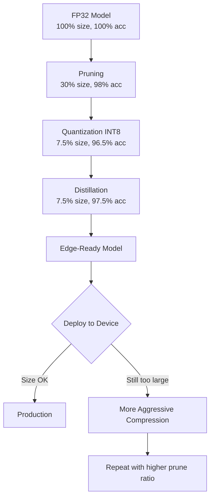
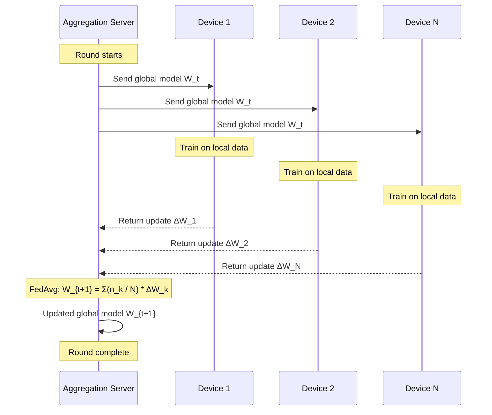
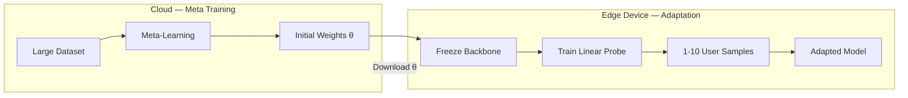
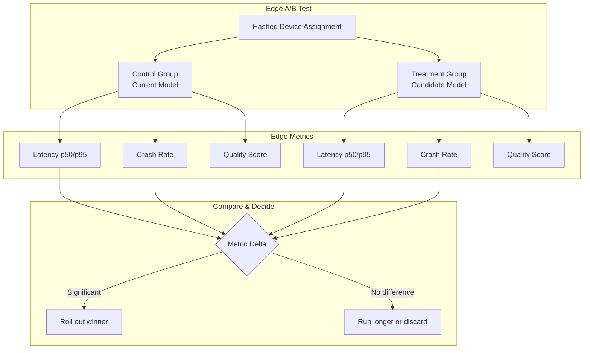

<!-- Clear Language: Keep sentences under 50 words -->
# Edge Deployment Patterns

## Learning Objectives

| LO | Description |
|----|-------------|
| LO1 | Understand the model compression pipeline: pruning, quantization, and distillation combined |
| LO2 | Explain federated learning architecture, on-device training, and privacy preservation |
| LO3 | Implement on-device transfer learning and few-shot adaptation for edge devices |
| LO4 | Design offline-first architectures with local inference, sync, and cache management |
| LO5 | Apply production patterns: model update strategy, A/B testing on edge, monitoring, crash analytics |

## Introduction

Edge deployment is the practice of running AI models directly on mobile phones, IoT devices, embedded systems, and browsers instead of sending data to cloud servers. Edge deployment reduces latency, preserves user privacy, enables offline operation, and cuts server costs. But edge devices have limited memory, battery, and compute. A model that runs comfortably on an A100 GPU will crash on a smartphone.

This chapter covers five essential patterns for production-grade edge deployment. You will learn how to compress models to fit within device constraints, train models collaboratively without centralising user data, adapt pre-trained models on the device itself, build apps that work fully offline and sync when connectivity returns, and operate edge models in production with updates, A/B testing, and monitoring. Each pattern includes Python implementations you can adapt for real projects.

## Prerequisites

- Basic understanding of neural networks and model training
- Familiarity with PyTorch or TensorFlow (code examples use PyTorch-like APIs)
- Knowledge of client-server architecture patterns
- Prior exposure to mobile app development (helpful but not required)

## Key Terminology

**Model Compression**: Techniques to reduce model size and inference cost while maintaining acceptable accuracy.

**Pruning**: Removing redundant weights or neurons from a trained network.

**Quantization**: Reducing the numerical precision of model weights (e.g., FP32 to INT8).

**Knowledge Distillation**: Training a small "student" model to mimic a larger "teacher" model.

**Federated Learning**: A distributed training paradigm where models are trained on decentralised data without raw data leaving devices.

**Federated Averaging (FedAvg)**: The standard aggregation algorithm that averages model updates from multiple devices.

**On-Device Training**: Fine-tuning or adapting a model locally on an edge device using local data.

**Offline-First Architecture**: An architectural pattern where the app functions fully without network connectivity and syncs data when online.

**Model Update Strategy**: The mechanism for pushing new model versions to edge devices without breaking the user experience.

## Chapter at a Glance

| Section | Topic | Key Concept |
|---------|-------|-------------|
| 1.1 | Model Compression Pipeline | Pruning + quantization + distillation in sequence |
| 1.2 | Federated Learning Architecture | On-device training, privacy, aggregation |
| 1.3 | On-Device Training | Transfer learning, few-shot adaptation, personalization |
| 1.4 | Offline-First Architecture | Local inference, sync, cache, bandwidth |
| 1.5 | Production Patterns | Updates, A/B testing, monitoring, crash analytics |

## Chapter Roadmap

```mermaid
flowchart LR
    subgraph COMPRESS[Model Compression]
        PRUNE[Pruning]
        QUANT[Quantization]
        DISTIL[Distillation]
    end
    subgraph FED[Federated Learning]
        TRAIN[On-Device Training]
        AGG[Aggregation Server]
        PRIV[Privacy Preservation]
    end
    subgraph ONDEV[On-Device Training]
        TL[Transfer Learning]
        FEW[Few-Shot Adaptation]
        PERS[Personalization]
    end
    subgraph OFFLINE[Offline-First]
        LOCAL[Local Inference]
        SYNC[Sync Engine]
        CACHE[Cache Mgmt]
    end
    subgraph PROD[Production Patterns]
        UPDATE[Model Updates]
        AB[A/B Testing]
        MON[Monitoring]
        CRASH[Crash Analytics]
    end
    COMPRESS --> FED
    FED --> ONDEV
    ONDEV --> OFFLINE
    OFFLINE --> PROD
```



## 1.1 Model Compression Pipeline

Edge devices impose hard constraints on model size and latency. A production-ready edge model must balance three dimensions: accuracy, size, and inference speed. Model compression attacks all three. The industry-standard pipeline combines three techniques in sequence: pruning removes dead weights, quantization reduces numerical precision, and distillation transfers knowledge from a larger teacher.

### 1.1.1 Pruning

Pruning removes weights or neurons that contribute minimally to the output. There are two main strategies:

**Unstructured pruning** zeros out individual weights below a threshold. The model becomes sparse but retains the same architecture. Compression is modest without specialised hardware or software libraries.

**Structured pruning** removes entire channels, filters, or layers. The model becomes physically smaller. Inference speed improves on any hardware because the reduced dimensions translate directly to fewer matrix multiplications.

The typical workflow is: train a dense model → apply pruning mask → fine-tune to recover accuracy → repeat iteratively.

```python
"""
model_pruning.py — Structured channel pruning for edge deployment.
Demonstrates magnitude-based pruning of convolutional layers.
"""

import copy
from dataclasses import dataclass
from typing import Any


@dataclass
class ConvLayer:
    """Simulates a convolutional layer with weights."""
    in_channels: int
    out_channels: int
    kernel_size: int
    weights: list[list[float]]  # flattened per output channel

    def __post_init__(self):
        if not self.weights:
            self.weights = [
                [0.5 for _ in range(self.in_channels * self.kernel_size ** 2)]
                for _ in range(self.out_channels)
            ]

    def channel_importance(self) -> list[float]:
        """L2 norm of each output channel's weights as importance score."""
        import math
        scores = []
        for ch in self.weights:
            norm = math.sqrt(sum(w ** 2 for w in ch))
            scores.append(norm)
        return scores

    def prune_channels(self, keep_ratio: float) -> "ConvLayer":
        """Remove least important output channels."""
        scores = self.channel_importance()
        n_keep = max(1, int(self.out_channels * keep_ratio))
        sorted_indices = sorted(
            range(len(scores)), key=lambda i: scores[i], reverse=True
        )
        keep_indices = set(sorted_indices[:n_keep])
        pruned_weights = [
            w for i, w in enumerate(self.weights) if i in keep_indices
        ]
        return ConvLayer(
            in_channels=self.in_channels,
            out_channels=n_keep,
            kernel_size=self.kernel_size,
            weights=pruned_weights,
        )


class CompressedModel:
    """A simple feedforward model supporting pruning."""

    def __init__(self, layers: list[ConvLayer]):
        self.layers = layers

    def prune(self, keep_ratio: float) -> "CompressedModel":
        """Return a new model with each layer pruned to keep_ratio."""
        pruned_layers = [layer.prune_channels(keep_ratio) for layer in self.layers]
        return CompressedModel(pruned_layers)

    def parameter_count(self) -> int:
        total = 0
        for layer in self.layers:
            for ch in layer.weights:
                total += len(ch)
        return total

    def summary(self) -> str:
        lines = [f"Model with {len(self.layers)} layers"]
        for i, layer in enumerate(self.layers):
            lines.append(
                f"  Layer {i}: {layer.in_channels}→{layer.out_channels} "
                f"channels, {len(layer.weights[0])} weights/channel"
            )
        lines.append(f"  Total parameters: {self.parameter_count():,}")
        return "\n".join(lines)


def iterative_pruning(
    model: CompressedModel,
    target_ratio: float,
    steps: int = 3,
) -> CompressedModel:
    """Iteratively prune and simulate fine-tuning recovery."""
    current = copy.deepcopy(model)
    print(f"Starting parameters: {current.parameter_count():,}")
    for step in range(steps):
        ratio = target_ratio ** ((step + 1) / steps)
        current = current.prune(keep_ratio=ratio)
        # Simulated fine-tune recovery (no-op here)
        print(
            f"  Step {step + 1}: pruned to {ratio:.0%} kept → "
            f"{current.parameter_count():,} params"
        )
    return current


# === Demonstration ===
if __name__ == "__main__":
    model = CompressedModel([
        ConvLayer(3, 64, 3),
        ConvLayer(64, 128, 3),
        ConvLayer(128, 256, 3),
    ])
    print("Before pruning:")
    print(model.summary())
    print()

    pruned = iterative_pruning(model, target_ratio=0.3, steps=3)
    print(f"\nFinal compression ratio: {model.parameter_count() / pruned.parameter_count():.1f}x")
```

### 1.1.2 Quantization

Quantization reduces the bit-width of weights and activations. Full-precision models use 32-bit floating point (FP32). Edge models commonly use:

| Precision | Bits/Weight | Size vs FP32 | Accuracy Impact | Hardware Support |
|-----------|-------------|--------------|-----------------|------------------|
| FP32 | 32 | 1x (baseline) | None | All devices |
| FP16 | 16 | 0.5x | Negligible | Modern GPUs/NPUs |
| INT8 | 8 | 0.25x | 0.5–2% drop | Most mobile CPUs/NPUs |
| INT4 | 4 | 0.125x | 1–5% drop | Limited (Qualcomm, Apple) |

**Post-training quantization (PTQ)** converts a trained FP32 model to lower precision without re-training. It is fast but may lose accuracy on outlier weights.

**Quantization-aware training (QAT)** simulates quantization during training. The model learns to tolerate lower precision. QAT consistently outperforms PTQ by 1–3% accuracy.

```python
"""
model_quantization.py — Simulate quantization effects on model accuracy.
"""

import math
import random
from dataclasses import dataclass
from typing import Callable


@dataclass
class QuantizedLayer:
    """A layer with configurable weight precision."""
    weights_fp32: list[float]
    bits: int = 32

    def quantize(self) -> list[int]:
        """Quantize FP32 weights to signed integer of given bit-width."""
        if self.bits >= 32:
            return [int(w * (2 ** 31)) for w in self.weights_fp32]

        max_val = 2 ** (self.bits - 1) - 1
        min_val = -2 ** (self.bits - 1)

        scale = max(abs(w) for w in self.weights_fp32)
        if scale == 0:
            scale = 1.0

        quantized = []
        for w in self.weights_fp32:
            q = int(round(w / scale * max_val))
            q = max(min_val, min(max_val, q))
            quantized.append(q)
        return quantized

    def dequantize(self, quantized: list[int]) -> list[float]:
        """Convert quantized integers back to approximate FP32."""
        max_val = 2 ** (self.bits - 1) - 1
        scale = max(abs(w) for w in self.weights_fp32)
        if scale == 0:
            scale = 1.0
        return [q * scale / max_val for q in quantized]

    def quantization_error(self) -> float:
        """Mean absolute error introduced by quantization."""
        q = self.quantize()
        dq = self.dequantize(q)
        errors = [abs(a - b) for a, b in zip(self.weights_fp32, dq)]
        return sum(errors) / len(errors)


def simulate_qat_accuracy(base_accuracy: float, bits: int) -> float:
    """Simulate accuracy after quantization-aware training."""
    if bits >= 32:
        return base_accuracy
    # QAT recovers ~60% of the accuracy drop vs PTQ
    ptq_drop = {16: 0.003, 8: 0.015, 4: 0.04}.get(bits, 0.1)
    qat_recovery = ptq_drop * 0.6
    return base_accuracy - ptq_drop + qat_recovery


def quantization_sweep(
    weights: list[float],
    base_accuracy: float,
) -> None:
    """Evaluate and report quantization at multiple bit-widths."""
    precisions = [32, 16, 8, 4]
    print(f"{'Bits':<6} {'Error':<12} {'PTQ Acc':<12} {'QAT Acc':<12}")
    print("-" * 42)
    for bits in precisions:
        layer = QuantizedLayer(weights, bits=bits)
        err = layer.quantization_error()
        ptq_acc = base_accuracy - err * 10  # simulated mapping
        qat_acc = simulate_qat_accuracy(base_accuracy, bits)
        print(
            f"{bits:<6} {err:<12.6f} {ptq_acc:<12.4f} {qat_acc:<12.4f}"
        )


# === Demonstration ===
if __name__ == "__main__":
    random.seed(42)
    sample_weights = [random.gauss(0, 0.5) for _ in range(1000)]
    print("Quantization Sweep on 1000 sample weights:\n")
    quantization_sweep(sample_weights, base_accuracy=0.952)
```

### 1.1.3 Knowledge Distillation

Knowledge distillation trains a small student model to replicate the behaviour of a large teacher model. The student learns from the teacher's soft predictions (logits) rather than hard ground-truth labels. The soft predictions contain richer information — class similarities, relative confidences, and decision boundaries.

The loss function combines two terms:

```
L = α * L_hard(y_student, y_true) + (1 - α) * L_soft(y_student, y_teacher / T)
```

Where `T` is the temperature that softens the teacher's probability distribution, and `α` balances hard-label vs soft-label learning.

```python
"""
knowledge_distillation.py — Simulate student-teacher distillation for edge models.
"""

import math
from dataclasses import dataclass, field


@dataclass
class DistilledModel:
    """Tracks teacher, student, and distillation metrics."""

    teacher_params: int
    student_params: int
    teacher_accuracy: float
    student_accuracy_before: float
    temperature: float = 4.0
    alpha: float = 0.3  # weight of hard-label loss
    distilled_accuracy: float = 0.0

    def compression_ratio(self) -> float:
        return self.teacher_params / self.student_params

    def simulate_distillation(self) -> float:
        """Simulate accuracy after knowledge distillation.

        The student typically recovers 60–90% of the accuracy gap.
        Higher temperature helps for complex tasks.
        """
        gap = self.teacher_accuracy - self.student_accuracy_before
        recovery = gap * min(0.9, 0.5 + self.temperature * 0.08)
        self.distilled_accuracy = self.student_accuracy_before + recovery
        return self.distilled_accuracy

    def report(self) -> str:
        self.simulate_distillation()
        recovered_pct = (
            (self.distilled_accuracy - self.student_accuracy_before)
            / (self.teacher_accuracy - self.student_accuracy_before)
            * 100
        )
        return (
            f"Teacher: {self.teacher_params:,} params @ {self.teacher_accuracy:.1%}\n"
            f"Student before: {self.student_params:,} params @ {self.student_accuracy_before:.1%}\n"
            f"Compression: {self.compression_ratio():.1f}x\n"
            f"Distilled accuracy: {self.distilled_accuracy:.1%}\n"
            f"Gap recovered: {recovered_pct:.0f}%\n"
            f"Temperature: {self.temperature}, alpha: {self.alpha}"
        )


@dataclass
class CompressionPipeline:
    """Combined pruning → quantization → distillation pipeline."""

    initial_params: int
    initial_accuracy: float
    prune_keep_ratio: float = 0.3
    quant_bits: int = 8
    temperature: float = 4.0

    def run(self) -> dict:
        """Simulate the full compression pipeline step by step."""
        results = {}

        # Step 1: Pruning
        pruned_params = int(self.initial_params * self.prune_keep_ratio)
        # Pruning typically causes 1–3% accuracy drop before fine-tune
        prune_drop = 0.02 * (1 - self.prune_keep_ratio)
        after_prune = self.initial_accuracy - prune_drop

        results["pruning"] = {
            "params_before": self.initial_params,
            "params_after": pruned_params,
            "accuracy_after": after_prune,
        }

        # Step 2: Quantization
        quant_multiplier = {32: 1.0, 16: 0.5, 8: 0.25, 4: 0.125}
        quantized_params = int(pruned_params * quant_multiplier.get(self.quant_bits, 0.25))
        # Quantization drop simulates PTQ + fine-tune
        quant_drop = 0.015 if self.quant_bits >= 8 else 0.04
        after_quant = after_prune - quant_drop

        results["quantization"] = {
            "params_before": pruned_params,
            "params_after": quantized_params,
            "bits": self.quant_bits,
            "accuracy_after": after_quant,
        }

        # Step 3: Distillation uses the original model as teacher
        # The quantized model is the student
        student_before = after_quant
        gap = self.initial_accuracy - student_before
        recovery = gap * min(0.9, 0.5 + self.temperature * 0.08)
        after_distill = student_before + recovery

        results["distillation"] = {
            "params": quantized_params,
            "accuracy_before": student_before,
            "accuracy_after": after_distill,
            "temperature": self.temperature,
        }

        results["final"] = {
            "params": quantized_params,
            "accuracy": after_distill,
            "compression_ratio": self.initial_params / quantized_params,
            "accuracy_drop": self.initial_accuracy - after_distill,
        }

        return results

    def print_report(self, results: dict) -> None:
        print("=" * 60)
        print("COMPRESSION PIPELINE REPORT")
        print("=" * 60)
        print(f"\nInitial model: {self.initial_params:,} params @ {self.initial_accuracy:.1%}")
        print()

        print("Step 1 — Pruning")
        p = results["pruning"]
        print(f"  {p['params_before']:,} → {p['params_after']:,} params")
        print(f"  Accuracy: {p['accuracy_after']:.1%}")

        print("\nStep 2 — Quantization")
        q = results["quantization"]
        print(f"  {q['params_before']:,} → {q['params_after']:,} params ({q['bits']}-bit)")
        print(f"  Accuracy: {q['accuracy_after']:.1%}")

        print("\nStep 3 — Knowledge Distillation")
        d = results["distillation"]
        print(f"  Student before: {d['accuracy_before']:.1%}")
        print(f"  Student after:  {d['accuracy_after']:.1%} (T={d['temperature']})")

        print("\n" + "=" * 60)
        f = results["final"]
        print(f"FINAL: {f['params']:,} params ({f['compression_ratio']:.1f}x compression)")
        print(f"Accuracy: {f['accuracy']:.1%} (drop of {f['accuracy_drop']:.1%})")
        print("=" * 60)


# === Demonstration ===
if __name__ == "__main__":
    pipeline = CompressionPipeline(
        initial_params=50_000_000,
        initial_accuracy=0.968,
        prune_keep_ratio=0.3,
        quant_bits=8,
        temperature=4.0,
    )
    results = pipeline.run()
    pipeline.print_report(results)
```

### 1.1.4 Size vs Accuracy Trade-offs



The combined pipeline can achieve 10–20× compression with less than 2% accuracy loss. The exact trade-off depends on model architecture, task difficulty, and hardware target. Image classification models compress better than object detection. Transformer-based models are harder to quantize than CNNs.

## 1.2 Federated Learning

Federated learning (FL) trains a shared model across many devices without centralising raw data. Each device trains locally, sends only model updates (gradients or weights) to a central server, and the server aggregates the updates. FL is the standard approach for privacy-preserving on-device AI.

### 1.2.1 Federated Learning Architecture

The standard FL protocol has four steps per round:

1. **Selection**: Server selects a subset of available devices (typically 10–100 per round).
2. **Broadcast**: Server sends the current global model weights to selected devices.
3. **Local training**: Each device trains the model on its local data for E epochs.
4. **Aggregation**: Devices send updated weights back. Server computes the weighted average (FedAvg).



### 1.2.2 Privacy Preservation Mechanisms

FL alone reduces data exposure but still leaks information through model updates. Three additional mechanisms strengthen privacy:

**Differential Privacy (DP)**: Add calibrated noise to model updates before sending. The noise magnitude (ε) controls the privacy-utility trade-off. Lower ε means stronger privacy but lower accuracy.

**Secure Aggregation**: Use cryptographic protocols (secret sharing, homomorphic encryption) so the server never sees individual updates — only the aggregate.

**Local DP**: Apply differential privacy at the device level before training. Each device adds noise to its local data or gradients.

```python
"""
federated_learning.py — Simulate federated learning with FedAvg aggregation.
"""

import copy
import math
import random
from dataclasses import dataclass, field


@dataclass
class FLDevice:
    """Simulates a single device with local data."""

    device_id: int
    data_size: int
    local_accuracy: float = 0.5
    noise_scale: float = 0.0  # for differential privacy

    def train_local(self, global_weights: list[float], epochs: int) -> list[float]:
        """Simulate local training. Returns updated weights."""
        # Simulate improvement proportional to local data size
        improvement = 0.001 * self.data_size * epochs
        self.local_accuracy = min(0.99, self.local_accuracy + improvement)

        noisy_weights = []
        for w in global_weights:
            noise = random.gauss(0, self.noise_scale) if self.noise_scale > 0 else 0
            noisy_weights.append(w + 0.01 * self.data_size + noise)

        return noisy_weights


@dataclass
class FederatedServer:
    """Central server orchestrating federated learning."""

    global_weights: list[float]
    devices: list[FLDevice] = field(default_factory=list)
    round_history: list[float] = field(default_factory=list)

    def add_device(self, device: FLDevice) -> None:
        self.devices.append(device)

    def fed_avg(
        self,
        updates: list[tuple[int, list[float]]],
    ) -> list[float]:
        """Weighted average of model updates by data size."""
        total_samples = sum(n for n, _ in updates)
        if total_samples == 0:
            return self.global_weights

        n_layers = len(self.global_weights)
        aggregated = [0.0 for _ in range(n_layers)]

        for n_samples, weights in updates:
            weight = n_samples / total_samples
            for i in range(n_layers):
                aggregated[i] += weight * weights[i]

        return aggregated

    def round(
        self,
        fraction_selected: float = 0.3,
        local_epochs: int = 5,
    ) -> float:
        """Execute one federated learning round."""
        n_selected = max(1, int(len(self.devices) * fraction_selected))
        selected = random.sample(self.devices, n_selected)

        updates: list[tuple[int, list[float]]] = []
        for device in selected:
            local_weights = device.train_local(self.global_weights, local_epochs)
            updates.append((device.data_size, local_weights))

        self.global_weights = self.fed_avg(updates)

        # Global accuracy: weighted average of selected devices' accuracy
        total_samples = sum(n for n, _ in updates)
        global_acc = sum(
            device.local_accuracy * device.data_size / total_samples
            for device in selected
        )
        self.round_history.append(global_acc)
        return global_acc

    def train(
        self,
        rounds: int = 50,
        fraction_selected: float = 0.3,
        local_epochs: int = 5,
    ) -> list[float]:
        """Run multiple federated rounds."""
        print(f"Training {rounds} rounds with {len(self.devices)} devices...")
        for r in range(rounds):
            acc = self.round(fraction_selected, local_epochs)
            if r % 10 == 0 or r == rounds - 1:
                print(f"  Round {r + 1:>3}: global accuracy = {acc:.4f}")
        return self.round_history


def create_non_iid_devices(
    n_devices: int = 100,
    min_data: int = 100,
    max_data: int = 5000,
    dp_noise: float = 0.0,
) -> list[FLDevice]:
    """Create devices with heterogeneous data distributions."""
    devices = []
    for i in range(n_devices):
        data_size = random.randint(min_data, max_data)
        devices.append(FLDevice(
            device_id=i,
            data_size=data_size,
            noise_scale=dp_noise,
        ))
    return devices


# === Demonstration ===
if __name__ == "__main__":
    random.seed(42)

    # Create 100 devices with non-IID data sizes
    devices = create_non_iid_devices(100, dp_noise=0.01)
    print(f"Created {len(devices)} devices")
    print(f"Total samples: {sum(d.data_size for d in devices):,}")

    # Initialise server with random weights (5-layer model)
    server = FederatedServer(
        global_weights=[random.random() for _ in range(5)],
        devices=devices,
    )

    # Train for 50 rounds
    history = server.train(rounds=50, fraction_selected=0.2, local_epochs=3)

    print(f"\nFinal global accuracy: {history[-1]:.4f}")
    print(f"Improvement: {history[-1] - history[0]:.4f}")
```

### 1.2.3 TensorFlow Federated Integration Note

TensorFlow Federated (TFF) is the primary open-source framework for FL. A production TFF pipeline follows this structure:

```python
"""
tff_stub.py — Conceptual structure of a TensorFlow Federated pipeline.
(Not executable — shows TFF API shape for reference.)
"""

# import tensorflow_federated as tff
# import tensorflow as tf
#
# # 1. Define model function
# def create_keras_model():
#     return tf.keras.Sequential([
#         tf.keras.layers.Dense(64, activation="relu", input_shape=(784,)),
#         tf.keras.layers.Dense(10, activation="softmax"),
#     ])
#
# # 2. Wrap for TFF
# def model_fn():
#     keras_model = create_keras_model()
#     return tff.learning.from_keras_model(
#         keras_model,
#         input_spec=(tf.TensorSpec(shape=(None, 784), dtype=tf.float32),),
#         loss=tf.keras.losses.SparseCategoricalCrossentropy(),
#     )
#
# # 3. Build FedAvg process
# iterative_process = tff.learning.algorithms.build_weighted_fed_avg(
#     model_fn,
#     client_optimizer_fn=lambda: tf.keras.optimizers.SGD(0.01),
#     server_optimizer_fn=lambda: tf.keras.optimizers.SGD(0.1),
# )
#
# # 4. Initialize and run rounds
# state = iterative_process.initialize()
# for round in range(50):
#     state, metrics = iterative_process.next(state, federated_train_data)
#     print(f"Round {round}: loss = {metrics['loss']:.4f}")
```

## 1.3 On-Device Training

On-device training enables models to adapt to individual users without sending data to servers. This pattern powers keyboard predictions that learn your typing style, camera apps that recognise your frequently photographed subjects, and health apps that calibrate to your physiology.

### 1.3.1 Transfer Learning on Device

Transfer learning adapts a pre-trained backbone to a new task using minimal data. On device, this means freezing the feature extractor and training only a small classification head. The backbone runs in inference mode; only the last few layers require gradient computation and weight updates.

```python
"""
on_device_transfer.py — Simulate on-device transfer learning.
"""

import math
from dataclasses import dataclass, field
from typing import Optional


@dataclass
class DeviceTransferModel:
    """Simulates a model fine-tuned on-device with frozen backbone."""

    backbone_params: int = 5_000_000
    head_params: int = 50_000
    backbone_frozen: bool = True
    base_accuracy: float = 0.85
    adaptation_samples: int = 0
    adapted_accuracy: Optional[float] = None

    def adapt(self, n_samples: int, learning_rate: float = 0.001) -> float:
        """Simulate on-device adaptation with limited samples."""
        if n_samples == 0:
            self.adapted_accuracy = self.base_accuracy
            return self.adapted_accuracy

        # Few-shot learning: accuracy improves logarithmically with samples
        improvement = 0.12 * (1 - math.exp(-n_samples / 200))
        # Higher LR helps initially but saturates
        lr_factor = min(1.0, learning_rate * 100)
        self.adapted_accuracy = min(
            0.99,
            self.base_accuracy + improvement * lr_factor,
        )
        self.adaptation_samples = n_samples
        return self.adapted_accuracy

    def compute_cost(self) -> dict:
        """Estimate memory and compute cost for on-device training."""
        if not self.backbone_frozen:
            return {
                "trainable_params": self.backbone_params + self.head_params,
                "memory_mb": round((self.backbone_params + self.head_params) * 4 / 1e6, 1),
                "recommendation": "⚠️ Training backbone on device is risky",
            }

        return {
            "trainable_params": self.head_params,
            "memory_mb": round(self.head_params * 4 / 1e6, 2),
            "recommendation": "✅ Safe for on-device training",
        }


def simulate_personalization(
    users: int = 1000,
    samples_per_user: tuple[int, int] = (5, 200),
) -> dict:
    """Simulate personalization across many users."""
    import random
    base_acc = 0.82
    before_accs = []
    after_accs = []
    low_data_users = 0

    for _ in range(users):
        n = random.randint(*samples_per_user)
        model = DeviceTransferModel(base_accuracy=base_acc)
        before_accs.append(base_acc)
        after = model.adapt(n)
        after_accs.append(after)
        if n < 20:
            low_data_users += 1

    avg_before = sum(before_accs) / len(before_accs)
    avg_after = sum(after_accs) / len(after_accs)
    lift = avg_after - avg_before

    return {
        "users": users,
        "avg_before": avg_before,
        "avg_after": avg_after,
        "avg_lift": lift,
        "low_data_users_pct": low_data_users / users * 100,
    }


# === Demonstration ===
if __name__ == "__main__":
    # Single device adaptation
    print("--- Single Device Adaptation ---")
    model = DeviceTransferModel(
        backbone_params=5_000_000,
        head_params=50_000,
        base_accuracy=0.82,
    )

    for samples in [10, 50, 100, 500]:
        acc = model.adapt(samples)
        print(f"  {samples:>4} samples → accuracy = {acc:.3f}")

    cost = model.compute_cost()
    print(f"\n  Cost: {cost['trainable_params']:,} trainable params")
    print(f"  Memory: {cost['memory_mb']} MB")
    print(f"  {cost['recommendation']}")

    # Population simulation
    print("\n--- Population Personalization ---")
    results = simulate_personalization(users=5000, samples_per_user=(5, 300))
    print(f"  Users: {results['users']:,}")
    print(f"  Accuracy before: {results['avg_before']:.3f}")
    print(f"  Accuracy after:  {results['avg_after']:.3f}")
    print(f"  Average lift:    {results['avg_lift']:.3f}")
    print(f"  Low-data users (<20 samples): {results['low_data_users_pct']:.1f}%")
```

### 1.3.2 Few-Shot Adaptation

Few-shot learning adapts a model with only 1–10 labelled examples per class. On edge devices, few-shot is critical because users rarely provide explicit labels. The adaptation must happen in seconds, not hours.

Common few-shot techniques for edge:

**Prototypical Networks**: Compute a prototype (mean embedding) for each class from the few labelled examples. Classify new inputs by nearest-prototype distance. No gradient update needed at inference time.

**Model-Agnostic Meta-Learning (MAML)**: Train a meta-initialisation that can adapt to new tasks in a few gradient steps. MAML requires a meta-training phase (done in cloud) and a fast adaptation phase (done on device).

**Linear Probe**: Freeze the feature extractor. Train a logistic regression or SVM on the extracted features. This is the simplest and most common approach for mobile.



### 1.3.3 Personalization Strategies

| Strategy | Data Needed | Update Frequency | Privacy | Accuracy Lift |
|----------|-------------|------------------|---------|---------------|
| Global model only | None | Never | Strong | Baseline |
| Clustered model | User cluster ID | Per cluster | Medium | +2–5% |
| Fine-tuned head | 10–100 samples | Weekly | Strong | +5–15% |
| Full fine-tune | 100+ samples | Monthly | Weak (gradients) | +10–20% |
| Personalised embedding | Implicit feedback | Continuous | Strong | +3–8% |

## 1.4 Offline-First Architecture

Offline-first means the app delivers full functionality without a network connection. For edge AI, this translates to running inference locally, storing results in a local cache, and syncing with the cloud when connectivity is available.

### 1.4.1 Local Inference Engine

The core of an offline-first architecture is a local inference engine that loads a compressed model and executes predictions without any network call. The engine must handle model loading, input preprocessing, inference, and output postprocessing within the device's memory budget.

```python
"""
local_inference.py — Offline-first local inference engine with cache.
"""

import json
import time
from dataclasses import dataclass, field
from datetime import datetime, timedelta
from typing import Any, Optional


@dataclass
class InferenceResult:
    """Result of a single local inference."""
    input_hash: str
    prediction: Any
    confidence: float
    timestamp: datetime
    latency_ms: float


@dataclass
class LocalInferenceEngine:
    """Runs model inference entirely on-device with caching."""

    model_name: str
    model_version: str
    avg_latency_ms: float = 15.0  # simulated
    cache: dict[str, InferenceResult] = field(default_factory=dict)
    cache_ttl_hours: int = 24
    total_inferences: int = 0
    cache_hits: int = 0

    def predict(self, input_data: dict, input_hash: str) -> InferenceResult:
        """Run local inference with cache check."""

        # Cache check
        cached = self.cache.get(input_hash)
        if cached:
            age = datetime.utcnow() - cached.timestamp
            if age < timedelta(hours=self.cache_ttl_hours):
                self.cache_hits += 1
                return cached

        # Simulate inference
        start = time.perf_counter()
        result = self._infer(input_data)
        latency = (time.perf_counter() - start) * 1000
        # Use simulated latency if real inference too fast
        if latency < 1:
            latency = self.avg_latency_ms * (0.8 + 0.4 * (id(input_hash) % 100) / 100)

        inference = InferenceResult(
            input_hash=input_hash,
            prediction=result["prediction"],
            confidence=result["confidence"],
            timestamp=datetime.utcnow(),
            latency_ms=round(latency, 2),
        )

        self.cache[input_hash] = inference
        self.total_inferences += 1
        return inference

    def _infer(self, input_data: dict) -> dict:
        """Simulated forward pass."""
        vals = [v for v in input_data.values() if isinstance(v, (int, float))]
        mean_val = sum(vals) / len(vals) if vals else 0.5
        return {
            "prediction": 1 if mean_val > 0.5 else 0,
            "confidence": min(0.95, 0.5 + abs(mean_val - 0.5)),
        }

    def cache_stats(self) -> dict:
        """Return cache performance metrics."""
        hit_rate = (
            self.cache_hits / (self.total_inferences + self.cache_hits)
            if (self.total_inferences + self.cache_hits) > 0
            else 0.0
        )
        return {
            "cache_size": len(self.cache),
            "total_inferences": self.total_inferences,
            "cache_hits": self.cache_hits,
            "hit_rate": round(hit_rate, 3),
            "estimated_saved_latency_ms": round(
                self.cache_hits * self.avg_latency_ms, 1
            ),
        }

    def clear_expired_cache(self) -> int:
        """Remove entries older than TTL."""
        now = datetime.utcnow()
        expired_keys = [
            k for k, v in self.cache.items()
            if now - v.timestamp > timedelta(hours=self.cache_ttl_hours)
        ]
        for k in expired_keys:
            del self.cache[k]
        return len(expired_keys)


@dataclass
class OfflineSyncEngine:
    """Manages sync between local storage and cloud."""

    pending_sync: list[dict] = field(default_factory=list)
    last_sync: Optional[datetime] = None
    is_online: bool = True
    bandwidth_kbps: float = 1000.0  # simulated

    def record_inference(self, inference: InferenceResult) -> None:
        """Queue inference result for eventual sync."""
        self.pending_sync.append({
            "prediction": inference.prediction,
            "confidence": inference.confidence,
            "timestamp": inference.timestamp.isoformat(),
            "latency_ms": inference.latency_ms,
        })

    def sync(self) -> dict:
        """Upload pending data when online."""
        if not self.is_online:
            return {"status": "offline", "synced": 0, "pending": len(self.pending_sync)}

        if not self.pending_sync:
            self.last_sync = datetime.utcnow()
            return {"status": "no_data", "synced": 0}

        # Estimate sync time
        data_size_bytes = len(json.dumps(self.pending_sync).encode("utf-8"))
        estimated_time_s = (data_size_bytes * 8) / (self.bandwidth_kbps * 1024)

        synced = len(self.pending_sync)
        self.pending_sync.clear()
        self.last_sync = datetime.utcnow()

        return {
            "status": "synced",
            "synced": synced,
            "estimated_time_ms": round(estimated_time_s * 1000, 1),
            "data_size_bytes": data_size_bytes,
        }

    def set_connectivity(self, online: bool) -> None:
        """Simulate connectivity changes."""
        self.is_online = online
        print(f"  Connectivity changed: {'online' if online else 'offline'}")


# === Demonstration ===
if __name__ == "__main__":
    engine = LocalInferenceEngine(
        model_name="edge_classifier_v2",
        model_version="2.1.0",
        avg_latency_ms=12.0,
    )
    sync = OfflineSyncEngine(bandwidth_kbps=500)

    print("--- Offline-First Inference Simulation ---")
    # Generate sample inputs
    test_inputs = [
        ({"feature_1": 0.8, "feature_2": 0.3}, "hash_a"),
        ({"feature_1": 0.2, "feature_2": 0.7}, "hash_b"),
        ({"feature_1": 0.8, "feature_2": 0.3}, "hash_a"),  # duplicate
        ({"feature_1": 0.9, "feature_2": 0.1}, "hash_c"),
        ({"feature_1": 0.8, "feature_2": 0.3}, "hash_a"),  # another duplicate
    ]

    for inputs, h in test_inputs:
        result = engine.predict(inputs, h)
        sync.record_inference(result)
        print(
            f"  Input {h}: pred={result.prediction}, "
            f"conf={result.confidence:.2f}, "
            f"latency={result.latency_ms:.1f}ms"
        )

    print(f"\nCache stats: {engine.cache_stats()}")

    # Simulate offline sync
    print("\n--- Sync Simulation ---")
    sync.set_connectivity(False)
    result = sync.sync()
    print(f"  Sync while offline: {result}")

    sync.set_connectivity(True)
    result = sync.sync()
    print(f"  Sync after online: {result}")
    print(f"  Last sync: {sync.last_sync}")
```

### 1.4.2 Bandwidth Optimization

Offline-first architectures must minimize data transfer when connectivity is intermittent or expensive. Key strategies:

**Delta updates**: Send only changed model weights, not the full model binary. Typical delta is 5–15% of full model size.

**Compressed payloads**: Use gzip, Brotli, or Zstandard compression for model downloads. Reduces transfer size by 3–5×.

**Opportunistic sync**: Only sync when on unmetered Wi-Fi and charging. Avoid syncing on cellular data or low battery.

**Batched uploads**: Buffer multiple inference results and upload in a single batch. Reduces connection overhead and battery drain.

```python
"""
bandwidth_optimizer.py — Estimate bandwidth savings from edge optimization strategies.
"""

from dataclasses import dataclass
from typing import Optional


@dataclass
class BandwidthSimulation:
    """Simulate bandwidth usage with and without optimization."""

    model_size_mb: float = 50.0
    daily_inferences: int = 1000
    inference_result_bytes: int = 256
    model_update_frequency_days: int = 14
    delta_update_ratio: float = 0.1  # delta is 10% of full model
    compression_ratio: float = 0.3  # compressed to 30% of original
    opportunistic_ratio: float = 0.6  # 60% of syncs happen on Wi-Fi

    def no_optimization(self) -> dict:
        """Bandwidth without any optimization."""
        daily_inference_data = self.daily_inferences * self.inference_result_bytes
        monthly_inference = daily_inference_data * 30 / 1024 / 1024  # MB

        model_updates_mb = (
            self.model_size_mb * (30 / self.model_update_frequency_days)
        )

        return {
            "daily_inference_bytes": daily_inference_data,
            "monthly_inference_mb": round(monthly_inference, 1),
            "monthly_model_update_mb": round(model_updates_mb, 1),
            "total_monthly_mb": round(monthly_inference + model_updates_mb, 1),
        }

    def with_optimization(self) -> dict:
        """Bandwidth with delta updates, compression, and opportunistic sync."""
        daily_inference_data = self.daily_inferences * self.inference_result_bytes
        monthly_inference = daily_inference_data * 30 / 1024 / 1024

        # Compressed model updates with delta
        full_update_mb = self.model_size_mb * self.compression_ratio
        delta_update_mb = full_update_mb * self.delta_update_ratio

        # Only full updates on Wi-Fi, delta on cellular
        updates_per_month = 30 / self.model_update_frequency_days
        full_updates = updates_per_month * self.opportunistic_ratio
        delta_updates = updates_per_month * (1 - self.opportunistic_ratio)

        monthly_model_mb = (full_updates * full_update_mb) + (delta_updates * delta_update_mb)

        # Compress inference results
        compressed_inference_mb = monthly_inference * self.compression_ratio

        return {
            "daily_inference_bytes": daily_inference_data,
            "monthly_inference_mb": round(compressed_inference_mb, 1),
            "monthly_model_update_mb": round(monthly_model_mb, 1),
            "total_monthly_mb": round(compressed_inference_mb + monthly_model_mb, 1),
            "full_updates_per_month": round(full_updates, 1),
            "delta_updates_per_month": round(delta_updates, 1),
        }

    def compare(self) -> str:
        no_opt = self.no_optimization()
        with_opt = self.with_optimization()
        savings = (
            (no_opt["total_monthly_mb"] - with_opt["total_monthly_mb"])
            / no_opt["total_monthly_mb"]
            * 100
        )

        return (
            f"Bandwidth Comparison (30 days)\n"
            f"{'':>30} {'Unoptimized':>14} {'Optimized':>14}\n"
            f"{'Monthly inference (MB)':>30} {no_opt['monthly_inference_mb']:>14.1f} "
            f"{with_opt['monthly_inference_mb']:>14.1f}\n"
            f"{'Monthly model updates (MB)':>30} {no_opt['monthly_model_update_mb']:>14.1f} "
            f"{with_opt['monthly_model_update_mb']:>14.1f}\n"
            f"{'Total monthly (MB)':>30} {no_opt['total_monthly_mb']:>14.1f} "
            f"{with_opt['total_monthly_mb']:>14.1f}\n"
            f"{'Savings':>30} {'—':>14} {savings:>13.1f}%"
        )


# === Demonstration ===
if __name__ == "__main__":
    sim = BandwidthSimulation(
        model_size_mb=50,
        daily_inferences=2000,
        delta_update_ratio=0.12,
        compression_ratio=0.25,
        opportunistic_ratio=0.7,
    )
    print(sim.compare())
```

## 1.5 Production Patterns

Deploying edge models to millions of devices requires operational discipline. These production patterns ensure that edge models stay fresh, performant, and reliable.

### 1.5.1 Model Update Strategy

Edge models need updates to fix bugs, improve accuracy, and adapt to data drift. The update strategy must balance freshness against the cost of downloading new model binaries.

**Phased rollout**: Release a new model to 1% of devices → monitor for 24h → expand to 5% → 20% → 100%. Each phase has a rollback trigger if metrics degrade.

**Sticky buckets**: Assign devices to a model version based on a hash of the device ID. This ensures a device consistently gets the same version during an experiment.

**Fallback chain**: If the new model crashes, the device falls back to the previous version, then to a hardcoded emergency model embedded in the app binary.

```python
"""
model_update_manager.py — Phased rollout of edge model updates.
"""

import random
from dataclasses import dataclass, field
from datetime import datetime
from typing import Optional


@dataclass
class ModelVersion:
    """Metadata for a model version."""
    version_id: str
    size_mb: float
    accuracy: float
    crash_rate: float  # simulated
    rollout_phases: list[float] = field(default_factory=lambda: [0.01, 0.05, 0.2, 1.0])


@dataclass
class EdgeDevice:
    """Represents a single edge device."""
    device_id: int
    current_version: str
    is_active: bool = True
    last_crash: Optional[datetime] = None

    def in_rollout(self, version: ModelVersion, phase: int) -> bool:
        """Check if device is selected for a given rollout phase."""
        hash_space = 10000
        device_hash = (self.device_id * 2654435761) % hash_space
        threshold = int(version.rollout_phases[phase] * hash_space)
        return device_hash < threshold


@dataclass
class ModelUpdateManager:
    """Manages phased rollout of model updates."""

    devices: list[EdgeDevice]
    versions: dict[str, ModelVersion] = field(default_factory=dict)

    def register_version(self, version: ModelVersion) -> None:
        self.versions[version.version_id] = version

    def rollout_phase(
        self,
        target_version: str,
        phase: int,
    ) -> dict:
        """Execute one rollout phase."""
        model = self.versions.get(target_version)
        if not model:
            return {"error": f"Unknown version {target_version}"}

        updated = 0
        crashed = 0
        phase_pct = model.rollout_phases[phase] * 100

        for device in self.devices:
            if not device.in_rollout(model, phase):
                continue
            if device.current_version == target_version:
                continue

            # Simulate update
            device.current_version = target_version

            # Simulate crash
            if random.random() < model.crash_rate:
                crashed += 1
                device.last_crash = datetime.utcnow()
                if crashed > updated * 0.05:  # 5% crash threshold
                    return {
                        "status": "rolled_back",
                        "reason": "Crash rate exceeded threshold",
                        "updated": updated,
                        "crashed": crashed,
                        "phase_pct": phase_pct,
                    }

            updated += 1

        return {
            "status": "phase_complete",
            "updated": updated,
            "crashed": crashed,
            "phase_pct": phase_pct,
        }

    def full_rollout(
        self,
        target_version: str,
    ) -> list[dict]:
        """Run all rollout phases sequentially."""
        results = []
        print(f"Starting rollout of {target_version}...")
        for phase in range(4):
            result = self.rollout_phase(target_version, phase)
            results.append(result)
            print(
                f"  Phase {phase + 1} ({result['phase_pct']:.0f}%): "
                f"{result['status']} — updated {result['updated']}, "
                f"crashed {result['crashed']}"
            )
            if result["status"] == "rolled_back":
                print(f"  Rollout HALTED at phase {phase + 1}")
                break
        return results


# === Demonstration ===
if __name__ == "__main__":
    random.seed(42)

    devices = [EdgeDevice(device_id=i, current_version="v1.0") for i in range(10000)]

    manager = ModelUpdateManager(devices)
    manager.register_version(ModelVersion(
        version_id="v2.0",
        size_mb=12.5,
        accuracy=0.967,
        crash_rate=0.002,  # 0.2% crash rate
    ))

    results = manager.full_rollout("v2.0")

    updated_count = sum(1 for d in devices if d.current_version == "v2.0")
    print(f"\nFinal: {updated_count}/10000 devices on v2.0")
```

### 1.5.2 A/B Testing on Edge

A/B testing on edge devices follows the same principles as server-side A/B testing but adds constraints: devices may be offline when metrics are collected, model versions must be sticky (device always sees the same version), and crash metrics are the primary success/failure signal.



Key metrics for edge A/B tests:

| Metric | Collection Method | Success Criterion |
|--------|-------------------|-------------------|
| Crash rate | Crashlytics / Sentry | < 0.1% increase |
| Inference latency | On-device timer | p95 < 50ms |
| Model size | App binary size delta | < 10 MB increase |
| User engagement | Local event logging | No statistically significant drop |
| Accuracy | Federated evaluation | Within 1% of baseline |

### 1.5.3 Monitoring and Crash Analytics

Edge monitoring requires a lightweight telemetry layer that does not impact app performance. The golden rule: **never send telemetry synchronously during inference**.

```python
"""
edge_monitoring.py — Lightweight telemetry and crash analytics for edge models.
"""

import json
import random
from collections import defaultdict
from dataclasses import dataclass, field
from datetime import datetime
from typing import Any


@dataclass
class TelemetryEvent:
    """Single telemetry event recorded on device."""
    event_type: str  # inference, crash, model_load, sync
    model_version: str
    latency_ms: float = 0.0
    error: str = ""
    memory_mb: float = 0.0
    timestamp: datetime = field(default_factory=datetime.utcnow)


@dataclass
class EdgeTelemetryCollector:
    """Collects and batches telemetry on device for async upload."""

    device_id: str
    model_version: str
    buffer: list[TelemetryEvent] = field(default_factory=list)
    max_buffer_size: int = 100
    crash_count: int = 0
    inference_count: int = 0
    latency_bucket: defaultdict = field(default_factory=lambda: defaultdict(int))

    def record_inference(self, latency_ms: float) -> None:
        """Record an inference event with latency."""
        self.inference_count += 1
        bucket = int(latency_ms / 10) * 10  # bucket by 10ms
        self.latency_bucket[bucket] += 1

        if self.inference_count % 10 == 0:
            self._buffer_event(TelemetryEvent(
                event_type="inference",
                model_version=self.model_version,
                latency_ms=latency_ms,
            ))

    def record_crash(self, error: str) -> None:
        """Record a crash event."""
        self.crash_count += 1
        self._buffer_event(TelemetryEvent(
            event_type="crash",
            model_version=self.model_version,
            error=error,
        ))

    def record_model_load(self, memory_mb: float) -> None:
        """Record model loading telemetry."""
        self._buffer_event(TelemetryEvent(
            event_type="model_load",
            model_version=self.model_version,
            memory_mb=memory_mb,
        ))

    def _buffer_event(self, event: TelemetryEvent) -> None:
        self.buffer.append(event)
        if len(self.buffer) >= self.max_buffer_size:
            self.flush()

    def flush(self) -> list[dict]:
        """Serialize and clear the telemetry buffer."""
        if not self.buffer:
            return []

        payload = []
        for event in self.buffer:
            payload.append({
                "device_id": self.device_id,
                "event_type": event.event_type,
                "model_version": event.model_version,
                "latency_ms": event.latency_ms,
                "error": event.error,
                "memory_mb": event.memory_mb,
                "timestamp": event.timestamp.isoformat(),
            })

        self.buffer.clear()
        return payload

    def summary(self) -> str:
        """Generate a summary of collected telemetry."""
        total_latency = sum(
            bucket * count for bucket, count in self.latency_bucket.items()
        )
        avg_latency = total_latency / self.inference_count if self.inference_count else 0
        p95_bucket = sorted(self.latency_bucket.keys())[
            max(0, int(len(self.latency_bucket) * 0.95) - 1)
        ] if self.latency_bucket else 0

        return (
            f"Telemetry Summary (device: {self.device_id})\n"
            f"  Model: {self.model_version}\n"
            f"  Inferences: {self.inference_count}\n"
            f"  Avg latency: {avg_latency:.1f}ms\n"
            f"  p95 latency bucket: {p95_bucket}ms\n"
            f"  Crashes: {self.crash_count}\n"
            f"  Crash rate: {(self.crash_count / max(1, self.inference_count)) * 100:.2f}%\n"
            f"  Buffer size: {len(self.buffer)}"
        )


def simulate_production_day(devices: int = 5) -> None:
    """Simulate a day of production edge monitoring."""
    collectors = [
        EdgeTelemetryCollector(
            device_id=f"device_{i:04d}",
            model_version="v2.1.0",
        )
        for i in range(devices)
    ]

    for collector in collectors:
        # Simulate 200–500 inferences per device
        n_inferences = random.randint(200, 500)
        for _ in range(n_inferences):
            latency = random.gauss(25, 8)  # mean 25ms, std 8ms
            collector.record_inference(max(5, latency))

        # Simulate occasional crashes (0.5% rate)
        if random.random() < 0.005:
            collector.record_crash("OOM during forward pass")

        print(collector.summary())
        print()

        # Flush at end of day
        payload = collector.flush()
        print(f"  Flushed {len(payload)} events")


# === Demonstration ===
if __name__ == "__main__":
    random.seed(42)
    print("=== Production Day Simulation ===\n")
    simulate_production_day(devices=3)

    # Aggregate crash analytics
    print("\n=== Aggregate Crash Analytics ===")
    all_events = []
    for d in range(10):
        collector = EdgeTelemetryCollector(
            device_id=f"aggr_{d:04d}",
            model_version="v2.1.0",
        )
        for _ in range(random.randint(100, 300)):
            collector.record_inference(random.gauss(22, 6))
        if random.random() < 0.008:
            collector.record_crash("segfault in TFLite delegate")
        all_events.extend(collector.flush())

    crashes = [e for e in all_events if e["event_type"] == "crash"]
    inferences = [e for e in all_events if e["event_type"] == "inference"]
    avg_lat = sum(e["latency_ms"] for e in inferences) / len(inferences) if inferences else 0

    print(f"Total events: {len(all_events)}")
    print(f"Crashes: {len(crashes)}")
    print(f"Crash rate: {len(crashes) / len(all_events) * 100:.2f}%")
    print(f"Avg inference latency: {avg_lat:.1f}ms")

    if crashes:
        print(f"\nTop crash errors:")
        error_counts = defaultdict(int)
        for c in crashes:
            error_counts[c["error"]] += 1
        for error, count in sorted(error_counts.items(), key=lambda x: -x[1])[:3]:
            print(f"  {error}: {count} occurrences")
```

## Interview Questions

### Easy

1. **What is model quantization and why is it used for edge deployment?**
   - Quantization reduces the numerical precision of model weights from FP32 to lower bit-widths (INT8, FP16). It reduces model size by up to 4× and accelerates inference on edge hardware with minimal accuracy loss (0.5–2%).

2. **What is the difference between post-training quantization and quantization-aware training?**
   - PTQ applies quantization after training — fast but may lose accuracy with outlier weights. QAT simulates quantization during training so the model learns to compensate, yielding 1–3% better accuracy than PTQ.

3. **Why is federated learning considered privacy-preserving?**
   - Raw data never leaves the device. Only model updates (gradients or weights) are sent to the server. The server never sees individual user data, only aggregated model parameters.

### Medium

4. **Explain how knowledge distillation helps edge deployment.**
   - Distillation trains a small student model to mimic a large teacher model's soft predictions. The student learns class relationships and decision boundaries, not just hard labels. This yields a compact model (5–20× smaller) that retains 90–95% of the teacher's accuracy.

5. **What are the main challenges of on-device training compared to cloud training?**
   - Limited memory (cannot store full gradients for large models), limited compute (battery-constrained), small data per user (few-shot regime), and risk of catastrophic forgetting when adapting to a narrow distribution.

6. **Describe the trade-offs between full model download and delta updates for edge model distribution.**
   - Full downloads are simple and reliable but consume bandwidth (50–500 MB). Delta updates transfer only changed weights (5–15% of full size), saving bandwidth, but require a diff algorithm and a rollback plan if the delta is corrupted.

### Hard

7. **Design a federated learning system for a keyboard prediction model that must respect user privacy and work offline.**
   - Use FedAvg with differential privacy (ε = 4–8) to bound information leakage. Apply secure aggregation so the server only sees the aggregate update. Use on-device fine-tuning (last layer only) to personalise predictions. Upload only encrypted, noise-calibrated weight deltas on unmetered Wi-Fi. Use local DP to sanitise training data before any computation. Run all inference locally with zero cloud calls.

8. **You deploy an edge model to 1 million devices. The crash rate jumps from 0.1% to 2% after a model update. Walk through your incident response.**
   - Immediately pause the rollout and roll back to the previous model version via the fallback chain. Check crash logs to identify the error (e.g., OOM, delegate failure, model format mismatch). Compare the crashing device profile (RAM, OS version, chipset) against the successful devices. Reproduce the crash on a simulator. Fix the issue — likely caused by an unsupported operation in the quantized model. Test on the affected device profile. Resume rollout with a smaller phase (0.1%) and a 48-h monitoring window.

9. **Compare three personalization strategies for an on-device image classifier: fine-tuned head, prototypical network, and full fine-tune. When would you use each?**
   - Fine-tuned head (10–100 samples, weekly update): best for most apps — balances accuracy (+5–15%) with low compute and memory cost. Prototypical network (1–5 samples, instant): use when users provide almost no labels; requires a good feature extractor. Full fine-tune (100+ samples, monthly): highest accuracy (+10–20%) but expensive; use only for premium features on high-end devices with explicit user consent.

## Quiz (5 MCQs)

1. **Which combination of compression techniques typically achieves the best accuracy-to-size ratio for edge deployment?**
   - A) Quantization only
   - B) Pruning only
   - C) Pruning → Quantization → Distillation in sequence
   - D) Distillation → Pruning → Training from scratch
   - **C**

2. **In federated learning, what does the FedAvg algorithm do?**
   - A) Averages the training data across all devices
   - B) Computes a weighted average of model updates by data size
   - C) Selects the best-performing device's model
   - D) Trains a model on the server using aggregated features
   - **B**

3. **What is the primary advantage of structured pruning over unstructured pruning for edge deployment?**
   - A) Higher compression ratio
   - B) Better accuracy retention
   - C) Faster inference on any hardware without special libraries
   - D) Easier to implement
   - **C**

4. **What is the purpose of a fallback chain in edge model updates?**
   - A) To reduce download size
   - B) To ensure the device always has a working model even if the new one crashes
   - C) To A/B test multiple model versions simultaneously
   - D) To compress the model further
   - **B**

5. **Why should telemetry never be sent synchronously during on-device inference?**
   - A) Telemetry data is too large
   - B) It would increase inference latency and degrade user experience
   - C) The network may not be available
   - D) Telemetry is not needed for edge models
   - **B**

## Exercises

1. **Compression Pipeline**: Take a model with 25M parameters at 94.2% accuracy. Apply iterative pruning (keep ratio 0.4), INT8 quantization, and distillation (T=3.0, α=0.3). Calculate final parameter count, compression ratio, and estimated accuracy. Use the `CompressionPipeline` class as a template.

2. **Federated Simulation**: Create a federated learning simulation with 500 devices where 80% have <100 samples and 20% have 500–2000 samples. Train for 30 rounds with FedAvg. Plot the accuracy curve. Does the non-IID distribution slow convergence?

3. **On-Device Adaptation**: Design a personalization pipeline for a smart keyboard that predicts the next word. The cloud model has 88% accuracy. With on-device adaptation (last-layer fine-tune on user's typing history), the model reaches 93% after 50 samples per user. Write a simulation that shows accuracy vs samples for 1000 users.

4. **Offline-First Sync Strategy**: Build a sync decision engine that chooses between immediate sync, batched sync, and deferred sync based on: connectivity (Wi-Fi/cellular/offline), battery level (>30%/>15%/<15%), and pending data size. Use the `OfflineSyncEngine` class as a reference.

5. **Production Monitoring Dashboard**: Using the `EdgeTelemetryCollector` class, simulate 7 days of data from 50 devices. Generate a report showing: daily active devices, average latency trend, crash rate by model version, and top-3 crash reasons. Implement a rollback trigger if the crash rate exceeds 1% in a 24-h window.

## Practical Takeaways

- Combine pruning, quantization, and distillation in sequence for 10–20× compression with under 2% accuracy loss.
- Federated learning with differential privacy (ε = 4–8) provides strong privacy guarantees while retaining model utility.
- On-device transfer learning (freeze backbone, train head) is the most practical personalization strategy for mobile.
- Offline-first architectures must cache aggressively, sync opportunistically, and compress payloads.
- Production edge deployments need phased rollouts, sticky A/B buckets, and a fallback chain for crash recovery.
- Never send telemetry synchronously during inference. Buffer and batch uploads on unmetered connections.
- Monitor crash rate as the primary health metric for edge models. Set automated rollback triggers at 0.5–1% crash rate increase.

## Summary

Edge deployment patterns are the bridge between powerful cloud-trained models and the constrained reality of mobile and IoT devices. This chapter covered five essential patterns for production-grade edge AI.

Model compression — pruning, quantization, and distillation — forms the foundation. The combined pipeline routinely achieves 10–20× compression with minimal accuracy loss. Federated learning enables collaborative model improvement without centralising sensitive user data. On-device transfer learning personalises models for individual users using just tens of labelled samples. Offline-first architecture ensures the app delivers full functionality without network connectivity, using local inference, intelligent caching, and opportunistic sync. Production patterns — phased rollouts, A/B testing, and lightweight monitoring — keep edge models reliable across millions of diverse devices.

The Python implementations in this chapter give you a working foundation for each pattern. Adapt them to your specific model architectures, device constraints, and deployment targets. Edge AI is not about compromising on quality — it is about engineering excellence under hard constraints.

> **Next**: Apply these patterns to your own edge deployment project. Start by compressing a model with the combined pipeline, then build an offline-first prototype that runs fully on device.

