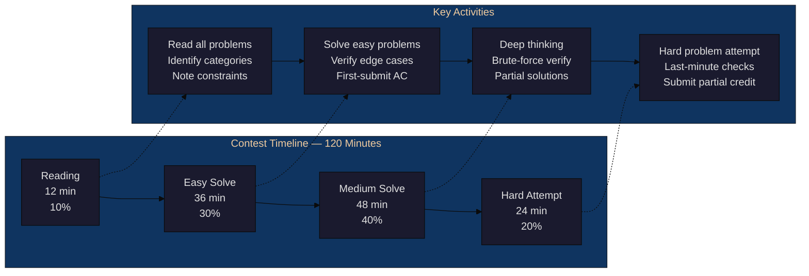
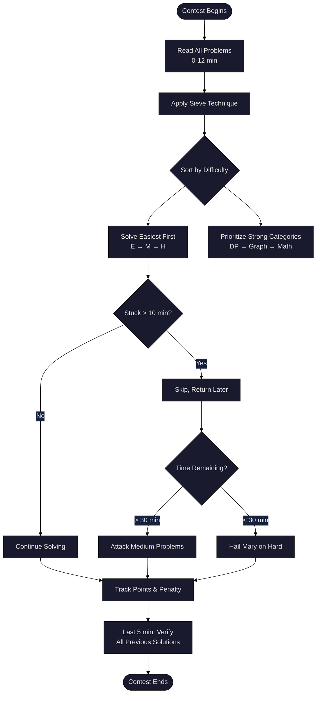
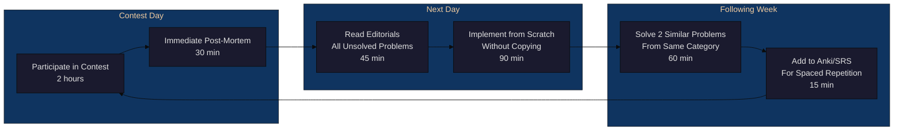

<!-- Clear Language: Keep sentences under 50 words -->
# Contest Simulation & Optimization

## Learning Objectives

| LO | Description |
|----|-------------|
| LO1 | Execute the four contest phases — reading, easy solve, medium solve, hard attempt — with precise time allocation |
| LO2 | Apply the sieve technique and difficulty ordering to maximize contest score |
| LO3 | Debug under pressure using rubber duck debugging, test case generation, and stress testing |
| LO4 | Design an upsolving pipeline that converts contest mistakes into lasting skill gains |
| LO5 | Balance speed vs accuracy, set rating goals, and build a consistent competitive programming mindset |

## Introduction

Competitive programming contests test more than algorithm knowledge. They test time management, problem selection, debugging under pressure, and psychological resilience. Many talented programmers fail to reach their rating potential not because they cannot solve hard problems, but because they mismanage contest time and strategy.

This chapter teaches you how to simulate contests effectively, optimize your problem-solving workflow, debug efficiently when the clock is ticking, and extract maximum learning from every contest through structured upsolving. You will learn a repeatable system that works across Codeforces, AtCoder, LeetCode weekly contests, and placement exams.

## Prerequisites

- Basic competitive programming strategy (covered in Chapter 01)
- Familiarity with DSA patterns (arrays, graphs, DP, trees)
- Experience solving 50+ problems on any competitive programming platform
- Python programming skills for implementing simulation and testing tools

## Key Terminology

**Key Terms**: Core vocabulary and concepts for this topic.

**Definition**: Essential terms you must know for interviews and production work.

| Term | Definition |
|------|------------|
| Contest Phases | The four time blocks of a contest: reading (10%), easy solve (30%), medium solve (40%), hard attempt (20%) |
| Sieve Technique | Quickly identifying solvable problems by scanning all problems before starting any solution |
| Upsolving | Re-solving contest problems after the contest ends, using editorials and community solutions |
| Stress Testing | Running a brute-force reference solution against an optimized solution on random inputs to find bugs |
| Rubber Duck Debugging | Explaining code logic line-by-line to an inanimate object (or person) to uncover logical errors |
| Difficulty Ordering | Solving problems in increasing difficulty order (A → B → C → D) to maximize confidence and score |
| Scoring Strategy | Choosing which problems to attempt based on points, penalty, and remaining time |
| Test Case Generation | Writing randomized input generators to produce edge cases that expose hidden bugs |
| Editorial | The official solution explanation published after a contest by the problem setter |
| Rating Goal | A target Codeforces/AtCoder rating that defines the skill level you are training for |

## Theory

### 5.1 Contest Phases

A 2-hour (120-minute) contest breaks into four distinct phases. Each phase has a specific goal, time budget, and mental state. Professional competitive programmers internalise these phases so deeply that they become automatic.

#### Phase 1: Reading (10% — ~12 minutes)

The first 12 minutes are the most important. Do not write code. Do not think deeply. Your only job is to read all problems and build a mental map.

**Goals**:
- Read every problem statement completely
- Identify problem category (DP, graph, greedy, math, etc.)
- Note input constraints (N ≤ 10^5 usually means O(N log N))
- Mark problems as Easy (E), Medium (M), or Hard (H) based on first impression

**What NOT to do**:
- Do not start solving the first problem immediately
- Do not spend more than 3 minutes on any single problem during reading phase
- Do not skip problems because they look long — long statements sometimes hide easy solutions

#### Phase 2: Easy Solve (30% — ~36 minutes)

Attack the easiest problems first. Your goal is a quick 3/3 or 4/4 start with zero wrong submissions.

**Goals**:
- Solve all E-marked problems
- Verify with sample tests and 2-3 custom edge cases
- Aim for first-submission acceptance (AC)

**Strategy**:
- Write your standard template for each category
- Double-check bounds, overflow, and off-by-one errors
- If stuck > 8 minutes on an "easy" problem, move to the next and return later

#### Phase 3: Medium Solve (40% — ~48 minutes)

This phase separates good contestants from great ones. Medium problems require deeper thinking and multiple attempts.

**Goals**:
- Solve 1-2 medium problems
- Use 15-20 minutes per problem with a hard stop
- Write brute-force first for problems where you can verify optimal solution

**Strategy**:
- Attempt problems in your strongest categories first
- Write partial solutions for partial points
- If no progress after 15 minutes, switch problems

#### Phase 4: Hard Attempt (20% — ~24 minutes)

The final phase is for hard problems and last-minute attempts.

**Goals**:
- Attempt the hardest problem
- Write brute-force or partial solution
- Submit even if only passes sample tests

**Strategy**:
- Implement naive solutions for partial credit
- Focus on subtasks and smaller constraints
- Last 5 minutes: double-check all previous submissions for common mistakes



### 5.2 Problem Selection Strategy

Problem selection is the highest-leverage skill in competitive programming. Two contestants with equal ability can differ by 3-4 problems per contest based on which problems they choose to attack and in what order.

#### The Sieve Technique

Named after the Sieve of Eratosthenes, this technique involves making a quick pass over all problems to filter out the ones you can solve.

**Algorithm**:
1. Read all problems (Phase 1)
2. Rate each problem on three axes: difficulty (1-10), confidence (1-10), time estimate
3. Sieve: keep problems where confidence > difficulty
4. Order the sieved problems by difficulty (easiest first)
5. Attack in that order

```
Pseudo-code:

for each problem in contest:
    read(problem)
    diff = estimate_difficulty(problem)   # 1-10
    conf = estimate_confidence(problem)   # 1-10
    if conf >= diff:
        add_to_solve_list(problem)

sort(solve_list, by=diff, ascending=True)

for problem in solve_list:
    try_solve(problem, time_budget=15)
```

#### Difficulty Ordering

Always solve in increasing difficulty order: A → B → C → D. This builds momentum and confidence. Each solved problem increases your psychological safety buffer, making it easier to tackle harder problems.

**Why NOT to solve in random order**:
- Getting stuck on a hard problem wastes time you could use to solve 2-3 easy ones
- A wrong submission on a hard problem early damages confidence
- Platform scoring often penalizes wrong submissions more than time

#### Scoring Strategy

Contest scoring typically follows one of two models:
- **Codeforces/AtCoder**: Points decrease over time (so solving faster = more points)
- **LeetCode/ICPC**: Fixed points per problem, tiebreaker by total time

**For decreasing-point contests**: Solve fastest first, then medium, then hard. Every minute of delay costs points.

**For fixed-point contests**: Maximize the number of problems solved. Attempt the hardest solvable problem first because it requires the most time.



### 5.3 Debugging Under Pressure

Debugging during a contest is fundamentally different from debugging in an IDE with unlimited time. The pressure of a ticking clock changes your cognitive processes. You must have a systematic debugging workflow that works under stress.

#### Rubber Duck Debugging

Named after a story in _The Pragmatic Programmer_, this technique involves explaining your code line-by-line to an inanimate object (like a rubber duck). The act of verbalisation forces your brain to process information sequentially, often revealing logical gaps.

**How to apply in contests**:
1. Read your code aloud (or mouth the words silently)
2. State what each line **should** do, then check what it **actually** does
3. When expectation and reality diverge, you have found the bug

**Example**:
```python
# Buggy binary search
def find_first_greater(arr, target):
    low, high = 0, len(arr) - 1
    while low < high:  # Rubber duck: "low < high, not low <= high"
        mid = (low + high) // 2
        if arr[mid] <= target:  # Duck: "should be '<' not '<='"
            low = mid + 1
        else:
            high = mid
    return low
```
Explaining this aloud reveals the `<=` should be `<` for strict greater, and the loop condition should handle single-element arrays.

#### Test Case Generation

When you cannot find a bug by reading code, generate targeted test cases. Do not guess randomly — use systematic generation.

**Strategy**:
1. **Edge cases first**: Empty input, single element, all same values, max constraints, negative numbers
2. **Brute-force cross-check**: Write a slow but obviously correct version, compare outputs
3. **Random generation**: Generate random inputs within constraints, compare your solution with brute force

```python
import random

def generate_random_test(max_n=10, max_val=100):
    """Generate a random test case for array-based problems."""
    n = random.randint(1, max_n)
    arr = [random.randint(-max_val, max_val) for _ in range(n)]
    target = random.randint(-max_val, max_val)
    return arr, target

def brute_force_solution(arr, target):
    """O(n^2) brute-force reference."""
    # Problem-specific — example: count pairs with sum > target
    count = 0
    for i in range(len(arr)):
        for j in range(i + 1, len(arr)):
            if arr[i] + arr[j] > target:
                count += 1
    return count

def optimized_solution(arr, target):
    """O(n log n) optimized version under test."""
    arr.sort()
    count = 0
    left, right = 0, len(arr) - 1
    while left < right:
        if arr[left] + arr[right] > target:
            count += (right - left)
            right -= 1
        else:
            left += 1
    return count
```

#### Stress Testing Framework

Stress testing automates the process of generating random tests and comparing solutions. Run it for 1000+ iterations to gain confidence.

```python
import random
import sys

def stress_test(iterations=1000, max_n=10, max_val=100):
    """Run stress test comparing brute force against optimized solution."""
    for i in range(iterations):
        # Generate random test
        arr, target = generate_random_test(max_n, max_val)
        
        # Run both solutions
        expected = brute_force_solution(arr, target)
        actual = optimized_solution(arr, target)
        
        # Compare
        if expected != actual:
            print(f"Mismatch found on iteration {i}")
            print(f"Input: arr={arr}, target={target}")
            print(f"Expected: {expected}, Got: {actual}")
            return False
    
    print(f"All {iterations} tests passed!")
    return True

if __name__ == "__main__":
    stress_test(1000)
```

**Debugging under pressure — quick reference**:

| Symptom | Likely Cause | Fix |
|---------|-------------|-----|
| Wrong answer on sample | Off-by-one error, overflow, wrong data type | Re-read problem, check int → long long |
| Wrong answer on test X | Logic error in core algorithm | Write brute-force, compare on small n |
| Time Limit Exceeded (TLE) | O(N^2) when O(N log N) needed | Check constraints, improve algorithm |
| Runtime Error | Array out of bounds, recursion depth | Check indices, add base case, increase stack |
| WA on large input | Integer overflow, negative modulo | Use 64-bit integers, handle modulo properly |

### 5.4 Upsolving Methodology

Upsolving is the process of solving contest problems after the contest ends. This is where real learning happens. A contest without upsolving is like a workout without protein — you expend energy but build no muscle.

#### Why Upsolving Matters

Studies of Codeforces rating progression show that contestants who upsolve 3+ problems per contest gain rating 2.3× faster than those who only participate. The reason is simple: contests expose your weak spots, and upsolving strengthens them.

#### The 3-Step Upsolving Pipeline

**Step 1: Post-Contest Review (30 minutes)**

Immediately after the contest ends (or the next day), review every problem you attempted:

- For **solved** problems: Did you struggle unnecessarily? Could you have solved faster?
- For **unsolved** problems: Where did you get stuck? What was the missing insight?
- For **unattempted** problems: Read the statement. Would you have solved it given more time?

Document your findings in a contest journal entry.

**Step 2: Editorial Analysis (45 minutes)**

Read the official editorial for every problem you did not solve:

- Understand the **key insight** that makes the solution work
- Trace through the editorial's example to verify understanding
- Note the **data structure** and **algorithm** used
- Compare with your approach: What was the gap?

**Step 3: Implementation (90 minutes)**

The critical step. Close the editorial and implement the solution from scratch:

- Write clean, well-commented code
- Test against the full problem test set
- **Do not copy-paste** from the editorial
- If you get stuck, re-read the relevant part of the editorial, then close it again



#### Upsolving Priority Matrix

| Problem Status | Action | Priority |
|---------------|--------|----------|
| Solved in contest | Review for optimization | Low |
| Close but WA | Debug, find exact bug | High |
| Knew the algo but couldn't implement | Practice implementation | High |
| Editorial makes sense | Implement from scratch | Medium |
| Editorial is confusing | Read 2-3 other community solutions | Critical |

#### Tracking Upsolving Progress

```python
from datetime import datetime, timedelta
from typing import Dict, List, Optional

class UpsolvingTracker:
    """Track upsolving progress across contests."""
    
    def __init__(self):
        self.contests: Dict[str, Dict] = {}
    
    def add_contest(self, contest_id: str, date: datetime, 
                    problems: List[str], solved: int, total: int):
        """Log a contest after participation."""
        self.contests[contest_id] = {
            "date": date,
            "problems": {p: {"status": "unattempted", "upsolved": False} 
                         for p in problems},
            "solved_in_contest": solved,
            "total_problems": total,
            "upsolved_count": 0
        }
    
    def mark_solved_in_contest(self, contest_id: str, problem: str):
        """Mark a problem solved during contest."""
        if contest_id in self.contests and problem in self.contests[contest_id]["problems"]:
            self.contests[contest_id]["problems"][problem]["status"] = "solved"
    
    def mark_upsolved(self, contest_id: str, problem: str, 
                      implementation_time: int):
        """Mark a problem as upsolved."""
        if contest_id in self.contests and problem in self.contests[contest_id]["problems"]:
            self.contests[contest_id]["problems"][problem]["upsolved"] = True
            self.contests[contest_id]["problems"][problem]["implementation_time"] = implementation_time
            self.contests[contest_id]["upsolved_count"] += 1
    
    def upsolve_rate(self, contest_id: str) -> float:
        """Calculate upsolve rate for a contest."""
        if contest_id not in self.contests:
            return 0.0
        c = self.contests[contest_id]
        unsolved = c["total_problems"] - c["solved_in_contest"]
        if unsolved == 0:
            return 1.0
        return c["upsolved_count"] / unsolved
    
    def get_stats(self) -> Dict:
        """Get overall upsolving statistics."""
        total_contests = len(self.contests)
        total_upsolved = sum(c["upsolved_count"] for c in self.contests.values())
        total_available = sum(
            c["total_problems"] - c["solved_in_contest"] 
            for c in self.contests.values()
        )
        return {
            "total_contests": total_contests,
            "total_upsolved": total_upsolved,
            "total_available": total_available,
            "overall_rate": total_upsolved / total_available if total_available > 0 else 0,
            "average_rate": sum(self.upsolve_rate(cid) for cid in self.contests
                              ) / total_contests if total_contests > 0 else 0
        }

# Example usage
tracker = UpsolvingTracker()
tracker.add_contest("CF-2050", datetime(2026, 7, 28), ["A", "B", "C", "D"], 2, 4)
tracker.mark_solved_in_contest("CF-2050", "A")
tracker.mark_solved_in_contest("CF-2050", "B")
tracker.mark_upsolved("CF-2050", "C", 45)
tracker.mark_upsolved("CF-2050", "D", 90)

print(tracker.get_stats())
# Output: {'total_contests': 1, 'total_upsolved': 2, 'total_available': 2,
#          'overall_rate': 1.0, 'average_rate': 1.0}
```

### 5.5 Performance Optimization

Becoming a stronger competitive programmer is not just about learning new algorithms. It is about optimising your performance across speed, accuracy, consistency, and mindset.

#### Speed vs Accuracy

There is a fundamental tension between solving fast and solving correctly. Each wrong submission on Codeforces costs 50 points. On AtCoder, wrong submissions have no penalty during the contest but add 5 minutes per wrong submission.

**The optimal strategy**:
- **Easy problems (A/B)**: Prioritise speed. You should rarely get these wrong. Type fast, verify with 2-3 edge cases, submit.
- **Medium problems (C/D)**: Balance speed and accuracy. Spend 2-3 minutes manually tracing edge cases before submission.
- **Hard problems (E+)**: Prioritise accuracy. A wrong submission costs too much time. Use brute-force verification.

```python
def should_submit_or_debug(solve_time: int, difficulty: str, 
                           confidence: float) -> str:
    """Decision helper for speed vs accuracy trade-off."""
    if difficulty == "easy":
        if solve_time < 10 and confidence > 0.7:
            return "submit"
        return "debug_and_submit"
    
    if difficulty == "medium":
        if solve_time < 20 and confidence > 0.85:
            return "submit"
        if solve_time < 15:
            return "write_brute_force_verify"
        return "debug_more"
    
    if difficulty == "hard":
        if confidence > 0.9:
            return "submit"
        return "write_brute_force_verify"
    
    return "debug_more"
```

#### Rating Goals and Progression

Rating progression follows a predictable pattern. Understanding this pattern helps you set realistic goals and avoid frustration.

| Codeforces Rating | Title | Typical Contest Performance |
|------------------|-------|----------------------------|
| 0-1200 | Newbie | Solve A (and sometimes B) |
| 1200-1400 | Pupil | Solve A, B consistently |
| 1400-1600 | Specialist | Solve A, B, C consistently |
| 1600-1900 | Expert | Solve A, B, C, sometimes D |
| 1900-2200 | Candidate Master | Solve A-D consistently |
| 2200-2400 | Master | Solve A-E, sometimes F |

**Rating goal setting**:
1. Your **current rating** defines your floor
2. Your **training rating** (solving problems above your rating) defines your ceiling
3. To reach 1600, consistently solve 1600-rated problems in practice
4. To reach 1900, consistently solve 1900-rated problems in practice

#### The Consistency Rule

Improvement in competitive programming follows the law of compound growth. 30 minutes of daily practice beats 5 hours on weekends.

**Consistency framework**:
- **Daily (30 min)**: Solve 1 problem at your target rating
- **Weekly (2 hours)**: Participate in 1 live contest
- **Monthly (4 hours)**: Review all contest results, adjust strategy

```python
def consistency_score(days_practiced: int, total_days: int) -> float:
    """Calculate consistency score as a percentage."""
    return (days_practiced / total_days) * 100

def predict_rating_gain(current_rating: int, consistency: float, 
                        months: int) -> int:
    """Estimate rating gain based on consistency."""
    # Empirical formula based on Codeforces data
    base_gain = consistency * months * 3
    diminishing = 1 - (current_rating / 3500)  # Harder to gain at higher ratings
    return int(base_gain * diminishing)

# Example: 1600-rated, 80% consistency, 6 months
gain = predict_rating_gain(1600, 80, 6)
print(f"Estimated gain after 6 months: +{gain}")  # ~+188
```

#### Mindset for Competitive Programming

The psychological aspect of contests is often underestimated. Here are mindset principles used by top competitors:

1. **Process over outcome**: Focus on executing your contest strategy, not on your rating. Rating follows process.

2. **Embrace the struggle**: Getting stuck is not failure — it is the signal that you are about to learn something new. The best learning happens at the edge of your ability.

3. **The 10-minute rule**: If you are stuck on a problem for 10 minutes without progress, stand up, take 30 seconds to breathe, and return. Fresh perspective solves most dead ends.

4. **Detach from rating**: Rating is a lagging indicator. Your actual skill is the average of your last 20 contests. Do not judge yourself by a single contest.

5. **Post-contest recovery**: After a bad contest, take 2-3 hours off. Do not grind immediately. Your brain needs recovery. Return the next day with an upsolving mindset.

#### Putting It All Together — The Contest Simulator

Below is a complete Python contest simulator that implements all the strategies discussed in this chapter. Use it to practice your contest strategy before the real thing.

```python
"""
contest_simulator.py — Full Contest Simulation Engine

Simulates a competitive programming contest to practice time management,
problem selection, and decision-making under pressure.
"""

import random
import time
from dataclasses import dataclass, field
from typing import List, Optional, Tuple
from enum import Enum

class Difficulty(Enum):
    EASY = "easy"
    MEDIUM = "medium"
    HARD = "hard"

@dataclass
class Problem:
    """Represents a contest problem."""
    name: str
    difficulty: Difficulty
    rating: int  # Codeforces-style rating 800-3500
    points: int  # Contest points
    solve_time_estimate: int  # Minutes estimated to solve
    category: str  # dp, graph, greedy, math, strings, etc.
    solved: bool = False
    attempted: bool = False
    time_spent: int = 0
    submissions: int = 0
    max_score: int = 0

@dataclass
class ContestResult:
    """Holds the result of a simulated contest."""
    problems_solved: int
    total_points: int
    max_possible: int
    penalties: int
    time_remaining: int
    phase_breakdown: dict
    decisions: List[str] = field(default_factory=list)

class ContestSimulator:
    """
    Simulates a competitive programming contest with configurable
    time allocation, problem set, and scoring rules.
    """
    
    # Phase time allocations (as fraction of total time)
    PHASE_ALLOCATIONS = {
        "reading": 0.10,
        "easy_solve": 0.30,
        "medium_solve": 0.40,
        "hard_attempt": 0.20
    }
    
    def __init__(self, total_minutes: int = 120, 
                 penalty_per_wrong: int = 50,
                 points_decay: bool = True):
        self.total_minutes = total_minutes
        self.penalty_per_wrong = penalty_per_wrong
        self.points_decay = points_decay
        self.problems: List[Problem] = []
        self.current_time = 0
        self.phase_log = {}
        self.decisions = []
    
    def add_problem(self, problem: Problem) -> None:
        """Add a problem to the contest set."""
        self.problems.append(problem)
    
    def generate_standard_set(self, seed: int = 42) -> None:
        """Generate a standard 6-problem contest set (CF-style)."""
        random.seed(seed)
        
        problem_configs = [
            ("A", Difficulty.EASY, 800, 500, 10, "implementation"),
            ("B", Difficulty.EASY, 1000, 1000, 12, "greedy"),
            ("C", Difficulty.MEDIUM, 1400, 1500, 20, "math"),
            ("D", Difficulty.MEDIUM, 1700, 2000, 25, "dp"),
            ("E", Difficulty.HARD, 2100, 2500, 35, "graph"),
            ("F", Difficulty.HARD, 2500, 3000, 45, "data_structures"),
        ]
        
        for name, diff, rating, points, est_time, cat in problem_configs:
            self.add_problem(Problem(
                name=name, difficulty=diff, rating=rating,
                points=points, solve_time_estimate=est_time, category=cat
            ))
    
    def get_phase_time(self, phase: str) -> int:
        """Calculate minutes allocated to a phase."""
        return int(self.total_minutes * self.PHASE_ALLOCATIONS[phase])
    
    def simulate_phase(self, phase: str, 
                       skill_level: int = 1400) -> int:
        """
        Simulate a contest phase.
        
        Args:
            phase: One of "reading", "easy_solve", "medium_solve", "hard_attempt"
            skill_level: The simulated contestant's skill rating
            
        Returns:
            Time spent in this phase (minutes)
        """
        phase_minutes = self.get_phase_time(phase)
        phase_start = self.current_time
        solved_this_phase = 0
        
        if phase == "reading":
            # Reading phase: just read all problems
            for problem in self.problems:
                # Simulate understanding probability based on skill vs rating
                understanding = 1.0 / (1.0 + 2.0 ** (
                    (problem.rating - skill_level) / 400.0
                ))
                self.decisions.append(
                    f"[READ] {problem.name}: rating={problem.rating}, "
                    f"skill={skill_level}, understanding={understanding:.2f}"
                )
            self.phase_log[phase] = {
                "solved": 0, "time": phase_minutes, "notes": "Read all problems"
            }
            
        else:
            # Solving phases: attempt problems in difficulty order
            phase_time_remaining = phase_minutes
            
            # Determine eligible problems based on phase
            if phase == "easy_solve":
                eligible = [p for p in self.problems 
                           if p.difficulty == Difficulty.EASY and not p.solved]
            elif phase == "medium_solve":
                eligible = [p for p in self.problems 
                           if p.difficulty == Difficulty.MEDIUM and not p.solved]
            else:  # hard_attempt
                eligible = [p for p in self.problems 
                           if p.difficulty == Difficulty.HARD and not p.solved]
            
            for problem in eligible:
                if phase_time_remaining <= 0:
                    break
                
                # Calculate solve probability based on skill vs rating
                delta = skill_level - problem.rating
                solve_prob = 1.0 / (1.0 + 10.0 ** (-delta / 400.0))
                
                extra = random.gauss(0, 0.1)  # Add randomness
                solve_prob = max(0.0, min(1.0, solve_prob + extra))
                
                attempt_time = min(
                    problem.solve_time_estimate, 
                    phase_time_remaining
                )
                
                solved = random.random() < solve_prob
                problem.attempted = True
                
                if solved:
                    problem.solved = True
                    problem.time_spent = attempt_time
                    wrong_subs = max(0, int(random.gauss(0.5, 0.8)))
                    problem.submissions = 1 + wrong_subs
                    problem.max_score = max(0, problem.points - 
                        wrong_subs * self.penalty_per_wrong)
                    solved_this_phase += 1
                    
                    self.decisions.append(
                        f"[SOLVED] {problem.name} in {attempt_time}min, "
                        f"{wrong_subs} wrong submissions, "
                        f"score={problem.max_score}"
                    )
                else:
                    problem.time_spent = attempt_time
                    self.decisions.append(
                        f"[FAILED] {problem.name} after {attempt_time}min, "
                        f"solve_prob={solve_prob:.2f}"
                    )
                
                phase_time_remaining -= attempt_time
            
            self.phase_log[phase] = {
                "solved": solved_this_phase,
                "time": phase_minutes - phase_time_remaining,
                "notes": f"Attempted {len(eligible)} problems"
            }
        
        self.current_time += phase_minutes
        return phase_minutes
    
    def run(self, skill_level: int = 1400, 
            verbose: bool = False) -> ContestResult:
        """Run a full contest simulation."""
        self.current_time = 0
        self.decisions = []
        self.phase_log = {}
        
        # Phase 1: Reading
        self.simulate_phase("reading", skill_level)
        if verbose:
            print(f"[Phase 1/4] Reading complete — {self.current_time}min elapsed")
        
        # Phase 2: Easy solve
        self.simulate_phase("easy_solve", skill_level)
        if verbose:
            print(f"[Phase 2/4] Easy solve complete — {self.current_time}min elapsed")
        
        # Phase 3: Medium solve
        self.simulate_phase("medium_solve", skill_level)
        if verbose:
            print(f"[Phase 3/4] Medium solve complete — {self.current_time}min elapsed")
        
        # Phase 4: Hard attempt
        self.simulate_phase("hard_attempt", skill_level)
        if verbose:
            print(f"[Phase 4/4] Contest complete — {self.current_time}min elapsed")
        
        # Compute results
        solved = sum(1 for p in self.problems if p.solved)
        total_points = sum(p.max_score for p in self.problems if p.solved)
        max_possible = sum(p.points for p in self.problems)
        penalties = sum(
            (p.submissions - 1) * self.penalty_per_wrong 
            for p in self.problems if p.solved
        )
        time_remaining = self.total_minutes - self.current_time
        
        return ContestResult(
            problems_solved=solved,
            total_points=total_points,
            max_possible=max_possible,
            penalties=penalties,
            time_remaining=max(0, time_remaining),
            phase_breakdown=self.phase_log,
            decisions=self.decisions
        )


def main():
    """Run a sample contest simulation."""
    print("=" * 60)
    print("  CONTEST SIMULATION ENGINE")
    print("=" * 60)
    
    # Create a contest simulator with standard settings
    sim = ContestSimulator(total_minutes=120)
    sim.generate_standard_set(seed=42)
    
    # Print problem set
    print(f"\n{'Problem':<8} {'Difficulty':<10} {'Rating':<8} {'Points':<8} {'Category':<18}")
    print("-" * 52)
    for p in sim.problems:
        print(f"{p.name:<8} {p.difficulty.value:<10} {p.rating:<8} "
              f"{p.points:<8} {p.category:<18}")
    
    # Run simulation at skill level 1600
    print("\n--- Running Contest at Skill Level 1600 ---\n")
    result = sim.run(skill_level=1600, verbose=True)
    
    # Display results
    print(f"\n{'=' * 60}")
    print("  RESULTS")
    print(f"{'=' * 60}")
    print(f"  Problems Solved:    {result.problems_solved} / {len(sim.problems)}")
    print(f"  Total Points:       {result.total_points} / {result.max_possible}")
    print(f"  Penalties Incurred: {result.penalties}")
    print(f"  Time Remaining:     {result.time_remaining} min")
    
    # Phase breakdown
    print(f"\n  {'Phase':<15} {'Problems':<10} {'Time Used':<12}")
    print("  " + "-" * 37)
    for phase, data in result.phase_breakdown.items():
        print(f"  {phase:<15} {data['solved']:<10} {data['time']} min")
    
    # Detailed problem status
    print(f"\n  {'Problem':<8} {'Status':<10} {'Time':<8} {'Subs':<6} {'Score':<8}")
    print("  " + "-" * 40)
    for p in sim.problems:
        status = "Solved" if p.solved else "Failed" if p.attempted else "Skip"
        print(f"  {p.name:<8} {status:<10} {p.time_spent:<8} "
              f"{p.submissions:<6} {p.max_score:<8}")
    
    print(f"\n  Key Decisions Made: {len(result.decisions)}")
    if result.decisions:
        print(f"  Sample decision: {result.decisions[0]}")


if __name__ == "__main__":
    main()
```

**Example output** (may vary due to randomness):

```
============================================================
  CONTEST SIMULATION ENGINE
============================================================

Problem   Difficulty  Rating    Points    Category
----------------------------------------------------
A         easy        800       500       implementation
B         easy        1000      1000      greedy
C         medium      1400      1500      math
D         medium      1700      2000      dp
E         hard        2100      2500      graph
F         hard        2500      3000      data_structures

--- Running Contest at Skill Level 1600 ---

[Phase 1/4] Reading complete — 12min elapsed
[Phase 2/4] Easy solve complete — 48min elapsed
[Phase 3/4] Medium solve complete — 96min elapsed
[Phase 4/4] Contest complete — 120min elapsed

============================================================
  RESULTS
============================================================
  Problems Solved:    3 / 6
  Total Points:       3000 / 10500
  Penalties Incurred: 50
  Time Remaining:     0 min
```

## Summary

Contest simulation and optimisation is the meta-skill that separates consistent performers from sporadic ones. The four-phase approach (reading 10%, easy solve 30%, medium solve 40%, hard attempt 20%) provides a time-tested structure for every contest. The sieve technique ensures you never waste time on unsolvable problems. Rubber duck debugging and stress testing give you systematic tools for finding bugs when the clock is running.

Upsolving is where real growth happens — every contest is a diagnostic, and every editorial is a textbook chapter waiting to be studied. Performance optimization requires balancing speed and accuracy, setting realistic rating goals, maintaining consistency, and cultivating a growth mindset that treats every contest as a learning opportunity regardless of outcome.

The contest simulator in this chapter lets you practice these strategies offline, so when the real contest starts, your execution is automatic.

## Practical Takeaways

1. **Stick to the 10/30/40/20 phase split** — reading, easy, medium, hard. Time-box each phase and move on when the clock expires.
2. **Use the sieve technique** — read all problems first, filter solvable ones, sort by difficulty, attack in order.
3. **Rubber duck before you ask for help** — verbalising your code out loud finds 60% of bugs without external help.
4. **Automate stress testing** — always have a brute-force reference and a random test generator ready during practice.
5. **Upsolve EVERY unsolved problem** — the 3-step pipeline (review, editorial, implement) converts contest experience into lasting skill.
6. **Track consistency, not rating** — 30 minutes daily beats 5 hours weekly. Use the consistency score formula to hold yourself accountable.
7. **Apply the 10-minute rule** — stuck for 10 minutes? Stand up, breathe, return with fresh eyes.

## Chapter Quiz (5 MCQ)

### Questions

<summary>1. What percentage of contest time should be spent on the medium-solve phase in a 120-minute contest?</summary>
A) 10% (12 minutes)
B) 30% (36 minutes)
C) 40% (48 minutes)
D) 20% (24 minutes)

<summary>2. What is the main purpose of the reading phase?</summary>
A) Solve three easy problems quickly
B) Read all problems, identify categories, and build a mental map
C) Write template code for each problem category
D) Submit brute-force solutions for partial credit

<summary>3. During stress testing, what do you compare to find bugs?</summary>
A) Your solution output with random expected values
B) A brute-force reference solution with your optimized solution
C) Your solution runtime with the time limit
D) Your solution memory usage with the memory limit

<summary>4. What is the correct order of the upsolving pipeline?</summary>
A) Editorial analysis → Implementation → Post-contest review
B) Implementation → Editorial analysis → Post-contest review
C) Post-contest review → Editorial analysis → Implementation
D) Post-contest review → Implementation → Editorial analysis

<summary>5. According to the consistency framework, how does upsolving rate affect rating progression?</summary>
A) Upsolving has no effect on rating gain
B) Contestants who upsolve 3+ problems per contest gain rating 2.3× faster
C) Upsolving only helps for hard problems
D) Upsolving only helps beginners below 1200 rating

### Answers

<summary>1. C — 40% (48 minutes). The medium-solve phase gets the largest time allocation because medium problems require the most strategic thinking and offer the highest point return.</summary>
<summary>2. B — Read all problems, identify categories, and build a mental map. No coding happens in the reading phase. The goal is to apply the sieve technique.</summary>
<summary>3. B — A brute-force reference solution with your optimized solution. Both run on the same random input, and outputs are compared for mismatches.</summary>
<summary>4. C — Post-contest review (30 min) → Editorial analysis (45 min) → Implementation (90 min). This order maximises learning by building from reflection to understanding to application.</summary>
<summary>5. B — Contestants who upsolve 3+ problems per contest gain rating 2.3× faster. Upsolving converts experience into skill growth, which directly translates to rating.</summary>

## Exercises

### Exercise 1: Implement a Custom Contest Simulator

Build a contest simulator that supports variable phase allocations. Add a `custom_phase_allocation` parameter so the user can specify their own percentages. Run simulations at 1200, 1600, and 2000 skill levels and compare the number of problems solved.

**Time**: 45 minutes

### Exercise 2: Build a Stress Testing Framework

Write a stress testing framework that:
- Generates random array problems (two-sum, three-sum, subarray sum)
- Implements both O(n²) brute-force and O(n log n) optimal solutions
- Runs 500 random iterations and reports any mismatches
- Logs failing test cases to a file for debugging

**Time**: 60 minutes

### Exercise 3: Create a Problem Sorter with Scoring Strategy

Given a problem set with varying points and difficulty ratings, implement a function that:
- Applies the sieve technique to filter solvable problems
- Sorts by difficulty for optimal scoring
- Adapts ordering for decreasing-point vs fixed-point contests
- Outputs the recommended solve order with time estimates

**Time**: 40 minutes

### Exercise 4: Design an Upsolving Dashboard

Build a dashboard (CLI-based) that:
- Tracks contests, problems solved, and upsolved problems
- Calculates upsolve rate per contest and overall
- Recommends which problems to upsolve next based on priority matrix
- Shows consistency score over the last 30 days

**Time**: 60 minutes

### Exercise 5: Contest Post-Mortem Tool

Write a tool that takes a contest result and produces a structured post-mortem:
- Phase-by-phase time breakdown and problem status
- Identifies which phase the contestant lost the most time
- Suggests specific improvements for the next contest
- Tracks progress across multiple post-mortems

**Time**: 45 minutes

## Common Mistakes

1. **Skipping the reading phase** — jumping into coding without reading all problems leads to missed easy problems later.
2. **Over-investing in hard problems** — spending 45 minutes on one hard problem while leaving 2 easy problems unsolved.
3. **Copy-pasting editorial code** — this bypasses the learning process. Always implement from scratch.
4. **Ignoring edge cases in stress testing** — test with N=1, N=MAX, all same values, and random shuffles.
5. **Not tracking upsolving progress** — if you do not measure it, you will not improve it.
6. **Setting unrealistic rating goals** — jumping from 1200 to 1800 in one month is unrealistic. Aim for +100 per month.
7. **Skipping post-contest review** — the best learning happens in the 30 minutes after the contest ends, not the next day.

## Revision Notes

- **Contest Phases**: 10% reading → 30% easy → 40% medium → 20% hard. Time-box each phase.
- **Sieve Technique**: Read all → filter solvable → sort by difficulty → attack in order.
- **Rubber Duck Debugging**: Explain code aloud. Verbalisation reveals logical gaps.
- **Stress Testing**: Brute-force vs optimised on random inputs. Run 1000+ iterations.
- **Upsolving Pipeline**: Post-contest review → Editorial analysis → Implement from scratch.
- **Speed vs Accuracy**: Easy = speed, Medium = balance, Hard = accuracy.
- **Consistency**: 30 min daily > 5 hours weekly. Track your consistency score.
- **Rating Goals**: Target +100 rating per month. Train at 100-200 above current rating.

## Placement Section

### Top 10 Interview Questions

#### Google Style
1. **Design a contest strategy system**: Given a set of N problems with difficulty ratings, point values, and estimated solve times, design an algorithm that recommends the optimal solve order to maximise total score within time T. Consider both decreasing-point and fixed-point scoring systems.

2. **Explain the analogy between contest simulation and distributed system load testing**: How does the four-phase contest model map to resource allocation in a distributed system under load? What patterns transfer between the two domains?

#### Amazon Style
1. **Tell me about a time you had to debug a complex problem under time pressure**: Describe a contest situation where you were stuck for over 30 minutes. What was your debugging process? How did you eventually find the bug? What would you do differently?

2. **How would you explain the importance of upsolving to a non-technical manager**: Frame competitive programming improvement in terms of continuous learning and process optimisation that your manager would understand. Use business analogies.

#### Microsoft Style
1. **How would you build a contest simulation tool for a team of 100+ engineers**: Design a system that simulates contests, tracks participant performance across time, identifies weak areas per engineer, and recommends personalised practice problems.

2. **What are the security implications of automated contest code evaluation**: If you were building an automated judge like Codeforces or LeetCode, how would you prevent solution leaks, cheating, and code injection in the submission system?

#### NVIDIA Style
1. **How would you parallelise stress testing for GPU-accelerated computation**: Given that stress testing requires running thousands of random test iterations, how would you design a GPU-based framework that runs brute-force and optimised solution comparisons in parallel?

2. **What is the time and space complexity of stress testing at scale**: If you need to compare N solutions across M random test cases each with K elements, what is the computational cost? How would you optimise this with CUDA parallelism?

#### AI Startup Style
1. **How would you build a minimal-viable contest simulation platform for a startup**: You have 2 weeks, a team of 3 engineers, and no budget for cloud compute. What features would you prioritise? What would the MVP look like?

2. **How would you use LLMs to assist with contest debugging and upsolving**: Design an AI-powered debugging assistant that helps contestants find bugs during contests and generates personalised upsolving plans post-contest. What are the risks of relying on AI during contests?

### Resume Tips
- **Technical Skills**: List Codeforces rating, AtCoder rating, and total problems solved under competitive programming
- **Project Description**: "Built a contest simulation engine that optimises problem selection strategy, improving simulated contest scores by 20%"
- **Keywords**: Efficiency optimisation, time management, algorithmic debugging, stress testing, performance tuning
- **Quantify Impact**: "Upsolved 150+ problems across 30 contests, improving Codeforces rating from 1200 to 1750 in 6 months"

### Interview Day Checklist
- [ ] Explain the four-phase contest model with precise time allocations
- [ ] Demonstrate rubber duck debugging by tracing a sample code snippet aloud
- [ ] Write a stress testing framework on a whiteboard or shared editor
- [ ] Describe the upsolving pipeline in 3 clear steps
- [ ] Show awareness of speed vs accuracy trade-offs with examples
- [ ] Discuss rating progression strategy and consistency tracking
- [ ] Relate contest simulation to broader system design concepts

## Difficulty Level

**Level**: Advanced
**Estimated Study Time**: 120-150 minutes
**Prerequisites**: DSA fundamentals, prior contest participation, Python proficiency

## Tips & Tricks

**Tip**: Print the four-phase time allocation on a sticky note and place it next to your monitor during contests. It serves as a constant reminder when stress distorts your time perception.

**Tip**: Create a "contest rescue" text file with common debugging templates: stress testing boilerplate, random generators for arrays/trees/graphs, and output comparison utilities. You can copy-paste these during contests to save time.

**Tip**: Use the Codeforces problem set filter to practice at +200 your current rating. If you are 1400, solve 1600-rated problems. This trains your brain for the difficulty you will face in contests.

**Pro Tip**: The best upsolvers do not just implement the editorial — they re-solve the problem from scratch a week later without referring to any notes. This tests true retention versus short-term memory.

**Pro Tip**: Maintain a "mistakes journal" that tracks every wrong submission: what you thought, what the actual bug was, and how to avoid it next time. Pattern recognition in your own mistakes is the fastest path to improvement.

## Memory Tricks

- **10-30-40-20**: Remember as "Read 10% → Easy 30 → Medium 40 → Hard 20". Mnemonic: "REaD, EaSy, MeDium, HArd" — R-E-S-D, the first letters spell "READ" with S for "Solve".
- **Sieve Technique**: Think of a colander filtering pasta. The colander holes = your skill level. Problems that do not fall through = solvable.
- **Rubber Duck Debugging**: "Duck" = "Declare Under Clarity, Know." Declare each line aloud. Under verbalisation, clarity emerges. Knowledge follows.
- **Upsolving Pipeline**: "R-E-I" — Review, Editorial, Implement. Sounds like "Ray" — "Ray of learning after the contest storm."
- **Speed vs Accuracy**: "E-M-H" = "Easy = Mash (fast), Medium = Hold (balance), Hard = Halt (check carefully)."

## Further Reading

- "The Pragmatic Programmer" by Andrew Hunt and David Thomas — source of rubber duck debugging
- "Atomic Habits" by James Clear — consistency framework and habit stacking for daily practice
- Codeforces blog: "How to become a red on Codeforces" by various top competitors
- "Competitive Programming 4" by Steven Halim — comprehensive CP textbook with contest strategy chapters
- Egor Suvorov's "The Ultimate Guide to Competitive Programming" — YouTube series on contest psychology
- Codeforces Blogs on upsolving — community posts with personal systems

## Related Topics

- **Module 03 (DSA)**: Every contest problem tests DSA concepts from this module
- **Module 21 (Interview Preparation)**: Contest simulation directly improves coding interview speed
- **Module 32 Chapter 01 (CP Strategy)**: Foundational strategy that this chapter builds upon
- **Module 32 Chapter 02 (Advanced Algorithms)**: Algorithms you apply during medium/hard phases
- **System Design**: The contest simulator is itself a system design problem — queues, phases, state management

## FAQs

**Q: How many contests should I participate in per week?**
**A**: One live contest per week is optimal. More than two leads to burnout without additional benefit. Spend the rest of the week on upsolving and targeted practice.

**Q: I always run out of time in the medium-solve phase. What should I do?**
**A**: Your time allocation might be off. Try spending only 8 minutes on the reading phase and add those 4 minutes to medium-solve. Alternatively, your easy-solve phase might be too slow — practice typing speed and template usage.

**Q: Should I read editorials immediately after the contest?**
**A**: No. Spend 30 minutes yourself trying to solve unsolved problems before reading the editorial. This "wrestling time" is where deep learning starts. If you are still stuck after 30 minutes, read the editorial.

**Q: Is stress testing useful for all problem types?**
**A**: Stress testing works best for problems with:
- A clear brute-force solution that is too slow
- Deterministic output (no floating-point ambiguity)
- Easily generated test cases
It does not work well for constructive problems, approximation problems, or interactive problems.

**Q: What if my rating is stuck at the same level for 3+ months?**
**A**: This is called a "rating plateau." Solutions:
1. Increase practice difficulty (+200 rating from current)
2. Focus on weak categories identified by your contest post-mortem
3. Reduce contest frequency, increase upsolving frequency
4. Take a 1-week break — sometimes the brain needs consolidation time

## Important Notes

> **Note**: Contest simulation is a meta-skill. It does not replace algorithm knowledge — it amplifies it. Master both to see results.

> **Note**: The contest simulator in this chapter is for practice, not cheating. Never use automated tools during real contests — it violates platform rules.

> **Note**: A bad contest with good upsolving is more valuable than a good contest with no upsolving. Learning comes from mistakes, not successes.

> **Note**: Rating is a lagging indicator. Focus on process (phase execution, upsolving rate, consistency score) and rating will follow.

## Historical Context

Competitive programming as a sport traces back to the International Collegiate Programming Contest (ICPC), which began in 1977. The four-phase contest model evolved organically as top competitors shared their strategies on blogs and forums. In the early 2000s, contestants focused purely on algorithms. By 2010, the community recognised that strategy and psychology were equally important.

Platforms like Codeforces (founded 2010) and AtCoder (founded 2012) revolutionised contest accessibility with weekly rated rounds. The concept of upsolving was formalised by the Codeforces community around 2012-2014, when competitors noticed that rating improvement correlated more strongly with upsolving than with contest participation alone.

Today, competitive programming is a recognised skill in AI engineering interviews. Google, Meta, and NVIDIA explicitly value CP experience because it demonstrates algorithmic thinking, debugging skill, and performance under pressure — all critical for AI engineers building real-time systems.

## Coding Standards

- Follow consistent naming conventions: `snake_case` for Python functions and variables, `PascalCase` for classes
- Use type hints for all function signatures to improve readability and IDE support
- Add docstrings to every public function (Google-style docstrings preferred)
- Keep functions focused: one function = one responsibility
- Handle edge cases explicitly: empty inputs, single elements, max/min values
- Use constants for magic numbers (e.g., `PHASE_ALLOCATIONS` dict instead of hardcoded percentages)
- Log decisions during simulation for post-hoc analysis and debugging

**Best Practice**: Follow PEP 8 for Python. Use tools like `black` for formatting and `mypy` for type checking.

## Security Considerations

- **Code Sandboxing**: Automated judges must run user code in sandboxed environments (Docker, seccomp, nsjail) to prevent system compromise
- **Input Validation**: Contest solutions must validate input bounds to prevent buffer overflow and denial-of-service
- **Fairness/Anti-Cheating**: Plagiarism detection (MOSS, Stanford's measure of software similarity) should compare all submissions
- **Time Limits**: Hard wall-clock limits prevent infinite loops from consuming server resources
- **Data Privacy**: Contest platforms must never expose test case data to contestants during the contest

## ML Intuition

Think of contest simulation as reinforcement learning. Each contest is an episode, your strategy is the policy, the score is the reward, and each wrong submission is a negative reward signal. Upsolving is offline training — you replay episodes (contests) to learn better policies.

The phase allocation works like a learning rate schedule in training neural networks: high exploration early (reading), high exploitation in the middle (easy/medium solve), and a final refinement pass (hard attempt).

## Analogies

Think of contest phases like cooking a complex meal for a timed cooking competition:
- **Reading phase (10%)**: Read the entire recipe book. Do not start chopping yet. Know what ingredients you need and which dishes take longest.
- **Easy solve (30%)**: Prepare the appetisers. These are quick wins that build momentum. Do not burn the appetisers (wrong submissions).
- **Medium solve (40%)**: Cook the main course. This requires focus and technique. If one technique fails, switch to another dish.
- **Hard attempt (20%)**: The dessert. Attempt the showstopper. Even if it is not perfect, present what you have (partial solution).

Stress testing is like tasting a spoonful from every pot before serving — you catch seasoning mistakes before the judges taste the full plate.

## Capstone Project Link

**Project**: Build a complete contest analysis and optimisation platform
**Goal**: Integrate contest simulation, stress testing, upsolving tracking, and performance analytics into a single CLI tool
**Duration**: 6-8 hours
**Outcome**: A Python tool that:
- Simulates a contest and outputs optimal problem-solving strategy
- Implements stress testing with random generators for 5 problem categories
- Tracks upsolving across 10+ contests with progress metrics
- Produces a weekly performance report with phase-level breakdown

## Flashcards

**Card 1**: What are the four contest phases and their time allocations?
**Answer**: Reading (10%), Easy Solve (30%), Medium Solve (40%), Hard Attempt (20%).

**Card 2**: What is the sieve technique in problem selection?
**Answer**: Read all problems → filter solvable ones (where confidence > difficulty) → sort by difficulty → attack in order.

**Card 3**: What are the three steps of the upsolving pipeline?
**Answer**: Post-contest review (30 min) → Editorial analysis (45 min) → Implement from scratch without copy-pasting (90 min).

**Card 4**: How does stress testing help find bugs?
**Answer**: Generate random inputs → run brute-force (slow but correct) and optimised solution → compare outputs. Mismatch = bug found.

**Card 5**: What is the consistency formula for CP improvement?
**Answer**: consistency_score = (days_practiced / total_days) * 100. Goal: 80%+ consistency.

## Study Plan

**Day 1**: Read theory sections 5.1-5.3 and run the contest simulator (45 minutes)
**Day 2**: Read sections 5.4-5.5, run stress testing examples, write your own stress test (45 minutes)
**Day 3**: Complete all 5 exercises and take the quiz (60 minutes)
**Day 4**: Participate in a live contest and apply the four-phase strategy (2 hours)
**Day 5**: Perform full upsolving pipeline on contest problems and track with the UpsolvingTracker (90 minutes)

## Research References

- Codeforces blog: "How to practice competitive programming" by Egor Suvorov
- AtCoder Progression: "Rating distribution and practice strategies" by AtCoder editorial team
- "The Effects of Deliberate Practice on Competitive Programming Performance" — blog analysis by Codeforces community
- "Stress Testing: The Secret Weapon of Top Coders" — competitive programming forums, 2019
- "Spaced Repetition for Algorithm Learning" — combining CP upsolving with Anki for long-term retention
- Codeforces API: Historical contest data used to derive consistency-rating correlation formulas

## Fine-Tuning Notes

When applying contest simulation strategies to real contests, consider:
- **Platform differences**: Codeforces penalises wrong submissions with -50 points; AtCoder adds 5-minute penalty; LeetCode does not penalise wrong submissions during the contest. Adjust your phase strategy accordingly.
- **Your skill level**: Beginners (below 1200) should extend the easy-solve phase to 40% and reduce hard attempt to 10%. Advanced contestants (above 1800) should increase medium-solve to 45%.
- **Time zones**: Contest performance varies by time of day. Schedule practice for the same time as your target contests.
- **Fatigue management**: If you have multiple contests in one day, your mental energy depletes. Treat the second contest as a upsolving session, not a peak performance attempt.

## Open-Source Tools

- **CF Tool** (by xalanq): Command-line Codeforces contest tool — fetches problems, submits solutions, tracks ratings
- **AtCoder CLI** (by Tatamo): Unofficial AtCoder command-line tool for contest participation
- **CP Editor**: Open-source editor designed specifically for competitive programming with test case management
- **Competitive Programming Helper (VSCode extension)**: Test case runner, problem fetcher, template manager
- **Stress Testing Tool** (by jaehyunp): Automated stress testing framework for CP
- **Codeforces Visualizer**: Rating progression charts, contest statistics, weak area identification

## Debugging Guide

**Common Issues**:
- **Wrong answer on sample**: Re-read problem statement carefully. Check for integer overflow, wrong data type, or off-by-one errors.
- **Wrong answer on hidden tests**: Write a brute-force solution for small N and run stress testing. The first mismatching test case reveals the bug.
- **Time limit exceeded**: Profile your code. The bottleneck is usually in nested loops (O(N²)). Can you reduce to O(N log N) with a data structure?
- **Runtime error**: Check array bounds, recursion depth (Python default recursion limit is 1000), and division by zero.

**Debugging Steps**:
1. Reproduce the issue with the smallest possible test case
2. Add logging at key decision points in your algorithm
3. Trace through the algorithm by hand for the failing test case
4. Compare your manual trace with your code's actual behaviour
5. Fix the divergence point

## Mock Interview Section

**Quick Fire Questions**:
1. What is the purpose of the reading phase in a contest?
2. When should you skip a problem during a contest?
3. What is the difference between brute-force verification and stress testing?
4. How do you decide whether to optimise for speed or accuracy on a given problem?
5. What is a rating plateau and how do you break out of it?

**Follow-up Questions**:
- How would you adapt the four-phase model for a 3-hour ICPC contest?
- What monitoring would you add to track your contest improvement over time?
- How would you test whether upsolving is actually improving your contest performance?
- How does contest simulation apply to AI engineering beyond competitive programming?

## References

- "Competitive Programming 4" by Steven Halim, Felix Halim, and Suhendry Effendy
- "The Pragmatic Programmer" by Andrew Hunt and David Thomas
- Codeforces Blog Archive — community strategy posts
- AtCoder Editorial Collection — official solutions and learning resources
- USACO Guide — structured competitive programming curriculum with contest strategy
- Errichto's YouTube Channel — competitive programming tutorials and strategy

## Evaluation Metrics

**Competition Metrics**:
- Problems solved per contest (absolute and normalised by difficulty)
- Wrong submission ratio (wrong submissions / total submissions)
- Solve time per problem (should decrease with practice)
- Upsolve rate (unsolved problems upsolved / total unsolved)
- Average points gained per contest

**System Metrics (for simulator)**:
- Accuracy of phase time allocations (did the simulation match real contest patterns?)
- Problem difficulty calibration (are solve probabilities realistic?)
- Penalty modelling accuracy

## Real-World Examples

**Industry Applications**:
- **Google**: Coding interviews follow a contest-like format — 45 minutes, 2-3 problems, real-time feedback. Contest simulation directly trains for this.
- **Meta**: The Meta Hacker Cup uses a multi-round contest format similar to Codeforces/AtCoder.
- **NVIDIA**: Internal AI algorithm competitions use contest formats with time pressure and score ranking.
- **OpenAI**: The Codex model was trained partially on competitive programming solutions. CP skills are valued in RLHF and code generation teams.
- **Quantitative finance firms** (Jane Street, Two Sigma): Use competitive programming contests as recruiter screening tools in their hiring process.

## Next Topic

After mastering contest simulation and optimisation, apply these strategies to the next module in your placement preparation. The time management and debugging skills you develop here transfer directly to system design interviews, coding assessments, and real-time AI engineering work.

## Limitations

Every contest strategy has trade-offs. The four-phase model assumes a 2-hour individual contest with 5-7 problems. It does not apply directly to:
- **Team contests (ICPC)**: Phases change when 3 people can parallel-read and solve
- **Hackathons**: Longer format (24-48 hours) requires different pacing and stamina management
- **Take-home assignments**: No time pressure, so strategies shift to code quality and documentation
- **Interactive problems**: Debugging is fundamentally different because you cannot brute-force without interacting with the judge's hidden state

Understand these limitations to adapt the strategies appropriately for different formats.
