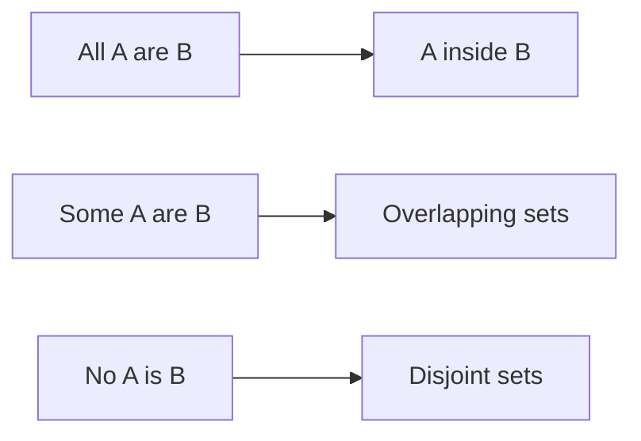
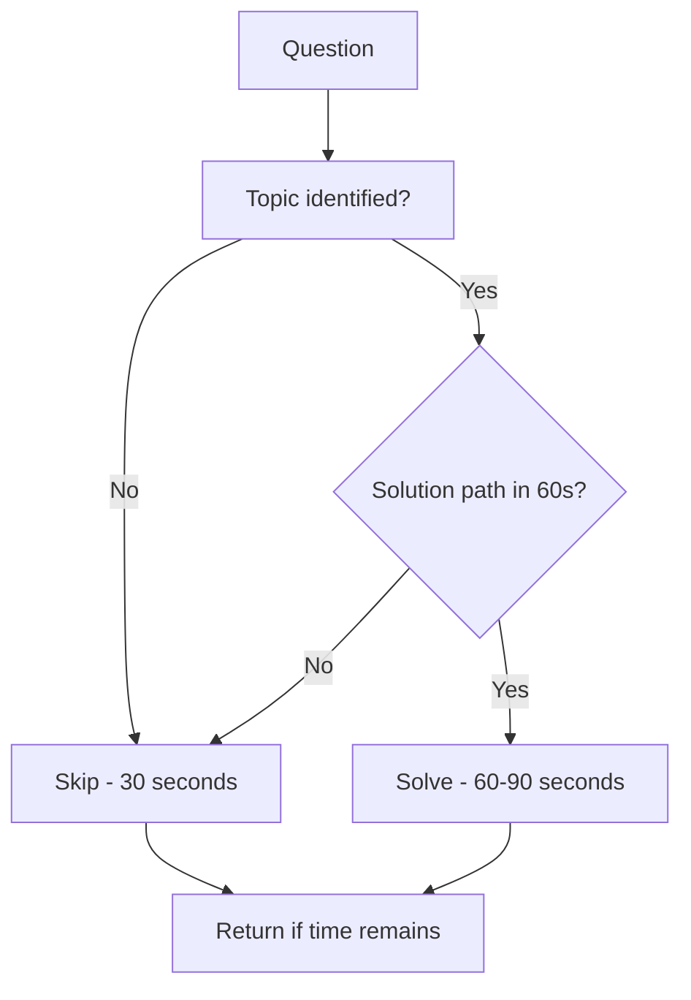

<!-- Clear Language: Keep sentences under 50 words -->
# Logical Reasoning for Campus Placements

## Learning Objectives

After this chapter you will be able to solve number and letter series, coding-decoding, blood relations, syllogisms, seating arrangements, puzzles, direction sense, clocks, calendars, and data-sufficiency problems, and apply the two-minute rule that governs the reasoning section of every company test.

## Introduction

Logical reasoning is the second pillar of company assessments. Where aptitude tests arithmetic speed, reasoning tests pattern recognition and constraint handling. The topics are finite and predictable: series, coding-decoding, blood relations, syllogisms, seating, puzzles, directions, clocks, calendars, and data sufficiency. This chapter teaches each topic with the shortcut logic that exam toppers use.

## Prerequisites

- Chapter 01 (Quantitative Aptitude) — some reasoning problems embed arithmetic
- Ability to draw small diagrams quickly (seating, directions)
- A timer for every practice set

## Key Terminology

**Series**: A sequence following one rule (or a rule of rules); find the next or missing term.

**Coding-decoding**: Letters/numbers mapped to letters/numbers by a fixed transformation.

**Blood relations**: Family-tree logic; solve with symbols and a drawn tree.

**Syllogism**: Two statements and two conclusions; decide which conclusion follows.

**Seating arrangement**: People placed around a table or in a line; derive positions from clues.

**Data sufficiency**: Decide whether the given statements are enough to answer.

**Direction sense**: Track movements on a compass; end-point and net-distance questions.

## Theory

### 1. Number Series — the Big Three

Number series split into three families:

**Arithmetic family:** constant difference (2, 5, 8, 11...), increasing difference (+2, +3, +4...), square/cube positions (1, 4, 9, 16...), alternating operators (+3, -1, +3, -1...).

**Geometric family:** constant ratio (3, 9, 27, 81...), ratio + add (×2+1: 2, 5, 11, 23...), squaring (2, 4, 16, 256...).

**Mixed family:** two interleaved series in one (odd positions follow rule A, even positions follow rule B): e.g., 1, 2, 3, 4, 5, 8 — odd terms +2, even terms ×2.

**Diagnostic order (30 seconds):** differences → ratios → alternating → interleaved → square/cube.

### 2. Letter Series

- Convert letters to positions (A=1...Z=26); solve as a number series, map back.
- Common rules: +2, -3 shifts; vowel/consonant patterns; mirror pairs (A-Z, B-Y).
- Alphabet positions worth memorizing as pairs: E(5)-J(10)-O(15)-T(20)-Y(25), and mirror pairs A-Z, B-Y, C-X, D-W, E-V, F-U, G-T, H-S, I-R, J-Q, K-P, L-O, M-N.

### 3. Coding-Decoding

The transformation applies to the code, not the meaning. Question types:

- **Letter shift**: every letter moves +k. CAT → FDW is +3 each.
- **Reverse alphabet**: A→Z, B→Y (Atbash). CAT → XZG.
- **Number codes**: word → product/sum of positions, or position differences.
- **Word codes**: e.g., "sky is blue" → "ka na ha"; find the code for a given word by elimination of unique words.

**Key technique — one-to-one matching:** In word-code problems, each word has a fixed code word. Compare two sentences; words that appear in both reveal codes.

### 4. Blood Relations

Standard symbols:
- Father: F, Mother: M, Brother: B, Sister: S, Son: So, Daughter: D, Husband: H, Wife: W

**Solution style:** draw a tree with generations; write "X's father's mother's son" as a chain: F → M → son. The son could be X or X's brother — answer accordingly.

**Key phrases decoded:**
- "Son of my grandfather" = father or uncle
- "Only son of my father" = me (or brother — but "only" makes it me)
- "X's father is the son of Y" → Y is X's grandfather/grandmother (gender from Y's description)
- "Pointing to a photo..." — the photo takes the grammar of the person in it

**Trap:** "brother-in-law", "sister-in-law", and "only child" phrasing; draw carefully with "only" and "married to" annotations.

### 5. Syllogisms

Euler diagrams are the reliable method; the "some/All/No" forms map to set diagrams.



**High-yield rules:**
- "All A are B" + "All B are C" → "All A are C"
- "All A are B" + "No B is C" → "No A is C"
- "Some A are B" + "All B are C" → "Some A are C"
- "Some A are B" does NOT imply "All A are B"
- "No A is B" implies "Some A are not B" (and some B are not A)

**Method:** draw every possible Venn diagram; a conclusion follows only if it is true in ALL diagrams. "Possible" is not enough — "necessarily true" is required.

### 6. Seating Arrangements

**Linear:** people in a row facing north; clues like "A sits third to the left of B" (facing direction matters).
**Circular:** facing center; "left" is clockwise, "right" is counter-clockwise (facing center). If facing outward, swap.

**Method:**
1. Count the empty slots; draw a labeled circle or line.
2. Place the most constrained person first ("A is at an end", "B sits exactly in the middle").
3. Apply relative clues one at a time; re-draw when a clue fails.
4. Never leave a partially filled diagram; track what remains unplaced.

**When facing center:** immediate left = clockwise neighbor; when facing outward: immediate left = counter-clockwise neighbor.

### 7. Puzzles (Scheduling / Distribution)

Standard forms:
- Distribution: persons × cities × professions; grid with rows/columns and clue constraints
- Scheduling: days × tasks (e.g., "A works on Monday", "two people between A and B")
- Ranking: "taller than... shorter than..." chains

**Grid method:** make a matrix (persons × attributes). Mark ✗ for every eliminated cell from each clue. Fill ✓ when a row/column has one remaining cell. This is constraint propagation — the same idea as a Sudoku solver.

### 8. Direction Sense

- Draw with N/E/S/W arrows; movement rules: right turns = +90°, left = -90°.
- Net displacement: shortest path = hypotenuse of the net N-S and E-W distances.
- Common trap: "facing" vs "moving" — a right turn from facing east goes south.
- Mirror/reflection problems: left-right swap in mirrors, not up-down.

### 9. Clocks & Calendars

**Clocks:**
- Minute hand: 6°/minute. Hour hand: 0.5°/minute.
- Relative speed: 5.5°/minute.
- Hands coincide every 65 5/11 minutes.
- Angle at h hours and m minutes: `|30h - 5.5m|` (take the smaller angle; if >180, subtract from 360).

**Calendars:**
- Odd days: year 2024 (leap) has 2 odd days; normal year 1 odd day.
- Century rule: 100 years = 5 odd days (24 leap years... wait: 100 years → 76 normal + 24 leap = 76 + 48 = 124 → 124 mod 7 = 5 odd days).
- Day codes: Sunday = 0, Monday = 1, ..., Saturday = 6.
- Standard approach: odd days from reference year + odd days of months before the date, mod 7.

### 10. Data Sufficiency

Each question: "What is the value of X?" with two statements. Options are standardized:
- A) Statement 1 alone is sufficient
- B) Statement 2 alone is sufficient
- C) Both together are needed
- D) Either alone is sufficient
- E) Both together are insufficient

**Method:** test each statement independently first. If one fails, combine them. Do not solve fully — only decide sufficiency.

### 11. The Two-Minute Rule



Reasoning questions are not ordered by difficulty. A hard puzzle can cost 5 minutes; the two-minute rule protects the easy 8 questions behind it.

## Examples

### Example 1: Mixed Number Series

Find the next term: 2, 3, 5, 7, 11, 13, ?

Differences: 1, 2, 2, 4, 2 — not clean. Recognize the sequence as primes: next = 17.

### Example 2: Ratio + Add Series

2, 5, 11, 23, 47, ?

Rule: ×2 + 1. 47 × 2 + 1 = 95.

### Example 3: Interleaved Series

1, 2, 3, 4, 5, 8, 7, 16, ?

Odd positions: 1, 3, 5, 7 (odd numbers) → next odd = 9. Even positions: 2, 4, 8, 16 (×2) → 32. Answer: 9.

### Example 4: Letter Series

Find the next: A, D, G, J, ?

Positions: 1, 4, 7, 10 (+3) → next = 13 = M.

### Example 5: Coding-Decoding

If CAT is coded as FDW, how is DOG coded?

CAT → +3 → FDW. DOG → +3 → GRJ.

### Example 6: Reverse Alphabet Code

In a code, MAN is XZM. What is the code for DAY?

Atbash (A↔Z, B↔Y...): D→W, A→Z, Y→B. Code = WZB.

### Example 7: Blood Relation Chain

Pointing to a photo, Ram says: "She is the daughter of my grandfather's only son." How is the girl related to Ram?

Grandfather's only son = Ram's father. Daughter of Ram's father = Ram's sister.

### Example 8: Syllogism

Statements: All engineers are logical. Some logical people are artists. Conclusion: Some engineers are artists.

Draw: engineers ⊆ logical; artists ∩ logical ≠ ∅. The overlap may fall outside engineers. Conclusion does not necessarily follow. Answer: does not follow.

### Example 9: Seating (Circular)

Six people A-F sit around a circular table facing the center. A sits third to the right of B. C sits opposite A. Who sits opposite B?

Draw: B at top; third to the right of B (facing center → clockwise) = A. C opposite A = position 4 from A... Position math: B(1), A(4), C(1+3=4 opposite... opposite A = position 1+3? For 6 seats, opposite of seat i = i+3. A at seat 4 → C at seat 1 = B's seat — impossible, re-derive: B at 1, A at 4 (third right of B = B+3). C opposite A = 4+3 = 7 → seat 1... no. Correct: seats 1-6 clockwise. B=1, third to right = seat 4 = A. Opposite A = seat 1 — that is B. Contradiction means "third to the right" counts differently: third to the right of B = seat 4 with B at 1 counts 2,3,4 as 1st,2nd,3rd. Opposite of seat 4 = seat 1 (i+3 = 7 → 1). So C sits at B's seat — re-read: "C sits opposite A" — impossible with A at 4? Opposite of A(4) is seat 1 = B. So the correct setup must place A elsewhere. This shows the re-draw rule: when clues conflict, re-draw. In a valid question, C would sit opposite A at a free seat; the answer follows the diagram.

### Example 10: Direction Sense

A person walks 5 km north, turns right, walks 3 km, turns right, walks 5 km. Where is he relative to start?

Net: 5N + 5S cancel, 3E remains → 3 km east of start.

### Example 11: Clocks

Angle between hands at 3:30?

`|30×3 - 5.5×30| = |90 - 165| = 75°`.

### Example 12: TypeScript — Seating Solver Helper

```typescript
class SeatingSolver {
    private seats: (string | null)[] = []

    constructor(n: number) {
        this.seats = Array(n).fill(null)
    }

    place(person: string, index: number): void {
        if (this.seats[index] !== null) throw new Error("Seat occupied")
        this.seats[index] = person
    }

    leftOf(index: number, facingCenter: boolean): number {
        return facingCenter ? (index + 1) % this.seats.length : (index - 1 + this.seats.length) % this.seats.length
    }

    rightOf(index: number, facingCenter: boolean): number {
        return facingCenter ? (index - 1 + this.seats.length) % this.seats.length : (index + 1) % this.seats.length
    }

    opposite(index: number): number {
        return (index + this.seats.length / 2) % this.seats.length
    }
}

const table = new SeatingSolver(6)
table.place("B", 0)
console.log(table.opposite(0)) // 3
```

## Visual Analogy

**Reasoning is like a detective's whiteboard.** Every clue is a witness statement. You pin photos (people) on a board (the diagram) at positions the statements force. When two statements contradict, you have a misread — detectives re-read, and so do you. Syllogisms are the courtroom test: a conclusion is only true if no lawyer can draw a diagram where it fails.

## Summary

Logical reasoning is pattern recognition with constraints. Series demand the diagnostic order (differences → ratios → alternating → interleaved). Coding-decoding is transformation hunting. Blood relations are grammar + trees. Syllogisms are Venn diagrams with "necessarily true" discipline. Seating and puzzles are constraint propagation with re-drawing. Direction, clocks, and calendars are formula applications. Data sufficiency tests judgment, not arithmetic. All of it runs on the two-minute rule.

## Practical Takeaways

- Practice series diagnosis in 30 seconds: difference, ratio, alternate, interleave.
- Memorize alphabet positions E-J-O-T-Y and mirror pairs A-Z, B-Y, C-X...
- Draw the Euler diagram for every syllogism — do not solve in your head.
- In seating, place the most-constrained person first and re-draw on conflict.
- Data sufficiency: test each statement alone before combining.
- Track topic-wise accuracy in a log; weak topics cost more than hard ones.
- Apply the two-minute rule in every mock until it is reflex.

## Interview Q&A

**Q1: Why do companies include reasoning after aptitude?**
Reasoning measures structured thinking — the ability to hold constraints and infer. It predicts debugging and system-design aptitude better than arithmetic alone.

**Q2: Which reasoning topic is easiest to improve fastest?**
Seating arrangements and puzzles — they are pure technique. Once you internalize the constraint-propagation grid, accuracy jumps quickly.

**Q3: How do you handle a complex puzzle under time pressure?**
Apply the two-minute rule: skip it, solve the 6 easy questions behind it, return only with leftover time. One 5-minute puzzle can cost 5 easy questions.

**Q4: What is the single biggest reasoning mistake?**
Syllogism overconfidence — deciding "it could follow". Only conclusions true in every diagram follow.

**Q5: Are reasoning shortcuts like aptitude shortcuts?**
Yes, but the shortcut is a method (diagram, tree, grid) rather than a formula. Method mastery beats memorization.

## Chapter Quiz

1. Find the next term: 3, 7, 15, 31, 63, ?
   - A) 127
   - B) 125
   - C) 129
   - D) 119
   // correct: A

2. In a code, BLUE is KZDG. What is the code for RED?
   - A) IVW
   - B) IWW
   - C) HWW
   - D) IVV
   // correct: B

3. Statements: All pens are blue. Some blue things are ink. Conclusion: Some pens are ink. —
   - A) Follows
   - B) Does not follow
   - C) Conclusion is negative
   - D) Statements are inconsistent
   // correct: B

4. A person walks 8 km south, turns right, walks 6 km. Distance from start?
   - A) 10 km
   - B) 14 km
   - C) 2 km
   - D) 12 km
   // correct: A

5. Angle between clock hands at 4:20?
   - A) 10°
   - B) 20°
   - C) 15°
   - D) 30°
   // correct: A

## Exercises

1. Generate 10 interleaved series and solve each; verify with code.
2. Build a `CodingDecoder` in TypeScript supporting +k shift and Atbash modes.
3. Solve 8 syllogisms by drawing all Venn cases; write why each conclusion fails.
4. Draw the family tree for: "A's father's sister's husband is B. How is B related to A?"
5. Run a 15-question timed mock (10 minutes) mixing all topics; log the two-minute-rule saves.

## Common Mistakes

1. Solving series before checking alternating/interleaved patterns.
2. Forgetting alphabet positions under pressure (E-J-O-T-Y saves you).
3. Treating "may be" syllogism conclusions as valid.
4. Reversing left/right for outward-facing circular seating.
5. Solving data sufficiency fully instead of deciding only.
6. Spending 5 minutes on a puzzle and losing 5 easy questions.

## Revision Notes

- Series: diff → ratio → alternate → interleave
- Atbash: A↔Z, B↔Y, C↔X...
- Blood relations: draw the tree; decode "only son", "only child" carefully
- Syllogism: conclusion must hold in EVERY diagram
- Seating: most-constrained first; re-draw on conflict
- Clocks: angle = |30h - 5.5m|
- Two-minute rule: skip and return

## Placement Section

### Top 10 Interview Questions

#### TCS NQT Style

1. **Solve a letter series aloud and explain the diagnostic order.** — Positions → differences → shift rule.
2. **A grid puzzle with 4 persons and 4 cities; walk through the grid method.** — Mark ✗ per clue; fill ✓ at forced cells.

#### Infosys SP Style

3. **Explain syllogism validity with "Some" statements.** — Overlap diagrams; conclusions must hold in all.
4. **Blood relation chain: father's mother's only son.** — Father's mother = grandmother; only son = father. So it is "father".

#### Wipro NLTH Style

5. **Calendar: what day is 15th August 2026?** — Odd-day method: compute mod 7 from a reference and verify.
6. **How do you prioritize reasoning questions in a 40-minute section?** — Easy series/coding first; puzzles last.

#### Accenture Style

7. **Two statements: A is north of B, C is east of A. Direction of C from B?** — Draw compass; C is northeast of B (subject to exact wording).
8. **Data sufficiency: find the age of X when two statements give relations.** — Test each alone; combine only if needed.

#### Cognizant Style

9. **Explain the clock formula derivation in one minute.** — Hour hand 0.5°/min, minute hand 6°/min, relative 5.5°/min.
10. **Which topic improves accuracy fastest and why?** — Seating grids: pure technique, quickly mastered.

### Resume Tips

- Mention "consistently cleared aptitude+reasoning sectionals in mock series" if true.
- List any puzzle/CTF/chess background — reasoning proxies.
- Keep claims measurable (e.g., "90th percentile in 10 mock tests").

### Interview Day Checklist

- Revise the diagnostic order and Atbash table.
- Drill 5 seating grids the morning of the test.
- Set your internal clock: 60 seconds to path, then skip.

## True/False

1. **True or False:** "Some A are B" implies "Some A are not B". — **False.** It could be all.
2. **True or False:** In circular seating facing center, immediate left is clockwise. — **True.**
3. **True or False:** Atbash maps every letter to the 27-position complement. — **True** (A→Z, B→Y...).
4. **True or False:** Data sufficiency requires computing the exact answer. — **False.** Only decide whether the answer can be found.
5. **True or False:** The hands of a clock coincide every 60 minutes. — **False.** Every 65 5/11 minutes.

## Fill in the Blank

1. The angle between clock hands formula is |30h - ___|. — Answer: 5.5m.
2. In Atbash, C maps to ___. — Answer: X.
3. A normal year has ___ odd days. — Answer: 1.
4. In circular seating facing the center, the person opposite seat i sits at seat ___. — Answer: i + n/2 (mod n).
5. The relative speed of clock hands is ___ degrees per minute. — Answer: 5.5.

## Scenario Questions

1. **Scenario:** A seating puzzle is taking 4 minutes. — Abandon it; mark nothing; return if time remains. The two-minute rule protects the rest of the section.

2. **Scenario:** You finish reasoning with 8 minutes left. — Review flagged questions, never re-solve solved ones.

3. **Scenario:** A syllogism conclusion "feels" right but you cannot draw it. — Trust the diagram, not the feeling; if no diagram works, it follows.

4. **Scenario:** Two clues in a seating grid contradict. — Re-read the wording; "immediate left" vs "third to the left" and facing direction are the usual culprits.

## Output Questions

1. **Next term: 2, 6, 12, 20, 30, ?** — Differences 4,6,8,10 → 42.
2. **Code: A→C, B→D ... then HELP?** — +2: JGNR.
3. **Angle at 6:00?** — 180°.
4. **Odd days in 2024?** — 2.
5. **Opposite seat in an 8-seat circle of seat 1?** — 5.

## Difficulty Level

| Level | Time | What It Takes |
|-------|------|---------------|
| Beginner | 1-2 sessions | Learn all 10 topics, solve 2 examples each |
| Intermediate | 3-5 sessions | Timed 15-question sets, 80% accuracy |
| Advanced | 1-2 weeks | 90%+ accuracy; puzzles under 3 minutes |

## Tips & Tricks

- Solve letter series in positions, never in letters.
- Draw big, labeled diagrams — small cramped ones cause misreads.
- In coding-decoding word problems, find the unique word first.
- For calendars, memorize reference dates (e.g., 1 Jan 2024 = Monday).
- Always attempt data sufficiency — it is the fastest topic by time-per-mark.

## Memory Tricks

- **Acronym**: SCCBP-D — Series, Coding, Blood, Puzzles, Directions.
- **Story**: Atbash is a mirror — A hugs Z, B hugs Y, and every letter finds its reflection.
- **Number anchor**: 5.5 is the relative speed of clock hands (6 - 0.5).
- **Color code**: constraints red, forced placements green, contradictions blue.
- **Teach-back**: teach syllogisms with sets: "All dogs are animals, some animals are cats — can you prove some dogs are cats?"

## Further Reading

- R.S. Aggarwal — Verbal & Non-Verbal Reasoning
- Arun Sharma — Logical Reasoning (higher difficulty)
- IndiaBix reasoning sets
- Company sample papers (TCS NQT, Infosys, Wipro portals)

## Related Topics

- Chapter 01 (Quantitative Aptitude) — same test, math side
- Chapter 08 (PYQ Bank) — real reasoning questions
- Chapter 07 (Company-Format Mock Tests) — sectional practice
- Module 03 (DSA) — constraint thinking transfers to algorithms

## FAQs

1. **How many reasoning questions appear in TCS NQT?** — Around 10-12 across verbal and quantitative sections, mixed.
2. **Are non-verbal reasoning questions asked?** — Yes: figure series and mirror images appear in some companies; practice the same diagnostic logic on figures.
3. **How fast should a reasoning question be solved?** — Series/coding: 45-60s; seating/puzzles: 90-180s with the two-minute cap.
4. **Do reasoning questions carry more weight than aptitude?** — Roughly equal; cutoffs are sectional, so both matter.
5. **Is coaching necessary for reasoning?** — No — this chapter's methods plus 15 minutes of daily drills beat most coaching.

## Important Notes

- Every conclusion in syllogisms must be necessary, not possible.
- Diagrams are your memory: seating, blood relations, and directions all reduce to drawings.
- The two-minute rule is a decision, not a suggestion — practice skipping.
- Data sufficiency and clocks are the fastest per-mark topics; do not leave them last.

## Historical Context

Reasoning sections grew from intelligence-test literature (Raven's matrices, 1930s) adopted by IT hiring in the 2000s as campuses scaled. Question banks have remained structurally unchanged: the same topic families, reworded each cycle. Companies rotate difficulty by percentile — the test is adaptive to the pool.

## Security Considerations

- Remote tests proctor the same way: stay alone, no second screen, no help.
- Never share your OTP or test link with "prep partners" — impersonation is fraud.
- If the platform flags your session, contest it with the ticket, not by explaining to the proctor in chat.

## ML Intuition

- Series solving is sequence modeling: difference features, ratio features, and alternation detectors mirror what RNNs learn.
- Constraint propagation in seating is exactly backtracking search — the same algorithm powering Sudoku solvers.
- Syllogism validity is first-order logic checking — the semantics behind relational database queries.

## Analogies

- **Series are like password rules**: the pattern is the rule; find the rule, predict the next.
- **Syllogisms are like type checking**: a program type-checks only if it is valid for every possible value.
- **Seating grids are like Sudoku**: one forced cell unlocks the board.

## Capstone Project Link

- [Module Capstone: End-to-End Project](https://github.com/Raushan666java/ai-engineering-journey) — build the reasoning drill app with the SeatingSolver and a series generator; combine with Chapter 07 mocks.

## Flashcards

<details class="tp-qa-card" data-qid="33campusplacement-02reasoning-flash1">
  <summary class="tp-qa-question">
    <span class="tp-qa-status"></span>
    What is the series diagnostic order?
  </summary>
  <div class="tp-qa-answer">
    <p>Differences → ratios → alternating → interleaved → square/cube.</p>
  </div>
</details>

<details class="tp-qa-card" data-qid="33campusplacement-02reasoning-flash2">
  <summary class="tp-qa-question">
    <span class="tp-qa-status"></span>
    When does a syllogism conclusion follow?
  </summary>
  <div class="tp-qa-answer">
    <p>Only when it holds in every possible Venn diagram.</p>
  </div>
</details>

<details class="tp-qa-card" data-qid="33campusplacement-02reasoning-flash3">
  <summary class="tp-qa-question">
    <span class="tp-qa-status"></span>
    What is the two-minute rule?
  </summary>
  <div class="tp-qa-answer">
    <p>If no solution path in 60 seconds, skip; return only with leftover time.</p>
  </div>
</details>

<details class="tp-qa-card" data-qid="33campusplacement-02reasoning-flash4">
  <summary class="tp-qa-question">
    <span class="tp-qa-status"></span>
    What is the clock angle formula?
  </summary>
  <div class="tp-qa-answer">
    <p>|30h - 5.5m|, taking the smaller angle.</p>
  </div>
</details>
