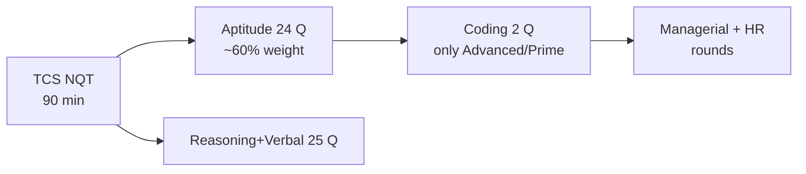
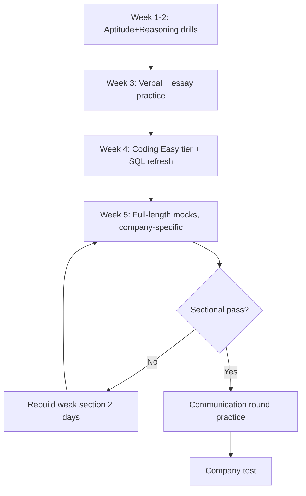

<!-- Clear Language: Keep sentences under 50 words -->
# Company Test Patterns (TCS, Infosys, Wipro, Capgemini, Accenture, Cognizant)

## Learning Objectives

After this chapter you will be able to describe the exact selection process of TCS (NQT), Infosys (SP), Wipro (NLTH), Capgemini, Accenture, and Cognizant, plan preparation by company target, manage sectional timers, and avoid the process mistakes that fail candidates before any interview.

## Introduction

Every service company runs a different test. TCS NQT has 90-minute sections with typing tasks; Infosys SP uses a single ~100-minute test with sectional cutoffs; Wipro NLTH includes a written communication round; Capgemini, Accenture, and Cognizant add game-based and cognitive assessments. Studying the wrong format wastes weeks. This chapter maps each process and the strategy per company.

## Prerequisites

- Chapters 01-03 of this module (aptitude, reasoning, verbal)
- Module 03 (DSA) and 02 (SQL) for the coding sections
- Module 30 (Business Skills) for communication rounds

## Key Terminology

**NQT**: National Qualifier Test — TCS's flagship assessment, valid across TCS campuses and partner companies.

**SP / SIP**: Infosys Springboard (SP) and System Integration Prism (SIP) — Infosys's test names for specialist and generalist roles.

**NLTH**: National Learning & Training Hub — Wipro's campus test brand.

**Sectional cutoff**: Minimum score required per section; failing one section fails the test even with high totals.

**Game-based assessment**: Behavioral questions disguised as games (memory, reaction, risk) scored by AI.

**Process round**: A screening step (e.g., voice or written communication) that is pass/fail without scoring.

## Theory

### 1. TCS — NQT Process



**Structure (NQT standard):**
- **Foundation + Advanced in one attempt**: candidates register for Foundation or Advanced; Advanced adds 2 coding questions (Python/Java/C) solved in a web IDE with compiler.
- **Sections**: Aptitude (percentages, profit-loss, TSD, probability — 24 Qs), Reasoning + Verbal (25 Qs), Typing test (speed gate, 30 WPM+), and Coding (2 Qs) for Advanced.
- **Timing**: ~90 minutes total with sectional timers; some modules are per-question timed.
- **Cutoffs**: section-wise percentile; TCS Digital/Prime roles need the Advanced coding score.

**Strategy:**
- Coding questions are Easy-Medium (arrays, strings, hashing) — 21-16 DSA bank covers them.
- The typing test is a real gate: practice 30+ WPM accuracy for a week.
- Aptitude weight is highest: Chapters 01-03 drills pay off first.

### 2. Infosys — SP Process

**Structure:**
- **Aptitude + Reasoning + Verbal** in one online test (~100 minutes, sectional timers).
- **Coding**: 1-3 Easy-Medium problems for specialist roles (Infosys SP/DSE).
- **Communication**: sometimes a voice round (Prowise) that is pass/fail.
- **Interview**: technical (DSA, projects, SQL) then HR.

**Strategy:**
- Infosys values accuracy under negative marking more than speed.
- Coding is easier than TCS Advanced — DSA Easy tier is enough.
- Resume projects matter: expect one project deep-dive in the technical round.

### 3. Wipro — NLTH Process

**Structure:**
- **Aptitude + Logical + Verbal** (~45-60 minutes).
- **Written communication (Essay)**: a 250-300 word essay on a given topic — scored for grammar and structure, not opinion.
- **Coding (1-2 questions)** for technical roles.
- **Technical interview** (project-based, DSA basics) + **HR**.
- **English/voice round** in some tracks.

**Strategy:**
- The essay decides more than candidates think: practice the 5-paragraph structure (intro, 3 points, conclusion) with 5 practice topics.
- NLTH coding is Easy; focus on arrays, strings, and edge cases.

### 4. Capgemini — Exceller

**Structure:**
- **Aptitude + Reasoning + Verbal** (~70 minutes).
- **Game-based assessment**: attention, memory, reaction games scored by AI.
- **Pseudo-coding**: choose the correct output of short code snippets (no writing) — 20 questions.
- **Communication round**: video interview with AI (speak on a topic, read sentences).

**Strategy:**
- Pseudo-code questions test dry-run skills: practice trace-tables on 10 snippets.
- The video round scores pronunciation and fluency — practice reading aloud daily.
- Games have no preparation; get enough sleep — reaction scores collapse with fatigue.

### 5. Accenture

**Structure:**
- **Aptitude + Reasoning + Verbal** (cognitive assessment, ~90 minutes).
- **Coding**: 2 questions, Easy-Medium, for tech roles.
- **Communication**: AI video interview.
- **Technical + HR interviews** after the test.

**Strategy:**
- Accenture's cognitive section includes puzzles — Chapter 02 is the direct fit.
- Coding window is limited; use the two-minute rule and submit partial solutions (partial credits exist).
- Video round: answer structure (point, example, point) beats long rambling.

### 6. Cognizant — GenC

**Structure:**
- **Aptitude + Reasoning + Verbal** (~90 minutes).
- **Coding (1-2 questions)** for GenC Next/technical tracks.
- **Interview**: technical (projects, SQL, basics) + HR.

**Strategy:**
- SQL is commonly probed in GenC technical rounds — revise Module 02 joins and window functions.
- GenC Next coding is Easy-Medium; GenC Elevate/Prime is harder — target your track.

### 7. The Company Comparison Matrix

| Company | Test | Sections | Coding | Cutoffs | Distinctive round |
|---------|------|----------|--------|---------|-------------------|
| TCS NQT | 90 min | Apt, Reason, Verbal, Typing | 2 Q (Advanced) | Sectional % | Typing gate |
| Infosys SP | ~100 min | Apt, Reason, Verbal | 1-3 Q | Sectional | Voice round |
| Wipro NLTH | ~60 min | Apt, Reason, Verbal | 1-2 Q | Sectional | Essay + English |
| Capgemini Exceller | ~70 min | Apt, Reason, Verbal | Pseudo-code 20 Q | Overall + AI | Games + video AI |
| Accenture | ~90 min | Apt, Reason, Verbal | 2 Q | Overall | AI video interview |
| Cognizant GenC | ~90 min | Apt, Reason, Verbal | 1-2 Q | Sectional | SQL depth |

### 8. Universal Preparation Sequence



### 9. Process Mistakes That Fail Candidates

1. **Ignoring sectional cutoffs**: high total, one failed section = reject.
2. **Skipping the typing/essay gates**: they are pass/fail, not scored, and eliminate first.
3. **No mock with the exact platform**: first-time platform UI costs 5-10 minutes.
4. **Ignoring negative marking rules**: blind guessing can sink an otherwise passing score.
5. **Weak ID/proctor issues**: system flags multiple logins, background apps, or phone use.
6. **Not reading company-specific instructions**: e.g., TCS allows partial coding credit; Accenture penalizes wrong MCQ answers.

## Examples

### Example 1: TCS NQT Week Plan

- Mon-Wed: 30 aptitude questions + 10 reasoning (Chapters 01-02)
- Thu: 20 verbal + 1 essay (Chapter 03)
- Fri: 5 Easy DSA problems from Module 03
- Sat: 1 full NQT mock (Chapter 07) + typing drill
- Sun: error-log review + weak topic re-drill

### Example 2: Capgemini Pseudo-Code Dry Run

Trace: `for (i=0; i<5; i++) if (i%2==0) sum += i;` → i=0,2,4 → sum = 6. Dry-run with a table: i, i%2, sum.

### Example 3: Wipro Essay Structure

Topic: "Impact of AI on Jobs". Structure: intro (thesis), point 1 (automation of routine tasks), point 2 (new roles), point 3 (reskilling), conclusion (balanced view). 250 words, 5 paragraphs.

### Example 4: TypeScript — Sectional Score Tracker

```typescript
interface SectionScore {
    name: string
    obtained: number
    max: number
    cutoff: number
}

class SectionalTracker {
    private sections: SectionScore[] = []

    add(s: SectionScore): void {
        this.sections.push(s)
    }

    status(): { passed: boolean; failures: string[]; total: number } {
        const failures = this.sections.filter((s) => s.obtained / s.max < s.cutoff)
        return {
            passed: failures.length === 0,
            failures: failures.map((s) => s.name),
            total: this.sections.reduce((sum, s) => sum + s.obtained, 0),
        }
    }

    recommend(): string[] {
        return this.sections
            .filter((s) => s.obtained / s.max < s.cutoff)
            .map((s) => `Re-drill ${s.name}: needs ${Math.ceil(s.max * s.cutoff - s.obtained)} more marks`)
    }
}

const tracker = new SectionalTracker()
tracker.add({ name: "Aptitude", obtained: 14, max: 24, cutoff: 0.6 })
tracker.add({ name: "Reasoning", obtained: 10, max: 25, cutoff: 0.6 })
console.log(tracker.recommend())
```

### Example 5: Mock Calibration

If a TCS mock gives 18/24 aptitude, 15/25 reasoning, 12/20 verbal: aptitude 75% (pass), reasoning 60% (pass), verbal 60% (pass). Target next mock: +2 verbal. The tracker turns vague "practice more" into exact re-drill marks.

## Visual Analogy

**Company tests are like five restaurants with different menus.** The ingredients (aptitude, reasoning, verbal, coding) repeat everywhere, but the plating differs: TCS adds a typing appetizer, Wipro an essay dessert, Capgemini game-shaped cutlery, Accenture a video chef's table. Studying one restaurant's menu and walking into another costs you the course. The matrix in this chapter is the menu card — memorize which company orders what.

## Summary

Six companies, five similar-but-different processes. TCS NQT: 90 minutes, typing gate, Advanced coding for Prime/Digital. Infosys SP: sectional accuracy, voice round, project deep-dives. Wipro NLTH: essay and English gates plus Easy coding. Capgemini: pseudo-code dry runs, AI games, video communication. Accenture: puzzles, 2 coding questions, AI video. Cognizant: sectional cutoffs with SQL depth. Universal keys: sectional pass first, exact-platform mocks, gates (typing/essay/voice) practiced as seriously as aptitude, and company-specific rules read before the test.

## Practical Takeaways

- Read your target company's official sample paper before preparing anything.
- Practice every gate: typing (30+ WPM), essay (5-paragraph), voice (read aloud daily).
- Track sectional scores with the tracker; fix failing sections with exact marks.
- Dry-run 10 pseudo-code snippets for Capgemini-style questions.
- Refresh SQL joins and window functions for Cognizant/Tech rounds.
- Take 3+ full mocks on the exact platform before the real test.
- Read the instruction page carefully — partial credits, negative marking, and timers differ per company.

## Interview Q&A

**Q1: Should I prepare differently for TCS vs Capgemini?**
Yes. TCS needs coding (Advanced) and typing; Capgemini needs pseudo-code reading and video communication. Shared base: aptitude, reasoning, verbal (Chapters 01-03).

**Q2: What single mistake costs the most candidates?**
Ignoring gates: typing, essay, and voice rounds are pass/fail filters placed before scored sections. Candidates drill aptitude and fail the gate.

**Q3: How many mocks should I take before the real test?**
Three minimum, on the company's platform or an exact clone. Platform unfamiliarity alone costs 5-10 minutes in sectional tests.

**Q4: Are sectional cutoffs really enforced?**
Yes. TCS, Infosys, Wipro, and Cognizant publish or enforce sectional cutoffs; failing one section rejects the whole attempt.

**Q5: What is the highest-leverage prep per company?**
TCS: aptitude + typing. Infosys: accuracy + projects. Wipro: essay + English. Capgemini: pseudo-code + video. Accenture: puzzles + video. Cognizant: SQL + sectional balance.

## Chapter Quiz

1. Which company test includes a mandatory typing speed gate?
   - A) Infosys SP
   - B) TCS NQT
   - C) Wipro NLTH
   - D) Capgemini
   // correct: B

2. What is distinctive about Wipro NLTH?
   - A) Game-based assessment
   - B) Written essay on a given topic
   - C) 20 pseudo-code questions
   - D) Typing test
   // correct: B

3. Which test features pseudo-code questions instead of writing programs?
   - A) TCS NQT
   - B) Accenture
   - C) Capgemini Exceller
   - D) Cognizant GenC
   // correct: C

4. What does a sectional cutoff mean?
   - A) The total score must exceed a threshold
   - B) Each section needs a minimum score
   - C) Only one section is scored
   - D) Sections can trade marks
   // correct: B

5. Which round in Capgemini/Accenture is scored by AI on speech?
   - A) Essay
   - B) Video communication
   - C) Pseudo-code
   - D) Group discussion
   // correct: B

## Exercises

1. Write the selection process of your target company in 10 lines from official sources.
2. Build the SectionalTracker from Example 4 and simulate 3 mock results.
3. Write a 250-word essay on "Remote Work" using the 5-paragraph structure.
4. Dry-run 10 pseudo-code snippets from any question bank; write trace tables.
5. Take one company-format mock (Chapter 07) and log sectional outcomes.

## Common Mistakes

1. Preparing for one company and walking into another's format.
2. Ignoring pass/fail gates (typing, essay, voice).
3. Guessing under negative marking without elimination.
4. Not reading the instruction page (partial credits, timers).
5. Taking zero mocks on the actual platform.
6. Letting one failed section hide behind a good total.

## Revision Notes

- TCS: 90 min, typing gate, Advanced coding
- Infosys: sectional accuracy, voice, project depth
- Wipro: essay + English gates, Easy coding
- Capgemini: pseudo-code, games, AI video
- Accenture: puzzles, 2 coding Qs, AI video
- Cognizant: SQL depth, sectional cutoffs
- Universal: 3 exact-platform mocks, gates practice, instruction reading

## Placement Section

### Top 10 Interview Questions

#### TCS NQT Style

1. **Walk through your TCS preparation plan for 4 weeks.** — Week-plan structure from this chapter.
2. **How do you handle the typing gate?** — Daily 15-minute accuracy drills targeting 30+ WPM.

#### Infosys SP Style

3. **Why does Infosys run a voice round before interviews?** — Communication is job-critical for client-facing delivery; pass/fail filters cost little.
4. **How do you prepare for a project deep-dive?** — Rebuild the architecture, note trade-offs, prepare metrics.

#### Wipro NLTH Style

5. **Write the outline of your essay on AI ethics in 2 minutes.** — Thesis + 3 points + conclusion.

#### Capgemini Style

6. **What is pseudo-code testing and why does Capgemini use it?** — Tests code comprehension and dry-run skill without compilers.

#### Accenture Style

7. **How would you answer an AI video question about a failure?** — STAR: situation, task, action, result, lesson.

#### Cognizant Style

8. **Which SQL topics do you expect in the GenC technical round?** — Joins, window functions, aggregations, indexing.
9. **How do sectional cutoffs change test strategy?** — Balance prep; a failing section fails the test.
10. **Compare TCS and Capgemini test formats in 3 points.** — Timers, gates, coding style.

### Resume Tips

- Name your target track (e.g., "preparing for TCS Digital/Prime") only if you have the Advanced coding practice to back it.
- List mock-test scores with dates — consistency beats one-off claims.
- Keep bullets short and measurable (e.g., "95th percentile in 5 NQT-format mocks").

### Interview Day Checklist

- Re-read the company's official instruction page (partial credits, negative marking).
- Practice typing 10 minutes the morning of the test.
- Keep ID, stable internet, and a backup hotspot ready.
- Arrive 15 minutes early to the test link; never open the link early.

## True/False

1. **True or False:** TCS NQT allows cross-section time transfer. — **False.** Sectional timers.
2. **True or False:** Wipro's essay is scored for grammar and structure, not opinion. — **True.**
3. **True or False:** Capgemini pseudo-code questions require writing full programs. — **False.** Select the correct output.
4. **True or False:** Accenture gives partial credit for incomplete code. — **True** (in most tracks).
5. **True or False:** All six companies run HR interviews after technical rounds. — **True.**

## Fill in the Blank

1. TCS's flagship test is called ___. — Answer: NQT (National Qualifier Test).
2. Wipro's essay should be ___ words with 5 paragraphs. — Answer: 250-300.
3. Capgemini's AI-scored interview is a ___ round. — Answer: video communication.
4. The pass/fail speed gate in TCS is the ___ test. — Answer: typing.
5. Cognizant technical rounds commonly probe ___ depth. — Answer: SQL.

## Scenario Questions

1. **Scenario:** Your aptitude mock is 85% but verbal is 50%, and the cutoff is 60%. — Verbal is the failure: 3 days of Chapter 03 drills, retest, then continue.

2. **Scenario:** Capgemini's game round is tomorrow and you are sleep-deprived. — Sleep is the strategy: reaction/memory games collapse with fatigue; nothing else matters now.

3. **Scenario:** TCS typing gate: 25 WPM at day 5. — Daily 15-minute accuracy drills: slow down to eliminate errors, then speed up; 30 WPM is a week of practice.

4. **Scenario:** You open the test and the platform differs from your mocks. — Read the instruction page, note the timer layout, start with the easiest section to stabilize nerves.

## Output Questions

1. **What does NLTH stand for?** — National Learning & Training Hub.
2. **How many coding questions in TCS Advanced?** — 2.
3. **Approximate duration of Wipro NLTH aptitude block?** — 45-60 minutes.
4. **Which company includes 20 pseudo-code questions?** — Capgemini.
5. **Pass/fail gates across companies?** — Typing, essay, voice/video.

## Difficulty Level

| Level | Time | What It Takes |
|-------|------|---------------|
| Beginner | 1 session | Learn the 6-company matrix |
| Intermediate | 1-2 weeks | Chapters 01-03 + one company-format mock |
| Advanced | 3-4 weeks | 3+ platform mocks, all gates practiced, 85%+ sectionals |

## Tips & Tricks

- Bookmark the official sample papers; formats change, samples do not lie.
- Practice the essay and typing gates with the same seriousness as aptitude.
- Take mocks at the same time of day as the real test (chronotype matters).
- In Capgemini games, answer consistently — AI scores behavioral patterns, not perfection.
- Re-read instructions during the test's 5-minute practice window.

## Memory Tricks

- **Acronym**: TIWA — TCS typing, Infosys voice, Wipro essay, Accenture video.
- **Story**: The six companies are six floors of a mall: TCS sells typing, Wipro sells essays, Capgemini sells games — buy what each store sells.
- **Number anchor**: 90 minutes (TCS), 250 words (Wipro essay), 2 coding questions (most), 3 mocks (minimum).
- **Color code**: gates red, scored sections green, interviews blue.
- **Teach-back**: explain one company's process to a friend without notes.

## Further Reading

- Official sample papers: tcsnqt.com, Infosys Springboard, Wipro NLTH portal
- IndiaBix company test archives
- YouTube walkthroughs of the exact platform UI
- Your college placement cell's previous-year notices

## Related Topics

- Chapters 01-03 (aptitude, reasoning, verbal) — the shared content base
- Chapter 07 (Company-Format Mock Tests) — full simulation
- Chapter 08 (PYQ Bank) — real questions per company
- Module 21 (Interview Preparation) — technical and HR rounds after the test

## FAQs

1. **Do test patterns change yearly?** — Sections stay stable; timings and gates shift. Check the current sample paper.
2. **Can I appear for TCS without the typing test?** — No — it is part of the NQT flow.
3. **Are game-based assessments for real?** — Yes; AI scores attention, memory, and risk behavior.
4. **Do I need DSA-heavy prep for these coding rounds?** — No — Easy/Medium at most; Module 03 basics plus 21-16 bank suffice.
5. **What if I clear the test but fail the video round?** — Video/voice rounds are pass/fail gates; practice speaking structure (point-example-point).

## Important Notes

- Gates fail more candidates than aptitude does.
- Sectional cutoffs are real: balance, do not chase totals.
- Exact-platform mocks are non-negotiable.
- Read the instruction page during the practice window.
- Company formats change — verify against current official samples before your attempt.

## Historical Context

TCS introduced NQT in 2019 to replace campus-specific tests; Infosys's SP and Wipro's NLTH followed similar consolidation. AI-scored video rounds and game-based assessments spread after 2021 as proctoring and evaluation scaled remotely. The core (aptitude + reasoning + verbal) has been stable since the 1990s — the modern additions are gates, not replacements.

## Security Considerations

- Proctors flag phone use, second screens, and background apps — keep the environment clean.
- Never share test links or OTPs; impersonation is fraud under IT Act §66D.
- AI video rounds score eye contact with the camera — look at the lens, not the screen.

## ML Intuition

- Game-based assessments are behavioral ML features: reaction time, risk preference, memory span.
- AI video rounds use speech and prosody models — pronunciation and structure, not vocabulary depth.
- Adaptive sections (if any) resemble bandit algorithms: question difficulty adjusts to answers.

## Analogies

- **The test is a flight check-in**: gates (typing, essay, voice) are boarding passes; sections are baggage weight; interviews are the flight itself.
- **The company matrix is a menu**: order from the restaurant you are entering.
- **Sectional cutoffs are like course grading**: fail one subject, fail the semester.

## Capstone Project Link

- [Module Capstone: End-to-End Project](https://github.com/Raushan666java/ai-engineering-journey) — build the SectionalTracker app with all six company formats preloaded and mock scoring.

## Flashcards

<details class="tp-qa-card" data-qid="33campusplacement-04companypatterns-flash1">
  <summary class="tp-qa-question">
    <span class="tp-qa-status"></span>
    What are the distinctive gates of TCS, Wipro, Capgemini?
  </summary>
  <div class="tp-qa-answer">
    <p>TCS typing, Wipro essay, Capgemini games + AI video.</p>
  </div>
</details>

<details class="tp-qa-card" data-qid="33campusplacement-04companypatterns-flash2">
  <summary class="tp-qa-question">
    <span class="tp-qa-status"></span>
    What does a sectional cutoff mean in practice?
  </summary>
  <div class="tp-qa-answer">
    <p>Each section needs a minimum score; one failed section fails the attempt.</p>
  </div>
</details>

<details class="tp-qa-card" data-qid="33campusplacement-04companypatterns-flash3">
  <summary class="tp-qa-question">
    <span class="tp-qa-status"></span>
    How many coding questions appear in most company tests?
  </summary>
  <div class="tp-qa-answer">
    <p>1-2 Easy/Medium problems; Capgemini uses pseudo-code instead.</p>
  </div>
</details>

<details class="tp-qa-card" data-qid="33campusplacement-04companypatterns-flash4">
  <summary class="tp-qa-question">
    <span class="tp-qa-status"></span>
    What is the minimum mock count before a real test?
  </summary>
  <div class="tp-qa-answer">
    <p>Three, on the exact platform or a close clone.</p>
  </div>
</details>
