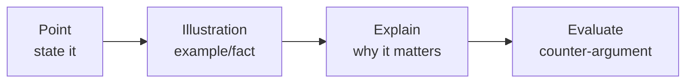

<!-- Clear Language: Keep sentences under 50 words -->
# Group Discussion & Extempore for Campus Placements

## Learning Objectives

After this chapter you will be able to lead and participate in group discussions using structured frameworks, score well on the four GD criteria (content, logic, communication, leadership), handle extempore topics with a 3-point structure, and avoid the disqualifying behaviors that fail candidates in 5 minutes.

## Introduction

Group discussion (GD) is a live filter between the online test and the interview. It is not a debate: the panel scores how you build on others, structure arguments, and manage the group. Extempore (a 1-2 minute speech on a random topic) tests the same skills alone. Both reward framework, not fluency. This chapter teaches the frameworks and the scoring model.

## Prerequisites

- Chapter 03 (Verbal Ability) — sentence-level clarity
- Chapter 04 (Company Test Patterns) — where GD fits in each process
- Daily news habit: 15 minutes of current affairs for content

## Key Terminology

**GD (Group Discussion)**: 6-10 candidates discuss a topic for 10-15 minutes while panels score participation.

**Extempore**: A 1-2 minute unprepared speech on a given topic.

**Initiation**: Opening the discussion — high risk, high reward.

**Consensus**: The discussion's conclusion; reaching it is scored, not mandatory.

**Interruption etiquette**: Entering the conversation politely ("May I add...") versus cutting people off.

**Framework**: A mental structure (e.g., P-I-E-E) that organizes your points instantly.

## Theory

### 1. The Scoring Model — What the Panel Marks

| Criterion | Weight | What it means in practice |
|-----------|--------|--------------------------|
| Content | 30% | Relevant, factual points; examples; current awareness |
| Logic & structure | 25% | Points follow a framework; cause-effect clarity |
| Communication | 20% | Clear, audible, structured sentences; no slang |
| Leadership & initiative | 15% | Initiation, summarization, bringing others in |
| Group behavior | 10% | Listening, not interrupting, building on others |

The panel scores contribution quality, not speaking volume. A candidate with 4 structured entries beats one with 12 interruptions.

### 2. The Seven GD Types

1. **Factual**: "Impact of AI on employment" — needs data and examples.
2. **Policy**: "Should India regulate social media?" — pros, cons, balance.
3. **Case study**: A business scenario with a decision to make.
4. **Abstract**: "Colour of emotions" — interpretation and definition.
5. **Controversial**: "Reservation in private sector" — both sides, maturity.
6. **Situation**: "You are the CEO; layoffs or pay cuts?" — decision + reasoning.
7. **Quotation**: "The only constant is change" — interpret, apply, conclude.

**Identification matters**: abstract topics need definition first; case studies need a decision structure (criteria → options → choice).

### 3. The P-I-E-E Framework (content generation)

Every point can be expanded:



**P-I-E-E example — "Impact of AI on jobs":**
- Point: AI automates routine tasks, not whole jobs.
- Illustration: data-entry and tele-calling roles shrinking; ML engineers growing.
- Explain: automation raises productivity; displaced workers need reskilling.
- Evaluate: but reskilling access is unequal — rural workers lack training.

P-I-E-E gives you 45-60 seconds of structured contribution from any single point.

### 4. Speaking Structure — the 3-Beat Entry

Never ramble. Use the 3-beat entry:

1. **Hook**: "I agree with Riya's point, and here is the evidence..." (build, don't repeat)
2. **Body**: 1 P-I-E-E unit
3. **Closure**: "So in conclusion, the key driver is X, not Y."

For **initiation**, the entry changes to:
1. Definition/framing: "The topic asks us to weigh X against Y."
2. First point with an example.
3. Invitation: "I would like to hear the group's view on this."

### 5. The 4-5-6 Extempore Method

For a 1-2 minute extempore, use 4 seconds of thought, 5 seconds of structure, 6 sentences:

1. State the topic interpretation in one sentence.
2. Point 1 with a tiny example.
3. Point 2 with another example.
4. Counter-perspective (maturity signal).
5. Balance or conclusion.
6. Close with a single strong sentence.

Total: ~60-75 seconds with pauses. The structure beats perfect fluency.

### 6. Leadership Moves (without being bossy)

- **Initiation**: safe when you can frame the topic; risky if unprepared.
- **Bringing others in**: "Riya, you worked in retail — what do you think?" (panel loves this)
- **Clarification**: "Before we debate, let us agree on the definition of X."
- **Time awareness**: "We have 4 minutes left; should we move to the conclusion?"
- **Summarization**: "To summarize: we agree on A and B, and differ on C."

Do NOT: appoint yourself moderator, talk for 3 minutes, or open with "I think we should conclude...".

### 7. Disqualifying Behaviors

1. Interrupting others repeatedly.
2. Speaking over people; shouting.
3. Dominating beyond ~20% of the time.
4. Personal attacks or mocking.
5. Going off-topic for more than one entry.
6. Staying silent for 10+ minutes (silence = self-elimination).
7. Using slang, fillers ("like", "umm") excessively.
8. Confusing GD with debate — arguing to win instead of to build.

### 8. Current-Affairs Content Bank

Content is 30% of the score. A 15-minute daily habit covers it:


**GD-ready topics map (2025-2026 era):** AI and jobs, data privacy, UPI and digital fraud, renewable energy, space economy, gig economy, remote work, semiconductor policy, education reform, social media regulation, e-commerce vs kirana, tourism economy.

### 9. Mock GD Protocol

- Form a group of 5-7; assign a timer and observer.
- 15-minute discussion; observer scores all 5 criteria.
- Debrief: content gaps, entry quality, interruption count.
- Record audio; listen for fillers and pace.
- Run 3 mocks before any company GD.

## Examples

### Example 1: Initiation — Factual Topic

Topic: "Impact of AI on employment in India."

Entry: "The topic asks whether AI creates more jobs than it destroys. I will argue the answer depends on reskilling. For example, the IT-BPM sector added 3 lakh jobs in the last year, but data-entry roles are declining. The key question is whether the education system can produce the new skills fast enough. I would like to hear what the group thinks about the reskilling timeline."

Scored: initiation + content + invitation.

### Example 2: Building on Another Speaker

"Riya raised the data-privacy angle, and I agree. One illustration: the DPDP Act 2023 shifted responsibility to companies, which changed how apps collect data. But this also creates compliance costs that small startups struggle with — so the regulation helps users but may slow innovation. That trade-off is central to the topic."

### Example 3: P-I-E-E on UPI Fraud

- Point: Digital payments need user trust to grow.
- Illustration: UPI fraud cases crossed 16 lakh in FY26, yet transactions grew 20%+.
- Explain: trust held because NPCI's device binding and refund rules contained damage.
- Evaluate: but recovery rates are ~6%, so fraud remains the trust risk.

### Example 4: Summarization

"To summarize: the group agrees AI will automate tasks before jobs, that reskilling is the main gap, and that regulation must balance innovation with protection. The main difference was on whether government or industry should fund reskilling. We could not fully resolve that, but the majority favored joint funding."

### Example 5: Extempore — "Failure teaches more than success"

Interpretation sentence: "This is about the value of experience, not the avoidance of failure."

1. Point: failure forces analysis — successful paths get repeated blindly.
2. Example: many startups iterate after failed launches; cricketers study lost matches.
3. Counter: but success also teaches — it builds confidence and systems.
4. Balance: both teach; failure teaches corrections, success teaches replication.
5. Close: "Success shows the way; failure shows the edges of the road."

### Example 6: TypeScript — GD Practice Timer

```typescript
interface GDTurn {
    speaker: string
    seconds: number
    type: "initiate" | "build" | "invite" | "clarify" | "summarize" | "off-topic"
}

class GDAnalyzer {
    analyze(turns: GDTurn[], totalMinutes: number): Record<string, string> {
        const perSpeaker = new Map<string, number>()
        for (const t of turns) perSpeaker.set(t.speaker, (perSpeaker.get(t.speaker) ?? 0) + t.seconds)

        const report: Record<string, string> = {}
        for (const [speaker, secs] of perSpeaker) {
            const share = secs / (totalMinutes * 60)
            report[speaker] =
                share > 0.2 ? "Dominating - reduce share to under 20%" :
                share < 0.03 ? "Too silent - minimum 2 entries needed" :
                "Good participation"
        }
        return report
    }
}

const analyzer = new GDAnalyzer()
console.log(analyzer.analyze([
    { speaker: "A", seconds: 150, type: "build" },
    { speaker: "B", seconds: 40, type: "invite" },
    { speaker: "A", seconds: 180, type: "initiate" },
], 12))
```

## Visual Analogy

**GD is jazz, not a solo concert.** Each musician (candidate) gets solos, but the group succeeds on listening and building on each other's riffs. The drummer who plays over everyone gets cut from the band; the bassist who holds the groove and lets others shine gets the next gig. The panel is the audience scoring both solo quality and ensemble behavior.

## Summary

GD is scored on content (30%), logic (25%), communication (20%), leadership (15%), and group behavior (10%). Seven topic types need different openers — abstract topics need definition, case studies need decision structure. The P-I-E-E framework generates structured content from any point; the 3-beat entry organizes every contribution; the 4-5-6 method tames extempore. Leadership means bringing others in and summarizing, not dominating. Disqualifiers — interruption, off-topic drift, silence — are behavioral, not skill-based. Content comes from a 15-minute daily news habit and the topic map.

## Practical Takeaways

- Learn P-I-E-E and the 3-beat entry until they are reflex.
- Practice initiation: framing + first point + invitation.
- Speak 3-5 times per GD, each 30-60 seconds, never more than 20% of the time.
- Use "building" language: "I agree with X, and one more example is..."
- Keep a current-affairs log: topic, 3-line summary, your opinion.
- Run 3 mock GDs with scoring before the real one.
- For extempore, always use the 4-5-6 structure; never improvise without it.

## Interview Q&A

**Q1: Is initiating the GD always a good idea?**
Only with a framing point. Initiation scores high when you define the topic and invite others; initiation with a weak opener risks an early penalty.

**Q2: How many times should I speak in a 15-minute GD?**
3-5 structured entries of 30-60 seconds. Quality and build-on-earlier entries score more than frequency.

**Q3: What if the group becomes a shouting match?**
Stay calm, use a quiet confident voice, and bring structure: "Let us take turns — who wants the next point?" Panels score de-escalation.

**Q4: Do panels value consensus?**
Consensus is scored, but a respectful disagreement with reasons scores too. Never fake agreement.

**Q5: How do I prepare content for unpredictable topics?**
Master 5-6 transferable frameworks (economy, tech, society, environment, education, governance) and map any topic onto one.

## Chapter Quiz

1. Which criterion carries the highest weight in GD scoring?
   - A) Leadership
   - B) Content
   - C) Communication
   - D) Group behavior
   // correct: B

2. What does P-I-E-E stand for?
   - A) Point, Illustration, Explain, Evaluate
   - B) Prepare, Initiate, Engage, End
   - C) Point, Idea, Example, Evidence
   - D) Present, Illustrate, Expand, Echo
   // correct: A

3. An abstract topic like "Colour of emotions" should be opened with:
   - A) Statistics
   - B) A definition or interpretation
   - C) A personal story
   - D) An opinion poll
   // correct: B

4. What is a disqualifying behavior in GD?
   - A) Asking a quiet member for their view
   - B) Summarizing the discussion
   - C) Interrupting others repeatedly
   - D) Disagreeing politely
   // correct: C

5. For a 1-2 minute extempore, the recommended structure is:
   - A) Memorized script
   - B) 4-5-6 method (interpret, 2 points, counter, balance, close)
   - C) Long intro, one point, long outro
   - D) Speaking continuously until time ends
   // correct: B

## Exercises

1. Write P-I-E-E expansions for 5 topics from the content map.
2. Record yourself speaking 3 entries of 45 seconds each; count fillers.
3. Run one mock GD with 5 peers; score all 5 criteria.
4. Practice 3 extempores with the 4-5-6 method on random topics.
5. Summarize 3 news stories into topic cards (topic, 3 lines, opinion).

## Common Mistakes

1. Confusing GD with debate — arguing to win instead of building.
2. Dominating the floor past 20% of the time.
3. Silence — zero contributions fail you faster than weak ones.
4. Interrupting speakers; the panel scores etiquette.
5. Rushing entries without the P-I-E-E structure.
6. Filler words ("like", "actually", "ummm") that erode communication scores.

## Revision Notes

- Criteria: Content 30, Logic 25, Communication 20, Leadership 15, Behavior 10
- P-I-E-E: Point, Illustration, Explain, Evaluate
- 3-beat entry: hook-build-close; initiation = frame + point + invite
- 4-5-6 extempore: interpret, 2 points, counter, balance, close
- Speak 3-5 times, 30-60s, under 20% share
- Leadership = invite, clarify, summarize; never boss

## Placement Section

### Top 10 Interview Questions

#### TCS Style

1. **Lead a mock GD on "Data privacy vs convenience".** — Initiate with definition, P-I-E-E, invite.
2. **How do you handle a member who monopolizes?** — "We have heard your view; may we hear the others?" politely.

#### Infosys Style

3. **What content did you prepare for GDs?** — Topic map + 3-line summaries + opinions.
4. **Summarize a 10-minute discussion in 4 lines.** — Agreement, difference, majority, open question.

#### Wipro Style

5. **Extempore: "Technology is a double-edged sword."** — 4-5-6 method, balanced close.
6. **When should you NOT initiate?** — When you only have a vague idea of the topic.

#### Capgemini Style

7. **Score your own GD contribution honestly.** — 4 entries, 2 builds, 1 invite; content gaps noted.

#### Accenture Style

8. **What is your GD weakness?** — E.g., "I over-clarify; I am working on moving to the point faster."

#### Cognizant Style

9. **How do you build on someone's point without repeating it?** — "Building on Riya's point, the counter-evidence is..."
10. **What makes a good summary?** — Agreements, differences, majority view, unresolved question.

### Resume Tips

- GD/extempore skills rarely need resume lines; if added, pair with evidence (debate club, campus events).
- Use GD vocabulary (structured discussion, facilitation) in a skills bullet only with proof.

### Interview Day Checklist

- Revise the 5 criteria, P-I-E-E, and 4-5-6 method.
- Read 3 news summaries that morning.
- Dress formally; GD panels notice presence.
- Plan your initiation move: decide the framing line before the topic is announced.

## True/False

1. **True or False:** Speaking the most guarantees the best GD score. — **False.** Contribution quality and balance score; domination penalizes.
2. **True or False:** Consensus is required to pass a GD. — **False.** Structure and quality matter; consensus is a bonus.
3. **True or False:** Interrupting politely is fine in GDs. — **False.** Even polite interruptions are scored negatively.
4. **True or False:** Abstract topics should be interpreted before debating. — **True.**
5. **True or False:** Extempore favors structure over perfect fluency. — **True.**

## Fill in the Blank

1. GD scoring weights content at ___ percent. — Answer: 30.
2. The third element of P-I-E-E is ___. — Answer: Explain.
3. Speaking share above ___ percent is considered dominating. — Answer: 20.
4. The recommended extempore has ___ sentences. — Answer: 6.
5. A good summary lists agreements, differences, and the ___ view. — Answer: majority.

## Scenario Questions

1. **Scenario:** You miss the first 5 minutes of a GD. — Join with a build: "I agree with the point on X; my addition is..."; never ask what happened.

2. **Scenario:** The group is stuck on the same argument. — Clarify the definition or add a new example to unlock: "We are debating two different things — X vs Y."

3. **Scenario:** You disagree strongly with the majority. — Disagree with reasons, offer the counter-case, then accept the majority respectfully.

4. **Scenario:** Extempore topic is completely unknown. — Interpret honestly: "This is about X, which connects to Y" — frame a known angle and run 4-5-6.

## Output Questions

1. **P-I-E-E on "Remote work":** — Point: productivity rose; Illustration: hybrid reports; Explain: flexibility; Evaluate: team culture gap.
2. **Share of the second-highest GD criterion?** — Logic: 25%.
3. **Number of entries recommended per GD?** — 3-5.
4. **First sentence of a good initiation?** — Definition or framing of the topic.
5. **What does the summary include?** — Agreements, differences, majority view, open question.

## Difficulty Level

| Level | Time | What It Takes |
|-------|------|---------------|
| Beginner | 1-2 sessions | Learn frameworks; 2 mock entries |
| Intermediate | 1 week | 3 mocks; 30-60s structured entries; filler-free speech |
| Advanced | 2-3 weeks | Consistent leadership moves; 5-criteria scores 4/5+ |

## Tips & Tricks

- Write your initiation line before the topic ends — framing is decided in seconds.
- Pause 2 seconds before speaking: it kills fillers and signals confidence.
- Always connect to the last speaker: "Building on that..." scores group behavior.
- In extempore, say your structure out loud as you go — panels reward visible structure.
- Use numbers from the content bank (e.g., UPI fraud figures) — data beats adjectives.

## Memory Tricks

- **Acronym**: CLBC-B — Content, Logic, Behavior, Communication, Building.
- **Story**: P-I-E-E is a sandwich: bread (point), filling (illustration), reasoning (explain), review (evaluate).
- **Number anchor**: 30/25/20/15/10 weights; 3-5 entries; 20% cap; 6 sentences.
- **Color code**: content green, leadership blue, disqualifiers red.
- **Teach-back**: explain P-I-E-E with a food example ("This biryani is the best: layers, aroma, heat, balance").

## Further Reading

- "Group Discussion: A Comprehensive Guide" — GD practice books
- The Hindu/TOI editorials — daily content source
- YouTube GD recordings — observe entries, not content
- Extempore topic banks on placement portals

## Related Topics

- Chapter 03 (Verbal Ability) — sentence-level clarity
- Chapter 06 (HR Interview Questions) — the same STAR/communication skills
- Module 30 (Business Skills) — communication and presentation
- Chapter 04 (Company Test Patterns) — where GD sits in the process

## FAQs

1. **Is GD part of every company process?** — TCS and Infosys use it in some tracks; Capgemini and Accenture use video rounds instead. Check the current pattern.
2. **Can I speak only once and pass?** — Rarely; 2+ structured entries are the minimum.
3. **What if my English is weak?** — Structure and content compensate; short, clear sentences score better than long, broken ones.
4. **How long is a typical GD?** — 10-15 minutes with 6-10 candidates.
5. **Do panels reveal scores?** — No; treat every GD as scored, even informal ones.

## Important Notes

- Content (30%) needs a daily news habit; no framework replaces facts.
- Leadership is facilitation, not domination.
- Never let silence stretch past 2 minutes — one entry beats perfect preparation.
- GD behavior mirrors interview behavior; panels carry impressions forward.

## Historical Context

Indian IT companies adopted GDs in the 2000s to screen communication and team behavior at campus scale. As remote hiring grew after 2021, many replaced GDs with AI-scored video rounds, but TCS, Infosys, and Wipro still run live GDs in several tracks. The skill — structured, respectful, evidence-backed speaking — transfers to every video round.

## Security Considerations

- In virtual GDs, keep your environment professional; panels note background noise.
- Never share GD topics or answers with others during the same process — integrity rules apply.
- Recorded GDs may be re-scored by AI; speak clearly and face the camera.

## ML Intuition

- AI-scored video rounds extract the same signals panels use: speech rate, filler ratio, turn-taking, sentiment.
- The 4-5-6 structure is a template that improves automatic speech metrics (coherence, topic adherence).
- Content scoring is semantic relevance — the AI matches your utterances to the topic embedding.

## Analogies

- **GD is jazz**: solo quality plus ensemble listening.
- **P-I-E-E is a sandwich**: point bread, illustration filling, explanation taste, evaluation review.
- **The 20% speaking cap is a taxi meter**: you pay attention while it runs; use your share wisely.

## Capstone Project Link

- [Module Capstone: End-to-End Project](https://github.com/Raushan666java/ai-engineering-journey) — build the GD analyzer app from the TypeScript example and log 10 mock sessions.

## Flashcards

<details class="tp-qa-card" data-qid="33campusplacement-05gd-flash1">
  <summary class="tp-qa-question">
    <span class="tp-qa-status"></span>
    What are the 5 GD scoring criteria and weights?
  </summary>
  <div class="tp-qa-answer">
    <p>Content 30, Logic 25, Communication 20, Leadership 15, Group behavior 10.</p>
  </div>
</details>

<details class="tp-qa-card" data-qid="33campusplacement-05gd-flash2">
  <summary class="tp-qa-question">
    <span class="tp-qa-status"></span>
    What is the P-I-E-E framework?
  </summary>
  <div class="tp-qa-answer">
    <p>Point, Illustration, Explain, Evaluate — one point, 45-60 seconds of structure.</p>
  </div>
</details>

<details class="tp-qa-card" data-qid="33campusplacement-05gd-flash3">
  <summary class="tp-qa-question">
    <span class="tp-qa-status"></span>
    What is the speaking cap in a GD?
  </summary>
  <div class="tp-qa-answer">
    <p>3-5 entries of 30-60 seconds, under 20% of total time.</p>
  </div>
</details>

<details class="tp-qa-card" data-qid="33campusplacement-05gd-flash4">
  <summary class="tp-qa-question">
    <span class="tp-qa-status"></span>
    What is the 4-5-6 extempore method?
  </summary>
  <div class="tp-qa-answer">
    <p>4 seconds think, 5 seconds structure, 6 sentences: interpret, 2 points, counter, balance, close.</p>
  </div>
</details>
