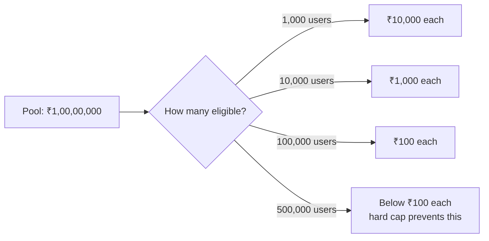
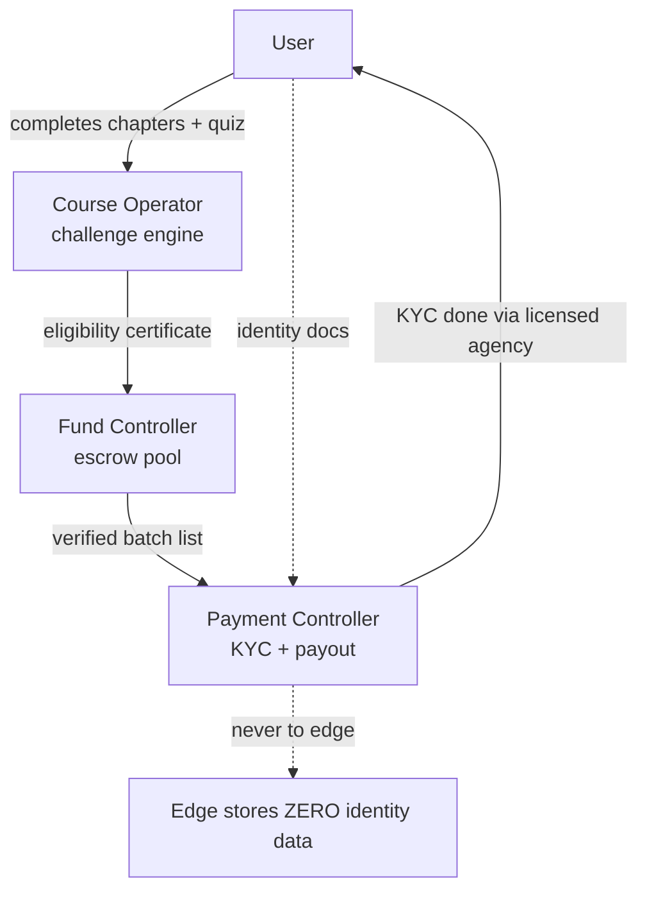

<!-- Clear Language: Keep sentences under 50 words -->
# Challenge Economics & Reward Systems

## Learning Objectives

After this chapter you will be able to design a monetized learning challenge with a fixed reward pool, build a three-entity model (Course Operator, Fund Controller, Payment Controller) that separates money from content and from identity data, write a legally-usable Terms & Conditions template with eligibility and disqualification clauses, implement a challenge engine in TypeScript that tracks eligibility, detects fraud, and computes payouts, and apply Aadhaar-safe KYC principles (zero identity storage at the platform edge) under India's DPDP Act.

## Introduction

A reward challenge ("complete the course, win a share of a ₹1 crore pool") is a growth engine used by ed-tech platforms, but it is also one of the riskiest features to build. The risk is not in the code — it is in the money and the identity data. Where does the pool live? Who decides who is eligible? Who verifies identity for payout, and who never touches that data? This chapter teaches the full engineering-and-governance stack: the pool mathematics, the three-entity separation of duties, the Terms & Conditions template, the KYC boundary, and a TypeScript challenge engine that enforces eligibility, fraud detection, and payout arithmetic. The model used throughout is a course with a ₹1 crore INR non-GST pool, ₹100 contribution per user, a 100,000-user cap, and a hard deadline of 2026-08-17T00:00:00Z.

## Prerequisites

- Chapter 33-07 (Company-Format Mock Tests) — progress tracking patterns
- Chapter 33-08 (PYQ Bank) — the completion metric examples
- Module 17 (AI Security & Guardrails) — fraud and data-protection basics
- Module 16 (MLOps & Production) — system reliability thinking

## Key Terminology

**Course Operator**: The entity that owns the content and the challenge rules; it never holds the money or the identity data.

**Fund Controller**: The legal entity that owns the prize pool and the list of investors/fund managers; it commits the pool, holds it in escrow, and releases it only on verified eligibility.

**Payment Controller**: The entity that runs KYC (Aadhaar/PAN via licensed KYC agencies) and disburses payouts; it is the only party that touches identity documents.

**Pool**: The fixed reward amount promised, e.g., ₹1 crore INR (non-GST). A pool is fixed: total payout cannot exceed it.

**Eligibility rule**: A verifiable condition (e.g., completed 100% chapters, passed the challenge quiz, unique device) that gates who enters the pool.

**KYC boundary**: The rule that identity data (Aadhaar/PAN) exists only with the Payment Controller; the platform edge stores zero identity data.

**Edge**: The part of the system users touch — website, app, course player. Edge-zero-storage means no Aadhaar/PAN ever reaches the edge, even transiently.

**Cap**: The maximum number of eligible users; beyond it, new entrants cannot join the pool.

**Deadline**: The moment the challenge closes; e.g., 2026-08-17T00:00:00Z. No eligibility after the deadline.

## Theory

### 1. Pool Mathematics — The ₹100 / 100,000 User Model

A fixed pool means every eligible user's share depends on the count of eligible users, not on the pool alone:



The arithmetic that must be stated in the Terms:

- Pool = ₹1,00,00,000 (₹1 crore) INR, non-GST.
- Contribution model: ₹100 per user is the entry contribution described in marketing; the pool is capped at 100,000 users.
- If fewer than 100,000 users join, the pool stays fixed at ₹1 crore and shares are larger.
- If the cap is reached, new users can still access the course but cannot enter the pool (waitlist or exclusion must be written in the Terms).
- The **effective share** = pool / eligible_count, computed at the deadline, not at signup. Marketing must never print a guaranteed per-user amount when the pool is fixed.

The classic math error: "₹100 × 1,000,000 users = ₹1 crore" implies 1 million users for the pool to be fully funded by contributions. With a 100,000-user cap, the pool is funded by the Fund Controller (investors/fund managers), not by contributions. This distinction — pool funded by the Fund Controller, contributions as entry fee — must be explicit to avoid "prize = fees" misrepresentation.

### 2. The Three-Entity Separation of Duties

Why three entities and not one? Because combining content, money, and identity in one system creates three failure classes at once: misrepresentation (content claims money it does not hold), theft (money and identity in the same database), and leakage (identity data used for marketing). The separation:

| Entity | Owns | Can do | Cannot do |
|--------|------|--------|-----------|
| Course Operator | Content, rules, leaderboard | Change content, run the challenge engine | Touch the pool, see Aadhaar/PAN |
| Fund Controller | Pool, escrow account, investor list | Commit the pool, release funds on verified eligibility | Change rules alone, see identity docs |
| Payment Controller | KYC pipeline, payout rails | Verify Aadhaar/PAN via licensed agencies, disburse | Edit content, run eligibility logic |



The engine emits an **eligibility certificate** (a signed data structure listing user pseudonyms + completion proof + fraud checks passed). The Fund Controller reconciles certificates against the escrow. The Payment Controller maps pseudonyms to real identities only inside its own KYC pipeline, then disburses. No single entity ever holds all three powers.

### 3. The T&C Template (Reward Challenge)

A Terms & Conditions document for a money challenge must cover: the parties, the pool, eligibility, disqualification, the deadline, KYC, taxes, dispute resolution, and force majeure. Below is a clause-by-clause template with the specific numbers used in this course's model. This is an educational template — it must be reviewed by licensed counsel before real use.

#### Clause 1 — Parties

"Course Operator (content owner), Fund Controller (pool owner, list of investors and fund managers disclosed in Annexure A), and Payment Controller (KYC and disbursal agent) are the three parties. Users participate as beneficiaries. Each party's role is defined in the Roles table in Annexure B."

#### Clause 2 — The Pool

"The total reward pool is ₹1,00,00,000 (Indian Rupees One Crore), non-GST, funded by the Fund Controller. The pool is fixed. The pool does not include user contributions; user contributions are entry fees for course access."

#### Clause 3 — Entry & Cap

"Entry requires payment of ₹100 (Indian Rupees One Hundred) as course access fee. The pool accepts at most 100,000 eligible users. Once the cap is reached, further registrations are added to a waitlist and are not eligible for the pool."

#### Clause 4 — Eligibility

"A user is eligible if and only if, before 2026-08-17T00:00:00Z (the Deadline): (a) all course chapters are marked complete in the challenge engine; (b) the challenge quiz is passed with ≥ 80% score; (c) the account passed all anti-fraud checks (single account per verified device, no duplicate identities, no automated completion). Eligibility is determined by the challenge engine's certificate, verified by the Fund Controller."

#### Clause 5 — Disqualification

"A user is disqualified for: (a) multiple accounts under the same identity or device family; (b) automated completion (scripts, macros, or AI agents completing chapters); (c) identity document mismatch at KYC; (d) any attempt to manipulate the leaderboard or engine; (e) violation of the Code of Conduct. Disqualification is decided by the Course Operator, appealable to the Fund Controller within 7 days."

#### Clause 6 — KYC & Identity

"Identity verification is performed only by the Payment Controller through licensed KYC agencies using Aadhaar e-KYC or PAN as permitted by law. The Course Operator and Fund Controller do not receive or store Aadhaar or PAN numbers, images, or derivatives. The platform edge stores zero identity data. Users provide identity data directly to the KYC agency's interface, never through the course platform."

#### Clause 7 — Payout & Taxes

"Payouts are made by the Payment Controller via UPI/bank transfer within 30 days of the Deadline, to the bank account whose holder matches the KYC-verified identity. Taxes (TDS, GST if applicable, prize tax) are deducted at source as required by law. The per-user share = Pool ÷ number of eligible users, computed at the Deadline. Shares below a minimum threshold (₹100) are treated as donations to a listed charity, per Annexure C, to avoid micro-transaction fees."

#### Clause 8 — Deadline & Force Majeure

"The Deadline is absolute. The pool remains payable if the eligible count is zero for a contiguous 30 days after the Deadline, at the Fund Controller's sole discretion. Force majeure (acts of god, government orders, platform outages) extends only the payout window, never the Deadline, unless the Fund Controller agrees otherwise in writing."

#### Clause 9 — Disputes

"Disputes are first escalated to the Course Operator (7 days), then to the Fund Controller (14 days), then to arbitration in India under the Arbitration and Conciliation Act, 1996. Jurisdiction: courts of India."

#### Clause 10 — Disclaimer

"This document is a template for education. It is not legal advice. Any real deployment must be reviewed by licensed Indian counsel, comply with the DPDP Act 2023, the Prize Competition Act (as applicable), and RBI/UPI regulations, and be registered with relevant authorities. Neither the authors nor the repository provide legal or financial certification."

### 4. KYC Ownership & Zero-Edge-Storage Checklist

The operational checklist that turns Clause 6 into reality:

1. **KYC agency selection**: Choose a licensed KYC provider (e.g., a CERT-In empaneled or UIDAI-licensed Aadhaar e-KYC agency); sign a data-processing agreement.
2. **Direct-to-agency flow**: The user completes KYC inside the agency's iframe/page; the platform never receives the identity data stream.
3. **Pseudonym bridge**: The platform generates a random pseudonym (UUID) per user; only the Payment Controller's internal mapping joins UUID → identity.
4. **Edge logging ban**: Add a rule in the logging pipeline: fields named aadhaar*, pan*, kyc* are redacted automatically; tests assert zero such fields in edge logs.
5. **Storage location**: Identity data resides only in the Payment Controller's segregated store, encrypted at rest (AES-256) with access logs.
6. **Retention**: Aadhaar e-KYC data is retained only for the legal retention period, then purged; the deletion is verified and logged.
7. **Access control**: Exactly three named roles in the Payment Controller: KYC operator, payout operator, compliance auditor. No other role can read identity data.
8. **Annual audit**: An independent auditor reviews: who touched identity data, whether any Aadhaar/PAN reached the edge (log scan), and whether payouts match certificates.
9. **User rights**: Document the DPDP rights — access, correction, erasure — and a grievance officer contact (Section 43A obligations under DPDP).
10. **Breach drill**: A rehearsed incident response: if identity data is exposed, notify affected users and the DPDP authority within the mandated window.

### 5. Challenge Engine Design (Anti-AI-Cheat)

The core problem: an AI agent can "complete" chapters trivially. The engine must distinguish a human learner from a script. Design principles:

1. **Proof of solving, not clicking**: Quiz questions are drawn from per-user randomized question banks; completion requires ≥ 80% on a 20-question test, each question time-stamped with human-scale latencies (2-15 seconds).
2. **Human latency fingerprints**: Scripts answer in milliseconds or fixed intervals. The engine rejects completion if median response time is under 2 seconds or variance is near zero.
3. **Device binding**: A device fingerprint (browser, OS, canvas hash) is captured at registration; the same identity claiming multiple devices within the eligibility window triggers review.
4. **Interleaved checkpoints**: Every 10 chapters, a checkpoint quiz must be passed; the checkpoints are required for eligibility and cannot be skipped.
5. **Limit on completion rate**: A human cannot complete 224 chapters with checkpoints in under 14 days; the engine enforces a minimum elapsed time per chapter.
6. **Randomized banks**: Each user gets a different quiz from a large bank, so copying answers from another user fails.
7. **The certificate**: At the deadline, the engine emits a signed JSON certificate per eligible user: pseudonym, completion proof, fraud-check results, timestamp. The signature (HMAC with the Fund Controller's public key) prevents the Course Operator from forging eligibility.

### 6. Payout Arithmetic and Edge Cases

The share formula is simple; the edge cases are not:

- eligible_count = 0 → no payout; pool returns to the Fund Controller (write this in the Terms).
- eligible_count = 1 → the single user receives the full pool; cap TDS at 30%, not at the share.
- share < ₹100 → charity sweep (Clause 7) to avoid transfer fees exceeding the share.
- KYC failures at payout: an eligible user who fails KYC loses the share; the share redistributes among KYC-passed users (must be in the Terms; otherwise it lapses).
- Rounding: shares round down to the paisa; the residual goes to the charity sweep.
- The ₹1 crore pool is a promise backed by the Fund Controller's escrow. The engine never "creates" money — it only computes shares from the declared pool.

## Examples

### Example 1: Challenge Engine — Eligibility Tracker

```typescript
interface CompletionRecord {
    chaptersDone: number
    totalChapters: number
    quizScore: number
    medianAnswerMs: number
    minElapsedDays: number
    deviceCount: number
}

const RULES = {
    minQuizScore: 80,
    maxMedianAnswerMs: 15000,
    minHumanMedianMs: 2000,
    minElapsedDays: 14,
    maxDevices: 1,
}

class ChallengeEngine {
    checkEligibility(r: CompletionRecord): { eligible: boolean; reasons: string[] } {
        const reasons: string[] = []
        if (r.chaptersDone < r.totalChapters) reasons.push("incomplete chapters")
        if (r.quizScore < RULES.minQuizScore) reasons.push("quiz score below 80%")
        if (r.medianAnswerMs > RULES.maxMedianAnswerMs) reasons.push("too slow - possible manual answer lookup")
        if (r.medianAnswerMs < RULES.minHumanMedianMs) reasons.push("too fast - possible automation")
        if (r.minElapsedDays < RULES.minElapsedDays) reasons.push("completion too fast for a human")
        if (r.deviceCount > RULES.maxDevices) reasons.push("multiple devices - possible sharing")
        return { eligible: reasons.length === 0, reasons }
    }
}

const engine = new ChallengeEngine()
console.log(engine.checkEligibility({
    chaptersDone: 224, totalChapters: 224, quizScore: 92,
    medianAnswerMs: 6000, minElapsedDays: 21, deviceCount: 1,
}))
console.log(engine.checkEligibility({
    chaptersDone: 224, totalChapters: 224, quizScore: 95,
    medianAnswerMs: 120, minElapsedDays: 1, deviceCount: 1,
}))
```

Output: first record eligible (reasons: []); second record not eligible (too fast + automation).

### Example 2: Challenge Engine — Share & Payout Calculator

```typescript
class PoolCalculator {
    constructor(private poolPaisa: number) {}

    sharePerUser(eligibleCount: number): number {
        if (eligibleCount <= 0) return 0
        return Math.floor(this.poolPaisa / eligibleCount) / 100
    }

    computePayouts(eligible: Array<{ pseudonym: string; kycPassed: boolean }>): Map<string, number> {
        const passed = eligible.filter(u => u.kycPassed)
        const perUser = this.sharePerUser(passed.length)
        const out = new Map<string, number>()
        for (const u of passed) out.set(u.pseudonym, perUser)
        return out
    }
}

const pool = new PoolCalculator(100_00_000 * 100) // ₹1 crore in paisa
const users = Array.from({ length: 100_000 }, (_, i) => ({
    pseudonym: `u${i}`, kycPassed: i % 25 !== 0, // 4% fail KYC
}))
const payouts = pool.computePayouts(users)
console.log("Eligible:", users.length, "KYC-passed:", payouts.size)
console.log("Per-user share (₹):", [...payouts.values()][0])
```

Output: 96,000 KYC-passed users; share ≈ ₹104 per user (₹1 crore ÷ 96,000), which respects the ₹100 floor.

### Example 3: Challenge Engine — Human Latency Fingerprint

```typescript
function median(nums: number[]): number {
    const s = [...nums].sort((a, b) => a - b)
    const mid = Math.floor(s.length / 2)
    return s.length % 2 ? s[mid] : (s[mid - 1] + s[mid]) / 2
}

function isHumanLatency(timestampsMs: number[]): boolean {
    if (timestampsMs.length < 5) return false
    const gaps = timestampsMs.slice(1).map((t, i) => t - timestampsMs[i])
    const med = median(gaps)
    const variance = gaps.reduce((s, g) => s + (g - med) ** 2, 0) / gaps.length
    return med >= 2000 && med <= 15000 && variance > 100_000
}

console.log(isHumanLatency([0, 5800, 12400, 17100, 22500, 28900]))
console.log(isHumanLatency([0, 120, 250, 370, 490, 600]))
```

Output: true (median gap ≈ 5.5s, human); false (median gap 120ms, script-like).

### Example 4: Challenge Engine — Eligibility Certificate

```typescript
import { createHmac } from "crypto"

interface Certificate {
    pseudonym: string
    chaptersDone: number
    quizScore: number
    fraudChecks: string[]
    issuedAt: string
    signature: string
}

class Certifier {
    constructor(private secret: string) {}

    sign(c: Omit<Certificate, "signature">): Certificate {
        const payload = `${c.pseudonym}|${c.chaptersDone}|${c.quizScore}|${c.issuedAt}`
        return { ...c, signature: createHmac("sha256", this.secret).update(payload).digest("hex") }
    }

    verify(c: Certificate): boolean {
        const payload = `${c.pseudonym}|${c.chaptersDone}|${c.quizScore}|${c.issuedAt}`
        const expect = createHmac("sha256", this.secret).update(payload).digest("hex")
        return expect === c.signature
    }
}

const certifier = new Certifier("fund-controller-key")
const cert = certifier.sign({
    pseudonym: "u42", chaptersDone: 224, quizScore: 92,
    fraudChecks: ["no-duplicate-account", "human-latency"], issuedAt: "2026-08-16T23:59:59Z",
})
console.log(certifier.verify(cert))
cert.chaptersDone = 200 // tamper attempt
console.log(certifier.verify(cert))
```

Output: true, then false. The HMAC signature makes the Course Operator unable to forge eligibility after the fact.

### Example 5: KYC-Boundary — Redaction Guard

```typescript
const SENSITIVE_PATTERNS = [/\baadhaar\b/i, /\bpan\b/i, /[2-9][0-9]{11}/, /[A-Z]{5}[0-9]{4}[A-Z]/]

class EdgeLogger {
    log(entry: string): string {
        let safe = entry
        for (const p of SENSITIVE_PATTERNS) safe = safe.replace(p, "[REDACTED]")
        return safe
    }
}

const logger = new EdgeLogger()
console.log(logger.log("user u42 submitted kyc, aadhaar 234512345678"))
console.log(logger.log("payout batch processed for ABCDE1234F"))
```

Output: both lines show [REDACTED]. The redaction guard is the last line of defense for the edge-zero-storage rule.

## Visual Analogy

**The three-entity model is a bank cheque divided into three keys.** The Course Operator is the writer of the cheque (content and rules), the Fund Controller is the bank account it is drawn on (the pool), and the Payment Controller is the teller who verifies your identity at the counter (KYC) before handing over cash. No one person may hold two keys: the writer cannot open the account, the account holder cannot see your ID, and the teller cannot edit the cheque. The platform edge is the queue outside the bank — you wait there with your card, but your passport stays in the teller's drawer. If the bank's lobby (the edge) ever collected passports, one robbery would cost every customer their identity. That is why the lobby has a sign: "No ID documents beyond this point."

## Summary

A reward challenge is an engineering system with three compartments: content rules, money, and identity. The pool mathematics are fixed and must be disclosed: a ₹1 crore pool with a 100,000-user cap and ₹100 entry fee means shares = pool ÷ eligible count at the deadline, funded by the Fund Controller, not by fees. The three-entity model (Course Operator, Fund Controller, Payment Controller) separates duties so no party can both set rules and touch money or identity. The T&C template covers parties, pool, cap, eligibility, disqualification, KYC, payout/tax, deadline, disputes, and a disclaimer that it is educational, not legal advice. The KYC checklist enforces zero identity storage at the edge, direct-to-agency flows, pseudonym bridges, redaction guards, retention limits, and annual audits. The challenge engine rejects AI cheats via randomized quiz banks, human latency fingerprints, device binding, checkpoint quizzes, and minimum elapsed time; it emits signed eligibility certificates that the Fund Controller verifies. Payouts respect floors, redistribution on KYC failure, rounding, and the ₹100 charity sweep for micro-shares.

## Practical Takeaways

- State the pool, cap, fee, and deadline in the Terms before marketing anything.
- Separate content, money, and identity across three entities; document the separation.
- Use the T&C template as a starting draft, then get licensed counsel review.
- Enforce zero Aadhaar/PAN at the edge: direct-to-agency KYC, pseudonym bridge, log redaction.
- Design the engine against AI cheats, not just against casual cheating.
- Emit signed eligibility certificates so eligibility cannot be forged.
- Compute payouts at the deadline from the eligible count; handle KYC failures and sub-floor shares in the Terms.

## Interview Q&A

**Q1: Why three entities instead of one?**
Because combining content, money, and identity creates three failure classes: misrepresentation, theft, and identity leakage. Separation of duties means no single compromise defeats the whole system.

**Q2: How is the pool funded if only 100,000 users pay ₹100?**
By the Fund Controller, from investors/fund managers disclosed in the Terms. User fees are course access fees, not the pool's funding. The Terms must say this to avoid misrepresentation.

**Q3: Why can't the platform store Aadhaar?**
DPDP Act compliance and breach containment. Identity data is the highest-value target; edge-zero-storage means a platform breach leaks no identity data.

**Q4: How do you prevent AI agents from winning the challenge?**
Randomized quiz banks, human latency fingerprints (median 2-15s, nonzero variance), device binding, checkpoint quizzes, and a minimum 14-day completion window.

**Q5: What happens when eligible_count × share is below ₹100?**
The Terms route sub-floor shares to a listed charity (charity sweep) to avoid transfer fees exceeding the payout.

**Q6: Can the Course Operator change rules mid-challenge?**
No — the T&C binds the rules at launch; the Fund Controller holds the escrow and releases funds only per the signed certificate, which was generated under the published rules.

**Q7: What does the eligibility certificate contain?**
Pseudonym, completion proof, quiz score, fraud-check results, issuance timestamp, and an HMAC signature verifiable by the Fund Controller.

## Chapter Quiz

1. In the three-entity model, who verifies Aadhaar for KYC?
   - A) Course Operator
   - B) Fund Controller
   - C) Payment Controller
   - D) The challenge engine
   // correct: C

2. The share per user equals:
   - A) ₹100 fixed
   - B) Pool ÷ eligible count at deadline
   - C) Entry fee × 100
   - D) Whatever the leaderboard says
   // correct: B

3. Which is NOT a challenge-engine anti-cheat measure?
   - A) Randomized quiz banks
   - B) Human latency fingerprints
   - C) Trusting self-reported completion
   - D) Minimum elapsed time
   // correct: C

4. "Edge-zero-storage" means:
   - A) The platform stores no Aadhaar/PAN, even transiently
   - B) The platform stores everything in the cloud
   - C) Users store their own Aadhaar
   - D) Only the Course Operator sees Aadhaar
   // correct: A

5. What happens to shares below ₹100?
   - A) They are deleted
   - B) Charity sweep to a listed charity
   - C) Added to the next user's share
   - D) Returned to the user in cash
   // correct: B

## Exercises

1. Recompute the share table for pool ₹1 crore with eligible counts 100, 1,000, 10,000, 100,000; add a KYC-failure redistribution at 4%.
2. Extend the ChallengeEngine with a `deviceCount` audit rule that rejects after 3 devices unless verified.
3. Write a T&C clause for "what happens to unclaimed shares after 60 days".
4. Build the redaction guard test suite: 5 strings with Aadhaar/PAN formats, assert [REDACTED] output.
5. Design a waitlist flow when the 100,000 cap is reached; describe the engine state transitions in a mermaid diagram.

## Common Mistakes

1. Marketing a fixed per-user amount when the pool is fixed (misrepresentation).
2. Letting user fees fund the pool without disclosure.
3. Storing Aadhaar at the edge "just for KYC status".
4. One entity holding content, money, and identity.
5. Trusting click-completion as evidence of learning.
6. Ignoring KYC-failure redistribution and sub-floor shares.

## Revision Notes

- Pool: ₹1 crore fixed, non-GST; cap 100,000; fee ₹100; deadline 2026-08-17T00:00:00Z
- Share = Pool ÷ eligible at deadline; funded by Fund Controller, not fees
- 3 entities: Operator (content), Fund Controller (pool), Payment Controller (KYC)
- Edge stores zero Aadhaar/PAN; KYC via licensed agency, pseudonym bridge
- Anti-cheat: randomized banks, 2-15s latency, device binding, checkpoints, 14-day floor
- Certificate: HMAC-signed eligibility proof
- Sub-floor shares (< ₹100) → charity sweep
- Disclaimer: template for education, not legal advice

## Placement Section

### Top 10 Interview Questions

#### Product Company Style (Google/Amazon/Microsoft)

1. **Design a challenge engine with a ₹1 crore pool.** — Three-entity model, fixed pool, cap, deadline, anti-cheat, signed certificates, payout arithmetic.
2. **How would you prevent fraud at scale?** — Latency fingerprints, device binding, randomized banks, HMAC certificates, anomaly detection.

#### AI Startup Style (OpenAI/Anthropic-style)

3. **How do you stop LLM agents from winning?** — Human-latency fingerprints, checkpoints, minimum elapsed time, randomized banks.
4. **How do you handle identity data in India?** — DPDP, Aadhaar e-KYC via licensed agency, zero edge storage, retention, audit.

#### Service Company Style (TCS/Infosys)

5. **Explain the three-entity model.** — Separation of content, money, identity; why no party holds two keys.
6. **What is the difference between a fixed pool and guaranteed payout?** — Pool is fixed; payout depends on eligible count.
7. **How do you compute payout?** — Pool ÷ eligible at deadline, floors, rounding, KYC redistribution.

#### Fintech Style

8. **How do you build payout rails safely?** — Payment Controller, KYC-first, TDS deduction, UPI/bank transfer, reconciliation with certificates.
9. **What is the charity sweep and why?** — Sub-floor shares avoid micro-transfer fees; listed charity only.
10. **How do you audit a KYC boundary?** — Log scans for Aadhaar/PAN at edge, access logs, retention checks, annual independent audit.

### Company-Level Insights

- Product companies probe the anti-cheat design and the payout arithmetic edge cases.
- AI startups probe agent-proofing: they will ask exactly how a Claude agent gets rejected.
- Service companies ask the model questions: entities, pool, deadline, TDS.
- Fintech asks about rails: UPI integration, TDS, reconciliation, audit trails.

## Difficulty Level

Advanced — requires security, MLOps, and system design foundations; suitable as a capstone module.

## Tips & Tricks

- **State the deadline as UTC ISO 8601** — "2026-08-17T00:00:00Z" has no timezone ambiguity.
- **Write the Terms before the code** — the engine implements the Terms; the Terms must not chase the code.
- **Pseudonym everything at the edge** — user IDs in the engine are UUIDs; identities live only in the Payment Controller.
- **Test the anti-cheat on real scripts** — run an actual automation attempt in staging; your latency threshold must survive it.
- **Simulate payout edge cases** — 0 eligible, 1 eligible, all-KYC-fail, cap reached, deadline midnight.

## Memory Tricks

- **"Three keys, one safe"** — Operator writes, Controller holds, Teller verifies.
- **"Pool is a pie, not a salary"** — the pie is fixed; slices depend on the eaters.
- **"Edge is a lobby, IDs stay in the drawer."**
- **"2 to 15 seconds, some jitter"** — the human latency band.
- **"Signed, not trusted"** — the certificate signature replaces trust.

## Further Reading

- Digital Personal Data Protection Act 2023 (India) — the DPDP Act
- UIDAI Aadhaar e-KYC licensing and compliance documentation
- RBI UPI and payout guidelines
- The Arbitration and Conciliation Act, 1996 (India)
- OWASP Data Protection Cheat Sheet

## Related Topics

- Chapter 33-07 (Company-Format Mock Tests) — completion metric design
- Module 17 (AI Security & Guardrails) — fraud and prompt-injection defense
- Module 16 (MLOps & Production) — reliability and reconciliation
- Module 19 (Capstone Projects) — where a challenge engine becomes a project
- Module 27 (AI Infrastructure) — scaling the engine and the escrow

## FAQs

1. **Is this legal to run without a lawyer?** — No. The template is educational; a real launch needs licensed counsel, DPDP compliance, and possibly a Prize Competition registration.
2. **Can the pool be smaller?** — Yes; the numbers are parameters. The arithmetic and clauses scale to any pool.
3. **Do I need the charity sweep?** — Only if your minimum share falls below transfer costs; the Terms must mention it if used.
4. **Can the Course Operator see who won?** — Pseudonyms only; identity mapping is the Payment Controller's job.
5. **What if the deadline passes with zero eligible?** — The pool returns to the Fund Controller; write this outcome in the Terms.
6. **Is Aadhaar mandatory?** — No; PAN or other legally valid KYC is an alternative; the Terms must list accepted documents.

## Important Notes

- The pool is fixed; marketing must never imply guaranteed per-user amounts.
- Fees are access fees; the pool is funded by the Fund Controller.
- Aadhaar/PAN never reaches the edge — not for KYC status, not for verification.
- The engine enforces the Terms; the Terms do not change after launch.
- Payout = pool ÷ eligible at deadline; floors, rounding, and KYC redistribution are Terms-level decisions.
- The T&C template is education, not legal advice; counsel review is mandatory before real use.

## Historical Context

Ed-tech reward challenges grew in India after 2015, when UPI made micro-collection and payouts cheap. Early models paid per-leaderboard rank, which invited bot farms. The 2020s added AI agents that could complete courses unattended, forcing challenge engines to adopt human-behavior fingerprints. The DPDP Act 2023 tightened identity handling, pushing Aadhaar e-KYC behind licensed agencies and away from platform edges. The three-entity model matured in fintech payout engineering, where escrow, KYC, and disbursal are legally separated; course challenges adopted the same architecture as pools grew to crores.

## Security Considerations

- The edge must have a redaction guard in the logging pipeline; test it in CI.
- The escrow account requires dual authorization: Fund Controller operator + compliance auditor.
- HMAC keys for certificates rotate quarterly; leaked keys invalidate the certificate chain.
- KYC agency connections must be TLS 1.2+ with pinned certificates; no identity data on analytics dashboards.
- Retention: Aadhaar e-KYC data purged after legal retention; deletion verified by the auditor.
- Incident response: identity data exposure requires DPDP breach notification; rehearse it before launch.
- Never log pseudonym-to-identity mappings in the edge; that mapping is the Payment Controller's only copy.

## ML Intuition

- The human-latency fingerprint is an anomaly detector: median and variance separate human distributions from script distributions.
- Randomized quiz banks make answer-copying infeasible: copying is a distribution attack, and randomization destroys the shared distribution.
- The eligibility certificate is a machine-readable claim verified by a different party — zero-trust verification between entities.
- KYC-failure redistribution is a conditional probability: the payout distribution conditions on the KYC-passed subset.
- The cap creates a scarcity signal: waitlist pressure is a growth feature, not a bug — scarcity drives enrollment.

## Analogies

- **Three entities are three keys to one safe**: the writer, the account holder, and the teller.
- **The pool is a fixed pie**: slices depend on the eaters, not the pie.
- **The edge is a bank lobby**: no passports in the lobby; IDs stay in the teller's drawer.
- **The certificate is a stamped cheque**: signed and verifiable; a forged stamp breaks the chain.
- **The deadline is a train departure**: the doors close at 2026-08-17T00:00:00Z for everyone.

## Capstone Project Link

- [Module Capstone: End-to-End Project](https://github.com/Raushan666java/ai-engineering-journey) — build the full challenge engine as a capstone: eligibility engine, HMAC certifier, pool calculator, redaction guard, and a T&C page generated from the template; pair it with a staging KYC simulator.

## Flashcards

<details class="tp-qa-card" data-qid="33campusplacement-09challenge-flash1">
  <summary class="tp-qa-question">
    <span class="tp-qa-status"></span>
    What are the three entities and their powers?
  </summary>
  <div class="tp-qa-answer">
    <p>Course Operator (content/rules), Fund Controller (pool/escrow), Payment Controller (KYC/payout); no entity holds two powers.</p>
  </div>
</details>

<details class="tp-qa-card" data-qid="33campusplacement-09challenge-flash2">
  <summary class="tp-qa-question">
    <span class="tp-qa-status"></span>
    How is the per-user share computed?
  </summary>
  <div class="tp-qa-answer">
    <p>Pool ÷ number of eligible users, computed at the deadline; the pool is fixed at ₹1 crore and funded by the Fund Controller.</p>
  </div>
</details>

<details class="tp-qa-card" data-qid="33campusplacement-09challenge-flash3">
  <summary class="tp-qa-question">
    <span class="tp-qa-status"></span>
    What does edge-zero-storage mean?
  </summary>
  <div class="tp-qa-answer">
    <p>Aadhaar/PAN data never reaches the platform edge, even transiently; KYC happens via a licensed agency's own interface.</p>
  </div>
</details>

<details class="tp-qa-card" data-qid="33campusplacement-09challenge-flash4">
  <summary class="tp-qa-question">
    <span class="tp-qa-status"></span>
    Name three anti-AI-cheat measures.
  </summary>
  <div class="tp-qa-answer">
    <p>Randomized quiz banks, human latency fingerprints (2-15s median, jitter), device binding and a 14-day minimum completion window.</p>
  </div>
</details>

<details class="tp-qa-card" data-qid="33campusplacement-09challenge-flash5">
  <summary class="tp-qa-question">
    <span class="tp-qa-status"></span>
    What is the charity sweep?
  </summary>
  <div class="tp-qa-answer">
    <p>Shares below ₹100 are donated to a listed charity to avoid transfer fees exceeding the payout amount.</p>
  </div>
</details>
