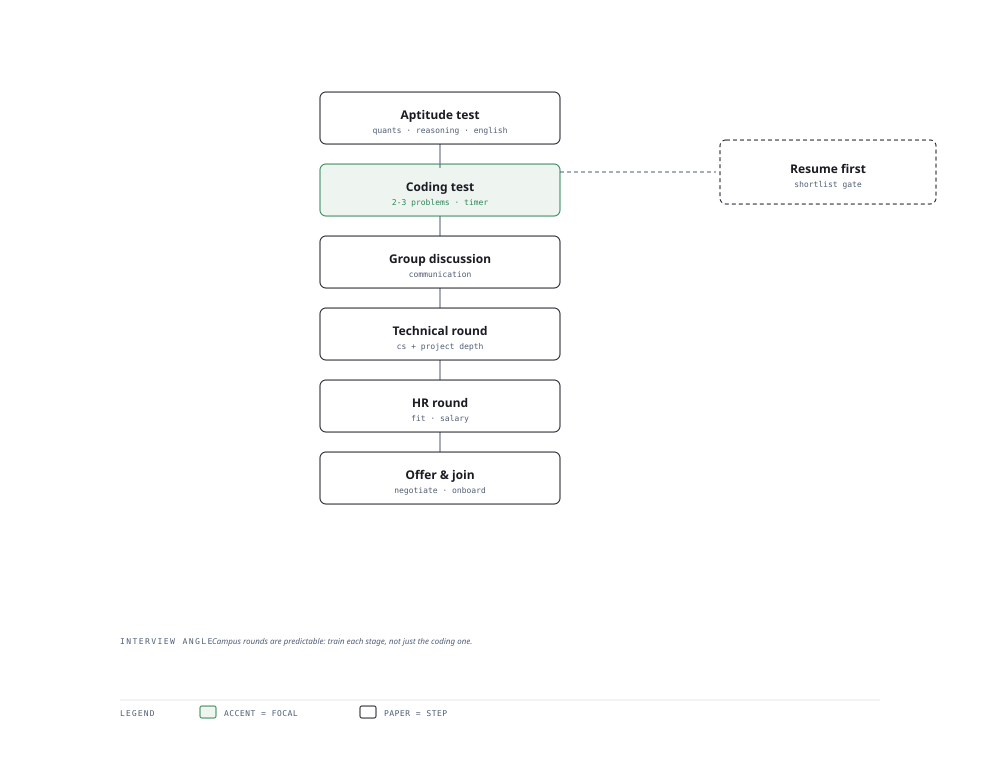

# Visual Notes — The Campus Placement Journey

> One diagram, the full picture. This page is meant to be glanced at before reading the chapters, and again before interviews.

# What the diagram shows

1. **Gate 1** — Aptitude, logical reasoning and verbal ability filter the pool first.
1. **Gate 2** — Coding and company-specific tests separate the technical candidates.
1. **Gate 3** — Group discussion, HR and technical interviews convert to an offer.

# Why this matters for placement

- Understand the structure so you allocate prep to the bottlenecks, not just favourites.
- Service companies weight aptitude and GD heavily; product companies weight coding — plan per target.

# Quick revision

- Know the test pattern per company before you apply; PYQs are your best predictor.
- Aptitude: speed + accuracy; timed drills beat passive reading.
- Company pattern awareness beats generic prep for the placement funnel.
- GD and HR rounds reward clarity and structure, not jargon.
- Backup offers in hand give you negotiating power on the job you want.

# Related chapters

- [Quantitative aptitude](01-quantitative-aptitude.md)
- [Logical reasoning](02-logical-reasoning.md)
- [Company test patterns](04-company-test-patterns.md)
- [HR interview questions](06-hr-interview-questions.md)

---

**One-line answer for interviews:** *"Aptitude → coding → group discussion → technical interviews → the offer."*
