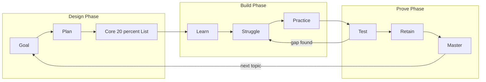

# Chapter 1: The AI Learning System

> **Last Updated:** August 2026 | **Estimated Reading Time:** 60–75 minutes

You work a 10-to-6 job, you spend about four hours a day commuting, and you are preparing for software and AI engineering placements. This chapter builds the complete AI-powered learning system that turns those four hours into your study engine using ChatGPT, Claude, Gemini, NotebookLM, Perplexity, and GitHub Copilot. You will finish with a proven pipeline, a tool map, a daily routine, and a TypeScript velocity tracker that measures your placement preparation like a real sprint.

> **How to work this chapter** — 15–20 minutes of overhead on top of reading:
>
> 1. **Read** — 60–75 minutes, split across 2–3 commute blocks.
> 2. **Do** — run every **Try This** as you go; the chapter's power is in the prompts you actually execute.
> 3. **Prove** — score 8/10 or better on the Chapter Quiz before moving on.
> 4. **Produce** — your AI study workspace: the 7-stage pipeline drawn out, your tool map, and a velocity tracker seeded with your first 7-day sprint plan.
>
> **Prerequisites:** none — this is the entry point. **Next:** Chapter 2.

## Learning Objectives

- Explain why closing the learn-practice-test loop with AI compounds into 10x speed instead of the usual 2x
- Design the 7-stage pipeline: Goal, Plan, Learn, Practice, Test, Retain, Master
- Match the right AI tool and its free tier to each study job
- Build a phone-first study workspace that survives a 4-hour commute
- Detect all 7 failure modes where AI quietly destroys learning
- Extract the high-yield 20 percent of any syllabus in one evening
- Run a full AI study day and a 7-day sprint with measurable velocity
- Enforce the struggle rule and pass a weekly AI dependency test

## Chapter at a Glance

| Topic | Key Insight | Practical Takeaway |
|---|---|---|
| The 10x case | AI compresses the whole learn-practice-test loop, not just explanations | Run the full loop inside one chat thread every session |
| The pipeline | Every topic travels Goal to Master through 7 stages | Apply the same pipeline to every syllabus item |
| Tool map | Each AI tool has exactly one job it does best | Choose by job, never by hype |
| Failure modes | Passive AI use becomes a memorization crutch | Add struggle time and dependency tests |
| 80/20 and audit | Most marks come from a small core of topics | Audit once, study the core first |
| Study day and velocity | A fixed routine is measurable and repeatable | Log every session in the velocity tracker |



## Q1: Why can AI 10x my learning speed, and why do most people only get 2x?

**Answer:** Traditional learning is bottlenecked because explanation, practice, testing, and review each require separate resources: a teacher, a problem book, a mock paper, and a scheduler. AI compresses explanation and problem generation to seconds, so the learn-practice-test loop can run three or four times per topic inside the same hour. Most people get only 2x because they use AI like a search engine: they ask one question, read the answer, and move on, which never closes the loop. The 10x multiplier appears only when you close the loop: after every lesson you generate drills, take a quiz, and feed the gaps back into the next lesson. For placements this matters twice over, because the loop trains retrieval speed, which is literally what interview rounds test.

```
You are my placement prep coach. I am studying {topic} at the {level} level with a {deadline} deadline.
Run one full learning loop for me in a single message:
1. Teach the core idea in 8 sentences maximum, with one real-world analogy.
2. Generate 5 practice questions of increasing difficulty.
3. End with the single question an interviewer would most likely ask about {topic}.
Do not add anything outside these 3 numbered parts.
```

**How it works:** One prompt forces teach-generate-quiz into a single turn, so every session completes a full micro-loop instead of a passive read. **Try This:** run this prompt on your weakest subject today, answer part 3 out loud in under 60 seconds, then paste your answer back into the same chat and ask for a grading rubric.

## Q2: What is the end-to-end AI learning pipeline, and what happens at each stage?

**Answer:** The pipeline has 7 stages. Goal: define mastery in one sentence, for example "I can whiteboard a rate limiter under 15 minutes." Plan: audit the syllabus, pick the next topic, timebox it to 25 minutes. Learn: AI delivers a 10-minute lesson at your exact level with one analogy. Practice: you work generated drills and deliberately struggle before asking for help. Test: you answer closed-book questions with no AI open. Retain: spaced review moves the topic into Anki cards and NotebookLM audio clips. Master: you explain the topic to the AI with no notes and score 90 percent plus on an unseen question. The diagram above is the loop: a test gap sends you back to struggle, and mastery sends you to the next goal.

| Stage | What happens | AI tool | Timebox |
|---|---|---|---|
| Goal | One-sentence mastery definition | ChatGPT | 2 min |
| Plan | Audit syllabus, pick topic | ChatGPT or Perplexity | 5 min |
| Learn | Level-fitted lesson with analogy | ChatGPT, Claude, Gemini | 10 min |
| Practice | Drills plus 10-minute struggle | ChatGPT or Copilot | 20 min |
| Test | Closed-book quiz, no AI | Anki or paper | 10 min |
| Retain | Spaced review and audio clips | NotebookLM, Anki | 15 min |
| Master | Teach-back and unseen problem | ChatGPT grading | 15 min |

**How it works:** Every stage has a defined output, so a topic is either at a stage or not, and a gap visibly bounces it backward. **Try This:** take one topic from your current syllabus and write its Goal sentence before you read anything else today.

## Q3: Which AI tool should I use for which job?

**Answer:** Choose tools by job, not hype. ChatGPT is your general tutor and reasoning engine, with voice mode that makes commute theory study hands-free. Claude is best for long documents and 200K-character context, ideal when you paste an entire 60-page notes file for analysis. Gemini has the most generous free tier and is strong at summarizing video, so YouTube lectures become notes. NotebookLM is the document specialist: it ingests your syllabus and generates audio overviews and study guides from your own material. Perplexity answers research questions with citations, which makes it your fact-checker and interview-question research desk. GitHub Copilot works inside your editor, turning "write the skeleton" conversations into real interview-code practice. DeepSeek is a free reasoning model that is a solid backup tutor when your paid quota runs out.

```
I have these AI tools available: {list of tools}. My study tasks for this week are: {list of tasks}.
Assign exactly one tool to each task and justify the choice in one line per task.
Flag any task where no tool is a good fit and tell me what to do instead.
```

**How it works:** Forcing a one-line justification per assignment exposes hype picks and reveals gaps in your setup. **Try This:** list your 5 weekly study tasks, run the prompt, and switch your setup so each task has a single assigned tool.

## Q4: How do I set up an AI study workspace that fits a 4-hour daily commute?

**Answer:** Your commute is phone-first, offline-tolerant, and voice-friendly, so the workspace must live on your phone. Create three pinned chats per active subject: Theory, Drills, and Review, so you never waste a session re-explaining your level. Enable voice mode on your main tutor and practice dictating answers, because speaking a technical explanation out loud is interview rehearsal. Download NotebookLM audio overviews and your Anki deck for offline stretches, and test airplane mode before you rely on it. Keep a single notes file (Google Keep or your note app) where every session ends with a 2-line summary you can paste back as context tomorrow.

```
I have a {minutes}-minute commute and only my phone. Build me a study workspace checklist for {subject}:
1. Exactly 3 pinned chat threads with one-line purposes.
2. What I should download for offline use each evening.
3. How I should use voice mode during the commute.
4. A 2-line daily summary template I must paste into my notes after every session.
```

**How it works:** The checklist converts your commute from dead time into three reusable study surfaces: theory by voice, drills by reading, review by audio. **Try This:** this evening, create the three threads for your main subject and download one NotebookLM audio overview; test airplane mode on tomorrow's commute.

## Q5: When does AI actually HURT learning?

**Answer:** AI hurts you in 7 predictable ways. Passive reading: you read AI explanations but never retrieve anything, so your brain stays a tourist. Slop answers: generic five-paragraph essays with zero depth, usually caused by prompts with no constraints. Dependence: you cannot solve a problem unless a model is open. Hallucination: confident wrong facts that you memorize because they sound plausible. Shallow notes: pasting AI output into files nobody reopens. Over-tooling: six AI apps and no pipeline, so switching consumes the time you saved. Context drowning: pasting 40 pages of syllabus at once so the model forgets what actually matters.

| Failure mode | Symptom you will notice | Fix |
|---|---|---|
| Passive reading | You cannot recall the last lesson | Close the loop: quiz after every lesson |
| Slop answers | Everything sounds like a brochure | Anti-slop constraints in your prompt |
| Dependence | Panic when the app is offline | Weekly closed-book dependency test |
| Hallucination | Facts that look right but feel off | Ask for sources or "mark uncertain" |
| Shallow notes | Notes pile up, never reviewed | 2-line summary rule per session |
| Over-tooling | Constant app switching | One tool per job, one pipeline |
| Context drowning | Model forgets your level mid-chat | Inject a short context summary per thread |

**How it works:** Each failure mode has a symptom you can notice in week one and a cheap fix, so the audit becomes part of your routine. **Try This:** grade your own week: mark which of the 7 modes you exhibited, and write the one fix you will adopt next week.

## Q6: What is the 80/20 rule applied with AI, and how do I find the core 20 percent?

**Answer:** In most placement syllabi, roughly 20 percent of topics produce 80 percent of interview questions, usually core data structures, OS basics, networking fundamentals, and SQL. The 80/20 rule with AI means you let the model score every topic by interview frequency and marks weight, then study the top 20 percent first and fastest. You are not skipping the long tail; you are sequencing it, so the high-yield core is strong before the low-frequency topics eat your evenings.

```
Here is my full syllabus: {paste syllabus topics}.
Score each topic on a scale of 1 to 10 for: interview question frequency, marks weight in the exam, and my current confidence.
Sort the list by total score descending and mark the top 20 percent as CORE, the middle as IMPORTANT, and the rest as COVER.
For the CORE list, suggest the fastest learning order and one placement question type per topic.
```

**How it works:** Scoring every topic forces the model to reason about your specific syllabus instead of giving generic study advice. **Try This:** paste your actual syllabus file into this prompt tonight and save the resulting CORE list as your pinned planning document.

## Q7: How do I audit my entire syllabus in one evening with AI?

**Answer:** A syllabus audit answers three questions: what is in scope, what matters most, and what is already mastered. Chain three prompts in one evening: map the syllabus into topic clusters, weight each cluster for placement relevance, and mark your confidence per topic. Keep the outputs as one table in your notes app, because the same table becomes your progress tracker for the whole course. The audit should take 90 minutes maximum; if it takes longer, you are over-auditing instead of studying.

```
Act as my placement strategist. I have {days} days left. From this syllabus: {paste syllabus},
produce a table with columns: Cluster, Topics, Interview Weight (1-10), Marks Weight (1-10), My Confidence (1-10).
Then rank the clusters by the formula weight times (10 minus confidence) so the biggest risk appears first.
Finally, give me the 3 clusters I should finish in the first 10 days, with a one-line reason each.
```

**How it works:** The rank-by-risk formula converts a static syllabus into an ordered work queue where risk, not familiarity, decides priority. **Try This:** block 90 minutes this Friday, run the prompt on your real syllabus, and rename the result "AUDIT 2026" in your notes.

## Q8: What does a full AI study day look like for a working professional?

**Answer:** A 10-to-6 day has five study slots: morning prep, outbound commute, lunch drill, return commute, and evening deep work. Morning prep (15 minutes) opens the Review thread and previews today's topic. The outbound commute (1 hour) runs voice-mode theory: you listen, speak answers, and paste the 2-line summary. Lunch drill (20 minutes) is a closed-book quiz on the morning lesson. The return commute (1 hour) uses offline materials: Anki cards and the NotebookLM audio you downloaded last night. Evening deep work (60 to 90 minutes) is the only seat-in-front-of-screen slot: hardest problems, struggle time, and the velocity tracker update. The rule is that heavy cognitive load lives in the evening, while commutes carry review and repetition.


```
You are my study scheduler. Design my study day for {subject} with these fixed slots: {slots with times}.
For each slot assign: the task, which AI tool (if any), whether it is closed-book or open-AI,
and the minimum deliverable I must produce (a quiz score, a 2-line summary, 5 solved problems).
Keep total daily study time under {max minutes} and protect 8 hours of sleep.
```

**How it works:** Assigning a deliverable per slot stops schedule drift, because a slot without an output is a slot that quietly disappears. **Try This:** print tomorrow's schedule from the prompt, then at 21:30 check off every deliverable; repeat for 5 days and adjust slot sizes by what actually got done.

## Q9: How do I measure learning speed and velocity with AI?

**Answer:** Learning speed is output over time: mastered topics per week, minutes per session, and quiz averages that actually climb. Keep a study velocity tracker that logs every session, estimates a mastery score per topic, and shows your velocity trend, so you can see in two weeks whether the pipeline is working or just busy. Track three numbers weekly: session velocity (average minutes per session), mastery map (percent per topic), and recall average (quiz scores). If mastery plateaus below 80 percent for a topic, the fix is not more AI, it is more struggle time and spaced review.

```typescript
type Session = {
  date: string;
  topic: string;
  minutes: number;
  struggleMinutes: number;
  quizPercent: number;
  recallScore: number;
};

type TopicState = {
  totalMinutes: number;
  sessions: number;
  quizAverage: number;
  recallAverage: number;
  mastery: number;
  lastStudied: string;
};

class StudyVelocityTracker {
  private topics = new Map<string, TopicState>();
  private log: Session[] = [];

  record(session: Session): void {
    this.log.push(session);
    const prev = this.topics.get(session.topic) ?? {
      totalMinutes: 0,
      sessions: 0,
      quizAverage: 0,
      recallAverage: 0,
      mastery: 0,
      lastStudied: session.date,
    };
    prev.totalMinutes += session.minutes;
    prev.sessions += 1;
    prev.quizAverage =
      (prev.quizAverage * (prev.sessions - 1) + session.quizPercent) / prev.sessions;
    prev.recallAverage =
      (prev.recallAverage * (prev.sessions - 1) + session.recallScore) / prev.sessions;
    prev.lastStudied = session.date;
    prev.mastery = this.estimateMastery(prev);
    this.topics.set(session.topic, prev);
  }

  private estimateMastery(state: TopicState): number {
    const timeScore = Math.min(40, state.totalMinutes / 15);
    const quizScore = state.quizAverage * 0.35;
    const recallScore = state.recallAverage * 0.25;
    return Math.round(Math.min(100, timeScore + quizScore + recallScore));
  }

  sessionsInLast7Days(): Session[] {
    const weekAgo = new Date(Date.now() - 7 * 24 * 60 * 60 * 1000);
    return this.log.filter((s) => new Date(s.date) >= weekAgo);
  }

  weeklyVelocity(): number {
    const week = this.sessionsInLast7Days();
    const total = week.reduce((acc, s) => acc + s.minutes, 0);
    return week.length ? Math.round(total / week.length) : 0;
  }

  weakestTopics(limit: number): string[] {
    return [...this.topics.entries()]
      .sort((a, b) => a[1].mastery - b[1].mastery)
      .slice(0, limit)
      .map(([name]) => name);
  }

  report(): void {
    console.log("=== STUDY VELOCITY REPORT ===");
    console.log("Sessions this week:", this.sessionsInLast7Days().length);
    console.log("Avg minutes per session (velocity):", this.weeklyVelocity());
    console.log("");
    console.log("Topic mastery map:");
    for (const [topic, state] of this.topics) {
      console.log(
        topic.padEnd(28),
        "mastery " + String(state.mastery).padStart(3) + "%",
        "quiz " + Math.round(state.quizAverage) + "%",
        "recall " + Math.round(state.recallAverage) + "%",
        "minutes " + state.totalMinutes
      );
    }
    console.log("");
    console.log("Weakest topics to re-study first:", this.weakestTopics(3).join(", "));
  }
}

const tracker = new StudyVelocityTracker();
tracker.record({ date: "2026-08-10", topic: "Arrays and Hashing", minutes: 90, struggleMinutes: 25, quizPercent: 70, recallScore: 60 });
tracker.record({ date: "2026-08-11", topic: "Arrays and Hashing", minutes: 75, struggleMinutes: 20, quizPercent: 85, recallScore: 75 });
tracker.record({ date: "2026-08-12", topic: "Binary Search", minutes: 60, struggleMinutes: 15, quizPercent: 60, recallScore: 55 });
tracker.record({ date: "2026-08-13", topic: "Binary Search", minutes: 65, struggleMinutes: 18, quizPercent: 80, recallScore: 70 });
tracker.record({ date: "2026-08-14", topic: "SQL Joins", minutes: 55, struggleMinutes: 10, quizPercent: 75, recallScore: 65 });
tracker.record({ date: "2026-08-15", topic: "SQL Joins", minutes: 50, struggleMinutes: 12, quizPercent: 90, recallScore: 80 });
tracker.report();
```

**How it works:** Every session produces a mastery estimate from time, quiz, and recall signals, and the weekly velocity number shows whether you are speeding up or coasting. **Try This:** run the tracker in a `npx ts-node` project, log every study session for 7 days, and use `weakestTopics` to pick Monday's re-study list.

## Q10: What is the struggle rule, and how do I enforce it with AI?

**Answer:** The struggle rule says the first 10 minutes of any problem belong to you and only you, before any AI is allowed to speak. If you are stuck after 10 minutes, use the 3-hint rule: request hint 1, work 5 more minutes, hint 2, work 5 more minutes, and only then ask for the full solution. This matters for placements because interview time pressure is exactly a struggle environment; if your first move is to open an AI, you are training the wrong reflex. Enforce it by writing the rule into your drill prompts and by logging struggle minutes in your velocity tracker.

```
I will send you a problem statement and my attempt. Follow these rules exactly:
1. Never give me the full solution before I ask for it.
2. Offer hint 1 after I say "hint 1", hint 2 after "hint 2", and the full solution only after "solution".
3. Between hints, grade my attempt: what is correct, what is missing, in 3 lines max.
4. Do not praise me. Only state what works and what does not.
Here is the problem: {problem statement}
Here is my attempt: {paste your attempt}
```

**How it works:** The prompt converts the AI from answer-machine into a hint dispenser, so the retrieval effort stays on your side of the table. **Try This:** solve your next DSA problem under these rules and record in the tracker whether struggle time rose and quiz score rose with it.

## Q11: How do I combine AI with learning science: active recall, spacing, interleaving, and Feynman?

**Answer:** The four science-backed techniques plug directly into the pipeline. Active recall: test yourself before reviewing, so every session starts with a quiz question instead of a re-read. Spacing: review a topic on day 1, 3, 7, and 21, which NotebookLM audio and Anki scheduling can automate. Interleaving: mix problem types in one drill, so the model generates a mixed set instead of a single-topic set. Feynman: explain the topic to the AI in plain language and have it grade your explanation like a 12-year-old listener who asks follow-up questions. Each technique has one dedicated prompt so you can run them without thinking.

```
Use this prompt set in order for topic {topic}:
1. ACTIVE RECALL: do not teach me anything. Ask me the 5 most important questions about {topic} first.
2. SPACING: after I answer, tell me the exact review dates for the next 3 weeks for each question I got wrong.
3. INTERLEAVING: generate 5 mixed problems from {topic} plus {related topic A} plus {related topic B}.
4. FEYNMAN: I will now explain {topic} in simple words. Grade my explanation, then ask me 2 follow-up questions a 12-year-old would ask.
```

**How it works:** Each technique gets a deterministic trigger prompt, so science becomes habit instead of intention. **Try This:** run the 4-step set on one topic today and compare your recall score in the tracker next week against a topic you studied without it.

## Q12: Free vs paid AI, what do I actually need to pay for?

**Answer:** For theory, drills, and quizzes, free tiers are enough: ChatGPT, Gemini, and DeepSeek cover most teaching work, and NotebookLM is free for students. Pay only when a free limit throttles your actual commute, meaning you hit voice-mode caps or context windows daily, not occasionally. The two purchases that usually justify themselves for placement prep are GitHub Copilot (for interview-style coding practice inside your editor) and one premium chat plan if you live in voice mode during commutes. A rule of thumb: pay for whatever tool you use during your scheduled deep-work hour, never for tools you open occasionally.

| Tool | Free tier | Paid plan | Pay only if |
|---|---|---|---|
| ChatGPT | Generous, voice limits | Plus for priority access | Voice mode is your commute workhorse |
| Claude | 200K context, daily caps | Pro for more messages | You paste long notes and documents daily |
| Gemini | Most generous free tier | AI Pro for Google ecosystem | You analyze video lectures weekly |
| NotebookLM | Free for core features | Pro for more notebooks | You need many long audio overviews |
| Perplexity | Limited searches per day | Pro for heavy research | You fact-check daily |
| GitHub Copilot | No free tier | Standard | Coding practice is your main gap |
| DeepSeek | Free reasoning model | None needed | Budget is zero and you need a backup |

**How it works:** The pay decision is usage-based: buy the tool that sits inside your fixed study schedule, not the one you trial once. **Try This:** list what you used in the last 7 days, apply the rule to each tool, and cancel anything you opened fewer than 3 times.

## Q13: How do I survive offline commutes with pre-generated drills?

**Answer:** An offline commute is a planned commute: the night before, you generate a drill pack, download audio, and sync cards, so a dead network changes nothing. Ask your tutor for a 40-minute offline drill pack in a text format you can screenshot or save, then work it with the same struggle rules as a live session. Download the NotebookLM audio of the topic you are reviewing, and keep your Anki deck synced for the return leg. The discipline is batching: 10 minutes of generation at night buys a full silent hour in the morning.

```
Generate an offline drill pack for my commute tomorrow. Subject: {topic}. Length: {minutes} minutes.
Include: 5 recall questions, 5 conceptual questions, 2 "whiteboard" problems with hints,
and 5 Anki-style cloze cards in a simple text list. Do not use markdown tables or links.
Put all answers on a second section titled ANSWERS so I can grade myself after.
```

**How it works:** A self-contained drill pack turns offline time into the same closed-book test environment interviews use. **Try This:** tonight, generate a pack for your hardest topic, work it tomorrow on airplane mode, and log the quiz score in the tracker.

## Q14: What is the AI dependency test, and how do I pass it weekly?

**Answer:** The dependency test is a 30-minute closed-book exam you write against your own week: pick the 3 topics you studied, answer 5 questions per topic, no AI, no notes, on paper or a blank screen. A score under 80 percent means the topic is not yours yet, and you schedule a spaced-review pass instead of calling it done. Pass criteria: every answer is complete enough to explain out loud, not just "I know it vaguely." The weekly test is also your anti-dependence radar: if you cannot even phrase the question without AI, the topic needs re-learning, not more chat time.

```
Create a closed-book weekly test for me. Topics studied this week: {list of 3 topics}.
For each topic: 2 recall questions, 2 application questions, and 1 question that asks me to
explain it to a non-technical interviewer. Do not provide answers in the test itself;
put them in a separate section after a horizontal rule. Add a scoring guide: what counts
as a complete answer for each question.
```

**How it works:** Generating the paper one week and taking it the next separates the two skills: producing questions is AI's job, answering them is yours. **Try This:** run this prompt every Sunday, take the test Monday morning at the office desk, and feed scores below 80 percent back into your Review thread.

## Q15: How do I start tomorrow, the 7-day AI learning sprint?

**Answer:** Day 1 is setup: goal sentence, syllabus audit, three pinned threads, tracker installed, first session logged. Day 2 is tool discipline: one tutor, one research tool, one document tool, everything else archived. Day 3 is the struggle rule: every problem gets 10 minutes of solo work before AI. Day 4 is the science day: active recall, spacing, interleaving, Feynman on one topic end to end. Day 5 is offline: generate the drill pack and work it on airplane mode. Day 6 is the mock: a full 30-minute closed-book mock interview session on everything studied. Day 7 is the dependency test plus a velocity report, and the week's numbers decide next week's plan. The sprint's job is not to cover the syllabus; it is to prove the system runs, so judge it by completion, not coverage.

```
Here is my real schedule for the next 7 days: {list days with free slots}.
Design my 7-day AI learning sprint for {subject} with these rules:
1. Day 1 is setup, Day 6 is a mock interview, Day 7 is a test and report.
2. Every day must end with a 2-line summary pasted into a log.
3. Commute slots are review, evening slots are struggle and deep work.
4. Daily total must fit in {max minutes}.
Output a table: Day, Slot, Task, Tool, Deliverable.
```

**How it works:** Fixed day roles remove all decision-making for a week, and the end-of-week test converts effort into evidence. **Try This:** run the prompt, paste the table into your calendar as timed events tonight, and take the mock on day 6 exactly as written.

## Q16: How do I know a topic is actually mastered?

**Answer:** Mastery is a four-part check: you can explain the topic with no notes, you score 90 percent on a quiz, you solve an unseen problem variant, and you can answer the interview version in 90 seconds. The AI's role is to be the grader: explain, get graded, repeat until the rubric passes. If you can whiteboard the concept while an interviewer stares, the topic is done; if you need the chat open, it is not done, regardless of how many hours you logged.

```
Act as a strict interview grader for topic {topic}. I will explain it out loud, then you grade me.
Grade against this rubric: Accuracy (correct terminology, no invented facts), Completeness (covers
the core mechanism, one real use case, one limitation), Interview Fit (explainable in 90 seconds).
Score each out of 10, give a total, and ask me the one unseen follow-up question an interviewer
would ask if I aced the base explanation. Do not reveal the follow-up before I finish.
```

**How it works:** Grading against a fixed rubric removes self-deception: "I feel fine about it" becomes a 30-point score. **Try This:** run this on a topic you marked mastered in the tracker; if the grade is under 80 percent, re-add the topic to your review queue.

## Q17: What is the 15-minute daily review loop, and why is it non-negotiable?

**Answer:** The review loop is 15 minutes split between two anchors: 5 minutes in the morning re-reading yesterday's 2-line summary and gaps, 10 minutes in the evening answering 5 recall questions on topics studied in the last 7 days. It is non-negotiable because it is the retention engine: everything you learn collapses without retrieval, and the loop is what makes the spacing schedule run. Run it in the same two places every day so it becomes location-based habit, not willpower.

```
Review session for {date}. From my notes, my studied topics this week were: {list of topics}.
Ask me exactly 5 recall questions: 3 from the two most recent topics, 2 from older ones.
After I answer, mark each right or wrong with a one-line correction, and tell me which topic
needs a full re-study session because too many answers were wrong.
```

**How it works:** The mix of new and old topics enforces spacing automatically, and the wrong-answer count tells you where the pipeline leaked. **Try This:** add the two anchors to your calendar now, morning at 07:50 and evening at 21:15, and keep them for 7 days before changing anything.

## Q18: What do I do when two AI tools give conflicting explanations?

**Answer:** Conflict is a gift: it usually means the topic has nuance, version differences, or one model hallucinating. Cross-check with Perplexity (which cites sources), then ask one tutor to explain the disagreement explicitly, and only then decide which version to trust. If the models disagree on a fact, your rule is trust the one that cites a primary source, RFC, documentation, or specification over the one that just sounds confident. Log resolved conflicts in your notes, because interviewers love exactly this kind of nuance question.

```
Two tools disagree about {topic}. Explanation A: {paste A}. Explanation B: {paste B}.
Act as my fact-checker. Tell me: which claims are verifiable, which are wrong,
which depend on context or version, and what the most defensible interview answer is.
Give me one source name per disputed claim, and end with a single 3-line summary
I can memorize as the interview answer.
```

**How it works:** Forcing a source per claim converts a vague disagreement into a verifiable decision and leaves you with a memorizable answer. **Try This:** find one fact in your current topic where two tools differ, run the prompt, and save the 3-line resolution into your notes.

## Q19: How do I track progress across the whole syllabus?

**Answer:** Keep one master progress map: a table with every topic, its core status, your mastery percent, next review date, and a blocker column. Update it weekly from the velocity tracker and the Sunday dependency test. The map does two jobs: it shows the syllabus as a finite list you are shrinking, and it surfaces blockers (network, energy, missing prerequisites) before they silently stall a week.

```
Here is my current progress table: {paste your table}.
Update it with this week's tracker data: {paste tracker output}.
Then: 1) list topics below 80 percent mastery, 2) compute my completion percent for the syllabus,
3) flag any topic that has not moved in 14 days and guess why, 4) propose the top 5 topics for next week.
Keep the updated table in the same format so I can paste it back next week.
```

**How it works:** The map makes progress a number you can read in 10 seconds, and the 14-day stagnation flag catches silent stalls. **Try This:** build the table this Sunday from the tracker, and paste the updated version into the prompt every Sunday for a month.

## Q20: What are the first-month pitfalls, and how do I avoid them?

**Answer:** The four classic first-month failures are tool-hopping (switching tutors weekly), skipping struggle time, never closing the loop, and ignoring retrieval. Each has one fix: pick one primary tutor and stay for 30 days, hardcode the 10-minute rule, end every session with a quiz, and run the 15-minute review loop daily. Judge your first month by two numbers only: velocity (minutes per session) and the dependency-test average. If both rise, the system works; if not, change one variable, never four.

| Pitfall | Symptom | One-variable fix |
|---|---|---|
| Tool-hopping | Setup consumed more time than study | Freeze tools for 30 days |
| Skipping struggle | All answers appear instantly | 10-minute solo rule on every problem |
| Unclosed loops | Sessions feel busy, quizzes fail | Quiz after every lesson, always |
| Ignoring retrieval | Notes grow, recall stays flat | 15-minute review loop, daily |
| Over-planning | Audit week 3 still no sessions | First session today, before any planning |
| Unrealistic pace | Syllabus panic every Monday | 80/20 core first, long tail later |

**How it works:** Each pitfall has a one-variable fix, so course correction stays cheap instead of turning into a system rebuild. **Try This:** tick the table once a week for the first month and fix exactly one unchecked row per week.

## Summary

- AI compounds learning speed only when you close the full learn-practice-test loop; search-engine use caps you at 2x.
- The 7-stage pipeline (Goal, Plan, Learn, Practice, Test, Retain, Master) gives every topic a status and a next move.
- Pick tools by job: ChatGPT for tutoring, Claude for long documents, NotebookLM for your own notes, Perplexity for facts, Copilot for code.
- The 4-hour commute is a study engine when it is phone-first, voice-enabled, and stocked with offline drill packs.
- Seven failure modes (passive reading, slop, dependence, hallucination, shallow notes, over-tooling, context drowning) each have a cheap, detectable fix.
- The 80/20 audit and the one-evening syllabus map turn a vague syllabus into a ranked work queue.
- The struggle rule (10-minute solo, 3-hint escalation) and the weekly dependency test keep you interview-proof.
- Velocity is a number: log sessions, track mastery, and let the weekly report drive next week's plan.

## Practical Takeaways

| Technique | Prompt / Command | When to Use |
|---|---|---|
| Full learning loop | "Run one full learning loop: teach, drill, interview question" | Start of every new topic |
| Syllabus audit | "Score every topic by weight and confidence, rank by risk" | First evening of the course |
| Tool assignment | "Assign exactly one tool per task, justify in one line" | Setup week and monthly cleanup |
| Commute workspace | "Build me a phone-first commute checklist" | Before the first commute |
| Struggle enforcement | "Never give the full solution before I ask for it" | Every problem session |
| Offline drill pack | "Generate a {minutes}-minute offline drill pack with answers last" | Night before an offline commute |
| Weekly dependency test | "Create a closed-book weekly test with a scoring guide" | Every Sunday |
| Mastery grading | "Grade me against this rubric, then ask one unseen follow-up" | When you think a topic is done |
| Daily review loop | "Ask 5 recall questions: 3 recent, 2 older" | Morning and evening anchors |
| 7-day sprint | "Design my 7-day sprint with fixed day roles" | Week 1 of any course |
| Velocity tracking | `npx ts-node study-velocity-tracker.ts` | After every study session |

## Chapter Quiz

1. What makes AI a 10x tool instead of a 2x tool?

<details><summary>Answer</summary>Closing the full learn-practice-test loop inside every session. Search-engine style Q&A gives only 2x because the loop never closes; 10x comes from teaching, drilling, and quizzing in one thread with gaps fed back.</details>

2. Which stage does a topic return to when the test reveals a gap?

<details><summary>Answer</summary>It bounces back to Struggle (Practice). The pipeline diagram shows Test sending gaps back to Struggle, not back to passive Learn, because the missing piece is retrieval effort, not more explanation.</details>

3. Which tool is best for turning your own syllabus into audio study guides?

<details><summary>Answer</summary>NotebookLM. It ingests documents you upload and generates audio overviews and study guides from your own material, which is ideal for commute listening.</details>

4. Which failure mode is "you cannot attempt a problem unless a chat app is open"?

<details><summary>Answer</summary>Dependence. The fix is the weekly closed-book dependency test and the struggle rule, so retrieval and solo attempts stay trained.</details>

5. What is the first thing the struggle rule says you must do for 10 minutes?

<details><summary>Answer</summary>Work the problem entirely on your own before any AI is allowed to speak. Then escalate with hint 1, hint 2, and only then the full solution.</details>

6. In the 80/20 audit prompt, what formula ranks the clusters?

<details><summary>Answer</summary>Weight times (10 minus confidence). Risk, meaning high weight combined with low confidence, decides the order, so the biggest placement risk is studied first.</details>

7. How often should you take the AI dependency test?

<details><summary>Answer</summary>Weekly, on 3 topics studied that week, closed-book, with a pass threshold of 80 percent. Below 80 percent means the topic needs a spaced-review pass.</details>

8. What does the study velocity tracker estimate per topic?

<details><summary>Answer</summary>A mastery percent from time, quiz, and recall signals, plus session velocity per week. Weakest topics are surfaced so the next study block starts with the biggest gaps.</details>

9. In the 7-day sprint, what happens on Day 6?

<details><summary>Answer</summary>A full 30-minute closed-book mock interview session on everything studied that week. Day 7 is the dependency test plus the velocity report.</details>

10. Which slot in the study day is reserved for the hardest, heaviest cognitive work?

<details><summary>Answer</summary>Evening deep work (60 to 90 minutes). Commute slots carry theory by voice, drills, and review; the screen-based evening slot owns struggle time and hard problems.</details>

## Exercises

1. Write your one-sentence Goal for the entire course tonight, then run the syllabus audit prompt on your real syllabus and save the ranked CORE list. Report the top 3 clusters and why the risk formula ordered them that way.
2. Build your phone-first workspace: create the three pinned threads for your main subject, download one NotebookLM audio overview, and test airplane mode on tomorrow's commute. Write down what worked and what failed.
3. Install the study velocity tracker in a `npx ts-node` project and log every session for 7 days. At day 7, run `report()` and write a 3-line verdict on whether velocity and mastery are climbing.
4. Apply the struggle rule to your next 5 DSA problems: 10 minutes solo, 3-hint escalation, solution last. Log struggle minutes in the tracker and compare quiz scores against your previous 5 problems.
5. Take the Sunday dependency test on the 3 topics you studied most this week. For every topic under 80 percent, schedule a spaced-review pass with dates on day 1, 3, 7, and 21.
6. Plan and run the full 7-day sprint from this chapter, including the Day 6 mock interview and the Day 7 report. End with a single decision: which one variable will you change in week 2?

## Further Reading

- [ChatGPT (OpenAI)](https://chat.openai.com)
- [NotebookLM (Google)](https://notebooklm.google.com)
- [Perplexity AI](https://www.perplexity.ai)
- [Make It Stick: The Science of Successful Learning (Harvard University Press)](https://www.hup.harvard.edu/books/9780674729018)
- [Learning How to Learn (Coursera)](https://www.coursera.org/learn/learning-how-to-learn)
