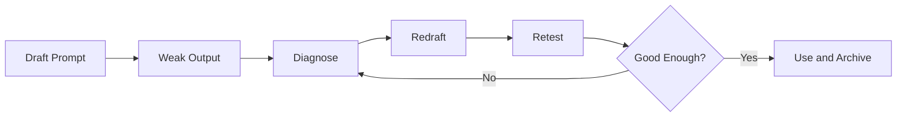
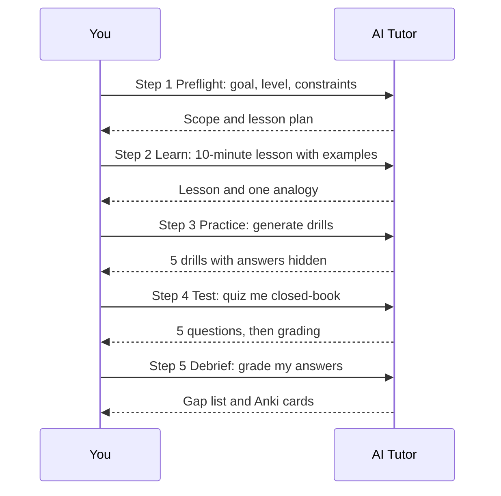

# Chapter 2: Prompt Foundations

> **Last Updated:** August 2026 | **Estimated Reading Time:** 60–75 minutes

Every AI-powered learning system from Chapter 1 runs on prompts, and most learners use prompts that are too vague to unlock real depth. This chapter teaches the engineering behind prompts: the universal 5-part structure, the anti-slop rules, format control, level ladders, and prompt chaining, all tuned for studying and placement prep. By the end you will have a reusable master study prompt, a prompt library, and a TypeScript template builder that fills your prompts with one command.

> **How to work this chapter** — 15–20 minutes of overhead on top of reading:
>
> 1. **Read** — 60–75 minutes, split across 2–3 commute blocks.
> 2. **Do** — run every **Try This** as you go; the chapter's power is in the prompts you actually execute.
> 3. **Prove** — score 8/10 or better on the Chapter Quiz before moving on.
> 4. **Produce** — your personal master study prompt (all 5 parts filled in) plus the first 5 entries of your prompt library.
>
> **Prerequisites:** Chapter 1. **Next:** Chapter 3.

## Learning Objectives

- Build any study prompt from the universal 5 parts: Role, Context, Task, Format, Constraints
- Write a master study prompt that produces structured, level-fitted lessons
- Run the prompt improvement loop: diagnose, redraft, retest
- Apply the 8 anti-slop rules to kill generic AI mush
- Control output format for tables, JSON, and Anki-ready CSV
- Use chain-of-thought, few-shot examples, and context injection correctly
- Climb the level ladder from ELI5 to expert without starting at the top
- Chain 4 to 6 prompts into a full study session and avoid the 8 common mistakes

## Chapter at a Glance

| Topic | Key Insight | Practical Takeaway |
|---|---|---|
| 5-part prompt | Every strong prompt has Role, Context, Task, Format, Constraints | Write all 5 parts before pressing send |
| Anti-slop rules | Generic prompts produce generic answers | Ban filler and demand examples, tradeoffs, and limits |
| Format control | The Format part decides table, JSON, or CSV output | Say the exact format and the exact columns |
| Level ladder | Start at ELI5 and climb, never at expert | Level is a prompt parameter, not a personality |
| Question-first | AI should quiz you, not lecture you | Flip the default: questions before explanations |
| Prompt chaining | One session equals 4 to 6 linked prompts | Plan the chain before the first message |



## Q1: What is the universal 5-part prompt, and what does each part do?

**Answer:** Every strong prompt has five parts. Role tells the model who it is, such as "interview coach" or "strict grader", which sets the style and priorities. Context gives it what it needs: your level, your syllabus, your deadline, your past attempts. Task states exactly what you want done, in one imperative sentence. Format describes the shape of the answer: table, JSON, list, or transcript. Constraints are the rules: no filler, no emojis, max N lines, cite sources, hide answers. Parts 1 and 4 are what most people skip, and they are exactly what separates a 3/10 output from a 9/10 output. The master template below is the skeleton you will reuse for every study prompt.

```
You are a {role}. Here is my context: I am a {level} learner preparing for {goal}.
My syllabus includes {syllabus topics}. My deadline is {deadline}.
Task: {one imperative sentence describing the exact job}.
Format: {table | JSON | list | transcript with columns or keys specified}.
Constraints: {ban filler, max length, no emojis, no praise, hide answers, cite sources if unsure}.
```

**How it works:** The five slots force you to think about output shape and boundaries before the model thinks for you. **Try This:** take your last prompt from this week and rewrite it with all 5 parts filled in, then compare the outputs.

## Q2: What does a full worked example look like, learning Kafka with the 5 parts?

**Answer:** Here is the same template applied to a real topic, showing how each part changes the model's behavior. The Role makes it a placement-oriented tutor, the Context pins your level and goal, the Task asks for a specific 3-section lesson, the Format fixes structure, and the Constraints forbid the generic mush. Notice the difference from "explain Kafka": this prompt demands examples, an analogy, and an interview question, which is the difference between reading and studying.

```
User: You are a placement interview tutor for backend and systems roles. I am a beginner-to-intermediate
learner, comfortable with Java and REST APIs, preparing for software engineering interviews.
I know what a message queue is but have never used Kafka. I have a 3-week deadline before my first
systems-design round. Task: teach me Kafka in 3 sections: the core model (topics, partitions,
offsets, consumer groups), one real-world example of how a payment system uses it, and the 3 most
common interview questions with model answers. Format: use headings for the 3 sections, keep each
section under 10 lines, end with a 3-line summary. Constraints: no filler, no praise, no analogies
that involve animals, one analogy maximum, and hide the interview answers behind a section
titled "ANSWERS" so I can test myself first.

AI: ## 1. The core model
Kafka is a distributed log. Producers append events to a topic; a topic is split into partitions;
each event gets an offset, a permanent position in the log. Consumers read the log at their own
pace, and a consumer group splits partitions between its members so each event is read by exactly
one consumer in the group. The log keeps events even after they are read, which is why replay is
possible: a new consumer starts at offset 0 and reads history.
Analogy: a train logbook. Every station event is written to the log in order, every train crew
reads it at their own speed, and the pages are never torn out after reading.
## 2. A payment system example
An order service produces "order created" events to the topic "orders". Three downstream
consumers, fraud check, inventory, and notification, form separate consumer groups. Fraud check
is slow but can read at its own pace because Kafka never deletes read events; notification can
lag without blocking the producer. If fraud check fails, it can replay its partition from the
last committed offset instead of losing events.
## 3. Interview questions
1. How are partitions and consumer groups related? 2. How does Kafka guarantee order within a
partition? 3. What happens when a consumer dies mid-processing?
## ANSWERS
1. A topic is split into partitions; each partition is consumed by exactly one consumer within a
group, so a group with fewer consumers than partitions leaves partitions idle, and a group with
more consumers than partitions has idle consumers. 2. Order is guaranteed within a partition
because the log position, the offset, is strictly sequential; producers assigning a key route
events for one entity to the same partition. 3. On death, the group rebalances: the partition
is reassigned, and the new consumer resumes from the last committed offset, so the risk is
duplicate processing rather than lost events, which is why consumers should be idempotent.
```

**How it works:** The 5 parts turned a generic "explain Kafka" into a testable study session with a built-in self-quiz. **Try This:** rewrite this transcript for your own topic, GraphQL, Redis, or any syllabus item, keeping all 5 parts and the ANSWERS section pattern.

## Q3: What is the master study prompt, and how do I use it daily?

**Answer:** The master study prompt is one copy-paste block that turns any topic into a full study session: lesson, analogy, examples, drills, quiz, and gap analysis. It combines all 5 parts and bakes in the pipeline from Chapter 1, so one message produces a complete micro-loop. Keep it saved in your notes app and change only the three placeholders: topic, level, and goal. After the AI answers, your only job is the drills and quiz; the prompt guarantees the structure, you supply the effort.

```
You are a {level} tutor for {goal}. Context: I study {minutes} minutes per session, my weak
areas are {weak areas}, and I am preparing for {target company or role}. Today's topic: {topic}.
Task: run a complete study session in this order:
1. LESSON: teach the core idea in 10 lines with one real-world analogy.
2. EXAMPLES: give 2 concrete examples with numbers or code-like steps.
3. DRILLS: generate 3 practice problems of increasing difficulty, no answers shown.
4. QUIZ: 3 multiple-choice questions on this topic.
5. GAPS: after I answer the drills and quiz, list my gaps as a ranked list.
Format: use numbered sections exactly as above, answers only in a final section titled
"ANSWERS TO 3 AND 4". Constraints: no filler, no praise, no emojis, stay under {word limit}
words, and never reveal drill or quiz answers before I ask.
```

**How it works:** One prompt produces the entire pipeline in a single thread, so daily study never renegotiates structure. **Try This:** save this prompt now, run it tonight on the topic from your velocity tracker's weakest list, and complete the drills without scrolling to ANSWERS.

## Q4: What is the prompt improvement loop: diagnose, redraft, retest?

**Answer:** Prompts are code, and bad output means a bug in the prompt, not a bad model. The loop has three steps. Diagnose: read the weak output and find which of the 5 parts failed, for example vague Task (explain is not a task), missing Constraints (no length or ban list), or wrong Format (you said explain, it gave an essay). Redraft: change exactly one part, never three at once. Retest: run the new prompt and compare against the old output on a rubric. Iterate until the output passes; archive the final version in your prompt library, because a working prompt is an asset you will reuse.

```
I ran this prompt: {paste your prompt}. I got this output: {paste the output}.
Diagnose it for me. For each of the 5 parts (Role, Context, Task, Format, Constraints),
say: worked, or failed and why, in one line each. Then give me a redrafted prompt that fixes
only the two worst failures, with the changed parts marked with [CHANGED]. Then list the 3
checks I should run on the next output to know it worked.
```

**How it works:** The diagnosis prompt turns vague frustration ("it's all generic") into a part-by-part bug report you can act on. **Try This:** take your weakest prompt from this week, run this loop twice, and archive the final draft with a name like "LESSON-ARRAYS-V2".

## Q5: How do I diagnose a weak prompt output quickly?

**Answer:** Run the output through a 30-second checklist. Is the answer generic enough to apply to any topic? Then the Task lacked specificity and Constraints lacked bans. Is it a wall of text with no structure? Then Format was missing. Is it too advanced or too childish? Then Context (your level) was wrong or missing. Does it sound confident but feel off? Then Constraints needed a "cite sources or mark uncertain" rule. Most weak prompts fail in exactly one part, so identify that part and redraft only it.

```
Evaluate this output: {paste output}. Apply this checklist and answer yes or no per item:
1. Could this answer apply to any topic (generic)?
2. Is it a solid wall of text with no structure?
3. Is the difficulty clearly mismatched to my stated level?
4. Does it contain claims with no sources or reasoning?
5. Does it use filler, praise, or vague phrases like "delve" or "in conclusion"?
Then, for every yes, tell me which of the 5 prompt parts to fix and give the one-line fix.
```

**How it works:** A binary checklist replaces "this feels wrong" with a concrete list of failing parts. **Try This:** run the checklist on the last 3 AI outputs you produced and fix the part that fails most often.

## Q6: What are the 8 anti-slop rules for study prompts?

**Answer:** Slop is generic AI mush: filler, fake structure, and safe sentences that teach nothing. Rule 1: ban filler words explicitly (delve, moreover, in conclusion). Rule 2: demand at least N concrete examples with real numbers. Rule 3: force tradeoffs, every technique must get one strength and one weakness. Rule 4: ban praise, no "great question" or "good point". Rule 5: cap length so the model cannot pad. Rule 6: demand a claim-to-evidence ratio, one reason per claim. Rule 7: require an application step, what to do differently tomorrow. Rule 8: end with a test, never let the output end with a summary.

```
Teach me {topic} with these anti-slop rules enforced strictly:
1. Banned words: delve, moreover, furthermore, in conclusion, it is important to note, landscape.
2. Minimum 3 concrete examples, each with real numbers or steps.
3. Every concept gets one strength and one limitation, in a table.
4. No praise, no "great question", no motivational sentences.
5. Maximum {word limit} words.
6. Every claim gets one reason or source reference.
7. End with an APPLICATION section: one thing I should do with this knowledge tomorrow.
8. Do not end with a summary paragraph.
```

**How it works:** Each rule targets a specific slop behavior, so the output is forced to carry content instead of style. **Try This:** run this on your next topic, then run the same topic with no constraints, and count which output teaches more per line.

## Q7: How do I control output format, starting with tables?

**Answer:** The Format part is a contract: say the exact shape, the exact columns, and the exact number of rows, and the model will fill it. Tables are the workhorse for comparisons, tradeoffs, and revision sheets. The trick is specifying columns and row count, because "make a table" alone produces random columns. For a comparison table, always list the columns you want and demand one row per item.

```
Create a comparison table for {topic A} vs {topic B} for an interview. Columns exactly:
Aspect | {topic A} | {topic B} | Interview Answer (one line).
Aspects to cover, in this order: definition, core mechanism, when to use, when NOT to use,
performance note, typical interview question. Exactly 6 rows. No extra columns, no header
fluff, no text outside the table, and one sentence per cell.
```

**How it works:** Columns, row order, and row count are all specified, so the model cannot drift into essays. **Try This:** generate this table for your next two competing topics, then quiz yourself by covering the Interview Answer column.

## Q8: How do I get JSON or CSV output, including Anki-ready cards?

**Answer:** JSON and CSV are the machine formats: JSON for anything you want to process with code, CSV for importing into Anki. The Anki CSV format is simple: front, back, tag, one card per line, so ask for exactly that column order and demand valid CSV escaping. The JSON contract works the same way: name the keys, the nesting, and the number of objects. Say "valid JSON" explicitly and demand nothing else in the output, because a stray markdown code fence breaks your parser.

```
Generate Anki-ready CSV for topic {topic}. Columns, in this exact order: front, back, tag.
Exactly {count} cards, one per line. Front: a cloze-style or question card from this topic.
Back: a 1-line answer with a short example. Tag: "course" plus the topic name in lowercase.
Rules: valid CSV with quotes around fields containing commas, no markdown formatting,
no code fences, no header row, no extra text before or after the data.
Here is the topic material: {paste your notes}.
```

**How it works:** The column contract plus the "no extra text" rule produces a file Anki imports directly, turning every lesson into spaced repetition. **Try This:** run this on your last lesson, import the CSV into Anki via File, Import, and review the cards tomorrow on your commute.

## Q9: What is chain-of-thought prompting for learning, and how do I use it?

**Answer:** Chain-of-thought asks the model to show its reasoning steps instead of jumping to an answer, which for learning serves two purposes: it models how an expert thinks through a problem, and it exposes the model's assumptions so you can question them. The learning version adds a twist: "show your reasoning, then quiz me on it." You get a worked solution path, then a test that forces you to reproduce the path yourself. Never paste the full reasoning chain into your notes; work the quiz first, then compare.

```
User: Solve this problem step by step, showing every intermediate step and why you chose it:
"Design a system that must serve {qps} requests per second with a {p99} latency target,
storing {data size} of user data." Show your reasoning out loud before you conclude.
After your solution, quiz me on it: ask me the 3 decisions you think I would get wrong,
and grade my answers against your reasoning. Do not reveal the quiz before I answer.

AI: Reasoning chain:
1. Start from QPS: {qps} requests per second. A single instance handles roughly
1,000 to 5,000 simple requests per second, so this workload needs horizontal scaling.
I choose a stateless API layer behind a load balancer, which is the default move.
2. Storage: {data size} of user data is small enough for a SQL database with replication;
a NoSQL store only earns its complexity at much larger scale or unusual access patterns.
3. Latency: p99 of {p99} requires caching the hot read set; I put a cache in front of the
database and design for cache miss spikes, because cold caches are where p99 dies.
4. Failure: I add read replicas and a primary-failover plan; the cost is write consistency,
so I must state the consistency choice explicitly.
Solution summary: stateless API layer, load balancer, SQL primary with read replicas,
cache in front, and an explicit consistency tradeoff.
Now, the quiz:
1. Why did I reject NoSQL for this workload? 2. Where does p99 usually break in this design?
3. What is the consistency tradeoff of the read replicas?
```

**How it works:** The reasoning chain is a worked example of expert decision-making, and the quiz converts it from reading material into retrieval practice. **Try This:** run this on a system-design prompt of your own, answer the 3 quiz questions in writing before reading the AI's grading.

## Q10: How do few-shot examples improve study prompts?

**Answer:** A few-shot prompt shows the model 1 to 3 complete examples of the output you want before asking for a new one. It works because models imitate patterns: one good example teaches the format, the tone, and the depth better than a paragraph of instructions. For study prompts, few-shot is the best way to teach a rubric, a card style, or a question format. Keep examples short and perfect, because the model copies flaws as eagerly as strengths.

```
Generate 5 interview questions for {topic}, following exactly this style.
Example 1: "How would you detect a memory leak in a long-running service?" Answer style:
one-line diagnosis, one tool, one prevention.
Example 2: "What happens to an HTTP request when the server is overloaded?" Answer style:
three-line story from client to server to failure, then one mitigation.
Rules: same question style, same answer style, questions must target {level} level,
no repetition of the examples, and one question per numbered line.
```

**How it works:** Two examples lock the pattern, so the 5 new questions come out in the exact style and depth you modeled. **Try This:** write 2 example questions in your own words for your target company, paste them as few-shots, and compare the generated 5 against your previous generic attempts.

## Q11: What is context injection, and how do I inject my own notes and failed attempts?

**Answer:** Context injection is pasting your real material into the prompt so the model answers from your world, not from generic knowledge. The three highest-value injections are your syllabus, your own notes, and your failed attempt at a problem. A failed attempt is the most powerful, because "here is what I did, grade it" produces feedback, while "solve this" produces a lecture. Keep injections short: a 200-line notes dump buries your actual question, so paste the relevant section plus a one-line pointer to the rest.

```
Here is my context. My notes on {topic}: {paste 10-30 lines of your notes}.
My failed attempt: {paste your attempt, code or reasoning}.
My task: grade my attempt against these notes. Tell me: what I got right (with the note line
that proves it), what I got wrong (with the correction), and the one concept from my notes
I clearly misunderstood. Then ask me to redo the attempt in my own words before you show
the model answer. Keep your grade under 15 lines.
```

**How it works:** Grading against your own notes makes the feedback verifiable and forces you to reconstruct the fix instead of copying it. **Try This:** next time you fail a DSA problem, paste your attempt plus your notes into this prompt and redo the problem after the grade.

## Q12: What is the level ladder, and why is starting at the expert level wrong?

**Answer:** The level ladder has 4 rungs: ELI5 (a 10-year-old), student (school level), graduate (college level), and expert (practitioner level). Starting at expert is wrong because you skip the conceptual skeleton, so you memorize jargon without a frame to hang it on, and you cannot debug your own understanding when an explanation is too deep. The right order is bottom-up with checkpoints: get the ELI5, explain it back, climb one rung, explain again, until the expert rung gives you the interview vocabulary. Each rung reuses the previous one, which is exactly how your memory is built.

```
Teach me {topic} using the level ladder, one rung per message:
1. ELI5: explain it as if I am 10, using one household analogy, 6 lines max.
2. Student: add the first real terms, still with everyday examples, 8 lines max.
3. Graduate: add the mechanism, the formulas or structures, and one real use case.
4. Expert: add the interview-ready details: tradeoffs, pitfalls, and one deep question.
After each rung, ask me to explain the rung back in 3 lines before you continue.
Do not advance a rung until my 3-line explanation is correct.
```

**How it works:** The checkpoint rule makes the model gate progress on your retrieval, so the ladder actually builds understanding instead of dumping 4 lectures. **Try This:** run the ladder on a topic you currently "know", and notice which rung your 3-line explanations get wrong.

## Q13: How do I make AI ask ME questions instead of lecturing?

**Answer:** Question-first prompts flip the default: instead of "teach me X", say "do not teach me anything, interview me on X." The model becomes a Socratic examiner that probes your existing knowledge, finds the gaps, and only then fills them. This is the strongest single prompt for placement prep because it trains retrieval under pressure, which is what interviews are. Use it on topics you think you already know; the gaps it finds are usually embarrassing and always useful.

```
User: Interview me on {topic} as if you are a hiring manager. Rules:
1. Do not teach me anything before I answer.
2. Start with 3 questions of increasing difficulty: easy, medium, hard.
3. After each of my answers, grade it in 2 lines and ask exactly one follow-up question
based on my answer.
4. Do not reveal the full model answer until I have answered all 3 questions plus follow-ups.
5. If my answer is wrong, mark it WRONG and give a one-line correction.
Topic: rate limiting. Begin.

AI: Question 1 (easy): What is rate limiting, and at which layer of an API stack would you
place it? 
(You answer.)
Question 2 (medium): A client sends 100 requests per second; your limit is 50. Show the
algorithm you would use to decide which requests pass.
(You answer.)
Question 3 (hard): How does rate limiting interact with a horizontally scaled set of API
instances, and what problem does a distributed counter introduce?
(You answer.)
Grading and follow-ups appear after each answer, then this final summary: the model answer
for all three questions, your WRONG marks, and the 3 Anki cards you should create tonight.
```

**How it works:** The grading and follow-up rules keep the session exam-like, and the closing summary converts the session into revision material. **Try This:** run this on your next "I know this" topic and write down the 3 wrong or shaky answers as your next study targets.

## Q14: What is prompt chaining, and how do I chain a full study session?

**Answer:** Prompt chaining breaks one study goal into 4 to 6 sequential prompts, where each message consumes the previous output. Chains beat one giant prompt when a task has stages: a giant prompt overloads context and the model forgets your constraints halfway through. The standard study chain is Preflight, Learn, Practice, Test, Debrief. You keep the same thread so the model remembers everything, and each step's output feeds the next step's input.



**How it works:** Each step has a single deliverable, so the session is a conveyor belt: scope, lesson, drills, quiz, gaps. **Try This:** run the chain above on one topic this week and note whether the Debrief gap list matches the weak topics in your velocity tracker.

## Q15: What are the 8 most common prompt mistakes?

**Answer:** Mistake 1: vague goals, "help me with DSA" instead of a specific task. Mistake 2: no format, so the answer shape is whatever the model felt like. Mistake 3: no constraints, so length and style run free. Mistake 4: one-shot-and-give-up, one weak output ends the technique instead of starting the improvement loop. Mistake 5: dumping context, a 300-line paste that buries the question. Mistake 6: asking for everything at once, ten questions in one message. Mistake 7: ignoring the answer, pasting model output into notes without doing the retrieval. Mistake 8: prompt-gasm, rewriting the whole prompt on every failure instead of changing one part.

| Mistake | Example | One-line fix |
|---|---|---|
| Vague goal | "help me with SQL" | "teach me the 4 join types with one example each" |
| No format | "explain Redis" | "use a table with 5 columns" |
| No constraints | "write a lesson" | "max 200 words, no filler, hide answers" |
| One-shot and quit | one weak answer, abandon | run the diagnose-redraft-retest loop |
| Context dump | 300 lines then a question | paste 10-30 lines, point to the rest |
| Everything at once | 10 questions in one message | chain 4 to 6 prompts instead |
| Ignoring the answer | notes grow, recall flat | quiz yourself on the output same day |
| Prompt-gasm | rewrite everything per failure | change exactly one part per retest |

**How it works:** Naming the mistake tells you the fix: each row is a symptom-to-repair mapping. **Try This:** grade your last 10 prompts against this table and fix the row that appears most.

## Q16: How do I grade AI output instead of just accepting it?

**Answer:** Treat AI output like a junior developer's PR: review it against a rubric before you merge it into your brain. Grade on accuracy (facts you can verify), relevance (answers the actual task), level fit (matches your ladder rung), and actionability (ends in a test or next step). Score each out of 10, reject anything below 7 on accuracy, and run the diagnose-redraft loop on anything below 7 on relevance.

```
Grade this AI output for me: {paste the output}.
Rubric: Accuracy (out of 10, with one claim to verify), Relevance (out of 10, does it answer
my task: {paste task}), Level fit (out of 10, my level is {level}), Actionability (out of 10,
does it end in practice or a test).
Give a total out of 40, a verdict (ship, fix, or reject), and if not ship, the one prompt
change that would fix it.
```

**How it works:** A scored rubric turns "this feels useful" into a ship/fix/reject decision with an explicit reason. **Try This:** grade your last study output now, and if the verdict is fix, run the suggested one-line change immediately.

## Q17: How do I tune AI output without touching settings: length, difficulty, tone?

**Answer:** Every tuning knob can be expressed in natural language inside the prompt, so you never need the settings panel. Length: "max N lines" or "exactly 5 sentences". Difficulty: your ladder rung plus a constraint like "assume I do not know joins". Tone: "like a strict reviewer", "no praise", "treat me like a peer". The reliable pattern is state the knob, the value, and the consequence: "if I get a quiz question wrong, stop and re-teach that concept." Settings in the app are session-wide; prompt knobs are per-message, which is more precise.

```
Answer with these knobs set for {topic}:
- Length: exactly {min} to {max} lines, no more.
- Difficulty: {level} rung, and if my level seems off, say so instead of adjusting silently.
- Tone: {tone}, no praise, no motivational sentences.
- Feedback rule: after any wrong answer I give, stop and re-teach that exact concept in 3 lines.
- Pace: {fast | normal | slow}, where slow means one concept per message.
```

**How it works:** Knob lines act like typed parameters: the model applies them deterministically instead of guessing your preferences. **Try This:** run one topic twice, once with slow pace and once with fast, and keep the one whose session quiz scores were higher.

## Q18: How do I defend against hallucinations in study output?

**Answer:** Treat every AI fact as a draft until verified, especially in topics you cannot check yourself. Three defenses: demand sources ("name the RFC, docs page, or paper"), demand uncertainty flags ("if you are not certain, mark it UNCERTAIN"), and cross-check with Perplexity or the official docs for anything you will memorize. Interview damage from hallucination is real: you will answer confidently and wrong. Build the verification step into your review loop so facts are checked the same day they are learned.

```
I am about to memorize facts about {topic}. List the 5 most important facts an interviewer
would test. For each fact: state it, then either give a source name (documentation page,
RFC, spec, official docs) or mark it UNCERTAIN if you cannot. If a fact is commonly
misstated in tutorials, flag it with MISLED and explain the correct version.
Then list 3 facts you think I should double-check myself before memorizing.
```

**How it works:** The source-or-uncertainty contract forces the model to separate its confident knowledge from its guesses. **Try This:** run this on the facts you learned this week, and verify the UNCERTAIN and MISLED rows in the official docs today.

## Q19: How do I build a personal prompt library?

**Answer:** A prompt library is a folder of saved prompts, one file per prompt, named by job: LESSON, DRILLS, QUIZ, ANKI, GRADER, LADDER, INTERVIEW. Each file holds the 5-part prompt plus a usage note: when to run it, what placeholders to fill, and the rubric it passes. The library is the payoff of the improvement loop: every prompt you iterate to "ship" gets archived, and over a month you accumulate 10 to 15 prompts that cover the entire course. Store it in a version-controlled folder, because prompts are code assets with history.

```
Convert my saved prompts into a clean library. Here are my drafts: {paste your prompts}.
For each: give me the filename (kebab-case, job-based), the final 5-part prompt text,
a one-line WHEN TO USE note, and the placeholders it needs. Order the library by study
flow: plan, learn, drill, quiz, review. Flag any two prompts that overlap so I can merge them.
```

**How it works:** A named, deduplicated library turns scattered chats into reusable assets that make every future topic faster. **Try This:** create the folder tonight, save your 3 best prompts from this week, and set the target of 10 prompts by month end.

## Q20: How do I manage context limits when prompts get long?

**Answer:** When your material outgrows the context window, compress before you paste. Three techniques: summarize-then-paste (ask the model to summarize your notes into 20 lines, then paste that summary into the real prompt), chunk-by-question (paste only the section the question needs), and thread-per-topic (a fresh thread resets context, so long courses run better as one thread per topic). The symptom of context overload is the model forgetting your early instructions mid-session; when that happens, do not add more text, cut context instead.

```
My notes on {topic} are longer than the context window. Summarize them into exactly 20 lines
that preserve: the definitions, the 3 most important examples, the common pitfalls, and any
numbers or formulas. Then I will paste this summary into my study prompt, so optimize for
information density, not style. Here are my notes: {paste the relevant section}.
```

**How it works:** A 20-line summary carries the syllabus while keeping the model focused on your actual question. **Try This:** the next time a session degrades mid-thread, restart with a compressed summary and a fresh thread, and compare answer quality.

## Q21: What is the prompt template builder, and how do I automate placeholder filling?

**Answer:** The template builder is a tiny TypeScript tool that stores your master prompts and fills {placeholders} with values, so you never retype the 5-part skeleton. It also reports missing placeholders before you send, which prevents the classic mistake of sending a prompt with empty slots. Store templates as plain strings in the code, run it before each session, and paste the filled prompt into your chat app. This is the automation layer of your prompt library: library for humans, builder for speed.

```typescript
type Template = {
  name: string;
  text: string;
};

const templates: Template[] = [
  {
    name: "lesson",
    text: "You are a {level} tutor for {goal}. Teach me {topic} in 10 lines with one analogy, " +
      "then 3 drills, then a quiz. Format: numbered sections. Constraints: no filler, no praise, " +
      "hide answers until I ask.",
  },
  {
    name: "anki",
    text: "Generate {count} Anki cards for {topic} as CSV with columns front, back, tag. " +
      "No header row, no code fences, no extra text. Tag: course-{subject}.",
  },
  {
    name: "interview",
    text: "Interview me on {topic} for {company}. Start easy, go hard, grade each answer in " +
      "2 lines, and do not reveal model answers until I finish all questions.",
  },
];

class PromptTemplateBuilder {
  private registry = new Map<string, string>();

  constructor(templates: Template[]) {
    for (const t of templates) {
      this.registry.set(t.name, t.text);
    }
  }

  fill(name: string, values: Record<string, string>): string {
    const template = this.registry.get(name);
    if (!template) {
      throw new Error("Unknown template: " + name);
    }
    return template.replace(/\{(\w+)\}/g, (match, key: string) => {
      const value = values[key];
      if (value === undefined || value.trim() === "") {
        throw new Error("Missing placeholder {" + key + "} in template " + name);
      }
      return value;
    });
  }

  missing(name: string, values: Record<string, string>): string[] {
    const template = this.registry.get(name);
    if (!template) {
      return [name];
    }
    const needed = [...template.matchAll(/\{(\w+)\}/g)].map((m) => m[1]);
    return [...new Set(needed)].filter((key) => values[key] === undefined || values[key].trim() === "");
  }

  list(): string[] {
    return [...this.registry.keys()];
  }
}

const builder = new PromptTemplateBuilder(templates);

console.log("Available templates:", builder.list().join(", "));
console.log("");
console.log("Missing check for 'lesson':", builder.missing("lesson", { level: "beginner", goal: "placements" }));
console.log("");
const filled = builder.fill("lesson", {
  level: "beginner",
  goal: "software engineering placements",
  topic: "TCP vs UDP",
});
console.log("--- FILLED LESSON PROMPT ---");
console.log(filled);
```

**How it works:** The builder centralizes your best prompts, fails loudly on empty placeholders, and prints a paste-ready prompt in one command. **Try This:** add your own master study prompt from Q3 as a template, fill it with your next topic, and paste the result into your chat app tonight.

## Summary

- The universal 5-part prompt (Role, Context, Task, Format, Constraints) is the base of every strong study prompt.
- The master study prompt runs a full session: lesson, examples, drills, quiz, and gap analysis in one message.
- Prompts are code: diagnose, redraft one part, retest, and archive what ships.
- The 8 anti-slop rules force examples, tradeoffs, length caps, and bans on filler and praise.
- Format contracts produce tables, JSON, and Anki-ready CSV with exact columns and no stray text.
- Chain-of-thought, few-shot examples, and context injection make the model show reasoning, imitate rubrics, and grade your real attempts.
- Climb the level ladder bottom-up with a checkpoint per rung, and run question-first sessions on topics you think you know.
- Chain 4 to 6 prompts per session, avoid the 8 common mistakes, and automate with a template builder.

## Practical Takeaways

| Technique | Prompt / Command | When to Use |
|---|---|---|
| 5-part structure | "You are {role}. Context: {level}, {goal}. Task: ... Format: ... Constraints: ..." | Every single prompt |
| Master study prompt | "Run a complete study session: lesson, examples, drills, quiz, gaps" | Daily study sessions |
| Improvement loop | "Diagnose this prompt by the 5 parts, redraft the 2 worst" | Any weak output |
| Anti-slop | "Banned words ..., minimum 3 examples, no praise, max N words" | Every lesson prompt |
| Table format | "Columns exactly ..., exactly 6 rows, no text outside the table" | Comparisons and tradeoffs |
| Anki CSV | "CSV with columns front, back, tag, no code fences, no header" | After every lesson |
| Chain-of-thought | "Show your reasoning step by step, then quiz me on it" | System design and DSA |
| Few-shot | 2 example Q&A pairs, then "generate 5 in exactly this style" | Question generation |
| Context injection | "Grade my attempt against these notes" | After every failed problem |
| Level ladder | "Teach me {topic}, ELI5 first, checkpoint each rung" | New topics, topics you "know" |
| Question-first | "Do not teach me anything, interview me first" | Topics you think you know |
| Template builder | `npx ts-node prompt-template-builder.ts` | Before every study session |

## Chapter Quiz

1. What are the 5 parts of the universal prompt?

<details><summary>Answer</summary>Role, Context, Task, Format, Constraints. Role sets the persona, Context gives your level and goal, Task states the exact job, Format fixes the output shape, and Constraints set the rules and boundaries.</details>

2. Which two parts do most people skip, causing the biggest quality loss?

<details><summary>Answer</summary>Format and Constraints. Skipping Format produces random-shaped answers, and skipping Constraints produces generic, padded, praise-filled mush.</details>

3. What is the correct first step of the prompt improvement loop?

<details><summary>Answer</summary>Diagnose: read the weak output and identify which of the 5 parts failed. Then redraft exactly one part and retest, never change three parts at once.</details>

4. Which anti-slop rule directly targets "delve", "moreover", and "in conclusion"?

<details><summary>Answer</summary>Rule 1: ban filler words explicitly. The prompt lists banned terms and instructs the model to never use them, which is the cheapest way to kill padded prose.</details>

5. What columns must Anki-ready CSV output have, in what order?

<details><summary>Answer</summary>front, back, tag, in that exact order, with no header row, no code fences, and no extra text. Quote fields that contain commas.</details>

6. Why is starting at the expert level of the ladder wrong?

<details><summary>Answer</summary>Because you skip the conceptual skeleton, so you memorize jargon without a frame to attach it to. Climbing bottom-up with checkpoints builds understanding that survives probing questions.</details>

7. What does "question-first" prompting ask the model to do first?

<details><summary>Answer</summary>Interview you before teaching anything. The model starts with graded questions and only reveals explanations after you answer, which trains retrieval under interview pressure.</details>

8. What is the standard 5-step study chain in prompt chaining?

<details><summary>Answer</summary>Preflight, Learn, Practice, Test, Debrief. Each step consumes the previous output in the same thread, ending with a gap list and Anki cards.</details>

9. Which mistake is "rewriting the whole prompt on every failure"?

<details><summary>Answer</summary>Prompt-gasm. The fix is to change exactly one part per retest so you can measure which change fixed the output.</details>

10. What does the template builder do when a placeholder is missing?

<details><summary>Answer</summary>It throws an error naming the missing placeholder, so you never send a prompt with empty slots. It also fills valid placeholders and prints a paste-ready prompt.</details>

## Exercises

1. Rewrite your 3 most-used prompts from last week using all 5 parts, and run one topic through both the old and new versions. Write a 3-line comparison of output quality.
2. Take your weakest prompt and run the diagnose-redraft-retest loop twice, saving each draft. Archive the final version in a prompt library folder named by job.
3. Convert your last week of notes into Anki cards using the CSV prompt, import them into Anki, and review them on tomorrow's commute. Note how many cards survived import without edits.
4. Run the level ladder on one topic you believe you know, with the checkpoint rule. Record which rung your 3-line explanations first failed, and study that rung explicitly.
5. Run a question-first interview session on that same topic and list the 3 answers you got wrong or shaky. Turn each into a gap in your velocity tracker.
6. Extend the TypeScript template builder with your master study prompt from Q3 plus one template of your own, and use it to produce tomorrow's filled prompt. Add the two missing-placeholder tests to prove it fails loudly.

## Further Reading

- [OpenAI Prompt Engineering Guide](https://platform.openai.com/docs/guides/prompt-engineering)
- [Anthropic Prompt Engineering Overview](https://docs.anthropic.com/en/docs/build-with-claude/prompt-engineering/overview)
- [Anthropic Prompt Library](https://docs.anthropic.com/en/prompt-library/library)
- [Google Gemini Prompting Guide](https://ai.google.dev/gemini-api/docs/prompting-intro)
- [ChatGPT Prompt Engineering for Developers (DeepLearning.AI)](https://www.deeplearning.ai/short-courses/chatgpt-prompt-engineering-for-developers/)
