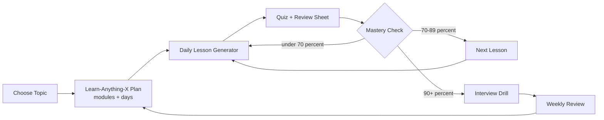
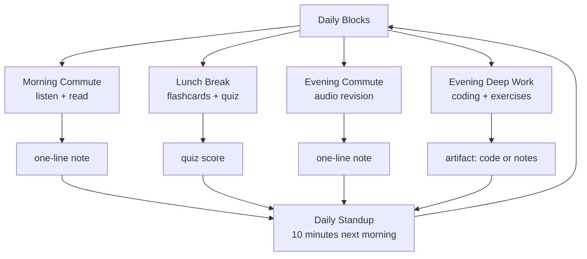

# Chapter 3: The Learn-Anything Blueprint

> **Last Updated:** August 2026 | **Estimated Reading Time:** 60–75 minutes

You do not need to study harder; you need a machine that turns any topic into a day-by-day plan. This chapter gives you the master template that converts any topic, syllabus, or deadline into daily lessons, quizzes, and a measurable mastery score. Every prompt is copy-paste, every output feeds the next step, and every plan is built for a working professional with 4 hours of daily commute.

> **How to work this chapter** — 15–20 minutes of overhead on top of reading:
>
> 1. **Read** — 60–75 minutes, split across 2–3 commute blocks.
> 2. **Do** — run every **Try This** as you go; the chapter's power is in the prompts you actually execute.
> 3. **Prove** — score 8/10 or better on the Chapter Quiz before moving on.
> 4. **Produce** — a day-by-day Learn-Anything-X plan for one real topic; start with your weakest placement subject.
>
> **Prerequisites:** Chapter 2. **Next:** Chapter 4.

## Learning Objectives

- Build a complete Learn-Anything-X plan for any topic in a single copy-paste prompt
- Convert a huge syllabus (like a 24-module placement course) into a prioritized day-by-day schedule
- Generate a curriculum from scratch, prerequisites included, for a topic you know nothing about
- Choose and apply the right crash format: 2-day, 7-day, 14-day, 21-day, or 30-day
- Generate self-contained 30–45 minute daily lessons, quizzes, and one-page review sheets
- Track mastery percent per topic with a 0–100 rubric and observable checkpoints
- Fit any plan into a real week: 4h of commute blocks plus 2h of evening deep work
- Run weekly reviews and re-plan mid-course without losing momentum

## Chapter at a Glance

| Topic | Key Insight | Practical Takeaway |
|-------|-------------|--------------------|
| Learn-Anything-X mega-prompt | One template drives the whole study loop | Paste it once, reuse it for every topic you ever study |
| Syllabus-to-plan conversion | Modules map to days, interview-critical content first | Cut the 80/20 content up front, before you start |
| Crash formats | 2/7/14/21/30-day plans are different games | Match the format to the deadline, not to the topic |
| Daily lesson generator | Self-contained lessons kill "what do I do today?" | Generate tomorrow's lesson tonight, not in the morning |
| Mastery rubric | 0–100 score per module, checkpoints gate progress | Score yourself weekly; let the plan adapt to the score |
| Block-aware scheduling | Commute is for absorbing, evening is for building | Route content types to the right block of the day |

## The Learn-Anything Loop



## Time-Block Map for a Working Professional



## Q1: What is the master Learn-Anything-X template?

**Answer:** The Learn-Anything-X template is one mega-prompt that produces a full study system: prerequisites, curriculum modules, a day-by-day plan, per-day lessons, quizzes, review days, and mastery checkpoints. It makes every decision explicit up front: your goal, deadline, daily hours, level, and output format. Keep the output in one notes file and re-feed it to the AI in later prompts so every session shares the same context. Replace the {placeholders} once and reuse the template for every topic.

```text
You are my personal curriculum designer and study planner.
GOAL: I want to learn {TOPIC} well enough to {GOAL, e.g. "answer
placement interview questions at mid-level engineer depth"}.
CONSTRAINTS: I have {N} days. I can study {H} hours per day.
MY LEVEL: {CURRENT_LEVEL, e.g. "working software engineer, no prior
exposure, comfortable with TypeScript"}.
TOOLS I HAVE: {TOOLS, e.g. "laptop, phone, ChatGPT, Claude"}
Build me a complete Learn-Anything-X plan:
1. PREREQUISITES: what I must already know. Fold anything missing in
   as Day 0 content.
2. CURRICULUM: 5-8 modules, each with a one-line goal, ordered by
   dependency (nothing used before it is defined).
3. DAILY PLAN: one self-contained lesson per day: title, 3-5
   subtopics, one hands-on exercise, one 5-question quiz.
4. REVIEW DAYS: mark days where I only revise and re-quiz earlier
   lessons. Insert them every 4th day.
5. MASTERY CHECKPOINTS: per module, define what 80% mastery looks
   like in observable terms (e.g. "can build X without help").
6. OUTPUT FORMAT: markdown tables and short bullets only. Be
   specific enough that I never ask "what do I do today?".
```

**How it works:** The prompt forces the AI to commit to a concrete plan with dates, outputs, and measurable goals instead of vague advice. Your constraints are the variables that make every plan unique.

**Try This:** Run the template on "Docker and containers" with 14 days, 3 hours per day, goal "deploy a small app in interviews." Save the plan; you will reuse it in Q5 and Q12.

## Q2: How do I convert a huge syllabus into a study plan?

**Answer:** Paste the entire syllabus and let the AI act as a scheduler, not a teacher. The key moves: let the AI assign priorities (High/Medium/Low for interview value), estimate hours per module, and map modules onto days so interview-critical content lands in the first half. A syllabus is a list of facts; a study plan is a sequence of actions with deadlines. Include chapter titles and rough sizes so the AI can estimate effort, and expect a 20–40 percent estimate correction after your first week of real data.

```text
Here is my full syllabus. Convert it into a day-by-day study plan.
MY SYLLABUS (paste below; include module and chapter titles, do not
summarize it yourself):
{syllabus text}
MY TIME: {N} days, {H} hours/day.
MY GOAL: {GOAL, e.g. "crack the first technical round of a software
engineering placement"}.
Produce:
1. MODULE TABLE: module | chapters | estimated hours | priority
   (High/Medium/Low for placement interviews).
2. DAY MAP: day | module(s) | chapters | output artifact for that
   day (notes, code, quiz score).
3. THE 20/80 CUT: which 20% of this syllabus produces 80% of
   interview value; put it in the first half of the plan.
4. TRADE-OFF RULES: if I fall behind, state exactly what to cut
   first (always lowest-priority modules, never foundations).
```

**How it works:** The AI re-orders your static syllabus by dependency and priority, then converts it into daily sessions with named outputs. You end up with a schedule, not a list.

**Try This:** Paste your 24-module placement course's module list with a 45-day deadline and 6 hours/day. Check that the AI put DSA, system design, and core ML before the peripheral modules.

## Q3: How do I generate a curriculum for a topic I know nothing about?

**Answer:** The "from zero" prompt builds a prerequisite chain upward instead of compressing downward. The AI lists the skills you need, from basic to advanced, and gives each a gate check so you can skip what you already know. This prevents the classic failure of jumping into a topic and drowning in jargon. Ask the AI to identify the minimum prerequisite chain, because topics like Transformers or Kafka have a deep stack under them.

```text
I know nothing about {TOPIC}. Build me a learning path from zero.
CONTEXT: I am a {JOB_PROFILE} with {BASIC_SKILLS, e.g. "TypeScript,
high-school math, no machine learning background"}.
FINAL TARGET: {TARGET, e.g. "I can build and explain a simple RAG
pipeline"}.
Do this:
1. PREREQUISITE CHAIN: the skills I need, from most basic to the
   topic itself. For each: what it is, why the topic needs it, how
   long it takes.
2. GATE CHECKS: for each prerequisite, a 3-question self-test so I
   can skip it if I already know it.
3. LEARNING ORDER: the chain as modules with time estimates.
4. RESOURCE MAPPING: per module, one video, one docs page, and one
   AI chat session to use.
5. FIRST SESSION: the exact first 30 minutes I should spend today,
   step by step.
```

**How it works:** The AI backfills everything a beginner needs instead of assuming knowledge, and the gate checks stop you from wasting days on things you already know. The first-session output converts planning into action immediately.

**Try This:** Run it on "Apache Kafka", then on "Transformers and attention". Compare the prerequisite chains: the second should be much longer, and that difference is your real syllabus.

## Q4: How do 7/14/21/30-day crash plans differ?

**Answer:** Different deadlines require different learning strategies. A 2-day plan is exposure: mental model, core mechanics, one artifact. A 7-day plan adds a build day and an interview-drill day. A 14-day plan is a 7-day plan run twice: pass one for exposure, pass two for depth plus a real project and comparisons. A 21-day plan is three weekly blocks: foundations, project, polish. A 30-day plan is one week of concepts, one of coding, one of project, one of revision and mocks. Longer plans assume you will forget, so they schedule re-quizzes; with only 30 minutes a day, use the 10-10-10 emergency format: concept, exercise, quiz, no extras.

```text
Create a crash-course plan for {TOPIC}.
FORMAT: {FORMAT, e.g. "7-day"} ({DAYS} days, {HOURS} hours/day).
MY LEVEL: {LEVEL}. TARGET: {TARGET, e.g. "pass an interview round"}.
Apply the correct template:
- 2 DAY (weekend): Day 1 = mental model + core concepts + first
  exercise. Day 2 = one end-to-end artifact + 5 interview questions.
- 7 DAY: Days 1-2 foundations, Days 3-4 core mechanics, Day 5 build
  something real, Day 6 edge cases + depth, Day 7 review + drills.
- 14 DAY: run the 7-day plan twice. Pass 1 = exposure. Pass 2 =
  depth: project + comparisons ({X} vs {Y}) + mock questions.
- 21 DAY: three 7-day blocks: (1) foundations, (2) project, (3)
  polish: cheat sheets + mocks + weak-topic repair.
- 30 DAY: Week 1 concepts, Week 2 code every example, Week 3 build
  an artifact, Week 4 revision + mocks + cheat sheet.
- 30 MINUTES/DAY: every day exactly 10 min concept + 10 min one
  exercise + 10 min recall quiz; day 1 makes an artifact, the final
  day makes a cheat sheet.
Fill in {TOPIC}-specific lessons per day. End every day with a
5-question quiz and a "done means you can explain..." definition.
```

**How it works:** Each template encodes a proven schedule shape for that deadline, so you never improvise the pacing. The AI only fills in the topic-specific content.

**Try This:** Generate "system design basics" in 7-day and 30-day formats. Compare Week 1 of the 30-day plan with the whole 7-day plan to see how the long format splits one day's topic across several sessions.

## Q5: What is the daily lesson generator?

**Answer:** The daily lesson generator turns "Day 4 of the plan" into a self-contained 30–45 minute lesson, so you never open the plan and wonder what to do. It works best when you feed it yesterday's one-line recall plus today's plan entry, which creates continuity between sessions. The output has a fixed skeleton: big idea with an analogy, 3–5 core points, interview relevance, a 10-minute drill, a hidden-answer quiz, and a one-line recall sentence. Generate tomorrow's lesson tonight; commute time in the morning should be spent reading a prepared lesson, not planning.

```text
Generate today's lesson.
TOPIC: {TOPIC}
LESSON: number {N} of {TOTAL} in the plan below.
PLAN CONTEXT: {plan excerpt, e.g. "Day 4: Kafka partitions"}
TODAY'S SUBTOPICS: {SUBS, e.g. "partitions, replicas, producers"}
MY LEVEL: {LEVEL}
TIME BUDGET: 30-45 minutes.
FORMAT: {FORMAT, e.g. "text I can read on the commute, plus one
coding exercise for the evening block"}
YESTERDAY'S ONE-LINE RECALL: {paste it}
The lesson must be self-contained:
1. BIG IDEA: one paragraph with a non-technical analogy.
2. CORE: 3-5 numbered points, each with a mini-example.
3. WHY IT MATTERS: 2 interview-relevant reasons.
4. DRILL: one exercise I can do in 10 minutes (code or pencil).
5. QUIZ: 5 questions with answers hidden.
6. ONE-LINE RECALL: the sentence I should write down and repeat at
   the end of the day.
```

**How it works:** The fixed skeleton makes every lesson the same shape, so your brain builds a routine, and the one-line recall gives you a hook for tomorrow's lesson. The budget keeps lessons small enough to finish in one commute.

**Try This:** Generate tomorrow's "Day 3" Kafka lesson tonight, read it on the morning commute, do the drill in the evening, write the one-line recall. Repeat for 3 days and count how often you finished a full lesson.

## Q6: How do I get quizzes and review sheets generated per lesson?

**Answer:** Quiz and review generation is a separate prompt from lesson generation, and it should run right after you finish the lesson, not before. The review pack has three parts: a 10-question MCQ quiz with hidden answers, a one-page review sheet under 25 lines, and 8 recall cards formatted for spaced repetition. The quiz serves tomorrow's lunch block, the review sheet serves the same week's evening commute, and the cards feed a re-quiz schedule.

```text
From the notes below, generate a review pack.
MY NOTES (paste the lesson or your notes from it):
{lesson content or your notes}
Generate:
1. QUIZ: 10 MCQs (3 easy, 4 medium, 3 hard) plus 2 "explain in one
   sentence" questions. Answers hidden, with a 1-line explanation.
2. REVIEW SHEET: one page, max 25 lines: 5 definitions, key numbers
   with units, common mistakes, one analogy, and an "interview
   answer skeleton" (3 bullets I can say when asked about {TOPIC}).
3. RECALL CARDS: 8 question-answer pairs formatted exactly as:
   FRONT: ...
   BACK: ...
   Keep every card under 20 words so I can import them later.
```

**How it works:** The three-part pack covers three memory functions: testing (quiz), consolidation (review sheet), and spaced retrieval (cards). One call keeps the artifacts consistent with each other.

**Try This:** After your next Kafka lesson, run this prompt; schedule the quiz for tomorrow's lunch, the review sheet for Thursday's commute, and the 8 cards for a re-quiz next week.

## Q7: How do I track mastery percent per topic?

**Answer:** Mastery tracking works best as a 0–100 rubric with six bands that describe observable behavior, not feelings: can't define (0–19), one-sentence definition (20–39), own-words explanation (40–59), explanation plus example plus guided problems (60–79), build from scratch without help (80–89), teach it and answer follow-ups cold (90–100). You score each module weekly against this rubric, and the score decides what you study next. The AI builds the rubric from your actual module list and then acts as your scoring partner every Sunday.

```text
Build a mastery tracker for my plan.
TOPIC: {TOPIC}
MODULES: {paste your module list from the plan}
For each module, define a 0-100 rubric in these bands:
- 0-19: cannot define it
- 20-39: can define it in one sentence, no depth
- 40-59: can explain it in my own words, no examples
- 60-79: can explain it, give an example, solve guided problems
- 80-89: can build or derive it from scratch without help, and
  explain tradeoffs
- 90-100: can teach it, handle edge cases, answer follow-ups cold
Also give me a WEEKLY SCORING RITUAL: a short prompt I run every
Sunday that asks me 3 questions per module and produces one number
per module plus one instruction: "study {module} next because ...".
```

**How it works:** Observable bands prevent the "I feel like I know it" trap, because you cannot score 80 without actually building something. The weekly ritual makes the score repeatable, so trends mean something.

**Try This:** Score three placement modules right now (say, arrays, hash maps, trees). Anything under 60 is next week's plan, not your "interests".

## Q8: Worked demo — 7-day Kafka plan (full transcript)

**Answer:** The Learn-Anything-X mega-prompt in practice. The AI sizes the plan against your hour budget, answers "why" questions with interview-grade depth, and converts plan lines into ready-to-study lessons on demand.

```text
You: I want to learn Apache Kafka in 7 days, 1.5h a day. Java
     backend dev, zero Kafka knowledge. Goal: explain Kafka in
     interviews and build a producer-consumer demo.
AI: 7 days at 1.5h = ~10.5 hours. Enough for a solid "explain it and
    demo it" level. Plan:
    Day 1 - Mental model: Kafka is a distributed append-only log,
    not a queue. Topics, partitions, offsets. Exercise: draw a topic
    with 3 partitions and 2 consumer groups. Quiz: 5 questions.
    Day 2 - Producers: acks=0/1/all, batching, idempotence.
    Exercise: write a producer with acks=all. Quiz: 5 questions.
    Day 3 - Consumers: consumer groups, rebalancing, offsets,
    at-least-once semantics. Exercise: two consumers in one group.
    Quiz: 5 questions.
    Day 4 - REVIEW DAY: re-quiz days 1-3, fix leaks.
    Day 5 - Storage and replication: partitions as shards, repli-
    cation factor, leader/follower. Exercise: kill a broker in a
    local kraft-mode cluster. Quiz: 5 questions.
    Day 6 - Ordering, exactly-once, when Kafka is the wrong tool.
    Exercise: Kafka vs RabbitMQ for 3 scenarios. Quiz: 5 questions.
    Day 7 - Interview drill: "why is Kafka fast?", "how does a
    consumer group scale?", "what happens when a broker dies?" plus
    a timed 3-minute explanation of the whole system.
You: Why partitions? Why not one big queue?
AI: One big queue has no parallelism (one consumer reads everything
    in order) and no scaling (you add consumers, but there is nothing
    to split). Partitions are the unit of parallelism AND ordering:
    within a partition order holds, across partitions it does not.
    That tradeoff, "parallelism vs global ordering", is the most
    common Kafka interview question.
You: Make Day 3's lesson with the consumer-group exercise, please.
AI: Day 3 - Consumers and consumer groups (30-45 min).
    BIG IDEA: a consumer group is a team sharing a newspaper: each
    person takes different sections (partitions), nobody reads the
    same article, and if one leaves, the rest re-divide.
    CORE: (1) each partition is consumed by exactly one group
    member; (2) members beyond partition count sit idle; (3)
    rebalancing moves partition ownership on join/leave; (4) offsets
    track position, committed periodically; (5) at-least-once means
    duplicates are possible, so consumers must be idempotent.
    WHY IT MATTERS: "explain consumer group rebalancing" is a top-5
    question; duplicate handling is a real design decision.
    DRILL: create a topic with 3 partitions, run two consumers in
    one group, send 6 messages, verify 3 per consumer, then kill one
    consumer and watch the rebalance.
    QUIZ: 5 questions (answers hidden).
    ONE-LINE RECALL: "Within a partition order is guaranteed; across
    partitions it is not; consumer groups split partitions, not
    messages."
```

**How it works:** The transcript shows the three engine behaviors you will rely on: sizing the plan against your hour budget, answering "why" questions with interview-grade depth, and converting plan lines into ready-to-study lessons on demand.

**Try This:** Replay this transcript for "Apache Airflow" with your real hour budget. When the AI suggests a Day 4 review, keep it: review days are load-bearing, not filler.

## Q9: Worked demo — 7-day GraphQL plan

**Answer:** GraphQL is a smaller topic than Kafka, so the AI compresses the plan and shifts weight toward schema design and client usage: fewer mechanics days, more build days, and an interview-specific final day. Prior knowledge changes the plan shape, and the follow-up asks (why, tighten, quiz me) are the three conversational moves that keep a plan alive.

```text
You: Same template, but GraphQL. 7 days, 1.5h/day. I know REST
     well. Goal: interview-level GraphQL plus a small demo API.
AI: Your REST background is a shortcut: you know the problem space.
    Day 1 - What GraphQL solves: over-fetching, under-fetching,
    N+1 requests. The type system as a contract. Exercise: hand-
    write the schema for a blog (Post, Author, Comment).
    Day 2 - Schema types: scalars, objects, enums, lists, non-null,
    interfaces, unions. Exercise: add a SearchResult union.
    Day 3 - Queries and resolvers: query to resolver mapping, depth,
    the N+1 problem and DataLoader. Exercise: add a DataLoader.
    Day 4 - REVIEW DAY: re-quiz days 1-3.
    Day 5 - Mutations, subscriptions, input types, validation.
    Exercise: a mutation with validation rules.
    Day 6 - Clients and caching: fragments, variables, normalized
    cache, why caching is harder than REST. Exercise: 3 queries
    with fragments.
    Day 7 - Interview drill: "GraphQL vs REST: when each wins",
    "what is the N+1 problem", "how does a resolver chain work" +
    a timed schema walkthrough.
You: Day 5 tight: what are mutations for, one paragraph?
AI: In REST you express intent with verbs (POST, PUT, PATCH) and the
    server defines semantics. In GraphQL, mutation types signal
    "this changes state", define valid input shapes, and return the
    affected data in one round trip. Interview skeleton: mutations
    make writes explicit, validated, and atomic with their response.
You: Day 7: quiz me, GraphQL vs REST.
AI: Scenario 1: public API for mobile apps on bad networks.
    Scenario 2: simple CRUD API for internal tools. Scenario 3:
    dashboard API where each screen needs different data shapes.
    Give a winner plus one sentence of reasoning each; I grade you.
```

**How it works:** Prior knowledge changes the plan shape: the saved time goes to schema, resolver, and client layers. The follow-up asks (why, tighten, quiz me) are the three conversational moves that keep a plan alive.

**Try This:** Regenerate the GraphQL plan pretending you know nothing about REST. Day 1 should now include a REST-to-GraphQL bridging lesson; that contrast is the AI calibrating to your level.

## Q10: Worked demo — 30-day Transformers plan for an AI engineer

**Answer:** The 30-day format shows the template at full scale: four weekly phases, re-quiz days inside each week, and a final week of pure interview rehearsal. Notice how the AI converts a famously deep topic into observable deliverables, and how math-heavy content lands in evening deep-work blocks rather than commute blocks.

```text
You: 30-day plan. Topic: Transformers and attention. Goal: explain
     the architecture in interviews and implement a small
     transformer from scratch. Background: B.Tech CS, decent linear
     algebra, no DL experience. 4h commute + 2h evenings.
AI: 30 days at 6h/day = 180 hours. The prerequisite chain matters
    more than the architecture itself:
    WEEK 1 - Prerequisites (Days 1-7, re-quiz Day 4): Day 1 neural
    nets: forward pass, backprop intuition, loss. Day 2 embeddings:
    why dense vectors. Day 3 sequence models: why RNNs struggle.
    Day 4 REVIEW. Day 5 attention as query-key-value lookup.
    Day 6 scaled dot-product attention: the formula, why scale.
    Day 7 multi-head attention: what each head learns.
    WEEK 2 - Architecture (Days 8-14, re-quiz Day 11): Day 8 the
    encoder block: attention + FFN + norms. Day 9 positional
    encoding. Day 10 the decoder: masked attention, cross-attention.
    Day 11 REVIEW. Day 12 layer norm vs batch norm. Day 13 residuals
    and why depth works. Day 14 read the paper with a guide.
    WEEK 3 - Implement and train (Days 15-21, re-quiz Day 18): Day
    15-17 implement attention, multi-head, encoder block. Day 18
    REVIEW. Day 19 train a tiny character-level transformer on CPU.
    Day 20 lr schedules, warmup. Day 21 debug: plot attention
    weights.
    WEEK 4 - Interview polish (Days 22-30, re-quiz Day 25): Day 22
    KV cache, inference memory. Day 23 RoPE/ALiBi conceptually. Day
    24 scaling laws conceptually. Day 25 REVIEW. Day 26 whiteboard
    walkthrough, timed 10 min. Day 27 mock: explain attention to a
    non-ML engineer. Day 28 mock: inference token by token. Day 29
    cheat sheet: diagram + key numbers. Day 30: 10 random questions
    from all four weeks.
You: Why is Week 1 not about Transformers at all?
AI: Every Transformer explanation assumes you know what an embedding
    is, why sequences are hard, and what a neural net does inside.
    Skipping them turns Day 15 into a copy-paste session where you
    understand nothing. The 20/80 rule applies to prerequisites too:
    20% of prerequisite knowledge unlocks 80% of the paper.
```

**How it works:** The four-week shape puts prerequisites, architecture, implementation, and interview polish in strict order, with review days inside every week. The final ask shows how to interrogate a plan before trusting it.

**Try This:** Generate the 30-day plan for "LLM fine-tuning" with your background. Verify it includes tokenizers, dataset formats, quantization vocabulary, and evaluation; if any are missing, ask "which prerequisite or evaluation topic did you skip and why?".

## Q11: How do I adapt plans to 4h commute plus 2h evenings?

**Answer:** The block-aware scheduling prompt re-buckets any plan into your real week: audio and reading go to commute blocks, flashcards and quizzes go to lunch, coding and exercises go to evening deep work. The rule is simple: never write code on a moving train, and never do pure listening during deep work. Every block must end with a tiny artifact (one-line note, quiz score, code file) that feeds the next morning's standup. This converts "study 6 hours" from an ambition into a slot-by-slot routine.

```text
Schedule these lessons into my real week.
MY FIXED BLOCKS (paste your real schedule):
- Morning commute 08:00-09:00 (phone: audio, reading, videos)
- Lunch 13:00-13:30 (phone: flashcards, quizzes)
- Evening commute 18:00-19:00 (phone: audio revision)
- Evening deep work 21:00-23:00 (laptop: coding, exercises)
- Weekend: {hours, e.g. "Sat 3h, Sun 3h"}
MY PLAN: {paste the day-by-day plan from Q1-Q4}
Re-schedule it so that:
1. Listening and reading go to commute blocks.
2. Quizzes and recall cards go to lunch (max 15 min).
3. Coding and exercises go to evening blocks.
4. Every block ends with a one-line note or an artifact.
5. Output a BLOCK MAP: weekday | time | task | artifact (note /
   quiz score / code file). If a day overflows its blocks, tell me
   what to drop; do not just extend the day.
```

**How it works:** The AI redistributes planned lessons across fixed slots and flags overflow instead of silently overloading you. The artifact column makes the plan verifiable: if a block produced nothing, it did not happen.

**Try This:** Run your Kafka plan through block-aware scheduling with your real office hours. Confirm Day 5's "simulate broker failure" landed in the evening block, not the commute.

## Q12: What is the weekly review prompt that closes the loop?

**Answer:** The weekly review takes your week's artifacts and turns them into next week's plan. It asks four questions: what stuck, what leaked, where the schedule drifted, and what to change. The leak part is the important one: studying a topic differs from recalling it, so the AI re-tests topics you can no longer explain. Run it every Sunday with your daily one-liners and quiz scores pasted in; it takes ten minutes and prevents the "five weeks of study, zero recall" failure mode.

```text
Weekly review. Here is my data for this week.
MY DAILY ONE-LINERS: {paste your one-line recalls and notes}
MY QUIZ SCORES: {paste scores, e.g. "Day1: 4/5, Day2: 5/5, Day3: 3/5"}
MY PLAN WAS: {paste the week's plan}
MY REALITY: {one or two sentences: what actually happened, including
missed blocks}
Answer:
1. WHAT STUCK: topics clearly learned (evidence: quiz scores,
   artifacts).
2. WHAT LEAKED: topics studied but likely not recallable now. Test
   me: 3 questions on the lowest-score topics, graded, and tell me
   what to re-quiz next week.
3. SCHEDULE BLEED: where plan and reality drifted, plus the one
   rule change that fixes it.
4. NEXT WEEK'S PLAN: updated day-by-day plan, folding in the
   re-quiz list and dropping low-value content.
5. ONE THING: the single highest-value fix for next week.
```

**How it works:** The prompt turns review into a closed loop: evidence in, diagnosis, then a new plan that inherits re-quiz items. Without the re-quiz list, next week's plan would repeat last week's mistakes.

**Try This:** Run this review at the end of your Kafka week with real one-liners and scores. If the re-quiz list surprises you, that surprise is the entire point.

## Q13: How do I re-plan mid-course when behind or ahead?

**Answer:** Re-planning is a decision prompt, not a start-over: paste the original plan and current status, and the AI cuts, compresses, and re-orders, never discarding foundations. When behind, the AI produces a cut list (drop lowest-priority modules), a compression method per module (one or two essential subtopics), and a new day map. When ahead, it injects depth: edge cases, comparisons, mocks, and a cheat sheet. The most common mistake is restarting the plan instead of repairing it.

```text
I am {behind/ahead} of my plan. Re-plan me.
ORIGINAL PLAN: {paste the full plan}
CURRENT STATUS: day {N} of {M}; finished: {done}; stuck on: {stuck};
{ahead/behind} by {DAYS} days.
NEW CONSTRAINT (if any): {e.g. "an interview in 10 days"}
Re-plan:
1. CUT LIST: modules to drop or compress. Keep only interview-
   critical content. Say why each cut is safe.
2. COMPRESSION: for each kept module, how to do it in 50% of the
   original time (1-2 essential subtopics per module).
3. NEW DAY MAP: remaining days with revised lessons, review days
   preserved.
4. FINAL-2-DAYS DRILL: what to practice in the last two days only
   (mocks, cheat sheet, weak spots), nothing new.
```

**How it works:** By constraining the AI to edit instead of rewrite, you keep foundations intact and sacrifice only what the deadline forces. The final-2-days drill prevents the classic last-minute cram of new content.

**Try This:** Pretend you are on Day 10 of a 14-day GraphQL plan, stuck on resolvers, with an interview in 5 days. Verify the cut list drops Day 6's client-caching content before it touches Day 3's resolver work.

## Q14: How do I choose the right AI tool for each step of the loop?

**Answer:** Each AI tool has a different strength, and using the right one per step makes the whole loop faster. ChatGPT is the default all-rounder for planning, lessons, and quizzes. Claude is best for long documents and high-quality code explanations. Gemini is strong for search grounding and video content. NotebookLM excels when you upload your own materials (syllabus PDFs, past papers) and generates audio overviews for commute listening. Perplexity is the tool for up-to-date facts with sources, like the latest Kafka version or interview trends. Ask the AI itself to map your steps to your available tools.

```text
For each study step below, recommend the best AI tool from my list.
MY TOOLS: {e.g. "ChatGPT free, Claude free, Gemini free, NotebookLM,
Perplexity free"}
MY STEPS:
1. Generate a curriculum from a syllabus
2. Explain a concept I failed to understand
3. Verify a version-specific fact (e.g. Kafka API changes)
4. Study my own lecture notes and produce commute audio
5. Generate code examples with explanations
6. Research the latest interview question trends
For each step: recommended tool, the specific reason, and a
one-line fallback if that tool is unavailable.
```

**How it works:** The AI maps each step's requirement (context length, grounded facts, document processing, code quality) to the tool that best meets it, so you stop defaulting to one app. The fallback line keeps you moving when a tool is down.

**Try This:** List your current week's actual steps and run this prompt with your real tool list. Then restrict yourself to phone-only and see how the recommendations shift.

## Q15: How do I decompose a topic into modules?

**Answer:** Decomposition is the step between choosing a topic and building a plan: you split it into 5–8 modules, each learnable in a few hours, with dependencies stated and priorities marked. The decomposition prompt produces a "learned when you can..." statement per module, which later becomes the mastery checkpoint. It also flags shelf items (modules needed by later modules) versus leaf items (self-contained, safe to skip in a crunch). Run this before the mega-prompt if the AI's first plan feels too vague.

```text
Decompose {TOPIC} into learnable units.
Rules:
1. Split it into 5-8 modules, each learnable in {H} hours or less.
2. For each module: one-sentence definition, dependencies (which
   modules it needs first), and a "learned when you can..." test.
3. Mark each module SHELF (others depend on it) or LEAF (self-
   contained, safe to skip in a crunch).
4. Mark interview priority: MUST / SHOULD / NICE, based on {TARGET,
   e.g. "software engineering placements"}.
5. Output as a table: module | definition | depends on | test |
   shelf/leaf | priority.
```

**How it works:** The table forces dependencies and priorities to be explicit, which the master plan can consume directly. The "learned when you can" tests become your mastery checkpoints later.

**Try This:** Decompose "System Design for interviews". If the AI lists more than three MUST modules, ask it to rank them, then feed the top three into the mega-prompt.

## Q16: How do I generate a one-page interview cheat sheet?

**Answer:** The cheat-sheet prompt compresses a whole module into a single print-friendly page at the end of a module or before an interview. It contains a 30-second pitch, five key numbers, five likely questions with model answers, the follow-up traps, and the red flags. Because it is generated from your own lessons and notes, it uses your vocabulary instead of generic text. Revisit it daily in the week before an interview; it is your highest-leverage review artifact.

```text
Generate a one-page interview cheat sheet for {TOPIC}.
SOURCE MATERIAL: {paste your notes, one-line recalls, review
sheets, or the module plan}
Include:
1. THE 30-SECOND PITCH: explain {TOPIC} to an interviewer in 3
   sentences, starting from the problem it solves.
2. KEY NUMBERS: 5 numbers or benchmarks worth memorizing, with
   units and a one-line meaning each.
3. TOP 5 INTERVIEW QUESTIONS with model answers (one paragraph).
4. THE FOLLOW-UP TRAP: the 3 follow-up questions interviewers ask
   right after you answer question 1 correctly.
5. RED FLAGS: common wrong answers and things you should never say.
Max 60 lines total. Print-friendly formatting.
```

**How it works:** The five-part structure covers what interviewers probe (pitch, depth, edge cases) and compresses a week of material onto one page. The follow-up traps convert your best answer into preparation for what comes next.

**Try This:** Generate cheat sheets for Kafka and "REST vs GraphQL" before a mock interview week. Self-mock: pitch from memory, then read the follow-up traps out loud.

## Q17: What is the 10-minute daily standup prompt?

**Answer:** The daily standup is the morning ritual that connects yesterday's artifacts to today's plan. It asks the AI to list today's three priorities, run a 2-question recall check on yesterday's lesson, and produce a commute listening list plus an evening checklist. It works because it uses yesterday's one-line recall as input, creating a chain of continuity. Ten minutes, once a day, and every study block has a job.

```text
10-minute daily standup.
TODAY'S PLAN ENTRY: {paste today's line from the plan}
YESTERDAY'S ONE-LINE RECALL: {paste it}
YESTERDAY'S QUIZ SCORE: {paste it}
Give me:
1. TODAY'S 3 PRIORITIES: in order, from the plan.
2. RECALL CHECK: 2 questions from yesterday's lesson. I answer;
   grade me and tell me if yesterday's topic needs a re-quiz.
3. COMMUTE AUDIO: 3 specific things to listen for or think about
   during today's commute blocks.
4. EVENING CHECKLIST: 3 checkboxes to close the day (one-line note
   written, quiz done, one-liner saved to my notes file).
```

**How it works:** The standup turns the plan into a daily command loop: read the plan, prove yesterday's recall, and assign each block a concrete job. The recall check catches leaks the same day they happen.

**Try This:** Run the standup every morning for one week of your Kafka plan. Compare evenings where all three checkboxes were ticked against your first week without a standup.

## Q18: How do I automate plan generation with a TypeScript tool?

**Answer:** A small TypeScript tool gives you a reproducible day-by-day skeleton you can generate, edit, and diff, while the AI generates the lesson content on top. The tool below takes a topic, module weights, days, and hours per day, and returns a JSON day map with review days every fourth day and a mastery-drill final day. Run it, paste its output into the prompts from this chapter, and keep the JSON as your single source of truth.

```typescript
interface StudyConfig {
  topic: string
  days: number
  hoursPerDay: number
  modules: { name: string; weight: number }[]
  goal: string
}

interface DayPlan {
  day: number
  kind: 'lesson' | 'review' | 'final'
  module: string
  focus: string
  minutes: number
  quiz: boolean
}

class StudyPlanGenerator {
  generate(config: StudyConfig): DayPlan[] {
    const plan: DayPlan[] = []
    const totalMinutes = config.days * config.hoursPerDay * 60
    const budget = config.modules.map((m) => ({
      name: m.name,
      minutes: Math.round(totalMinutes * m.weight),
    }))
    let moduleIndex = 0
    let spentInModule = 0
    for (let day = 1; day <= config.days; day++) {
      const minutes = config.hoursPerDay * 60
      if (day === config.days) {
        plan.push({ day, kind: 'final', module: 'Interview drill',
          focus: 'Mastery check: 90-second explanations + cheat sheet',
          minutes, quiz: true })
        continue
      }
      if (day % 4 === 0) {
        plan.push({ day, kind: 'review', module: 'Review',
          focus: 'Re-quiz last 3 lessons, fix leaks, no new content',
          minutes, quiz: true })
        continue
      }
      const current = budget[moduleIndex]
      if (!current) {
        plan.push({ day, kind: 'lesson', module: 'Deep dive',
          focus: 'Edge cases and comparisons for earlier modules',
          minutes, quiz: true })
        continue
      }
      const lessonNumber = Math.floor(spentInModule / minutes) + 1
      spentInModule += minutes
      if (spentInModule >= current.minutes) {
        spentInModule = 0
        moduleIndex++
      }
      plan.push({ day, kind: 'lesson', module: current.name,
        focus: `Lesson ${lessonNumber}: core mechanics, exercise, quiz`,
        minutes, quiz: true })
    }
    return plan
  }
}

const config: StudyConfig = {
  topic: 'Kafka',
  days: 7,
  hoursPerDay: 1.5,
  goal: 'interview-level Kafka + producer-consumer demo',
  modules: [
    { name: 'Mental model and topics', weight: 0.15 },
    { name: 'Producers', weight: 0.2 },
    { name: 'Consumers and groups', weight: 0.25 },
    { name: 'Storage and replication', weight: 0.25 },
    { name: 'Ordering and tradeoffs', weight: 0.15 },
  ],
}

const generator = new StudyPlanGenerator()
console.log(JSON.stringify(generator.generate(config), null, 2))
```

**How it works:** The generator distributes your hourly budget across modules by weight, inserts a review day every fourth day, and forces the final day to be an interview drill. Run it with `npx ts-node plan.ts` and feed the JSON to the AI prompts above.

**Try This:** Change the config to 14 days and re-run. Paste both 7-day and 14-day outputs into the mega-prompt and ask the AI to write Day 3's lesson for each; compare the depth difference.

## Summary

- The Learn-Anything-X mega-prompt converts any topic into prerequisites, modules, daily lessons, quizzes, review days, and mastery checkpoints in one call.
- Syllabus-to-plan conversion re-orders material by dependency and interview priority, then maps it onto days with named artifacts.
- Crash formats differ by design: 2 days is exposure, 7 days adds a build day, 14/21/30 days add passes, projects, and mocks.
- The daily lesson generator produces self-contained 30–45 minute lessons with a fixed skeleton, ending in a one-line recall.
- The mastery rubric (0–100 in six observable bands) replaces feelings with scores and decides what you study next.
- Block-aware scheduling routes listening to commute blocks, quizzes to lunch, and coding to evening deep work, with an artifact per block.
- The weekly review and mid-course re-plan prompts close the loop and repair the plan instead of restarting it.
- A TypeScript plan generator produces a reproducible JSON day map that the AI prompts can consume.

## Contradictions

The methods in this chapter are not universally right. Read these before trusting the system blindly:

- Day-by-day plans fail weekly. The plan is a hypothesis about your future energy, not a contract — re-planning is the feature, not a bug.
- 30-day crash plans produce interview-passing breadth but weak depth. For roles that test deep DSA, a 90-day plan beats a 30-day plan, and the 2-day format is only for revision, never for first exposure.
- Syllabus-to-plan conversion assumes the syllabus is the truth. Some syllabi are outdated; the AI will confidently build a plan around material that is no longer asked.
- Mastery percentages are self-scored. Optimistic self-scoring inflates the number and quietly destroys the plan's signal.

## Open Questions

What this chapter deliberately does not claim to know:

- Whether mastery scores track real interview outcomes is unvalidated; treat scores as trends, not facts.
- The optimal review-day density (one review day in four is the default here) is untested across subjects.
- Whether AI-generated curricula miss prerequisites that a human teacher would catch is an open risk, especially in niche topics.

## Practical Takeaways

| Technique | Prompt / Command | When to Use |
|-----------|------------------|-------------|
| Learn-Anything-X mega-prompt | "Build me a complete Learn-Anything-X plan for {TOPIC}" | Start of any new topic |
| Syllabus conversion | "Convert this syllabus into a day-by-day plan" with 20/80 cut | When you face a huge course list |
| Crash templates | "Create a crash-course plan, format: {2/7/14/21/30}-day" | When a deadline defines your pace |
| Daily lesson | "Generate today's lesson" with plan context + yesterday's recall | Night before each study day |
| Review pack | "From these notes generate quiz + review sheet + 8 recall cards" | Right after finishing a lesson |
| Mastery scoring | "Score my modules 0-100 using the six-band rubric" | Every Sunday |
| Block scheduling | "Schedule these lessons into my blocks, output a block map" | Before each week starts |
| Re-plan | "I am behind/ahead by {N} days, cut without losing foundations" | Any mid-course drift |

## Chapter Quiz

1. What is the first step of the Learn-Anything loop?
   - A. Generate a cheat sheet
   - B. Choose a topic and build a plan with prerequisites
   - C. Take a mock interview
   - D. Write a one-line recall
   <details><summary>Answer</summary>B. The loop starts with the topic and the Learn-Anything-X plan, which then feeds daily lessons.</details>

2. In a syllabus-to-plan conversion, which content should land in the first half of the plan?
   - A. The easiest modules
   - B. The modules the AI found most interesting
   - C. The 20 percent that produces 80 percent of interview value
   - D. The final chapters
   <details><summary>Answer</summary>C. The 20/80 cut is scheduled first because interview value concentrates there.</details>

3. Which crash format is designed as two passes: exposure first, then depth with a real project?
   - A. 2-day
   - B. 7-day
   - C. 14-day
   - D. 30-day
   <details><summary>Answer</summary>C. The 14-day plan runs a 7-day plan twice, pass one for exposure and pass two for depth.</details>

4. What does the daily lesson generator always include at the end?
   - A. A 30-day schedule
   - B. A one-line recall sentence
   - C. A comparison matrix
   - D. A debate
   <details><summary>Answer</summary>B. Every lesson ends with a one-line recall that anchors the next day's session.</details>

5. How often does the standard template insert a review day?
   - A. Every 2nd day
   - B. Every 4th day
   - C. Only on the last day
   - D. Never, quizzes replace reviews
   <details><summary>Answer</summary>B. Review days are inserted every 4th day; they are load-bearing, not filler.</details>

6. According to the mastery rubric, scoring 60-79 means you can:
   - A. Define the concept in one sentence
   - B. Teach it and answer follow-ups cold
   - C. Explain it, give an example, and solve guided problems
   - D. Build it from scratch without help
   <details><summary>Answer</summary>C. The 60-79 band requires explanation, an example, and guided problem-solving.</details>

7. Which time block should coding exercises be scheduled into?
   - A. Morning commute
   - B. Lunch break
   - C. Evening commute
   - D. Evening deep work
   <details><summary>Answer</summary>D. Coding goes to evening deep work; commute blocks are for listening and reading.</details>

8. What does the weekly review prompt primarily detect?
   - A. How many hours you slept
   - B. What leaked: studied but no longer recallable
   - C. Which AI tool is fastest
   - D. Whether the plan has too few modules
   <details><summary>Answer</summary>B. The review re-tests low-score topics to find leaks, then folds re-quizzes into next week.</details>

9. When you are behind mid-course, what does the re-plan prompt do first?
   - A. Restarts the plan from scratch
   - B. Adds more hours per day
   - C. Produces a cut list and compression plan while keeping foundations
   - D. Drops review days
   <details><summary>Answer</summary>C. It edits, not restarts: cut list, compression per module, new day map, foundations intact.</details>

10. In the TypeScript study plan generator, what happens on the final day?
    - A. It is a review day
    - B. It is an interview drill with a mastery check
    - C. It is skipped
    - D. It repeats day 1
    <details><summary>Answer</summary>B. The final day is forced to be an interview drill: 90-second explanations plus cheat sheet.</details>

## Exercises

1. Run the Learn-Anything-X mega-prompt for "GraphQL" with 14 days and 3 hours/day. Save the output, then mark every review day and mastery checkpoint in your calendar.
2. Paste your 24-module placement course's module list into the syllabus-conversion prompt with a 45-day deadline. Audit the 20/80 cut: does it agree with the modules you know are interview-critical?
3. Use the block-aware scheduling prompt on your current week. For each block, name the artifact (note, quiz score, code file) and verify every artifact exists by Friday.
4. Generate tomorrow's lesson tonight for three consecutive days. Track completion time and one-line recall quality; report the trend.
5. Score yourself on the 0-100 rubric for three modules you studied this month. Take the two lowest scores and run the re-plan prompt on your current plan.
6. Run the TypeScript study plan generator with a custom config (e.g. "SQL", 21 days, 2 hours/day, four modules with weights), paste the JSON into the mega-prompt, and compare the AI's plan with the JSON day map.

## Further Reading

- [Learning How to Learn (Coursera) — Barbara Oakley's course on the science behind spaced practice and chunking](https://www.coursera.org/learn/learning-how-to-learn)
- [The Feynman Technique — Farnam Street's guide to explaining topics in simple language](https://fs.blog/feynman-technique/)
- [Spaced Repetition — Wikipedia's overview of the retrieval-schedule research behind review days](https://en.wikipedia.org/wiki/Spaced_repetition)
- [Apache Kafka Documentation — the reference for the worked demo topics in this chapter](https://kafka.apache.org/documentation/)
- [GraphQL Learn — the official learning path used in the GraphQL demo plan](https://graphql.org/learn/)