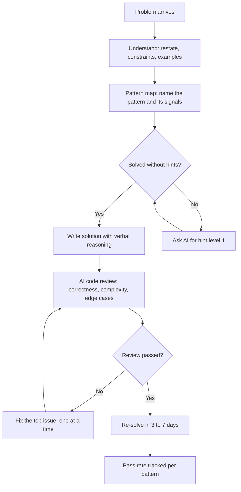

# Chapter 6: Code & DSA with AI

> **Last Updated:** August 2026 | **Estimated Reading Time:** 60–75 minutes

Watching DSA videos creates an illusion of competence; writing code under pressure creates skill. This chapter turns ChatGPT, Claude, or Gemini into a full DSA coaching staff: a hints-only solver, a pattern mapper, a code reviewer, a debugging tutor, a system design interviewer, and a complexity drillmaster. Every tool follows one rule from Chapter 5: the AI assists, you do the work, and the AI grades the result.

> **How to work this chapter** — 15–20 minutes of overhead on top of reading:
>
> 1. **Read** — 60–75 minutes, split across 2–3 commute blocks.
> 2. **Do** — run every **Try This** as you go; the chapter's power is in the prompts you actually execute.
> 3. **Prove** — score 8/10 or better on the Chapter Quiz before moving on.
> 4. **Produce** — five solved DSA problems with pattern maps and reviewer verdicts, logged in your solution grader.
>
> **Prerequisites:** Chapters 2 and 5. **Next:** Chapter 7.

## Learning Objectives

- Run a hints-only DSA solver that gives three escalating hints and never full solutions
- Map any problem to a known pattern family and learn that pattern's signatures
- Get your solutions reviewed on correctness, complexity, clarity, and edge cases
- Debug with an AI tutor that asks questions instead of fixing code
- Execute a 20-day new-language blueprint with daily feature, idiom, and mini-project drills
- Run 45-minute system design mock rounds with an interviewer persona
- Practice SQL against a given schema with AI-generated questions and grading
- Turn CS theory concepts into coding exercises that prove understanding
- Write code under interview constraints with a style coach
- Force big-O analysis on every solution and track pass rate per pattern

## Chapter at a Glance

| Topic | Key Insight | Practical Takeaway |
|---|---|---|
| Hints-only solver | Three escalating hints, never full code | Master protocol in Q2; use for every problem |
| Pattern mapper | Every problem signals a pattern family | Mapper prompt in Q5, deep-dive in Q6 |
| AI code reviewer | Grade on correctness, complexity, clarity, edge cases | Review prompt in Q7, interview mode in Q8 |
| Debugging tutor | AI asks questions, you find the bug | Protocol in Q9, live session in Q10 |
| New-language blueprint | 20 days of feature + idiom + mini-project | Blueprint in Q11, daily drill in Q12 |
| Mock rounds | System design and SQL as interviewer practice | Persona prompts in Q13-Q16 |

## The full problem-solving loop



## Q1: Why solve DSA with AI instead of watching more videos?

**Answer:** Video lectures are passive consumption: your brain recognizes the pattern as it is explained, which feels like understanding but produces almost no ability to solve a fresh problem alone. AI-based practice gives you interactive repetitions, instant feedback, and interview realism, because the AI behaves like an interviewer rather than a lecturer. It also scales to your commute: a problem, three hints, and a review can fit in 25 minutes with no setup. The coach setup prompt below establishes the persona once, and every later session in this chapter builds on it.

```
You are my DSA coach for placement preparation.
Language: TypeScript. Interview style: {Google | Amazon | service company}.

Standing rules:
1. Never write full solutions unless I explicitly ask for a post-mortem.
2. Hints escalate: level 1 names the pattern family, level 2 names the
   technique, level 3 gives a pseudocode skeleton with blanks.
3. After I solve, review my code for correctness, time and space
   complexity, and edge cases.
4. Ask follow-up questions the way a real interviewer would.
5. If I type POST-MORTEM, then and only then show the full solution.

Acknowledge with one line and wait for my first problem.
```

**How it works:** The standing rules are a session contract that all later prompts inherit, and the POST-MORTEM escape hatch guarantees you can still learn from a stuck problem without compromising the hint discipline.

**Try This:** Start a fresh conversation with this setup prompt, then paste a problem you solved last week and run the full loop to see how the coach behaves.

## Q2: What is the hints-only DSA solver?

**Answer:** The hints-only solver is the core prompt of this chapter: it forces the restate-first protocol, three escalating hints, and a full review after you solve. The escalation design is deliberate: level 1 only names the pattern family so you still pick the technique, level 2 names the technique so you still write the code, and level 3 gives a skeleton with blanks so the final structure is still yours. This mirrors the way interviewers leak information, one nudge at a time.

```
DSA session. Language: TypeScript.
Problem: {paste the problem, including constraints and examples}

Follow this protocol:
1. Ask me to restate the problem in my own words and state my first idea
   BEFORE any hint.
2. If I am stuck, give hint 1: which pattern family this belongs to.
3. Hint 2: the specific technique inside that family.
4. Hint 3: pseudocode skeleton with blanks. NEVER full code.
5. When I solve it, review my code: correctness, time and space
   complexity, edge cases, and test cases.
6. Then ask 2 follow-up questions a {company} interviewer would ask.
Wait for my input after every step.
```

**How it works:** The restate-first step forces problem comprehension before any solution attempt, the three hint levels keep difficulty controllable, and the review step converts every solve into a graded learning event.

**Try This:** Paste a medium two-pointer problem, complete the protocol without ever typing POST-MORTEM, and answer both follow-up questions in writing before checking the review.

## Q3: How do I set up a timed, constrained session?

**Answer:** Interviews are timed, so practice must be timed. The session setup prompt fixes difficulty, time limit, and behavior rules before the problem appears, which prevents the session from drifting into an open-ended chat. The most important rule is that you type code into the chat while the AI stays silent, and the timer starts the moment you see the problem, exactly like a real round.

```
Session setup. Difficulty: {easy | medium | hard}.
Time limit: {25} minutes. Language: TypeScript.
Rules:
1. You show the problem, I solve, you stay silent while I type.
2. Hints only when I explicitly write HINT, at most 2 per session.
3. No full code, no dry runs, no judging my code until I type DONE.
4. At DONE, stop the clock and report my elapsed time, then review.
Start: give me one problem at the chosen difficulty and start the timer.
```

**How it works:** The silence rule stops the AI from coaching mid-solve, the HINT budget simulates scarce interviewer help, and the DONE report creates a time pressure that chat practice otherwise lacks.

**Try This:** Run a 25-minute medium session on {sliding window problems} three times this week and log your DONE times to see the trend.

## Q4: How does a full hints-only session actually run?

**Answer:** The transcript below shows the complete arc: restate, first idea, hint escalation, solve, review, follow-up. Notice that the AI never wrote the solution and that the user's code appeared only after the approach was fixed in words. That ordering, words before code, is the single biggest difference between casual chat practice and interview practice.

```
You: Problem: given an array of integers and a target, return the indices of
     the two numbers that add up to the target.
AI: Restate the problem in your own words and give your first idea.
You: Find the pair whose sum equals the target and return both indices.
     Brute force: check every pair, O(n^2) time, O(1) space.
AI: Good, that is a valid first idea. What is the space-time trade-off?
     Hint level 1: think about hashing.
You: Use a map from value to index, then for each element check if the
     complement exists.
AI: Correct family. Hint level 2: can you do it in one pass and why?
You: Yes: check the complement before inserting the current element,
     so each element is seen exactly once. O(n) time, O(n) space.
AI: Correct. Write your code now.
You: function twoSum(nums: number[], target: number): number[] {
       const seen = new Map<number, number>();
       for (let i = 0; i < nums.length; i++) {
         const complement = target - nums[i];
         if (seen.has(complement)) return [seen.get(complement)!, i];
         seen.set(nums[i], i);
       }
       return [];
     }
AI: Review: correct, O(n) time, O(n) space. Edge cases: duplicates are handled
     because you check before insert; negative numbers work; empty array
     returns an empty result. Follow-up 1: what if the array is sorted?
     Follow-up 2: how would you handle a target that must use distinct
     values from the same element?
```

**How it works:** Each hint level only narrows the decision space, the code appears after the approach is verbalized, and the follow-ups push you to transfer the solution to new constraints.

**Try This:** Replay this exact problem tomorrow from memory, without the AI, and write both the brute force and the hashmap version; then note where you stalled.

## Q5: What is the DSA pattern mapper?

**Answer:** Most interview problems are recombinations of about a dozen pattern families: two-pointers, sliding window, prefix sum, binary search, BFS/DFS, dynamic programming, greedy, heap, backtracking, union-find, monotonic stack. The pattern mapper names the family, explains the signals that point to it, gives the pattern's signature, and suggests similar problems to drill. It never solves the problem, because pattern recognition is the skill you are training.

```
Act as a pattern mapper. Problem:
{paste the problem, constraints, examples}

Answer these 4 points:
1. The pattern family: choose from two-pointers, sliding window, prefix sum,
   binary search, BFS, DFS, dynamic programming, greedy, heap,
   backtracking, union-find, monotonic stack, or other.
2. The signals: the 3 specific clues in THIS problem that point to that family.
3. The pattern signature: the key structures and the typical loop shape,
   written in TypeScript, max 15 lines, no full solution.
4. Two similar problems at the same difficulty to drill next.

Do NOT solve the problem and do not write a complete implementation.
```

**How it works:** The signal list builds your recognition skill, the signature template gives you the reusable skeleton, and the similar-problem suggestions feed the next practice session automatically.

**Try This:** Map 5 problems from your last practice week, write the signals for each in one line, and check whether you can name the pattern before reading the AI's answer.

## Q6: How do I learn a pattern's signature deeply?

**Answer:** Knowing a pattern's name is not enough; you need its signature, which is the fixed structure you can adapt: the pointer positions, the window bounds, the DP table dimensions, the loop shape. The deep-dive prompt forces the AI to teach the signature with an analogy, a TypeScript template, and failure cases, then quiz you on it from memory. This converts pattern knowledge from recognition into a reusable tool.

```
Deep-dive the {sliding window} pattern:
1. A real-world analogy for when the pattern applies.
2. Three signals that say: use this pattern.
3. A TypeScript template, max 15 lines, with {placeholders} clearly marked.
4. Two counterexamples: when this template breaks.
5. A 30-second memory hook.
Then quiz me on the template from memory, hint-only, 3 questions.
```

**How it works:** The template gives you a starting skeleton for every future problem of this family, the counterexamples teach its limits, and the memory hook plus quiz seals the signature into long-term memory.

**Try This:** Deep-dive {monotonic stack}, then solve two next-greater-element problems using only the template and hints.

## Q7: How does the AI code reviewer work?

**Answer:** The reviewer grades your solution like a staff engineer on four axes: correctness, time and space complexity, clarity, and edge-case handling. The prompt fixes the rubric so feedback is consistent across sessions, which lets you track improvement. The critical rule is that the AI tells you what is wrong but does not provide the fixed code; you repair the worst issue yourself, because fixing is where the learning happens.

```
Review my solution like a staff engineer. Problem:
{paste the problem}
My code:
{paste your TypeScript code}

Grade me 1 to 10 on each:
- correctness
- time complexity
- space complexity
- clarity and naming
- edge-case handling

For each axis: one line on what is right, one line on what is wrong,
one concrete improvement. Then ask me to fix the worst issue myself.
Do not provide the fixed code.
```

**How it works:** The fixed rubric makes reviews comparable across sessions, and the fix-it-yourself rule keeps the repair work on your side of the loop.

**Try This:** Submit a solution you wrote last month, accept the worst-issue verdict, fix it yourself, and re-submit to see if the score rises.

## Q8: How do I run the review in strict interview mode?

**Answer:** Interviewers do not stop at correctness; they probe complexity, edge cases, and design trade-offs. Interview follow-up mode turns the reviewer into a questioner who asks one question at a time and grades each answer with a one-word verdict. This trains the spoken reasoning that written reviews cannot, which is the part of interviews most self-study misses.

```
Interview follow-up mode. My code above is finished.
Ask me these 4 questions, one at a time, waiting for my answer:
1. What is the time and space complexity and why?
2. Which edge cases would you test and what would each assert?
3. How would you change the design if memory were the constraint?
4. Can you achieve the same result in a single pass?
After each of my answers, give a one-word verdict: strong, ok, or weak,
plus one improvement sentence.
```

**How it works:** One-at-a-time questioning with verdicts simulates the live pressure of an interview and exposes the difference between writing code and defending it.

**Try This:** Take the Q4 two-sum solution, run this mode, and record your four spoken answers; replay the recording and count how many verdicts were strong.

## Q9: What is the debugging tutor?

**Answer:** The debugging tutor inverts the usual pattern: instead of pasting code and asking the AI to find the bug, you describe the bug and the AI walks you to it with questions. This builds the hypothesis-testing skill that real debugging requires: describe expected versus actual behavior, state what you ruled out, then test one hypothesis at a time. The protocol ends with a root-cause sentence and a test that would have caught it, which is exactly the reflection senior engineers force themselves to do.

```
Act as a debugging tutor. I will describe a bug, not paste the code yet.
Protocol:
1. Ask me to describe expected vs actual behavior in 2 sentences.
2. Ask me what I have already ruled out.
3. Suggest ONE hypothesis at a time, phrased as a question, never a statement.
4. When I find the fix, ask me to explain the root cause in one sentence
   and name the test that would have caught it.
My bug description: {describe the bug: what you expected, what happens}
```

**How it works:** Describing expected versus actual isolates the failure band, the ruled-out list prevents re-testing dead ends, and the one-question-at-a-time rule keeps the discovery on your side.

**Try This:** Take a real bug from your current work project, run this protocol without pasting code, and time how long it takes you to find the fix yourself.

## Q10: How do I debug live with the AI asking questions?

**Answer:** The transcript below shows the questioning flow in action. Notice the AI never says where the bug is; it narrows the space by asking about data flow, return values, and failure conditions. Your job in the session is to answer honestly, because a guessed answer produces a wrong hypothesis chain.

```
You: My function returns an empty array when I pass a valid list of users.
     Expected: the filtered list. Actual: empty array.
AI: What have you already ruled out?
You: The filter condition is correct, I tested it in isolation.
AI: What does the function return when the input list is empty?
You: Also an empty array. Same output.
AI: Interesting. Where does the empty return path come from? Does the
     function have an early return before the filter?
You: Yes, there is an early return for a null check on the input...
     Wait. The check is if (!users) return []. If the caller passes an
     empty-but-valid list, the check passes, so that is not it.
AI: What happens after the early return? Is the result assigned or returned
     directly?
You: It is assigned to a variable, then a later line overwrites it with a
     second filter on a property that does not exist, so the second filter
     drops everything. That is the bug.
AI: Good find. Root cause in one sentence?
You: A second filter on a missing property silently drops all rows.
AI: And the test that would have caught it?
You: A test that asserts the result for a list where that property is absent.
```

**How it works:** Each question halves the search space, the early-return question exposed the overwrite line, and the closing root-cause and test questions convert the fix into a lesson.

**Try This:** Reproduce this session structure with a real bug from your codebase, and write the one-sentence root cause and the regression test on paper before typing anything.

## Q11: How do I run a 20-day new-language blueprint?

**Answer:** A new language is best learned in a fixed 20-day arc: days 1-5 syntax, days 6-10 idiomatic code, days 11-15 project patterns, days 16-20 interview drills. Each day has three fixed deliverables: today's feature, today's idiom, and today's mini-project, which guarantees daily progress without decision fatigue. The AI builds the whole plan in one prompt, tuned to your background and 60-minute daily budget.

```
Build a 20-day blueprint to learn {language} for placement prep.
My background: {your current languages and level}.
Daily study budget: 60 minutes.

Structure:
- Days 1-5: syntax essentials, one feature per day.
- Days 6-10: idiomatic code, one native idiom per day.
- Days 11-15: project patterns, one small pattern per day.
- Days 16-20: interview drills with common {language} interview questions.

For each day output: today's feature, today's idiom, today's mini-project
under 30 lines, and one check question.
Output as a table. No extra commentary.
```

**How it works:** The four-phase arc mirrors how you actually become productive in a language, and the fixed daily deliverable format makes every day a measurable unit of progress.

**Try This:** Generate a 20-day blueprint for {TypeScript} from your {Java or Python} background and pin it above your desk for the month.

## Q12: How do I run today's daily language drill?

**Answer:** The blueprint sets the arc, but the daily drill prompt runs each day: teach the feature, hand over the idiom, set the mini-project, and end with a recall question. The mini-project rule, under 30 lines, keeps the project completable inside the commute or lunch break. Reviewing your submitted mini-project is where the day's learning gets graded.

```
Day {N} of the {language} blueprint.
1. Teach today's feature: {feature} in 10 minutes with 3 examples.
2. Give today's idiom: a pattern native {language} developers use,
   shown as before/after code.
3. Set the mini-project: a task that MUST use the feature and the idiom,
   spec under 10 lines. I code it, you review it.
4. Ask the check question for yesterday's feature, hint-only.
Start with step 1.
```

**How it works:** The feature and idiom are inputs, the mini-project forces application of both, and the daily check question adds a retrieval layer on top of the day's practice.

**Try This:** Run day 4 of your {TypeScript} blueprint, build the mini-project with the idiom from day 3, and submit it for review before the commute ends.

## Q13: How do I do system design mock rounds with AI?

**Answer:** System design interviews follow a repeatable arc: requirements, estimation, high-level design, API and data model, deep dive, and trade-offs. The mock-round prompt makes the AI a strict interviewer who runs that arc in 45 minutes and never gives answers, only probing questions. The value is in the structure: real practice without structure degenerates into a chat, but the arc forces you to cover every phase.

```
Act as a system design interviewer at a {Google | startup | service company}.
Round topic: {e.g. design a URL shortener}. Duration: 45 minutes. Strict.

Run this arc:
1. Requirements: ask me clarifying questions, then let me list them.
2. Capacity estimation: I compute reads, writes, storage, bandwidth.
3. High-level design: I draw it with text blocks, you ask what each
   component handles.
4. API and data model: I define endpoints and schema.
5. Deep dive: I choose one bottleneck and design the fix.
6. Trade-offs: you list the decisions I made and ask me to defend the
   two weakest ones.

Rules: never give the answer, one question at a time, no lecture mode.
At the end grade me on structure, coverage, depth, and communication.
Start.
```

**How it works:** The fixed six-phase arc guarantees complete coverage, the never-answer rule keeps you doing the designing, and the final grade on four axes gives you a score you can track across rounds.

**Try This:** Run a 45-minute round on {designing a chat service} this weekend and write the four-axis grade into your session log.

## Q14: How do I debrief a mock round?

**Answer:** The mock round generates raw material; the debrief turns it into a study plan. The debrief prompt scores each phase separately, names the three biggest gaps, picks the single section to restudy first, and sets a harder follow-up for the next round. Debriefing is where most self-studiers quit, so this prompt makes it a 5-minute fixed ritual.

```
Debrief my mock round.
My session notes: {paste your notes from the round}

Output:
1. Score each phase 1 to 10: requirements, estimation, design, data model,
   deep dive, communication.
2. The 3 biggest gaps, in priority order.
3. The ONE section to restudy first, with a concrete study action.
4. One harder follow-up question I must answer in the next round.
No advice beyond this structure.
```

**How it works:** Phase-by-phase scoring isolates your weakest phase instead of producing a vague overall feeling, and the single restudy priority prevents the next session from being unfocused.

**Try This:** After your next mock round, run this debrief and bring the one follow-up question to the next session as its opening problem.

## Q15: How do I practice SQL with AI?

**Answer:** SQL interviews are schema-driven: the interviewer pastes tables and asks you to write queries. The AI practice setup does the same: you paste a schema once, the AI generates questions from easy to hard, and grades each query on correctness, efficiency, and cleanliness. Keeping the same schema across sessions builds speed, because interview success depends on fluent schema navigation, not just syntax.

```
Schema:
{paste CREATE TABLE statements}

Act as a SQL interviewer. Generate 8 questions from easy to hard:
- filtering and joins
- aggregations with GROUP BY and HAVING
- subqueries and CTEs
- one window function question

Rules:
1. One question at a time.
2. Grade my query on: correct, efficient (can it use an index), clean.
3. If my query is wrong, ask one probing question instead of showing the fix.
4. After 8 questions, show my grade summary.
```

**How it works:** The fixed schema gives you a reusable practice surface, the grade axes mirror what interviewers actually check, and the probing-question rule keeps error correction active.

**Try This:** Paste a {users, orders, products} schema, run all 8 questions this week, and replay the two you failed until you can explain the fixes from memory.

## Q16: How do I drill hard SQL patterns like window functions?

**Answer:** Window functions are the most common gap between self-taught SQL and interview-level SQL, and they need dedicated drills. The window drill forces ROW_NUMBER, RANK, LAG, and SUM OVER into the same schema, and each answer gets an execution-level check: how the database would run it, and whether it degrades at 10 million rows. That execution reasoning is what separates a query-writer from a query-designer.

```
Drill: {window functions}. Schema:
{paste schema}

Generate 4 questions that each require one of: ROW_NUMBER, RANK, LAG,
SUM OVER with a frame clause.
For each of my queries answer three lines:
1. Is the result correct?
2. How would a database execute it: full scan or index range scan?
3. What slows down at 10 million rows, and what would you change?
Then one harder follow-up: the same result without a window function.
```

**How it works:** Forcing one window function per question builds fluency with each, and the execution-level analysis trains the performance reasoning that shows up in system design and senior interviews.

**Try This:** Generate this drill on your {orders schema}, write all four queries, and run the no-window-function follow-up as a mental exercise before checking.

## Q17: How do I turn CS theory into code?

**Answer:** Theory chapters become durable knowledge only when you can build them. The theory-to-code prompt converts any OS, networking, or compiler concept into a small coding exercise with a spec and test cases, and the constraint of no external libraries forces you to implement the mechanism from first principles. The LRU cache, a token bucket, a rate limiter, or a small scheduler are all classic placements.

```
I want to prove I understand this concept: {concept, e.g. LRU cache}.
1. Propose a coding exercise that tests exactly this concept using
   nothing but TypeScript, no external libraries.
2. Constraints: under 40 lines, one function or one class, clear spec.
3. Give me the spec and 3 test cases with expected outputs.
4. Do NOT write the solution.
5. If I cannot start after 5 minutes, give me hint 1 only.
```

**How it works:** The exercise spec forces you to translate the theory's mechanisms into code, the no-library constraint removes shortcuts, and the test cases give you an objective pass/fail.

**Try This:** Convert {rate limiter} into this exercise, implement it in under 40 lines, and run your 3 test cases before reading any reference.

## Q18: How do I verify my code matches the theory?

**Answer:** Building the code is step one; proving the mapping is step two. The verification prompt asks the AI to point to the line that represents each theoretical element, which forces a line-by-line reconciliation between the concept and the implementation. The session ends with the reverse direction: explaining the theory from the code without looking, which is the transfer test.

```
I coded {exercise} for the concept {concept}. My solution:
{paste code}

Grade me on three things:
1. Mapping: point to the line or block that implements each theoretical
   element of {concept}, and flag any element missing from the code.
2. Correctness: do the 3 test cases pass?
3. Complexity: time and space, with one-line proofs.
Then ask me to explain the concept from the code alone, without looking.
```

**How it works:** The element-by-element mapping exposes conceptual gaps that a green test suite hides, and the explain-from-code reversal tests whether the implementation actually changed your understanding.

**Try This:** Run this verification on your LRU cache exercise and write the explanation-from-code aloud; count how many theoretical elements you could name without the notes.

## Q19: What is the interview code style coach?

**Answer:** Whiteboard code is graded on more than correctness: names, structure, and the narration you speak while writing. The style coach evaluates your code the way a senior engineer would in a live session, and grades three things: naming, decomposition, and the speaking track you should have narrated. The prompt deliberately forbids code rewrites, because the coach's job is feedback on your habits, not a rewrite service.

```
Interview code style coach. Problem: {paste problem}.
My solution as I would write it on a whiteboard:
{paste code}

Grade me on:
1. Naming: would a senior engineer accept every identifier?
2. Structure: is the logic decomposed, or one monolith function?
3. Verbal reasoning: give me the speaking track I SHOULD have narrated
   while writing this code, line by line.
4. Etiquette: what to say before, during, and after writing code.
Each grade: good enough, or one concrete fix. Do not rewrite my code.
```

**How it works:** The fixed four-axis grade makes style review consistent, the speaking track shows you what narrated reasoning sounds like, and the no-rewrite rule keeps the feedback focused on your behavior.

**Try This:** Write one solution exactly as you would on a whiteboard, run this prompt, then redo the problem narrating the speaking track aloud to an empty room.

## Q20: How do I get complexity drill prompts?

**Answer:** Complexity analysis is a default interview question, so it needs its own drill: you analyze first, then the AI marks your analysis. The drill prompt forces four deliverables: an exact time complexity with a line of proof, space complexity, the worst-case input, and a verdict on whether the solution is interview-grade. Your analysis comes before the AI's, which is what makes it a drill rather than a lecture.

```
Complexity drill. My solution:
{paste code}

Before you answer, I will give MY analysis first. Then mark it:
1. Time complexity: my claim, then your verdict with a one-line proof
   that counts the loops and the per-loop cost.
2. Space complexity: my claim, then your verdict.
3. Worst case: the input that makes this solution slowest, with reason.
4. Interview verdict: is this good enough, or does it need improvement?
   If it is worse than O(n log n), tell me to find the improvement,
   but do not code it.
```

**How it works:** The analyze-first order forces you to count loops before seeing the answer, the one-line proof requirement prevents guesswork, and the O(n log n) threshold gives a clear quality bar.

**Try This:** Run this drill on five solutions you wrote this month and log the number of times your complexity claim needed correction.

## Q21: How do I track my pass rate per pattern with a solution grader?

**Answer:** Improvement is invisible unless tracked, and the right unit is per pattern: pass rate, first-try rate, and average hint level. The TypeScript grader below records every attempt and prints a per-pattern report, so you can see exactly which patterns still need work before you book a mock interview. Keep the file in your learning-playground repo and update it after every session.

```typescript
interface Attempt {
  problem: string;
  pattern: string;
  difficulty: "easy" | "medium" | "hard";
  firstTry: boolean;
  hintLevelUsed: 0 | 1 | 2 | 3;
  verdict: "pass" | "fail";
  date: string;
}

const attempts: Attempt[] = [
  { problem: "two sum", pattern: "hashmap", difficulty: "easy", firstTry: true, hintLevelUsed: 0, verdict: "pass", date: "2026-08-10" },
  { problem: "longest substring without repeats", pattern: "sliding window", difficulty: "medium", firstTry: false, hintLevelUsed: 1, verdict: "pass", date: "2026-08-11" },
  { problem: "valid parentheses", pattern: "stack", difficulty: "easy", firstTry: true, hintLevelUsed: 0, verdict: "pass", date: "2026-08-11" },
  { problem: "max area of container", pattern: "two pointers", difficulty: "medium", firstTry: false, hintLevelUsed: 2, verdict: "fail", date: "2026-08-12" },
];

function patternReport(list: Attempt[]): void {
  const byPattern = new Map<string, Attempt[]>();
  for (const a of list) {
    const bucket = byPattern.get(a.pattern);
    if (bucket === undefined) {
      byPattern.set(a.pattern, [a]);
    } else {
      bucket.push(a);
    }
  }
  for (const entry of byPattern) {
    const pattern = entry[0];
    const items = entry[1];
    const passed = items.filter((a) => a.verdict === "pass").length;
    const passRate = Math.round((passed / items.length) * 100);
    const avgHints = items.reduce((sum, a) => sum + a.hintLevelUsed, 0) / items.length;
    const firstTryRate = Math.round((items.filter((a) => a.firstTry).length / items.length) * 100);
    console.log(pattern + ": " + passRate + "% pass, " + firstTryRate + "% first try, avg hints " + avgHints.toFixed(1));
  }
}

patternReport(attempts);
```

**How it works:** Each attempt logs the pattern, hint usage, and verdict, and the report aggregates them per pattern; a pattern below 70% pass or above 1.5 average hints is your next study target.

**Try This:** Add 10 real attempts from your last two weeks of practice to the array, run the report with npx ts-node grader.ts, and pick the weakest pattern as tomorrow's Q5 mapper target.

## Summary

- The hints-only solver with three escalating hints turns every AI chat into interview-style practice
- The pattern mapper plus signature deep-dives build recognition for the dozen core DSA families
- The code reviewer's fixed rubric makes feedback consistent enough to track improvement
- The debugging tutor builds hypothesis-testing skill by asking questions instead of fixing code
- The 20-day language blueprint plus daily feature, idiom, and mini-project drills make language learning mechanical
- System design mock rounds and SQL drills follow the same interviewer persona with strict phase structure
- Theory-to-code exercises prove conceptual understanding and the verification prompt checks the mapping
- The solution grader tracks pass rate and hint usage per pattern, making weak spots visible

## Contradictions

The methods in this chapter are not universally right. Read these before trusting the system blindly:

- Hints-only solving is slower than watching solution videos. If your deadline is weeks away, videos are faster but weaker; this chapter bets on retention over speed, and that bet can lose on a tight calendar.
- Pattern mapping can produce pattern-matching without understanding. Mapping every problem to a familiar pattern can blind you to novel problems — which are exactly the ones interviews ask.
- AI reviewers praise or punish inconsistently across sessions. The grader's verdicts are noisy signals, not grades; average them over time.
- The 20-day language blueprint optimizes for breadth; it will not make you production-fluent in any language.

## Open Questions

What this chapter deliberately does not claim to know:

- Whether practicing with AI hints transfers to whiteboard interviews without AI is the central untested assumption of this chapter.
- How many solved problems constitute "enough" is unknown; five per pattern is a start, not a finish.
- Whether AI system-design mocks improve real system-design interviews is unmeasured — the mock format differs materially from a human interviewer's follow-ups.

## Practical Takeaways

| Technique | Prompt / Command | When to Use |
|---|---|---|
| Coach setup | Q1 standing-rules prompt | First session of every conversation |
| Hints-only solver | Q2 protocol with {problem} | Every new problem, never skip the restate step |
| Timed session | Q3 setup with {25} minute limit | Weekly timed practice |
| Pattern mapper | Q5 mapper prompt | Every problem before solving |
| Pattern deep-dive | Q6 signature prompt | New pattern family, one per week |
| Code review | Q7 rubric prompt | After every accepted solution |
| Interview follow-ups | Q8 four-question mode | Review days, before mock rounds |
| Debugging tutor | Q9 protocol prompt | Real bugs from work or projects |
| Language blueprint | Q11 20-day plan prompt | Starting any new language |
| SQL drill | Q15 schema prompt | Weekly database practice |
| Theory-to-code | Q17 concept exercise prompt | After every theory chapter |
| Complexity drill | Q20 analyze-first prompt | Five solutions per week |
| Pattern tracking | `npx ts-node grader.ts` | After every practice session |

## Chapter Quiz

**Q1. What does hint level 1 in the hints-only solver reveal?**

- A. The full solution
- B. The pattern family
- C. The exact code to write
- D. The time complexity

<details>
<summary>Answer: B — the pattern family</summary>

Level 1 names the family, level 2 names the technique, level 3 gives a pseudocode skeleton with blanks. Full code only appears after POST-MORTEM.
</details>

**Q2. What is the first step of the hints-only protocol?**

- A. Write the optimal solution
- B. Ask the AI for the pattern
- C. Restate the problem and give a first idea
- D. Paste the constraints into the chat

<details>
<summary>Answer: C — restate the problem and give a first idea</summary>

Restating forces comprehension before any hint, which is what makes the practice session an interview simulation rather than a chat.
</details>

**Q3. What does the pattern mapper output instead of a solution?**

- A. A full optimized implementation
- B. The pattern family, signals, signature template, and similar problems
- C. A test suite
- D. A complexity proof

<details>
<summary>Answer: B — family, signals, signature, and similar problems</summary>

The mapper deliberately never solves the problem because pattern recognition is the skill being trained.
</details>

**Q4. Which axes does the code reviewer grade?**

- A. Speed, memory, syntax, comments
- B. Correctness, complexity, clarity, edge cases
- C. Length, naming, formatting, tests
- D. Readability, lines, loops, variables

<details>
<summary>Answer: B — correctness, complexity, clarity, edge cases</summary>

The fixed four-axis rubric makes reviews comparable across sessions so you can track improvement.
</details>

**Q5. What is the debugging tutor's most important behavior?**

- A. It pastes the fixed code immediately
- B. It asks one hypothesis-question at a time
- C. It rewrites the whole function
- D. It guesses the bug from the description

<details>
<summary>Answer: B — it asks one hypothesis-question at a time</summary>

Each question narrows the search space and keeps the discovery on your side; fixes come from you, not the AI.
</details>

**Q6. What is the phase structure of the 20-day language blueprint?**

- A. Syntax, idioms, projects, interview drills
- B. Vocabulary, grammar, reading, writing
- C. Easy, medium, hard, expert problems
- D. Theory, code, review, deploy

<details>
<summary>Answer: A — syntax, idioms, projects, interview drills</summary>

Days 1-5 syntax, 6-10 idioms, 11-15 project patterns, 16-20 interview drills, with feature, idiom, and mini-project every day.
</details>

**Q7. What are the six phases of the system design mock round?**

- A. Brainstorm, code, test, deploy, monitor, scale
- B. Requirements, estimation, high-level design, API and data model, deep dive, trade-offs
- C. Schema, queries, indexes, cache, queue, database
- D. Frontend, backend, database, cache, CDN, monitoring

<details>
<summary>Answer: B — requirements, estimation, design, API and data, deep dive, trade-offs</summary>

The fixed six-phase arc guarantees complete coverage, and the final grade covers structure, coverage, depth, and communication.
</details>

**Q8. What does the SQL practice prompt grade your queries on?**

- A. Line count and comments
- B. Correctness, efficiency, cleanliness
- C. Column naming and formatting
- D. Execution time and indexes used

<details>
<summary>Answer: B — correctness, efficiency, cleanliness</summary>

Each query gets a verdict on whether it is correct, whether it can use an index, and whether it is clean, mirroring what interviewers check.
</details>

**Q9. What does the theory-to-code prompt forbid?**

- A. Using TypeScript
- B. External libraries and writing the solution
- C. Test cases
- D. Comments in the code

<details>
<summary>Answer: B — external libraries and writing the solution</summary>

The no-library constraint forces implementing the mechanism from first principles, and the AI never writes the solution, only the spec and test cases.
</details>

**Q10. In the solution grader, what indicates a pattern needs restudy?**

- A. Pass rate above 85%
- B. Pass rate below 70% or average hints above 1.5
- C. First-try rate above 80%
- D. More than 10 attempts logged

<details>
<summary>Answer: B — pass rate below 70% or average hints above 1.5</summary>

Low pass rate means the pattern is not learned; high hint usage means the knowledge exists but is not retrievable under pressure.
</details>

## Exercises

1. Run the Q2 hints-only protocol on two medium problems this week, one sliding window and one binary search, with a hard rule of zero POST-MORTEMs.
2. Map 5 problems with the Q5 pattern mapper, write the three signals for each in one line, then deep-dive the weakest pattern with Q6.
3. Submit your last three solutions to the Q7 reviewer and fix the worst issue in each yourself before re-submitting.
4. Use the Q9 debugging tutor on a real bug from your work or a personal project, and write the root-cause sentence plus regression test on paper.
5. Generate the Q11 20-day blueprint for TypeScript and run the Q12 daily drill for days 1 through 5, submitting every mini-project for review.
6. Run a 45-minute system design mock (Q13) on a URL shortener, debrief with Q14, then feed the pattern report into the Q21 grader for the whole week's attempts.

## Further Reading

- NeetCode: DSA patterns and problem lists — https://neetcode.io/
- LeetCode problem explorer — https://leetcode.com/problemset/
- The System Design Primer — https://github.com/donnemartin/system-design-primer
- TypeScript Handbook — https://www.typescriptlang.org/docs/handbook/intro.html
- Big-O Cheat Sheet — https://www.bigocheatsheet.com/