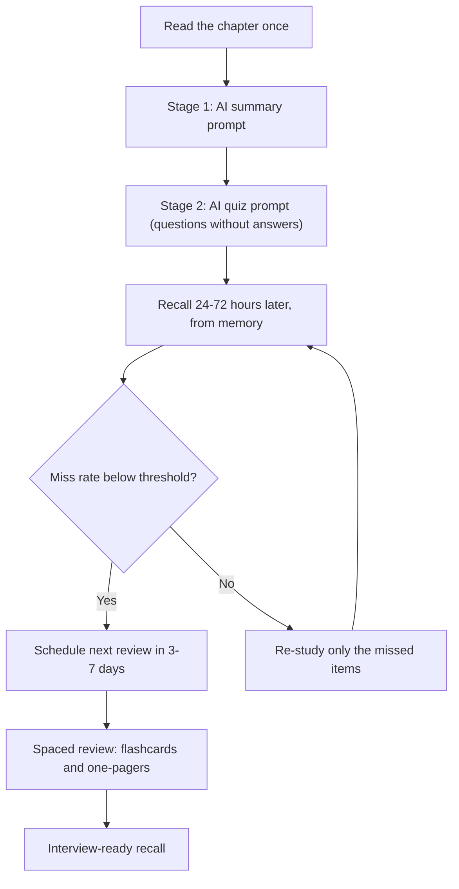
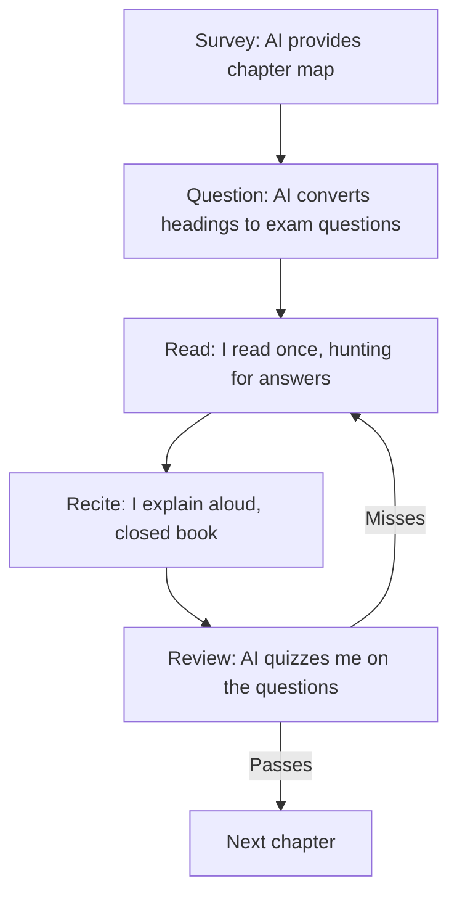

# Chapter 7: Speed Reading & Summarization

> **Last Updated:** August 2026 | **Estimated Reading Time:** 60–75 minutes

Reading is the slowest part of studying, and re-reading is the most wasteful part of the week. This chapter wires AI into the entire reading workflow — summarizing, note-taking, flashcard generation, and recall — so every hour you read produces revision material you can use for weeks. The pipeline at the center of it all (read once, summarize with AI, quiz with AI, recall on a schedule) is the fastest honest path through a 24-module syllabus that still leaves you interview-ready.

> **How to work this chapter** — 15–20 minutes of overhead on top of reading:
>
> 1. **Read** — 60–75 minutes, split across 2–3 commute blocks.
> 2. **Do** — run every **Try This** as you go; the chapter's power is in the prompts you actually execute.
> 3. **Prove** — score 8/10 or better on the Chapter Quiz before moving on.
> 4. **Produce** — one real chapter pushed through the full summary-to-recall pipeline: summary, flashcards, quiz, and recall schedule.
>
> **Prerequisites:** Chapter 2 (Chapter 5 for the card formats). **Next:** Chapter 8.

## Learning Objectives

- Run the summary-to-recall pipeline (read, summarize, quiz, schedule) on every chapter
- Convert any chapter text into import-ready Anki flashcards with one prompt
- Turn YouTube lectures and podcasts into structured notes without ever rewatching
- Compress messy notes into one-page sheets without losing formulas or API details
- Apply SQ3R with AI powering the Question and Review stages
- Use active reading prompts (predict, extract, quiz) around every study session
- Handle dense PDFs, textbooks, and 50-page documentation with progressive chunking and tutorial conversion
- Calibrate reading speed against comprehension and mine quiz misses to fix weak spots

## Chapter at a Glance

| Topic | Key Insight | Practical Takeaway |
|---|---|---|
| Summary-to-recall pipeline | Reading is input; recall is output. A summary that is never quizzed is lost within 24 hours | Run the 3-prompt loop (summary, quiz, review schedule) on every chapter |
| Chapter to flashcards | An LLM converts prose into Q/A cards in one pass | One paste plus one prompt equals an Anki deck |
| Lecture to notes | Transcripts are 10x longer than the ideas inside them | Extract outline, key terms, questions, and code; never watch twice |
| Notes compressor | Long notes hide the five facts that matter | Force a one-page sheet with a hard line limit |
| SQ3R with AI | AI asks the questions and runs the review; you do the reading | Survey with AI, recite without notes, review via AI quiz |
| Dense material | Context limits truncate big PDFs in the middle | Progressive chunking with concept-first instructions |

## The Summary-to-Recall Pipeline



## Q1: What is the summary-to-recall pipeline and why does it beat re-reading?

**Answer:** The pipeline has four stages: read once, compress with AI, test with AI, and review on a schedule. Reading is only the input stage, because information decays fast unless it is converted into testable form. The summary stage forces the chapter down to its core ideas; the quiz stage converts those ideas into questions you must answer from memory; the recall schedule re-exposes you at expanding intervals. Re-reading feels productive but only produces recognition, which is not recall. Effortful retrieval — forcing the answer out of memory — is what actually writes knowledge into long-term memory. For a placement student on a deadline, this pipeline means every hour of reading generates material you can revise in 5-minute commute slots for the rest of the week.

```text
I am preparing for software engineering placement exams. I will paste the notes for a chapter. Do these 4 things in order:

1. SUMMARY: Compress the chapter into 8-12 bullet points. Keep every formula, API name, and interview-critical term intact.
2. QUIZ: Write 10 questions (4 recall, 4 explanation, 2 scenario). Do NOT include answers yet.
3. REVIEW PLAN: Classify each bullet as "recall daily", "recall weekly", or "recall before interview".
4. GAP CHECK: List any topic an interviewer would likely ask that the notes do not cover.

Chapter notes:
{PASTE_CHAPTER_NOTES_HERE}
```

**How it works:** One prompt produces the three artifacts (summary, quiz, review plan) so you never need to touch the raw chapter again, and the gap check tells you exactly what to ask the AI to explain next.

**Try This:** Take the chapter you studied yesterday, run the prompt, and answer the 10 quiz questions from memory 24 hours later. The miss count is your true retention rate.

## Q2: How do I run the pipeline as a 3-prompt loop (stage by stage)?

**Answer:** Run the pipeline as three separate prompts so each output can be saved to its own file: the summary prompt, the quiz prompt (which consumes only the summary, never the original), and the recall-check prompt you run 24-72 hours later. Separating stages matters because the summary becomes your only study artifact, and the quiz-on-summary design means you are tested on what you actually retained, not on what the original chapter said. The final stage is where the learning happens: you answer from memory, and the AI grades each answer and classifies every miss.

```text
Here is my chapter summary. I will now answer the quiz questions from memory, without looking at anything.

QUIZ ANSWERS (label each Q1-Q10):
{PASTE_YOUR_ANSWERS_HERE}

SUMMARY:
{PASTE_CHAPTER_SUMMARY_HERE}

For each question: mark my answer correct / partially correct / incorrect. Then:
1. List the questions I got wrong, with the correct answer.
2. Classify each miss: "never learned", "fuzzy recall", or "confused with another concept".
3. Give me a 5-minute re-study list for the misses.
```

**How it works:** The AI compares your from-memory answers against the summary and classifies each miss, so you re-study only what leaked out of memory instead of re-reading everything.

**Try This:** For your current module, run stage 1 today, stage 2 tomorrow, and stage 3 on day 3. Write the miss classification into your tracker.

## Q3: How do I convert a chapter into flashcards in one shot?

**Answer:** Paste the raw chapter text and ask for Anki-ready cards in a strict pipe-separated format, which Anki imports directly. Give the AI card-quality rules: one fact per card, no multi-part backs, and a mix that forces application rather than recognition. For a placement course, tag cards by module and difficulty so you can review weak cards first. Thirty well-designed cards that you actually review beat 300 lazy ones you never open.

```text
Convert the chapter below into Anki flashcards. Rules:
- Format exactly one card per line: FRONT | BACK | TAG
- 30 cards: 40% recall (term -> definition), 30% concept (question -> explanation),
  20% scenario (situation -> decision), 10% code/API (signature -> behavior)
- One fact per card. No multi-part backs.
- Tags: {MODULE_NAME}-easy, {MODULE_NAME}-hard, {MODULE_NAME}-formula
- Bold the keyword on the back.

Chapter text:
{PASTE_CHAPTER_TEXT_HERE}
```

**How it works:** Anki imports pipe-separated lines as cards, so the output is directly importable (File > Import, field separator "|"), and the card mix forces recall and application instead of recognition.

**Try This:** Convert the chapter from your weakest module today, import the deck, and do one 5-minute review session on the commute. Repeat the session every day for a week.

## Q4: How do I audit a generated deck so it stays recall-worthy?

**Answer:** One-paste decks bloat fast, and most LLM cards are "what is X" recognition cards that feel easy because the front half-answers itself. Run a second prompt that flags cards with multiple facts, cards where the answer leaks into the question, near-duplicates, and cards an interviewer would never ask. Then enforce Anki limits: 15 new cards per day, and bury hard cards until the easy ones stick. A 1,200-card deck is a liability; a 200-card deck you actually review wins every time.

```text
Audit this Anki deck. Flag cards that:
1. Are duplicates or near-duplicates
2. Have more than one fact on the back
3. Give away the answer in the front (recognition instead of recall)
4. Are too long to answer in 5 seconds
5. Would never be asked in a software engineering interview

For each flagged card, give the corrected version. Keep the same pipe-separated format.

DECK:
{PASTE_DECK_TEXT_HERE}
```

**How it works:** The audit catches the three deck killers (duplicates, multi-fact cards, answer leakage) and returns corrected cards in importable format.

**Try This:** Audit your last generated deck, count the flags, and fix or delete everything flagged. Record the before/after card count in your tracker.

## Q5: How do I turn a YouTube lecture into structured notes (transcript in, notes out)?

**Answer:** Pull the transcript (YouTube: "Show transcript" under the description; podcasts usually publish transcripts or offer audio transcription in AI apps), paste it as one message, and ask for a fixed output structure: outline, key terms, code examples, quiz questions, and interview angles. You never watch the video twice. The notes file becomes your primary artifact, and the raw lecture becomes dead weight. The follow-up interaction matters as much as the extraction: converting the extracted quiz into a mock-interview exchange builds recall on top of the notes.

```text
User: Here is the transcript of a 40-minute lecture on SQL window functions. Extract:
(1) an outline with time anchors, (2) 10 key terms with one-line definitions,
(3) the exact code examples, (4) 6 quiz questions, (5) interview angles.

[Transcript pasted, ~9,000 words]

Assistant: OUTLINE
- 0:00-6:00  ROW_NUMBER basics with ORDER BY
- 6:00-14:00 RANK vs DENSE_RANK behavior with ties
- 14:00-22:00 PARTITION BY and window grouping
- 22:00-31:00 ROWS BETWEEN framing
- 31:00-40:00 running totals and top-N per group

KEY TERMS: OVER clause, PARTITION BY, ORDER BY inside OVER,
ROWS BETWEEN, framing, unbounded preceding, rank ties.

CODE EXAMPLES:
SELECT name, salary, ROW_NUMBER() OVER (ORDER BY salary DESC) AS rn
FROM employees;

QUIZ:
1. What does PARTITION BY do inside a window function?
2. When do RANK and DENSE_RANK return the same result?
3. What does ROWS BETWEEN 2 PRECEDING AND CURRENT ROW do?
...

INTERVIEW ANGLES: "Cumulative totals" and "top-N per group" are the two
patterns interviewers test. Be ready to write RANK() OVER
(PARTITION BY dept ORDER BY salary DESC) from memory.

User: Turn quiz Q3 and Q4 into a mock-interview exchange. You ask, I answer.

Assistant: Q3. What is the difference between ROWS BETWEEN 2 PRECEDING AND CURRENT ROW
and RANGE BETWEEN UNBOUNDED PRECEDING AND CURRENT ROW?

User: ROWS looks at exactly the 2 previous rows; RANGE includes all rows whose
value is tied with the boundary row, so duplicates count.

Assistant: Correct. Second part: with duplicate salaries in the table, which one
is deterministic, and which can surprise you in production?
```

**How it works:** The structured extraction prompt turns the transcript into study artifacts, and the follow-up mock-interview exchange converts knowledge into interview answers with a realistic back-and-forth.

**Try This:** Convert one recorded lecture from your current module this week, import the quiz into your tracker, and answer it from memory after 48 hours.

## Q6: How do I handle podcasts and noisy transcripts?

**Answer:** If a podcast has no transcript, use your AI app's audio transcription feature or a transcription service, then run a cleanup pass. Noisy auto-transcripts are full of filler, stutters, and split sentences, so tell the AI to repair while extracting in a single pass. Keep the extraction prompt identical to your lecture prompt so all your notes have the same shape, which makes revision faster. For a commuter this is the killer workflow: audio in the earphones on the way to work, notes file complete before you reach the office.

```text
This is a noisy auto-transcript of a {DURATION}-minute podcast on {TOPIC}. Fix it while extracting:
1. Remove filler, stutters, and repeated words
2. Merge fragmented sentences
3. Extract the 5 core ideas with supporting examples
4. Flag anything the speaker contradicts later in the episode
5. End with "3 questions a placement interviewer would ask about this topic"

TRANSCRIPT:
{PASTE_TRANSCRIPT_HERE}
```

**How it works:** The cleanup and extraction happen in one pass, so even a garbled transcript produces clean notes without an extra repair step.

**Try This:** Transcribe a 15-minute podcast on a topic you find boring, run this prompt, and check whether the extracted 5 ideas make the topic more interesting.

## Q7: What is the notes compressor (long messy notes to one-page sheet)?

**Answer:** The notes compressor takes raw notes and forces them into a fixed one-page structure: core concept, mechanism, key example, formulas/API, edge cases, and the one most likely interview question. The hard limit is the trick: "keep it under 60 lines" forces the AI to merge and delete, which is exactly the prioritization you should be doing. A one-pager you can re-read in three minutes on the commute beats a 30-page notebook you never open.

```text
Compress my notes below into a one-page structured sheet with EXACTLY these sections:
1. CORE CONCEPT: 1-2 sentences
2. MECHANISM: 5-8 steps or a mini-flow
3. KEY EXAMPLE: one worked example
4. FORMULAS / API: everything that must be memorized verbatim
5. EDGE CASES: 3-5 things that trip people up
6. INTERVIEW QUESTION: the one question most likely to be asked, with a model answer

Hard rule: the output must be under 60 lines. Merge or delete anything that does not fit. Do not pad.

MY NOTES:
{PASTE_MESSY_NOTES_HERE}
```

**How it works:** The fixed section schema plus the hard line cap forces the AI to prioritize the way you would if you had unlimited time, producing the artifact you will actually revise.

**Try This:** Compress the messiest notes you have from the last module, then delete the original file the same day (see Q14) and study only from the sheet.

## Q8: How do I keep exam-critical detail (formulas, signatures, edge cases) when compressing?

**Answer:** Compression normally destroys the exact details you need under exam pressure: formulas, function signatures, error messages, and time complexities. Add a verbatim rule: anything that must be recalled exactly goes into a protected block that the AI may shorten but never rephrase. Lossy summaries are fine for prose but never for specs. Then verify with the drop-list: ask the AI to report what it removed, and eyeball whether any of it was interview-critical.

```text
Compress the following notes. TWO categories:
- PROSE: can be rephrased, merged, or dropped
- VERBATIM: must appear exactly: formulas, function signatures, error messages,
  commands, time/space complexities, standard names

Output: (1) compressed sheet under 60 lines, (2) a list of everything you dropped
from PROSE, (3) confirmation that VERBATIM items are untouched, listing each one.

NOTES:
{PASTE_NOTES_HERE}
```

**How it works:** The two-category instruction stops the AI from paraphrasing things that must be memorized letter-for-letter, and the drop list makes the compression auditable.

**Try This:** Compress a DBMS or OS chapter with this prompt, pick one dropped item, and explain to a friend why you are fine losing it.

## Q9: How does SQ3R work with AI?

**Answer:** SQ3R is Survey, Question, Read, Recite, Review. AI replaces the manual work in two stages: it converts headings into questions before you read (the Question stage), and it runs the quiz after you read (the Review stage). Survey stays human but takes two minutes when the AI provides a chapter map. Recite is the most important stage and must stay human: close the material and explain aloud, because that is where forgetting surfaces. The AI never reads for you — it reads the headings and your recall, not the chapter.



```text
Here are the headings of a chapter. Convert each heading into a question I should
be able to answer after reading it. Keep questions specific and exam-flavored.
Also add 3 questions that are NOT answered by the headings but that interviewers
commonly ask on this topic.

HEADINGS:
{PASTE_CHAPTER_HEADINGS_OR_TOC_HERE}
```

**How it works:** Pre-reading questions give the read a target (find the answer to heading-question 3), and the extra interview questions keep you hunting beyond the headings; the Review stage reuses the Q2 quiz prompt.

**Try This:** On your next chapter, survey for 2 minutes, get questions from AI, read once looking for answers, close the book and recite aloud, then run the review quiz. Compare retention against last week's chapter.

## Q10: What are the active reading prompts (predict, extract, quiz)?

**Answer:** Active reading runs three prompts around one read: predict before, extract during, quiz after. The predict prompt asks the AI what a title implies the chapter will say, turning the read into verification, which keeps attention high. The extract prompt takes your margin notes every 15-20 minutes and structures them. The quiz prompt is the stage-2 pipeline prompt from Q2. This converts one passive pass into three interactions with the material, which is what the active recall research says builds memory.

```text
I am about to read a chapter titled "{CHAPTER_TITLE}" in a {COURSE} course for software engineering placement.

1. Predict the 5 most important concepts the chapter will cover, with one line of reasoning each
2. Predict the 3 things it will NOT cover but that are adjacent (so I can decide if I need them)
3. Tell me which existing concepts from {PREVIOUS_TOPIC} it will build on

After I finish reading, I will paste my findings back and we will reconcile your predictions against the chapter.
```

**How it works:** Prediction activates prior knowledge and creates a target to check, so the read becomes active verification instead of passive scanning.

**Try This:** Before your next chapter, run the predict prompt; after reading, paste back three bullets: prediction confirmed, prediction wrong, and something you predicted that was not in the chapter at all.

## Q11: How do I understand dense PDFs and textbooks with AI (progressive chunking)?

**Answer:** Do not paste a 60-page PDF in one go; context limits truncate the middle, which is exactly where the core content hides. Use progressive chunking: extract the table of contents, get a concept map, then work section by section, pasting one chunk at a time with a concept-first instruction ("explain the concept before the notation"). For formulas, ask the AI to name every symbol and give a plain-English reading of the formula. This keeps the whole book inside the model's attention and keeps your mental model ahead of the math.

```text
I am reading {BOOK_TITLE}, section {SECTION_RANGE}. Do not summarize in order. Instead:

1. CONCEPT-FIRST: state the one concept this section teaches, in plain English, before any notation
2. NOTATION TABLE: list every symbol/term introduced, with its meaning
3. READING ALOUD: for each formula, give a plain-English reading
   (e.g., "the output is the input scaled by the inverse of the distance")
4. WORKED CHECK: apply the formula to the book's own example, step by step
5. STUCK-PROOFING: list the 2 most common misunderstandings of this section

SECTION TEXT:
{PASTE_SECTION_TEXT_HERE}
```

**How it works:** Concept-first ordering stops the AI from echoing the book's dense ordering, the notation table gives you a decoder ring, and the plain-English readings convert formulas into things you can explain.

**Try This:** Take the hardest section of your current textbook, run the prompt, and teach the concept to a non-technical friend using only the notation table and plain-English readings.

## Q12: What do I do when the AI summary itself confuses me?

**Answer:** Do not silently move on; confusion is the signal that the AI compressed away a step you needed. Run a confusion prompt pinned to the exact sentence that broke: ask for the missing step, a smaller numeric example, and an analogy. If the AI still fails, your underlying model is missing a prerequisite, so ask it to diagnose which prerequisite it silently assumes. Fix the prerequisite first (5-10 minutes of targeted reading), then re-read the summary.

```text
Your previous summary confused me at this sentence:

"{PASTE_CONFUSING_SENTENCE}"

Diagnose, in order:
1. Which prerequisite concept does this sentence silently assume? (be specific)
2. Explain the sentence with a concrete numeric example in 3 steps
3. Give a non-technical analogy for the mechanism
4. If I still cannot get it, what should I learn first? Give me a 10-minute mini-lesson on that prerequisite.
```

**How it works:** The prompt forces the AI to localize the failure to one sentence, find the assumed prerequisite, and rebuild from a concrete example instead of re-explaining the whole section.

**Try This:** Find the sentence that broke you in your last chapter, run the prompt, and write the prerequisite on a sticky note on your desk for one week.

## Q13: What is the skim + deep-dive combo (AI finds the 20% that matters)?

**Answer:** Roughly 20 percent of a chapter produces 80 percent of interview questions. The combo runs a skim prompt first: the AI labels every subsection as deep-read, skim, or skip, with a placement-relevance reason for each label. You read only the deep-read parts slowly and fully, give the skim parts a fast pass, and drop the skips without guilt. This is how you finish a 40-chapter syllabus in weeks instead of months while staying sharp on the questions that actually get asked.

```text
I have a {TOPIC} chapter with these sections (below). Label each one:
- DEEP-READ: concepts that appear in interviews, with complexity or tradeoffs
- SKIM: background or motivation, one-pass read
- SKIP: historical, redundant, or outside placement scope

For DEEP-READ sections, add: the 1-2 questions an interviewer would ask,
and what makes the section non-negotiable. Output as a table.

SECTIONS:
{PASTE_TOC_OR_SECTION_LIST_HERE}
```

**How it works:** The labels force a cost-benefit split before you spend time, and the reason column keeps you from blindly trusting the labels.

**Try This:** Label the next 5 chapters of your current module and record the deep-read/skim/skip ratio. If any module is more than 40 percent skip, question whether that module belongs in your plan at all.

## Q14: How do I convert summaries into recall material instead of note-hoarding?

**Answer:** The anti-hoarding rule: every artifact you create must be in recall form (question-to-answer) or a review trigger, never raw prose. Summary goes to quiz (Q1), quiz goes to spaced schedule (Q19), notes go to a one-pager (Q7). If a file does not fit those forms, delete it. Note-hoarding feels like studying but is organization anxiety; four hours of commute spent re-reading summaries is four hours of zero retrieval. Run a weekly purge: any study file not opened in 7 days gets deleted or merged.

```text
Classify each artifact below into:
- RECALL: a question-answer or quiz item (keep)
- REFERENCE: needs-to-be-exact material (keep, tag REF)
- HOARD: prose summary of something I already quizzed (delete or compress into 5 recall cards)

For every HOARD item, generate the 5 recall cards that replace it, in pipe-separated Anki format.

ARTIFACTS:
{PASTE_FILENAMES_OR_SNIPPETS_HERE}
```

**How it works:** The classification gives you a defensible delete list, and each deleted item is replaced by a recall equivalent so nothing of value is lost.

**Try This:** List every file in your study folder, run the classifier, and delete the HOARD items today. Keep a running count in your tracker.

## Q15: How do I calibrate speed vs comprehension (self-test after each chapter)?

**Answer:** Measure, do not guess. After each chapter, answer the stage-3 quiz from memory and record the score and the reading time. Your personal curve emerges after 5-6 chapters: maybe 30 minutes per chapter with 80 percent retention, or 15 minutes with 60 percent. The target is not maximum speed; it is the fastest speed where misses stay below your threshold (say 30 percent). If you read three times faster but retain 40 percent less, you are paying for speed with re-reads, which are slower overall.

```text
User: I just finished a chapter on OS process scheduling in 25 minutes. Quiz me with 8 questions, no hints.

Assistant: Q1. What is the difference between preemptive and non-preemptive scheduling?
Q2. When does priority inversion occur, and what is the classic fix?
Q3. Round Robin with time quantum 4ms; three processes arrive at 0. Give the average waiting time.
...

User: Q1: preemptive means the CPU can be taken away mid-execution; non-preemptive waits for the process to finish or block.
Q2: priority inversion is when a low-priority process holds a lock a high-priority process needs; the classic fix is priority inheritance.
Q3: waiting times 2, 4, and 6 ms, average 4 ms.
...

Assistant: Q1 correct. Q2 mostly correct: inheritance raises the low-priority process's priority while it holds the lock; that is what breaks the stall.
Q3 wrong: with quantum 4ms and arrival order A, B, C you get 0, 4, 8 -> average 4 ms only if arrival order matches; recheck the Gantt chart.

Score: 6/8. Misses:
- Q5: you swapped SJF and SRTF. Same policy, but SRTF is the preemptive version.
- Q7: aging prevents starvation in PRIORITY scheduling, not round robin.

Re-study list: SRTF vs SJF, priority aging.

User: Based on 25 minutes of reading plus this quiz, what is my effective comprehension, and what speed should I target next chapter?

Assistant: 6/8 = 75 percent, above your 70 percent threshold, so 25 minutes is sustainable. Try 22 minutes next chapter and re-check; if you land above 70 percent again, hold 22 minutes.
```

**How it works:** The quiz measures retention in real time, and the follow-up question converts the score into a speed target, so each chapter teaches you your own calibration curve.

**Try This:** Calibrate your next three chapters: read, quiz from memory, record time and score in your tracker, and compute your personal threshold speed.

## Q16: How do I handle 50-page documentation quickly (docs to runnable tutorial)?

**Answer:** Large docs have the same problem as textbooks: the useful 10 percent is buried. Ask the AI to convert the docs into a runnable tutorial: a quick start with copy-paste commands, a minimal working example with expected output, the five functions you will use 80 percent of the time, a pitfalls table, and a mock scenario. Then you do not read the docs at all — you run the tutorial and only consult the docs when something breaks. This turns documentation reading into documentation executing, which is faster and transfers directly to interview code questions.

```text
Convert this documentation into a runnable tutorial for a beginner. Structure:
1. QUICK START: the minimal commands to get {TOOL_NAME} working (copy-paste ready)
2. MINIMAL EXAMPLE: the smallest program that exercises the main feature, with expected output
3. THE 5 THINGS: the 5 functions/classes you will use 80 percent of the time, with signatures
4. PITFALLS: the 5 most common errors from this doc, with the fix for each
5. MOCK SCENARIO: a 2-line interview question this tool is commonly tested on, with a model answer

DOCUMENTATION (may be long):
{PASTE_DOC_TEXT_HERE}
```

**How it works:** The tutorial template forces the doc into executable form, so learning becomes running code and fixing errors instead of reading 50 pages.

**Try This:** Next new tool or library you need: run this prompt, do the quick start, and time how long until your first working example.

## Q17: How do I use NotebookLM or a source-based tool for multi-source learning?

**Answer:** NotebookLM and similar source-grounded tools shine when a topic spans several sources: a lecture, a textbook chapter, your own notes, or a paper. Upload everything, then ask grounded questions that cite sources, so you can verify instead of trusting a floating summary. Use it for the two failure modes of plain chat: conflicting sources (ask it to compare passages) and self-doubt (ask it to locate where a claim actually lives). For a placement student, this is the "the interviewer asked something I saw somewhere" resolver.

```text
Using only the sources I uploaded ({SOURCE_1}, {SOURCE_2}), answer:

1. Where do these sources AGREE about {TOPIC}? Cite the specific passage for each agreement.
2. Where do they CONFLICT or differ in emphasis? Quote both passages.
3. Which source explains {CONCEPT_X} best for an interview answer, and why?
4. Give me one interview question that combines both sources, with a model answer that uses evidence from each.
```

**How it works:** Source grounding makes every claim traceable to a passage you can check, which fixes hallucinated citations and lets you reconcile conflicting material.

**Try This:** Upload your two most confusing study sources on one topic, run the prompt, and save the combined interview answer into your notes file.

## Q18: How do I use the Feynman technique with AI (explain, catch gaps, simplify)?

**Answer:** The Feynman method is: explain the concept simply, find where the explanation breaks, go back to the source, repeat. AI makes it ten times faster because the "find where it breaks" stage is instant: the AI plays a student who interrupts your vague spots and asks pointed questions, not a grader who says "good". Every stumble in your explanation is a gap; collect them, fix them with the source, and explain again 24 hours later.

```text
Role-play as a curious student who knows NOTHING about {TOPIC}. I will explain it to you.

Rules for you:
1. Interrupt me only when I say something vague, hand-wave, or circular
2. Ask for a concrete example whenever I give a definition
3. Ask "why" at least twice per explanation
4. At the end, list the 3 places I was vaguest, ranked by danger for an interview

My explanation (paste as one message or in parts):
{PASTE_YOUR_EXPLANATION_HERE}
```

**How it works:** The interruption rules convert your monologue into an interactive explanation, and the vague-spots list tells you exactly what to re-read.

**Try This:** Pick the concept you are least confident about in your current module, explain it out loud into the prompt, fix the three vague spots, and re-explain from memory tomorrow.

## Q19: How do I build a spaced repetition schedule with AI?

**Answer:** Spaced repetition says review at expanding intervals; the AI's job is to compute the schedule from your quiz results. Feed it the topic list with last-quiz scores and ask for a weekly schedule: daily items (missed recently), 3-day items (partially recalled), weekly items (solid). Slots are the constraint: you have ~4 hours of commute daily but only about 60 minutes of pure recall work. The schedule must fit into commute slots or it dies; one solid 15-minute Anki session is worth three 40-minute skims.

```text
Here are my topics with last-quiz scores and dates. Build a 1-week spaced review schedule.

Constraints:
- 3 review sessions per day: morning commute (15 min), lunch (10 min), evening commute (20 min)
- Max 3 topics per session
- Missed topics recur every 24 hours; partially correct every 3 days; solid every 7 days
- Every day must include 5 minutes of "cold recall": a random old topic, no notes

For each day, list: session, topics, and what to do (quiz / re-read one-pager / Anki).

MY DATA:
{PASTE_TOPIC_AND_SCORE_LIST_HERE}
```

**How it works:** The schedule maps your score data onto your real time slots, so review survives the workday instead of being an afterthought.

**Try This:** Generate this schedule for your current week, run it for 7 days, then quiz yourself on 10 randomly chosen topics and compare the miss rate against last week.

## Q20: How do I detect weak spots from quiz misses (the miss-mining loop)?

**Answer:** A miss is not failure; it is a coordinate. Collect every miss for a week, paste the whole list to the AI, and ask for three outputs: the cluster analysis (which underlying topics produce the most misses), the root cause for each cluster (never learned, fuzzy, confused, or formula rot), and the fix (re-study, practice, or formula drills). Then update your study plan: the module with the most misses gets the next deep-dive, not the module you like. This converts the pipeline into a feedback loop that re-tunes your plan weekly.

```text
Here are all the questions I missed this week, with the topic and my last score for each.

1. Cluster them into underlying weakness areas (e.g., "DB indexes", "OS deadlocks")
2. For each cluster: root cause (never learned / fuzzy / confused with another concept / formula rot)
3. Recommend for each: re-read one-pager, 20 new practice problems, or formula drills
4. Rank the clusters by urgency for an interview next month
5. Suggest which 2 modules should change place in my 18-week plan

MISS LIST:
{PASTE_MISSED_QUESTIONS_HERE}
```

**How it works:** Miss mining turns scattered quiz failures into a ranked, root-caused action list that updates the plan instead of generating guilt.

**Try This:** Keep a running miss list for 7 days, run the mining prompt on Sunday, and change exactly two things in next week's plan based on it.

## Q21: How do I build a chapter-to-questions generator I can run offline (TypeScript)?

**Answer:** When you are on the train with no internet, a small script converts your pasted notes into a 10-question quiz spaced by difficulty — 4 easy recall questions, 3 medium explanation questions, and 3 hard application questions. The script is a stand-in for the pipeline's quiz stage: it buckets your notes deterministically so the same notes always produce the same quiz, which is useful when you want a stable weekly test. Save it in your study folder and run it with `npx ts-node chapter-to-questions.ts`.

```typescript
// chapter-to-questions.ts
// Paste notes, get 10 quiz questions spaced by difficulty.
// Run: npx ts-node chapter-to-questions.ts

type Difficulty = "easy" | "medium" | "hard";

interface QuizQuestion {
  difficulty: Difficulty;
  type: "recall" | "explain" | "apply";
  question: string;
  answer: string;
}

const PASTE_NOTES_HERE = `
SQL indexes speed up lookups on WHERE clauses.
B-trees keep data sorted, which enables range queries.
Composite indexes follow the left-most prefix rule.
Normalization removes duplicate data (3NF).
Denormalization trades storage for query speed.
Joins combine tables on foreign keys.
EXPLAIN shows the query execution plan.
Partitioning splits a table by range or hash.
Connection pooling reuses database connections.
Transactions guarantee ACID properties.
`;

function bucketByDifficulty(lines: string[]): [string[], string[], string[]] {
  const easy: string[] = [];
  const medium: string[] = [];
  const hard: string[] = [];
  lines.forEach((line, i) => {
    if (i % 3 === 0) easy.push(line);
    else if (i % 3 === 1) medium.push(line);
    else hard.push(line);
  });
  return [easy, medium, hard];
}

function makeQuestion(line: string, difficulty: Difficulty): QuizQuestion {
  const type: QuizQuestion["type"] =
    difficulty === "easy" ? "recall"
    : difficulty === "medium" ? "explain"
    : "apply";
  const verb =
    type === "recall"
      ? "State the key idea"
      : type === "explain"
        ? "Explain in your own words"
        : "Give an example where this matters in a real system";
  return {
    difficulty,
    type,
    question: `${verb}: ${line.toLowerCase()}`,
    answer: line,
  };
}

function generateQuestions(rawNotes: string): QuizQuestion[] {
  const lines = rawNotes
    .split("\n")
    .map((l) => l.trim())
    .filter((l) => l.length > 3 && !l.startsWith("#"));
  const [easy, medium, hard] = bucketByDifficulty(lines);
  return [
    ...easy.slice(0, 4).map((l) => makeQuestion(l, "easy")),
    ...medium.slice(0, 3).map((l) => makeQuestion(l, "medium")),
    ...hard.slice(0, 3).map((l) => makeQuestion(l, "hard")),
  ];
}

function printStudyPlan(questions: QuizQuestion[]): void {
  console.log("=== 10 questions, spaced by difficulty ===\n");
  questions.forEach((q, i) => {
    console.log(`Q${i + 1} [${q.difficulty} | ${q.type}]`);
    console.log(`   ${q.question}`);
    console.log(`   Model answer: ${q.answer}\n`);
  });
}

const questions = generateQuestions(PASTE_NOTES_HERE);
printStudyPlan(questions);
```

**How it works:** The script buckets notes into three difficulty tiers, builds one question per note with a tier-appropriate verb, and prints a study plan you can use to quiz yourself without internet.

**Try This:** Replace the sample SQL notes with your own chapter notes, run the script, and answer the 10 questions from memory; repeat with the same notes 72 hours later and compare miss counts.

## Summary

- The summary-to-recall pipeline (read once, summarize, quiz, schedule) replaces re-reading with retrieval, which is what builds durable memory.
- Flashcards: one prompt produces an import-ready Anki deck; always audit it to kill recognition-style cards that inflate confidence.
- Lectures and podcasts: transcript in, structured notes out, never watch twice; noisy transcripts get a repair-plus-extract pass.
- The notes compressor forces everything onto a one-page sheet; verbatim rules protect formulas, signatures, and complexities.
- SQ3R with AI: AI powers the Question and Review stages; Recite stays human and closed-book.
- Active reading = predict, extract, quiz; prediction turns reading into verification, which keeps attention high.
- Dense material needs progressive chunking and concept-first prompts; 50-page docs become runnable tutorials.
- Misses are data: weekly miss-mining clusters failures by root cause and re-ranks your study plan.

## Practical Takeaways

| Technique | Prompt / Command | When to Use |
|---|---|---|
| Pipeline summary | Q1's 4-part prompt (summary, quiz, review plan, gap check) | Every chapter, first pass |
| 3-prompt loop | Stage 1 summary, stage 2 quiz, stage 3 recall-check 24-72h later | The core weekly rhythm |
| Chapter to flashcards | "Convert this chapter into Anki cards, pipe-separated, 30 cards" | After every module |
| Deck audit | "Flag duplicates, multi-fact, answer-leaking cards; fix them" | Before importing any deck |
| Lecture extraction | "Extract outline, key terms, code, quiz, interview angles" | Every video lecture |
| Notes compressor | "One-page sheet, 6 sections, under 60 lines" | When notes exceed 2 pages |
| SQ3R question stage | "Convert these headings into exam questions" | Before reading |
| Confusion fix | "Diagnose the prerequisite behind this sentence" | When a summary breaks you |
| Docs to tutorial | "Convert this documentation into a runnable tutorial" | New tools, 50-page docs |
| Weekly miss mining | "Cluster my misses, root cause, rank by urgency" | Every Sunday |

## Chapter Quiz

1. Why does the summary-to-recall pipeline beat re-reading?
   - a) Re-reading takes too long
   - b) Retrieval from memory builds long-term recall, while re-reading produces only recognition
   - c) AI summaries are shorter
   - d) Re-reading causes eye strain
   <details><summary>Answer</summary>b) Retrieval from memory builds long-term recall, while re-reading produces only recognition</details>

2. In the pipeline, what happens between the quiz stage and the review schedule?
   - a) Re-reading the full chapter
   - b) Waiting 24-72 hours, then recalling answers from memory
   - c) Generating new flashcards
   - d) Watching the lecture again
   <details><summary>Answer</summary>b) Waiting 24-72 hours, then recalling answers from memory</details>

3. Which Anki card defect gives false confidence?
   - a) Multi-fact backs
   - b) Recognition cards where the front gives away the answer
   - c) Scenario cards
   - d) Cloze deletions
   <details><summary>Answer</summary>b) Recognition cards where the front gives away the answer</details>

4. How should formulas and API signatures be treated during note compression?
   - a) Paraphrased freely
   - b) Protected as verbatim blocks that may be shortened but not rephrased
   - c) Deleted
   - d) Moved to the bottom of the sheet
   <details><summary>Answer</summary>b) Protected as verbatim blocks that may be shortened but not rephrased</details>

5. In SQ3R with AI, which stage must stay human and closed-book?
   - a) Survey
   - b) Question
   - c) Recite
   - d) Review
   <details><summary>Answer</summary>c) Recite</details>

6. Which prompt runs before reading in the active reading set?
   - a) Extract
   - b) Predict
   - c) Quiz
   - d) Compress
   <details><summary>Answer</summary>b) Predict</details>

7. What is progressive chunking for dense PDFs?
   - a) Pasting the whole PDF at once
   - b) Working section by section with concept-first instructions
   - c) Reading only the table of contents
   - d) Skipping the book entirely
   <details><summary>Answer</summary>b) Working section by section with concept-first instructions</details>

8. In the skim + deep-dive combo, which label gets the slow, full read?
   - a) DEEP-READ
   - b) SKIM
   - c) SKIP
   - d) OPTIONAL
   <details><summary>Answer</summary>a) DEEP-READ</details>

9. What is the anti-hoarding rule?
   - a) Never delete study files
   - b) Every artifact must be recall form or a review trigger; prose hoards get deleted
   - c) Keep only AI output
   - d) Store everything in the cloud
   <details><summary>Answer</summary>b) Every artifact must be recall form or a review trigger; prose hoards get deleted</details>

10. In the calibration transcript, what did the AI diagnose from the miss at Q5?
    - a) Slow typing
    - b) Swapping SJF and SRTF (the same policy, preemptive vs non-preemptive)
    - c) Reading too fast
    - d) Weak vocabulary
    <details><summary>Answer</summary>b) Swapping SJF and SRTF (the same policy, preemptive vs non-preemptive)</details>

## Exercises

1. Run the full pipeline (Q1 + Q2) on one chapter this week and record your stage-3 score in the tracker.
2. Generate an Anki deck (Q3), audit it (Q4), import it, and review it for 5 consecutive days.
3. Convert one YouTube lecture (Q5) and one podcast (Q6) into structured notes, then quiz yourself from memory 48 hours later.
4. Compress your messiest notes with the compressor (Q7) and the verbatim rule (Q8), then delete the originals (Q14).
5. Run SQ3R (Q9) with the predict prompt (Q10) on your next chapter, then run the calibration transcript (Q15) and record your time and score pair.
6. Keep a miss list for 7 days, run the miss-mining prompt (Q20), and change exactly two things in next week's plan. Bonus: run the TypeScript generator (Q21) on the train.

## Further Reading

- [Learning How to Learn (Coursera)](https://www.coursera.org/learn/learning-how-to-learn)
- [Anki Manual](https://docs.ankiweb.net/)
- [Make It Stick — the science of durable learning](https://makeitstick.net/)
- [SQ3R — Wikipedia](https://en.wikipedia.org/wiki/SQ3R)
- [Spaced repetition — Wikipedia](https://en.wikipedia.org/wiki/Spaced_repetition)
