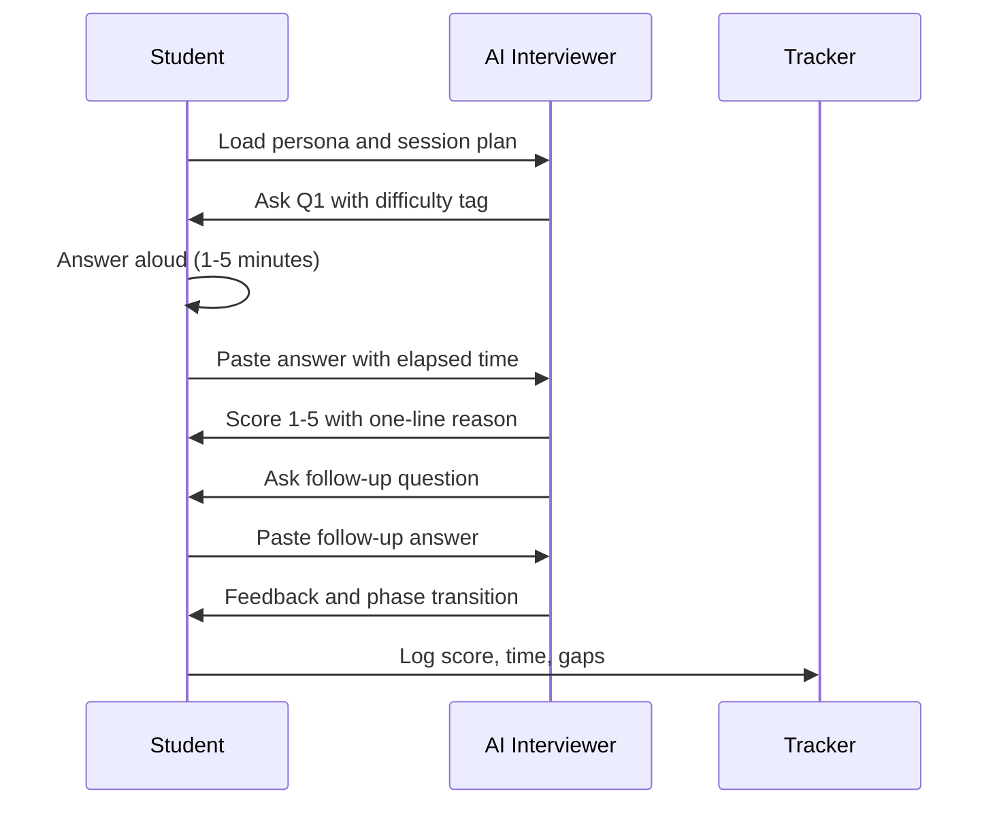
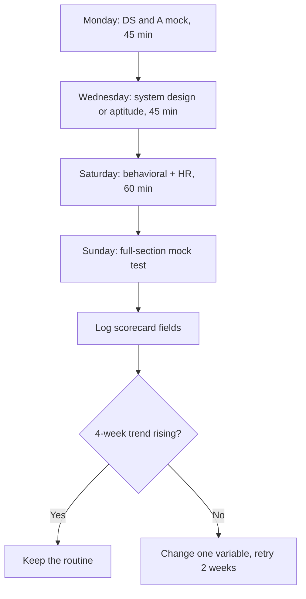

# Chapter 8: Interview & Aptitude with AI

> **Last Updated:** August 2026 | **Estimated Reading Time:** 60–75 minutes

Knowing the material and being asked the material are different sports. This chapter turns ChatGPT, Claude, or Gemini into a personal interview panel that runs company-style mocks, system design rounds, STAR drills, aptitude tests, HR rounds, and negotiation practice on demand. By the end you will have a weekly routine with tracked scores, so the real interview becomes your tenth mock instead of your first.

> **How to work this chapter** — 15–20 minutes of overhead on top of reading:
>
> 1. **Read** — 60–75 minutes, split across 2–3 commute blocks.
> 2. **Do** — run every **Try This** as you go; the chapter's power is in the prompts you actually execute.
> 3. **Prove** — score 8/10 or better on the Chapter Quiz before moving on.
> 4. **Produce** — one company-style mock interview transcript with your score, plus one STAR story written and graded.
>
> **Prerequisites:** Chapter 5. **Next:** Chapter 9.

## Learning Objectives

- Run FAANG, startup, and service-company mock interviews with the right question mix for each
- Execute the 45-minute system design mock with phase-by-phase scoring
- Drill STAR stories with AI grading and aggressive cross-questioning
- Generate aptitude drills with solutions, time targets, and difficulty ramps
- Run timed full-section mock tests and read the score report like a diagnosis
- Practice HR, salary, and group discussion rounds with realistic pushback
- Research target companies and turn the skill gap into a 7-day prep plan
- Tailor resume bullets to a JD and defend every line under cross-examination
- Run a tracked weekly routine of 3 mock sessions with month-over-month trends

## Chapter at a Glance

| Topic | Key Insight | Practical Takeaway |
|---|---|---|
| Company personas | FAANG tests depth, startups test breadth, service companies test speed | Rotate personas weekly to match your target list |
| System design mock | The format itself is the skill: requirements, architecture, deep dive, tradeoffs | 45-minute sessions with AI enforcing the clock |
| STAR drills | Stories need evidence and cross-questions, not polish | Give a story, AI grades 1-5 per STAR element |
| Aptitude drills | Exams are won by pacing, not raw ability | Generate sets with per-question time targets |
| Resume tailoring | A JD is a keyword map of the interview | Rewrite every bullet with action + numbers |
| Weekly routine | Consistency beats intensity; tracked scores keep it honest | 3 mocks per week, fixed fields, month trend |

## The Mock Interview Session



## Q1: How do I run a company-style mock interview (FAANG persona)?

**Answer:** Set the persona and the question mix before the first question arrives. FAANG-style means heavy DS&A depth, follow-ups that push your optimal solution into a harder variant, and a behavioral question blended in at the end. Feed the AI your target role, years of experience, and company list so the mix changes accordingly. The AI asks one question at a time, you answer aloud and paste the transcript, and it scores each answer before moving on. Record every session so your week-over-week score trend is real data, not memory.

```text
User: Mock interview. Persona: Amazon SDE-1 interviewer, 45 minutes, 3 questions:
1 medium DS&A with a follow-up, 1 system design mini, 1 leadership principle question.
No hints. Score me after each answer.

Assistant: Q1 (Medium, Arrays). Given an integer array, return the length of the
longest subarray whose sum is exactly k. Talk through your approach before coding.

User: I will use a hash map of prefix sums. For each index, compute the prefix sum;
if (prefix - k) exists in the map, the distance between the two indexes is a
candidate length. O(n) time, O(n) space.

Assistant: Correct approach. Code it now, then I will ask the follow-up. Also handle
the edge case where k = 0.

User: [code pasted]. For k = 0: prefix - k equals prefix, so I must not overwrite an
existing prefix entry before checking, otherwise a zero-length subarray is reported.

Assistant: Score 4/5. Reasoning and edge cases are solid; one nit: you updated the
map before the check in the k = 0 branch. Follow-up: the array now contains only
positive numbers. Does your solution still win, and what would you change?

User: With only positives, a sliding window gives O(n) time and O(1) space, which
beats the map in memory. The two-pointer version cannot work because the window
needs a sum tracker, not indexes.

Assistant: Score 4/5. Follow-up handled cleanly. Q2 (System design mini): design a
rate limiter for a public API. State your approach and one tradeoff you accept.
```

**How it works:** The persona prompt fixes difficulty, format, and scoring behavior before the session, and the one-question-at-a-time rule keeps the AI from dumping a full answer sheet.

**Try This:** Run this persona for your next three practice sessions and log the per-question scores in your tracker.

## Q2: What is the startup / service-company persona (different question mixes)?

**Answer:** Startup interviews test breadth and product sense: full-stack knowledge, small system design, "how would you build X under constraints", and speed to working code. Service companies (TCS, Infosys, Wipro style) test aptitude, basic coding, communication, and role knowledge, with slower, more predictable questions. The same AI plays both if you change the persona block. Rotate personas weekly so whichever bucket your target companies fall into, the format never surprises you on the day.

```text
Mock interview. Persona: {STARTUP | SERVICE_COMPANY} interviewer for role {ROLE},
candidate has {YEARS_OF_EXPERIENCE} years of experience.

Session plan (pick the matching line):
- STARTUP: 3 product/build questions, 1 small live-coding task, 2 tradeoff questions
- SERVICE_COMPANY: 2 logic questions, 1 basic coding problem, 3 role-knowledge and communication questions

Rules: one question at a time; wait for my answer; score 1-5 with a one-line reason
after each answer; no hints unless I say "hint".

Start with question 1.
```

**How it works:** The persona line switches the question bank and pacing, so one tool covers every company bucket in your target list.

**Try This:** Run one startup session and one service-company session this week, and compare which bucket exposes more gaps.

## Q3: What is the system design mock format with AI (45 minutes)?

**Answer:** The 45-minute system design mock follows the real format: requirements clarification (5 minutes), high-level architecture (15 minutes), deep dive (15 minutes), tradeoffs and closing (10 minutes). The AI plays the interviewer: it refuses to propose designs, interrupts vague hand-waving, asks for throughput and latency numbers, and demands you name technologies with reasons. You paste your design narrative and the AI scores the four phases separately. The scorecard is the product; it shows exactly which phase of your design muscle is weak.

```text
System design mock. Topic: {SYSTEM_TO_DESIGN}. You are the interviewer, 45 minutes, strict.

Phases you must enforce (nudge me when time runs low):
1. Requirements (5 min): make me clarify functional and non-functional requirements
2. High-level architecture (15 min): components, data flow, APIs
3. Deep dive (15 min): pick the hardest component and push me on it
4. Tradeoffs (10 min): scale, cost, consistency vs availability

Interviewer rules: never propose the design yourself; ask questions; if I am vague,
ask for numbers; score each phase 1-5 with 2-3 sentences of feedback when the phase ends.
```

**How it works:** The phase schedule and interviewer rules replicate the real format, and the phase scores show which part of your design process needs work.

**Try This:** Run this on "design a URL shortener" this week, then "design a chat system" next week, and compare phase scores to find your consistently weak phase.

## Q4: How do I survive the deep-dive and tradeoffs phase (the part everyone fails)?

**Answer:** The deep dive targets the one component you will not have fully thought through, and the tradeoffs phase tests whether you know why you made choices, not just what they were. Prepare three things for every system: the bottleneck under 10x load, the scaling path from 100 to a million users, and the consistency-availability tradeoff. Ask the AI to grill you on exactly these three for each system; if you survive the grill, you survive the round.

```text
I designed {SYSTEM}. Grill me on:
1. BOTTLENECK: interrogate me until I identify the actual bottleneck under 10x load
   and justify it with numbers
2. SCALING: make me walk through scaling from 100 to 1,000,000 users, and attack each step
3. TRADEOFFS: for each choice I made, force me to name what I gave up

Also keep a "flags" list: every time I hand-wave, say "details at an appropriate
level of abstraction", or avoid numbers, flag it. End with the flags ranked by danger.

MY DESIGN:
{PASTE_YOUR_DESIGN_NOTES_HERE}
```

**How it works:** The grill converts your design notes into the three pressure tests that decide system design rounds, and the flag list exposes the hand-waving habits you do not notice yourself.

**Try This:** Take your last design mock, run the grill, and fix the top two flags in a revised design before your next mock.

## Q5: How do STAR behavioral drills work?

**Answer:** STAR stands for Situation, Task, Action, Result. You give the AI a real story from your projects, internships, college, or work, and it grades each of the four elements 1-5, then rewrites and cross-questions. The Result element is where most stories fail: interviews want numbers and impact, not effort. Keep a story bank of 8-10 stories, each tagged by competency (leadership, conflict, failure, initiative); with a full bank you can answer any behavioral question in 90 seconds.

```text
Grade my STAR story. The question asked was: "{BEHAVIORAL_QUESTION}"

My story:
Situation: {PASTE_SITUATION}
Task: {PASTE_TASK}
Action: {PASTE_ACTION}
Result: {PASTE_RESULT}

Grade each element 1-5 with a one-line reason. Then:
1. Rewrite the Result with the strongest numbers I actually have
2. List the 3 cross-questions a real interviewer would ask
3. Tell me what my story reveals that I did not say (strengths, and any red flag)
```

**How it works:** Element-by-element grading shows you exactly where the story loses points, and the rewrite shows how to say the same facts with impact.

**Try This:** Grade your three weakest stories this week, rewrite each Result with real numbers, and re-grade them tomorrow.

## Q6: How do I handle AI cross-questioning after my STAR answer (the follow-up trap)?

**Answer:** Interviewers follow up precisely to test whether your story is real and whether you reflect. Prepare for the three follow-up families: "what exactly did you do versus your team", "what went wrong and what did you change", and "what would you do differently now". Have the AI attack your story with all three families plus a numbers attack until you can answer without hedging. A story that survives ten minutes of cross-examination is interview-proof; one that dies in two minutes would have sunk the real interview.

```text
Here is my STAR story. Now act as a skeptical interviewer and attack it:

1. Ownership: ask 3 questions to separate my contribution from my team's
2. Failure: ask 3 questions about what went wrong, with specifics
3. Reflection: ask 3 questions about what I would change and what I learned
4. Numbers: ask 3 questions that force me to quantify impact

I will answer each. Score my answers 1-5 and flag hedging words like
"basically", "kind of", and "helped with".

MY STORY:
{PASTE_STAR_STORY_HERE}
```

**How it works:** The four attack families cover the ways interviewers falsify stories, and the hedging-word flag gives you a verbal tic list to eliminate.

**Try This:** Cross-examine your strongest story this week, answer all 12 questions aloud, count your hedges, and redo it until the count is zero.

## Q7: What is the aptitude drill generator (quant + reasoning at exam difficulty)?

**Answer:** Aptitude (quant plus reasoning) appears in service-company rounds and many startup screening stages. Generate drills at exam difficulty with a strict format: question, options, answer, step-by-step solution, difficulty tag, and a per-question time target. Ramp the difficulty each week; the generator is your infinite question bank. The solutions matter more than the questions, because you want to compare your method against the optimal shortcut, especially on time-based problems where the shortcut decides the outcome.

```text
Generate an aptitude drill set for {TOPIC} (e.g., percentages, time and work, ratios,
number series, data interpretation, logical reasoning).

Format for each question:
Q{number}. {question with all data}
Options: a) b) c) d)
Answer: {letter}
Solution: {step-by-step, max 6 steps}
Difficulty: {easy | medium | hard}
Time target: {seconds}

Create 8 questions: 2 easy, 4 medium, 2 hard. Add a 1-line tip at the end about
the fastest approach for each question.

TOPIC: {TOPIC}
```

**How it works:** The fixed format makes every set printable or importable into a timer tool, and the time target trains pacing, not just correctness.

**Try This:** Generate a set for your weakest aptitude topic, solve against the time targets, and log your accuracy per difficulty in the tracker.

## Q8: How do I get timed pacing right (the exam-style pacing drill)?

**Answer:** Most aptitude losses come from pacing: spending five minutes on a one-mark hard question while easy questions go untouched. Run the pacing drill: 10 questions, 12 minutes, deliberate hard questions at positions 3 and 7, and a rule that you may skip and return. Mark each answer with the elapsed seconds so the AI can build the timeline. At the end it reports your skip behavior, per-difficulty accuracy, and a time economy score. The goal is learning when to cut losses: for most exams, two easy questions beat one hard question on the same clock.

```text
Pacing drill. Rules:
- 10 aptitude questions, 12 minutes total
- Questions 3 and 7 are deliberately hard
- You may skip any question and return later
- Do NOT show answers as we go; I will say "answers" at the end
- I will mark each answer with elapsed seconds, e.g. "A2-3m40s"

After I say "answers": report my per-question time, which questions I skipped,
my accuracy per difficulty, and the "time economy score": how many easy questions
I left unsolved because time went to hard ones.
```

**How it works:** Per-question time capture plus the time economy score turns pacing from a feeling into a number you can improve week over week.

**Try This:** Run the pacing drill twice this week on two topics; target a time economy score above 80 percent (at least 8 of the 10 marks available).

## Q9: How do I run a timed mock test with AI (full section, timer, score report)?

**Answer:** The timed mock is the drill generator plus a clock and a scorecard. You commit to a full section (say 15 aptitude questions in 25 minutes), answer with elapsed-time markers, and the AI produces the report: per-question correctness, time, accuracy by difficulty, skip list, and a one-week fix plan. Run one full-section mock per week, always under the same conditions (timer, no hints, no looking back), so results are comparable across weeks. The score trend is your real progress metric; daily problem practice keeps the trend rising.

```text
Full-section mock test. Section: {APTITUDE | CODING | REASONING}, 15 questions, 25 minutes, exam conditions.

Rules:
- Generate all 15 questions up front, difficulty ramp: 4 easy, 7 medium, 4 hard
- I answer with markers like "A2-14m30s" (option A, question 2, elapsed 14 min 30 s)
- No hints, no partial feedback until the end
- Final report: score out of 15, time per question, accuracy by difficulty,
  skip list, and a 1-week fix plan

Start the timer now with the full paper.
```

**How it works:** The fixed difficulty ramp and elapsed-time markers make every mock comparable, and the end report gives you the same artifacts a real test center would.

**Try This:** Run this mock every week at the same hour, plot the score trend in your tracker, and note the week you cross 70 percent.

## Q10: How do I read my mock score report and plan the next week (the report loop)?

**Answer:** The report is a diagnosis, not a grade. Feed it back to the AI with one instruction: turn the gap list into next week's plan, distributing effort by marks at stake. The topic where you lose three questions beats the topic where you lose one. Fix one accuracy gap and one pacing gap per week, never more: two fixes weekly compound, five fixes weekly fail. At the end of the month, re-run the same section and compare scores to verify the loop works.

```text
Here is my mock report from this week (below). Produce next week's plan:

1. Rank gaps by marks at stake
2. Pick exactly ONE accuracy gap and ONE pacing gap for the week
3. For each: daily routine (15 min), resources to use, success metric for the week
4. A 5-question re-test on the accuracy gap for Sunday, at exam difficulty
5. One sentence of brutal honesty about my weakest habit

REPORT:
{PASTE_SCORE_REPORT_HERE}
```

**How it works:** The marks-at-stake ranking and the one-plus-one rule keep the plan small enough to execute, and the Sunday re-test measures whether the fix worked.

**Try This:** After your next mock, run this prompt and follow the plan for exactly one week, then compare next week's mock score.

## Q11: How do I practice HR/fit rounds (common questions, AI pushes back)?

**Answer:** HR rounds feel easy and kill more candidates than they should, because they test composure and self-awareness, not scripted answers. The AI plays a pushy HR person: it interrupts, challenges your numbers, probes your "why this company" answer, and asks the classic trap questions (biggest weakness, why gaps, why should we hire you). Answer every question twice: once unprepared, once after the AI's feedback. The improvement between the two answers is the training.

```text
User: HR round drill. Ask me the 5 most common fresher HR questions, one at a time.
After each of my answers, challenge one weak point, then ask the next question.

Assistant: Q1. Tell me about yourself in 60 seconds.

User: I am a final-year CS student. I have built three projects, including a
RAG-based document Q&A system that I deployed, and I have solved 400+ DSA problems.
I am preparing for an SDE role in an AI company.

Assistant: Challenge: "400+ DSA problems" is a number without context: hard questions?
On which platform? And "preparing for" is weak language; say "targeting". Improve
and continue.

Q2. What is your biggest weakness?

User: I tend to over-engineer my first-pass solutions.

Assistant: Challenge: is that a real weakness or a disguised strength? A real one
costs you something. Give one concrete project incident where over-engineering
cost you time, and what you changed. Improve and continue.

Q3. Why do you want to join our company?

User: Because of the AI products and the learning environment.

Assistant: Challenge: that answer could fit any company. Name one specific product,
one engineering blog post, and one thing you would deliver in your first 90 days.
Improve and continue.
```

**How it works:** The challenge-after-every-answer loop trains the recovery reflex, because in the real round the interviewer will push exactly like this.

**Try This:** Run the HR drill twice this week on the same five questions, compare your first and second answers, and record the challenge types that made you stumble.

## Q12: How do I answer salary and negotiation questions with AI?

**Answer:** Salary questions are not about a number; they are about anchors and confidence. Have the AI play three roles: a coach briefing you, an interviewer pushing back, and an observer grading you. Practice the script: give a range anchored to market data, avoid naming a number first when you can, and always convert the conversation to total compensation. Role-play the exact phrases you will say, because in the moment your brain will go blank.

```text
Negotiation role-play. Context: {ROLE}, {LOCATION}, {YEARS_OF_EXPERIENCE},
offer of {OFFER_AMOUNT}.

Roles:
1. YOU (coach): brief me for 3 minutes on anchoring, ranges, and total compensation
2. INTERVIEWER: push back on my range with the classic lines ("budget is fixed",
   "freshers get one standard offer")
3. OBSERVER: after the exchange, grade my anchors, my confidence markers, and my
   scripted phrases; rewrite my weak lines

I will role-play as myself. Start with the coaching brief.
```

**How it works:** The three roles separate preparation from practice, and the observer's rewrite gives you exact lines to rehearse until they feel natural.

**Try This:** Role-play the negotiation with your real offer context this week and rehearse the rewritten lines until you can say them without reading.

## Q13: How do I prepare for group discussions?

**Answer:** Group discussions test listening, structuring, and disagreeing without being disagreeable. Practice the three moves: enter early with a structure ("I see two sides here"), build on others ("Extending Priya's point"), and redirect when the group stalls. The AI simulates a five-person panel with different stances and scores your contribution quality. For AI-specific GDs, prep ten one-liners on frontier topics (agents, LLM costs, ethics) that you can drop into any discussion.

```text
Group discussion simulation. Topic: {GD_TOPIC}. You simulate 4 other participants with distinct stances:
- Participant A: pro-technology, aggressive
- Participant B: risk-focused, cautious
- Participant C: data-driven, asks for evidence
- Participant D: fence-sitter, follows the group

Rules: I speak by typing; the others react realistically (interrupt, agree, counter).
After 10 minutes of discussion, score me on: entry timing, structure, building on
others, disagreement quality, and how many times I added new information vs repeated.

Topic: {GD_TOPIC}
```

**How it works:** The four simulated stances create realistic chaos, and the scoring dimensions match the rubrics real GD evaluators use.

**Try This:** Run two GDs this week (one technical, one general) and aim for at least 3 "builds on others" and 1 structured disagreement per session.

## Q14: How do I prepare for college final round and presentation styles?

**Answer:** Many college and service-company final rounds include a presentation or a walkthrough of your resume and projects before a panel. Prepare a 5-minute project pitch with a fixed arc: problem, solution, my contribution, numbers, one failure. Have the AI act as the panel, fire questions at specific parts of the pitch, and time it until you land at 4:30-5:00. The pitch is a reusable asset: the same five minutes works for job fairs, internships, and interviews.

```text
I have a 5-minute presentation on {PROJECT_TOPIC}. Here is my current pitch text (below).

1. Time my pitch and tell me the overrun
2. Restructure it into: Problem (45 s), Solution (90 s), My contribution (60 s),
   Numbers (30 s), Failure + learning (45 s), Ask/close (30 s)
3. Then act as a skeptical panel: fire 5 hard questions at specific parts of my pitch
4. Give me 3 one-line hooks for the opening

MY PITCH:
{PASTE_PITCH_TEXT_HERE}
```

**How it works:** The fixed arc forces the pitch to hit the parts panels grade, and the panel questions prepare you for the actual Q&A.

**Try This:** Pitch your best project in 5 minutes to this prompt this week, cut the overrun, and re-time until you land between 4:30 and 5:00.

## Q15: How does AI research a target company (role requirements to skill gap)?

**Answer:** Ask the AI to research the company from public sources: open roles, the JD text, the engineering blog, and recent news. The output should be a requirements map: hard skills, soft skills, tools, and what the company values, with each item labeled "explicit in JD" or "inferred from blog". Then map your current skills against it and produce the gap list ranked by how often the JD mentions each item. Company research is not a nice-to-have: it changes which questions the AI asks in your mocks, so practice gets harder in the right direction.

```text
Research {COMPANY_NAME} for the role {ROLE} ({LOCATION}). Use public sources if you
can; otherwise use the JD I paste.

Produce:
1. REQUIREMENTS MAP: hard skills, soft skills, tools/tech, experience level,
   each marked "mentioned explicitly in JD" or "inferred from company blog/news"
2. COMPANY VALUES: 4-5 signals from their engineering blog or news
   (e.g., "they write about latency, so performance culture")
3. MY GAP: compare against my skills ({PASTE_YOUR_SKILLS_OR_RESUME_TEXT})
4. PREP PLAN: 7-day plan, 90 minutes per day, prioritizing the top 2 gaps
5. LIKELY INTERVIEW MIX: what question types to expect at each round

JD (if available):
{PASTE_JOB_DESCRIPTION_HERE}
```

**How it works:** The requirements map makes the JD machine-readable, and the gap plan tells you exactly where the next 7 days of practice should go.

**Try This:** Research your top-choice company this week and re-run your next mock interview with the "likely interview mix" as the question bank.

## Q16: How do I turn company research into a skill-gap prep plan (the plan loop)?

**Answer:** Research is only useful as a plan. After the research, run the plan loop: pick the top two gaps, assign daily slots from your commute and evening time, pick resources, and schedule a verification mock in 7 days. The verification closes the loop: the next mock must use the company's question mix so you can measure whether the gap actually closed. Never run a mock without knowing what it is verifying.

```text
Turn this gap list into a 7-day prep plan for {COMPANY_NAME} {ROLE}.

Constraints:
- Daily: 2h commute + 90 min evening study
- Gaps (ranked): {GAP_1}, {GAP_2}, {GAP_3}
- I learn best by: {METHOD} (e.g., flashcard + mock problem pairs)

Plan structure per day: commute slot (flashcards + reading), evening slot 1
(gap 1 deep practice), evening slot 2 (gap 2 deep practice), 15 min mock problem.
Day 7: verification mock with the company's question mix, with a pass/fail
threshold I set.

GAP LIST:
{PASTE_GAP_LIST_HERE}
```

**How it works:** The plan maps gaps onto fixed time slots, and the day-7 verification mock closes the loop so the plan continues or changes based on a measurement.

**Try This:** Build this plan for your top company this week, run it, and report the verification mock result in your tracker.
## Q17: How do I tailor my resume/CV bullets for a JD with AI?

**Answer:** A JD is a keyword map of the interview. Feed the JD plus your resume to the AI and ask for rewritten bullets: each bullet becomes action + task + tech + impact + number, and contains the JD's exact keywords where honest. The rewriting rule is: no fake skills — reword real work with the interviewer's vocabulary. Then run the match check: a scoring pass that tells you which keywords you claim versus which you can actually defend, because claiming a skill you cannot defend is worse than omitting it.

```text
Tailor my resume for this JD. For each of my bullets:

1. Rewrite with the formula: ACTION + TASK + TECH + IMPACT + NUMBER
2. Map it to the JD keyword it supports (if none, say "unmapped")
3. Flag any bullet that uses a JD keyword I would struggle to defend in an interview
4. Score the resume-JD match: keyword coverage, impact density, and the top 3 missing items

MY RESUME BULLETS:
{PASTE_RESUME_BULLETS_HERE}

JD:
{PASTE_JOB_DESCRIPTION_HERE}
```

**How it works:** The five-part rewrite formula standardizes every bullet, and the defendability flag keeps you from overclaiming into an interview trap.

**Try This:** Tailor your resume for your top two companies this week, and practice one flagged bullet per day until you can defend it.

## Q18: How do I run behavioral cross-questions on my resume bullets (the resume defense)?

**Answer:** Every resume line is a question magnet; the defense drill makes you bulletproof. For each rewritten bullet, have the AI generate the three follow-ups a panel would ask ("why that tech", "what was your exact role", "what was the number before and after"), then answer them aloud. The goal is to reach the point where nothing on your resume is a surprise to you. This is also where you find gaps: if a bullet cannot survive follow-ups, you need to redo the work or cut the bullet.

```text
Here are my resume bullets. For each bullet:
1. Generate the 3 hardest follow-up questions a panel would ask
2. For each follow-up, give a model answer I can adapt (2-4 sentences, with a placeholder for my real numbers)
3. Flag bullets that would collapse under follow-ups (no specifics available), and suggest a rewrite or a cut

MY BULLETS:
{PASTE_BULLETS_HERE}
```

**How it works:** The follow-up generator converts every resume line into a mini-interview, and the collapse flag tells you which lines to fix before the panel finds them.

**Try This:** Defense-drill the five bullets on your top-company resume this week; cut or rewrite anything flagged as collapsing.

## Q19: How do I build a weekly interview practice routine (3 mock sessions, tracked)?

**Answer:** The routine is fixed and non-negotiable: 3 mock sessions per week, each with a purpose — Monday DS&A, Wednesday system design or aptitude, Saturday behavioral plus HR — and each followed by a tracker log with the same fields. Variety is the enemy of comparability, so the session types rotate but the fields stay constant. The tracked history does the motivation work: when the score line is flat, change the routine; when it rises, keep it. Consistency beats intensity: three 45-minute sessions beat one 4-hour cram, every time.



```text
Build my weekly interview practice routine for the next 4 weeks.

Fixed constraints:
- 3 sessions/week: Monday (45 min), Wednesday (45 min), Saturday (60 min)
- Commute daily: 60 min recall + flashcards
- One full mock test (aptitude or coding) every Sunday
- Rotation: DS&A / system design / behavioral+HR, with one aptitude drill per week

For each week, output a table: Day | Session type | Focus (from my gap list) | Success metric | Tracker fields to fill.

MY GAP LIST: {PASTE_GAP_LIST_HERE}
```

**How it works:** The rotation plus fixed fields makes every week comparable, and the success metrics turn each session into a small experiment with an outcome.

**Try This:** Run this routine for 4 weeks, then answer one question in your tracker: which session type moved my mock score the most?

## Q20: How do I track mock interview performance over time (the scorecard loop)?

**Answer:** Tracking is what turns mocks from practice into progress. Keep the same fields every session: date, type, score, time, gaps found, and one fix for next time. The TypeScript scorecard below is your tool: it computes per-question scores, accuracy, total time, and the slowest question, and prints a report you can paste into the tracker. At month's end, feed the last four scorecards back to the AI and let it tell you whether you are improving, plateauing, or regressing, and why.

```typescript
// mock-session-tracker.ts
// Mock test timer + scorecard.
// Run: npx ts-node mock-session-tracker.ts

type Round = "dsa" | "system-design" | "behavioral" | "aptitude";

interface Attempt {
  round: Round;
  question: string;
  timeSeconds: number;
  selfScore: number; // 0-5
  skipped: boolean;
}

interface Session {
  date: string;
  attempts: Attempt[];
}

function buildSession(date: string, attempts: Attempt[]): Session {
  return { date, attempts };
}

function scoreReport(session: Session): string {
  const answered = session.attempts.filter((a) => !a.skipped);
  const correct = answered.filter((a) => a.selfScore >= 4).length;
  const partial = answered.filter((a) => a.selfScore === 3).length;
  const wrong = answered.filter((a) => a.selfScore <= 2).length;
  const totalTime = session.attempts.reduce((sum, a) => sum + a.timeSeconds, 0);
  const accuracy = answered.length === 0 ? 0 : Math.round((correct / answered.length) * 100);
  const slowest = [...session.attempts].sort((a, b) => b.timeSeconds - a.timeSeconds)[0];
  return [
    `Session: ${session.date}`,
    `Questions: ${session.attempts.length} (answered ${answered.length}, skipped ${session.attempts.length - answered.length})`,
    `Correct (4-5): ${correct} | Partial (3): ${partial} | Wrong (0-2): ${wrong}`,
    `Accuracy: ${accuracy}%`,
    `Total time: ${Math.round(totalTime / 60)} min`,
    `Slowest question: ${slowest ? slowest.question : "none"} (${Math.round(slowest ? slowest.timeSeconds / 60 : 0)} min)`,
  ].join("\n");
}

function monthTrend(sessions: Session[]): string {
  return sessions.map((s, i) => {
    const answered = s.attempts.filter((a) => !a.skipped);
    const accuracy = answered.length === 0
      ? 0
      : Math.round((answered.filter((a) => a.selfScore >= 4).length / answered.length) * 100);
    return `${i + 1}. ${s.date}: ${accuracy}% accuracy (${answered.length} answered)`;
  }).join("\n");
}

const week: Session[] = [
  buildSession("2026-08-03", [
    { round: "dsa", question: "Longest subarray sum k", timeSeconds: 420, selfScore: 4, skipped: false },
    { round: "dsa", question: "Design LRU cache", timeSeconds: 780, selfScore: 3, skipped: false },
    { round: "aptitude", question: "Time and work problem", timeSeconds: 300, selfScore: 1, skipped: false },
  ]),
  buildSession("2026-08-10", [
    { round: "dsa", question: "Longest subarray sum k", timeSeconds: 300, selfScore: 5, skipped: false },
    { round: "system-design", question: "Rate limiter", timeSeconds: 900, selfScore: 4, skipped: false },
  ]),
];

week.forEach((s) => console.log(scoreReport(s) + "\n"));
console.log("=== Month trend ===\n" + monthTrend(week));
```

**How it works:** The scorecard computes the same metrics every session, so the month trend is honest and comparable, and the slowest-question line flags pacing problems.

**Try This:** Log your next four mock sessions with this tool, then paste the month trend to the AI: "Interpret this trend: flat, rising, or falling; give the 2 most likely causes and the 1 fix."

## Summary

- Company personas (FAANG, startup, service company) change the question mix; rotate weekly to match your target list.
- The system design mock is requirements, architecture, deep dive, tradeoffs, with phase scores as the deliverable.
- STAR drills grade all four elements and cross-question until a story is interview-proof.
- Aptitude generators produce infinite drills with solutions and time targets; pacing is a trainable skill, not a gift.
- Timed full-section mocks with fixed difficulty ramps make week-over-week scores comparable.
- HR, salary, and GD drills train composure and the recovery reflex, not memorized answers.
- Company research flows into a skill gap, then a 7-day plan, then a verification mock: the closed loop.
- Resume bullets must be action + task + tech + impact + number, with every keyword defensible under cross-examination.
- A tracked weekly routine of 3 mocks converts practice into a month-over-month trend line.

## Practical Takeaways

| Technique | Prompt / Command | When to Use |
|---|---|---|
| FAANG mock | "Mock interview, persona: Amazon SDE-1, 3 questions, score me" | Monday sessions |
| System design mock | "45-minute mock on {system}, enforce 4 phases, score each" | Wednesday sessions |
| STAR grade | "Grade my STAR story, rewrite Result with numbers" | After every story |
| STAR cross-exam | "Attack my story: ownership, failure, reflection, numbers" | Once per story |
| Aptitude drill | "Generate 8 questions on {topic} with solutions and time targets" | Weekly |
| Pacing drill | "10 questions, 12 minutes, hard at 3 and 7, track elapsed seconds" | Twice weekly |
| Timed mock | "Full section, 15 questions, 25 min, final report" | Sunday |
| HR drill | "HR round, challenge one weak point after each answer" | Saturday |
| Company research | "Research {company} for {role}, produce requirements map and gaps" | Before each target company |
| Resume tailoring | "Rewrite bullets: ACTION + TASK + TECH + IMPACT + NUMBER" | Every new JD |
| Weekly routine | "Build 4-week routine, 3 sessions, fixed tracker fields" | Every month |

## Chapter Quiz

1. Which company-style persona emphasizes breadth and product sense?
   - a) FAANG
   - b) Startup
   - c) Service company
   - d) Government
   <details><summary>Answer</summary>b) Startup</details>

2. In the 45-minute system design mock, which phase comes immediately after high-level architecture?
   - a) Requirements
   - b) Deep dive
   - c) Tradeoffs
   - d) Closing
   <details><summary>Answer</summary>b) Deep dive</details>

3. What is the interviewer rule in the design mock?
   - a) Propose designs and grade my agreement
   - b) Never propose the design; ask questions and push for numbers
   - c) Give hints freely
   - d) Score only the final design
   <details><summary>Answer</summary>b) Never propose the design; ask questions and push for numbers</details>

4. Which STAR element most commonly loses points?
   - a) Situation
   - b) Task
   - c) Action
   - d) Result, because it lacks numbers and impact
   <details><summary>Answer</summary>d) Result, because it lacks numbers and impact</details>

5. What do the four cross-examination families attack in a STAR story?
   - a) Grammar
   - b) Ownership, failure, reflection, numbers
   - c) Story length
   - d) Vocabulary
   <details><summary>Answer</summary>b) Ownership, failure, reflection, numbers</details>

6. Why does every aptitude drill question carry a time target?
   - a) To make the set printable
   - b) To train pacing, not just correctness
   - c) To count attempts
   - d) To sort questions by difficulty
   <details><summary>Answer</summary>b) To train pacing, not just correctness</details>

7. What does the time economy score measure?
   - a) Total questions solved
   - b) Easy questions left unsolved because time went to hard ones
   - c) Seconds per question
   - d) Skips per question
   <details><summary>Answer</summary>b) Easy questions left unsolved because time went to hard ones</details>

8. Which rule does the resume tailoring prompt enforce?
   - a) Add as many keywords as possible, even unearned
   - b) No fake skills: reword real work with the interviewer's vocabulary
   - c) Never mention numbers
   - d) Only list internships
   <details><summary>Answer</summary>b) No fake skills: reword real work with the interviewer's vocabulary</details>

9. What is the recommended weekly mock rotation?
   - a) Random topics
   - b) DS&A, system design, behavioral + HR, with a Sunday full mock
   - c) Aptitude only
   - d) One mock per month
   <details><summary>Answer</summary>b) DS&A, system design, behavioral + HR, with a Sunday full mock</details>

10. Why must tracker fields stay constant across sessions?
    - a) To save storage
    - b) So week-over-week scores are comparable
    - c) Because the AI demands it
    - d) To shorten sessions
    <details><summary>Answer</summary>b) So week-over-week scores are comparable</details>

## Exercises

1. Run a FAANG persona mock (Q1) and one startup and one service-company mock (Q2), logging per-question scores for all three.
2. Run the system design mock (Q3), then the grill (Q4); fix the top two flags and re-run the same topic next week.
3. Grade and cross-examine your three best STAR stories (Q5-Q6); rewrite every Result with real numbers.
4. Generate an aptitude drill (Q7), run the pacing drill (Q8), then a full timed mock (Q9); feed the report into the plan loop (Q10) and follow it for a week.
5. Run the HR drill (Q11) twice on the same five questions and one negotiation role-play (Q12).
6. Research your top company (Q15), build the 7-day gap plan (Q16), tailor your resume (Q17), defense-drill it (Q18), then run the 4-week routine (Q19) and track every session with the TypeScript scorecard (Q20).

## Further Reading

- [System Design Primer (GitHub)](https://github.com/donnemartin/system-design-primer)
- [Interviewing.io — live mock interviews](https://interviewing.io/)
- [Pramp — free peer mock interviews](https://www.pramp.com/)
- [STAR interview method (Indeed)](https://www.indeed.com/career-advice/interviewing/star-interview-method)
- [Levels.fyi — salary and compensation data](https://www.levels.fyi/)
