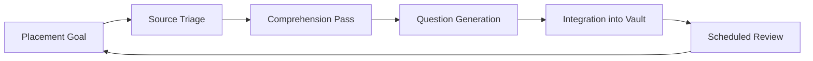
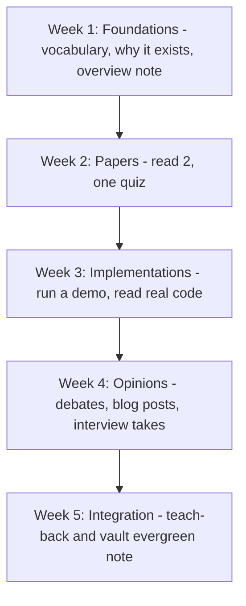

# Chapter 10: Research & Deep Dives with AI

> **Last Updated:** August 2026 | **Estimated Reading Time:** 60–75 minutes

Research is the skill that separates students who wait for tutorials from people who learn anything. This chapter turns AI into a research engine: official docs become runnable tutorials, arXiv papers become plain-language notes, AI trends become a 10-minute weekly brief, and any unknown topic becomes a structured deep dive that ends in your vault and your interviews.

The pipeline is goal → sources → comprehension → questions → integration → review. Every section below plugs into one stage of that pipeline, and the TypeScript source tracker at the end keeps your research queue honest — because in a 4-hour commute schedule, what you do NOT read matters as much as what you do.

---

## Learning Objectives

After this chapter you will be able to:

- Convert official documentation into runnable tutorials with practice exercises
- Read any arXiv paper using a three-pass method with AI as your co-reader
- Turn papers and articles into comprehension quizzes that verify learning
- Produce a weekly AI-trends brief in 10 minutes using a fixed source list
- Run X vs Y comparison deep-dives on purpose, mechanism, tradeoffs, and ecosystem
- Build and prune a reading list for any new domain, keeping only survivors
- Serial deep-dive one topic across weeks: foundations → papers → implementations → opinions
- Vet AI-suggested sources for reputation, primary sourcing, and recency
- Map an unfamiliar codebase with AI: architecture, entry points, exercises
- Filter every deep dive through a placement-relevance check before it starts

---

## Chapter at a Glance

| Topic | Key Insight | Practical Takeaway |
|-------|-------------|--------------------|
| Docs → tutorial | Official docs are the primary source; AI makes them runnable | Extract a tutorial with exercises, then execute it |
| Paper reading | Three passes: skim, full read, deep dive | Never read a paper linearly; triage in pass one |
| Paper quizzes | Comprehension is verified, not assumed | Generate 10 questions and answer them without AI |
| X vs Y deep-dives | Compare on purpose, mechanism, tradeoffs, ecosystem | One framework, used for every technology comparison |
| Serial deep-diving | One topic, many weeks, increasing depth | Foundations → papers → implementations → opinions |
| Source vetting | Not everything AI suggests is trustworthy | Check reputation, primary source, recency before reading |

---



---

## Q1: How do I learn a tool from official docs — docs URL to runnable tutorial?

**Answer:** The official documentation is the primary source; tutorials, blog posts, and YouTube videos are secondary. When you need a tool, do not search for a tutorial — give AI the docs URL or the relevant page text and ask it to build a tutorial: a 20-minute runnable path, the 80% of the tool you will actually use, and exercises that force real usage. The critical instruction is to give the tutorial a fixed format — goal, minimal example, exercises with expected output, and a mistakes section — because you want a uniform learning artifact per tool, not a chat essay. Two guards keep this honest: AI must cite which doc page each step comes from, and the exercises must have checkable outputs so you know you executed, not just read. This turns "I skimmed the docs" into "I used the tool three times."

**Copy-paste prompt:**

```text
Learn me a tool from its official docs.

Tool: {tool name}
Docs URL: {paste the official docs URL or the main page text}
My level: {beginner / intermediate}
My goal: {e.g. build a small RAG service with it}
Time budget: {e.g. 4 hours across 2 days}

Produce:
1. A 5-line summary of what the tool is for and when NOT to use it
2. A 10-step runnable tutorial (each step: command/code, expected
   output, which doc page it came from)
3. 3 exercises with checkable outputs (I must be able to verify I did
   them correctly)
4. The 3 mistakes beginners make most often

Rules: only use the official docs as the source. If the docs do not
cover something, write "NOT IN DOCS — verify before trusting".
```

**How it works:** The prompt forces the tutorial to stay grounded in official docs, keeps it runnable with expected outputs, and bakes in a verification gate for anything AI could not source.

**Try This:** Pick a tool from the Module 23 course (for example, Dify or vLLM), run the prompt with its official docs, and execute the tutorial within 48 hours. Save the result as a note under `subjects/tools/{tool}.md`.

---

## Q2: How do I research a topic I only know the name of (cold-start research)?

**Answer:** Cold start is when you have a topic name and nothing else — a term from a job description, a paper title, a model name. The research path is: overview → ecosystem map → why it matters → learning path. Give AI the name and ask for a plain-language definition, the 3-5 key sub-concepts you must know, who the main players are (papers, tools, companies), why it matters for your placement goal, and a recommended order to learn it. The trap at this stage is depth: you want breadth first, because without the map you cannot place anything you later learn. Always end with a placement-relevance line — is this actually on your path, or just interesting? — before you invest hours. This single check is what keeps cold starts from becoming rabbit holes.

**Copy-paste prompt:**

```text
Cold-start research. I know only the name: {topic name}.
I do not know what it is, why it matters, or where it fits.

Explain to a smart beginner (me):
1. What it is in 3 plain sentences (no jargon)
2. The 5 sub-concepts I will meet first, ordered by learning sequence
3. The main players: 3 papers or tools I will see mentioned everywhere
4. Why it matters for {placement role, e.g. ML engineer at a startup}
5. One-sentence verdict: worth deep-diving now, or bookmarked for
   later?

Keep it under 300 words. If you are unsure of a fact, mark it
UNVERIFIED so I can check it before studying it.
```

**How it works:** The prompt caps the output at breadth, forces a relevance verdict, and marks unverified claims — so you get a map, not a wall, and never treat guesses as facts.

**Try This:** Take a term from a job description you want (for example, "MCP servers" or "speculative decoding") and run this prompt. Add the verdict to your reading list, then start the top sub-concept.

---

## Q3: How do I read an arXiv paper with AI (paper to plain-language notes)?

**Answer:** Papers are the primary source for anything AI, and the three-pass method makes them cheap: pass one is a 5-minute skim of title, abstract, and figures to decide if the paper matters; pass two is a full read taking notes on problem, method, and results; pass three is a deep dive only if the paper is central to your goal. AI is your co-reader at every pass — it can produce the pass-one triage from the abstract alone, explain unfamiliar notation during pass two, and generate the plain-language architecture summary for your notes. The deliverable of any paper session is a note, not a highlight: one-page summary, architecture diagram, open questions, and how this paper changes what you knew. Most papers fail the triage in pass one; that is the point — you are not paid to read everything, you are paid to know the right few deeply.

**Chat transcript:**

```text
You: Here is the abstract of the paper "Attention Is All You Need".
      Triage it for me: worth a full read for an ML placement prep,
      or just a skim?
AI:   Triage verdict: FULL READ, and it belongs near the TOP of your
      queue. Reason: this is the foundational transformer paper. Every
      interview question about attention, self-attention, or the
      encoder-decoder stack traces back to it. Skimming it would be
      like skimming the HashMap chapter before a DSA interview.
      Pass-one note for your vault: the paper removes recurrence and
      convolution from sequence modeling entirely, replacing them with
      self-attention plus positional encodings, and it beats an LSTM
      ensemble on WMT EN-DE. Key figures to study: Figure 2 (scaled
      dot-product attention), Figure 4 (the full architecture).
      Suggested next question: "What is the role of the d_k scaling
      factor in the attention formula?"
You:   Good. Now during my full read, when I hit "multi-head
      attention," explain it as if I know matrix multiplication but
      have never seen attention.
AI:   Think of the sentence as a row of word vectors. Self-attention
      asks, for each word, how much every other word should influence
      its meaning. "Query" is the question each word asks, "key" is
      what each other word says it can answer, and "value" is the
      actual content it offers. Each attention head runs this scoring
      with its own learned projections, so head 1 might track syntax
      while head 2 tracks distance. Multi-head means running that
      whole mechanism in parallel and concatenating the results, which
      lets one layer capture several relationships at once.
You:   Perfect. Generate my paper note now: one-page summary, the
      architecture diagram as text, open questions.
AI:   PAPER NOTE: Attention Is All You Need (Vaswani et al., 2017)
      Summary: sequence-to-sequence model built purely on attention.
      Problem: RNNs are sequential, slow to train, and lose long-range
      context. Solution: self-attention computes all pairwise
      interactions in parallel, scaled by 1/sqrt(d_k) for stable
      gradients. Architecture: encoder with 6 layers of multi-head
      self-attention + position-wise FFN, decoder with masked
      self-attention plus cross-attention, sinusoidal positional
      encodings. Results: BLEU 28.4 on WMT EN-DE, beats best LSTM
      ensemble with far less training time. Open questions: why does
      the scaling factor matter so much? How do heads specialize? What
      does the quadratic attention cost mean for long contexts?
```

**How it works:** The triage decides your effort, the analogy pass translates the mechanism into your language, and the structured note — summary, architecture, open questions — becomes the vault artifact that future revisions and interviews draw from.

**Try This:** Pick one paper from the Module 23 model-ecosystem lesson, run the triage prompt, then read it fully and produce the paper note with the transcript's format. File it under `subjects/ml/papers/`.

---

## Q4: How do I turn a paper into quiz questions to verify my comprehension?

**Answer:** Reading a paper and understanding it are different events; quizzes close the gap. After your paper note exists, ask AI for 10 questions of three kinds: factual (definitions, formulas, results), mechanistic (why does the method work, what would break), and adversarial (what would a critic say, what is the limitation). The rule is that you answer them from memory first, without the paper open, then grade yourself, then restudy only the failed questions. A question you cannot answer is a gap in the note — fix the note, not your memory. This is also the interview pay-off: interviewers ask exactly these mechanistic and adversarial questions, so every paper you quiz becomes interview rehearsal. One paper quizzed per week is enough; do not turn paper reading into an exam factory.

**Copy-paste prompt:**

```text
Generate a comprehension quiz for this paper note, without giving me
the answers.

Paper note: {paste your paper note}

Create 10 questions, grouped:
- 4 FACTUAL: definitions, formulas, numbers from the paper
- 3 MECHANISTIC: why does the method work, what breaks if you change
  a component (ask at least one "what if" question)
- 3 ADVERSARIAL: limitations, failure modes, what a critic would say

Rules:
- No answer hints in the question text
- Each question must be answerable ONLY from the paper (no trivia)
- Number them Q1-Q10, group by type

I will answer, then ask you to grade me against the paper.
```

**How it works:** The three question types cover recall, reasoning, and judgment — the same three layers an interviewer probes. Answering from memory first is what turns the quiz from reading exercise into retention.

**Try This:** Run this on the paper note from Q3. Answer the 10 questions tomorrow morning (paper closed), then have AI grade you and mark your note's gaps.

---

## Q5: How do I build a weekly AI-trends digest (10-minute brief with what changed)?

**Answer:** AI moves weekly; your reading time does not. The trends digest is a fixed weekly ritual: a fixed source list, one paste job, one 10-minute brief. Your source list should have 4-6 items — for example, arXiv daily papers, Hacker News top AI posts, two newsletters you trust, and one X/Twitter list — and you should batch-collect them during the week into one document, then let AI compress them on Sunday. The brief's format is fixed: what changed this week (3-5 items), why it matters (one line each), what you should study (one item max), and what to ignore. The "ignore" section is the discipline: most of the week's news is noise for your placement goal. This ritual takes 10 minutes and stops you from doom-scrolling AI news every evening, which is the real time cost.

**Chat transcript:**

```text
You: Here are this week's AI headlines I collected from my source
     list: (1) arXiv: "Efficient memory compression for long-context
     transformers", (2) Hacker News: "LLM inference cost drops 40%
     with new KV-cache technique", (3) Newsletter: "Mistral releases
     a new small model for edge devices", (4) X: "Companies moving
     RAG pipelines to agentic workflows", (5) Blog: "Why 2026 is the
     year of small language models", (6) News: "New GPU cluster
     announced".
     Build my weekly brief.
AI:   WEEKLY BRIEF — Week of 2026-08-17
     WHAT CHANGED:
     1. KV-cache compression and long-context efficiency are the
        hottest research thread (items 1, 2).
     2. Small models are crossing the production threshold (items 3,
        5): edge deployment is becoming realistic.
     3. RAG is being absorbed into agentic workflows (item 4) — a
        real shift in system design answers.
     4. Item 6 is infrastructure noise for you: relevant to ML
        platform teams, not to interview prep.
     WHY IT MATTERS: "What are the tradeoffs of long-context
     transformers vs RAG?" is now a live interview question, and the
     agentic-RAG shift changes your system design answers.
     STUDY THIS WEEK (one item): the KV-cache technique from item 2
     — read the arXiv paper, do the Q4 quiz on it.
     IGNORE: item 6, and the blog hype in item 5 unless you need an
     opinion question answered.
You:   Good. Add this brief to my vault under recall/weekly-2026-08-17.
```

**How it works:** The fixed format forces compression and triage — what changed, why it matters, what to study, what to ignore — and ties the one study item back to your paper pipeline (Q3, Q4).

**Try This:** Build your source list of 5 items today. Collect links all week into one note, then run the digest prompt on Sunday and file the brief in your vault.

---

## Q6: What is the X vs Y deep-dive (comparison framework)?

**Answer:** Every technology choice in an interview comes down to X vs Y: Redis vs Postgres cache, DSA vs brute force, RAG vs fine-tuning, Apache Kafka vs RabbitMQ. The X vs Y deep-dive is one fixed framework for all of them: purpose, mechanism, tradeoffs, ecosystem, verdict. You give AI the two names and your context, and it produces the four-section comparison, but you must apply two filters: every tradeoff must be tied to a scenario where it actually bites, and the verdict must be conditional — "X wins when Y is not an option" style reasoning. The payoff is interview gold because comparison questions test judgment, not recall. Keep the output as a note in `patterns/` with both names as tags, and link it to the concept notes for each technology.

**Copy-paste prompt:**

```text
X vs Y deep-dive. Compare {technology X} and {technology Y}.
My context: {your use case, e.g. building a retrieval layer for a
chatbot at a small startup}

Structure the answer:
## Purpose — what each is designed for, in one line each
## Mechanism — how each works internally, 3 bullets each
## Tradeoffs — exactly 3 per technology, each tied to a concrete
   scenario where it bites
## Ecosystem — maturity, docs quality, hiring-market mentions
## Verdict — conditional: "Choose X when..., choose Y when...", and
   my context's recommendation in one line

Rules: no "it depends" without specifics. Each tradeoff must name a
real scenario. Mark anything uncertain as UNVERIFIED.
```

**How it works:** The framework standardizes every comparison so your notes are consistent and reusable, and the scenario-tied tradeoffs force judgment instead of memorized lists.

**Try This:** Run it on RAG vs fine-tuning (a guaranteed interview topic). Save the note in `patterns/`, then answer "RAG or fine-tuning for a customer-support bot?" out loud in 60 seconds.

---

## Q7: How do I build a reading list for a new domain — AI recommends, I keep survivors?

**Answer:** A reading list is a queue, not a collection: you keep it at 5-10 items, and items leave when they are read or pruned. To build one for a new domain, ask AI for a path — 6-8 items ordered by prerequisite logic: one overview, then the two foundations, then the two applications, then one opinion piece, then one capstone project. Then you become the survivor selector: for each item, check it is real (the link works, the author or institution is credible), it is recent or classic-with-good-reason, and it matches your placement goal. This is where AI's role ends and yours begins — AI proposes, you dispose. The list dies if it grows; every week, either an item becomes a note in your vault or it gets cut.

**Copy-paste prompt:**

```text
Build me a reading list for {domain, e.g. vector databases}.
My current level: {level}. My goal: {placement goal}.
Time budget: {e.g. 5 hours over 2 weeks}

Give me 6-8 items ordered as a learning path:
- Item: title and URL
- Why it is in the path (one line)
- Prerequisite (which earlier item it builds on)
- Time estimate
- Verdict label: FOUNDATION / APPLICATION / OPINION / PROJECT

Include at least one item I can finish in under 30 minutes and one
that ends in a buildable project. Mark anything you cannot verify
as UNVERIFIED — I will check it myself.
```

**How it works:** The prompt builds a prerequisite-ordered path with a project capstone, and the verify step passes the list through your judgment before it costs you any time.

**Try This:** Build a reading list for one domain from the Module 23 course (agent platforms, model serving, or evaluation). Verify and prune it to 5 items, then start item one today.

---

## Q8: What is serial deep-diving (one topic across weeks)?

**Answer:** Serial deep-diving is the opposite of topic-hopping: you commit to one topic for a month and let its depth ladder climb — week one foundations, week two papers, week three implementations, week four opinions and debates. Each week's output feeds the next: the foundations note defines the vocabulary for the papers, the papers give you the mechanisms, the implementations make you execute (read code, run a demo), and the opinion pass exposes the debates — which are the interview gold. Pick topics by relevance filter (Q11): the topic should appear in at least two job descriptions you want. Depth is built in layers, and this is exactly how interviewers think — they ask the foundation question, then drill one layer at a time until you stop.



**Copy-paste prompt:**

```text
Design a 4-week serial deep dive for {topic}.
My level: {level}. My placement goal: {goal}.

For each week output:
## Week N: {stage name}
- The 2-3 concrete deliverables (notes, quizzes, code, teach-back)
- The 2-3 sources I should use (be specific: titles or URLs)
- Time budget per day (I have about 60-90 minutes daily)
- The "exit test": how I prove I finished this week

Order the weeks as foundations → papers → implementations → opinions.
Keep total sources under 10 so I read deeply, not widely.
```

**How it works:** The prompt converts one topic into a bounded 4-week project with daily budgets and exit tests, so depth happens on a schedule instead of by accident.

**Try This:** Pick your highest-value topic for the next placement round and start week one today. File the plan in `patterns/deep-dives/{topic}-plan.md`.

---

## Q9: How do I evaluate sources AI suggests (reputation, primary sources, recency)?

**Answer:** AI suggests sources confidently; your job is to vet them in about 60 seconds each. Three checks cover most damage: reputation (recognized institution, established author, domain you have seen cited elsewhere), primariness (is this the original paper, official docs, or the company blog — or a paraphrase of a paraphrase?), and recency (for fast-moving topics like AI, is the source from the last 12-18 months unless it is a classic?). A fourth check is corroboration: does a second independent source agree on the claim you actually care about? The worst failure mode in AI-assisted research is not the hallucinated paper — it is the real-looking secondary blog that paraphrases a misunderstanding. When in doubt, follow the citation chain to the primary source. This is also a silent interview skill: "which sources do you trust and why" is a real question.

**Copy-paste prompt:**

```text
Vet these sources for me before I read them.

Sources:
{list the URLs or titles AI recommended}

For each source, check:
1. REPUTATION: who wrote it, what institution or track record
2. PRIMARY: is this a primary source (paper, official docs) or a
   secondary summary?
3. RECENCY: publication date, and whether recency matters for this
   topic
4. VERDICT: READ / SKIM / SKIP, with one-line justification

Do not fabricate author names or dates — if you cannot verify, write
UNVERIFIABLE and I will check manually. Also flag any source that
looks like SEO spam or AI-generated filler.
```

**How it works:** The prompt externalizes the triage checklist and forbids fabrication — the four verdicts give you a decision without the burden of opening each tab.

**Try This:** Take the five sources from your Q7 reading list and run the vetting prompt. Replace every SKIP with a better source you find by searching the original paper or official docs.

---

## Q10: How do I study a codebase I have never seen (repo to architecture map)?

**Answer:** Reading a new codebase linearly, file by file, is the slowest way to learn it; you want a map first. The workflow: clone, read the README, find the entry points (main file, CLI, server bootstrap, package manifest), then let AI build an architecture map from the file tree and key files. The map answers four questions: what the pieces are, how they connect, which pieces are the core, and which are peripheral. Then you study like a researcher: run it, break it, fix it — three exercises with observable behavior (add a feature, change a config, write a failing test) prove understanding better than any reading. Real repos are the best interview material there is, because interviewers at product companies ask about real architectures, not textbook ones.

**Copy-paste prompt:**

```text
I just cloned {repo URL or path}. Build me an architecture map.

Here is the file tree (top 3 levels):
{paste the tree}

Output:
## Entry Points — where execution starts (with file paths)
## Core Modules — the 3-5 pieces everything else depends on
## Data Flow — one paragraph tracing a request through the system
## Extension Points — where new features get added
## Study Plan — 3 exercises with observable outcomes (e.g. "add an
   endpoint that returns X and verify with curl")

If the tree is too small to answer, say what is missing instead of
guessing.
```

**How it works:** The prompt turns the file tree into an architecture map with entry points and exercises, so the first hour of study is navigation, not drowning.

**Try This:** Clone a small real project from your field (a RAG starter, an agent framework, a CLI tool from Module 23's toolkit lesson) and run this prompt. Do the three exercises this week and note the results in the vault.

---

## Q11: How do I keep deep dives aligned with my placement goal (relevance filter)?

**Answer:** The relevance filter is the question you answer before any deep dive starts: will this topic appear in interviews for the roles I want, or does it just look interesting? A topic is relevant if it appears in at least two job descriptions you are targeting, it is named in the placement syllabus, or it explains something you already know is tested. Run the filter as a pre-commit step: paste the topic and your target roles into AI, and get a one-line verdict plus a priority score. The filter's second use is cutting: when a deep dive loses relevance mid-way (a new job list appears, a tech dies), you archive it without guilt. Your time budget is fixed — relevance is the only honest allocator. This is the anti-rabbit-hole chapter of the whole course.

**Copy-paste prompt:**

```text
Relevance filter for my placement prep.

Topic I want to deep dive: {topic}
My target roles: {paste 2-3 job descriptions or role names}
My syllabus: {paste relevant syllabus lines}

Verdict format:
## VERDICT: DIVE / BOOKMARK / SKIP
- Evidence for relevance: which role descriptions or syllabus lines
  mention this, with the exact phrases
- Evidence against: what it displaces in my fixed time budget
- Priority score 1-10: (10 = will be asked in interviews)
- If DIVE: the 2-hour version, then the 4-hour version
- If BOOKMARK: the one question I should answer if it ever comes up

Be strict. When in doubt, skip. My time is the scarce resource.
```

**How it works:** The filter forces evidence-based triage against your actual goal and gives a score, so curiosity stops being the driver and relevance becomes the driver.

**Try This:** List the last three topics you wanted to learn and run the filter on each. DIVE one, BOOKMARK one, SKIP one — and tell the skipped one goodbye.

---

## Q12: How do I research a specific company for interviews?

**Answer:** Company research turns a generic interview into a targeted one: you know the product, the stack, the culture signals, and the likely question patterns before the call. The research stack: company careers page and job description (the most underused document — it literally lists the required skills), engineering blog, product pages, and recent news. AI assembles this into a brief: what they build, their tech stack with confidence levels, what the role really needs, culture signals from blog tone, and the 10 questions they most likely ask you. The deliverable is an `interviews/{company}.md` note with a prep checklist — and the rule is you prepare for the interview you actually got, not the company in general: same company, different role, different brief.

**Copy-paste prompt:**

```text
Company research brief for my interview.

Company: {company name}
Role: {paste the job description text}

Produce:
## What They Build (2 lines, products and who buys them)
## Likely Tech Stack (from JD + engineering blog tone; mark each
   item CONFIDENT / LIKELY / UNVERIFIED)
## Role Reality (the 3 skills the JD repeats most — those WILL be
   tested)
## Culture Signals (3 clues from blog and careers pages, with what
   each implies for my answers)
## 10 Likely Questions (5 technical in role area, 3 behavioral, 2
   product-sense) — each with the angle I should prepare

Do not invent facts about the company. For anything you are not sure
of, write UNVERIFIED and list the exact page I should check.
```

**How it works:** The prompt maps the job description and public company content into a prep brief with confidence levels, so your preparation targets the role's real signals instead of guesses.

**Try This:** Create this brief for the next company you have a callback from. Spend 30 minutes verifying the UNVERIFIED items, then write the `interviews/{company}.md` note.

---

## Q13: How do I do a system design deep dive for interview prep?

**Answer:** System design is a research skill wearing an interview disguise. Each deep dive takes one system — a URL shortener, a chat service, a recommendation feed — and walks it through the standard structure: requirements, constraints, high-level design, data model, scaling, tradeoffs, and the two or three questions the interviewer will drill. AI plays three roles: it builds the first-pass design with you as the driver, it stress-tests your design with "what if" attacks (what if reads spike 100x, what if this shard fails), and it grades your 15-minute mock explanation against the rubric. The deliverable per system is a one-page design note in `patterns/` that you rehearse. The interview skill is not memorizing designs, it is the reasoning moves — and those only appear when you are attacked and rebuild.

**Copy-paste prompt:**

```text
System design deep dive: {system, e.g. a URL shortener}.

Walk me through this in 5 rounds. Do NOT give me the whole design at
once.
Round 1: Requirements — ask me 5 clarifying questions one at a time,
  and wait for my answer before continuing.
Round 2: High-level design from my requirements.
Round 3: Attack my design with 3 "what if" failures (one scale, one
  availability, one consistency) — I answer each before you proceed.
Round 4: The tradeoff table for my choices.
Round 5: Grade my full design against a {company-style} rubric and
  give me the 2 improvements with the highest interview value.

Role-play as a {company} interviewer the whole time. Be harsh but
fair.
```

**How it works:** The five rounds force you to drive — requirements, defenses, tradeoffs — with AI as the interviewer who attacks, which is exactly the rehearsal that transfers to the real room.

**Try This:** Run this on a URL shortener this week. Next week, explain the design from memory in 15 minutes (no notes), then rerun round 5 as a grade.

---

## Q14: Which AI tool do I use for which research job — Perplexity, ChatGPT, Gemini, NotebookLM?

**Answer:** The research stack has four seats. Perplexity is your citation machine: every answer comes with sources, making it the default for "what is the current state of X" and quick verification. ChatGPT and Claude are your synthesis engines: long documents, comparisons, codebases, and multi-step reasoning — where the value is in the thinking, not the links. NotebookLM is your grounding engine: answers only from documents you upload, with citations into your own materials, ideal for courseware and paper corpora. Gemini earns its seat on Google ecosystem material: video transcripts, Google Drive documents, and live web recency. The rule is to match the job: if you need sources, use the source machine; if you need reasoning, use the reasoner; if you must not hallucinate, use the grounded one. Using one tool for everything is like using a hammer for screws.

**Copy-paste prompt:**

```text
Route this research task to the right tool and tell me why.

Task: {describe your research task, e.g. "verify whether the newest
Gemini release changed context-window pricing", "compare three papers
on KV-cache compression", "answer questions about the placement
course chapters I uploaded"}

Give me:
1. Recommended tool (Perplexity / ChatGPT or Claude / NotebookLM /
   Gemini) — one only
2. Why in one line (sources needed? reasoning? grounding? video?)
3. The exact prompt to paste into it

If the task splits, say which part goes where — but never more than
2 tools for one task.
```

**How it works:** The prompt makes you think about the property your task needs — citations, reasoning, grounding, or recency — which is the actual skill behind tool choice.

**Try This:** Take your current research task and route it with this prompt. If you answered "which tool?" by habit, re-route it by the property the task needs.

---

## Q15: How do I write a research log (what I read, what I learned, what is next)?

**Answer:** A research log is the honest record of your reading: one line per source, what it was, what you learned, and the next step it opens. It is the backbone of the source tracker (Q20) and the antidote to the "I read a lot but remember nothing" feeling. The log entry per source is four fields: source and URL, date read, one-line takeaway in your words, and the next step (quiz, implementation, teach-back, or archive). The next-step field is the one that forces action — every entry ends in a verb. The weekly digest (Chapter 9, Q10) reads this log, so the log feeds both your research system and your review loop. Thirty seconds per source, five minutes per week to review the log — that is the entire cost of never losing a reading again.

**Copy-paste prompt:**

```text
Here are my raw notes from this week's research reading.

{your reading notes, one entry per source}

Convert them into a research log:
| Date | Source (title + URL) | One-line takeaway in my words | Next step |

Then list:
## This Week's Open Threads (research items with no next step yet)
## Recommended Next Week (the 3 highest-value next steps, ranked by
   placement relevance)

Rules: only log what I actually read — no padding. If a source was
a skim, label it SKIM and give it a one-line verdict instead of a
takeaway.
```

**How it works:** The prompt forces the four-field structure and surfaces open threads, so reading always terminates in a next action instead of evaporating.

**Try This:** Reconstruct the log for your last five research sessions from browser history or the source tracker, and run the prompt. Rank next week's three steps.

---

## Q16: How do I verify AI research claims (hallucination check)?

**Answer:** AI researchers on your behalf can still hallucinate: cite a paper that does not exist, misstate a number, or invent a company feature. The verification workflow is a fixed ritual: ask for citations, then check each one — does the paper exist on arXiv with that title and author, does the number appear in the abstract, does the company page actually say that? Corroboration is the second layer: for claims you will build on, find a second independent source that agrees. The third layer is model triangulation: paste the claim into a second model and compare. The rule of thumb: any claim that will appear in an interview answer or a study note gets verified; trivia can slide. This ritual costs two minutes per claim and is the difference between a vault of knowledge and a vault of confident fiction.

**Copy-paste prompt:**

```text
Fact-check these claims I got from AI research. Be strict.

Claims:
{paste the claims}

For each claim:
1. VERDICT: VERIFIED / LIKELY / SUSPECT / FABRICATED
2. Evidence: the exact primary source (URL or paper ID) that confirms
   or contradicts it
3. If you cannot verify: write UNVERIFIABLE and say what would verify
   it

Also flag:
- Papers that may not exist (check title, authors, year, venue)
- Numbers that conflict with each other across claims
- Claims about recent events that may be outdated

Never grade a claim as VERIFIED without a source you can actually
check.
```

**How it works:** The prompt operationalizes skepticism with a verdict ladder and demands verifiable evidence — turning trust into a checklist you can execute in minutes.

**Try This:** Take the three most important facts in your latest paper note and run the verification prompt. Fix or mark every UNVERIFIABLE claim in the note.

---

## Q17: How do I turn a deep dive into a teaching artifact (explainer, blog, or talk)?

**Answer:** A deep dive is only finished when you can teach it; the teaching artifact is the final depth layer. The pipeline is simple: your notes become an explainer (500-word post, 10-minute talk, or demo), and AI plays the three roles of reviewer, critic, and audience: it checks accuracy, attacks weak explanations, and asks the questions a beginner would ask. Publish where it has a chance to be seen — a blog, LinkedIn, or a study-group channel — because public teaching has a quality multiplier: strangers find the holes your friends will not mention. For placement, teaching artifacts are portfolio items: an interviewer-facing writeup of your RAG deep dive beats "I read some blogs" in every conversation. The artifact is also your evergreen note, upgraded with an audience.

**Copy-paste prompt:**

```text
Turn this deep-dive note into a teaching artifact.

Note: {paste your deep-dive note}
Format: {blog post / 10-minute talk / demo with narration}
Audience: {e.g. other placement candidates / engineers at my level}
Length: {e.g. 500 words}

Output:
1. The artifact draft (headings, short paragraphs, one diagram as
   text, one example)
2. A 5-question "beginner audit": questions my artifact must answer,
   with the answer for each
3. The 3 weakest spots (where I need a better analogy or proof)

Keep my voice. No hype, no "revolutionary" language — engineers
smell marketing.
```

**How it works:** The prompt produces the artifact plus an audit that makes you strengthen the weak spots before publishing — which is where the real learning happens.

**Try This:** Convert your last deep dive into a 500-word explainer and share it with one person (a colleague, a study group, LinkedIn). Keep the feedback note in the vault.

---

## Q18: How do I schedule deep dives inside a 4-hour commute (deep-dive routine)?

**Answer:** A commute is a research factory if you schedule it, and a graveyard if you don't. The pattern: split the commute into blocks — block one (30-45 min) for the day's core research task (paper pass, tutorial execution, codebase map), block two (15-20 min) for capture and log updates, and block three (10 min) for review — with the heavy reading scheduled for the off-peak segment where you can focus. Offline constraint: sync your sources and notes to the device before you leave, because the commute has dead zones. Serial deep-diving (Q8) gives the weeks their theme, and the daily 90-minute research block makes one deep dive per month realistic. The single most important habit is the pre-loaded queue: the night before, the source tracker (Q20) tells you exactly what the morning block will do — no decisions on the train.

**Copy-paste prompt:**

```text
Build my commute research schedule.

My commute: {e.g. 2 hours morning, 2 hours evening, train + walking}
Deep dive this month: {topic from my serial deep-dive plan}
Offline capability: {phone only / laptop / partial connectivity}
Daily research budget: {e.g. 90 minutes}

Output a weekly table:
| Day | Block 1 (focus) | Block 2 (capture) | Block 3 (review) |
with concrete tasks per block taken from my deep-dive plan (papers,
exercises, code, quizzes — not generic "study").

Rules: every task must be a verb with a checkable result. Include the
night-before pre-load ritual (what to sync and what the next block's
first action is). Max 60 minutes of planning, then start.
```

**How it works:** The prompt converts your monthly deep dive into a day-by-day, block-by-block schedule with checkable tasks — so the commute executes a plan instead of drifting.

**Try This:** Run this for your current month's deep dive. Pre-load your device tonight and execute block one tomorrow morning; adjust the schedule after day three.

---

## Q19: How do I keep a daily paper habit without burning out?

**Answer:** The ambition is one paper a day; the sustainable reality is one deep read per week plus three skims. The system: a daily triage slot (10 minutes) where you skim titles and abstracts from your source list and file each paper — READ (worth a full pass), SKIM (abstract and figures only), or SKIP (not relevant). The full reads get the Q3/Q4 treatment; skims become one-line log entries; skips disappear without guilt. The burnout killer is the rule that you never have a backlog: if the READ list exceeds three, you stop collecting until you read. Papers are a stream, not a pile — your job is to sample it, not drain it. Over a year, that is 52 deep papers, which is more than most working engineers read in a decade.

**Copy-paste prompt:**

```text
Paper triage for today. Here are today's papers from my source list:
{paste titles, abstracts, and URLs}

For each: READ / SKIM / SKIP with one-line justification tied to
{my placement goal or my serial deep-dive topic}.
Then: if anything is READ, assign it to a slot in my week (deep read
today / tomorrow / weekend) and generate the pass-one note from the
abstract.

Rules: SKIP aggressively — at least half should be skipped. No
backlog: if I already have 3 unread READ papers, mark new ones SKIP.
```

**How it works:** The prompt automates triage against your goal, assigns slots, and enforces the no-backlog rule — which is the entire mechanism that prevents burnout.

**Try This:** Start the daily triage slot tomorrow with your arXiv or newsletter source list. Track the READ/SKIM/SKIP counts for a week and confirm at least half are SKIP.

---

## Q20: How do I build a source tracker in TypeScript?

**Answer:** Research leaks without a queue: links die in tabs, papers half-read in PDFs, next steps forgotten. The source tracker below is a queue with depth — every source has a URL, a topic, a depth level (0 triaged to 4 integrated), and a next step — and it enforces the two rules that keep research honest: depth only moves forward, and the queue is always sorted by depth so you know what is next. Run it with `npx ts-node tracker.ts`; the log output doubles as your weekly research-log entry (Q15). Extend it with your own depth labels when a workflow grows, but the four methods — add, advance, queue, log — are the whole system.

```typescript
type Depth = 0 | 1 | 2 | 3 | 4;

interface Source {
  url: string;
  topic: string;
  depth: Depth;
  nextStep: string;
  notes: string;
  addedAt: string;
  updatedAt: string;
}

const DEPTH_LABELS: Record<Depth, string> = {
  0: "triaged, not started",
  1: "skimmed: title, abstract, TLDR done",
  2: "read fully, notes taken",
  3: "exercises or implementation done",
  4: "integrated into vault, teach-back done",
};

class SourceTracker {
  private sources: Source[] = [];

  add(url: string, topic: string): Source {
    const now = new Date().toISOString().slice(0, 10);
    const source: Source = {
      url,
      topic,
      depth: 0,
      nextStep: "Read the overview, then decide READ / SKIM / SKIP",
      notes: "",
      addedAt: now,
      updatedAt: now,
    };
    this.sources.push(source);
    return source;
  }

  advance(url: string, newDepth: Depth, nextStep: string, notes?: string): void {
    const source = this.sources.find((s) => s.url === url);
    if (!source) throw new Error(`Source not tracked: ${url}`);
    if (newDepth < source.depth) {
      throw new Error(`Depth must increase: current ${source.depth}, asked ${newDepth}`);
    }
    source.depth = newDepth;
    source.nextStep = nextStep;
    source.updatedAt = new Date().toISOString().slice(0, 10);
    if (notes !== undefined) source.notes = notes;
  }

  queue(): Source[] {
    return [...this.sources].sort((a, b) => a.depth - b.depth);
  }

  log(): string {
    return this.sources
      .map((s) => `${s.topic} [${DEPTH_LABELS[s.depth]}]\n  ${s.url}\n  next: ${s.nextStep}`)
      .join("\n\n");
  }
}

const tracker = new SourceTracker();
tracker.add("https://arxiv.org/abs/1706.03762", "Attention Is All You Need");
tracker.add("https://docs.docker.com/engine/", "Docker Engine");
tracker.add("https://paperswithcode.com/method/grouped-query-attention", "Grouped Query Attention");
tracker.advance(
  "https://arxiv.org/abs/1706.03762",
  2,
  "Re-derive scaled dot-product attention from the formula, then run the Q4 quiz",
  "Self-attention: softmax(QK^T / sqrt(d_k)) V with masking in the decoder",
);
tracker.advance(
  "https://docs.docker.com/engine/",
  3,
  "Build a two-container compose app from memory, no docs open",
  "",
);
console.log(tracker.log());
console.log("\n--- NEXT UP (shallowest first) ---");
for (const s of tracker.queue()) {
  console.log(`${s.topic} -> depth ${s.depth}`);
}
```

**How it works:** `add` seeds a source at depth 0 with a default next step; `advance` only moves depth forward, which is the honesty rule; `queue` sorts shallowest-first so your next read is always obvious; `log` produces the research-log block.

**Try This:** Save the file as `tracker.ts` and seed it with the five sources from your reading list (Q7). Advance one source per session and run the log weekly — it becomes your Q15 research log.

---

## Summary

- The research pipeline is goal → sources → comprehension → questions → integration → review, and every step is runnable with AI in small commute-sized blocks.
- Official docs are the primary source: the docs-to-tutorial prompt produces runnable paths with checkable exercises instead of skims.
- Papers use the three-pass method with AI triage; the deliverable is a note — summary, architecture, open questions — plus a comprehension quiz.
- The weekly trends digest with a fixed source list and a fixed format gives you "what changed" in 10 minutes and trains you to ignore the noise.
- X vs Y comparisons run on one fixed framework — purpose, mechanism, tradeoffs, ecosystem — and the serial deep dive climbs foundations → papers → implementations → opinions over a month.
- Every source gets a 60-second vet: reputation, primariness, recency, corroboration — and every claim that goes into a note gets the hallucination check.
- The relevance filter runs before every deep dive: DIVE, BOOKMARK, or SKIP against your actual job descriptions.
- The source tracker (TypeScript) and the research log keep the queue honest: depth only moves forward, and the queue is always shallowest-first.

---

## Practical Takeaways

| Technique | Prompt / Command | When to Use |
|-----------|------------------|-------------|
| Docs → tutorial | The Q1 docs-to-tutorial prompt | Every new tool, before any other tutorial |
| Cold-start research | The Q2 breadth-first prompt | A topic you only know by name |
| Paper triage | The Q3 three-pass prompt | Daily 10-minute slot, before reading anything |
| Paper quiz | The Q4 comprehension quiz prompt | After each full paper read |
| Weekly trends brief | The Q5 digest prompt with your source list | Every Sunday, 10 minutes |
| X vs Y comparison | The Q6 comparison framework prompt | Any two-technologies question |
| Reading list | The Q7 path builder + survivor filter | New domain, before buying courses |
| Source vetting | The Q9 four-check prompt | Any source AI recommends |
| Codebase map | The Q10 architecture map prompt | Any repo before reading code |
| Relevance filter | The Q11 DIVE/BOOKMARK/SKIP prompt | Before any deep dive starts |
| Claim verification | The Q16 fact-check prompt | Every claim entering your notes |
| Research log | `npx ts-node tracker.ts` | Weekly, plus one line per source read |

---

## Chapter Quiz

1. What is the correct research pipeline order?
   A) Sources → goal → questions → comprehension → review → integration
   B) Goal → sources → comprehension → questions → integration → review
   C) Comprehension → goal → sources → review → questions → integration
   D) Review → sources → goal → comprehension → questions → integration
   <details><summary>Answer: B</summary>The pipeline is goal → sources → comprehension → questions → integration → review; the goal leads and review closes the loop.</details>

2. What must a docs-to-tutorial prompt enforce to be trustworthy?
   A) Tutorials must be at least 1000 words
   B) Every step cites the doc page and exercises have checkable outputs
   C) AI must write all code examples
   D) Tutorials must include YouTube videos
   <details><summary>Answer: B</summary>Grounding in official docs with citations, plus checkable exercise outputs, is what keeps the tutorial honest and executable.</details>

3. In the three-pass paper method, what happens in pass one?
   A) A full read of the method section
   B) A 5-minute skim of title, abstract, and figures to triage the paper
   C) Reproducing all experiments
   D) Writing the review sheet
   <details><summary>Answer: B</summary>Pass one is fast triage: title, abstract, figures — then decide READ, SKIM, or SKIP before spending hours.</details>

4. What is the purpose of the "ignore" section in the weekly trends brief?
   A) To make the brief longer
   B) To explicitly discard noise so attention stays on what matters
   C) To hide mistakes from AI
   D) To track ad revenue
   <details><summary>Answer: B</summary>The ignore section is the discipline: most weekly AI news is noise, and naming it keeps your reading time on target.</details>

5. Which four sections define the X vs Y deep-dive framework?
   A) History, price, marketing, reviews
   B) Purpose, mechanism, tradeoffs, ecosystem
   C) Installation, config, examples, bugs
   D) Speed, size, cost, age
   <details><summary>Answer: B</summary>The framework is purpose, mechanism, tradeoffs, ecosystem — plus a conditional verdict tied to your context.</details>

6. What is serial deep-diving?
   A) Reading ten topics at once in parallel
   B) One topic across weeks, climbing foundations → papers → implementations → opinions
   C) Reading papers in serial order without triage
   D) Re-reading the same blog post daily
   <details><summary>Answer: B</summary>Serial deep-diving commits to one topic for a month and climbs a depth ladder, with each week feeding the next.</details>

7. Which of these is NOT one of the four source-vetting checks?
   A) Reputation
   B) Primariness
   C) Word count
   D) Recency
   <details><summary>Answer: C</summary>The checks are reputation, primariness (primary vs secondary source), recency, plus corroboration — not word count.</details>

8. What is the relevance filter's job?
   A) To make deep dives more interesting
   B) To triage topics against your actual job descriptions before investing hours
   C) To check grammar in notes
   D) To rank AI tools
   <details><summary>Answer: B</summary>The filter answers "will this topic appear in interviews for the roles I want" and outputs DIVE / BOOKMARK / SKIP with evidence.</details>

9. What does the source tracker's `advance` method enforce?
   A) Depth can only move forward, never backward
   B) URLs must be unique
   C) Notes are always empty
   D) Topics must be sorted alphabetically
   <details><summary>Answer: A</summary>`advance` throws if the new depth is lower than the current one — depth only moves forward, which keeps the queue honest.</details>

10. Which tool is best for a task whose main risk is hallucination (answers must stay inside your uploaded documents)?
    A) Perplexity
    B) Gemini
    C) NotebookLM
    D) ChatGPT
    <details><summary>Answer: C</summary>NotebookLM is the grounding engine: it answers only from your uploaded sources with citations, which removes the hallucination risk for corpus questions.</details>

---

## Exercises

1. Run the docs-to-tutorial prompt (Q1) on one tool from the Module 23 course and execute all three exercises within 48 hours. File the tutorial note under `subjects/tools/`.
2. Pick one paper, run the full Q3 → Q4 chain: triage, full read, paper note, then the 10-question quiz answered from memory tomorrow morning.
3. Build your weekly source list and run the Q5 trends brief for one week. Compare the brief's "study this week" item with your actual focus — adjust if they diverge.
4. Run the X vs Y deep dive (Q6) on RAG vs fine-tuning and the relevance filter (Q11) on your three most wanted topics. Archive one topic based on the verdict.
5. Clone a small real repository from your field, run the Q10 architecture map prompt, and complete the three exercises it proposes.
6. Seed the TypeScript source tracker with your full reading list, advance every source to at least depth 2 this month, and run the log weekly as your research record.

---

## Further Reading

- How to Read a Paper (Stanford guide): https://web.stanford.edu/class/ee384m/Handouts/HowtoReadPaper.pdf
- arXiv (primary AI research source): https://arxiv.org/
- Papers with Code (paper + implementation index): https://paperswithcode.com/
- Hugging Face Papers (daily paper feed): https://huggingface.co/papers
- Lilian Weng's blog (thematic AI deep dives): https://lilianweng.github.io/
