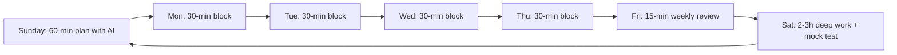
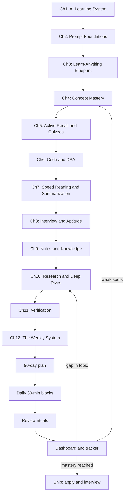

# Chapter 12: Capstone — Your Complete AI Study System

> **Last Updated:** August 2026 | **Estimated Reading Time:** 60–75 minutes

Everything in this course so far has been a component: the pipeline, the prompts, the mastery methods, the recall drills, the code practice, the notes, the research, the verification. This chapter assembles the components into one working machine — a weekly cycle, a 90-day finish-everything plan, a prompt library, a master tutor config, a dashboard, and repair procedures for when life breaks the system. This is the chapter that turns "I use AI to study" into "I run an AI study system".

The system is designed for exactly one person: a working professional with a 10-to-6 job and a long commute, who wants to finish a complete placement preparation — all subjects, DSA, aptitude, interviews — fast, without burning out. Follow it as written for 90 days, and you will have a finished, verified, interview-ready knowledge base instead of an endless to-do list.

> **How to work this chapter** — this one is a build, not a read:
>
> 1. **Read** — 75 minutes in one or two evening blocks.
> 2. **Do** — assemble every artifact from Chapters 1–11 into one place.
> 3. **Prove** — score 8/10 or better on the Chapter Quiz.
> 4. **Produce** — your complete system: weekly schedule, 90-day plan, prompt library, master tutor config, and progress dashboard.
>
> **Prerequisites:** Chapters 1–11 — it is the assembly of the whole course. **Next:** you are ready to apply.

## Learning Objectives

- Assemble all 11 previous chapters into a single weekly study cycle
- Build a 90-day finish-everything plan covering subjects, DSA, aptitude, and interviews
- Design a personal prompt library with versioning and reuse conventions
- Configure a master tutor persona and daily driver routines for your schedule
- Produce a weekly progress dashboard and track mastery with a TypeScript CLI
- Run daily, weekly, and monthly review rituals with dedicated prompts
- Troubleshoot the system when time, energy, or motivation collapse
- Know when to stop preparing, ship your application, and enter the interview loop

## Chapter at a Glance

| Topic | Key Insight | Practical Takeaway |
|---|---|---|
| Weekly cycle | Sunday plan, daily 30-minute blocks, Friday review, Saturday deep work | One repeating rhythm that runs the whole pipeline |
| 90-day plan | Everything mapped to 13 weeks, from fundamentals to mocks | Feed your syllabus list to the plan prompt, then execute |
| Prompt library | Prompts are assets: version, tag, and reuse them | One folder, one format, one version per prompt |
| Master tutor | One persona config that carries role, context, and tools | Start every learning session from the same tutor |
| Daily routines | Morning, commute, lunch, evening blocks of 30 minutes each | Fixed blocks, zero decisions, energy-aware sequencing |
| Dashboard and rituals | Data weekly, review daily, audit monthly | The system runs on review loops, not on willpower |





## Q1: What does the full weekly AI study workflow look like?

**Answer:** The weekly workflow is the assembly point for everything in this course: one repeating rhythm with four beats — Sunday planning, daily blocks, Friday review, Saturday deep work. Sunday takes 60 minutes: you run the plan prompt with your tracker data, set the week's topics, and generate the material (curriculum, quizzes, Anki cards, one practice problem set). Monday through Friday you execute 30-minute blocks: one concept block, one recall block, one code or aptitude block, rotating through your topics. Friday takes 15 minutes: run the weekly review prompt, update the tracker, log claims in the verification log. Saturday takes 2-3 hours: deep work — mock tests, full-length quizzes, hard DSA problems, or a mock interview. The cycle repeats because preparation is a loop, not a line: each week's review data feeds the next Sunday's plan.

**Prompt:**

```
Plan my study week. I have {X} minutes on weekdays (30-minute blocks) and
{Y} hours on Saturday.
Inputs: my current topics, quiz scores, and mastery levels: {paste tracker summary}
Rules:
1. Exactly {N} blocks per weekday, one topic each, ordered by weakness.
2. No topic more than 3 blocks per week.
3. Every week must include: concept, recall, code or aptitude, and one mock item.
4. Output: Mon-Sat table with block, topic, prompt to use from my library, and
   expected output (notes, cards, quiz score).
5. Saturday = deep work: one mock test or one hard problem, no new theory.
```

**How it works:** The prompt consumes your tracker data and emits a concrete Monday-to-Saturday table, which removes every decision from your weekdays — you only execute the table.

**Try This:** Run it with last week's actual tracker numbers and follow the output for one full week. Next Monday, note which blocks actually happened and why the others failed.

## Q2: How do I run the Sunday planning session?

**Answer:** The Sunday session has a fixed agenda so it never drifts into "chatting with AI": pull last week's data, review what under-performed, pick next week's topics, generate study material, and load it into your prompt library and tracker. The whole session is one prompt chain of three steps: weekly review, plan, and material generation. Keep it to 60 minutes — the review prompt and plan prompt take 15 minutes total, and the rest is generating the quizzes, flashcards, and practice sets you will consume during the week. Everything generated on Sunday gets a date and a topic tag so your verification log can track it. If you skip Sunday, you are not one week behind; you are operating without a system, and the daily blocks will fill with whatever feels urgent on the commute.

**Prompt (chain, run in order):**

```
STEP 1 — REVIEW
Here is last week's tracker: {paste tracker}. Summarize: hours spent, topics
covered, average quiz score, mastery deltas. List the 3 weakest points and the
3 strongest. Be direct.

STEP 2 — PLAN
Using STEP 1, produce my week plan: {N} weekday blocks, each with topic, prompt
name from my library, and expected output. Prioritize the 3 weak points from
STEP 1, but keep my strongest topic at 1 block so it does not decay.

STEP 3 — MATERIALS
For each planned block, generate: a 10-question quiz on {topic}, 8 Anki cards,
one {DSA or aptitude} problem set, and a one-page study note. Tag every claim
HIGH/MED/LOW and list sources to verify.
```

**How it works:** The three-step chain converts a free-form Sunday session into a production run: data in, plan out, materials out — with verification tagging built into step 3.

**Try This:** Next Sunday, run all three steps in one chat and paste the generated materials into your prompt library and tracker. Time yourself: the whole session should fit in 60 minutes.

## Q3: How do I build the 90-day finish-everything plan?

**Answer:** The 90-day plan is the master schedule that maps your entire syllabus — all subjects, DSA, aptitude, and interviews — onto 13 weeks. The method: paste your full topic list, let AI allocate topics to weeks by dependency and weight, then review the allocation yourself because only you know your real starting level. The plan must obey four rules: one dominant track per week (subject or DSA) so you never juggle five things at once, aptitude woven in daily as warm-up, interviews appearing from week 8 onward, and every week ending with a mock item so progress is measured, not assumed. Weeks 1-13 below is the reference template for a placement sprint; replace the topics with yours and re-run the prompt.

**Prompt:**

```
Build a 13-week finish-everything plan for my placement preparation.
My syllabus: {paste full topic list}
My start levels per topic (1-10): {paste levels}
Rules:
1. Weeks 1-13, one dominant track per week: subjects alternate with DSA blocks.
2. Daily aptitude: 15 minutes, every week, never more.
3. Interviews start week 8: one mock interview or mock test per week after that.
4. Every week lists: dominant track, sub-topics, daily 30-min blocks, Saturday
   mock item, and the milestone that proves the week is done.
5. Dependency ordering: basics before topics that build on them.
Output: a markdown table with columns Week | Track | Topics | Daily blocks |
Saturday milestone.
```

**How it works:** By feeding your topic list and self-rated levels, the model produces a dependency-ordered, milestone-checked schedule that you then sanity-check and execute week by week.

**Try This:** Build your 90-day plan this weekend. Mark every week's Saturday milestone in your tracker and let Q4's table be your reference template.

## Q4: What does the week-by-week plan look like in practice?

**Answer:** For a placement sprint, the 13 weeks distribute like this: fundamentals first, the biggest subject blocks in the middle, mocks and interviews taking over the final third. The template below assumes four study tracks — subjects (your syllabus), DSA, aptitude, and interviews — with daily 30-minute blocks and a Saturday deep-work slot. Weeks 1-2 build the foundation because everything after assumes data structures and core subject basics; weeks 3-8 alternate major subjects with DSA, and every subject week ends with a generated exam as its milestone. Week 9 starts the interview phase: mocks every week, resume polish, and company-specific fact-checks from Chapter 11. The final two weeks are pure mocks and weakness hunting — no new theory after week 11.

| Week | Dominant Track | Topics | Saturday Milestone |
|---|---|---|---|
| 1 | Foundation | DSA basics (arrays, strings, hash maps), one core subject intro | 20-problem DSA set, score >= 60% |
| 2 | DSA | Arrays, two pointers, sliding window, sorting | Sorting + two-pointer exam, score >= 70% |
| 3 | Subject A | Subject A part 1, daily DSA warm-up (3 problems) | Subject A generated 30-question exam |
| 4 | DSA | Linked lists, stacks, queues, binary search | Mock test: 5 DSA problems in 60 min |
| 5 | Subject B | Subject B part 1, daily DSA warm-up | Subject B 30-question exam |
| 6 | DSA | Trees, BFS/DFS, heaps | Mock test: 5 DSA problems in 60 min |
| 7 | Subject C | Subject C, daily aptitude + DSA warm-up | Subject C 30-question exam |
| 8 | Interviews start | DSA: DP + recursion; first mock interview | First full mock interview, scored |
| 9 | Interviews | Mock interviews (2), resume with AI review, company fact-check | Mock interview + company dossier |
| 10 | System design | System design basics + mock | System design mock round |
| 11 | Weakness hunt | Data-driven: topics with lowest quiz scores only | Mock interview, target score set from week 8 |
| 12 | Full mocks | Mock test every other day, no new theory | Full mock: aptitude + subject + DSA |
| 13 | Ship week | Final mock, document review, applications out | Applications submitted, offer-day readiness check |

**How it works:** The table is the execution contract — every week has a measurable Saturday milestone, so "am I on track?" has a mechanical answer instead of a feeling.

**Try This:** Take your real syllabus and re-run the Q3 prompt with your topics. Compare the model's allocation with this template and reconcile the differences before you start week 1.

## Q5: What is the personal prompt library and how do I organize it?

**Answer:** The prompt library is your reusable asset folder — every prompt you have tuned and verified, stored in one place with a standard format, so you never re-invent or re-negotiate a prompt. Organize it like code: one folder, one file per prompt, each file with a front-matter-style header (name, purpose, when to use, model it works best on, version), the prompt text itself, and an example output. The folder structure below matches the chapters: plan prompts, learn prompts, practice prompts, test prompts, review prompts, and verify prompts. Versioning matters because prompts drift: when you improve a prompt, save it as v2 rather than overwriting, and keep a CHANGELOG of one line per change. A library of 30-40 tuned prompts is enough to run the entire system; quality of tuning, not quantity of prompts, is the goal.

**Folder structure:**

```
prompt-library/
  plan/
    weekly-plan-v3.md
    ninety-day-plan-v1.md
    sunday-session-v2.md
  learn/
    learn-anything-x-v4.md
    feynman-ladder-v2.md
    analogy-factory-v1.md
    master-tutor-config-v3.md
  practice/
    socratic-quizzer-v2.md
    anki-factory-v1.md
    dsa-hints-only-v3.md
    aptitude-drills-v2.md
  test/
    exam-generator-v2.md
    mock-interviewer-v3.md
  review/
    daily-recall-v2.md
    weekly-review-v3.md
    monthly-audit-v1.md
  verify/
    hallucination-guard-v4.md
    cross-verification-v2.md
    failure-mode-v1.md
    verification-log-v2.md
  CHANGELOG.md
```

**How it works:** The folder mirrors the course structure, so every prompt has a home, and the header-plus-version format makes any prompt instantly reusable — paste the file contents into a chat and it works.

**Try This:** Create the folder structure today. Move your five most-used prompts in, give each a version and a header, and start a CHANGELOG with today's date.

## Q6: How do I version, tag, and reuse my prompts?

**Answer:** Treat prompts as software: version them, tag them with metadata, and test them before trusting them at scale. Each prompt file carries a header — name, chapter it came from, model it was tuned on, version, date, and the {placeholders} it needs. Version rules: bump the version when you change behavior, not wording; keep the old version in a v-branch or an archive folder; and record one CHANGELOG line per change so you can roll back. Reuse rules: always paste from the library rather than retyping, and when a prompt produces bad output, fix the prompt, not the conversation. A prompt that worked on ChatGPT in January may behave differently on Gemini in August — so re-test any prompt the first time you use a new model, and update the header with the models it is verified on.

**Prompt (header template):**

```
NAME: {prompt-name}
PURPOSE: {what it produces}
WHEN: {stage of the weekly cycle}
MODELS: {models it is verified on}
VERSION: v{number}
DATE: {date}
PLACEHOLDERS: {list of {placeholders}}
TUNING NOTES: {what was fixed since v1, one line per version}
PROMPT:
{paste the prompt text}
EXAMPLE OUTPUT:
{one sample output so you can spot regression}
```

**How it works:** The header makes every prompt self-documenting and regression-testable: you can re-run it after a model change and compare the output against the example in seconds.

**Try This:** Take your most important prompt (the master tutor, Q7) and write its full header with example output. Next time a model update changes its behavior, you will catch it in one glance.

## Q7: What is the master tutor config?

**Answer:** The master tutor is one all-purpose persona prompt — your default study partner for everything — with four blocks: role, context, tools, and behavior rules. Role defines the persona: an experienced interviewer-turned-tutor who teaches like a senior engineer. Context injects your real data: your job, your commute time, your target companies, your current level, your syllabus. Tools lists what the tutor may use: quizzes, Anki cards, Socratic questioning, code review, mock interviews. Behavior rules carry the course's guardrails: hallucination guard from Chapter 11, anti-slop from Chapter 2, Feynman methods from Chapter 4. One config, loaded once at the start of every chat — from then on, every question you ask inherits the whole system without you re-stating it.

**Transcript (realistic session):**

```
You: Act as my master study tutor. ROLE: senior engineer and placement
interviewer with 8 years of experience, now teaching me 1-on-1. You teach with
analogies first, then exact definitions, then one worked example. CONTEXT: I work
10-to-6 with a 4-hour daily commute, preparing for SDE and AI engineering
placements at {companies}. Current level: {level}. Studying {syllabus}.
TOOLS: Socratic questioning, 10-question quizzes, Anki card batches, code review,
mock interview rounds. RULES: hallucination guard on (tag confidence, name
sources, say I DON'T KNOW), never give generic advice, always end with one
actionable task. Today's topic: hash maps.
Tutor: Understood. Hash maps — before I explain, let me check what you know.
Three questions, answer from memory: 1) What problem does a hash map solve?
2) What is a hash collision? 3) When would you choose a hash map over a sorted
array?
You: 1) Fast lookup. 2) When two keys map to the same index. 3) ...when I need
to search, I guess?
Tutor: HIGH confidence: your first two answers are right, and your third answer
reveals the gap I wanted. A hash map wins when you need average O(1) lookup,
insert, and delete by key. A sorted array wins when you need to iterate in order,
or when lookup is done once — because a single binary search on a sorted array
beats building a hash map. Analogy: a hash map is a labeled drawer cabinet; a
sorted array is a library shelf. Now, your task for this block: write a function
that counts word frequencies with a hash map, plus the edge case for empty input.
I'll review it after.
```

**How it works:** The tutor starts by probing what you know (Chapter 5 active recall), teaches only the gap (Chapter 4), flags confidence (Chapter 11), and assigns one concrete task — the whole course inside one persona.

**Try This:** Write your own master tutor config with your real context and load it at the start of your next chat. Keep the config in your prompt library under learn/master-tutor-config.

## Q8: What are the daily driver routines — the exact 30-minute blocks?

**Answer:** Daily drivers are the fixed 30-minute blocks that make up a weekday, sequenced by your energy curve. Morning (before the 10-to-6 job or on the commute): hard thinking — DSA problems, concept mastery, or anything that needs fresh attention; your brain is best here. Commute: passive capture and recall — listen to generated summaries, answer quiz prompts aloud, review Anki cards; the reading and quiz prompts from Chapters 5 and 7 are built for this. Lunch: 30 minutes of light learning — aptitude drills or a generated quiz, low energy, low stakes. Evening: consolidation — review the day's notes, run the recall prompt, add claims to the verification log, prep tomorrow's block. The rule that makes it work: never decide "what to study" inside the block — the Sunday plan already decided; you only execute. The table below is the default; re-order blocks to match your real energy curve.

| Block | When | Length | Content | Prompt from library |
|---|---|---|---|---|
| Morning | 30 min before job or commute start | 30 | Hardest item of the day: DSA problem, deep concept | dsa-hints-only, feynman-ladder |
| Commute | in transit | 30 | Passive recall: quiz answers aloud, summaries, Anki cards | socratic-quizzer, anki-factory |
| Lunch | after eating | 30 | Light: aptitude drills or subject quiz | aptitude-drills, exam-generator |
| Evening | after dinner | 30 | Consolidation: notes, verification log, tomorrow's block | daily-recall, weekly-review |
| Saturday | morning | 120-180 | Deep work: mock test, hard problem, mock interview | mock-interviewer, exam-generator |

**How it works:** Energy-matched blocks plus a zero-decision rule: the Sunday plan assigns each block its content, so a tired evening brain never has to choose what to study.

**Try This:** This week, run the exact schedule above — including "quiz answers aloud on the commute". Next Sunday, compare actual minutes logged per block and adjust the sequence to your energy.

## Q9: How do I protect the blocks from energy dips and interruptions?

**Answer:** Three enemies kill daily blocks: decision fatigue (fixed by the Sunday plan), energy dips (fixed by energy-matching: hard in the morning, passive in transit, light at lunch), and interruptions (fixed by block boundaries). Defend a block like a meeting with a senior: phone in a different room or face down, one notification bar of focus, and a "recovery line" — if you are interrupted mid-block, you resume by re-reading the block's goal line from the plan, not by re-deciding. When energy genuinely fails inside a block, downgrade the task, never cancel the block: turn the hard DSA problem into reading its solution pattern, turn the quiz into a 5-question version. A completed small block beats a skipped big block every time, because the habit survives and the tracker stays honest.

**Prompt:**

```
I have a 30-minute block for {planned block content} but my energy is low today
and interruptions are likely. Give me:
1. A downgraded version of the task that still counts as progress (less than half
   the work, same topic).
2. A 5-minute "minimum viable block" I can do even in a noisy environment.
3. One question to ask myself at the end: "did the block happen?"
```

**How it works:** The prompt pre-plans the fallback, so low-energy days follow a script instead of improvising — and a minimum viable block keeps the streak alive.

**Try This:** The next low-energy day, use this prompt instead of skipping. Log the minimum viable block in your tracker and compare your streak with a normal week.

## Q10: How do I build the progress dashboard with AI?

**Answer:** The dashboard answers one question weekly: "am I actually making progress?" — with numbers, not feelings. Feed the AI your raw tracker data (Q11's CLI output: sessions, minutes, quiz averages, mastery deltas per topic) and ask for a weekly report: hours trend, topic mastery changes, quiz-score trajectory, and the three weakest topics with recommended actions. The report is only as good as the data, so the rule is: log every block within the day it happened, with the 30-second cost of one line per session. Once you have four weeks of data, the dashboard also shows patterns you cannot feel: which topics plateau, which days of the week your blocks actually happen, and whether quiz scores rise with hours or not. That pattern layer is what turns the dashboard from a diary into a steering wheel.

**Prompt:**

```
Here is my tracker data for the last {N} weeks: {paste CLI report}
Produce a weekly dashboard:
1. Trend line in words: total minutes per week, quiz average per week, mastery
   deltas per topic.
2. Table: topic | sessions | total minutes | avg quiz score | mastery trend.
3. The 3 weakest topics and one specific action for each, from my prompt library.
4. Two questions to answer in my Friday review: what is working, and what is the
   real blocker this week?
```

**How it works:** The prompt turns raw log lines into a compact, decision-ready report — and the two Friday questions force reflection instead of just stats.

**Try This:** Log every block for two weeks, then generate your first dashboard. Check whether your quiz-score trend matches your actual hours; the mismatch is the interesting finding.

## Q11: How do I build the study tracker CLI?

**Answer:** The tracker is the system's memory: one line per study session — week, date, topic, minutes, quiz score, mastery delta (how much your confidence in the topic moved), and an optional note. The TypeScript CLI below stores sessions, validates quiz scores, and prints a weekly summary plus a master report you paste directly into the dashboard prompt (Q10). Logging must cost under 30 seconds: run it, type one line, done — at the end of every block. The mastery delta is the unusual column: rate from -3 to +3 how much your grasp of the topic moved this session, using your own honest feeling after a quiz. It is subjective, but consistent subjective deltas over 90 days show trends that quiz scores alone hide — like a topic where scores rise but mastery feels stuck, which means you are memorizing, not understanding.

```typescript
interface DayLog {
  week: number;
  date: string;
  topic: string;
  minutes: number;
  quizScore: number;
  masteryDelta: number;
  notes: string;
}

interface WeekSummary {
  week: number;
  totalMinutes: number;
  sessions: number;
  avgQuizScore: number;
  masteryDelta: number;
  topics: string[];
}

class StudyTracker {
  private logs: DayLog[] = [];

  add(entry: DayLog): void {
    if (entry.quizScore < 0 || entry.quizScore > 100) {
      throw new Error("quizScore must be between 0 and 100");
    }
    if (entry.masteryDelta < -3 || entry.masteryDelta > 3) {
      throw new Error("masteryDelta must be between -3 and 3");
    }
    this.logs.push(entry);
  }

  weeklySummary(week: number): WeekSummary {
    const rows = this.logs.filter((l) => l.week === week);
    const totalMinutes = rows.reduce((s, l) => s + l.minutes, 0);
    const sessions = rows.length;
    const avgQuizScore = sessions
      ? +(rows.reduce((s, l) => s + l.quizScore, 0) / sessions).toFixed(1)
      : 0;
    const masteryDelta = rows.reduce((s, l) => s + l.masteryDelta, 0);
    const topics = [...new Set(rows.map((l) => l.topic))];
    return { week, totalMinutes, sessions, avgQuizScore, masteryDelta, topics };
  }

  masterReport(): string {
    const weeks = [...new Set(this.logs.map((l) => l.week))].sort((a, b) => a - b);
    const lines = weeks.map((w) => {
      const s = this.weeklySummary(w);
      return `Week ${w}: ${s.sessions} sessions, ${s.totalMinutes} min, ` +
        `quiz avg ${s.avgQuizScore}%, mastery ${s.masteryDelta}, ` +
        `topics: ${s.topics.join(", ")}`;
    });
    const totalMin = this.logs.reduce((s, l) => s + l.minutes, 0);
    return lines.join("\n") +
      `\nTOTAL: ${totalMin} minutes across ${this.logs.length} sessions`;
  }
}

const tracker = new StudyTracker();
tracker.add({ week: 1, date: "2026-08-03", topic: "DSA: Arrays", minutes: 45, quizScore: 80, masteryDelta: 2, notes: "two-pointer clicked" });
tracker.add({ week: 1, date: "2026-08-04", topic: "DSA: Arrays", minutes: 30, quizScore: 90, masteryDelta: 1, notes: "" });
tracker.add({ week: 1, date: "2026-08-05", topic: "ML: Linear Regression", minutes: 60, quizScore: 70, masteryDelta: 1, notes: "review gradient descent" });
tracker.add({ week: 2, date: "2026-08-10", topic: "DSA: Linked Lists", minutes: 50, quizScore: 75, masteryDelta: 1, notes: "slow start" });
console.log(tracker.masterReport());
```

**How it works:** The CLI validates input at entry, aggregates by week, and prints the report that feeds the Q10 dashboard prompt — the tracker is the only component where the data must be honest, because everything else reads from it.

**Try This:** Install the tracker today. From tomorrow, log every block for 7 days — no exceptions — and run your first masterReport on Sunday during the planning session.

## Q12: What is the daily recall ritual?

**Answer:** The daily recall ritual closes every evening block: recall without looking, then check. Step one, from memory: the three most important facts of today's topic, the one thing you would still struggle to explain, and tomorrow's single question. Step two: answer the Socratic quiz from the morning or run a fresh 5-question recall prompt. Step three: mark the mastery delta in the tracker and log any claims that need verification. The ritual exists because recall is the actual learning event — reading and watching are inputs, but memory grows during retrieval — and because the ritual produces the data the weekly review needs. Ten minutes, fixed order, no exceptions: on days when you studied nothing, the ritual becomes "recall yesterday's topic", which doubles as a repair mechanism.

**Prompt:**

```
Daily recall ritual. No notes, answer from memory:
1. Name the three most important facts about {today's topic}.
2. Explain the hardest concept in one paragraph as if to a junior.
3. What is the one thing you cannot explain yet?
4. Generate 5 quiz questions on today's topic and score me on my answers.
Do not correct me until after I have attempted everything.
```

**How it works:** The recall-before-correction order preserves the testing effect — you must produce answers first, then see the errors, which is what makes memory stick.

**Try This:** Run this ritual tonight and every night this week. Track your daily recall quality in the tracker notes column; you should see the "cannot explain yet" line shrink weekly.

## Q13: What are the weekly review and monthly audit rituals?

**Answer:** The weekly review (Friday, 15 minutes) reads the week's tracker data and produces three outputs: what worked, what failed, and next week's three priorities. The monthly audit (first weekend of the month, 60 minutes) goes deeper: re-run the vault red-team from Chapter 11, verify the unchecked claims in your verification log, review the prompt library for version drift, and check the 90-day plan's progress against the Saturday milestones. The weekly review keeps the system steering; the monthly audit keeps the system honest. Both rituals follow the same shape — data in, reflection, decisions — and both end with concrete changes to next week's plan, because a review that produces no change is a diary entry, not a steering wheel.

**Transcript (realistic weekly review):**

```
You: Weekly review. Here is my tracker report: {paste masterReport output}.
Answer: 1) What worked this week? 2) What failed, and was it energy, time, or
motivation? 3) The three priorities for next week, in order. 4) One thing to
change in next week's plan, not just do more of.
ChatGPT: What worked: your two morning DSA blocks — quiz average 85% on arrays,
highest of the month. What failed: both evening consolidation blocks — 0 of 2
happened; pattern in your log shows they fail after late meetings, not on
low-energy days. Priorities: 1) move consolidation to the commute home instead
of post-dinner; 2) start DP with two hint-only problems; 3) aptitude daily drill
score is flat at 60% — replace the lunch quiz with a targeted reasoning drill.
Change: swap evening block to commute slot, and verify the 3 unchecked claims
in your log — one is about a company salary range and it is 6 weeks old.
You: Accept all four. Update the tracker and remind me Sunday to re-plan blocks
around the commute change.
```

**How it works:** The transcript shows the review pattern — the model reads real data, names causes rather than symptoms, and the session ends with changed plan lines, not encouragement.

**Try This:** Run this Friday's review with real tracker data. Implement at least the "one thing to change" recommendation next week, and log whether it worked in the following Friday's review.

## Q14: How do I troubleshoot when the system breaks?

**Answer:** The system breaks in three predictable ways: time collapse (a busy week kills blocks), motivation collapse (blocks happen but feel pointless), and data collapse (you stop logging, so the dashboard lies). Each has a known repair. Time collapse: activate the minimum viable block from Q9 and run a reduced week — half the blocks, same topics, one Saturday mock — and accept a planned 50% week without guilt, because quitting the system entirely is the only real failure. Motivation collapse: cut the plan by two topics, add one fun item (a system design mock, a company research deep-dive), and let the Friday review document three wins, however small. Data collapse: restart logging with one line per day minimum; no retroactive backfilling, no perfection. The repair rule for all three: shrink the system until it runs, never abandon it.

**Prompt:**

```
My study system is failing this week. Diagnosis prompt — answer all four:
1. TIME: how many of my planned blocks did I complete? Why did the missed ones
   fail: schedule, energy, or motivation? Give each cause a count.
2. MINIMUM: give me a reduced plan for the rest of the week: half the blocks,
   same topics, one Saturday item.
3. RECOVERY: what is the smallest daily habit I must keep to not lose the system
   entirely?
4. LESSON: one structural change to the weekly plan that prevents this failure
   next week.
Data: {paste tracker report or "no data logged this week"}
```

**How it works:** The four-part prompt forces a diagnosis before a remedy, and the reduced-plan output keeps the system alive at minimum power instead of letting it crash to zero.

**Try This:** The next time you miss two blocks in a row, run this prompt the same evening. Log the "structural change" recommendation and implement it in Sunday's plan.

## Q15: How do I recover from motivation loss and model changes?

**Answer:** Motivation loss and tool changes are different failures with one shared fix: re-anchor to a small, measurable goal. When motivation dies, the cause is usually a goal that stopped feeling real — so re-run the plan prompt with a smaller target ("one topic to interview readiness") and lean on the tracker's streak: your data from past weeks is evidence you can do this, and the dashboard's upward trend is the argument against "I am wasting my time". When models or tools change (a new model version, a renamed interface, a discontinued feature), the fix is a prompt re-validation pass: re-run your top ten library prompts against the new model, compare with the example outputs in the headers, and update versions — a prompt is a tool too, and tools need maintenance. Never rebuild your library for a new model; re-test and re-version.

**Prompt (motivation):**

```
I have lost motivation. Do not cheerlead. Use my data:
1. From my tracker, find the topic with the biggest mastery improvement and the
   week with the most consistent blocks. Quote both numbers back to me.
2. Propose a 2-week micro-goal from my 90-day plan: smaller than the current
   week's plan, with a concrete finish line.
3. List 3 past moments in my log where the system demonstrably worked.
Tracker data: {paste}
```

**How it works:** The prompt forbids cheerleading and forces evidence — your own numbers become the case for continuing, and the micro-goal restores a finish line that the 90-day horizon blurred.

**Try This:** Save this prompt now, before you need it. When motivation dips, run it with your data and follow the micro-goal for exactly two weeks.

## Q16: What is the intermediate-to-expert path after the 90 days?

**Answer:** The 90-day system runs on generic chat models; the expert path replaces manual steps with purpose-built tools in this order: custom GPTs or Claude projects (save the master tutor and the weekly review as reusable, configured projects instead of pasting configs every time), NotebookLM (feed it your generated notes so grounding and citations come from your own vault, closing the Chapter 11 verification loop), then agents and automation (scheduled prompt chains that generate Monday's quiz from Sunday's plan, or a weekly review that runs on Friday and emails you the report). The final level is a feedback loop between the tools: the dashboard triggers the planner, the planner generates materials, the vault grounds the tutor, and verification gates everything. Go one level at a time — automation on top of a broken manual system only produces faster chaos.

**Prompt:**

```
Audit my study system for automation opportunities. I currently run these manual
steps each week: {list: plan, blocks, recall, review, verification}.
For each step, tell me:
1. The pain: what makes it manual and slow?
2. The tool: custom GPT / NotebookLM / scheduled agent / simple script — and why.
3. The one integration that would remove the most manual work first.
4. What could break, and how I verify the automation output (Chapter 11 rules).
```

**How it works:** The prompt audits step by step and forces a risk note per automation, so you upgrade in safe order and never automate a step whose output you cannot verify.

**Try This:** After week 6, run this audit on your weekly review and the quiz generator. Implement the single highest-leverage integration, then re-audit the next month.

## Q17: What does the full system diagram look like — all 12 chapters wired?

**Answer:** The big diagram at the top of this chapter is the entire course in one picture, and reading it is the real final exam of this course. The pipeline runs Chapter 1's loop: the plan (Chapters 2-3) feeds daily blocks, mastery methods (Chapter 4) and recall practice (Chapter 5) execute them, code and DSA (Chapter 6) and interview drills (Chapter 8) build skills while speed reading (Chapter 7) and research (Chapter 10) feed the note vault (Chapter 9). Every output passes through the verification layer (Chapter 11) before it reaches the dashboard. The dashboard then closes three loops: weak spots return to mastery methods, topic gaps return to research, and mastery triggers shipping — applications and interviews. The system is complete when every arrow in the diagram has an owner in your prompt library, your tracker, and your calendar.

**Prompt:**

```
Here is my weekly cycle for this week: {paste Sunday plan}. Trace it through the
full system and find the leaks: which planned outputs have no verification step,
which topics are studied but never tested, which data never reaches the tracker,
and which block has no prompt from my library. Output: leak | location | fix.
```

**How it works:** The leak-tracing prompt audits the wiring week by week — the diagram is only as real as its arrows, and this prompt finds the arrows you are not actually executing.

**Try This:** Run the leak trace on this week's plan. Fix at least one leak before Sunday, and re-run the trace every month to keep the system wired.

## Q18: How do I ship — when do I stop preparing and start applying?

**Answer:** Shipping is a decision with a rule, not a feeling: you ship when your data says so — three consecutive weeks of 70%+ quiz averages on your mock tests, your interview mock score above your self-set target for two mocks in a row, and zero unchecked claims in the verification log that matter for interviews. The rule matters because perfectionism is a form of procrastination with better excuses: there will always be one more topic, and the market rewards people who interview while finishing, not after finishing. The shipping week is week 13 of the plan: apply to {target number} companies, keep a maintenance routine of 30 minutes daily (one recall block, one aptitude drill, weekly mock), and use every rejection as data for the weekly review. Preparation continues while the process runs; the system simply switches from build mode to ship-and-maintain mode.

**Prompt:**

```
Shipping check. Here are my stats: {paste tracker report + mock scores}.
Answer with numbers, not encouragement:
1. The shipping rule: 3 weeks of 70%+ mock averages, 2 mocks above target score,
   0 critical unchecked claims. Pass or fail each condition.
2. If pass: generate a 2-week ship plan — {N} applications per week, daily
   maintenance routine, mock schedule, and one resume review with AI.
3. If fail: list exactly which condition fails and the smallest fix to unblock it
   this week.
```

**How it works:** The check converts an emotional decision into three mechanical conditions, and whichever way it resolves, the output is an executable plan — no drifting in a limbo of "almost ready".

**Try This:** Run the shipping check with today's real numbers. Whatever the verdict, act on it this week — ship plan or unblock plan — and log the outcome in your tracker.

## Q19: What does a perfect study day look like end to end?

**Answer:** A perfect day is boring on purpose: four executed blocks, one recall ritual, one log line per block, zero decisions. 7:30-8:00 morning block: one hint-only DSA problem from the week's plan, logged. Commute: 30 minutes of quiz answers aloud and summary listening, plus the three "most important facts" recall for yesterday's topic. Lunch: aptitude drill, 15-25 minutes, scored. Evening: consolidation — review the day's claims, run the daily recall ritual, update the tracker, and verify one claim from the verification log. The day's total study time is two hours inside a 10-to-6 job with a 4-hour commute, and none of it competes with sleep, family time, or work — because every block is small, fixed, and pre-decided. A perfect week is six of these days plus a Saturday deep-work session and a Friday review. Note what is absent: no willpower checks, no "should I study now?" moments, no marathon sessions.

**Prompt:**

```
Build tomorrow's day sheet from my plan: {paste this week's plan}.
Output per block: time, block name, exact topic, the prompt to open from my
library, the output to produce, and the tracker line to log. End with the daily
recall ritual prompt and one verification-log claim to check tomorrow.
```

**How it works:** The day sheet removes the last remaining decisions — which topic, which prompt, what to log — so the day executes mechanically, and the day ends with the two rituals that keep data flowing.

**Try This:** Generate tomorrow's day sheet tonight and follow it exactly. Tomorrow night, compare planned vs actual minutes in the tracker; the gap is next Sunday's planning input.

## Q20: How do I recap the whole system in one prompt?

**Answer:** The capstone control prompt is the entire course compressed into one reusable session opener: it declares your goal, your schedule, your tools, your prompt library, your data sources, and your rules — so a fresh chat becomes your full study system in one paste. The control prompt has six sections: identity and goal, schedule and energy, syllabus and level, tool stack and library, data (tracker and verification log), and behavior rules (the hallucination guard, anti-slop, mastery methods, and the always-end-with-a-task rule). Keep it in your prompt library as plan/control-prompt and refresh it monthly as your data changes. This is the true capstone artifact: every chapter of this course, one prompt, one person, one goal — learn anything fast, finish everything, and verify what you learn.

**Prompt (the control prompt):**

```
CONTROL PROMPT — my complete AI study system.
GOAL: {placement target and deadline}
SCHEDULE: job 10-6, commute {X}h, blocks = morning 30 / commute 30 / lunch 30 /
evening 30, Saturday deep work {Y}h.
SYLLABUS AND LEVEL: {list topics with self-rated levels}
TOOL STACK: {ChatGPT / Claude / Gemini / NotebookLM / Perplexity} used for
{what each does}
PROMPT LIBRARY: located at {path}; when I say "use the {name} prompt", load the
current version from there.
DATA: my tracker lives at {path} (sessions, minutes, quiz scores, mastery deltas);
my verification log at {path}. When asked for data, read these, never ask me to
retype them.
RULES: hallucination guard always on — tag confidence, name sources, or say
I DON'T KNOW. Never generic advice; always one concrete task at the end. Teach
with analogy, then definition, then example. When I need practice, use Socratic
questioning; when I need testing, generate quizzes; when I need review, use my
review prompts.
START: Confirm the system by listing my goal, my 3 weakest topics from the
tracker, and the first task for today.
```

**How it works:** The six-section structure carries the whole course — pipeline, prompts, mastery, recall, notes, research, verification — so every future session starts from the complete system instead of a blank chat.

**Try This:** Write your control prompt now, save it to the library, and use it to start every study session for the next seven days. On day seven, count how many sessions you started without it — that number is your adoption rate.

## Summary

- The weekly cycle is the system: Sunday plan, daily blocks, Friday review, Saturday deep work — one repeating rhythm
- The 90-day plan maps every subject, DSA, aptitude, and interview item onto 13 weeks with a Saturday milestone per week
- The prompt library stores, versions, and reuses your best prompts with headers, placeholders, and changelogs
- The master tutor config carries role, context, tools, and rules — one persona runs every learning session
- Daily drivers are energy-matched 30-minute blocks: hard in the morning, passive on the commute, light at lunch, consolidation in the evening
- The dashboard reads tracker data weekly and turns it into trends, weak spots, and actions
- Review rituals run daily (recall), weekly (review), and monthly (audit) — reviews without changes are diaries
- Breakdowns are repaired by shrinking, not abandoning: minimum viable blocks and reduced weeks keep the system alive
- After 90 days, upgrade one level at a time: custom GPTs, NotebookLM grounding, then automation and agents
- Shipping is a data rule: three 70%+ mock weeks, two mocks above target, zero critical unchecked claims
- The control prompt is the capstone artifact: the whole course, one paste, your complete AI study system

## Practical Takeaways

| Technique | Prompt / Command | When to Use |
|---|---|---|
| Weekly plan | "Plan my study week" prompt with tracker data | Every Sunday, 60 minutes |
| 90-day plan | "Build a 13-week finish-everything plan" | Day 1 of the sprint, then monthly checks |
| Master tutor | Control-prompt persona config | Start of every learning chat |
| Daily blocks | Day-sheet prompt from the week plan | Every evening, for tomorrow |
| Energy fallback | "Downgraded minimum viable block" prompt | Low-energy or interrupted days |
| Tracker | StudyTracker CLI (Q11), one line per block | End of every block, under 30 seconds |
| Weekly dashboard | "Produce a weekly dashboard" prompt | Friday review, with CLI output |
| Review rituals | daily-recall / weekly-review / monthly-audit prompts | Daily evening, Friday, first weekend of month |
| Repair | "My study system is failing" diagnosis prompt | After two missed blocks in a row |
| Shipping check | "Shipping check with numbers" prompt | Week 13, then every Friday after |
| Control prompt | Full six-section control prompt | Every new chat, month-refreshed |

## Chapter Quiz

1. What is the correct weekly cycle order?
   A) Daily blocks, Sunday plan, Friday review, Saturday deep work
   B) Sunday plan, daily blocks, Friday review, Saturday deep work
   C) Friday review, daily blocks, Sunday plan, Saturday deep work
   D) Saturday deep work, Friday review, Sunday plan, daily blocks
   <details><summary>Answer</summary>B. The cycle starts with Sunday planning and ends the week with Saturday deep work, feeding the next Sunday's plan.</details>

2. What is the Saturday slot reserved for in the weekly system?
   A) New theory and heavy reading
   B) Deep work: mock tests, hard problems, mock interviews
   C) Organizing the prompt library
   D) Rest and review of the week
   <details><summary>Answer</summary>B. Saturday is the deep-work slot — mocks, hard problems, and mock interviews — with no new theory.</details>

3. What is the purpose of a Saturday milestone in the 90-day plan?
   A) To make every week measurable: done or not done
   B) To add more reading time
   C) To satisfy the review ritual
   D) To pause the plan weekly
   <details><summary>Answer</summary>A. Each week ends with a concrete, checkable milestone so progress has a mechanical answer.</details>

4. Why does the prompt library use version numbers and a changelog?
   A) To make the folder look professional
   B) Because prompts drift and need testing after changes or model upgrades
   C) To count how many prompts exist
   D) To satisfy the dashboard
   <details><summary>Answer</summary>B. Versioning records behavior changes and allows rollback; re-testing catches drift when models change.</details>

5. What does the master tutor config carry?
   A) Only the role description
   B) Role, context, tools, and behavior rules
   C) A list of quiz questions
   D) The 90-day plan
   <details><summary>Answer</summary>B. The four blocks — role, context, tools, rules — make one persona that carries the entire course's methods.</details>

6. Which block should hold the hardest mental work of the day?
   A) The lunch block, to keep evenings light
   B) The commute block, since it is long
   C) The morning block, matching your freshest energy
   D) The evening block, after work stress is gone
   <details><summary>Answer</summary>C. Energy matching puts hard thinking in the morning block; the commute and lunch take passive and light work.</details>

7. What does the masteryDelta column in the tracker measure?
   A) Minutes spent on the topic
   B) Quiz score accuracy
   C) Your honest sense of how much your grasp moved, from -3 to +3
   D) The number of flashcards made
   <details><summary>Answer</summary>C. It is subjective but consistent, and it surfaces trends quiz scores hide, like memorizing without understanding.</details>

8. What is the repair rule when the system breaks?
   A) Skip a week and restart fresh
   B) Shrink the system until it runs, never abandon it
   C) Double the blocks to catch up
   D) Stop logging until the plan is back on track
   <details><summary>Answer</summary>B. Reduced plans and minimum viable blocks keep the system alive; quitting entirely is the only real failure.</details>

9. When does the system ship — when do you start applying?
   A) When you feel ready
   B) When the syllabus is 100% complete
   C) When data passes the rule: 3 weeks of 70%+ mocks, 2 mocks above target, no critical unchecked claims
   D) When the calendar hits week 13 regardless of data
   <details><summary>Answer</summary>C. Shipping is a data rule, not a feeling or a calendar; perfectionism is procrastination with better excuses.</details>

10. What is the control prompt?
    A) A password for the tracker
    B) One reusable session opener carrying goal, schedule, tools, data, and rules
    C) The 90-day plan in prose
    D) The weekly review transcript
    <details><summary>Answer</summary>B. The six-section control prompt makes a fresh chat into the complete study system in one paste — the capstone artifact.</details>

## Exercises

1. Write your master tutor config (Q7) with your real job, commute, syllabus, and targets. Load it in your next chat and run one full topic session with it.
2. Build the prompt library folder structure (Q5), move your five most-used prompts in with headers and versions, and start the changelog.
3. Run the Q3 prompt with your actual syllabus to produce your 90-day plan. Compare it with the Q4 template and reconcile every difference before week 1.
4. Install the StudyTracker CLI (Q11) and log every block for 7 days. Run masterReport and then the Q10 dashboard prompt on Sunday.
5. Run the daily recall ritual (Q12) every evening for one week, and the weekly review (Q13) on Friday with real data. Implement at least one change from the review.
6. Write your personal control prompt (Q20), use it to start every session for 7 days, and run the shipping check (Q18) with your current real numbers.

## Further Reading

- [NotebookLM — grounding AI answers in your own sources](https://notebooklm.google.com)
- [OpenAI — Introducing GPTs (custom versions of ChatGPT)](https://openai.com/index/introducing-gpts/)
- [Wikipedia — Spaced repetition](https://en.wikipedia.org/wiki/Spaced_repetition)
- [Wikipedia — Active recall](https://en.wikipedia.org/wiki/Active_recall)
- [Wikipedia — Pomodoro Technique (the 25-30 minute block idea behind daily drivers)](https://en.wikipedia.org/wiki/Pomodoro_Technique)
