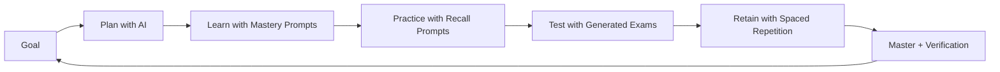

# AI-Powered Learning — Learn Anything Fast with AI

## Course Overview

Learning is the bottleneck of every career, and AI has changed the game. This course is the end-to-end playbook for using AI — ChatGPT, Claude, Gemini, NotebookLM, Perplexity, Copilot, and friends — to learn **anything** dramatically faster and finish all your study quickly. It is not a list of "10 cool prompts." It is a complete system: pipeline, prompts, tools, workflows, routines, and verification, wired together so that any syllabus, any skill, any exam, any interview becomes a fast, trackable, finished project.

You will move from "I open ChatGPT and ask random questions" to "I run a repeatable AI study machine": set a goal, generate a curriculum, learn with mastery prompts, practice with active-recall and quiz prompts, test yourself with generated exams, retain with spaced repetition, and verify everything against hallucinations.

The course is written for a working professional with a 10-to-6 job and a long commute — every workflow is designed for 30-minute blocks, offline gaps, and energy limits. The same system also powers a complete placement preparation sprint (DSA, ML, aptitude, interviews).

By the end, you will never again stare at a syllabus and wonder how to finish it. You will hand the syllabus to AI, get a plan, and execute it fast — while knowing exactly what you know, what you don't, and when to stop trusting the machine.

---

## Prerequisites & Requirements

| Requirement | Why |
|-------------|-----|
| Any modern LLM chat account (free tier is enough) | ChatGPT, Claude, or Gemini — all prompts work in any of them |
| TypeScript/JavaScript basics (optional) | A few chapters include small TypeScript tools; plain-text usage works without them |
| A phone or laptop you can type on | Most workflows run during commutes and breaks |
| Willingness to paste your own notes into AI | Context injection is what makes prompts non-generic |

---

## Syllabus

| # | Chapter | Description |
|---|---------|-------------|
| 1 | The AI Learning System | The end-to-end pipeline (Goal → Plan → Learn → Practice → Test → Retain → Master), tool selection, when AI helps vs hurts, your first 7-day sprint |
| 2 | Prompt Foundations | The universal 5-part prompt, anti-slop rules, prompt iteration, output formats, chaining prompts into study sessions |
| 3 | The Learn-Anything Blueprint | The Learn-Anything-X template: any topic → curriculum → daily lessons → quizzes → mastery; 7/14/21/30-day crash plans |
| 4 | Concept Mastery with AI | Feynman ladder, misconception hunting, analogy factories, counterexamples, teach-back critique, boundary conditions |
| 5 | Active Recall & Quiz Prompts | Socratic quizzer, Anki card factory, exam-question generators, interleaving and spaced-repetition schedulers |
| 6 | Code & DSA with AI | Hints-only DSA solving, pattern mapping, code review, debugging tutor, 20-day new-language blueprint, system design mocks |
| 7 | Speed Reading & Summarization | Summary → recall pipeline, chapter-to-flashcards, lecture-to-notes, notes compression, SQ3R with AI |
| 8 | Interview & Aptitude with AI | Company-style mock interviews, STAR behavioral drills, aptitude/reasoning drill generators, timed mock tests |
| 9 | AI Note-Taking & Knowledge Management | Second brain with AI, knowledge graphs, review sheets, evergreen notes, a placement-prep vault that stays organized |
| 10 | Research & Deep Dives with AI | Docs → tutorial, arXiv → plain-language notes, technology comparisons, keeping up with AI trends |
| 11 | Verification & Anti-Hallucination | Hallucination guards, fact-check workflows, confidence tagging, when to fully distrust AI |
| 12 | Capstone: Your Complete AI Study System | Weekly workflow, 90-day finish-everything plan, personal prompt library, master tutor config, progress dashboard |

---

## Study Path

**Recommended pace for a working professional:** one chapter per week, using commutes and evenings. The capstone (Chapter 12) assembles everything into a single weekly routine.

Each chapter follows the same structure:

1. **Learning Objectives** — what you will be able to do afterwards
2. **Q&A sections** — 18–20 real questions, each with a copy-paste prompt, a TypeScript tool, or a transcript
3. **Summary** — the chapter in bullets
4. **Practical Takeaways** — a table you can use as a cheat sheet
5. **Chapter Quiz** — 10 MCQs with answers
6. **Exercises** — apply it to your own syllabus immediately

Every prompt uses `{placeholders}` — substitute your own topic, level, or syllabus text. All code examples are TypeScript (run with any TS runtime; they also work as plain JS by removing types).

---

## How to Use This Course

**The universal work protocol — every chapter, every topic:**

1. **Read** — the chapter in 2–3 commute blocks (60–75 minutes total)
2. **Do** — run every **Try This** as you go; the prompts are the point, not the pages
3. **Prove** — score 8/10 or better on the Chapter Quiz before moving on
4. **Produce** — build the chapter's deliverable (table below) and keep it in your vault

| Ch | Chapter | Read in | Produce | Prerequisites |
|----|---------|---------|---------|---------------|
| 1 | The AI Learning System | 3 commute blocks | Pipeline diagram + workspace + velocity tracker | None |
| 2 | Prompt Foundations | 3 commute blocks | Master study prompt + library start | Ch 1 |
| 3 | Learn-Anything Blueprint | 3 commute blocks | Day-by-day plan for your weakest subject | Ch 2 |
| 4 | Concept Mastery | 3 commute blocks | Feynman script + mastery tracker | Ch 2 |
| 5 | Active Recall & Quiz | 3 commute blocks | 50 Anki cards + one sat exam | Ch 2 |
| 6 | Code & DSA with AI | 3 commute blocks | 5 solved problems with pattern maps | Ch 2, 5 |
| 7 | Speed Reading & Summarization | 3 commute blocks | One chapter through the full pipeline | Ch 2, 5 |
| 8 | Interview & Aptitude | 3 commute blocks | One mock transcript + graded STAR story | Ch 5 |
| 9 | Note-Taking & Knowledge Management | 3 commute blocks | Vault structure + 10 structured notes | Ch 3 |
| 10 | Research & Deep Dives | 3 commute blocks | One deep dive + 5 tracker entries | Ch 9 |
| 11 | Verification & Anti-Hallucination | 3 commute blocks | Verification log with 10 checked claims | None (run with everything) |
| 12 | Capstone: Your Complete AI Study System | Weekend deep work | The complete system + 90-day plan | Ch 1–11 |

**Weekly cadence for a working professional:** Chapters 1–11 fit the working week — read during commute blocks Monday–Thursday, take the quiz and produce the deliverable on Friday evening or Saturday. Chapter 12 is a full weekend deep-work session that assembles everything.

**Two rules that keep the course honest:**

- Never skip the artifact — a chapter you only read is a chapter you did not do
- Never skip the quiz gate — below 8/10, rework the Try This exercises and retake before moving on

---

## Learning Outcomes

After completing this course you will be able to:

- Run the end-to-end AI learning pipeline for **any** topic, from syllabus to mastery
- Write production-grade study prompts (role, context, task, format, constraints) that never give generic slop
- Turn any topic into a day-by-day crash plan and execute it inside a working professional's schedule
- Master concepts using Feynman ladders, misconception hunting, analogies, and teach-back critiques
- Generate unlimited practice: quizzes, exams, Anki cards, DSA problems, aptitude drills, mock interviews
- Read and summarize fast — chapters, PDFs, lectures, papers — and convert everything into recall material
- Build a personal AI study system: prompt library, tutor configs, weekly rituals, progress dashboard
- Verify AI output so hallucinations never poison your notes or interviews
- Finish all your study fast — with a 90-day finish-everything plan you can actually follow

---

## How This Course Fits Your Placement Prep

The course is deliberately built around the placement workflow used across this repository: AI-generated curricula for every subject, hint-only DSA practice, company-style mock interviews, aptitude drills, and a knowledge vault that grows as you study. Use it as the control layer on top of the 24-module placement course and the learning-how-to-learn course — every prompt in this course works with any syllabus you feed it.
