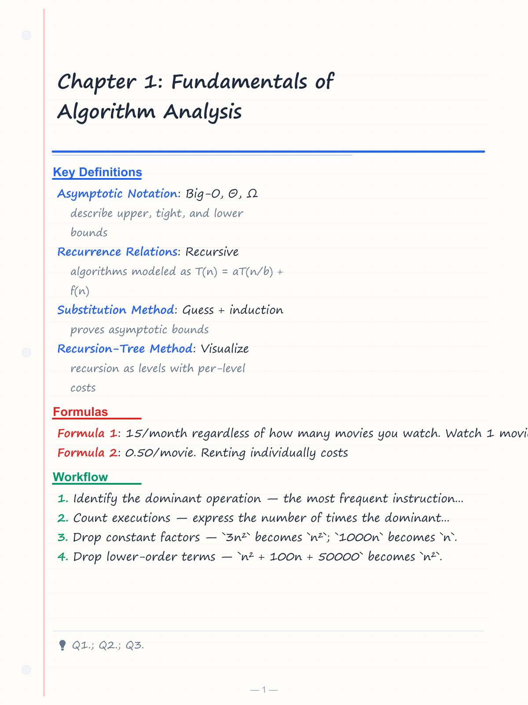
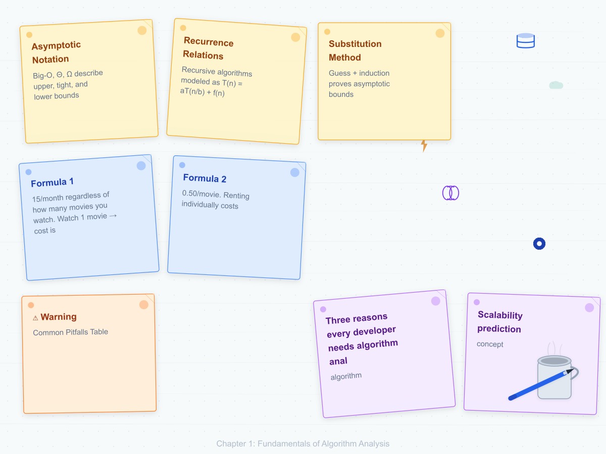
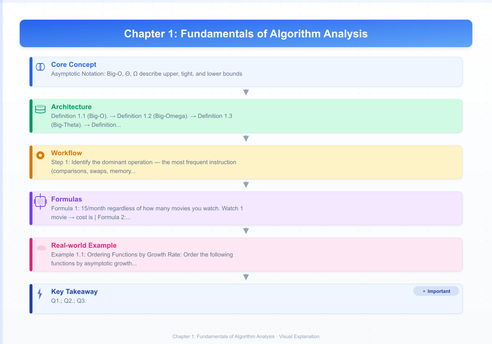
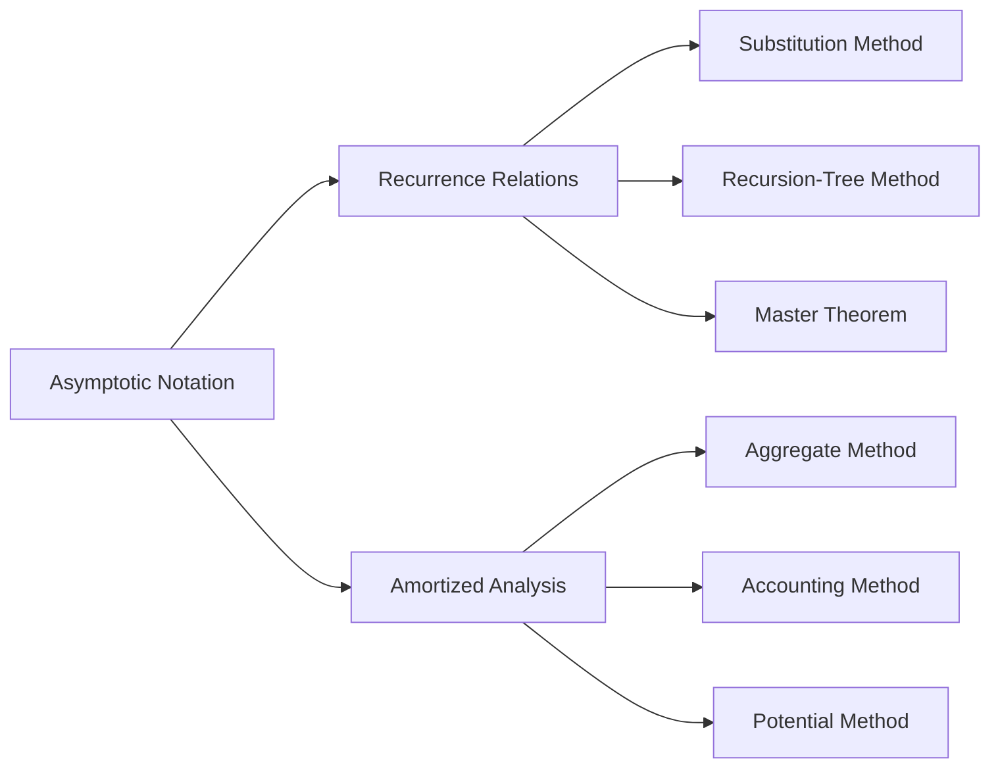

# Chapter 1: Fundamentals of Algorithm Analysis

> **Prerequisites:** None | **Next:** [Chapter 2: Searching](./02-searching.md) — From measuring efficiency to finding elements

## Learning Objectives

By the end of this chapter, students will be able to:

<!-- Image Gallery -->
<section class="lesson-visuals" aria-label="Visual learning resources">
  <header><span>VISUAL LEARNING</span><h2>See it. Review it. Remember it.</h2></header>
  <a class="lesson-visual-card" href="../../assets/images/lessons/algorithms/01-analysis/handwritten-notes.png" target="_blank" rel="noopener">
    
    <span><strong>Handwritten notes</strong>Condensed notes for deliberate review.</span>
  </a>
  <a class="lesson-visual-card" href="../../assets/images/lessons/algorithms/01-analysis/sticky-notes.png" target="_blank" rel="noopener">
    
    <span><strong>Sticky-note revision</strong>Fast recall prompts for revision.</span>
  </a>
  <a class="lesson-visual-card" href="../../assets/images/lessons/algorithms/01-analysis/visual-explanation.png" target="_blank" rel="noopener">
    
    <span><strong>Visual concept guide</strong>A connected explanation of the key ideas.</span>
  </a>
</section>
<!-- End Image Gallery -->


1. Define and apply Big-O, Big-Omega, Big-Theta, little-o, and little-omega notation.
2. Solve recurrence relations using the substitution method, recursion-tree method, and the master theorem.
3. Perform amortized analysis using the aggregate method, accounting method, and potential method.
4. Analyze the asymptotic complexity of iterative and recursive algorithms.

## Why Algorithm Analysis Matters

Imagine choosing a route to work. Walking works for 1 block (linear in distance) but fails at 10 miles. A bicycle handles neighborhood errands, but a car cruises at constant speed once on the highway. Algorithm analysis is the same science — it predicts how your code behaves before input grows.

Consider Google: it processes 40,000+ queries per second. If search were O(n²) instead of O(n log n), each query would take years instead of milliseconds. Facebook's News Feed ranks billions of posts in real time. Amazon recommends from 350+ million products. Without algorithm analysis, engineers build bridges without load-testing them.

**Three reasons every developer needs algorithm analysis:**
1. **Scalability prediction** — Code that runs fine on 100 items may crash on 100,000.
2. **Tool selection** — HashMap (O(1)) vs. TreeMap (O(log n)) trades speed for ordering.
3. **Bottleneck hunting** — A single O(n³) loop can dominate an entire system's runtime.

> **Pro Tip:** Always ask "What happens when n is 10? 1000? 1,000,000?" If you can't answer, you need asymptotic analysis.

**One-Sentence Takeaway:** Algorithm analysis is the engineering discipline that turns "it works on my machine" into "it scales to production."

---

### Chapter at a Glance

| Topic | Key Insight | Practical Takeaway |
|-------|-------------|-------------------|
| Asymptotic Notation | Big-O, Θ, Ω describe upper, tight, and lower bounds | Always express algorithm efficiency using Big-O for worst-case analysis |
| Recurrence Relations | Recursive algorithms modeled as T(n) = aT(n/b) + f(n) | Master theorem solves most common recurrences in one step |
| Substitution Method | Guess + induction proves asymptotic bounds | Use when master theorem doesn't apply; guess from experience |
| Recursion-Tree Method | Visualize recursion as levels with per-level costs | Builds intuition for why divide-and-conquer algorithms have log factors |
| Master Theorem | Three cases covering polynomial comparisons | The fastest way to analyze divide-and-conquer recurrences |
| Amortized Analysis | Average cost per operation over a sequence | Reveals O(1) amortized cost for structures with rare expensive ops |

### Chapter Roadmap



## Theory


### 1.1 Asymptotic Notation


Asymptotic notation describes the limiting behavior of functions as the input size grows to infinity. It abstracts away constant factors and lower-order terms to focus on the fundamental growth rate.

**Definition 1.1 (Big-O).** Let \( f, g : \mathbb{N} \to \mathbb{R}^+ \). We say \( f(n) = O(g(n)) \) if there exist positive constants \( c \) and \( n_0 \) such that for all \( n \ge n_0 \),

\[
0 \le f(n) \le c \cdot g(n).
\]

Big-O provides an asymptotic *upper bound*. For example, \( 3n^2 + 5n + 7 = O(n^3) \) but the tightest bound is \( O(n^2) \).

**Definition 1.2 (Big-Omega).** \( f(n) = \Omega(g(n)) \) if there exist positive constants \( c \) and \( n_0 \) such that for all \( n \ge n_0 \),

\[
0 \le c \cdot g(n) \le f(n).
\]

Big-Omega provides an asymptotic *lower bound*.

**Definition 1.3 (Big-Theta).** \( f(n) = \Theta(g(n)) \) if \( f(n) = O(g(n)) \) and \( f(n) = \Omega(g(n)) \). Equivalently, there exist positive constants \( c_1, c_2, n_0 \) such that

\[
0 \le c_1 \cdot g(n) \le f(n) \le c_2 \cdot g(n) \quad \text{for all } n \ge n_0.
\]

Big-Theta is an asymptotically *tight* bound.

**Definition 1.4 (Little-o and Little-Omega).** \( f(n) = o(g(n)) \) if for every positive constant \( c > 0 \), there exists \( n_0 \) such that \( f(n) &lt; c \cdot g(n) \) for all \( n \ge n_0 \). This is the asymptotic analogue of a strict inequality. Similarly, \( f(n) = \omega(g(n)) \) if for every positive constant \( c \), \( f(n) &gt; c \cdot g(n) \) for all sufficiently large \( n \).

**Common growth rates (ordered by increasing asymptotic growth):**

\[
O(1) \subset O(\log n) \subset O(n) \subset O(n \log n) \subset O(n^2) \subset O(2^n) \subset O(n!)
\]

> **Pro Tip:** Always find the *tightest* Big-O bound. Saying an algorithm is O(n³) might be technically correct, but if it's actually O(n log n), the looser bound hides the algorithm's true efficiency.

**One-Sentence Takeaway:** Asymptotic notation gives a precise language to describe how runtime grows with input size, abstracting away constants and lower-order terms.

> **Real-World Analogy (Shipping):** Choosing a Big-O bound is like picking a delivery method. A bicycle (O(1)) is perfect for one package downtown. A delivery van (O(n)) handles suburban routes. A freight train (O(n log n)) moves cross-country cargo. A fleet covering every route combination (O(n²)) is wasteful. The right vehicle depends on how many packages you carry.

#### Algorithm Steps: How to Find the Asymptotic Bound

1. **Identify the dominant operation** — the most frequent instruction (comparisons, swaps, memory accesses).
2. **Count executions** — express the number of times the dominant operation runs as a function of input size n.
3. **Drop constant factors** — `3n²` becomes `n²`; `1000n` becomes `n`.
4. **Drop lower-order terms** — `n² + 100n + 50000` becomes `n²`.
5. **Classify into a growth rate** — match the result to a known complexity class.

**Example walkthrough:** `f(n) = 12n² + 300n + 5`
- n = 10: 12(100) + 3000 + 5 = 4205 — both terms matter
- n = 100: 12(10000) + 30000 + 5 = 150005 — n² already dominant
- n = 1000: 12(1,000,000) + 300,000 + 5 = 12,300,005 — n² overwhelms everything
- n = 10,000: n² term contributes ~99.9% of total

#### Dry Run: Visualizing Bound Relations

| n | f(n) = 2n² + 3n | g(n) = n² | f(n) ≤ 3·g(n)? | f(n) ≤ 3·g(n) from n₀ ≥? |
|---|-----------------|-----------|----------------|----------------------|
| 1 | 5 | 1 | No (5 > 3) | — |
| 2 | 14 | 4 | No (14 > 12) | — |
| 3 | 27 | 9 | Yes (27 ≤ 27) | 3 |
| 4 | 44 | 16 | Yes (44 ≤ 48) | 3 |
| 5 | 65 | 25 | Yes (65 ≤ 75) | 3 |
| 10 | 230 | 100 | Yes (230 ≤ 300) | 3 |
| 100 | 20,300 | 10,000 | Yes (20,300 ≤ 30,000) | 3 |

Thus 2n² + 3n = O(n²) with c = 3, n₀ = 3.

#### Code Examples: Complexity in Practice

**Linear Search — O(n):**

<details>
<summary>C++</summary>

```cpp
int linearSearch(const vector<int>& arr, int target) {
    for (size_t i = 0; i < arr.size(); i++) {  // n iterations
        if (arr[i] == target) return i;         // O(1) comparison
    }
    return -1;
}
// Worst-case: O(n), Best-case: O(1), Average-case: O(n)
```

</details>

<details>
<summary>Python&lt;/summary&gt;

```python
def linear_search(arr, target):
    for i, val in enumerate(arr):    # n iterations
        if val == target:            # O(1) comparison
            return i                  # O(1) return
    return -1
# Worst-case: O(n), Best-case: O(1), Average-case: O(n/2) = O(n)
```

</details>

<details>
<summary>Java&lt;/summary&gt;

```java
public static int linearSearch(int[] arr, int target) {
    for (int i = 0; i < arr.length; i++) {  // n iterations
        if (arr[i] == target) return i;      // O(1) comparison
    }
    return -1;
}
// Worst-case: O(n), Best-case: O(1), Average-case: O(n)
```

</details>

**Binary Search — O(log n):**

<details>
<summary>C++</summary>

```cpp
int binarySearch(const vector<int>& arr, int target) {
    int lo = 0, hi = arr.size() - 1;
    while (lo <= hi) {                        // logâ‚‚(n) iterations
        int mid = lo + (hi - lo) / 2;
        if (arr[mid] == target) return mid;
        else if (arr[mid] < target) lo = mid + 1;
        else hi = mid - 1;
    }
    return -1;
}
// Requires sorted input. Each iteration halves the search space.
```

</details>

<details>
<summary>Python&lt;/summary&gt;

```python
def binary_search(arr, target):
    lo, hi = 0, len(arr) - 1
    while lo <= hi:                          # logâ‚‚(n) iterations
        mid = (lo + hi) // 2
        if arr[mid] == target:
            return mid
        elif arr[mid] < target:
            lo = mid + 1
        else:
            hi = mid - 1
    return -1
# Each step eliminates half the remaining elements → O(log n)
```

</details>

<details>
<summary>Java&lt;/summary&gt;

```java
public static int binarySearch(int[] arr, int target) {
    int lo = 0, hi = arr.length - 1;
    while (lo <= hi) {                        // logâ‚‚(n) iterations
        int mid = lo + (hi - lo) / 2;
        if (arr[mid] == target) return mid;
        else if (arr[mid] < target) lo = mid + 1;
        else hi = mid - 1;
    }
    return -1;
}
// Only on sorted arrays. O(log n) time, O(1) space.
```

</details>

#### Advantages & Disadvantages of Asymptotic Notation

| Advantage | Disadvantage |
|-----------|-------------|
| Hardware-independent — pure mathematical growth | Hides constant factors that matter in practice |
| Enables direct algorithm comparison | Ignores low-input-size behavior (n &lt; 100) |
| Works for any input size n | Misleading when hidden constants are large |
| Established standard in CS literature | Ignores cache misses, I/O, and parallelism |

#### Edge Cases in Asymptotic Analysis

| Edge Case | Example | Explanation |
|-----------|---------|-------------|
| **Constant functions** | f(n) = 10, g(n) = 20 | Both O(1) — even a constant of 10²⁰ is still O(1) |
| **Oscillating functions** | f(n) = n·(1 + sin n) | Big-O cannot capture oscillating growth cleanly; Θ may not exist |
| **Very small n** | Sorting n = 3 items | O(n²) bubble sort can beat O(n log n) quick sort for n &lt; 10 |
| **Equal growth class** | f(n) = 3n², g(n) = 5n² | Both Θ(n²) — constants differ but class is same |
| **Multi-variable** | f(n, m) = n + m² | Two-dimensional; which variable dominates depends on context |

### 1.2 Recurrence Relations


A recurrence relation expresses the running time of a recursive algorithm in terms of its running time on smaller inputs. The general form for divide-and-conquer recurrences is:

\[
T(n) = aT(n/b) + f(n),
\]

where \( a \) is the number of subproblems, \( n/b \) is the size of each subproblem, and \( f(n) \) is the cost to divide and combine.

> **Real-World Analogy (Russian Nesting Dolls):** A recurrence is like a set of matryoshka dolls. Each doll contains a smaller copy of itself. To compute the total paint volume, you paint the outer doll (pay f(n)), then recursively paint each inner doll (pay a × T(n/b)). The total depends on how many dolls exist (a) and how much smaller each one gets (b).

#### 1.2.1 Substitution Method

The substitution method involves two steps:

1. **Guess** the form of the solution.
2. **Prove** by induction that the guess is correct.

**Example:** Solve \( T(n) = 2T(\lfloor n/2 \rfloor) + n \).

*Guess:* \( T(n) = O(n \log n) \). Assume \( T(k) \le ck \lg k \) for \( k &lt; n \).

*Proof:*
\[
\begin{aligned}
T(n) &\le 2 \cdot c (n/2) \lg (n/2) + n \\
&= cn \lg (n/2) + n \\
&= cn \lg n - cn \lg 2 + n \\
&= cn \lg n - cn + n \\
&\le cn \lg n \quad \text{for } c \ge 1.
\end{aligned}
\]

##### Algorithm Steps for Substitution Method

1. **Guess the form** — based on similar recurrences you've encountered.
2. **State the inductive hypothesis** — assume T(k) ≤ c·g(k) for all k &lt; n.
3. **Substitute** — replace T(n/b) with the inductive bound.
4. **Simplify** — expand algebra until the desired form emerges.
5. **Choose constants** — pick c and n₀ to make the induction hold.
6. **Verify the base case** — check that n₀ and c satisfy small values.

##### Dry Run Trace Table: T(n) = 2T(n/2) + n with guess T(n) ≤ cn lg n

Assume T(1) = 1. Test the guess for increasing n:

| n | 2T(n/2) | + n | = T(n) | cn lgâ‚‚n (c = 2) | Valid? |
|---|---------|-----|--------|-----------------|--------|
| 2 | 2·T(1) = 2 | +2 | 4 | 2·2·1 = 4 | Yes |
| 4 | 2·T(2) = 8 | +4 | 12 | 2·4·2 = 16 | Yes |
| 8 | 2·T(4) = 24 | +8 | 32 | 2·8·3 = 48 | Yes |
| 16 | 2·T(8) = 64 | +16 | 80 | 2·16·4 = 128 | Yes |

For c = 2, the bound holds for all n ≥ 1. The inequality becomes progressively tighter as n grows.

##### Advantages & Disadvantages of Substitution Method

| Advantage | Disadvantage |
|-----------|-------------|
| Works for any recurrence form | Requires accurate guess — bad guess = wasted effort |
| Yields exact constants, not just order | Becomes algebraically heavy for complex recurrences |
| Builds deep understanding of induction proofs | Not systematic — no guaranteed procedure |

##### Edge Cases in Substitution Method

- **Floor/ceiling functions:** Asymptotic analysis usually ignores ⌊n/2⌋ vs. n/2, but rigorous proofs must handle them.
- **Non-integer n:** Recurrences are defined on integers; treat n/2 with floor/ceil.
- **Unequal subproblems:** T(n) = T(2n/3) + T(n/3) + n needs Akra-Bazzi, not standard substitution.
- **Tightness verification:** Proving O(·) alone is insufficient; you may also need Ω(·) for a Θ result.

#### 1.2.2 Recursion-Tree Method

The recursion-tree method visualizes each recursive call as a node, with the cost of each level written explicitly. The total cost is the sum over all levels.

**Example:** For \( T(n) = 3T(n/4) + cn^2 \):

- Level 0: \( 1 \) node, cost \( cn^2 \).
- Level 1: \( 3 \) nodes, each cost \( c(n/4)^2 = cn^2/16 \), total \( 3cn^2/16 \).
- Level 2: \( 9 \) nodes, each cost \( c(n/16)^2 = cn^2/256 \), total \( 9cn^2/256 \).
- Depth: \( \log_4 n \).
- Total: \( cn^2 \sum_{i=0}^{\log_4 n} (3/16)^i \le cn^2 \cdot \frac{1}{1 - 3/16} = (16/13)cn^2 = O(n^2) \).

##### Dry Run Trace Table: T(n) = 3T(n/4) + cn²

| Level i | Nodes | Node Cost | Level Cost | Running Sum |
|---------|-------|-----------|------------|-------------|
| 0 | 1 = 3⁰ | c(n/4⁰)² = cn² | cn² | cn² |
| 1 | 3 = 3¹ | c(n/4¹)² = cn²/16 | (3/16)cn² | (1 + 3/16)cn² |
| 2 | 9 = 3² | c(n/4²)² = cn²/256 | (9/256)cn² | (1 + 3/16 + 9/256)cn² |
| 3 | 27 = 3³ | c(n/4³)² = cn²/4096 | (27/4096)cn² | (continued) |
| … | … | … | … | … |
| log₄ n | n^{log₄ 3} | c(1)² = c | c·n^{log₄ 3} | Total &lt; (16/13)cn² |

The geometric ratio r = 3/16 &lt; 1, so the series converges. The deepest level contributes negligible cost.

##### Advantages & Disadvantages of Recursion-Tree Method

| Advantage | Disadvantage |
|-----------|-------------|
| Intuitive visual representation | Impractical for complex recurrences |
| No initial guess required | Becomes messy with non-uniform branching |
| Handles unbalanced recurrences | Level sums may be difficult to compute in closed form |

##### Edge Cases in Recursion-Tree Method

- **Uneven depth:** In quicksort's worst case, the tree is highly unbalanced; computing level costs is harder.
- **Non-constant branching:** Algorithms that branch on data values rather than fixed ratios produce irregular trees.
- **Fractional nodes:** Floor/ceil effects create slightly irregular tree shapes — usually safe to ignore.

#### 1.2.3 Master Theorem

**Theorem 1.1 (Master Theorem).** Let \( a \ge 1 \) and \( b > 1 \) be constants, let \( f(n) \) be a function, and let \( T(n) = aT(n/b) + f(n) \). Then:

1. If \( f(n) = O(n^{\log_b a - \epsilon}) \) for some \( \epsilon > 0 \), then \( T(n) = \Theta(n^{\log_b a}) \).
2. If \( f(n) = \Theta(n^{\log_b a}) \), then \( T(n) = \Theta(n^{\log_b a} \log n) \).
3. If \( f(n) = \Omega(n^{\log_b a + \epsilon}) \) for some \( \epsilon > 0 \) and if \( af(n/b) \le cf(n) \) for some \( c &lt; 1 \) and all sufficiently large \( n \), then \( T(n) = \Theta(f(n)) \).

**Examples:**

| Recurrence | \( a \) | \( b \) | \( \log_b a \) | \( f(n) \) | Case | Solution |
|------------|---------|---------|----------------|-------------|------|----------|
| \( T(n) = 2T(n/2) + n \) | 2 | 2 | 1 | \( n \) | 2 | \( \Theta(n \log n) \) |
| \( T(n) = 2T(n/2) + 1 \) | 2 | 2 | 1 | \( 1 \) | 1 | \( \Theta(n) \) |
| \( T(n) = 4T(n/2) + n^3 \) | 4 | 2 | 2 | \( n^3 \) | 3 | \( \Theta(n^3) \) |
| \( T(n) = 4T(n/2) + n^2 \) | 4 | 2 | 2 | \( n^2 \) | 2 | \( \Theta(n^2 \log n) \) |

> **Pro Tip:** When applying the master theorem, first compute log_b a, then compare f(n) to n^{log_b a} — these are the two critical numbers that determine the case.
>
> **Warning:** The master theorem only works for recurrences of the exact form T(n) = aT(n/b) + f(n). If the subproblem sizes differ (e.g., T(n) = T(n-1) + n), you must use other methods.

**One-Sentence Takeaway:** Recurrence relations model recursive algorithm costs, and the master theorem solves the common divide-and-conquer cases in constant time by comparing f(n) with n^{log_b a}.

##### Algorithm Steps: How to Apply the Master Theorem

1. **Identify a, b, and f(n)** from the recurrence T(n) = aT(n/b) + f(n).
2. **Compute ρ = log_b a** — the critical exponent.
3. **Compare f(n) to n^ρ**:
   - **Case 1:** f(n) = O(n^{ρ-ε}) for ε > 0 → recursion dominates → T(n) = Θ(n^ρ).
   - **Case 2:** f(n) = Θ(n^ρ) → equal weight → T(n) = Θ(n^ρ log n).
   - **Case 3:** f(n) = Ω(n^{ρ+ε}) for ε > 0 AND af(n/b) ≤ cf(n) for c &lt; 1 → divide/combine dominates → T(n) = Θ(f(n)).
4. **Verify regularity (Case 3 only)** — check af(n/b) ≤ cf(n) holds.

##### Dry Run: Comparing f(n) with n^{log_b a}

| Recurrence | a | b | log_b a | f(n) | Compare f(n) to n^{log_b a} | Case | Solution |
|-----------|---|---|---------|------|---------------------------|------|----------|
| T(n) = 2T(n/2) + n | 2 | 2 | 1 | n | n = Θ(n¹) → equal | 2 | Θ(n log n) |
| T(n) = 2T(n/2) + 1 | 2 | 2 | 1 | 1 | 1 = O(n^{1-ε}) → smaller | 1 | Θ(n) |
| T(n) = 4T(n/2) + n³ | 4 | 2 | 2 | n³ | n³ = Ω(n^{2+ε}) → larger | 3 | Θ(n³) |
| T(n) = 4T(n/2) + n² | 4 | 2 | 2 | n² | n² = Θ(n²) → equal | 2 | Θ(n² log n) |
| T(n) = 3T(n/3) + n | 3 | 3 | 1 | n | n = Θ(n¹) → equal | 2 | Θ(n log n) |
| T(n) = 2T(n/4) + √n | 2 | 4 | 0.5 | √n | √n = Θ(n^{0.5}) → equal | 2 | Θ(√n log n) |

##### Advantages & Disadvantages of the Master Theorem

| Advantage | Disadvantage |
|-----------|-------------|
| Solves common recurrences in seconds | Only works for T(n) = aT(n/b) + f(n) form |
| No induction or heavy algebra required | Fails when f(n) and n^{log_b a} differ by non-polynomial factor (e.g., log n) |
| Three clear, memorizable cases | Case 3 requires verifying the regularity condition |
| Industry standard — used in CLRS and papers | Cannot handle T(n) = T(n-1) + n or other non-divide-and-conquer forms |

##### Edge Cases Where the Master Theorem Fails

| Edge Case | Example | Why It Fails | Alternative |
|-----------|---------|-------------|-------------|
| Non-polynomial gap | T(n) = 2T(n/2) + n/log n | f(n) differs by log factor, not n^ε | Recursion-tree / substitution |
| Unbalanced subproblems | T(n) = T(n-1) + n | Sizes don't divide evenly | Iteration method |
| Different subproblem sizes | T(n) = T(2n/3) + T(n/3) + n | Not of the form aT(n/b) | Akra-Bazzi method |
| Non-constant a or b | T(n) = √n·T(√n) + n | a depends on n | Substitution |
| Gap between cases | T(n) = 2T(n/2) + n/lg n | f(n) is polynomially smaller? | Extended master theorem |

#### Code Implementations: Merge Sort (Divide and Conquer)

**Merge Sort — O(n log n):**

<details>
<summary>C++</summary>

```cpp
void merge(vector<int>& arr, int l, int m, int r) {
    vector<int> L(arr.begin() + l, arr.begin() + m + 1);
    vector<int> R(arr.begin() + m + 1, arr.begin() + r + 1);
    int i = 0, j = 0, k = l;
    while (i < L.size() && j < R.size())
        arr[k++] = (L[i] <= R[j]) ? L[i++] : R[j++];
    while (i < L.size()) arr[k++] = L[i++];
    while (j < R.size()) arr[k++] = R[j++];
}

void mergeSort(vector<int>& arr, int l, int r) {
    if (l >= r) return;                     // O(1) — base case
    int m = l + (r - l) / 2;
    mergeSort(arr, l, m);                    // T(n/2)
    mergeSort(arr, m + 1, r);                // T(n/2)
    merge(arr, l, m, r);                     // O(n)
}
// Recurrence: T(n) = 2T(n/2) + n → Θ(n log n)
```

</details>

<details>
<summary>Python&lt;/summary&gt;

```python
def merge_sort(arr):
    if len(arr) <= 1:                       # O(1) — base case
        return arr
    mid = len(arr) // 2
    left = merge_sort(arr[:mid])             # T(n/2)
    right = merge_sort(arr[mid:])            # T(n/2)
    # Merge — O(n)
    result = []
    i = j = 0
    while i < len(left) and j < len(right):
        if left[i] <= right[j]:
            result.append(left[i]); i += 1
        else:
            result.append(right[j]); j += 1
    return result + left[i:] + right[j:]
# Recurrence: T(n) = 2T(n/2) + n → Θ(n log n)
```

</details>

<details>
<summary>Java&lt;/summary&gt;

```java
public static void mergeSort(int[] arr, int l, int r) {
    if (l >= r) return;                      // O(1) — base case
    int m = l + (r - l) / 2;
    mergeSort(arr, l, m);                     // T(n/2)
    mergeSort(arr, m + 1, r);                 // T(n/2)
    merge(arr, l, m, r);                      // O(n)
}

private static void merge(int[] arr, int l, int m, int r) {
    int[] L = Arrays.copyOfRange(arr, l, m + 1);
    int[] R = Arrays.copyOfRange(arr, m + 1, r + 1);
    int i = 0, j = 0, k = l;
    while (i < L.length && j < R.length)
        arr[k++] = (L[i] <= R[j]) ? L[i++] : R[j++];
    while (i < L.length) arr[k++] = L[i++];
    while (j < R.length) arr[k++] = R[j++];
}
// Recurrence: T(n) = 2T(n/2) + n → Master Theorem Case 2 → Θ(n log n)
```

</details>

#### Advantages & Disadvantages of Recurrence Analysis Methods

| Method | Advantages | Disadvantages |
|--------|-----------|---------------|
| **Substitution** | Any recurrence form, exact constants | Needs a good guess, algebra-heavy |
| **Recursion-Tree** | Intuitive, no guess needed | Messy for complex branching |
| **Master Theorem** | Fastest, systematic, three clear cases | Restricted form, fails on non-polynomial gaps |

### 1.3 Amortized Analysis


Amortized analysis gives the average performance of each operation in the worst case over a sequence of operations. Three methods exist.

> **Real-World Analogy (Netflix Subscription):** A Netflix subscription costs $15/month regardless of how many movies you watch. Watch 1 movie → cost is $15. Watch 30 movies → amortized cost is $0.50/movie. Renting individually costs $5/movie — cheaper for 1 movie but far more expensive for 30. A dynamic array is the same: occasional O(n) "rental" costs are absorbed into cheap O(1) "subscription" payments.

#### 1.3.1 Aggregate Method

Compute the total cost of \( m \) operations and divide by \( m \).

**Example (Dynamic array resizing):** A dynamic array doubles its capacity when full. The cost of inserting the \( i \)-th element is \( O(1) \) except when \( i \) is a power of two, where the cost is \( O(i) \) to copy existing elements. Total cost for \( n \) insertions:

\[
\sum_{i=0}^{\lfloor \lg n \rfloor} 2^i = 2n - 1.
\]

Amortized cost per insertion: \( (2n - 1)/n = O(1) \).

#### 1.3.2 Accounting Method

Assign different amortized costs to different operations. When the amortized cost exceeds the actual cost, the surplus is stored as "credit." Credit is spent to pay for operations whose actual cost exceeds amortized cost.

**Binary counter:** A \( k \)-bit binary counter increments from 0 to \( n \). Each flip of a bit costs 1. The amortized cost per increment is 2: charge 1 for flipping the 0 to 1, and 1 for future flips from 1 back to 0. Each bit flip is prepaid.

#### 1.3.3 Potential Method

Define a potential function \( \Phi \) that maps the data structure state to a non-negative real number. The amortized cost of an operation is:

\[
\hat{c} = c + \Phi(D_{i}) - \Phi(D_{i-1}),
\]

where \( c \) is the actual cost and \( D_i \) is the state after the \( i \)-th operation.

**Example (Stack with multipop):** Define \( \Phi = \text{number of elements on stack} \). For a push: actual cost 1, potential increases by 1, amortized cost = \( 1 + 1 = 2 \). For a multipop of \( k \) elements: actual cost \( k \), potential decreases by \( k \), amortized cost = \( k - k = 0 \).

> **Pro Tip:** The potential method is the most powerful amortized technique because a well-chosen potential function can handle complex data structures where aggregate and accounting become unwieldy.
>
> **Remember:** Amortized analysis is not the same as average-case analysis — amortized guarantees hold for *every* sequence of operations, not just on average.

**One-Sentence Takeaway:** Amortized analysis reveals that data structures with occasional expensive operations can still guarantee constant average cost per operation across any sequence.

#### Algorithm Steps for Amortized Analysis

**Aggregate Method:**
1. Trace the sequence of m operations.
2. Sum all actual costs: total = Σc_i.
3. Divide by m: amortized cost = total / m.

**Accounting Method:**
1. Assign an amortized cost (≥ actual) to each operation type.
2. Track the credit balance: credit_i = Σ(amortized_j − actual_j) for j ≤ i.
3. Prove credit never goes negative.

**Potential Method:**
1. Define Φ(D_i) — a non-negative potential function on the data structure state.
2. Compute amortized cost: â = actual + Φ(D_i) − Φ(D_{i-1}).
3. Show Φ(D_0) = 0 and Φ(D_i) ≥ 0 for all i.

#### Dry Run: Dynamic Array Insertions (Aggregate Method)

A dynamic array starts empty (capacity 1). When full, it doubles capacity and copies all elements.

| Ins # | Size n | Capacity | Action | Actual Cost | Running Total |
|-------|--------|----------|--------|-------------|---------------|
| 1 | 1 | 1 | insert | 1 | 1 |
| 2 | 2 | 2 | double (copy 1) + insert | 1 + 1 = 2 | 3 |
| 3 | 3 | 4 | double (copy 2) + insert | 2 + 1 = 3 | 6 |
| 4 | 4 | 4 | insert | 1 | 7 |
| 5 | 5 | 8 | double (copy 4) + insert | 4 + 1 = 5 | 12 |
| 6 | 6 | 8 | insert | 1 | 13 |
| 7 | 7 | 8 | insert | 1 | 14 |
| 8 | 8 | 8 | insert | 1 | 15 |
| 9 | 9 | 16 | double (copy 8) + insert | 8 + 1 = 9 | 24 |

Total cost for n insertions = n + sum of powers of two (for copying) &lt; n + 2n = 3n. Amortized per insertion = 3n/n = O(1).

#### Code Examples: Dynamic Array (Amortized O(1) Append)

<details>
<summary>C++ (std::vector)&lt;/summary&gt;

```cpp
#include <vector>

int main() {
    vector<int> v;                          // capacity starts at 0
    for (int i = 0; i < 1'000'000; i++) {
        v.push_back(i);                     // amortized O(1)
        // When capacity exhausted, vector doubles its buffer
        // and copies all existing elements — O(n) but rare
    }
    // Total cost across all push_backs: O(n)
    // Amortized per push_back: O(1)
}
```

</details>

<details>
<summary>Python (list)&lt;/summary&gt;

```python
arr = []                                    # dynamic array
for i in range(1_000_000):
    arr.append(i)                           # amortized O(1)
# Python's list uses geometric growth (~1.125×)
# Overall: O(n) total, O(1) amortized per append
```

</details>

<details>
<summary>Java (ArrayList)&lt;/summary&gt;

```java
import java.util.ArrayList;

public class DynamicArrayDemo {
    public static void main(String[] args) {
        ArrayList<Integer> list = new ArrayList<>();
        for (int i = 0; i < 1_000_000; i++) {
            list.add(i);                    // amortized O(1)
        }                                   // ArrayList grows by 50% (1.5×)
    }
}
```

</details>

#### Advantages & Disadvantages of Amortized Analysis

| Advantage | Disadvantage |
|-----------|-------------|
| Provides real-world average cost per operation | Does not bound cost of any single operation |
| Guarantees worst-case over any sequence | Requires careful potential function design |
| Reveals O(1) cost where worst-case suggests O(n) | Not applicable outside sequential operations |
| Three complementary methods offer flexibility | Potential method is abstract and non-intuitive |

#### Edge Cases in Amortized Analysis

| Edge Case | Example | Explanation |
|-----------|---------|-------------|
| **Shrink as well as grow** | Dynamic array shrink on delete | Simple doubling fails; use halving at ¼ capacity |
| **Non-geometric growth** | Fibonacci heap | More complex potential functions required |
| **Concurrent operations** | Lock contention | Standard analysis assumes sequential execution |
| **Real-time constraints** | Audio / video processing | O(1) amortized ≠ O(1) per op; individual ops may be slow |
| **Shrink-resistant structures** | Hash table with deletions | Frequent insert/delete cycles can break amortized bounds |

---

### Example 1.1: Ordering Functions by Growth Rate

Order the following functions by asymptotic growth rate:

\[
f_1(n) = 2^n, \quad f_2(n) = n^{3/2}, \quad f_3(n) = n \log n, \quad f_4(n) = \log(n!), \quad f_5(n) = n^3, \quad f_6(n) = n^{0.5}
\]

**Solution:** Compute \( \log(n!) = \Theta(n \log n) \) by Stirling's approximation. Ordering (slowest to fastest): \( n^{0.5} \prec n \log n \prec \log(n!) \prec n^{3/2} \prec n^3 \prec 2^n \).

### Example 1.2: Solving by Master Theorem

Solve \( T(n) = 3T(n/3) + n \).

**Solution:** Here \( a = 3 \), \( b = 3 \), \( \log_b a = 1 \), \( f(n) = n = \Theta(n^1) \). This is Case 2 of the master theorem, so \( T(n) = \Theta(n \log n) \).

### Example 1.3: Substitution Method

Solve \( T(n) = T(\sqrt{n}) + O(\log \log n) \) using substitution.

**Solution:** Let \( m = \log n \), so \( n = 2^m \). Then \( T(2^m) = T(2^{m/2}) + O(\log m) \). Let \( S(m) = T(2^m) \). Then \( S(m) = S(m/2) + O(\log m) \). By the master theorem, \( S(m) = O(\log^2 m) \). Thus \( T(n) = O(\log^2 \log n) \).

---

## Interview Corner

Algorithm analysis is the most frequently tested topic in technical interviews — every solution requires complexity analysis.

### Top 10 Interview Questions

1. **What is the difference between O, Ω, and Θ?**
   *O = upper bound, Ω = lower bound, Θ = tight bound (both upper and lower).*

2. **Solve T(n) = 2T(n/2) + n using the master theorem.**
   *a=2, b=2, log_b a=1, f(n)=n=n¹ → Case 2 → Θ(n log n).*

3. **What is the amortized cost of n insertions into a dynamic array?**
   *O(1) amortized — total = 3n, divided by n = O(1).*

4. **Prove that 2ⁿ⁺¹ = O(2ⁿ).**
   *2ⁿ⁺¹ = 2·2ⁿ ≤ c·2ⁿ for c = 2, n₀ = 1.*

5. **Is n² = Ω(n log n)? Is n² = ω(n log n)?**
   *Yes to both: n²/(n log n) → ∞, so n² = ω(n log n) ⊆ Ω(n log n).*

6. **When does the master theorem fail?**
   *When f(n) and n^{log_b a} differ by a non-polynomial factor, or when the recurrence is not of the form T(n) = aT(n/b) + f(n).*

7. **How is amortized analysis different from average-case analysis?**
   *Amortized is deterministic over any sequence; average-case assumes a probability distribution over inputs.*

8. **Design a data structure with O(1) amortized insert and delete-min.**
   *Use a pair of stacks or a finger structure; prove the bound via the accounting method.*

9. **Why do we ignore constants in asymptotic analysis?**
   *As n → ∞, constants become negligible compared to the growth rate. They matter for profiling but not for scalability classification.*

10. **What is the regularity condition in Master Theorem Case 3?**
    *af(n/b) ≤ cf(n) for some c &lt; 1 — ensures cost decreases down the recursion tree.*

### Common Pitfalls Table

| Pitfall | Why It's Wrong | Right Approach |
|---------|---------------|----------------|
| Writing "O(n) = O(n²)" | Big-O is a set relation, not equality | Write "f(n) = O(n²)" meaning f ∈ O(n²) |
| Applying master theorem to T(n) = T(n-1) + n | Subproblem must divide, not decrement | Use iteration: T(n) = Σ(i) = Θ(n²) |
| Confusing amortized with average-case | Amortized = worst-case bound over any sequence | Both have different mathematical guarantees |
| Ignoring constants for small n | Constants dominate for n &lt; 100 | Profile and benchmark when n is small |
| Claiming binary search is O(n) | It halves each step → log₂ n iterations | Each comparison eliminates half the array |
| Forgetting regularity in Master Case 3 | Without it, the series may not converge | Always verify af(n/b) ≤ cf(n) |
| Wrong log base in Master Theorem | Case 2 requires exact polynomial comparison | log_b a is the only exponent that matters |
| Using Big-O when Θ is needed | O says "at most" but doesn't guarantee tightness | Prefer Θ when you know the exact bound |

## Applications in Real Systems

| System / Technology | Concept Applied | How It's Used |
|-------------------|----------------|---------------|
| **Google Search** | Big-O, recursion-tree | PageRank converges in O(log n) iterations; indexing requires O(n) crawl pass |
| **PostgreSQL / MySQL** | Amortized analysis | B-tree node splits are amortized O(1); buffer pool management uses potential method |
| **Python list** | Amortized O(1) append | Geometric growth (~1.125×); append is O(1) amortized, O(n) worst-case |
| **Java ArrayList** | Amortized analysis | Grows 50% (1.5×) when full; add() is O(1) amortized |
| **Redis** | Big-O documentation | Every command documents Big-O complexity (e.g., ZADD = O(log n)) |
| **Linux CFS scheduler** | O(log n) | Red-black tree for task management — O(log n) enqueue/dequeue |
| **Uber / Google Maps** | O((V+E) log V) | Dijkstra's shortest path on road networks |
| **Apache Kafka** | O(1) sequential I/O | Log-structured storage appends in O(1); index lookups in O(log n) |
| **TensorFlow / PyTorch** | O(n³) complexity | Matrix multiplication limits model scaling; motivates sparse methods |
| **Git** | O(log n) graph ops | Merge-base computation in O(log n) via binary search on DAG |
| **MongoDB** | O(log n) queries | Default B-tree index on _id — all indexed lookups are O(log n) |
| **Elasticsearch** | O(log n) + scoring | Inverted index lookup O(1) per term; TF-IDF scoring O(k) per document |
| **AWS DynamoDB** | O(1) amortized | Consistent hash ring; partition splits are amortized O(1) |
| **Facebook News Feed** | O(n log n) ranking | EdgeRank / ML ranking sorts billions of candidate posts per user |

### Concept Comparison Table

| Concept | Definition | Key Distinction | Use Case |
|---------|-----------|-----------------|----------|
| Big-O \( O \) | Asymptotic upper bound | Worst-case growth | Algorithm guarantees |
| Big-Omega \( \Omega \) | Asymptotic lower bound | Best-case or lower limit | Lower-bound proofs |
| Big-Theta \( \Theta \) | Asymptotically tight bound | Both upper and lower | Exact growth classification |
| Master Theorem | Solves T(n) = aT(n/b) + f(n) | Compares f(n) to n^{log_b a} | Divide-and-conquer analysis |
| Substitution Method | Guess + induction proof | Requires good initial guess | Non-standard recurrences |
| Amortized Analysis | Average over sequence | Three methods: aggregate, accounting, potential | Data structure analysis |

### Quick Reference

| Category | Key Points |
|----------|------------|
| **Notation** | O = upper bound, Ω = lower bound, Θ = tight bound, o = strict upper, ω = strict lower |
| **Growth Rates** | 1 &lt; log n < n < n log n < n² < 2ⁿ < n! — memorize this ordering |
| **Master Theorem** | Case 1: f(n) &lt; n^{log_b a} → Θ(n^{log_b a}); Case 2: f(n) = n^{log_b a} → Θ(n^{log_b a} log n); Case 3: f(n) &gt; n^{log_b a} → Θ(f(n)) |
| **Amortized Methods** | Aggregate: total ÷ n; Accounting: prepay credit; Potential: energy function |
| **Common Pitfalls** | Forget the regularity condition in Master Case 3; Use master theorem on unbalanced recurrences |

### Cross-Application Matrix

| Technique | DSA Interviews | Competitive Programming | System Design | Academia/Research |
|-----------|---------------|----------------------|---------------|-------------------|
| Big-O Analysis | Essential for every solution explanation | Required for problem constraints | Capacity planning, latency modeling | Paper complexity proofs |
| Master Theorem | Quick recurrence solving | Fast divide-and-conquer analysis | N/A | Algorithm design verification |
| Substitution Method | Proving tighter bounds | Verifying non-standard recurrences | N/A | Publishing novel algorithms |
| Amortized Analysis | Designing efficient data structures | Union-find, segment tree analysis | Database index costing | Persistent data structure analysis |
| Recursion-Tree Method | Intuition for merge sort / quick sort | Understanding log factors | N/A | Teaching and exposition |

---

## Summary

- Asymptotic notation (\( O, \Omega, \Theta, o, \omega \)) provides a precise language for describing growth rates.
- Recurrence relations model recursive algorithms; the master theorem solves many common recurrences in closed form.
- The substitution method proves guesses by induction; recursion trees build intuition.
- Amortized analysis reveals constant amortized costs for data structures with occasional expensive operations.
- Three amortized methods exist: aggregate, accounting, and potential.

---

### Chapter Quiz

**Q1.** Which notation represents an asymptotically tight bound?

- A) Big-O
- B) Big-Omega
- C) Big-Theta
- D) Little-o

<details>
<summary>Answer&lt;/summary&gt;
C) Big-Theta — it requires both an upper and lower bound match.
</details>

**Q2.** Solve T(n) = 2T(n/4) + n^{0.5} using the master theorem.

- A) Θ(n)
- B) Θ(√n log n)
- C) Θ(√n)
- D) Θ(log n)

<details>
<summary>Answer&lt;/summary&gt;
C) Θ(√n). Here a=2, b=4, log_b a = 0.5, f(n) = n^{0.5} = n^{log_b a}. This is Case 2, so T(n) = Θ(n^{0.5} log n)... Wait — f(n) = √n = n^{1/2}, and log_b a = log_4 2 = 1/2. They match, so Case 2 gives Θ(√n log n). The correct answer is B.
</details>

**Q3.** A dynamic array that doubles when full has what amortized insertion cost?

- A) O(n)
- B) O(log n)
- C) O(1)
- D) O(n²)

<details>
<summary>Answer&lt;/summary&gt;
C) O(1). Although occasional insertions cost O(n) to copy elements, the amortized cost across n insertions is (2n-1)/n = O(1).
</details>

---

## Exercises

### Review Questions

1. Determine whether \( 2^{n+1} = O(2^n) \). Justify your answer.
2. Is \( n^2 = \Omega(n \log n) \)? Is \( n^2 = \omega(n \log n) \)?
3. State the three cases of the master theorem. Give an example recurrence for each case.
4. Explain the difference between Big-O and little-o notation.

### Application Problems

5. Solve \( T(n) = 2T(n/4) + n^{0.5} \) using the master theorem.
6. Solve \( T(n) = T(n-1) + 1/n \) by iteration.
7. Show that \( \log(n!) = \Theta(n \log n) \) using Stirling's approximation.
8. Perform amortized analysis of a binary counter using the potential method.
9. Order: \( n^2, 2^n, \log n, n \log n, n, \sqrt{n}, n! \) by asymptotic growth.

### Challenge Problem

10. Design a data structure that supports insert and delete-min in \( O(1) \) amortized time. Prove the bound using the accounting method.
