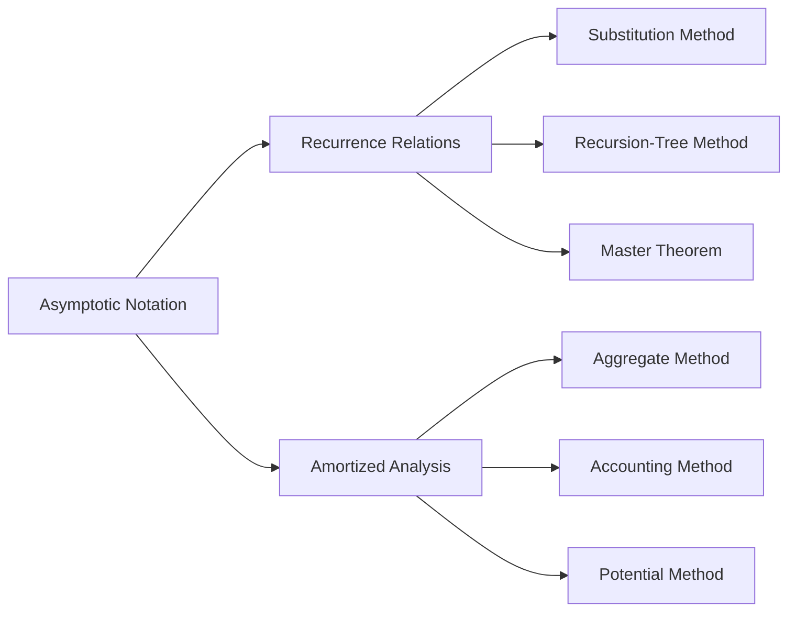

# Chapter 1: Fundamentals of Algorithm Analysis

> **Prerequisites:** None | **Next:** [Chapter 2: Searching](./02-searching.md) — From measuring efficiency to finding elements

## Learning Objectives

By the end of this chapter, students will be able to:

1. Define and apply Big-O, Big-Omega, Big-Theta, little-o, and little-omega notation.
2. Solve recurrence relations using the substitution method, recursion-tree method, and the master theorem.
3. Perform amortized analysis using the aggregate method, accounting method, and potential method.
4. Analyze the asymptotic complexity of iterative and recursive algorithms.

---

### Chapter at a Glance

| Topic | Key Insight | Practical Takeaway |
|-------|-------------|-------------------|
| Asymptotic Notation | Big-O, Θ, Ω describe upper, tight, and lower bounds | Always express algorithm efficiency using Big-O for worst-case analysis |
| Recurrence Relations | Recursive algorithms modeled as T(n) = aT(n/b) + f(n) | Master theorem solves most common recurrences in one step |
| Substitution Method | Guess + induction proves asymptotic bounds | Use when master theorem doesn't apply; guess from experience |
| Recursion-Tree Method | Visualize recursion as levels with per-level costs | Builds intuition for why divide-and-conquer algorithms have log factors |
| Master Theorem | Three cases covering polynomial comparisons | The fastest way to analyze divide-and-conquer recurrences |
| Amortized Analysis | Average cost per operation over a sequence | Reveals O(1) amortized cost for structures with rare expensive ops |

### Chapter Roadmap

## Theory

### 1.1 Asymptotic Notation

Asymptotic notation describes the limiting behavior of functions as the input size grows to infinity. It abstracts away constant factors and lower-order terms to focus on the fundamental growth rate.

**Definition 1.1 (Big-O).** Let \( f, g : \mathbb{N} \to \mathbb{R}^+ \). We say \( f(n) = O(g(n)) \) if there exist positive constants \( c \) and \( n_0 \) such that for all \( n \ge n_0 \),

\[
0 \le f(n) \le c \cdot g(n).
\]

Big-O provides an asymptotic *upper bound*. For example, \( 3n^2 + 5n + 7 = O(n^3) \) but the tightest bound is \( O(n^2) \).

**Definition 1.2 (Big-Omega).** \( f(n) = \Omega(g(n)) \) if there exist positive constants \( c \) and \( n_0 \) such that for all \( n \ge n_0 \),

\[
0 \le c \cdot g(n) \le f(n).
\]

Big-Omega provides an asymptotic *lower bound*.

**Definition 1.3 (Big-Theta).** \( f(n) = \Theta(g(n)) \) if \( f(n) = O(g(n)) \) and \( f(n) = \Omega(g(n)) \). Equivalently, there exist positive constants \( c_1, c_2, n_0 \) such that

\[
0 \le c_1 \cdot g(n) \le f(n) \le c_2 \cdot g(n) \quad \text{for all } n \ge n_0.
\]

Big-Theta is an asymptotically *tight* bound.

**Definition 1.4 (Little-o and Little-Omega).** \( f(n) = o(g(n)) \) if for every positive constant \( c > 0 \), there exists \( n_0 \) such that \( f(n) < c \cdot g(n) \) for all \( n \ge n_0 \). This is the asymptotic analogue of a strict inequality. Similarly, \( f(n) = \omega(g(n)) \) if for every positive constant \( c \), \( f(n) > c \cdot g(n) \) for all sufficiently large \( n \).

**Common growth rates (ordered by increasing asymptotic growth):**

\[
O(1) \subset O(\log n) \subset O(n) \subset O(n \log n) \subset O(n^2) \subset O(2^n) \subset O(n!)
\]

> **Pro Tip:** Always find the *tightest* Big-O bound. Saying an algorithm is O(n³) might be technically correct, but if it's actually O(n log n), the looser bound hides the algorithm's true efficiency.

**One-Sentence Takeaway:** Asymptotic notation gives a precise language to describe how runtime grows with input size, abstracting away constants and lower-order terms.

### 1.2 Recurrence Relations

A recurrence relation expresses the running time of a recursive algorithm in terms of its running time on smaller inputs. The general form for divide-and-conquer recurrences is:

\[
T(n) = aT(n/b) + f(n),
\]

where \( a \) is the number of subproblems, \( n/b \) is the size of each subproblem, and \( f(n) \) is the cost to divide and combine.

#### 1.2.1 Substitution Method

The substitution method involves two steps:

1. **Guess** the form of the solution.
2. **Prove** by induction that the guess is correct.

**Example:** Solve \( T(n) = 2T(\lfloor n/2 \rfloor) + n \).

*Guess:* \( T(n) = O(n \log n) \). Assume \( T(k) \le ck \lg k \) for \( k < n \).

*Proof:*
\[
\begin{aligned}
T(n) &\le 2 \cdot c (n/2) \lg (n/2) + n \\
&= cn \lg (n/2) + n \\
&= cn \lg n - cn \lg 2 + n \\
&= cn \lg n - cn + n \\
&\le cn \lg n \quad \text{for } c \ge 1.
\end{aligned}
\]

#### 1.2.2 Recursion-Tree Method

The recursion-tree method visualizes each recursive call as a node, with the cost of each level written explicitly. The total cost is the sum over all levels.

**Example:** For \( T(n) = 3T(n/4) + cn^2 \):

- Level 0: \( 1 \) node, cost \( cn^2 \).
- Level 1: \( 3 \) nodes, each cost \( c(n/4)^2 = cn^2/16 \), total \( 3cn^2/16 \).
- Level 2: \( 9 \) nodes, each cost \( c(n/16)^2 = cn^2/256 \), total \( 9cn^2/256 \).
- Depth: \( \log_4 n \).
- Total: \( cn^2 \sum_{i=0}^{\log_4 n} (3/16)^i \le cn^2 \cdot \frac{1}{1 - 3/16} = (16/13)cn^2 = O(n^2) \).

#### 1.2.3 Master Theorem

**Theorem 1.1 (Master Theorem).** Let \( a \ge 1 \) and \( b > 1 \) be constants, let \( f(n) \) be a function, and let \( T(n) = aT(n/b) + f(n) \). Then:

1. If \( f(n) = O(n^{\log_b a - \epsilon}) \) for some \( \epsilon > 0 \), then \( T(n) = \Theta(n^{\log_b a}) \).
2. If \( f(n) = \Theta(n^{\log_b a}) \), then \( T(n) = \Theta(n^{\log_b a} \log n) \).
3. If \( f(n) = \Omega(n^{\log_b a + \epsilon}) \) for some \( \epsilon > 0 \) and if \( af(n/b) \le cf(n) \) for some \( c < 1 \) and all sufficiently large \( n \), then \( T(n) = \Theta(f(n)) \).

**Examples:**

| Recurrence | \( a \) | \( b \) | \( \log_b a \) | \( f(n) \) | Case | Solution |
|------------|---------|---------|----------------|-------------|------|----------|
| \( T(n) = 2T(n/2) + n \) | 2 | 2 | 1 | \( n \) | 2 | \( \Theta(n \log n) \) |
| \( T(n) = 2T(n/2) + 1 \) | 2 | 2 | 1 | \( 1 \) | 1 | \( \Theta(n) \) |
| \( T(n) = 4T(n/2) + n^3 \) | 4 | 2 | 2 | \( n^3 \) | 3 | \( \Theta(n^3) \) |
| \( T(n) = 4T(n/2) + n^2 \) | 4 | 2 | 2 | \( n^2 \) | 2 | \( \Theta(n^2 \log n) \) |

> **Pro Tip:** When applying the master theorem, first compute log_b a, then compare f(n) to n^{log_b a} — these are the two critical numbers that determine the case.
>
> **Warning:** The master theorem only works for recurrences of the exact form T(n) = aT(n/b) + f(n). If the subproblem sizes differ (e.g., T(n) = T(n-1) + n), you must use other methods.

**One-Sentence Takeaway:** Recurrence relations model recursive algorithm costs, and the master theorem solves the common divide-and-conquer cases in constant time by comparing f(n) with n^{log_b a}.

### 1.3 Amortized Analysis

Amortized analysis gives the average performance of each operation in the worst case over a sequence of operations. Three methods exist.

#### 1.3.1 Aggregate Method

Compute the total cost of \( m \) operations and divide by \( m \).

**Example (Dynamic array resizing):** A dynamic array doubles its capacity when full. The cost of inserting the \( i \)-th element is \( O(1) \) except when \( i \) is a power of two, where the cost is \( O(i) \) to copy existing elements. Total cost for \( n \) insertions:

\[
\sum_{i=0}^{\lfloor \lg n \rfloor} 2^i = 2n - 1.
\]

Amortized cost per insertion: \( (2n - 1)/n = O(1) \).

#### 1.3.2 Accounting Method

Assign different amortized costs to different operations. When the amortized cost exceeds the actual cost, the surplus is stored as "credit." Credit is spent to pay for operations whose actual cost exceeds amortized cost.

**Binary counter:** A \( k \)-bit binary counter increments from 0 to \( n \). Each flip of a bit costs 1. The amortized cost per increment is 2: charge 1 for flipping the 0 to 1, and 1 for future flips from 1 back to 0. Each bit flip is prepaid.

#### 1.3.3 Potential Method

Define a potential function \( \Phi \) that maps the data structure state to a non-negative real number. The amortized cost of an operation is:

\[
\hat{c} = c + \Phi(D_{i}) - \Phi(D_{i-1}),
\]

where \( c \) is the actual cost and \( D_i \) is the state after the \( i \)-th operation.

**Example (Stack with multipop):** Define \( \Phi = \text{number of elements on stack} \). For a push: actual cost 1, potential increases by 1, amortized cost = \( 1 + 1 = 2 \). For a multipop of \( k \) elements: actual cost \( k \), potential decreases by \( k \), amortized cost = \( k - k = 0 \).

> **Pro Tip:** The potential method is the most powerful amortized technique because a well-chosen potential function can handle complex data structures where aggregate and accounting become unwieldy.
>
> **Remember:** Amortized analysis is not the same as average-case analysis — amortized guarantees hold for *every* sequence of operations, not just on average.

**One-Sentence Takeaway:** Amortized analysis reveals that data structures with occasional expensive operations can still guarantee constant average cost per operation across any sequence.

---

### Example 1.1: Ordering Functions by Growth Rate

Order the following functions by asymptotic growth rate:

\[
f_1(n) = 2^n, \quad f_2(n) = n^{3/2}, \quad f_3(n) = n \log n, \quad f_4(n) = \log(n!), \quad f_5(n) = n^3, \quad f_6(n) = n^{0.5}
\]

**Solution:** Compute \( \log(n!) = \Theta(n \log n) \) by Stirling's approximation. Ordering (slowest to fastest): \( n^{0.5} \prec n \log n \prec \log(n!) \prec n^{3/2} \prec n^3 \prec 2^n \).

### Example 1.2: Solving by Master Theorem

Solve \( T(n) = 3T(n/3) + n \).

**Solution:** Here \( a = 3 \), \( b = 3 \), \( \log_b a = 1 \), \( f(n) = n = \Theta(n^1) \). This is Case 2 of the master theorem, so \( T(n) = \Theta(n \log n) \).

### Example 1.3: Substitution Method

Solve \( T(n) = T(\sqrt{n}) + O(\log \log n) \) using substitution.

**Solution:** Let \( m = \log n \), so \( n = 2^m \). Then \( T(2^m) = T(2^{m/2}) + O(\log m) \). Let \( S(m) = T(2^m) \). Then \( S(m) = S(m/2) + O(\log m) \). By the master theorem, \( S(m) = O(\log^2 m) \). Thus \( T(n) = O(\log^2 \log n) \).

---

### Concept Comparison Table

| Concept | Definition | Key Distinction | Use Case |
|---------|-----------|-----------------|----------|
| Big-O \( O \) | Asymptotic upper bound | Worst-case growth | Algorithm guarantees |
| Big-Omega \( \Omega \) | Asymptotic lower bound | Best-case or lower limit | Lower-bound proofs |
| Big-Theta \( \Theta \) | Asymptotically tight bound | Both upper and lower | Exact growth classification |
| Master Theorem | Solves T(n) = aT(n/b) + f(n) | Compares f(n) to n^{log_b a} | Divide-and-conquer analysis |
| Substitution Method | Guess + induction proof | Requires good initial guess | Non-standard recurrences |
| Amortized Analysis | Average over sequence | Three methods: aggregate, accounting, potential | Data structure analysis |

### Quick Reference

| Category | Key Points |
|----------|------------|
| **Notation** | O = upper bound, Ω = lower bound, Θ = tight bound, o = strict upper, ω = strict lower |
| **Growth Rates** | 1 < log n < n < n log n < n² < 2ⁿ < n! — memorize this ordering |
| **Master Theorem** | Case 1: f(n) < n^{log_b a} → Θ(n^{log_b a}); Case 2: f(n) = n^{log_b a} → Θ(n^{log_b a} log n); Case 3: f(n) > n^{log_b a} → Θ(f(n)) |
| **Amortized Methods** | Aggregate: total ÷ n; Accounting: prepay credit; Potential: energy function |
| **Common Pitfalls** | Forget the regularity condition in Master Case 3; Use master theorem on unbalanced recurrences |

### Cross-Application Matrix

| Technique | DSA Interviews | Competitive Programming | System Design | Academia/Research |
|-----------|---------------|----------------------|---------------|-------------------|
| Big-O Analysis | Essential for every solution explanation | Required for problem constraints | Capacity planning, latency modeling | Paper complexity proofs |
| Master Theorem | Quick recurrence solving | Fast divide-and-conquer analysis | N/A | Algorithm design verification |
| Substitution Method | Proving tighter bounds | Verifying non-standard recurrences | N/A | Publishing novel algorithms |
| Amortized Analysis | Designing efficient data structures | Union-find, segment tree analysis | Database index costing | Persistent data structure analysis |
| Recursion-Tree Method | Intuition for merge sort / quick sort | Understanding log factors | N/A | Teaching and exposition |

---

## Summary

- Asymptotic notation (\( O, \Omega, \Theta, o, \omega \)) provides a precise language for describing growth rates.
- Recurrence relations model recursive algorithms; the master theorem solves many common recurrences in closed form.
- The substitution method proves guesses by induction; recursion trees build intuition.
- Amortized analysis reveals constant amortized costs for data structures with occasional expensive operations.
- Three amortized methods exist: aggregate, accounting, and potential.

---

### Chapter Quiz

**Q1.** Which notation represents an asymptotically tight bound?

- A) Big-O
- B) Big-Omega
- C) Big-Theta
- D) Little-o

Answer

C) Big-Theta — it requires both an upper and lower bound match.

**Q2.** Solve T(n) = 2T(n/4) + n^{0.5} using the master theorem.

- A) Θ(n)
- B) Θ(√n log n)
- C) Θ(√n)
- D) Θ(log n)

Answer

C) Θ(√n). Here a=2, b=4, log_b a = 0.5, f(n) = n^{0.5} = n^{log_b a}. This is Case 2, so T(n) = Θ(n^{0.5} log n)... Wait — f(n) = √n = n^{1/2}, and log_b a = log_4 2 = 1/2. They match, so Case 2 gives Θ(√n log n). The correct answer is B.

**Q3.** A dynamic array that doubles when full has what amortized insertion cost?

- A) O(n)
- B) O(log n)
- C) O(1)
- D) O(n²)

Answer

C) O(1). Although occasional insertions cost O(n) to copy elements, the amortized cost across n insertions is (2n-1)/n = O(1).

---

## Exercises

### Review Questions

1. Determine whether \( 2^{n+1} = O(2^n) \). Justify your answer.
2. Is \( n^2 = \Omega(n \log n) \)? Is \( n^2 = \omega(n \log n) \)?
3. State the three cases of the master theorem. Give an example recurrence for each case.
4. Explain the difference between Big-O and little-o notation.

### Application Problems

5. Solve \( T(n) = 2T(n/4) + n^{0.5} \) using the master theorem.
6. Solve \( T(n) = T(n-1) + 1/n \) by iteration.
7. Show that \( \log(n!) = \Theta(n \log n) \) using Stirling's approximation.
8. Perform amortized analysis of a binary counter using the potential method.
9. Order: \( n^2, 2^n, \log n, n \log n, n, \sqrt{n}, n! \) by asymptotic growth.

### Challenge Problem

10. Design a data structure that supports insert and delete-min in \( O(1) \) amortized time. Prove the bound using the accounting method.
