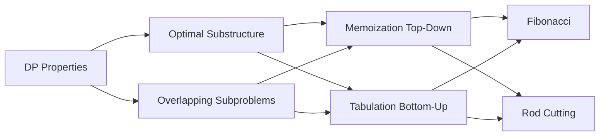

# Chapter 7: Dynamic Programming — Foundations

> **Prerequisites:** [Chapter 6: Greedy Algorithms](./06-greedy.md) — Understanding when local choices aren't enough | **Next:** [Chapter 8: Dynamic Programming — Knapsack Problems](./08-dp-knapsack.md) — Classic DP patterns for resource allocation

## Learning Objectives

By the end of this chapter, students will be able to:

1. Identify problems with optimal substructure and overlapping subproblems.
2. Distinguish between memoization (top-down) and tabulation (bottom-up) approaches.
3. Solve Fibonacci numbers and the rod cutting problem using dynamic programming.
4. Transform recursive solutions into DP solutions and analyze complexity.

---

### Chapter at a Glance

| Topic | Key Insight | Practical Takeaway |
|-------|-------------|-------------------|
| DP Paradigm | Optimal substructure + overlapping subproblems | Two properties distinguish DP from divide-and-conquer |
| Memoization | Top-down recursion with caching | Easy conversion from recursive; lazy evaluation |
| Tabulation | Bottom-up table filling | Better constant factors; avoids recursion overhead |
| Fibonacci Numbers | Naive O(φⁿ) → DP O(n) | 1D state with O(1) space optimization |
| Rod Cutting | First cut decides remaining optimal | The canonical "DP is for optimization" example |

### Chapter Roadmap



## Theory


### 7.1 The Dynamic Programming Paradigm

Dynamic programming (DP) is a method for solving complex problems by breaking them down into simpler subproblems, solving each subproblem once, and storing the results for reuse. DP applies when a problem exhibits:

1. **Optimal substructure:** An optimal solution to the problem contains optimal solutions to its subproblems.
2. **Overlapping subproblems:** The same subproblems recur multiple times; the total number of distinct subproblems is polynomial.

DP can be implemented in two ways:

- **Top-down (memoization):** Recursively solve the problem, but cache each result. Before computing a subproblem, check the cache.
- **Bottom-up (tabulation):** Solve subproblems in increasing size, storing results in a table. Use previously computed results to solve larger subproblems.

> **Pro Tip:** Start with a recursive solution, then add memoization. This is the easiest way to derive a DP. Once it works, convert to bottom-up for efficiency if needed.
>
> **Remember:** If subproblems don't overlap, you don't have a DP problem — you have divide-and-conquer. Merge sort has optimal substructure but no overlapping subproblems.

**One-Sentence Takeaway:** Dynamic programming requires both optimal substructure (optimal solution from optimal sub-solutions) and overlapping subproblems (same subproblems recur), enabling exponential → polynomial speedup.

### 7.2 Fibonacci Numbers

The Fibonacci sequence is defined by \( F(0) = 0 \), \( F(1) = 1 \), and \( F(n) = F(n-1) + F(n-2) \) for \( n \ge 2 \).

**Naive recursion** (exponential):
```
Fib(n):
    if n <= 1: return n
    return Fib(n-1) + Fib(n-2)
```

\( T(n) = T(n-1) + T(n-2) + O(1) = \Theta(\phi^n) \) where \( \phi \approx 1.618 \).

**DP (bottom-up)** (linear):
```
FibDP(n):
    if n <= 1: return n
    F = array of size n+1
    F[0] = 0, F[1] = 1
    for i = 2 to n:
        F[i] = F[i-1] + F[i-2]
    return F[n]
```

\( T(n) = \Theta(n) \), space \( \Theta(n) \) or \( \Theta(1) \) with constant space.

> **Pro Tip:** Fibonacci is the simplest example of DP's power — naive recursion is exponential (O(φⁿ)), while DP is linear (O(n)). Always draw the recursion tree to check if subproblems overlap.
>
> **Warning:** The naive recursive Fibonacci is a classic interview trap — never implement it without memoization.

**One-Sentence Takeaway:** Fibonacci numbers demonstrate DP's transformative power, dropping from exponential to linear time by caching overlapping subproblem results.

### 7.3 Rod Cutting

**Problem:** Given a rod of length \( n \) and a price function \( p[i] \) for rods of length \( i \), determine the maximum revenue obtainable by cutting the rod and selling the pieces.

**Optimal substructure:** Let \( r[n] \) be the optimal revenue for length \( n \). The first cut of length \( i \) yields revenue \( p[i] + r[n - i] \). Therefore:

\[
r[n] = \max_{1 \le i \le n} (p[i] + r[n - i])
\]

with base case \( r[0] = 0 \).

**Recursive (exponential):**
```
CutRod(p, n):
    if n == 0: return 0
    q = -inf
    for i = 1 to n:
        q = max(q, p[i] + CutRod(p, n-i))
    return q
```

**DP (bottom-up):**
```
CutRodDP(p, n):
    r = array of size n+1
    r[0] = 0
    for j = 1 to n:
        q = -inf
        for i = 1 to j:
            q = max(q, p[i] + r[j-i])
        r[j] = q
    return r[n]
```

**Complexity:** \( \Theta(n^2) \) time, \( \Theta(n) \) space.

> **Pro Tip:** Rod cutting introduces the critical DP step of reconstruction — storing decisions (which first cut) alongside optimal values. Always implement reconstruction if the problem asks for the actual solution, not just the value.
>
> **Remember:** The four-step DP framework (structure, recurse, compute, reconstruct) applies to every DP problem. Memorize it.

**One-Sentence Takeaway:** Rod cutting uses the recurrence r[n] = max(p[i] + r[n-i]) to find optimal cutting patterns in O(n²), demonstrating the four-step DP methodology.

### 7.4 Steps for DP Problem Solving

1. **Characterize the structure** of an optimal solution.
2. **Define the value** of an optimal solution recursively.
3. **Compute the value** bottom-up.
4. **Construct the optimal solution** from the computed information.

---

## Examples

### Example 7.1: Fibonacci with Constant Space

```cpp
int fib(int n) {
    if (n <= 1) return n;
    int prev2 = 0, prev1 = 1;
    for (int i = 2; i <= n; ++i) {
        int curr = prev1 + prev2;
        prev2 = prev1;
        prev1 = curr;
    }
    return prev1;
}
```

### Example 7.2: Rod Cutting with Reconstruction

```cpp
#include <vector>
#include <algorithm>

struct RodSolution {
    int maxRevenue;
    std::vector<int> cuts;
};

RodSolution rodCutting(const std::vector<int>& price, int n) {
    std::vector<int> r(n + 1, 0);
    std::vector<int> s(n + 1, 0);  // optimal first cut for each length

    for (int j = 1; j <= n; ++j) {
        int q = -1;
        for (int i = 1; i <= j; ++i) {
            if (price[i] + r[j - i] > q) {
                q = price[i] + r[j - i];
                s[j] = i;
            }
        }
        r[j] = q;
    }

    RodSolution sol;
    sol.maxRevenue = r[n];
    int len = n;
    while (len > 0) {
        sol.cuts.push_back(s[len]);
        len -= s[len];
    }
    return sol;
}
```

**Walkthrough:** price = [0, 1, 5, 8, 9, 10, 17, 17, 20], n = 8.

- \( r[1] = 1 \), cut 1.
- \( r[2] = 5 \), cut 2.
- \( r[3] = 8 \), cut 3.
- \( r[4] = 10 \), cut 2+2.
- \( r[5] = 13 \), cut 2+3.
- \( r[6] = 17 \), cut 6.
- \( r[7] = 18 \), cut 1+6 or 2+2+3.
- \( r[8] = 22 \), cut 2+6.

Maximum revenue for length 8: 22, cuts = [2, 6].

### Example 7.3: Identifying DP Problems

| Problem | Optimal Substructure? | Overlapping Subproblems? | DP Applicable? |
|---------|----------------------|------------------------|----------------|
| Binary search | Yes | No | No (divide-and-conquer) |
| Fibonacci | Yes | Yes | Yes |
| Merge sort | Yes | No | No |
| 0/1 knapsack | Yes | Yes | Yes |
| Activity selection | Yes | No | No (greedy works) |

---

### Concept Comparison Table

| Concept | Definition | Key Distinction | Use Case |
|---------|-----------|-----------------|----------|
| Optimal Substructure | Optimal solution from optimal sub-solutions | Shared with greedy — not unique to DP | All DP problems |
| Overlapping Subproblems | Same subproblems recur | Distinguishes DP from divide-and-conquer | What makes DP necessary |
| Memoization | Top-down recursion + caching | Lazy — only solves needed subproblems | When subproblem space is sparse |
| Tabulation | Bottom-up iterative table | Eager — solves all subproblems | When all subproblems are needed |
| Reconstruction | Store decisions to recover solution | Separates value computation from solution building | Problems asking for actual solution |

### Quick Reference

| Category | Key Points |
|----------|------------|
| **Two Required Properties** | Optimal substructure + overlapping subproblems |
| **Two Implementation Styles** | Top-down (memoization) vs bottom-up (tabulation) |
| **4-Step Framework** | Structure → Recurrence → Compute → Reconstruct |
| **Complexity Pattern** | States × Transitions = O(number of subproblems × choices per problem) |
| **Common Pitfall** | Using DP when subproblems don't overlap (just use recursion); forgetting base cases |

### Cross-Application Matrix

| Technique | DSA Interviews | Competitive Programming | System Design | Academia/Research |
|-----------|---------------|----------------------|---------------|-------------------|
| DP Paradigm | Extremely common — most important technique | Core technique for optimization | Resource allocation, routing | Algorithm design theory |
| Memoization | Quick DP in interviews | Lazy DP for sparse states | Caching, query optimization | Computational complexity |
| Tabulation | Preferred for efficiency | Standard CP DP approach | Table-driven automation | Formal verification |
| Fibonacci DP | Trivial — warm-up | Matrix exponentiation variation | N/A | Recursion theory |
| Rod Cutting | Classic DP intro problem | Variations in cutting problems | Inventory optimization | Operations research |

---

## Summary

- DP solves problems by combining solutions to overlapping subproblems.
- **Memoization** is recursive with caching; **tabulation** is iterative with table-filling.
- The two required properties are optimal substructure and overlapping subproblems.
- Rod cutting illustrates the four-step DP methodology and reconstruction.
- Fibonacci numbers demonstrate exponential improvement from \( \Theta(\phi^n) \) to \( \Theta(n) \).

---

### Chapter Quiz

**Q1.** What two properties must a problem have for DP to apply?

- A) Divide-and-conquer and recursion
- B) Optimal substructure and overlapping subproblems
- C) Greedy-choice property and optimal substructure
- D) Polynomial time and linear space

<details>
<summary>Answer</summary>
B) Optimal substructure (optimal solution from optimal sub-solutions) and overlapping subproblems (same subproblems recur).
</details>

**Q2.** What is the time complexity of naive recursive Fibonacci?

- A) O(n)
- B) O(n²)
- C) O(φⁿ) — exponential
- D) O(log n)

<details>
<summary>Answer</summary>
C) O(φⁿ) where φ ≈ 1.618 — each call spawns two recursive calls, leading to exponential growth.
</details>

**Q3.** Which DP approach solves only the subproblems that are actually needed?

- A) Tabulation
- B) Memoization
- C) Both
- D) Neither

<details>
<summary>Answer</summary>
B) Memoization (top-down) only computes subproblems that are reached through recursion. Tabulation (bottom-up) computes all subproblems in order.
</details>

---

## Exercises

### Review Questions

1. Explain the difference between optimal substructure and overlapping subproblems.
2. Why does merge sort not benefit from dynamic programming?
3. What is the space complexity of memoization for Fibonacci? How does it compare to bottom-up?
4. Give an example of a problem that has optimal substructure but no overlapping subproblems.

### Application Problems

5. Implement Fibonacci using memoization (top-down) in C++.
6. Modify the rod cutting algorithm to return the maximum revenue and the cuts that achieve it.
7. Given the price table for n = 10, find the maximum revenue and optimal cuts using DP.
8. Write a DP solution for the **climbing stairs** problem: a staircase with n steps, you can climb 1 or 2 steps at a time. Count distinct ways to reach the top.

### Challenge Problem

9. Generalize rod cutting to include a **cost per cut** \( c \). Modify the recurrence and implement the solution. Analyze the complexity.
