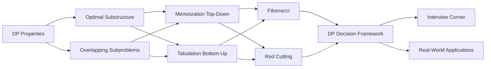

# Chapter 7: Dynamic Programming — Foundations

> **Prerequisites:** [Chapter 6: Greedy Algorithms](./06-greedy.md) — Understanding when local choices aren't enough | **Next:** [Chapter 8: Dynamic Programming — Knapsack Problems](./08-dp-knapsack.md) — Classic DP patterns for resource allocation

## Learning Objectives

By the end of this chapter, students will be able to:

1. Identify problems with optimal substructure and overlapping subproblems.
2. Distinguish between memoization (top-down) and tabulation (bottom-up) approaches.
3. Solve Fibonacci numbers and the rod cutting problem using dynamic programming.
4. Transform recursive solutions into DP solutions and analyze complexity.
5. Apply the 5-step DP decision framework to new problems.
6. Recognize common DP patterns in interview and real-world scenarios.

---

## Why Dynamic Programming Matters

**Real-world analogy — GPS shortest path:** Imagine you need to drive from New York to Los Angeles. The naive approach enumerates every possible route — 2^(number of intersections) — which is computationally impossible. Instead, GPS systems use DP: the shortest path to Los Angeles through any city X is the shortest path to X plus the shortest path from X to LA. By caching the shortest path to every intermediate city, we avoid recomputing the same subpaths thousands of times. This is *exactly* how DP works — break a problem into overlapping pieces, solve each once, and reuse.

Contrast this with **Fibonacci**: while it demonstrates DP's mechanics beautifully, it is not a real-world problem. Nobody computes Fibonacci numbers for a living. But shortest paths, sequence alignment, resource allocation, and inventory optimization are DP — and they run billions of times daily in Google Maps, BLAST, AWS EC2 Auto Scaling, and SAP systems. DP turns exponential-time pipe dreams into polynomial-time production systems.

---

### Chapter at a Glance

| Topic | Key Insight | Practical Takeaway |
|-------|-------------|-------------------|
| DP Paradigm | Optimal substructure + overlapping subproblems | Two properties distinguish DP from divide-and-conquer |
| Memoization | Top-down recursion with caching | Easy conversion from recursive; lazy evaluation |
| Tabulation | Bottom-up table filling | Better constant factors; avoids recursion overhead |
| Fibonacci Numbers | Naive O(phi^n) -> DP O(n) | 1D state with O(1) space optimization |
| Rod Cutting | First cut decides remaining optimal | The canonical "DP is for optimization" example |
| DP Decision Framework | 5-step systematic approach | How to tackle any new DP problem in interviews |

### Chapter Roadmap



## Theory


### 7.1 The Dynamic Programming Paradigm

Dynamic programming (DP) is a method for solving complex problems by breaking them down into simpler subproblems, solving each subproblem once, and storing the results for reuse. It was pioneered by Richard Bellman in the 1950s — the name "dynamic programming" was chosen to hide the mathematical nature from his skeptical Pentagon boss.

DP applies when a problem exhibits two properties:

**1. Optimal Substructure**

An optimal solution to the problem contains optimal solutions to its subproblems. In other words, you can build the global optimum from locally optimal decisions.

| Scenario | Has Optimal Substructure? | Why |
|----------|--------------------------|-----|
| Shortest path | Yes | Subpath of shortest path is shortest between its endpoints |
| Longest path (general graph) | No | Subpath of longest path may not be longest — cycles make it NP-hard |
| Merge sort | Yes | Sorting halves correctly gives sorted whole |
| Binary search | Yes | Searching in correct half guarantees result |
| Matrix chain multiplication | Yes | Optimal parenthesization contains optimal sub-chains |

> **Warning:** Greedy algorithms also require optimal substructure but add the "greedy-choice property" — that a local choice is globally optimal. DP never assumes this; it explores all choices.

**2. Overlapping Subproblems**

The same subproblems recur multiple times, and the total number of distinct subproblems is polynomial. This is what makes DP worthwhile — without overlap, you just have divide-and-conquer (like merge sort, which splits into non-overlapping halves).

| Problem | Subproblems Overlap? | Distinct Subproblems | Total Calls (Naive) |
|---------|---------------------|---------------------|-------------------|
| Fibonacci | Yes | O(n) | O(phi^n) |
| Rod cutting | Yes | O(n) | O(2^n) |
| Merge sort | No | O(n) | O(n log n) |
| Binary search | No | O(log n) | O(log n) |

**Core Insight:** When subproblems overlap, storing results converts exponential to polynomial. When they don't, DP buys you nothing.

**Memoization vs. Tabulation: Step-by-Step Comparison**

| Aspect | Memoization (Top-Down) | Tabulation (Bottom-Up) |
|--------|----------------------|----------------------|
| Direction | Start from goal, recurse down | Start from base, build up |
| State solves | Solves only needed states | Solves all states up to target |
| Implementation | Recursive + cache (hash map / array) | Iterative loops over table |
| Order | Automatic (recursion order) | Must determine topological order |
| Space | Cache + call stack | Table (often smaller) |
| When to use | Sparse state space, unknown dependencies | Dense state space, known order |
| Easy reconstruction | Requires separate traceback | Can store decisions in companion table |

---

### 7.2 Fibonacci Numbers

**Real-world analogy — rabbit population growth:** The Fibonacci sequence originally modeled idealized rabbit reproduction: each pair matures in one month, then produces one pair per month forever. While biologically simplified, the same recurrence appears in stock option pricing (binomial trees), computer science (AVL tree height analysis, Fibonacci heap operations), and even nature (phyllotaxis, nautilus shells). The real lesson: recurrences that branch into overlapping subproblems are everywhere.

**Problem:** Compute F(n) where F(0) = 0, F(1) = 1, and F(n) = F(n-1) + F(n-2) for n >= 2.

**Algorithm Steps:**

1. **Check base cases:** if n &lt;= 1, return n.
2. **Check cache (memoization):** if result exists, return it.
3. **Recurrence:** F(n) = F(n-1) + F(n-2).
4. **Store and return:** save computed result before returning.

**Step-by-Step Dry Run — Memoization Trace for F(5)**

```
Call Tree:
                  F(5)
                /      \
           F(4)          F(3)
          /    \         /    \
      F(3)      F(2)   F(2)  F(1)
     /    \    /   \   /   \
  F(2)  F(1) F(1) F(0) F(1) F(0)
  /   \
F(1) F(0)

DP Table After Execution:
Index:  0  1  2  3  4  5
Value:  0  1  1  2  3  5

Without memoization: F(2) computed 3 times, F(3) computed 2 times = 15 calls
With memoization:    each subproblem solved once = 9 calls
Savings: 40% fewer calls even for n=5; exponential savings for larger n
```

**Tabulation Trace for F(5)**

| i | dp[i-2] | dp[i-1] | dp[i] = dp[i-1] + dp[i-2] |
|---|---------|---------|---------------------------|
| 2 | 0 | 1 | 1 |
| 3 | 1 | 1 | 2 |
| 4 | 1 | 2 | 3 |
| 5 | 2 | 3 | 5 |

Result: F(5) = 5.

**Implementations**

```cpp
// C++ — Memoization (Top-Down)
#include <vector>
int fibMemo(int n, std::vector<int>& memo) {
    if (n <= 1) return n;
    if (memo[n] != -1) return memo[n];
    memo[n] = fibMemo(n-1, memo) + fibMemo(n-2, memo);
    return memo[n];
}
int fib(int n) {
    std::vector<int> memo(n+1, -1);
    return fibMemo(n, memo);
}
```

```cpp
// C++ — Tabulation (Bottom-Up) O(1) Space
int fib(int n) {
    if (n <= 1) return n;
    int prev2 = 0, prev1 = 1;
    for (int i = 2; i <= n; ++i) {
        int curr = prev1 + prev2;
        prev2 = prev1;
        prev1 = curr;
    }
    return prev1;
}
```

```python
# Python — Memoization
def fib_memo(n: int, memo: list = None) -> int:
    if memo is None:
        memo = [-1] * (n + 1)
    if n <= 1:
        return n
    if memo[n] != -1:
        return memo[n]
    memo[n] = fib_memo(n-1, memo) + fib_memo(n-2, memo)
    return memo[n]

# Python — Tabulation O(1) Space
def fib(n: int) -> int:
    if n <= 1:
        return n
    prev2, prev1 = 0, 1
    for _ in range(2, n + 1):
        prev2, prev1 = prev1, prev1 + prev2
    return prev1
```

```java
// Java — Memoization
class Solution {
    int fibMemo(int n, int[] memo) {
        if (n <= 1) return n;
        if (memo[n] != -1) return memo[n];
        memo[n] = fibMemo(n-1, memo) + fibMemo(n-2, memo);
        return memo[n];
    }
    int fib(int n) {
        int[] memo = new int[n+1];
        Arrays.fill(memo, -1);
        return fibMemo(n, memo);
    }
}

// Java — Tabulation O(1) Space
int fib(int n) {
    if (n <= 1) return n;
    int prev2 = 0, prev1 = 1;
    for (int i = 2; i <= n; i++) {
        int curr = prev1 + prev2;
        prev2 = prev1;
        prev1 = curr;
    }
    return prev1;
}
```

**Complexity Analysis**

| Approach | Time | Space | Stack Depth |
|----------|------|-------|-------------|
| Naive recursion | O(phi^n) | O(n) (stack) | O(n) |
| Memoization | O(n) | O(n) | O(n) |
| Tabulation (array) | O(n) | O(n) | O(1) |
| Tabulation (space-optimized) | O(n) | O(1) | O(1) |

**Space Optimization Discussion:** Fibonacci only ever needs the previous two values. This is the simplest example of state compression — noticing that dp[i] depends only on dp[i-1] and dp[i-2], so we can drop the full array. This pattern generalizes: whenever dp[i] depends on a fixed window of previous k states, we can reduce space from O(n) to O(k). More broadly, this is the first hint at **rolling array** optimization.

> **Pro Tip:** Fibonacci is the simplest example of DP's power — naive recursion is exponential (O(phi^n)), while DP is linear (O(n)). Always draw the recursion tree to check if subproblems overlap.
>
> **Warning:** The naive recursive Fibonacci is a classic interview trap — never implement it without memoization.

**One-Sentence Takeaway:** Fibonacci numbers demonstrate DP's transformative power, dropping from exponential to linear time by caching overlapping subproblem results.

---

### 7.3 Rod Cutting

**Real-world analogy — lumber mill optimization:** A lumber mill receives logs of fixed length 10 meters. Customers want rods of lengths 1–10 meters at known prices. Should they sell one 10m rod? Cut into 4m + 6m? 3m + 3m + 4m? Each cut reduces total usable wood (kerf loss), and different markets value different lengths differently. The mill must compute optimal cutting patterns to maximize revenue. This is rod cutting — every sawmill, paper mill, and metal fabrication plant solves this exact problem.

**Problem:** Given a rod of length `n` and a price function `p[i]` for rods of length `i`, determine the maximum revenue obtainable by cutting the rod and selling the pieces.

**Optimal substructure:** Let `r[n]` be the optimal revenue for length `n`. The first cut of length `i` yields revenue `p[i] + r[n - i]`. Therefore:

```
r[n] = max( p[i] + r[n - i] )  for 1 <= i <= n
```

with base case `r[0] = 0`.

**Algorithm Steps:**

1. **Initialize:** Create array `r[0..n]` with `r[0] = 0`.
2. **For each length j from 1 to n:**
   a. Set `q = -infinity`.
   b. **For each cut i from 1 to j:**
      - If `p[i] + r[j - i] > q`, update `q`.
   c. Store `r[j] = q`.
3. **Return** `r[n]`.
4. **(Reconstruction):** Track `s[j]` = optimal first cut for each length; backtrack.

**Step-by-Step Dry Run — DP Table Trace**

Price table: `p = [0, 1, 5, 8, 9, 10, 17, 17, 20]`, `n = 8`

```
j=1:  cut 1: p[1] + r[0] = 1 + 0 = 1  =>  r[1] = 1,   s[1] = 1
j=2:  cut 1: p[1] + r[1] = 1 + 1 = 2
      cut 2: p[2] + r[0] = 5 + 0 = 5  =>  r[2] = 5,   s[2] = 2
j=3:  cut 1: p[1] + r[2] = 1 + 5 = 6
      cut 2: p[2] + r[1] = 5 + 1 = 6
      cut 3: p[3] + r[0] = 8 + 0 = 8  =>  r[3] = 8,   s[3] = 3
j=4:  cut 1: p[1] + r[3] = 1 + 8 = 9
      cut 2: p[2] + r[2] = 5 + 5 = 10 => r[4] = 10,  s[4] = 2
      cut 3: p[3] + r[1] = 8 + 1 = 9
      cut 4: p[4] + r[0] = 9 + 0 = 9
j=5:  cut 1: p[1] + r[4] = 1 + 10 = 11
      cut 2: p[2] + r[3] = 5 + 8 = 13 => r[5] = 13,  s[5] = 2
      cut 3: p[3] + r[2] = 8 + 5 = 13 => (also 13)
      cut 4: p[4] + r[1] = 9 + 1 = 10
      cut 5: p[5] + r[0] = 10 + 0 = 10
j=6:  cut 1: p[1] + r[5] = 1 + 13 = 14
      cut 2: p[2] + r[4] = 5 + 10 = 15
      cut 3: p[3] + r[3] = 8 + 8 = 16
      cut 4: p[4] + r[2] = 9 + 5 = 14
      cut 5: p[5] + r[1] = 10 + 1 = 11
      cut 6: p[6] + r[0] = 17 + 0 = 17 => r[6] = 17,  s[6] = 6
j=7:  cut 1: p[1] + r[6] = 1 + 17 = 18 => r[7] = 18,  s[7] = 1
      cut 2: p[2] + r[5] = 5 + 13 = 18 => (also 18, could be s[7]=2)
      cut 3: p[3] + r[4] = 8 + 10 = 18
      cut 4: p[4] + r[3] = 9 + 8 = 17
      cut 5: p[5] + r[2] = 10 + 5 = 15
      cut 6: p[6] + r[1] = 17 + 1 = 18
      cut 7: p[7] + r[0] = 17 + 0 = 17
j=8:  cut 1: p[1] + r[7] = 1 + 18 = 19
      cut 2: p[2] + r[6] = 5 + 17 = 22 => r[8] = 22,  s[8] = 2
      cut 3: p[3] + r[5] = 8 + 13 = 21
      cut 4: p[4] + r[4] = 9 + 10 = 19
      cut 5: p[5] + r[3] = 10 + 8 = 18
      cut 6: p[6] + r[2] = 17 + 5 = 22 => (also 22)
      cut 7: p[7] + r[1] = 17 + 1 = 18
      cut 8: p[8] + r[0] = 20 + 0 = 20
```

**DP Table (r array):**

| j | 0 | 1 | 2 | 3 | 4 | 5 | 6 | 7 | 8 |
|---|----|----|----|----|----|----|----|----|
| r[j] | 0 | 1 | 5 | 8 | 10 | 13 | 17 | 18 | 22 |
| s[j] | — | 1 | 2 | 3 | 2 | 2 | 6 | 1 | 2 |

**Reconstruction:** For n=8, s[8]=2. Cut a piece of length 2, remaining 6. s[6]=6. Cut 6, remaining 0. Cuts: [2, 6]. Revenue: p[2] + p[6] = 5 + 17 = 22.

**Implementations**

```cpp
// C++ — Rod Cutting with Reconstruction
#include <vector>
#include <algorithm>

struct RodSolution {
    int maxRevenue;
    std::vector<int> cuts;
};

RodSolution rodCutting(const std::vector<int>& price, int n) {
    std::vector<int> r(n + 1, 0);
    std::vector<int> s(n + 1, 0);

    for (int j = 1; j <= n; ++j) {
        int q = -1;
        for (int i = 1; i <= j; ++i) {
            if (price[i] + r[j - i] > q) {
                q = price[i] + r[j - i];
                s[j] = i;
            }
        }
        r[j] = q;
    }

    RodSolution sol;
    sol.maxRevenue = r[n];
    int len = n;
    while (len > 0) {
        sol.cuts.push_back(s[len]);
        len -= s[len];
    }
    return sol;
}
```

```python
# Python — Rod Cutting with Reconstruction
def rod_cutting(price: list, n: int) -> tuple:
    r = [0] * (n + 1)
    s = [0] * (n + 1)

    for j in range(1, n + 1):
        q = -1
        for i in range(1, j + 1):
            if price[i] + r[j - i] > q:
                q = price[i] + r[j - i]
                s[j] = i
        r[j] = q

    # Reconstruction
    cuts = []
    length = n
    while length > 0:
        cuts.append(s[length])
        length -= s[length]

    return r[n], cuts

# Example
price = [0, 1, 5, 8, 9, 10, 17, 17, 20]
max_rev, cuts = rod_cutting(price, 8)
print(f"Max revenue: {max_rev}, Cuts: {cuts}")  # 22, [2, 6]
```

```java
// Java — Rod Cutting with Reconstruction
import java.util.*;

class RodSolution {
    int maxRevenue;
    List<Integer> cuts;

    RodSolution(int maxRevenue, List<Integer> cuts) {
        this.maxRevenue = maxRevenue;
        this.cuts = cuts;
    }
}

class RodCutting {
    static RodSolution solve(int[] price, int n) {
        int[] r = new int[n + 1];
        int[] s = new int[n + 1];

        for (int j = 1; j <= n; j++) {
            int q = Integer.MIN_VALUE;
            for (int i = 1; i <= j; i++) {
                if (price[i] + r[j - i] > q) {
                    q = price[i] + r[j - i];
                    s[j] = i;
                }
            }
            r[j] = q;
        }

        List<Integer> cuts = new ArrayList<>();
        int len = n;
        while (len > 0) {
            cuts.add(s[len]);
            len -= s[len];
        }
        return new RodSolution(r[n], cuts);
    }

    public static void main(String[] args) {
        int[] price = {0, 1, 5, 8, 9, 10, 17, 17, 20};
        RodSolution sol = solve(price, 8);
        System.out.println("Max: " + sol.maxRevenue + ", Cuts: " + sol.cuts);
    }
}
```

**Complexity Analysis**

| Approach | Time | Space | Notes |
|----------|------|-------|-------|
| Naive recursion | O(2^n) | O(n) (stack) | Explores all 2^(n-1) cutting patterns |
| Memoization | O(n^2) | O(n) | Cache prevents recomputation |
| Tabulation (basic) | O(n^2) | O(n) | Double loop over lengths and cuts |
| Tabulation (optimized) | Theta(n^2) | O(n) | Cannot improve beyond quadratic input/output |

**Space Optimization Discussion:** Rod cutting's DP depends on all smaller subproblems (r[j] uses r[j-i] for any i), so the full array is necessary — O(1) space is impossible. However, if we only need the maximum value (not the cuts), the reconstruction array `s[]` can be omitted, still O(n) for `r[]`.

> **Pro Tip:** Rod cutting introduces the critical DP step of reconstruction — storing decisions alongside optimal values. Always implement reconstruction if the problem asks for the actual solution, not just the value.
>
> **Remember:** The four-step DP framework (structure, recurse, compute, reconstruct) applies to every DP problem.

**One-Sentence Takeaway:** Rod cutting uses the recurrence r[n] = max(p[i] + r[n-i]) to find optimal cutting patterns in O(n^2), demonstrating the four-step DP methodology with reconstruction.

---

### 7.4 Steps for DP Problem Solving

The classic **4-step DP framework:**

1. **Characterize the structure** of an optimal solution.
2. **Define the value** of an optimal solution recursively (the recurrence).
3. **Compute the value** bottom-up (or top-down with memoization).
4. **Construct the optimal solution** from the computed information (reconstruction).

---

## DP Decision Framework

### How to Identify DP Problems (The 5-Step Approach)

When you encounter a new problem, run through these five steps to determine if DP applies:

**Step 1: Is it an optimization problem?**
Does the problem ask for maximum, minimum, longest, shortest, or number of ways? If no, it might not be DP. (Exception: counting problems without optimization can still be DP.)

**Step 2: Can you make a choice at each step?**
Is the solution built from a sequence of decisions? Each choice leads to a subproblem of the same type.

**Step 3: Does the choice affect future choices?**
If choosing A vs B at step 1 changes what's available at step 2, greedy might fail — and DP might be needed.

**Step 4: Can you find overlapping subproblems?**
Draw the recursion tree for a small input. Do the same subproblems appear in multiple branches? If yes, memoization will help.

**Step 5: Can you define a state?**
A state `dp[i]`, `dp[i][j]`, or `dp[i][j][k]` must capture everything needed to make future decisions. Ask: what variables change as we recurse?

### The 7 DP Patterns (Interview Cheatsheet)

| Pattern | State | Classic Problems |
|---------|-------|-----------------|
| 1D DP | dp[i] — best for first i items | Fibonacci, rod cutting, climbing stairs |
| 2D DP (two sequences) | dp[i][j] — prefixes of two strings | LCS, edit distance |
| 2D DP (knapsack) | dp[i][c] — first i items with capacity c | 0/1 Knapsack, subset sum |
| Interval DP | dp[i][j] — substring i..j | Matrix chain multiplication, palindrome partitioning |
| Tree DP | dp[node] — subtree rooted at node | Diameter of tree, max independent set |
| Bitmask DP | dp[mask] — subset represented as bitmask | Traveling salesman, assignment |
| DP on Grid | dp[i][j] — cell (i, j) in grid | Minimum path sum, unique paths |

### Common Decision Questions

| Question | Answer |
|----------|--------|
| Greedy, DP, or just recursion? | Greedy has greedy-choice property; DP has overlapping subproblems; recursion alone has neither |
| Medium constraint -> DP? | If constraints are 10^2-10^3, DP array of size O(n) or O(n^2) is feasible |
| Top-down or bottom-up? | Top-down for complex dependencies or sparse solves; bottom-up for dense, known order |
| Can space be optimized? | Check dp[i]'s dependency window — only previous k states? O(1) possible |

---

## Examples

### Example 7.1: Fibonacci with Constant Space

```cpp
int fib(int n) {
    if (n <= 1) return n;
    int prev2 = 0, prev1 = 1;
    for (int i = 2; i <= n; ++i) {
        int curr = prev1 + prev2;
        prev2 = prev1;
        prev1 = curr;
    }
    return prev1;
}
```

```python
def fib(n: int) -> int:
    if n <= 1:
        return n
    prev2, prev1 = 0, 1
    for _ in range(2, n + 1):
        prev2, prev1 = prev1, prev1 + prev2
    return prev1
```

```java
int fib(int n) {
    if (n <= 1) return n;
    int prev2 = 0, prev1 = 1;
    for (int i = 2; i <= n; i++) {
        int curr = prev1 + prev2;
        prev2 = prev1;
        prev1 = curr;
    }
    return prev1;
}
```

### Example 7.2: Rod Cutting with Reconstruction

```cpp
#include <vector>
#include <algorithm>

struct RodSolution {
    int maxRevenue;
    std::vector<int> cuts;
};

RodSolution rodCutting(const std::vector<int>& price, int n) {
    std::vector<int> r(n + 1, 0);
    std::vector<int> s(n + 1, 0);  // optimal first cut for each length

    for (int j = 1; j <= n; ++j) {
        int q = -1;
        for (int i = 1; i <= j; ++i) {
            if (price[i] + r[j - i] > q) {
                q = price[i] + r[j - i];
                s[j] = i;
            }
        }
        r[j] = q;
    }

    RodSolution sol;
    sol.maxRevenue = r[n];
    int len = n;
    while (len > 0) {
        sol.cuts.push_back(s[len]);
        len -= s[len];
    }
    return sol;
}
```

**Walkthrough:** price = [0, 1, 5, 8, 9, 10, 17, 17, 20], n = 8.

| j | Candidates | r[j] | s[j] |
|---|-----------|------|------|
| 1 | p[1]+r[0]=1 | 1 | 1 |
| 2 | p[1]+r[1]=2, p[2]+r[0]=5 | 5 | 2 |
| 3 | p[1]+r[2]=6, p[2]+r[1]=6, p[3]+r[0]=8 | 8 | 3 |
| 4 | p[1]+r[3]=9, p[2]+r[2]=10, p[3]+r[1]=9, p[4]+r[0]=9 | 10 | 2 |
| 5 | p[1]+r[4]=11, p[2]+r[3]=13, p[3]+r[2]=13, p[4]+r[1]=10, p[5]+r[0]=10 | 13 | 2 |
| 6 | p[1]+r[5]=14, p[2]+r[4]=15, p[3]+r[3]=16, p[4]+r[2]=14, p[5]+r[1]=11, p[6]+r[0]=17 | 17 | 6 |
| 7 | p[1]+r[6]=18, p[2]+r[5]=18, p[3]+r[4]=18, p[4]+r[3]=17, p[5]+r[2]=15, p[6]+r[1]=18, p[7]+r[0]=17 | 18 | 1 |
| 8 | p[1]+r[7]=19, p[2]+r[6]=22, p[3]+r[5]=21, p[4]+r[4]=19, p[5]+r[3]=18, p[6]+r[2]=22, p[7]+r[1]=18, p[8]+r[0]=20 | 22 | 2 |

Maximum revenue for length 8: 22, cuts = [2, 6] (p[2]=5, p[6]=17, sum=22).

### Example 7.3: Identifying DP Problems

| Problem | Optimal Substructure? | Overlapping Subproblems? | DP Applicable? |
|---------|----------------------|------------------------|----------------|
| Binary search | Yes | No | No (divide-and-conquer) |
| Fibonacci | Yes | Yes | Yes |
| Merge sort | Yes | No | No |
| 0/1 knapsack | Yes | Yes | Yes |
| Activity selection | Yes | No | No (greedy works) |
| Shortest path (DAG) | Yes | Yes | Yes (Bellman-Ford) |
| Longest increasing subsequence | Yes | Yes | Yes |

### Example 7.4: DP vs Greedy — Activity Selection

| Aspect | Greedy | DP |
|--------|--------|-----|
| Approach | Pick earliest-finishing, recurse | Try every possible first activity |
| Time | O(n log n) | O(n^2) |
| Result | Optimal | Optimal |
| Need | Greedy-choice property | Optimal substructure only |

---

## Interview Corner

### Classic DP Patterns for Interviews

| Pattern | Signature | Example Problems |
|---------|-----------|----------------|
| **Linear DP** | `dp[i] = f(dp[i-1], dp[i-2], ...)` | Fibonacci, climbing stairs, house robber |
| **Two-String DP** | `dp[i][j] = f(dp[i-1][j-1], dp[i-1][j], dp[i][j-1])` | LCS, edit distance, wildcard matching |
| **Knapsack DP** | `dp[c] = max(dp[c], v + dp[c-w])` | 0/1 Knapsack, subset sum, coin change |
| **Palindrome DP** | `dp[i][j] = (s[i]==s[j] && dp[i+1][j-1])` | Longest palindromic substring, palindrome partitioning |
| **Grid DP** | `dp[i][j] = f(dp[i-1][j], dp[i][j-1])` | Unique paths, minimum path sum |
| **Stock DP** | `dp[i][k][hold] = max(skip, buy/sell)` | Best time to buy/sell stock (all variants) |

### Common Mistakes

| Mistake | Fix |
|---------|-----|
| Forgetting base cases | Always check n=0, n=1, empty input |
| Wrong recurrence direction | Use small example to verify; trace by hand |
| Off-by-one in array indices | DP[0] is base, DP[i] uses DP[i-1] — test with i=1 |
| Not handling negative values | Initialize with -inf, not 0 |
| Over-indexing | Allocate n+1, not n |
| Ignoring reconstruction until end | Store decisions in companion array during compute phase |
| Using DP when greedy works | Check if greedy-choice property holds (local optimum is global) |

### Quick Interview Strategy

```
1. Ask:  "What's the smallest input?"  ->  Base case.
2. Ask:  "What choices do I have?"     ->  Recurrence.
3. Draw:  Recursion tree.               ->  Check overlap.
4. State: "dp[i] = best for first i items"  ->  Define state.
5. Write: Recursive + memo first.       ->  Then convert to iterative.
6. Check: Off-by-one, initialization, return value.
```

### Time Complexity Estimation

| State Dimensions | Transition Cost | Typical Time |
|-----------------|----------------|--------------|
| O(n) 1-state | O(1) | O(n) |
| O(n) 1-state | O(n) | O(n^2) |
| O(n*m) 2-state | O(1) | O(n*m) |
| O(n*m) 2-state | O(k) | O(n*m*k) |
| O(n^2) interval | O(n) | O(n^3) |

---

## Applications in Real Systems

### Bioinformatics — Sequence Alignment

The Smith-Waterman algorithm (local sequence alignment) is DP applied to DNA/protein sequences. Given two genetic sequences, it finds regions of similarity by filling a DP table where each cell represents the alignment score up to that position. BLAST, the most-cited bioinformatics tool ever, uses DP as its core engine. Every genome sequencing pipeline depends on DP for aligning reads to reference genomes — enabling personalized medicine, evolutionary biology, and COVID-19 variant tracking.

### Routing and Navigation

GPS systems use Dijkstra's algorithm (which is DP — it relies on optimal substructure) and A* (which adds heuristics) to compute shortest paths. Google Maps processes over 40 billion kilometers of route computation daily. Without DP, routing at this scale would require supercomputers.

### Natural Language Processing

**Viterbi algorithm** (DP) powers part-of-speech tagging: given a sequence of words, find the most likely sequence of tags (noun, verb, etc.). The recurrence `dp[i][tag] = max( dp[i-1][prev] + emission + transition )` is textbook DP. Similarly, the **CKY algorithm** (DP) underlies constituency parsing — how computers understand sentence structure.

### Operations Research

| Application | DP Pattern | Industry |
|-------------|-----------|----------|
| Inventory management | Rod cutting variant | Manufacturing, retail |
| Resource allocation | 0/1 Knapsack | Cloud computing, finance |
| Portfolio optimization | Knapsack + risk constraints | Investment banking |
| Supply chain routing | Shortest path on DAG | Logistics (Amazon, FedEx) |
| Sequence alignment | 2D DP (LCS) | Bioinformatics, NLP |

### System Design Context

| System | DP Component | Why It's DP |
|--------|-------------|-------------|
| CDN caching | Optimal cache replacement (Belady's) | Future-knowing optimal — theoretical upper bound |
| Load balancer | Least-connections routing | Overlapping server state subproblems |
| Rate limiter | Token bucket / sliding window | Stateful counting with overlapping time windows |
| Database query optimizer | Join order selection | Matrix-chain multiplication pattern (interval DP) |

---

### Concept Comparison Table

| Concept | Definition | Key Distinction | Use Case |
|---------|-----------|-----------------|----------|
| Optimal Substructure | Optimal solution from optimal sub-solutions | Shared with greedy — not unique to DP | All DP problems |
| Overlapping Subproblems | Same subproblems recur | Distinguishes DP from divide-and-conquer | What makes DP necessary |
| Memoization | Top-down recursion + caching | Lazy — only solves needed subproblems | When subproblem space is sparse |
| Tabulation | Bottom-up iterative table | Eager — solves all subproblems | When all subproblems are needed |
| Reconstruction | Store decisions to recover solution | Separates value computation from solution building | Problems asking for actual solution |
| State Compression | Reduce table to minimal window | Decreases space from O(n) to O(1) or O(k) | Fibonacci, house robber, grid DP row-by-row |

### Quick Reference

| Category | Key Points |
|----------|------------|
| **Two Required Properties** | Optimal substructure + overlapping subproblems |
| **Two Implementation Styles** | Top-down (memoization) vs bottom-up (tabulation) |
| **4-Step Framework** | Structure -> Recurrence -> Compute -> Reconstruct |
| **5-Step Decision Framework** | Optimization? Choices? Future affected? Overlap? State definable? |
| **Complexity Pattern** | States x Transitions = O(number of subproblems x choices per problem) |
| **Common Pitfall** | Using DP when subproblems don't overlap (just use recursion); forgetting base cases; off-by-one in indices |
| **Space Optimization** | Check dependency window — rolling array for last k states |

### Cross-Application Matrix

| Technique | DSA Interviews | Competitive Programming | System Design | Academia/Research |
|-----------|---------------|----------------------|---------------|-------------------|
| DP Paradigm | Extremely common — most important technique | Core technique for optimization | Resource allocation, routing | Algorithm design theory |
| Memoization | Quick DP in interviews | Lazy DP for sparse states | Caching, query optimization | Computational complexity |
| Tabulation | Preferred for efficiency | Standard CP DP approach | Table-driven automation | Formal verification |
| Fibonacci DP | Trivial — warm-up | Matrix exponentiation variation | N/A | Recursion theory |
| Rod Cutting | Classic DP intro problem | Variations in cutting problems | Inventory optimization | Operations research |
| DP Decision Framework | Systematic approach to unknown problems | Pattern recognition training | Architecture decisions | Curriculum design |
| Sequence Alignment DP | LCS, edit distance | String DP variations | Diff tools, plagiarism detection | Bioinformatics |

---

## Summary

- DP solves problems by combining solutions to overlapping subproblems, turning exponential into polynomial time.
- **Memoization** is recursive with caching; **tabulation** is iterative with table-filling.
- The two required properties are **optimal substructure** and **overlapping subproblems**.
- The **5-step decision framework** helps identify if DP applies: optimization? choices? future affected? overlap? definable state?
- Rod cutting illustrates the four-step DP methodology with reconstruction.
- Fibonacci demonstrates exponential improvement from O(phi^n) to O(n) with O(1) space.
- Real-world applications span bioinformatics (BLAST), GPS routing (Dijkstra's, A*), NLP (Viterbi), and operations research.

---

### Chapter Quiz

**Q1.** What two properties must a problem have for DP to apply?

- A) Divide-and-conquer and recursion
- B) Optimal substructure and overlapping subproblems
- C) Greedy-choice property and optimal substructure
- D) Polynomial time and linear space

<details>
<summary>Answer&lt;/summary&gt;
B) Optimal substructure (optimal solution from optimal sub-solutions) and overlapping subproblems (same subproblems recur).
</details>

**Q2.** What is the time complexity of naive recursive Fibonacci?

- A) O(n)
- B) O(n^2)
- C) O(phi^n) — exponential
- D) O(log n)

<details>
<summary>Answer&lt;/summary&gt;
C) O(phi^n) where phi approx 1.618 — each call spawns two recursive calls, leading to exponential growth.
</details>

**Q3.** Which DP approach solves only the subproblems that are actually needed?

- A) Tabulation
- B) Memoization
- C) Both
- D) Neither

<details>
<summary>Answer&lt;/summary&gt;
B) Memoization (top-down) only computes subproblems that are reached through recursion. Tabulation (bottom-up) computes all subproblems in order.
</details>

**Q4.** Why does merge sort NOT benefit from DP?

- A) It has no optimal substructure
- B) Its subproblems don't overlap
- C) It's already O(n log n)
- D) It uses recursion

<details>
<summary>Answer&lt;/summary&gt;
B) Merge sort's subproblems are disjoint (left half, right half) — they never overlap, so caching provides no benefit.
</details>

**Q5.** What is the space-optimized Fibonacci implementation's space complexity?

- A) O(n)
- B) O(1)
- C) O(n^2)
- D) O(log n)

<details>
<summary>Answer&lt;/summary&gt;
B) O(1) — since dp[i] depends only on dp[i-1] and dp[i-2], we only need two variables.
</details>

---

## Exercises

### Review Questions

1. Explain the difference between optimal substructure and overlapping subproblems.
2. Why does merge sort not benefit from dynamic programming?
3. What is the space complexity of memoization for Fibonacci? How does it compare to bottom-up?
4. Give an example of a problem that has optimal substructure but no overlapping subproblems.

### Application Problems

5. Implement Fibonacci using memoization (top-down) in all three languages (C++, Python, Java).
6. Modify the rod cutting algorithm to return the maximum revenue and the cuts that achieve it.
7. Given the price table for n = 10, find the maximum revenue and optimal cuts using DP.
8. Write a DP solution for the **climbing stairs** problem: a staircase with n steps, you can climb 1 or 2 steps at a time. Count distinct ways to reach the top.

### Challenge Problems

9. Generalize rod cutting to include a **cost per cut** c. Modify the recurrence and implement the solution. Analyze the complexity.
10. **Can Rod Cutting be solved with O(1) space?** Prove or disprove — what about the problem's dependency structure prevents O(1) space optimization?
11. **Identify the pattern:** For each of these problems, determine if DP applies and identify the state: (a) Minimum number of coins to make change, (b) Maximum subarray sum, (c) Tower of Hanoi, (d) Counting paths in a grid with obstacles.
