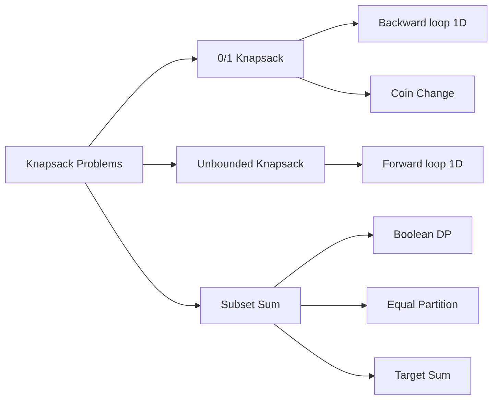

# Chapter 8: Dynamic Programming — Knapsack Problems

> **Prerequisites:** [Chapter 7: Dynamic Programming — Foundations](./07-dp-intro.md) — DP properties, recurrence design, tabulation | **Next:** [Chapter 9: Dynamic Programming — Sequences](./09-dp-sequences.md) — From resource allocation to string and sequence patterns

## Learning Objectives

By the end of this chapter, students will be able to:

1. Solve 0/1 knapsack, unbounded knapsack, and subset sum using DP.
2. Distinguish between 0/1 and unbounded knapsack and adapt the recurrence accordingly.
3. Apply DP to the partition equal subset sum and target sum problems.
4. Optimize space usage from \( O(nW) \) to \( O(W) \).

---

### Chapter at a Glance

| Topic | Key Insight | Practical Takeaway |
|-------|-------------|-------------------|
| 0/1 Knapsack | max(skip, take) — backward capacity loop | The classic DP for item selection with capacity constraint |
| Space Optimization | 1D array, iterate capacity backward | O(W) space, but loses reconstruction ability |
| Unbounded Knapsack | Same but forward capacity loop | Direction difference = item can be reused |
| Subset Sum | Boolean DP for reachable sums | Foundation for many NP-hard reductions |
| Equal Partition | Reduce to subset sum with target = total/2 | Classic "can you split equally" problem |
| Coin Change | min(1 + dp[c - coin]) — forward loop | Unbounded min-coin variation |
| Target Sum | Reduce to subset sum via math transform | Sign assignment counting problem |

### Chapter Roadmap



## Theory


### 8.1 0/1 Knapsack

**Problem:** Given \( n \) items, each with weight \( w_i \) and value \( v_i \), and a knapsack capacity \( W \), select a subset of items to maximize total value without exceeding capacity. Each item can be taken at most once (0/1 decision).

**Recurrence:** Let \( dp[i][c] \) be the maximum value achievable using the first \( i \) items with capacity \( c \).

\[
dp[i][c] = \begin{cases}
0 & \text{if } i = 0 \text{ or } c = 0 \\
dp[i-1][c] & \text{if } w_i > c \\
\max(dp[i-1][c], \; v_i + dp[i-1][c - w_i]) & \text{otherwise}
\end{cases}
\]

**Algorithm:**
```
Knapsack01(n, W, w, v):
    dp = 2D array of size (n+1) x (W+1), initialized to 0
    for i = 1 to n:
        for c = 1 to W:
            if w[i] > c:
                dp[i][c] = dp[i-1][c]
            else:
                dp[i][c] = max(dp[i-1][c], v[i] + dp[i-1][c - w[i]])
    return dp[n][W]
```

**Complexity:** \( \Theta(nW) \) time, \( \Theta(nW) \) space (can be reduced to \( \Theta(W) \)).

**Space-optimized (1D array):** Iterate capacity from \( W \) down to \( w_i \) to avoid using an item multiple times.

```
Knapsack01_1D(n, W, w, v):
    dp = array of size W+1, initialized to 0
    for i = 1 to n:
        for c = W down to w[i]:
            dp[c] = max(dp[c], v[i] + dp[c - w[i]])
    return dp[W]
```

> **Pro Tip:** The backward loop in 0/1 knapsack is the single most important implementation detail. Backward = each item used at most once (reads from previous row). Forward = items can be reused (reads from current row).
>
> **Remember:** The 1D space optimization loses the ability to reconstruct *which* items were selected. Keep the 2D table if reconstruction is needed.

**One-Sentence Takeaway:** 0/1 knapsack uses dp[i][c] = max(dp[i-1][c], v_i + dp[i-1][c-w_i]) with backward capacity iteration to ensure each item is used at most once.

### 8.2 Unbounded Knapsack

**Problem:** Same as 0/1 knapsack, but each item can be taken any number of times.

**Recurrence:** \( dp[c] = \max(dp[c], v_i + dp[c - w_i]) \). The key difference from 0/1 knapsack is the capacity loop direction: **forward** instead of backward.

```
UnboundedKnapsack(n, W, w, v):
    dp = array of size W+1, initialized to 0
    for c = 1 to W:
        for i = 1 to n:
            if w[i] <= c:
                dp[c] = max(dp[c], v[i] + dp[c - w[i]])
    return dp[W]
```

**Complexity:** \( \Theta(nW) \).

> **Pro Tip:** The forward/backward loop direction is the universal tell for 0/1 vs unbounded. Backward = 0/1 (each item once). Forward = unbounded (item can be reused). This rule applies to ALL knapsack variants, not just basic value-maximization.
>
> **Warning:** Unbounded knapsack has the same O(nW) complexity as 0/1, but can feel slower in practice because the forward loop may process more states — especially with large W and many items.

**One-Sentence Takeaway:** Unbounded knapsack allows unlimited reuse of each item simply by changing the capacity loop from backward to forward.

### 8.3 Subset Sum

**Problem:** Given a set of integers and a target sum \( S \), determine whether there exists a subset that sums to \( S \).

**Recurrence:** Let \( dp[i][s] \) be true if a subset of the first \( i \) elements sums to \( s \).

\[
dp[i][s] = dp[i-1][s] \;\lor\; dp[i-1][s - A[i]]
\]

**1D optimization:**
```
SubsetSum(A, n, S):
    dp = boolean array of size S+1, dp[0] = true
    for i = 1 to n:
        for s = S down to A[i]:
            dp[s] = dp[s] || dp[s - A[i]]
    return dp[S]
```

> **Pro Tip:** Subset sum uses the same backward loop as 0/1 knapsack because each element can be used at most once. The boolean DP tracks which sums are reachable rather than maximizing value.
>
> **Warning:** When S is large (e.g., 10⁶), O(nS) becomes impractical. For small n but large S, consider meet-in-the-middle instead.

**One-Sentence Takeaway:** Subset sum is a boolean 0/1 knapsack variant that answers reachability — can we achieve exact sum S — using O(nS) time and O(S) space.

### 8.4 Equal Partition Subset Sum

**Problem:** Given an integer array, determine if it can be partitioned into two subsets with equal sum.

**Reduction to subset sum:** If the total sum is odd, return false. Otherwise, target \( S = \text{total}/2 \). Check if a subset sums to \( S \).

> **Pro Tip:** Equal partition is an immediate "if odd total → false" filter. No need to run DP if the total is odd. This simple check is a common interview gotcha.

**One-Sentence Takeaway:** Equal partition reduces to subset sum with target = total/2, and the odd-total early exit makes it trivial to reject impossible cases.

### 8.5 Coin Change (Minimum Coins)

**Problem:** Given coin denominations and an amount, find the minimum number of coins needed to make the amount (unbounded usage).

\[
dp[c] = \min_{i: w_i \le c} (1 + dp[c - w_i])
\]

```
CoinChange(coins, n, amount):
    dp = array of size amount+1, initialized to inf
    dp[0] = 0
    for c = 1 to amount:
        for i = 1 to n:
            if coins[i] <= c:
                dp[c] = min(dp[c], 1 + dp[c - coins[i]])
    return dp[amount] == inf ? -1 : dp[amount]
```

> **Pro Tip:** Coin change (min coins) uses a forward loop because it's an unbounded problem — each coin can be used any number of times. For "number of ways" instead of "min coins," replace min with sum and dp[0] = 1.
>
> **Warning:** Coin change can overflow the dp array with large amounts — use a large sentinel (> amount) for "infinity" and check against it at the end.

**One-Sentence Takeaway:** Coin change finds the minimum coins to make change using forward loop unbounded DP, with inf sentinel for impossible amounts.

### 8.6 Target Sum

**Problem:** Given an array of integers and a target sum, assign \( + \) or \( - \) signs to each element to achieve the target. Count the number of assignments.

**Reduction to subset sum:** Let \( P \) be the set of elements with \( + \) sign and \( N \) those with \( - \). Then \( \text{sum}(P) - \text{sum}(N) = S \). Since \( \text{sum}(P) + \text{sum}(N) = \text{total} \), we have \( 2 \cdot \text{sum}(P) = \text{total} + S \), so \( \text{sum}(P) = (\text{total} + S) / 2 \). Count subsets with this sum.

> **Pro Tip:** Target sum is a clever reduction problem. The key insight: assign all + elements to set P and all - to set N, then solve 2·sum(P) = total + S. If (total + S) is odd, return 0 immediately.
>
> **Remember:** Target sum counts sign assignments — it's a counting problem, not a feasibility problem. Use sum DP (dp[c] += dp[c - v]) instead of boolean or max.

**One-Sentence Takeaway:** Target sum reduces to counting subsets with sum (total + S)/2, transforming a sign-assignment problem into a knapsack counting variant.

---

### Example 8.1: 0/1 Knapsack in C++

```cpp
#include <vector>
#include <algorithm>

int knapsack01(const std::vector<int>& w, const std::vector<int>& v, int W) {
    int n = static_cast<int>(w.size());
    std::vector<int> dp(W + 1, 0);
    for (int i = 0; i < n; ++i) {
        for (int c = W; c >= w[i]; --c) {
            dp[c] = std::max(dp[c], v[i] + dp[c - w[i]]);
        }
    }
    return dp[W];
}
```

**Walkthrough:** Items: (w,v) = (2,3), (3,4), (4,5), (5,6). Capacity W = 5.

- i=0: dp[2] = 3, dp[3] = 3, dp[4] = 3, dp[5] = 3.
- i=1: dp[3] = max(3, 4+0) = 4, dp[4] = max(3, 4+3) = 7, dp[5] = max(3, 4+3) = 7.
- i=2: dp[4] = max(7, 5+0) = 7, dp[5] = max(7, 5+3) = 8.
- i=3: dp[5] = max(8, 6+0) = 8.

Result: 8. Items selected: (3,4) and (2,3).

### Example 8.2: Subset Sum

```cpp
bool subsetSum(const std::vector<int>& A, int S) {
    std::vector<bool> dp(S + 1, false);
    dp[0] = true;
    for (int x : A) {
        for (int s = S; s >= x; --s) {
            if (dp[s - x]) dp[s] = true;
        }
    }
    return dp[S];
}
```

### Example 8.3: Partition Equal Subset Sum

```cpp
bool canPartition(const std::vector<int>& nums) {
    int total = 0;
    for (int x : nums) total += x;
    if (total % 2 != 0) return false;
    return subsetSum(nums, total / 2);
}
```

---

### Concept Comparison Table

| Concept | State Definition | Loop Direction | Recurrence | Uses Each Item |
|---------|-----------------|---------------|------------|----------------|
| 0/1 Knapsack | dp[c] = max value at capacity c | Backward | max(skip, v_i + dp[c-w_i]) | At most once |
| Unbounded Knapsack | dp[c] = max value at capacity c | Forward | max(skip, v_i + dp[c-w_i]) | Unlimited |
| Subset Sum | dp[c] = is sum c reachable | Backward | dp[c] OR dp[c - v_i] | At most once |
| Coin Change | dp[c] = min coins for amount c | Forward | min(1 + dp[c - coin]) | Unlimited |
| Target Sum | dp[c] = ways to reach sum c | Backward | dp[c] + dp[c - v_i] | At most once |

### Quick Reference

| Category | Key Points |
|----------|------------|
| **0/1 Knapsack** | Backward loop, each item once, max value over capacity constraint |
| **Unbounded** | Forward loop = item reuse, same core recurrence |
| **Subset Sum** | Boolean DP, backward loop, checks reachability not value |
| **Coin Change** | Forward loop, min instead of max, inf sentinel for unreachable |
| **Target Sum** | Math reduce to subset sum counting, odd-total filter |
| **Space Optimization** | 1D always possible, but reconstruction requires 2D table |

### Cross-Application Matrix

| Problem | DSA Interviews | Competitive Programming | System Design | Real-World |
|---------|---------------|----------------------|---------------|------------|
| 0/1 Knapsack | Very common — resource allocation | Standard optimization | Budget allocation | Cargo loading, portfolio selection |
| Unbounded Knapsack | Less common | Coin change variants | Resource scaling | Inventory management |
| Subset Sum | Common — reduction problems | Meet-in-the-middle for large S | Capacity planning | Payment systems |
| Coin Change | Very common — warm-up to hard | Core CP DP problem | Denomination systems | Vending machines, ATMs |
| Target Sum | Occasionally asked | Counting DP problems | N/A | Sign assignment, opinion polling |

---

## Summary

| Problem | Recurrence Type | Time | Space |
|---------|----------------|------|-------|
| 0/1 knapsack | \( \max(\text{skip}, \text{take}) \), backward loop | \( O(nW) \) | \( O(W) \) |
| Unbounded knapsack | \( \max(\text{skip}, \text{take}) \), forward loop | \( O(nW) \) | \( O(W) \) |
| Subset sum | \( \lor(\text{skip}, \text{take}) \), backward loop | \( O(nS) \) | \( O(S) \) |
| Coin change (min) | \( \min(1 + dp[c - w_i]) \), forward loop | \( O(nA) \) | \( O(A) \) |
| Target sum | Reduce to subset sum | \( O(nS) \) | \( O(S) \) |

---

## Exercises

### Chapter Quiz

**Q1.** Why does 0/1 knapsack use a backward loop in the 1D space-optimized version?

- A) To improve cache locality
- B) To prevent using an item more than once (reads from previous row)
- C) To process items in decreasing value order
- D) To avoid integer overflow

<details>
<summary>Answer</summary>
B) Backward iteration reads dp[c-w[i]] from the previous row (without the current item), ensuring each item is used at most once.
</details>

**Q2.** What is the first check in equal partition subset sum?

- A) Is the array sorted?
- B) Is the total sum odd?
- C) Is the largest element greater than half the total?
- D) Is there at least one element?

<details>
<summary>Answer</summary>
B) If total sum is odd, equal partition is impossible — return false immediately without running DP.
</details>

**Q3.** Which recurrence correctly defines coin change (minimum coins)?

- A) dp[c] = min(dp[c], dp[c-1] + 1)
- B) dp[c] = min(dp[c], 1 + dp[c - coin])
- C) dp[c] = max(dp[c], 1 + dp[c - coin])
- D) dp[c] = dp[c] + dp[c - coin]

<details>
<summary>Answer</summary>
B) dp[c] = min(dp[c], 1 + dp[c - coin]) — add one coin to the optimal solution for the remaining amount.
</details>

---

## Exercises

### Review Questions

1. Why does the 0/1 knapsack DP iterate capacity backward while unbounded knapsack iterates forward?
2. Can the space-optimized 1D approach reconstruct which items are selected? How?
3. Reduce target sum to subset sum. Show the derivation.

### Application Problems

4. Implement 0/1 knapsack with reconstruction of the selected items.
5. Solve the unbounded knapsack: denominations [2, 3, 5] with values [3, 4, 6] and capacity 10.
6. Given coins [1, 3, 4] and amount 6, use coin change DP to find the minimum number of coins.
7. Determine if the array [1, 5, 11, 5] can be partitioned equally. Show the DP table.

### Challenge Problem

8. Generalize 0/1 knapsack to **multiple knapsacks**: given \( k \) knapsacks with capacities \( W_1, \ldots, W_k \), maximize total value. Design a DP algorithm and analyze its complexity.
