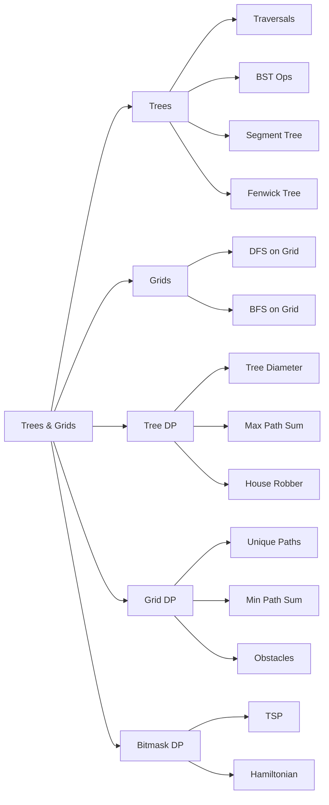

# Chapter 10: Trees, Grids & Dynamic Programming

> **Prerequisites:** [Chapter 9: Dynamic Programming — Sequences](./09-dp-sequences.md) — DP recurrences for chain structures | **Next:** [Chapter 11: Shortest Paths & MST](./11-shortest-paths-mst.md) — Graph algorithms with DP foundations

## Learning Objectives

By the end of this chapter, students will be able to:

1. Implement and analyze binary tree traversals (inorder, preorder, postorder, level-order).
2. Perform BST operations (search, insert, delete) and understand their complexity.
3. Build and query segment trees and Fenwick trees for range queries.
4. Traverse grids using DFS and BFS for path-finding problems.
5. Solve DP problems on trees: tree diameter, maximum path sum, tree DP with states.
6. Solve DP problems on grids: unique paths, minimum path sum, DP with obstacles.
7. Apply DP with bitmasking for state-space problems (traveling salesman, Hamiltonian paths).

---

## Why Trees and Grids Matter

**Trees** are everywhere in computing. Your computer's **file system** is a tree — each folder branches into subfolders and files. When you type `ls -R`, you are performing a depth-first traversal of a tree. When you search for a program in your Start Menu, you are walking a tree. The **Document Object Model (DOM)** that renders every web page is a tree. Compilers parse source code into an **Abstract Syntax Tree (AST)** before generating machine code. Social networks recommend friends using tree-like **hierarchical clustering**. Every time you see a hierarchy, you are looking at a tree.

**Grids** are how computers see the world. Every **digital image** is a grid of pixels. **Satellite imagery**, **medical MRI scans**, and **game maps** are all grids. When your GPS calculates a route, it is running path-finding on a grid representation of the road network. When a robot vacuums your floor, it traverses a grid of your room. **Spreadsheets** are grids. **Convolutional neural networks (CNNs)** that power computer vision slide windows across image grids. Understanding grid algorithms is understanding how computers process visual and spatial data.

Trees and grids together form the backbone of **90% of DSA interview problems** and **countless real-world systems**. Mastering them is non-negotiable.

---

## Part 1: Trees — Fundamentals

### What is a Tree?

A **tree** is a hierarchical data structure consisting of nodes connected by edges, with the following properties:
- A single **root** node with no parent.
- Every node has zero or more **child** nodes.
- No cycles exist (it is an acyclic connected graph).
- In a **binary tree**, each node has at most two children: left and right.

```
        1 ← root
       / \
      2   3
     / \   \
    4   5   6
           /
          7
```

### Tree Terminology

| Term | Definition |
|------|------------|
| **Root** | Topmost node with no parent |
| **Leaf** | Node with no children (4, 5, 7) |
| **Parent** | Direct ancestor of a node (2 is parent of 4, 5) |
| **Child** | Direct descendant of a node |
| **Subtree** | A node and all its descendants |
| **Height** | Longest path from root to a leaf (edges) |
| **Depth** | Distance from root to a node (edges) |
| **Level** | All nodes at the same depth |

---

### Binary Tree Traversals

Traversals visit every node in a specific order — the order determines the algorithm's behavior.

#### 1. Inorder Traversal (Left → Root → Right)

**Real-World Analogy:** Reading a dictionary in alphabetical order — you read the left page first, then the current page, then the right page. In a BST, inorder traversal gives sorted output.

**Algorithm Steps:**
1. Recursively traverse the left subtree.
2. Visit the current node.
3. Recursively traverse the right subtree.

**Pseudocode:**
```
INORDER(node):
    if node == null: return
    INORDER(node.left)
    visit(node)
    INORDER(node.right)
```

**Dry Run:** Tree = [1, 2, 3, 4, 5]

```
        1
       / \
      2   3
     / \
    4   5
```

| Step | Node | Action | Call Stack | Visited |
|------|------|--------|------------|---------|
| 1 | 1 | Go left | [1] | [] |
| 2 | 2 | Go left | [1, 2] | [] |
| 3 | 4 | 4.left=null, visit 4 | [1, 2] | [4] |
| 4 | 4 | 4.right=null, return | [1, 2] | [4] |
| 5 | 2 | Visit 2 | [1] | [4, 2] |
| 6 | 2 | Go right | [1] | [4, 2] |
| 7 | 5 | 5.left=null, visit 5 | [1] | [4, 2, 5] |
| 8 | 5 | 5.right=null, return | [1] | [4, 2, 5] |
| 9 | 1 | Visit 1 | [] | [4, 2, 5, 1] |
| 10 | 1 | Go right | [] | [4, 2, 5, 1] |
| 11 | 3 | 3.left=null, visit 3 | [] | [4, 2, 5, 1, 3] |
| 12 | 3 | 3.right=null, return | [] | [4, 2, 5, 1, 3] |

**Result:** `4, 2, 5, 1, 3`

**C++ Implementation:**
```cpp
struct Node {
    int data;
    Node* left;
    Node* right;
    Node(int val) : data(val), left(nullptr), right(nullptr) {}
};

void inorder(Node* root) {
    if (root == nullptr) return;
    inorder(root->left);
    cout << root->data << " ";
    inorder(root->right);
}
```

**Python Implementation:**
```python
def inorder(root):
    if root is None:
        return
    inorder(root.left)
    print(root.data, end=" ")
    inorder(root.right)
```

**Java Implementation:**
```java
void inorder(Node root) {
    if (root == null) return;
    inorder(root.left);
    System.out.print(root.data + " ");
    inorder(root.right);
}
```

**Complexity:**
- **Time:** O(n) — every node is visited exactly once.
- **Space:** O(h) where h is tree height — recursion stack depth. Worst case O(n) for a skewed tree.

**Advantages:** Naturally produces sorted order in BSTs; simple recursive implementation.
**Disadvantages:** Recursive stack may overflow for deep trees; iterative version requires explicit stack.

**Edge Cases:** Empty tree — returns immediately. Single node — visits and returns.

---

#### 2. Preorder Traversal (Root → Left → Right)

**Real-World Analogy:** Copying a directory structure — you create the current folder first, then recursively copy subfolders. Used by `cp -R` internally.

**Algorithm Steps:**
1. Visit the current node.
2. Recursively traverse the left subtree.
3. Recursively traverse the right subtree.

**Pseudocode:**
```
PREORDER(node):
    if node == null: return
    visit(node)
    PREORDER(node.left)
    PREORDER(node.right)
```

**Dry Run:** Same tree [1, 2, 3, 4, 5]

| Step | Node | Action | Call Stack | Visited |
|------|------|--------|------------|---------|
| 1 | 1 | Visit 1, go left | [1] | [1] |
| 2 | 2 | Visit 2, go left | [1, 2] | [1, 2] |
| 3 | 4 | Visit 4 | [1, 2] | [1, 2, 4] |
| 4 | 4 | 4.left=null, return | [1, 2] | [1, 2, 4] |
| 5 | 2 | Go right | [1] | [1, 2, 4] |
| 6 | 5 | Visit 5 | [1] | [1, 2, 4, 5] |
| 7 | 5 | return | [1] | [1, 2, 4, 5] |
| 8 | 1 | Go right | [] | [1, 2, 4, 5] |
| 9 | 3 | Visit 3 | [] | [1, 2, 4, 5, 3] |

**Result:** `1, 2, 4, 5, 3`

**C++ Implementation:**
```cpp
void preorder(Node* root) {
    if (root == nullptr) return;
    cout << root->data << " ";
    preorder(root->left);
    preorder(root->right);
}
```

**Python Implementation:**
```python
def preorder(root):
    if root is None: return
    print(root.data, end=" ")
    preorder(root.left)
    preorder(root.right)
```

**Java Implementation:**
```java
void preorder(Node root) {
    if (root == null) return;
    System.out.print(root.data + " ");
    preorder(root.left);
    preorder(root.right);
}
```

**Complexity:** O(n) time, O(h) space.

**Advantages:** Creates a copy of the tree; root is visited first — useful for serialization.
**Disadvantages:** Does not give sorted order; same recursion depth concerns.

**Edge Cases:** Skewed tree degenerates to linked-list traversal with O(n) stack space.

---

#### 3. Postorder Traversal (Left → Right → Root)

**Real-World Analogy:** Deleting a directory — you must delete all files inside before removing the folder. Used by `rm -rf`.

**Algorithm Steps:**
1. Recursively traverse the left subtree.
2. Recursively traverse the right subtree.
3. Visit the current node.

**Pseudocode:**
```
POSTORDER(node):
    if node == null: return
    POSTORDER(node.left)
    POSTORDER(node.right)
    visit(node)
```

**Dry Run:** Same tree

| Step | Node | Action | Call Stack | Visited |
|------|------|--------|------------|---------|
| 1 | 1 | Go left | [1] | [] |
| 2 | 2 | Go left | [1, 2] | [] |
| 3 | 4 | 4.left=null, go right | [1, 2, 4] | [] |
| 4 | 4 | Visit 4, return | [1, 2] | [4] |
| 5 | 2 | Go right | [1] | [4] |
| 6 | 5 | 5.left=null, go right | [1, 5] | [4] |
| 7 | 5 | Visit 5, return | [1] | [4, 5] |
| 8 | 2 | Visit 2 | [1] | [4, 5, 2] |
| 9 | 1 | Go right | [] | [4, 5, 2] |
| 10 | 3 | 3.left=null, go right | [3] | [4, 5, 2] |
| 11 | 3 | Visit 3, return | [] | [4, 5, 2, 3] |
| 12 | 1 | Visit 1 | [] | [4, 5, 2, 3, 1] |

**Result:** `4, 5, 2, 3, 1`

**C++ Implementation:**
```cpp
void postorder(Node* root) {
    if (root == nullptr) return;
    postorder(root->left);
    postorder(root->right);
    cout << root->data << " ";
}
```

**Python Implementation:**
```python
def postorder(root):
    if root is None: return
    postorder(root.left)
    postorder(root.right)
    print(root.data, end=" ")
```

**Java Implementation:**
```java
void postorder(Node root) {
    if (root == null) return;
    postorder(root.left);
    postorder(root.right);
    System.out.print(root.data + " ");
}
```

**Complexity:** O(n) time, O(h) space.

**Advantages:** Children processed before parent — essential for tree deletion and tree DP.
**Disadvantages:** Root is last — cannot be used for search-based operations.

**Edge Cases:** Perfect binary tree — balanced recursion stack of O(log n).

---

#### 4. Level-Order Traversal (BFS)

**Real-World Analogy:** Broadcasting a message through a company hierarchy — the CEO tells VPs, who tell directors, who tell managers — everyone on the same level is informed at the same time.

**Algorithm Steps:**
1. Initialize a queue with the root node.
2. While queue is not empty:
   a. Dequeue front node.
   b. Visit the node.
   c. Enqueue its left child (if exists).
   d. Enqueue its right child (if exists).

**Pseudocode:**
```
LEVEL_ORDER(root):
    if root == null: return
    queue = [root]
    while queue is not empty:
        node = queue.dequeue()
        visit(node)
        if node.left != null: queue.enqueue(node.left)
        if node.right != null: queue.enqueue(node.right)
```

**Dry Run:** Same tree

| Step | Queue (front → back) | Dequeue | Visited |
|------|----------------------|---------|---------|
| 1 | [1] | — | [] |
| 2 | [2, 3] | 1 | [1] |
| 3 | [3, 4, 5] | 2 | [1, 2] |
| 4 | [4, 5] | 3 | [1, 2, 3] |
| 5 | [5] | 4 | [1, 2, 3, 4] |
| 6 | [] | 5 | [1, 2, 3, 4, 5] |

**Result:** `1, 2, 3, 4, 5`

**C++ Implementation:**
```cpp
#include <queue>
void levelOrder(Node* root) {
    if (root == nullptr) return;
    queue<Node*> q;
    q.push(root);
    while (!q.empty()) {
        Node* curr = q.front(); q.pop();
        cout << curr->data << " ";
        if (curr->left) q.push(curr->left);
        if (curr->right) q.push(curr->right);
    }
}
```

**Python Implementation:**
```python
from collections import deque
def level_order(root):
    if root is None: return
    q = deque([root])
    while q:
        curr = q.popleft()
        print(curr.data, end=" ")
        if curr.left: q.append(curr.left)
        if curr.right: q.append(curr.right)
```

**Java Implementation:**
```java
void levelOrder(Node root) {
    if (root == null) return;
    Queue<Node> q = new LinkedList<>();
    q.add(root);
    while (!q.isEmpty()) {
        Node curr = q.poll();
        System.out.print(curr.data + " ");
        if (curr.left != null) q.add(curr.left);
        if (curr.right != null) q.add(curr.right);
    }
}
```

**Complexity:**
- **Time:** O(n) — each node enters and leaves the queue once.
- **Space:** O(n) — queue holds at most one level's worth of nodes. Worst case O(n) for a complete tree's bottom level.

**Advantages:** Finds shortest path in unweighted trees; no recursion stack overflow.
**Disadvantages:** Uses more memory than recursive traversals for deep trees.

**Edge Cases:** Skewed tree — queue holds at most 1 node. Empty tree — immediate return.

---

### Binary Search Tree (BST) Operations

A BST is a binary tree where for every node: all values in the left subtree are less, and all values in the right subtree are greater.

```
        50
       /  \
      30   70
     / \   / \
    20 40 60 80
```

**Real-World Analogy:** A phonebook — to find "Smith", you open to the middle. If you're past S, go backward; if before S, go forward. Each comparison eliminates half the remaining book.

#### BST Search

**Algorithm Steps:**
1. Start at the root.
2. If current node is null, return false (not found).
3. If current node's value equals target, return true.
4. If target < current node's value, search left subtree.
5. Else search right subtree.

**Pseudocode:**
```
BST_SEARCH(root, key):
    if root == null: return false
    if root.data == key: return true
    if key < root.data: return BST_SEARCH(root.left, key)
    else: return BST_SEARCH(root.right, key)
```

**Dry Run:** Search for 60 in the BST above

| Step | Current Node | Comparison | Action |
|------|-------------|------------|--------|
| 1 | 50 | 60 > 50 | Go right |
| 2 | 70 | 60 < 70 | Go left |
| 3 | 60 | 60 == 60 | Found! |

**C++ Implementation:**
```cpp
bool searchBST(Node* root, int key) {
    if (root == nullptr) return false;
    if (root->data == key) return true;
    if (key < root->data) return searchBST(root->left, key);
    return searchBST(root->right, key);
}
```

**Python Implementation:**
```python
def search_bst(root, key):
    if root is None: return False
    if root.data == key: return True
    if key < root.data: return search_bst(root.left, key)
    return search_bst(root.right, key)
```

**Java Implementation:**
```java
boolean searchBST(Node root, int key) {
    if (root == null) return false;
    if (root.data == key) return true;
    if (key < root.data) return searchBST(root.left, key);
    return searchBST(root.right, key);
}
```

**Complexity:** O(h) time, O(h) space. Balanced BST: O(log n). Skewed BST: O(n).

---

#### BST Insert

**Algorithm Steps:**
1. If tree is empty, create a new node and return it as root.
2. If key < current node's value, recursively insert into left subtree.
3. If key > current node's value, recursively insert into right subtree.
4. Return the unchanged node pointer.

**Pseudocode:**
```
BST_INSERT(root, key):
    if root == null: return new Node(key)
    if key < root.data:
        root.left = BST_INSERT(root.left, key)
    else if key > root.data:
        root.right = BST_INSERT(root.right, key)
    return root
```

**Dry Run:** Insert 55 into the BST

| Step | Current Node | Comparison | Action |
|------|-------------|------------|--------|
| 1 | 50 | 55 > 50 | Go right |
| 2 | 70 | 55 < 70 | Go left |
| 3 | 60 | 55 < 60 | Go left |
| 4 | null | — | Insert 55 as left child of 60 |

After: `50 → 70 → 60 → 55`

**C++ Implementation:**
```cpp
Node* insertBST(Node* root, int key) {
    if (root == nullptr) return new Node(key);
    if (key < root->data)
        root->left = insertBST(root->left, key);
    else if (key > root->data)
        root->right = insertBST(root->right, key);
    return root;
}
```

**Python Implementation:**
```python
def insert_bst(root, key):
    if root is None: return Node(key)
    if key < root.data:
        root.left = insert_bst(root.left, key)
    elif key > root.data:
        root.right = insert_bst(root.right, key)
    return root
```

**Java Implementation:**
```java
Node insertBST(Node root, int key) {
    if (root == null) return new Node(key);
    if (key < root.data)
        root.left = insertBST(root.left, key);
    else if (key > root.data)
        root.right = insertBST(root.right, key);
    return root;
}
```

**Complexity:** O(h) time, O(h) space.

---

#### BST Delete

Three cases:
1. **Leaf node:** Simply remove it.
2. **Node with one child:** Replace node with its child.
3. **Node with two children:** Find inorder successor (smallest in right subtree), copy its value, delete successor.

**Algorithm Steps:**
1. Base case: if root is null, return null.
2. Recursively find the node to delete.
3. Apply the appropriate case above.

**Pseudocode:**
```
BST_DELETE(root, key):
    if root == null: return null
    if key < root.data:
        root.left = BST_DELETE(root.left, key)
    else if key > root.data:
        root.right = BST_DELETE(root.right, key)
    else:  // found node to delete
        if root.left == null:  // case 1 & 2
            return root.right
        if root.right == null:  // case 2
            return root.left
        // case 3: two children
        succ = MIN_VALUE(root.right)
        root.data = succ.data
        root.right = BST_DELETE(root.right, succ.data)
    return root

MIN_VALUE(root):
    while root.left != null: root = root.left
    return root
```

**Dry Run:** Delete 50 (root with two children)

| Step | Node | Action |
|------|------|--------|
| 1 | 50 | Found target (case 3) |
| 2 | 50 | Find inorder successor: go right → 70, then left → 60 (no left child) |
| 3 | 50 | Copy 60's value into 50 |
| 4 | — | Delete 60 from right subtree (60 is leaf — case 1) |

After: root becomes 60

```
        60
       /  \
      30   70
     / \    \
    20 40    80
```

**C++ Implementation:**
```cpp
Node* deleteBST(Node* root, int key) {
    if (root == nullptr) return nullptr;
    if (key < root->data)
        root->left = deleteBST(root->left, key);
    else if (key > root->data)
        root->right = deleteBST(root->right, key);
    else {
        if (root->left == nullptr) {
            Node* temp = root->right;
            delete root;
            return temp;
        }
        if (root->right == nullptr) {
            Node* temp = root->left;
            delete root;
            return temp;
        }
        Node* succ = root->right;
        while (succ->left != nullptr) succ = succ->left;
        root->data = succ->data;
        root->right = deleteBST(root->right, succ->data);
    }
    return root;
}
```

**Python Implementation:**
```python
def delete_bst(root, key):
    if root is None: return None
    if key < root.data:
        root.left = delete_bst(root.left, key)
    elif key > root.data:
        root.right = delete_bst(root.right, key)
    else:
        if root.left is None: return root.right
        if root.right is None: return root.left
        succ = root.right
        while succ.left: succ = succ.left
        root.data = succ.data
        root.right = delete_bst(root.right, succ.data)
    return root
```

**Java Implementation:**
```java
Node deleteBST(Node root, int key) {
    if (root == null) return null;
    if (key < root.data)
        root.left = deleteBST(root.left, key);
    else if (key > root.data)
        root.right = deleteBST(root.right, key);
    else {
        if (root.left == null) return root.right;
        if (root.right == null) return root.left;
        Node succ = root.right;
        while (succ.left != null) succ = succ.left;
        root.data = succ.data;
        root.right = deleteBST(root.right, succ.data);
    }
    return root;
}
```

**Complexity:** O(h) time, O(h) space.

**Advantages of BST:** Sorted data at all times; efficient search/insert/delete in balanced trees.
**Disadvantages:** Degrades to O(n) with unbalanced data; does not support range queries efficiently (use segment tree for that).

**Edge Cases:** Deleting root — handled by case 3. Deleting from empty tree — returns null. Duplicate keys — typically ignored or stored in left/right by convention.

---

### Segment Tree

**Real-World Analogy:** An organization's expense report breakdown — instead of summing all receipts each time, the accounting department keeps precomputed subtotals by department, by team, by project. A query for "total expenses from departments A–C" just adds three subtotals instead of scanning every receipt.

A **segment tree** is a binary tree that stores interval/segment information. It enables answering range queries (sum, min, max) and updating elements in **O(log n)** time.

**Structure:** For an array of size n, the segment tree has ~4n nodes. Leaf nodes store array elements. Internal nodes store the aggregated value (sum/min/max) of their children.

**Algorithm Steps (Build):**
1. If the segment has one element (leaf), store that element.
2. Recursively build left and right halves.
3. Internal node stores the fusion of left and right children.

**Algorithm Steps (Query):**
1. If the query range fully covers the current segment, return this node's value.
2. If there is no overlap, return identity (0 for sum, INF for min, -INF for max).
3. If partial overlap, recurse on both children and combine results.

**Algorithm Steps (Update):**
1. If leaf node, update its value.
2. Else, recurse on the relevant child.
3. Recompute current node's value from children.

**Pseudocode:**
```
BUILD(node, start, end):
    if start == end:
        tree[node] = arr[start]
    else:
        mid = (start + end) / 2
        BUILD(2*node, start, mid)
        BUILD(2*node+1, mid+1, end)
        tree[node] = tree[2*node] + tree[2*node+1]

QUERY(node, start, end, l, r):
    if r < start OR end < l: return 0       // no overlap
    if l <= start AND end <= r: return tree[node]  // full overlap
    mid = (start + end) / 2
    leftSum = QUERY(2*node, start, mid, l, r)
    rightSum = QUERY(2*node+1, mid+1, end, l, r)
    return leftSum + rightSum

UPDATE(node, start, end, idx, val):
    if start == end:
        tree[node] = val
    else:
        mid = (start + end) / 2
        if idx <= mid: UPDATE(2*node, start, mid, idx, val)
        else: UPDATE(2*node+1, mid+1, end, idx, val)
        tree[node] = tree[2*node] + tree[2*node+1]
```

**Dry Run:** Build segment tree for arr = [1, 3, 5, 7]

```
Tree structure (0-indexed, node 1 = root):

Level 0:            [1,3,5,7] sum=16 (node 1)
                   /            \
Level 1:    [1,3] sum=4         [5,7] sum=12 (nodes 2, 3)
            /     \              /      \
Level 2:  [1]     [3]        [5]       [7] (nodes 4, 5, 6, 7)
```

| Node | Range | Value | Children |
|------|-------|-------|----------|
| 1 | [0-3] | 16 | 2 (left), 3 (right) |
| 2 | [0-1] | 4 | 4 (left), 5 (right) |
| 3 | [2-3] | 12 | 6 (left), 7 (right) |
| 4 | [0-0] | 1 | — |
| 5 | [1-1] | 3 | — |
| 6 | [2-2] | 5 | — |
| 7 | [3-3] | 7 | — |

**Query sum [1-2]:** Start at root (1). Partial overlap → go to node 2 (range [0-1], partial) and node 3 (range [2-3], partial). Node 2: partial → go to node 4 ([0-0], no overlap → 0) and node 5 ([1-1], full overlap → 3). Node 3: partial → go to node 6 ([2-2], full overlap → 5) and node 7 ([3-3], no overlap → 0). Result = 3 + 5 = 8.

**C++ Implementation:**
```cpp
class SegmentTree {
    vector<int> tree, arr;
    int n;
public:
    SegmentTree(vector<int>& input) : arr(input), n(input.size()) {
        tree.resize(4 * n);
        build(1, 0, n - 1);
    }
    void build(int node, int start, int end) {
        if (start == end) { tree[node] = arr[start]; return; }
        int mid = (start + end) / 2;
        build(node * 2, start, mid);
        build(node * 2 + 1, mid + 1, end);
        tree[node] = tree[node * 2] + tree[node * 2 + 1];
    }
    int query(int l, int r) { return query(1, 0, n - 1, l, r); }
    int query(int node, int start, int end, int l, int r) {
        if (r < start || end < l) return 0;
        if (l <= start && end <= r) return tree[node];
        int mid = (start + end) / 2;
        return query(node * 2, start, mid, l, r) +
               query(node * 2 + 1, mid + 1, end, l, r);
    }
    void update(int idx, int val) { update(1, 0, n - 1, idx, val); }
    void update(int node, int start, int end, int idx, int val) {
        if (start == end) { tree[node] = val; return; }
        int mid = (start + end) / 2;
        if (idx <= mid) update(node * 2, start, mid, idx, val);
        else update(node * 2 + 1, mid + 1, end, idx, val);
        tree[node] = tree[node * 2] + tree[node * 2 + 1];
    }
};
```

**Python Implementation:**
```python
class SegmentTree:
    def __init__(self, arr):
        self.n = len(arr)
        self.tree = [0] * (4 * self.n)
        self._build(arr, 1, 0, self.n - 1)

    def _build(self, arr, node, start, end):
        if start == end:
            self.tree[node] = arr[start]
            return
        mid = (start + end) // 2
        self._build(arr, node * 2, start, mid)
        self._build(arr, node * 2 + 1, mid + 1, end)
        self.tree[node] = self.tree[node * 2] + self.tree[node * 2 + 1]

    def query(self, l, r):
        return self._query(1, 0, self.n - 1, l, r)

    def _query(self, node, start, end, l, r):
        if r < start or end < l: return 0
        if l <= start and end <= r: return self.tree[node]
        mid = (start + end) // 2
        return (self._query(node * 2, start, mid, l, r) +
                self._query(node * 2 + 1, mid + 1, end, l, r))

    def update(self, idx, val):
        self._update(1, 0, self.n - 1, idx, val)

    def _update(self, node, start, end, idx, val):
        if start == end:
            self.tree[node] = val
            return
        mid = (start + end) // 2
        if idx <= mid:
            self._update(node * 2, start, mid, idx, val)
        else:
            self._update(node * 2 + 1, mid + 1, end, idx, val)
        self.tree[node] = self.tree[node * 2] + self.tree[node * 2 + 1]
```

**Java Implementation:**
```java
class SegmentTree {
    int[] tree, arr;
    int n;

    SegmentTree(int[] input) {
        arr = input; n = input.length;
        tree = new int[4 * n];
        build(1, 0, n - 1);
    }

    void build(int node, int start, int end) {
        if (start == end) { tree[node] = arr[start]; return; }
        int mid = (start + end) / 2;
        build(node * 2, start, mid);
        build(node * 2 + 1, mid + 1, end);
        tree[node] = tree[node * 2] + tree[node * 2 + 1];
    }

    int query(int l, int r) { return query(1, 0, n - 1, l, r); }

    int query(int node, int start, int end, int l, int r) {
        if (r < start || end < l) return 0;
        if (l <= start && end <= r) return tree[node];
        int mid = (start + end) / 2;
        return query(node * 2, start, mid, l, r) +
               query(node * 2 + 1, mid + 1, end, l, r);
    }

    void update(int idx, int val) { update(1, 0, n - 1, idx, val); }

    void update(int node, int start, int end, int idx, int val) {
        if (start == end) { tree[node] = val; return; }
        int mid = (start + end) / 2;
        if (idx <= mid) update(node * 2, start, mid, idx, val);
        else update(node * 2 + 1, mid + 1, end, idx, val);
        tree[node] = tree[node * 2] + tree[node * 2 + 1];
    }
}
```

**Complexity:**
- **Build:** O(n) — each node is computed once, total ~2n nodes.
- **Query:** O(log n) — at most 4 nodes per level are visited.
- **Update:** O(log n) — one path from root to leaf.

**Why O(log n) for query?** Each query splits the range until full coverage or no overlap. The levels of the tree = log n. At each level, at most 2 nodes are partially overlapped. Thus ~4 log n node visits.

**Advantages:** Fast range queries with point updates; versatile (sum, min, max, gcd).
**Disadvantages:** Complex to implement; 4n memory overhead; lazy propagation needed for range updates.

**Edge Cases:** n = 0 → empty tree. n = 1 → tree has 1 leaf. Query on invalid range (l > r) → undefined.

---

### Fenwick Tree (Binary Indexed Tree)

**Real-World Analogy:** A library's book counter — instead of recounting all shelves every time, each librarian keeps a running count for their section. The head librarian combines a few section counts to answer "how many books on shelves 1–15?" without scanning every shelf.

A **Fenwick Tree** is a simpler alternative to the segment tree for **prefix sum queries and point updates**. It uses **O(n)** space and has simpler implementation.

**Core Idea:** Each index i stores the sum of a range ending at i. The range length is determined by the least significant set bit (LSB): `i & -i`.

**Algorithm Steps (Build):**
1. Initialize BIT array of size n+1 (1-indexed) with zeros.
2. For each element arr[i], call `update(i, arr[i])`.

**Algorithm Steps (Query Prefix Sum):**
1. Initialize sum = 0.
2. While i > 0: sum += BIT[i], i -= i & -i.
3. Return sum.

**Algorithm Steps (Range Sum):**
Sum(l, r) = prefixSum(r) - prefixSum(l-1).

**Algorithm Steps (Point Update):**
1. While i <= n: BIT[i] += delta, i += i & -i.

**Pseudocode:**
```
BUILD(arr, n):
    BIT = array of size n+1 initialized to 0
    for i = 1 to n:
        BIT[i] += arr[i-1]    // convert to 1-indexed
        j = i + (i & -i)
        if j <= n: BIT[j] += BIT[i]

PREFIX_SUM(i):
    sum = 0
    while i > 0:
        sum += BIT[i]
        i -= i & -i
    return sum

RANGE_SUM(l, r):
    return PREFIX_SUM(r) - PREFIX_SUM(l-1)

UPDATE(i, delta):
    while i <= n:
        BIT[i] += delta
        i += i & -i
```

**Dry Run:** Build Fenwick tree for arr = [1, 3, 5, 7]

| Index | arr[i] | Binary | i & -i | BIT[i] stores sum of range |
|-------|--------|--------|--------|---------------------------|
| 1 | 1 | 001 | 1 | [1] → 1 |
| 2 | 3 | 010 | 2 | [1-2] → 1+3 = 4 |
| 3 | 5 | 011 | 1 | [3] → 5 |
| 4 | 7 | 100 | 4 | [1-4] → 1+3+5+7 = 16 |

BIT array: [0, 1, 4, 5, 16] (index 0 unused)

**Query prefix sum up to index 3:** i=3 → sum += BIT[3]=5 → i=3-1=2 → sum += BIT[2]=4 → i=2-2=0. Sum = 5+4 = 9. Correct: 1+3+5 = 9.

**Update index 2 by +2 (arr[2] becomes 5):**
- i=2: BIT[2] += 2 (4→6), i += 2 (i=4)
- i=4: BIT[4] += 2 (16→18), i += 4 (i=8), done

BIT becomes: [0, 1, 6, 5, 18]

**C++ Implementation:**
```cpp
class FenwickTree {
    vector<int> bit;
    int n;
public:
    FenwickTree(int size) : n(size), bit(size + 1, 0) {}
    FenwickTree(vector<int>& arr) : n(arr.size()), bit(arr.size() + 1, 0) {
        for (int i = 0; i < n; ++i) update(i + 1, arr[i]);
    }
    void update(int idx, int delta) {
        while (idx <= n) { bit[idx] += delta; idx += idx & -idx; }
    }
    int prefixSum(int idx) {
        int sum = 0;
        while (idx > 0) { sum += bit[idx]; idx -= idx & -idx; }
        return sum;
    }
    int rangeSum(int l, int r) { return prefixSum(r) - prefixSum(l - 1); }
};
```

**Python Implementation:**
```python
class FenwickTree:
    def __init__(self, arr=None, n=0):
        if arr is not None:
            self.n = len(arr)
            self.bit = [0] * (self.n + 1)
            for i, val in enumerate(arr, 1):
                self.update(i, val)
        else:
            self.n = n
            self.bit = [0] * (n + 1)

    def update(self, idx, delta):
        while idx <= self.n:
            self.bit[idx] += delta
            idx += idx & -idx

    def prefix_sum(self, idx):
        s = 0
        while idx > 0:
            s += self.bit[idx]
            idx -= idx & -idx
        return s

    def range_sum(self, l, r):
        return self.prefix_sum(r) - self.prefix_sum(l - 1)
```

**Java Implementation:**
```java
class FenwickTree {
    int[] bit;
    int n;

    FenwickTree(int size) {
        n = size;
        bit = new int[n + 1];
    }

    FenwickTree(int[] arr) {
        n = arr.length;
        bit = new int[n + 1];
        for (int i = 0; i < n; i++) update(i + 1, arr[i]);
    }

    void update(int idx, int delta) {
        while (idx <= n) { bit[idx] += delta; idx += idx & -idx; }
    }

    int prefixSum(int idx) {
        int sum = 0;
        while (idx > 0) { sum += bit[idx]; idx -= idx & -idx; }
        return sum;
    }

    int rangeSum(int l, int r) { return prefixSum(r) - prefixSum(l - 1); }
}
```

**Complexity:**
- **Build:** O(n log n) naively, O(n) with optimized construction.
- **Query:** O(log n) — at most log n steps since each step clears the LSB.
- **Update:** O(log n).
- **Space:** O(n).

**Why update works:** `idx += idx & -idx` jumps from a node to its parent in the BIT tree. The LSB gives the range size. For idx=3 (011), LSB=1 → parent=4 (100). For idx=4 (100), LSB=4 → parent=8 (1000). This linking creates a tree where each node covers a power-of-2 sized range.

**Advantages:** Simpler than segment tree; lower constant factor; less memory.
**Disadvantages:** Only works for prefix-sum operations; cannot handle range updates without modification; requires 1-indexed array.

**Edge Cases:** n = 0 → empty. Query at index 0 → returns 0. Negative delta values for decrements.

---

## Part 2: Grids — Fundamentals

### What is a Grid?

A **grid** is a 2D matrix of cells, where each cell has coordinates (row, column). Grids represent spatial data — images, maps, game boards.

```
(0,0)  (0,1)  (0,2)
(1,0)  (1,1)  (1,2)
(2,0)  (2,1)  (2,2)
```

**Real-World Analogy:** An image is a grid of pixels. Each pixel has an RGB value. Filters (like blur) process neighbors in the grid.

### Grid Traversal: DFS and BFS on a Matrix

**Real-World Analogy (DFS):** Exploring a maze — you take each path as far as it goes before backtracking. You mark visited corridors with chalk.
**Real-World Analogy (BFS):** Flood fill in a paint program — the color spreads outward in concentric rings from where you click.

#### DFS on Grid

**Algorithm Steps:**
1. Start at a given cell (r, c).
2. Mark it as visited.
3. For each of the 4 directions (up, down, left, right):
   a. Compute new cell (nr, nc).
   b. If (nr, nc) is within bounds and not visited, recursively DFS(nr, nc).

**Pseudocode:**
```
DFS_GRID(grid, visited, r, c):
    if out_of_bounds(r, c) OR visited[r][c] OR grid[r][c] == BLOCKED:
        return
    visited[r][c] = true
    process(grid[r][c])
    for each (dr, dc) in [(0,1), (1,0), (0,-1), (-1,0)]:
        DFS_GRID(grid, visited, r+dr, c+dc)
```

**Dry Run:** 3×3 grid, start at (0,0)

Grid:
```
1 2 3
4 5 6
7 8 9
```

| Step | Current | Visited Set | Stack |
|------|---------|-------------|-------|
| 1 | (0,0) | {(0,0)} | [(0,0)] |
| 2 | (0,1) | {(0,0),(0,1)} | [(0,0),(0,1)] |
| 3 | (0,2) | {(0,0),(0,1),(0,2)} | [(0,0),(0,1),(0,2)] |
| 4 | — | No unvisited neighbor at (0,2) | [(0,0),(0,1)] |
| 5 | (1,1) | {(0,0),(0,1),(0,2),(1,1)} | [(0,0),(1,1)] |
| 6 | (1,2) | ... | ... |

Order will depend on neighbor iteration order. With right-first: 1, 2, 3, 6, 9, 8, 5, 4, 7.

**C++ Implementation:**
```cpp
void dfsGrid(vector<vector<int>>& grid, vector<vector<bool>>& vis,
             int r, int c) {
    int m = grid.size(), n = grid[0].size();
    if (r < 0 || r >= m || c < 0 || c >= n || vis[r][c]) return;
    vis[r][c] = true;
    cout << grid[r][c] << " ";
    int dirs[4][2] = {{0,1}, {1,0}, {0,-1}, {-1,0}};
    for (auto& d : dirs)
        dfsGrid(grid, vis, r + d[0], c + d[1]);
}
```

**Python Implementation:**
```python
def dfs_grid(grid, vis, r, c):
    m, n = len(grid), len(grid[0])
    if r < 0 or r >= m or c < 0 or c >= n or vis[r][c]:
        return
    vis[r][c] = True
    print(grid[r][c], end=" ")
    for dr, dc in [(0,1), (1,0), (0,-1), (-1,0)]:
        dfs_grid(grid, vis, r + dr, c + dc)
```

**Java Implementation:**
```java
void dfsGrid(int[][] grid, boolean[][] vis, int r, int c) {
    int m = grid.length, n = grid[0].length;
    if (r < 0 || r >= m || c < 0 || c >= n || vis[r][c]) return;
    vis[r][c] = true;
    System.out.print(grid[r][c] + " ");
    int[][] dirs = {{0,1}, {1,0}, {0,-1}, {-1,0}};
    for (int[] d : dirs)
        dfsGrid(grid, vis, r + d[0], c + d[1]);
}
```

**Complexity:** O(m × n) — every cell visited at most once. Space O(m × n) for visited array + recursion stack.

---

#### BFS on Grid

**Algorithm Steps:**
1. Start at given cell, enqueue it, mark visited.
2. While queue not empty:
   a. Dequeue cell.
   b. Process it.
   c. For each unvisited neighbor, enqueue and mark visited.

**Pseudocode:**
```
BFS_GRID(grid, start_r, start_c):
    queue = [(start_r, start_c)]
    visited[start_r][start_c] = true
    while queue is not empty:
        (r, c) = queue.dequeue()
        process(grid[r][c])
        for each (dr, dc) in directions:
            nr, nc = r+dr, c+dc
            if in_bounds(nr, nc) AND not visited AND not blocked:
                visited[nr][nc] = true
                queue.enqueue((nr, nc))
```

**Dry Run:** 3×3 grid, start at (0,0)

| Step | Queue (front → back) | Dequeue | Processed |
|------|---------------------|---------|-----------|
| 1 | [(0,0)] | — | [] |
| 2 | [(0,1), (1,0)] | (0,0) | [1] |
| 3 | [(1,0), (0,2), (1,1)] | (0,1) | [1, 2] |
| 4 | [(0,2), (1,1), (2,0)] | (1,0) | [1, 2, 4] |
| 5 | [(1,1), (2,0), (1,2)] | (0,2) | [1, 2, 4, 3] |
| 6 | [(2,0), (1,2), (2,1)] | (1,1) | [1, 2, 4, 3, 5] |
| 7 | [(1,2), (2,1), (2,2)] | (2,0) | [1, 2, 4, 3, 5, 7] |
| 8 | [(2,1), (2,2)] | (1,2) | [1, 2, 4, 3, 5, 7, 6] |
| 9 | [(2,2)] | (2,1) | [1, 2, 4, 3, 5, 7, 6, 8] |
| 10 | [] | (2,2) | [1, 2, 4, 3, 5, 7, 6, 8, 9] |

BFS order (if right-then-down): 1, 2, 4, 3, 5, 7, 6, 8, 9 — spreads level by level.

**C++ Implementation:**
```cpp
void bfsGrid(vector<vector<int>>& grid, int sr, int sc) {
    int m = grid.size(), n = grid[0].size();
    vector<vector<bool>> vis(m, vector<bool>(n, false));
    queue<pair<int,int>> q;
    q.push({sr, sc});
    vis[sr][sc] = true;
    int dirs[4][2] = {{0,1}, {1,0}, {0,-1}, {-1,0}};
    while (!q.empty()) {
        auto [r, c] = q.front(); q.pop();
        cout << grid[r][c] << " ";
        for (auto& d : dirs) {
            int nr = r + d[0], nc = c + d[1];
            if (nr >= 0 && nr < m && nc >= 0 && nc < n && !vis[nr][nc]) {
                vis[nr][nc] = true;
                q.push({nr, nc});
            }
        }
    }
}
```

**Python Implementation:**
```python
from collections import deque
def bfs_grid(grid, sr, sc):
    m, n = len(grid), len(grid[0])
    vis = [[False] * n for _ in range(m)]
    q = deque([(sr, sc)])
    vis[sr][sc] = True
    while q:
        r, c = q.popleft()
        print(grid[r][c], end=" ")
        for dr, dc in [(0,1), (1,0), (0,-1), (-1,0)]:
            nr, nc = r + dr, c + dc
            if 0 <= nr < m and 0 <= nc < n and not vis[nr][nc]:
                vis[nr][nc] = True
                q.append((nr, nc))
```

**Java Implementation:**
```java
void bfsGrid(int[][] grid, int sr, int sc) {
    int m = grid.length, n = grid[0].length;
    boolean[][] vis = new boolean[m][n];
    Queue<int[]> q = new LinkedList<>();
    q.add(new int[]{sr, sc});
    vis[sr][sc] = true;
    int[][] dirs = {{0,1}, {1,0}, {0,-1}, {-1,0}};
    while (!q.isEmpty()) {
        int[] cur = q.poll();
        int r = cur[0], c = cur[1];
        System.out.print(grid[r][c] + " ");
        for (int[] d : dirs) {
            int nr = r + d[0], nc = c + d[1];
            if (nr >= 0 && nr < m && nc >= 0 && nc < n && !vis[nr][nc]) {
                vis[nr][nc] = true;
                q.add(new int[]{nr, nc});
            }
        }
    }
}
```

**Complexity:** O(m × n) time and space.

**DFS vs BFS on Grids:**

| Aspect | DFS | BFS |
|--------|-----|-----|
| Order | Depth-first, go as far as possible | Level-by-level, like ripples |
| Data Structure | Stack (recursion) | Queue |
| Shortest Path | No (finds any path) | Yes (finds shortest) |
| Memory | O(depth) — better for deep narrow spaces | O(width) — better for wide shallow spaces |
| Use Case | Topological sort, cycle detection | Shortest path, flood fill |

**Edge Cases for Grid Traversal:**
- **1×1 grid:** Single cell, visited immediately. Both DFS and BFS process it and stop.
- **1×n grid:** Degenerates to a line. DFS recurses n deep. BFS processes in order.
- **Empty grid (0×0):** No operations.
- **All blocked cells:** No movement possible, only start cell is visited.
- **Grid with obstacles:** Both algorithms naturally handle blocked cells by skipping them.

---

## Part 3: Dynamic Programming on Trees

### 10.1 DP on Trees

Trees are naturally recursive: each node can be processed after its children are processed (post-order traversal). Tree DP typically defines a state \( dp[u] \) representing the optimal value for the subtree rooted at \( u \).

**Real-World Analogy:** Company profit calculation — each department reports its profit to its division head, who combines division reports for the regional head, who combines for the CEO. The CEO never visits every employee; reports are aggregated upward.

#### 10.1.1 Tree Diameter

**Problem:** Find the longest path between any two nodes in an undirected tree.

**Approach:** For each node, compute the longest and second-longest path from that node to any leaf in its subtree. The diameter is the maximum over nodes of (longest + second-longest).

**Algorithm Steps:**
1. Perform DFS from any node (say 0).
2. For each node, compute the top 2 heights of its children's subtrees.
3. Update global max with (max1 + max2).
4. Return max1 + 1 as the height from this node upward.

**Pseudocode:**
```
TREE_DIAMETER(n, adj):
    visited = boolean array of size n
    diameter = 0
    function dfs(u):
        visited[u] = true
        max1 = 0, max2 = 0
        for v in adj[u]:
            if not visited[v]:
                height = dfs(v)
                if height > max1:
                    max2 = max1
                    max1 = height
                else if height > max2:
                    max2 = height
        diameter = max(diameter, max1 + max2)
        return max1 + 1
    dfs(0)
    return diameter
```

**Dry Run:**

Tree:
```
    1
   / \
  2   3
 / \   \
4   5   6
        /
       7
```

Adjacency: 1:[2,3], 2:[1,4,5], 3:[1,6], 4:[2], 5:[2], 6:[3,7], 7:[6]

| Step | Node | Action | max1 | max2 | diameter |
|------|------|--------|------|------|----------|
| 1 | dfs(1) | Visit 1 | — | — | 0 |
| 2 | dfs(2) | Visit 2 | — | — | 0 |
| 3 | dfs(4) | Visit 4, leaf → return 1 | — | — | 0 |
| 4 | 2 | Back from 4, height=1 | 1 | 0 | max(0, 1+0)=1 |
| 5 | dfs(5) | Visit 5, leaf → return 1 | — | — | 1 |
| 6 | 2 | Back from 5, height=1 | 1 | 1 | max(1, 1+1)=2 |
| 7 | 2 | Return max1+1 = 2 | — | — | 2 |
| 8 | 1 | Back from 2, height=2 | 2 | 0 | max(2, 2+0)=2 |
| 9 | dfs(3) | Visit 3 | — | — | 2 |
| 10 | dfs(6) | Visit 6 | — | — | 2 |
| 11 | dfs(7) | Visit 7, leaf → return 1 | — | — | 2 |
| 12 | 6 | Back from 7, height=1 | 1 | 0 | 2 |
| 13 | 6 | Return 2 | — | — | 2 |
| 14 | 3 | Back from 6, height=2 | 2 | 0 | max(2, 2+0)=2 |
| 15 | 3 | Return 3 | — | — | 2 |
| 16 | 1 | Back from 3, height=3 | 2 | 2 | max(2, 2+3)=5 |

**Diameter = 5** (path: 4-2-1-3-6-7, exactly 5 edges)

**C++ Implementation:**
```cpp
int treeDiameter(vector<vector<int>>& adj) {
    int n = adj.size(), diameter = 0;
    vector<bool> vis(n, false);
    function<int(int)> dfs = [&](int u) -> int {
        vis[u] = true;
        int max1 = 0, max2 = 0;
        for (int v : adj[u]) {
            if (!vis[v]) {
                int h = dfs(v);
                if (h > max1) { max2 = max1; max1 = h; }
                else if (h > max2) max2 = h;
            }
        }
        diameter = max(diameter, max1 + max2);
        return max1 + 1;
    };
    dfs(0);
    return diameter;
}
```

**Python Implementation:**
```python
def tree_diameter(adj):
    n = len(adj)
    visited = [False] * n
    diameter = 0

    def dfs(u):
        nonlocal diameter
        visited[u] = True
        max1 = max2 = 0
        for v in adj[u]:
            if not visited[v]:
                h = dfs(v)
                if h > max1:
                    max2 = max1
                    max1 = h
                elif h > max2:
                    max2 = h
        diameter = max(diameter, max1 + max2)
        return max1 + 1

    dfs(0)
    return diameter
```

**Java Implementation:**
```java
int diameter = 0;
int treeDiameter(List<List<Integer>> adj) {
    boolean[] vis = new boolean[adj.size()];
    dfs(adj, vis, 0);
    return diameter;
}
int dfs(List<List<Integer>> adj, boolean[] vis, int u) {
    vis[u] = true;
    int max1 = 0, max2 = 0;
    for (int v : adj.get(u)) {
        if (!vis[v]) {
            int h = dfs(adj, vis, v);
            if (h > max1) { max2 = max1; max1 = h; }
            else if (h > max2) max2 = h;
        }
    }
    diameter = Math.max(diameter, max1 + max2);
    return max1 + 1;
}
```

**Complexity:** O(n) time — each edge is traversed twice. O(h) space for recursion stack.

**Why O(n)?** Each node is visited once in DFS. At each node, we check its adjacency list. Total edge examinations = O(n) for a tree (n-1 edges × 2 passes = ∞ but bounded by 2n).

**Advantages:** Single DFS pass, elegant recursive formulation.
**Disadvantages:** Recursion may overflow for deep trees (mitigated by iterative DFS).

**Edge Cases:**
- **Single node:** max1=max2=0, diameter=0. Correct.
- **Two nodes:** height of leaf=1, max1=1, max2=0, diameter=1. Correct.
- **Star tree (1 center with n-1 leaves):** Center gets max1=1, max2=1, diameter=2.

---

#### 10.1.2 Maximum Path Sum (Binary Tree)

**Problem:** Given a binary tree with integer values (possibly negative), find the maximum sum along any path.

**Approach:** For each node, compute:
- `leftGain`: max sum from left child going downward (0 if negative).
- `rightGain`: max sum from right child going downward (0 if negative).
- `currentSum = node.val + leftGain + rightGain` — potential answer.
- Return `node.val + max(leftGain, rightGain)` — the max single-branch path going up.

**Pseudocode:**
```
MAX_PATH_SUM(node):
    if node is null: return 0
    leftGain = max(0, MAX_PATH_SUM(node.left))
    rightGain = max(0, MAX_PATH_SUM(node.right))
    currentSum = node.val + leftGain + rightGain
    globalMax = max(globalMax, currentSum)
    return node.val + max(leftGain, rightGain)
```

**Dry Run:** Tree with values

```
    -10
    / \
   9  20
      / \
     15  7
```

| Step | Node | leftGain | rightGain | currentSum | globalMax | Return |
|------|------|----------|-----------|------------|-----------|--------|
| 1 | 9 | 0 (null) | 0 (null) | 9 | 9 | 9 |
| 2 | 15 | 0 | 0 | 15 | 15 | 15 |
| 3 | 7 | 0 | 0 | 7 | 15 | 7 |
| 4 | 20 | max(0,15)=15 | max(0,7)=7 | 20+15+7=42 | 42 | 20+max(15,7)=35 |
| 5 | -10 | max(0,9)=9 | max(0,35)=35 | -10+9+35=34 | 42 | -10+max(9,35)=25 |

**Maximum path sum = 42** (path: 15 → 20 → 7)

**C++ Implementation:**
```cpp
int maxPathSum(TreeNode* root) {
    int globalMax = INT_MIN;
    function<int(TreeNode*)> dfs = [&](TreeNode* node) -> int {
        if (!node) return 0;
        int leftGain = max(0, dfs(node->left));
        int rightGain = max(0, dfs(node->right));
        globalMax = max(globalMax, node->val + leftGain + rightGain);
        return node->val + max(leftGain, rightGain);
    };
    dfs(root);
    return globalMax;
}
```

**Python Implementation:**
```python
def max_path_sum(root):
    global_max = float('-inf')

    def dfs(node):
        nonlocal global_max
        if node is None: return 0
        left_gain = max(0, dfs(node.left))
        right_gain = max(0, dfs(node.right))
        global_max = max(global_max, node.val + left_gain + right_gain)
        return node.val + max(left_gain, right_gain)

    dfs(root)
    return global_max
```

**Java Implementation:**
```java
int globalMax = Integer.MIN_VALUE;
int maxPathSum(TreeNode root) {
    dfs(root);
    return globalMax;
}
int dfs(TreeNode node) {
    if (node == null) return 0;
    int leftGain = Math.max(0, dfs(node.left));
    int rightGain = Math.max(0, dfs(node.right));
    globalMax = Math.max(globalMax, node.val + leftGain + rightGain);
    return node.val + Math.max(leftGain, rightGain);
}
```

**Complexity:** O(n) — each node visited once. O(h) space.

**Advantages:** Elegant recursive approach with minimal state.
**Disadvantages:** Assumes binary tree (not n-ary).

**Edge Cases:**
- **All negative values:** max(0, child) ensures we ignore negative children. A single node will be the answer.
- **Single node:** Returns its value.
- **Linear tree (skewed):** Works correctly, max1/max2 pattern handles one-sided paths.

---

#### 10.1.3 Tree DP with States (House Robber III)

**Problem:** Given a binary tree, select a set of nodes such that no two adjacent nodes are selected, maximizing the sum of values.

**Real-World Analogy:** A bank security system where you cannot arm two adjacent floors at the same time (they share electrical wiring). Each floor has a value. Maximize coverage without triggering alarms.

**State:** For each node, compute two values:
- \( dp[u][0] \): maximum sum for the subtree when \( u \) is NOT selected.
- \( dp[u][1] \): maximum sum for the subtree when \( u \) IS selected.

**Recurrence:**
\[
\begin{aligned}
dp[u][0] &= \sum_{v \in \text{children}(u)} \max(dp[v][0], dp[v][1]) \\
dp[u][1] &= \text{val}(u) + \sum_{v \in \text{children}(u)} dp[v][0]
\end{aligned}
\]

**Algorithm Steps:**
1. If node is null, return [0, 0].
2. Recursively compute left pair and right pair.
3. `notRob = max(left[0], left[1]) + max(right[0], right[1])`.
4. `rob = node.val + left[0] + right[0]`.
5. Return [notRob, rob].

**Pseudocode:**
```
ROB(root):
    if root == null: return [0, 0]
    left = ROB(root.left)
    right = ROB(root.right)
    notRob = max(left[0], left[1]) + max(right[0], right[1])
    rob = root.val + left[0] + right[0]
    return [notRob, rob]

Answer: max(ROB(root)[0], ROB(root)[1])
```

**Dry Run:**

```
    3
   / \
  2   3
   \   \
    3   1
```

| Node | left | right | notRob | rob | Return |
|------|------|-------|--------|-----|--------|
| 3 (leaf) | [0,0] | [0,0] | 0+0=0 | 3+0+0=3 | [0, 3] |
| 1 (leaf) | [0,0] | [0,0] | 0+0=0 | 1+0+0=1 | [0, 1] |
| 2 | [0,3] | [0,0] | max(0,3)+0=3 | 2+0+0=2 | [3, 2] |
| 3 (right) | [0,0] | [0,1] | 0+max(0,1)=1 | 3+0+0=3 | [1, 3] |
| 3 (root) | [3,2] | [1,3] | max(3,2)+max(1,3)=3+3=6 | 3+3+1=7 | [6, 7] |

Answer = max(6, 7) = 7 (rob root=3 + left child's child=3 + right child's child=1)

**C++ Implementation:**
```cpp
pair<int,int> robSub(TreeNode* node) {
    if (!node) return {0, 0};
    auto left = robSub(node->left);
    auto right = robSub(node->right);
    int notRob = max(left.first, left.second) + max(right.first, right.second);
    int rob = node->val + left.first + right.first;
    return {notRob, rob};
}
int rob(TreeNode* root) {
    auto res = robSub(root);
    return max(res.first, res.second);
}
```

**Python Implementation:**
```python
def rob(root):
    def dfs(node):
        if node is None: return (0, 0)
        left = dfs(node.left)
        right = dfs(node.right)
        not_rob = max(left) + max(right)
        rob = node.val + left[0] + right[0]
        return (not_rob, rob)

    result = dfs(root)
    return max(result)
```

**Java Implementation:**
```java
int[] robSub(TreeNode node) {
    if (node == null) return new int[]{0, 0};
    int[] left = robSub(node.left);
    int[] right = robSub(node.right);
    int notRob = Math.max(left[0], left[1]) + Math.max(right[0], right[1]);
    int rob = node.val + left[0] + right[0];
    return new int[]{notRob, rob};
}
int rob(TreeNode root) {
    int[] res = robSub(root);
    return Math.max(res[0], res[1]);
}
```

**Complexity:** O(n) time — each node visited once. O(h) space.

**Advantages:** Elegant two-state DP that naturally fits tree structure.
**Disadvantages:** Only works for the specific constraint of "no adjacent nodes."

**Edge Cases:**
- **Empty tree:** Returns 0.
- **Single node:** notRob=0, rob=val, answer=val.
- **Tree with all equal values:** Still works, but answer is val × floor((height+1)/2).

> **Pro Tip:** Tree DP always uses post-order DFS — compute children's DP values before the parent's. For the diameter, track the top 2 heights at each node. For state-based problems like House Robber, use dp[u][selected] / dp[u][not_selected] pairs.

> **Remember:** In tree DP, the global answer may merge values from different subtrees (as in diameter = max1 + max2). Track a global variable alongside the per-node return value.

**One-Sentence Takeaway:** Tree DP combines post-order DFS recursion with per-node states, solving problems like tree diameter and maximum path sum in O(n) time.

---

## Part 4: Dynamic Programming on Grids

### 10.2 DP on Grids

Grid DP involves traversing a 2D array from one corner to another, making moves (right, down, diagonal). The DP state represents the value at position (i, j).

**Real-World Analogy:** A warehouse robot moving from the receiving dock to the shipping bay, always moving right or down (never backward). Each cell has a handling cost. The DP finds the cheapest route without the robot needing to backtrack.

#### 10.2.1 Unique Paths

**Problem:** Count the number of ways to travel from the top-left corner to the bottom-right corner of an m × n grid, moving only right or down.

**Recurrence:**
\[
dp[i][j] = dp[i-1][j] + dp[i][j-1]
\]
with \( dp[0][*] = dp[*][0] = 1 \).

**Optimal Substructure Proof:** Any path to (i,j) arrives either from above (i-1,j) or from the left (i,j-1). The number of ways to reach (i,j) is the sum of ways to reach its two predecessors. No other paths exist since moves are only right/down.

**Algorithm Steps:**
1. Create dp[m][n] initialized to 0.
2. Fill first row and first column with 1 (only one way to reach them).
3. For i from 1 to m-1, for j from 1 to n-1:
   dp[i][j] = dp[i-1][j] + dp[i][j-1].
4. Return dp[m-1][n-1].

**Dry Run:** 3×3 grid (m=3, n=3)

| dp | j=0 | j=1 | j=2 |
|----|-----|-----|-----|
| i=0 | 1 | 1 | 1 |
| i=1 | 1 | 1+1=2 | 2+1=3 |
| i=2 | 1 | 2+1=3 | 3+3=6 |

Result: **6 unique paths**

**C++ Implementation:**
```cpp
int uniquePaths(int m, int n) {
    vector<vector<int>> dp(m, vector<int>(n, 1));
    for (int i = 1; i < m; ++i)
        for (int j = 1; j < n; ++j)
            dp[i][j] = dp[i-1][j] + dp[i][j-1];
    return dp[m-1][n-1];
}
```

**Python Implementation:**
```python
def unique_paths(m, n):
    dp = [[1] * n for _ in range(m)]
    for i in range(1, m):
        for j in range(1, n):
            dp[i][j] = dp[i-1][j] + dp[i][j-1]
    return dp[m-1][n-1]
```

**Java Implementation:**
```java
int uniquePaths(int m, int n) {
    int[][] dp = new int[m][n];
    for (int i = 0; i < m; i++) dp[i][0] = 1;
    for (int j = 0; j < n; j++) dp[0][j] = 1;
    for (int i = 1; i < m; i++)
        for (int j = 1; j < n; j++)
            dp[i][j] = dp[i-1][j] + dp[i][j-1];
    return dp[m-1][n-1];
}
```

**Space-Optimized Version:**
```cpp
int uniquePaths(int m, int n) {
    vector<int> dp(n, 1);
    for (int i = 1; i < m; ++i)
        for (int j = 1; j < n; ++j)
            dp[j] += dp[j-1];
    return dp[n-1];
}
```

**Complexity:** O(m×n) time, O(n) space (optimized).

**Why DP works here:** The problem has overlapping subproblems — the number of ways to reach (i,j) depends on two subproblems that themselves depend on smaller subproblems. A combinatorial solution also exists: C(m+n-2, m-1).

**Advantages:** Simple recurrence; easily modifiable for obstacles.
**Disadvantages:** Space can be high without optimization; only handles right/down moves.

**Edge Cases:**
- **1×1 grid:** Only 1 way (already there).
- **1×n or m×1 grid:** Only 1 way (straight line).
- **Large m,n:** dp values overflow — use long long.

---

#### 10.2.2 Minimum Path Sum

**Problem:** Given an m × n grid of non-negative integers, find the minimum sum along a path from top-left to bottom-right (moving only right or down).

**Recurrence:**
\[
dp[i][j] = \text{grid}[i][j] + \min(dp[i-1][j], dp[i][j-1])
\]

**Algorithm Steps:**
1. Initialize dp[0][0] = grid[0][0].
2. Fill first row: dp[0][j] = grid[0][j] + dp[0][j-1] (can only come from left).
3. Fill first column: dp[i][0] = grid[i][0] + dp[i-1][0] (can only come from above).
4. For i from 1 to m-1, for j from 1 to n-1:
   dp[i][j] = grid[i][j] + min(dp[i-1][j], dp[i][j-1]).
5. Return dp[m-1][n-1].

**Dry Run:** Grid = [[1,3,1],[1,5,1],[4,2,1]]

Initial grid:
| 1 | 3 | 1 |
|---|---|---|
| 1 | 5 | 1 |
| 4 | 2 | 1 |

DP table:
| i\j | j=0 | j=1 | j=2 |
|-----|-----|-----|-----|
| i=0 | 1 | 1+3=4 | 4+1=5 |
| i=1 | 1+1=2 | 2+min(4,2)=4 | 4+min(5,4)=8 |
| i=2 | 2+4=6 | 6+min(4,6)=8 | 8+min(8,6)=9 |

Wait, let me recalculate more carefully:

dp[0][0] = 1
dp[0][1] = 3 + dp[0][0] = 3 + 1 = 4
dp[0][2] = 1 + dp[0][1] = 1 + 4 = 5
dp[1][0] = 1 + dp[0][0] = 1 + 1 = 2
dp[1][1] = 5 + min(dp[0][1], dp[1][0]) = 5 + min(4, 2) = 5 + 2 = 7
dp[1][2] = 1 + min(dp[0][2], dp[1][1]) = 1 + min(5, 7) = 1 + 5 = 6
dp[2][0] = 4 + dp[1][0] = 4 + 2 = 6
dp[2][1] = 2 + min(dp[1][1], dp[2][0]) = 2 + min(7, 6) = 2 + 6 = 8
dp[2][2] = 1 + min(dp[1][2], dp[2][1]) = 1 + min(6, 8) = 1 + 6 = 7

Final dp:
| 1 | 4 | 5 |
|---|---|---|
| 2 | 7 | 6 |
| 6 | 8 | 7 |

Result: **7** (path: 1→1→5→1→1 or 1→3→1→1→1)

Let me verify: 1→3→1→1→1 = 7, yes. And 1→1→5→1→1 = 8, not minimal. 1→1→4→2→1 = 9, even worse. So 7 is correct.

Path: (0,0)→(0,1)→(0,2)→(1,2)→(2,2) = 1+3+1+1+1 = 7.

**C++ Implementation:**
```cpp
int minPathSum(vector<vector<int>>& grid) {
    int m = grid.size(), n = grid[0].size();
    vector<vector<int>> dp(m, vector<int>(n, 0));
    dp[0][0] = grid[0][0];
    for (int j = 1; j < n; ++j) dp[0][j] = grid[0][j] + dp[0][j-1];
    for (int i = 1; i < m; ++i) dp[i][0] = grid[i][0] + dp[i-1][0];
    for (int i = 1; i < m; ++i)
        for (int j = 1; j < n; ++j)
            dp[i][j] = grid[i][j] + min(dp[i-1][j], dp[i][j-1]);
    return dp[m-1][n-1];
}
```

**Python Implementation:**
```python
def min_path_sum(grid):
    m, n = len(grid), len(grid[0])
    dp = [[0] * n for _ in range(m)]
    dp[0][0] = grid[0][0]
    for j in range(1, n): dp[0][j] = grid[0][j] + dp[0][j-1]
    for i in range(1, m): dp[i][0] = grid[i][0] + dp[i-1][0]
    for i in range(1, m):
        for j in range(1, n):
            dp[i][j] = grid[i][j] + min(dp[i-1][j], dp[i][j-1])
    return dp[m-1][n-1]
```

**Java Implementation:**
```java
int minPathSum(int[][] grid) {
    int m = grid.length, n = grid[0].length;
    int[][] dp = new int[m][n];
    dp[0][0] = grid[0][0];
    for (int j = 1; j < n; j++) dp[0][j] = grid[0][j] + dp[0][j-1];
    for (int i = 1; i < m; i++) dp[i][0] = grid[i][0] + dp[i-1][0];
    for (int i = 1; i < m; i++)
        for (int j = 1; j < n; j++)
            dp[i][j] = grid[i][j] + Math.min(dp[i-1][j], dp[i][j-1]);
    return dp[m-1][n-1];
}
```

**Space-Optimized (1D array):**
```cpp
int minPathSum(vector<vector<int>>& grid) {
    int m = grid.size(), n = grid[0].size();
    vector<int> dp(n, 0);
    dp[0] = grid[0][0];
    for (int j = 1; j < n; ++j) dp[j] = grid[0][j] + dp[j-1];
    for (int i = 1; i < m; ++i) {
        dp[0] += grid[i][0];
        for (int j = 1; j < n; ++j)
            dp[j] = grid[i][j] + min(dp[j], dp[j-1]);
    }
    return dp[n-1];
}
```

**Why O(1) space optimization works:** dp[i][j] only depends on dp[i-1][j] (current dp[j]) and dp[i][j-1] (dp[j-1]). A single row array suffices because:
- When computing dp[j], dp[j] still holds the previous row's dp[i-1][j].
- dp[j-1] has already been updated to dp[i][j-1] in the current row.

**Complexity:** O(m×n) time, O(1) additional space (optimized).

**Advantages:** Classic shortest-path DP pattern; easily extendable.
**Disadvantages:** Only works for non-negative weights (greedy overlaps with DP for non-negative).

**Edge Cases:**
- **1×1 grid:** Returns grid[0][0].
- **Single row:** Only horizontal moves possible.
- **Single column:** Only vertical moves possible.

---

#### 10.2.3 DP with Obstacles

**Problem:** Given an m × n grid of non-negative integers where some cells are blocked (value = 1), find the number of paths from top-left to bottom-right avoiding blocked cells.

**Recurrence:**
\[
dp[i][j] = \begin{cases}
0 & \text{if } \text{grid}[i][j] = 1 \\
dp[i-1][j] + dp[i][j-1] & \text{otherwise}
\end{cases}
\]

**Algorithm Steps:**
1. If start cell is blocked, return 0.
2. Initialize dp[0][0] = 1.
3. For first row: if grid[0][j] = 1, dp[0][j] = 0 else dp[0][j] = dp[0][j-1].
4. For first column: if grid[i][0] = 1, dp[i][0] = 0 else dp[i][0] = dp[i-1][0].
5. For all other cells: if grid[i][j] = 1, dp[i][j] = 0 else dp[i][j] = dp[i-1][j] + dp[i][j-1].
6. Return dp[m-1][n-1].

**Pseudocode:**
```
UNIQUE_PATHS_OBSTACLES(grid):
    m = rows(grid), n = cols(grid)
    if grid[0][0] == 1: return 0
    dp = array of size n, initialized to 0
    dp[0] = 1
    for i = 0 to m-1:
        for j = 0 to n-1:
            if grid[i][j] == 1:
                dp[j] = 0
            else if j > 0:
                dp[j] += dp[j-1]
    return dp[n-1]
```

**Dry Run:** Grid with obstacle at (1,1)

```
   0    1    2
0 [0]  [0]  [0]
1 [0]  [1]  [0]
2 [0]  [0]  [0]
```

| i | j | grid[i][j] | dp (before) | dp (after) |
|---|---|---|---|---|
| 0 | 0 | 0 | [1,0,0] | [1,0,0] |
| 0 | 1 | 0 | [1,0,0] | [1,1,0] |
| 0 | 2 | 0 | [1,1,0] | [1,1,1] |
| 1 | 0 | 0 | [1,1,1] | [1,1,1] |
| 1 | 1 | 1 | [1,1,1] | [1,0,1] |
| 1 | 2 | 0 | [1,0,1] | [1,0,1] |
| 2 | 0 | 0 | [1,0,1] | [1,0,1] |
| 2 | 1 | 0 | [1,0,1] | [1,1,1] |
| 2 | 2 | 0 | [1,1,1] | [1,1,2] |

Result: **2 paths** (right→down→down→right avoiding obstacle, and down→right→down→right avoiding obstacle)

**C++ Implementation:**
```cpp
int uniquePathsWithObstacles(vector<vector<int>>& grid) {
    int m = grid.size(), n = grid[0].size();
    if (grid[0][0] == 1) return 0;
    vector<long> dp(n, 0);
    dp[0] = 1;
    for (int i = 0; i < m; ++i) {
        for (int j = 0; j < n; ++j) {
            if (grid[i][j] == 1) dp[j] = 0;
            else if (j > 0) dp[j] += dp[j-1];
        }
    }
    return (int)dp[n-1];
}
```

**Python Implementation:**
```python
def unique_paths_with_obstacles(grid):
    m, n = len(grid), len(grid[0])
    if grid[0][0] == 1: return 0
    dp = [0] * n
    dp[0] = 1
    for i in range(m):
        for j in range(n):
            if grid[i][j] == 1:
                dp[j] = 0
            elif j > 0:
                dp[j] += dp[j-1]
    return dp[n-1]
```

**Java Implementation:**
```java
int uniquePathsWithObstacles(int[][] grid) {
    int m = grid.length, n = grid[0].length;
    if (grid[0][0] == 1) return 0;
    int[] dp = new int[n];
    dp[0] = 1;
    for (int i = 0; i < m; i++) {
        for (int j = 0; j < n; j++) {
            if (grid[i][j] == 1) dp[j] = 0;
            else if (j > 0) dp[j] += dp[j-1];
        }
    }
    return dp[n-1];
}
```

**Complexity:** O(m×n) time, O(n) space.

**Why this works:** The recurrence is identical to unique paths, except obstacles act as sinks — no paths can pass through them, so dp[i][j]=0. The first row/column handling ensures that any obstacle blocks all subsequent cells in that row/column from having any paths.

**Edge Cases:**
- **Start blocked:** Return 0 (no paths possible).
- **End blocked:** Return 0.
- **All cells blocked:** Return 0.
- **1×1 grid with no obstacle:** Return 1.

> **Pro Tip:** Grid DP can often be space-optimized to 1D — since dp[i][j] only depends on dp[i-1][j] and dp[i][j-1], you only need one array.

> **Warning:** Don't forget to handle the base row (i=0) and column (j=0) separately — they only have one way to be reached (all rights or all downs).

**One-Sentence Takeaway:** Grid DP uses the recurrence dp[i][j] = f(dp[i-1][j], dp[i][j-1]) for path counting and optimization problems on 2D grids.

---

## Part 5: DP with Bitmasking

### 10.3 DP with Bitmasking

DP with bitmasking is used for problems where we need to track subsets of elements. The state is a bitmask representing a set, and the transition adds or removes elements from the set.

**Real-World Analogy:** A delivery driver planning the shortest route to visit 15 customers. Instead of trying all 15! permutations (~1.3 trillion), DP with bitmasking groups states by "which customers visited so far" — reducing the search space dramatically.

#### 10.3.1 Traveling Salesman Problem (TSP)

**Problem:** Given n cities and distances d[i][j], find the shortest tour that visits every city exactly once and returns to the start.

**State:** dp[mask][v] = minimum cost to visit the set of cities represented by mask and end at city v.

**Recurrence:**
\[
dp[mask][v] = \min_{u \in mask, u \neq v} (dp[mask \setminus \{v\}][u] + d[u][v])
\]

Base case: dp[1 << 0][0] = 0.

**Algorithm Steps:**
1. Initialize dp[1][0] = 0, all others = INF.
2. For mask from 1 to (1<<n)-1:
   For each u in mask:
     If dp[mask][u] is INF, skip.
     For each v not in mask:
       newMask = mask | (1 << v)
       dp[newMask][v] = min(dp[newMask][v], dp[mask][u] + dist[u][v])
3. Answer = min over v of dp[fullMask][v] + dist[v][0].

**Dry Run:** 4 cities with distances:

| | 0 | 1 | 2 | 3 |
|---|---|---|---|---|
| 0 | 0 | 10 | 15 | 20 |
| 1 | 10 | 0 | 35 | 25 |
| 2 | 15 | 35 | 0 | 30 |
| 3 | 20 | 25 | 30 | 0 |

dp table (only showing computed states):

| mask | u=0 | u=1 | u=2 | u=3 |
|------|-----|-----|-----|-----|
| 0001 (1) | 0 | ∞ | ∞ | ∞ |
| 0011 (3) | — | 10 (0→1) | — | — |
| 0101 (5) | — | — | 15 (0→2) | — |
| 1001 (9) | — | — | — | 20 (0→3) |
| 0111 (7) | — | min(15+35,15+10)=25 | — | — |
| ... | ... | ... | ... | ... |

Computing dp[0111][1]: mask=0011 (cities {0,1}), u=1, add v=2:
dp[0011][1] + dist[1][2] = 10 + 35 = 45
Also: mask=0101 (cities {0,2}), u=2, add v=1:
dp[0101][2] + dist[2][1] = 15 + 35 = 50
Also: mask=0011, u=0, add v=2: dp[0011][0] doesn't exist (not valid)
So dp[0111][1] = 45

Full computation eventually gives answer = 80 (tour 0→1→3→2→0 = 10+25+30+15 = 80).

**C++ Implementation:**
```cpp
int tsp(vector<vector<int>>& dist) {
    int n = dist.size(), fullMask = (1 << n) - 1;
    vector<vector<int>> dp(1 << n, vector<int>(n, INT_MAX));
    dp[1][0] = 0;
    for (int mask = 1; mask < (1 << n); ++mask) {
        for (int u = 0; u < n; ++u) {
            if (!(mask & (1 << u))) continue;
            if (dp[mask][u] == INT_MAX) continue;
            for (int v = 0; v < n; ++v) {
                if (mask & (1 << v)) continue;
                int newMask = mask | (1 << v);
                dp[newMask][v] = min(dp[newMask][v],
                                     dp[mask][u] + dist[u][v]);
            }
        }
    }
    int ans = INT_MAX;
    for (int v = 1; v < n; ++v)
        if (dp[fullMask][v] != INT_MAX)
            ans = min(ans, dp[fullMask][v] + dist[v][0]);
    return ans;
}
```

**Python Implementation:**
```python
def tsp(dist):
    n = len(dist)
    full_mask = (1 << n) - 1
    dp = [[float('inf')] * n for _ in range(1 << n)]
    dp[1][0] = 0
    for mask in range(1, 1 << n):
        for u in range(n):
            if not (mask & (1 << u)): continue
            if dp[mask][u] == float('inf'): continue
            for v in range(n):
                if mask & (1 << v): continue
                new_mask = mask | (1 << v)
                dp[new_mask][v] = min(dp[new_mask][v],
                                      dp[mask][u] + dist[u][v])
    ans = float('inf')
    for v in range(1, n):
        ans = min(ans, dp[full_mask][v] + dist[v][0])
    return ans
```

**Java Implementation:**
```java
int tsp(int[][] dist) {
    int n = dist.length, fullMask = (1 << n) - 1;
    int[][] dp = new int[1 << n][n];
    for (int[] row : dp) Arrays.fill(row, Integer.MAX_VALUE / 2);
    dp[1][0] = 0;
    for (int mask = 1; mask < (1 << n); mask++) {
        for (int u = 0; u < n; u++) {
            if ((mask & (1 << u)) == 0) continue;
            if (dp[mask][u] == Integer.MAX_VALUE / 2) continue;
            for (int v = 0; v < n; v++) {
                if ((mask & (1 << v)) != 0) continue;
                int newMask = mask | (1 << v);
                dp[newMask][v] = Math.min(dp[newMask][v],
                                          dp[mask][u] + dist[u][v]);
            }
        }
    }
    int ans = Integer.MAX_VALUE / 2;
    for (int v = 1; v < n; v++)
        ans = Math.min(ans, dp[fullMask][v] + dist[v][0]);
    return ans;
}
```

**Complexity:** O(n²·2ⁿ) time — 2ⁿ masks × n states per mask × n transitions. O(n·2ⁿ) space.

**Why O(n²·2ⁿ) is better than O(n!):** For n=20: O(n!) ≈ 2.4×10¹⁸, O(n²·2ⁿ) ≈ 4×10⁸ — a 10 billion× improvement. This is the fundamental advantage of DP with bitmasking.

**Advantages:** Exponential improvement over brute force; generalizes to many subset problems.
**Disadvantages:** Still exponential — limited to n ≤ 20 for practical use.

**Edge Cases:**
- n = 1: Only one city, answer = 0.
- n = 0: Undefined (no cities).
- Asymmetric distances: Works as-is (dist[u][v] ≠ dist[v][u]).

---

#### 10.3.2 Hamiltonian Path

A Hamiltonian path visits every vertex exactly once (no return to start). The DP formulation is identical to TSP without the return-to-start requirement.

**State:** dp[mask][v] = minimum cost to visit set mask and end at v.

**Answer:** min over v of dp[fullMask][v].

> **Pro Tip:** DP with bitmasking has O(n²·2ⁿ) complexity — feasible for n ≤ 20. For larger n, use branch-and-bound or approximation algorithms.

> **Remember:** Always initialize dp[1 << start][start] = 0. The mask represents which cities have been visited, not the tour order. Extract the visited bit by checking (mask >> v) & 1.

**One-Sentence Takeaway:** Bitmask DP solves TSP in O(n²·2ⁿ) by tracking the visited set as a bitmask and the current endpoint city as the second state dimension.

---

## Tree vs Grid — Comparison Table

| Aspect | Trees | Grids |
|--------|-------|-------|
| **Structure** | Hierarchical, connected acyclic graph | Rectilinear 2D matrix |
| **Traversal** | Pre/in/post/level-order, DFS naturally | Row-major, DFS, BFS |
| **DP Dependency** | Children → parent (post-order) | Top-left → bottom-right |
| **State Dimension** | Subtree root | (row, column) |
| **Space Complexity** | O(h) recursion, O(1) aux | O(mn) tables, O(n) optimized |
| **Typical Moves** | Left/right child | Right/down (sometimes all 4 directions) |
| **Graph Property** | No cycles | Many cycles (cells form a lattice) |
| **Real-World Parallel** | File systems, org charts, AST | Digital images, game maps, spreadsheets |
| **Recurrence Pattern** | Combine children at parent | dp[i-1][j] + dp[i][j-1] |
| **Edge Cases** | Empty, single node, skewed | 1×1, single row/col, obstacles |

---

## Interview Corner

These problems are among the most frequently asked in FAANG/MAANG interviews.

### 1. Lowest Common Ancestor (LCA)

**Problem:** Given a binary tree and two nodes p, q, find their lowest common ancestor (the deepest node that has both as descendants).

**Approach (Recursive):**
1. If current node is null or equals p or q, return it.
2. Recurse on left and right subtrees.
3. If both left and right return non-null, current node is LCA.
4. Otherwise return the non-null side.

```cpp
TreeNode* lowestCommonAncestor(TreeNode* root, TreeNode* p, TreeNode* q) {
    if (!root || root == p || root == q) return root;
    TreeNode* left = lowestCommonAncestor(root->left, p, q);
    TreeNode* right = lowestCommonAncestor(root->right, p, q);
    if (left && right) return root;
    return left ? left : right;
}
```

**Complexity:** O(n) time, O(h) space.

---

### 2. Diameter of Binary Tree

**Problem:** Same as 10.1.1 but for any binary tree (not necessarily rooted at 0). See the full derivation above.

---

### 3. Grid Unique Paths with Obstacles

**Problem:** Same as 10.2.3. Common follow-up: "What if you can move in all 4 directions?" → Use BFS/DFS with visited tracking (not DP, moves can cycle).

---

### 4. Number of Islands

**Problem:** Given a 2D grid of '1's (land) and '0's (water), count the number of islands (connected groups of '1's connected horizontally or vertically).

**Approach:** DFS/BFS from each unvisited '1', marking all reachable '1's as visited. Each DFS/BFS start = one island.

```cpp
int numIslands(vector<vector<char>>& grid) {
    int m = grid.size(), n = grid[0].size(), count = 0;
    function<void(int,int)> dfs = [&](int r, int c) {
        if (r < 0 || r >= m || c < 0 || c >= n || grid[r][c] == '0') return;
        grid[r][c] = '0';  // sink the island
        dfs(r+1, c); dfs(r-1, c); dfs(r, c+1); dfs(r, c-1);
    };
    for (int i = 0; i < m; ++i)
        for (int j = 0; j < n; ++j)
            if (grid[i][j] == '1') { ++count; dfs(i, j); }
    return count;
}
```

**Complexity:** O(m×n) time — each cell visited once. O(m×n) worst-case recursion.

**Interview Tip:** When asked "Number of Islands", always ask: "Can I modify the input grid?" If not, use a separate visited array.

---

## Applications in Real Systems

### File System Indexing (Trees)

Every OS uses a tree-based file system. `find / -name "*.txt"` performs a tree traversal. File system indexers (like Spotlight, Everything) maintain precomputed trees with metadata for instant search. The **B-tree** and variants are the cornerstone of database indexing (MySQL, PostgreSQL, MongoDB).

### Game Maps (Grid Pathfinding)

In game development, the game world is divided into a grid (tile map). Pathfinding algorithms (A*, Dijkstra) run on this grid:
- **Civilization** uses hexagonal grids for turn-based movement.
- **Minecraft** uses a 3D block grid (chunks of 16×16×256 blocks).
- **Pac-Man** has a 28×31 grid of pellets.
- **Google Maps** converts road networks into grid representations for route calculation.

### Compiler AST (Trees)

Every compiler parses source code into an **Abstract Syntax Tree** (AST):
```
if (x > 0) { y = x + 1; }

    IfStatement
    /         \
  >           Block
 / \             |
x  0        Assignment
               /   \
              y    +
                   / \
                  x   1
```

The compiler traverses this AST to:
- Check syntax (tree validation)
- Optimize code (constant folding on subtrees)
- Generate machine code (post-order traversal emits instructions)

Linting tools (ESLint, PyLint) and formatters (Prettier) also work on ASTs.

### Image Processing (Grids)

Every image filter is a grid operation:
- **Blur** averages each pixel with its 3×3 neighbors.
- **Edge detection** (Sobel operator) convolves the grid with specific kernels.
- **Seam carving** (content-aware image resizing) uses DP on the image grid to find minimal-energy seams.

### Robotics (Grids)

Robot vacuum cleaners (Roomba) represent rooms as grids. The robot:
1. Maps the room onto a grid (SLAM algorithm).
2. Plans a coverage path (grid traversal).
3. Avoids obstacles (grid cells marked blocked).
4. Returns to the dock (shortest path on the grid).

---

### Chapter at a Glance

| Topic | Key Insight | Practical Takeaway |
|-------|-------------|-------------------|
| Tree Traversals | Order determines application (inorder→sorted, postorder→delete) | Choose traversal based on parent-child dependency |
| BST Operations | Binary search property halves search space | O(log n) if balanced, O(n) if skewed |
| Segment Tree | Precomputed segment aggregates enable O(log n) range queries | 4n memory, great for dynamic range queries |
| Fenwick Tree | LSB-based indexing simplifies prefix sums | Simpler, lighter, but range-sum only |
| Grid DFS/BFS | DFS uses stack, BFS uses queue | BFS finds shortest path, DFS uses less memory |
| Tree DP | Post-order DFS combines child results | Parent depends on its subtrees — visit children first |
| Tree Diameter | Farthest node from farthest node | Two-pass DFS or DP tracking top-2 heights |
| Grid DP | dp[i][j] = f(dp[i-1][j], dp[i][j-1]) | Path problems: right+down simplifies to 2D recurrence |
| DP with Obstacles | Skip blocked cells | Same recurrence but dp[i][j] = 0 when blocked |
| DP with Bitmask | dp[mask][v] = min cost ending at v | State = visited set + current node — classic TSP |

### Chapter Roadmap




## Concept Comparison Table

| Domain | State Representation | Traversal | Transition | Time |
|--------|---------------------|-----------|------------|------|
| Tree Traversal | Node pointer | Recursive/iterative | Left/right child | O(n) |
| BST Search | Node pointer | Root-to-leaf | Compare & branch | O(h) |
| Segment Tree | Node interval | Recursive | Split at mid | O(log n) |
| Grid DFS/BFS | (r,c) coordinates | Stack/queue | 4-direction neighbors | O(mn) |
| Tree DP | Subtree root | Post-order DFS | Combine children → parent | O(n) |
| Grid DP | Position (i,j) | Row-major iteration | Right/down from neighbors | O(mn) |
| Bitmask DP | (mask, last vertex) | Mask enumeration | Add vertex to mask | O(n²·2ⁿ) |

## Quick Reference

| Category | Key Points |
|----------|------------|
| **Inorder Traversal** | Left → Root → Right; gives sorted order in BST |
| **Preorder Traversal** | Root → Left → Right; used for tree copy |
| **Postorder Traversal** | Left → Right → Root; used for tree deletion & DP |
| **Level-Order** | BFS with queue; finds shortest path in trees |
| **BST Search** | O(h): compare key, go left if smaller, right if larger |
| **BST Insert** | O(h): find leaf position, attach new node |
| **BST Delete** | O(h): 3 cases (leaf, 1 child, 2 children with successor) |
| **Segment Tree** | O(log n) range queries, O(log n) point updates, O(n) build |
| **Fenwick Tree** | O(log n) prefix sum, O(n) space, simpler than segment tree |
| **Grid DFS** | Stack-based, goes deep first, uses less memory |
| **Grid BFS** | Queue-based, level-order, finds shortest path in unweighted |
| **Tree DP** | Post-order traversal, combine child results at parent |
| **Tree Diameter** | Track top-2 heights at each node, answer = max1 + max2 |
| **Grid DP** | dp[i][j] depends only on top/left neighbors |
| **Grid Optimization** | Can reduce to 1D array for space |
| **Bitmask DP** | State = visited set (mask) + current endpoint |
| **Bitmask Limits** | n ≤ 20 for feasible O(n²·2ⁿ) runtime |

## Cross-Application Matrix

| Technique | DSA Interviews | Competitive Programming | Real-World |
|-----------|---------------|----------------------|------------|
| Tree Traversals | Very common — every tree problem needs traversal | Standard boilerplate | File system indexing, AST traversal |
| BST Ops | Common — search, sorted iteration | Data structure problems | Database indexing (B-tree family) |
| Segment Tree | Less common — seen in harder problems | Range query problems | Stock price range queries, interval scheduling |
| Fenwick Tree | Occasional — alternative to segment tree | Prefix sum problems | Frequency counting, inversion count |
| Grid DFS | Very common — island counting, maze solving | Grid path problems | Image segmentation, maze solving |
| Grid BFS | Very common — shortest path, word ladder | Shortest path in grid | GPS routing, game pathfinding |
| Tree DP | Common — diameter, path sum | Tree DP contests | Network routing |
| Grid DP | Very common — path counting | Grid traversal problems | Robotics path planning |
| Bitmask DP | Occasionally — TSP variants | Subset DP problems | Logistics optimization |

---

## Summary

| Problem | Type | State | Time |
|---------|------|-------|------|
| Inorder traversal | Tree traversal | Node pointer | O(n) |
| BST search | Search | Node pointer | O(h) |
| Range sum query | Segment tree | Interval | O(log n) |
| Prefix sum | Fenwick tree | Index | O(log n) |
| Grid island count | Grid DFS | (r,c) coordinates | O(mn) |
| Tree diameter | Post-order DP | Top-2 heights | O(n) |
| Max path sum | Post-order DP | Single-branch max sum | O(n) |
| House robber tree | State per node DP | Selected/not selected | O(n) |
| Unique paths | Grid DP | Count of ways | O(mn) |
| Min path sum | Grid DP | Min cost to (i,j) | O(mn) |
| TSP | Bitmask DP | (mask, last vertex) | O(n²2ⁿ) |
| Hamiltonian path | Bitmask DP | (mask, last vertex) | O(n²2ⁿ) |

---

## Exercises

### Chapter Quiz

**Q1.** What traversal does tree DP always use?

- A) Pre-order
- B) In-order
- C) Post-order
- D) Level-order

<details>
<summary>Answer</summary>
C) Post-order — children must be processed before their parent since dp[parent] depends on dp[children].
</details>

**Q2.** What is the time complexity of the DP solution for TSP?

- A) O(n²)
- B) O(n³)
- C) O(n²·2ⁿ)
- D) O(2ⁿ)

<details>
<summary>Answer</summary>
C) O(n²·2ⁿ) — there are n·2ⁿ states (mask × endpoint) and O(n) transitions per state.
</details>

**Q3.** In the unique paths DP, how many ways reach cell (i,j)?

- A) dp[i-1][j] + dp[i][j-1]
- B) dp[i-1][j] · dp[i][j-1]
- C) dp[i-1][j-1] + 1
- D) max(dp[i-1][j], dp[i][j-1]) + 1

<details>
<summary>Answer</summary>
A) dp[i][j] = dp[i-1][j] + dp[i][j-1] — you can arrive from above or from the left.
</details>

**Q4.** Which BST delete case requires finding the inorder successor?

- A) Leaf node
- B) Node with left child only
- C) Node with right child only
- D) Node with two children

<details>
<summary>Answer</summary>
D) When a node has two children, the inorder successor (smallest in right subtree) replaces it.
</details>

**Q5.** What is the worst-case space complexity of a segment tree for an array of size n?

- A) O(n)
- B) O(4n)
- C) O(log n)
- D) O(n²)

<details>
<summary>Answer</summary>
B) O(4n) — a segment tree needs ~4n nodes for an array of size n.
</details>

### Review Questions

1. Why does tree DP typically use post-order traversal?
2. Explain how bitmasking represents subsets. How many states does TSP require?
3. Can DP on grids be extended to allow diagonal moves? Modify the recurrence.
4. What is the difference between a segment tree and a Fenwick tree? When would you use each?
5. Explain why BFS on a grid finds the shortest path but DFS does not.
6. Why does BST search degrade to O(n) in the worst case? How can this be prevented?

### Application Problems

7. Implement the House Robber III problem on a binary tree.
8. Solve the minimum path sum problem on a 5×5 grid with obstacles at positions (1,2) and (3,4).
9. Implement TSP for 10 cities with random distances. Compare the DP result with brute force.
10. Given a grid with 0/1 values, find the largest square submatrix of all 1s using DP.
11. Build a segment tree for an array [2, 5, 1, 8, 3, 7] and query the sum of range [1, 4].
12. Implement a Fenwick tree and use it to count inversions in an array.
13. Given a 10×10 grid, count the number of ways to go from (0,0) to (9,9) moving right or down.

### Challenge Problem

14. Design a DP algorithm for the **maximum sum BST in a binary tree**: given a binary tree, find the subtree that is a BST with the maximum sum. Analyze the complexity.
15. Implement **LeetCode 329: Longest Increasing Path in a Matrix** using DFS + memoization.
16. Solve **LeetCode 968: Binary Tree Cameras** using tree DP with 3 states (covered by parent, covered by self, covered by child).
