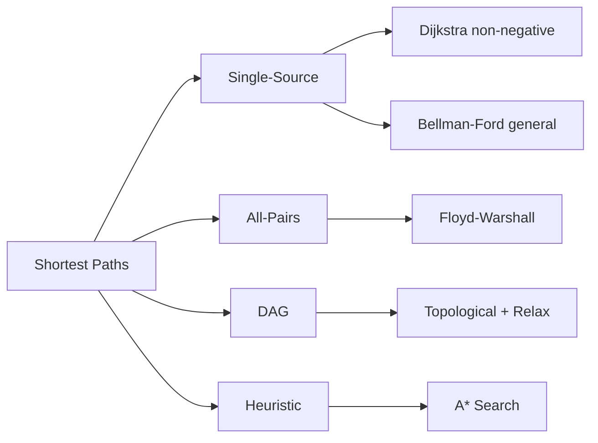

# Chapter 11: Graph Shortest Paths

> **Prerequisites:** [Chapter 10: Dynamic Programming — Trees & Grids](./10-dp-trees-grids.md) — Recursive problem-solving on graph structures | **Next:** [Chapter 12: Minimum Spanning Trees](./12-graph-mst.md) — From shortest paths to minimum-cost spanning trees

## Learning Objectives

By the end of this chapter, students will be able to:

1. Implement Dijkstra's algorithm for single-source shortest paths with non-negative weights.
2. Implement Bellman-Ford for graphs with negative weights and detect negative cycles.
3. Compute all-pairs shortest paths using Floyd-Warshall.
4. Compute shortest paths in DAGs using topological order.
5. Understand the A* search algorithm and its admissible heuristic property.

---

### Chapter at a Glance

| Topic | Key Insight | Practical Takeaway |
|-------|-------------|-------------------|
| Dijkstra | Priority queue + relaxation | O(E log V) with binary heap; non-negative weights only |
| Bellman-Ford | Relax all edges V-1 times | O(VE); detects negative cycles via Vth iteration |
| Floyd-Warshall | dp[k][i][j] via intermediate k | O(V³) for all-pairs; simple 3-loop implementation |
| DAG Shortest Paths | Topological order + relaxation | O(V+E); linear time for DAGs |
| A* Search | Heuristic-guided Dijkstra | Admissible heuristic guarantees optimality |

### Chapter Roadmap



## Theory


### 11.1 Dijkstra's Algorithm

**Problem:** Find the shortest paths from a source vertex \( s \) to all other vertices in a weighted graph with non-negative edge weights.

**Algorithm:** Maintain a set of visited vertices and a priority queue of distances. At each step, extract the vertex with the smallest distance, relax all its outgoing edges.

```
Dijkstra(G, s):
    dist[v] = inf for all v, dist[s] = 0
    PQ = min-priority queue of (dist[v], v)
    while PQ is not empty:
        u = ExtractMin(PQ)
        for each neighbor v of u:
            if dist[u] + w(u,v) < dist[v]:
                dist[v] = dist[u] + w(u,v)
                DecreaseKey(PQ, v, dist[v])
    return dist
```

**Correctness:** Invariant: when a vertex \( u \) is extracted from the priority queue, \( dist[u] \) is the true shortest distance from \( s \) to \( u \). This holds because all edge weights are non-negative, so no future relaxation can produce a shorter path.

**Complexity:** \( O((V+E) \log V) \) with a binary heap, \( O(V \log V + E) \) with a Fibonacci heap.

> **Pro Tip:** Dijkstra's lazy deletion pattern (checking `d != dist[u]` before processing) is preferred over DecreaseKey — it's simpler and has the same asymptotic complexity with a binary heap.
>
> **Remember:** Dijkstra fails with negative weights because a later negative edge could create a shorter path to an already-"settled" vertex.

**One-Sentence Takeaway:** Dijkstra's algorithm greedily extracts the minimum-distance unvisited vertex, achieving O(E log V) single-source shortest paths for non-negative weights.

### 11.2 Bellman-Ford Algorithm

**Problem:** Find shortest paths when edge weights may be negative. Also detects negative cycles reachable from the source.

**Algorithm:** Relax all edges \( |V|-1 \) times. After \( |V|-1 \) iterations, run another pass to detect negative cycles.

```
BellmanFord(G, s):
    dist[v] = inf for all v, dist[s] = 0
    for i = 1 to |V|-1:
        for each edge (u,v) in E:
            if dist[u] + w(u,v) < dist[v]:
                dist[v] = dist[u] + w(u,v)
    for each edge (u,v) in E:
        if dist[u] + w(u,v) < dist[v]:
            report "negative cycle detected"
    return dist
```

**Correctness:** After \( k \) iterations, \( dist[v] \) is the shortest path from \( s \) to \( v \) using at most \( k \) edges. The shortest path has at most \( |V|-1 \) edges, so \( |V|-1 \) iterations suffice.

**Complexity:** \( O(VE) \).

> **Pro Tip:** After V-1 relaxations, one more pass detects negative cycles. But this only detects cycles *reachable* from the source. Set all dist[v] = 0 before running to detect ANY negative cycle in the graph.
>
> **Warning:** Bellman-Ford is O(VE). For large graphs, use SPFA (queue-based optimization) but beware of crafted adversarial cases that degrade it.

**One-Sentence Takeaway:** Bellman-Ford handles negative weights and detects negative cycles by relaxing all edges V-1 times in O(VE) time.

### 11.3 Floyd-Warshall Algorithm

**Problem:** Find the shortest paths between all pairs of vertices. Handles negative weights but not negative cycles.

**Algorithm:** Let \( d^{(k)}[i][j] \) be the shortest path from \( i \) to \( j \) using only vertices from \( \{1, \ldots, k\} \) as intermediates.

\[
d^{(0)}[i][j] = \begin{cases}
0 & \text{if } i = j \\
w(i,j) & \text{if } (i,j) \in E \\
\infty & \text{otherwise}
\end{cases}
\]

\[
d^{(k)}[i][j] = \min(d^{(k-1)}[i][j], d^{(k-1)}[i][k] + d^{(k-1)}[k][j])
\]

```
FloydWarshall(G):
    n = |V|
    dist = n x n matrix initialized to edge weights (inf for non-edges)
    for k = 0 to n-1:
        for i = 0 to n-1:
            for j = 0 to n-1:
                if dist[i][k] + dist[k][j] < dist[i][j]:
                    dist[i][j] = dist[i][k] + dist[k][j]
    return dist
```

**Complexity:** \( \Theta(V^3) \) time, \( \Theta(V^2) \) space.

> **Pro Tip:** Floyd-Warshall's key insight is the k-loop ordering — k must be the outermost loop because d^{(k)} depends on d^{(k-1)}. The in-place update works because values only improve.
>
> **Remember:** Floyd-Warshall works for negative edges but not negative cycles. Check diagonal dist[i][i] < 0 afterward to detect cycles.

**One-Sentence Takeaway:** Floyd-Warshall computes all-pairs shortest paths in O(V³) using DP over intermediate vertices.

### 11.4 Shortest Path in DAG

**Problem:** Find shortest paths in a directed acyclic graph (DAG). The absence of cycles allows a linear-time solution.

**Algorithm:** Topologically sort the vertices. Process vertices in order, relaxing outgoing edges.

```
DAGShortestPath(G, s):
    order = TopologicalSort(G)
    dist[v] = inf for all v, dist[s] = 0
    for u in order:
        for each neighbor v of u:
            if dist[u] + w(u,v) < dist[v]:
                dist[v] = dist[u] + w(u,v)
    return dist
```

**Complexity:** \( O(V + E) \).

> **Pro Tip:** DAG shortest paths is the fastest possible — O(V+E) because topological ordering eliminates the need for iterative relaxation. Always check if your graph is a DAG before using a slower algorithm.
>
> **Remember:** The topological order ensures vertex u is processed before any of its descendants, so when you relax edges from u, dist[v] is final — no later pass can improve it.

**One-Sentence Takeaway:** DAG shortest paths achieve O(V+E) time by combining topological sort with edge relaxation in a single pass.

### 11.5 A* Search

A* is an informed search algorithm that uses a heuristic function \( h(v) \) to estimate the distance from \( v \) to the target. It combines the actual distance \( g(v) \) with the heuristic: \( f(v) = g(v) + h(v) \).

```
AStar(G, s, t, h):
    g[v] = inf for all v, g[s] = 0
    PQ = priority queue of (f[v], v) where f[v] = g[v] + h(v)
    while PQ is not empty:
        u = ExtractMin(PQ)
        if u == t: reconstruct and return
        for each neighbor v of u:
            if g[u] + w(u,v) < g[v]:
                g[v] = g[u] + w(u,v)
                DecreaseKey(PQ, v, g[v] + h(v))
    return no path
```

**Admissibility:** A heuristic \( h \) is admissible if \( h(v) \le \text{true cost}(v, t) \) for all \( v \). With an admissible heuristic, A* is guaranteed to find the optimal path.

**Consistency (monotonicity):** \( h(u) \le w(u,v) + h(v) \). A consistent heuristic ensures A* never re-opens closed nodes.

> **Pro Tip:** A* with an admissible heuristic (never overestimates) guarantees optimality. For grid pathfinding, Manhattan distance is admissible. Euclidean distance is also admissible. Never use greedy best-first search unless optimality is not required.
>
> **Remember:** A* = Dijkstra + heuristic guidance. If h(v) = 0 for all v, A* degenerates to Dijkstra. If h(v) dominates, it becomes greedy.

**One-Sentence Takeaway:** A* search combines actual distance with an admissible heuristic to find optimal paths faster than Dijkstra when a good heuristic is available.

---

### Example 11.1: Dijkstra in C++

```cpp
#include <vector>
#include <queue>
#include <limits>
#include <algorithm>

std::vector<int> dijkstra(const std::vector<std::vector<std::pair<int,int>>>& adj, int s) {
    int n = static_cast<int>(adj.size());
    std::vector<int> dist(n, std::numeric_limits<int>::max());
    dist[s] = 0;
    using P = std::pair<int,int>;
    std::priority_queue<P, std::vector<P>, std::greater<P>> pq;
    pq.push({0, s});
    while (!pq.empty()) {
        auto [d, u] = pq.top(); pq.pop();
        if (d != dist[u]) continue;
        for (auto [v, w] : adj[u]) {
            if (dist[u] + w < dist[v]) {
                dist[v] = dist[u] + w;
                pq.push({dist[v], v});
            }
        }
    }
    return dist;
}
```

### Example 11.2: Bellman-Ford in C++

```cpp
#include <vector>
#include <limits>

struct Edge { int u, v, w; };

std::vector<int> bellmanFord(const std::vector<Edge>& edges, int n, int s) {
    std::vector<int> dist(n, std::numeric_limits<int>::max());
    dist[s] = 0;
    for (int i = 0; i < n - 1; ++i) {
        for (const auto& e : edges) {
            if (dist[e.u] != std::numeric_limits<int>::max()
                && dist[e.u] + e.w < dist[e.v])
                dist[e.v] = dist[e.u] + e.w;
        }
    }
    for (const auto& e : edges) {
        if (dist[e.u] != std::numeric_limits<int>::max()
            && dist[e.u] + e.w < dist[e.v])
            return {}; // negative cycle
    }
    return dist;
}
```

### Example 11.3: Floyd-Warshall in C++

```cpp
#include <vector>
#include <limits>

std::vector<std::vector<int>> floydWarshall(
    const std::vector<std::vector<int>>& graph) {
    int n = static_cast<int>(graph.size());
    std::vector<std::vector<int>> dist = graph;
    for (int k = 0; k < n; ++k)
        for (int i = 0; i < n; ++i)
            for (int j = 0; j < n; ++j)
                if (dist[i][k] != std::numeric_limits<int>::max()
                    && dist[k][j] != std::numeric_limits<int>::max()
                    && dist[i][k] + dist[k][j] < dist[i][j])
                    dist[i][j] = dist[i][k] + dist[k][j];
    return dist;
}
```

---

### Concept Comparison Table

| Algorithm | Problem | Weight Type | Complexity | Key Limitation |
|-----------|---------|-------------|------------|----------------|
| Dijkstra | Single-source | Non-negative only | O((V+E) log V) | Fails with negative weights |
| Bellman-Ford | Single-source | Any (detects neg cycles) | O(VE) | Slow for large graphs |
| Floyd-Warshall | All-pairs | Any (no neg cycles) | Θ(V³) | O(V²) memory |
| DAG Shortest | Single-source (DAG) | Any | O(V+E) | Requires acyclic graph |
| A* | s-t shortest | Non-negative | O(E) practical | Needs admissible heuristic |

### Quick Reference

| Category | Key Points |
|----------|------------|
| **Non-negative weights** | Dijkstra — always use this |
| **Negative weights** | Bellman-Ford or SPFA |
| **All-pairs** | Floyd-Warshall (dense) or V × Dijkstra (sparse) |
| **DAG guaranteed** | Topological sort + relax — O(V+E) |
| **Heuristic available** | A* with admissible heuristic |
| **Detect negative cycle** | Bellman-Ford Vth iteration or Floyd diagonal |

### Cross-Application Matrix

| Algorithm | DSA Interviews | Competitive Programming | System Design | Real-World |
|-----------|---------------|----------------------|---------------|------------|
| Dijkstra | Very common | Standard shortest path | GPS routing | Google Maps, network routing |
| Bellman-Ford | Occasionally | Negative cycle detection | Currency arbitrage | Financial systems |
| Floyd-Warshall | Common | Small graph all-pairs | Traffic analysis | Social network analysis |
| DAG Shortest | Occasionally | Critical path | Task scheduling | Build systems (Make) |
| A* | Common in AI questions | Game pathfinding | Navigation systems | Video game AI, robotics |

---

## Summary

| Algorithm | Type | Weights | Time | Space |
|-----------|------|---------|------|-------|
| Dijkstra | Single-source | Non-negative | \( O((V+E) \log V) \) | \( O(V) \) |
| Bellman-Ford | Single-source | Any (detects negative cycles) | \( O(VE) \) | \( O(V) \) |
| Floyd-Warshall | All-pairs | Any (no negative cycles) | \( \Theta(V^3) \) | \( \Theta(V^2) \) |
| DAG shortest | Single-source | Any | \( O(V+E) \) | \( O(V) \) |
| A* | s-t | Non-negative + heuristic | \( O(E) \) in practice | \( O(V) \) |

---

## Exercises

### Review Questions

### Chapter Quiz

**Q1.** Which algorithm guarantees the shortest path in a graph with negative weights?

- A) Dijkstra
- B) Bellman-Ford
- C) A* with a consistent heuristic
- D) Prim's algorithm

<details>
<summary>Answer</summary>
B) Bellman-Ford handles negative weights and detects negative cycles. Dijkstra fails with negative weights.
</details>

**Q2.** What is the time complexity of Floyd-Warshall?

- A) O(V²)
- B) O(VE)
- C) Θ(V³)
- D) O(E log V)

<details>
<summary>Answer</summary>
C) Θ(V³) — triple nested loop over all vertices for the intermediate k and pairs (i,j).
</details>

**Q3.** What property must an A* heuristic have to guarantee optimality?

- A) Monotonic
- B) Admissible (never overestimates)
- C) Consistent
- D) Dominant

<details>
<summary>Answer</summary>
B) An admissible heuristic never overestimates the true cost to the goal, guaranteeing A* finds the optimal path.
</details>

### Review Questions

1. Why does Dijkstra fail with negative edge weights?
2. What is the purpose of the final pass in Bellman-Ford?
3. State the difference between admissible and consistent heuristics in A*.

### Application Problems

4. Implement Dijkstra with predecessor tracking to reconstruct the shortest path.
5. Run Bellman-Ford on a graph with a negative cycle and verify the detection.
6. Implement DAG shortest path for task scheduling (critical path).
7. Given a 10x10 grid with obstacles, implement A* with Manhattan distance heuristic.

### Challenge Problem

8. Design an algorithm for the **K shortest simple paths** problem: find the K shortest paths between two vertices that do not share vertices. Analyze its complexity.
