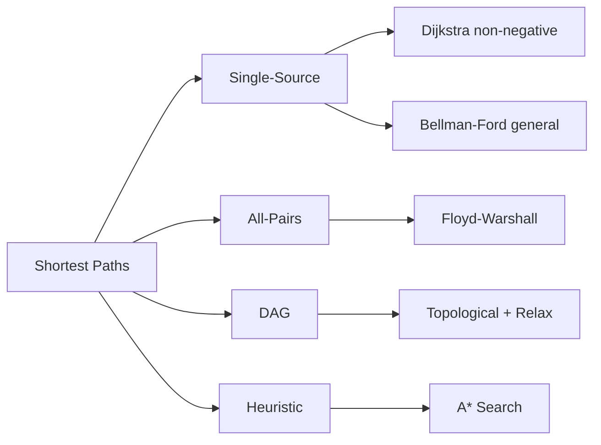

# Chapter 11: Graph Shortest Paths

> **Prerequisites:** [Chapter 10: Dynamic Programming — Trees & Grids](./10-dp-trees-grids.md) — Recursive problem-solving on graph structures | **Next:** [Chapter 12: Minimum Spanning Trees](./12-graph-mst.md) — From shortest paths to minimum-cost spanning trees

## Learning Objectives

By the end of this chapter, students will be able to:

<!-- Image Gallery -->
<section class="lesson-visuals" aria-label="Visual learning resources">
  <header><span>VISUAL LEARNING</span><h2>See it. Review it. Remember it.</h2></header>
  <a class="lesson-visual-card" href="../../../assets/images/lessons/algorithms/11-graph-shortest/.png" target="_blank" rel="noopener">
    
    <span><strong>Handwritten notes</strong>Condensed notes for deliberate review.</span>
  </a>
  <a class="lesson-visual-card" href="../../../assets/images/lessons/algorithms/11-graph-shortest/.png" target="_blank" rel="noopener">
    
    <span><strong>Sticky-note revision</strong>Fast recall prompts for revision.</span>
  </a>
  <a class="lesson-visual-card" href="../../../assets/images/lessons/algorithms/11-graph-shortest/.png" target="_blank" rel="noopener">
    
    <span><strong>Visual concept guide</strong>A connected explanation of the key ideas.</span>
  </a>
</section>
<!-- End Image Gallery -->


1. Implement Dijkstra's algorithm for single-source shortest paths with non-negative weights.
2. Implement Bellman-Ford for graphs with negative weights and detect negative cycles.
3. Compute all-pairs shortest paths using Floyd-Warshall.
4. Compute shortest paths in DAGs using topological order.
5. Understand the A* search algorithm and its admissible heuristic property.

---

## Why Shortest Path Matters

Imagine you are driving from New York to Los Angeles. Your GPS must compute the fastest route across thousands of highways, accounting for traffic, road closures, and distance. This is the **shortest path problem** — the computational bedrock of navigation systems.

In computing, "shortest" rarely means literal meters. It means **minimum cost** — travel time, bandwidth delay, financial transaction fees, or even the number of social connections separating two people. Every time your phone routes a call, your email finds a server, or a delivery drone plots a course, a shortest-path algorithm runs underneath.

**Real-world analogy:** Consider a courier service dispatching a truck across a city. Each intersection is a vertex, each road is an edge, and the travel time is the edge weight. The dispatcher needs the route that minimizes total time. If some roads have tolls (positive weight) and others have discounts (negative weight), the problem becomes harder. If the city has a loop that somehow saves time each trip (negative cycle), the concept of "shortest" breaks entirely — you could drive forever and keep reducing cost.

The four algorithms in this chapter represent different trade-offs: speed versus generality, simplicity versus power. Choosing the right one is the first real test of algorithmic maturity.

---

### Chapter at a Glance

| Topic | Key Insight | Practical Takeaway |
|-------|-------------|-------------------|
| Dijkstra | Priority queue + relaxation | O(E log V) with binary heap; non-negative weights only |
| Bellman-Ford | Relax all edges V-1 times | O(VE); detects negative cycles via Vth iteration |
| Floyd-Warshall | dp[k][i][j] via intermediate k | O(V³) for all-pairs; simple 3-loop implementation |
| DAG Shortest Paths | Topological order + relaxation | O(V+E); linear time for DAGs |
| A* Search | Heuristic-guided Dijkstra | Admissible heuristic guarantees optimality |

### Chapter Roadmap



## Theory


---

### 11.1 Dijkstra's Algorithm


**Problem:** Find the shortest paths from a source vertex \( s \) to all other vertices in a weighted graph with non-negative edge weights.

**Real-world analogy:** Your GPS calculates the shortest route from your current location to a destination. Each intersection is a vertex, each road segment is an edge with weight = travel time. The GPS maintains a list of "best known travel time" for each intersection. It always explores the intersection with the shortest current estimate first — you wouldn't drive 10 minutes in the wrong direction just to save 30 seconds later. This greedy approach works because travel times are never negative (you can't arrive before you left).

#### Algorithm Steps

1. Initialize `dist[source] = 0` and `dist[v] = ∞` for all other vertices.
2. Insert `(dist[v], v)` into a min-priority queue for all vertices.
3. While the priority queue is not empty:
   - Extract the vertex `u` with the smallest distance.
   - If the extracted distance does not match `dist[u]`, skip (lazy deletion).
   - For each neighbor `v` of `u` with edge weight `w(u,v)`:
     - If `dist[u] + w(u,v) < dist[v]`:
       - Update `dist[v] = dist[u] + w(u,v)`.
       - Push `(dist[v], v)` into the priority queue.
4. Return `dist[]`.

#### Pseudocode

```
Dijkstra(G, s):
    dist[v] = inf for all v, dist[s] = 0
    PQ = min-priority queue of (dist[v], v)
    while PQ is not empty:
        u = ExtractMin(PQ)
        if dist[u] != d[u]: continue         // lazy deletion
        for each neighbor v of u:
            if dist[u] + w(u,v) < dist[v]:
                dist[v] = dist[u] + w(u,v)
                Insert(PQ, (dist[v], v))
    return dist
```

#### Dry Run with Distance Table Trace

**Graph:** Vertices: 0, 1, 2, 3, 4. Source: 0.

| Edge | Weight |
|------|--------|
| 0→1 | 4 |
| 0→2 | 1 |
| 2→1 | 2 |
| 1→3 | 1 |
| 2→3 | 5 |
| 3→4 | 3 |

**Step-by-step trace:**

| Step | Extracted | dist[0] | dist[1] | dist[2] | dist[3] | dist[4] | Relaxed Edges |
|------|-----------|---------|---------|---------|---------|---------|---------------|
| Init | — | 0 | ∞ | ∞ | ∞ | ∞ | — |
| 1 | 0 | **0** | 4 | 1 | ∞ | ∞ | 0→1 (4), 0→2 (1) |
| 2 | 2 | **0** | min(4,1+2)=**3** | **1** | 1+5=6 | ∞ | 2→1 (2), 2→3 (5) |
| 3 | 1 | **0** | **3** | **1** | min(6,3+1)=**4** | ∞ | 1→3 (1) |
| 4 | 3 | **0** | **3** | **1** | **4** | 4+3=7 | 3→4 (3) |
| 5 | 4 | **0** | **3** | **1** | **4** | **7** | — |

**Final distances:** dist[0]=0, dist[1]=3, dist[2]=1, dist[3]=4, dist[4]=7.

**Path reconstruction:** 0→2→1→3→4 (total 7).

#### C++ Implementation

```cpp
#include <vector>
#include <queue>
#include <limits>

std::vector<int> dijkstra(const std::vector<std::vector<std::pair<int,int>>>& adj, int s) {
    int n = static_cast<int>(adj.size());
    std::vector<int> dist(n, std::numeric_limits<int>::max());
    dist[s] = 0;
    using P = std::pair<int,int>;
    std::priority_queue<P, std::vector<P>, std::greater<P>> pq;
    pq.push({0, s});
    while (!pq.empty()) {
        auto [d, u] = pq.top(); pq.pop();
        if (d != dist[u]) continue;
        for (auto [v, w] : adj[u]) {
            if (dist[u] + w < dist[v]) {
                dist[v] = dist[u] + w;
                pq.push({dist[v], v});
            }
        }
    }
    return dist;
}
```

#### Python Implementation

```python
import heapq

def dijkstra(adj, s):
    n = len(adj)
    dist = [float('inf')] * n
    dist[s] = 0
    pq = [(0, s)]
    while pq:
        d, u = heapq.heappop(pq)
        if d != dist[u]:
            continue
        for v, w in adj[u]:
            if dist[u] + w < dist[v]:
                dist[v] = dist[u] + w
                heapq.heappush(pq, (dist[v], v))
    return dist
```

#### Java Implementation

```java
import java.util.*;

public class Dijkstra {
    static class Pair {
        int first, second;
        Pair(int f, int s) { first = f; second = s; }
    }

    static int[] dijkstra(List<List<Pair>> adj, int s) {
        int n = adj.size();
        int[] dist = new int[n];
        Arrays.fill(dist, Integer.MAX_VALUE);
        dist[s] = 0;
        PriorityQueue<Pair> pq = new PriorityQueue<>(
            (a, b) -> Integer.compare(a.first, b.first));
        pq.add(new Pair(0, s));
        while (!pq.isEmpty()) {
            Pair cur = pq.poll();
            int d = cur.first, u = cur.second;
            if (d != dist[u]) continue;
            for (Pair edge : adj.get(u)) {
                int v = edge.first, w = edge.second;
                if (dist[u] + w < dist[v]) {
                    dist[v] = dist[u] + w;
                    pq.add(new Pair(dist[v], v));
                }
            }
        }
        return dist;
    }
}
```

#### Complexity Analysis

| Aspect | Complexity | Why? |
|--------|------------|------|
| Time (binary heap) | O((V+E) log V) | Each vertex extracted once (O(log V)), each edge relaxed once (O(log V) for push) |
| Time (Fibonacci heap) | O(V log V + E) | DecreaseKey is O(1) amortized, ExtractMin remains O(log V) |
| Space | O(V) | Distance array + priority queue stores at most V entries |

**Why O(E log V) and not O(E)?** The priority queue operations — push and pop — each take O(log V) time. Since every edge may cause a push and every vertex causes a pop, the cost multiplies.

#### Advantages & Disadvantages

| Advantages | Disadvantages |
|------------|---------------|
| Fastest single-source algorithm for non-negative weights | Fails completely with negative edge weights |
| O(E log V) is efficient for sparse graphs | Cannot detect negative cycles |
| Lazy deletion pattern is simple to implement | Not suitable for all-pairs shortest paths |
| Works on directed and undirected graphs | Requires dense graph representation for worst-case O(V²) if using simple array |

#### Edge Cases

| Edge Case | Behavior |
|-----------|----------|
| **Single node** | dist[source] = 0, algorithm terminates immediately |
| **Disconnected graph** | dist[v] remains ∞ for unreachable vertices |
| **Zero-weight edges** | Works correctly; zero-weight edges are handled as non-negative |
| **Source = destination** | Returns 0; algorithm finds the shortest cycle through source if one exists |
| **Large weights** | Use `long long` to avoid overflow when summing distances |

> **Pro Tip:** Dijkstra's lazy deletion pattern (checking `d != dist[u]` before processing) is preferred over DecreaseKey — it's simpler and has the same asymptotic complexity with a binary heap.
>
> **Remember:** Dijkstra fails with negative weights because a later negative edge could create a shorter path to an already-"settled" vertex.

**One-Sentence Takeaway:** Dijkstra's algorithm greedily extracts the minimum-distance unvisited vertex, achieving O(E log V) single-source shortest paths for non-negative weights.

---

### 11.2 Bellman-Ford Algorithm


**Problem:** Find shortest paths when edge weights may be negative. Also detects negative cycles reachable from the source.

**Real-world analogy:** Suppose you are trading currencies. Converting USD → EUR → GBP might cost you 0.2% each hop, but a rare triangular arbitrage opportunity exists: USD → JPY → EUR → USD yields a net profit of 0.1% — a negative-weight cycle. You could keep trading in this loop and accumulate infinite profit. Bellman-Ford detects exactly such pathological situations.

#### Algorithm Steps

1. Initialize `dist[source] = 0` and `dist[v] = ∞` for all other vertices.
2. Repeat |V| - 1 times:
   - For every edge (u, v) with weight w:
     - If `dist[u] + w < dist[v]`, update `dist[v] = dist[u] + w`.
3. For every edge (u, v) with weight w:
   - If `dist[u] + w < dist[v]`, a negative cycle exists (reachable from source).
4. Return `dist[]` (or signal negative cycle).

#### Pseudocode

```
BellmanFord(G, s):
    dist[v] = inf for all v, dist[s] = 0
    for i = 1 to |V|-1:
        for each edge (u,v) in E:
            if dist[u] + w(u,v) < dist[v]:
                dist[v] = dist[u] + w(u,v)
    for each edge (u,v) in E:
        if dist[u] + w(u,v) < dist[v]:
            report "negative cycle detected"
    return dist
```

#### Dry Run with Distance Table Trace

**Graph:** Vertices: 0, 1, 2, 3. Source: 0.

| Edge | Weight |
|------|--------|
| 0→1 | 6 |
| 0→2 | 5 |
| 1→3 | -1 |
| 2→1 | -2 |
| 2→3 | 4 |

**Step-by-step trace (each iteration relaxes ALL edges):**

| Iteration | Edge Processed | dist[0] | dist[1] | dist[2] | dist[3] |
|-----------|---------------|---------|---------|---------|---------|
| Init | — | 0 | ∞ | ∞ | ∞ |
| 1 | 0→1 | 0 | 6 | ∞ | ∞ |
| 1 | 0→2 | 0 | 6 | 5 | ∞ |
| 1 | 2→1 | 0 | min(6,5-2)=**3** | 5 | ∞ |
| 1 | 2→3 | 0 | 3 | 5 | 5+4=9 |
| 1 | 1→3 | 0 | 3 | 5 | min(9,3-1)=**2** |
| 2 | 0→1 | 0 | min(3,0+6)=3 | 5 | 2 |
| 2 | 0→2 | 0 | 3 | 5 | 2 |
| 2 | 2→1 | 0 | min(3,5-2)=3 | 5 | 2 |
| 2 | 2→3 | 0 | 3 | 5 | min(2,5+4)=2 |
| 2 | 1→3 | 0 | 3 | 5 | min(2,3-1)=2 |
| 3 | (all edges) | 0 | 3 | 5 | 2 (no change) |

**Final distances:** dist[0]=0, dist[1]=3, dist[2]=5, dist[3]=2.

**Verification:** A 4th iteration produces no changes — no negative cycle.

#### C++ Implementation

```cpp
#include <vector>
#include <limits>

struct Edge { int u, v, w; };

std::vector<int> bellmanFord(const std::vector<Edge>& edges, int n, int s) {
    std::vector<int> dist(n, std::numeric_limits<int>::max());
    dist[s] = 0;
    for (int i = 0; i < n - 1; ++i) {
        for (const auto& e : edges) {
            if (dist[e.u] != std::numeric_limits<int>::max()
                && dist[e.u] + e.w < dist[e.v])
                dist[e.v] = dist[e.u] + e.w;
        }
    }
    for (const auto& e : edges) {
        if (dist[e.u] != std::numeric_limits<int>::max()
            && dist[e.u] + e.w < dist[e.v])
            return {}; // negative cycle
    }
    return dist;
}
```

#### Python Implementation

```python
def bellman_ford(edges, n, s):
    dist = [float('inf')] * n
    dist[s] = 0
    for _ in range(n - 1):
        for u, v, w in edges:
            if dist[u] != float('inf') and dist[u] + w < dist[v]:
                dist[v] = dist[u] + w
    for u, v, w in edges:
        if dist[u] != float('inf') and dist[u] + w < dist[v]:
            return None  # negative cycle
    return dist
```

#### Java Implementation

```java
import java.util.*;

public class BellmanFord {
    static class Edge {
        int u, v, w;
        Edge(int u, int v, int w) { this.u = u; this.v = v; this.w = w; }
    }

    static int[] bellmanFord(List<Edge> edges, int n, int s) {
        int[] dist = new int[n];
        Arrays.fill(dist, Integer.MAX_VALUE);
        dist[s] = 0;
        for (int i = 0; i < n - 1; i++) {
            for (Edge e : edges) {
                if (dist[e.u] != Integer.MAX_VALUE
                    && dist[e.u] + e.w < dist[e.v])
                    dist[e.v] = dist[e.u] + e.w;
            }
        }
        for (Edge e : edges) {
            if (dist[e.u] != Integer.MAX_VALUE
                && dist[e.u] + e.w < dist[e.v])
                return null; // negative cycle
        }
        return dist;
    }
}
```

#### Complexity Analysis

| Aspect | Complexity | Why? |
|--------|------------|------|
| Time | O(V·E) | Outer loop runs V-1 times; each iteration scans all E edges |
| Space | O(V) | Single distance array + edge list (O(E) if counting input) |

**Why O(V·E) and not faster?** Each iteration propagates distance information one edge further along every possible path. In the worst case, the shortest path visits every vertex, requiring V-1 full passes. The inner loop must check every edge each pass because you cannot know which edges are relevant without scanning.

#### Advantages & Disadvantages

| Advantages | Disadvantages |
|------------|---------------|
| Handles negative edge weights | Much slower than Dijkstra — O(V·E) vs O(E log V) |
| Detects negative cycles | Slow for large graphs with many edges |
| Simple to implement and debug | SPFA variant faster in practice but has adversarial worst-case |
| Naturally distributed (used in routing protocols) | Cannot be used for all-pairs efficiently (V times = O(V²·E)) |

#### Edge Cases

| Edge Case | Behavior |
|-----------|----------|
| **Negative cycle reachable** | Detected in the Vth iteration; returns empty/None |
| **Negative cycle unreachable** | Algorithm runs normally; correct distances for reachable vertices |
| **Single node** | dist[0]=0; no edges to relax; no cycle detection |
| **Disconnected graph** | Unreachable vertices remain ∞ |
| **Graph with only negative edges** | Works correctly as long as no negative cycle exists |
| **Source has no outgoing edges** | dist[source]=0, all others remain ∞ |

> **Pro Tip:** After V-1 relaxations, one more pass detects negative cycles. But this only detects cycles *reachable* from the source. Set all dist[v] = 0 before running to detect ANY negative cycle in the graph.
>
> **Warning:** Bellman-Ford is O(VE). For large graphs, use SPFA (queue-based optimization) but beware of crafted adversarial cases that degrade it.

**One-Sentence Takeaway:** Bellman-Ford handles negative weights and detects negative cycles by relaxing all edges V-1 times in O(VE) time.

---

### 11.3 Floyd-Warshall Algorithm


**Problem:** Find the shortest paths between all pairs of vertices. Handles negative weights but not negative cycles.

**Real-world analogy:** A logistics company wants to know the shortest distance between every pair of its 50 distribution centers. Instead of running Dijkstra 50 times, Floyd-Warshall computes all 1225 pairwise distances in one elegant triple loop. It works by asking: "Is the current best path from i to j better than going through k?"

#### Algorithm Steps

1. Create an n×n distance matrix. Set `dist[i][j] = 0` if i=j, `w(i,j)` if edge exists, ∞ otherwise.
2. For each intermediate vertex k from 0 to n-1:
   - For each source vertex i from 0 to n-1:
     - For each destination vertex j from 0 to n-1:
       - If `dist[i][k] + dist[k][j] < dist[i][j]`, update `dist[i][j]`.
3. Return the distance matrix.

#### Pseudocode

```
FloydWarshall(G):
    n = |V|
    dist = n x n matrix initialized to edge weights (inf for non-edges)
    for k = 0 to n-1:
        for i = 0 to n-1:
            for j = 0 to n-1:
                if dist[i][k] + dist[k][j] < dist[i][j]:
                    dist[i][j] = dist[i][k] + dist[k][j]
    return dist
```

#### Dry Run with Distance Table Trace

**Graph:** Vertices: 0, 1, 2.

| Edge | Weight |
|------|--------|
| 0→1 | 3 |
| 1→2 | 1 |
| 0→2 | 7 |

**Initial matrix:**

| dist | 0 | 1 | 2 |
|------|---|---|---|
| 0 | 0 | 3 | 7 |
| 1 | ∞ | 0 | 1 |
| 2 | ∞ | ∞ | 0 |

**k=0 (intermediate = 0):**

Check all pairs (i,j): can we go i→0→j cheaper than i→j?

| i→j | Current | Via 0 | Update? |
|-----|---------|-------|---------|
| 1→2 | 1 | ∞+7=∞ | No |
| 2→1 | ∞ | ∞+3=∞ | No |

No changes. Matrix unchanged.

**k=1 (intermediate = 1):**

| i→j | Current | Via 1 | Update? |
|-----|---------|-------|---------|
| 0→2 | 7 | 3+1=**4** | **Yes** |
| 2→0 | ∞ | ∞+0=∞ | No |

Updated dist[0][2]=4.

**k=2 (intermediate = 2):**

| i→j | Current | Via 2 | Update? |
|-----|---------|-------|---------|
| 0→1 | 3 | 4+1=5 | No |
| 1→0 | ∞ | 1+∞=∞ | No |

**Final matrix:**

| dist | 0 | 1 | 2 |
|------|---|---|---|
| 0 | 0 | 3 | 4 |
| 1 | ∞ | 0 | 1 |
| 2 | ∞ | ∞ | 0 |

#### C++ Implementation

```cpp
#include <vector>
#include <limits>

std::vector<std::vector<int>> floydWarshall(
    const std::vector<std::vector<int>>& graph) {
    int n = static_cast<int>(graph.size());
    std::vector<std::vector<int>> dist = graph;
    for (int k = 0; k < n; ++k)
        for (int i = 0; i < n; ++i)
            for (int j = 0; j < n; ++j)
                if (dist[i][k] != std::numeric_limits<int>::max()
                    && dist[k][j] != std::numeric_limits<int>::max()
                    && dist[i][k] + dist[k][j] < dist[i][j])
                    dist[i][j] = dist[i][k] + dist[k][j];
    return dist;
}
```

#### Python Implementation

```python
def floyd_warshall(graph):
    n = len(graph)
    dist = [row[:] for row in graph]  # deep copy
    for k in range(n):
        for i in range(n):
            for j in range(n):
                if (dist[i][k] != float('inf')
                        and dist[k][j] != float('inf')
                        and dist[i][k] + dist[k][j] < dist[i][j]):
                    dist[i][j] = dist[i][k] + dist[k][j]
    return dist
```

#### Java Implementation

```java
import java.util.*;

public class FloydWarshall {
    static final int INF = Integer.MAX_VALUE;

    static int[][] floydWarshall(int[][] graph) {
        int n = graph.length;
        int[][] dist = new int[n][n];
        for (int i = 0; i < n; i++)
            dist[i] = Arrays.copyOf(graph[i], n);
        for (int k = 0; k < n; k++)
            for (int i = 0; i < n; i++)
                for (int j = 0; j < n; j++)
                    if (dist[i][k] != INF && dist[k][j] != INF
                        && dist[i][k] + dist[k][j] < dist[i][j])
                        dist[i][j] = dist[i][k] + dist[k][j];
        return dist;
    }
}
```

#### Complexity Analysis

| Aspect | Complexity | Why? |
|--------|------------|------|
| Time | Θ(V³) | Three nested loops each iterating V times |
| Space | Θ(V²) | V×V distance matrix |

**Why Θ(V³) and not O(V³)?** The triple loop always runs exactly V³ iterations regardless of graph density. This is both worst-case and best-case — Floyd-Warshall has no early termination.

**Why is k the outermost loop?** The DP recurrence `d[k][i][j] = min(d[k-1][i][j], d[k-1][i][k] + d[k-1][k][j])` requires that when computing the k-th layer, all values from the (k-1)-th layer remain available. If i or j were outermost, the in-place update would use already-modified k-th layer values, giving incorrect results.

#### Advantages & Disadvantages

| Advantages | Disadvantages |
|------------|---------------|
| Extremely simple — just 3 nested loops | Θ(V³) is prohibitive for V > 1000 |
| Works for negative edge weights | Fails on graphs with negative cycles |
| Computes all-pairs in one shot | Θ(V²) memory is high for large V |
| Easy to modify for path reconstruction | Overkill for single-source queries |
| Naturally handles disconnected components | Running Dijkstra V times is faster for sparse graphs |

#### Edge Cases

| Edge Case | Behavior |
|-----------|----------|
| **Negative cycle** | `dist[i][i]` becomes negative; check diagonal after completion |
| **Single node** | dist = [[0]]; trivially correct |
| **Disconnected graph** | ∞ entries remain for unreachable pairs |
| **Self-loop** | dist[i][i] initialized to 0; a negative self-loop would make it &lt; 0 |
| **Dense graph** | Floyd-Warshall excels here — same Θ(V³) regardless of density |

> **Pro Tip:** Floyd-Warshall's key insight is the k-loop ordering — k must be the outermost loop because d^{(k)} depends on d^{(k-1)}. The in-place update works because values only improve.
>
> **Remember:** Floyd-Warshall works for negative edges but not negative cycles. Check diagonal dist[i][i] &lt; 0 afterward to detect cycles.

**One-Sentence Takeaway:** Floyd-Warshall computes all-pairs shortest paths in O(V³) using DP over intermediate vertices.

---

### 11.4 Shortest Path in DAG


**Problem:** Find shortest paths in a directed acyclic graph (DAG). The absence of cycles allows a linear-time solution.

**Real-world analogy:** Planning a college degree program. Courses have prerequisites — you must take CS101 before CS201 before CS301. This is a DAG (no course can be its own prerequisite). The "shortest path" to complete a degree is finding the minimal sequence respecting all prerequisites. Because there are no cycles, you can process courses in topological order (prerequisites first) and compute distances in one pass.

#### Algorithm Steps

1. Compute topological order of the DAG (using DFS or Kahn's algorithm).
2. Initialize `dist[source] = 0` and `dist[v] = ∞` for all other vertices.
3. Process vertices in topological order:
   - For each outgoing edge (u, v) with weight w:
     - If `dist[u] + w < dist[v]`, update `dist[v]`.
4. Return `dist[]`.

#### Pseudocode

```
DAGShortestPath(G, s):
    order = TopologicalSort(G)
    dist[v] = inf for all v, dist[s] = 0
    for u in order:
        for each neighbor v of u:
            if dist[u] + w(u,v) < dist[v]:
                dist[v] = dist[u] + w(u,v)
    return dist
```

#### Dry Run with Distance Table Trace

**Graph:** Vertices: 0, 1, 2, 3, 4. Edges: 0→1(2), 0→2(1), 1→3(3), 2→3(1), 3→4(2). Source: 0.

**Topological order:** 0, 1, 2, 3, 4 (or 0, 2, 1, 3, 4 — both valid).

**Step-by-step trace:**

| Step | Process u | dist[0] | dist[1] | dist[2] | dist[3] | dist[4] |
|------|-----------|---------|---------|---------|---------|---------|
| Init | — | 0 | ∞ | ∞ | ∞ | ∞ |
| 1 | 0 | 0 | 2 | 1 | ∞ | ∞ |
| 2 | 1 | 0 | **2** | 1 | min(∞, 2+3)=**5** | ∞ |
| 3 | 2 | 0 | **2** | **1** | min(5, 1+1)=**2** | ∞ |
| 4 | 3 | 0 | **2** | **1** | **2** | 2+2=**4** |
| 5 | 4 | 0 | **2** | **1** | **2** | **4** |

**Final distances:** dist[0]=0, dist[1]=2, dist[2]=1, dist[3]=2, dist[4]=4.

**Key insight:** Unlike Dijkstra (which needs a priority queue) and Bellman-Ford (which needs V-1 passes), the topological order guarantees that when we process a vertex, all paths to it have already been considered. One pass suffices.

#### C++ Implementation

```cpp
#include <vector>
#include <algorithm>
#include <limits>

void dfs(int u, const std::vector<std::vector<std::pair<int,int>>>& adj,
         std::vector<bool>& vis, std::vector<int>& order) {
    vis[u] = true;
    for (auto [v, w] : adj[u])
        if (!vis[v]) dfs(v, adj, vis, order);
    order.push_back(u);
}

std::vector<int> dagShortest(
    const std::vector<std::vector<std::pair<int,int>>>& adj, int s) {
    int n = static_cast<int>(adj.size());
    std::vector<bool> vis(n, false);
    std::vector<int> order;
    for (int i = 0; i < n; ++i)
        if (!vis[i]) dfs(i, adj, vis, order);
    std::reverse(order.begin(), order.end());

    std::vector<int> dist(n, std::numeric_limits<int>::max());
    dist[s] = 0;
    for (int u : order) {
        if (dist[u] == std::numeric_limits<int>::max()) continue;
        for (auto [v, w] : adj[u])
            if (dist[u] + w < dist[v])
                dist[v] = dist[u] + w;
    }
    return dist;
}
```

#### Python Implementation

```python
def dag_shortest(adj, s):
    n = len(adj)
    visited = [False] * n
    order = []

    def dfs(u):
        visited[u] = True
        for v, w in adj[u]:
            if not visited[v]:
                dfs(v)
        order.append(u)

    for i in range(n):
        if not visited[i]:
            dfs(i)
    order.reverse()

    dist = [float('inf')] * n
    dist[s] = 0
    for u in order:
        if dist[u] == float('inf'):
            continue
        for v, w in adj[u]:
            if dist[u] + w < dist[v]:
                dist[v] = dist[u] + w
    return dist
```

#### Java Implementation

```java
import java.util.*;

public class DAGShortest {
    static void dfs(int u, List<List<int[]>> adj,
                    boolean[] vis, List<Integer> order) {
        vis[u] = true;
        for (int[] edge : adj.get(u)) {
            int v = edge[0];
            if (!vis[v]) dfs(v, adj, vis, order);
        }
        order.add(u);
    }

    static int[] dagShortest(List<List<int[]>> adj, int s) {
        int n = adj.size();
        boolean[] vis = new boolean[n];
        List<Integer> order = new ArrayList<>();
        for (int i = 0; i < n; i++)
            if (!vis[i]) dfs(i, adj, vis, order);
        Collections.reverse(order);

        int[] dist = new int[n];
        Arrays.fill(dist, Integer.MAX_VALUE);
        dist[s] = 0;
        for (int u : order) {
            if (dist[u] == Integer.MAX_VALUE) continue;
            for (int[] edge : adj.get(u)) {
                int v = edge[0], w = edge[1];
                if (dist[u] + w < dist[v])
                    dist[v] = dist[u] + w;
            }
        }
        return dist;
    }
}
```

#### Complexity Analysis

| Aspect | Complexity | Why? |
|--------|------------|------|
| Time (topological sort) | O(V + E) | DFS visits each vertex and edge once |
| Time (relaxation) | O(V + E) | Each vertex processed once, each edge relaxed once |
| Total time | O(V + E) | Both phases are linear |
| Space | O(V) | Distance array + recursion stack (or explicit stack) |

**Why is this faster than Dijkstra?** Dijkstra pays O(log V) per operation because it doesn't know which vertex to process next. A DAG provides the topological ordering for free — vertices that could have edges to u are guaranteed to appear before u in the order. No priority queue needed.

#### Advantages & Disadvantages

| Advantages | Disadvantages |
|------------|---------------|
| Fastest possible — O(V+E) | Works only on DAGs |
| Handles negative weights (no cycles exist) | Requires topological sort (extra pass) |
| Simple linear-time algorithm | Cannot handle cycles by definition |
| Ideal for dependency resolution | Topological order is not unique; any valid order works |

#### Edge Cases

| Edge Case | Behavior |
|-----------|----------|
| **Empty graph (V=0)** | Returns empty distance array |
| **Single node (V=1)** | dist[0]=0; trivially correct |
| **Source has no path to some vertices** | Those vertices remain ∞ |
| **Negative weight edges** | Works correctly — DAG has no cycles, so negative cycles impossible |
| **Disconnected DAG** | Separate topological ordering per component; unreachable vertices are ∞ |

> **Pro Tip:** DAG shortest paths is the fastest possible — O(V+E) because topological ordering eliminates the need for iterative relaxation. Always check if your graph is a DAG before using a slower algorithm.
>
> **Remember:** The topological order ensures vertex u is processed before any of its descendants, so when you relax edges from u, dist[v] is final — no later pass can improve it.

**One-Sentence Takeaway:** DAG shortest paths achieve O(V+E) time by combining topological sort with edge relaxation in a single pass.

---

### 11.5 A* Search


**Problem:** Find the shortest path from a single source s to a specific target t. A* uses domain knowledge (a heuristic) to explore fewer vertices than Dijkstra.

**Real-world analogy:** When driving from home to the airport, you intuitively ignore roads heading away from the airport. You use your knowledge of the airport's location to guide your decisions. This is exactly what A* does — it uses a heuristic (straight-line distance) to prioritize roads that point toward the destination.

A* is an informed search algorithm that uses a heuristic function \( h(v) \) to estimate the distance from \( v \) to the target. It combines the actual distance \( g(v) \) with the heuristic: \( f(v) = g(v) + h(v) \).

#### Algorithm Steps

1. Initialize `g[source] = 0`, `g[v] = ∞` for all other vertices.
2. Insert `(f[source], source)` into a priority queue, where `f[v] = g[v] + h(v)`.
3. While the priority queue is not empty:
   - Extract the vertex `u` with the smallest `f[u]`.
   - If `u == t`, reconstruct and return the path.
   - For each neighbor `v` of `u` with weight `w(u,v)`:
     - If `g[u] + w(u,v) < g[v]`:
       - Update `g[v] = g[u] + w(u,v)`.
       - Set `f[v] = g[v] + h(v)` and push into queue.
4. Return "no path".

#### Pseudocode

```
AStar(G, s, t, h):
    g[v] = inf for all v, g[s] = 0
    PQ = priority queue of (f[v], v) where f[v] = g[v] + h(v)
    while PQ is not empty:
        u = ExtractMin(PQ)
        if u == t: reconstruct and return
        for each neighbor v of u:
            if g[u] + w(u,v) < g[v]:
                g[v] = g[u] + w(u,v)
                Insert(PQ, (g[v] + h(v), v))
    return no path
```

#### Dry Run

**Graph:** Vertices: A, B, C, D, E. Target: E.

| Edge | Weight |
|------|--------|
| A→B | 2 |
| A→C | 3 |
| B→D | 3 |
| C→D | 1 |
| D→E | 2 |

**Heuristic** (estimated cost to E):

| Vertex | h(v) |
|--------|------|
| A | 5 |
| B | 4 |
| C | 3 |
| D | 1 |
| E | 0 |

**Step-by-step trace:**

| Step | Current | g(A) | g(B) | g(C) | g(D) | g(E) | f values in PQ |
|------|---------|------|------|------|------|------|----------------|
| Init | — | 0 | ∞ | ∞ | ∞ | ∞ | (5, A) |
| 1 | A | **0** | 2 | 3 | ∞ | ∞ | (6, B), (6, C) |
| 2 | C (f=6) | **0** | 2 | **3** | 3+1=4 | ∞ | (6, B), (5, D) |
| 3 | D (f=5) | **0** | 2 | **3** | **4** | 4+2=6 | (6, B), (6, E) |
| 4 | E (f=6) | **0** | 2 | **3** | **4** | **6** | **Goal reached!** |

**Path:** A → C → D → E (cost 6).

Notice Dijkstra would have extracted B (f=2) before C (f=3), but A* correctly prioritizes C because its heuristic knows C is closer to the goal.

#### C++ Implementation

```cpp
#include <vector>
#include <queue>
#include <limits>
#include <functional>

std::vector<int> aStar(const std::vector<std::vector<std::pair<int,int>>>& adj,
                        int s, int t, const std::vector<int>& h) {
    int n = static_cast<int>(adj.size());
    std::vector<int> g(n, std::numeric_limits<int>::max());
    std::vector<int> parent(n, -1);
    g[s] = 0;
    using P = std::pair<int,int>;
    std::priority_queue<P, std::vector<P>, std::greater<P>> pq;
    pq.push({g[s] + h[s], s});
    while (!pq.empty()) {
        auto [f, u] = pq.top(); pq.pop();
        if (u == t) break;
        if (f != g[u] + h[u]) continue;
        for (auto [v, w] : adj[u]) {
            if (g[u] + w < g[v]) {
                g[v] = g[u] + w;
                parent[v] = u;
                pq.push({g[v] + h[v], v});
            }
        }
    }
    // Path reconstruction
    std::vector<int> path;
    if (g[t] == std::numeric_limits<int>::max()) return path;
    for (int v = t; v != -1; v = parent[v])
        path.push_back(v);
    std::reverse(path.begin(), path.end());
    return path;
}
```

#### Python Implementation

```python
import heapq

def a_star(adj, s, t, h):
    n = len(adj)
    g = [float('inf')] * n
    parent = [-1] * n
    g[s] = 0
    pq = [(g[s] + h[s], s)]
    while pq:
        f, u = heapq.heappop(pq)
        if u == t:
            break
        if f != g[u] + h[u]:
            continue
        for v, w in adj[u]:
            if g[u] + w < g[v]:
                g[v] = g[u] + w
                parent[v] = u
                heapq.heappush(pq, (g[v] + h[v], v))
    # Path reconstruction
    if g[t] == float('inf'):
        return []
    path = []
    v = t
    while v != -1:
        path.append(v)
        v = parent[v]
    return path[::-1]
```

#### Java Implementation

```java
import java.util.*;

public class AStar {
    static List<Integer> aStar(List<List<int[]>> adj,
                                int s, int t, int[] h) {
        int n = adj.size();
        int[] g = new int[n];
        int[] parent = new int[n];
        Arrays.fill(g, Integer.MAX_VALUE);
        Arrays.fill(parent, -1);
        g[s] = 0;
        PriorityQueue<int[]> pq = new PriorityQueue<>(
            (a, b) -> Integer.compare(a[0], b[0]));
        pq.add(new int[]{g[s] + h[s], s});
        while (!pq.isEmpty()) {
            int[] cur = pq.poll();
            int f = cur[0], u = cur[1];
            if (u == t) break;
            if (f != g[u] + h[u]) continue;
            for (int[] edge : adj.get(u)) {
                int v = edge[0], w = edge[1];
                if (g[u] + w < g[v]) {
                    g[v] = g[u] + w;
                    parent[v] = u;
                    pq.add(new int[]{g[v] + h[v], v});
                }
            }
        }
        List<Integer> path = new ArrayList<>();
        if (g[t] == Integer.MAX_VALUE) return path;
        for (int v = t; v != -1; v = parent[v])
            path.add(v);
        Collections.reverse(path);
        return path;
    }
}
```

#### Complexity Analysis

| Aspect | Complexity | Why? |
|--------|------------|------|
| Time (best case) | O(E) | Good heuristic guides search directly to goal |
| Time (worst case) | O((V+E) log V) | Degrades to Dijkstra when h(v) = 0 |
| Space | O(V) | Distance array + priority queue |

**Why does A* vary so much in performance?** The heuristic is the differentiator. With h(v)=0, A* becomes Dijkstra (explores everything). With a perfect heuristic h(v)=true_cost(v,t), A* follows the optimal path directly. In between, the quality of h determines how many vertices are explored.

#### Advantages & Disadvantages

| Advantages | Disadvantages |
|------------|---------------|
| Much faster than Dijkstra with a good heuristic | Requires domain knowledge to design heuristic |
| Guarantees optimality with admissible heuristic | Memory-heavy — stores entire explored frontier |
| Flexible: works on grids, graphs, continuous spaces | Admissible heuristic may be hard to find |
| Widely used in games and robotics | Inconsistent heuristics may re-explore nodes |

#### Edge Cases

| Edge Case | Behavior |
|-----------|----------|
| **Source = target** | Path = [s]; 0 cost |
| **No path exists** | Returns empty path |
| **Heuristic overestimates** | May return suboptimal path (invalid admissible property) |
| **Inconsistent heuristic** | May re-open closed nodes; correct but slower |
| **Large state space** | A* memory becomes prohibitive; use IDA* (Iterative Deepening A*) |

**Admissibility:** A heuristic \( h \) is admissible if \( h(v) \le \text{true cost}(v, t) \) for all \( v \). With an admissible heuristic, A* is guaranteed to find the optimal path.

**Consistency (monotonicity):** \( h(u) \le w(u,v) + h(v) \). A consistent heuristic ensures A* never re-opens closed nodes.

> **Pro Tip:** A* with an admissible heuristic (never overestimates) guarantees optimality. For grid pathfinding, Manhattan distance is admissible. Euclidean distance is also admissible. Never use greedy best-first search unless optimality is not required.
>
> **Remember:** A* = Dijkstra + heuristic guidance. If h(v) = 0 for all v, A* degenerates to Dijkstra. If h(v) dominates, it becomes greedy.

**One-Sentence Takeaway:** A* search combines actual distance with an admissible heuristic to find optimal paths faster than Dijkstra when a good heuristic is available.

---

## Shortest Path Algorithm Comparison

| Criteria | Dijkstra | Bellman-Ford | Floyd-Warshall | DAG Shortest | A* |
|----------|----------|--------------|----------------|--------------|-----|
| **Type** | Single-source | Single-source | All-pairs | Single-source | s-to-t |
| **Edge weights** | Non-negative only | Any (detects neg cycles) | Any (no neg cycles) | Any | Non-negative |
| **Time** | O((V+E) log V) | O(V·E) | Θ(V³) | O(V+E) | O(E) to O(V log V) |
| **Space** | O(V) | O(V) | Θ(V²) | O(V) | O(V) |
| **Negative cycles** | Not handled | Detected | Detected (diagonal) | N/A (acyclic) | Not handled |
| **Heuristic** | None | None | None | None | Required |
| **Graph type** | General | General | General | DAG only | General |
| **Best use case** | GPS, network routing | Arbitrage detection | Small dense graphs | Task scheduling | Game pathfinding |

### When to Use What

| Situation | Recommended Algorithm |
|-----------|---------------------|
| Single-source, non-negative weights, sparse graph | **Dijkstra** |
| Single-source, negative weights possible | **Bellman-Ford** |
| Need distances between all pairs | **Floyd-Warshall** (dense) or **V×Dijkstra** (sparse) |
| Graph is guaranteed acyclic | **DAG Shortest** (linear time!) |
| Single s-t path with good heuristic available | **A\*** |
| Need to detect negative cycles | **Bellman-Ford** |
| Routing protocol (distributed computation) | **Bellman-Ford** (used in RIP) |
| Game character pathfinding on grid | **A\*** with Manhattan distance |
| Very small graph (V &lt; 100) | Any; Floyd-Warshall simplest to code |

---

## Interview Corner

### Q1: How do you detect a negative cycle using Bellman-Ford?

Run the standard V-1 relaxations, then run one more pass. If any edge can still be relaxed in the Vth iteration, a negative cycle exists reachable from the source.

**Implementation detail:** The detection loop must check if `dist[u]` is not INF before computing the sum — otherwise overflow or false positives may occur with large graphs.

### Q2: Can Dijkstra handle a Directed Acyclic Graph (DAG) with negative weights?

**No.** Dijkstra assumes that once a vertex's distance is finalized (extracted from the priority queue), no shorter path will be found. A negative edge weight in a DAG violates this assumption. However, the **DAG Shortest Path** algorithm (topological sort + relaxation) handles negative weights on DAGs in O(V+E) time.

### Q3: Reconstructing the shortest path

All shortest-path algorithms can track a `parent[]` or `prev[]` array:

- Initialize `parent[v] = -1` for all vertices.
- When relaxing edge (u,v): `if (dist[u] + w < dist[v]) { dist[v] = dist[u] + w; parent[v] = u; }`
- To reconstruct: start at destination, follow parent pointers back to source, then reverse.

**Edge case:** If `parent[t] == -1` (or the path vector is empty), no path exists.

### Q4: How to handle graphs with negative cycles containing source?

Bellman-Ford detects this. If the source can reach a negative cycle, no shortest path exists for vertices reachable from that cycle — distances can be made arbitrarily small by looping.

**Solution for interview:** Mark all vertices affected by a negative cycle. After detecting the cycle, propagate the "affected" status via BFS/DFS from any vertex that was relaxed in the Vth iteration.

### Q5: Floyd-Warshall path reconstruction

Add a `next[i][j]` matrix initialized to `next[i][j] = j` for direct edges. When relaxing via k: `next[i][j] = next[i][k]`. After completion, follow `next[i][*]` to reconstruct i→j path.

### Q6: Dijkstra on unweighted graph

Use **BFS** — it runs in O(V+E) vs Dijkstra's O((V+E) log V). BFS on an unweighted graph is effectively Dijkstra where every edge weight is 1.

---

## Applications in Real Systems

### Google Maps and GPS Navigation

**Algorithm:** Dijkstra (with optimizations) + A* for point-to-point routing.

Google Maps models intersections as vertices and road segments as edges weighted by estimated travel time. A* with an admissible heuristic (straight-line distance / speed limit) guides the search. Modern implementations use **Contraction Hierarchies** — a preprocessing technique that adds "shortcut" edges to skip through uninteresting intersections — reducing query time from seconds to milliseconds.

**Why not Bellman-Ford?** Road networks have no negative edge weights (you cannot travel backward in time), so Dijkstra's faster complexity suffices.

### OSPF and RIP Routing Protocols

**Algorithm:** Dijkstra (OSPF) and Bellman-Ford (RIP).

The **Open Shortest Path First (OSPF)** protocol uses Dijkstra to compute the shortest path tree from each router to all destinations. Each router maintains a complete map of the network topology (link-state database) and runs Dijkstra locally.

The **Routing Information Protocol (RIP)** uses a distributed Bellman-Ford variant called the **Bellman-Ford distance-vector algorithm**. Routers exchange distance vectors with neighbors, "relaxing" routes one hop at a time. RIP's Bellman-Ford heritage gives it the **count-to-infinity problem** — a well-known convergence issue caused by the algorithm's slow propagation of negative information.

### Airline and Railway Scheduling

**Algorithm:** Floyd-Warshall (small networks) or DAG shortest path (dependency graphs).

Airlines compute shortest paths between all airport pairs to determine minimum flight times. With ~10,000 commercial airports worldwide, Floyd-Warshall (10¹² operations) is too slow, so they use repeated Dijkstra runs with preprocessing.

**Task scheduling** in build systems (Make, Bazel) uses DAG shortest paths (or longest paths for critical path analysis). Each task is a vertex, dependencies are edges. The shortest path through the dependency DAG gives the minimum time to complete a build.

### Video Game Pathfinding

**Algorithm:** A* (overwhelmingly dominant).

Every major game engine — Unity, Unreal, Godot — implements A* for NPC movement. The grid map is a graph where each cell is a vertex. The heuristic is usually Manhattan distance or Euclidean distance. Hierarchical A* (HPA*) precomputes high-level paths across large maps, then refines locally.

### Currency Arbitrage Detection

**Algorithm:** Bellman-Ford with log transformation.

Currency arbitrage is a practical application of negative cycle detection. Convert exchange rates to logarithms: `w(u,v) = -log(rate(u,v))`. In this transformed graph, a negative cycle corresponds to an arbitrage opportunity. Bellman-Ford detects these cycles in O(V·E) time.

### Social Network Analysis

**Algorithm:** Floyd-Warshall (small networks) or BFS (unweighted large networks).

LinkedIn's "People You May Know" and Facebook's friend recommendation use shortest-path distances. The **six degrees of separation** is a shortest-path problem on the social graph. Floyd-Warshall on small subgraphs computes all-pair "closeness" metrics.

---

### Concept Comparison Table

| Algorithm | Problem | Weight Type | Complexity | Key Limitation |
|-----------|---------|-------------|------------|----------------|
| Dijkstra | Single-source | Non-negative only | O((V+E) log V) | Fails with negative weights |
| Bellman-Ford | Single-source | Any (detects neg cycles) | O(VE) | Slow for large graphs |
| Floyd-Warshall | All-pairs | Any (no neg cycles) | Θ(V³) | O(V²) memory |
| DAG Shortest | Single-source (DAG) | Any | O(V+E) | Requires acyclic graph |
| A* | s-t shortest | Non-negative | O(E) practical | Needs admissible heuristic |

### Quick Reference

| Category | Key Points |
|----------|------------|
| **Non-negative weights** | Dijkstra — always use this |
| **Negative weights** | Bellman-Ford or SPFA |
| **All-pairs** | Floyd-Warshall (dense) or V × Dijkstra (sparse) |
| **DAG guaranteed** | Topological sort + relax — O(V+E) |
| **Heuristic available** | A* with admissible heuristic |
| **Detect negative cycle** | Bellman-Ford Vth iteration or Floyd diagonal |

### Cross-Application Matrix

| Algorithm | DSA Interviews | Competitive Programming | System Design | Real-World |
|-----------|---------------|----------------------|---------------|------------|
| Dijkstra | Very common | Standard shortest path | GPS routing | Google Maps, network routing |
| Bellman-Ford | Occasionally | Negative cycle detection | Currency arbitrage | Financial systems |
| Floyd-Warshall | Common | Small graph all-pairs | Traffic analysis | Social network analysis |
| DAG Shortest | Occasionally | Critical path | Task scheduling | Build systems (Make) |
| A* | Common in AI questions | Game pathfinding | Navigation systems | Video game AI, robotics |

---

## Summary

| Algorithm | Type | Weights | Time | Space |
|-----------|------|---------|------|-------|
| Dijkstra | Single-source | Non-negative | \( O((V+E) \log V) \) | \( O(V) \) |
| Bellman-Ford | Single-source | Any (detects negative cycles) | \( O(VE) \) | \( O(V) \) |
| Floyd-Warshall | All-pairs | Any (no negative cycles) | \( \Theta(V^3) \) | \( \Theta(V^2) \) |
| DAG shortest | Single-source | Any | \( O(V+E) \) | \( O(V) \) |
| A* | s-t | Non-negative + heuristic | \( O(E) \) in practice | \( O(V) \) |

---

## Exercises

### Chapter Quiz

**Q1.** Which algorithm guarantees the shortest path in a graph with negative weights?

- A) Dijkstra
- B) Bellman-Ford
- C) A* with a consistent heuristic
- D) Prim's algorithm

<details>
<summary>Answer&lt;/summary&gt;
B) Bellman-Ford handles negative weights and detects negative cycles. Dijkstra fails with negative weights.
</details>

**Q2.** What is the time complexity of Floyd-Warshall?

- A) O(V²)
- B) O(VE)
- C) Θ(V³)
- D) O(E log V)

<details>
<summary>Answer&lt;/summary&gt;
C) Θ(V³) — triple nested loop over all vertices for the intermediate k and pairs (i,j).
</details>

**Q3.** What property must an A* heuristic have to guarantee optimality?

- A) Monotonic
- B) Admissible (never overestimates)
- C) Consistent
- D) Dominant

<details>
<summary>Answer&lt;/summary&gt;
B) An admissible heuristic never overestimates the true cost to the goal, guaranteeing A* finds the optimal path.
</details>

**Q4.** In Floyd-Warshall, why must k be the outermost loop?

- A) It doesn't matter; any ordering works
- B) To maximize cache performance
- C) The DP recurrence requires previous (k-1) values for all pairs
- D) To detect negative cycles earlier

<details>
<summary>Answer&lt;/summary&gt;
C) d^{(k)}[i][j] depends on d^{(k-1)}[i][j], d^{(k-1)}[i][k], and d^{(k-1)}[k][j]. Using previous layer values ensures correctness.
</details>

**Q5.** What does the Vth iteration of Bellman-Ford detect?

- A) The shortest path to all vertices
- B) Negative cycles reachable from the source
- C) Positive cycles
- D) Whether the graph is connected

<details>
<summary>Answer&lt;/summary&gt;
B) If any edge can still be relaxed in the Vth pass, a negative cycle is reachable from the source.
</details>

### Review Questions

1. Why does Dijkstra fail with negative edge weights?
2. What is the purpose of the final pass in Bellman-Ford?
3. State the difference between admissible and consistent heuristics in A*.
4. Why can DAG shortest paths achieve O(V+E) but Dijkstra needs O((V+E) log V)?
5. How would you modify Floyd-Warshall to detect negative cycles?

### Application Problems

6. Implement Dijkstra with predecessor tracking to reconstruct the shortest path.
7. Run Bellman-Ford on a graph with a negative cycle and verify the detection.
8. Implement DAG shortest path for task scheduling (critical path).
9. Given a 10x10 grid with obstacles, implement A* with Manhattan distance heuristic.
10. **Currency Arbitrage:** Given exchange rates between N currencies, write a function that finds any arbitrage opportunity (negative cycle using log transformation + Bellman-Ford).

### Challenge Problem

11. Design an algorithm for the **K shortest simple paths** problem: find the K shortest paths between two vertices that do not share vertices. Analyze its complexity.
